## ABSTRACT

Spiking Neural Networks (SNNs) draw inspiration from biological neurons to enable brain-like computation, demonstrating effectiveness in processing temporal information with energy efficiency and biological realism. Most existing SNNs are based on neural dynamics such as the (leaky) integrate-and-fire (IF/LIF) models, which are described by first-order ordinary differential equations (ODEs) with Markovian characteristics. This means the potential state at any time depends solely on its immediate past value, potentially limiting network expressiveness. Empirical studies of real neurons, however, reveal long-range correlations and fractal dendritic structures, suggesting non-Markovian behavior better modeled byfractional-order ODEs. Motivated by this, we propose afractional-order spiking neural network (f-SNN) framework that strictly generalizes integer-order SNNs and captures longterm dependencies in membrane potential and spike trains via fractional dynamics, enabling richer temporal patterns. We further release an open-source toolbox, spikeDE, to support thef-SNN framework across diverse architectures and realworld tasks. Experimentally, fractional adaptations of established SNNs into the f-SNN framework achieve superior accuracy, comparable energy efficiency, and improved robustness to noise, underscoring the promise off-SNNs as an effective extension of traditional SNNs.

## 1 INTRODUCTION

Neural networks have evolved substantially as researchers continuously explore models that better reflect biological neural systems while maintaining strong performance. Traditional artificial neural networks (ANNs) excel across many tasks (Krizhevsky et al., 2012; LeCun et al., 2015; Vaswani et al., 2017) but differ from real biological mechanisms, and modern models require far more compute than the human brain (Dhar, 2020). This gap has motivated Spiking Neural Networks (SNNs) (Maass, 1997; Ghosh-Dastidar & Adeli, 2009; Lee et al., 2016; Wu et al., 2018; Zheng et al., 2021; Zhou et al., 2022), which model neural activity more realistically by communicating through discrete spikes rather than continuous values. Their event-driven computation paradigm allows for significant energy savings, particularly when implemented on neuromorphic hardware (Roy et al., 2019; Pei et al., 2019). Additionally, SNNs naturally handle time as part of their processing, making them well-suited for tasks with time-series data or real-time interactions in changing environments (Yao et al., 2023b; Luo et al., 2024; Yao et al., 2021). These features make SNNs strong candidates for applications that need both energy efficiency and good temporal processing.

Despite these advantages, existing SNN models predominantly describe spiking neuronal membrane potential dynamics using the widely adopted Integrate-and-Fire (IF) and Leaky Integrate-and-Fire (LIF) neurons (Stein, 1967), along with variants including nonlinear spike initiation (Ermentrout, 1996; Fourcaud-Trocmé et al., 2003), ternary spikes (Guo et al., 2024), adaptive membrane time constants (Koch et al., 1996; Zhang et al., 2025), and threshold adaptation or learning (Bellec et al., 2018; Benda, 2021). These models discretizefirst-order ordinary differential equations (ODEs) which contains only d/dt terms (Hodgkin & Huxley, 1952; Maass, 1997; Ghosh-Dastidar & Adeli, 2009; Eshraghian et al., 2023b) and assume a Markovian property in which the current state depends mainly on the immediate previous state (see (9)). While this simplification enables computational tractability, it fundamentally limits the expressiveness of these networks. Neurophysiological research has demonstrated that real neurons display far more complex behaviors influenced by long-term correlations (Gilboa et al., 2005), fractal dendritic structures (Coop et al., 2010; Kirch & Gollo, 2020), and the interaction of multiple active membrane conductances (La Camera et al., 2006; Miller & Troyer, 2002). These dynamics cannot be adequately captured by integer-order models (Ulanovsky et al., 2004; La Camera et al., 2006; Miller & Troyer, 2002; Spain et al., 1991) and suggest that non-Markovian dynamics play a significant role in biological neural computation. Fractional calculus instead offers mathematical tools for modeling such dynamics better than standard first-order ODEs (Diethelm, 2010; Baleanu et al., 2012). In contrast to integer-order calculus, the fractional-order derivative dα/dtα, with non-integer α values, considers the entire history of a function, weighted by a power-law kernel. The fractional leaky integrate-and-fire (f-LIF) neuron dynamic, introduced and studied in (Teka et al., 2014; Deng et al., 2022), serves as an example of applying these concepts. This model can effectively explain spiking frequency adaptations observed in most biological neurons (Ha & Cheong, 2017) and has been shown to generate more reliable spike patterns than integer-order models when subjected to noisy input (Teka et al., 2014). Despite these promising findings, the integration of SNNs and fractional neurons remains a largely unexplored area (Lee & Monahan).

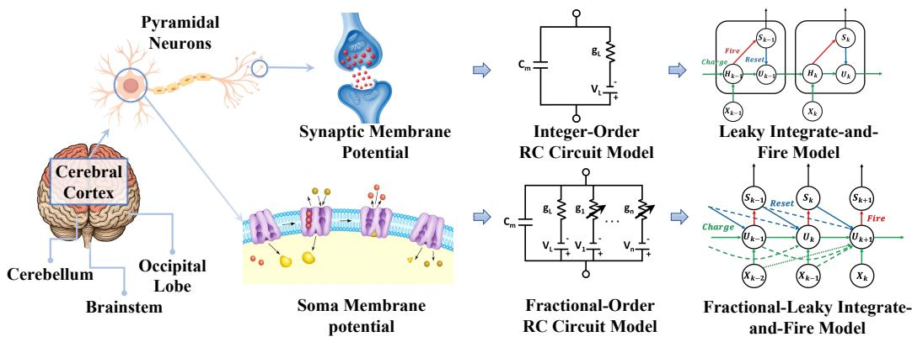  
Figure 1: Comparison of traditional SNN andf-SNN framework.

In this paper, we introduce a generalized fractional-order SNN (f-SNN) framework, which incorporates fractional-order dynamics into the neuronal membrane potential charging. By replacing the first-order ODE neurons traditionally used in SNNs with fractional-order ODEs (f-ODEs),f-SNN naturally captures long-term dependencies that are beyond the capability of standard SNN models, leading to improved performance on tasks that require complex temporal processing. We highlight that our framework is a more general framework which subsumes many traditional SNNs as special instances by setting α = 1. We evaluate f-SNN models on multiple benchmark datasets spanning neuromorphic event-driven vision, graph domains, and static vision fields. Experimental results show that f-SNN models consistently outperform conventional SNN models across various evaluation metrics. Moreover,f-ODEs are robust to perturbations (Sabatier et al., 2015; Kang et al., 2024c); in particular, neuralf-ODEs admit tighter input–output perturbation bounds than integer-order models (Kang et al., 2024c). Building on this, an additional advantage of our proposed f-SNN framework is its superior robustness under input perturbations. These findings underscore the practical advantages of integrating fractional-order dynamics into SNNs and point to the broader applicability of our f-SNN in real-world scenarios.

Main contributions. Our objective in this paper is to formulate a generalized fractional-order SNN framework. Our key contributions are summarized as follows:

• We propose an f-SNN framework that integrates f-ODEs into SNNs to naturally capture longterm dependencies using the fractional-order operator $\mathrm { d } ^ { \alpha } / \mathrm { d } t ^ { \alpha }$ . This framework generalizes the traditional class of integer-order SNNs that use IF, LIF neuron dynamics, and their variants, subsuming them as a special case by setting $\alpha = 1$

• We establish fundamental theoretical distinctions between f-SNNs and traditional SNNs, proving that fractional-order dynamics confer three key advantages: persistent memory through power-law relaxation, irreducibility to finite classical ensembles, and enhanced robustness to perturbations.

• We underscore the compatibility off-SNN, emphasizing its ability to be seamlessly integrated to augment the performance of many existing SNNs by using non-integer α with various neural network architectures like convolutional neural networks (CNN), Transformer, ResNet, and multilayer perceptron (MLP) (Vaswani et al., 2017; LeCun et al., 1989; He et al., 2016; Zhou et al., 2022). We provide the community with an open-source, out-of-the-box toolbox to support the f-SNN framework (see supplementary code and Section E). We conduct extensive experiments on multiple datasets, demonstrating that f-SNN consistently improves traditional SNNs, achieving superior accuracy, comparable energy efficiency, and enhanced robustness.

## 2 PRELIMINARIES

This section reviews essential concepts. We introduce fractional calculus, which generalizes derivatives to non-integer orders and naturally models systems with memory or non-local dependencies. We then outline conventional SNN approaches based on discretizing integer-order neuron dynamics.

## 2.1 FRACTIONAL CALCULUS

When examining a function $y ( t )$ with respect to (w.r.t.) time $t ,$ we traditionally define the first-order derivative as the instantaneous rate of change: ${ \frac { \mathrm { d } y ( t ) } { \mathrm { d } t } } : = $ lim $\Delta t  0 \xrightarrow { y ( t + \Delta t ) - y ( t ) }$ . The literature offers various definitions of fractional derivatives (Tarasov, 2011). We focus on the Caputo fractional derivative $D ^ { \alpha }$ for the formal definition of $\mathrm { d } ^ { \alpha } / \mathrm { d } t ^ { \alpha }$ (Diethelm, 2010), which has the notable advantage of allowing initial conditions to be specified in the same manner as integer-order differential equations.

Definition 1 (Caputo Fractional Derivative). For afunction y(t) defined over an interval $[ 0 , T ] ,$ , its Caputofractional derivative oforder $\alpha \in ( 0 , 1 ]$ is given by (Diethelm, 2010):

$$
D ^ {\alpha} y (t) := \frac {1}{\Gamma (1 - \alpha)} \int_ {0} ^ {t} (t - \tau) ^ {- \alpha} y ^ {\prime} (\tau) \mathrm{d} \tau ,\tag{1}
$$

where $y ^ { \prime } ( \tau )$ denotes thefirst-order derivative of $\dot { \boldsymbol y } ( \tau )$

Remark 1. (1) reveals that thefractional derivative incorporates the historical states ofthefunction through a power-weighted integral term when $\alpha \in ( 0 , 1 )$ , highlighting its memory dependence. As $\alpha  1$ , the Caputo derivative $D ^ { \alpha }$ converges to the standard first-order derivative ${ \frac { \bar { \mathrm { d } } } { \mathrm { d } t } } .$ . Indeed, letting $F ( s ) = { \mathcal { L } } \{ f ( t ) \}$ be Laplace transform of $f ( t ) _ { }$ , we have ${ \mathcal { L } } \left\{ D _ { t } ^ { \alpha } f ( t ) \right\} = s ^ { \alpha } F ( s ) { \stackrel { \sim } { - } } s ^ { \alpha - 1 } f ( 0 )$ (Diethelm, 2010)[Theorem 7.1]. As $\alpha  1$ , the Laplace transform ofthe Caputofractional derivative converges to that of the traditional first-order derivative $s F ( s ) \mathrm { ~ } - \mathrm { ~ } f ( 0 )$ . Consequently, for $\alpha = 1$ 1 $D ^ { 1 } y = y ^ { \prime }$ , uniquely determined via the inverse Laplace transform (Cohen, 2007).

A first-order ODE and its fractional extension with Caputo derivative can be written as

$$
\text { integer - order   ODE: } \frac {\mathrm{d} y (t)}{\mathrm{d} t} = f (t, y (t));\tag{2}
$$

$$
\text { fractional - order   ODE: } D ^ {\alpha} y (t) = f (t, y (t)),\tag{3}
$$

where $f$ defines the system dynamics and initial condition $y ( 0 ) = y _ { 0 }$ is specified in both cases.

## 2.2 INTEGER-ORDER SPIKING NEURON AND SNN

Existing SNN models predominantly describe spiking neuronal membrane-potential dynamics using discretized first-order ODEs with derivative d/dt, including the widely adopted IF and LIF dynamics (Stein, 1967) and variants with adaptive membrane time constants or threshold adaptation/learning (Koch et al., 1996; Zhang et al., 2025; Bellec et al., 2018; Benda, 2021). We present only standard IF and LIF in the main paper as a showcase; however, SNNs based on other neuron variants can be encapsulated and extended within ourf-SNN framework.

IF and LIF neurons. Let $U ( t )$ denote the membrane potential, $I _ { \mathrm { i n } } ( t )$ the input current, $R > 0$ the membrane resistance, and $\tau > 0$ the membrane time constant. The standard subthreshold dynamics of IF and LIF are described by the following first-order ODEs:

$$
\text { IF   neuron   dynamics: } \tau \frac {\mathrm{d} U (t)}{\mathrm{d} t} = R I _ {\text { in }} (t),\tag{4}
$$

$$
\text { LIF   neuron   dynamics: } \tau \frac {\mathrm{d} U (t)}{\mathrm{d} t} = - U (t) + R I _ {\text { in }} (t).\tag{5}
$$

A spike $S ( t )$ is emitted when $U ( t ^ { - } )$ crosses the threshold $\theta , { \mathrm { i . e . , } } S ( t ) = H \left( U ( t ^ { - } ) - \theta \right)$ , where $H ( \cdot )$ denotes the Heaviside step function. Upon spiking, one uses either a soft reset or a hard reset:

$$
1) \text {   soft   reset:   } U (t ^ {+}) \leftarrow U (t ^ {-}) - \theta ; \quad \text { or } \quad 2) \text {   hard   reset:   } U (t ^ {+}) \leftarrow U _ {\text { reset }}.\tag{6}
$$

Traditional SNN based on standard IF and LIF neuron dynamics. Many SNNs are based on the neuron dynamics described in (4) and (5). In the simplest case, the forward Euler method is employed to solve a first-order ODE (2). Let $h > 0$ be the discretization step size, $t _ { k } = k h , N = T / h$ , and let $y _ { k }$ denote the numerical approximation of $y ( t _ { k } )$ . We have

$$
y _ {k + 1} = y _ {k} + h f (t _ {k}, y _ {k}), \quad k = 0, 1, \dots , N - 1.\tag{7}
$$

To make this time-varying solution compatible with sequence-based neural network models, we discretize time and treat k as the sequence index. Correspondingly, applying (7) to (4) and (5) yields

$$
\text { IF   (discrete): } U _ {k + 1} = U _ {k} + \frac {h R}{\tau} I _ {\text { in }, k}, \quad \text { LIF   (discrete): } U _ {k + 1} = \left(1 - \frac {h}{\tau}\right) U _ {k} + \frac {h R}{\tau} I _ {\text { in }, k}.\tag{8}
$$

In practice, the factor is often absorbed into learnable synaptic weights, and the input current is represented as $X _ { k } ^ { ( \Phi ) }$ , where $X _ { k } ^ { ( \Phi ) }$ the presynaptic spike vector or feature map (e.g., produced by Convolution, MLP, ResNet, or Transformer) with Φ denoting the learnable synaptic weights of those layers. For simplicity, in the following we omit Φ and denote it simply by $X _ { k } ^ { \bar { ( } ) } .$ . For computational efficiency, we adopt the common simplifications $h = 1$ and $R = 1$ , and define $\begin{array} { r } { \beta : = 1 - \frac { 1 } { \tau } } \end{array}$ . Together with spiking and reset mechanisms, we have the following iterations:

$$
\begin{array}{c} \text {IF charge:} U _ {k} = U _ {k - 1} + X _ {k}, \\ \text {or LIF charge:} U _ {k} = \beta U _ {k - 1} + X _ {k}. \\ \text {spike:} S _ {k} = H (U _ {k} - \theta), \\ \text {reset: (soft)} U _ {k} \leftarrow U _ {k} - \theta   S _ {k} \text {or (hard)} U _ {k} \leftarrow (1 - S _ {k})   U _ {k} + S _ {k}   U _ {\text {reset}}. \end{array}\tag{9}
$$

Spikes are discrete and non-differentiable, which complicates SNN training. The surrogate-gradient method (Wu et al., 2018) keeps the hard spike $H ( \bar { U _ { \mathbf { \Gamma } } } - \theta )$ in the forward pass but uses a smooth surrogate for its derivative in backpropagation. A common choice is a threshold-shifted sigmoid, $\begin{array} { r } { H ( U ^ { ' } - \theta ) \approx \sigma ( U ) = \frac { 1 } { 1 + e ^ { \theta - U } } } \end{array}$ which preserves discrete firing while enabling gradient flow.

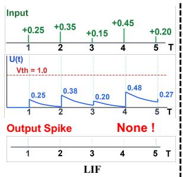

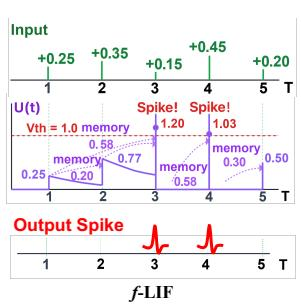

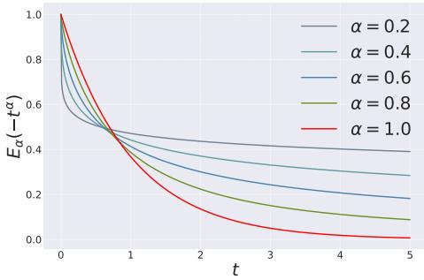  
Figure 2: SNN vsf-SNN dynamics. In $f { \mathrm { - } } S \mathbf { N N s } .$ , past mem- For $\alpha = 1$ , LIF shows fast exponential decay brane potentials influence the current state via a power-law $\begin{array} { r } { ( E _ { 1 } ( - t ) = e ^ { - t } ) ; } \end{array}$ ; for $0 < \alpha < \bar { 1 } , f \mathrm { - } \mathrm { L I F }$ exhibits memory kernel; traditional integer-order SNNs lack this. slow algebraic decay, reflecting memory.

$$
E _ {\alpha} (- t ^ {\alpha})
$$

## 3 f -SNN FRAMEWORK

We present thef-SNN framework in this section using fractional spiking neuronal dynamics based on f-ODEs, which generalize integer-order neuron dynamics such as standard IF and LIF neurons (4)

and (5). To make the time-varying solution compatible with neural network models, we follow the procedure in Section 2.2 to discretize time and enable iterations. Section 3.2 reveals the fundamental distinctions between f-SNNs and traditional SNNs through analysis of their long-time behavior, demonstrating howf-SNNs provide persistent memory via power-law relaxation, irreducibility to finite classical ensembles, and enhanced robustness.

## 3.1 FRAMEWORK

Traditional integer-order SNNs, as discussed in Section 2.2, model subthreshold spiking neuronal dynamics with first-order ODEs; (4) and (5) are representative examples. In our general f-SNN framework, we replace the first-order derivative d/dt with the generalized Caputo fractional derivative $D ^ { \alpha }$ of order $\alpha \in ( 0 , 1 ]$ . Since IF and LIF are the dominant neuron models used in traditional SNNs, we present only their fractional extensions in the main paper as a showcase; however, many other neuron variants can likewise be encapsulated and extended within ourf-SNN framework. We begin with the presentation off-IF andf-LIF neurons.

f-IF andf-LIF neurons. The fractional dynamics of IF and LIF are described by the $f { \mathrm { - O D E s } }$

$$
f \text {-IF neuron dynamics:} \tau D ^ {\alpha} U (t) = R I _ {\mathrm{in}} (t),\tag{10}
$$

$$
f \text {-LIF neuron dynamics:} \tau D ^ {\alpha} U (t) = - U (t) + R I _ {\mathrm{in}} (t).\tag{11}
$$

Spike generation and reset follow the same rules as in the integer-order case: $S ( t ) = H \left( U \left( t ^ { - } \right) - \theta \right)$ These dynamics naturally introduce a memory effect: the current membrane potential depends on the entire history of the potential because, by definition (see (1)), the Caputo derivative includes an integral over past states. Biologically, such modeling is consistent with observed spike-frequency adaptation and long-memory behaviors (Teka et al., 2014; Ha & Cheong, 2017). The order α controls the degree of adaptation—α = 1 recovers the standard IF/LIF models, while $\alpha < 1$ induces powerlaw memory and increased temporal correlations in the potential trace. Fractional neuron models are also observed to produce reliable spike patterns under noisy input (Baker et al., 2024).

f-SNN based on f-IF and f-LIF neuron dynamics: In Section 2.2, we apply the forward Euler method to discretize standard IF/LIF dynamics and obtain integer-order SNNs. Here, thef-IF (10) andf-LIF (11) neurons exhibit fractional dynamics that belong to thef-ODE class (3). We instead use the fractional Adams–Bashforth–Moulton (ABM) predictor discretization (Diethelm et al., 2004) to achieve this goal. Using the same time grid as above, $t _ { k } = k h$ with $N = T / h$ and step size $h > 0$ and letting $y _ { k }$ denote the numerical approximation of $y \left( t _ { k } \right)$ , we obtain

$$
y _ {k} = y _ {0} + \frac {1}{\Gamma (\alpha)} \sum_ {j = 0} ^ {k - 1} \mu_ {j, k} f (t _ {j}, y _ {j}), \quad k = 0, 1, \dots , N - 1.\tag{12}
$$

where the weight coefficients are $\begin{array} { r } { \mu _ { j , k } = \frac { h ^ { \alpha } } { \alpha } [ ( k - j ) ^ { \alpha } - ( k - 1 - j ) ^ { \alpha } ] } \end{array}$ . This formulation makes the memory effect explicit by incorporating weighted contributions from all past function evaluations, reflecting the nonlocal nature of $D ^ { \alpha }$ . When $\alpha = 1$ , (12) reduces exactly to the Euler method (7), further highlighting the compatibility between the f-SNN framework and traditional SNNs.

Applying (12) to (10) and (11) yields the fractional discrete updates:

$$
\begin{array}{l} f \text {-IF (discrete):} U _ {k} = U _ {0} + \frac {R}{\tau   \Gamma (\alpha)} \sum_ {j = 0} ^ {k - 1} \mu_ {j, k}   I _ {\text { in }, j}, \\ f \text {-LIF (discrete):} U _ {k} = U _ {0} + \frac {1}{\tau   \Gamma (\alpha)} \sum_ {j = 0} ^ {k - 1} \mu_ {j, k} \left(- U _ {j} + R   I _ {\text { in }, j}\right). \end{array}
$$

Similar to Section 2.2, we denote the general input as $X _ { k }$ , where $X _ { k }$ is the presynaptic spike vector or feature map produced by various architectures (convolution, MLP, ResNet, Transformer, etc.). For simplicity, we set $h = 1$ and $R = 1$ . Note that $\begin{array} { r } { \beta = 1 - \frac { 1 } { \tau } } \end{array}$ in IF/LIF neurons does not apply to the fractional cases. Instead, one obtains a history-convolution with a stationary power-law kernel. Define $\begin{array} { r } { c _ { m } ^ { ( \alpha ) } = \frac { 1 } { \tau ^ { \alpha } \alpha \Gamma ( \alpha ) } \big [ ( m + 1 ) ^ { \alpha } - m ^ { \alpha } \big ] } \end{array}$ . Then the fractional iterations (charge-spike-reset) are as follows:

$$
f \text {-IF charge:} U _ {k} = U _ {0} + \sum_ {m = 0} ^ {k - 1} c _ {m} ^ {(\alpha)} X _ {k - m},
$$

$$
\text { or   } f \text {-LIF   charge:   } U _ {k} = U _ {0} + \sum_ {m = 0} ^ {k - 1} c _ {m} ^ {(\alpha)} \left(- U _ {k - 1 - m} + X _ {k - m}\right).\tag{13}
$$

$$
\text { spike:   } S _ {k} = H (U _ {k} - \theta)  ,
$$

reset: (soft) $U _ { k } \gets U _ { k } - \theta S _ { k }$ or (hard) $U _ { k } \gets ( 1 - S _ { k } ) U _ { k } + S _ { k } U _ { \mathrm { r e s e t } }$

Here, spiking and reset are applied at each step as usual. We follow the literature to use the surrogategradient method (Wu et al., 2018) to train f-SNN that keeps the hard spike $H ( U - \theta )$ in the forward pass but uses a smooth surrogate for its derivative in backpropagation.

Remark 2. Note that $c _ { m } ^ { ( \alpha ) }$ is causal and decays as a power law, explicitly encoding memory. The profile $o f c _ { m } ^ { ( \alpha ) }$ is visualized in Fig. 8, highlighting the algebraic decay characteristic of fractional order systems. When $\alpha  1$ , we have $c _ { m } ^ { ( 1 ) } = 1 / \tau$ for all m (a constant kernel), and taking first differences of (13) recovers the Euler recursions (9). For efficiency, we may leverage the shortmemory approximation principle (Deng, 2007; Podlubny, 1999) and truncate the sum in (13) to $\scriptstyle \sum _ { m = \operatorname* { m a x } ( 0 , k - M ) } ^ { k - 1 } ,$ i.e., a sliding memory window offixed width M. Withfast (FFT-based) convolution, the full-memory case can be computed in O(N log N) time (Mathieu et al., 2013), while the truncated window yields O(NM). Thefull model complexity is summarized in Section C.5.

## 3.2 THEORETICAL ANALYSIS

In this section, we theoretically distinguish thef-SNN framework from traditional SNNs. We begin by proving that f-SNNs exhibit a persistent memory effect characterized by genuine long-range temporal dependence. We then demonstrate that the dynamics off-SNNs generally cannot be exactly realized by any finite-dimensional linear system of integer-order modes, thereby establishing that fractional-order systems strictly exceed the expressive capacity of integer-order models. Finally, we prove thatf-SNNs demonstrate superior robustness to input perturbations.

We first analyze membrane-potential relaxation under constant input, showing how distant past inputs keep influencing the present. For intuition, we focus on the LIF and f-LIF neurons and use the continuous formulations (5) and (11):

Proposition 1 (Long-memory Behavior). Under a constant current input $I _ { \mathrm { i n } } ( t ) \equiv I _ { \mathrm { c } } ,$ assume the input is small enough that no spiking occurs over the interval considered (subthreshold regime). Then the solutions to the LIF (5) and thef-LIF dynamics (11) are

$$
U ^ {\mathrm{LIF}} (t) = R I _ {\mathrm{c}} + \left[ U _ {0} - R I _ {\mathrm{c}} \right] e ^ {- t / \tau},\tag{14}
$$

$$
U ^ {f \text {-LIF}} (t) = R I _ {\mathrm{c}} + \left(U _ {0} - R I _ {\mathrm{c}}\right) E _ {\alpha} (- t ^ {\alpha} / \tau),\tag{15}
$$

respectively, where $\begin{array} { r } { E _ { \alpha } ( z ) = \sum _ { k = 0 } ^ { \infty } \frac { z ^ { k } } { \Gamma ( \alpha k + 1 ) } } \end{array}$ is the Mittag–Leffler function Diethelm (2010). Key properties include:

• When $\alpha = 1 , E _ { 1 } ( - t / \tau ) = e ^ { - t / \tau }$ , which is the classical exponential relaxation (Eshraghian et al., 2023a)[Eq(2)].

• For $0 < \alpha < 1 , E _ { \alpha }$ exhibits (i) initial stretched–exponential decay and (ii) a power-law tailfor large t:

$$
E _ {\alpha} \left(- \frac {t ^ {\alpha}}{\tau^ {\alpha}}\right) \sim \frac {\tau^ {\alpha}}{\Gamma (1 - \alpha) t ^ {\alpha}} \quad a s t \to \infty ,
$$

These behaviors are visualized in $F i g . 3$

Remark 3. While both LIF andf-LIF converge to the same steady state, Proposition 1 highlights fundamentally different relaxation behaviors. The LIF uses an integer-order derivative (Markovian dynamics;future evolution depends only on the current state) and shows exponential relaxation $e ^ { - t / \tau }$ characteristic of memoryless processes. In contrast, the f-LIF employs the fractional derivative

$D ^ { \alpha }$ , which is inherently non-Markovian, incorporating a power-weighted integral over the entire past history. This is reflected in the Mittag–Leffler relaxation $E _ { \alpha } ( - t ^ { \alpha } / \tau ) .$ : for $0 \textless \alpha \textless 1$ , its power-law tail $( \sim t ^ { - \alpha } )$ indicates that past inputs decay algebraically slow rather than exponentially fast, creating a persistent memory influence. This slow decay means that inputs from the distant past continue to influence the current membrane potential, enabling thef-LIF to naturally capture long-term temporal correlations.

Thef-SNN framework demonstrates superior robustness compared to traditional SNNs. Empirical studies show thatf-LIF neurons maintain reliable spike patterns under noisy inputs (Teka et al., 2014). Here, we provide theoretical robustness guarantees.

Theorem 1 (Robustness off-SNN). Consider afractionalf-IF neuron governed by the dynamics $\tau D ^ { \alpha } U ( t ) = R I _ { \mathrm { i n } } ( t )$ with fractional order $0 ~ < ~ \alpha ~ <$ 1 and initial condition $U _ { 0 } = 0$ . Under a constant input current $I _ { \mathrm { c } }$ subject to an additive perturbation ϵ (where $| \epsilon | \ll I _ { \mathrm { c } } ) ,$ , the system exhibits thefollowing robustness properties relative to the classical integer-order model $( \alpha = 1 ) .$

• Membrane Potential Robustness: The membrane potential deviation due to perturbation evolves as:

$$
\Delta U ^ {f - \mathrm{IF}} (t) = \frac {R \epsilon}{\tau \Gamma (\alpha + 1)} t ^ {\alpha} \quad (s u b - l i n e a r g r o w t h)\tag{16}
$$

$$
\Delta U ^ {\mathrm{IF}} (t) = \frac {R \epsilon}{\tau} t \quad (\text { linear   growth })\tag{17}
$$

For $0 \textless \alpha \textless 1$ , the fractional-order dynamics suppress long-term perturbation accumulation through sub-linear temporal scaling.

• Spike Timing Sensitivity: For small perturbations $\epsilon \ll I _ { \mathrm { c } } ,$ the spike time shift magnitude scales as:

$$
\left| \Delta t _ {s} ^ {f - \mathrm{IF}} \right| \propto \epsilon \cdot I _ {\mathrm{c}} ^ {- (1 + 1 / \alpha)}\tag{18}
$$

$$
| \Delta t _ {s} ^ {\mathrm{IF}} | \propto \epsilon \cdot I _ {\mathrm{c}} ^ {- 2}\tag{19}
$$

Since $( 1 + 1 / \alpha ) > 2 f o r 0 < \alpha < 1$ , the fractional-order model exhibits enhanced spike timing robustness for high input currents.

Remark 4. The fractional-order dynamics yield distinct robustness advantages. The sub-linear perturbation growth $t ^ { \alpha } \left( \alpha < 1 \right)$ significantly suppresses long-term accumulation compared to linear growth in classical models. Additionally, the enhanced spike timing stability becomes crucial for precise temporal coding applications (Bohte et al., 2002; Booij & tat Nguyen, 2005; Rathi et al., 2019). These properties make f-SNNs particularly suitedfor tasks requiring sustained accuracy and temporal precision under varying input conditions, as confirmed by our experiments in Section 4.

We now establish that f-SNNs possess computational capabilities that fundamentally exceed those of finite integer-order systems:

Theorem 2 (Irreducibility off-IF Dynamics to Finite Classic LIF Ensembles). Let $U ^ { f - \mathrm { I F } }$ denote the trajectory ofaf-IF neuron with order $\alpha \in ( 0 , 1 )$ . There exist nofinite integer W, weights $\left\{ \phi _ { i } \right\} _ { i = 1 } ^ { W }$ and leak factors $\left\{ \beta _ { i } \right\} _ { i = 1 } ^ { W }$ such that the following holds:

$$
\hat {U} _ {k} = \sum_ {i = 1} ^ {W} \phi_ {i} U _ {k} ^ {\mathrm{LIF} (\beta_ {i})} \equiv U _ {k} ^ {f - \mathrm{IF}} \quad \forall k.
$$

for general input $X _ { k }$ . The impulse response error of the approximation is $O ( k ^ { \alpha - 1 } )$ , decaying algebraically slowly. The f-IF neuron is mathematically equivalent to an aggregate of integer-order LIF neurons ifand only $i f W \to \infty$ , specifically as an integral over a continuum of leak factors.

Remark 5 (Implications for Expressive Power). A single f-IF neuron represents a continuum of timescales that would require infinitely many integer-order SNN units for exact equivalence. The slow $O ( k ^ { \alpha - 1 } )$ ) error decay confirms that such long-range dependencies are inaccessible to finite-order models. Moreover, this expressivity advantage is not “washed out” by the spiking nonlinearity: in Corollary 1, we show thatf-IF spike trains encode temporal information that nofinite LIF ensemble can reproduce, even under arbitrary Boolean combinations.

## 4 EXPERIMENTS

In this section, we evaluate f-SNNs on benchmarks spanning neuromorphic event-driven vision and graph domains. Additional experiments on static datasets, including CIFAR10, CIFAR100, and ImageNet, are detailed in Section D.2.3. Across metrics, f-SNNs consistently outperform conventional SNNs. In particular, fractional adaptations of established SNN architectures within the f-SNN framework achieve higher accuracy, comparable energy efficiency, and improved robustness to noise, supporting f-SNNs as an effective extension of traditional SNNs. Importantly, our primary aim is not to achieve state-of-the-art (SOTA) results, but to demonstrate that the generalizedf-SNN framework can improve existing integer-order SNNs. To our knowledge, SOTA performance on very large datasets typically requires substantial computational resources, even within the energy-efficient SNN community. We focus on fair comparisons by replacing the integer-order IF/LIF modules (9) in traditional SNNs with thef-IF/f-LIF modules (13) from ourf-SNN framework.

## 4.1 NEUROMORPHIC DATA CLASSIFICATION TASKS

Neuromorphic data are event-driven and exhibit strong spatiotemporal correlations. SNNs, with their natural adaptability to spatiotemporal data (e.g., dynamic event processing and sparse coding), efficiently model these correlations. Therefore, we conducted a series of experiments on neuromorphic datasets. Our experiments primarily focus on the following key evaluation aspects: (1) Classification performance, and (2) Robustness of the proposed f-SNN model. More ablation studies and experimental details will be presented in the Section D.

Table 1: Neuromorphic data classification results in terms of classification accuracy (%) on the multiple datasets. The best results are boldfaced, while the runner-ups are underlined.

<table><tr><td>Datasets/Configs</td><td>Architecture</td><td>Timesteps</td><td>LIF(SpikingJelly)</td><td>LIF(snnTorch)</td><td>f-LIF(f-SNN)</td></tr><tr><td>N-MNIST</td><td>CNN-based</td><td>16</td><td>0.9927</td><td>0.9908</td><td>0.9948</td></tr><tr><td>DVS-Lip</td><td>CNN-based</td><td>16</td><td>0.4241</td><td>0.3271</td><td>0.4342</td></tr><tr><td>DVS128Gesture</td><td>CNN-basedTransformer-based</td><td>16</td><td>0.93400.9514</td><td>0.88990.8715</td><td>0.94800.9583</td></tr><tr><td>N-Caltech101</td><td>CNN-basedTransformer-based</td><td>16</td><td>0.66820.7263</td><td>0.65210.6567</td><td>0.70260.7627</td></tr><tr><td>HarDVS</td><td>CNN-basedTransformer-based</td><td>8</td><td>0.46100.4520</td><td>0.46260.4614</td><td>0.47660.4723</td></tr></table>

Dataset & Baselines. We conduct comprehensive evaluations of the proposed f-SNN framework on neuromorphic datasets including N-MNIST (Orchard et al., 2015), DVS128Gesture (Amir et al., 2017), N-Caltech101 (Orchard et al., 2015), DVS-Lip (Tan et al., 2022), and the large-scale dataset HarDVS (Wang et al., 2024). The dataset details and experiment setting details are provided in Appendix Section D.

Experimental Setup. For the N-MNIST dataset, we set the batch size to 512, the number of time steps T to 16, and train for 100 epochs using the Adam optimizer. For other neuromorphic datasets, we follow the standard preprocessing pipeline of the SpikingJelly framework to convert event data into frame representations. For time step configuration, DVS128Gesture, N-Caltech101, and DVS-Lip are set to 16 time steps, while HarDVS is set to 8 time steps due to the large data size. N-Caltech101 is split into training and test sets with an 8:2 ratio. These datasets use a batch size of 16, with input dimensions uniformly adjusted to 128×128 pixels. We train for 200 epochs using the Adam optimizer.

Classification Performance. Inf-SNN, we have a hyperparameter α indicating the fractional order, which gives the model an additional degree of freedom to capture richer temporal patterns. During experiments, the optimal α is obtained via hyperparameter tuning. The experimental results on neuromorphic datasets are shown in Table 1. We conduct comprehensive comparisons between f-SNN and baseline models. The experimental results demonstrate that under the same network configurations, regardless of whether CNN or Transformer architectures are employed, f-SNN significantly and consistently outperforms baseline networks implemented based on SpikingJelly and snnTorch frameworks. These results validate the effectiveness and superiority of the proposed f-SNN method in terms of classification performance. This is because f-SNN captures long-term

(SJ)

dependencies in membrane potential via fractional dynamics, enabling richer temporal patterns than traditional models.

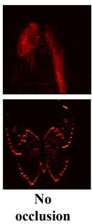

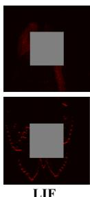

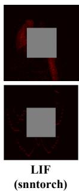  
Figure 5: Feature map visualizations of LIF and f-LIF in occluded block scenarios.

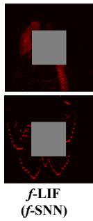

Robustness Analysis. We further validate the robustness advantages off-SNN. We comprehensively test the model’s stability from five dimensions: noise injection, occlude block, temporal truncate, temporal jitter, and discard frame. Detailed experimental settings are provided in Section D.1.3. The experimental results are shown in Fig. 4, where f-SNN significantly outperforms baseline methods across all five robustness testing dimensions. Particularly under highintensity noise injection and occlude block interference conditions, our method demonstrates exceptional anti-interference capability and stability. To more intuitively validate our viewpoint, we visualize the shallow feature maps with occlude blocks, with results shown in Fig. 5. Our

f-SNN model can better capture object features under occlusion conditions compared to the other two models. This advantage is primarily attributed to the inherent characteristics of thef-LIF neuron module, which can generate more stable and reliable spike patterns, thereby effectively enhancing the noise suppression capability and robustness performance of the entire network. We refer the readers to the discussions in Section 3.1. Evaluation details are provided in the appendix.

## 4.2 GRAPH LEARNING TASKS.

For graph learning tasks, our experiments focus on the following key aspects of evaluation: (1) Node Classification performance; (2) Energy Efficiency; and (3) the Robustness of the proposed f-SNN framework.

Dataset & Baselines. We conduct experiments on two mainstream GNN methods: SGCN (Zhu et al., 2022), and DRSGNN (Zhao et al., 2024), using several commonly used graph learning datasets. Specifically, Node classification is performed with SGCN and DRSGNN on Cora (McCallum et al., 2000), Citeseer (Sen et al., 2008), Pubmed (Wang et al., 2019), Photo, Computers, and ogbn-arxiv (Hu et al., 2020). To ensure fairness, we only replace the integer-order neuron modules in the baseline models with our proposed modules, i.e., the LIF neuron (9) in SGCN and DRSGNN are changed to ourf-LIF iterations (13). This ensures our fractional adaptations have the same trainable parameters as the baselines; only the charging phases (9) and (13) differ. Dataset details are provided in Section D.

Experiment Setup. For node classification tasks based on SGCN and DRSGNN, we use Poisson spike encoding. The number of timesteps N is set to 100, and the batch size to 32. Datasets are split into training/validation/test with ratios $0 . 7 / 0 . 2 / 0 . 1$ . For DRSGNN experiments, the positional-encoding dimension is 32, using Laplacian (LSPE) (Dwivedi et al., 2023) or random-walk (RWPE) (Dwivedi et al., 2021) encodings. All experiments are run independently 20 times; we report the mean and standard deviation. Other experimental details are included in Section D.

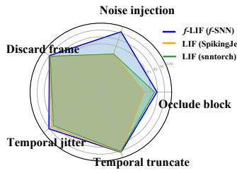

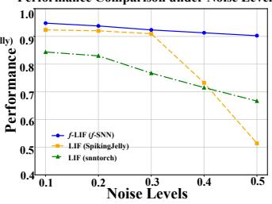

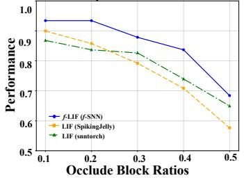  
Figure 4: Robustness comparison between the proposedf-SNN and two integer-order baselines (LIF in SpikingJelly and LIF in snnTorch). Left: Radar chart aggregating five corruption types (larger is better): Gaussian noise injection, center occlude block, temporal truncate, temporal jitter, and discard frame. Middle: Performance vs. noise level (x-axis: Gaussian noise std). Right: Performance vs. occlusion ratio (x-axis: area ratio of the center block). Thef-LIF (f-SNN) shows consistently higher performance and slower degradation under all corruption types.

Table 2: Node classification results in terms of classification accuracy (%) on multiple datasets. The best results are boldfaced, while the runner-ups are underlined. Standard deviations are provided as subscripts. The choice off-SNNs’ parameter α will be shown in Table 4.

<table><tr><td>Methods</td><td>Cora</td><td>Citeseer</td><td>Pubmed</td><td>Photo</td><td>Computers</td><td>ogbn-arxiv</td></tr><tr><td>SGCN (SJ)</td><td> $81.81_{\pm 0.69}$ </td><td> $71.83_{\pm 0.23}$ </td><td> $86.79_{\pm 0.32}$ </td><td> $87.72_{\pm 0.25}$ </td><td> $70.86_{\pm 0.24}$ </td><td> $50.26_{\pm 0.11}$ </td></tr><tr><td>SGCN (snnTorch)</td><td> $83.12_{\pm 1.41}$ </td><td> $71.68_{\pm 0.95}$ </td><td> $59.82_{\pm 1.07}$ </td><td> $83.34_{\pm 0.89}$ </td><td> $74.88_{\pm 0.87}$ </td><td> $21.55_{\pm 0.13}$ </td></tr><tr><td>SGCN (f-SNN)</td><td> $\underline{88.08}_{\pm 0.58}$ </td><td> $\underline{73.80}_{\pm 0.51}$ </td><td> $\underline{87.17}_{\pm 0.28}$ </td><td> $\underline{92.49}_{\pm 0.32}$ </td><td> $\underline{89.12}_{\pm 0.21}$ </td><td> $\underline{51.10}_{\pm 0.14}$ </td></tr><tr><td>DRSGNN (SJ)</td><td> $\underline{83.30}_{\pm 0.64}$ </td><td> $\underline{72.72}_{\pm 0.24}$ </td><td> $\underline{87.13}_{\pm 0.34}$ </td><td> $\underline{88.31}_{\pm 0.15}$ </td><td> $76.55_{\pm 0.17}$ </td><td> $\underline{50.13}_{\pm 0.14}$ </td></tr><tr><td>DRSGNN (snnTorch)</td><td> $\underline{80.98}_{\pm 1.71}$ </td><td> $\underline{68.00}_{\pm 0.69}$ </td><td> $\underline{59.56}_{\pm 1.05}$ </td><td> $\underline{82.28}_{\pm 0.93}$ </td><td> $\underline{76.78}_{\pm 0.81}$ </td><td> $\underline{28.46}_{\pm 0.25}$ </td></tr><tr><td>DRSGNN (f-SNN)</td><td> $\underline{88.51}_{\pm 0.62}$ </td><td> $\underline{75.11}_{\pm 0.45}$ </td><td> $\underline{87.29}_{\pm 0.32}$ </td><td> $\underline{91.93}_{\pm 0.20}$ </td><td> $\underline{88.77}_{\pm 0.20}$ </td><td> $\underline{53.13}_{\pm 0.13}$ </td></tr></table>

Node Classification Performance. The experimental results based on SGCN and DRSGNN are shown in Table 2. Our fractional extension of SGCN and DRSGNN outperforms the original versions implemented with traditional integer-order SNN toolboxes (SpikingJelly or snnTorch) in terms of accuracy. These results highlight the clear advantage of our method in improving model accuracy.

Energy Consumption Analysis. Following (Yao et al., 2023a; 2024), we compare the energy consumption of f-SNN and the integer-order method (SpikingJelly). Fig. 6a shows that f-SNN achieves higher accuracy and significantly lower energy consumption across datasets, demonstrating its superior energy efficiency. Details will be discussed in the Section D.3.

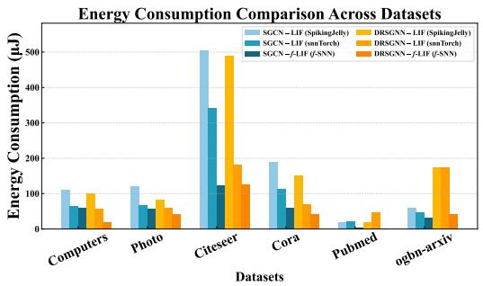  
(a) Comparison of energy consumption between integerorder SpikingJelly and snnTorch baselines and our f-SNN framework.

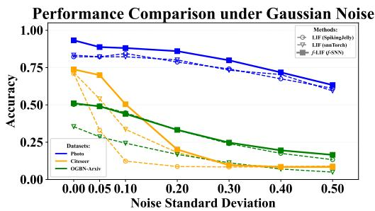  
(b) Robustness test for SGCN.  
Figure 6: Energy consumption and robustness evaluation. Best zoomed on screen.

Robustness Test. We further validate the robustness advantage off-SNN. Specifically, we randomly add Gaussian noise (Hall, 1994) of varying intensities to the spike signals input to the network to evaluate the robustness of spiking graph neural networks under different noise conditions. The experimental results are shown in Fig. 6b.

## 5 CONCLUSION

In this work, we introduced a new f-SNN framework, which extends traditional SNNs by replacing first-order ODEs with fractional-order ODEs to capture the non-Markovian characteristics and long-term dependencies observed in biological neurons. Our experiments demonstrate that f-SNNs consistently outperform integer-order SNNs across neuromorphic vision and graph benchmarks, achieving higher accuracy, comparable energy efficiency, and improved noise robustness. The accom panying open-source toolbox facilitates adoption of thef-SNN framework across diverse architectures and applications. These results establishf-SNNs as a promising extension of traditional SNNs, offering a mathematically rigorous and biologically plausible approach to enhancing neuromorphic computing capabilities.