## ABSTRACT

Transformers have achieved great success across a wide range of applications, yet the theoretical foundations underlying their success remain largely unexplored. To demystify the strong capacities of transformers applied to versatile scenarios and tasks, we theoretically investigate utilizing transformers as students to learn from a class of teacher models. Specifically, the teacher models covered in our analysis encompass convolution layers with average pooling, graph convolution layers, and various classic statistical learning models, including a variant of sparse token selection models (Sanford et al., 2023; Wang et al., 2024) and group-sparse linear predictors (Zhang et al., 2025c). When learning from this class of teacher models, we prove that one-layer transformers with simplified “position-only” attention can successfully recover all parameter blocks of the teacher models, thus achieving the optimal population loss. Building upon the efficient mimicry of trained transformers towards teacher models, we further demonstrate that they can generalize well to a broad class of out-of-distribution data under mild assumptions. The key in our analysis is to identify a fundamental bilinear structure shared by various learning tasks, which enables us to establish unified learning guarantees for these tasks when treating them as teachers for transformers.

## 1 INTRODUCTION

Transformers have rapidly become a cornerstone in the field of modern machine learning, demonstrating exceptional performance and versatility across diverse applications, including natural language processing (Vaswani et al., 2017; Radford et al., 2019; OpenAI, 2023; Devlin, 2018; Achiam et al., 2023; Vig & Belinkov, 2019; Touvron et al., 2023; Ouyang et al., 2022), computer vision (Dosovitskiy et al., 2020; Rao et al., 2021; Liu et al., 2021; Yuan et al., 2021; Zhang et al., 2025b;a), and reinforcement learning (Jumper et al., 2021; Chen et al., 2021; Janner et al., 2021; Reed et al., 2022). Acting as a critical component of transformers, self-attention layers assign varying weights to features based on their relevance and embedded positional context. This design principle intuitively endows transformers with a remarkable ability to efficiently process both structural and positional information, as empirically validated in numerous applications mentioned above. However, despite their profound impact, the theoretical foundations of transformers, especially the mechanisms of how self-attention layers work, remain largely unexplored due to their intricate architecture.

Some recent theoretical studies aimed to understand transformers by analyzing their capability in solving specific tasks (Zhang et al., 2024b; Frei & Vardi, 2025; Jelassi et al., 2022; Wang et al., 2024; Zhang et al., 2025c). Specifically, Zhang et al. (2024b) considered in-context linear regression, and demonstrated that for Gaussian data, a one-layer transformer with linear attention can perform linear regression based on the context, and then apply the obtained linear model to make predictions on query data. Later, Frei & Vardi (2025) further extended the setting to in-context linear classification, and studied the in-context benign overfitting phenomena when learning from Gaussian mixture data. Jelassi et al. (2022) investigated a specific data model based on the ’patch association’ assumption, where an image is divided into disjoint partitions, and patches within the same partition share similar characteristics. They theoretically demonstrate that a one-layer vision transformer (ViT) can extract the spatial structure among patches when trained on this data model. Wang et al. (2024) studied a problem termed ’sparse token selections’, where the objective is to find the average of several tokens from specific positions, and they proved that a one-layer transformer can successfully solve this task on Gaussian data when the positional information of the target positions is embedded into the query token. Zhang et al. (2025c) considered a group sparse linear model, where the input’s label is determined by features from only one of several input feature groups (the ’label-relevant group’), and prove that for Gaussian data, a trained one-layer transformer can achieve correct classification by identifying features from this group and learning the ground truth linear classifier. Although these works have offered valuable insights into the underlying mechanisms of transformers, their focus on very specific learning tasks limits the generality of their theoretical findings, prompting us to seek a unified theoretical framework accounting for a broader range of examples.

Despite the distinctions among the model simplifications and technical assumptions, we observe that for some learning tasks discussed above, including a variant of the sparse token selection (Sanford et al., 2023; Wang et al., 2024), the group sparse linear predictors (Zhang et al., 2025c), and patch association (Jelassi et al., 2022), their true responses are essentially given by bilinear functions. In addition, the linear attention studied in Zhang et al. (2024a); Frei & Vardi (2025) inherently constitutes a bilinear structure with respect to its parameter matrices. Motivated by this observation, we define a general class of “teacher models” that employ a bilinear structure, and investigate the setting where one-layer transformers are trained as “student” models under the supervision from these teacher models. Our framework not only encompasses the learning tasks from prior works but also covers popular, previously unexplored models such as convolution layers with average pooling and graph convolution layers on regular graphs. The purpose of our analysis is to establish unified theoretical guarantees for one-layer transformer models trained with gradient descent in learning this class of teacher models.

The major contributions of this work are as follows.

• We theoretically demonstrate that one-layer transformers trained via gradient descent can effectively recover a general class of teacher models. To support this claim, we establish a tight convergence guarantee for the population loss, with matching upper and lower bounds at the rate of $\Theta \Big ( \frac { 1 } { T } \Big )$ , where T is the iteration number of gradient descent. We also establish out-of-distribution generalization bounds for the obtained transformer model and demonstrate that it is competitive with the teacher model over a wide rage of learning tasks. This illustrates the effectiveness and robustness of transformer models in learning from diverse teacher models.

• Our theory covers a wide range of learning tasks, including some settings closely related to those studied in (Wang et al., 2024; Zhang et al., 2025c). Specifically, Wang et al. (2024) study a type of “sparse token selection” task where the goal is to select a number of target input tokens specified by a query column, and then output their average. Assuming that the positions of the target tokens are randomly generated for each data point, the authors establish an ${ \bar { \mathcal { O } } } \left( { \frac { \log ( T ) } { T } } \right)$ convergence rate. In comparison, our setting covers a slightly different task where the target positions are fixed but are not explicitly fed to model, and our theoretical results demonstrate a tight $\Theta \left( { \frac { 1 } { T } } \right)$ convergence rate with matching upper and lower bounds. Compared with Zhang et al. (2025c) which focuses on group sparse linear classification, our work provides complementary results and demonstrates that transformers can also perform efficient group sparse linear regression.

• Experiments on both synthetic and real-world data are conducted to verify our theory through the examples of learning a convolution layer with average pooling, learning a graph convolution layer with regular graphs, learning sparse token selection, and group sparse linear regression. In all experiments, we can observe clear loss convergence and parameter convergence that match our theory. The experiments setup does not exactly match our theory assumptions, indicating that our theory conclusions can also hold in more practical training setups and real-data learning tasks.

## 2 PROBLEM SETUP

In this section, we introduce the definition of the teacher models we study in this paper, and give various examples covered in our definition.

We consider a teacher model with an input matrix $\mathbf { X } \in \mathbb { R } ^ { d \times D }$ of the following form:

$$
f ^ {*} (\mathbf {X}) = \sigma (\mathbf {V} ^ {*} \mathbf {X S} ^ {*}),\tag{2.1}
$$

where $\mathbf { V } ^ { * } \in \mathbb { R } ^ { M \times d }$ is the ground truth value matrix of the teacher model, and $\mathbf { S } ^ { \ast } \in \mathbb { R } ^ { D \times D }$ is the ground truth softmax scores. Each column of $\mathbf { S } ^ { \ast }$ has $K$ non-zero entries equivalent to $\textstyle { \frac { 1 } { K } }$ . In addition, $\sigma ( \cdot )$ denotes either an identity map, ReLU, or Leaky ReLU activation function.

The teacher models defined in $( 2 . 1 )$ can cover a general class of functions (models). Notably, when $K = 1$ and all the non-zero entries of $\mathbf { S } ^ { \ast }$ appear on its diagonal, $\mathbf { S } ^ { \ast }$ equals the identity matrix $\mathbf { I } _ { D }$ . In this scenario, the teacher model $( 2 . 1 )$ reduces to $f ^ { * } ( \mathbf { X } ) = \overline { { \sigma } } ( \mathbf { V } ^ { * } \mathbf { X } )$ , and can be seen as a single-layer neural network. Besides this naive example where $\mathbf { S } ^ { * } = \mathbf { I } _ { D }$ , the teacher model (2.1) also includes some other common architectures and models. We discuss these examples in the following.

Example 2.1 (Single convolutional layer with average pooling). We consider a convolution layer consisting of convolution operation, average pooling, and then the activation function. The convolution operation is essentially performed by taking inner products between each convolution kernel with each patch of the input. We consider a convolution layer with M (vectorized) kernels $\mathbf { v } _ { 1 } ^ { * } , \ldots , \mathbf { v } _ { M } ^ { * }$ , and consider an input consisting of $D$ (vectorized) patches $\mathbf { x } _ { 1 } , \ldots , \mathbf { x } _ { D }$ . In average pooling, we take averages according to a partition of the D patches. Let $\mathcal { G } = \{ g _ { 1 } , g _ { 2 } , \dotsc \dotsc , g _ { J } \}$ be a disjoint partition of $[ D ]$ , forming $J$ pooling groups with $\bar { | g _ { j } | } = K , j \in [ J ]$ . Then the final output of this convolution layer corresponding to the j-th pooling group and the m-th kernel is given as

$$
\sigma \bigg (\frac {1}{K} \sum_ {i \in g _ {j}} \langle \mathbf {v} _ {m} ^ {*}, \mathbf {x} _ {i} \rangle \bigg) = \sigma (\mathbf {v} _ {m} ^ {* \top} \mathbf {X 1} _ {g _ {j}} / K), m \in [ M ], j \in [ J ],
$$

where $\sigma$ is the activation function, $\mathbf { X } = [ \mathbf { x } _ { 1 } , \mathbf { x } _ { 2 } , \ldots , \mathbf { x } _ { D } ] \in \mathbb { R } ^ { d \times D }$ , and $\mathbf { 1 } _ { g _ { i } } \in \mathbb { R } ^ { D }$ is a vector whose entries are 1 for indices in $g _ { j }$ , and 0 otherwise. Then, we can summarize all outputs into a matrix:

$$
F _ {\mathrm{CNN}} (\mathbf {X}) = \sigma \left(\mathbf {V} ^ {*} \mathbf {X} \left[ \mathbf {1} _ {g _ {1}}, \dots , \mathbf {1} _ {g _ {J}} \right] / K\right) \in \mathbb {R} ^ {M \times J},
$$

where $\mathbf { V } ^ { * } = [ \mathbf { v } _ { 1 } ^ { * } , \ldots , \mathbf { v } _ { M } ^ { * } ] ^ { \top } \in \mathbb { R } ^ { M \times d }$ . Here, the j-th column of $F _ { \mathrm { C N N } } ( \mathbf { X } )$ corresponds to the output of $j -$ -th pooling group $g _ { j }$ , and m-th row of $F _ { \mathrm { C N N } } ( { \bf \bar { X } } )$ corresponds to the output of m-th kernel $\mathbf { v } _ { m } ^ { * }$

To formulate the convolution layer above as a teacher for transformers, we further specify the correspondence between each input patch and the output. The teacher model can then be given as $f ^ { * } \hat { ( } \mathbf { X } ) = \sigma ( \mathbf { V } ^ { * } \mathbf { X } \mathbf { S } ^ { * } )$ , where the i-th column of $\mathbf { S } ^ { \ast }$ is ${ \bf 1 } _ { g _ { j } } / K$ , with $g _ { j }$ being the group containing i.

Example 2.2 (Single graph convolution layer on a regular graph). Let $\mathbf { A } \in \mathbb { R } ^ { D \times D }$ be an adjacency matrix of a degree- $( \bar { K _ { \mathbf { \alpha } } } - \bar { 1 } )$ regular graph with $D$ nodes, and $\mathbf { \dot { X } } = [ \mathbf { x } _ { 1 } , \mathbf { x } _ { 2 } , \ldots , \mathbf { x } _ { D } ] \in \mathbb { R } ^ { d \times \check { D } }$ be the feature matrix of this graph, with each column $\mathbf { x } _ { i }$ (for all i in $[ D ] )$ representing the d-dimensional feature vector of the i-th node. A typical single graph convolution layer (Kipf & Welling, 2017), with weight matrix $\mathbf { V } ^ { \ast } \in \mathbb { R } ^ { M \times d }$ is defined as

$$
F _ {\mathrm{GCN}} (\mathbf {X}) = \sigma \left(\mathbf {V} ^ {*} \widetilde {\mathbf {X D}} ^ {- 1 / 2} \widetilde {\mathbf {A}} \widetilde {\mathbf {D}} ^ {- 1 / 2}\right),\tag{2.2}
$$

where $\widetilde { \mathbf { A } } = \mathbf { A } + \mathbf { I } _ { D }$ is the adjacency matrix with self-connections added, and $\widetilde { \bf D }$ is the diagonal degree matrix of $\widetilde { \bf A }$ . For a degree- $( K - 1 )$ regular graph, each node has $K - 1$ neighbors, and hence each column of $\widetilde { \bf A }$ contains $K$ ones and $D - K$ zeroes, and $\tilde { \mathbf { D } } = \boldsymbol { K } \cdot \mathbf { I } _ { D }$ . Therefore, the GCN defined in (2.2) is equivalent to a $f ^ { * } ( \mathbf { X } ) = \sigma ( \mathbf { V } ^ { * } \mathbf { X } \mathbf { S } ^ { * } )$ with $\mathbf { V } ^ { * }$ and $\mathbf { S } ^ { * } = \widetilde { \mathbf { D } } ^ { - 1 / 2 } \widetilde { \mathbf { A } } \widetilde { \mathbf { D } } ^ { - 1 / 2 } = \widetilde { \mathbf { A } } / K$

Example 2.3 (Sparse token selection model (Sanford et al., 2023; Wang et al., 2024)). Let $\mathbf { X } =$ $\left[ \mathbf { x } _ { 1 } , \mathbf { x } _ { 2 } ^ { \hat { } } , \ldots , \mathbf { x } _ { D } \right] ^ { \hat { } } \in \mathbb { R } ^ { d \times D }$ be a sequence of d-dimensional tokens. Given a K-element index set $g \subseteq [ D ]$ , the goal of sparse token selection is to (i) select the tokens $\mathbf { x } _ { i } , i \in \mathfrak { g } _ $ , and (ii) take an average over the selected tokens. Hence, we can define

$$
F _ {\mathrm{STS}} (\mathbf {X}) = \frac {1}{K} \sum_ {i \in g} \mathbf {x} _ {i}.
$$

Then it is clear that $f ^ { * } ( \mathbf { X } ) = \sigma ( \mathbf { V } ^ { * } \mathbf { X } \mathbf { S } ^ { * } )$ with $\mathbf { V } ^ { * } = \mathbf { I } _ { D } , \mathbf { S } ^ { * } = \frac { 1 } { K } \mathbf { 1 } _ { g } \cdot \mathbf { 1 } _ { D } ^ { \top } \in \mathbb { R } ^ { D \times D }$ , and $\sigma ( \cdot )$ being identity map is equivalent to $F _ { \mathrm { S T S } } ( { \bf X } )$ , except that $f ^ { * } ( \mathbf { X } )$ duplicates the output D times to match the output dimensions of a self-attention layer.

Remark 2.4. The “sparse token selection” task defined in Example 2.3 is slightly different from that studied in Wang et al. (2024). In our setting, the index set $g$ is specified as part of the learning objective and therefore remains fixed across all inputs. In contrast, Wang et al. (2024) considers a setting in which $g$ is provided as part of the input, allowing target positions to vary between different inputs. We remark that despite the difference, our learning task and that studied in Wang et al. (2024) essentially lead to very similar learning dynamics. We provide a detailed discussion in Appendix C.

Example 2.5 (Group sparse linear predictors (Zhang et al., 2025c)). Let ${ \bf X } = [ { \bf x } _ { 1 } , { \bf x } _ { 2 } , \ldots , { \bf x } _ { D } ] \in$ $\mathbb { R } ^ { d \times D }$ be a sequence of d-dimensional feature groups. For a given ground truth vector $\mathbf { v } ^ { * } \in \bar { \mathbb { R } } ^ { d }$ and a label-relevant group index $i ^ { * }$ , the group sparse linear predictor will first search for the variable group $\mathbf { x } _ { i }$ corresponding to the label-relevant index $i ^ { * }$ , and then calculate its inner product with the ground truth vector $\mathbf { v } ^ { * }$ . Hence, we define

$$
F _ {\mathrm{GSLP}} = \langle \mathbf {v} ^ {*}, \mathbf {x} _ {i ^ {*}} \rangle .
$$

Consider a teacher model $f ^ { * } ( \mathbf { X } ) = \sigma ( \mathbf { V } ^ { * } \mathbf { X } \mathbf { S } ^ { * } )$ with $\mathbf { V } ^ { * } = \mathbf { v } ^ { * }$ by reducing M to $\mathbf { l } , \mathbf { S } ^ { * } = \mathbf { e } _ { i ^ { * } } \cdot \mathbf { 1 } _ { D } ^ { \top } ,$ and $\sigma ( \cdot )$ being identity map. Then similar to Example $2 . 3 , f ^ { * } ( \mathbf { X } )$ duplicates the output of $F _ { \mathrm { G S L P } } ( { \bar { \mathbf { X } } } )$ for $D$ times, and is essentially equivalent to $F _ { \mathrm { G S L P } } ( \mathbf { X } )$ .

One-layer transformer. A one-layer transformer model Vaswani et al. (2017); Dosovitskiy et al. (2020) can be defined as

$$
\operatorname{TF} (\mathbf {Z}; \mathbf {W} _ {V}; \mathbf {W} _ {Q}; \mathbf {W} _ {K}) = \sigma \left(\mathbf {W} _ {V} \mathbf {Z} \mathcal {S} \left(\frac {\mathbf {Z} ^ {\top} \mathbf {W} _ {K} ^ {\top} \mathbf {W} _ {Q} \mathbf {Z}}{\sqrt {D}}\right)\right).\tag{2.3}
$$

In this formulation, Z represents the input matrix of the transformers, obtained by concatenating the original feature matrix $\bar { \bf X }$ with its positional encoding matrix $\mathbf { P } _ { }$ . Specifically, for each column xi (for all $i \in [ D ] )$ ) of the original feature matrix X, we concatenate it with the position encoding vector $\mathbf { p } _ { i }$ , which contains the positional information of this specific index, to generate a column of $\mathbf { Z }$ as $\mathbf { \bar { z } } _ { i } = [ \mathbf { x } _ { i } ^ { \top } , \mathbf { p } _ { i } ^ { \top } ] ^ { \top }$ . The complete positional encoding matrix is denoted as $\mathbf { P } = [ \mathbf { p } _ { 1 } , \mathbf { p } _ { 2 } , \ldots , \mathbf { p } _ { D } ]$ and we employ an orthogonal design for $\mathbf { P } _ { \mathrm { : } }$ , meaning that P is an $D \times D$ orthogonal matrix. For analytical convenience, the practice of concatenating feature and positional encoding matrices has been widely adopted in recent theoretical studies (Nichani et al., 2024; Bai et al., 2024; Wang et al., 2024; Zhang et al., 2025c). Furthermore, $\mathcal { S } ( \cdot ) : \mathrm { ~ } \mathrm { ~ } \mathrm { ~ } \mathrm { R } ^ { D \times D } \mapsto \mathbb { R } ^ { D \times D }$ denotes the softmax operator, which implements the softmax function column-wisely, and $\mathbf { W } _ { V } , \mathbf { W } _ { Q } , \mathbf { W } _ { K }$ represent the value matrix, query matrix, and key matrix in a typical self-attention structure, respectively. Instead of studying the typical structure (2.3), we consider a moderately simplified “position-only” softmax self-attention in this paper, which is defined as

$$
\operatorname{TF} (\mathbf {Z}; \mathbf {W} _ {V}; \mathbf {W} _ {K Q}) = \sigma \left(\mathbf {W} _ {V} \mathbf {X} \mathcal {S} \left(\frac {\mathbf {P} ^ {\top} \mathbf {W} _ {K Q} \mathbf {P}}{\sqrt {D}}\right)\right) = \sigma (\mathbf {W} _ {V} \mathbf {X} \mathbf {S}) \in \mathbb {R} ^ {M \times D}.\tag{2.4}
$$

In comparison with the typical single-head self-attention architecture (2.3), our model (2.4) is simplified from the following two aspects: (i). We re-parameterize the original key matrix ${ \bf W } _ { K }$ and query matrix $\mathbf { W } _ { Q }$ into one trainable key-query matrix ${ \bf W } _ { K Q }$ , which has been adopted in almost theoretical studies regarding the optimization of transformers (Tian et al., 2023; Zhang et al., 2024b; Wang et al., 2024; Huang et al., 2024; Frei & Vardi, 2025; Zhang et al., 2025c; He et al., 2025a). (ii). We employ an architecture such that only the positional encoding matrix P is involved when calculating the softmax attention score, and the value matrix $\mathbf { W } _ { V }$ only interacts with the feature matrix X. To illustrate a rationale for this design, consider the following one-layer transformers:

$$
\widetilde {\mathrm{TF}} (\mathbf {Z}; \widetilde {\mathbf {W}} _ {V}; \widetilde {\mathbf {W}} _ {K Q}) = \sigma \left(\widetilde {\mathbf {W}} _ {V} \mathbf {Z} \mathcal {S} \left(\frac {\mathbf {Z} ^ {\top} \widetilde {\mathbf {W}} _ {K Q} \mathbf {Z}}{\sqrt {D}}\right)\right),\tag{2.5}
$$

where the entire input matrix Z is involved in both the calculation of attention score and interactions with the value matrix. Empirical observations (illustrated in Figure 1) reveal that when the transformer model $\widetilde { \mathrm { T F } }$ in (2.5) is used to learn a teacher model $f ^ { * }$ in (2.1), substantial training predominantly occurs in the left block of $\breve { \mathbf { W } } _ { V }$ and the ‘bottom-right’ block of $\bar { \mathbf { W } } _ { K Q }$ . These actively trained blocks map to $\mathbf { W } _ { V }$ and ${ \bf W } _ { K Q }$ respectively in our model (2.4), while other parameter blocks of $\widetilde { \mathrm { T F } }$ exhibit negligible changes from their initial values. Consequently, our model (2.4) can be considered essentially equivalent to the transformer model TF if these rarely updated blocks withinf $\widetilde { \mathbf { W } } _ { V }$ and $\widetilde { \mathbf { W } } _ { K Q }$ are fixed to zero. This strategy of fixing certain transformer parameters during training is widely adopted in the theoretical studies on the optimization of transformers (Wu et al., 2023; Tarzanagh et al., 2023a; Huang et al., 2024; Sakamoto & Sato, 2024; Frei & Vardi, 2025; He et al., 2025a), and analogous “position-only” attention structures are also adopted in Jelassi et al. (2022); Wang et al. (2024).

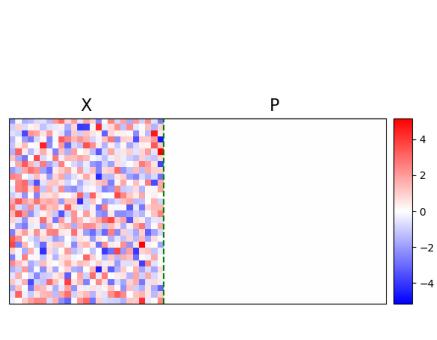  
(a) Heatmap of $\widetilde { \mathbf { W } } _ { V }$

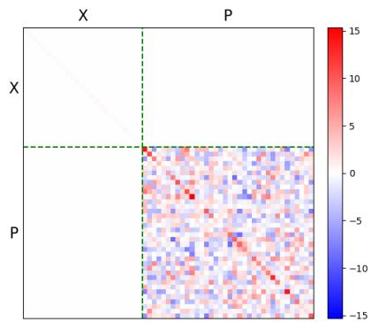  
(b) Heatmap of $\widetilde { \mathbf { W } } _ { K Q }$  
Figure 1: Visualization of parameter matrices for the transformer TF in (2.5), obtained after trainingf to learn the teacher model $f ^ { * }$ and achieving loss convergence. The formal illustration of the loss function and training algorithm is provided in the next section.

## 3 MAIN RESULTS

In this section, we demonstrate our theoretical conclusions of utilizing a one-layer transformer (2.4) to learn a given teacher model $f ^ { * }$ in (2.1). For a teacher model $f ^ { * }$ parameterized with the ground truth value matrix $\mathbf { V } ^ { * }$ and ground truth softmax scores $\mathbf { S } ^ { \ast }$ , the observed label Y for an input matrix X is assumed to be generated as:

$$
\mathbf {Y} = f ^ {*} (\mathbf {X}) + \mathcal {E} = \sigma (\mathbf {V} ^ {*} \mathbf {X} \mathbf {S} ^ {*}) + \mathcal {E} \in \mathbb {R} ^ {M \times D},\tag{3.1}
$$

where $\mathcal { E } \in \mathbb { R } ^ { M \times D }$ is a noise matrix independent of X and following a zero-mean distribution. To train a one-layer transformer (2.4), we consider the population mean squared error as the objective loss function. Specifically, given an input-label pair (X, Y), the loss function is defined as

$$
\mathcal {L} (\mathbf {W} _ {V}; \mathbf {W} _ {K Q}) = \frac {1}{2} \mathbb {E} _ {\mathbf {X}, \mathbf {Y}} \left[ \| \mathbf {Y} - \operatorname{TF} (\mathbf {Z}; \mathbf {W} _ {V}; \mathbf {W} _ {K Q}) \| _ {F} ^ {2} \right].\tag{3.2}
$$

Here, each column of X is assumed to independently follow the standard Gaussian distribution during the training stage of (2.4), i.e. $\mathbf { x } _ { i } \overset { \mathrm { i . i . d } } { \sim } \mathcal { N } ( 0 , \mathbf { I } _ { d } )$ for all $i \in [ D ]$ ]. Due to the variance introduced by the noise component $\mathcal { E } .$ , even the loss of the ground truth model $f ^ { * }$ has an irreducible term, and we denote this term as the optimal loss, i.e.

$$
\mathcal {L} _ {\mathbf {o p t}} = \frac {1}{2} \mathbb {E} _ {\mathbf {X}, \mathbf {Y}} \left[ \| \mathbf {Y} - f ^ {*} (\mathbf {X}) \| _ {F} ^ {2} \right] = \frac {1}{2} \mathbb {E} \left[ \| \mathcal {E} \| _ {F} ^ {2} \right].
$$

To evaluate the performance of one-layer transformer with different $\mathbf { W } _ { V }$ and ${ \bf W } _ { K Q }$ , we consider the excess loss defined as: $\mathcal { L } ( \mathbf { W } _ { V } ; \mathbf { W } _ { K Q } ) - \mathcal { L } _ { \mathbf { o p t } }$ . While the choice population loss implicitly suggests an infinite training data set—a scenario not feasible in practice—it significantly simplifies the technical challenges of conducting a rigorous optimization analysis for transformer models. This approach enables us to focus on the global optimization trajectories, and has been adopted in most of the recent theoretical studies regarding the optimization of transformer models (Zhang et al., 2024b; Huang et al., 2024; Wang et al., 2024; Jelassi et al., 2022; Frei & Vardi, 2025; Zhang et al., 2025c).

For the training objective loss (3.2), we utilize the gradient descent to derive the optimal solutions for the value matrix $\mathbf { W } _ { V }$ , and key-query matrix ${ \bf W } _ { K Q }$ . The iterative rule for $\mathbf { W } _ { V }$ and ${ \bf W } _ { K Q }$ during the learning process can be expressed as

$$
\mathbf {W} _ {V} ^ {(t + 1)} = \mathbf {W} _ {V} ^ {(t)} - \eta \nabla_ {\mathbf {W} _ {V}} \mathcal {L} (\mathbf {W} _ {V} ^ {(t)}; \mathbf {W} _ {K Q} ^ {(t)});\tag{3.3}
$$

$$
\mathbf {W} _ {K Q} ^ {(t + 1)} = \mathbf {W} _ {K Q} ^ {(t)} - \eta \nabla_ {\mathbf {W} _ {K Q}} \mathcal {L} (\mathbf {W} _ {V} ^ {(t)}; \mathbf {W} _ {K Q} ^ {(t)}),\tag{3.4}
$$

where $\eta$ is the learning rate, and the initializations are set as $\mathbf { W } _ { V } ^ { ( 0 ) } , \mathbf { W } _ { K Q } ^ { ( 0 ) } = \mathbf { 0 }$ . Based on these preliminaries, the following theorem characterizes the convergence of gradient descent (3.3) and (3.4).

Theorem 3.1. Suppose that $D \geq \Omega ( \mathrm { p o l y } ( M , K ) ) , \eta \leq \mathcal { O } ( M ^ { - 1 } D ^ { - 5 / 2 } )$ . Under these conditions, there exists $\begin{array} { r } { T ^ { * } = \Theta \bigg ( \frac { K D ^ { 2 } } { \eta \| \mathbf { V } ^ { * } \| _ { F } ^ { 2 } } \bigg ) } \end{array}$ , such that for all $T \geq T ^ { * }$ , the following results hold.

1. The attention scores achieved by the one-layer transformer (2.4), match the ground truth softmax scores of the teacher model: $\mathbf { S } ^ { ( \overline { { T } } ) }$ at the T-th iteration satisfies that

$$
\left\| \mathbf {S} ^ {(T)} - \mathbf {S} ^ {*} \right\| _ {F} = \Theta \left(\frac {D ^ {\frac {5}{2}}}{\| \mathbf {V} ^ {*} \| _ {F} \sqrt {\eta T}}\right).
$$

2. The value matrix $\mathbf { W } _ { V }$ of the one-layer transformer (2.4) aligns with the ground truth value matrix of the teacher model:

$$
\left\| \mathbf {W} _ {V} ^ {(T)} - \mathbf {V} ^ {*} \right\| _ {F} = \Theta \left(D ^ {2} \sqrt {\frac {K}{\eta T}}\right).
$$

3. The excess loss is minimized with matching lower and upper bounds:

$$
\frac {\underline {{c}} K D ^ {4}}{\eta T} \leq \mathcal {L} \left(\mathbf {W} _ {V} ^ {(T)}; \mathbf {W} _ {K Q} ^ {(T)}\right) - \mathcal {L} _ {\mathbf {o p t}} \leq \frac {\bar {c} K D ^ {4}}{\eta T},
$$

where $\underline { { \boldsymbol { c } } }$ and c¯ are two positive constants satisfying $\underline { { c } } \le \bar { c } .$

The proof of Theorem 3.1 is given in Appendix D. Theorem 3.1 demonstrates that a one-layer transformer can learn the teacher model $\bar { f } ^ { * }$ formulated in (2.1) from two aspects. The first and second results show that the one-layer transformer’s value matrix $\mathbf { W } _ { V } ^ { ( T ) }$ and attention scores $\mathbf { S } ^ { ( T ) }$ converge (in the Frobenius norm) to the teacher model’s ground truth value matrix $\mathbf { V } ^ { * }$ and softmax scores $\mathbf { \bar { S } } ^ { * }$ , respectively. This reveals that a one-layer transformer trained via gradient descent can correctly recover the teacher model by accurately learning all its core components. The third result in Theorem 3.1 shows that the training loss will eventually converge to the optimal loss at a rate of $\Theta \Bigl ( \frac { K D ^ { 4 } } { \eta T } \Bigr )$ . The third result characterizes the convergence of the training loss. It shows that the excess loss decreases at the rate $\Theta \Bigl ( \frac { K D ^ { 4 } } { \eta T } \Bigr )$ , with matching upper and lower bounds. We note that the factor $D ^ { 4 }$ indicates that the convergence takes a large number of iterations when the sequence length $D$ is large. However, the matching lower bound in Theorem 3.1 confirms that this rate is already optimal and cannot be improved under our current setting. In fact, this polynomial dependence on $\dot { D }$ originates from two intrinsic aspects of the learning task: (i) Since the loss is the squared Frobenius distance between two $M \times D$ matrices, it necessarily aggregates errors over all $D$ columns, and thus scales proportionally with the sequence length; (ii) The $1 / \sqrt { D }$ factor appears in the gradients of ${ \bf W } _ { K Q }$ and requires ${ \bf W } _ { K Q }$ to scale larger to achieve sufficient convergence, thereby introducing additional factors of D into the convergence rate.

As illustrated in Examples 2.3 and 2.5, our teacher model $f ^ { * }$ encompasses settings that are closely related to the learning tasks studied in Wang et al. (2024) and Zhang et al. (2025c). For the “sparse token selection” problem, Theorem 3.1 establishes a learning guarantee for the setting in which the target index set is fixed by the learning objective and not provided as part of the input. This offers a complementary perspective to the settings in Wang et al. (2024), where the target index set is given as a part of input, and may vary across different data points. Under our setting, Theorem 3.1 yields a tight $\Theta \left( { \frac { \mathrm { i } } { T } } \right)$ convergence rate with matching upper and lower bounds, sharper than the ${ \mathcal { O } } \big (  { \textstyle \frac { \log ( T ) } { T } } \big )$ guarantee obtained under the different problem formulation of Wang et al. (2024) A detailed comparison between the convergence rate is provided in Appendix C. Regarding groupsparse linear prediction, Zhang et al. (2025c) focus primarily on the classification setting, while Theorem 3.1 delivers a complementary result by addressing the regression setting.

The learning guarantee in Theorem 3.1 is established under the assumption that the data input matrix X is Gaussian, and the target response matrix Y is provided by the teacher with noises. Here, we can also study the out-of-distribution (OOD) generalization guarantee of the obtained transformer model on data without such assumptions. Specifically, we consider any feature and response matrices $\widetilde { \mathbf { X } } \in \mathbb { R } ^ { d \times D } , \widetilde { \mathbf { Y } } \in \mathbb { R } ^ { M \times D }$ with bounded second moments, and establish bounds on the OOD loss

$$
\mathcal {L} _ {\mathbf {O O D}} (\mathbf {W} _ {V}; \mathbf {W} _ {K Q}) = \frac {1}{2} \mathbb {E} _ {\widetilde {\mathbf {X}}, \widetilde {\mathbf {Y}}} \big [ \| \widetilde {\mathbf {Y}} - \mathrm{TF} (\widetilde {\mathbf {Z}}; \mathbf {W} _ {V}; \mathbf {W} _ {K Q}) \| _ {F} ^ {2} \big ]
$$

by comparing it with the loss achieved by the teacher model. We have the following theorem.

Theorem 3.2. Suppose that $D \geq \Omega { \bigl ( } \mathrm { p o l y } ( M , K ) { \bigr ) }$ and $\eta \le \mathcal { O } ( M ^ { - 1 } D ^ { - 5 / 2 } )$ . In addition, the OOD input pairs $( \widetilde { \mathbf { X } } , \widetilde { \mathbf { Y } } )$ satisfy the condition that each column $\widetilde { \mathbf { x } } _ { i }$ and $\widetilde { \mathbf { y } } _ { i }$ has finite second moments, i.e. there exists a constant $\xi > 0$ such that $\mathbb { E } [ \| \widetilde { \mathbf { x } } _ { i } \| _ { 2 } ^ { 2 } ] , \mathbb { E } [ \| \widetilde { \mathbf { y } } _ { i } \| _ { 2 } ^ { 2 } ] \le \xi$ for all $i \in [ D ]$ . Then for any $\epsilon > 0$ there exists $\begin{array} { r } { T _ { \epsilon } = \mathcal { O } \big ( \frac { K \bar { D } ^ { 6 } \xi ^ { 2 } \sum _ { m = 1 } ^ { M } \| \mathbf { v } _ { m } ^ { * } \| _ { 2 } ^ { 2 } } { \eta \epsilon ^ { 2 } } \big ) } \end{array}$  such that for any $T > T _ { \epsilon }$ , the OOD loss satisfies that:

$$
\mathcal {L} _ {\mathbf {O O D}} \left(\mathbf {W} _ {V} ^ {(T)}; \mathbf {W} _ {K Q} ^ {(T)}\right) \leq \frac {1}{2} \mathbb {E} \big [ \| \widetilde {\mathbf {Y}} - f ^ {*} (\widetilde {\mathbf {X}}) \| _ {F} ^ {2} \big ] + \epsilon .
$$

Theorem 3.2 requires only the mild assumption that $\widetilde { \mathbf { X } }$ and $\widetilde { \mathbf Y }$ have bounded second moments. Notably, the response matrix $\widetilde { \mathbf Y }$ need not be generated by or correlated with the output of the teacher model $f ^ { * } ( { \widetilde { \mathbf { X } } } )$ . Therefore, the term $\textstyle \frac 1 2 \mathbb { E } \big [ \| \widetilde { \mathbf Y } - f ^ { * } ( \widetilde { \mathbf X } ) \| _ { F } ^ { 2 } \big ]$ measures the teacher model’s $_ { 0 . 0 . 0 }$ . test loss, analogous to the role of $\mathcal { L } _ { \mathrm { o p t } }$ in Theorem 3.1. This shows that the trained transformer’s O.O.D. loss exceeds that of the teacher model by at most ϵ, demonstrating its robustness to distribution shift. In addition, although it is challenging to establishing a matching lower bound for all pairs $( \widetilde { \mathbf { X } } , \widetilde { \mathbf { Y } } )$ like Theorem 3.1, a worst-case $\widetilde { \mathbf Y }$ can be constructed to demonstrate that this upper bound is attainable, thereby validating the tightness of Theorem 3.2. The complete proof of Theorem 3.2 and the worst-case example are provided in Section E.

## 4 EXPERIMENTS

In this section, we present our experimental results. As detailed in Section 2, the teacher model can cover various models, including (i). convolution layer with average pooling, (ii). graph convolution layer on a regular graph, (iii). sparse token selection model, and (iv). group sparse linear predictor. Our experiments also focus on these four cases.

We conduct experiments on both synthetic data and real-world data sets, respectively. For experiments on synthetic data, we follow the exact definitions in Section 2 to build up teacher models $f ^ { * }$ For experiments on real-world datasets, we pre-train a teacher CNN on the MNIST dataset, whose first convolution layer is then served as the teacher model to train the student transformer.

## 4.1 SYNTHETIC DATA EXPERIMENTS

We begin by detailing the common experimental setups on synthetic data. Given parameters d and $D _ { \mathbf { \delta } }$ an fixed orthogonal matrix $\mathbf { P } \in \overset { \bullet } { \mathbb { R } } ^ { D \times D }$ serves as the positional encoding matrix We adopt an online gradient descent algorithm to simulate training over the population loss. At each iteration, we sample a new batch of $N = 1 0 0$ standard $d { \times } D$ Gaussian matrices, i.e. $\{ \mathbf { X } _ { n } \} _ { n = 1 } ^ { N } \subseteq \mathbb { R } ^ { d \times D }$ . For each ${ \bf X } _ { n }$ with $n \in [ N ]$ , its corresponding label ${ \bf Y } _ { n } = f ^ { * } ( { \bf X } _ { n } ) + \mathcal { E } _ { n }$ , where $\mathcal { E } _ { n } \in \overline { { \mathbb { R } } } ^ { M \times D }$ is another independently sampled Gaussian matrix. We concatenate each ${ \bf X } _ { n }$ with the fixed positional encoding matrix P to form $\mathbf { Z } _ { n }$ as the inputs to the transformer Subsequently, a gradient descent update is performed using this batch of $N = 1 0 0$ data pairs $\{ ( \mathbf { Z } _ { n } , \mathbf { Y } _ { n } ) \} _ { n = 1 } ^ { \mathrm { { \Delta N } } }$ . Furthermore, we also generate another batch of $N = 1 0 0$ data pairs $\{ ( \widetilde { \mathbf { Z } } _ { n } , \widetilde { \mathbf { Y } } _ { n } ) \} _ { n = 1 } ^ { N }$ following the almost identical procedure, except that each $\widetilde { \mathbf { X } } _ { n }$ is generated from the exponential distribution. This batch of data pairs $\{ ( \widetilde { \mathbf { Z } } _ { n } , \widetilde { \mathbf { Y } } _ { n } ) \} _ { n = 1 } ^ { N }$ is prepared for calculating the excess OOD loss, defined as $\begin{array} { r } { \mathcal { L } _ { \mathrm { O O D } } - \frac { 1 } { 2 N } \sum _ { n = 1 } ^ { N } | | \widetilde { \mathbf { Y } } _ { n } - f ^ { * } ( \widetilde { \mathbf { X } } _ { n } ) | | _ { F } ^ { 2 } } \end{array}$

In the next, we introduce the distinct settings for different tasks, specifically the ground-truth softmax score matrices $\mathbf { S } ^ { \ast }$ . For the task of learning a convolution layer with average pooling, we set $D \ = \ 3 6$ and $K = 4 ,$ , where the pooling groups are partitioned by aggregating the K neighbor patches into a group. Given this partition of pooling groups, the ground truth softmax score of the teacher model can be formulated into a diagonal block matrix as $\begin{array} { r } { \bar { \bf S ^ { * } } = \frac { 1 } { K } { \mathrm { D i a g } } ( { \bf 1 } _ { K \times K } , \dots , { \bf 1 } _ { K \times K } ) } \end{array}$ with totally $D / K$ blocks. For the task of learning a graph convolution layer, we consider a ’cycle-$\mathrm { \ g r a p h } ^ { \mathrm { * } }$ with $D = 2 0$ nodes, where each node is connected to exactly two other nodes, i.e. the i-th node is connected to its adjacent nodes $( i - 1 )$ and $( i + 1 )$ ). Under this setup, the ground-truth softmax score $\mathbf { S } ^ { \ast }$ is constructed as follows: for each column i, the entries at rows $( i - 1 ) , i$ , and $( i + 1 )$ are set to $1 / K$ with $K = 3 .$ , while all other entries are zero. For both the tasks of learning the sparse token selection model and the group sparse linear predictor, we set the total number of tokens/feature groups $D = 2 0$ , and randomly generate K indices from $[ D ]$ as indices of target tokens/ label-relevant group, where $K = 4$ and 1 respectively. In these two sets of tasks, the rows representing the target tokens/ label-relevant group equal to $\mathrm { i } / K$ , while other rows are filled with 0.

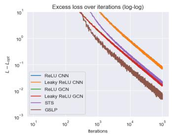  
(a) Excess training loss (log-log)

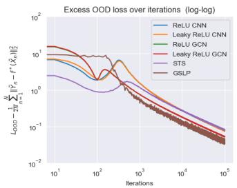  
(b) Excess OOD test loss (log-log)

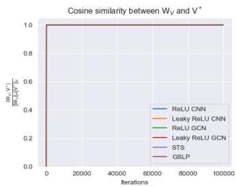  
(c) Cosine similarity

Figure 2: Excess training loss, excess OOD test loss (both in log-log scales), and cosine similarity between the value matrix $\mathbf { W } _ { V }$ of one layer transformer (2.4), and ground truth value matrix $\mathbf { V } ^ { * }$ These results are presented for six experimental sets, which originate from four distinct tasks.

For the task of learning CNN and GCN, we conduct two sets for each with ReLU and Leaky ReLU respectively. Experiment results are given in Figures 2 and 3. Figure $2 ( \mathrm { a } )$ and Figure 2(b) demonstrate the convergence curves for the excess training loss and the excess OOD test loss (both in log-log scales). We can clearly observe that both the excess training loss and the OOD test loss converge to a small value on all six sets of experiments. After initial iterations, the curves for excess training loss appear almost straight with slopes equal $\mathrm { t o } - 1$ , and excess OOD loss curves have approximate $- 0 . 5$ slopes. These observations validate the $\Theta ( 1 / T )$ convergence rate in Theorem 3.1, and $\mathcal { O } ( 1 / \sqrt { T } )$ convergence rate in Theorem 3.2. Figure 2(c) displays the cosine similarity curve between the value matrix $\mathbf { W } _ { V } ^ { ( t ) }$ , and the ground truth value matrix $\mathbf { V } ^ { * }$ . It shows that $\mathbf { W } _ { V } ^ { ( t ) }$ directionally aligns with the ground truth value matrix $\mathbf { V } ^ { * }$ in all six experiments since the very beginning.

Furthermore, Figure 3 provides the heatmaps of the attention scores when the loss converges. Specifically, Figure 3(a) and Figure 3(b) respectively display the attention scores when learning a convolution layer with ReLU and Leaky ReLU. In both figures, the attention scores exhibit a diagonal block matrix pattern, where each diagonal block has approximately equal values 1/4. Figure 3(c) and Figure 3(d) show the attention scores when learning a graph convolution layer on a cycle graph. Specifically, the attention scores show a pattern of a cyclic tridiagonal matrix, with all the significant entries having approximately equal values 1/3. Figure 3(e) and Figure 3(f) show the attention scores when learning a sparse token selection task and group sparse linear predictor. We can observe that only the rows corresponding to the target positions are assigned significant values in both tasks. In summary, all these patterns match the ground truth softmax scores, which are described previously.

## 4.2 REAL DATA EXPERIMENTS

We also conduct experiments on the MNIST dataset. Each image is normalized and resized to $2 7 \times 2 7$ pixels. We train a two-layer CNN with $M = 1 6$ convolution kernels, each having a $3 \times 3$ kernel size. Given the $2 7 \times 2 7$ image dimensions, each image is divided into $D = 8 1$ patches. An average pooling layer with ${ \mathrm { a ~ 3 \times 3 } }$ pooling receptive field $( \mathrm { i . e } K = 9 )$ is additive to the first convolution layer, and then cascaded with activation and a linear layer for classification. This two-layer CNN is trained by minimizing the cross-entropy loss, achieving a moderate test accuracy of about $7 1 \%$ on the test set after 20 epochs. After training of this teacher CNN, its first convolution layer with average pooling is extracted as the teacher model $f ^ { * }$ , with its hidden-layer outputs supervising a one-layer transformer (2.4). The training of the one-layer transformer is still conducted on the MNIST dataset, and the mean-squared loss is employed for optimization.

The experiment results are given in Figure 4 and Figure 5. Figure $4 ( \mathrm { a } )$ displays the training loss curves. We can observe that for both ReLU and Leaky ReLU, the training loss very quickly converges to a small value. Figure 4(b) demonstrates the cosine similarity curve between the value matrix $\mathbf { W } _ { V } ^ { ( t ) }$ of the transformer and the convolution kernel matrix $\mathbf { V } ^ { * }$ of the teacher convolution layer. The similarity rises above 0.9, indicating that the transformer successfully learns the groundtruth value matrix of the teacher model. Furthermore, Figure ${ \mathfrak { I } } ( { \mathfrak { a } } )$ provides the heatmap of the ground truth softmax score derived from the teacher CNN’s average pooling layer. Figure 5(b) and Figure 5(c) respectively present heatmaps of attention scores at convergence for the transformers with ReLU and Leaky ReLU activations. We can observe that both the attention scores achieved by transformers can capture the pattern of the ground truth softmax scores, with notable exceptions in the first and last nine rows in the softmax heatmap. We remark that the failure in learning these rows of ground-truth softmax scores is due to the fact that they correspond to MNIST image patches that are mostly all background (all zero). Figure 5(d) highlights the image regions corresponding to failed-to-learn softmax scores, marked by yellow rectangles. We can see that they are indeed boundary regions and are mostly pure background. Consequently, they offer minimal informative content to the model, explaining why transformers can not attend to these positions. Overall, it is clear that the real-world data experiments corroborate our theory.

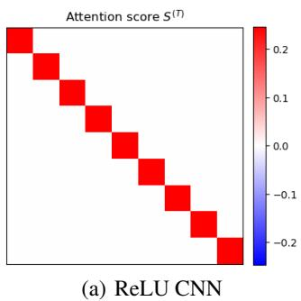

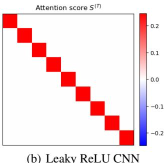  
(b) Leaky ReLU CNN

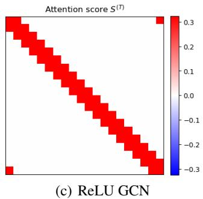

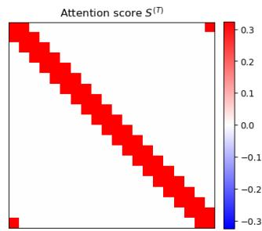  
(d) Leaky ReLU GCN

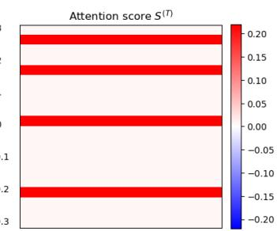  
(e) Sparse token selection

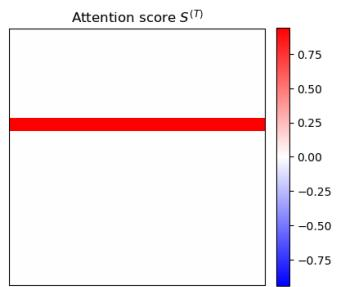  
(f) Group sparse linear predictor

Figure 3: Heatmap of attention score matrix $\mathbf { S } ^ { ( T ) }$ when the training loss converges. The results are presented for six different experimental sets, indicated by the captions of sub-figures.  
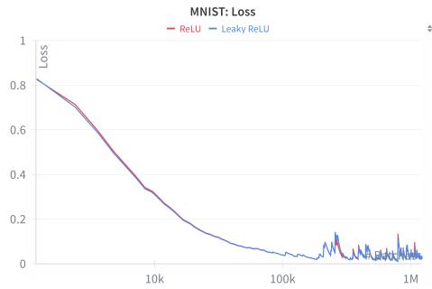

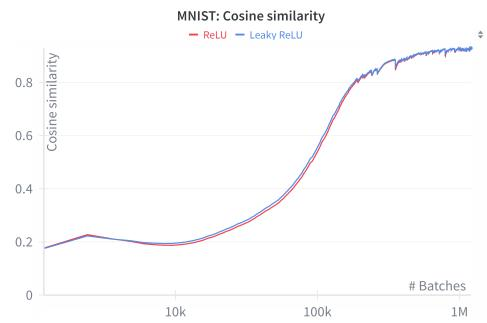  
(a) Training loss on MNIST dataset  
(b) Cosine similarity between parameter matrices  
Figure 4: Training loss and cosine similarity between the value matrix $\mathbf { W } _ { V }$ of the one-layer transformer (2.4), and convolution kernel matrix $\mathbf { V } ^ { * }$ of the pre-trained teacher CNN.

## 5 PROOF SKETCH OF THEOREM 3.1

In this section, we outline the major steps in the proof of Theorem 3.1. For simplicity, here we focus the case where $\sigma ( \cdot )$ is the identity map. More details, including more general choices of $\sigma ( \cdot )$ , are formally proved in Appendix D. The proof consists of three main steps:

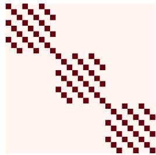  
(a) teacher CNN

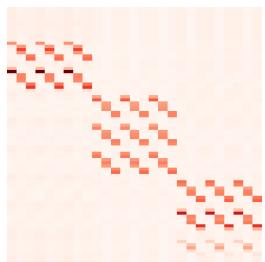  
(b) ReLU result

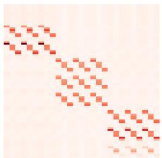  
(c) Leaky ReLU result

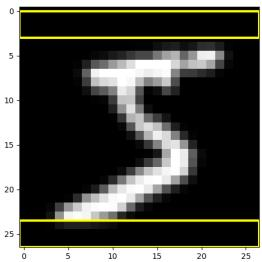  
(d) Example image  
Figure 5: Heatmap of the ground truth softmax scores of average pooling, Heatmap of the attention scores $\mathbf { S } ^ { ( T ) }$ of trained one-layer transformer when loss converges, and an image example in MNIST. Step 1. Structures of $\mathbf { W } _ { V }$ and ${ \bf W } _ { K Q }$ during training. A critical step in our proof is to show that throughout training, the parameter matrices $\bar { \mathbf { W } } _ { V }$ ${ \bf W } _ { K Q }$ preserve the following decompositions:

$$
\mathbf {W} _ {V} ^ {(t)} = C _ {1} (t) \mathbf {V} ^ {*}; \mathbf {W} _ {K Q} ^ {(t)} = C _ {2} (t) \sum_ {i = 1} ^ {D} \sum_ {i ^ {\prime} \in G ^ {i}} \mathbf {p} _ {i ^ {\prime}} \mathbf {p} _ {i} ^ {\top} - C _ {3} (t) \sum_ {i = 1} ^ {D} \sum_ {i ^ {\prime} \notin G ^ {i}} \mathbf {p} _ {i ^ {\prime}} \mathbf {p} _ {i} ^ {\top},
$$

where $G ^ { i }$ denotes the index set of entries of value $1 / K$ in i-th column of $\mathbf { S } ^ { \ast }$ . The details of this conclusion are given in Lemma D.2. Based on the decompositions, we can express $\mathbf { S } ^ { ( t ) }$ as: $\mathbf { S } _ { i ^ { \prime } , i } ^ { ( t ) } = $

$\begin{array} { r } { \frac { 1 } { K + ( D - K ) \exp ( - ( C _ { 2 } ( t ) + C _ { 3 } ( t ) ) / \sqrt { D } ) } \mathrm { ~ i f ~ } i ^ { \prime } \in G ^ { i } ; \mathbf { S } _ { i ^ { \prime } , i } ^ { ( t ) } = \frac { \exp ( - ( C _ { 2 } ( t ) + C _ { 3 } ( t ) ) / \sqrt { D } ) } { K + ( D - K ) \exp ( - ( C _ { 2 } ( t ) + C _ { 3 } ( t ) ) / \sqrt { D } ) } \mathrm { ~ i f ~ } i ^ { \prime } \notin G ^ { i } . } \end{array}$ Comparing these results with the definition of the teacher model $f ^ { * } ( \cdot )$ , we can further observe that

$$
\mathbf {W} _ {V} ^ {(t)} \to \mathbf {V} ^ {*} \Leftrightarrow C _ {1} (t) \to 1; \quad \mathbf {S} ^ {(t)} \to \mathbf {S} ^ {*} \Leftrightarrow C _ {2} (t) + C _ {3} (t) \to \infty .
$$

In this way, the original optimization analysis regarding full matrices $\mathbf { W } _ { V }$ and ${ \bf W } _ { K Q }$ is simplified into studying the updates of three scalars $\bar { C } _ { 1 } ( t ) , \bar { C } _ { 2 } ( t ) , \bar { C } _ { 3 } ( t )$

Step 2. Accurate characterization of convergence that $C _ { 1 } ( t ) \to 1$ and $C _ { 2 } ( t ) + C _ { 3 } ( t ) \to \infty$ The decompositions obtained in Step 1. implies that the coefficients $C _ { 1 } ( t ) , C _ { 2 } ( t ) , C _ { 3 } ( t )$ essentially follow gradient descent starting from zero initialization minimizing the loss

$$
\widetilde {\mathcal {L}} (C _ {1}, C _ {2}, C _ {3}) \propto \frac {D - K}{K} \left[ 1 - \frac {K C _ {1}}{K + (D - K) e ^ {- \frac {C _ {2} + C _ {3}}{\sqrt {D}}}} \right] ^ {2} + C _ {1} ^ {2} \left[ 1 - \frac {K}{K + (D - K) e ^ {- \frac {C _ {2} + C _ {3}}{\sqrt {D}}}} \right] ^ {2},
$$

We remark that this expression of $\widetilde { \mathcal { L } } ( C _ { 1 } , C _ { 2 } , C _ { 3 } )$ corresponds to the special case where $\sigma ( \cdot )$ is the identity map. The general formulation for $\sigma ( \cdot )$ is activation is deferred to Lemma D.2. Then by carefully analyzing the training dynamics, we can show that for sufficiently large $T .$ ,

$$
C _ {1} (T) - 1 = \Theta \left(\frac {D ^ {2} \sqrt {K}}{\| \mathbf {V} ^ {*} \| _ {F} \sqrt {\eta T}}\right), \quad C _ {2} (T) + C _ {3} (T) = \frac {\sqrt {D}}{2} \log \left(\Theta \left(\frac {\eta \| \mathbf {V} ^ {*} \| _ {F} ^ {2}}{K ^ {3} D ^ {2}}\right) T + e ^ {\frac {2}{K \sqrt {D}}}\right).
$$

The details are provided in Lemmas D.2, D.5, D.15, D.18, and F.12.

Step 3. Final convergence results. Combining the convergence rates obtained in Step 2. and the formulations of $\mathbf { S } ^ { ( T ) }$ and $\mathbf { W } _ { V } ^ { ( T ) }$ in Step 1., we can further obtain that $\| \mathbf { S } ^ { ( T ) } - \mathbf { S } ^ { \ast } \| _ { F } , \| \mathbf { W } _ { V } ^ { ( T ) } -$ $\begin{array} { r } { { \bf V } ^ { * } \| _ { F } = \Theta \big ( \frac { 1 } { \sqrt { T } } \big ) } \end{array}$ . Under mean-squared loss, the $\Theta \big ( \textstyle { \frac { 1 } { \sqrt { T } } } \big )$ convergence of the matrices $\mathbf { S } ^ { ( t ) }$ and $\mathbf { V } ^ { ( t ) }$ directly suggests that loss will decay at the rate of $\Theta { \left( { \frac { 1 } { T } } \right) }$ , which finishes the proof.

## 6 CONCLUSIONS AND LIMITATIONS

In this paper, we provide the theoretical guarantee that a one-layer transformer can learn a class of teacher models, covering a wide range of common models in machine learning. Specifically, we establish a tight convergence bound at the rate of $\Theta \left( { \frac { 1 } { T } } \right)$ for the population loss. We also establish out-of-distribution generalization bounds for the obtained transformer model, demonstrating its robustness. To empirically support our findings, we conduct experiments on both synthetic data and real data, and all results align with our theoretical conclusion. Our current theory focuses on onelayer models, and we make certain simplifications and assumptions on the model and data, which present a limitation. We believe establishing teacher-student learning guarantees for more complex models and under milder assumptions is an interesting and promising further work direction.