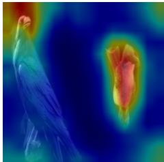
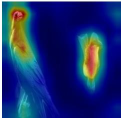
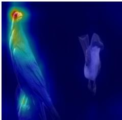
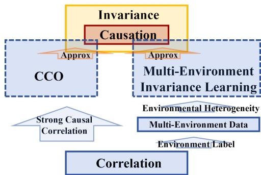
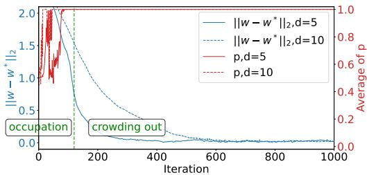
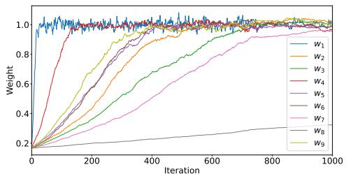
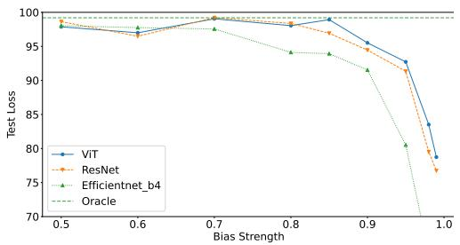
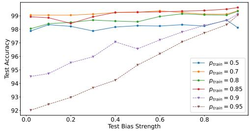
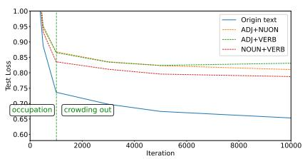
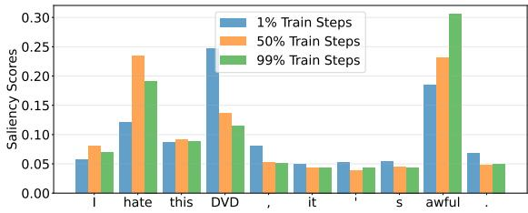

## ABSTRACT

We revisit when Transformers can prioritize causes over spurious effects by viewing the problem through data correlation strength and the implicit regularization of gradient descent. We identify a phenomenon called Correlation Crowding-Out (CCO) arising from the training dynamics of Transformers. Specifically, under strongly correlated causal features, gradient descent filters out spurious cues and converges to a predictor that relies almost exclusively on the causes. Theoretically, using a simplified Transformer model trained on data from a minimal causal chain, we introduce a Dominant-coordinate condition that characterizes when CCO arises and explain its mechanism as a coupling of “occupation” and “crowding-out”. “Occupation” denotes the rapid growth of weights aligned with the dominant causal direction while non-dominant directions remain small. “Crowding-out” denotes the attention logits align with separation directions favoring the causal branch, suppressing descendants. We provide convergence guarantees for both the optimization trajectory and generalization. Our empirical results on simulated and real examples across various tasks including vision and natural language demonstrate the procedure. Together, these results show that, under suitable conditions, standard training alone can induce cause only prediction.

## 1 INTRODUCTION

Whether data-driven models can extract causal invariances from observational data and thereby deliver robust predictions has long been a central hope in AI (Pearl, 2009; Peters et al., 2016; Arjovsky et al., 2019; Schölkopf et al., 2021; Fan et al., 2024). Yet models trained by empirical risk minimization are often prone to shortcut learning (Geirhos et al., 2020; Shah et al., 2020; Ye et al., 2024), indiscriminately exploiting any correlation, including spurious cues unrelated to the true causal mechanisms (Sagawa et al., 2020; Qiu et al., 2023). This pattern is widely documented across modalities and tasks (Geirhos et al., 2019; McCoy et al., 2019; Li et al., 2025). The rise of Transformers and LLMs sharpens this tension: these systems can sometimes rely on shallow artifacts (Bender et al., 2021; Tang et al., 2023; Du et al., 2023; Varma et al., 2024; Jin et al., 2024; Gui & Ji, 2025), yet they also produce answers that appear strikingly logical and robust in certain scenarios (Brown et al., 2020; Wei et al., 2022; Kojima et al., 2022; Yuan et al., 2024). Recent theory offers partial clues for why Transformers sometimes appear causal, but does not yet answer the cause only generalization question. On stylized in-context tasks, Transformers trained on Markov Chain sequences can recover parent sets and estimate transition probabilities in-context (Edelman et al., 2024; Nichani et al., 2024; D’Angelo et al., 2025). These results suggest how attention might reconstruct graph edges from observational sequences, but they rely on designed ICL setups rather than generic pipelines with spurious features and do not show when spurious information is suppressed at both train and test time. In parallel, large margin analyses show that gradient descent (GD) pushes query–key parameters toward max-margin separators (Tarzanagh et al., 2023; Ataee Tarzanagh et al., 2023; Vasudeva et al., 2025). While this suggests separation can emerge during training, it does not characterize how such separation filters out spurious features or yields cause only risk guarantees. This landscape motivates a basic question:

## When and through what mechanism can Transformer training produce predictors that rely on causes while ignoring spurious effects?

We answer this by uncovering and analyzing Correlation Crowding-Out (CCO). CCO is a training phenomenon in which, under a uniform dominance gap where a causal feature is more strongly associated with the target than any competing spurious feature, GD drives Transformer to progressively suppress spurious features and converge to a predictor that relies almost exclusively on the causal feature. Crucially, the dominance condition does not require spurious features to be weak: many can remain highly correlated with the target and may even surpass non-dominant causal coordinates. What matters is a persistent margin favoring the dominant causal direction.

Remarkably, strong causal correlation in the data alone does not guarantee cause only prediction for generic estimators. In Example 25, even under a dominance gap, population least squares retains a constant fraction of a spurious feature. Thus, CCO is not a corollary of data dominance; it hinges on optimization induced implicit regularization that actively crowds out spurious features. This occurs without explicit invariance penalties (Arjovsky et al., 2019; Shapiro, 2017; Fan et al., 2024) or multi-environment training (Peters et al., 2016; Fan et al., 2024; Xu et al., 2024).

Our perspective complements existing analyses of correlation driven learning dynamics. Prior work has shown that neural networks exhibit a simplicity bias, often preferring features that are highly correlated with the label or easier to fit (Belkin et al., 2019; Moayeri et al., 2022; Morwani et al., 2023; Qiu et al., 2023; Xue et al., 2023; Yang et al., 2024). When spurious features are more predictive or less complex, they tend to dominate early training, delaying or even entirely inhibiting the learning of causal features (Shah et al., 2020; Yang et al., 2024). These studies underscore that correlation strength and feature complexity critically shape learning trajectories, and they reinforce the notion that deep models are vulnerable to superficial shortcuts. In contrast, we focus on the opposite regime: when the causal features themselves dominate in predictiveness. We formalize CCO as the mirror image of shortcut learning. Intuitively, if a causal feature explains the target with overwhelming strength, the model has little incentive to rely on weaker spurious cues.

Building on this premise, we demonstrate CCO empirically and provide a theoretical account of its mechanism. To theoretically understand this behavior, we analyze a simplified two-layer Transformer trained on data from a causal chain (x → y → z) generative process. Our theory provides a Dominant-Coordinate Condition on the data, which quantifies how strong the x-y correlation must be for CCO to occur. Under this condition, the training dynamics unfold in two coupled phases. In the first “occupation” phase, within the Transformer’s feed-forward sublayer, the weight vector that aligns with the dominant causal coordinate in x grows rapidly to a stable magnitude, while weights in other directions remain small. This expansion makes the causal direction salient and establishes it as the primary signal driving the predictions. Next comes the “crowding-out” phase: the Transformer’s attention mechanism gradually shifts its query-key alignment toward the max-margin separator between the transformed causal and spurious features (roughly, x˜ − z˜). Consequently, the attention weights concentrate almost entirely on the causal x branch, effectively gating out the spurious z branch. Through this two-phase process, GD steers the model toward a cause only solution without any specialized regularization for invariance.

By elucidating the mechanism behind CCO, we contributes a more nuanced perspective on Transformer’s generalization: while spurious shortcuts are a serious and pervasive concern, there exist regimes in which strong causal signals can turn GD into an ally for causal learning. In such regimes, the implicit regularization of GD yield cause only generalization, even in the absence of multiple training environments or explicit causal objectives.

## 1.1 OUR CONTRIBUTION

• We introduce and formalize the new phenomenon CCO.

• We elucidate CCO’s mechanism with both theory and experiments.

## 2 RELATED WORK

Spurious Correlations and Invariance Learning. Across vision, language, and ERM-trained deep models including modern Transformers and LLMs—readily latch onto shortcut cues and spurious correlations, leading to brittle generalization under shift (Geirhos et al., 2019; 2020; Zhou et al., 2021; Du et al., 2021; Tang et al., 2023; Du et al., 2023; Yuan et al., 2024). A major theoretical response is invariance learning: instead of trusting raw correlations, one seeks mechanisms stable across environments. Two canonical frameworks are Invariant Causal Prediction (Peters et al., 2016; Meinshausen et al., 2016), which tests for subsets of covariates that render the conditional law of the target invariant across interventions or environments, and Invariant Risk Minimization (Arjovsky et al., 2019), which encourages representations that admit a single optimal classifier across environments. Both lines have spurred extensive follow-ups and critiques clarifying assumptions, identifiability, and practical limitations (Ghassami et al., 2017; Heinze-Deml et al., 2018; Pfister et al., 2019; Rothenhäusler et al., 2019; 2021; Rosenfeld et al., 2021; Lin et al., 2022b; Kamath et al., 2021; Lu et al., 2021a; Zhou et al., 2022; Lin et al., 2022a). In parallel, distributionally robust optimization offers a complementary lens by minimizing worst-case (group) risk under distributional shifts (Shapiro, 2017; Sagawa et al., 2020; Duchi & Namkoong, 2021; Gao et al., 2024). More recently, Environment-Invariant Linear Least Squares and variants show that, when cross-environment heterogeneity is sufficiently strong, a regularized least-squares estimator can recover invariant features with generalization guarantees while quantifying heterogeneity (Fan et al., 2024; Gu et al., 2025a; Xu et al., 2024; Gu et al., 2025b). Most invariance methods posit either explicit regularizer or environment partitions; comparatively less is known about when standard GD on a Transformer will, by its own dynamics, yield an cause only predictor. Our work targets precisely this gap.

Implicit Bias. Implicit bias refers to the tendency of (S) GD, even without explicit regularization, to select solutions with special structure and generalization properties, widely regarded as a key to the success of over-parameterized models. Such as for logistic regression, (S) GD converges in direction to the max-margin classifier (Soudry et al., 2018; Ji & Telgarsky, 2019; Wu et al., 2025; Cai et al., 2025); in over-parameterized linear models, (S) GD can display benign overfitting (Zou et al., 2021; Wu et al., 2022), double descent (Lu et al., 2023; Zhang et al., 2025), and scaling laws (Bordelon et al., 2024; Lin et al., 2024); and for quadratically parameterized models, (S) GD implicitly favors low-complexity solutions and exhibits incremental learning (Li et al., 2018; Vaskevicius et al., 2019; Woodworth et al., 2020; HaoChen et al., 2021; Li et al., 2021; Jin et al., 2023; Xu et al., 2024). Turning to Transformers, a growing theory literature dissects how attention evolves under GD. For single-head ViTs, GD is shown to concentrate attention on label-relevant tokens, yielding progressively sparse maps (Jelassi et al., 2022; Li et al., 2023a). These results clarify which inputs receive mass under training induced anisotropy, but they are agnostic to causal structure. On stylized in-context tasks, Transformers trained on Markov chain sequences learn the set of parent tokens and estimate transition probabilities in-context; related mechanistic work on induction heads explains how attention circuits implement dependency tracking and copying behaviors (Lu et al., 2021b; Olsson et al., 2022; Li et al., 2023b; Edelman et al., 2024; Nichani et al., 2024; D’Angelo et al., 2025). These analyses are posed in designed ICL setups and do not address under generic training with spurious descendants when and why GD yields a cause only predictor. A complementary line shows that GD on attention pushes query–key parameters toward max-margin separators, establishing that separation can emerge during training; yet this does not identify which side of the margin corresponds to causal versus spurious directions, nor when separation suffices for cause only generalization (Tarzanagh et al., 2023; Ataee Tarzanagh et al., 2023; Vasudeva et al., 2025).

## 3 CCO: A PHENOMENOLOGY IN TRANSFORMER TRAINING

CCO refers to a training phenomenon in Transformers whereby, if there exists a dominant causal feature whose association with the target exceeds that of any competing spurious feature by a uniform gap, GD learns a predictor that progressively suppresses spurious features and relies almost exclusively on the causal one. Crucially, this dominance condition does not require spurious features to be weak: many can remain highly correlated with the target and some may even surpass non-dominant causal features. What matters is a persistent gap favoring the dominant causal direction.

## CCO unfolds through two coupled effects:

(I) Occupation (early rise): within representation and prediction layers (e.g., embeddings, feedforward blocks, attention heads), weights aligned with a dominant, highly predictive causal feature grow rapidly to a stable, large scale, while spurious features aligned directions remain small, rendering the causal signal salient to the optimizer.

  
(a) Input image

  
(b) Iter=0

  
(c) Iter=50

  
(d) Iter=500  
Figure 1: This figure shows how attention shifts during ViT training on a foreground–foreground causal disentanglement task. (a) is the input image. Early in training (b, iter 0), attention is diffuse across left bird (causal feature) and right bird (spurious feature). As training proceeds (c, iter 50), attention weight rises on the left bird illustrating the occupation phase. By (d, iter 500), attention is concentrated almost entirely on the left bird, with the right bird and background receiving near zero weight, illustrating the crowding-out phase.

(II) Crowding-out (attention selection): multi-head attention progressively aligns its logits with separation directions that prefer causal over spurious features (e.g., larger query-key margins for causal tokens), concentrates attention mass on causal features, and suppresses spurious features.

We verify the above phenomenon in Fig 1. During ViT training, the attention map first show a rapid growth in left bird (causal feature) in the occupation stage, while the attention on right bird (spurious feature) remain small growth. Then in the crowding-out stage, the attention allocated to the left bird significantly surpasses the attention to the right bird, with the right bird’s attention appearing very faint in the attention map.

## 3.1 WHY CCO ARISES

(I) Intrinsic strong causal correlation: CCO emerges when the data exhibits a property whereby the correlation between a causal feature and the target is consistently stronger than that of any spurious feature. This is common rather than contrived: many real datasets can be viewed as mixtures of latent environments in which causal–target relationships remain relatively stable, whereas spurious features oscillate across environments. When pooled, these oscillations destructively interfere, reducing spurious–target correlation relative to causal–target correlation. Equivalently, causal features concentrate stable signal, while spurious features disperse unstable variance, making the dominant causal direction statistically more salient.

(II) Implicit regularization of GD in Transformers: early strong-signal directions (Occupation) steer gradients toward causal features, inducing a directional bias in the learned representation. Attention then transduces this bias into selection (Crowding-out), assigning higher weight to causal features and down-weighting spurious ones, thereby approaching an invariant, cause only solution without explicit invariance penalties.

## 3.2 STRONG CAUSAL CORRELATION ALONE DOESN’T ENSURE CAUSE ONLY

It is important to stress that strong causal correlation in the data does not by itself alone guarantee cause only prediction for generic estimators. In Example 25, we show that even under a dominant causal correlation, population linear regression retains a constant fraction of the spurious features, remaining using spurious features to predict noise. This demonstrates two points: (a) strong causal alignment alone does not ensure spurious suppression; and (b) CCO is not a trivial corollary of data dominance but instead relies on the implicit regularization induced by Transformers and GD.

## 4 THEORETICALLY ANALYSIS OF CORRELATION CROWDING-OUT

## 4.1 PROBLEM SETUP

We provide a theoretical explanation for CCO by analyzing a specialized Transformer module trained on data generated by the causal chain x → y → z. When the dominant feature of x exhibits sufficiently strong association with $y ,$ the implicit regularization of GD leads the learned predictor to filter out z and rely almost exclusively on x.

## 4.1.1 DATA GENERATIVE PROCESS

We consider the causal chain ${ \bf x }  y  { \bf z } ,$ where $\mathbf { x } , \mathbf { z } \in \mathbb { R } ^ { d }$ are vector covariates and $y \in \mathbb { R }$ is a scalar response. The response y is a sparse quadratic signal in x:

$$
y = \mathbf {x} ^ {\top} (\mathbf {w} ^ {*}) ^ {\odot 2} + \epsilon ,
$$

with noise $\epsilon \perp \mathbf { x } , \mathbb { E } [ \epsilon ] = 0 .$ , and $\mathrm { V a r } ( \epsilon ) = \sigma ^ { 2 }$ . The descendant z depends on y via an L-Lipschitz function $f : \mathbb { R } \to \mathbb { R } ^ { \bar { d } }$ and additive noise $\pmb { \xi } \in \mathbb { R } ^ { d }$

$$
\mathbf {z} = f (y) + \boldsymbol {\xi}, \quad \boldsymbol {\xi} \perp y.
$$

We assume the moment and boundedness conditions:

$$
\mathbf {H} := \mathbb {E} [ \mathbf {x x} ^ {\top} ] = \left[ \begin{array}{c c} a & \mathbf {0} \\ \mathbf {0} & \mathbf {I} _ {d - 1} \end{array} \right], \quad \mathbb {E} [ \mathbf {x} + \mathbf {z} ] = \boldsymbol {\zeta}, \quad \operatorname{Var} (\mathbf {x} + \mathbf {z}) = \Sigma ,
$$

and almost surely $\begin{array} { r } { \operatorname* { s u p } _ { 1 \leq j \leq d } | \mathbf { x } _ { j } | \leq B _ { \mathbf { x } } , \operatorname* { s u p } _ { 2 \leq j \leq d } | \mathbf { x } _ { j } | \leq B _ { \mathbf { x } } ^ { ' } , | \epsilon | \leq B _ { \epsilon } , \operatorname* { s u p } _ { 1 \leq j \leq d } | \xi _ { j } | \leq B _ { \xi } } \end{array}$ $\begin{array} { r } { \operatorname* { s u p } _ { 1 \leq j \leq d } \left. \mathbf { z } _ { j } ^ { i } \right. \leq \left. \left. f \left( 0 \right) \right. \right. _ { \infty } + L \left( r B _ { \mathbf { x } } + B _ { \epsilon } \right) + B _ { \xi } : = B _ { \mathbf { z } } } \end{array}$ . The ground truth $\mathbf { w } ^ { * }$ is sparse and binary: $\mathbf { w } _ { j } ^ { * } \in \{ 0 , 1 \} , \mathbf { w } _ { 1 } ^ { * } = 1$ , and $| \mathrm { s u p p } ( \mathbf { w } ^ { * } ) | \leq r$ . We observe i.i.d. samples $\left\{ \left( \mathbf { x } ^ { i } , y ^ { i } , \mathbf { z } ^ { i } \right) \right\} _ { i = 1 } ^ { n }$ from $( \mathbf { x } , y , \mathbf { z } )$

The chain $\mathbf { x }  y  \mathbf { z }$ is a minimal DAG that that captures the key trade-off behind CCO: a causal parent x that determines $y ,$ versus a spurious descendant z is induced by $y .$ . This reduction is purposeful and representative. For example, in sentiment analysis, content features x → sentiment label or rating $y $ label derived auxiliary fields generated downstream z (Gururangan et al., 2018). So that z is a descendant induced spurious correlate of $y$ while x carries the causal signal.

In this pattern, descendants furnish alluring but non invariant shortcuts, a phenomenon widely documented across deep learning (Geirhos et al., 2020). By positing one dominant, highly y-predictive direction in x while allowing z to be strongly, yet non causally correlated with $y .$ Thus, the $\mathbf { x }  y  \mathbf { z }$ pattern offers a principled, portable abstraction: it is simple enough for precise analysis yet representative of broader scenarios where CCO is expected to emerge.

## 4.1.2 MODEL ARCHITECTURE

We adopt a two-key attention architecture and augment inputs with fixed positional encodings $\mathbf { s } _ { 1 } , \mathbf { s } _ { 2 } \in \mathbb { R } ^ { M }$

$$
\tilde {\mathbf {x}} ^ {i} = \left[ \begin{array}{c} \mathbf {s} _ {1} \\ \mathbf {x} ^ {i} \end{array} \right], \qquad \tilde {\mathbf {z}} ^ {i} = \left[ \begin{array}{c} \mathbf {s} _ {2} \\ \mathbf {z} ^ {i} \end{array} \right] \in \mathbb {R} ^ {M + d}.
$$

We parameterize the query as the gating vector $\mathbf { q } ^ { t } : = \tilde { \mathbf { v } } ^ { t } \in \mathbb { R } ^ { M + d }$ , take the keys as $\mathbf { k } _ { x } ^ { i } : = \tilde { \mathbf { x } } ^ { i }$ and $\mathbf { k } _ { z } ^ { i } : = \tilde { \mathbf { z } } ^ { i }$ , and the values as ${ \bf v } _ { x } ^ { i } : = \mathbf { \bar { x } } ^ { i }$ and $\mathbf { v } _ { z } ^ { i } : = \bar { \mathbf { z } } ^ { i }$

Two-key Attention. Define the logits

$$
\ell_ {x, i} ^ {t} = (\mathbf {q} ^ {t}) ^ {\top} \mathbf {k} _ {x} ^ {i}, \quad \ell_ {z, i} ^ {t} = (\mathbf {q} ^ {t}) ^ {\top} \mathbf {k} _ {z} ^ {i},
$$

and weights

$$
\alpha_ {x, i} ^ {t} = \frac {e ^ {\ell_ {x , i} ^ {t}}}{e ^ {\ell_ {x , i} ^ {t}} + e ^ {\ell_ {z , i} ^ {t}}}, \quad \alpha_ {z, i} ^ {t} = 1 - \alpha_ {x, i} ^ {t}.
$$

By softmax translation invariance,

$$
\alpha_ {x, i} ^ {t} = \sigma \big ((\mathbf {q} ^ {t}) ^ {\top} (\mathbf {k} _ {x} ^ {i} - \mathbf {k} _ {z} ^ {i}) \big) = \sigma \big ((\tilde {\mathbf {v}} ^ {t}) ^ {\top} (\tilde {\mathbf {x}} ^ {i} - \tilde {\mathbf {z}} ^ {i}) \big) =: p _ {i} ^ {t}.
$$

The attention output (per sample) is

$$
\hat {\mathbf {h}} ^ {i, t} = \alpha_ {x, i} ^ {t} \mathbf {v} _ {x} ^ {i} + \alpha_ {z, i} ^ {t} \mathbf {v} _ {z} ^ {i} = p _ {i} ^ {t} \tilde {\mathbf {x}} ^ {i} + (1 - p _ {i} ^ {t}) \tilde {\mathbf {z}} ^ {i}.
$$

Algorithm 1 GD on the two-key attention model
1: Input: $\{(\mathbf{x}^i, y^i, \mathbf{z}^i)\}_{i=1}^n$, encodings $\mathbf{s}_1, \mathbf{s}_2$, stepsizes $\{\eta_t\}, \{\beta_t\}$, initialization scale $\alpha$, iterations $T$.
2: Positional Encoding: $\tilde{\mathbf{x}}^i = \begin{bmatrix} \mathbf{s}_1 \\ \mathbf{x}^i \end{bmatrix}$, $\tilde{\mathbf{z}}^i = \begin{bmatrix} \mathbf{s}_2 \\ \mathbf{z}^i \end{bmatrix}$.
3: Init: $\tilde{\mathbf{w}}^0 = \begin{bmatrix} \mathbf{0} \\ \alpha \mathbf{I}_d \end{bmatrix}$, $\tilde{\mathbf{v}}^0 = \mathbf{0}_{M+d}$.
4: for $t = 0, 1, \ldots, T - 1$ do
5:    for $i = 1$ to $n$ do
6:    $p_i^t \leftarrow \sigma((\tilde{\mathbf{v}}^t)^\top (\tilde{\mathbf{x}}^i - \tilde{\mathbf{z}}^i))$, $\hat{y}^{i,t} \leftarrow (p_i^t \tilde{\mathbf{x}}^i + (1 - p_i^t) \tilde{\mathbf{z}}^i)^\top (\tilde{\mathbf{w}}^t)^\odot^2$, $r_i^t \leftarrow \hat{y}^{i,t} - y^i$
7:    $\tilde{\mathbf{w}}^{t+1} \leftarrow \tilde{\mathbf{w}}^t - \frac{\eta_t}{n} \sum_{i=1}^n r_i^t (p_i^t \tilde{\mathbf{x}}^i + (1 - p_i^t) \tilde{\mathbf{z}}^i) \odot \tilde{\mathbf{w}}^t$
8:    $\tilde{\mathbf{v}}^{t+1} \leftarrow \tilde{\mathbf{v}}^t - \frac{\beta_t}{n} \sum_{i=1}^n r_i^t p_i^t (1 - p_i^t) (\tilde{\mathbf{x}}^i - \tilde{\mathbf{z}}^i)^\top ((\tilde{\mathbf{w}}^t)^\odot^2)(\tilde{\mathbf{x}}^i - \tilde{\mathbf{z}}^i)$
9: Return: ($\tilde{\mathbf{w}}^{t+1}, \tilde{\mathbf{v}}^{t+1}$).

Squared-parameter Head and Loss. We predict with a quadratic parameterization feed-forward layer:

$$
\hat {y} ^ {i, t} = \left(\hat {\mathbf {h}} ^ {i, t}\right) ^ {\top} \left(\tilde {\mathbf {w}} ^ {t}\right) ^ {\odot 2} = \sum_ {j = 1} ^ {M + d} \left(\tilde {\mathbf {w}} _ {j} ^ {t}\right) ^ {2} \hat {\mathbf {h}} _ {j} ^ {i, t}, \quad \mathcal {L} _ {n} (\tilde {\mathbf {w}}, \tilde {\mathbf {v}}) = \frac {1}{2 n} \sum_ {i = 1} ^ {n} (\hat {y} ^ {i} - y ^ {i}) ^ {2}.
$$

This quadratic parameterization feed-forward layer can be seen as a special diagonal neural network, essentially a position wise FFN that provides anisotropic multiplicative gains and thus retains feature learning capacity through the attention mixed representation. This parameterization can be further generalized by $\begin{array} { r } { \hat { y } ^ { i , t } = \left( \hat { \mathbf { h } } ^ { i , t } \right) ^ { \top } \left( \left( \tilde { \mathbf { w } } ^ { + , t } \right) ^ { \odot 2 } - \left( \tilde { \mathbf { w } } ^ { - , t } \right) ^ { \odot 2 } \right) } \end{array}$

GD on the two-key attention model is summarized in Algorithm 1.

Our module is exactly a single-head dot-product attention applied per sample with two keys/values, one for the cause path and one for the descendant path. It is the special case of a Transformer attention block where $\dot { W } _ { Q } , W _ { K } , W _ { V }$ are identity projections, so the query is the learned gating direction $\tilde { \mathbf { v } }$ , and the two tokens are x˜ and z˜. This reduction keeps the softmax competition geometry and the value mixing mechanism intact while stripping away projection layers that would obscure the optimization dynamics. The quadratic parameterization head is a diagonal, position wise FFN that provides nonnegative per-coordinate gains. Studying this minimal attention–FFN pair is theoretically meaningful: it isolates the allocation dynamics behind the implicit bias we analyze, preserving the key nonlinearities (softmax and multiplicative gains) that produce CCO.

The distinct fixed encodings $\mathbf { s } _ { 1 } \neq \mathbf { s } _ { 2 }$ attach branch identity to keys and values and inject a sampleindependent margin $( \tilde { \mathbf { v } } ^ { t } ) ^ { \top } ( \mathbf { s } _ { 1 } - \mathbf { s } _ { 2 } )$ into the logit difference. When $\mathbf { x } _ { i }$ and $\mathbf { z } _ { i }$ are weakly separated early in training, the offset $( \tilde { \mathbf { v } } ^ { t } ) ^ { \top } ( \mathbf { s } _ { 1 } - \mathbf { s } _ { 2 } )$ prevents the gate from collapsing to $1 / 2$ and ensures a non-degenerate gradient, thereby guaranteeing identifiability of branches and stable training dynamics. This mirrors the role of positional embeddings in Transformers.

## 4.1.3 DOMINANT-COORDINATE CONDITION.

We characterize which patterns of strong correlation are sufficient for CCO to emerge. The two conditions below formalize (i) a population-level dominance of one causal coordinate and (ii) a per-sample margin along that coordinate.

Define $s _ { j } : = \mathbb { E } \big [ ( \mathbf { x } ^ { \top } ( \mathbf { w } ^ { * } ) ^ { \odot 2 } ) ( \mathbf { x } _ { j } + \mathbf { z } _ { j } ) \big ]$ measures the cross-moment between response $y$ and the combined coordinate ${ \bf x } _ { j } + { \bf z } _ { j }$ . The adjustment $\mu _ { j } : = \mathbb { E } [ \epsilon ( \mathbf { x } _ { j } + \mathbf { z } _ { j } ) ]$ accounts for noise leakage. $s _ { j } ^ { \mathrm { e f f } } : = s _ { j } + \mu _ { j }$ is the effective signal which governs the drift of gradient updates. We also write $\bar { m _ { j } } : = \mathbb { E } \bigl [ ( \mathbf { x } _ { j } + \mathbf { z } _ { j } ) ^ { 2 } \bigr ] = \Sigma _ { j j } + \zeta _ { j } ^ { 2 }$ and $m _ { k j } : = \mathbb { E } \big [ ( \mathbf { x } _ { k } + \mathbf { z } _ { k } ) ( \mathbf { x } _ { j } + \mathbf { z } _ { j } ) \big ] = \Sigma _ { k j } + \zeta _ { k } \zeta _ { j }$ which capture the second-moment scales of the combined features.

Condition 1. The effective signal satisfies that $\begin{array} { r } { s _ { 1 } ^ { \mathrm { e f f } } > \frac { 2 m _ { 1 } } { 1 5 } + \operatorname* { m a x } _ { j > 1 } \left( 4 \left| s _ { j } ^ { \mathrm { e f f } } \right| + \frac { m _ { 1 j } } { 8 } \right) } \end{array}$

Condition 1 requires effective signal the dominant feature is sufficiently strong to exceed that of other competitor by a uniform gap. The assumption is mild, it allows strong descendant induced correlations on other coordinates but prevents the dominant causal direction from being overwhelmed. Under Condition 1, the GD dynamics preferentially amplify the squared weight on the dominant coordinate, creating the occupancy that initiates CCO.

Condition 2. There exist constant $\tau _ { 1 } , \tau _ { 2 } > 0$ such thatfor every sample $i = 1 , \ldots , n \colon ( i )$ Nontrivial gap: $| \mathbf { x } _ { 1 } ^ { i } - \mathbf { z } _ { 1 } ^ { i } | \geq \tau _ { 1 }$ . (ii) Sign stability: sgn $( { \bf x } _ { 1 } ^ { i } - { \bf z } _ { 1 } ^ { i } ) = \mathrm { s g n } ( \bar { \bf x } _ { 1 } ^ { i } )$ . (iii) Dominant-coordinate margin lower bound: $\begin{array} { r } { \frac { 3 } { 4 } \Big | { \bf x } _ { 1 } ^ { i } \Big | \ge ( r - 1 ) B _ { \bf x } ^ { ' } + B _ { \epsilon } + \tau _ { 2 } } \end{array}$

In combination with Condition 1, Condition 2 guarantees that GD on the gate parameter $\tilde { \textbf { v } } ^ { t }$ towards the max-margin solution on $\left\{ \tilde { \mathbf { x } } _ { i } - \tilde { \mathbf { z } } _ { i } \right\} _ { i = 1 } ^ { n }$ drives $p _ { i } ^ { t } \to 1$ and thereby squeezes out the descendant branch. In short, Condition 1 ensures occupancy, whereas Condition 2 ensures crowding out, completing the CCO mechanism.

These two conditions are satisfiable in bounded, Lipschitz settings. Importantly, as detalied in Example 26, they do not exclude the empirically relevant regime where some non-dominant causal coordinates are less correlated with $y$ than descendant coordinates: it can happen that for some $j > 1$ with $\mathbf { w } _ { j } ^ { * } = 1 , \mathrm { C o v } ( \mathbf { x } _ { j } , y ) < \mathrm { C o v } ( \mathbf { z } _ { j } , y )$

## 4.2 MAIN RESULT

We next formalize when and how CCO emerges in our two-key attention model. Under the Dominant-coordinate condition, the first theorem provides a mechanistic account of CCO during training. The second theorem provides a generalization guarantee: with high probability, the learned predictor filters out the descendant z, relies almost exclusively on the causal $\mathbf { x } ,$ and attains test risk near the cause only level.

Theorem 1 (CCO’s Mechanism). Under Condition 1 and Condition 2, consider GD with initialization scale $\alpha ~ = ~ { \frac { \sqrt { \sigma ^ { 2 } \log d / n } } { d 3 } }$ and the following stepsize schedule: (i) For $1 \ \leq \ t \ \leq \ T _ { 1 } ^ { * } \ : =$ min $\{ t \ \in \mathbb { N } : \mathbf { w } _ { 1 } ^ { t } \ \geq \ \frac { 1 } { 4 } \}$ , set $\eta _ { t } ~ \equiv ~ \eta$ and $\beta _ { t } ~ \equiv ~ 0 . ~ ( i i )$ For $T _ { 1 } ^ { * } ~ < ~ t ~ \leq ~ T _ { 1 } ^ { * } + T _ { 2 } ^ { * }$ , with $T _ { 2 } ^ { * } \ \asymp \ \exp \Big ( \sqrt { \| \mathbf { s } \| _ { 2 } ^ { 2 } + d ( B _ { \mathbf { x } } + B _ { \pmb { \xi } } ) ^ { 2 } } \Big )$ , set $\eta _ { t } ~ \equiv ~ 0$ and $\beta _ { t } ~ \equiv ~ \beta$ . (iii) For $T _ { 1 } ^ { * } + T _ { 2 } ^ { * } < t \leq$ $T _ { 1 } ^ { * } + T _ { 2 } ^ { * } + T _ { 3 } ^ { * } = : T ^ { * }$ , set $\eta _ { t } ~ \equiv ~ \eta$ and $\beta _ { t } \ \equiv \ 0$ with $\begin{array} { l c l } { T _ { 3 } ^ { * } } & { \asymp } & { \frac 1 \eta \log \left( \frac n { \sigma ^ { 2 } \log \left( d r \right) } \right) } \end{array}$ . Then, with probability at least $\textstyle 1 - { \frac { 1 } { d ^ { 2 } } }$ , the squared-parameter head satisfies

$$
\left| \mathbf {w} _ {i} ^ {T ^ {*}} - \mathbf {w} _ {i} ^ {*} \right| \lesssim \frac {\sigma \sqrt {\log d}}{\sqrt {n}} f o r i \in \operatorname{supp} (\mathbf {w} ^ {*}), \quad \left| \mathbf {w} _ {i} ^ {T ^ {*}} - \mathbf {w} _ {i} ^ {*} \right| \lesssim \frac {1}{d} f o r i \notin \operatorname{supp} (\mathbf {w} ^ {*}).
$$

Meanwhile, the query (gating) iterate $\mathbf { q } ^ { t } = \tilde { \mathbf { v } } ^ { t }$ obeys $\tilde { \textbf { v } } ^ { t } = \hat { \textbf { u } }$ log $t ~ + ~ \rho ^ { t } ,$ , where uˆ is the maxmargin solution on $\left\{ \tilde { \mathbf { x } } _ { i } - \tilde { \mathbf { z } } _ { i } \right\} _ { i = 1 } ^ { n }$ and $\rho ^ { t }$ a bounded residual. Consequently, $\begin{array} { r } { p _ { i } ^ { T ^ { * } } \geq 1 - \frac { 1 } { d ^ { 2 } } } \end{array}$ for all $1 \leq i \leq n$

This theorem explains the mechanism by which CCO arises during optimization. Under the dominant-coordinate condition, the dominant causal direction becomes visible to GD: the gate’s gradient aligns with the separation direction $( \tilde { \mathbf { x } } ^ { i } - \tilde { \mathbf { z } } ^ { i } )$ and tracks a max-margin ray with a logarithmically diverging norm, so the attention weight concentrates on the x-branch. As the gate filters out the descendant branch, the squared-parameter head fits the ground-truth weights $\mathbf { w } ^ { * }$ up to the error on active coordinates and a $1 / d$ tail on inactive ones.

Role of Positional Encodings. Distinct fixed encodings $\mathbf s _ { 1 } \neq \mathbf s _ { 2 }$ attach branch identity and introduce a sample-independent margin in the gate logit, $( \mathbf { \check { v } } ^ { t } ) ^ { \top } ( \mathbf { s } _ { 1 } - \mathbf { s } _ { 2 } )$ . This symmetry breaking enables the two-key attention to identify the dominant feature and drive the attention weights to select the branch associated with it, thereby catalyzing CCO.

Theorem 2 (Generalization of CCO). For an independent test triple $( \mathbf { x } , y , \mathbf { z } )$ , there exists an event Ω with $\begin{array} { r } { \mathrm { P r } ( \Omega ) \geq 1 - \frac { 8 \sqrt { \| { \bf s } \| _ { 2 } ^ { 2 } + d ( B _ { { \bf x } } + B _ { { \bf z } } ) ^ { 2 } } } { \| { \bf s } \| _ { 2 } \sqrt { n } } - \sqrt { \frac { 2 \ln ( 2 d ^ { 2 } ) } { n } } } \end{array}$ , such that conditioned on $\Omega ,$

$$
p ^ {T ^ {*}} = \sigma \big ((\tilde {\mathbf {v}} ^ {T ^ {*}}) ^ {\top} (\tilde {\mathbf {x}} ^ {T ^ {*}} - \tilde {\mathbf {z}} ^ {T ^ {*}}) \big) \geq 1 - \frac {1}{d ^ {2}} \quad a n d \quad \mathbb {E} \left[ \left| \mathcal {L} - \frac {\sigma^ {2}}{2} \right| \mid \Omega \right] \lesssim \frac {r \sigma^ {2} \log d}{n}.
$$

With high probability (strengthened when $\| \mathbf { s } \| _ { 2 } ^ { 2 } \asymp d )$ , the learned gate continues to prefer the causal branch on test distribution, i.e., $\boldsymbol { p } ^ { T ^ { * } }$ is bounded away from 0 and close to 1. Moreover, the test loss approaches the cause only noise floor $\sigma ^ { 2 } / 2$ at rate $O ( r \sigma ^ { 2 } \log d / n )$ , indicating that the predictor essentially relies on x while filtering out z on the test distribution.

Theorem 2 controls generalization when train and test share the same data distribution. We next show that the same CCO predictor remains robust under test time shifts that perturb $y  \mathbf z$

Corollary 1 (Robust generalization under $y \to \mathbf { z } { \mathrm { ~ s h i f t s } } )$ . At test time, change the $y \to \mathbf z$ mechanism so that $\mathbf { z } ^ { \prime } = f ^ { \prime } ( y ) + \xi ^ { \prime }$ and assume $\operatorname* { s u p } _ { j } | \mathbf { z } _ { j } ^ { \prime } | \leq B _ { \mathbf { z } ^ { \prime } }$ . There exists an event Ω with $\mathrm { P r } ( \Omega ) \geq$ $\begin{array} { r } { 1 - \frac { 8 \sqrt { \| \mathbf { s } \| _ { 2 } ^ { 2 } + d ( B _ { \mathbf { x } } + B _ { \mathbf { z } ^ { \prime } } ) ^ { 2 } } } { \| \mathbf { s } \| _ { 2 } \sqrt { n } } - \sqrt { \frac { 2 \ln ( 2 d ^ { 2 } ) } { n } } } \end{array}$ , such that conditioned on $\Omega ,$

$$
p ^ {T ^ {*}} = \sigma \big ((\tilde {\mathbf {v}} ^ {T ^ {*}}) ^ {\top} (\tilde {\mathbf {x}} ^ {T ^ {*}} - \tilde {\mathbf {z}} ^ {'}, T ^ {*}) \big) \geq 1 - \frac {1}{d ^ {2}},   \mathbb {E} \left[ \left| \left. \mathcal {L} _ {(\mathbf {x}, y, \mathbf {z} ^ {\prime})} \big (\tilde {\mathbf {w}} ^ {T ^ {*}}, \tilde {\mathbf {v}} ^ {T ^ {*}} \big) - \frac {\sigma^ {2}}{2} \right| \mid \Omega \right] \lesssim \frac {r   \sigma^ {2} \log d}{n}. \right.
$$

## 5 FURTHER DISCUSSION

Positioning of CCO. CCO arises under purely correlational training with single environment, no environment labels, and no explicit invariance regularizers. Yet when a dominant causal correlation is present and GD’s implicit bias takes hold, the learned predictor moves beyond correlation toward causation: it increasingly relies on causal features while largely discounting spurious correlates. Meanwhile, multi-environment invariance methods also seek causally aligned predictors, but they pursue this goal by explicitly leveraging cross environment heterogeneity.

## When Can Transformers Learn Causation?

CCO offers a concrete path to cause only behavior under standard Transformer training, but it is not unique, and its assumptions need not always hold. In practice, Transformers/LLMs frequently exploit shortcuts and spurious cues (Bender et al., 2021; Du et al., 2023; Tang et al., 2023; Jin et al., 2024). CCO also has limits: it benefits from a strong causal correlation; when spurious cues are comparably strong or plentiful, single environment ERM may still lean on them. In this regime, multi-environment invariance learning that explicitly leverages heterogeneity remains essential for causal generalization.

  
Figure 2: Positioning of CCO.

Practical Insights. CCO suggests actionable insightss for training: (i) amplify causal alignment in data to widen the dominant causal gap; (ii) employ mild attention sparsity or large step schedules to accentuate strong features. These steps do not enforce invariance, but they increase the likelihood that standard training will self select a cause only solution when the data permit.

## 6 EXPERIMENTS

## 6.1 SIMULATED EXPERIMENTS

We realize the GD on the two-key attention model in Algorithm 1 and present the simulation result in this section. We consider the case where the data are generated from the same causal chain $\mathbf { x }  y  \mathbf { z }$ The structural assignment for each variable is defined as $\begin{array} { r } { \mathbf { x } \sim \mathcal { N } ( \sigma \mathbf { I } _ { d } , \mu _ { x } ) , \quad y = } \end{array}$ $\begin{array} { r } { \mathbf { x } ^ { \top } \left( \mathbf { w } ^ { * } \right) ^ { \odot 2 } + \epsilon , \quad \mathbf { z } = \mathbf { C } y + \pmb { \xi } , } \end{array}$ , where $\epsilon , \xi$ are independent standard normal distributed and we set $\mathbf { w } ^ { * }$ as an all-ones vector. The results are shown in Fig 3. We calculate the weight $p _ { x , i } ^ { t }$ and display its average across the batch $\begin{array} { r } { \bar { p } _ { x } ^ { t } = \frac { 1 } { n } \sum _ { i } p _ { x , i } ^ { t } } \end{array}$ . We then run GD for 5000 iterations with batchsize $n = 6 4$ , and the dimension of data $d \in \{ 5 , 1 0 \}$ . We can see that $\hat { p } _ { x } ^ { t }$ increases rapidly to 1 in all cases in the first 100 iterations corresponding to the occupation phase, while in the crowding out stage $\hat { p } _ { x } ^ { t }$ remains at 1, while w slowly decreases to the minimum value.

  
(a)

  
(b)  
Figure 3: Simulation results for the GD on the two-key attention model. (a): the curve of $| | { \bf w } - { \bf \nabla }$ $\mathbf { w } ^ { * } | | _ { 2 }$ and the average of $p$ with $d \in \{ 5 , 1 0 \}$ . (b): the first component of w quickly reaches its optimum during occupation phase, while the other components slowly approach their optima during the crowding-out phase.

  
(a)

  
(b)  
Figure 4: Experiments on waterbirds dataset. (a): The test accuracy with bias strength $p _ { \mathrm { t e s t } } = 0 . 0 2$ bias strengths on DeiT-Small, ResNet34 and EfficientNet-B4 trained across a full sweep of training bias strengths from 0.5 to 0.99. Oracle is the accuracy on no-biased test data using DeiT-Small trained without bias. (b): The test accuracy with bias strength $p _ { \mathrm { t e s t } }$ sweeping from 0.02 to 0.99 on DeiT-Small trained across a full sweep of training bias strengths from 0.5 to 0.95.

## 6.2 EXPERIMENTS ON REAL DATA

Experiments on Vision Task. We consider an image object classification task on the birds. The target is to classify water birds $( Y = 1 )$ and land birds $( Y = 0$ in the CUB dataset (Wah et al., 2011). To eliminate confounding due to foreground–background asymmetry altogether, we introduced a setting where one bird species on the left side serves as the true target label y and another bird species on the right side acts as the spurious bias z, both appearing in the foreground. We set the bias strength in the train dataset to 0.9, i.e. $p _ { \mathrm { t r a i n } } = P ( z = y | y ) = 0 . 9$ . This ensures that any observed attention shift cannot be attributed to low-level feature quality differences (e.g., texture richness or semantic complexity) between foreground and background.

The results in Fig 1 consistently show that the causal features progressively occupy and crowds out the spurious features (whether background or another bird). We find that the attention map on the left bird raise rapidly in the first 50 iterations, while the attention map on the right side seldom changes, illustrating the occupation phase. By iter 500, attention is concentrated almost entirely on the left side, with the bird on the right side receiving near zero weight, marking crowding-out. These findings confirm that the observed behavior reflects genuine optimization-driven cause preference not artifacts of feature disparity.

We conducted fair experiments on Waterbirds using DeiT-Small (from timm with ImageNet pretraining) alongside ResNet34 and EfficientNet-B4 (from torchvision, also pretrained, with comparable about 20M parameter counts), training all models for 1,000 epochs at a learning rate of 1e-4 across a full sweep of bias strengths from 0.5 to 0.99. As shown in the Fig 4 (a), DeiT-Small maintains significantly higher accuracy at strong bias levels (e.g., 0.9), demonstrating that Transformers can better capture the underlying causal signal—left side bird type—despite overwhelming spurious correlations with right bird, suggesting an advantage over CNNs in leveraging stronger semantic features when spurious cues dominate.

  
(a)

  
(b)  
Figure 5: Experiment results on natural language task. (a): the test loss when mask the noun, adj, verb or their combination in the text. (b): the saliency scores of each token when input "I hate this DVD, it’s awful." to the model at 1%, 50%, 99% of the training steps.

We also added out-of-distribution (OOD) test experiments in Fig 4 (b). We constructed a waterbird dataset with a base spurious correlation of varying training bias strengths $p _ { \mathrm { t r a i n } }$ , measuring test accuracy on OOD data where the test bias strengths $p _ { \mathrm { t e s t } } \in [ 0 , 1 ]$ . The curve reveals that when $p _ { \mathrm { t r a i n } } \geq 0 . 9$ , test accuracy drops as bias increases, indicating that the model fails to learn the invariant causal feature (bird type) and instead relies heavily on the spurious background cue. However, once $p _ { \mathrm { t r a i n } } ~ \leq ~ 0 . 8 5$ , test accuracy rises significantly and remains high (above 95%), which is the hallmark of CCO: the model effectively crowd out the spurious features and learn the cause only prediction. Therefore, when the spurious correlation is under the threshold, transformer can obtain a cause only predictor which exhibits robust generalization at test time.

Experiments on Natural Language Task. We conduct the sentiment classification task on the Amazon reviews dataset (He & McAuley, 2016) which consists of reviews from amazon. Here $Y \in$ {1, 2, 3, 4, 5} represents the reviewer’s rating, X denotes the associated adjectives and verbs, and Z indicates the nouns related to the product itself. We finetune the bert-base-uncased model Devlin et al. (2019) for 50k steps, employing the Adam optimizer Kingma & Ba (2014) with a learning rate of 1e-5. When constructing the test data, we mask the noun, adj, verb or their combination in the text. As shown in Fig 5 (a), test loss with masked NOUN+VERB decay rapidly corresponding to the occupation phase. We also observe a final upward trend in the test loss with masked ADJ+VERB, indicating that the attention allocated to NOUNs is being crowded out by cause features. Fig 5 (b) display the saliency scores computed by the gradients of target class score relative to input embeddings, which show which tokens most influence the model’s decision. The result indicates that the cause features (hate, awful) crowds out the spurious features during the training process.

## 7 CONCLUSION

In this paper, we identify a new training phenomenon for Transformers training dynamics called CCO, showing that strong causal alignment in the data, coupled with the implicit regularization of GD, can drive the model toward cause only prediction. We demonstrate CCO empirically and develop a theoretical account of its two phase mechanism (occupation and crowding-out). While not the only route to causal generalization, CCO offers a concrete answer to when and through what dynamics standard Transformer training can suppress spurious features and rely almost exclusively on causal ones. The results spark that: amplifying causal alignment in data and designing training procedures that accentuate causal signals can make Transformers more likely to learn causally grounded predictors.

## 8 ACKNOWLEDGMENTS

This work is supported by the NSF China (No.s 92470117 and 62376008).