## ABSTRACT

Graph Neural Networks (GNNs) achieve strong empirical performance across domains, yet their fundamental statistical behavior remains poorly understood. This paper develops a minimax analysis of ReLU message-passing GNNs with explicit architectural assumptions, in both inductive (graph-level) and transductive (node-level) settings. For arbitrary graphs without structural constraints, we show that the worst-case generalization error scales as $\sqrt { \log d / n }$ with sample size n and input dimension d, matching the $1 / \sqrt { n }$ behavior of feed-forward networks. Under a spectral–homophily condition combining strong label homophily and bounded spectral expansion, we prove a stronger minimax lower bound of $d / \log r$ 2 for transductive node prediction. We complement these results with a systematic empirical study on three large-scale benchmarks (ogbn\_arxiv, ogbn\_products\_50k, Reddit\_50k) and two controlled synthetic datasets representing the worst-case and structured regimes of our theory. All benchmark graphs we study fall in the slow-mixing, bottlenecked regime captured by our spectral–homophily condition, and ratio-based scaling tests show error decay consistent with the $d /$ log n rate in real and structured settings, while the worst-case synthetic dataset follows the $\sqrt { \log d / n }$ curve. Together, these results indicate that practical GNN tasks often operate in the spectral–homophily regime, where our lower bound d/ log n is tight and effective sample complexity is driven by graph topology rather than universal $1 / \sqrt { n }$ behavior.

## 1 INTRODUCTION

Graph Neural Networks (GNNs) have become a standard tool for learning from structured data, powering state-of-the-art systems in social networks, molecular property prediction, recommendation, and community analysis (Sen et al., 2008; Ruddigkeit et al., 2012; Ramakrishnan et al., 2014). Their success stems from message passing: node representations are iteratively updated using features from local neighborhoods. Despite this broad empirical impact, the statistical foundations of GNNs remain poorly understood. In particular, a fundamental open question persists: How many training samples are needed for a GNN to generalize on a given graph, and how does graph structure shape this requirement?

For classical feed-forward networks, minimax analyses show that ReLU architectures achieve generalization error scaling as $1 / \sqrt { n }$ with n i.i.d. samples (Golestaneh et al., 2024), contrasting with the simpler $1 / n$ rate in parametric models. GNNs, however, break the independence assumptions underlying these results: node samples are correlated through edges, message passing couples distant regions of the graph, and the effective number of statistically independent observations can differ dramatically from the number of labeled nodes. As a result, the sample complexity of GNNs cannot be inferred from standard deep-learning theory, and must instead reflect the interplay between archi tecture and graph topology. This raises a central question for modern GNN practice: What are the minimax limitsfor GNNs, and under what structural conditions do they arise?

Most prior theoretical work addresses only the inductive graph-level regime, where each training example is an independent graph. In contrast, many widely used benchmarks, including ogbn\_arxiv, ogbn\_products, and Reddit, operate in the transductive node-level setting: a single fixed graph is observed, a subset of nodes is labeled, and the model must generalize across the same graph structure. These two regimes differ sharply in their statistical difficulty. Independent graphs behave like classical samples, whereas node labels collected on a single slowly mixing graph may exhibit substantial redundancy. A principled minimax analysis of both regimes is therefore needed to understand when GNNs follow classical $1 / \sqrt { n }$ behavior and when structural properties of the graph impose stricter limits.

This paper develops such an analysis. First, we establish a worst-case minimax lower bound for ReLU message-passing GNNs in the inductive setting, showing that no estimator can achieve error better than $\Omega \left( { \sqrt { \log d / n } } \right) ^ { 1 }$ 1, where d is the input dimension. This rate matches the $1 / { \sqrt { n } }$ behavior of classical deep networks and holds on adversarially chosen graphs, such as path graphs, where minimal connectivity forces message passing to propagate information slowly.

Second, we prove a sharper, structure-aware minimax lower bound for the transductive node-level regime. Under a natural spectral–homophily condition—requiring strong label homophily together with weak spectral expansion, formalized as a small Laplacian spectral gap $\lambda _ { 2 } \leq \kappa / \log n { \mathrm { - w e } }$ show that the effective sample size collapses from n to $\Theta ( \log n )$ due to highly overlapping message-passing neighborhoods. In this regime, the minimax risk cannot decay faster than $\Omega ( d { \bar { / } } \log { n } )$ , a significantly slower rate than $1 / \sqrt { n }$ . This result reveals that graph topology and mixing geometry, rather than neural architecture alone, can fundamentally constrain the statistical efficiency of GNNs.

Our empirical studies complement these theoretical findings using both controlled synthetic datasets and three large-scale real benchmarks. Synthetic worst-case graphs constructed to instantiate Theorem 1 follow the $\sqrt { \log d / n }$ rate exactly, while synthetic bottlenecked graphs satisfying spectral– homophily follow the $d /$ log n rate, confirming tightness of both bounds. Crucially, the three benchmark graphs we study satisfy the structural (slow-mixing) spectral–homophily condition required by our transductive lower bound (formalized in Section 3). Ratio-based scaling diagnostics then show that their empirical error curves remain stable when normalized by $d / \log n ,$ , and diverge when normalized by $\sqrt { \log d / n }$ , indicating that practical GNN learning problems consistently operate in the structure-limited regime predicted by Theorem 2.

The contributions are as follows.

1. We analyze both inductive (graph-level) and transductive (node-level) prediction settings, provid ing minimax lower bounds tailored to each regime.

2. For arbitrary graphs without structural assumptions, we prove a lower bound of $\begin{array} { r l } { \mathcal { R } } & { { } = } \end{array}$ $\Omega { \Bigg ( } { \sqrt { \frac { \log d } { n } } } { \Bigg ) }$ , matching the classical $1 / { \sqrt { n } }$ rate for ReLU networks.

3. Under the spectral–homophily condition $\lambda _ { 2 } \leq \kappa /$ log n, we show that the minimax risk tightens to $\begin{array} { r } { \mathcal { R } = \Omega \Big ( \frac { d } { \log n } \Big ) } \end{array}$ , reflecting the collapse of effective sample size on slowly mixing graphs.

4. Using three real benchmarks and two controlled synthetic datasets, we combine structural diagnostics, ratio-based scaling tests, and stress tests to demonstrate that real graphs lie in the structural regime and empirically follow the $d /$ log n scaling predicted by Theorem 2.

5. Our results show that the effective sample complexity of GNNs is governed not only by architecture but by graph topology—particularly homophily, spectral expansion, and mixing time—highlighting the need for structure-aware generalization theory.

## 2 RELATED WORK

The sample complexity of deep neural networks is well studied. For fully connected and convolutional architectures, the minimax risk is known to scale as $1 / { \sqrt { n } } ,$ , reflecting the higher data requirements of deep learning models compared to classical parametric methods (Golestaneh et al., 2024). Nonpara metric regression under smoothness assumptions also yields convergence guarantees (Schmidt-Hieber, 2020), though these results differ substantially from those for modern deep architectures.

In contrast, the theoretical understanding of generalization in Graph Neural Networks (GNNs) remains underdeveloped. Early efforts analyzed the VC-dimension of GNNs (Scarselli et al., 2009), but obtained bounds that scale poorly with depth and width. PAC-Bayesian approaches provided stability-based alternatives (Liao et al., 2020), yet sharp sample complexity characterizations are still lacking. Other lines of work investigate representational limits (Garg et al., 2020), or connect graph topology to training dynamics (Oono & Suzuki, 2021; Nikolentzos et al., 2022). However, lower bounds on generalization, critical for understanding statistical limitations, remain scarce.

Expressivity and generalization of MPNNs. Franks et al. study message-passing GNNs from an expressivity–learnability perspective, establishing upper generalization bounds via VC/coveringnumber analyses, showing how node individualization and positional encodings boost expressivity while preserving learnability (Franks et al., 2024). Their guarantees depend on architectural size and the chosen individualization scheme. Our work is complementary: we establish minimax lower bounds for standard ReLU MPNNs with input-independent local aggregation (Assumption (A1)), exposing how graph structure shapes learnability through the spectral–homophily condition (Theorem 2). In short, Franks et al. (2024) characterize what is achievable (upper bounds), while our results certify the fundamental obstacles that remain even for richer hypothesis classes.

Recently, Pellizzoni et al. analyzed GNNs with node individualization schemes, showing that such modifications reduce sample complexity by enhancing expressivity while controlling VC-dimension and covering numbers (Pellizzoni et al., 2024). Together with (Franks et al., 2024), these works chart the upper-bound landscape under expressivity-enhancing augmentations (e.g., individualization or positional encodings). Our focus is orthogonal: we establish lower bounds for standard messagepassing GNNs without such augmentations, exposing an unavoidable dependence on graph structure.

Our work extends the minimax framework from feedforward networks (Golestaneh et al., 2024) to GNNs with arbitrary graph inputs, without relying on strong smoothness or independence assumptions. By incorporating graph topology directly, we derive intrinsic lower bounds on GNN sample complexity that align closely with empirical trends. Unlike our general bound (Theorem 1), the structure-aware bound (Theorem 2) accommodates adjacency-masked attention by relying on mixing/locality rather than input-independent aggregation.

Taken together, these strands bracket the problem: expressivity-driven upper bounds (Pellizzoni et al., 2024; Franks et al., 2024) and structure-aware lower bounds (this work).

## 3 PROBLEM FORMULATION AND MAIN RESULT

We consider a GNN operating on a graph $G = ( V , E )$ with $| V |$ nodes, |E| edges, adjacency matrix A, and node features $X _ { v } \in \mathbb { R } ^ { | V | \times d } { \mathrm { f o r } } v \in V$

Graphs and terminology. Throughout, we allow arbitrary simple, undirected graphs. A chain graph (path graph $P _ { m }$ on m nodes) has edges $\{ ( 1 , 2 ) , ( 2 , 3 ) , \ldots , ( m { \stackrel { - } { - } } 1 , m ) \}$ . Chain graphs are admissible members of our graph family and instantiate the hard distribution in the proof of Theorem 1.

Task settings. We study two prediction regimes with $\hat { Y }$ the output of a GNN $f ,$ and $q \geq 1$ its output dimension: (i) Graph-level (inductive): Each example is a graph $G$ with features $\bar { X }$ , and the model outputs $f ( G , X ) = { \hat { Y } } \in \mathbb { R } ^ { q }$ . (ii) Node-level (transductive): A single graph G is observed; training/test examples are nodes $v \in V$ . The model outputs $f ( G , X ) = { \hat { Y } } \in \mathbb { R } ^ { | V | \times q }$ , with the v-th row $\hat { y } _ { v }$ predicting node $v .$

Unless stated otherwise, losses are squared error for regression and cross-entropy for classification. Theorem 1 concerns graph-level (inductive) risk, and Theorem 2 node-level (transductive) risk.

ReLU Graph Neural Networks. A ReLU-based GNN with L message-passing layers realizes a function $f \colon G \mapsto { \hat { Y } }$ , where G is a graph with node features $X$ , and $\hat { Y }$ is the predicted output. Each layer updates hidden node representations as:

$$
h _ {i} ^ {(\ell + 1)} = \phi \left(W ^ {(\ell)} \operatorname{Agg} _ {j \in \mathcal {N} (i)} h _ {j} ^ {(\ell)} + B ^ {(\ell)} h _ {i} ^ {(\ell)}\right), \quad \phi (z) = \max \{0, z \}, \quad \ell = 0, \dots , L - 1.\tag{1}
$$

Here, $W ^ { ( \ell ) } \in \mathbb { R } ^ { d _ { \ell + 1 } \times d _ { \ell } }$ acts on the aggregated neighbor messages $\mathrm { A g g } _ { j \in \mathcal { N } ( i ) } h _ { j } ^ { ( \ell ) }$ , and $B ^ { ( \ell ) } \in$ $\mathbb { R } ^ { d _ { \ell + 1 } \times d _ { \ell } }$ is the self–loop mixing matrix applied to $h _ { i } ^ { ( \ell ) }$ . Additive biases $b ^ { ( \ell ) } \in \mathbb { R } ^ { d _ { \ell + 1 } }$ may be included but do not affect the minimax bounds. Agg is a permutation-invariant, input-independent aggregator (e.g., sum or mean). Node representations are initialized as $h _ { i } ^ { ( 0 ) } = x _ { i }$

Architectural scope and assumptions. Our lower bound in Theorem 1 applies to message-passing GNNs that satisfy: (A1) input-independent, 1-hop permutation-invariant aggregation (e.g., SUM, MEAN, normalized adjacency), and (A2) uniform layerwise Lipschitz/variation control, instantiated as the $\ell _ { 1 } { \mathrm { - n o r m } }$ budget $\begin{array} { r } { \sum _ { \ell = 0 } ^ { L - 1 } \big ( \| W ^ { ( \ell ) } \| _ { 1 } + \| B ^ { ( \ell ) } \| _ { 1 } \big ) \le v _ { s } } \end{array}$ , which promotes sparsity and is consistent with recent theoretical results on over-parameterized networks (Lederer, 2022; Taheri et al., 2020). (Any equivalent operator-norm bound yields the same rates up to constants.)

Transformers and attention-based GNNs violate (A1) and are therefore excluded from Theorem 1. By contrast, Theorem 2 requires only adjacency locality and bounded layer operators, and thus extends to adjacency-masked attention under suitable norm bounds (see Remarks 2).

We assume ReLU activations, standard in GCNs, GATs, and GraphSAGE; the minimax bounds also hold for any larger class formed by replacing ReLU with more expressive or injective MLPs.

We define $\mathcal { F } _ { \mathrm { G N N } } ( v _ { s } , L )$ as the class of L-layer ReLU GNNs satisfying this constraint. For simplicity, we fix $( v _ { s } , L )$ and write $\mathcal { F } _ { \mathrm { G N N } }$

Norms. We use the following norms throughout. For a matrix $A \in \mathbb { R } ^ { m \times n }$ , the entrywise $\ell _ { 1 }$ norm is $\begin{array} { r } { \| A \| _ { 1 } = \sum _ { i , j } | A _ { i j } | } \end{array}$ , used for weight and bias constraints. For a vector $v \in \dot { \mathbb R } ^ { d } , \lVert v \rVert _ { 2 }$ denotes the Euclidean norm $\begin{array} { r } { \| \boldsymbol { v } \| _ { 2 } = \left( \sum _ { i = 1 } ^ { d } v _ { i } ^ { 2 } \right) ^ { 1 / 2 } } \end{array}$ . For a matrix $A , \| A \| _ { 2 }$ denotes the spectral norm (largest singular value). For functions $f : \mathcal { X }  \mathbb { R }$ , the $L _ { 2 }$ norm under $\mathcal { P }$ is $\| f \| _ { L _ { 2 } } =$ $\left( \mathbb { E } _ { ( G , X ) \sim \mathcal { P } } [ f ( G , X ) ^ { 2 } ] \right) ^ { 1 / 2 }$

Risk notions. We quantify generalization error via minimax risks. Here $f ^ { \star } \in \mathcal { F } _ { \mathrm { G N N } }$ denotes a target function (ground truth), and $\hat { f }$ a learned estimator depending on training data.

For readers less familiar with minimax theory, we provide a short primer explaining the general formulation and its specialization to regression in Appendix A.

Graph-level (inductive) risk: Let $( G _ { i } , X _ { i } , Y _ { i } ) _ { i = 1 } ^ { n }$ be i.i.d. training samples, where each $G _ { i }$ is an independent graph. Define

$$
\mathcal {R} _ {n} ^ {\mathrm{graph}} (\mathcal {F} _ {\mathrm{GNN}}) := \inf _ {\hat {f}} \sup _ {f ^ {\star} \in \mathcal {F} _ {\mathrm{GNN}}} \mathbb {E} _ {\mathrm{train}} \mathbb {E} _ {G \sim \mathbb {P} _ {G}} \Big [ (\hat {f} (G) - f ^ {\star} (G)) ^ {2} \Big ],\tag{2}
$$

where $\mathbb { E } _ { \mathrm { t r a i n } }$ is over the training graphs $( G _ { i } , X _ { i } , Y _ { i } ) _ { i = 1 } ^ { n } \sim { \mathbb { P } } ^ { n }$ and the inner expectation is over an independent test graph $G \sim \mathbb { P } _ { G }$

Node-level (transductive) risk: Given a fixed connected graph $G = ( V , E )$ with features $X$ , let $S \subset V$ be a uniformly random set of n labeled nodes and let $\hat { f } = \hat { f } ( \cdot ; G , X , S )$ be the learned predictor. We define

$$
\mathcal {R} _ {(n, G)} ^ {\mathrm{node}} (\mathcal {F} _ {\mathrm{GNN}}) := \inf _ {\hat {f}} \sup _ {f ^ {\star} \in \mathcal {F} _ {\mathrm{GNN}}} \mathbb {E} _ {S} \left[ \frac {1}{| V |} \sum_ {v \in V} \bigl (\hat {f} (v) - f ^ {\star} (v) \bigr) ^ {2} \right],\tag{3}
$$

where the expectation is over the random labeled set S. Here, n denotes the number of labeled nodes. These risks correspond to the inductive (graph-level) and transductive (node-level) settings. We will state explicitly which risk each theorem concerns.

Our first theoretical contribution yields a lower bound on the graph-level (inductive) risk.

Theorem 1 (Graph-level Minimax Lower Bound (Inductive)). Let $\mathcal { F } _ { \mathrm { G N N } }$ be the class of L-layer ReLU GNNs with weights satisfying $\begin{array} { r } { \sum _ { \ell = 0 } ^ { L - 1 } ( \| W ^ { ( \ell ) } \| _ { 1 } + \| B ^ { ( \ell ) } \| _ { 1 } ) \le v _ { s } , } \end{array}$ , with $L \geq 1$ and $v _ { s } > 0$ Assume $( G _ { i } , X _ { i } , Y _ { i } ) _ { i = 1 } ^ { n }$ are i.i.d. samples with $Y _ { i } = f ^ { \star } ( G _ { i } , X _ { i } ) + U _ { i } , U _ { i } \stackrel { \mathrm { i . i . d . } } { \sim } \mathcal { N } ( 0 , \sigma ^ { 2 } ) , f ^ { \star } \in \mathcal { F } _ { \mathrm { G N N } }$ Then there exists a constant $K _ { n e w } > 0$ such that,for all $n \geq 1$ and $d \geq 2 ,$

$$
\mathcal {R} _ {n} ^ {\mathrm{graph}} (\mathcal {F} _ {\mathrm{GNN}}) \geq K _ {n e w} \frac {\sigma v _ {s}}{L} \sqrt {\frac {\log d}{n}}.\tag{4}
$$

Interpretation of Theorem 1. The risk decays no faster than $1 / { \sqrt { n } }$ , matching classical results for fully connected ReLU networks (Golestaneh et al., 2024).

Sample-size implication. To guarantee error at most $\epsilon ^ { 2 } .$ , one must have

$$
\epsilon^ {2} \geq K _ {\text { new }} \frac {\sigma v _ {s}}{L} \sqrt {\frac {\log d}{n}} \implies n \geq K _ {\text { new }} ^ {2} \frac {\sigma^ {2} v _ {s} ^ {2}}{L ^ {2}} \frac {\log d}{\epsilon^ {4}}.\tag{5}
$$

Compared to classical finite-dimensional parametric estimators (e.g., linear regression, where $n \geq$ $\sigma ^ { 2 } / \epsilon ^ { \frac { \cdot } { 2 } } )$ , GNNs require substantially more data to achieve comparable generalization guarantees.

Proof Sketch. We apply Fano’s inequality (Fano & Hawkins, 1961) and construct a packing set $\mathcal { M } \subset \mathcal { F } _ { \mathrm { G N N } }$ by varying the first-layer weights $W ^ { ( 0 ) }$ on path (chain) graphs. The information-theoretic tools underlying this argument (packing sets, the Varshamov–Gilbert bound, and the KL formula for Gaussian regression) are recalled in Appendix C, while the fixed-radius form of Fano’s inequality appears in Appendix D. Exhibiting hardness on one such family suffices to establish a minimax lower bound for the unrestricted graph class. Node features are sampled as $X _ { i } \sim \mathcal { N } ( 0 , I _ { d } )$ , and labels follow $Y _ { i } = f ^ { * } ( G _ { i } , X _ { i } ) + \bar { U } _ { i }$ , with $U _ { i } \sim \mathcal { N } ( 0 , \sigma ^ { 2 } )$

Packing step. The bound relies on Lemma 2, which constructs a constant-weight Varshamov–Gilbert code realized by first-layer coordinate selectors and shows

$$
\log \mathcal {M} (2 \epsilon , \mathcal {F} _ {\mathrm{GNN}}, \| \cdot \| _ {L _ {2}}) \geq \frac {C _ {A} v _ {s} ^ {2} \log d}{L ^ {2} \epsilon^ {2}}\tag{6}
$$

Applying Fano’s inequality with KL divergence bounded by $\begin{array} { r } { \mathrm { K L } ( P _ { j } \| P _ { k } ) \le \frac { 2 \epsilon ^ { 2 } } { \sigma ^ { 2 } } } \end{array}$ yields

$$
\mathcal {R} _ {(n, | V |)} \geq \frac {\epsilon^ {2}}{2} \left(1 - \frac {2 n \epsilon^ {2} / \sigma^ {2} + \log 2}{C _ {A} v _ {s} ^ {2} \log d / L ^ {2} \epsilon^ {2}}\right).\tag{7}
$$

Optimizing over $\epsilon ^ { 2 }$ gives the desired bound. The complete proof is provided in Appendix E.

Remark 1 (Worst-case graphs). Theorem 1 is established on path graphs (chain graphs), where each node has degree at most two. This minimal connectivity creates bottlenecks that slow message passing, making depth the dominant factor. Path graphs thus serve as canonical worst-case instances: hardness on this sparse structure certifies the lower boundfor all admissible graphs. Although denser graphs may empirically convergefaster, the path graph ensures the universal worst-case rate.

Remark 2 (Exclusion of attention in Theorem 1). The packing constructionfor Theorem 1 exploits assumption $( A I ) ,$ i.e., input-independent local aggregation. Architectures with attention violate (A1) because their mixing weights depend on hiddenfeatures; hence the theorem does not apply to graph transformers or attention-based GNNs. This does not contradict the lower bound: by monotonicity of minimax risk, enlarging the hypothesis class cannot reduce the bound.

Theorem 1 establishes $\sqrt { \frac { \log d } { n } }$ scaling, whereas our empirical results (Section 4) indicate $1 /$ log n scaling in practice. This motivates a refined lower bound under structural graph assumptions, formalized in Theorem 2. We first define the notion of Spectral–homophily used therein.

Spectral–homophily. Let $\mathcal { L } = I - D ^ { - 1 / 2 } A D ^ { - 1 / 2 }$ be the normalized Laplacian of the graph under consideration and let $\lambda _ { 2 } ( \mathcal { L } )$ be its second-smallest eigenvalue. We assume $\lambda _ { 2 } ( \mathcal { L } ) \leq \kappa \bar { / \log { n } }$ for a constant $\kappa > 0 .$ . This is distinct from label-homophily assumptions (see Appendix G).

Spectral gap, homophily, and bottleneckedness. A small $\lambda _ { 2 } ( \mathcal { L } )$ indicates weak expansion and slow mixing $( \mathrm { e . g . }$ ., via Cheeger-type relations), creating bottleneck-sparse cuts separating dense communities-that limit how much independent label information message passing can extract. Such structure prevents information injected in one region from propagating globally, as strong homophily (nodes tightly connected within communities) and weak expansion (few inter-community edges) cause messages to “get stuck” within communities. The condition $\lambda _ { 2 } \leq \kappa /$ log n captures this effect: the smaller the gap, the fewer effectively independent samples a GNN receives. Thus, spectral–homophily quantifies the bottleneckedness underlying the $\Omega ( d / \log n )$ lower bound in Theorem 2.

Why the transductive setting amplifies this difficulty. In the node-level transductive regime, all node features are observed but only a subset of labels. When the graph mixes slowly, these labeled nodes become highly correlated: message-passing neighborhoods overlap, and nearby labels offer nearly redundant information. Consequently, the setting provides far fewer effectively independent signals than the raw label count suggests—only about one in every $O ( \log n )$ labels contributes genuinely new information. This reduction in independence, driven by the interaction between message passing and slow graph mixing (rather than the number of labels alone), underlies the $\Theta ( \log n )$ effective sample size and yields the $\Omega ( d / \log n )$ minimax rate in Theorem 2.

Together, these observations motivate a fundamentally different minimax regime for node-level prediction. When structural bottlenecks force mixing to occur over $\Theta ( \log n )$ steps, the n labeled nodes provide far fewer than n effectively independent constraints. Theorem 2 formalizes this intuition by showing that under spectral–homophily, every estimator—regardless of architecture or training procedure—faces a minimax barrier that decays only as $d /$ log n.

Theorem 2 (Structured-Graph Minimax Lower Bound (Node-Level, Transductive)). Let $L \geq 1$ $v _ { s } > 0 ,$ and let $G = ( V , E )$ satisfy the spectral–homophily condition $\lambda _ { 2 } ( \mathcal { L } ) \leq \kappa /$ log n for some universal κ $; > 0 ,$ , where n is the number oflabeled training nodes and L is the normalized Laplacian. Then there exists a universal constant $\Gamma > 0$ such that

$$
\mathcal {R} _ {(n, G)} ^ {\mathrm{node}} (\mathcal {F} _ {\mathrm{GNN}}) \geq \frac {\sigma^ {2} v _ {s} ^ {2}}{\Gamma L ^ {2}} \cdot \frac {d}{\log n}.\tag{8}
$$

As discussed in Appendix G, and formally shown in Lemma 3, the structural condition $\lambda _ { 2 } \leq \kappa /$ log n is asymptotically non-vacuous and excludes all graph families with nonvanishing spectral gap.

Interpretation of Theorem 2. This bound decays more slowly than $1 / { \sqrt { n } } .$ , making it tighter whenever the spectral–homophily condition holds. Extensions to adjacency-masked attention (e.g., GAT) are discussed in Appendices I–J, and practical guidance on improving constants without changing the $\Omega ( d / \log n )$ rate is in Appendix K. If spectral–homophily condition fails $( \mathrm { e . g . }$ , λ2 is larger, indicating strong expansion), the independence argument breaks down and the analysis reverts to Theorem 1, yielding the $\Omega ( \sqrt { \log d / n } )$ rate.

Sample-size implication. To achieve generalization error $\epsilon ^ { 2 }$ , the following must hold:

$$
\frac {\sigma^ {2} v _ {s} ^ {2}}{\Gamma L ^ {2}} \frac {d}{\log n} \leq \epsilon^ {2} \quad \Longrightarrow \quad n \geq \exp \Bigl (\frac {\sigma^ {2} v _ {s} ^ {2} d}{\Gamma L ^ {2} \epsilon^ {2}} \Bigr),\tag{9}
$$

implying exponential sample complexity in $1 / \epsilon ^ { 2 }$ , far worse than polynomial rates.

Proof Sketch. The proof formalizes the idea that under spectral–homophily $( \lambda _ { 2 } ~ \le ~ \kappa / \log n )$ the n labeled nodes do not act as n independent samples. Slow mixing causes message-passing neighborhoods to overlap heavily, making nearby labels largely redundant. Consequently, the number of statistically independent labels collapses to $\dot { K } = \Theta ( \log n )$

The argument proceeds by identifying K well-separated nodes whose receptive fields interact only weakly under the slow-mixing condition. On these K nodes, we construct a packing set of GNN functions using constant-weight codewords, ensuring that functions differ in one “block” yet remain within the allowed $\ell _ { 1 }$ norm budget. Two functions that differ in one block achieve separation of order $( v _ { s } / L K ) ^ { 2 } \Delta$ , while the Gaussian noise model keeps the KL divergence between their induced distributions of order $1 / K$ . Applying the fixed-radius version of Fano’s inequality to this K-block packing yields a minimax risk lower bound proportional to $d / K = d /$ log n. Thus the slow-mixing structure limits the amount of independent information available to any algorithm, leading to the stated $\Omega ( d / \log n )$ rate. The complete construction and technical details are given in Appendix F.

## 4 EMPIRICAL STUDIES

In this section, we present proof-of-concept experiments illustrating how the minimax bounds appear in practice. We evaluate three real benchmark datasets, ogbn\_arxiv, ogbn\_products\_50k, and Reddit\_50k, alongside two synthetic settings designed to isolate the behaviors predicted by our theory. The first, Synthetic-FanoWorstCase (Thm-1), directly instantiates the worst-case error curve $\sqrt { \log d / n }$ from Theorem 1. The second, WorstCase\_Bottleneck\_20k (Thm-2), is a controlled community-bottleneck graph dataset satisfying the spectral–homophily condition $\lambda _ { 2 } \leq \kappa / \log n$

Experiments use three representative GNNs: GCN (Kipf & Welling, 2017), GAT (Velickovi ˇ c et al.,´ 2018), and GraphSAGE (Hamilton et al., 2017a). Full dataset descriptions, preprocessing, and licensing appear in Appendix M. Details of the synthetic constructions for Theorems 1 and 2 are provided in Appendices O and P, respectively.

<table><tr><td>Dataset</td><td>Spectral Gap ( $\lambda_2$ )</td><td> $\kappa_0$ </td><td>Homophily</td></tr><tr><td>ogbn_arxiv</td><td>0.2112</td><td>2.5428</td><td>0.6551</td></tr><tr><td>ogbn_products_50k</td><td>0.9201</td><td>9.9557</td><td>0.7956</td></tr><tr><td>Reddit_50k</td><td>0.9683</td><td>10.4769</td><td>0.7748</td></tr><tr><td>WorstCase_Bottleneck_20k</td><td>1.0359</td><td>10.2586</td><td>0.3164</td></tr></table>

Table 1: Graph Structural Properties Relevant to Theorem 2

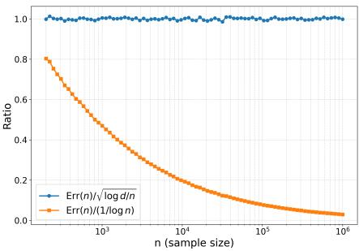  
Figure 1: Stability comparison of scaling-law ratios for Synthetic-FanoWorstCase (Thm-1).

Methodology. All experiments were implemented in PyTorch Geometric using a unified protocol across datasets. For each dataset, we trained GCN, GAT, and GraphSAGE on a log-spaced grid of sam ple sizes n $\in \{ 4 9 , \dots , n _ { \mathrm { m a x } } \}$ , where $n _ { \mathrm { m a x } }$ is the size of the training pool: 169,343 for ogbn\_arxiv, 50,000 for ogbn\_products\_50k and Reddi $\cdot \tt { t \_ { 5 0 k } }$ , and 20,000 for the synthetic settings (Synthetic-FanoWorstCase (Thm-1) and WorstCase\_Bottleneck\_20k). For each $n ,$ models were trained under 20 independent seeds (random initialization and random subsampling). To compare empirical behavior with Theorems 1 and 2, we computed the theory-aligned diagnostics $\mathrm { E r r } ( n ) / \sqrt { \log d / n }$ and Err $( n ) / ( d / \log n )$ . We then aggregated test losses across seeds and fit four candidate scaling laws, $\begin{array} { r } { c _ { 1 } + \frac { \alpha } { \sqrt { n } } , c _ { 2 } + \frac { \beta } { n } , c _ { 3 } + \frac { \delta } { \log n } } \end{array}$ , and $c _ { 4 } + n ^ { - \gamma }$ , using nonlinear least squares (curve\_fit) with inverse-variance weighting. Fit quality was evaluated via residual sum of squares (RSS), mean squared error (MSE), $R ^ { 2 }$ , and log–log slopes of the error curves.

Structural Verification of Theorem 2 Conditions. To test whether each dataset falls in the structural regime of Theorem 2, we compute $\lambda _ { 2 } ( \mathcal { L } )$ , homophily, and a single dataset-level constant $\kappa _ { 0 }$ that certifies the condition uniformly over the training-size grid $\mathcal { N }$ . We set $\kappa _ { 0 } : = \operatorname* { m a x } _ { n \in \mathcal { N } } \lambda _ { 2 } ( \mathcal { L } )$ log n and verify $\lambda _ { 2 } ( \mathcal { L } ) ~ \le ~ \kappa _ { 0 } /$ log n for all $n \in { \mathcal { N } } .$ Table 1 reports $\lambda _ { 2 } ( \mathcal { L } ) , \kappa _ { 0 } ,$ , and homophily, confirming that real-world graphs lie in the regime where Theorem $2 \mathit { \ ' } _ { S } \mathit { \ d } /$ log n bound applies. WorstCase\_Bottleneck\_20k satisfies the inequality tightly by construction, while Synthetic-FanoWorstCase violates it, yielding a genuine Theorem-1-type worst case. These trends match later results: more homophilic graphs with small spectral gaps mix more slowly, consistent with Theorem 2’s $d /$ log n convergence. Details for computing $\lambda _ { 2 } ( \mathcal { L } )$ are in Appendix N.

Direct Scaling Diagnostics via Error–Ratio Plots (Primary Evidence). We treat ratio diagnostics as the primary empirical test of our theoretical claims. For each dataset–model pair, we compute $\mathrm { R a t i o _ { 1 } } ( n ) = \mathrm { E r r } ( n ) / \sqrt { \log d / n }$ (Theorem 1 form) and $\operatorname { R a t i o } _ { 2 } ( n ) = \operatorname { E r r } ( n ) / \left( d / \log n \right)$ (Theorem 2 form). A ratio that remains approximately constant across n indicates empirical consistency with the corresponding theoretical rate.

Synthetic-FanoWorstCase (Thm-1). As expected, Figure 1 shows that $\mathrm { R a t i o _ { 1 } } ( n )$ stays essentially constant and near one, confirming that the synthetic construction follows $\sqrt { \log d / n }$ . In contrast, Ratio (n) decreases steadily with $n ,$ indicating that the $d /$ log n scaling does not fit the Theorem-1 instance. This behavior verifies the correctness of the construction. Additional controlled tests isolating the $n ^ { - 1 / 2 }$ and √log d dependencies appear in Appendix R.

Real-World Datasets. Figures 2, 3, and 4 show that across all three datasets and architectures, $\mathrm { R a t i o _ { 2 } } ( n ) = \mathrm { E r r } ( n ) / ( d / \log n )$ stays nearly flat over two to three orders of magnitude in n, while Ratio $. ( n ) = \mathrm { E r r } ( n ) / \sqrt { \log d / n }$ increases steadily, often sharply. This highlights a clear pattern: real GNN datasets empirically follow the $d /$ log n scaling predicted by Theorem 2.

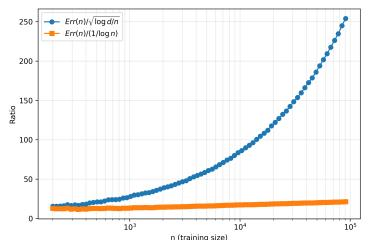

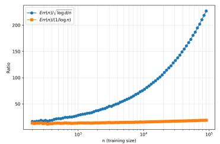

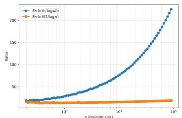  
Figure 2: Stability comparison of scaling-law ratios for ogbn\_arxiv (left: GAT, middle: GCN, right: GraphSAGE).

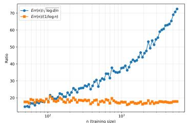

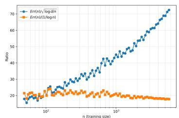

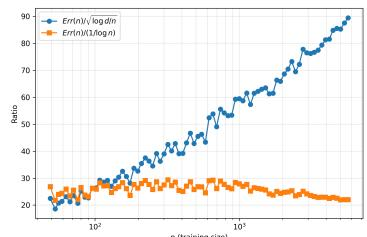  
Figure 3: Stability comparison of scaling-law ratios for ogbn\_products\_50k (left: GAT, middle: GCN, right: GraphSAGE).

Stress-Testing the Bounds with Synthetic Worst-Case Graphs. To demonstrate that both minimax bounds are tight in their respective structural regimes, we evaluate the synthetic graph satisfying Theorem 2 assumptions: WorstCase\_Bottleneck\_20k. As shown in Figure 5, Ratio (n) remains stable across n while $\mathrm { R a t i o _ { 1 } } ( n )$ increases sharply, mirroring the behavior observed in real datasets. This confirms that the $d /$ log n rate is tight under the spectral–homophily structure.

Estimating the Empirical Constant $C ^ { \star }$ . To further quantify the tightness of the minimax lower bounds, we estimate the empirical constant $C ^ { \star }$ associated with the structured-graph rate. For each dataset and architecture, we compute $\begin{array} { r } { C ^ { \star } \approx \frac { \operatorname { E r r } ( n ) } { d / \log n } } \end{array}$ , the plateau value of the ratio diagnostic $\mathrm { E r r } ( n ) / ( d / \log n )$ . Across real datasets ogbn\_arxiv, ogbn\_products\_50k, Reddit\_50k, C⋆ remains stable over several orders of magnitude in n, with dataset-specific ranges: approximately 15–25 for ogbn\_arxiv, 18–22 for ogbn\_products\_50k, and 10–20 for Reddit\_50k. For the synthetic WorstCase\_Bottleneck\_20k benchmark, $C ^ { \star }$ is in the range 8–12, consistent with its sharper bottleneck structure. This stability supports the conclusion that the empirical error scales proportionally to $d /$ log n within a controlled constant factor, as predicted by Theorem 2.

Supplementary Curve-Fit Analysis. Curve fitting is only secondary evidence in our empirical study, since fits can conflate noise, architecture bias, and optimization variance and thus, they are not a reliable basis for testing minimax rates. In our experiments, 1/ log n is the best-fit model in only (3/13) architecture–dataset combinations, so curve fits alone do not reliably reveal the scaling law. For transparency, Appendix Q shows curve-fit plots for ogbn\_arxiv and Reddit\_50k and provides complete raw-error tables (mean ± standard deviation over seeds) for each dataset, architecture, and training size; Table 2 reports the corresponding fit metrics.

<table><tr><td rowspan="2">Dataset</td><td rowspan="2">Model</td><td colspan="3"> $c_1 + \frac{\alpha}{\sqrt{n}}$ </td><td colspan="3"> $c_2 + \frac{2}{n}$ </td><td colspan="3"> $c_3 + \frac{8}{\log n}$ </td><td colspan="3"> $c_4 + \frac{1}{n^2}$ </td><td rowspan="2">Best Fit</td></tr><tr><td>RSS</td><td>MSE</td><td> $R^2$ </td><td>RSS</td><td>MSE</td><td> $R^2$ </td><td>RSS</td><td>MSE</td><td> $R^2$ </td><td>RSS</td><td>MSE</td><td> $R^2$ </td></tr><tr><td>Synthetic</td><td>FanoWorstCase</td><td>1.9208e-04</td><td>2.4010e-06</td><td>0.9984</td><td>1.1953e-02</td><td>1.4941e-04</td><td>0.9022</td><td>6.5175e-03</td><td>8.1469e-05</td><td>0.9467</td><td>3.5766e-03</td><td>4.4707e-05</td><td>0.9707</td><td> $1/\sqrt{n}$ </td></tr><tr><td>ogbn_arxiv</td><td>GAT</td><td>2.2867e-01</td><td>2.8584e-03</td><td>0.8103</td><td>9.6304e-02</td><td>1.2038e-03</td><td>0.9201</td><td>3.6116e-01</td><td>4.5145e-03</td><td>0.7004</td><td>4.6677e-01</td><td>5.8347e-03</td><td>0.6128</td><td> $1/n$ </td></tr><tr><td>ogbn_arxiv</td><td>GCN</td><td>1.7595e-01</td><td>2.1993e-03</td><td>0.9589</td><td>2.7996e-01</td><td>3.4995e-03</td><td>0.9345</td><td>4.0788e-01</td><td>5.0985e-03</td><td>0.9046</td><td>2.0546e+00</td><td>2.5683e-02</td><td>0.5195</td><td> $1/\sqrt{n}$ </td></tr><tr><td>ogbn_arxiv</td><td>GraphSAGE</td><td>4.5049e-01</td><td>5.6311e-03</td><td>0.9437</td><td>3.0781e-01</td><td>3.8476e-03</td><td>0.9615</td><td>1.0570e+00</td><td>1.3212e-02</td><td>0.8678</td><td>4.8763e+00</td><td>6.0954e-02</td><td>0.3903</td><td> $1/n$ </td></tr><tr><td>ogbn_products_50k</td><td>GAT</td><td>2.5313e+00</td><td>3.1641e-02</td><td>0.9493</td><td>8.2054e+00</td><td>1.0257e-01</td><td>0.8357</td><td>1.9013e+00</td><td>2.3767e-02</td><td>0.9619</td><td>4.0216e+01</td><td>5.0270e-01</td><td>0.1946</td><td> $1/\log n$ </td></tr><tr><td>ogbn_products_50k</td><td>GCN</td><td>6.9206e+00</td><td>8.6508e-02</td><td>0.9042</td><td>1.7162e+01</td><td>2.1452e-01</td><td>0.7625</td><td>4.7490e+00</td><td>5.9363e-02</td><td>0.9343</td><td>6.0513e+01</td><td>7.5642e-01</td><td>0.1626</td><td> $1/\log n$ </td></tr><tr><td>ogbn_products_50k</td><td>GraphSAGE</td><td>1.3516e+01</td><td>1.6895e-01</td><td>0.8577</td><td>2.8754e+01</td><td>3.5942e-01</td><td>0.6972</td><td>9.4352e+00</td><td>1.1794e-01</td><td>0.9006</td><td>8.1544e+01</td><td>1.0193e+00</td><td>0.1413</td><td> $1/\log n$ </td></tr><tr><td>Reddit_50k</td><td>GAT</td><td>2.3900e-01</td><td>3.9833e-03</td><td>0.9354</td><td>3.5081e-01</td><td>5.8468e-03</td><td>0.9052</td><td>3.4451e-01</td><td>5.7418e-03</td><td>0.9069</td><td>2.0218e+00</td><td>3.3697e-02</td><td>0.4537</td><td> $1/\sqrt{n}$ </td></tr><tr><td>Reddit_50k</td><td>GCN</td><td>8.0815e-01</td><td>1.0102e-02</td><td>0.8610</td><td>3.3071e-01</td><td>4.1339e-03</td><td>0.9431</td><td>1.3027e+00</td><td>1.6283e-02</td><td>0.7759</td><td>3.6335e+00</td><td>4.5419e-02</td><td>0.3749</td><td> $1/n$ </td></tr><tr><td>Reddit_50k</td><td>GraphSAGE</td><td>3.8742e+00</td><td>4.8427e-02</td><td>0.8522</td><td>1.6209e+00</td><td>2.0261e-02</td><td>0.9382</td><td>6.1461e+00</td><td>7.6827e-02</td><td>0.7655</td><td>2.1175e+01</td><td>2.6469e-01</td><td>0.1922</td><td> $1/n$ </td></tr><tr><td>WorstCase_Bottleneck_20k</td><td>GAT</td><td>1.5671e+00</td><td>2.6119e-02</td><td>0.9177</td><td>2.1349e-01</td><td>3.5581e-03</td><td>0.9888</td><td>2.6996e+00</td><td>4.4993e-02</td><td>0.8582</td><td>1.6011e+01</td><td>2.6685e-01</td><td>0.1587</td><td> $1/n$ </td></tr><tr><td>WorstCase_Bottleneck_20k</td><td>GCN</td><td>2.5240e-01</td><td>4.2067e-03</td><td>0.9571</td><td>4.8768e-02</td><td>8.1279e-04</td><td>0.9917</td><td>5.3007e-01</td><td>8.8346e-03</td><td>0.9099</td><td>4.2115e+00</td><td>7.0192e-02</td><td>0.2838</td><td> $1/n$ </td></tr><tr><td>WorstCase_Bottleneck_20k</td><td>GraphSAGE</td><td>9.3697e-02</td><td>1.5616e-03</td><td>0.9927</td><td>4.6429e-01</td><td>7.7382e-03</td><td>0.9638</td><td>3.3031e-01</td><td>5.5052e-03</td><td>0.9742</td><td>1.0156e+01</td><td>1.6927e-01</td><td>0.2079</td><td> $1/\sqrt{n}$ </td></tr></table>

Table 2: Comparison of Fit Metrics Across All Models and Datasets (Updated Results)

Unlike the ratio diagnostics, which unambiguously favor Theorem 2, the curve fits show mixed behavior: on ogbn\_products\_50k the best fits tend to favor 1/ log n, whereas on ogbn\_arxiv and Reddit-50k the fits sometimes prefer $1 / n$ or $1 / \sqrt { n }$ . This is expected and does not contradict theory: Curve-fit comparisons reflect finite-sample interpolation accuracy, not asymptotic minimax behavior. Ratio diagnostics directly test asymptotic structure and therefore carry higher evidential weight. Thus, curve fits serve as useful supporting evidence but are not the primary validation method.

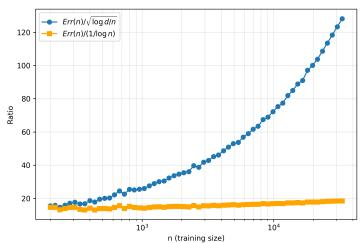

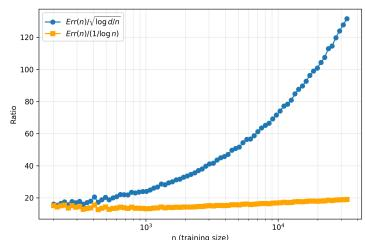

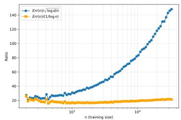  
Figure 4: Stability comparison of scaling-law ratios for Reddit\_50k (left: GAT, middle: GCN, right: GraphSAGE).

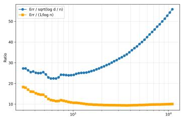

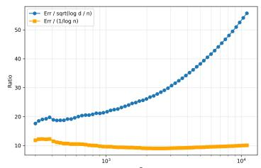

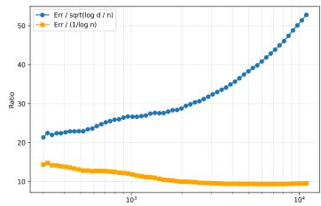  
Figure 5: Stability comparison of scaling-law ratios for WorstCase\_Bottleneck\_20k (left: GAT, middle: GCN, right: GraphSAGE).

Summary. By integrating structural verification, ratio-based scaling diagnostics, synthetic stress tests, curve fits, and raw-result tables, our empirical analysis consistently reveals that: (1) all realworld graph datasets lie inside the structural regime required for Theorem 2; (2) ratio diagnostics unambiguously select the d/ log n rate over $\sqrt { \log d / n }$ across architectures and datasets; (3) synthetic graphs constructed to satisfy Theorem 2 behave like real datasets, while the Theorem-1 synthetic graph behaves in the opposite way; and (4) curve fits do not contradict this conclusion.

Across real benchmarks with weak spectral gaps and moderate-to-high homophily, empirical conver gence often decaysfar more slowly than the classical $1 / { \sqrt { n } }$ rate, frequently approaching 1/ log n. This slower decay matches the structural constraints captured by Theorem 2, indicating that GNNs may need larger training sets to generalize reliably on graphs with long mixing times or bottlenecked communities. These trends highlight the importance of structure-aware generalization theory: effective rates depend on graph topology and mixing geometry rather than universal assumptions.

Taken together, the evidence shows that practical GNN learning problems operate in a spectral– homophily regime where Theorem 2 provides the correct characterization of sample complexity.

## 5 CONCLUSION

This paper establishes the first minimax characterization of GNN sample complexity across both inductive and transductive regimes. We show that the familiar $\sqrt { \log d / n }$ rate arises only in adversarial graph settings, while realistic graphs with slow mixing and strong community bottlenecks obey a fundamentally harder limit: a structure-driven $\Omega ( d / \log n )$ minimax rate. This reveals that graph topology, not architecture, dictates the effective sample size available to GNNs.

Our empirical results deliver a clear message. Theorem–1 synthetic graphs follow the $\sqrt { \log d / n }$ curve exactly, but all real benchmarks and the Theorem–2 synthetic construction show stable $d / \log n$ behavior across architectures and multiple orders of magnitude in n. Structural diagnostics further confirm that real graphs lie squarely within the spectral–homophily regime where Theorem 2 is tight.

These findings overturn the assumption that GNNs inherit classical $1 / { \sqrt { n } } { - } \mathrm { t y p e }$ generalization and instead demonstrate that practical GNN learning is typically structure-limited. Future work should develop architectures, sampling schemes, or pre-training strategies that counteract slow mixing, and extend structure-aware analyses to attention-based and higher-order models. Our results chart a clearer theoretical roadmap: generalization on graphs is governed by mixing geometry, and any scalable GNN methodology must contend with this structural barrier.

## 6 REPRODUCIBILITY STATEMENT

We have taken several steps to ensure the reproducibility of our work. All theoretical assumptions, theorems, and the proof sketch of Theorems 1 and 2 are explicitly stated in Section 3. The complete proofs of Theorems 1 and 2 are provided in Appendix E and Appendix F, respectively. Supporting technical components, including primer on minimax risk (Appendix A), degenerate GNN realizations (Appendix B), information-theoretic tools (Appendix C), Fano’s inequality (Appendix D), spectral and homophily assumptions (Appendix G), operator-norm control for attention (Appendices I–J), synthetic worst-case construction of Theorem 1 (Appendix O), and synthetic structured bottleneck dataset for Theorem 2 (Appendix P) are all provided for completeness. Experimental protocols are described in Section 4, while dataset descriptions, training procedures, and infrastructure details appear in Appendix M. To further support verification, we provide the full source code as supplementary material, including implementations for data loading, model training, evaluation, and error analysis. The package also contains scripts to reproduce all experimental results, regenerate LAT X tables, and visualize learning curves. Together, these resources ensure that both the theoretical and empirical results reported in this paper can be independently reproduced and validated.

## 7 ACKNOWLEDGMENT

This work was supported by NSF under Grant CNS-2150832 and Grant CNS-2528914.

## REFERENCES

Afonso S Bandeira, Amit Singer, and Daniel A Spielman. A cheeger inequality for the graph connection laplacian. SIAM Journal on Matrix Analysis and Applications, 34(4):1611–1630, 2013.

Robert M Fano and David Hawkins. Transmission of information: A statistical theory of communications. American Journal ofPhysics, 29(11):793–794, 1961.

Billy Joe Franks, Christopher Morris, Ameya Velingker, and Floris Geerts. Weisfeiler-leman at the margin: When more expressivity matters. In Ruslan Salakhutdinov, Zico Kolter, Katherine Heller, Adrian Weller, Nuria Oliver, Jonathan Scarlett, and Felix Berkenkamp (eds.), Proceedings ofthe 41st International Conference on Machine Learning, volume 235 of Proceedings ofMachine Learning Research, pp. 13885–13926. PMLR, 21–27 Jul 2024. URL https://proceedings. mlr.press/v235/franks24a.html.

Vikas K. Garg, Stefanie Jegelka, and Tommi Jaakkola. Generalization and representational limits of graph neural networks, 2020. URL https://arxiv.org/abs/2002.06157.

Edgar N Gilbert. A comparison of signalling alphabets. The Bell system technical journal, 31(3): 504–522, 1952.

Pegah Golestaneh, Mahsa Taheri, and Johannes Lederer. How many samples are needed to train a deep neural network?, 2024. URL https://arxiv.org/abs/2405.16696.

Will Hamilton, Zhitao Ying, and Jure Leskovec. Inductive representation learning on large graphs. In I. Guyon, U. Von Luxburg, S. Bengio, H. Wallach, R. Fergus, S. Vishwanathan, and R. Garnett (eds.), Advances in Neural Information Processing Systems, volume 30. Curran Associates, Inc., 2017a. URL https://proceedings.neurips.cc/paper\_files/ paper/2017/file/5dd9db5e033da9c6fb5ba83c7a7ebea9-Paper.pdf.

William L Hamilton, Rex Ying, and Jure Leskovec. Inductive representation learning on large graphs. In Advances in Neural Information Processing Systems, volume 30, pp. 1024–1034, 2017b.

Weihua Hu, Matthias Fey, Marinka Zitnik, Yuxiao Dong, Hongyu Ren, Bowen Liu, Michele Catasta, and Jure Leskovec. Open graph benchmark: Datasets for machine learning on graphs, 2021. URL https://arxiv.org/abs/2005.00687.

Thomas N. Kipf and Max Welling. Semi-supervised classification with graph convolutional networks, 2017. URL https://arxiv.org/abs/1609.02907.