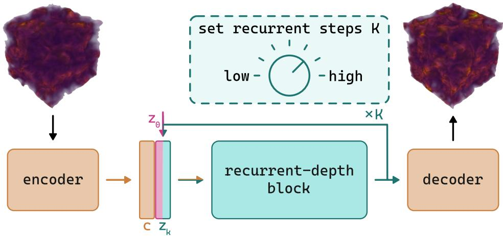
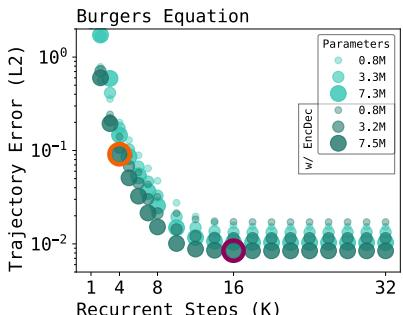
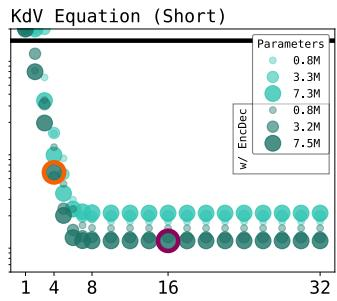
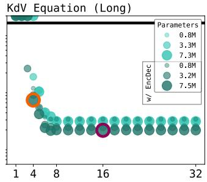
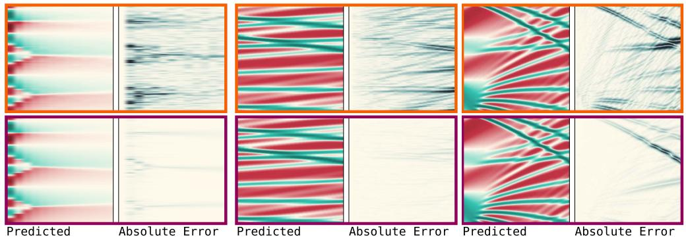
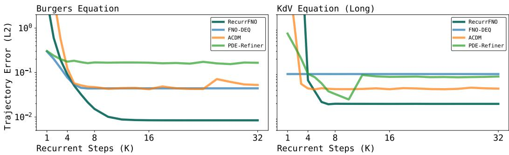

## ABSTRACT

Accuracy-cost trade-offs are a fundamental aspect of scientific computing. Classical numerical methods inherently offer such a trade-off: increasing resolution, order, or precision typically yields more accurate solutions at higher computational cost. We introduce Recurrent-Depth Simulator (RecurrSim) an architectureagnostic framework that enables explicit test-time control over accuracy-cost trade-offs in neural simulators without requiring retraining or architectural redesign. By setting the number of recurrent iterations K, users can generate fast, less-accurate simulations for exploratory runs or real-time control loops, or increase K for more-accurate simulations in critical applications or offline studies. We demonstrate RecurrSim’s effectiveness across fluid dynamics benchmarks (Burgers, Korteweg-De Vries, Kuramoto-Sivashinsky), achieving physically faithful simulations over long horizons even in low-compute settings. On high-dimensional 3D compressible Navier-Stokes simulations with 262k points, a 0.8B parameter RecurrFNO outperforms 1.6B parameter baselines while using 13.5% less training memory. RecurrSim consistently delivers superior accuracycost trade-offs compared to alternative adaptive-compute models, including Deep Equilibrium and diffusion-based approaches. We further validate broad architectural compatibility: RecurrViT reduces error accumulation by 90% compared to standard Vision Transformers on Active Matter, while RecurrUPT matches UPT performance on ShapeNet-Car using 44% fewer parameters.

## 1 INTRODUCTION

Simulations are fundamental to science and engineering. They enable scientists to study and predict the behavior of complex systems, and engineers to quickly iterate and optimize designs, without the need for expensive or impractical experiments. Early scientific computing, limited by computational resources, produced crude simulations with limited practical value. Today, with the availability of enormous computers, simulations have led to breakthroughs across different domains, including numerical weather prediction, fluid and particle flow, and drug and material design. Still, even with today’s computational resources, less accurate but fast simulations are essential for early-stage studies and prototyping.

In scientific computing, techniques for explicit control of the accuracy-cost trade-off are wellestablished. Heuristic search methods, such as genetic algorithms and simulated annealing, enable users to balance desired accuracy against available computational resources by controlling the size of the search space. For instance, genetic algorithms obtain better solutions with larger population sizes or by running more generations. Similarly, numerical methods, which have traditionally underpinned practically all simulations, have an inherent accuracy-cost trade-off: using finer discretizations, higher-order methods, and lower tolerances yields more accurate solutions but requires more computational resources to execute. For high-dimensional or large-scale problems, this trade-off becomes extremely unfavorable, rendering many real-world problems computationally intractable.

Machine learning provides a promising avenue to overcome this trade-off. Unlike numerical methods, which rely on explicitly defined formulations or heuristics, machine learning methods are general-purpose learners that learn directly from the vast amounts of available measurement and observational data, and are capable of generating simulations for a wide range of problems, geometries, discretizations, and boundary conditions. Machine learning methods also benefit from hardware and software advancements specifically developed for the machine learning ecosystem, including GPU acceleration frameworks and automated parallelization tools. Additionally, in favorable settings, machine learning methods can achieve comparable accuracy with less computational resources, or deliver greater accuracy within the same computational budget. Several works have successfully demonstrated these advantages on challenging applications including atmosphere and weather forecasting and industrial automotive design (Price et al., 2025; Bleeker et al., 2025).

At train-time, there are a number of tunable knobs available for controlling the test-time accuracycost trade-off of a neural simulator. Generally, allocating more computational resources during training leads to more accurate predictions—whether that is by increasing the training dataset size through data acquisition, data augmentation, or synthetic data; by increasing the model size through stacking more layers or using wider layers; or by improving the optimization process through more advanced optimizers, higher numerical precision, or training for more steps. Each of these train-time adjustments directly affect the test-time accuracy and cost.

At test-time, once a neural simulator has been trained, there are fewer tunable knobs. Deep Equilibrium models can iterate for more steps by increasing the maximum iteration limit or lowering the convergence tolerance, with additional iterations theoretically yielding solutions closer to the true fixed point (Bai et al., 2019). Diffusion models can make use of additional denoising steps or more advanced samplers to generate higher-quality outputs at greater cost (Ho et al., 2020; Lu et al., 2022). Recent advances in large language model inference has developed adaptive computation methods that dynamically allocate computational resources based on input complexity, enabling fast inference on simple prompts while spending additional compute on more challenging prompts (Wei et al., 2022; DeepSeek-AI et al., 2025; Geiping et al., 2025).

Our contributions are as follows:

1. We introduce RecurrSim, an architecture-agnostic, plug-and-play framework that enables explicit test-time control over accuracy-cost trade-offs in neural simulators, allowing a single model to generate both fast simulations and high-accuracy simulations.

2. We validate RecurrSim across diverse datasets (Burgers, Korteweg-De Vries, Kuramoto Sivashinsky, Active Matter, and ShapeNet-Car) and architectures (FNO, ViT, UPT), demonstrating physically faithful simulations even in low-compute settings, with superior memory and parameter efficiency on high-dimensional problems.

3. We establish accuracy-cost curves as an evaluation framework for adaptive neural simulations, demonstrating that RecurrSim overcomes key limitations of existing methods: architecture dependence, early plateauing, lack of anytime prediction capability, poor generalization to OOD recurrent iterations, and parameter sensitivity.

## 2 BACKGROUND

Partial Differential Equations. We consider time-dependent partial differential equations of the form

$$
\mathbf {u} _ {t} + \mathcal {N} (t, \mathbf {x}, \mathbf {u}, \mathbf {u} _ {\mathbf {x}}, \mathbf {u} _ {\mathbf {x x}}, \dots) = 0,
$$

where $t \in [ 0 , T ]$ represents the temporal dimension, $\textbf { x } \in { \mathcal { X } }$ represents the (possibly multiple) spatial dimension(s), and $\mathbf { u } ( t , \mathbf { x } ) : [ 0 , T ] \times \mathcal { X }  \mathbb { R } ^ { n }$ represents the state at $( t , \mathbf { x } )$ . Here, $\mathcal { N }$ is a nonlinear operator that governs the systems’ dynamics, describing the interactions among the different variables and their derivatives. We consider initial conditions given by ${ \bf u } ( 0 , { \bf x } ) = { \bf u } _ { 0 } ( { \bf x } )$ , and unless otherwise specified, assume periodic boundary conditions.

Discretizing the partial differential equations transforms the continuous equations into a discrete form, yielding a sequence of states at discrete time steps $\{ \mathbf { U } _ { n } \} _ { n = 0 } ^ { N }$ , where $\bar { N } = T / \Delta t$ is the number of time steps $\Delta t$ . This discretization induces an evolution operator $\mathcal { G } _ { : }$ , which maps the state at any given time step to the state at the subsequent time step $\mathcal { G } : \bar { \mathbf { U } _ { n } } \to \mathbf { U } _ { n + 1 }$

Neural Simulators. A neural (physics) simulator approximates the evolution operator $\mathcal { G }$ with a learned operator ${ \mathcal { G } } _ { \theta } .$ , often by minimizing the one-step loss $\mathcal { L } = | | U _ { t + 1 } - \mathcal { G } _ { \theta } ( \bar { U _ { t } } ) | | _ { 2 } ^ { 2 }$ , using data from high-fidelity simulations or real-world measurements. Repeated application of G generates a trajectory. Because the one-step loss does not measure trajectory performance, accuracy is typically quantified by a trajectory error:

$$
\frac {1}{N \cdot d} \sum_ {n = 1} ^ {N} \left| \left| U _ {n} - \mathcal {G} _ {\theta} ^ {(n)} (U _ {0}) \right| \right| _ {2} ^ {2},
$$

where d denotes the number of spatial points and $\mathcal { G } _ { \theta } ^ { ( n ) }$ denotes the n-fold application of the neural simulator. However, for chaotic systems where small errors grow exponentially, the trajectory error becomes unreliable as a measure of trajectory performance. Instead, we define

$$
\tau_ {\alpha} = \min \left\{t = n \Delta t \big | \rho (\mathbf {U} _ {n}, \mathcal {G} _ {\theta} ^ {(n)} (\mathbf {U} _ {0})) <   \alpha \right\},
$$

to be the earliest time at which the Pearson correlation coefficient $\rho$ between the true and predicted state falls below a specified threshold $\alpha \in ( 0 , 1 )$ . Computing $\tau _ { \alpha }$ for each test trajectory yields (i) the average correlation horizon, obtained by averaging all $\tau _ { \alpha }$ values, and (ii) the worst-case correlation horizon, obtained by selecting the minimum $\tau _ { \alpha } .$ . Together, the trajectory error and correlation horizons capture both long-term accuracy and stability.

Related Work. A wide range of architectures have been explored for neural simulators. For regular domains, convolutional-based architectures such as the Residual Network (ResNet (He et al., 2016)) and the U-shaped Encoder-Decoder (UNet (Ronneberger et al., 2015)) effectively capture local interactions, whereas spectral-based architectures, such as the Fourier Neural Operator (FNO (Li et al., 2020)) and its factorized variant (F-FNO (Tran et al., 2021)), leverage global frequencydomain features. For irregular domains, Brandstetter et al. (2022) propose a message-passing graph neural network, while Li et al. (2023) extend the FNO architecture with a geometry encoder and decoder, deforming an irregular mesh into a uniform latent space suitable for FNO application, and subsequently reversing this deformation. Pokle et al. (2022) propose FNO-DEQ, a Deep Equilibrium Model (DEQ (Bai et al., 2019)) variant with Fourier layers, to solve steady-state PDEs, showing improvements in accuracy and robustness to noise over baselines with four times as many parameters. Kohl et al. (2023) demonstrated that diffusion models are viable for turbulent flow simulation. Their results show that diffusion models outperform, in terms of long-term accuracy and stability, more efficient (and more commonly used) neural simulators. Recently, transformer-based architectures have gained prominence. Alkin et al. (2024) introduce the Universal Physics Transformer, a unified Eulerian-Lagrangian framework capable of handling large-scale simulations. Separately, McCabe et al. (2023) show that a single transformer pre-trained on multiple physics tasks can match or exceed task-specific baselines without additional fine-tuning.

These diverse architectures have demonstrated the potential of neural simulators across various scientific domains. Luz et al. (2020) performed experiments on a broad class of problems demonstrating improved convergence rates compared to highly efficient numerical methods. Pathak et al. (2020) found that the machine learning-assisted coarse-grid evolution resulted in corrected solution trajectories that were consistent with the solutions at a much higher resolution in space and time using highly-efficient spectral solvers. Stevens & Colonius (2020) proposed a method that outperforms a highly efficient numerical method in simulations where the numerical solution becomes overly diffused due to numerical viscosity.1 Aurora (Bodnar et al., 2024), a foundation model for the Earth system, outperforms operational forecasts in predicting air quality, ocean waves, tropical cyclone tracks and high-resolution weather, all at orders of magnitude lower computational costs. Aurora generates these predictions in approximately 0.6s per hour lead time on a single A100 GPU—this yields roughly a 100,000 times speed-up over CAMS. The fine-tuned model improves on all targets with an average magnitude of 54%. While these advances demonstrate the potential of neural simulators, explicit test-time control of the accuracy-cost trade-off remains largely unexplored.

  
Figure 1: Schematic of the Recurrent-Depth Simulator (RecurrSim) framework. RecurrSim consists of three main components: an encoder, a recurrent-depth block, and a decoder. At test-time, the user is able to control the accuracy-cost trade-off by setting the number of recurrent iterations K.

## 3 RECURRENT-DEPTH SIMULATOR

Overview. The proposed Recurrent-Depth Simulator (RecurrSim) framework consists of three main components: an encoder, a recurrent-depth block, and a decoder (see Figure 1). The encoder transforms the input state x into a conditioning vector c. An initial latent $\mathbf { z } _ { 0 }$ is drawn from a fixed distribution $p ( \mathbf { z } )$ (which may be deterministic). For a user-chosen number of recurrent iterations $K$ the recurrent-depth block $\mathcal { R } ( \cdot , \theta _ { \mathcal { R } } )$ —conditioned on c—iteratively updates the latent:

$$
\mathbf {z} _ {k} = \mathcal {R} \left(\left[ \mathbf {c}, \mathbf {z} _ {k - 1} \right], \theta_ {\mathcal {R}}\right), \qquad k = 1, \dots , K.
$$

After the final recurrent iteration, the decoder maps $\mathbf { z } _ { K }$ to the predicted state ${ \hat { \mathbf { y } } } .$

Training. RecurrSim is trained end-to-end. For each training sample, a number of recurrent iterations K is drawn from a distribution $p ( K )$ , the recurrent-depth block is applied that many times, a supervised loss is evaluated, and gradients are back-propagated through the computation (see Algorithm 1). Sampling a wide range of recurrent iterations K encourages the recurrent block to contract toward a fixed point.

A large number of recurrent iterations K inflates memory because every intermediate activation must ordinarily be stored. To bound the memory footprint, we use truncated backpropagation-throughdepth with a fixed backpropagation window B (Williams & Peng, 1990). Gradients are propagated through, at most, the last B recurrent iterations, while earlier iterations are treated as constants. This caps memory at $O ( B )$ regardless of K and has proved sufficient for optimization. Empirically, performance saturates at $B = 4$ , with larger values yielding diminishing returns but significantly increasing memory usage (see Appendix D).

Inference. At test-time, the user is free to choose the number of recurrent iterations K according to their desired accuracy and available computational resources (see Algorithm 2). Choosing a small K generates fast, less-accurate simulations ideal for exploratory runs, or real-time control loops; whereas choosing a large K value generates more-accurate, but slow, simulations suitable for critical applications or offline studies. Empirically, the first few recurrent steps make the largest adjustments to the latent vector ${ \bf z } _ { k } ;$ and subsequent steps contribute progressively smaller, yet still beneficial, adjustments. This behavior mirrors numerical methods, such as fixed-point and Newton methods, endowing RecurrSim with a strong inductive bias suitable for scientific computing tasks.

Modularity. RecurrSim is modular: each of, the encoder, recurrent-depth block, and decoder may be instantiated with the architecture primitive best suited to the problem—e.g., convolutional layers for Eulerian simulations or graph-convolutional layers for Lagrangian simulations—without altering training or inference algorithms. The entire framework remains a standard end-to-end, supervised model with no custom losses, schedulers, or tricks, so adoption is essentially plug-and-play.

Algorithm 1 Recurrent-Depth Simulator Training
Input: training data x, y
Output: model parameters $\theta_{\mathcal{E}}, \theta_{\mathcal{R}}, \theta_{\mathcal{D}}$
repeat
    for $i \in \mathcal{B}$ do
    c $\leftarrow$ $\mathcal{E}(\mathbf{x}_i, \theta_{\mathcal{E}})$
    z$_0$ $\sim$ p(z)
    K $\sim$ p(K)
    for k = 1 to K do
    z$_{k-1}'$ $\leftarrow$ [c, z$_{k-1}$]
    z$_k$ $\leftarrow$ $\mathcal{R}(\mathbf{z}_{k-1}', \theta_{\mathcal{R}})$
    end for
    $\hat{\mathbf{y}}_i$ $\leftarrow$ $\mathcal{D}(\mathbf{z}_K, \theta_{\mathcal{D}})$
    l$_i$ $\leftarrow$ ||$\mathbf{y}_i$ - $\hat{\mathbf{y}}_i$||
    end for
    accumulate losses for batch and take gradient step
until converged

Algorithm 2 Recurrent-Depth Simulator Inference
Input: input state x, number of recurrent iterations K, model parameters  $\theta_{E}, \theta_{R}, \theta_{D}$ 
Output: output state y
 $c \leftarrow \mathcal{E}(x, \theta_{\mathcal{E}})$  ▷ compute conditioning vector
 $z_{0} \sim p(z)$  ▷ sample initial latent representation
for k = 1 to K do ▷ unroll K recurrent iterations
 $z'_{k-1} \leftarrow [c, z_{k-1}]$  ▷ concatenate conditioning and latent representation
 $z_{k} \leftarrow \mathcal{R}(z'_{k-1}, \theta_{\mathcal{R}})$  ▷ apply recurrent block
end for
 $y \leftarrow \mathcal{D}(z_{K}, \theta_{\mathcal{D}})$  ▷ decode latent representation to predicted state

Initial Latent Distribution. The initial latent vector $\mathbf { z } _ { 0 }$ is drawn from a fixed distribution $p ( \mathbf { z } )$ Common choices include degenerate distributions (e.g., zeros or average of target fields), standard normal distributions, or heavy-tailed alternatives like Student-t priors (Pandey et al., 2025). Empirically, this choice primarily affects early iterations, with minimal impact later as the latent converges toward the fixed point. We use the standard normal distribution $\bar { \mathcal { N } ( \mathbf { 0 } , \mathbf { I } ) }$ for consistency with DEQ and diffusion models.

Recurrent Iteration Distribution. The number of recurrent iterations K is drawn from a Poisson log-normal distribution:

$$
\begin{array}{l} v \sim \mathcal {N} \left(\log \bar {K} - \frac {1}{2} \sigma^ {2}, \sigma\right), \\ K \sim \text { Poisson } \left(e ^ {v}\right) + 1, \end{array}
$$

where $\bar { K } + 1$ is the desired mean (Geiping et al., 2025). This distribution exposes the model to a broad spectrum of compute budgets during training: it is positively skewed with most draws landing near $\bar { K } .$ , but occasional very small and very large values are sampled, encouraging the recurrentblock to remain stable across both shallow and deep rollouts. Empirically, performance saturates around $\bar { K } = 3 2 ( \sigma = 0 . 5 )$ , with larger values providing diminishing returns (see Appendix E).

Merging Conditioning and Latent Vectors. At each recurrent iteration, the conditioning vector c is merged with the current latent vector $\mathbf { z } _ { \mathbf { k } } .$ The most straightforward scheme is plain addition: ${ \bf z } _ { k } ^ { \prime } = { \bf c } + { \bf z } _ { k }$ . A slightly richer variant introduces learnable scalar weights: $\mathbf { z } _ { k } ^ { \prime } = \alpha \mathbf { c } + \beta \mathbf { z } _ { k } ;$ the weights can be made element-wise: $\mathbf { z } _ { k } ^ { \prime } = \pmb { \alpha } \odot \mathbf { c } + \beta \odot \mathbf { z } _ { k }$ . Alternatives include point-wise projection, or concatenating and passing the result through a width-halving layer. Empirically, addition with element-wise weights offers the best balance between parameter efficiency and performance (see Appendix H).

## 4 RESULTS

Complete experimental details, including hardware specifications, data acquisition, data generation, preprocessing pipelines, training pipelines, and architectural configurations, are provided in Appendix A-C. We conduct experiments across diverse datasets including Burgers Equation, Korteweg-De Vries Equation, Kuramoto-Sivashinsky Equation, Compressible Navier-Stokes Equations, Active Matter, and ShapeNet-Car; and across multiple architectural backbones including Fourier Neural Operator (RecurrFNO), Vision Transformer (RecurrViT), and Universal Physics Transformer (RecurrUPT).

## 4.1 EQUATIONS

Burgers Equation. The Burgers equation is a second-order nonlinear partial differential equation derived to model convective steepening and diffusive smoothing. Its one-dimensional variant can be expressed as:

$$
u _ {t} + u u _ {x} = \nu u _ {x x}.
$$

Here, ν plays the role of kinematic viscosity. Setting $\nu = 0$ yields the inviscid form $u _ { t } + u u _ { x } = 0 .$ whose solutions develop finite-time shock discontinuities; the viscous term $\nu u _ { x x }$ regularises these shocks but introduces extremely thin internal layers that remain numerically stiff. Machine learning methods must learn to represent sharp gradients, moving shocks and the delicate interplay between nonlinearity and diffusion.

Korteweg-De Vries Equation. The Korteweg-De Vries (KdV) is a third-order nonlinear partial differential equation derived to model weakly nonlinear, weakly dispersive unidirectional waves. Its one-dimensional variant can be expressed as:

$$
u _ {t} + \alpha u u _ {x} + u _ {x x x} = 0.
$$

Here, α (often set to ±1 or ±6) controls nonlinear steepening while the third-order derivative $u _ { x x x }$ introduces dispersion. The exact balance of these effects produces solitary-wave solutions (solitons) that preserve their shape and speed and undergo only phase shifts upon interaction –small amounts of artificial dissipation can destroy these very structures making KdV an ideal candidate for evaluating whether machine learning methods can maintain accuracy, stability and conservation over long horizons.

Kuramoto-Sivashinsky Equation. The Kuramoto-Sivashinsky (KS) equation is a fourth-order nonlinear partial differential equation derived to model diffusive-thermal instabilities in laminar flame fronts. Its one-dimensional variant can be expressed as:

$$
u _ {t} + u _ {x x} + u _ {x x x x} + u u _ {x} = 0.
$$

Here, the fourth-order derivative $u _ { x x x x }$ and the nonlinear term $u u _ { x }$ contribute to complex and chaotic behavior which present a challenge for traditional numerical solvers. The challenges and the wide applicability of the KS equation make it an ideal candidate for evaluating machine learning methods.

Compressible Navier-Stokes Equations. The three-dimensional Compressible Navier-Stokes (CNS) equations model complex phenomena such as shock wave formation and propagation. They are widely used across various engineering and physics applications, including aircraft wing aerodynamics and the formation of interstellar gases. The equations can be expressed as:

$$
\partial_ {t} \rho + \nabla \cdot (\rho \mathbf {v}) = 0, \quad \rho (\partial_ {t} \mathbf {v} + \mathbf {v} \cdot \nabla \mathbf {v}) = - \nabla p + \eta \Delta \mathbf {v} + (\zeta + \eta / 3) \nabla (\nabla \cdot \mathbf {v}),
$$

$$
\partial_ {t} (\epsilon + \rho \mathbf {v} ^ {2} / 2) + \nabla \cdot \left[ (p + \epsilon + \rho \mathbf {v} ^ {2} / 2) \mathbf {v} - \mathbf {v} \cdot \boldsymbol {\sigma^ {\prime}} \right] = 0,
$$

where $\rho$ is the mass density, v is the fluid velocity, p is the pressure, and ϵ is the internal energy determined by the equation of state. The term $\sigma ^ { \prime }$ denotes the viscous stress tensor, while η and ζ represent the shear and bulk viscosities, respectively. In this case, using a classical numerical solver to approximate the fluid flow is particularly challenging due to strict stability constraints, high computational cost, and the need for accurate yet robust numerical schemes that handle shocks, dissipation, and grid adaptivity in large-scale domains. Even though machine learning can overcome several of the challenges posed by traditional solvers, training a neural simulator on three-dimensional data comes with considerable engineering complexity. The primary limitation arises from storing the activations during training, increasing the memory requirement compared to smaller dimensions problems.

  
Recurrent Steps (K)

  
Recurrent Steps (K)

  
Recurrent Steps (K)

  
Figure 2: Top: Trajectory Error (L2) versus Recurrent Steps (K) for the Burgers (left), short-horizon KdV (middle), and long-horizon KdV (right). Bottom: Trajectories at K = 4 (orange) and $K = 1 6$ (purple) (highlighted above). Increasing K sharpens shocks in Burgers and aligns soliton crests in KdV, illustrating how recurrent depth controls the accuracy–cost trade-off. See Figure 13 for detailed visualization of Bottom with ground truth and colorbars.

## 4.2 EXPERIMENT: ACCURACY-COST TRADE-OFF

Commonly used neural simulators are trained for a single accuracy-cost setting: once the model is trained, every forward pass delivers the same expected accuracy and incurs the same cost. RecurrSim, on the other hand, has a tunable knob for controlling the accuracy-cost setting (the number of recurrent iterations K). The purpose of this experiment is to empirically demonstrate whether rolling out the trajectory across values of recurrent iterations K is viable.

Experimental Setup. We conduct experiments on three datasets: Burgers, short-horizon KdV, and long-horizon KdV. Two instantiations of RecurrSim are benchmarked. The first variant (RecurrFNO wo/ EncDec) lifts the input with a point-wise operation, recursively applies a recurrent-depth block with a single Fourier layer, and projects back to physical space; the second variant (RecurrFNO w/ EncDec) inserts an additional Fourier layer in, both, the encoder and decoder. For each variant, we target three parameter budgets (∼ 1.0M, 3.5M, 7.5M), yielding six models per dataset. We use $\bar { K } = 3 \bar { 2 }$ and $B = 4$ . After convergence, we generate trajectories for every $K \in \{ 1 , \ldots , 3 2 \}$ and measure the trajectory error. All experiments are repeated with three seeds and averaged.

Results. Across all three datasets, both variants show the same qualitative accuracy-cost curve (Figure 2), but RecurrFNO w/ EncDec achieves consistently lower trajectory error. As K increases, the trajectory error falls steadily and plateaus around $K = 1 6$ for Burgers and $K = 8$ for both, short- and long-horizon KdV ; further steps neither help nor harm. For each dataset, we plot low-compute $( K = 4 )$ and high-compute $( K = 1 6 )$ trajectories. In Burgers, the two settings reproduce the same shock patterns, with the low-compute run showing slightly larger absolute error around the fronts. In both KdV datasets, the low-compute run already recovers the full soliton train; the absolute error is almost entirely a small amplitude and/or phase offset, visible as narrow streaks along the soliton trajectories. Increasing to $K = 1 6$ sharpens the shocks and aligns the soliton crests. These results demonstrate that RecurrFNO delivers physically faithful simulations over a range of accuracy-cost settings. Extended results are presented in Appendix I.

  
Figure 3: Trajectory Error (L2) versus Recurrent Steps (K) for the Burgers (left), and long-horizon KdV (right). Curves compare RecurrFNO (teal), FNO-DEQ (blue) (Marwah et al., 2023), ACDM (orange) (Kohl et al., 2023), and PDE-Refiner (green) (Lippe et al., 2023). Across both tasks, RecurrFNO achieves the best accuracy-cost curve and reaches the lowest plateau.

## 4.3 EXPERIMENT: ALTERNATIVES

There are a few recent neural simulators that have test-time controllable knobs. FNO-DEQ is a Deep Equilibrium Model with Fourier layers whose runtime is set by a maximum number of iterations or a minimum update. ACDM—an autoregressive conditional diffusion model—is able to adjust the prediction quality by varying the number and schedule of denoising steps. PDE-Refiner applies the same diffusion principle in a direct prediction and refinement process. In this experiment, we benchmark RecurrFNO against the three alternatives under identical data and training setups.

Experimental Setup. We conduct experiments on three datasets: Burgers, long-horizon KdV, and long-horizon Kuramoto-Sivashinsky. For RecurrSim, we carry over the best variant from the previous set of experiments: point-wise lift + Fourier layer encoder, a recurrent-depth block with one Fourier layer, Fourier layer with point-wise projection decoder—configured with ∼ 7.5M parameters, $\bar { K } = 3 2 .$ , and $B = 4$ steps. FNO-DEQ follows the setup of Pokle et al. (2022), with its width scaled to match a parameter count of ∼ 7.5M. ACDM and PDE-Refiner use a modern UNet backbone from their original implementations (Kohl et al., 2023; Lippe et al., 2023). In early tests, both diffusion-based models proved parameter-inefficient and could not rollout beyond a few steps, so we train them with ∼ 15M parameters for Burgers and KdV, and ∼ 50M parameters for KS (the scale used by Lippe et al. (2023)). After convergence, we generate trajectories for every $K \in \{ 1 , \ldots , 3 2 \}$ (where K is equal to the recurrent steps for RecurrSim, iterations for FNO-DEQ, and denoising steps for ACDM and PDE-Refiner). On Burgers and KdV, we measure and report the trajectory error. Since the KS equation produces chaotic behavior, we measure the average and worst-case correlation horizon over a sweep of 30 thresholds $( \alpha = 0 . 7 – 0 . 9 9$ in increments of 0.01).

Results. On Burgers, FNO-DEQ, ACDM, and PDE-Refiner all plateau by $K \approx 4$ (see Figure 3 (left)); PDE-Refiner gains practically nothing beyond its second refinement step. RecurrFNO, by contrast, continues to improve until $\dot { K } \approx 1 6 ,$ , while using half the parameters of the diffusion-based models. On KdV, FNO-DEQ exhibits the convergence limitation reported by Sittoni & Tudisco (2024)—the latent representation oscillates around, rather than converges to, the fixed point—so additional iterations provide no improvement. The ten-fold larger training dataset helps the diffusionbased models, however, once again, ACDM plateaus near $\bar { \boldsymbol { K } } \approx 4$ . PDE-Refiner improves up to $K = 1 1$ before degrading because larger K values are out-of-distribution. RecurrFNO delivers the best accuracy-cost curves and lowest trajectory errors. On KS (see Appendix I), where the diffusion-based models have 7-fold the amount of parameters as RecurrFNO, ACDM plateaus early, and PDE-Refiner shows erratic worst-case correlation horizons. Taken together, RecurrFNO consistently outperforms alternatives while using fewer parameters.

<table><tr><td>Model</td><td>Params</td><td>Training Memory</td><td>Training Epochs</td><td>Training GFLOPs</td><td>MSE ×10-2Density</td><td>MSE ×10-2Pressure</td><td>MSE ×10-2Velocity</td></tr><tr><td>FNO</td><td>0.5B</td><td>38 GB</td><td>100</td><td>1 × 107</td><td>9.60 ± 0.03</td><td>9.59 ± 0.03</td><td>9.55 ± 0.03</td></tr><tr><td>FNO</td><td>1.0B</td><td>57 GB</td><td>100</td><td>2 × 107</td><td>7.83 ± 0.02</td><td>7.79 ± 0.02</td><td>7.82 ± 0.03</td></tr><tr><td>FNO</td><td>1.6B</td><td>73 GB</td><td>100</td><td>3 × 107</td><td>7.61 ± 0.01</td><td>7.59 ± 0.02</td><td>7.62 ± 0.03</td></tr><tr><td>RecurrFNO</td><td>0.8B</td><td>64 GB</td><td>82</td><td>3 × 107</td><td>7.57 ± 0.04</td><td>7.51 ± 0.01</td><td>7.53 ± 0.03</td></tr><tr><td>RecurrFNO</td><td>0.8B</td><td>64 GB</td><td>100</td><td>5 × 107</td><td>7.37 ± 0.03</td><td>7.33 ± 0.01</td><td>7.36 ± 0.03</td></tr></table>

Table 1: Comparison between FNO and RecurrFNO on 3D Compressible Navier-Stokes Equations.

<table><tr><td>Model</td><td>Params</td><td>MSE  $\times 10^{-2}$ Steps 0:3</td><td>MSE  $\times 10^{-2}$ Steps 0:6</td><td>MSE  $\times 10^{-2}$ Steps 0:12</td></tr><tr><td>ViT</td><td>130M</td><td>2.91</td><td>12.41</td><td>43.16</td></tr><tr><td>RecurrViT</td><td>75M</td><td>0.54</td><td>1.31</td><td>5.68</td></tr></table>

<table><tr><td>Model</td><td>Resolution</td><td>Params</td><td>MSE ×10-2Original Work</td><td>MSE ×10-2Our Work</td></tr><tr><td>UPT</td><td>323</td><td>164M</td><td>2.35</td><td>2.31</td></tr><tr><td>RecurrUPT</td><td>323</td><td>92M</td><td>N/A</td><td>2.19</td></tr></table>

Table 2: Comparison between ViT and RecurrViT on Active Matter.  
Table 3: Comparison between UPT and RecurrUPT on ShapeNet-Car.

## 4.4 EXPERIMENT: HIGH-DIMENSIONAL SIMULATIONS AND TRANSFORMER VARIANTS

Many real-world scientific simulations involve high-dimensional problems where memory-intensive approaches like ADCM and PDE-Refiner become computationally prohibitive. Additionally, the generalizability of RecurrSim across different architectural primitives and problem domains remains to be demonstrated. We address these challenges through three targeted experiments: (1) evaluating memory efficiency on high-dimensional 3D compressible Navier-Stokes equations (262k grid points) where traditional deep networks face memory constraints, (2) demonstrating architectural flexibility by adapting Kohl et al. (2023)’s vision transformers for active matter simulations (Ohana et al., 2025), and (3) validating the framework’s drop-in compatibility by recreating UPT’s (Alkin et al., 2024) ShapeCar-Net experiments, only adapting their approximator module by decreasing the depth and wrapping it in a recurrent-block—this significantly lowers the number of trainable parameters.

Results. RecurrSim variants consistently achieve superior accuracy with dramatically reduced computational requirements across all domains (Table 1, Table 2, Table 3). On 3D compressible Navier-Stokes equations, RecurrFNO with K¯ = 8 outperforms all FNO baselines, including a 1.6B parameter model, while requiring less memory (64GB vs 73GB). When training epochs are matched (K¯ = 16), RecurrFNO achieves MSE improvements on density, pressure, and velocity compared to the strongest FNO baseline. On Active Matter, RecurrViT with 75M parameters (58% of ViT’s 130M) reduces error accumulation by 83% at 3 timesteps and maintains 87% lower error at 12 timesteps. On ShapeNet-Car, RecurrUPT with 92M parameters (56% of UPT’s 164M) achieves better performance to the original work, demonstrating perfect drop-in compatibility. These results establish that RecurrSim provides a universal framework for test-time accuracy-cost control: users can deploy a single trained model across diverse computational budgets simply by adjusting the number of recurrent iterations.

## 5 CONCLUSIONS AND FUTURE WORK

We introduce the Recurrent-Depth Simulator (RecurrSim), an architecture-agnostic framework enabling explicit test-time control over accuracy-cost trade-offs in neural simulators. By adjusting the number of recurrent iterations K at inference, users can deploy a single trained model across diverse computational budgets—from fast exploratory runs to high-accuracy critical simulations. RecurrSim demonstrates physically faithful behavior across fluid dynamics benchmarks and consistently outperforms existing adaptive methods (FNO-DEQ, ACDM, PDE-Refiner) while using fewer parameters. On high-dimensional problems, RecurrFNO with 0.8B parameters outperforms 1.6B FNO baselines using 13.5% less memory, while RecurrViT and RecurrUPT show similar advantages across transformer architectures. This plug-and-play framework fundamentally improves neural simulator utility and opens new research directions in adaptive scientific computing.

Ethics Statement. We adhere to the ICLR Code of Ethics. Our work does not involve human subjects, create potentially harmful insights, raise discrimination/bias/fairness concerns, or pose privacy and security risks. Our work uses data generated from numerical solvers (which we make publicly available) and publicly available datasets. The aim of this work is to advance AI for Science. Although related methods may be deployed in critical applications, we do not deploy in such contexts. We have taken care to report results honestly, acknowledge limitations, and follow best practices for research integrity.

Reproducibility Statement. We have made significant effort to ensure reproducibility. We use clear and consistent terminology throughout the work. Section 3 describes our framework in detail, explaining each design choice and linking to ablation studies in the Appendix. Section 4 describes the motivation and practical implementation of each experiment, with additional results in the Appendix. The Appendices provide complete descriptions of hardware specifications (Appendix A), data generation and processing (Appendix B), hyperparameters and optimization details (Appendix C, and pseudocode (Appendix J). We also provide source code for all experiments. Together, these resources enable independent researchers to reproduce and verify our findings.

Acknowledgments. The work of FT is partially funded by the PRIN-MUR project MOLE code: 2022ZK5ME7 and by the PRIN-PNRR project FIN4GEO within the European Union’s Next Generation EU framework, Mission 4, Component 2, CUP P2022BNB97

## REFERENCES

Benedikt Alkin, Andreas Furst, Simon Schmid, Lukas Gruber, Markus Holzleitner, and Johannes¨ Brandstetter. Universal physics transformers: A framework for efficiently scaling neural operators. Advances in Neural Information Processing Systems, 2024.

Jacob Austin, Daniel D Johnson, Jonathan Ho, Daniel Tarlow, and Rianne Van Den Berg. Structured denoising diffusion models in discrete state-spaces. Advances in neural information processing systems, 34:17981–17993, 2021.

Shaojie Bai, J Zico Kolter, and Vladlen Koltun. Deep equilibrium models. Advances in neural information processing systems, 32, 2019.

Shaojie Bai, Vladlen Koltun, and J Zico Kolter. Multiscale deep equilibrium models. Advances in neural information processing systems, 33:5238–5250, 2020.

Maurits Bleeker, Matthias Dorfer, Tobias Kronlachner, Reinhard Sonnleitner, Benedikt Alkin, and Johannes Brandstetter. Neuralcfd: Deep learning on high-fidelity automotive aerodynamics simulations. arXiv preprint arXiv:2502.09692, 2025.

Cristian Bodnar, Wessel P Bruinsma, Ana Lucic, Megan Stanley, Johannes Brandstetter, Patrick Garvan, Maik Riechert, Jonathan Weyn, Haiyu Dong, Anna Vaughan, et al. Aurora: A foundation model of the atmosphere. arXiv preprint arXiv:2405.13063, 2024.

Johannes Brandstetter, Daniel Worrall, and Max Welling. Message passing neural pde solvers. arXiv preprint arXiv:2202.03376, 2022.

Nanxin Chen, Yu Zhang, Heiga Zen, Ron J Weiss, Mohammad Norouzi, and William Chan. Wavegrad: Estimating gradients for waveform generation. arXiv preprint arXiv:2009.00713, 2020.

DeepSeek-AI, Daya Guo, Dejian Yang, Haowei Zhang, Junxiao Song, Ruoyu Zhang, Runxin Xu, Qihao Zhu, Shirong Ma, Peiyi Wang, Xiao Bi, Xiaokang Zhang, Xingkai Yu, Yu Wu, Z. F. Wu, Zhibin Gou, Zhihong Shao, Zhuoshu Li, Ziyi Gao, Aixin Liu, Bing Xue, Bingxuan Wang, Bochao Wu, Bei Feng, Chengda Lu, Chenggang Zhao, Chengqi Deng, Chenyu Zhang, Chong Ruan, Damai Dai, Deli Chen, Dongjie Ji, Erhang Li, Fangyun Lin, Fucong Dai, Fuli Luo, Guangbo Hao, Guanting Chen, Guowei Li, H. Zhang, Han Bao, Hanwei Xu, Haocheng Wang, Honghui Ding, Huajian Xin, Huazuo Gao, Hui Qu, Hui Li, Jianzhong Guo, Jiashi Li, Jiawei Wang, Jingchang Chen, Jingyang Yuan, Junjie Qiu, Junlong Li, J. L. Cai, Jiaqi Ni, Jian Liang, Jin Chen, Kai Dong, Kai Hu, Kaige Gao, Kang Guan, Kexin Huang, Kuai Yu, Lean Wang, Lecong Zhang, Liang Zhao, Litong Wang, Liyue Zhang, Lei Xu, Leyi Xia, Mingchuan Zhang, Minghua Zhang,