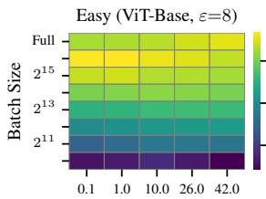
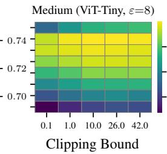
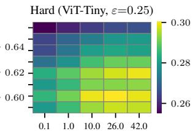
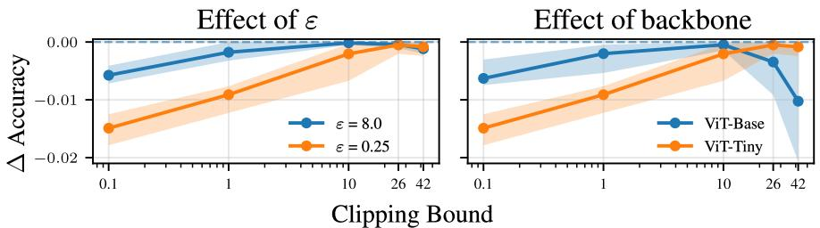
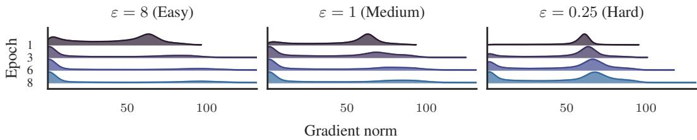
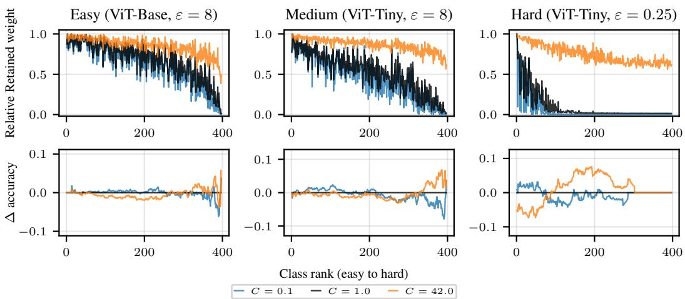
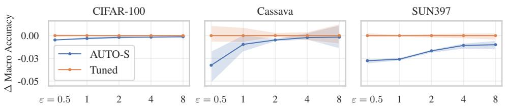
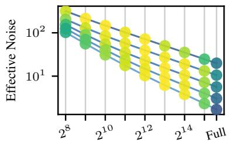
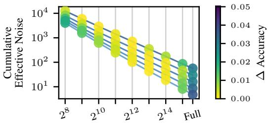
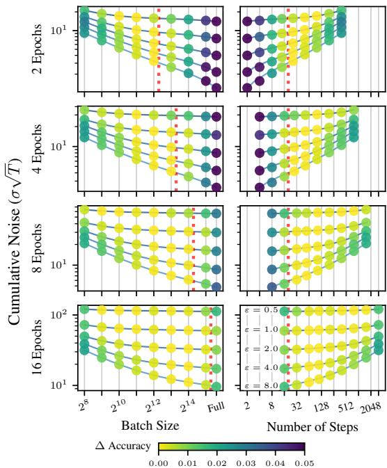

## ABSTRACT

Differentially private (DP) transfer learning, i.e., fine-tuning a pretrained model on private data, is the current state-of-the-art approach for training large models under privacy constraints. We focus on two key hyperparameters in this setting: the clipping bound C and batch size B. We show a clear mismatch between the current theoretical understanding of how to choose an optimal C (stronger privacy requires smaller C) and empirical outcomes (larger C performs better under strong privacy), caused by changes in the gradient distributions. Assuming a limited compute budget (fixed epochs), we demonstrate that the existing heuristics for tuning B do not work, while cumulative DP noise better explains whether smaller or larger batches perform better. We also highlight how the common practice of using a single (C, B) setting across tasks can lead to suboptimal performance. We find that performance drops especially when moving between loose and tight privacy and between plentiful and limited compute, which we explain by analyzing clipping as a form of gradient re-weighting and examining cumulative DP noise.

## 1 INTRODUCTION

The current state-of-the-art approach for training large models on sensitive data is differentially private (DP) transfer learning: after pretraining a backbone on non-private data, the model is fine-tuned on the private task using a DP optimizer, such as DP-SGD or DP-Adam (De et al., 2022). Due to the high computational requirements of DP optimization, commonly only the learning rate is tuned for each separate problem, while other hyperparameters, most importantly batch size and/or clipping bound, are assumed to be stable and fixed to a single value across different privacy levels, backbones, and computational budgets (see, e.g., De et al. 2022; Panda et al. 2024; Sander et al. 2023).





  
Figure 1: Macro accuracy heatmaps under increasing learning-problem difficulty (left to right): strong model with loose privacy, weaker model with same privacy, and weaker model with tight privacy. Experiments use DP-Adam with $\delta = 1 0 ^ { - 5 }$ on SUN397 (‘Full’=87002), averaged over 5 seeds with 8 epochs each. Learning rates are tuned separately for each configuration using a fixed grid. No single clipping bound or batch size performs best across all settings.

In this paper, we demonstrate that fixing hyperparameters often leads to suboptimal performance and explain why this happens. We find across multiple datasets that the optimal clipping bound and batch size are affected by the overall learning–problem difficulty—that is mainly governed by the privacy budget, available data and compute, dataset difficulty, transfer complexity (Tobaben et al., 2023), and the pretrained backbone capability, which reflects both model complexity (Hu et al., 2021b) and pretraining quality.

Figure 1 illustrates how fixing the clipping bound and batch size across problems fails to account for this difficulty: the settings that perform best in easy cases degrade clearly under harder ones, and vice versa. Ignoring these shifts and fixing clipping bound and batch size across tasks systematically suppresses DP transfer learning performance, reducing overall accuracy and especially harming difficult examples and the classes they dominate. We summarize implications for hyperparameter tuning in Table 1.

Table 1: Practical implications for hyperparameter tuning.

<table><tr><td>Change in condition</td><td>Tuning implication</td></tr><tr><td>Lower ε (tighter privacy)</td><td>Increase C, decrease B.</td></tr><tr><td>Stronger backbone / easier dataset</td><td>Use smaller C.</td></tr><tr><td>Weaker backbone / harder dataset</td><td>Try larger C.</td></tr><tr><td>Fewer epochs (limited compute)</td><td>Avoid large B (⇒ more steps).</td></tr><tr><td>More epochs</td><td>Larger B becomes viable.</td></tr><tr><td>General guidance</td><td>Tune (C, B, η) jointly for each task.</td></tr></table>

## Contributions

1. We present a systematic study of how the optimal clipping bound C and batch size B vary— primarily with the privacy budget (ε), but also with other factors that affect the difficulty of the private fine-tuning task, such as the capability of the pretrained backbone and the amount of compute—in DP deep transfer learning.

2. We demonstrate through extensive experiments that contrary to what previous theory suggests, increasing C can improve results with smaller ε (Section 5.1), and with less capable pretrained models (Section 5.2). To explain these findings, we derive a novel optimal clipping result (Theorem 5.2) and show how it affects optimization progress (Theorem 5.4, Corollary 5.5), which results might be of independent interest.

3. We propose a rule for selecting the optimal batch size under bounded compute (fixed epochs) through a combination of a lower bound on the number of optimisation steps and maximising the number of steps without increasing the total cumulative DP noise (Section 6).

## 2 BACKGROUND

DP (Dwork et al., 2006b) provides a formal guarantee that an algorithm’s output distribution does not depend too strongly on any single individual’s record. This guarantee is defined with respect to neighboring datasets, which differ by one record. Formally:

Definition 2.1. (Approximate differential privacy, Dwork et al., 2006b;a)

An algorithm  :    is (ε, δ)-differentially private if for all neighboring datasets $D , D ^ { \prime } \in \mathcal { D }$ andfor all subsets $S \subseteq { \mathcal { R } } ,$ , it holds that

$$
\operatorname * {P r} [ \mathcal {M} (D) \in S ] \leq e ^ {\varepsilon} \operatorname * {P r} [ \mathcal {M} (D ^ {\prime}) \in S ] + \delta .
$$

We use the add-remove neighborhood relation with sample-level privacy, meaning the neighboring datasets differ by the presence or absence of a single training example. ε > 0 and $\delta \in [ 0 , 1 ]$ control the strength of the privacy guarantee with smaller values implying stronger privacy. We set $\delta ^ { ^ { \prime } } = 1 0 ^ { - 5 }$ in all the experiments.

In machine learning, DP is typically enforced by adjusting the optimization process by suitably randomizing each optimizer step. Algorithms such as DP-SGD (Song et al., 2013; Abadi et al., 2016; Rajkumar & Agarwal, 2012) and DP-Adam (Abadi et al., 2016; Kingma & Ba, 2015) clip per-example gradients to a fixed norm in order to bound the sensitivity—the maximum change any single record can have on the model update. The optimizer then adds noise, calibrated to the sensitivity, to the aggregated gradients to guarantee DP. Each training iteration then contributes to the cumulative privacy loss. We use the Privacy Random Variable (PRV) accountant (Gopi et al., 2021), a numerical method that tightly tracks the privacy guarantees under subsampling, to calibrate the noise level to match the target privacy budget.

Gradient clipping and noise addition generalize to any gradient-based optimizer. We focus on DP-Adam due to its widespread use, but the same principles apply to any first-order optimization method (McMahan et al., 2019). In experiments, we use a variant that decouples the learning rate and the clipping bound (Algorithm 1). For analysis we adopt the standard (unnormalized) variant in which the DP noise term scales explicitly with C. See Appendix B for details of these two variants.

## 3 RELATED WORK

In this work, we mainly focus on analyzing two hyperparameters in DP optimization: clipping bound C and batch size B. As these are critical parameters that need to be somehow addressed by every DP deep learning work, we limit our discussion to the most significant works.

Clipping bound There are some theoretical reasons to expect that the clipping bound C is an important hyperparameter for model training: Chen et al. (2020) and Koloskova et al. (2023) show that clipping in DP-SGD will in most cases cause bias. The bias due to clipping tends to amplify fairness disparities (see, e.g., Bagdasaryan et al. 2019; Esipova et al. 2023).

```txt
Algorithm 1 Generic DP optimization, normalized, from (De et al., 2022)

Input: iterations T, dataset D, sampling rate q, clipping bound C, noise multiplier σ, learning rate η, initial weights θ₀, initial optimizer state O₀.

for t = 0, ..., T - 1 do

    B ~ PoissonSample(D, q)

    for (xᵢ, yᵢ) ∈ B do

    gᵢ ← ∇L(fθₜ(xᵢ), yᵢ)

    gᵢ^clip ← gᵢ · min(1/C, 1/||gᵢ||₂)

    end for

    g̅ ← 1/|B|(∑ᵢ∈B gᵢ^clip + N(0, σ²I_d))

    (θ_{t+1}, O_{t+1}) ← OptimizerStep(θ_t, g̅, η, O_t)

end for
```

For properly tuning a fixed C in practice, Ponomareva et al. (2023) propose using a non-private model to identify the smallest C that slightly degrades utility, then applying this during private training, while Tobaben et al. (2023) perform Bayesian optimization over $\bar { C } \in [ 0 . 2 , 1 0 ]$ to directly optimize utility.

However, many recent papers simply fix $C$ to a constant for all experiments, e.g., to $C = 0 . 1$ (Tramèr & Boneh, 2021) or $C = 1$ (De et al., 2022; Berrada et al., 2023; Sander et al., 2023; Panda et al., 2024; Koskela & Kulkarni, 2023). In the same vein, Bu et al. (2023) eliminate the need to set any specific C by introducing automatic clipping, which normalizes each per-sample gradient individually, which is equivalent to setting an extremely small clipping bound. Liu $\&$ Bu (2024) further build on this idea and propose a hyperparameter-free framework that combines automatic clipping with adaptive learning rate schedules.

Adaptive clipping (Andrew et al., 2021) translates the problem of choosing a fixed C to estimating it dynamically from a quantile of the gradient norm distribution. The adaptive approach can still lead to suboptimal results for example with highly bimodal gradient norm distributions that commonly arise under strong privacy. As a final alternative, Zhang et al. (2024) introduced an error-feedback method to trade the elimination of clipping bias to adding more noise.

In summary, there is plenty of contrasting and partially contradicting claims and recommendations on the importance and tuning of clipping bound in the existing literature. In this work we seek to clarify these issues.

Batch size Our work focuses on the bounded compute setting, which we implement through a bound on training epochs. This is in contrast to prior work mostly assuming a fixed number of training steps. The fixed-epochs setting introduces a trade-off between batch size and the number of steps.

Based on theoretical analysis of a single-step setting, Räisä et al. (2024) show that effective DP noise variance, $\sigma ^ { 2 } / q ^ { 2 }$ , where $\sigma$ is DP noise and $q$ is the subsampling probability, monotonically decreases as batch size increases. As the number of fixed steps increases, the effective DP noise variance becomes invariant of $B ,$ leaving only the mini-batch induced variance which decreases as B increases. Based on similar reasoning and the fixed-steps setting, Ponomareva et al. (2023) recommend large batches, but note a point of “diminishing returns”, beyond which performance plateaus.

Empirically, Abadi et al. (2016) note that batch size has a relatively large impact on accuracy and suggest approximately $\sqrt { N }$ as the optimal batch size for a dataset with N observations. Conversely, Panda et al. (2024) find that under their linear learning rate scaling, batch size has only very small impact.

Recent empirical work in DP deep learning generally recommend using relatively large batch sizes. In image classification, De et al. (2022) show that without any other constraints, increasing the batch size monotonically increases accuracy over a broad range of values, but larger batches require more epochs and thus more compute. Mehta et al. (2023) show that for certain models and tasks, performance may improve up to batch sizes of 1M.

In large language models, McKenna et al. (2025) study the optimal batch size by simulating the effect of varied batch sizes from experiments performed using fixed physical batch size of 1024. For largest compute budgets, the optimal simulated batch size can exceed 1M. They also make the surprising discovery that even smaller physical batches can perform better in high noise (low ε) settings.

Some works treat batch size as a fixed, data-independent hyperparameter. Bu et al. (2023); Liu & Bu (2024) argue that batch size does not need tuning, while Morsbach et al. (2024) consider it unimportant. In few-shot settings, Tobaben et al. (2023) include a wide range of batch sizes (including full-batch) in their hyperparameter search, though they do not analyze its effect.

While much of the recent work favors large batches, we find that under fixed-epoch settings—typically imposed by limited compute—moderate-sized batches (see Section 6) can outperform large ones, especially under high learning-problem difficulty, where more iterations are needed for convergence.

## 4 METHODOLOGY

Models For image tasks, we employ Vision Transformers (ViTs) (Dosovitskiy et al., 2021) from the PyTorch Image Models library (Wightman, 2019), using ViT-Base and ViT-Tiny to represent high and low-capability pretrained backbones, respectively. All image models for fine-tuning tasks are pretrained on ImageNet-21k (Ridnik et al., 2021) with the “AugReg” setup that includes multiple data augmentation methods as well as regularization methods (Steiner et al., 2022). Depending on the classifier head size, ViT-Base has approximately 85M parameters, and ViT-Tiny has around 5M. For text classification, we use the DistilBERT Sanh et al. (2019) model which has roughly 66M parameters. Moreover, the experiments for training from scratch employs WideResNet-16-4 (Zagoruyko & Komodakis, 2016), which contains about 2.8M parameters.

Fine-tuning & from-scratch training For image tasks, we follow the experimental setup of Tobaben et al. (2023) for differentially private fine-tuning. Specifically, we use the feature-wise linear modulation (FiLM) parameterization (Perez et al., 2018) by freezing all the other parameters and train only the scale and bias of the normalization layers in addition to the classification head. This results in approximately 0.5–1.5% of trainable parameters, depending on the size of the backbone and the classification head. Following the DP-FiLM methodology, we initialize the classification head weights to zero. Furthermore, we also experiment training with low-rank adaptation (LoRA) (Hu et al., 2021a) under DP with image models (see Appendix G.1), and lastly with with full fine-tune (see Appendix I.3). For natural language tasks, we follow the standard practice of fine-tuning them using LoRA. For training from scratch, we use the WideResNet-16-4 (Zagoruyko & Komodakis, 2016), also used in from scratch experiments by De et al. (2022), a CNN with approximately 2.7M parameters, on the CIFAR-10 dataset.

Hyperparameter grids We perform a structured grid search over all three hyperparameters: learning rate, batch size, and clipping bound (see Table A1). Batch sizes range exponentially from 256 up to full-batch (i.e., the full training); the range of clipping bounds depend on the dataset; and similarly learning rates are chosen geometrically from dataset-specific ranges. We provide details in Appendix C.

We found this exhaustive tuning is necessary to expose the subtle interactions between DP-specific hyperparameters and training dynamics. For instance, the learning rate often dominates optimization, masking the influence of the other hyperparameters in less thorough hyperparameter tuning methods.

  
Figure 2: Accuracy difference to the best, mean over 5 repeats with min–max bands; SUN397 dataset, 8 epochs, $\delta { = } 1 0 ^ { - 5 }$ . Learning rate and batch size are tuned jointly with clipping bound for each case. Left: optimal clipping constant is larger with tighter privacy (small ε). Right: low-capability pretrained backbone (ViT-Tiny) performs better with larger clipping bounds compared to a highcapability model (ViT-Base); ε=0.25. In both cases, harder tasks (orange) shift the optimal clipping bound upward, while easier tasks (blue) tolerate or even benefit from smaller bounds.

Datasets We evaluate models on four datasets: SUN397 (Xiao et al., 2016; 2010), Cassava (Mwebaze et al., 2019), CIFAR-100 (Krizhevsky & Hinton, 2009), and 20 Newsgroups (Mitchell, 1997) (see Appendix C.2 for details). Additionally, we include a 10% subset of CIFAR-100 to (i) study how scarcity of training data increases learning-problem difficulty, and (ii) analyze how models capable of overfitting the training dataset affect the clipping bound. For each dataset, we merge the validation split (if available) into the training set to maximize training data for each configuration. We evaluate the final accuracy on the test dataset. SUN397 is a highly imbalanced real-world scene recognition dataset with 397 classes and 87k training examples. Cassava is an imbalanced plant disease classification dataset with 5 classes and 6k training examples, and is significantly out-ofdistribution relative to the ImageNet-21k pretraining dataset. CIFAR-100 is widely used, balanced natural image classification dataset with 100 classes and 50k training examples. 20 Newsgroups is a text classification dataset consisting of roughly 18k posts taken from 20 online newsgroups. For the image datasets, all input images are resized to 224 224 resolution to match the pretraining dimensionality.

## 5 OPTIMAL CLIPPING DEPENDS ON PROBLEM DIFFICULTY

In this section, we argue that the optimal clipping bound depends fundamentally on the learning problem difficulty, and consider clipping as a form of gradient re-weighting. Fig. 2 shows results for ViT-Tiny on SUN397 under two different privacy levels (left) and for two pre-trained backbones (right) for varying C: with easy problem (shown in blue; left larger ε, right: more capable backbone ViT-Base) optimal C is clearly smaller than with a hard problem (shown in orange; left: small ε, right: less capable backbone ViT-Tiny). <sup>1</sup> We provide additional image results (including ResNet-50) in Appendix F, text classification results in Appendix G.2, results with LoRA fine-tuning in Appendix G.1, and lastly from scratch and DP-SGD training results in Appendix I.1, all of which appear to show connection between clipping bound and learning-problem difficulty. Lastly, the odd-one out is fine-tuning all the model parameters , where we find that—especially with large models—the increased parameter count, resulting in larger average gradient norms—prevents using smaller clipping bounds and rendering both easy and hard task to prefer large C (see detailed experiments and discussion in Appendix I.3).

In the rest of this section, we first analyze how these two factors affecting problem difficulty, DP noise level and pretrained model capability, affect the optimal clipping bound, in Section 5.1 and Section 5.2, respectively. To understand better how clipping affects the gradient distributions, we look at clipping as a form of gradient re-weighting in Section 5.3.

Considering hyperparameter tuning, our results imply that using any fixed C should give close to optimal performance only for settings of similar difficulty, and especially that using a small C only works with easy-enough settings.

## 5.1 HOW DP NOISE AFFECTS OPTIMAL CLIPPING

De et al. (2022) note that gradient clipping introduces a bias–variance tradeoff in DP optimization, but do not provide a formal analysis. The closest theoretical work connecting DP-SGD optimization performance to the DP noise level σ and the clipping bound C comes from Koloskova et al. (2023), who provide convergence guarantees for DP-SGD with per-example gradient clipping. However, any optimal clipping bound derived from their work would depend on quantities that are not known in advance (such as the loss evaluated at the unknown optimum; see Appendix D). Furthermore, these bounds do not explain why—as seen in our experiments—tighter privacy can favor larger clipping bounds.

To understand when and why this happens, we analyze clipping in DP-SGD through a mean squared error (MSE) decomposition into clipping bias and DP noise variance. This allows us to characterize how the tradeoff depends on both the noise level and the gradient norm distribution, and to derive a clipping bound that minimizes the per-step gradient MSE. We further connect this MSE to optimization progress, showing that reducing this MSE tightens the bound on per-step optimization progress.

To understand the empirical results, we therefore derive the optimal clipping threshold under a standard unnormalized DP-SGD formulation. In this setting, per-example gradients are clipped individually and isotropic Gaussian noise with per-coordinate variance $\sigma ^ { 2 } \mathrm { \bar { C } ^ { 2 } }$ is added. In the following, we use the standard (unnormalized) DP optimizer variant, where gradients are clipped individually and isotropic Gaussian noise with per-coordinate variance $\sigma ^ { 2 } C ^ { 2 }$ is added. This variant adds the same amount of DP noise as the normalized one used in our experiments (see Appendix B).

Assumption 5.1. Assume there is no mini-batch sampling noise, we use standard per-sample constant clipping with $C \in [ \operatorname* { m i n } _ { i } \| g _ { i } \|$ , max<sub>i</sub> $\left\| g _ { i } \right\| ]$ , and the Gaussian mechanism with noise level σ to privatize the sum of clipped gradients.

Theorem 5.2. Under Assumption 5.1, an optimal clipping constant $C ^ { * }$ that minimizes the mean squared error between the per-sample clipped DP gradient $\tilde { g }$ and the true gradient g for a fixed mini-batch satisfies

$$
C ^ {*} = \left\{ \begin{array}{l} \| g _ {i} \| \text {   for   some   } i, \text {   or   } \\ \frac {N _ {C ^ {*}} ^ {T} G _ {C ^ {*}}}{N _ {C ^ {*}} ^ {T} N _ {C ^ {*}} + \sigma^ {2} d}, \end{array} \right.\tag{1}
$$

where d is the dimensionality of the gradient, $\begin{array} { r } { G _ { C } : = \sum _ { i \in I _ { C } } g _ { i } } \end{array}$ and $\begin{array} { r } { N _ { C } : = \sum _ { i \in I _ { C } } \frac { g _ { i } } { \| g _ { i } \| } } \end{array}$ , and $I _ { C } = \{ i : \| g _ { i } \| > C \}$ denotes the indices ofthe clipped gradients.

Proof. See Appendix E for a proof.

Note that we do not use Theorem 5.2 to find $C ^ { * }$ for doing DP optimization (this would require additional DP mechanisms as both Assumption 5.1 and Theorem 5.2 depend on the actual gradients), but only to describe how the clipping works. Next, we connect the per-step gradient MSE to the optimization performance. We again first state the assumptions and then give the theorem.

Assumption 5.3. Assume an L-smooth loss function  (Definition E.1), and that we want to minimize via gradient descent, using step size $\begin{array} { r } { \eta \le \frac { 1 } { L } } \end{array}$ , and the per-sample clipped and noisy DP gradients $\begin{array} { r } { \tilde { g } _ { t } = \sum _ { i } \bar { g } _ { i } ^ { ( t ) } + \xi ^ { ( t ) } } \end{array}$ at step $t = 1 , \dots , T$ instead ofthe true gradients $\begin{array} { r } { g _ { t } = \sum _ { i } g _ { i } ^ { ( t ) } = \nabla \mathcal { L } ( \theta _ { t } ) } \end{array}$

Theorem 5.4. Under Assumption 5.3, the expected improvement in the lossfrom step t to $t + 1$ is bounded as

$$
\mathbb {E} [ \mathcal {L} (\theta_ {t + 1}) | \theta_ {t} ] \leq \mathcal {L} (\theta_ {t}) - \frac {\eta}{2} \| \nabla \mathcal {L} (\theta_ {t}) \| _ {2} ^ {2} + \frac {\eta}{2} \mathrm{MSE} _ {t} (C)\tag{2}
$$

Proof. See Appendix E for a proof.

The following Corollary 5.5 follows immediately from Theorem 5.4, as MSE(C) is non-negative.

Corollary 5.5. Under Assumption 5.3, minimizing MSE(C) minimizes the upper bound given in Theorem 5.4 for the expected per-step improvement in the loss function at any given step t.

In summary, from Theorem 5.2 we see that $C ^ { * }$ depends not only directly on σ, but also on the actual gradients: as a simple example, assuming that the optimal clipping is not exactly one of the gradient magnitudes as well as constant gradient direction and fixed number of clipped gradients, then increasing σ implies smaller $C ^ { * }$ if the gradient distribution is not much affected by the noise, while larger gradient norms would always push towards larger $C ^ { * }$ . We can also connect C directly to the actual optimization performance: as we show in Corollary 5.5, under Assumption 5.3 using optimal clipping that minimizes MSE directly improves the bound on the per-step loss improvement.

As shown in Fig. 3, the true gradient norm distributions do shift toward larger gradient norms under tighter privacy; in Appendix L we empirically verify that the gradients shrink toward the end of training. Appendix J shows the similar plots for $C = 0 . 1$ and $C = 4 2$ . We argue that this more complex picture explains the empirical results we see with real data (Fig. 2, left), where smaller ε can counterintuitively benefit from a larger clipping bound: increasing σ shifts the gradient distributions, effectively pushing the terms in Eq. (1) towards larger values as the examples that were easy to learn with larger ε become harder.

  
Figure 3: Gradient norm distributions over training epochs for ViT-Tiny on SUN397 with FiLM; 8 epochs, $\delta { = } 1 0 ^ { - 5 } , C { = } 1 )$ . Learning-problem difficulty increases from left to right as ε decreases. Thicker regions imply higher probability mass. As difficulty increases, the distributions shift toward larger gradient norms.

## 5.2 HOW PRETRAINED MODEL CAPABILITY AFFECTS OPTIMAL CLIPPING

As mentioned in Section 5, Fig. 2 shows how the choice of pretrained model can have similar effect on the optimal clipping bound as changing ε (switching to a more capable backbone can roughly correspond to using larger ε for a fixed backbone). Furthermore, Theorem 5.2 explicitly shows how the optimal clipping constant $C ^ { * }$ depends on the $\mathrm { D P }$ noise σ, the subsampling rate q (batch size), and the gradient distribution.

Considering how $C ^ { * }$ in Theorem 5.2 is affected by switching the pretrained backbone from a less capable one to a more capable one under fixed σ, as previously hard examples are now easier to classify, this generally reduces the gradient norms. For example, in the simple case where the gradient directions or the number of clipped gradients does not change, this directly leads to smaller $C ^ { * }$ in Theorem 5.2. While the true effect of changing the backbone is obviously more complex, as the gradient directions and number of clipped gradients can also be affected, we argue that this general effect the backbone has on the gradient distributions explains our empirical results.

Others have explored the features and their effect on learning: Tramèr & Boneh (2021) discussed this prior the DP fine-tuning era. More recently, Wang et al. (2024) find that high-quality features make learning more robust; aligning with our findings. Lastly, Zhao et al. (2025) note that poorly tuned hyperparameters (especially the learning rate) degrade the feature quality of the pretrained model.

## 5.3 CLIPPING AS GRADIENT RE-WEIGHTING

To understand how clipping interacts with shifts in the gradient distribution on a more granular level, besides just possibly causing bias (see, e.g., De et al. 2022; Koloskova et al. 2023), we can interpret clipping as a form of gradient re-weighting: decreasing $C$ gives more weight to easy examples/classes while down-weighting the harder ones, whereas larger C weights all examples/classes more equally. We formalize this by defining the retained weight for class y at clipping $\bar { C }$ as

$$
w _ {y} (C) = \frac {1}{n _ {y}} \sum_ {i: y _ {i} = y} \min (1, \frac {C}{| | g _ {i} | | _ {2}}),\tag{3}
$$

  
Figure 4: Per-class effects of gradient clipping under increasing task difficulty (left to right), SUN397, 8 epochs; $\delta { = } 1 0 ^ { - 5 }$ . Class rank is based on sorting classes according to their per-class accuracies. Top: relative retained weight after clipping, computed per class and normalized to the class with the largest retained weight in the baseline (C=1). Flatter and higher curves indicate that gradients are preserved more uniformly across classes, while steep drops reveal that hard classes suffer disproportionately from clipping. Small clipping bounds risk over-clipping gradients from hard classes, while large bounds better preserve gradient signal across the classes under high learning-problem difficulty.

where $\begin{array} { r } { n _ { y } = \sum _ { i } \mathbb { I } ( y _ { i } = y ) } \end{array}$ (number of samples with label y). Retained weight values near 1 mean gradients are mostly preserved; lower values indicate stronger clipping. This is shown in Fig. 4, where the top panel shows per-class retained weight (see Appendix C.4 for details; see Appendix K for the experiment settings, Appendix G.2 for results on text classification, Appendix I.1 for the training from scratch on image classification, and Appendix I.2 for fine-tuning with DP-SGD) and the bottom panel accuracy relative to the C=1 baseline, with learning-problem difficulty increases from left to right. As difficulty increases, the gap between clipping bounds widens; with small C hard classes are severely down-weighted compared to easier ones. A larger C better preserves hard-class gradients, recovering their performance at the cost of slightly reduced accuracy on easier classes. In short, clipping acts as a tunable knob that re-weights example (and class) contributions—its impact grows more asymmetric as learning-problem difficulty increases.

This re-weighting view to clipping explains why methods for tuning C based on optimizing the performance without DP noise to save compute (e.g., Ponomareva et al. 2023) only work well in specific settings: optimizing C without DP noise works in the regime where adding noise does not make the problem much harder (in the sense of not affecting the gradient distributions too much, cf. Fig. 3). Similarly, we would expect automatic clipping (Bu et al. 2023, essentially, using a very small C; see Appendix H) to work well in cases where focusing overwhelmingly on the easiest examples suffices for good performance or when class distributions are balanced so that no single group dominates the training. As shown in Fig. 5, this matches our empirical results: automatic clipping roughly matches tuned C in easy-enough settings (larger ε, simpler dataset), while it clearly under-performs under harder settings (smaller ε, more complex dataset).

## 6 OPTIMAL BATCH SIZE DEPENDS ON PRIVACY AND COMPUTE BUDGETS

We study how batch size affects model performance under limited compute, focusing on the fixedepochs setting. The number of epochs explains the compute quite well because the computational cost is dominated by feedforward and feedback computations that scale with the total number of samples processed. Under this setting, doubling the batch size halves the number of optimizer steps.

Prior works (Ponomareva et al., 2023; Räisä et al., 2024) take a fixed-steps view and suggest tuning the batch size by finding the sweet spot when plotting the standard deviation of the DP noise in the averaged gradient, thereby finding the smallest batch size with (nearly) optimal per-step signal-tonoise ratio.

  
Figure 5: Comparison of AUTO-S (Bu et al., 2023) and properly tuned flat clipping, mean accuracy with min–max bands over 3 repeats, ViT-Tiny model, 8 epochs training for SUN397 and CIFAR-100, 32 epochs for Cassava; $\delta = 1 0 ^ { - 5 }$ . Lines show difference to best accuracy. Batch size and learning rate were tuned over a fixed grid for both methods. AUTO-S performs notably worse on harder datasets (SUN397, Cassava), especially under tight privacy, as predicted by our analysis. See Appendix H for absolute accuracies.



  
Batch Size  
Figure 6: Neither per-step averaged gradient noise standard deviation suggested by Ponomareva et al. (2023) (left) or its cumulative version (right) saturates in the fixed-epochs setting, thereby failing to provide useful guidance for selecting the optimal batch size. The lines show the noise levels needed for fine-tuning ViT-Tiny for CIFAR-100 for 8 epochs with $\varepsilon = 0 . 5 , 1 , 2 , 4 , 8$ (from top to bottom), $\delta = 1 0 ^ { - 5 }$ . The color indicates the difference to best accuracy at each privacy budget; brighter is better.

The same algorithm for finding the optimal batch size does not work in the fixed-epochs setting. As shown in Fig. 6, the standard deviation plot does not have a sweet spot but would always suggest full batch which is suboptimal.

To develop an alternative that is better-suited to the fixed-epochs setting, we analyze how DP noise accumulates when the number of steps $T = E \cdot N / B$ increases as the batch size decreases. We compute the noise multiplier, σ, using the PRV accountant (Gopi et al., 2021) and from that derive the cumulative noise standard deviation: $\sigma { \sqrt { T } }$ . This cumulative noise captures the total DP noise accumulated over training steps. We find that the cumulative noise, under the constraint of a minimum number of steps, can explain which batch sizes perform the best.

As Fig. 7 depicts, using the cumulative DP noise, we recover a weaker form of the plateau that is reported for average gradient noise standard deviation: in low-ε regimes, $\sigma \sqrt { T }$ remains nearly constant across a wide range of batch sizes.

In addition to the cumulative noise, the number of steps plays an important role in determining the optimal batch size. This is illustrated in the right panel of Fig. 7 which shows that a minimum number of steps (indicated by the vertical dashed line at 20 steps in this case) is needed for good performance. As illustrated for SUN397 in Fig. A35, the actual minimum number can vary between datasets. Increasing the number of epochs pushes training further into the asymptotic regime, flattening the $\sigma \sqrt { T }$ curves and reducing sensitivity to batch size, similarly as in the asymptotic theory of Räisä et al. (2024).

As a rule, tighter privacy (lower ε) broadens the flat region in the cumulative noise and favors smaller batches compared to weaker privacy. The effect of increasing epochs is more subtle: it simultaneously allows using larger batches while still meeting the minimum steps requirement as well as broadens the flat region in cumulative noise.

## 7 DISCUSSION & CONCLUSIONS

We have presented a systematic study of factors influencing the optimal clipping bound C and batch size B in differentially private deep transfer learning.

For clipping bound, various factors such as tighter privacy budgets, less capable pretrained backbones and limited compute—which can be informally characterized as learning problem difficulty—cause a shift in the distribution of gradient norms: gradients grow larger and more variable, especially for harder examples. In these cases, larger clipping bounds, despite injecting more noise per step, better preserve the optimization signal and result in higher overall accuracy. Our experiments across privacy levels, model sizes, datasets, and training budgets confirm this: hard examples become increasingly dominant under high difficulty, and training ben efits from a higher clipping threshold to avoid disproportionately discarding their gradients.

In batch size, we have focused on fixed-epoch training where compute constraints limit the total number of samples processed. We have demonstrated that existing guidelines for tuning the batch size that focus on fixed-steps setting where the required compute grows with batch size fail to provide useful guidance in this setting. To fill this gap, we have proposed a combination of minimum number of steps and minimizing the batch size under (nearly) optimal cumulative noise as an effective predictor of op timal batch size across a wide range of settings.

Together, these findings challenge the common practice of fixing C and B across tasks. Fixed hyperparameters ignore how privacy, data, and

  
Figure 7: Cumulative noise, batch size and the number of steps under fixed-epoch DP-Adam on CIFAR-100 (ViT-Tiny, FiLM; N=50000, $\delta \mathrm { = } 1 0 ^ { - 5 } )$ . Results are averaged over 3 seeds. The learning rate and clipping bound are tuned separately for each point. Left: cumulative noise $\sigma \sqrt { T }$ vs. batch size. Right: the same data shown against the number of steps. The color indicates the difference to best accuracy at each privacy budget (ε) and epoch count; brighter is better. When privacy is tight, cumulative noise exhibits a noise plateau where moderate-sized batches can outperform large ones. The vertical lines illustrate that a certain number of steps is required to obtain the optimal accuracy, regardless the number of epochs.

model interact to shape gradient distributions and class separability. By tuning C and B to match learning-problem difficulty, models can learn more effectively and equitably across examples— especially in the high-difficulty regimes where DP training typically struggles. We also found that tuning learning rate, C, and B jointly, rather than in isolation, is crucial: for instance, the best learning rate under DP-Adam often scaled with $\sqrt { B }$ , echoing non-private scaling rules (You et al., 2020; Malladi et al., 2022).

While our main experiments focus on parameter-efficient (FiLM) fine-tuning for image classification, the underlying mechanisms are general, which we also demonstrated for many settings, such DP-LoRA for images and text classification. We also found that when fine-tuning all model parameters on larger models, the average gradient norm grows due to the increased parameter count, preventing the use of smaller clipping bounds. In these settings, both the easy and hard tasks prefer abnormally large clipping bounds.

What our results make clear is that good DP training requires matching the optimizer to the problem: C and B are not just noise parameters, but levers for steering learning. Defaults often suppress the very gradients that matter most, or waste compute on high-variance updates when more steps could be taken at no extra privacy cost. Tuning these hyperparameters can turn good models into great ones, especially in challenging tasks. As DP moves from research into practical deployments, understanding and exploiting these dynamics will be essential for building useful, reliable, and fair private models.