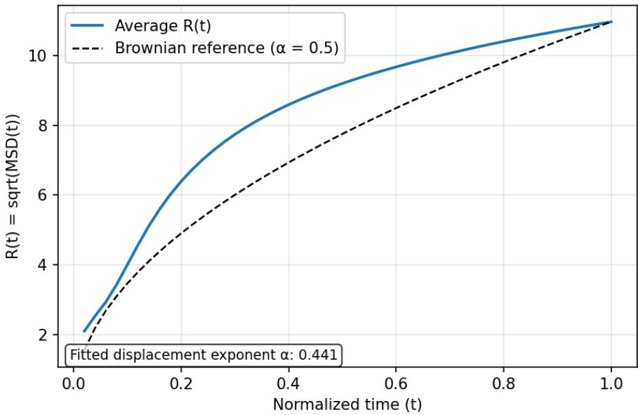
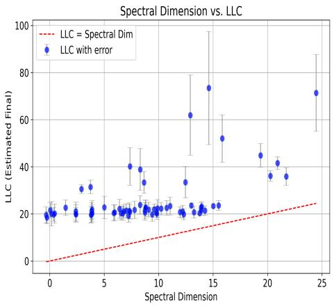
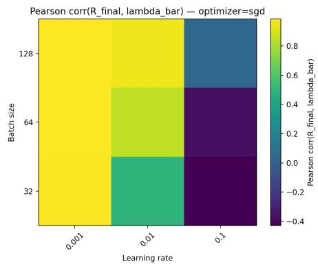
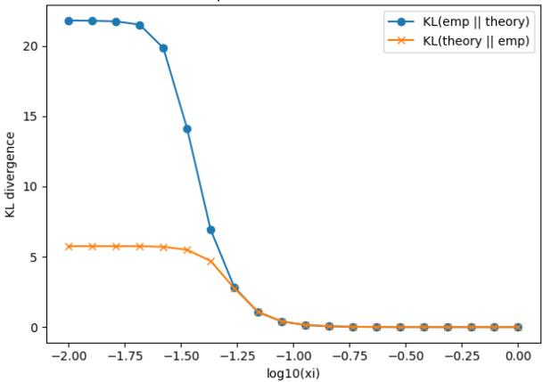
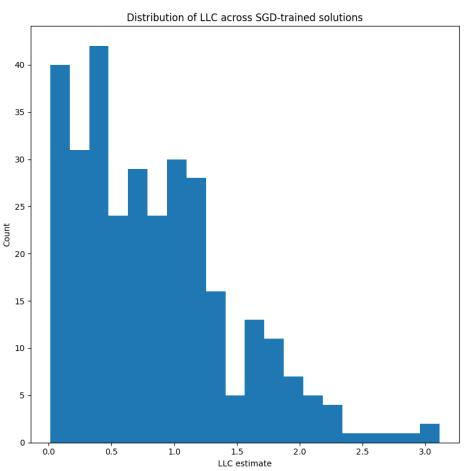
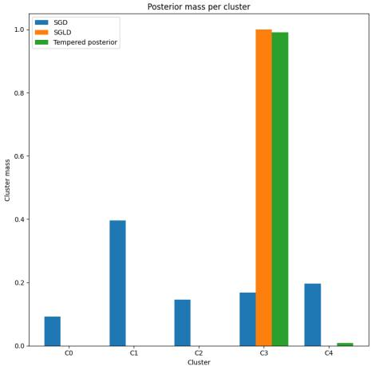

## ABSTRACT

The nature of the relationship between Bayesian sampling and stochastic gradient descent in neural networks has been a long-standing open question in the theory of deep learning. We shed light on this question by modeling the long runtime behaviour of SGD as diffusion on porous media. Using singular learning theory, we show that the late stage dynamics are strongly impacted by the degeneracies of the loss surface. From this we are able to show that under reasonable choices of hyperparameters for SGD, the local steady state distribution of SGD is effectively a tempered version of the Bayesian posterior over the weights which accounts for local accessibility constraints. We then empirically verify the porous diffusion picture across multiple models and datasets, and provide experimental evidence of the steady state-Bayesian posterior correspondence.

## 1 INTRODUCTION

One of the core problems in developing a scientific theory of deep learning models is giving a descriptive theory of how the internal model structure evolves during training as the model gains "knowledge" about its training distribution ((McGrath et al., 2022), (Olsson et al., 2022)) and how this evolution relates to the generalization ability of deep learning models. Classical methods for understanding model generalization such as the Bayesian Information Criterion (Schwarz, 1978) fail to give accurate descriptions of the generalization behavior of deep learning, due to its "singular" nature (Wei et al., 2023).

This has lead recent research to utilize Watanabe’s singular learning theory (SLT) (Watanabe, 2009) as the basis for studying deep learning models. The key result of singular learning theory is the widely applicable Bayesian information criterion (Watanabe, 2012) which (broadly speaking) says that the generalization error of a model with parameter w is controlled by the learning coefficient λ(w), which corresponds to the "complexity" of some local area around the parameter. Measuring how this quantity evolves over time has been proposed as a method to study the emergence of structure within neural networks ((Lau et al., 2024), (Wang et al., 2024a)) and has given very promising results.

Despite this, it is not clear how the dynamical picture of SGD interacts with the purely Bayesian description of SLT. It has been shown that there is seemingly some relationship between Bayesian sampling of parameter space of neural networks and SGD, both experimentally (Mingard et al., 2020), and theoretically under assumptions of non-degeneracy of minima of the loss (Mandt et al., 2016b) (which is known to be false in general). Here we extend this connection to the more general case by describing the late stage training dynamics of SGD using a fractional Fokker-Planck equation which can be solved explicitly under reasonable assumptions. We show that the steady-state solution of this equation is related to the purely Bayesian posterior by tempering probabilities based on accessibility constraints determined by the learning coefficient. Potential practical applications of the results presented here are discussed in appendix C.

## 2 RELATED WORK

## 2.1 SINGULAR LEARNING THEORY

Our work relies upon results coming from singular learning theory ((Watanabe, 2012), (Watanabe, 2022), (Watanabe, 2024), (Watanabe, 2009)), the known relationship between inference and thermo dynamics (LaMont & Wiggins, 2019), and the application of singular learning theory to the study of deep learning, referred to as developmental interpretability ((Wang et al., 2024b), (Wang et al., 2024a), (Chen et al., 2023)). We make particular use of the estimation methods for the local learning coefficient introduced in (Lau et al., 2024) using (van Wingerden et al., 2024).

## 2.2 GRADIENT NOISE AND SGD DYNAMICS

The methods used here are related to the Stochastic Gradient Noise model (SGN) of SGD ((Zhou et al., 2021), (Battash & Lindenbaum, 2023), (Nguyen et al., 2019), (Simsekli et al., 2019), (Mignacco & Urbani, 2022)) due to the relationship between the Fokker-Planck equation and the Langevin equation used in SGN. This framework has been used, for example, to model escape times from local minima (Xie et al., 2021).

Other works have studied the diffusive-like dynamics of SGD (Fjellström & Nyström, 2022), and even modeled SGD as an Ornstein-Uhlenbeck process to relate the dynamics of SGD back to the purely Bayesian case (Mandt et al., 2016b). However, this framework requires that the minima of the loss be quadratic, which means it cannot accurately capture the behaviour of SGD in neural networks due to the degeneracy of local minima. Furthermore, other works have also found connections between SGD and fractal geometry ((Camuto et al., 2021), (¸Sim¸sekli et al., 2021)) by the use of iterated function systems and Feller processes. Although related to the results here, the formalisms used are significantly different and the exact relationship is not straightforward.

The most closely related to the work here is (Chen et al., 2021) who show that many networks seem super-diffusive near initialization and decay into sub-diffusion over time. They also give a relationship to a type of fractal diffusion to explain this. However, they give no theoretical results, relying entirely on experimental results to draw conclusions. Our work instead focuses on a rigorous theoretical model that allows us to develop a theory about the long runtime nature of SGD which explains the observations made previously, and we provide experimental results to verify theoretical predictions.

## 3 FRACTIONAL DYNAMICS OF DEEP LEARNING

## 3.1 GRADIENT NOISE AND THE FOKKER-PLANCK EQUATION

Consider a neural network defined by some set of parameters w $\in \ W$ (where we assume $W$ is compact throughout) and let X be the set of tuples $( x _ { i } , f ( x _ { i } ) )$ where $f$ is the oracle that describes our decision problem. Denote the loss function by $L : \mathcal { X } \times \dot { W } $ R and set $\mathcal { L } [ \mathcal { X } , w ] = \mathbb { E } _ { \mathcal { X } } [ L ( x , w ) ]$ Letting $X _ { m } \subset \mathcal { X }$ be a randomly sampled subset of possible inputs, the empirical loss on $X _ { m }$ will then be denoted $\mathcal { L } _ { m } [ X _ { m } , w ] = \mathrm { \bar { E } } _ { X _ { m } } [ \bar { L } ( x , w ) ]$ ]. For the purposes of the theoretical analysis, we will assume that we are working in the large batch size regime so that the estimation noise of the loss (and gradient) doesn’t dominate the dynamics of the system.

## 3.1.1 GRADIENT NOISE AND SUB-DIFFUSION

There is extensive literature which attempts to capture the dynamics of SGD by decomposing the weight updates (under some abuse of notation) into the form

$$
\frac {d w}{d t} = - \gamma \nabla \mathcal {L} (w _ {t - 1}) + \Sigma_ {w _ {t - 1}}\tag{1}
$$

where $\mathcal { L }$ is the population loss, t is the timestep, $\gamma$ is the learning rate, and $\Sigma _ { w _ { t - 1 } }$ is a random vector (which we will assume in this work is an anisotropic Gaussian). This is what is generally referred to as a Langevin stochastic differential equation. Systems governed by such SDEs have a displacement $R ( t ) \propto t ^ { \frac { 1 } { 2 } }$ , meaning they diffuse like Brownian motion.

However, most works which examine the weight dynamics don’t agree with this model. It has been found that networks trained under SGD can behave super-diffusively early in training, becoming sub-diffusive as training continues (Chen et al., 2021). Our experiments agree with this, finding that the displacement of neural network weights after long run times are described well by a power law like $R ( t ) \propto t ^ { \frac { 1 } { \nu } }$ for $\nu \geq 2$ (Bouchaud & Georges, 1990) (an example of which can be seen in figure 1). Similarly, it has been observed that the weight movement of SGD (with momentum and weight decay) can have weight displacement that scales logarithmically like $R ( t ) \propto$ ln t (Hoffer et al., 2018). This behaviour cannot be captured by the traditional Langevin equation and requires the introduction of a subordination term. Such non-Brownian diffusion is collectively referred to as anomalous diffusion.

Average SGD displacement over normalized time  
  
Figure 1: Mean weight displacement of a collection of fully connected neural networks trained using SGD on a randomly generated Moons dataset (Pedregosa et al., 2011), compared with expected displacement in the case of Brownian motion. It can be seen that this displays anomalous diffusion corresponding to early super-diffusion followed by late stage sub-diffusion.

To tackle this problem, we move into a formalism which is dual to the SDE picture, being the Fokker-Planck equation. Intuitively, the SDE picture describes the stochastic evolution of a single run while the Fokker-Planck equation is what describes the deterministic evolution of the probability distribution over parameter space over time determined by the SDE.

We now give the Fokker-Planck equation (FPE) in weight space (that is, $\nabla = \nabla _ { w } )$

$$
\frac {\partial p (w , t)}{\partial t} = \nabla \cdot (D (w, t) \nabla p (w, t) - \gamma p (w, t) \nabla \mathcal {L} (w))\tag{2}
$$

where p is a probability density function (density of states), D is the diffusion coefficient, $\gamma$ is a scalar (usually called friction), and $\dot { \mathcal { L } }$ is a loss function which in a physical sense acts as a potential energy.

While the standard FP equation describes the behaviour of standard Brownian motion, one can hande the sub-diffusive case by introducing the (Caputo) fractional derivative operator(Diethelm, 2019) $\mathcal { D } _ { t } ^ { \alpha }$ where $0 < \alpha < 1$ is a real number. Letting $f$ be some arbitrary (differentiable) function of t the Caputo fractional derivative operator is defined as

$$
\mathcal {D} _ {t} ^ {\alpha} f (t) = \frac {1}{\Gamma (1 - \alpha)} \int_ {0} ^ {t} \frac {f ^ {\prime} (t)}{(t - \tau) ^ {\alpha}} d \tau\tag{3}
$$

We now define the (time) fractional Fokker-Planck equation (FFPE) for $\mathrm { S G D ^ { 1 } }$ as:

$$
\mathcal {D} _ {t} ^ {\alpha} p (w, t) = \nabla \cdot (D (w, t) \nabla p (w, t) - \gamma p (w, t) \nabla \mathcal {L} _ {m} [ w ])\tag{4}
$$

Where the $X _ { m }$ is dropped from the loss expression for simplicity. We note here that this equation itself does not directly describe ultra-slow diffusion (that is, where the displacement $R ( t ) \propto$ ln t). However, ultra-slow diffusion appears “in the limit" of power law sub-diffusion (Kochubei, 2008). A discussion of this as well as the role of the fractional derivative are given in in the appendix.

One might now try to modify this to a “time-space fractional" Fokker-Planck equation to account for the potential super-diffusive behaviour early in training. However, we are interested in studying the steady states of the system, and under some very mild assumptions (namely that the probability distribution doesn’t lose mass over training) the steady state of the system does not depend on this early stage of training, and can be captured by solving the given time fractional FPE ((Barkai, 2001), (Metzler et al., 1999)2). However, in our case, we still run into difficulty since the diffusion coefficient is a location-dependent inhomogeneous diffusion tensor (that is, different dimensions have distinct diffusion coefficients) instead of a single scalar. Luckily, as we will discuss in the next section, we are able to approximate the diffusion tensor as a single scalar function late in training.

## 3.2 FRACTAL DIMENSIONS AND SUBDIFFUSION

## 3.2.1 SINGULAR LEARNING THEORY AND FRACTAL DIMENSIONS

In order to capture the local geometric structure that impacts the diffusive process we make use of singular learning theory (Watanabe, 2009) via the local learning coefficient (LLC) (Lau et al., 2024). We give a brief introduction to these ideas here, but a more substantial introduction is given in appendix A.

Consider our loss function to be the Kullback-Leibler divergence $^ 3 \ K _ { m } [ w ]$ . Consider then the ball $B _ { r } ( w ^ { * } )$ of radius r about some "true parameter" w∗ such that $\kappa [ \boldsymbol { w } ^ { * } \bar { ] } \doteq 0$ . Letting ϵ be some arbitrarily small constant, and denote the set of parameters which have loss $K _ { m } [ w ] < \epsilon$ within the ball $B _ { r } ( \dot { w } ^ { * } )$ of radius r as $B _ { r } ( w ^ { * } , \epsilon )$ . Consider then the singular integral

$$
V (\epsilon) = \int_ {B _ {r} (w ^ {*}, \epsilon)} \rho (w) d w\tag{5}
$$

where $\rho ( w )$ is some arbitrary choice of prior distribution on the parameter space. Now letting $0 < a < 1$ be some arbitrary constant, the local learning coefficient Lau et al. (2024) is defined as

$$
\lambda (w ^ {*}) = \lim _ {\epsilon \to 0} \frac {\log \frac {V (a \epsilon)}{V (\epsilon)}}{\log (a)}\tag{6}
$$

We then have that asymptotically as $\epsilon  0$ (under some mild assumptions):

$$
V (\epsilon) \propto \epsilon^ {\lambda (w ^ {*})}\tag{7}
$$

In the diffusion picture, the LLC behaves as a localized mass (Minkowski-Bouligand) fractal dimension which determines the geometry of (potentially degenerate) near critical points. The nature of this relationship is discussed in greater depth in appendix B.1.

## 3.3 LAWS OF FRACTAL DIFFUSION AND SGD

## 3.3.1 THE SPECTRAL DIMENSION

While the LLC captures the geometry of the loss, we all need to capture the dynamics of SGD on this geometry. To this end we utilize a second fractal dimension which describes the trajectory of particles under a potential called the spectral dimension $d _ { s }$ ((Millán et al., 2021), (Bouchaud & Georges,

1990)). We start with the definition in the "homogeneous" case (e.g when the fractal dimension of the medium is the same everywhere) and then adapt it to our multifractal case. If we consider the LLC as being the scaling exponent for the volume of "good parameters" in a particular area, the spectral dimension determines then the volume of states that the diffusive process over that area can actually reach over some period of time (in our case, the volume of states SGD can actually reach in that area). We define this dimension below.

Definition 3.1 (Spectral Dimension (Bouchaud & Georges, 1990)). Let $V _ { s } ( t )$ be the total volume of occupied states which result from running a diffusive process on porous media from some initial distribution. The spectral dimension $d _ { s }$ is then defined as:

$$
V _ {s} (t) \sim t ^ {\frac {d _ {s}}{2}}\tag{8}
$$

In non-homogeneous systems one can have that the spectral dimension changes on different timescales $\{ t _ { 1 } , . . . , t _ { m } \}$ where we have different scaling exponents $d _ { s } ( t _ { i } )$ such that

$$
V _ {s} (t) = t ^ {\frac {d _ {s} (t _ {i})}{2}}\tag{9}
$$

if t belongs to timescale $t _ { i }$ . If the variation between these different dimensions is too large, the theoretical framing becomes more difficult. Luckily, we find that for SGD this spectral dimension is well-captured by a single constant over training. Thus for vanilla SGD we can use what is known as the asymptotic spectral dimension defined as:

$$
V _ {s} (t) \sim t ^ {\frac {d _ {s} ^ {\infty}}{2}} \mathrm{as} t \to \infty\tag{10}
$$

and simply take $d _ { s } \ = \ d _ { s } ^ { \infty }$ ((ben Avraham & Havlin, 2000), (Paladin & Vulpiani, 1987)). More information and intuition about the spectral dimension is provided in appendix B.2

## 3.3.2 WEIGHT DISPLACEMENT AND FRACTAL DIMENSIONS

We would now like to figure out the relationship between the local fractal dimension (the local learning coefficient) and the spectral dimension.

Definition 3.2 (Walk Dimension ((Paladin & Vulpiani, 1987), (Bouchaud & Georges, 1990))). Let R(t) be the displacement of a particle at time t. The walk dimension is defined by

$$
R (t) \sim t ^ {\frac {1}{d _ {\mathrm{walk}}}}\tag{11}
$$

with $d _ { \mathrm { w a l k } }$ being the walk dimension with $d _ { \mathrm { w a l k } } > 2$ for sub-diffusion.

We note here that these values are defined almost identically even when the process displays initially super-diffusive dynamics (details in appendix B.3).

It is known that in particular regimes the walk dimension takes on a particular form. This is known as the Alexander-Orbach (AO) relation and relates the walk dimension to the fractal dimension of the medium (the LLC for us) and the spectral dimension. While originally stated in the context of homogeneous media this relation is known to hold locally for porous media which are homogeneous on a sufficiently small scale (Hambly et al., 2002). Restating these results in our framing gives:

Theorem 3.1. The walk dimension at a point $w _ { t }$ on the loss surface can be given as

$$
d _ {w a l k} (t) = \frac {2 \lambda (w _ {t})}{d _ {s}}\tag{12}
$$

near critical points.

The idea that neural networks trained by SGD are close to some critical point is a direct result of the prevalence degenerate saddle points of the loss surface ((Dauphin et al., 2014), (Advani et al., 2020), (Fukumizu & Amari, 2000), (Choromanska et al., 2015)). In cases where there are no nearby saddle points (which is more common in early training), this does relation does not need to hold as the diffusion is dominated by the gradient behaviour. This is the sense in which the relation is local. However, as noted, so long as this behaviour is largely isolated to early training it does not impact the theoretical results.

## 3.3.3 DIFFUSION COEFFICIENTS AND LOCAL BEHAVIOUR

We would like to use these fractal dimensions to define a diffusion coefficient. Importantly, we find that the diffusion coefficient is reasonably approximated by a scalar function. We also should expect that late in training, the localized dynamics nearby degenerate points should be directly proportional to the volume of low loss parameters. We state the results informally below, with the formal results and proofs in appendix D.

First we state the following theorem:

Theorem 3.2 (Small Scale Dynamics are LLC Dependent). Let $w ^ { * } \in W$ be a point such that the Hessian ofthe loss $H ( w ^ { * } )$ is positive semidefinite. Let $\mathcal { W } = B ( r , w ^ { * } )$ be a small area about $w ^ { * }$ . If the diffusion coefficient D along degenerate directions is isotropic thenforfixed error tolerance ε the first passage time $T ( \varepsilon )$ through W is ∝ $\frac { \epsilon ^ { \lambda ( w ^ { * } ) } } { D C }$ where C is the "capacitance" ofthe escape set.

An important thing to note about the above theorem is that this is what would be considered a "pore scale" model of the diffusion, and is determined by the small scale dynamics and as such is less useful for experimentally capturing the behaviour. For experimental purposes we develop a more coarse-grained theory which relies on the following result:

Lemma 3.1 (Diffusion Coefficient Approximation (informal)). For reasonable choices of the learning rate in the large batch size regime, the diffusion tensor can be approximated by a scalar function for long runtimes.

Since the steady state is determined by the long-runtime dynamics, we can study the FFPE with a scalar diffusion coefficient.

To study the coarse-grained diffusive behaviour use a physics-inspired scalar diffusion coefficient for porous media that captures the essential behaviors of the diffusion at some choice of measurement scale called the characteristic length scale $\xi .$ Under some assumptions we have the following:

Lemma 3.2. Letting ξ be some characteristic length scale, the diffusion coefficient can be approximated as $D _ { \xi } = \xi ^ { 2 - \smile d _ { w a l k } }$

A thing to note is that the choice of $\xi$ is effectively how far we are zooming out and averaging over the local dynamics, which gives a scaling law, not an exact relation. A general practice is to pick a value of $\bar { \xi }$ which is large enough to average out the fluctuations in an area but not so large that it starts to ignore large scale changes in structure. The effect of choice of $\xi$ is shown in section 4. One may also notice that this implies that the diffusion coefficient is higher for a small LLC which seemingly contradicts the pore-scale diffusion derived earlier where low LLC was slower. However, this is explained through the spectral dimension (as we shall see) as it is bounded above by the LL ${ \cal C } ,$ meaning that a small LLC is only faster if the dynamics allow very free movement inside of the domain.

Combining lemma 3.2 with the definition of the walk dimension given earlier we get:

Corollary 3.1 (Fractal Effective Diffusion Coefficient). Let $\xi$ be a choice ofthe characteristic length scale. One can then define the effective (local) diffusion coefficientfor length scale $\xi$ as

$$
D _ {\xi} (w) = \xi^ {2 - \frac {2 \lambda (w _ {t})}{d _ {s}}}\tag{13}
$$

## 3.4 STATIONARY STATES OF THE SGD FOKKER-PLANCK EQUATION

We now present theoretical results about the diffusive process with proofs in appendix D. In appendix D we provide a brief discussion of impacts when particular assumptions about the system are not met and how the results here can be extended.

Assuming some fixed scale ξ, using the effective diffusion coefficient, we can actually find the local steady-state solutions for the SGD Fractional Fokker-Planck equation (if it exists):

Lemma 3.3. Consider a subset $\mathcal { W } \subset W$ such that the effective diffusion coefficient $D _ { \xi }$ is (approximately) constant on W. Suppose then that there exists steady-state solutions of the SGD-FFPE on this subset with true parameter(s) $w ^ { * }$ so $\mathcal { D } _ { t } ^ { \alpha } p ( w ^ { * } , t ) = 0$ . The steady-state $p _ { s } ( w | X _ { m } ) = p _ { s } ( w )$ distribution is then given by $p _ { s } ( w ) \propto e ^ { \frac { - \gamma \mathcal { L } m \left[ w \right] } { D _ { \xi } } }$

Note that the above holds even if $D _ { \xi }$ does not have the form given in definition 3.1 so long as it is simply a scalar. However, if it does have the form, due to the definition of $D _ { \xi }$ , the above condition that it be constant is actually simply saying that $\lambda ( w )$ be locally constant in $\mathcal { W }$ which tends to be the case away from phase transitions (Wang et al., 2025). We can also get from this a relationship with the Bayesian posterior perspective of singular learning theory.

Corollary 3.2. Letting $\gamma = 1$ for simplicity, $i f { \cal { L } }$ is the log-loss and w $\in \mathcal W$ then

$$
p _ {s} (w) ^ {m D _ {\xi}} \propto p (X _ {m} | w)\tag{14}
$$

so

$$
p (w | X _ {m}) = \frac {\rho (w) p _ {s} (w) ^ {m D _ {\xi}}}{Z _ {m D _ {\xi}}}\tag{15}
$$

where $Z _ { m D _ { \xi } }$ is the partitionfunction and $\rho$ is an arbitrary choice ofprior.

This explains the observed relationships between Bayesian sampling and SGD seen in (Mingard et al., 2020). We can see that SGD effectively scales the likelihood of certain states of the underlying purely Bayesian distribution at the measurement scale ξ based on how accessible they are to the model under the optimization process. That is, the distribution of solutions found by SGD from some initial distribution concentrate more heavily in particular areas than the Bayesian posterior since SGD simply cannot reasonably reach those areas.

Another important aspect of the local learning coefficient is that it can be considered the quantity that “bounds" the movement of network weights. For notational simplicity let w(t) be the parameters of the system at time t, so we can formally state the above as:

Lemma 3.4. Suppose the lossfunction L is non-convex and non-constant on W. Then with spectral dimension $d _ { s }$ as $t $ ∞ withfractal dimension $\lambda ( w ( t ) )$ on $\mathcal { W } \subset W$ , the inequality $d _ { s } \leq \bar { \lambda } ( w ( t ) )$ holds (in the small learning rate regime).

In the above lemma the timescale condition is used to account for the fact that at early times such sub-diffusive processes can appear nearly linear. Given the above, we get the following corollary:

Corollary 3.3. For time t as $t \to \infty ,$ , we have $d _ { s } \leq \bar { \lambda } ( w ( t ) )$ ) where

$$
\bar {\lambda} (w (t)) = \lim _ {\tau \rightarrow \infty} \frac {1}{\tau} \int_ {0} ^ {\tau} \lambda (w (t)) d t\tag{16}
$$

Notice that since small $\lambda ( w )$ implies greater local volume, but larger $d _ { s }$ implies that the volume spreads faster over time, large local volumes trap the spread of SGD, slowing it down. This aligns with previous research examining the eigenvalues of the Hessian of the loss (Sagun et al., 2016). In the next section we will show that the above result holds experimentally as well as examine other properties of our fractal diffusion theory of SGD.

## 4 EXPERIMENTAL RESULTS

## 4.1 DIFFUSIVE BEHAVIOUR

Here we present experimental results to validate the diffusive theory across multiple model architectures and tasks. Namely we look at small language models trained on the TinyStories dataset(Eldan & Li, 2023), vision models trained on Tiny Imagenet (Le & Yang, 2015), as well as extensive ablations on the MNIST dataset (Deng, 2012) with fully connected architectures with ReLU activations and batch normalization. More extensive experimental details can be found in appendix G.

To compute the LLC we utilize the estimator provided by (van Wingerden et al., 2024). To compute the spectral dimension $d _ { s }$ we first compute the value $\log ( R ( t ) )$ where $R ( t )$ is the total weight displacement at time t. We then find $d _ { s }$ by solving the linear regression problem

$$
\log (R (t)) = \frac {d _ {s}}{2 \lambda (w)} \log (t) + c\tag{17}
$$

where c is simply an offset term.

  
(a) Visualization of lemma 3.4 (MNIST)

  
(b) Correlation between learning coefficient (average) and total weight displacement (MNIST).

Figure 2: In a) we check that the result of lemma 3.4 holds. In b) we check that independent of our choice of diffusion model, the total displacement and average learning rate are strongly correlated in the large batch, low learning rate regime.

<table><tr><td>Model name</td><td> $\lambda$ </td><td> $d_s$ </td><td> $\alpha$ </td><td> $r^2$ </td></tr><tr><td>TinyStories-1M</td><td>32</td><td>21.422</td><td>0.33</td><td>0.98</td></tr><tr><td>TinyLlama-15M</td><td>76.1</td><td>48.3</td><td>0.32</td><td>0.98</td></tr><tr><td>TinyStories-33M</td><td>39.3</td><td>38.7</td><td>0.49</td><td>0.98</td></tr><tr><td>ResNet18</td><td>72.05</td><td>0.57</td><td>0.004</td><td> $\approx 1$ </td></tr><tr><td>ResNet34</td><td>73.5</td><td>0.62</td><td>0.004</td><td> $\approx 1$ </td></tr><tr><td>VGG16</td><td>159.7</td><td>0.14</td><td>0.001</td><td> $\approx 1$ </td></tr></table>

Table 1: Results for different models.

Using this setup, we are able to experimentally test the result of lemma 3.4 and corollary 3.3, which can be seen in figure 2 for an extensive collection of various models over MNIST, as well as various vision and language models in table 1. We also check the accuracy of the sub-diffusion model.

We find that in general, the sub-diffusive prediction is very accurate for most models tested which are trained to convergence. In particular we note that despite our theory not explicitly accounting for adaptive optimizers and learning rate schedulers, the dynamics vision models fine-tuned using an initial adaptive optimizer, followed by a low learning rate SGD are well-predicted by the theory. Furthermore, by taking pretrained language models which have already been trained to convergence in the weights and then continuing training on their initial pretraining dataset agrees with the predictions of the theory. More results are available in appendices I and H.

## 4.2 POSTERIOR CONCENTRATION

In order to check the results of lemma 3.3 and corollary 3.2 we train a large number of identical fully connected networks on a generated moons dataset (Pedregosa et al., 2011) using SGD. To compare the distribution of solutions found via SGD vs. the (local) Bayesian posterior, we use SGLD (Welling & Teh, 2011) to approximate the Bayesian posterior. We then identify clusters of solutions, and identify the concentrations of SGD and Bayesian solutions within each cluster. To select the scale ξ for tempering, we check how the choice of ξ impacts the KL-divergence between the empirical SGD distribution and the theoretical SGD distribution (figure 3). We can see in figure 4a that the solutions found by SGD do tend to concentrate around lower LLC areas. Figure 4b and table 2 shows how the tempering of the distribution of SGD solutions effectively agrees with approximate Bayesian posterior of SGLD.

KL between empirical and theoretical densities vs xi  
  
Figure 3: KL-divergences between the empirical vs. theoretical distribution for different choices of $\xi .$

  
(a) LLC Histogram

  
(b) The cluster concentrations  
Figure 4: a) Shows the histogram of local learning coefficients of solutions found by SGD. Notice that as predicted by the theoretical results, they tend to concentrate near lower LLC values (better generalizing solutions). b) The probability concentrations of solutions found by SGD (blue), the approximate Bayesian posterior (orange), and the tempered SGD distribution (green) for each cluster. Notice that despite SGD itself preferring the cluster C1, after tempering $( \xi = 0 . 5 )$ , the tempered SGD steady state distribution almost entirely agrees with the Bayesian posterior. Statistical measures can be seen in table 2.

## 5 DISCUSSION

## 5.1 LIMITATIONS

While we believe our theory is useful and tends to capture dynamics of most optimizers empirically, it does not explicitly take into account complex dynamics of adaptive optimizers like Adam (Kingma & Ba, 2017) as adaptive optimizers can exhibit multiple spectral dimensions over the course of training meaning the theory here is incomplete and should occur as a "special case" of a more general theory. Some experimental results and discussions around this can be seen in appendices I and H.

Another limitation to consider is that we assume the existence of an approximate steady state. While this is a common practice in the study of SGD ((Pesme et al., 2020), (Mandt et al., 2016a), (Mandt et al., 2018)). In general, SGD iterates do not converge to exact equilibria, but under standard assumptions and suitable learning-rate schedules (or a sufficiently small learning rate) they approach the set of stationary points and attain iterates with small gradient norm. One can in theory have instances where no approximate steady state exists since label noise can in theory produce a nonequilibrium flow through states, so SGD might have a non-equilibrium steady state with probability flow driven by said noise. While examining such situations is outside the scope of this work, it is an important avenue of future work to examine a) the time to equilibrate of SGD and b) if it does not equilibrate, can we quantify its non-equilibrium steady state?

<table><tr><td>Metric</td><td>Value</td></tr><tr><td> $\mathcal{K}$ (Bayes||Tempered SGD)</td><td>0.009</td></tr><tr><td>Wass(Bayes, Tempered SGD)</td><td>0.002</td></tr><tr><td>JS(Bayes, Tempered SGD)</td><td>0.003</td></tr></table>

Table 2: The KL divergence, the Wasserstein distance, and the Jensen-Shannon divergence for the approximated Bayesian posterior and the tempered SGD distribution.

## 5.2 CONCLUSION AND AVENUES FOR FUTURE WORK

Here we have argued that the long runtime dynamics of SGD are captured by taking the corresponding Fokker-Planck equation to describe diffusion on a porous geometry. This porous geometry corresponds is described by the learning coefficient, drawing a direct relationship between the dynamics of SGD to Bayesian statistics via singular learning theory. Our experimental results validate this claim.

We believe our theory helps provide insight into the learning process and adds to the groundwork needed to build a foundational theory of learning dynamics. Our theory says that the learning process is governed partially by the model’s behavioral phases as described by the learning coefficient. This opens up a framework for studying emergence and phase transitions during training by considering properties of the dynamical system. Adapting this framework explicitly to adaptive optimizers and checking how this impacts the diffusive structure is an important avenue for future work.

## 5.2.1 REPRODUCIBILITY STATEMENT

To encourage reproducibility we provide source code for the experiments included along with extensive documentation in appendices J and I.

## REFERENCES

nickypro/tinyllama-15M · Hugging Face — huggingface.co. https://huggingface.co/ nickypro/tinyllama-15M, a. [Accessed 16-11-2025].

roneneldan/TinyStories-1M · Hugging Face — huggingface.co. https://huggingface.co/ roneneldan/TinyStories-1M, b. [Accessed 16-11-2025].

roneneldan/TinyStories-33M · Hugging Face — huggingface.co. https://huggingface.co/ roneneldan/TinyStories-33M, c. [Accessed 16-11-2025].

Madhu S. Advani, Andrew M. Saxe, and Haim Sompolinsky. High-dimensional dynamics of generalization error in neural networks. Neural Networks, 132:428–446, 2020. ISSN 0893-6080. doi: https://doi.org/10.1016/j.neunet.2020.08.022. URL https://www.sciencedirect. com/science/article/pii/S0893608020303117.

E. Barkai. Fractional fokker-planck equation, solution, and application. Phys. Rev. E, 63:046118, Mar 2001. doi: 10.1103/PhysRevE.63.046118. URL https://link.aps.org/doi/10. 1103/PhysRevE.63.046118.

Barak Battash and Ofir Lindenbaum. Revisiting the noise model of stochastic gradient descent, 2023. URL https://arxiv.org/abs/2303.02749.

John Baxter. Classical potential theory and its probabilistic counterpart (j. l. doob). SIAM Review, 27 (3):460–462, 1985. doi: 10.1137/1027124.