## ABSTRACT

Deep learning has non-convex loss landscape and its optimization dynamics is hard to analyze or control. Nevertheless, the dynamics can be empirically convex-like across various tasks, models, optimizers, hyperparameters, etc. In this work, we examine the applicability of convexity and Lipschitz continuity in deep learning, in order to precisely control the loss dynamics via the learning rate schedules. We illustrate that deep learning quickly becomes weakly convex after a short period of training, and the loss is predicable by an upper bound on the last iterate, which further informs the scaling of optimal learning rate. Through the lens of convexity, we build scaling laws of learning rates and losses that extrapolate as much as $80\times$ across training horizons and $70\times$ across model sizes.

## 1 INTRODUCTION

Deep learning has highly non-convex and complex loss landscape, e.g. the global minimum may not be unique, and there may be many local minima and saddle points where the optimization can be trapped (Garipov et al., 2018; Choromanska et al., 2015; Dauphin et al., 2014; Jin et al., 2017; Sagun et al., 2016). Nevertheless, the empirical success of optimization in deep learning has implied that some benign properties may hold and be leveraged.

In fact, there has been a long history of empirically exploring convexity in deep learning. For example, Llama training (non-convex) with AdamW (Loshchilov & Hutter, 2019) is closely similar to convex optimization with SGD, in terms of the shapes of loss curves in Figure 1 of (Schaipp et al., 2025). Empirical evidence by (Zhou et al., 2019) has shown that SGD follows a star-convex path during the optimization of neural networks. In addition, convexity is universally observed along the direction of gradients in vision and language models by (Bu & Xu, 2025).

Another line of research has focused on the two-dimensional loss landscape, by (Li et al., 2018; Im et al., 2016) (along two random and normalized directions) and (Allen-Zhu et al., 2019b) (along the gradient and the negatively curved direction of the Hessian), which is approximately locally convex for residual neural networks with various depth and width. Furthermore, these convex-like loss landscapes are also observed on large language models such as RoBERTa, LLaMA, Qwen, and Mistral in (Zhong et al., 2022; Chen et al., 2025; Lee et al., 2024).

Besides these low-dimensional loss landscapes, the Hessian spectrum provides a rigorous local notion of curvature: a positive-definite Hessian (all eigenvalues positive) indicates that the loss landscape is locally convex around that point. Empirical observations show that at initialization, the Hessian often contains many large negative eigenvalues, which quickly shift toward zero and become much smaller in magnitude than the positive eigenvalues. Consequently, the spectrum becomes dominated by positive eigenvalues and the loss landscape becomes approximately convex (Yao et al., 2020; Papyan, 2018; Sankar et al., 2021; Zhang et al., 2024).

In addition, theoretical analysis shows that two-layer and deeper neural networks can be regarded as convex in the wide-network limit, under neural tangent kernel (Jacot et al., 2018; Lee et al., 2019; Du et al., 2018; 2019; Li & Liang, 2018; Allen-Zhu et al., 2019a), neural repopulation (Fang et al., 2019; 2022), and mean field (Mei et al., 2018; Chizat & Bach, 2018).

As a matter of fact, many works in deep learning have been drawing useful understanding from convex analysis to non-convex deep learning: Sutskever et al. (2013) shows that momentum significantly accelerates the convergence; Defazio et al. (2023) explains the effectiveness of learning rate warmup and decay from a convex viewpoint; the effect of weight decay (Krogh & Hertz, 1991) is first understood in ridge regression (Hoerl & Kennard, 1970).

Specifically, the relationship between the learning rate sequence $\{\eta_{t}\}$ and the upper bounds of loss sequence $\{L_{t}\}$ has been heavily studied. These bounds come from different settings, studying convex or strongly convex loss, Lipschitz continuous or smooth loss, finite-iteration or asymptotic bound, averaged or last iterate, etc. Our work is directly based on Corollary 12 of (Defazio et al., 2023) (re-stated in (2.4)), and a simplified version can be found in (2.3), which already provides some insights as we will summarize in Example 2.3.

## 1.1 RELATED WORK

Convex to deep learning. It is well-known in convex regime that loss can converge at $O(1/\sqrt{T})$ and optimal learning rate is $O(1/\sqrt{T})$ . However, whether or when these conclusions hold in deep learning is largely unclear. From this perspective, our work is most closely related to (Schaipp et al., 2025), both following from (Defazio et al., 2023). In contrast, we not only extend major findings of (Schaipp et al., 2025) theoretically (e.g. our qualifying exam in Condition 2.5 covers any schedule), but also focus more on empirical validation. For example, $O(1/\sqrt{T})$ convergence of loss and consistent patterns across models and optimizers in our Figures 6-12 are not presented in (Schaipp et al., 2025), which focuses on one model and single training horizon like our Figures 2-5. In particular, our empirical approach is data-driven and practically applicable in large-scale deep learning.

Scaling laws. Current popular scaling laws are primarily about loss (Kaplan et al., 2020; Hoffmann et al., 2022) (i.e. scaling laws of loss), predicting how loss changes as model sizes and training horizons change, assuming optimal learning rate. As a result, learning rate is not explicitly presented in these laws. Other laws (i.e. scaling laws of learning rate) can scale learning rate across training horizons $\eta_{\mathrm{peak}}^{*} = \lambda T^{-\alpha}$ , where $\alpha = 0.125$ in (Bi et al., 2024), $\alpha \in \{0.32, 0.38, 0.42, 0.65, 0.70\}$ by Table 5 in (Bjorck et al., 2024), and some are horizon-unaware in (Porian et al., 2024; Wang et al., 2024) (i.e. $\alpha = 0$ ). Nevertheless, these laws may not predict loss. In this work, we propose a law that simultaneously predict loss and optimal learning rate for the fixed value $\alpha = 0.5$ .

Learning rate transfer. Maximal update parameterization (muP) (Yang et al., 2022) is a technique to transfer optimal learning rate across model size. While Table 1 of (Yang et al., 2022) claimed it also transfers across training horizons, this contradicts with empirical evidence in (Bjorck et al., 2024) (see Section 3.3) and our analysis.

## 1.2 CONTRIBUTIONS

In this work, we study the scaling law of deep learning loss and learning rate, through the lens of convex loss (non-smooth) and bounded gradient. We will establish a series of generalizations from convex theory to deep learning, which is presented in Table 3 and summarized as follows.

1. We study the convex-like behaviors in deep learning for general model architectures, optimizers and learning rate schedules, hence establishing a non-asymptotic mapping from learning rate sequence to loss sequence.

2. We generalize to an asymptotic upper bound of loss, achieving $O(1 / \sqrt{T})$ convergence when (I) the peak learning rate is scaled by $1 / \sqrt{T}$ and (II) the learning rate schedule is qualified.

3. We propose a data-driven method to fit the asymptotic bound, establishing a scaling law across training horizons and model sizes.

## 2 CONVERGENCE OF SGD UNDER CONVEX LOSS

## 2.1 REVISITING NON-ASYMPTOTIC BOUND OF SGD

We consider the stochastic gradient descent (SGD) as $\mathbf{w}_{t+1} = \mathbf{w}_t - \eta_{t+1}\mathbf{g}(\mathbf{w}_t)$ , where w is the parameters, $\eta$ is the learning rate, g is the mini-batch gradient with $\mathbb{E}\mathbf{g}(\mathbf{w}) = \nabla L$ , $0 \leq t < T$ is the iteration and T is the training horizon (i.e. number of iterations). The learning rate is defined by two factors via $\eta_{\mathrm{peak}} \cdot s_t(T)$ : (I) the learning rate schedule, which is a function $s_t \in [0, 1]$ (e.g. linear decay is $s_t(T) = 1 - t/T$ ), and (II) the peak learning rate $\eta_{peak} \in R^+$ which is a positive scalar.

We briefly review the convergence analysis under the convex and bounded gradient conditions.

Condition 2.1. Denoting a differentiable function as L and its gradient as $\nabla L$ , then L is

$$
\text { convex   if } \forall (\mathbf {w}, \boldsymbol {x}), L (\mathbf {w}) - L (\boldsymbol {x}) \leq (\mathbf {w} - \boldsymbol {x}) ^ {\top} \nabla L (\mathbf {w})\tag{2.1}
$$

$$
\text { bounded   in   gradient   if } \exists G \text { s.t. } \forall \mathbf {w}, \mathbb {E} \| \mathbf {g} (\mathbf {w}) \| ^ {2} \leq G ^ {2}\tag{2.2}
$$

Remark 2.2. In Condition 2.1, the convexity is not necessary for our analysis as it can be replaced by star-convexity and iterate-wise convexity along the optimization path, i.e.

$$
L (\mathbf {w} _ {t}) - L (\mathbf {w} _ {*}) \leq (\mathbf {w} _ {t} - \mathbf {w} _ {*}) ^ {\top} \nabla L (\mathbf {w} _ {t})
$$

where $\mathbf{w}_{*}\in argmin_{\mathbf{w}}L(\mathbf{w})$ is the minimizer, and

$$
L (\mathbf {w} _ {t}) - L (\mathbf {w} _ {s}) \leq (\mathbf {w} _ {t} - \mathbf {w} _ {s}) ^ {\top} \nabla L (\mathbf {w} _ {t}).
$$

Additionally, the bounded gradient condition reduces to Lipschitz continuity when SGD is full-batch.

In the parameter space, with $\mathbf{g}_t := \mathbf{g}(\mathbf{w}_t)$ ,

$$
\| \mathbf {w} _ {t + 1} - \mathbf {w} _ {*} \| ^ {2} = \| \mathbf {w} _ {t} - \mathbf {w} _ {*} \| ^ {2} - 2 \eta_ {t + 1} (\mathbf {w} _ {t} - \mathbf {w} _ {*}) ^ {\top} \mathbf {g} _ {t} + \eta_ {t + 1} ^ {2} \| \mathbf {g} _ {t} \| ^ {2}
$$

For bounded gradient and convex loss, denoting $L_{*} = \min_{\mathbf{w}} L(\mathbf{w})$ , we have in expectation

$$
\mathbb {E} \| \mathbf {w} _ {t + 1} - \mathbf {w} _ {*} \| ^ {2} \leq \mathbb {E} \| \mathbf {w} _ {t} - \mathbf {w} _ {*} \| ^ {2} - 2 \eta_ {t + 1} (L _ {t} - L _ {*}) + \eta_ {t + 1} ^ {2} G ^ {2}
$$

Telescoping sum gives

$$
0 \leq \mathbb {E} \| \mathbf {w} _ {\tau} - \mathbf {w} _ {*} \| ^ {2} \leq \| \mathbf {w} _ {0} - \mathbf {w} _ {*} \| ^ {2} - 2 \sum_ {t = 0} ^ {\tau - 1} \eta_ {t + 1} (L _ {t} - L _ {*}) + \sum_ {t = 0} ^ {\tau - 1} \eta_ {t + 1} ^ {2} G ^ {2}
$$

Dividing by $2\sum_{t}\eta_{t + 1}$ and applying Jensen's inequality, we obtain an upper bound of $L(\bar{\mathbf{w}}_{\tau})$ , where $\bar{\mathbf{w}}_{\tau} = \frac{\sum_{t = 0}^{\tau - 1}\eta_{t + 1}\mathbf{w}_t}{\sum_{t = 0}^{\tau - 1}\eta_{t + 1}}$ is the averaged iterate and $D:= \| \mathbf{w}_0 - \mathbf{w}_*\|$

$$
\mathbb {E} L (\bar {\mathbf {w}} _ {\tau}) \leq \frac {\sum_ {t = 0} ^ {\tau - 1} \eta_ {t + 1} L _ {t}}{\sum_ {t = 0} ^ {\tau - 1} \eta_ {t + 1}} \leq L _ {*} + \frac {D ^ {2}}{2 \sum_ {t = 1} ^ {\tau} \eta_ {t}} + \frac {G ^ {2} \sum_ {t = 1} ^ {\tau} \eta_ {t} ^ {2}}{2 \sum_ {t = 1} ^ {\tau} \eta_ {t}} := L _ {\mathrm{SGD-ave}} (\{\eta_ {t} \}).\tag{2.3}
$$

Finding 2.3. For constant learning rate $\eta$ , the loss upper bound derived from convex analysis in (2.3) simplifies to $L_{*} + \frac{D^{2}}{2T\eta} + \frac{\eta G^{2}}{2}$ . This aligns with the empirical trade-off in deep learning that larger $\eta$ converges faster but to a higher loss, and vice versa [See Fig 10.14 (WikiDocs, 2025)]. Furthermore, this loss bound is minimized by $\eta_{*} = \frac{D}{\sqrt{T}G}$ in convex analysis, which underlies the fast convergence observed in deep learning such as D-adaptation (Defazio & Mishchenko, 2023), Prodigy (Mishchenko & Defazio, 2023), DoG (Ivgi et al., 2023), and DoWG (Khaled et al., 2023).

With one extra term in (Defazio et al., 2023, Corollary 12), we have a bound of any single iterate:

$$
\mathbb {E} L (\mathbf {w} _ {\tau}) \leq L _ {*} + \frac {D ^ {2}}{2 \sum_ {t = 1} ^ {\tau} \eta_ {t}} + \frac {G ^ {2} \sum_ {t = 1} ^ {\tau} \eta_ {t} ^ {2}}{2 \sum_ {t = 1} ^ {\tau} \eta_ {t}} + \frac {G ^ {2}}{2} \sum_ {k = 1} ^ {\tau - 1} \frac {\eta_ {k}}{\sum_ {t = k + 1} ^ {\tau} \eta_ {t}} \frac {\sum_ {t = k} ^ {\tau} \eta_ {t} ^ {2}}{\sum_ {t = k} ^ {\tau} \eta_ {t}}\tag{2.4}
$$

Note that (2.3) and (2.4) translate an arbitrary learning rate sequence $\{\eta_{t}\}$ to an upper bound of the loss value. While both bounds shed some insights on the loss dynamics, we focus on the bound from (2.4), since (2.3) can be less precise in characterizing the loss curves (c.f. Figure 2 and Figure 13 in (Schaipp et al., 2025)).

## 2.2 ASYMPTOTIC LOSS BOUND AT LAST ITERATION

For any training horizon T, we can characterize the loss at the last iteration $w_{T}$ via (2.4). We show the upper bounds on the loss in terms of different learning rate schedules, the optimal peak learning rate $\eta_{peak}^{*}$ , and the optimal loss bound in Table 1, where the results are derived in Theorem 1 in Appendix A.

Table 1 Convergence of optimal loss and optimal learning rate by Theorem 1 under different schedules.

<table><tr><td>learning rate schedule</td><td> $\eta_t$  formula</td><td>upper bound of  $\mathbb{E}L(\mathbf{w}_T)$ </td><td>optimal loss bound</td><td> $\text{optimal } \eta_{\text{peak}}^*(T)$ </td></tr><tr><td>constant</td><td> $\eta_{\text{peak}}$ </td><td> $L_* + \frac{D^2}{2T \eta_{\text{peak}}} + \frac{\eta_{\text{peak}} G^2}{2} \ln T$ </td><td> $L_* + DG \sqrt{\frac{\ln T}{T}}$ </td><td> $\frac{D}{G \sqrt{\ln T \cdot T}}$ </td></tr><tr><td>square-root inverse</td><td> $\eta_{\text{peak}} / \sqrt{t}$ </td><td> $L_* + \frac{D^2}{4 \sqrt{T} \eta_{\text{peak}}} + \frac{\eta_{\text{peak}} G^2 \ln T}{4 \sqrt{T}}$ </td><td> $L_* + DG \sqrt{\frac{\ln T}{4T}}$ </td><td> $\frac{D}{G \sqrt{\ln T}}$ </td></tr><tr><td>linear decaying</td><td> $\eta_{\text{peak}} (1 - t/T)$ </td><td> $L_* + \frac{D^2}{T \eta_{\text{peak}}} + \eta_{\text{peak}} G^2$ </td><td> $L_* + 2DG \sqrt{\frac{1}{T}}$ </td><td> $\frac{D}{G \sqrt{T}}$ </td></tr><tr><td>cosine decaying</td><td> $\eta_{\text{peak}} \frac{1 + \cos(\pi t/T)}{2}$ </td><td> $L_* + \frac{D^2}{T \eta_{\text{peak}}} + \eta_{\text{peak}} G^2 \cdot 1.061$ </td><td> $L_* + 2DG \sqrt{\frac{1.061}{T}}$ </td><td> $\frac{D}{G \sqrt{1.061T}}$ </td></tr><tr><td>warmup-stable-decay</td><td> $\begin{cases} \eta_{\text{peak}} & \text{if } t < cT \\ \eta_{\text{peak}} \frac{T-t}{T-cT} & \text{if } t \geq cT \end{cases}$ </td><td> $L_* + \frac{D^2}{(1+c)^T \eta_{\text{peak}}} + \eta_{\text{peak}} G^2 \left[ 1 + \frac{1}{2} \ln \left( \frac{1+c}{1-c} \right) \right]$ </td><td> $L_* + 2DG \sqrt{\frac{1+\frac{1}{2} \ln \left( \frac{1+c}{1-c} \right)}{(1+c)T}}$ </td><td> $\frac{D}{G \sqrt{(1+c)(1+\frac{1}{2} \ln \left( \frac{1+c}{1-c} \right))T}}$ </td></tr></table>

We summarize some insightful observations in Table 1.

\- The optimal loss convergence rate is $O(1 / \sqrt{T})$ and it can be achieved by some schedules like linear, cosine decay and warmup-stable-decay (WSD or trapezoid; (Xing et al., 2018; Hägele et al., 2024)), which we term as the qualified schedules. In contrast, some other schedules like constant learning rate only achieve a suboptimal rate $O(\sqrt{\ln T / T})$ .

\- The qualified schedules have common patterns: (1) the schedules are horizon-aware, i.e. $\eta_t$ is dependent on $T$ , in contrast to the constant and square-root inverse schedules; (2) the loss bounds take the following form for some constants $q_1, q_2$ :

$$
\mathbb {E} L (\mathbf {w} _ {T}) \lesssim L _ {*} + \frac {q _ {1} ^ {2}}{T \eta_ {\text { peak }}} + \eta_ {\text { peak }} q _ {2} ^ {2} := L _ {\text { SGD - last }} (\eta_ {\text { peak }}, T)\tag{2.5}
$$

\- The optimal learning rate of a qualified schedule is $O(1 / \sqrt{T})$ .

While Theorem 1 have considered specific schedules and optimal peak learning rate, in what follows, we will generalize to non-optimal peak learning rates in Section 2.3 and introduce an exam to select qualified schedules in Section 2.4.

## 2.3 OPTIMAL CONVERGENCE UNDER SCALED LEARNING RATE

We show in Corollary 2.4 that any scaled $\eta_{peak}$ can achieve the optimal $O(1/\sqrt{T})$ loss convergence, regardless of whether $\eta_{peak}$ is optimal. Here, we scale $\eta_{peak}$ by dividing any reference learning rate $\eta_{ref}$ to $\sqrt{T}$ .

Corollary 2.4. Consider a learning rate schedule and $\eta_{peak}$ that satisfy (2.5) for SGD under Condition 2.1.

1. Any $\eta_{ref} \in R_{+}$ achieves the asymptotically optimal convergence rate:

$$
L _ {S G D - l a s t} \left(\eta_ {\text { peak }} = \eta_ {\text { ref }} / \sqrt {T}, T\right) - L _ {*} \sim Q \left(\eta_ {\text { ref }}\right) / \sqrt {T} = O \left(1 / \sqrt {T}\right),
$$

in which we define $Q(\eta_{\mathrm{ref}}) := q_1^2 / \eta_{\mathrm{ref}} + \eta_{\mathrm{ref}} q_2^2$ .

2. Additionally, the optimal $\eta_{\mathrm{ref}}^{*} = \operatorname{argmin}_{\eta_{\mathrm{ref}}} Q = q_1 / q_2$ , and $L_{SGD - last}(T) - L_* \sim \frac{2q_1q_2}{\sqrt{T}}$ .

## 2.4 QUALIFYING EXAM FOR LEARNING RATE SCHEDULES

We qualify a learning rate schedule function $s_{t}(T)$ if (2.5) satisfies the following

$$
L _ {\mathrm{SGD-last}} (\eta_ {\text { peak }} = 1 / \sqrt {T}, T) - L _ {*} = O (1 / \sqrt {T}),
$$

where we simply choose $\eta_{ref} = 1$ as supported by Corollary 2.4 part 1.

We highlight that the qualifying exam can be conducted in a training-free way without running any model optimization. We propose to employ symbolic analysis in Condition 2.5, and the full derivation from discrete summation in (2.4) to continuous definite integrals can be found in Appendix A.2.

Condition 2.5. We claim a learning rate schedule function $s_{t}(T) \in [0,1]$ is qualified, if the following holds with $\eta_{t}(T) := s_{t}(T)/\sqrt{T}$ :

$$
\frac {D ^ {2}}{2 \int_ {0} ^ {T} \eta_ {t} d t} + \frac {G ^ {2}}{2} \int_ {0} ^ {T} \left(\frac {\eta_ {t} ^ {2}}{\int_ {t} ^ {T} \eta_ {k} d k}\right) d t = O (1 / \sqrt {T}).
$$

Theoretically, we prove in Theorem 1 that

\- linear decaying, cosine decaying, and WSD schedules pass the qualifying exam;

\- constant and square-root inverse schedules fail.

Empirically, we validate the effectiveness of our qualifying exam in Figure 1.

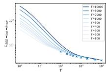

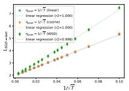

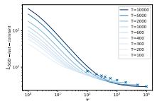

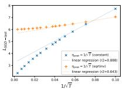

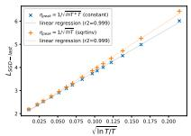  
Figure 1 Upper bound of SGD loss in Equation (2.4) with peak learning rate $\eta_{peak} = 1/\sqrt{T}$ . Left-most is linear decaying schedule. Center is constant schedule.

## 3 GENERALIZATIONS TO DEEP LEARNING AND ADAPTIVE OPTIMIZERS

## 3.1 ABSTRACT FORM OF ANY-ITERATION LOSS

Our goal is to generalize the understanding from convex analysis with SGD beyond the scope of (2.4), to non-convex deep learning and to general optimizers. However, we cannot use (2.4) directly as we do not know $D$ , $G$ , $L_{*}$ . Alternatively, we will estimate these quantities in a data-driven manner and work with an abstract form of the loss in (3.1).

Generalization 1 (generalized from (2.4)). For general optimizers and for deep learning, we have

$$
\mathbb {E} L (\mathbf {w} _ {\tau}) \leq \tilde {L} _ {\infty} + \frac {\tilde {D} ^ {2}}{2 \sum_ {t = 1} ^ {\tau} \eta_ {t}} + \frac {\tilde {G} ^ {2}}{2} \left(\frac {\sum_ {t = 1} ^ {\tau} \eta_ {t} ^ {2}}{\sum_ {t = 1} ^ {\tau} \eta_ {t}} + \sum_ {k = 1} ^ {\tau - 1} \frac {\eta_ {k}}{\sum_ {t = k + 1} ^ {\tau} \eta_ {t}} \frac {\sum_ {t = k} ^ {\tau} \eta_ {t} ^ {2}}{\sum_ {t = k} ^ {\tau} \eta_ {t}}\right)\tag{3.1}
$$

In contrast to (2.4), we require the following modifications:

\- The quantities $\tilde{D}$ and $\tilde{G}$ are no longer tied to $D = \| \mathbf{w}_0 - \mathbf{w}_*\|$ and $G^2 = \max_{\mathbf{w}}\mathbb{E}\| \mathbf{g}(\mathbf{w})\|^2$ , i.e. we renounce the physical meaning of these quantities, because

\- general optimizers (e.g. momentum SGD, AdamW, Muon, parameter-efficient training such as LoRA) are not covered by (2.4) ever under the convex setting in Condition 2.1.
- $D, G$ depend on the model architectures and datasets, which are hard to derive in practice.

\- The irreducible loss is now $\tilde{L}_{\infty} = L(\lim_{\tau \to \infty} \mathbf{w}_{\tau})$ instead of $L_{*} = L(\mathbf{w}_{*})$ . This accommodates the fact that there are infinite minima in deep learning, hence $\mathbf{w}_{*}$ is not unique and $L_{*}$ is not well-defined.

As we will observe in the following sections, (3.1) holds well at all iterations and becomes tight after some initial training. To be clear, we examine (3.1) on various

\- models: ResNet (He et al., 2016), ViT (Dosovitskiy et al., 2020), GPT2 (Radford et al., 2019), vision-language models (which use LLAMA3 architecture (Dubey et al., 2024) as the language backbone).

\- tasks: ImageNet (Deng et al., 2009), OpenWebText (Gokaslan et al., 2019), and Cauldron (Laurençon et al., 2024).

\- optimizers: SGD, AdamW Loshchilov & Hutter (2019), Muon (Jordan et al., 2024), parameter-efficient training (LoRA (Hu et al., 2022)), etc.

\- learning rate schedules: linear decay, cosine decay, WSD, constant, and square-root inverse.

## 3.2 GENERALIZING TO DEEP LEARNING

We start with SGD (same as $(2.4)$ ) but in the deep learning setting. In Figure 2, we train ResNet18 on ImageNet dataset with SGD under 4 learning rate schedules. The goodness of fit $^{1}$ for $(3.1)$ is particularly evident for WSD and cyclic schedules: for WSD schedule, we see a sudden decrease of loss matching the decay of learning rate; for cyclic schedule, we see the periodic oscillation of loss matching that of learning rate. In particular, we use half the iterations to fit (solid line) and half to predict (dashed line). Our loss prediction by $(3.1)$ is tight after a short period of training, with $R^{2}$ score $\geq 0.95$ , highlighting the strong applicability of Generalization 1.

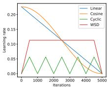  
(a) schedules

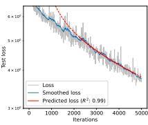  
(b) Linear

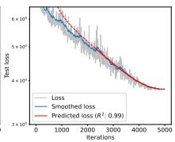  
(c) Cosine

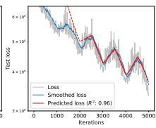  
(d) Cyclic

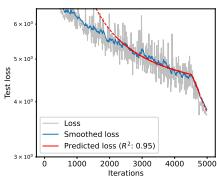  
(e) WSD  
Figure 2 Sequence-to-sequence prediction by (3.1) for ResNet18 on ImageNet with SGD.

## 3.3 GENERALIZING TO ADAPTIVE OPTIMIZERS

We further test adaptive optimizers beyond SGD. Firstly, we compare ResNet18 trained with AdamW in Figure 3 to SGD in Figure 2 and observe the same patterns that (3.1) holds with $R^2$ score $\geq 0.95$ .

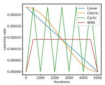  
(a) schedules

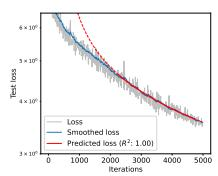  
(b) Linear

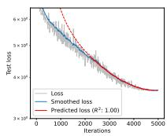  
(c) Cosine

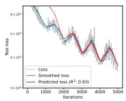  
(d) Cyclic

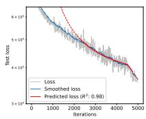  
(e) WSD  
Figure 3 Sequence-to-sequence prediction by (3.1) for ResNet18 on ImageNet with AdamW.

We further pre-train GPT2 (124M) with AdamW and Muon-NSGD (Boreiko et al., 2025) optimizers, and observe consistent patterns in Figure 4 and Figure 5. The prediction $R^{2}$ scores are $\geq 0.95$ in all cases.

## 4 LOSS CHARACTERIZATION AT LAST ITERATION

Towards building a scaling law of loss and learning rate, we focus on the last iterate $\mathbf{w}_T$ and further abstract the loss characterization in (3.1).

Generalization 2 (generalized from (2.5)). For general optimizers under deep learning and for a qualified learning rate schedule with any peak learning rate $\eta_{peak}$ , we have

$$
\mathbb {E} L (\mathbf {w} _ {T}) \sim \tilde {L} _ {\infty} + \frac {\tilde {q} _ {1} ^ {2}}{T \eta_ {\mathrm{peak}}} + \eta_ {\mathrm{peak}} \tilde {q} _ {2} ^ {2} := L _ {D L - l a s t} (\eta_ {\mathrm{peak}}, T)\tag{4.1}
$$

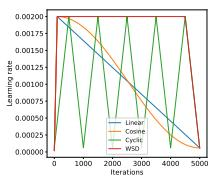  
(a) schedules

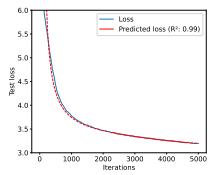  
(b) Linear

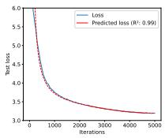  
(c) Cosine

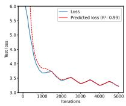  
(d) Cyclic

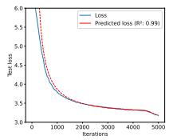  
(e) WSD

Figure 4 Sequence-to-sequence prediction by (3.1) for GPT2 on OpenWebText with AdamW.  
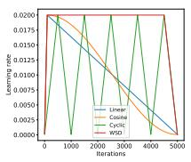  
(a) schedules

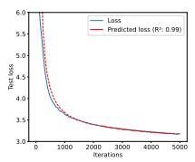  
(b) Linear

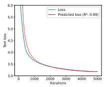  
(c) Cosine

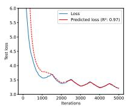  
(d) Cyclic

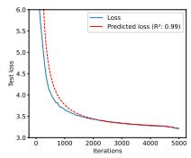  
(e) WSD  
Figure 5 Sequence-to-sequence prediction by (3.1) for GPT2 on OpenWebText with Muon-NSGD.

In contrast to Generalization 1, we require the following modifications:

\- We restrict our analysis to the qualified schedules that satisfy Condition 2.5, such as linear and cosine decay, instead of any schedules.

\- We renounce the exact forms of $\tilde{q}_1$ and $\tilde{q}_2$ (e.g. $\tilde{q}_1 = \tilde{D}, \tilde{q}_2 = \tilde{G}$ for linear decay; $\tilde{q}_2 = \sqrt{1.061} \tilde{G}$ for cosine decay; $\tilde{q}_1 = \tilde{D} / (1 + c)$ for WSD) and will derive these quantities in a data-driven manner.

\- We focus on $\mathbf{w}_T$ rather than any iterate $\mathbf{w}_{\tau}$ and transform the inequality (3.1) to an approximate equality for moderately large $T$ .

## 4.1 LOSS UNDER ANY PEAK LEARNING RATE

We test (4.1) using losses reported in (Li et al., 2025). These results were obtained under optimally tuned hyperparameters, where the language models (dense and Mixture-of-Experts; MoE) were trained on a mixture of web text, mathematics, and code. The training used AdamW optimizer with cosine decaying schedule (see details in Section 3.2 and Appendix A of (Li et al., 2025)).

We observe high $R^{2}$ scores ( $\geq 0.95$ ) across different model sizes as well as model architectures, which empirically validates Generalization 2.

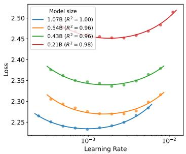

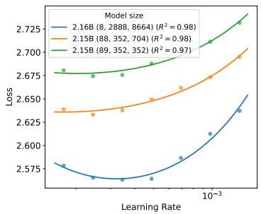  
Figure 6 Loss versus learning rate for dense models (left) and MoE models (right) by (Li et al., 2025). In the right plot, the orange and green curves correspond to different architectures despite having the same model size. Specific model configurations are summarized in Appendix C.1.

## 4.2 LOSS UNDER OPTIMAL PEAK LEARNING RATE

We further derive and test (4.1) under the optimal $\eta_{peak}$ in Generalization 3.

Generalization 3 (generalized from Corollary 2.4, part 2). For general optimizers under deep learning and for a qualified learning rate schedule with optimal peak learning rate $\eta_{peak}$ , we have $\mathbb{E}L(\mathbf{w}_{T}) \sim \tilde{L}_{\infty} + 2\tilde{q}_{1}\tilde{q}_{2}/\sqrt{T}$ .

To validate Generalization 3, we scrutinize the loss values and training horizons in (Hoffmann et al., 2022) for various models from 0.074B to 12.56B, which were used to establish the compute-optimal scaling law for large language models. These runs trained Chinchilla models (same as Gopher (Rae et al., 2021)) with AdamW under cosine decaying schedule. The original loss values are not publicized in (Hoffmann et al., 2022) but they are reconstructed by (Besiroglu et al., 2024). Note that Hoffmann et al. (2022) only gives FLOPs $^{2}$ , rather than the training iterations. Therefore, we translate the training horizon to token size=FLOPs/6/model size=batch size × T.

Table 2 Summary of linear regression on $\mathbb{E}L(\mathbf{w}_{T})$ and $1/\sqrt{T}\cdot batch size$ from (Hoffmann et al., 2022; Besiroglu et al., 2024). Full table is deferred to Table 6. Runs for 2B model is visualized in Figure 7.  
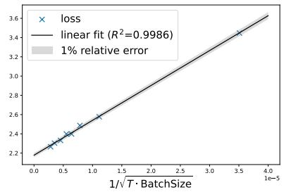

<table><tr><td>model size(B)</td><td>num of horizons</td><td> $2\tilde{q}_{1}\tilde{q}_{2}$ </td><td> $\tilde{L}_{\infty}$ </td><td> $R^{2}$  score</td></tr><tr><td>0.074</td><td>5</td><td>3.22e+04</td><td>2.825</td><td>0.991</td></tr><tr><td>0.140</td><td>7</td><td>3.04e+04</td><td>2.670</td><td>0.991</td></tr><tr><td>0.279</td><td>8</td><td>3.29e+04</td><td>2.498</td><td>0.999</td></tr><tr><td>0.425</td><td>8</td><td>3.27e+04</td><td>2.430</td><td>0.998</td></tr><tr><td>0.632</td><td>8</td><td>3.17e+04</td><td>2.367</td><td>0.998</td></tr><tr><td>1.143</td><td>10</td><td>3.10e+04</td><td>2.275</td><td>0.998</td></tr><tr><td>1.429</td><td>9</td><td>3.18e+04</td><td>2.253</td><td>0.996</td></tr><tr><td>1.611</td><td>9</td><td>3.36e+04</td><td>2.228</td><td>0.995</td></tr><tr><td>2.004</td><td>8</td><td>3.62e+04</td><td>2.178</td><td>0.999</td></tr><tr><td>2.280</td><td>7</td><td>4.41e+04</td><td>2.128</td><td>1.000</td></tr><tr><td>2.979</td><td>10</td><td>5.90e+04</td><td>2.016</td><td>0.990</td></tr><tr><td>4.519</td><td>6</td><td>3.83e+04</td><td>2.106</td><td>0.978</td></tr><tr><td>6.792</td><td>8</td><td>4.66e+04</td><td>2.023</td><td>0.999</td></tr><tr><td>9.290</td><td>4</td><td>4.29e+04</td><td>2.046</td><td>0.988</td></tr><tr><td>12.56</td><td>3</td><td>4.23e+04</td><td>2.053</td><td>1.000</td></tr></table>

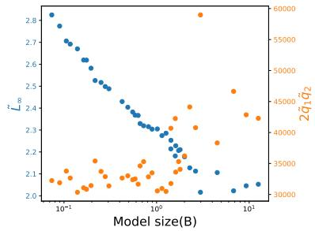  
Figure 7 Upper: 2B model precisely fits Generalization 3 across a wide range of training horizons. Lower: As model size increases, $\tilde{L}_{\infty}$ log-linearly decreases and $2\tilde{q}_{1}\tilde{q}_{2}$ roughly increases.  
In Table 2, we consistently observe precise fitting of Generalization 3 with $R^{2} \geq 0.978$ , up to FLOPs=1e22 and over 300B tokens. We note that all loss values are within 1% relative error of our prediction in Figure 7.

## 5 TWO-DIMENSIONAL SCALING LAW FOR LEARNING RATE

The success of transferring insights from convex analysis to deep learning underscores the appeal of predicting and controlling the loss via learning rate. In this section, we propose two-dimensional scaling law of optimal loss and learning rate at various model sizes $(N)$ and training horizons $(T)$ .

Notably, we must take one step further from Generalization 3, because we do not know the optimal $\eta_{\mathrm{peak}}$ , except it has a form $\frac{\tilde{q}_1}{\tilde{q}_2\sqrt{T}}$ with unknown $\tilde{q}_1$ and $\tilde{q}_2$ .

Generalization 4 (generalized from Corollary 2.4, part 1). For general optimizers under deep learning and for a qualified learning rate schedule with scaled peak learning rate $\eta_{peak} = \eta_{ref} / \sqrt{T}$ , we have

$$
\mathbb {E} L (\mathbf {w} _ {T}) \sim \tilde {L} _ {\infty} + \tilde {Q} (\eta_ {\mathrm{ref}}) / \sqrt {T}, \forall \eta_ {\mathrm{ref}}.
$$

In words, we have $O(1/\sqrt{T})$ loss convergence under $1/\sqrt{T}$ -scaled $\eta_{peak}$ , including but not limited to the optimal $\eta_{ref}$ in Generalization 3. Notice this expression is linear in $1/\sqrt{T}$ and can be visualized by a straight line. We seek the optimal $\eta_{ref}$ by multiple small-scale runs and we estimate $\tilde{L}_{\infty}$ and $\tilde{Q}$ via linear regression in Section 5.2 and Section 5.3.

Finally, we present a scaling law that predicts both loss and optimal learning rate:

$$
\begin{array}{c} \mathbb {E} L (N, T) \sim \tilde {L} _ {\infty} (\eta_ {\mathrm{ref}} ^ {*}; N) + \tilde {Q} (\eta_ {\mathrm{ref}} ^ {*}; N) / \sqrt {T} \\ \eta_ {\mathrm{peak}} ^ {*} (N, T) \sim \eta_ {\mathrm{peak}} ^ {*} (N _ {\mathrm{small}}, T _ {\mathrm{small}}) / \sqrt {T / T _ {\mathrm{small}}} \end{array}\tag{5.1}
$$

where $N_{\mathrm{small}}$ is a smaller model with $N_{\mathrm{small}} \leq N$ , and $T_{\mathrm{small}}$ is a shorter training horizon with $T_{\mathrm{small}} \leq T$ , so that we can use small-scale training to inform the large-scale training's hyperparameter.

## 5.1 EXPERIMENT SETTINGS

We train GPT2 language models on OpenWebText for various training horizons, following nanoGPT codebase (Karpathy, 2023). We apply two optimizers: AdamW and Muon-NSGD, both with 0.01 weight decay and without gradient clipping. Here Muon-NSGD is adapted from the original Muon by (1) optimizing all 2D tensors with Muon and other tensors with normalized SGD, i.e. NSGD, and (2) using a single learning rate for Muon and NSGD. We use the cosine decaying learning rate schedule that decays to 0 with $2\%$ warm-up. We conduct 240 runs, which are 4 settings (0.1B/AdamW, 0.1B/Muon-NSGD, 1B/Muon-NSGD, and 7B/Muon-NSGD), 10 training horizons from 100 to 500k iterations, and $6\eta_{\mathrm{ref}}$ from 0.01 to 30.0). See more details in Appendix B.

To illustrate the generality of our approach, we conduct additional experiments in Appendix D for parameter-efficient training (LoRA (Hu et al., 2022)) and ablations over key hyperparameters, such as weight decay, gradient clipping, momentum coefficient, batch size, and random seeds. We consistently observe $O(1/\sqrt{T})$ loss convergence with scaled learning rate across different regimes.

## 5.2 SCALING ACROSS TRAINING HORIZONS

We train GPT2 (0.1B) for T ranging from 100 to 500k steps. We obtain good fitting of linear regression over $1/\sqrt{T} < 0.02$ , i.e. T > 2.5k which indicates that Generalization 4 becomes predictive very early during training. This observation is consistent for two optimizers – AdamW in Figure 8 and Muon-NSGD in Figure 9.

From the intercepts of fitted lines, we determine leverage the optimal $\eta_{peak}^{*} = \eta_{ref}^{*}/\sqrt{T}$ where $\eta_{ref}^{*} = 10$ for Muon-NSGD and $\eta_{ref}^{*} = 0.3$ for AdamW. As we observe from the zoom-in plots in Figure 9 and later in Figure 10, the extrapolation of our scaling law across training horizons is $\approx 80\times$ .

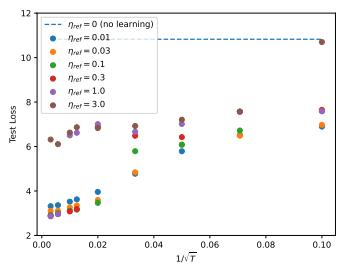

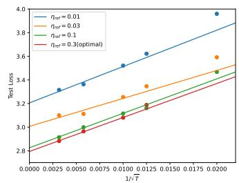

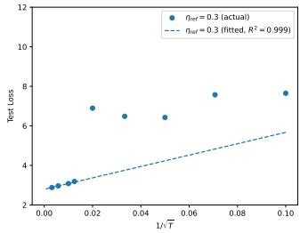  
Figure 8 Loss values (dots) and $1/\sqrt{T}$ prediction for GPT2 (0.1B) with AdamW.

## 5.3 SCALING ACROSS TRAINING HORIZONS AND MODEL SIZES

We further train GPT2 1B and 7B models with Muon-NSGD, using the same $\eta_{ref}^{*}$ that we transfer from GPT 0.1B model by (5.1). Taking a closer look at 7B model losses, we observe precise fitting of our scaling law, extrapolating across model sizes by $70\times$ .

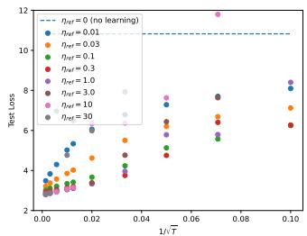

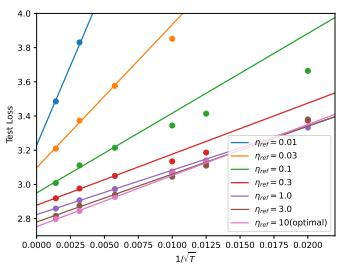  
Figure 9 Loss values (dots) and $1/\sqrt{T}$ prediction for GPT2 (0.1B) with Muon-NSGD.

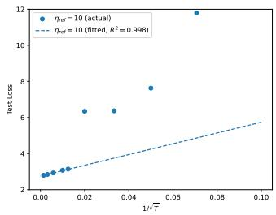

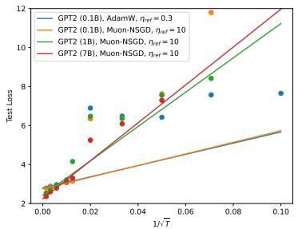

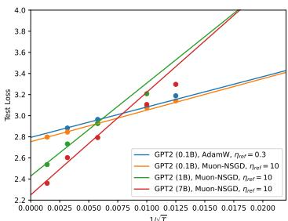

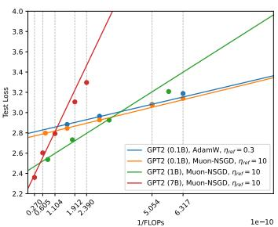  
Figure 10 Loss values (dots) and $1/\sqrt{T}$ or $1/\sqrt{FLOPs}$ prediction for 4 settings.

## 5.4 SCALING ON MULTI-MODAL MODELS

We finetune vision-language models (VLM) with $\approx1B$ parameters on the Cauldron dataset (Laurençon et al., 2024), following nanoVLM codebase (Wiedmann et al., 2025). We apply AdamW optimizer with cosine decaying learning rate and 3% warmup. We test three values of $\eta_{ref}$ across training horizons up to 14.4k iterations. In Figure 11, we observe good fitting when T > 2000, thus generalizing our scaling law to multi-modal models. We note that VLM has multiple components (language backbone, vision backbone, and modality projector) and each has a separate learning rate, all of which are $1/\sqrt{T}$ scaled.

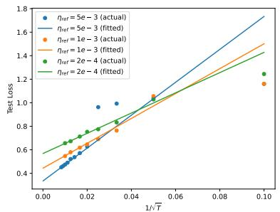

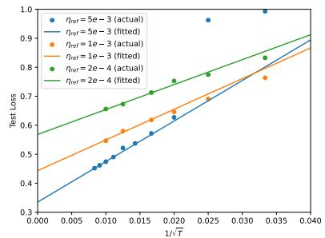  
Figure 11 Loss values (dots) and $1/\sqrt{T}$ prediction for multi-modal VLM with AdamW. Right plot is zoomed.

## 6 CONCLUSION

This paper presents a path, starting from a rigorous analysis that is restricted to SGD and convex loss, and generalizing to non-convex deep learning with general optimizers beyond the support of theory. Along the path, we heavily rely on data-driven method to fit our prediction of loss and learning rate. Our findings support (I) convex-like behavior in deep learning, which can be characterized by sequence-to-sequence prediction in (2); (II) asymptotic prediction of $O(1/\sqrt{T})$ loss convergence and $O(1/\sqrt{T})$ learning rate in deep learning; (III) a scaling law that extrapolates across training horizons and model sizes. We note some limitations of this paper, including the fact that our approach fails to predict test loss but continues to predict training loss when overfitting is severe (see Figure 12), and the lack of understanding why convex-like behaviors exist in various architectures and how many iterations it takes for deep learning to be characterizable by such behaviors.