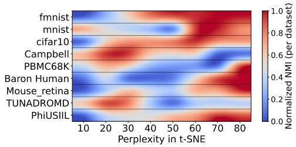
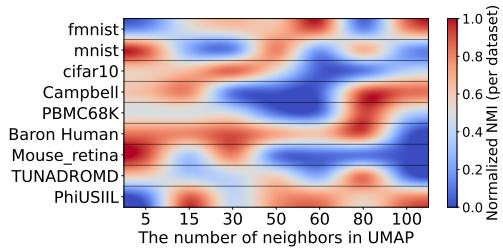
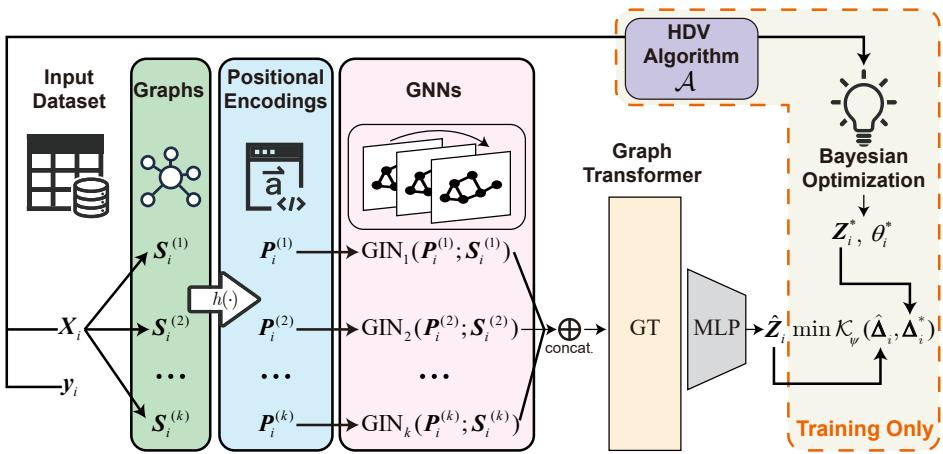
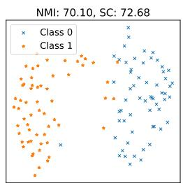
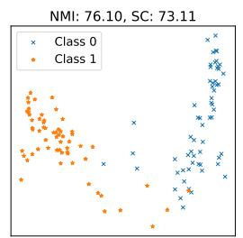
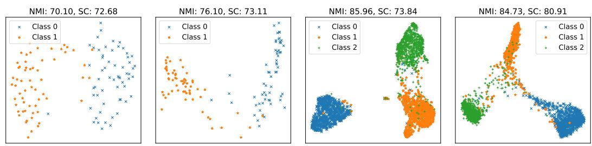
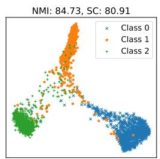
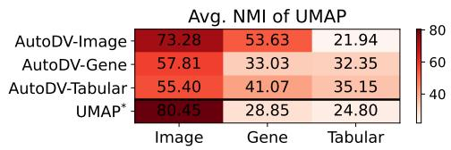
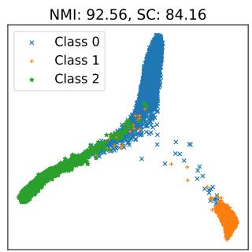
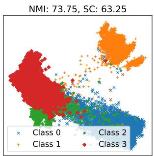

## ABSTRACT

High-dimensional data visualization (HDV) plays an important role in data science and engineering applications. Traditional HDV methods, such as Autoencoder and t-SNE, require hyper-parameter tuning and iterative optimization on every dataset and cannot effectively utilize the knowledge from historical lowdimension representation, which lowers the efficiency, convenience, and accuracy in real applications. In this paper, we present AutoDV, an end-to-end deep learning model, for high-dimensional data visualization. AutoDV is built upon a graph transformer network and an invariant loss function and is trained on a number of diverse datasets converted into multi-weight graphs. Given a new dataset, AutoDV outputs the 2D or 3D embeddings of all data points directly. AutoDV has the following merits: 1) There is no hyper-parameter selection during the data visualization stage; 2) The end-to-end model avoids re-training or iterative optimization when visualizing data; 3) The input dataset can have any number of features and can be from any domain. Our experiments show that AutoDV can successfully generalize to unseen datasets without retraining with 89.37% precision of t-SNE and 91.05% precision of UMAP on the unseen CIFAR10 datasets. Compared with existing parametric data visualization deep models, our method obtains a significant improvement with 86.65% precision gain. AutoDV can perform even better than t-SNE and UMAP on gene and UCI tabular datasets. The project is available at https://github.com/DryDew/AutoDV.

## 1 INTRODUCTION

Extracting meaningful insights from high-dimensional and complex datasets (Fan, 2025b) to support informed decision-making and drive innovation remains a challenge in contemporary data analysis. High-dimensional data visualization (HDV) is a special dimensionality reduction (DR) technique that allows humans to intuitively interpret large, complex datasets by projecting them into two or three dimensions. This technique has demonstrated success across diverse scientific domains, such as genomics (Dorrity et al., 2020), remote sensing (Li et al., 2022), and finance (Velykoivanenko & Korchynskyi, 2022). HDV is usually an unsupervised task. Formally, given a high-dimensional dataset $\pmb { X } = \{ \pmb { x } _ { 1 } , \pmb { x } _ { 2 } , \dots , \pmb { x } _ { N } \}$ , where each data point $\pmb { x } _ { i } \in \mathbb { R } ^ { d }$ , d is the dimensionality of the dataset, and N represents the number of data points, the goal is to find a corresponding lowdimensional representation $Z ~ = ~ \{ z _ { 1 } , z _ { 2 } , \dots , z _ { N } \}$ , where each $z _ { i } ~ \in ~ \mathbb { R } ^ { d ^ { \prime } }$ , typically $d \sp { \prime } = 2$ or $d ^ { \prime } = 3$ , such that the structural relationships in X are preserved in Z.

Over the years, numerous algorithms for DR and HDV have been developed, broadly classified into linear and non-linear methods. Classical linear techniques, including Principal Component Analysis (PCA) (Abdi & Williams, 2010), Multidimensional Scaling (MDS) (Saeed et al., 2018), and Linear Discriminant Analysis (LDA) (Balakrishnama & Ganapathiraju, 1998), have established foundational approaches but typically fail to uncover complex, non-linear latent structures inherent in the data. Consequently, various non-linear approaches have emerged (Fan et al., 2018), such as Self-Organizing Maps (SOM) (Kohonen, 1982), Isomap (Tenenbaum et al., 2000), Kernel PCA (Scholkopf et al., 1998), Principal Curves (Hastie & Stuetzle, 1989), autoencoders (Wang et al.,¨ 2016), Stochastic Neighbor Embedding (SNE) (Hinton & Roweis, 2002), Locally Linear Embedding (LLE) (Roweis & Saul, 2000), and Laplacian Eigenmaps (Belkin & Niyogi, 2003). Despite their advances, these methods are not effective in visualizing real-world data with complex structures. To address this, more sophisticated methods, like t-distributed Stochastic Neighbor Embedding (t-SNE) (Van der Maaten & Hinton, 2008; Sun et al., 2023), Uniform Manifold Approximation and Projection (UMAP) (McInnes et al., 2018), TriMap (Amid & Warmuth, 2019), and PaCMAP (Wang et al., 2021), explicitly optimize low-dimensional embeddings to maintain both local neighborhood structures and global data relationships effectively. Although the traditional methods and recent advances in HDV have facilitated substantial progress in various domains, they face critical limitations in the following.

  
Figure 1: NMI Sensitivity under different hyperparameters for t-SNE (perplexity) and UMAP (n neighbor). Note: The datasets are randomly down-sampled to simulate various real-world unseen datasets. Please see details in Appendix I

• Sensitive to hyper-parameter tuning: The traditional data visualization methods are sensitive to hyper-parameter selection, such as perplexity in t-SNE and the number of neighbors in UMAP and PaCMAP, also discussed by previous works (Wattenberg et al., 2016; Bohm et al., 2022). Different hyper-parameter selection will significantly change the vi-¨ sualization results. As an empirical experiment presented in Figure 1, a fixed or default hyper-parameter may not always lead to the best performance. The absence of labeled data in unsupervised tasks poses a unique challenge to tuning the HDV hyper-parameter.

• Re-training overhead: They need to re-run the training algorithm iteratively, i.e. retraining, on every new dataset. It brings significant computational overhead, especially when handling a large number of datasets.

• Lack of cross-domain and cross-dimension generalization: Some studies tried to solve re-training overhead using a parametric model by optimizing the following problem: minθ $\mathbb { E } _ { i } [ \| f _ { \pmb { \theta } } ( \pmb { x } _ { i } ) - z _ { i } \| _ { 2 } ^ { 2 } ]$ , where $f : \mathbb { R } ^ { d }  \mathbb { R } ^ { d ^ { \prime } }$ is the HDV model. They still failed to adapt the model to new datasets with different domains and dimensions and suffered from overfitting to the training datasets. They failed to effectively utilize the historical low-dimensional representations.

To overcome these limitations, we propose AutoDV, a novel end-to-end visualization approach leveraging graph neural networks (GNNs) (Kipf & Welling, 2016) and graph transformers (Rampa´sekˇ et al., 2022). AutoDV builds a deep learning model using historical visualization results of labeled datasets in a meta-learning manner, effectively capturing the underlying data structure via graph-based representations. Consequently, AutoDV generalizes robustly to unseen datasets without requiring re-training or additional hyper-parameter tuning during inference. Our contributions are summarized as follows:

• We introduce AutoDV, an end-to-end data visualization method that eliminates the need for hyper-parameter tuning and re-training when visualizing new datasets.

• Compared with existing parametric visualization methods such as parametric UMAP and inductive t-SNE, AutoDV can adapt to datasets of varying dimensionality, exhibiting superior generalization performance on unseen datasets from any domain.

• Extensive numerical experiments on real-world datasets demonstrate the effectiveness and superiority of AutoDV.

## 2 RELATED WORKS

As mentioned before, many insightful HDV methods have been proposed in the past decades (Hartono, 2020; Dehghani et al., 2024; Hartono et al., 2014), but they incur high computational costs, particularly when projecting unseen test data. Techniques like Barnes-Hut t-SNE (Van Der Maaten, 2014) and opt-SNE (Belkina et al., 2019) accelerate training but still require re-training on new datasets. Recently, end-to-end visualization models like parametric UMAP (Sainburg et al., 2021) and inductive t-SNE (Roman-Rangel & Marchand-Maillet, 2019) have been developed to avoid retraining overhead. These models use deep neural networks to map high-dimensional data directly to low-dimensional spaces. Auto-encoder (Wang et al., 2016) and its successors, such as Geometric AE (Nazari et al., 2023) and GGAE (Lim et al., 2024), also have the potential to establish an end-toend HDV model in a self-regression way. However, they still struggle to generalize across datasets with different dimensions or domains. In this paper, we resolve these challenges by utilizing graph neural networks and an affine invariant loss function design.

Another significant challenge in data visualization algorithms is the high sensitivity of hyperparameter selection (Wattenberg et al., 2016; Bohm et al., 2022). For example, the perplexity in¨ t-SNE critically influences the visualization outcomes. Choosing an excessively large perplexity can result in meaningless spherical visualizations, while an excessively small perplexity might lead to clustering inconsistent with the true data labels, rendering the visualization practically meaningless. Research addressing hyper-parameter optimization in visualization algorithms is still limited. Indeed, tuning hyper-paremters in unsupervised learning is always challenging (Fan et al., 2022). Liao et al. (2023) introduced a Bayesian optimization-based framework to identify optimal hyperparameters across various visualization performance metrics. However, these metrics rely heavily on ground truth labels, such as classification accuracy, area under the ROC curve, and normalized mutual information (NMI), which are impractical to obtain for large, unlabeled datasets typical in real-world scenarios. Our proposed method does not intend to optimize the hyper-parameters without accessing the ground truth label. Instead, we eliminate the hyper-parameter selection when visualizing new unlabeled datasets to further increase the efficiency.

## 3 PROPOSED METHOD

## 3.1 TASK DEFINITION OF AUTODV

Definition 1 (AutoDV) Suppose we have L labeled historical datasets $( { \pmb X } _ { 1 } , { \pmb y } _ { 1 } ) , \ ( { \pmb X } _ { 2 } , { \pmb y } _ { 2 } )$ $\left( X _ { L } , \pmb { y } _ { L } \right)$ , where $\pmb { X } _ { i } \in \mathbb { R } ^ { \hat { N } _ { i } \times d _ { i } }$ is the data matrix with $N _ { i }$ samples and d features, and $\mathbf { \Psi } _ { \pmb { y } _ { i } } \in \mathbb { R } ^ { N _ { i } }$ are the labels, $i = 1 , \ldots , L$ . Let $\scriptstyle A _ { \theta }$ be an effective data visualization algorithm, with hyperparameters θ. For each $X _ { i } ,$ , an optimal low-dimensional embedding $Z _ { i } ^ { * } \in \mathbb { R } ^ { N _ { i } \times d ^ { \prime } }$ is obtained by $\mathbf { \dot { \boldsymbol { Z } } } _ { i } ^ { * } = \mathbf { \boldsymbol { A } } _ { \theta _ { i } ^ { * } } ( \mathbf { \boldsymbol { X } } _ { i } )$ , where $\theta _ { i } ^ { * }$ denotes the optimal hyper-parameters selected using $\mathbf { \nabla } _ { \mathbf { \psi } _ { 3 } }$ with respect to some metric M. The goal ofAutoDV is to train an end-to-end model $f _ { \phi } : \mathbb { R } ^ { N _ { i } \times d _ { i } }  \mathbb { R } ^ { N _ { i } \times d ^ { \prime } }$ from $\{ ( X _ { i } , Z _ { i } ^ { * } ) \} _ { i = 1 } ^ { L } ,$ , such that, for any unseen dataset $\boldsymbol { X } _ { n e w } \in \mathbb { R } ^ { N _ { i ^ { \prime } } \times d _ { i ^ { \prime } } }$ , with $Z _ { n e w } ^ { * } = \mathcal { A } _ { \theta _ { i ^ { \prime } } ^ { * } } ( X _ { n e w } )$ , it holds that

$$
\operatorname{dist} \left(f _ {\phi} \left(\boldsymbol {X} _ {\text { new }}\right), \boldsymbol {Z} _ {\text { new }} ^ {*}\right) \leq \varepsilon\tag{1}
$$

where $d i s t ( \cdot , \cdot )$ denotes some distance metric and $\varepsilon > 0$ is a small constant.

In Definition 1, examples of $\scriptstyle A _ { \theta }$ include t-SNE and UMAP. The evaluation metric M could be the normalized mutual information (NMI), which is a widely used index in clustering and dimensionality reduction. $\mathrm { d i s t } ( \cdot , \cdot )$ could be the Frobenius norm. In most real scenarios, we hope to use HDV methods to observe the potential cluster structures in the data and it is not difficult to achieve a large number of labeled datasets from diverse domains to train our model $f _ { \phi }$ . That’s why we use labeled historical datasets to establish AutoDV.

Nevertheless, there are two challenges when solving problem 1.

C1 Designing the end-to-end model $f _ { \phi }$ is non-trivial, especially when the model is expected to handle input datasets with different sizes and dimensions, i,e., $N _ { i } \neq N _ { j }$ and $d _ { i } \neq d _ { j }$ for some i and j.

C2 There exist multiple optimal low-dimension embeddings $\boldsymbol { Z } _ { i } ^ { * }$ for the same input $X _ { i }$ if we apply translation, rotation, and scaling to $Z _ { i } ^ { * } , \mathrm { e . g . , } Z _ { i } ^ { * }$ and $Z _ { i } ^ { * } Q$ with any orthonormal matrix $Q$ are equivalent in terms of visualization. This will result in a one-to-many problem and will be difficult to converge (Arridge et al., 2019).

To tackle these two challenges, we present a graph neural network (GNN) based model design and an affine invariant loss design in the following, respectively.

## 3.2 AUTODV MODEL DESIGN

Most deep neural networks are designed for a fixed input dimensionality and therefore cannot be directly applied to datasets with different numbers of features, which is a main limitation of existing parametric data visualization models. To address this issue, AutoDV additionally exploits the graph structure of each dataset. Given a historical dataset $X _ { i } ,$ we first construct a weighted graph whose adjacency matrix is a pairwise similarity matrix between samples. The similarity matrix is computed using a Gaussian kernel function (Wasserman, 2006). To preserve as much structural information as possible, we further generate k-scale graphs for each dataset by using different bandwidth parameters in the Gaussian kernel, following (Long et al., 2015). The resulting graphs, $S _ { i } ^ { ( 1 ) } , S _ { i } ^ { ( 2 ) } , \ldots , S _ { i } ^ { ( k ) }$ ， capture the data structure at different scales and are computed as follows.

$$
\pmb {S} _ {i} ^ {(j)} [ u, v ] = \exp \left(- \frac {\| \pmb {X} _ {i} [ u ] - \pmb {X} _ {i} [ v ] \| _ {2} ^ {2}}{\gamma^ {(j)}}\right), \forall j = 1, 2, \ldots , k,\tag{2}
$$

where $S _ { i } ^ { ( j ) } [ u , v ]$ denote the entry in the u-th row and v-th column of $S _ { i } ^ { ( j ) } , \Vert X _ { i } [ u ] - X _ { i } [ v ] \Vert _ { 2 } ^ { 2 }$ represents the squared Euclidean distance between u-th data point and the v-th data point in dataset $X _ { i }$ , and $\gamma ^ { ( j ) }$ is the bandwidth parameter of the j-th scale graph. Consequently, a dataset in R $N _ { i } \times d _ { i }$ is transformed into multiple graphs represented by weighted adjacency matrices in $\mathbb { R } ^ { N _ { i } \times N _ { i } }$ . This graph representation mitigates the constraints imposed by varying dataset dimensions on end-to-end visualization methods.

We employ Graph Neural Networks (GNNs) (Kipf & Welling, 2016) to extract intrinsic structural features from the input graphs. GNNs, extensively studied in graph learning literature (Wu et al., 2020), leverage message-passing and node-weight sharing mechanisms to handle graphs with varying node counts effectively. Unlike typical graph learning tasks such as node classification (Yifan et al., 2020), graph classification (Wang & Fan, 2024), and graph clustering (Sun & Fan, 2024; Fan, 2025a), our input graphs do not inherently include node features, while GNNs often require node features for node aggregation. To solve this, we derive graph positional encodings (PE) (Grotschla¨ et al., 2024) from the weighted adjacency matrices as node features, utilizing techniques such as Laplacian positional encoding (Belkin & Niyogi, 2003) or random walk encoding (Perozzi et al., 2014). We denote the positional encoding as $\breve { P _ { i } } \in \mathbb { R } ^ { N _ { i } \times d _ { e } }$ , where $d _ { e }$ is the dimensionality of the positional encoding. Then, for each dataset $X _ { i }$ , we have

$$
\pmb {P} _ {i} ^ {(i)} = h (\pmb {S} _ {i} ^ {(j)}), \forall j = 1, \dots , k\tag{3}
$$

where $h ( \cdot )$ is the function for extracting the positional encoding. In our experiment, we adopt singular value decomposition (SVD) positional encoding (Sium et al., 2023).

Our end-to-end AutoDV model extensively utilizes the popular GNN architectures, GIN (Xu et al., 2018) and Graph Transformer (Rampa´sek et al., 2022), as the model backbone. To utilize theˇ kscale graphs spawned from Eq. (2), we propose a multi-graph GNN. For each graph, there is an individual GNN to process it. Then, we have k sets of node embeddings extracted by GNNs. By concatenating them together, we get the final hidden node embedding for the input dataset. Finally, a graph transformer is introduced to explore the inter-node relationship, and the final output of the model is produced by a multi-layer perceptron (MLP). The whole AutoDV framework is illustrated in Figure 2. It processes an input dataset $X _ { i }$ by first computing k similarity matrices $\{ S _ { i } ^ { ( j ) } \} _ { j = 1 } ^ { k }$ and extracting graph positional encodings $\{ \boldsymbol { P } _ { i } ^ { ( j ) } \} _ { j = 1 } ^ { k }$ . Then, $( { \cal P } _ { i } ^ { ( j ) } , S _ { i } ^ { ( j ) } ) , j = 1 , 2 , . . . , k .$ , serve as inputs to the GINs, which perform feature extraction. The k outputs are concatenated as new node features and are fed into a graph transformer and an MLP to output a low-dimensional visualization result $\hat { Z _ { i } }$ . The AutoDV model $f _ { \phi }$ is expressed as follows:

  
Figure 2: AutoDV framework. The input datasets will first be converted into $k$ graphs. Then, positional encodings are extracted from the graph. Each graph is processed by an independent GIN network. The output node features of GINs are concatenated and sent to a graph transformer. Finally, an MLP head is responsible for outputting the low-dimensional embedding. Ground truth label $\mathbf { \nabla } _ { \mathbf { \psi } _ { 3 } } \psi _ { i }$ HDV algorithm ${ \mathcal { A } } ,$ and Bayesian optimization are only used at the training stage to produce $\boldsymbol { Z } _ { i } ^ { * }$

$$
f _ {\phi} \left(\left\{\left(\boldsymbol {P} _ {i} ^ {(j)}, \boldsymbol {S} _ {i} ^ {(j)}\right) \right\} _ {j = 1} ^ {k}\right) = \operatorname{MLP} \left(\operatorname{GT} \left(\operatorname{GIN} _ {1} \left(\boldsymbol {P} _ {i} ^ {(1)}, \boldsymbol {S} _ {i} ^ {(1)}\right) \oplus \dots \oplus \operatorname{GIN} _ {k} \left(\boldsymbol {P} _ {i} ^ {(k)}, \boldsymbol {S} _ {i} ^ {(k)}\right)\right)\right),\tag{4}
$$

where $\oplus$ represents the concatenation along the feature dimension, $\mathrm { G I N } _ { j } ( \cdot )$ is the $j \mathrm { - t h }$ GIN network, $j = 1 , 2 , \dots , k ,$ , and $\operatorname { G T } ( \cdot )$ is the graph transformer. Hence, we let $f _ { \phi }$ to be a GNN model, $\mathbb { R } ^ { k \times N _ { i } \times d _ { e } }  \mathbb { R } ^ { N _ { i } \times d ^ { \prime } }$ , parametrized by $\phi$ accepting unified dimensionality of node features.

## 3.3 MODEL TRAINING

Affine Invariant Loss Function To tackle the second challenge in problem 1, we introduce an affine invariant loss function for the AutoDV task. Instead of direct alignment between the output low-dimensional embeddings, we align the geometric structure between the low-dimensional embeddings. Specifically, we construct pairwise squared similarity matrices $\hat { \Delta } _ { i }$ and $\Delta _ { i } ^ { * }$ for $\boldsymbol { Z } _ { i }$ and $\pmb { Z } _ { i } ^ { * }$ , i.e.,

$$
\hat {\pmb {\Delta}} _ {i} [ u, v ] = \sigma \left(\| \hat {\pmb {Z}} _ {i} [ u ] - \hat {\pmb {Z}} _ {i} [ v ] \| _ {2} ^ {2}\right), \qquad \pmb {\Delta} _ {i} ^ {*} [ u, v ] = \sigma \left(\| \pmb {Z} _ {i} ^ {*} [ u ] - \pmb {Z} _ {i} ^ {*} [ v ] \| _ {2} ^ {2}\right),\tag{5}
$$

where $\sigma ( \cdot )$ is a transformation function turning a distance to a similarity. Then we present a general training loss function as follows:

$$
\mathcal {L} = \frac {1}{L} \sum_ {i = 1} ^ {L} \sum_ {u = 1} ^ {N _ {i}} \sum_ {v = 1} ^ {N _ {i}} \mathcal {K} _ {\psi} (\hat {\boldsymbol {\Delta}} _ {i} [ u, v ], \boldsymbol {\Delta} _ {i} ^ {*} [ u, v ]),\tag{6}
$$

where $\kappa _ { \psi } ( \cdot , \cdot )$ denotes the Bregman divergence (Bregman, 1967) with a strictly convex function $\psi$ and $\mathcal { K } _ { \psi } ( \boldsymbol { x } , \boldsymbol { y } ) = \psi ( \boldsymbol { x } ) - \psi ( \boldsymbol { y } ) - \left. \nabla \psi ( \boldsymbol { y } ) , \bar { \boldsymbol { x } } - \boldsymbol { y } \right.$ for any two scalers x and $y .$ . By aligning the pairwise distance matrices, the one-to-many problem brought by translation and rotation is eliminated. To further realize the scaling invariant, we pre-process $\boldsymbol { Z } _ { i } ^ { * }$ using z-score normalization. Then, the training loss function is an affine invariant function that effectively solves the one-to-many problem.

For the choice of σ and $\psi ,$ it depends on the selection of A spawning $z ^ { * }$ . In this paper, we consider t-SNE and UMAP since they are the most popular HDV methods currently, although other HDV methods can be used in our AutoDV. For t-SNE, we use Kullback-Leibler divergence (KLD) loss similar to the original t-SNE training process as follows:

$$
\begin{array}{l} \mathcal {L} _ {\mathrm{tsne}} = \frac {1}{L} \sum_ {i = 1} ^ {L} \sum_ {u = 1} ^ {N _ {i}} \sum_ {v = 1} ^ {N _ {i}} p _ {u, v} ^ {(i)} \log \left(\frac {p _ {u , v} ^ {(i)}}{q _ {u , v} ^ {(i)}}\right), \\ p _ {u, v} ^ {(i)} = \frac {(1 + \| \mathbf {Z} _ {i} ^ {*} [ u ] - \mathbf {Z} _ {i} ^ {*} [ v ] \| _ {2} ^ {2}) ^ {- 1}}{\sum_ {u ^ {\prime} , v ^ {\prime}} (1 + \| \mathbf {Z} _ {i} ^ {*} [ u ^ {\prime} ] - \mathbf {Z} _ {i} ^ {*} [ v ^ {\prime} ] \| _ {2} ^ {2}) ^ {- 1}}, q _ {u, v} ^ {(i)} = \frac {(1 + \| \hat {\mathbf {Z}} _ {i} [ u ] - \hat {\mathbf {Z}} _ {i} [ v ] \| _ {2} ^ {2}) ^ {- 1}}{\sum_ {u ^ {\prime} , v ^ {\prime}} (1 + \| \hat {\mathbf {Z}} _ {i} [ u ^ {\prime} ] - \hat {\mathbf {Z}} _ {i} [ v ^ {\prime} ] \| _ {2} ^ {2}) ^ {- 1}}. \end{array}\tag{7}
$$

Compared with t-SNE, Eq. 7 does not have access to the original high-dimensional data, avoiding the selection of perplexity. It guides the model $f _ { \phi }$ to mimic the optimal low-dimensional embedding from t-SNE using KLD to ensure the outputs and ground truth $\hat { Z } ^ { \ast }$ are from the same distribution.

As for $Z ^ { \ast }$ coming from UMAP, we consider both local structure and global structure consistency between $\hat { Z }$ and $Z ^ { * }$ since the original UMAP algorithm focuses more on the local structure using $\mathrm { " n . n e i g h b o r s " }$ hyper-parameter, leading to a sparse similarity matrix in the original data space. We present the training loss for UMAP as follows:

$$
\mathcal {L} _ {\text { umap }} = \frac {1}{L} \sum_ {i = 1} ^ {L} \left(\sum_ {(u, v) \in \mathcal {N} _ {i}} \ell_ {(u, v)} + \lambda (t) \sum_ {(u, v) \notin \mathcal {N} _ {i}} \ell_ {(u, v)}\right),\tag{8}
$$

where $\begin{array} { r } { \ell _ { ( u , v ) } = \big ( \frac { 1 } { 1 + a \| \hat { Z } _ { i } [ u ^ { \prime } ] - \hat { Z } _ { i } [ v ^ { \prime } ] \| _ { 2 } ^ { 2 b } } - \frac { 1 } { 1 + a \| Z _ { i } ^ { * } [ u ^ { \prime } ] - Z _ { i } ^ { * } [ v ^ { \prime } ] \| _ { 2 } ^ { 2 b } } \big ) ^ { 2 } } \end{array}$ , a and b are two hyper-parameters mapping the distance value into a family of student-t distribution, λ(t) is a regularization coefficient decreasing as the training step t growing, ${ \mathcal { N } } _ { i }$ is the index set of the k-nearest pairs in dataset $X _ { i }$ and the number of neighbors is determined by $Z ^ { \ast }$ when searching the optimal hyper-parameters, i.e. ”n neighbors”. We set $a = 1 . 9 3$ and $b = 0 . 7 9$ , the same as the default hyper-parameters of UMAP. We linearly decay the $\lambda ( t ) , \mathrm { i . e . , } \lambda ( t ) = ( 1 - t / T )$ , where $T$ is the maximum number of iterations. This term makes sure that the model focuses more on the local structure consistency. We show that Eq. (7) and Eq. (8) are special cases of Eq. (6) in Appendix C.

Eliminating Sign Ambiguity in PE In the proposed method, positional embeddings (PE) are derived using Eq. (3) via spectral techniques such as SVD or eigenvalue decomposition. A well-known challenge with these methods is sign ambiguity (Lim et al., 2022). If v is an eigenvector of $S ,$ then −v is also an eigenvector. This inherent ambiguity can cause structurally similar graphs to produce significantly different positional embeddings simply due to inconsistent eigenvector signs, which is clearly unreasonable. However, there is currently no principled way to resolve this ambiguity or determine an optimal sign convention. To address the sign ambiguity, we propose a sign count-based method to decide whether to flip the sign of each dimension of PE or not. Specifically, if the majority value in one column of $_ { r }$ is negative, we flip the sign of this column. Otherwise, we keep the sign. The process is illustrated in Appendix D. Although the proposed sign flipping strategy may not completely solve the sign ambiguity problem, it is lightweight to implement and shows good performance in our empirical experiments.

## 3.4 COMPUTATIONAL COMPLEXITY ANALYSIS AND LARGE-SCALE EXTENSION

As shown by Table 1, AutoDV is more efficient than t-SNE and UMAP because it does not require iterative optimization on a new dataset. More details are in Appendix F due to limited space.

Table 1: Computation complexity comparison for effectively visualizing a new dataset.

<table><tr><td>HDV Method</td><td>AutoDV</td><td>t-SNE</td><td>UMAP</td></tr><tr><td>Complexity</td><td> $\mathcal{O}(N_i^2 w_{\text{max}})$ </td><td> $\mathcal{O}(N_i^2 BT)$ </td><td> $\mathcal{O}(N_i^2 d_i + N_i rBT)$ </td></tr></table>

As shown by the table, the quadratic complexity in terms of $N _ { i }$ hinders the application of AutoDV to very large datasets. One can use sparsification or other techniques to accelerate the computation of self-attention and graph convolution. We propose a batch-based method to allow AutoDV scale to datasets with large sizes at the inference stage. Specifically, we split $X _ { i }$ into $\{ \boldsymbol { X } _ { i } ^ { ( 1 ) } , \boldsymbol { X } _ { i } ^ { ( 2 ) } , \ldots , \boldsymbol { X } _ { i } ^ { ( q _ { i } ) } \}$ , where each subset is in $\mathbb { R } ^ { M \times d _ { i } }$ . Then, we construct an anchor subset A with a size smaller than M, where the intra-distance among points is small, i.e., points in A belong to the same cluster. We simultaneously input A $\mid \cup X _ { i } ^ { ( j ) } , j = 1 , 2 , \ldots , q _ { i }$ , for each $j .$ . The final low-dimensional embedding is the corresponding $\hat { Z } _ { i } ^ { ( 1 ) } \cup \cdots \cup \hat { Z } _ { i } ^ { ( q _ { i } ) }$ . We utilize a fixed anchor set to calibrate $\hat { Z } _ { i } ^ { ( j ) }$ from different outputs. The details are shown in Appendix E.

## 3.5 THEORETICAL ROBUSTNESS ANALYSIS FOR AUTODV

In this section, we analyze the theoretical robustness of AutoDV. It is to test how stable its outputs are when the input data contains noise, outliers, or small perturbations. A robust model will produce very similar low-dimensional visualizations even from slightly corrupted data, ensuring its results are reliable. This is crucial because real-world data is often messy.

Theorem 1 Given a dataset X with n samples, let $\{ \boldsymbol { P } ^ { ( j ) } , \boldsymbol { S } ^ { ( j ) } \} _ { j = 1 } ^ { k }$ with $P ^ { ( j ) } \in \mathbb { R } ^ { n \times d _ { e } }$ be the input of AutoDV model $f _ { \phi } ,$ , where the output is $Z = f _ { \phi } ( \{ P ^ { ( j ) } , S ^ { ( j ) } \} _ { j = 1 } ^ { k } )$ . Denote $\tilde { X }$ as a perturbed counterpart of X, where the output is $\tilde { Z } ~ = ~ f _ { \phi } \big ( \{ \tilde { P } ^ { ( j ) } , \tilde { S } ^ { ( j ) } \} _ { j = 1 } ^ { k } \big )$ . Suppose $f _ { \phi }$ is $L _ { \phi } – L i p s c h i t z$ continuous, then

$$
\| \boldsymbol {Z} - \tilde {\boldsymbol {Z}} \| _ {F} \leq 2 k L _ {\phi} \sqrt {\frac {2 n}{e}} \max _ {j} \left(\frac {c ^ {(j)} + 1}{\sqrt {\gamma^ {(j)}}}\right) \| \boldsymbol {X} - \tilde {\boldsymbol {X}} \| _ {F},\tag{9}
$$

where $\begin{array} { r } { c ^ { ( j ) } = \frac { 2 \sqrt { 2 \lambda _ { \operatorname* { m a x } } ^ { ( j ) } } } { \delta ^ { ( j ) } } + \frac { 1 } { 2 } \sqrt { \frac { d _ { e } } { \lambda _ { \operatorname* { m i n } } ^ { ( j ) } } } , \delta ^ { ( j ) } } \end{array}$ is the eigen gap between $S ^ { ( j ) }$ and $\tilde { S } ^ { ( j ) } , \lambda _ { \mathrm { m a x } } ^ { ( j ) }$ x is the maximum eigenvalue of $S ^ { ( j ) }$ , and $\lambda _ { \operatorname* { m i n } } ^ { ( j ) }$ is the minimum the $d _ { e }$ -th eigenvalue between $S ^ { ( j ) }$ and $\tilde { S } ^ { ( j ) }$ .

The Lipschitz constant $L _ { \phi }$ is determined by the network structure and is usually $\begin{array} { r } { \mathcal { O } ( \prod _ { i = 1 } ^ { D } \| \mathbf { W } _ { i } \| _ { 2 } ) } \end{array}$ where D denotes the maximum deepth of the neural networks and $\mathbf { W } _ { i }$ denotes the weight matrix of layer i. As shown by the theorem, proved in Appendix B, if $\delta ^ { ( j ) }$ is large, $d _ { e } / \lambda _ { m i n } ^ { ( j ) }$ is small, and $\gamma ^ { ( j ) }$ is large, our AutoDV is stable, provided that the neural network is not too complex. The result also indicates that, if a new dataset is similar to a training dataset, the visualizations should be similar too. This guarantees the generalization ability of AutoDV to some extent.

## 4 EXPERIMENTS

## 4.1 EXPERIMENTAL SETTINGS

Datasets We consider 3 types of datasets from the real world. 1. Image Data: We visualize image datasets via CLIP-extracted features (Radford et al., 2021), a common practice in deep learning (Hohman et al., 2018; Huff et al., 2021). We use MNIST (Deng, 2012), Fashion-MNIST (Xiao et al., 2017), and CIFAR-10 (Krizhevsky et al., 2009); each image is mapped to a 512-dim vector. MNIST and FMNIST are used for training, CIFAR-10 for testing. 2. Gene Data: We utilize four commonly used gene datasets in bioinformatics research. Baron Human (Baron et al., 2016), Mouse Retina1, Campbell (Campbell et al., 2017), and PBMC68k2. We set Mouse Retina as the testing set and the rest for training. We drop out the rare cells following (Wang et al., 2024) to ensure the class balance. 3. Tabular Data: 3We collect 26 real-world tabular datasets from UCI Machine Learning Library (Kelly et al.). These tabular datasets are labeled for classification tasks. Categorical features are one-hot encoded. We drop the auto-increment attributes, such as date, time, and ID. We randomly split 30% for the testing. The detailed information of the datasets is summarized in Appendix G.

Baselines and Evaluation Metrics We compare the proposed AutoDV with two existing deep learning based parametric visualization methods, including parametric UMAP (p-UMAP)(Sainburg et al., 2021)4 and inductive TSNE (i-tSNE) (Roman-Rangel & Marchand-Maillet, 2019)5. We manually extend i-tSNE to UMAP as inductive UMAP (i-UMAP) for fair comparison. We also compare the proposed method with PCA (Abdi & Williams, 2010) and autoencoder (AE) (Wang et al., 2016). We also report the performance of the optimal low-dimensional embedding from t-SNE and UMAP searched by Bayesian optimization as the ground truth performance of our method, denoted as t-SNE∗ and UMAP∗, respectively. The default (D.) t-SNE and UMAP are also reported. We evaluate the output low-dimensional embeddings using NMI with ground-truth labels and the silhouette coefficient (SC) (Rousseeuw, 1987), following (Qiao et al., 2025), detailed in Appendix H. To validate whether our method can finish the AutoDV task in problem 1, we also report the relative precision of NMI and SC, which is calculated as $\mathcal { M } ( \hat { Z } ; \pmb { y } ) / \mathcal { M } ( Z ^ { * } ; \pmb { y } )$ . M is NMI or SC. Note that the precision can be larger than 1 since the performance of Zˆ can be better.

  
(a) UMAP∗ on CIFAR10 (b) AutoDV-UMAP on CI- (c) UMAP∗ on CIFAR10 (d) AutoDV-UMAP on CIwith 120 points. FAR10 with 120 points. with 2759 points. FAR10 with 2759 points.  
Figure 3: (a) and (b) are results of UMAP∗ and AutoDV-UMAP on the same small test subset of CIFAR10, where AutoDV is better. (c) and (d) are results of UMAP∗ and AutoDV-UMAP on the same large test subset of CIFAR10.

Training Data Preparation Due to the limited video memory size, directly inputting a graph with a large number of nodes is infeasible. To mitigate this, we randomly sample many subsets (sub-graphs) from a very large dataset (graph) similar to (Zeng et al., 2020). The detailed sampling process is in Appendix I. The maximum size of the subset is set to 3000. For each subset, we use Bayesian optimization (Jones et al., 1998) and its ground truth label to search for the optimal hyper-parameter and the corresponding low-dimensional embedding Z∗ setting M to NMI. Note that AutoDV is not limited by the choice of M, and can accommodate various metrics for HDV depending on specific analytical objectives. We adopt NMI and SC, as they reveal cluster structures that are more interpretable and perceptually aligned with human intuition in high-dimensional spaces. Finally, we drop out the subset with NMI less than 10% to ensure the quality of the training data. For t-SNE, we search for the optimal perplexity. For UMAP, we search for the optimal ”n neighbors”. Detailed implementation of our method is in Appendix J.

## 4.2 RESULTS

Comparative Study with Baselines In the image data experiment, the feature dimensionality of training data and testing data is the same. So, we can compare the performance of our method and the baseline methods. We randomly sample 500 subsets from MNIST and FMNIST for training, and sample 50 subsets from CIFAR10 for testing. The comparison results are reported in Table 2. It is seen that almost no baseline method can produce an effective low-dimensional embedding for unseen new datasets, indicating poor generalizability. For i-tSNE and i-UMAP, due to the one-tomany problem, they are even underfitting on the training sets. In contrast, our method demonstrates superior performance on unseen new datasets using historical results from t-SNE or UMAP.

Cross-Dimension Results on Gene and Tabular Data Since the dimensionalities of the training datasets and the test datasets are different, baseline methods cannot directly perform training. For these methods, we randomly project the input data into 512-dimension space. In the gene data experiment, we sampled 2918 subsets of Baron Human, Campbel, and PBMC68k for training and sampled 113 subsets of Mouse Retina for testing. All subsets have optimal NMIs higher than 10%. The results are reported in Table 3. In the tabular data experiment, we sampled 519 subsets in total from 31 real-world tabular datasets. We split 30%, 156 subsets, for testing. The results are reported in Table 4. In the results, we see that AutoDV has the best NMI on the test sets, and are even better than the optimal low-dimensional embeddings from the original t-SNE and UMAP. It indicates our methods can better capture the structural information from the high-dimensional space. We observe that deep-learning baselines often yield high SC but very low NMI under our setting, suggesting the output representation collapses into a dense region due to optimization difficulties.

Table 2: Comparative data visualization results on image datasets. Average NMI, NMI precision, SC, and SC precision are reported on the test set. 500 subsets of MNIST and FMNIST are sampled for training. 50 subsets of CIFAR-10 are sampled for testing. The best performance on test sets is bold. Selected visualization results are plotted in Figure 3.

<table><tr><td>Methods</td><td>t-SNE*</td><td>UMAP*</td><td>D. t-SNE</td><td>D. UMAP</td><td>PCA</td><td>AE</td><td>p-UMAP</td><td>i-tSNE</td><td>i-UMAP</td><td>AutoDV-tSNE</td><td>AutoDV-UMAP</td></tr><tr><td>Test NMI</td><td> $77.04_{\pm8.8}$ </td><td> $80.45_{\pm6.6}$ </td><td> $71.71_{\pm13.5}$ </td><td> $79.72_{\pm6.7}$ </td><td> $15.97_{\pm6.9}$ </td><td> $6.08_{\pm3.8}$ </td><td> $15.58_{\pm7.6}$ </td><td> $5.38_{\pm2.1}$ </td><td> $3.63_{\pm1.7}$ </td><td> $68.70_{\pm9.0}$ </td><td> $73.28_{\pm7.6}$ </td></tr><tr><td>Test NMI Prec.</td><td>100</td><td>100</td><td>-</td><td>-</td><td>-</td><td>-</td><td> $18.54_{\pm5.4}$ </td><td> $10.41_{\pm25.4}$ </td><td> $4.40_{\pm2.1}$ </td><td> $89.37_{\pm7.8}$ </td><td> $91.05_{\pm5.3}$ </td></tr><tr><td>Test SC</td><td> $63.32_{\pm9.5}$ </td><td> $68.54_{\pm6.6}$ </td><td> $47.24_{\pm9.9}$ </td><td> $67.61_{\pm6.79}$ </td><td> $34.51_{\pm2.5}$ </td><td> $42.85_{\pm8.7}$ </td><td> $43.84_{\pm8.5}$ </td><td> $39.34_{\pm5.2}$ </td><td> $40.50_{\pm6.5}$ </td><td> $55.15_{\pm6.6}$ </td><td> $70.41_{\pm7.1}$ </td></tr><tr><td>Test SC Prec.</td><td>100</td><td>100</td><td>-</td><td>-</td><td>-</td><td>-</td><td> $62.63_{\pm7.2}$ </td><td> $62.65_{\pm8.6}$ </td><td> $58.10_{\pm11.1}$ </td><td> $88.60_{\pm14.4}$ </td><td> $103.0_{\pm8.6}$ </td></tr></table>

Table 3: Data visualization results on gene datasets. Average NMI, NMI precision, SC, and SC precision are reported on the test set. 2918 subsets of Baron Human, Campbel, and PBMC68k are sampled for training. 113 subsets of the Mouse Retina dataset are sampled for testing. The best performance on test sets is bold.

<table><tr><td>Methods</td><td>t-SNE*</td><td>UMAP*</td><td>D. t-SNE</td><td>D. UMAP</td><td>PCA</td><td>AE</td><td>p-UMAP</td><td>i-tSNE</td><td>i-UMAP</td><td>AutoDV-tSNE</td><td>AutoDV-UMAP</td></tr><tr><td>Test NMI</td><td> $32.73_{\pm 30.3}$ </td><td> $28.85_{\pm 34.7}$ </td><td> $15.67_{\pm 21.9}$ </td><td> $22.45_{\pm 33.2}$ </td><td> $9.27_{\pm 5.0}$ </td><td> $5.21_{\pm 5.9}$ </td><td> $24.78_{\pm 15.1}$ </td><td> $4.80_{\pm 3.5}$ </td><td> $13.98_{\pm 7.9}$ </td><td> $33.22_{\pm 28.7}$ </td><td> $33.03_{\pm 25.0}$ </td></tr><tr><td>Test NMI Prec.</td><td>100</td><td>100</td><td>-</td><td>-</td><td>-</td><td>-</td><td> $93.38_{\pm 72.9}$ </td><td> $35.42_{\pm 29.7}$ </td><td> $52.50_{\pm 61.1}$ </td><td> $102.7_{\pm 36.7}$ </td><td> $111.9_{\pm 60.2}$ </td></tr><tr><td>Test SC</td><td> $34.43_{\pm 4.6}$ </td><td> $47.98_{\pm 20.1}$ </td><td> $35.84_{\pm 13.3}$ </td><td> $57.00_{\pm 24.9}$ </td><td> $34.10_{\pm 7.6}$ </td><td> $73.18_{\pm 27.3}$ </td><td> $65.58_{\pm 15.3}$ </td><td> $54.70_{\pm 1.6}$ </td><td> $61.51_{\pm 6.0}$ </td><td> $47.11_{\pm 10.8}$ </td><td> $47.98_{\pm 12.2}$ </td></tr><tr><td>Test SC Prec.</td><td>100</td><td>100</td><td>-</td><td>-</td><td>-</td><td>-</td><td> $151.5_{\pm 53.8}$ </td><td> $161.1_{\pm 17.8}$ </td><td> $160.3_{\pm 26.2}$ </td><td> $110.4_{\pm 30.1}$ </td><td> $112.5_{\pm 22.1}$ </td></tr></table>

Cross-Domain Transferability of AutoDV To further validate the generalizability of the proposed AutoDV model, we conducted cross-domain experiments across diverse data types. Figure 4 summarizes the average NMI, with source domains represented along the columns and target domains along the rows. The results of SC are given in Appendix K. AutoDV exhibits strong transferability, especially when transferring from image or tabular domains to the gene domain. It surpasses even the optimal within-domain embeddings produced by t-SNE\* and UMAP\*. Transfers into the image domain result in only a slight reduction in performance, which may be attributed to the higher structural complexity or noise inherent in gene and tabular data.

## 4.3 RUNNING TIME COMPARISON

We compare the wall-clock running time among t-SNE, UMAP, AutoDV, and AutoDV with precomputed PEs when visualizing a new dataset in R3000×512 using 1 CPU core. The number of optimization iterations of t-SNE and UMAP are set to 2000. All runs are repeated 10 times. The results are in Table 5. It is seen that AutoDV obtains significant acceleration compared with t-SNE. Although UMAP also consumes less time, it suffers from the hyper-parameter selection involving multiple retrainings, which results in unacceptable overhead.

Table 4: Data visualization results on UCI tabular datasets. Average NMI, NMI precision, SC, and SC precision are reported on the test set. 519 subsets are sampled from 26 datasets, of which 156 subsets are split for testing. The best performance on test sets is bold.

<table><tr><td>Methods</td><td>t-SNE*</td><td>UMAP*</td><td>D. t-SNE</td><td>D. UMAP</td><td>PCA</td><td>AE</td><td>p-UMAP</td><td>i-tSNE</td><td>i-UMAP</td><td>AutoDV-tSNE</td><td>AutoDV-UMAP</td></tr><tr><td>Test NMI</td><td> $30.92_{\pm 12.2}$ </td><td> $24.80_{\pm 16.2}$ </td><td> $23.53_{\pm 11.2}$ </td><td> $15.13_{\pm 12.1}$ </td><td> $10.96_{\pm 11.56}$ </td><td> $5.17_{\pm 11.0}$ </td><td> $14.11_{\pm 11.8}$ </td><td> $8.00_{\pm 10.6}$ </td><td> $10.56_{\pm 12.6}$ </td><td> $33.45_{\pm 21.6}$ </td><td> $35.15_{\pm 34.5}$ </td></tr><tr><td>Test NMI Prec.</td><td>100</td><td>100</td><td>-</td><td>-</td><td>-</td><td>-</td><td> $57.08_{\pm 30.8}$ </td><td> $27.96_{\pm 32.2}$ </td><td> $50.89_{\pm 51.7}$ </td><td> $121.3_{\pm 40.3}$ </td><td> $129.0_{\pm 93.2}$ </td></tr><tr><td>Test SC</td><td> $44.42_{\pm 10.0}$ </td><td> $64.46_{\pm 15.9}$ </td><td> $43.87_{\pm 10.6}$ </td><td> $61.81_{\pm 19.1}$ </td><td> $63.87_{\pm 25.46}$ </td><td> $75.4_{\pm 6.6}$ </td><td> $75.26_{\pm 9.7}$ </td><td> $77.11_{\pm 16.9}$ </td><td> $76.68_{\pm 16.5}$ </td><td> $48.25_{\pm 10.7}$ </td><td> $64.28_{\pm 9.7}$ </td></tr><tr><td>Test SC Prec.</td><td>100</td><td>100</td><td>-</td><td>-</td><td>-</td><td>-</td><td> $171.2_{\pm 22.0}$ </td><td> $178.1_{\pm 44.2}$ </td><td> $179.7_{\pm 40.9}$ </td><td> $110.0_{\pm 12.5}$ </td><td> $106.4_{\pm 32.3}$ </td></tr></table>

<table><tr><td colspan="4">Avg. NMI of t-SNE</td></tr><tr><td></td><td>Image</td><td>Gene</td><td>Tabular</td></tr><tr><td>AutoDV-Image</td><td>68.70</td><td>46.53</td><td>23.37</td></tr><tr><td>AutoDV-Gene</td><td>58.85</td><td>33.22</td><td>26.61</td></tr><tr><td>AutoDV-Tabular</td><td>62.50</td><td>48.15</td><td>33.45</td></tr><tr><td>t-SNE*</td><td>77.04</td><td>32.73</td><td>30.92</td></tr></table>

Figure 4: Cross-domain transferability performance using t-SNE and UMAP. Each heatmap shows average NMI results for (left) t-SNE and (right) UMAP. Within each map, columns denote the source domain and rows the target domain for the first three rows; the fourth row (“TSNE\*” or “UMAP\*”) reports the within-domain performance of the optimal low-dimensional embedding. Test sets for each domain are the same as in Tables 2, 3, and 4.  

  
(a) AutoDV-UMAP on CIFAR10 (b) AutoDV-UMAP on CIFAR10 with 10000 points. with 20000 points.

Figure 5: (a) is the result of extending AutoDV to a dataset with 10000 points by direct input. (b) is the result of extending AutoDV to a dataset with 20000 points by the batch-based method in 3.4.  
Table 5: Running time comparison for visualizing a dataset.

<table><tr><td>HDV</td><td>AutoDV</td><td>AutoDV (precomputed PE)</td><td>t-SNE</td><td>UMAP</td></tr><tr><td>Time (s)</td><td>101.71±10.1</td><td>92.67±6.2</td><td>763.30±7.01</td><td>103.32±9.63</td></tr></table>

## 4.4 EXTENSION TO LARGE DATASET AND MORE RESULTS

We present results of two ways to visualize large datasets in Figure 6a and 6b. We show more results and an ablation study in Appendix L.

## 5 CONCLUSION

This paper proposed a new end-to-end parametric HDV method, called AutoDV. AutoDV avoids hyper-parameter selection and retraining when visualizing new datasets. Furthermore, it can be generalized to datasets with any number of features from any domain. Experiments on three types of datasets demonstrate superior performance in terms of NMI and SC.

Limitations Although our proposed AutoDV tackles two challenges when designing parametric HDV models and avoids the hyper-parameter selection at the inference stage, it still has some limitations, such as historical dataset dependency.

• It requires historical datasets and their optimal low-dimensional embeddings. This is a common limitation of all inductive learning models.

• In our empirical results, if the number of ground-truth classes of the dataset is large, the NMI will decrease compared with the optimal. This may be because the number of training sets is small in our current experiments.

• The strategy of extending to the large dataset using our method in Section 3.4 may not be optimal. We leave it as the future works.