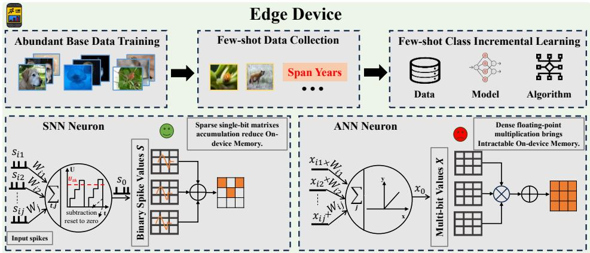
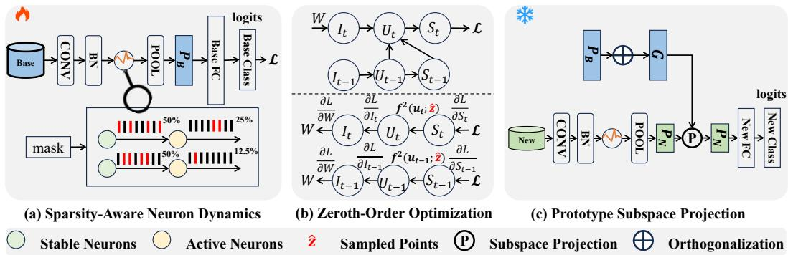
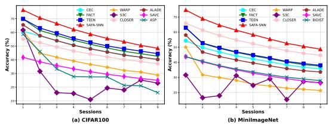
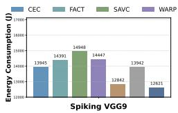
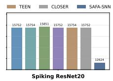
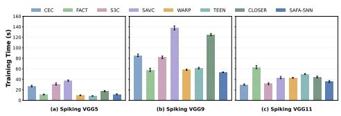
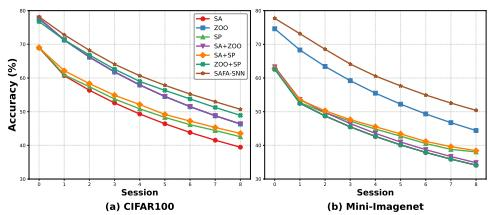
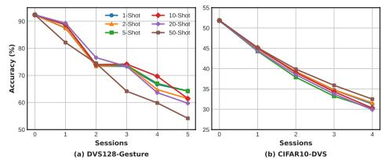

## ABSTRACT

Continuous learning of novel classes is crucial for edge devices to preserve data privacy and maintain reliable performance in dynamic environments. However, the scenario becomes particularly challenging when data samples are insufficient, requiring on-device few-shot class-incremental learning (FSCIL). Although existing work has explored parameter-efficient FSCIL frameworks based on artificial neural networks (ANNs), their deployment is still fundamentally constrained by limited device resources. Spiking neural networks (SNNs) process spatiotemporal information efficiently, offering lower energy consumption, greater biological plausibility, and compatibility with neuromorphic hardware than ANNs. In this work, we propose an SNN-based method containing Sparsity-Aware neuronal dynamics and Fast Adaptive structure (SAFA-SNN) for on-device FSCIL. By threshold regulation, most neurons exhibit stable spikes and others exhibit adaptive spikes. As a result, synaptic traces that encode base-class knowledge are naturally preserved, thereby alleviating catastrophic forgetting. To cope with spike non-differentiability in backpropagation, we employ a gradient-free technique, i.e., zeroth-order optimization. Moreover, class prototypes can limit overfitting on few-shot data but introduce bias. We enhance prototype discriminability by orthogonal subspace projection. Extensive experiments conducted on two standard benchmark datasets (CIFAR-100 and Mini-ImageNet) and three neuromorphic datasets (CIFAR10-DVS, DVS128 Gesture, and N-Caltech101) demonstrate that SAFA-SNN outperforms baselines, specifically achieving at least 4.01% improvement at the last incremental session on Mini-ImageNet and 20% lower energy cost on CIFAR-100 over baselines with practical implementation.

## 1 INTRODUCTION

Intelligent edge devices sense dynamic contexts in their surrounding environment and make decisions based on sensor data (Ravaglia et al., 2021). The high labeling cost and privacy constraints make it difficult to acquire sufficient data for continual batch learning (Wang et al., 2022b). To this end, on-device Few-Shot Class-Incremental Learning (FSCIL) is introduced to incrementally learn from newly collected sensory data with scarce labeled samples while preserving existing knowledge. Spiking Neural Networks (SNNs) (Maass, 1997) are attractive for edge devices (Deng et al., 2025), as neurons fire only upon event-driven activation, reducing unnecessary computation cost (Deng et al., 2020; Lv et al., 2024).

  
Figure 1: Upper. The on-Device FSCIL scenario includes three stages: Abundant base data training, Few-shot data collection, and Few-shot class-incremental learning. Bottom. Compared to the ANN neuron, the SNN neuron communicates by spikes, showing memory and computation benefits.

However, on-device FSCIL faces two significant challenges, i.e., catastrophic forgetting (French, 1999) and overfitting (Tao et al., 2020). Catastrophic forgetting reflects the model’s difficulty learning new tasks while retaining information of originally learned tasks, necessitating a delicate balance between plasticity and stability. Overfitting occurs when the model memorizes limited training samples, leading to poor generalization. On the one hand, recent advanced solutions tackle these challenges by parameter-efficient fine-tuning (PEFT) (Liu et al., 2024a), which fine-tunes parameters on top of a large frozen pre-trained model. Nonetheless, these approaches remain ineffective under limited memory budgets (i.e., 4–12 GB) (Ma et al., 2023). On the other hand, concurrent ondevice SNNs concentrate on integrating SNN algorithms with specialized neuromorphic hardware, which shifts the consideration of the above problems to the later model. Additionally, most existing neuromorphic systems are still trained offline and remain static during development (Safa, 2024), presenting a heavy dependency on abundant labeled data.

Besides, smart devices are severely constrained in terms of memory capacity and maximum performance (Shuvo et al., 2022), extremely scarce labeled samples, and the persistent need for model updates. Edge devices are incapable of accumulating comprehensive data on all classes due to limited storage capacity and must simultaneously perform low-power inference while continuously learning from real-time data streams. We provide the process of on-device FSCIL scenario and compare the behavior of SNN and ANN neuron in this scenario in Figure 1.

To tackle the above challenges, we propose Sparsity-Aware neuronal dynamics and Fast-Adaptive prototype subspace projection with SNN (SAFA-SNN) for general on-device FSCIL. Sparsity measures the spike frequency of neurons. Neurons with dynamic thresholds are defined as stable or active, where most remain stable and only a few are active for new tasks, minimizing updates to the majority of synapses. Zeroth-order optimization is a gradient-free method to approximate true gradients using only function values (Liu et al., 2020b), which enables SNNs to handle non-differentiable spike activation while avoiding limited width of surrogate gradients (Lian et al., 2023). In incremental learning sessions, retraining the model with few-shot samples is inherently prone to severe overfitting. To migrate this issue, we project the prototypes onto the subspace spanned by base classes, enhancing the discriminability of new classes. We conduct practical implementation and extensive experiments on static and neuromorphic datasets, demonstrating the performance of SAFA-SNN.

The main contributions of this paper are as follows:

• We emphasize practical challenges of on-device FSCIL, where both training and inference are performed on resource-constrained devices using energy-efficient, hardware-friendly SNNs, contrasting with ANN-based FSCIL that depends on large-scale server models.

• We propose a sparsity-aware FSCIL method, called SAFA-SNN, with three key features. First, incorporating spikes for prediction, we propose the Sparsity-Aware dynamics for SNN. Then, to solve the problem of non-differentiable spikes in back propagation, we adopt zeroth-order optimization within neuronal dynamics. Finally, we enhance the discriminability of prototypes by subspace projection in incremental learning. To the best of our knowledge, this is the first SNN-based solution towards general on-device FSCIL.

• To prove the effectiveness of our proposed SAFA-SNN for on-device FSCIL, we implement SAFA-SNN on realistic devices (i.e., Jetson Orin AGX), and evaluate on five datasets (CIFAR-100, MiniImageNet, CIFAR10-DVS, DVS128 Gesture, and N-Caltech101), and various models (Spiking VGG, Spiking ResNet, and Spikingformer), demonstrating that SAFA-SNN achieves excellent performance and notable sparsity advantages. We further evaluate the actual on-device energy consumption, demonstrating our efficiency advantage.

## 2 RELATED WORK

## 2.1 FEW-SHOT CLASS-INCREMENTAL LEARNING

To the best of our knowledge, existing methods for few-shot class-incremental learning (FSCIL) are mostly ANN-based, with little exploration in SNNs. The primary work (Tao et al., 2020) preserves feature topology using a neural gas network. Researchers (Zhang et al., 2021) model prototypes as nodes in graph attention network to propagate context information. Existing methods (Zhou et al., 2022; Wang et al., 2023) commonly adopt prototypes to replace traditional MLPs and refine them (Song et al., 2023). Some studies (Shi et al., 2021; Liu et al., 2023) tackle class imbalance by exploring optimal base class distributions. Recent advances (Park et al., 2024; Sun et al., 2024; Wang et al., 2024) train a few parameters (prompts) from the frozen pre-trained model, achieving high accuracy. However, memory overhead limits their use for resource-constrained devices. Prior work focuses on a specific processor (Huo et al., 2025), while we explore FSCIL on general devices.

## 2.2 SPIKING NEURAL NETWORKS WITH DYNAMIC THRESHOLD

In the realm of SNNs, the dynamic threshold mechanism aims to manipulate the threshold spontaneously. BDETT computes thresholds via average membrane potentials for neuronal homeostasis (Ding et al., 2022), but excessive spiking remains. Highly active neurons skew the average, causing aggressive firing and reduced sparsity. LTMD learns initial membrane potentials for heuristic neuron thresholding (Wang et al., 2022a), but neuron behaviors across layers remain interdependent in spatial and temporal processing. Soft threshold schemes enable adaptive layer-wise sparsity (Chen et al., 2023), but independent pruning causes error accumulation, affecting overall model performance. Efforts with combinations of adaptive threshold methods have led to innovative approaches (Wei et al., 2023; Hao et al., 2024). Our paper further tackles FSCIL challenges via sparsity-aware dynamic thresholds that shift networks to task-specific local contexts.

## 2.3 ON-DEVICE SNN TRAINING AND INFERENCE

Previous studies on on-device SNNs can be classified into two categories: inference and training with updating. The lightweight SNN is a crucial application for resource-constrained edge devices (Yu et al., 2024a). For instance, Lite-SNN (Liu et al., 2024b) proposes a spatial-temporal compression strategy to reduce memory and computational cost. Most researchers focus on efficient quantization for SNN-training like SNN pruning (Wei et al., 2025; Qiu et al., 2025; Yu et al., 2025), to facilitate efficient deployment. Current SNN training and updating focus on gradient update (Anumasa et al., 2024) or local SNN training optimization (Mukhoty et al., 2023; Yu et al., 2024b) to enable low-latency SNN training on devices. In this work, we explore both SNN-batch training on abundant base classes and inference in FSCIL phases, which typically occur in the overchanging on-device environments, achieving high performance and low energy consumption.

## 3 PRELIMINARIES

## 3.1 SPIKING NEURAL NETWORK

We use the leaky integrate-and-fire (LIF) neuron model, a simplified but common approach to neuromorphic computing that mimics biological neurons through charging, leakage, and firing. The process of state updating in LIF neurons follows certain principles:

$$
\mathbf {U} _ {t} ^ {\prime} = \gamma \mathbf {I} _ {t} + \mathbf {U} _ {t - 1}, \mathbf {I} _ {t} = f (\mathbf {x}; \boldsymbol {\theta}),\tag{1}
$$

$$
\mathbf {S} _ {t} = H (\mathbf {U} _ {t} ^ {\prime} - \mathbf {U} _ {\mathrm{th}}),\tag{2}
$$

$$
\mathbf {U} _ {t} = \mathbf {S} _ {t} \mathbf {U} _ {\mathrm{reset}} + (\mathbf {1} - \mathbf {S} _ {t}) \mathbf {U} _ {t} ^ {\prime},\tag{3}
$$

where $H = \mathbf { 1 } _ { \mathbf { U } _ { \mathrm { t ^ { \prime } } } > \mathbf { U } _ { \mathrm { t h } } } , \gamma$ is the time constant, $\mathbf { I } _ { t }$ is the spatial input calculated by applying function $f$ with x as input and θ as learnable parameters, and $\mathbf { U } _ { t } ^ { \prime }$ is a temporary voltage at time step $t ,$ whose value instantly changes. At time step t, when the membrane $\mathbf { U } _ { t } ^ { \prime }$ rises and reaches the threshold $\bf { U } _ { \mathrm { t h } } .$ a spike denoted by $\mathbf { S } _ { t }$ is generated as 1, and $\mathbf { U } _ { t } ^ { \prime }$ will be reset to $\mathbf { U } _ { \mathrm { r e s e t } } ;$ otherwise, $\mathbf { S } _ { t }$ remains 0. Afterwards, $\mathbf { U } _ { t } ^ { \prime }$ changes to $\mathbf { U } _ { t }$ . SNNs present challenges in terms of the non-differentiable activation function in Equation (2). The backpropagation of directly training SNNs can be described as

$$
\frac {\partial L}{\partial \mathbf {W}} = \sum_ {t = 1} ^ {T} \frac {\partial L}{\partial \mathbf {S} _ {t}} \frac {\partial \mathbf {S} _ {t}}{\partial \mathbf {U} _ {t}} \frac {\partial \mathbf {U} _ {t}}{\partial \mathbf {I} _ {t}} \frac {\partial \mathbf {I} _ {t}}{\partial \mathbf {W}},\tag{4}
$$

where W is the weight of input, and $\frac { \partial \mathbf { S } _ { t } } { \partial \mathbf { U } _ { t } }$ is non-differentiable, which is typically replaced by surrogate gradient (SG) methods (Wu et al., 2018). However, SG deviates significantly from the true gradients and easily causes vanishing gradient problem (Neftci et al., 2019). To address this issue, we employ zeroth-order optimization to estimate the gradients, inspired by Mukhoty et al. (2023).

## 3.2 CLASS PROTOTYPE

Class prototypes are widely used in few-shot learning based on the observation by Snell et al. (2017). In FSCIL, researchers use prototypes as dynamic classifiers (Zhang et al., 2021). In detail, they decouple the FSCIL model into a feature encoder $\phi _ { \theta } ( \cdot )$ with parameters θ and a linear classifier W, and freeze $\phi _ { \theta } ( \cdot )$ during incremental sessions, with only the classifier being updated. For each new class $i ,$ the weight $W _ { i }$ in the classifier is parameterized by the mean embeddings of each class, i.e., the prototype $P _ { i }$ , which can be denoted as $\begin{array} { r } { P _ { i } = \frac { 1 } { K } \sum _ { j = 1 } ^ { | D _ { s } | } \mathbb { I } _ { \{ y _ { j } = i \} } \phi ( x _ { j } ) } \end{array}$ , where K denotes the number of samples in the class i.

## 4 ON-DEVICE FSCIL PROBLEM

On-device FSCIL problem depicts data with scarce samples always coming, models need to maintain performance on all seen classes while maintaining low latency and high security, enhanced data privacy, and real-time decisions under resource-limited edge devices. The data resources are always scarce, for example, users take an average of 4.9 photos per day (Gong et al., 2024).

Assuming FSCIL tasks contain a base session and a sequence of S incremental sessions, the training data available for each session can be denoted as $\{ { \cal D } _ { 0 } ^ { t r a i n } , { \cal D } _ { 1 } ^ { t r a i n } , . . . , { \cal D } _ { S } ^ { t r a i n } \} . \quad { \cal D } _ { s } ^ { t r a i n } \ =$ $\{ ( x _ { i } ^ { s } , y _ { i } ^ { s } ) \} _ { i = 0 } ^ { | D _ { s } ^ { t r a i n } | }$ , where $x _ { i } ^ { s } \in X _ { s }$ is the training instance and $y _ { i } ^ { s } \in Y _ { s }$ is its corresponding label in session s. The classes in each session s is disjoint with another session $s ^ { \prime } , \mathrm { i . e . , } D _ { s } ^ { t r a i n } \cap D _ { s ^ { \prime } } ^ { t r a i n } = \emptyset$ The training data in session 0 have abundant instances while each incremental session has much smaller instances, $\mathrm { i . e . , } | D _ { 0 } ^ { t r a i n } | > > | D _ { s > 0 } ^ { t r a i n }$ |. Each incremental session has training sets in the form of N-way K-shot, i.e, there are N classes and each class has K samples. In session s, the model’s performance is assessed on validation sets from all encountered datasets $( \leq s )$ to minimize the expected risk $\textstyle { \mathcal { R } } ( f , s )$ over all seen classes (Zhang et al., 2025):

$$
\mathbb {E} _ {(x _ {i}, y _ {i}) \sim \mathcal {D} _ {0} ^ {t r a i n} \cup \dots \cup \mathcal {D} _ {s} ^ {t r a i n}} \left[ \mathcal {L} \left(f (x _ {i}; \mathcal {D} _ {s} ^ {t r a i n}, \theta^ {s - 1}), y _ {i}\right) \right],\tag{5}
$$

where the algorithm $f$ constructs a new model using current training data $\mathcal { D } _ { s } ^ { t r a i n }$ and parameters $\theta ^ { s - 1 }$ to minimize the loss ${ \mathcal { L } } .$ The general goal is to continually minimize the risk of each new session, i.e., $\textstyle \sum _ { s = 0 } ^ { S } { \mathcal { R } } ( f , s )$ . Note that in this paper, “session” and “task” are used interchangeably.

In many real-world scenarios, when FSCIL applications are deployed on resource-limited edge devices, the learning efficiency w.r.t. both few-shot inference speed and memory footprint becomes a crucial metric. Being able to quickly adapt deep prediction models in low computational cost at the edge is necessary to better suit the needs of personal mobile users. However, these aspects are rarely explored in prior FSCIL research, which motivates us to solve these on-device FSCIL challenges beyond catastrophic forgetting and overfitting.

  
Figure 2: SAFA-SNN framework includes three main components: (a) Training abundant data and selecting active and stable neurons by masks. (b) Top: forward propagation through FSCIL process; Bottom: backpropagation using zeroth-order optimization only in the base class training. (c) Freezing backbones and updating the prototypes by subspace projection in the incremental inference.

## 5 METHODOLOGY

## 5.1 MOTIVATION

While considerable research focuses on soft-subnetworks that freeze the major part of the model parameters to preserve learned knowledge and train a minor part of parameters for the selected subnetwork in incremental learning sessions (Mazumder et al., 2021; Kang et al., 2023), inspired by the regularized lottery ticket hypothesis, the question of expanding the network structure remains unsolved. Additionally, biological neural networks are interconnected through synapses, receiving input spikes and emitting output spikes according to the membrane accumulation, forming different subnetworks by synapse weights, but different regularized subnetworks formed by different spiking firing dynamics in neurons remain unexplored. Motivated by these challenges, we explore if the regulation of neuronal dynamics can help the trade-off between plasticity and stability in dealing with FSCIL tasks. Despite ongoing efforts, overfitting remains a challenge. Subspace projection, using class-specific matrices, offers robustness in few-shot learning (Simon et al., 2020). Despite previous studies explore prototype rectification methods by trainable networks (Tang et al., 2024) and training-free calibration (Wang et al., 2023), the prototypes of novel classes still tend to deviate to the base one. These motivate the need for the subspace projection scheme that represents each new class with an orthogonal subspace basis and projects onto the most similar base classes.

## 5.2 OVERVIEW OF SAFA-SNN

SAFA-SNN for on-device FSCIL comprises three parts: a sparsity-aware dynamic mechanism to mitigate forgetting, the formulation of zeroth-order optimization for non-differentiable spikes, and a prototype subspace projection for fast adaptation on few-shot new class. Figure 2 illustrates the overview of SAFA-SNN in FSCIL, and the full FSCIL procedure is detailed in Algorithm 1.

## 5.3 SPARSITY-AWARE NEURONAL DYNAMICS

Previous studies have demonstrated the functional role of neuronal firing activity in visual classification learning (Freedman et al., 2002). The sparsity-aware neuronal dynamics implement efficient heterogeneous plasticity in SNNs by a dynamic threshold function. It involves neuron division and dynamic threshold mechanism built on the LIF neuron model. Following a homeostatic plasticity rule (Turrigiano, 2012), stable neurons maintain firing rates that stay close to the firing rate during base-class training, which helps preserve previously acquired knowledge. Neurons in each channel are randomly designated as either stable or adaptive, using a channel-wise mask M, which is defined as $\mathbf { M } \overset { \cdot } { = } \{ \mathbf { m } _ { c } \} , c = 1 , 2 , . . . , C$ , where C is the channel number and ${ \bf m } _ { c } = { \bf 1 } _ { \mathrm { c } \leq \lfloor \eta \mathrm { C } \rfloor }$ , where $\eta \in ( 0 , 1 )$ is the adaptive ratio, and neurons in channel c are adaptive if $\mathbf { m } _ { c } = \mathbf { 1 }$ , otherwise they are stable. Most neurons remain stable to maintain consistent spike patterns, while others adapt to incremental learning. We define the sparsity as channel-wise firing rate with spike output S as $\begin{array} { r } { \mathbf { r } = \frac { 1 } { | \Omega | } \sum _ { ( b , t , n ) \in \Omega } S ( b , t , n ) } \end{array}$ . Define the threshold regulation factor as

Algorithm 1 Overall SAFA-SNN Algorithm
Input: Dataset $\{D_s\}_{s=0}^S$, membrane U, feature extractor $\phi$
Output: Spike trains $S_t$, parameters $\theta$
1: Initialize mask M to set $\eta\%$ adaptive neurons 1 and setting others 0 in each channel
2: Initialize threshold $U_{th}$ with zeros
3: for session s = 0 to S do
4: Conduct state updating in LIF neuron models by Equation (1), (2), and (3)
5: if s == 0 then
6: Calculate the threshold regulation factor A by Equation (6)
7: Sample point $z_i \sim \mathcal{N}(0,1)$, i = 1, 2, ..., b
8: if $|x| &lt; \delta |z_i|$ then
9: Estimate the gradient $\hat{g}_i = m_i \cdot |z_i|$
10: end if
11: Estimate the non-differential $\frac{\partial S_t}{\partial U_t}$ by Equation (10)
12: Conduct base session optimization L and update $\phi(\theta)$ by Loss in Equation (13)
13: else
14: Update threshold $U_{th}$ by $U_{th}' = U_{th} + A(r_c - r_b)$
15: Compute the projection subspace by Equation (14)
16: Conduct incremental learning with $\tilde{P}$ in Equation (15)
17: end if
18: end for

$$
\mathbf {A} = \beta (\mathbf {1} - \mathbf {M}) + \gamma \mathbf {M},\tag{6}
$$

where $\beta$ and $\gamma$ are hyper-parameters, and setting $\beta > \gamma$ ensures that thresholds of adaptive neurons change more freely than those of stable neurons. The threshold is dynamically updated by

$$
\mathbf {U} _ {\mathrm{th}} ^ {\prime} = \mathbf {U} _ {\mathrm{th}} + \mathbf {A} (\mathbf {r} _ {c} - \mathbf {r} _ {b}),\tag{7}
$$

where $\mathbf { r } _ { c }$ and $\mathbf { r } _ { b }$ are the sparsity of neurons in current incremental task and base task 0, respectively. With dynamic thresholds, neurons maintain relatively stable spike patterns, which limits unnecessary synaptic updates. As a result, synaptic traces encoding base-class knowledge are preserved. The whole neuronal dynamics process is provided in Appendix A.

## 5.4 ZEROTH-ORDER OPTIMIZATION

Multi-point estimate. Zeroth-order optimization is beneficial to computation-difficult or infeasible gradient problems, since it can approximate the full gradients or stochastic gradients through function value (Liu et al., 2020b). We start by presenting the gradient estimate of $f ( x )$ with two-point directional derivative as

$$
\hat {\nabla} f (x) := \frac {\phi (d)}{\mu} \Sigma_ {i = 1} ^ {b} [ f (x + \delta \mathbf {z} _ {i}) - f (x - \delta \mathbf {z} _ {i}) ],\tag{8}
$$

where b is the number of i.i.d. samples $\{ { \mathbf { z } } _ { i } \} _ { i = 0 } ^ { b } .$ , and d is a dimension-dependent factor. Let $g ( u )$ denotes the central finite difference approximation $\frac { \partial \mathbf { S } _ { t } } { \partial \mathbf { U } _ { t } }$ with membrane potential $u = u _ { t } - u _ { t h }$ Then, for $u \in \mathbb { R } ^ { n }$

$$
g ^ {2} (u; \delta , z) = \frac {H (u + \delta \boldsymbol {z}) - H (u - \delta \boldsymbol {z})}{2 \delta} \boldsymbol {z} = \left\{ \begin{array}{l} 0, | u | > \delta | \boldsymbol {z} | \\ \frac {| \boldsymbol {z} |}{2 \delta}, | u | <   \delta | \boldsymbol {z} | \end{array} \right.,\tag{9}
$$

where z obeys a specific distribution p over b empirical samples $\{ z _ { i } \} _ { i = 0 } ^ { b }$ and H is the heaviside function defined in Section 3.1. Assessing whether perturbations $u + z \delta$ and $u - z \delta$ induce a spike in the neuron allows for an approximation of the gradient. Through random permutation, $g ^ { \widehat { 2 } } ( u )$ accommodates the influence of all neighbors, for a balanced depiction of local dynamics. The approximation to ${ \hat { \nabla } } g ( x )$ at a given input u can be computed as

$$
\frac {\partial \mathbf {S} _ {t}}{\partial \mathbf {U} _ {t}} := \frac {1}{b} \sum_ {i = 1} ^ {b} g ^ {2} (\mathbf {u}; \delta , \mathbf {z} _ {i}).\tag{10}
$$

Gradients are typically approximated by averaging multiple perturbed samples, where each perturbation produces a local gradient, resulting in a more reliable estimate (See Appendix B).

Convergence analysis of ZOO. We start with some conventional criteria for convergence analysis in zeroth-order optimization literature (See Appendix C). The non-differentiability of Equation (2) renders the entire optimization problem non-convex. The convergence is evaluated using the firstorder stationary condition via the squared gradient norm (Proof in Appendix D):

$$
\frac {1}{\mathcal {T}} \sum_ {t = 1} ^ {\mathcal {T}} \mathbb {E} \left[ \| g (u) \| _ {2} ^ {2} \right] = O (\delta^ {2} + \frac {1}{b}),\tag{11}
$$

where $\tau$ denotes the update iteration. The convergence upper bound is

$$
\mathbb {E} [ g (u _ {\mathcal {T}}) - g (u ^ {*}) ] \leq O (\frac {1}{\sqrt {\mathcal {T}}}).\tag{12}
$$

Moreover, more details on analysis of sources of error in ZOO are provided in Appendix E.

Loss function. The total loss function, incorporating both the temporal error term (TET) (Deng et al., 2022) and the MSE loss, given by

$$
\mathcal {L} = (1 - \lambda) \frac {1}{T} \sum_ {t = 1} ^ {T} \mathcal {L} _ {\mathrm{CE}} (u _ {t}, \mathbf {y}) + \lambda \mathcal {L} _ {\mathrm{MSE}} (u _ {t}, \mathbf {y}),\tag{13}
$$

where $T$ denotes the number of time steps, and $\lambda$ is a hyperparameter that governs the relative contribution of the temporal prediction error term and $\mathcal { L } _ { \mathrm { M S E } }$ .

## 5.5 FAST ADAPTIVE PROTOTYPE SUBSPACE PROJECTION

Class prototypes averaging extracted features often cause discrepancies with actual data distributions. Prototypes learned from the scarce and narrow-distribution samples of novel classes are prone to bias in FSCIL (Liu et al., 2020a). To mitigate this bias, we introduce prototype orthogonal subspace projection, which updates novel-class prototypes in two steps: (i) projecting novel-class prototypes onto the orientation subspace spanned by base-class prototypes; and (ii) blending the projected prototype with the original novel prototype through a convex combination. As denoted in Section 3.2, we further define two specific prototypes that belong to $\mathcal { C } _ { B }$ base classes and $\mathcal { C } _ { N }$ new classes as $\begin{array} { r l } & { \tilde { \mathbf { B } } = \left[ \frac { \mathbf { P } _ { 1 } ^ { b } } { \| \mathbf { P } _ { 1 } ^ { b } \| _ { 2 } } , \frac { \mathbf { P } _ { 2 } ^ { b } } { \| \mathbf { P } _ { 2 } ^ { b } \| _ { 2 } } , \ldots , \frac { \mathbf { P } _ { B } ^ { b } } { \| \mathbf { P } _ { B } ^ { b } \| _ { 2 } } \right] ^ { \top } \in \mathbb { R } ^ { B \times D } } \end{array}$ and $\tilde { \mathbf { C } } = \left[ \frac { \mathbf { P } _ { 1 } ^ { n } } { \| \mathbf { P } _ { 1 } ^ { n } \| _ { 2 } } , \frac { \mathbf { P } _ { 2 } ^ { n } } { \| \mathbf { P } _ { 2 } ^ { n } \| _ { 2 } } , \ldots , \frac { \mathbf { P } _ { n } ^ { n } } { \| \mathbf { P } _ { N } ^ { n } \| _ { 2 } } \right] ^ { \scriptscriptstyle | } \in \mathbb { R } ^ { N \times D }$ respectively, where D is the feature dimension, $B = | { \mathcal { C } } _ { B } | $ , and $N = | \mathcal { C } _ { N } |$ . To obtain information on the subspace structure spanned by the base classes, we construct a new prototype representation G to represent a generalized inverse of a covariance-like matrix in projection calculation, given by

$$
\mathbf {G} = \tilde {\mathbf {B}} (\tilde {\mathbf {B}} ^ {\top} \tilde {\mathbf {B}}) ^ {- 1} \tilde {\mathbf {B}} ^ {\top}.\tag{14}
$$

Note that the normalization term $\tilde { \mathbf { B } } ^ { \top } \tilde { \mathbf { B } }$ is necessary because the generation process of the subspace basis is not guaranteed to be orthogonal to each other. Hence, we construct $\left| { \bar { \mathcal { C } } } _ { B } \right|$ distinct orthogonal subspaces represented by G for base classes. As classes increase, diverse class information allows extending classifiers with prototypes. The projection vectors $\tilde { \mathbf { P } } _ { \mathrm { p r o j } }$ are updated by mapping the coordinates in the base subspace back to the original D-dimensional space, denoted as $\tilde { \mathbf { P } } _ { \mathrm { p r o j } } = \tilde { \mathbf { C } } \mathbf { G }$ Finally, we integrate base and new knowledge by reconstructing the new information within the base subspace by

$$
\tilde {\mathbf {P}} = (1 - \alpha) \tilde {\mathbf {C}} + \alpha \tilde {\mathbf {P}} _ {\mathrm{proj}},\tag{15}
$$

where the trade-off coefficient α further balances the integration of base and novel knowledge. The current classifier weights are updated by $\tilde { \mathbf { P } }$ to enable new class prediction (See Appendix F for more analysis). The orthogonal projection measures the alignment between novel and base classes, where a larger projection magnitude implies stronger cosine similarity. Consequently, features with higher similarity contribute more to the prototype update. Compared to the raw prototype ${ \tilde { C } } ,$ , the updated prototype lies closer to the expected semantic direction and captures more discriminative features.

Table 1: Comparison with SOTA methods on MiniImageNet dataset for On-Device FSCIL.

<table><tr><td rowspan="2">Method</td><td colspan="9">Accuracy in each session (%)↑</td><td rowspan="2"> $A_{avg}\uparrow$ </td><td rowspan="2"> $\Delta_{last}$ </td></tr><tr><td>0</td><td>1</td><td>2</td><td>3</td><td>4</td><td>5</td><td>6</td><td>7</td><td>8</td></tr><tr><td>CEC (SNN)</td><td> $54.33_{±2.14}$ </td><td> $49.81_{±1.98}$ </td><td> $46.82_{±1.82}$ </td><td> $44.28_{±1.69}$ </td><td> $42.28_{±1.63}$ </td><td> $40.31_{±1.40}$ </td><td> $38.26_{±1.36}$ </td><td> $36.75_{±1.33}$ </td><td> $35.78_{±1.29}$ </td><td> $43.18_{±1.63}$ </td><td>+12.92</td></tr><tr><td>FACT (SNN)</td><td> $63.03_{±0.91}$ </td><td> $52.51_{±1.52}$ </td><td> $49.25_{±1.28}$ </td><td> $46.59_{±1.13}$ </td><td> $44.32_{±1.19}$ </td><td> $42.35_{±1.24}$ </td><td> $40.16_{±1.17}$ </td><td> $38.47_{±1.08}$ </td><td> $37.44_{±1.17}$ </td><td> $46.01_{±1.18}$ </td><td>+11.26</td></tr><tr><td>S3C (SNN)</td><td> $31.55_{±0.51}$ </td><td> $16.52_{±0.97}$ </td><td> $17.89_{±0.84}$ </td><td> $31.17_{±0.97}$ </td><td> $24.69_{±0.82}$ </td><td> $29.02_{±0.86}$ </td><td> $15.35_{±0.62}$ </td><td> $27.30_{±0.22}$ </td><td> $26.56_{±0.04}$ </td><td> $24.45_{±0.19}$ </td><td>+22.14</td></tr><tr><td>BIDIST (SNN)</td><td> $43.72_{±0.32}$ </td><td> $40.66_{±0.45}$ </td><td> $37.81_{±0.69}$ </td><td> $35.51_{±0.79}$ </td><td> $33.58_{±0.61}$ </td><td> $31.72_{±0.57}$ </td><td> $30.12_{±0.64}$ </td><td> $28.95_{±0.70}$ </td><td> $27.85_{±0.49}$ </td><td> $34.44_{±0.58}$ </td><td>+20.85</td></tr><tr><td>SAVC (SNN)</td><td> $41.75_{±0.41}$ </td><td> $38.54_{±0.30}$ </td><td> $35.79_{±0.21}$ </td><td> $33.40_{±0.13}$ </td><td> $31.31_{±0.06}$ </td><td> $29.47_{±1.00}$ </td><td> $27.83_{±0.94}$ </td><td> $26.37_{±0.89}$ </td><td> $25.05_{±0.85}$ </td><td> $32.17_{±1.08}$ </td><td>+23.65</td></tr><tr><td>TEEN (SNN)</td><td> $62.87_{±1.69}$ </td><td> $52.75_{±1.15}$ </td><td> $49.64_{±1.01}$ </td><td> $46.91_{±0.85}$ </td><td> $44.82_{±0.85}$ </td><td> $42.81_{±0.78}$ </td><td> $40.59_{±0.77}$ </td><td> $39.18_{±0.85}$ </td><td> $38.01_{±0.84}$ </td><td> $46.40_{±0.96}$ </td><td>+10.69</td></tr><tr><td>WARP (SNN)</td><td> $50.07_{±4.16}$ </td><td> $31.67_{±3.72}$ </td><td> $29.93_{±3.50}$ </td><td> $28.07_{±3.41}$ </td><td> $25.49_{±4.23}$ </td><td> $24.28_{±4.32}$ </td><td> $22.84_{±4.34}$ </td><td> $22.13_{±4.16}$ </td><td> $21.30_{±3.96}$ </td><td> $27.47_{±3.71}$ </td><td>+27.40</td></tr><tr><td>CLOSER (SNN)</td><td> $65.88_{±0.09}$ </td><td> $61.39_{±0.08}$ </td><td> $57.72_{±0.03}$ </td><td> $54.74_{±0.10}$ </td><td> $52.34_{±0.07}$ </td><td> $49.98_{±0.21}$ </td><td> $47.69_{±0.18}$ </td><td> $45.94_{±0.14}$ </td><td> $44.69_{±0.07}$ </td><td> $53.38_{±0.09}$ </td><td>+4.01</td></tr><tr><td>ALADE (FSCIL)</td><td> $57.91_{±0.45}$ </td><td> $47.04_{±0.62}$ </td><td> $44.07_{±0.55}$ </td><td> $41.75_{±0.45}$ </td><td> $39.72_{±0.50}$ </td><td> $37.92_{±0.47}$ </td><td> $36.04_{±0.48}$ </td><td> $34.57_{±0.45}$ </td><td> $33.73_{±0.49}$ </td><td> $41.42_{±0.47}$ </td><td>+14.97</td></tr><tr><td>SAFA-SNN</td><td> $74.66_{±0.62}$ </td><td> $68.93_{±0.46}$ </td><td> $64.62_{±0.57}$ </td><td> $61.29_{±0.88}$ </td><td> $58.30_{±0.95}$ </td><td> $55.38_{±0.78}$ </td><td> $52.60_{±0.62}$ </td><td> $50.58_{±0.60}$ </td><td> $48.70_{±0.67}$ </td><td> $59.45_{±0.67}$ </td><td></td></tr></table>

## 6 EXPERIMENTS

## 6.1 EXPERIMENTS SETUP

Datasets and Spiking architecture. We evaluate the generalization performance of SAFA-SNN on two standard benchmark datasets, i.e., CIFAR-100 (Krizhevsky et al., 2009) and Mini-ImageNet (Russakovsky et al., 2015), each split into eight 5-way 5-shot incremental tasks. We also extend experiments on three neuromorphic datasets: CIFAR10-DVS (Li et al., 2017), DVS128 Gesture (Amir et al., 2017), and N-Caltech101 (Orchard et al., 2015). CIFAR10- DVS is split into four 1-way 1-shot tasks,

  
Figure 3: Accuracy curves in each session.

DVS128 Gesture into five 1-way 1-shot tasks, and N-Caltech101 into eight 5-way 5-shot incremental tasks. We adopt Spiking VGG variants (5, 9, 11), Spiking Resnet variants (18, 19, 20), and Spikingformer. Further details can be found in Appendix G.

Realistic Implementation. All experiments are conducted on a mobile platform NVIDIA Jetson AGX Orin (NVIDIA, 2025), which features a 12-core Arm Cortex-A78AE processor, supporting 64-bit Armv8.2 architecture, with 60W peak power and idle power below 15W.

Training Details. Our implementation uses PyTorch with Adam optimizer. Models are trained for 300 epochs on CIFAR-100 and MiniImageNet with a batch size of 128, and for 100 epochs on CIFAR10-DVS with a batch size of 32, on DVS128 Gesture and N-Caltech101 with a smaller batch size of 8. The learning rate, β, θ, b, and δ are set to 0.001, 1.2, 0.001, 5, and 0.5, respectively. Each experiment is repeated three times with different seeds.

## 6.2 COMPARISON WITH STATE-OF-THE-ART METHODS

Table 2: Comparative results on neuromorphic datasets.

Baselines. We select nine FSCIL methods in their SNN version, i.e., CEC (Zhang et al., 2021), FACT (Zhou et al., 2022), S3C (Kalla & Biswas, 2022), BIDIST (Zhao et al., 2023), SAVC (Song et al., 2023), TEEN (Wang et al., 2023), WARP (Kim et al., 2023), CLOSER (Oh et al., 2024), and FSCIL-ASP (Liu et al., 2024a), as baselines. We adopt an SNN-based CIL method, ALADE-SNN (Ni et al., 2025), and two SNN training methods (Kim et al., 2022; Meng et al., 2023) to evaluate FSCIL performance. See Appendix H for details.

<table><tr><td>Dataset</td><td>Method</td><td> $\mathcal{A}_{\text{avg}}(\%)$ </td><td> $\mathcal{A}_{\text{last}}(\%)$ </td></tr><tr><td rowspan="3">CIFAR10-DVS</td><td>WARP</td><td>30.92±0.70</td><td>12.75±0.14</td></tr><tr><td>TEEN</td><td>40.57±1.02</td><td>34.60±0.79</td></tr><tr><td>SAFA-SNN</td><td>47.56±0.94</td><td>36.96±0.38</td></tr><tr><td rowspan="3">DVS128 Gesture</td><td>WARP</td><td>35.41±1.76</td><td>13.02±1.25</td></tr><tr><td>TEEN</td><td>83.13±0.80</td><td>74.31±1.42</td></tr><tr><td>SAFA-SNN</td><td>86.74±0.69</td><td>77.91±0.63</td></tr><tr><td rowspan="3">N-Caltech101</td><td>WARP</td><td>25.34±1.63</td><td>14.40±2.07</td></tr><tr><td>TEEN</td><td>34.23±0.18</td><td>27.86±0.49</td></tr><tr><td>SAFA-SNN</td><td>45.68±0.63</td><td>39.69±0.67</td></tr></table>

Table 3: Comparative results with SNN-based training methods for on-device FSCIL.

<table><tr><td>Method</td><td>Dataset</td><td>Time Step</td><td>Backbone</td><td>Param Size (M)</td><td> $\mathcal{A}_{\text{h}}(\%)$ </td><td> $\mathcal{A}_{\text{last}}(\%)$ </td><td> $\mathcal{A}_{\text{avg}}(\%)$ </td></tr><tr><td rowspan="2">Early Bird(Kim et al., 2022)</td><td>CIFAR-100</td><td>4</td><td>Spiking VGG-5</td><td>221.35</td><td> $24.20 \pm 0.54$ </td><td> $41.21 \pm 0.66$ </td><td> $50.87 \pm 0.60$ </td></tr><tr><td>CIFAR-100</td><td>5</td><td>Spiking VGG-9</td><td>106.87</td><td> $22.25 \pm 0.85$ </td><td> $39.92 \pm 1.07$ </td><td> $49.30 \pm 1.49$ </td></tr><tr><td rowspan="3">SLTT(Meng et al., 2023)</td><td>CIFAR-100</td><td>6</td><td>Spiking VGG-5</td><td>32.85</td><td> $25.17 \pm 1.05$ </td><td> $41.63 \pm 0.27$ </td><td> $51.12 \pm 0.28$ </td></tr><tr><td>Mini-ImageNet</td><td>4</td><td>Spiking VGG-9</td><td>106.87</td><td> $18.93 \pm 0.31$ </td><td> $32.58 \pm 0.77$ </td><td> $40.45 \pm 0.64$ </td></tr><tr><td>CIFAR10-DVS</td><td>4</td><td>Spiking VGG-9</td><td>262.87</td><td> $10.87 \pm 0.62$ </td><td> $26.60 \pm 1.27$ </td><td> $34.46 \pm 0.85$ </td></tr><tr><td rowspan="3">SAFA-SNN</td><td>CIFAR-100</td><td>4</td><td>Spiking VGG-5</td><td>32.86</td><td> $27.32 \pm 0.91$ </td><td> $46.47 \pm 0.53$ </td><td> $56.72 \pm 0.25$ </td></tr><tr><td>Mini-ImageNet</td><td>4</td><td>Spiking VGG-9</td><td>22.63</td><td> $24.67 \pm 0.55$ </td><td> $49.25 \pm 0.24$ </td><td> $60.98 \pm 0.62$ </td></tr><tr><td>CIFAR10-DVS</td><td>4</td><td>Spiking VGG-9</td><td>262.63</td><td> $14.47 \pm 0.86$ </td><td> $35.65 \pm 0.48$ </td><td> $41.67 \pm 0.34$ </td></tr></table>

Accuracy. We test the Top-1 accuracy on all seen tasks $0 , 1 , . . . s$ after the session s. $\Delta _ { \mathrm { l a s t } }$ means our relative improvement in the last session. Harmonic accuracy measures the balance between base and novel class performance after each session s, i.e., $\begin{array} { r } { \mathcal { A } _ { \mathrm { h } } = \frac { \dot { 2 } \times \mathcal { A } _ { \mathrm { b } } \times \mathcal { A } _ { \mathrm { n } } } { \mathcal { A } _ { \mathrm { b } } + \mathcal { A } _ { \mathrm { n } } } } \end{array}$ , where $\mathcal { A } _ { \mathrm { b } }$ denotes test accuracy in base session, and $\mathcal { A } _ { \mathrm { n } }$ the average accuracy over sessions $s > 0$ . As reported in Table 1, SAFA-SNN surpasses the second-best approach by 4.01% for improvement in the final session and boosts the average performance by 6.07% on Mini-ImageNet. The performance curves presented in Figure 3 show that SAFA-SNN achieves state-of-the-art performance across CIFAR-100 and Mini-ImageNet, respectively. Table 2 shows accuracy on average and the last session compared with WARP and TEEN on three neuromorphic datasets, verifying its generalization and robustness performance. We find baseline WARP has the worst performance, indicating that the ability of space compaction to obtain effective parameter presentation is totally limited, far inferior to our neuronal dynamics and subspace projection. Table 3 shows that our method outperforms SNN training methods in different settings. This confirms the effectiveness and potential of our method on the SNN deployment. Additional results on more models, comparison with soft subnetwork-based FSCIL methods, and metric $\mathcal { A } _ { \mathrm { h } }$ are provided in Appendix I.1, I.2, and I.3 respectively.

  
Figure 4: Actual energy cost in training.

  
Figure 5: Average training time.

Energy consumption. The measurement of actual energy consumption in training uses the builtin sensor values (e.g., GPU, I/O) between the RAM and storage on the Jetson Orin AGX device (NVIDIA, 2025), which is gauged by multiplying power (W) by time. We put the training energy consumption in Figure 4. It can be seen that SAFA-SNN exhibits notably lower energy consumption than baselines. Following Yao et al. (2023), we present the theoretical inference energy consumption of different ANNs and SNNs in Appendix J, with detailed formulas and results.

Time efficiency. Figure 5 compares the time efficiency of SAFA-SNN and baselines with Spiking VGGs. Our neuronal dynamics, combined with ZOO and prototype subspace projection, reduce unnecessary training time without modifying synaptic weights or adjusting parameter spaces, outperforming baselines in both efficiency and effectiveness. (Described in detail in Appendix K).

## 6.3 ABLATION STUDY

Ablation on SAFA-SNN. We conduct an ablation study to analyze the importance of each component in SAFA-SNN: Sparsity-Aware neuronal dynamics (SA), Zeroth-Order Optimization (ZOO), and subspace projection of prototypes (SP). We report incremental performance curves on CIFAR-100 and MiniImageNet with time step 4 and Spiking VGG-9, as shown in Figure 6. We can infer that SA has the worst performance, since it does not consider possible adjustments in feature space, and we view it as the baseline. When equipped with SP, it shows significant performance gains as the model adapts to extract more informative features from base prototypes. We then use ZOO for gradient estimation, as shown in the highest curve, which corresponds to our full SAFA-SNN. Ablations verify that every component in SAFA-SNN boosts FSCIL performance.

  
Figure 6: Ablation results of SAFA-SNN.

  
Figure 7: All-session accuracy of variant shots.

Effects on different N-way-K-shots. We assess shot count impact on accuracy by varying 1,2,5,10,15,20,50 on DVS128 Gesture and CIFAR10-DVS in Figure 7 (Analysis in Appendix L).

Hyper-parameters Analysis. Results on the effects of key parameters $( \mathrm { i } . \mathrm { e } . , \beta , \gamma , b , \delta , \eta$ and λ) and time step T, are provided in the Appendix M and N, respectively.

Sparsity-Accuracy trade-off Analysis. The sparsity remains up to 80% even when setting $T =$ 2, 3, 4 on different datasets through the training process, indicating a balance in spiking sparsity and accuracy, showing potential computation efficiency (Results in Appendix O).

## 6.4 MORE COMPARISON ANALYSIS

Comparison with surrogate gradients. ZOO is a class of gradient-free optimization methods that approximate true gradients using only function evaluations. Unlike surrogate gradients, which replace the non-differentiable spike gradient with a limited-width approximation, ZOO addresses a stochastic optimization problem for the non-differentiable $\frac { \partial \mathbf { S } _ { t } } { \partial \mathbf { U } _ { t } }$ in a non-convex setting. We compare the performance of ZOO with six surrogate gradients, with results and analysis in Appendix P.1.

Comparison with projection-based methods. To achieve a comprehensive evaluation, in this part, we present comparisons with typical projection-based methods using ResNet backbones in Appendix P.2. Specifically, the comparison methods include WARP (Kim et al., 2023) and Subspacereg (Akyurek et al., 2022). The results show that SAFA-SNN consistently outperforms other sub-¨ space regulation methods in most cases.

Comparison results with ANN-based PEFT methods for FSCIL. While ANN-based FSCIL methods can achieve slightly higher accuracy, SNNs remain highly competitive and provide significant advantages in efficiency and deployability. The observed performance gap is primarily due to the fact that the PEFT backbones of ANN methods are pretrained on ImageNet-1K, whereas our lightweight, spike-driven transformer is specifically designed for on-device FSCIL. In $\mathsf { A p - }$ pendix P.3, we compare against three categories of PEFT-based recent methods: ASP (Liu et al., 2024a), CoACT (Roy et al., 2024), and PriViLege (Park et al., 2024).

## 7 DISCUSSION

A potential limitation is the performance degradation in deeper networks, such as Spiking ResNet-34, caused by the failure of identity mapping. This limitation can be mitigated by employing SEWstyle residual connections. In addition, assuming a fixed number of classes per session oversimplifies the dynamics of real-world data streams. Future work will address imbalanced way-shot settings to better reflect practical on-device FSCIL. Analysis on base and new classes, visualization, and further discussion are provided in Appendix Q, R, and S.

## 8 CONCLUSION

This paper focuses on few-shot class-incremental learning with SNN for on-device scenarios. We proposed SAFA-SNN by incorporating sparsity-aware neuronal dynamics, zeroth-order optimization for non-differential spike, and subspace projection for updating new-class prototypes. Extensive experiments on benchmark and neuromorphic datasets indicate that SAFA-SNN outperforms existing FSCIL methods in both performance and energy efficiency with realistic implementation.