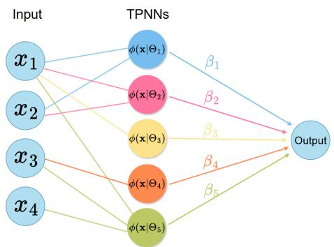
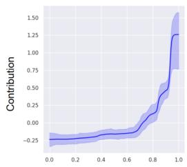
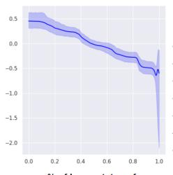
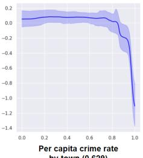
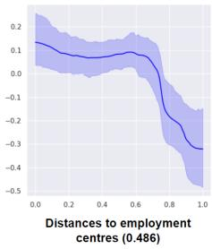

## ABSTRACT

With the increasing demand for interpretability in machine learning, functional ANOVA decomposition has gained renewed attention as a principled tool for breaking down high-dimensional function into low-dimensional components that reveal the contributions of different variable groups. Recently, Tensor Product Neural Network (TPNN) has been developed and applied as basis functions in the functional ANOVA model, referred to as ANOVA-TPNN. A disadvantage of ANOVA-TPNN, however, is that the components to be estimated must be specified in advance, which makes it difficult to incorporate higher-order TPNNs into the functional ANOVA model due to computational and memory constraints. In this work, we propose Bayesian-TPNN, a Bayesian inference procedure for the functional ANOVA model with TPNN basis functions, enabling the detection of higher-order components with reduced computational cost compared to ANOVA-TPNN. We develop an efficient MCMC algorithm and demonstrate that Bayesian-TPNN performs well by analyzing multiple benchmark datasets. Theoretically, we prove that the posterior of Bayesian-TPNN is consistent.

## 1 INTRODUCTION

As artificial intelligence (AI) models become increasingly complex, the demand for interpretability has grown accordingly. To address this need, various interpretable models—including both posthoc explanations (Ribeiro et al., 2016; Lundberg & Lee, 2017) and inherently transparent models (Agarwal et al., 2021; Koh et al., 2020; Radenovic et al., 2022; Park et al., 2025)—have been studied. Among various interpretable approaches, our study focuses on the functional ANOVA model, a particularly important class of interpretable models that decompose a high-dimensional function into a sum of low-dimensional functions called componenets or interactions. Notable examples of the functional ANOVA model are the generalized additive Model (Hastie & Tibshirani, 1986), SS-ANOVA (Gu & Wahba, 1993) and MARS (Friedman, 1991). Because complex structures of a given high-dimensional model can be understood by interpreting low-dimensional components, the functional ANOVA models have been extensively used in interpretable AI applications (Lengerich et al., 2020; Martens & Yau, 2020; Choi et al., 2025; Herren & Hahn, 2022).¨

In recent years, various neural networks have been developed to estimate components in the functional ANOVA model. Neural Additive Models (NAM, Agarwal et al. (2021)) estimates each component of the functional ANOVA model using deep neural networks (DNN), and Neural Basis Models (NBM, Radenovic et al. (2022)) significantly reduce the computational burden of NAM by using basis deep neural networks (DNN). NODE-GAM (Chang et al., 2021) can select and estimate the components in the functional ANOVA model simultaneously, and Thielmann et al. (2024) proposes NAMLSS, which modifies NAM to estimate the predictive distribution. Park et al. (2025) proposes ANOVA-TPNN, which estimates the components under the uniqueness constraint and thus provides a stable estimate of each component.

Existing neural-network approaches to functional ANOVA model require prohibitive computation when the input dimension $p$ is large, because the number of components—and thus the required networks—grows exponentially. As a result, only 1–2 dimensional components are typically used, yielding suboptimal prediction when higher-order interactions matter.

In this paper, we propose a Bayesian neural network (BNN) for the functional ANOVA model which can estimate higher-order interactions (i.e., components whose input dimension is greater than 2) without requiring huge amounts of computing resources. The main idea of the proposed BNN is to infer the architecture (the architectures of neural networks for each component) as well as the parameters (the weights and biases in each neural network). To explore higher posterior regions ofthe architecture, a specially designed MCMC algorithm is developed which searches the architectures in a stepwise manner (i.e., growing or pruning the current architecture) and thus huge computing resources for memorizing and processing all of the predefined neural networks for the components can be avoided.

Bayesian Neural Networks (BNN; MacKay (1992); Neal (2012); Wilson & Izmailov (2020); Izmailov et al. (2021)) provide a principled Bayesian framework for training DNNs and have received considerable attention in machine learning and AI. Compared to frequentist approaches, BNN offers stronger generalization and better-calibrated uncertainty estimates (Wilson & Izmailov, 2020; Izmailov et al., 2021), which enhance decision making. These properties have motivated applications in areas such as recommender systems (Wang et al., 2015), topic modeling (Gan et al., 2015), and medical diagnosis (Filos et al., 2019). More recently, Bayesian neural networks (BNN) that learn their own architectures have been actively studied. In particular, Kong et al. (2023) introduced a node-sparse BNN, referred to as the masked BNN (mBNN), and established its theoretical properties. Nguyen et al. (2024) proposes S-RJMCMC, which explores architectures and weights by jointly sampling parameters and altering the number of nodes.

This is the first work on BNN that efficiently estimates higher-order components in the functional ANOVA model without requiring substantial computing resources. Our main contributions can be outlined as follows.

• We propose a BNN for the functional ANOVA model called Bayesian-TPNN which treats the architecture as a learnable parameter, and develop an MCMC algorithm which efficiently explores high-posterior regions of the architecture.

• For theoretical justifications of the proposed BNN, we prove the posterior consistency of the prediction model as well as each component.

• Through experiments on multiple real datasets, we show that the proposed BNN provides more accurate and stable estimation and uncertainty quantification than other neural networks for the functional ANOVA model. On various synthetic datasets, we further show that Bayesian-TPNN effectively estimates important higher-order components.

## 2 PRELIMINARIES

## 2.1 NOTATION

Let $\mathbf { x } = ( x _ { 1 } , \ldots , x _ { p } ) ^ { \top } \in \mathcal { X }$ be a p-dimensional input vector, where $\mathcal { X } = \mathcal { X } _ { 1 } \times \cdot \cdot \cdot \times \mathcal { X } _ { p } \subseteq [ 0 , 1 ] ^ { p }$ We write $[ p ] = \{ 1 , \dotsc , p \}$ and its power set with cardinality d as power $( [ p ] , d )$ . For any component $S \subseteq [ p ]$ , we denote $\mathbf { x } _ { S } ~ = ~ ( x _ { j } , \bar { j } \in S ) ^ { \top }$ and define $\begin{array} { r } { \mathcal { X } _ { S } \stackrel { \cdot } { = } \prod _ { i \in S } \mathcal { X } _ { j } } \end{array}$ . A function defined on $\chi _ { S }$ is denoted by $f _ { S }$ . For any real-valued function $f : \mathcal { X }  \mathbb { R } .$ , we define the empirical $\ell _ { 2 }$ -norm as $\textstyle \| f \| _ { 2 , n } : = ( \sum _ { i = 1 } ^ { n } f ( \mathbf { x } _ { i } ) ^ { 2 } / n ) ^ { 1 / 2 }$ , where $\mathbf { x } _ { 1 } , \ldots , \mathbf { x } _ { n }$ are observed input vectors. We denote $\sigma ( \cdot )$ as the sigmoid function, $\mathrm { i . e . , } \sigma ( x ) : = 1 / ( 1 + \exp ( - x ) )$ . We denote by $\mu _ { n }$ the empirical distribution of $\left\{ \mathbf { x } _ { 1 } , \ldots , \mathbf { x } _ { n } \right\}$ , and by $\mu _ { n , j }$ the marginal distribution of $\mu _ { n }$ on $\chi _ { j }$

## 2.2 PROBABILITY MODEL FOR THE LIKELIHOOD

We consider a nonparametric regression model in which the conditional distribution of $Y _ { i }$ given $\mathbf { x } _ { i }$ follows an exponential family (Brown et al., 2010; Chen, 2024):

$$
Y _ {i} | \mathbf {x} _ {i} \sim \mathbb {Q} _ {f (\mathbf {x} _ {i}), \eta}\tag{1}
$$

for $i = 1 , . . . , n$ , where $f : \mathcal { X }  \mathbb { R }$ is a regression function and η is a nuisance parameter. Here, we assume that $\mathbb { Q } _ { f ( \mathbf { x } ) , \eta }$ admits the density function $q _ { f ( \mathbf { x } ) , \eta }$ defined as

$$
q _ {f (\mathbf {x}), \eta} (y) = \exp \left(\frac {f (\mathbf {x}) y - A (f (\mathbf {x}))}{\eta} + S (y, \eta)\right),\tag{2}
$$

where $A ( \cdot )$ is the log-partition function, ensuring that the density integrates to one. We assume that each input vector $\mathbf { x } _ { i }$ has been rescaled, yielding $\mathbf { \bar { x } } _ { i } \in [ 0 , 1 ] ^ { p }$ for $i = 1 , . . . , n$

Example 1. Gaussian regression model: Consider the gaussian regression $Y = f ( \mathbf { x } ) + \epsilon ,$ where $\epsilon \sim \hat { N ( 0 , \sigma _ { \epsilon } ^ { 2 } ) }$ . In this case, the density in (2), corresponds to $A ( f ( \mathbf { x } ) ) : = f ( \mathbf { x } ) ^ { 2 } / 2$ and $S ( y , \eta ) : =$ $- y ^ { 2 } / 2 \dot { \eta } - \widetilde { ( \log 2 \pi \eta ) } / 2$ with $\eta = \sigma _ { \epsilon } ^ { 2 }$

Example 2. Logistic regression model: For a binary outcome $Y \in \{ 0 , 1 \}$ , consider the logistic regression model $Y | \mathbf { x } \ \stackrel { \smile } { \sim } \ \mathrm { B e r n o u l l i } ( \sigma ( f ( \mathbf { x } ) ) )$ . In this case, there is no nuisance parameter, i.e., $\eta = 1$ . This distribution can be expressed as the exponential family with $A ( f ( \mathbf { x } ) ) : = \log ( 1 + e ^ { f ( \mathbf { x } ) } )$ and $S ( y , \eta ) : = 0$

Likelihood: Let ${ \mathcal D } ^ { ( n ) } = \{ ( \mathbf x _ { 1 } , y _ { 1 } ) , . . . , ( \mathbf x _ { n } , y _ { n } ) \}$ be given data which consist of n pairs of observed input vectors and response variables. For the likelihood, we assume that $y _ { i } \mathbf { s }$ are independent realizations of $\begin{array} { r } { Y _ { i } | \mathbf { x } _ { i } \sim \mathbb { Q } _ { f ( \mathbf { x } _ { i } ) , \eta } , } \end{array}$ where $f$ and η are the parameters to be inferred.

## 2.3 FUNCTIONAL ANOVA MODEL

For $S \subseteq [ p ]$ , we say that $f _ { S }$ satisfies the sum-to-zero condition with respect to a probability measure $\mu$ on X if

$$
\text { For } S \subseteq [ p ], \forall j \in S \text { and } \forall \mathbf {x} _ {S \setminus \{j \}} \in \mathcal {X} _ {S \setminus \{j \}}, \int_ {\mathcal {X} _ {j}} f _ {S} (\mathbf {x} _ {S}) \mu_ {j} (d x _ {j}) = 0\tag{3}
$$

holds, where $\mu _ { j }$ is the marginal probability measure of $\mu$ on $\chi _ { j }$ .

Theorem 2.1 (Functional ANOVA Decomposition (Hooker, 2007; Owen, 2013)). Any real-valued function $f$ defined on $\mathbb { R } ^ { p }$ can be uniquely decomposed as

$$
f (\mathbf {x}) = \sum_ {S \subseteq [ p ]} f _ {S} (\mathbf {x} _ {S}),\tag{4}
$$

almost everywhere with respect to $\Pi _ { j = 1 } ^ { p } \mu _ { j }$ , where each component $f _ { S }$ satisfies the sum-to-zero condition with respect $t o \ \mu .$

Theorem 2.1 guarantees a unique decomposition of any real-valued multivariate function $f$ into the components satisfying the sum-to-zero condition with respect to the probability measure $\mu .$ . In (4), we refer to $f _ { S }$ as main effects when $| S | = 1$ , as second-order interactions when $| S | = 2$ , and so on. For brevity, we use the empirical distribution $\mu _ { n }$ for $\mu$ when referring to the sum-to-zero condition.

## 2.4 TENSOR PRODUCT NEURAL NETWORKS

In this subsection, we review Tensor Product Neural Network (TPNN) proposed by Park et al. (2025) since we use it as a building block of our proposed BNN. TPNN is a specially designed neural network to satisfy the sum-to-zero condition.

For each $S \subseteq [ p ]$ , TPNN is defined as $\begin{array} { r } { f _ { S } ( \mathbf { x } _ { S } ) = \sum _ { k = 1 } ^ { K _ { S } } \beta _ { S , k } \phi ( \mathbf { x } _ { S } | S , \mathfrak { B } _ { S , k } , \mathfrak { R } _ { S , k } ) } \end{array}$ for component $f _ { S } ,$ , where $\beta _ { S , k } \in \mathbb { R } , \mathfrak { B } _ { S , k } = ( b _ { S , j , k } , j \in S ) \in \mathbb { R } ^ { | S | }$ , and $\Re _ { S , k } = ( \gamma _ { S , j , k } , j \in S ) \in ( 0 , \infty ) ^ { | S | }$ . Here, $\phi ( \mathbf { x } _ { S } | S , \mathfrak { B } _ { S , k } , \mathfrak { R } _ { S , k } )$ is defined as

$$
\phi (\mathbf {x} _ {S} | S, \mathfrak {B} _ {S, k}, \mathfrak {R} _ {S, k}) := \prod_ {j \in S} \left(1 - \sigma \left(\frac {x _ {j} - b _ {S , j , k}}{\gamma_ {S , j , k}}\right) + c _ {j} (b _ {S, j, k}, \gamma_ {S, j, k}) \sigma \left(\frac {x _ {j} - b _ {S , j , k}}{\gamma_ {S , j , k}}\right)\right),\tag{5}
$$

where

$$
c _ {j} (b, \gamma) := - \left(1 - \int_ {\mathcal {X} _ {j}} \sigma \left(\frac {x _ {j} - b}{\gamma}\right) \mu_ {n, j} (d x _ {j})\right) / \int_ {\mathcal {X} _ {j}} \sigma \left(\frac {x _ {j} - b}{\gamma}\right) \mu_ {n, j} (d x _ {j}).\tag{6}
$$

The term $c _ { j } ( b , \gamma )$ is introduced to make $\phi ( \mathbf { x } _ { S } | S , \mathfrak { B } _ { S , k } , \mathfrak { R } _ { S , k } )$ satisfy the sum-to-zero condition. Finally, Park et al. (2025) proposes ANOVA-TdPNN, which assumes that:

$$
f (\mathbf {x}) = \sum_ {S \subseteq [ p ], | S | \leq d} \sum_ {k = 1} ^ {K _ {S}} \beta_ {S, k} \phi (\mathbf {x} _ {S} | S, \mathfrak {B} _ {S, k}, \mathfrak {R} _ {S, k}),\tag{7}
$$

where $d \in \mathbb { N } _ { + }$ and $\{ K _ { S } , S \subseteq [ p ] , | S | \leq d \}$ are hyperparameters. Since $\phi ( \cdot | S , \mathfrak { B } _ { S , k } , \mathfrak { R } _ { S , k } )$ satisfies the sum-to-zero condition for any $S \subseteq [ p ] , f _ { \mathrm { A N O V A - T } ^ { d } \mathrm { P N N } }$ also satisfies the sum-to-zero condition. Therefore, we can estimate the components uniquely by estimating the parameters in ANOVA-TdPNN.

Here, d is the maximum order of components. Note that as the maximum order d increases, the number of TPNNs in (7) grows exponentially; therefore, in practice d is set to 1 or 2 due to the limitation of computing resources. In addition, choosing K s is not easy. To further illustrate these limitations, the experiments on the runtime of Bayesian-TPNN and ANOVA-T2PNN are presented in Section G of Appendix.

## 3 BAYESIAN TENSOR PRODUCT NEURAL NETWORKS

In (7), instead of fixing S, we treat S also as learnable parameters. That is, we consider the following model:

$$
f (\mathbf {x}) = \sum_ {k = 1} ^ {K} \beta_ {k} \phi (\mathbf {x} | \Theta_ {k}),\tag{8}
$$

where $\Theta _ { k } \ : = \ : ( S _ { k } , \mathbf { b } _ { S _ { k } , k } , \Gamma _ { S _ { k } , k } ) , S _ { k } \subseteq [ p ]$ , and aim to learn K and $( S _ { k } , k \in [ K ] )$ ) as well as the other parameters. Here,

$$
\begin{array}{l} \mathbf {b} _ {S _ {k}, k} := (b _ {j, k}, j \in S _ {k}) \in [ 0, 1 ] ^ {| S _ {k} |}, \\ \Gamma_ {S _ {k}, k} := (\gamma_ {j, k}, j \in S _ {k}) \in (0, \infty) ^ {| S _ {k} |}. \end{array}
$$

for $k \in [ K ]$ . Note that K and $S _ { k }$ are considered to be the parameters defining the architecture, but they cannot be updated by a gradient descent al-

Figure 1: Bayesian-TPNN with $p = 4$ and $K = 5 .$

gorithm since K and $S _ { k ^ { S } }$ are not numeric parameters. Instead, we adopt a Bayesian approach in which K and $S _ { k } s$ are explored via an MCMC algorithm. We refer to the resulting model as Bayesian Tensor Product Neural Networks (Bayesian-TPNN). Bayesian-TPNN can be understood as an edgesparse shallow neural network when K is the number of hidden nodes and $S _ { K }$ is the set of input variables linked to the k-th hidden node through active edges. See Figure 1 for an illustration.

## 3.1 PRIOR

The parameters in Bayesian-TPNN consist of K, $\mathcal { B } _ { K } : = ( \beta _ { 1 } , . . . , \beta _ { K } ) , \ : \mathbf { S } _ { K } : = ( S _ { k } , k \in [ K ] )$ $\mathbf { b } _ { \mathbf { S } _ { K } , K } : = ( \mathbf { b } _ { S _ { k } , k } , k \in [ K ] ) , \Gamma _ { \mathbf { S } _ { K } , K } : = ( \Gamma _ { S _ { k } , k } , k \in [ K ] )$ and the nuisance parameter η if it exists (e.g. the variance of the noise in the gaussian regression model). The parameters can be categorized into the three groups: (1) K for the node-sparsity, $( 2 ) \ S _ { k } , k = 1 , \ldots , K$ for the edge sparsity, and (3) all the other parameters including $( \mathbf { b } _ { S _ { k } , k } , \Gamma _ { S _ { k } , k } , k = 1 , . . . , K )$ . We use a hierarchical prior for these three groups of parameters.

Prior for K: We consider the following prior distribution for $K \colon$ :

$$
\pi (K = k) \propto \exp (- C _ {0} k \log n), \quad \text { for } \quad k = 0,..., K _ {\max},\tag{9}
$$

where $K _ { \operatorname* { m a x } } \in \mathbb { N } _ { + }$ and $C _ { 0 } > 0$ are hyperparameters. This prior is motivated by Kong et al. (2023).

Prior for $\mathbf { S } _ { K } | K$ : Conditional on $K$ , we assume a prior that $S _ { k } s$ are independent and each $S _ { k }$ follows the mixture distribution:

$$
\sum_ {d = 1} ^ {p} w _ {d} \text { Uniform } (\text { power } ([ p ], d)),\tag{10}
$$

where $w _ { d } \mathbf { s }$ are defined recursively as follows: $\begin{array} { r l r } { w _ { d } } & { \propto } & { \left( 1 - p _ { \mathrm { a d d i n g } } ( d ) \right) \prod _ { \ell < d } p _ { \mathrm { a d d i n g } } ( \ell ) } \end{array}$ with $p _ { \mathrm { a d d i n g } } ( \ell ) : = \alpha _ { \mathrm { a d d i n g } } ( 1 + \ell ) ^ { - \gamma _ { \mathrm { a d d i n g } } }$ . Here, $p _ { \mathrm { a d d i n g } }$ is the probability of adding a variable to $S _ { k }$ , controlled by hyperparameters $\alpha _ { \mathrm { a d d i n g } } ~ \mathrm { a n d } ~ \gamma _ { \mathrm { a d d i n g } }$ . This prior is inspired by Bayesian CART (Chipman et al., 1998), where $S _ { k }$ denotes split variables.

Prior for the numeric parameters given K and $\mathbf { S } _ { K } \mathbf { : }$ : All the remaining parameters are numerical ones and hence we use standard priors for them.

• Conditional on $K ,$ , we assume a prior that $\beta _ { k } \mathbf { s }$ are independent and follow $\beta _ { k } \sim N ( 0 , \sigma _ { \beta } ^ { 2 } )$ where $\sigma _ { \beta } > 0$ is a hyperparameter.

• Conditional on $S _ { k }$ , we let $b _ { j , k } s$ and $\gamma _ { j , k } s$ be all independent and $b _ { j , k } \sim$ Uniform $( 0 , 1 )$ and $\gamma _ { j , k } \sim$ Gamma $( a _ { \gamma } , b _ { \gamma } )$ for $j \in \dot { S } _ { k }$ and $k \in [ \bar { K } ]$ ], where $a _ { \gamma } ~ > ~ 0$ and $b _ { \gamma } ~ > ~ 0$ are hyperparameters.

• For the nuisance parameter in the gaussian regression model, where the nuisance parameter η corresponds to $\scriptstyle { \overline { { \sigma } } } ^ { 2 }$ , we set $\begin{array} { r } { \sigma ^ { 2 } \sim \overline { { \mathrm { I G } } } \left( \frac { v } { 2 } , \frac { v \lambda } { 2 } \right) } \end{array}$ , where $v > 0$ and $\lambda > 0$ are hyperparameters and $\operatorname { I G } ( \cdot , \cdot )$ is the inverse gamma distribution.

## 3.2 MCMC ALGORITHM FOR POSTERIOR SAMPLING

We now develop an MCMC algorithm for posterior sampling of Bayesian-TPNN. Our overall sampling strategy is to update $K , \mathbf { S } _ { K }$ and the remaining numeric parameters iteratively using the corresponding Metropolis-Hastings (MH) algorithms, which is motivated by the MCMC algorithm of Bayesian additive regression tree (Chipman et al., 2010). A novel part of our MCMC algorithm, however, is to devise a specially designed proposal distribution in the MH algorithm such that the proposal distribution encourages the MCMC algorithm to visit important higher-order interactions more frequently. For this purpose, we introduce two special tools. First, we employ a pretrained probability mass function $p _ { \mathrm { i n p u t } } ( \cdot )$ on $[ p ]$ , which represents the importance of each input variable. Further, let $p _ { \mathrm { i n p u t } } ( \cdot | S )$ be the distribution $p _ { \mathrm { i n p u t } } ( \cdot )$ restricted to $S \subseteq [ { \bar { p } } ]$ ]. See Remark at the end of this subsection for the choice of $p _ { \mathrm { i n p u t } } ( \cdot )$

The second tool is a stepwise search. The stepwise search adds a new node by first copying one of existing nodes and add an edge. By doing so, a newly added node has one more edges than the copied node and thus corresponds to an interaction whose order is larger than the copied one by 1. By keeping the copied node also in the model, we can avoid dramatic loss of accuracy.

To be more specific, let $\boldsymbol { \theta } : = ( K , \mathbf { S } _ { K } , \mathbf { b } _ { \mathbf { S } _ { K } , K } , \Gamma _ { \mathbf { S } _ { K } , K } , \mathcal { B } _ { K } , \boldsymbol { \eta } )$ be given current parameters. We update these parameters by sequentially updating $\tilde { \cal K } , ( { \bf S } _ { K } , { \bf b } _ { { \bf S } _ { K } , K } , \Gamma _ { { \bf S } _ { K } , K } , B _ { K } )$ and the nuisance parameter η. We now describe these 3 updates.

Updating K: First, we devise a proposal distribution of $K ^ { \mathrm { n e w } }$ given K used in the MH algorithm. For a given K, we set $K ^ { \mathrm { n e w } }$ as $\bar { K } - 1$ or $K + 1$ with probability $K / K _ { \operatorname* { m a x } }$ and $1 - \bar { K } / K _ { \operatorname* { m a x } }$ respectively. If $K ^ { \mathrm { n e w } } = K - 1$ , we remove one of $( S _ { k } , \mathbf { \bar { b } } _ { S _ { k } , k } , \Gamma \bar { S _ { k } } , \mathbf { \bar { \beta } } _ { k } ) , k \in [ K ]$ from θ with probability $1 / K$ to have $\theta ^ { \mathrm { n e w } }$

For the case $K ^ { \mathrm { n e w } } ~ = ~ K + 1$ , the crucial mission is to design an appropriate proposal of $( S _ { K + 1 } ^ { \mathrm { n e w } } , \mathbf { b } _ { S _ { K + 1 } ^ { \mathrm { n e w } } , K + 1 } ^ { \mathrm { n e w } } , \Gamma _ { S _ { K + 1 } ^ { \mathrm { n e w } } , K + 1 } ^ { \mathrm { n e w } } , \beta _ { K + 1 } ^ { \mathrm { n e w } } )$ . Specifically, we first generate $S _ { K + 1 } ^ { \mathrm { n e w } }$ and then generate $( \mathbf { b } _ { S _ { K + 1 } ^ { \mathrm { n e w } } , K + 1 } ^ { \mathrm { n e w } } , \Gamma _ { S _ { K + 1 } ^ { \mathrm { n e w } } , K + 1 } ^ { \mathrm { n e w } } , \beta _ { K + 1 } ^ { \mathrm { n e w } } )$ conditional on $S _ { K + 1 } ^ { \mathrm { n e w } }$ . The proposal of $S _ { K + 1 } ^ { \mathrm { n e w } }$ consists of the following two alternations:

• Random: Generate $S _ { K + 1 } ^ { \mathrm { n e w } }$ from the prior distribution.

• Stepwise: Propose $S _ { K + 1 } ^ { \mathrm { n e w } } = S _ { k ^ { * } } \cup \{ j _ { k ^ { * } } \}$ , where $k ^ { * } \sim$ Uniform $[ K ]$ and $j _ { k ^ { * } } \sim p _ { \mathrm { i n p u t } } ( \cdot | S _ { k ^ { * } } ^ { c } )$

The MH algorithm randomly selects one of {Random, Stepwise} with probability $M / ( M + K )$ and $K / ( M + K )$ , where $M > 0$ is a hyperparameter. This proposal combines random and stepwise search, where $S _ { K + 1 } ^ { \mathrm { n e w } }$ is sampled as a completely new index set from the prior with probability $M / ( M + K )$ , or taken as a higher-order modification of one of $S _ { 1 } , \ldots , S _ { K }$ with probability $\dot { K / ( M + K ) }$ . We employ Stepwise move to encourage the proposal distribution to explore higher-order interactions more frequently without losing much information in the current model (i.e. keeping all of the components in the current model). Once $S _ { K + 1 } ^ { \mathrm { n e w } }$ is given, we generate $( \mathbf { b } _ { S _ { K + 1 } ^ { \mathrm { n e w } } , K + 1 } ^ { \mathrm { n e w } } , \Gamma _ { S _ { K + 1 } ^ { \mathrm { n e w } } , K + 1 } ^ { \mathrm { n e w } } , \beta _ { K + 1 } ^ { \mathrm { n e w } } )$ from the prior distribution. See Section A.1 of Appendix for the acceptance probability for this proposal $\theta ^ { \mathrm { n e w } }$ and see Section C.5 of Appendix for experimental results demonstrating the effectiveness of the proposed MH.

Updating $\left( S _ { k } , \mathbf { b } _ { S _ { k } , k } , \Gamma _ { S _ { k } , k } , \beta _ { k } \right)$ for $k \in [ K ]$ : For a given $k ,$ we consider the following three possible alterations of $S _ { k }$ and $\left( \mathbf { b } _ { S _ { k } , k } , \Gamma _ { S _ { k } , k } \right)$ for the proposal of $\begin{array} { r } { ( S _ { k } ^ { \mathrm { n e w } } , \mathbf { b } _ { S _ { k } ^ { \mathrm { n e w } } , k } ^ { \mathrm { n e w } } , \Gamma _ { S _ { k } ^ { \mathrm { n e w } } , k } ^ { \mathrm { n e w } } ) { : } } \end{array}$

• Adding: Adding a new variable $j ^ { \mathrm { n e w } }$ , which is selected randomly from $S _ { k } ^ { c }$ according to the probability distribution $p _ { \mathrm { i n p u t } } ( \cdot | S _ { k } ^ { c } )$ ), and generating $b _ { j ^ { \mathrm { n e w } } , k }$ and $\gamma _ { j ^ { \mathrm { n e w } } , k }$ from the prior distribution.

• Deleting: Uniformly at random, select an index $j$ in $S _ { k }$ and delete it from $S _ { k }$

• Changing: Select an index $j$ uniformly at random from $S _ { k }$ and index $j ^ { \mathrm { n e w } }$ from $S _ { k } ^ { c }$ according to the probability distribution of $p _ { \mathrm { i n p u t } } ( \cdot | S _ { k } ^ { c } )$ and delete $j$ from $S _ { k }$ and add $j ^ { \mathrm { n e w } }$ to $S _ { k }$ Then, generate $b _ { j ^ { \mathrm { n e w } } , k }$ and $\gamma _ { j ^ { \mathrm { n e w } } , k }$ from the prior distribution.

The MH algorithm randomly selects one of {Adding, Deleting, Changing} with probability (qadd, qdelete, $q _ { \mathrm { c h a n g e } } )$ . This proposal distribution is a modification of one used in BART (Chipman et al., 1998; Kapelner & Bleich, 2016) to grow/prune or modify a current decision tree. See Section A.2 of Appendix for the acceptance probability of $( S _ { k } ^ { \mathrm { n e w } } , \mathbf { b } _ { S _ { k } ^ { \mathrm { n e w } } , k } ^ { \mathrm { n e w } } , \Gamma _ { S _ { k } ^ { \mathrm { n e w } } , k } ^ { \mathrm { n e w } } )$

Once $( S _ { k } , \mathbf { b } _ { S _ { k } , k } , \Gamma _ { S _ { k } , k } )$ are updated, we update all of the numeric parameters $\left( \mathbf { b } _ { S _ { k } , k } , \Gamma _ { S _ { k } , k } , \beta _ { k } \right)$ by the MH algorithm with the Langevin proposal (ros, 1978) to accelerate the convergence of the MCMC algorithm further. Finally, we repeat this update for $k \in [ K ]$ sequentially. See Appendix A.3 for details and Section I for a toy example illustrating the proposed MCMC algorithm.

Updating the nuisance parameter η : In the gaussian regression model, the nuisance parameter η corresponds to the error variance $\sigma _ { g } ^ { 2 } .$ Since the conditional posterior distribution of $\sigma _ { g } ^ { 2 }$ is Inverse Gamma distribution, it is straightforward to draw $\sigma _ { g } ^ { 2 }$ from $\pi ( \sigma _ { g } ^ { 2 } | \mathrm { o t h e r s } )$ . Details are provided in Section A.4 of Appendix.

Algorithm 1 MCMC algorithm of Bayesian TPNN.

Input  $\{(\mathbf{x}_{i},y_{i})\}_{i=1}^{n}$  : data, K : initial number of hidden nodes,  $M_{mcmc}$  : the number of MCMC iterations,

1: for i : 1 to  $M_{mcmc}$  do

2: Update K

3: for k : 1 to K do

4: Update  $S_{k}$ ,  $b_{S_{k},k}$ ,  $\Gamma_{S_{k},k}$ 

5: Update  $b_{S_{k},k}$ ,  $\Gamma_{S_{k},k}$ ,  $\beta_{k}$ 

6: end for

7: Update  $\eta$ 

8: end for

Predictive Inference. Let $\hat { \theta } _ { 1 } , . . . , \hat { \theta } _ { N }$ denote samples drawn from the posterior distribution. The predictive distribution is then estimated as $\begin{array} { r } { \hat { p } ( y | \mathbf x ) = \sum _ { i = 1 } ^ { N } p ( y | \mathbf x , \hat { \boldsymbol \theta } _ { i } ) / N } \end{array}$

Remark 3.1. When no prior information is available on the importance ofinput variables, we use a uniform distribution for $p _ { i n p u t } .$ . However, this noninformative choice often performs poorly when the dimension p is large and higher-order interactions exist. Our numerical studies in Section C.4 reveal that the choice of a good $p _ { i n p u t }$ is important for exploring higher-posterior regions. In practice, we could specify $p _ { i n p u t }$ based on the importance measures ofeach input variable obtained by a standard method such as Molnar (2020). That $i s ,$ we let $p _ { i n p u t } ( j ) \propto \omega _ { j }$ , where $\omega _ { j }$ is an importance measure ofthe input variable $j \in [ p ]$ . In our numerical study, we use the global SHAP value (Molnar, 2020) based on a pretrained Deep Neural Network (DNN) for the importance measure or the feature importance using a pretrained eXtreme Gradient Boosting (XGB, Chen & Guestrin (2016)).

## 3.3 POSTERIOR CONSISTENCY

For theoretical justification of Bayesian-TPNN, in this section, we prove the posterior consistency of Bayesian-TPNN. To avoid unnecessary technical difficulties, we assume that $\phi (  { \mathbf { x } } | \Theta _ { k } )$ in (8) satisfies the sum-to-zero condition with respect to the uniform distribution. This can be done by using the uniform distribution instead of the empirical distribution in (6).

We assume that $( \mathbf { x } _ { 1 } , y _ { 1 } ) , . . . , ( \mathbf { x } _ { n } , y _ { n } )$ are realizations of independent copies $( \mathbf { X } _ { 1 } , Y _ { 1 } ) , \ldots , ( \mathbf { X } _ { n } , Y _ { n } )$ of $( \mathbf { X } , Y )$ whose distribution $\mathbb { Q } _ { 0 }$ is given as

$$
\mathbf {X} \sim \mathbb {P} _ {\mathbf {X}} \quad \text { and } \quad Y | \mathbf {X} = \mathbf {x} \sim \mathbb {Q} _ {f _ {0} (\mathbf {x}), 1},
$$

where $f _ { 0 }$ is the true regression function. We let $\eta = 1$ for technical simplicity. Suppose that $f _ { 0 } ( \mathbf { x } ) =$ $\textstyle \sum _ { S \subseteq [ p ] } f _ { 0 , S } ( \mathbf { x } _ { S } )$ , where each $f _ { 0 , S }$ satisfies the sum-to-zero condition with respect to the uniform distribution. We denote $\mathbf { X } ^ { ( n ) } = \{ \mathbf { X } _ { 1 } , . . . , \mathbf { X } _ { n } \}$ and $Y ^ { ( n ) } = \{ Y _ { 1 } , . . . , Y _ { n } \}$ . Let $\pi _ { \xi } ( \cdot ) \propto \pi ( \cdot ) \mathbb { I } ( \| f \| _ { \infty } \leq$ $\xi )$ , where $\pi ( \cdot )$ is the prior distribution of f defined in Section 3.1. Under regularity conditions (S.1), (S.2), (S.3) and (S.4) in Section M.2 of Appendix, Theorem 3.2 proves the posterior consistency of each component of Bayesian-TPNN.

Theorem 3.2 (Posterior Consistency of Bayesian-TPNN). Assume that $\begin{array} { r } { 0 < \operatorname* { i n f } _ { \mathbf { x } \in \mathcal { X } } p _ { \mathbf { X } } ( \mathbf { x } ) \leq } \end{array}$ $\mathrm { s u p } _ { { \mathbf { x } } \in \mathcal { X } } p _ { \mathbf { X } } ( \mathbf { x } ) < \infty$ , where $p \mathbf { x } ( \mathbf { x } )$ is the density of $\mathbb { P } _ { \mathbf { X } }$ . Then, there exists $\xi > 0$ such that $f o r$ any $\varepsilon > 0 .$ , we have

$$
\pi_ {\xi} \left(f: \| f _ {0, S} - f _ {S} \| _ {2, n} > \varepsilon \mid \mathbf {X} ^ {(n)}, Y ^ {(n)}\right)\rightarrow 0\tag{11}
$$

for all $S \subseteq [ p ] i n \mathbb { Q } _ { 0 } ^ { n }$ as $n \to \infty$ , where $\pi _ { \boldsymbol { \xi } } ( \cdot | \mathbf { X } ^ { ( n ) } , Y ^ { ( n ) } )$ is the posterior distribution of Bayesian-TPNN with the prior $\pi _ { \xi }$ .

## 4 EXPERIMENTS

We present the results of the numerical experiments in this section, while further results and comprehensive details regarding the datasets, implementations of baseline models, and hyperparameter selections are provided in Sections B to H of Appendix.

## 4.1 PREDICTION PERFORMANCE

We compare the prediction performance of Bayesian-TPNN with baseline models including ANOVA-TPNN (Park et al., 2025), Neural Additive Models (NAM, Agarwal et al. (2021)), Linear model, XGB (Chen & Guestrin, 2016), Bayesian Additive Regression Trees (BART, Chipman et al. (2010), Linero (2025)) and mBNN (Kong et al., 2023). We analyze eight real datasets and split each dataset into training and test sets with a ratio of 0.8 to 0.2. This random split is repeated five times to obtain five prediction performance measures.

Table 1 reports the prediction accuracies (the Root Mean Square Error (RMSE) for regression tasks and the Area Under the ROC Curve (AUROC) for classification tasks) of the Bayes estimator of Bayesian-TPNN along with those of its competitors, where the best results are highlighted by bold. Overall, Bayesian-TPNN achieves prediction performance comparable to that of the baseline models. Further details of the experiments are provided in Section B.3 of Appendix.

Table 2 compares Bayesian-TPNN with the baseline Bayesian models in view of uncertainty quantification. As uncertainty quantification measures, we consider Continuous Ranked Probability Score (CRPS, Gneiting & Raftery (2007)) and Negative Log-Likelihood (NLL) for regression tasks, and Expected Calibration Error (ECE, Kumar et al. (2019)) together with NLL for classification tasks. The results indicate that Bayesian-TPNN compares favorably with the baseline models in uncertainty quantification, which is a bit surprising since Bayesian-TPNN is a transparent model while the other Bayesian models are black-box models. The results of uncertainty quantification for non-Bayesian models are presented in Section H.1 of Appendix, which are inferior to Bayesian models.

Table 1: The averaged prediction accuracies (the standard errors) on real datasets.

<table><tr><td colspan="2"></td><td colspan="4">Interpretable model</td><td colspan="3">Blackbox model</td></tr><tr><td>Dataset</td><td>Measure</td><td>Bayesian TPNN</td><td>ANOVA TPNN</td><td>NAM</td><td>Linear</td><td>XGB</td><td>BART</td><td>mBNN</td></tr><tr><td>ABALONE (Warwick et al., 1995)</td><td></td><td>2.053(0.26)</td><td>2.051(0.21)</td><td>2.062(0.23)</td><td>2.244(0.22)</td><td>2.157(0.24)</td><td>2.197(0.26)</td><td>2.081(0.24)</td></tr><tr><td>BOSTON (Harrison Jr &amp; Rubinfeld, 1978)</td><td rowspan="3">RMSE ↓ (SE)</td><td>3.654(0.49)</td><td>3.671(0.56)</td><td>3.832(0.67)</td><td>5.892(0.77)</td><td>4.130(0.56)</td><td>4.073(0.67)</td><td>4.277(0.51)</td></tr><tr><td>MPG (Quinlan, 1993)</td><td>2.386(0.41)</td><td>2.623(0.38)</td><td>2.755(0.41)</td><td>3.748(0.41)</td><td>2.531(0.26)</td><td>2.699(0.43)</td><td>2.897(0.42)</td></tr><tr><td>SERVO (Ulrich, 1986)</td><td>0.351(0.02)</td><td>0.594(0.04)</td><td>0.802(0.04)</td><td>1.117(0.04)</td><td>0.314(0.04)</td><td>0.342(0.04)</td><td>0.301(0.04)</td></tr><tr><td>FICO (fic, 2018)</td><td></td><td>0.793(0.009)</td><td>0.802(0.008)</td><td>0.764(0.019)</td><td>0.690(0.010)</td><td>0.793(0.009)</td><td>0.701(0.015)</td><td>0.740(0.008)</td></tr><tr><td>BREAST (Wolberg et al., 1993)</td><td rowspan="3">AUROC ↑ (SE)</td><td>0.998(0.001)</td><td>0.998(0.001)</td><td>0.976(0.003)</td><td>0.922(0.010)</td><td>0.995(0.002)</td><td>0.977(0.006)</td><td>0.978(0.002)</td></tr><tr><td>CHURN (chu, 2017)</td><td>0.849(0.008)</td><td>0.848(0.006)</td><td>0.835(0.008)</td><td>0.720(0.002)</td><td>0.848(0.006)</td><td>0.835(0.008)</td><td>0.833(0.008)</td></tr><tr><td>MADELON (Guyon, 2004)</td><td>0.854(0.013)</td><td>0.587(0.013)</td><td>0.644(0.005)</td><td>0.548(0.011)</td><td>0.884(0.006)</td><td>0.751(0.011)</td><td>0.650(0.018)</td></tr></table>

Table 2: Comparison of Bayesian models in view of uncertainty quantification on real datasets.

<table><tr><td></td><td colspan="2">Bayesian-TPNN</td><td colspan="2">BART</td><td colspan="2">mBNN</td></tr><tr><td>Dataset</td><td>CRPS</td><td>NLL</td><td>CRPS</td><td>NLL</td><td>CRPS</td><td>NLL</td></tr><tr><td>ABALONE</td><td>1.372 (0.19)</td><td>2.260 (0.16)</td><td>1.384 (0.18)</td><td>2.261 (0.16)</td><td>1.399 (0.16)</td><td>2.226 (0.16)</td></tr><tr><td>BOSTON</td><td>2.202 (0.23)</td><td>3.411 (0.37)</td><td>2.623 (0.25)</td><td>3.400 (0.42)</td><td>3.144 (0.39)</td><td>3.488 (0.26)</td></tr><tr><td>MPG</td><td>1.510 (0.43)</td><td>2.511 (0.21)</td><td>1.553 (0.27)</td><td>2.530 (0.20)</td><td>2.142 (0.42)</td><td>2.710 (0.24)</td></tr><tr><td>SERVO</td><td>0.194 (0.01)</td><td>0.836 (0.10)</td><td>0.202 (0.02)</td><td>0.849 (0.08)</td><td>0.185 (0.02)</td><td>0.321 (0.08)</td></tr><tr><td>Dataset</td><td>ECE</td><td>NLL</td><td>ECE</td><td>NLL</td><td>ECE</td><td>NLL</td></tr><tr><td>FICO</td><td>0.036 (0.004)</td><td>0.554 (0.007)</td><td>0.054 (0.011)</td><td>0.632 (0.012)</td><td>0.219 (0.032)</td><td>0.773 (0.046)</td></tr><tr><td>BREAST</td><td>0.129 (0.009)</td><td>0.211 (0.014)</td><td>0.118 (0.010)</td><td>0.143 (0.032)</td><td>0.292 (0.018)</td><td>0.523 (0.025)</td></tr><tr><td>CHURN</td><td>0.031 (0.001)</td><td>0.418 (0.008)</td><td>0.035 (0.001)</td><td>0.430 (0.010)</td><td>0.168 (0.037)</td><td>0.531 (0.036)</td></tr><tr><td>MADELON</td><td>0.076 (0.004)</td><td>0.478 (0.009)</td><td>0.066 (0.004)</td><td>0.685 (0.032)</td><td>0.252 (0.020)</td><td>0.840 (0.031)</td></tr></table>

## 4.2 PERFORMANCE IN COMPONENT SELECTION

Table 3: Performance of component selection on synthetic datasets.

<table><tr><td colspan="2">True model</td><td colspan="2"> $f^{(1)}$ </td><td colspan="3"> $f^{(2)}$ </td><td colspan="3"> $f^{(3)}$ </td></tr><tr><td>Order</td><td>Bayesian TPNN</td><td>ANOVA  $T^2PNN$ </td><td> $NA^2M$ </td><td>Bayesian TPNN</td><td>ANOVA  $T^2PNN$ </td><td> $NA^2M$ </td><td>Bayesian TPNN</td><td>ANOVA  $T^2PNN$ </td><td> $NA^2M$ </td></tr><tr><td>1</td><td>1.000(0.000)</td><td>0.999(0.001)</td><td>0.528(0.023)</td><td>0.831(0.008)</td><td>0.859(0.010)</td><td>0.417(0.015)</td><td>1.000(0.000)</td><td>0.781(0.021)</td><td>0.522(0.011)</td></tr><tr><td>2</td><td>1.000(0.000)</td><td>0.978(0.007)</td><td>0.508(0.024)</td><td>0.985(0.003)</td><td>0.949(0.003)</td><td>0.838(0.009)</td><td>0.922(0.019)</td><td>0.704(0.007)</td><td>0.542(0.017)</td></tr><tr><td>3</td><td>0.740(0.022)</td><td>—</td><td>—</td><td>0.966(0.018)</td><td>—</td><td>—</td><td>0.661(0.022)</td><td>—</td><td>—</td></tr></table>

Table 4: Top 5 components: the important scores are normalized by their maximum.

<table><tr><td></td><td colspan="2">Rank 1</td><td colspan="2">Rank 2</td><td colspan="2">Rank 3</td><td colspan="2">Rank 4</td><td colspan="2">Rank 5</td></tr><tr><td>Dataset</td><td>Component</td><td>Score</td><td>Component</td><td>Score</td><td>Component</td><td>Score</td><td>Component</td><td>Score</td><td>Component</td><td>Score</td></tr><tr><td>MADELON</td><td>(49, 242, 319, 339)</td><td>1.000</td><td>(129, 443, 494)</td><td>0.472</td><td>(379, 443)</td><td>0.374</td><td>106</td><td>0.322</td><td>(242, 443)</td><td>0.301</td></tr><tr><td>SERVO</td><td>1</td><td>1.000</td><td>(1, 3, 4, 5)</td><td>0.554</td><td>4</td><td>0.202</td><td>(4, 6)</td><td>0.193</td><td>8</td><td>0.173</td></tr></table>

We investigate whether Bayesian-TPNN identifies the true signal components well similarly to the setting in Park et al. (2025); Tsang et al. (2017). Synthetic datasets are generated from $Y = f ^ { ( k ) } ( \mathbf { x } ) + \epsilon , \ k = 1 , 2 , 3 .$ , where $f ^ { ( k ) }$ is the true regression model and $\mathbf { x } \in \mathbb { R } ^ { 5 0 }$ . Details of the experiment are described in Section B.5.

We define the importance score of each component as its $\ell _ { 2 } \cdot \mathrm { n o r m } , \mathrm { i . e . } , \| f _ { S } \| _ { 2 , n \cdot } \mathbf { A }$ large $\| f _ { S } \| _ { 2 , n }$ implies $f _ { S }$ is a signal. Table 3 reports the averages (standard errors) of AUROCs of the importance scores obtained by Bayesian-TPNN, $\mathrm { \Delta A N O V A - T ^ { \tilde { 2 } } P N N } ,$ and $\mathbf { N A ^ { 2 } M }$ for interaction order up to 3. Note that extending ANOVA-T2PNN and NA2M to include the third order interactions requires additional

  
Average number of rooms per dwelling (1.000)

  
% of lower status of the population (0.815)

  
by town (0.629)

  
Figure 2: Plots of the functional relations of the important main effects estimated by Bayesian-TPNN on the BOSTON dataset. Each plot shows the Bayes estimate and 95% credible interval of each component. Labels indicate the names of the input variables along with the normalized importance scores.

19, 600 neural networks, and so we give up ANOVA-T3PNN and NA3M due to the limitations of our computational environment. Overall, Bayesian-TPNN achieves the best performance in component selection across orders and datasets, and detects higher-order interactions reasonably well.

Table 4 presents the five most important components selected by Bayesian-TPNN on MADELON and SERVO datasets. We use these datasets as they highlight the performance gap between models with and without higher-order interactions. Notably, Bayesian-TPNN identifies a 4th-order interaction as the most important component in the MADELON data, suggesting that its ability to capture higherorder interactions largely explains its superior prediction performance over ANOVA-TPNN on these datasets. See Section B.2 of Appendix for descriptions of the variables in MADELON and SERVO.

## 4.3 INTERPRETATION OF BAYESIAN-TPNN

The functional ANOVA model can provide various interpretations of the estimated prediction model through the estimated components as Park et al. (2025) illustrates. In particular, by visualizing the estimated components, we can understand how each group of input variables affects the response variable. Figure 2 presents the plots of the functional relations for the important main effects estimated by Bayesian-TPNN on the BOSTON dataset. Each plot shows the Bayes estimate and the 95% credible interval of the selected component. The leftmost plot shows increasing trend, indicating that as the average number of rooms per dwelling increases, the price of the housing increases as well. The second plot reveals a strictly decreasing relationship between the proportion of lower status of the population and the housing price. The third plot indicates that housing prices decrease sharply once the crime rate exceeds a certain threshold. The fourth plot shows that houses located farther from major employment centers are generally less expensive than those situated closer to such hubs. More discussions about interpretation of Bayesian-TPNN are provided in Section E of Appendix.

## 4.4 APPLICATION TO CONCEPT BOTTLENECK MODELS

Concept Bottleneck Model (CBM, Koh et al. (2020)) is an interpretable model in which a CNN first receives an image and predicts its concepts. These predicted concepts are then used to infer the target label, enabling explainable predictions. To illustrate that Bayesian-TPNN can be amply combined with CBM, we consider Independent Concept Bottleneck Models (ICBM, Koh et al. (2020)), in which a CNN is first trained and then frozen, after which a final classifier is trained on the predicted concepts. We compare Bayesian-TPNN with other baselines for learning the final classifier. In the experiment, we use CELEBA-HQ (Lee et al., 2020) and CATDOG (Jikadara, 2023) datasets, where we generate 5 concepts using GPT-5 (OpenAI, 2025), and we obtain the concept labels for each image via CLIP (Radford et al., 2021). The target labels for CELEBA-HQ and CATDOG are gender and cat/dog classification, respectively. The details are provided in Section B.4 of Appendix.

Table 5: Prediction performance with CBM on image datasets.

<table><tr><td>Dataset</td><td>Measure</td><td>Bayesian-TPNN</td><td>ANOVA- $T^{2}$ PNN</td><td> $NA^{2}M$ </td><td>Linear</td></tr><tr><td>CELEBA-HQ</td><td>AUROC ↑</td><td>0.936 (0.002)</td><td>0.923 (0.002)</td><td>0.922 (0.002)</td><td>0.893 (0.003)</td></tr><tr><td>CATDOG</td><td>AUROC ↑</td><td>0.878 (0.002)</td><td>0.853 (0.002)</td><td>0.851 (0.002)</td><td>0.711 (0.001)</td></tr></table>

Table 5 presents the averages and standard errors of AUROCs when Bayesian-TPNN, ANOVA-T2PNN, NA2M, and Linear model are used in the final classifier. Among them, Bayesian-TPNN

attains the highest prediction performance, which can be attributed to its capability to estimate higher-order components.

## 5 CONCLUSION

We proposed Bayesian-TPNN, a novel Bayesian neural network for the functional ANOVA model that can detect higher-order signal components effectively and thus achieve superior prediction performance in view of prediction accuracy and uncertainty quantification. In addition, Bayesian-TPNN is also theoretically sound since it achieves the posterior consistency.

We used a predefined distribution $p _ { \mathrm { i n p u t } }$ for the selection probability of each input variable in the MH algorithm. It would be interesting to update $p _ { \mathrm { i n p u t } }$ along with the other parameters. For example, it would be possible to let $p _ { \mathrm { i n p u t } } ( j )$ be proportional to the number of basis functions in the current Bayesian-TPNN model which uses $x _ { j }$ . This would be helpful when $p$ is large. We will pursue this algorithm in the near future.

Reproducibility Statement. We have made significant efforts to ensure the reproducibility of our results. The source code implementing our proposed model and experiments is provided in the supplementary material. Detailed descriptions of the experimental setup, hyperparameters and datasets are provided in Section B of Appendix. Additional ablation studies are reported in Section C of Appendix.

## ACKNOWLEDGEMENTS

This work was supported by the National Research Foundation of Korea(NRF) grant funded by the Korea government(MSIT) (RS-2025-00556079), Institute of Information & communications Technology Planning & Evaluation (IITP) grant funded by the Korea government(MSIT) [NO.RS-2021- II211343, Artificial Intelligence Graduate School Program (Seoul National University)] and by the National Research Foundation of Korea(NRF) grant funded by the Korea government(MSIT)(No. 2022R1A5A7083908)

## REFERENCES

Brownian dynamics as smart monte carlo simulation. The Journal of Chemical Physics, 69(10): 4628–4633, 1978.

Telco customer churn. kaggle, 2017. https://www.kaggle.com/datasets/blastchar/telco-customerchurn/data.

Fico heloc. FICO Explainable Learning Challenge, 2018. https://community.fico.com/s/ explainable-machine-learning-challenge.

Rishabh Agarwal, Levi Melnick, Nicholas Frosst, Xuezhou Zhang, Ben Lengerich, Rich Caruana, and Geoffrey E Hinton. Neural additive models: Interpretable machine learning with neural nets. Advances in neural information processing systems, 34:4699–4711, 2021.

Lawrence D. Brown, T. Tony Cai, and Harrison H. Zhou. Nonparametric regression in exponential families. The Annals of Statistics, 38(4):2005 – 2046, 2010. doi: 10.1214/09-AOS762. URL https://doi.org/10.1214/09-AOS762.

Chun-Hao Chang, Rich Caruana, and Anna Goldenberg. Node-gam: Neural generalized additive model for interpretable deep learning. arXiv preprint arXiv:2106.01613, 2021.

Juntong Chen. Estimating a regression function in exponential families by model selection. Bernoulli, 30(2):1669–1693, 2024.

Tianqi Chen and Carlos Guestrin. Xgboost: A scalable tree boosting system. In Proceedings of the 22nd acm sigkdd international conference on knowledge discovery and data mining, pp. 785–794, 2016.