## ABSTRACT

Given the wide range of deployment targets, flexible model selection is essential for optimizing performance within a given compute budget. Recent work demon strates that stitching pretrained models within a model family enables cost-effective interpolation of the accuracy-efficiency tradeoff space. Stitching transforms intermediate activations from one pretrained model into another, producing a new interpolated stitched network. Such networks provide a pool of deployment options along the accuracy-efficiency spectrum. However, existing stitching approaches often yield suboptimal tradeoffs and lack generalizability, as they primarily rely on heuristics to select stitch configurations. We argue that constructing improved accuracy-efficiency tradeoffs requires explicitly capturing and leveraging the similarity between pretrained models being stitched. To this end, we introduce KLAS, a novel stitch selection framework that automates and generalizes stitch selection across model families by leveraging KL divergence between intermediate representations. KLAS identifies the most promising binary stitches from the $\mathcal { O } \dot { ( k ^ { 2 } n ^ { 2 } ) }$ ) possibilities for k pretrained models of depth n. Through comprehensive experiments, we demonstrate that KLAS improves the accuracy-efficiency curve of stitched models at the same finetuning cost as baselines. KLAS achieves up to 1.21% higher ImageNet-1K top-1 accuracy at the same computational cost, or maintains accuracy with a 1.33× reduction in FLOPs.

## 1 INTRODUCTION

Large pretrained vision transformers (ViTs) and convolutional neural networks (CNNs) have transformed computer vision Devlin et al. (2019); Brown et al. (2020); Peters et al. (2018); Srivastava et al. (2025), powering applications from self-driving cars Ouyang et al. (2019) to security systems Chen et al. (2021); Ji et al. (2021) and social media platforms Bai et al. (2018). Trained on vast datasets and distributed via repositories such as HuggingFace Wolf (2019), PyTorchHub Paszke et al. (2019), and TensorFlow Model Zoo Abadi et al. (2016), these models achieve strong performance across tasks including image classification, object detection, semantic segmentation, and face recognition Liu et al. (2022); Ravi et al. (2024); An et al. (2022). Yet, deployment environments vary dramatically from powerful cloud servers Hazelwood et al. (2018) to resource-constrained edge devices He et al. (2018); David et al. (2021). This poses a fundamental challenge: how can we efficiently deploy pretrained models under diverse computational budgets without sacrificing accuracy?

Neural architecture search (NAS) Cai et al. (2020); Zoph & Le (2016) aims to address this challenge by discovering architectures that balance accuracy and efficiency, but conventional one-to-one NAS requires prohibitively high GPU cost. One-to-many paradigms, such as one-shot NAS Liu et al. (2018); Guo et al. (2020) mitigate this burden by training a single supernetwork, while zero-shot NAS Li et al. (2023); Lin et al. (2021) avoids costly training altogether by ranking candidate architectures using gradient-based proxies. Despite these advances, both approaches remain limited: they are confined to a single model design space and cannot exploit the rich pool of pretrained models already available. This limitation prevents one-to-many NAS from satisfying the three key requirements of effective architecture search: (1) strong accuracy-efficiency tradeoffs, (2) generalizability across diverse model architectures, and (3) low computational cost.

Many-to-many NAS with model stitching Pan et al. (2023); Bansal et al. (2021); Yang et al. (2022b); Pan et al. (2024) offers a promising solution by combining blocks from different pretrained “anchor” models to form stitched networks that interpolate accuracy-efficiency tradeoffs. For example, SN-

Net Pan et al. (2023), finetunes lightweight stitching layers (simple linear transformations) between anchors to drastically reduce cost. A key challenge, however, lies in selecting stitch configurations (i.e., choosing which anchors and blocks to stitch). Even with only two anchor models of depth n, there are $\mathcal { O } ( n ^ { 2 } )$ possible stitch configurations, making exhaustive search computationally infeasible. Yet, SN-Net employs naive heuristic-based selection (e.g., stitching adjacent anchors and blocks), which limits both the accuracy-efficiency tradeoff and generalizability across model families.

We propose a novel framework, KLAS (KL divergence based Anchor Stitching), which replaces heuristic-based stitching with a principled similaritydriven approach. As illustrated in Fig. 1, KLAS automatically selects anchors and block pairs by evaluating the compatibility of their activations using Kullback-Leibler (KL) divergence Cover (1999). Unlike alternatives such as mean square error Jadon et al. (2024), cross-entropy Mao et al. (2023), or CKA Kornblith et al. (2019), KL divergence effectively captures distributional differences between decision boundaries, enabling more accurate and efficient stitching with minimal finetuning. In doing so, KLAS addresses two key stitching questions: (1) can network B produce similar outputs when driven by transformed internal representations from network A? and (2) can such transformations be effective with minimalfinetuning?

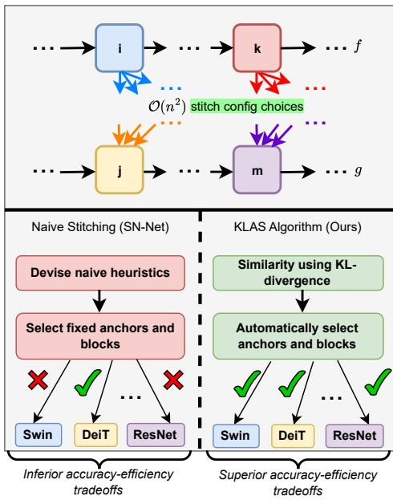

We evaluate KLAS on ImageNet-1K Deng et al. (2009) and CIFAR-100 Krizhevsky et al. (2009) across multiple ViT-based and CNN-based model families and show that it consistently improves the accuracy-efficiency tradeoff over SN-Net. KLAS achieves up to 1.21% higher top-1 accuracy at the same FLOPs, or alternatively, a 1.33× reduction in FLOPs at equivalent accuracy. We further show benefits of KLAS on large language models (LLMs) using TruthfulQA Lin et al. (2022). Our key contributions are: (1) identifying the limitations of heuristic-based many-to-many NAS approaches such as SN-Net, (2) introducing KL divergence as a principled similarity

Figure 1: Comparison of stitching strategies. Existing many-to-many NAS approaches such as SN-Net rely on heuristic-based stitch selection, fixing anchors and blocks and yielding suboptimal accuracy-efficiency tradeoffs. In contrast, our pro posed KLAS framework leverages KL divergence to measure similarity between intermediate representations and automatically identify promising stitch configurations, producing superior accuracy efficiency tradeoffs across diverse model families.

metric for selecting stitch configurations without instantiating or training a stitch layer, (3) presenting the KLAS framework for efficient, generalizable, and low-cost stitching, and (4) demonstrating consistent improvements over SN-Net across model families and datasets.

## 2 RELATED WORK

Model Stitching: Model stitching was originally introduced as a tool for analyzing representation equivalence across neural networks. Lenc & Vedaldi (2015) showed that early layers of one network could be connected to later layers of another via simple linear transformations, revealing functional similarities between disparate architectures. Building on this, Bansal et al. (2021) demonstrated that stitching remains effective even across models with different architectures or training protocols. While these studies established stitching as a powerful analytical tool, they did not investigate its potential for practical deployment optimization.

Recent efforts have begun bridging this gap. SN-Net Pan et al. (2023) operationalized stitching for neural architecture search by combining pretrained anchor models from the same family, reducing training costs by 22× compared to traditional NAS. However, SN-Net relies on heuristic stitching strategies, such as connecting adjacent anchors (“nearest stitching”) or assuming block similarity (“paired / unpaired stitching”), that ignore actual compatibility between blocks. ESTA He et al. (2024) extended SN-Net to large language models by applying the same heuristic, layer-count-based stitching strategy when combining pretrained LLM blocks. StitchLLM Hu et al. (2025) further adopts this identical heuristic within a systems framework focused on resource-efficient serving, but does not propose a new stitch selection criterion. Concurrently, Csiszárik et al. (2021) systematically analyzed stitching performance across block combinations, finding no correlation between common similarity metrics (e.g., CKA) and stitched model accuracy. Similarly, Balogh & Jelasity (2025) showed that direct similarity measures often fail to reflect task performance, advocating task loss matching as a more reliable criterion. Together, these findings underscore the inadequacy of existing approaches for automatically identifying effective stitch points, a challenge that KLAS addresses through activation distribution analysis using KL divergence.

Neural Architecture Search: Traditional NAS methods Cai et al. (2020); Sahni et al. (2021); Pham et al. (2018); Zoph & Le (2016); Wang et al. (2021) incur prohibitive computational costs, often requiring thousands of GPU hours to evaluate candidate architectures. One-shot NAS Liu et al. (2018) mitigates this burden by training a single supernetwork with shared weights across subnetworks, but still demands substantial resources for supernetwork training and remains restricted to a single architectural family. Zero-shot NAS Lin et al. (2021) further reduces cost by predicting subnetwork performance from architectural indicators, yet the final models still require full training from scratch. Cascaded inference has long been explored as a means to reduce compute by exiting early when predictions are confident Viola & Jones (2001). Approaches include big / little-style two-stage models Park et al. (2015), multi-exit deep cascades with learned entropy thresholds Wang et al. (2017); Guan et al. (2017); Bolukbasi et al. (2017), and exit-by-confidence ensemble routing Streeter (2018); Inoue (2019). Recent work Wang et al. (2020); Lebovitz et al. (2023) extends cascades to four-way model ensembles using softmax-based confidence and input resolution scaling.

Stitching circumvents these limitations by leveraging pretrained model zoos rather than training networks from the ground up. Unlike DeRy Yang et al. (2022a), which reassembles pretrained components for individual resource constraints, KLAS systematically analyzes activation distributions to generate a continuous Pareto front of deployable models. This approach preserves cost efficiency by requiring only stitch-layer finetuning, while avoiding architectural constraints by enabling seamless integration of transformers, convnets, and hybrid models.

Transformers and ConvNets: The rise of ViTs Dosovitskiy et al. (2020) has introduced new challenges for efficient deployment. Prior efforts optimized individual ViTs through token pruning Pan et al. (2021), quantization Li et al. (2022), or dynamic inference Rao et al. (2021), but these methods remain architecture-specific and require retraining under different resource constraints. Crossarchitectural stitching approaches such as SN-Net Pan et al. (2023) explored combining ViTs, yet were limited to same-family stitching due to reliance on weak heuristics.

KLAS breaks this barrier by introducing KL divergence between block activations as an intuitive simi larity measure, enabling stitching across diverse architectural families. Whereas prior work Kornblith et al. (2019) found standard similarity metrics ineffective for predicting stitching performance, KLAS directly measures how well the outputs of one block can serve as the inputs to another, regardless of architecture. This capability allows KLAS to produce viable hybrids spanning hierarchical Swin Transformers and residual CNNs.

## 3 BACKGROUND AND MOTIVATION

## 3.1 NOTATIONS FOR MODEL STITCHING

Let $f : \mathcal { X }  \mathcal { Y }$ be a feedforward neural network with m blocks (i.e., layers): $f = f _ { m } \circ \cdots \circ f _ { 1 }$ where $f _ { i } : A _ { i - 1 } ^ { f } \to A _ { i } ^ { f }$ maps the activation space of block i − 1 to that of block i. By definition, $A _ { 0 } ^ { f } = X$ (i.e., the input samples). For model stitching, we introduce the notations $f _ { \leq i } = f _ { i } \circ \cdot \cdot \cdot \circ f _ { 1 }$ and $f _ { > i } = f _ { m } \circ \cdot \cdot \cdot \circ f _ { i + 1 }$ . Given two frozen networks $f$ and $^ { g , }$ and one block from each network, $i \in f$ and $j \in g ,$ the goal of stitching is to find out if $g _ { > j }$ , which we will refer to as the target, can achieve its function using the representation of $f _ { \leq i }$ , which we call the source. In examining this, we attempt to find a transformation layer $T : A _ { i } ^ { f } \to A _ { j } ^ { g }$ such that the stitched network $g _ { > j } \circ T \circ f _ { \leq i }$ is functionally similar to $g .$ Here, we term $( i , j )$ as a stitch configuration, meaning that the i-th layer of $f$ is stitched to the j-th layer of $g$ . Throughout this paper, we refer to $T$ as the stitching layer. For an input $x \in \mathcal { X }$ , we denote $f _ { \leq i } ( x )$ as its source representation and $g _ { \leq j } ( x )$ as its target representation. Transformer blocks with the same hidden dimensions are often grouped into stages. We omit the stage index in our notations for simplicity as stitching only takes place between same stage blocks.

## 3.2 SIMILARITY OF NEURAL NETWORKS

A central theme in analyzing neural networks is understanding the representations learned by internal layers, since these insights are crucial for both interpreting and improving deep learning systems. A fundamental question in this context is: when are two representations similar? Prior work Bansal et al. (2021); Kornblith et al. (2019); Yosinski et al. (2014) extends this inquiry by asking a complementary question: in what way are two representations similar, once similarity is established? Together, these perspectives give rise to two notions of similarity: (1) representational similarity, which characterizes structural relationships between learned features, and (2)functional similarity, which evaluates their interchangeability in downstream tasks. We explain below why both are essential.

Representational similarity captures the alignment of geometric structures between intermediate activations, enabling the stitching layer (T) to learn a simple mapping (e.g., affine transformation) from the source to the target. For instance, convolutional layers with comparable channel counts and spatial dimensions often permit lightweight 1×1 convolutions as effective stitching layers. Conversely, mismatched representations may require complex transformations, which can degrade performance or even cause the stitched network to fail. A widely used metric for representational similarity is Centered Kernel Alignment (CKA) Kornblith et al. (2019), which leverages kernel functions to embed data into a higher-dimensional space where linear relationships between representations become more discernible.

Functional similarity evaluates whether the stitched network preserves the target’s original output behavior, typically measured via task accuracy. High functional similarity implies that the source representations contain sufficient task-relevant information for the target, even if their geometric structures differ. Two common approaches include task loss matching (TLM), which optimizes the stitching layer by minimizing downstream task loss (e.g., mean squared error (MSE) or cross-entropy (CE)), and direct matching (DM), which aligns source activations after the stitch layer and target activations through linear regression Balogh & Jelasity (2025).

## 3.3 SHORTCOMINGS OF CURRENT SIMILARITY MEASURES

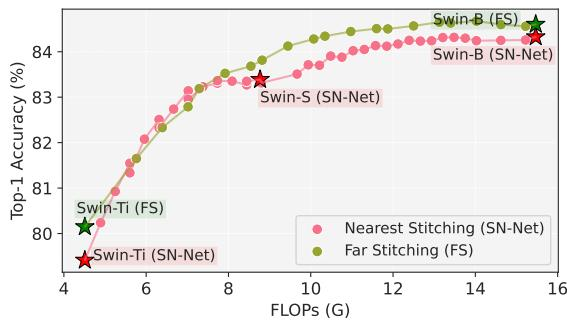

<table><tr><td>Metric</td><td>Type</td><td>Overlap</td></tr><tr><td>CKA</td><td>X (Unsupervised)</td><td>5.5%</td></tr><tr><td>MSE</td><td>√ (Supervised)</td><td>27.8%</td></tr><tr><td>CE</td><td>√ (Supervised)</td><td>22.2%</td></tr><tr><td>DM</td><td>√ (Supervised)</td><td>33.3%</td></tr><tr><td>SN-Net</td><td>X (Unsupervised)</td><td>61.1%</td></tr><tr><td>KL-Div(Ours)</td><td>√ (Supervised)</td><td>88.9%</td></tr></table>

Figure 2: Comparison of nearest stitching (SN-Net) and far stitching (FS) on the Swin family. Far stitching between Ti and B models (green curve) achieves a superior accuracyefficiency tradeoff, surpassing nearest stitching (pink curve) by up to 0.9% accuracy at equivalent FLOPs. Stars mark pretrained anchors (Ti, S, B).  
Table 1: Effectiveness of similarity metrics for recovering Swin Ti-B stitching, measured by overlap with the Ti-B stitch configurations. Existing metrics (CKA, MSE, CE, DM) and SN-Net heuristics achieve at most 61.1% overlap, while our KL divergence based approach achieves 88.9%, demonstrating its reliability as a similarity measure.

In our empirical study of similarity metrics for model stitching, we identify a key limitation of the naive heuristics adopted by SN-Net. Specifically, SN-Net assumes that combining nearest stitching for anchors with paired / unpaired stitching for blocks yields optimal results across model families. Nearest stitching restricts anchor connections to models of comparable complexity or performance, such as the Ti-S-B stitching style in Swin transformers. However, our experiments reveal that direct far stitching between Ti and B models (i.e., Ti-B stitching) achieves a superior accuracy-efficiency tradeoff, improving accuracy by up to 0.9% at equivalent FLOPs, as shown in Fig. 2. For this study, we apply paired / unpaired block stitching with Swin-Ti/S/B models pretrained on ImageNet-22K, followed by finetuning the stitched supernetwork for 50 epochs on ImageNet-1K.

We further examine whether existing similarity measures can automatically recover the Swin Ti-B stitching by evaluating the percentage overlap of stitch configurations. As shown in Tab. 1, commonly used metrics such as MSE, CE, CKA, and DM fail to do so, while KL divergence is successful. The gap is particularly pronounced for CKA, which recovers only 5.5% of the configurations. We provide explanations in §4.1 and further studies in §5.1 and App. D.

## 4 PROPOSED APPROACH

We present KLAS, a generalizable stitch selection technique that identifies promising configurations for favorable accuracy-efficient tradeoffs, at no additional finetuning cost over baselines. Central to KLAS is the observation that stitching success hinges on activation similarity, which determines whether two networks can be integrated through a linear transformation layer. When stitching the source network’s early layers $( f _ { \leq i } )$ to the target network’s later layers $( g _ { > j } )$ , the stitching layer (T) must map the source activations $( \mathcal { A } _ { i } ^ { f } )$ to the target activations $( \mathcal { A } _ { j } ^ { g } )$ while keeping finetuning costs low and preserving task performance. The first requirement corresponds to representational similarity, and the second to functional similarity. At its core, KLAS employs KL divergence, which we show in §4.1 satisfies both objectives, unlike prior metrics that capture only one. This dual alignment ensures stitching viability: representational alignment simplifies stitch-layer learning, while functional alignment guarantees good downstream task performance.

## 4.1 KL DIVERGENCE AS A SIMILARITY METRIC

KL divergence satisfies the dual objectives of measuring both representational and functional similarity by directly quantifying alignment between activation distributions and their downstream task performance. As a representational similarity metric, KL divergence captures distributional differences between intermediate activations, indicating whether two blocks generate patterns that can be mapped via lightweight transformations. At the same time, it serves as a functional similarity metric by assessing how well one block’s outputs preserve the target model’s decision boundaries: a low KL value implies that the source block provides task-relevant information that the target can leverage with minimal finetuning. This dual capability arises from KL divergence’s grounding in information theory, as it evaluates both statistical distance between representations (representational alignment) and the retention of class-discriminative information (functional alignment). By minimizing KL divergence between intermediate activations, we ensure that the stitching layer requires only minor adjustments to align representations while preserving the target’s original performance: an advantage over metrics that emphasize either representational alignment or task loss matching.

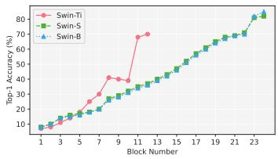  
(a): Swin

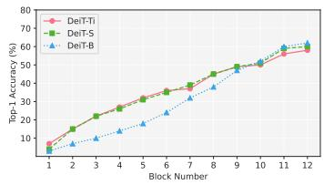  
(b): DeiT

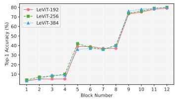  
(c): LeViT  
Figure 3: Probe training convergence across architectures. Top-1 accuracy of linear probes trained for four epochs is shown for each block in (a) Swin, (b) DeiT, and (c) LeViT families. Probes converge rapidly, demonstrating that meaningful intermediate representations can be extracted with negligible, one-time probe training cost.

Linear Probe Classifiers: Formally, KL divergence measures the statistical distance from a probabil ity distribution p to a target distribution q, denoted as $D _ { K L } ( p | | q )$ . We use linear classifier probes Alain & Bengio (2018), placed after different blocks, to estimate the KL divergence between the softmax probability distributions of activations. Each block in an anchor model is equipped with a simple $1 \times 1$ convolutional probe, for instance, Swin-B requires 24 probes, while DeiT-S requires 12. Training all probes independently would be very expensive. Instead, we introduce a unified architecture, ProbeNet, which jointly trains all probes by activating one at a time within a single forward-backward pass. This design adds only a negligible one-time cost, as probes converge rapidly in our setup (by epoch 4; Fig. 3). For example, training all 24 probes in Swin-B required just 0.25 GPU days in total, rather than 24 × 0.25 GPU days if trained separately. The pseudocode for ProbeNet is provided in Alg. 1 in App. A. By avoiding redundant inference and backpropagation, ProbeNet makes large-scale linear probing both efficient and practical.

Let $P _ { i } ^ { f } ( x )$ denote the softmax probability distribution produced by the probe inserted after block i of anchor model $f$ on input $\boldsymbol { x } \in \mathcal { D } _ { v }$ , where $\mathcal { D } _ { v }$ is the validation split. Similarly, let $P _ { j } ^ { g } ( x )$ represent the distribution from the probe after block $j$ of anchor model $g .$ After training the linear probes on the training split $( \mathcal { D } _ { t } )$ , we compute the similarity score Θ as defined in Eq. 1. We outline the procedure for obtaining KL divergence based similarity scores for all source-target block pairs using classifier probes in Alg. 2 in App. A. In this work, we fix the direction of stitching such that the source anchor always has lower complexity than the target anchor. Experiments in Pan et al. (2023) indicate that this choice yields more stable training and consistently better performance compared to stitching in the reverse direction.

$$
\Theta (P _ {i} ^ {f}, P _ {j} ^ {g}) = \frac {\sum_ {x \in \mathcal {D} _ {v}} D _ {K L} \big (P _ {i} ^ {f} (x) \mid | P _ {j} ^ {g} (x) \big)}{| \mathcal {D} _ {v} |}; \quad \Gamma (i, j) = \frac {\overbrace {\Theta (P _ {i} ^ {f} , P _ {j} ^ {g})} ^ {\text { cross - anchor activation distance } (\Omega)}}{\underbrace {\Theta (P _ {j} ^ {g} , P _ {j + 1} ^ {g})} _ {\text { intra - anchor block capacity } (\Sigma)}} \tag {1}\tag{2}
$$

## 4.2 THE KLAS FRAMEWORK: KL DIVERGENCE BASED ANCHOR STITCHING

Anchor Selection using Last Block KL Divergence: The first step in stitching is to identify suitable anchors (i.e., pretrained models). We achieve this by computing the KL divergence between the softmax probability distributions produced by the last block of each anchor. A low KL divergence indicates that two models have similar decision boundaries and class-confidence distributions, making them more compatible for stitching. This provides a principled anchor selection strategy, in contrast to the heuristic nearest stitching used in SN-Net.

Block Selection using KL Divergence: Once the anchors are chosen, we select stitchable block pairs using a stitch score $\Gamma ,$ , defined in Eq. 2 and demonstrated in Fig. 4. Unlike SN-Net’s naive paired / unpaired stitching heuristic for block selection, our method evaluates the compatibility of block pairs without instantiating or training a stitch layer. This design is central to KLAS’s efficiency: candidate stitched models are assessed without incurring any finetuning cost. When stitching a source block i from anchor $f$ to a target block j in anchor $^ { g , }$ the resulting stitched model $g _ { > j } \circ T \circ f _ { \leq i }$ interpolates between $f$ and $g$ in both accuracy and FLOPs. Thus, the target anchor’s accuracy serves as an upper bound for any stitched network derived from it, i.e., $\operatorname { A c c } ( g )$ is the maximum achievable accuracy of $g _ { > j } \circ T \circ f _ { \leq i } , \forall i , j$

(1) Cross-anchor activation distance $[ \Omega = \Theta ( P _ { i } ^ { f } , P _ { i } ^ { g } ) ]$ quantifies the transformation a hypothetical stitch layer (T) would need to apply to the source activations $( A _ { i } ^ { f } )$ in order to match the target activations $( A _ { i } ^ { g } )$ . In other words, it measures how much the stitched model $g _ { > j } \circ T \circ f _ { \leq i }$ would have to modify its intermediate representations to approximate the behavior of the target model $g .$ . A smaller Ω implies that the activations after layer i in $f$ are already close to the activations after layer $j$ in $^ { g , }$ making the block pair $( i , j )$ more favorable for stitching. It is important to emphasize that this is a purely hypothetical measure: since the models are not stitched yet, the $( j + 1 )$ -th block in $g$ does not actually process activations from $f .$ . Rather, Ω reflects the expected burden on the stitch layer alone if such a connection were to be instantiated.

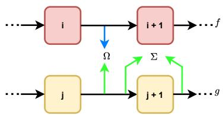  
Figure 4: Ω measures how closely the activations of source block i from $f$ align with those of target block $j$ in $^ { g , }$ reflecting the transformation burden on the hypothetical stitch layer. Σ mea sures how much block $j + 1$ in the target anchor $g$ transforms its inputs relative to block $j ,$ indicating block $( j + 1 ) ^ { \cdot } \mathrm { s }$ ability to absorb mismatched representations from the source.

(2) Intra-anchor block capacity $[ \Sigma = \Theta ( P _ { j } ^ { g } , P _ { j + 1 } ^ { g } ) ]$ captures how much a block in a pretrained anchor transforms its input representations, measured by comparing the outputs of consecutive blocks within the same anchor. A large Σ indicates a

substantial shift in activations from block $j$ to block $j + 1$ in model $g .$ . Since $g$ achieves any stitched model’s upper-bound accuracy, this implies that block $j + 1$ has high learning capacity, i.e., it plays a critical role in refining representations for task performance. High-capacity blocks are especially valuable when constructing stitched models, as they can absorb distributional differences from the source while maintaining task-relevant transformations. Thus, incorporating such blocks increases the likelihood of achieving strong downstream accuracy without a high training cost.

KLAS algorithm formulation: We employ probe classifiers to project the activation spaces of intermediate blocks onto the output space $y .$ Since stitching is restricted to occur within the same stage, we omit explicit stage indices for notational simplicity (see §3.1). During the stitch finetuning phase, we select a set of candidate stitch configurations (S) using a tunable threshold (τ). These candidates are drawn from a set of FLOPs buckets (B), which partition the computational space between $f$ and $g .$ The bucket granularity controls the density of the resulting accuracy-efficiency tradeoff curve. To ensure coverage, we choose B such that each block in the target anchor g has at least one stitch configuration represented in S. Formally, the candidate set S is defined as:

$$
\mathcal {S} = \bigcup_ {b \in \mathcal {B}} \mathcal {R} _ {b} ^ {*}; \mathcal {R} _ {b} ^ {*} = \left(\left\{(i ^ {*}, j ^ {*}) \mid \Gamma (i, j) \leq \tau , \forall (i, j) \in b \right\} \bigcup \left\{(i ^ {*}, j ^ {*}) = \underset {(i, j) \in b} {\arg \min} \Gamma (i, j) \right\}\right)\tag{3}
$$

where $\Gamma ( i , j )$ denotes the stitch score for block pair $( i , j )$ . This formulation in Eq. 3 balances computational efficiency with stitch quality by ensuring both bucket-level coverage and thresholdbased filtering. The complete KLAS algorithm is presented in Alg. 3 in App. A.

## 5 EXPERIMENTS AND EVALUATION

Please refer to App. B for details on the experimental setup. All results in this section are reported after finetuning the stitched network for 50 epochs with identical settings following SN-Net Pan et al. (2023). The end-to-end overhead of KLAS (ProbeNet + Stitched network finetuning) on 8×A40 NVIDIA GPUs is 16 hours for the Swin model family.

## 5.1 MEASURING SIMILARITY USING KL DIVERGENCE

Tab. 2 shows that KLAS significantly outperforms existing similarity measures, achieving an area under accuracy-efficiency curve (AUC) of 0.8950, compared to 0.8345 for SN-Net and much lower values for MSE, CE, and DM. Notably, CKA, widely used for representational similarity, lags behind KLAS by over 8%. These results along with further experiments in App. D highlight the effectiveness of KL

<table><tr><td>Metric</td><td>CKA</td><td>MSE</td><td>CE</td><td>DM</td><td>SN-Net</td><td>KLAS (ours)</td></tr><tr><td>AUC</td><td>0.8124</td><td>0.7564</td><td>0.8023</td><td>0.7642</td><td>0.8345</td><td>0.8950</td></tr></table>

Table 2: Comparison of similarity metrics on the Swin family. Reported values are AUC scores of stitch configuration selection.

divergence in capturing both representational alignment and functional alignment, making it a superior choice for guiding stitch configuration selection.

## 5.2 ANCHOR SELECTION USING KLAS

We demonstrate that last block KL divergence provides a reliable criterion for selecting pretrained anchors that are more compatible for stitching and more likely to yield better accuracy-efficiency tradeoffs (line 2 in Alg. 3). Since the softmax distribution is already computed in the final blocks of the anchors, additional probes and training are not required at this stage. As shown in Tab. 3 and Fig. 5, for both model families with more than two anchors (i.e., Swin and DeiT), last block KL divergence successfully identifies the anchor pairs that should be stitched together for improved performance.

In the Swin family, stitching Ti-B yields a higher AUC compared to Ti-S and S-B stitches chosen by

<table><tr><td>Family</td><td>Anchors</td><td>KL Divergence</td></tr><tr><td rowspan="3">DeiT</td><td>Ti-S</td><td> $4.12 \times 10^{-4}$ </td></tr><tr><td>S-B</td><td> $2.48 \times 10^{-4}$ </td></tr><tr><td>Ti-B</td><td> $5.62 \times 10^{-4}$ </td></tr><tr><td rowspan="3">Swin</td><td>Ti-S</td><td> $2.70 \times 10^{-3}$ </td></tr><tr><td>S-B</td><td> $4.63 \times 10^{-3}$ </td></tr><tr><td>Ti-B</td><td> $2.38 \times 10^{-4}$ </td></tr></table>

Table 3: Last block KL divergence for anchor selection in DeiT and Swin families (pretrained on ImageNet-22K). Lower KL divergence values indicate greater compatibility between anchors for stitching (in blue).

SN-Net. Conversely, within the DeiT family, the Ti-S and S-B stitches selected by SN-Net (via the nearest stitching heuristic) offer a good accuracy-efficiency tradeoff. These trends, as shown in Fig. 5, demonstrate that the nearest stitching heuristic used in SN-Net is not universally optimal across model families. In contrast, selecting anchors based on last block KL divergence offers a principled and generalizable strategy that consistently identifies the most compatible anchor pairs.

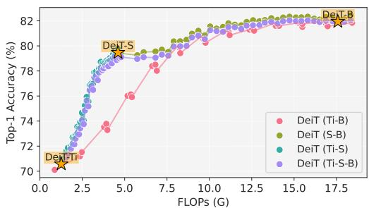  
(a): DeiT

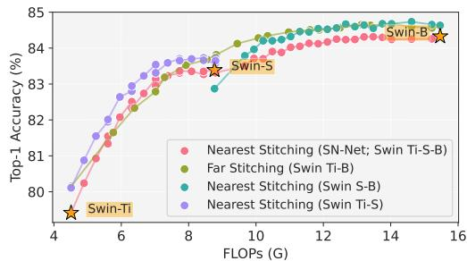  
(b): Swin  
Figure 5: Accuracy-efficiency tradeoffs for anchor selection in DeiT and Swin families. (a) For DeiT, stitching Ti-S and S-B (nearest stitching heuristic from SN-Net) yields the optimal accuracy-efficiency curve, while stitching Ti-B underperforms. (b) Conversely, for Swin, stitching Ti-B (far stitching) provides a superior tradeoff compared to Ti-S-B, which is chosen by SN-Net. These results show that the nearest stitching heuristic is not universally optimal, whereas last block KL divergence (see Tab. 3) consistently identifies the most compatible anchors across families.

## 5.3 BLOCK SELECTION USING KLAS

After selecting the anchors, the next step is to identify block pairs within these anchors for the stitched network finetuning phase. As an initial experiment, we evaluate whether KLAS can automatically recover the paired and unpaired stitching heuristics proposed in SN-Net. To this end, we restrict ourselves to the same anchors used in SN-Net, but perform block selection following lines 4-12 of Alg. 3. Tab. 4 shows that the block selection component of KLAS automatically recovers many of the stitch configurations identified by SN-Net’s heuristics, though not perfectly. Crucially, when we finetune stitched networks using the stitches selected by KLAS, our method outperforms SN-Net even under this constrained setting (i.e., using the same anchors as SN-Net), as shown in Fig. 6. A key goal of our KL divergence based approach is to automatically discover stitch configurations that heuristics have shown to be effective in prior work, while also identifying additional promising candidates. The results in Tab. 4 validate KL divergence as a viable similarity metric that can guide stitch discovery without reliance on ad-hoc heuristics.

<table><tr><td>Family</td><td>Method</td><td>Total Stitches</td><td>AUC</td></tr><tr><td rowspan="2">DeiT</td><td>SN-Net</td><td>68</td><td>0.731</td></tr><tr><td>KLAS</td><td>66 (40 overlap)</td><td>0.743</td></tr><tr><td rowspan="2">Swin</td><td>SN-Net</td><td>38</td><td>0.835</td></tr><tr><td>KLAS</td><td>38 (28 overlap)</td><td>0.842</td></tr></table>

Table 4: Comparison of SN-Net and KLAS when constrained to the nearest stitching heuristic (Swin: Ti-S-B; DeiT: Ti-S-B). Despite this restriction, KLAS achieves higher AUC by leveraging its KL divergence based block selection, while also recovering a substantial portion of the heuristic stitches used by SN-Net.

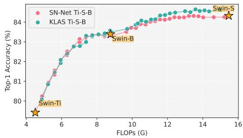  
Figure 6: We fix the anchors as the ones selected in the SN-Net (Ti-S-B). We see even then KLAS returns a better accuracy-efficiency curve.

For our main experiments, we follow the setup described in App. B. We use three DeiT anchors Touvron et al. (2021) (DeiT-Ti, DeiT-S, and DeiT-B) and three Swin anchors Liu et al. (2021) (Swin-Ti, Swin-S, and Swin-B). Each DeiT anchor has 12 blocks of equal spatial resolution, resulting in 432 possible stitches across the accuracy-efficiency curve. For Swin, stitching is applied only within stages (as in SN-Net), since spatial resolution is preserved within a stage. Swin-Ti has 12 blocks, while Swin-S and Swin-B have 24 blocks each, leading to 1152 possible stitches in total. We attach probes at the end of every block, yielding 36 probe locations in DeiT and 60 in Swin. KL divergence is then computed for all possible stitch pairs by treating the softmax output at the stitch start point on ImageNet-1K as the source distribution and the corresponding softmax at the stitch end point as the target distribution.

Fig. 7 shows that our algorithm achieves a superior accuracy-efficiency curve across all model families in terms of AUC scores. Even in settings where the nearest stitching heuristic performs reasonably well (e.g., DeiT), KLAS performs better. We observe that while our algorithm produces a sparser set of stitches at lower FLOPs in Swin, it still closely matches SN-Net in accuracy. The key advantage of our approach is that it does not impose a fixed mapping between source and target blocks; instead, it adapts based on the pretrained anchor weights. Consequently, if the anchor weights change, the selected source-target block pairs may also change. Tab. 4 highlights the overlap between stitches selected by KLAS and those chosen heuristically by SN-Net, showing that KLAS successfully recovers many effective stitches while avoiding rigid reliance on fixed heuristics. A key advancement is that KLAS also discovers new stitch configurations, most notably stitches from Swin-Ti to Swin-B anchors, that were not captured by heuristic approaches in the baseline. We provide further ablation studies on KLAS by comparing it to a naive Min-KL approach in App. C. We discuss KL divergence correlations in App. D, compare KLAS to cascades in App. E and present KL divergence heatmaps and block-level KL divergence variations in App. F.

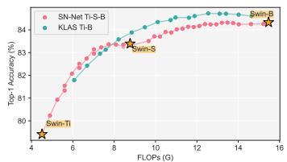  
(a): Swin, ∆AUC : +0.06

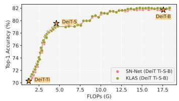

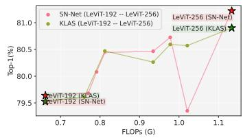  
(b): DeiT, ∆AUC : +0.012  
(c): LeViT, ∆AUC : +0.006

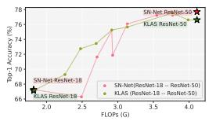

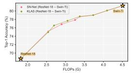

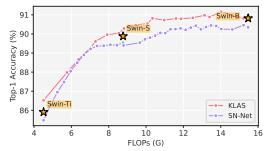

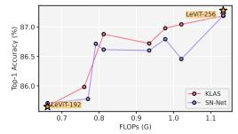  
(d): ResNet, ∆AUC : (e): ResNet-Swin, (f): Swin CIFAR-100, (g): LeViT CIFAR-100, +0.014 ∆AUC : +0.002 ∆AUC : +0.014 ∆AUC : +0.008  
Figure 7: Accuracy-efficiency tradeoff curves comparing KLAS with SN-Net across multiple model families and datasets: (a) Swin, (b) DeiT, (c) LeViT, (d) ResNet, (e) ResNet-Swin cross-architecture, (f) Swin on CIFAR-100, and (g) LeViT on CIFAR-100. Each point corresponds to a stitched model after finetuning, plotted by FLOPs (x-axis) and Top-1 accuracy (y-axis). Across all settings, KLAS achieves higher accuracy at comparable compute, yielding consistently positive ∆AUC. A positive ∆AUC indicates that KLAS outperforms SN-Net over the full FLOPs space.

## 5.4 RESULTS ON DENSE PREDICTION TASKS

We further report final semantic segmentation results for Mask2Former Cheng et al. (2022) models with Swin-T and Swin-B backbones on ADE20K Zhou et al. (2019). We assess the stitched models selected by SN-Net and KLAS. All models are evaluated using standard mIoU on the ADE20K validation set; FLOPs are measured per-image with input size 512 × 512. The Swin backbones are not frozen in the Mask2Former architecture, while the rest of the model is frozen during finetuning. For each selection strategy, we divide the FLOPs space into three buckets of equal width. The entire stitched network is finetuned for 160k steps under the same schedule and batch size as in the original Mask2Former setup. We use the same steps outlined in §5.1 - §5.3 to run KLAS for the semantic segmentation task. KLAS consistently outperforms SN-Net across the FLOPs space as shown in Tab. 5. For instance, KLAS achieves up to +0.9% mIoU, with comparable FLOPs to the SN-Net

<table><tr><td>Model</td><td>FLOPs(G)</td><td>mIoU(%)</td></tr><tr><td>SN-Net-1</td><td>152</td><td>29.4</td></tr><tr><td>KLAS-1</td><td>145</td><td>29.8</td></tr><tr><td>SN-Net-2</td><td>274</td><td>32.6</td></tr><tr><td>KLAS-2</td><td>277</td><td>33.5</td></tr><tr><td>SN-Net-3</td><td>327</td><td>37.7</td></tr><tr><td>KLAS-3</td><td>316</td><td>37.8</td></tr></table>

Table 5: Semantic segmentation results on ADE20K using Mask2Former with Swin-T and Swin-B. KLAS-selected stitches outperform SN-Net baselines at similar FLOPs budgets.

counterparts. In general, SN-Net selects lower quality stitch configurations in the same FLOPs buckets. These results confirm that KLAS enables more effective accuracy-efficiency tradeoffs than SN-Net for dense prediction tasks like semantic segmentation. We provide more details on the implementation in App. G.

## 5.5 APPLICABILITY TO LARGE LANGUAGE MODELS (LLMS)

To evaluate whether KLAS generalizes to instruction-tuned LLMs, we replicate a stitching experiment based on ESTA He et al. (2024), comparing it against KLAS-based selection using TruthfulQA Lin et al. (2022). We use Llama 3.2 1B and 3B Grattafiori et al. (2024) as anchor models. Stitched models are created by combining source blocks from Llama 1B to target blocks from Llama 3B. Stitching is done using two strategies: (1) ESTA, which selects posi-

<table><tr><td>Model</td><td>Method</td><td>ROUGE-1</td><td>ROUGE-2</td></tr><tr><td>Stitched LLaMa 1.6 B</td><td>ESTA</td><td>0.576</td><td>0.304</td></tr><tr><td>Stitched LLaMa 1.4 B</td><td>KLAS</td><td>0.593</td><td>0.337</td></tr><tr><td>Stitched LLaMa 2.7 B</td><td>ESTA</td><td>0.631</td><td>0.353</td></tr><tr><td>Stitched LLaMa 2.6 B</td><td>KLAS</td><td>0.645</td><td>0.379</td></tr></table>

Table 6: Results on LLMs using Llama 1B and 3B. KLAS-selected stitched models improve over ESTAselected stitched models, with fewer parameters.

tions based on layer count (e.g., 1B first k layers + 3B remaining), and (2) KLAS, which selects based on minimum stitch score using per-layer next-token distributions using linear probes. Evaluation is performed in the generative setting on TruthfulQA, and we report ROUGE-1 and ROUGE-2 scores against reference completions after finetuning for 10 epochs in both strategies. Tab. 6 shows that KLAS consistently identifies more similarly aligned stitch points (i.e., blocks) than ESTA’s heuristic based selection. On TruthfulQA, KLAS-stitched models outperform similar-sized ESTA-stitched models by up to 0.017 ROUGE-1 and 0.033 ROUGE-2, thus offering a more principled and effective approach to designing stitched LLMs. We provide more experimental details in App. H.

## 5.6 ABLATION STUDIES ON KLAS HYPERPARAMETERS

Threshold (τ). KLAS selects stitch configurations by thresholding the stitch score Γ(i, j) relative to the minimum score within each FLOPs bucket. We sweep τ from 1% to 10% more than this per-bucket minimum and report the resulting average accuracy and AUC in Tab. 7. A clear tradeoff emerges: very high thresholds $( \mathrm { e . g . , } \tau = 1 0 \% )$ admit noisy, low-quality stitch configurations, while low thresholds (e.g., τ = 1%) become overly selective and reduce the number of selected stitches, yielding sparse Pareto fronts. The default $\tau = 5 \%$ provides the best balance between robustness and diversity. We use Swin-Ti, Swin-S and Swin-B with 20 buckets for these experiments.

<table><tr><td>Threshold (τ)</td><td>Avg Top-1(%)</td><td>AUC</td></tr><tr><td>1%</td><td>83.72</td><td>0.8934</td></tr><tr><td>3%</td><td>83.74</td><td>0.8942</td></tr><tr><td>5%</td><td>83.76</td><td>0.8950</td></tr><tr><td>10%</td><td>83.69</td><td>0.8931</td></tr></table>

Table 7: Effect of threshold τ on KLAS stitch selection. High τ admits noisy pairs; low τ causes sparsity.

Bucket Granularity. To understand the effect of discretizing the FLOPs space, we vary the number of FLOPs buckets used during stitch selection. The block granularity is inversely proportional to the number of buckets. As shown in Tab. 8, using finer buckets (i.e., lower bucket granularity) increases the density of Pareto front, but KLAS maintains strong performance even with coarser buckets (i.e., higher bucket granularity). Overall sensitivity remains low for any reasonable bucket count (10-20). We use Swin-Ti, Swin-S and Swin-B with τ = 5% for these experiments.

<table><tr><td>#Buckets</td><td>Avg Top-1(%)</td><td>AUC</td></tr><tr><td>10</td><td>83.65</td><td>0.8902</td></tr><tr><td>15</td><td>83.75</td><td>0.8947</td></tr><tr><td>20</td><td>83.76</td><td>0.8950</td></tr></table>

Table 8: Ablation on FLOPs bucket granularity. KLAS remains robust across bucket granularity choices.

## 6 DISCUSSION AND CONCLUSION

This paper introduces KLAS, a novel, efficient and automatic framework for improving the accuracy efficiency tradeoff produced by stitching pretrained models. The method leverages KL divergence to identify stitched configurations that are likely to perform well after finetuning the stitched supernetwork. Empirical evaluations show that KLAS consistently outperforms heuristic-based baselines by providing a principled, similarity-driven selection strategy that generalizes across diverse model architectures, datasets, tasks and modalities, while incurring negligible additional computational cost. Beyond accuracy alone, generative workloads impose distinct system constraints across the prefill and decode phases (e.g., time-to-first-token and time-between-tokens). This creates a new optimization problem: balancing accuracy with two latency budgets (and often memory / throughput constraints) across both phases. A natural future direction is to extend KLAS to this setting by enforcing KV-cache compatibility across stitched blocks and redefining similarity measures accordingly.