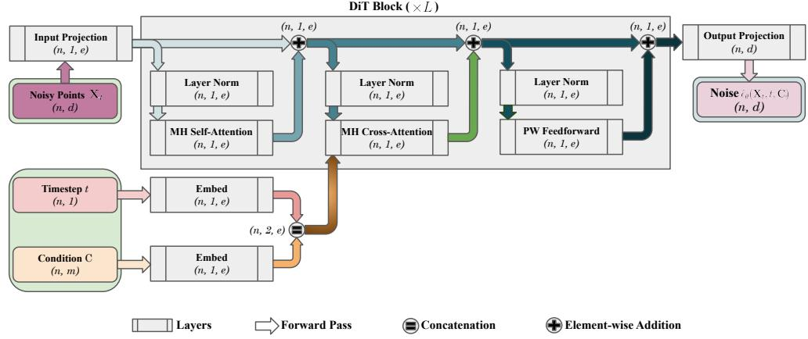
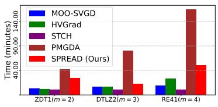
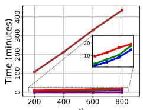
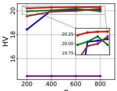
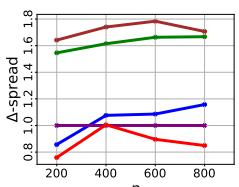
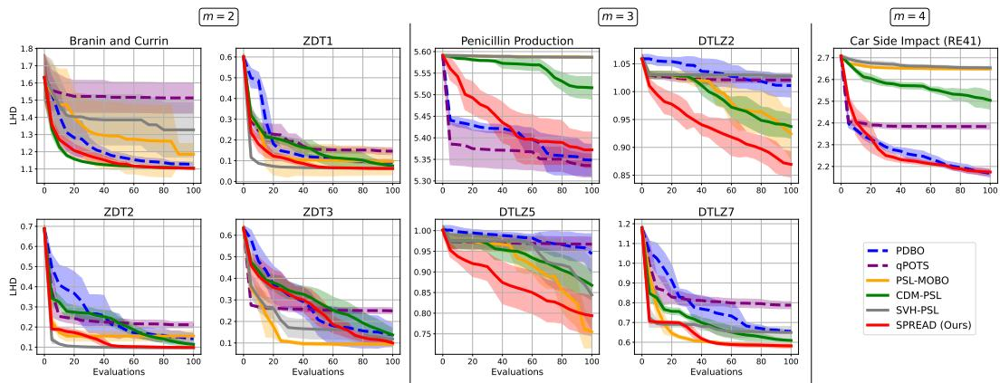

## ABSTRACT

Developing efficient multi-objective optimization methods to compute the Pareto set of optimal compromises between conflicting objectives remains a key challenge, especially for large-scale and expensive problems. To bridge this gap, we introduce SPREAD, a generative framework based on Denoising Diffusion Probabilistic Models (DDPMs). SPREAD first learns a conditional diffusion process over points sampled from the decision space and then, at each reverse diffusion step, refines candidates via a sampling scheme that uses an adaptive multiple gradient descent-inspired update for fast convergence along side a Gaussian RBF–based repulsion term for diversity. Empirical results on multi-objective optimization benchmarks, including offline and Bayesian surrogate-based settings, show that SPREAD matches or exceeds leading baselines in efficiency, scalability, and Pareto front coverage. Code is available at https://github.com/safe-autonomous-systems/moo-spread .

## 1 INTRODUCTION

Multi-objective optimization (MOO) is fundamental in numerous scientific and engineering disciplines, where decision-makers often face the challenge of optimizing conflicting objectives simultaneously (Rangaiah, 2016; Malakooti, 2014; Zhang et al., 2024b). The primary aim is to identify the Pareto front: a set of non-dominated solutions where improving one objective would deteriorate at least one other. Traditional methods for approximating the Pareto front include evolutionary algorithms (Deb, 2011; Zhou et al., 2011), scalarization techniques (Braun et al., 2015; Hotegni & Peitz, 2025), and multiple-gradient descent (MGD) (Desid´ eri, 2012; Sener & Koltun, 2018) combined with´ multi-start techniques (i.e., using random initial guesses to obtain multiple points). However, these approaches may struggle with scalability, especially in high-dimensional or resource-constrained settings (Cheng et al., 2021; Li et al., 2024a). As a workaround, domain-specific MOO algorithms have been developed to leverage domain knowledge to improve efficiency and solution quality in targeted settings (e.g., offline MOO (Yuan et al., 2025b), Bayesian MOO (Daulton et al., 2022), or federated learning (Hartmann et al., 2025)), but at the expense of broader applicability. These challenges underscore the need for MOO methods capable of efficiently adapting to large-scale, high dimensional, and computationally expensive problem settings. Developing such universal approaches would not only streamline the optimization process, but would also broaden the applicability of MOO techniques across different domains.

Recent advancements in generative modeling have shown promise in addressing complex optimization problems (Garciarena et al., 2018; Yuan et al., 2025a). In particular, diffusion models such as Denoising Diffusion Probabilistic Models (DDPMs), have demonstrated remarkable capabilities in generating high-quality samples across various domains (Ho et al., 2020; Yang et al., 2023). Their iterative refinement process aligns well with the principles of MOO, offering a potential pathway to efficiently approximate the Pareto front. In this work, we introduce SPREAD (Sampling-based Pareto front Refinement via Efficient Adaptive Diffusion), a novel diffusion-driven generative framework designed to tackle multi-objective optimization across diverse problem settings. Our approach leverages the strengths of diffusion models to iteratively generate and refine candidate solutions, guiding them towards Pareto optimality. SPREAD applies a conditional diffusion modeling approach, where a conditional DDPM is trained on points sampled from the input space, allowing the model to effectively learn the underlying structure of the objective functions and steer the generation process toward promising regions. To further enhance convergence towards Pareto optimality, SPREAD incorporates an adaptive guidance mechanism inspired by the multiple gradient descent algorithm (Desid´ eri, 2012), dynamically guiding the sampling process to regions likely to´ contain optimal solutions. Furthermore, to promote diversity among the generated solutions and ensure an approximation of the entire Pareto front, SPREAD utilizes a Gaussian RBF repulsion mechanism (Buhmann, 2000) that discourages clustering, mitigates mode collapse and encourages exploration in the objective space.

We evaluate SPREAD on diverse MOO problems including two challenging, resource-constrained scenarios: offline multi-objective optimization (Xue et al., 2024) and Bayesian multi-objective optimization (Knowles, 2006). In each case, we benchmark our method against state-of-the-art approaches specifically tailored for these settings. Our empirical results demonstrate that SPREAD not only achieves competitive performance but also offers superior scalability and adaptability across different problem domains. Our contributions can be summarized as follows: (a) We propose a novel diffusion-based generative framework for MOO that effectively approximates the Pareto front. (b) We introduce a novel conditioning approach along with an adaptive guidance mechanism inspired by MGD to improve convergence towards Pareto optimal solutions. (c) We implement a diversitypromoting strategy to ensure a comprehensive and well-distributed set of solutions. (d) We validate our approach on challenging MOO tasks, demonstrating its effectiveness and generalizability.

## 2 RELATED WORK

We now situate our approach within prior work on generative modeling for multi-objective optimization, and gradient-based methods relevant to our settings. An extended discussion of related work is provided in Appendix E.

Generative Modeling for Multi-Objective Optimization Recent work explores alternatives to traditional search methods, such as evolutionary algorithms or acquisition-based optimization, by directly generating Pareto optimal candidates. ParetoFlow (Yuan et al., 2025a) uses flow-matching with a multi-objective predictor-guidance module to steer samples toward the front in the offline setting, showing that guided generative samplers can cover non-convex fronts efficiently. In parallel, PGD-MOO (Annadani et al., 2025) trains a dominance-based preference classifier and uses it for diffusion guidance to obtain diverse Pareto optimal designs from data. For Bayesian settings, CDM PSL (Li et al., 2025a) couples unconditional/conditional diffusion with Pareto set learning to propose candidate points under tight evaluation budgets. Our approach differs by conditioning a diffusion transformer on objectives and applying step-wise, MGD-inspired guidance together with an explicit diversity force, yielding both convergence and spread without a separate preference classifier.

Gradient-based Methods for Pareto Set Discovery A complementary line of research explicitly profiles the Pareto set by moving a population with repulsive interactions or by smoothing scalarizations. PMGDA (Zhang et al., 2025) extends the classical MGDA (Desid´ eri, 2012) by sampling´ multiple descent directions in a probabilistic manner, thus improving stability and coverage in high dimensions. Smooth Tchebycheff scalarization (STCH) provides a lightweight differentiable scalarization with favorable guarantees (Lin et al., 2024). Leveraging hypervolume gradients, HV-Grad (Deist et al., 2021) updates solutions toward the Pareto front while preserving diversity, while MOO-SVGD (Liu et al., 2021) employs Stein variational gradients to transport particles and obtain well-spaced fronts. Extending this line of work, SPREAD integrates MGD directions into a DDPM denoising process, using them as adaptive guidance signals within diffusion sampling.

## 3 PRELIMINARIES

To set the stage for our method, we review the fundamental concepts on which our approach is based.

## 3.1 DENOISING DIFFUSION PROBABILISTIC MODELS (DDPMS)

As powerful generative models, Denoising Diffusion Probabilistic Models excel at producing highquality samples in a wide range of applications, such as image synthesis (Dhariwal & Nichol, 2021), speech generation (Kong et al., 2020), and molecular design (Hoogeboom et al., 2022). These models operate by simulating a forward diffusion process, where Gaussian noise is incrementally added to data, followed by a learned reverse process that denoises the data step by step. In the conditional setting, DDPMs generate data samples conditioned on auxiliary information $c ,$ enabling controlled generation aligned with specific attributes or constraints. The forward diffusion process gradually corrupts a data point $\mathbf { x } _ { \mathrm { 0 } }$ over $T$ timesteps:

$$
q (\mathbf {x} _ {t} | \mathbf {x} _ {t - 1}) = \mathcal {N} (\mathbf {x} _ {t}; \sqrt {1 - \beta_ {t}} \mathbf {x} _ {t - 1}, \beta_ {t} \mathbf {I}),\tag{1}
$$

where $\beta _ { t }$ is a variance scheduling parameter, often chosen according to a linear (Ho et al., 2020) or a cosine (Nichol & Dhariwal, 2021) schedule. After $T$ steps, $\mathbf { x } _ { T }$ approaches a standard Gaussian distribution. The aim is to reconstruct $\mathbf { x } _ { \mathrm { 0 } }$ from $\mathbf { x } _ { T }$ by learning a parameterized model $\hat { \epsilon } _ { \theta } ( \cdot )$ that predicts the added noise at each timestep $t ,$ conditioned on c. The model is trained to minimize the following loss: 2]

$$
\mathcal {L} _ {\mathrm{s}} (\theta) = \mathbb {E} _ {\mathbf {x} _ {0}, \epsilon , t, c} \left[ \left\| \epsilon - \hat {\epsilon} _ {\theta} (\mathbf {x} _ {t}, t, c) \right\| ^ {2} \right],\tag{2}
$$

where $\epsilon \sim \mathcal { N } ( 0 , \mathbf { I } )$ is the true noise added to $\mathbf { x } _ { \mathrm { 0 } }$ at a randomly chosen timestep $t \in \{ 1 , \ldots , T \}$ to obtain $\mathbf { x } _ { t } ,$ , at each epoch. Specifically, from equation 1 we have after t timesteps $\mathbf { x } _ { t } = \sqrt { \bar { \alpha } _ { t } } \mathbf { x } _ { 0 }$ + $\sqrt { 1 - \bar { \alpha } _ { t } } \epsilon$ , with $\begin{array} { r } { \bar { \alpha } _ { t } = \prod _ { i = 1 } ^ { t } ( 1 - \beta _ { i } ) } \end{array}$

At inference (post-training), sampling starts from pure noise $\mathbf { x } _ { T } \sim \mathcal { N } ( 0 , \mathbf { I } )$ and iteratively denoises it using the learned reverse process:

$$
\mathbf {x} _ {t - 1} = \frac {1}{\sqrt {1 - \beta_ {t}}} \left(\mathbf {x} _ {t} - \frac {\beta_ {t}}{\sqrt {1 - \bar {\alpha} _ {t}}} \hat {\epsilon} _ {\theta} (\mathbf {x} _ {t}, t, c)\right) + \sqrt {\beta_ {t}} \mathbf {z},\tag{3}
$$

where $\mathbf { z } \sim \mathcal { N } ( 0 , \mathbf { I } )$ . To enhance sample quality and control, guidance techniques can be applied: classifier guidance introduces gradients from a separately trained classifier to steer the generation process (Dhariwal & Nichol, 2021), while classifier-free guidance interpolates between conditional and unconditional predictions within the same model, allowing for flexible control without additional classifiers (Ho & Salimans, 2022).

## 3.2 MULTI-OBJECTIVE OPTIMIZATION (MOO)

Multi-objective optimization involves optimizing multiple conflicting objectives simultaneously (Eichfelder, 2008; Peitz & Hotegni, 2025):

$$
\min _ {\mathbf {x} \in \mathcal {X}} \mathbf {F} (\mathbf {x}) = (f _ {1} (\mathbf {x}), \ldots , f _ {m} (\mathbf {x})),\tag{MOP}
$$

where $\mathcal { X }$ is the decision space, and each $f _ { j } : \mathcal { X } \longrightarrow \mathbb { R } , \ j \in \{ 1 , \dots , m \}$ represents an objective function. Throughout this paper, we assume that each objective function is continuously differentiable.

Definition 1 (Pareto Stationarity). A solution $\mathbf { x } ^ { \ast } \in \mathcal { X }$ is said to be Pareto stationary ifthere exist nonnegative scalars $\lambda _ { 1 } , \ldots , \lambda _ { m } ,$ , with $\begin{array} { r } { \sum _ { j = 1 } ^ { m } \lambda _ { j } = 1 } \end{array}$ , such that $\begin{array} { r } { \sum _ { j = 1 } ^ { m } \lambda _ { j } \nabla f _ { j } ( \mathbf { x } ^ { * } ) = \dot { 0 } } \end{array}$

Such points are necessary candidates for Pareto optimality but may include non-optimal solutions.

Definition 2 (Dominance). A solution $\mathbf { x } ^ { \prime } \in { \mathcal { X } }$ is said to dominate another solution $\mathbf { x } \in \mathcal { X }$ (denoted $\begin{array} { r l } { \mathbf { x } ^ { \prime } \prec \mathbf { x } ) \mathit { i f } . } & { { } \mathit { f } _ { j } ( \mathbf { x } ^ { \prime } ) \leq f _ { j } ( \mathbf { x } ) } \end{array}$ for all $j = 1 , \ldots , m$ , and ∃ ${ \mathrm { ~  ~ { ~ \sigma ~ } ~ } } _ { i } \in \{ 1 , \ldots , m \} | f _ { i } ( \mathbf { x } ^ { \prime } ) < f _ { i } ( \mathbf { x } )$

Definition 3 (Pareto Optimality). A solution $\mathbf { x } ^ { \ast } \in \mathcal { X }$ is called Pareto optimal ifthere is no $\mathbf { x } ^ { \prime } \in { \mathcal { X } }$ such that $\mathbf { x } ^ { \prime } \prec \mathbf { x } ^ { * }$ . It is called weakly Pareto optimal if there is no $\hat { \mathbf { x } } ^ { \prime } \in \mathcal { X }$ such that $f _ { j } ( \mathbf { x } ^ { \prime } ) <$ $f _ { j } ( \mathbf { x } ^ { * } )$ for all $j = 1 , \ldots , m$

The set $\mathcal { P }$ of all Pareto optimal solutions is called Pareto $s e t ,$ and its image $\mathbf { F } ( \mathcal { P } ) = \left\{ \mathbf { F } ( \mathbf { x } ^ { * } ) : \mathbf { x } ^ { * } \in \right.$ $\mathcal { P } \}$ , is known as Paretofront. Among the various strategies for solving multi-objective optimization problems, gradient-based techniques are of particular relevance, and in our case, multiple gradient descent serves as the key inspiration for the update mechanism within SPREAD.

## 3.3 MULTIPLE GRADIENT DESCENT (MGD)

Multiple gradient descent is a technique designed to find descent directions that simultaneously improve all objectives in MOO (Desid ´ eri, 2012). Given the gradients ´ $\nabla f _ { j } ( \mathbf { x } )$ for each objective $f _ { j } ,$ MGD seeks a convex combination of these gradients that yields a common descent direction at each iteration. This is achieved by solving the following optimization problem:

$$
\lambda^ {*} = \arg \min _ {\lambda \in \Delta_ {m}} \left\| \sum_ {j = 1} ^ {m} \lambda_ {j} \nabla f _ {j} (\mathbf {x}) \right\| ^ {2},\tag{4}
$$

  
Figure 1: DiT-MOO architecture. Diffusion Transformer adapted for multi-objective optimization, where noise prediction is conditioned on objective values condition via multi-head cross-attention.

where $\Delta _ { m } = \{ \lambda \in \mathbb { R } ^ { m } \mid \sum _ { i = 1 } ^ { m } \lambda _ { j } = 1 , \lambda _ { j } \geq 0 \}$ is the standard simplex. The optimal weights $\lambda ^ { * }$ define the aggregated gradient $\begin{array} { r } { \mathbf { g } ( \mathbf { x } ) = \sum _ { i = 1 } ^ { m } \lambda _ { j } ^ { * } \nabla f _ { j } ( \mathbf { x } ) } \end{array}$ , whose negative serves as the common descent direction. The decision variable is then updated using this direction: $\mathbf { x } _ { t + 1 } = \mathbf { x } _ { t } - \eta _ { t } \mathbf { g } ( \mathbf { x } _ { t } )$ with $\eta _ { t }$ being the step size at iteration t. While MGD ensures convergence to a Pareto stationary point, employing a classical multi-start approach does not inherently promote diversity among solutions. To overcome this drawback, our method incorporates a mechanism that promotes diversity, as detailed in the next section.

## 4 METHOD

In this section, we first present the core components of our method for solving an MOP in an online setting (full access to the objective functions), and then discuss how we adapt them to different resource-constrained settings. We adopt a Transformer-based noise-prediction network, DiT-MOO (Fig. 1), adapted from the Diffusion Transformer (DiT) architecture (Peebles & Xie, 2023), for stable and scalable sampling. The model takes as input a batch of n noisy decision variables $\mathbf { X } _ { t } \in \mathbb { R } ^ { n \times d }$ together with a timestep t and a condition $\mathbf { C } ,$ and outputs the predicted noise $\hat { \epsilon } _ { \theta } ( \mathbf { X } _ { t } , t , \mathbf { C } ) .$ . A cosine schedule (Nichol & Dhariwal, 2021) is considered for the variance scheduling parameter $\beta _ { t }$ . Further architectural details are provided in Appendix A.4.

Training For a given MOP, we sample N points $\{ \mathbf { x } ^ { i } \} _ { i = 1 } ^ { N } = \mathbf { X }$ from the decision space $\mathcal { X } \subseteq \mathbb { R } ^ { d }$ via Latin hypercube sampling (McKay et al., 2000) to create the training dataset. Our DiT-MOO is then trained using the loss ${ \mathcal { L } } _ { \mathrm { s } }$ (equation 2), on pairs $( \mathbf { x } ^ { i } , \mathbf { c } ^ { i } )$ with

$$
\mathbf {c} ^ {i} = \mathbf {F} (\mathbf {x} ^ {i}) + \Xi , \quad \Xi \in (0, \infty) ^ {m}.\tag{5}
$$

During sampling, however, we condition on the original objective vector $\mathbf { F } ( \mathbf { x } ^ { i } )$ . The shift Ξ can be any vector with strictly positive entries, fixed for the entire dataset or varying per point or batch. The following theorem establishes the key advantage of this conditioning approach.

Theorem 1 (Objective Improvement). Let $\mathbf x \subset \mathcal X$ be a training dataset with distribution $P _ { \mathbf { X } }$ . Let $\Xi \in ( 0 , \infty ) ^ { m }$ , independent of X, and define the training label

$$
\mathbf {C} := \mathbf {F} (\mathbf {X}) + \Xi .\tag{6}
$$

For a conditioning value c in the support ofC, denote by $P _ { \mathbf { X | C = c } }$ the true conditional data distribu tion and by $Q _ { \theta } ( \cdot \mid \mathbf { c } )$ the distribution produced by a conditional DDPM when sampling conditioned on c. Assume the sampler approximates the true conditional training distribution in total-variation TV distance by at most $\tau \in [ 0 , 1 )$

$$
\operatorname{TV} \left(Q _ {\theta} (\cdot | \mathbf {c}), P _ {\mathbf {X} | \mathbf {C} = \mathbf {c}}\right) = \sup _ {A} \left| Q _ {\theta} (A | \mathbf {c}) - P _ {\mathbf {X} | \mathbf {C} = \mathbf {c}} (A) \right| \leq \tau .\tag{7}
$$

Fix any initialization $\mathbf { x } _ { T } \in \mathcal { X }$ and set $\mathbf { c } : = \mathbf { c } _ { T } = \mathbf { F } ( \mathbf { x } _ { T } )$ . If cT lies in the support of C, and we draw $\mathbf { x } _ { 0 } \sim Q _ { \theta } ( \cdot \mid \mathbf { c } _ { T } )$ , then:

$$
\mathbb {P} (\mathbf {x} _ {0} \prec \mathbf {x} _ {T}) \geq 1 - \tau .\tag{8}
$$

In other words, conditioning the reverse diffusion on $\mathbf { F } ( \mathbf { x } _ { T } )$ yields, with probability at least $1 - \tau ,$ a sample that dominates $\mathbf { x } _ { T }$

The proof of this theorem is provided in Appendix A.1.

Sampling Let ${ \bf X } _ { T } = \{ { \bf x } _ { T } ^ { i } \} _ { i = 1 } ^ { n } \subset \mathcal { X }$ denote n random initial points. We refine them by iteratively applying the reverse diffusion step (equation 3), augmented with a guided update that (i) aligns each sample with its MGD direction and (ii) encourages dispersion in the objective space to promote diversity. Specifically, this guidance is implemented via an additive term, balancing objective improvement (in the spirit of Section 3.3) with spreading along the Pareto front, together with a small noise term. At each sampling step t, the update is therefore:

$$
\mathbf {X} _ {t} ^ {\prime} \longleftarrow \frac {1}{\sqrt {1 - \beta_ {t}}} \Big (\mathbf {X} _ {t} - \frac {\beta_ {t}}{\sqrt {1 - \bar {\alpha} _ {t}}} \hat {\epsilon} _ {\theta} (\mathbf {X} _ {t}, t, \mathbf {C}) \Big) + \sqrt {\beta_ {t}} \mathbf {z}\tag{9}
$$

$$
\mathbf {X} _ {t - 1} \longleftarrow \mathbf {X} _ {t} ^ {\prime} - \eta_ {t} \tilde {\mathbf {h}} _ {t} (\mathbf {X} _ {t} ^ {\prime})
$$

where the condition C is the batch of the objective values related to $\mathbf { X } _ { t } ,$ , and

$$
\tilde {\mathbf {h}} _ {t} (\mathbf {X} _ {t} ^ {\prime}) = (\tilde {\mathbf {h}} _ {t} ^ {i}) _ {i = 1} ^ {n} = (\mathbf {h} _ {t} ^ {i}) _ {i = 1} ^ {n} + \boldsymbol {\gamma} _ {t} ^ {\mathrm{T}} \boldsymbol {\delta} _ {t},\tag{10}
$$

are the guidance directions. Here, $\delta _ { t } \in \mathbb { R } ^ { d }$ is a random perturbation added to the main directions $( \mathbf { h } _ { t } ^ { i } ) _ { i = 1 } ^ { n }$ , and $\gamma _ { t } \ = \ ( \gamma _ { t } ^ { 1 } , \ldots , \gamma _ { t } ^ { n } ) ^ { \mathrm { T } } \ \in \ \mathbb { R } ^ { n }$ are scaling parameters that control the strength of this perturbation. We choose $\mathbf { h } _ { t } ^ { i } , i = 1 , \ldots , n$ to balance two objectives:

(i) Alignment with the MGD directions: Let $\mathbf { g } _ { t } ^ { i } = \mathbf { g } ( \mathbf { x } _ { t } ^ { ' i } ) , i = 1 , \ldots , n$ be obtained as defined in Section 3.3. The main directions are chosen to maximize the average inner product

$$
\frac {1}{n} \sum_ {i = 1} ^ {n} \langle \mathbf {g} _ {t} ^ {i}, \mathbf {h} _ {t} ^ {i} \rangle .\tag{11}
$$

(ii) Diversity in objective space: Define $\begin{array} { r } { ( \mathbf { y } _ { t } ^ { i } ) _ { i = 1 } ^ { n } = \mathbf { Y } _ { t } = \mathbf { F } \left( \mathbf { X } _ { t } ^ { \prime } - \eta _ { t } \left( ( \mathbf { h } _ { t } ^ { i } ) _ { i = 1 } ^ { n } + \gamma _ { t } ^ { \operatorname { T } } \delta _ { t } \right) \right) } \end{array}$ . The main directions are chosen so as to minimize the Gaussian RBF repulsion function (Buhmann, 2000) 0 j 2

$$
\Gamma_ {t} (\mathbf {Y} _ {t}) = \frac {2}{n (n - 1)} \sum_ {1 \leq i <   j \leq n} \exp \Bigl (- \frac {\| \mathbf {y} _ {t} ^ {i} - \mathbf {y} _ {t} ^ {j} \| ^ {2}}{2 \sigma^ {2}} \Bigr),\tag{12}
$$

where $\sigma > 0$ is the length-scale.

Balancing the alignment objective (equation 11) with the diversity requirement (equation 12), we obtain the main directions by solving the following sub-problem:

$$
(\mathbf {h} _ {t} ^ {i}) _ {i = 1} ^ {n} = \arg \min _ {(\mathbf {u} ^ {i}) _ {i = 1} ^ {n}} \bigg \{- \frac {1}{n} \sum_ {i = 1} ^ {n} \langle \mathbf {g} _ {t} ^ {i}, \mathbf {u} ^ {i} \rangle + \nu_ {t}   \Gamma_ {t} \bigg (\mathbf {F} \left(\mathbf {X} _ {t} ^ {\prime} - \eta_ {t} \left((\mathbf {u} ^ {i}) _ {i = 1} ^ {n} + \gamma_ {t} ^ {\mathrm{T}} \delta_ {t}\right)\right) \bigg \},\tag{13}
$$

where $\nu _ { t } \geq 0 .$ . In practice, we solve this sub-problem by performing a fixed number of gradient descent steps, which provides an approximation of the main directions while keeping the computational cost manageable. In the case where $\nu _ { t } = 0$ , the main directions $\mathbf { h } _ { t } ^ { i } , i = 1 , \ldots , n$ , are well aligned with the MGD directions and thus inherit their descent properties. This assumption leads to the following theorem:

Theorem 2. Assume each objectivefunction $f _ { j }$ is continuously differentiable, and that $\nu _ { t } = 0 f o r$ all $t \in \{ 1 , \ldots , T \}$ . Let, at reverse timestep t,

$$
a _ {i, j} = \left\langle \nabla f _ {j} (\mathbf {x} _ {t} ^ {' i}), \mathbf {h} _ {t} ^ {i} \right\rangle , \qquad b _ {i, j} = \left\langle \nabla f _ {j} (\mathbf {x} _ {t} ^ {' i}), \delta_ {t} \right\rangle ,
$$

with $a _ { i , j } > 0$ for all $i = 1 , \ldots , n$ and $j = 1 , \ldots , m$ . Define

$$
\gamma_ {t} ^ {i} = \left\{ \begin{array}{l l} \rho \min _ {j: b _ {i, j} <   0} \Bigl (- \frac {a _ {i , j}}{b _ {i , j}} \Bigr), & 0 <   \rho <   1, \quad \text { if   any   } b _ {i, j} <   0, \\ \zeta , \quad \zeta > 0, & \text { otherwise }, \end{array} \right.\tag{14}
$$

where $\rho$ controls the magnitude of the scaling parameters $\gamma _ { t } ^ { i } ,$ , and ζ denotes an arbitrary positive scalar. Then, $- \tilde { \mathbf { h } } _ { t } ^ { i } = - \left( \mathbf { h } _ { t } ^ { i } + \gamma _ { t } ^ { i } \delta _ { t } \right)$ serves as a common descent directionfor all objectives at ${ \bf x } _ { t } ^ { ' i }$

Algorithm 1 SPREAD (Online Setting)

Input: DiT-MOO architecture (untrained model), a multi-objective optimization problem (MOP).

Parameter: epochs E, timesteps T, sample size n.

Output: approximate pareto optimal points  $P_{0}$ .

1: DiT-MOO training via Algorithm 2.

2: Initialize n random points  $X_{T} = \{x_{T}^{i}\}_{i=1}^{n} \subset X$ 

3:  $P_{T} \leftarrow X_{T}$ 

4: for t = T to 1 do

5:  $(\mathbf{g}_{t}^{i})_{i=1}^{n} \leftarrow$  Get the MGD directions via Section 3.3.

6:  $(\mathbf{h}_{t}^{i})_{i=1}^{n} \leftarrow$  Get the main directions via equation 13.

7:  $(\tilde{\mathbf{h}}_{t}^{i})_{i=1}^{n} \leftarrow$  Get the guidance directions via equation 10.

8:  $X_{t-1} \leftarrow$  Get the denoised points via equation 9.

9:  $P_{t-1} \leftarrow$  Use crowding distance (Appendix A.5) to get the top-n non-dominated points from  $X_{t-1} \cup P_{t}$ .

10: end for

Return:  $P_{0}$ 

Algorithm 2 Training (Online Setting)

Input: DiT-MOO as the noise prediction network  $\hat{\epsilon}_{\theta}(\cdot)$ , a multi-objective optimization problem (MOP).

Parameter: epochs E, timesteps T.

Output: a trained noise prediction network  $\hat{\epsilon}_{\theta}(\cdot)$ .

1: Sample N points  $\{x^{i}\}_{i=1}^{N} = X \subset X$  using Latin hypercube sampling (Appendix A.5).

2:  $\{\beta_{t}\}_{t=1}^{T} \leftarrow$  Get the variances via a cosine schedule (Appendix A.5).

3: for epoch = 1 to E do

4:  $t \leftarrow \text{Uniform}(\{1, \ldots, T\})$ 

5:  $X_{t} \leftarrow \sqrt{\bar{\alpha}_{t}} X + \sqrt{1 - \bar{\alpha}_{t}} \epsilon$ , with  $\epsilon \sim \mathcal{N}(0, I)$ , and  $\bar{\alpha}_{t} \leftarrow \prod_{i=1}^{t} (1 - \beta_{i})$ .

6:  $C \leftarrow F(X_{t}) + \Xi$ , with  $\Xi \in (0, \infty)^{m}$  an arbitrary vector with strictly positive entries.

7: Take gradient descent step on  $\nabla_{\theta} \| \epsilon - \hat{\epsilon}_{\theta}(X_{t}, t, C) \|^{2}$ .

8: end for

Return:  $\hat{\epsilon}_{\theta}(\cdot)$

We provide the proof of this theorem in Appendix A.2. While $\nu _ { t } = 0$ guarantees a common descent direction for all objectives, it is a very strong and restrictive assumption, since a moderate value of $\nu _ { t }$ is necessary to achieve good coverage of the Pareto front. A discussion on the theory for the general case $\nu _ { t } > 0$ can be found in in Appendix A.3, including the sketch of a proof. An ablation study illustrating this trade-off is presented in Appendix D (Figure 9). To determine the batch $\eta _ { t }$ of step sizes at timestep t (equation 9), we employ an Armijo backtracking line search (Armijo, 1966). This ensures sufficient decrease in the objective functions at each timestep t, prevents overly aggressive steps, and adapts to local curvature (Fliege & Svaiter, 2000).

The proposed SPREAD framework for solving multi-objective optimization problems is summarized in Algorithm 1. The final set $\mathcal { P } _ { 0 }$ of approximate solutions is obtained as the top-n non-dominated points from the union $\mathbf { X } _ { 0 } \cup \cdots \cup \mathbf { X } _ { T }$ . More specifically, for two successive reverse timesteps t and $t - 1$ , we define $\mathcal { P } _ { t - 1 }$ as the top-n non-dominated points from the union $\mathbf { X } _ { t - 1 } \cup \mathcal { P } _ { t }$ (with $\mathcal { P } _ { T } = \mathbf { X } _ { T }$ initially), using crowding distance (Deb et al., 2002a) to preserve diversity (preferring non-dominated solutions that are less crowded in objective space).

## 4.1 EXTENSION TOWARDS SURROGATE-BASED OPTIMIZATION

Beyond the classical (online) setting, SPREAD extends naturally to resource-constrained multiobjective optimization, where true objective evaluations are expensive or limited and surrogate models are used. Such challenges arise in domains like offline MOO and Bayesian MOO, which require dedicated multi-objective optimization methods to handle restricted or costly evaluations.

Offline MOO: In offline multi-objective optimization, the true objective functions are unavailable. Instead, one relies on a pre-collected dataset ${ \bf \dot { \mathcal { D } } } = \left\{ ( { \bf x } , { \bf F } ( { \bf x } ) ) , { \bf x } \in \right\} $ to train a surrogate function F˜ which serves as a proxy model for the objectives (Xue et al., 2024). To adapt SPREAD to this setting, we set $\mathbf { X } = \mathcal { D }$ in Algorithm 2, and use $\mathbf { F } = \tilde { \mathbf { F } }$ in Algorithms 1 and 2.

Bayesian MOO: A key constraint in multi-objective Bayesian optimization (MOBO) is the limited evaluation budget of an expensive F, which is typically addressed by employing iteratively updated Gaussian process surrogate models. Using simulated binary crossover (SBX) (Deb, 1995) as an auxiliary escape mechanism to avoid local optima, together with the data extraction strategy proposed in CDM-PSL (Li et al., 2025a), we adapt SPREAD to the MOBO setting. The procedure is described in Appendix B (Algorithm 3), along with further details. Moreover, Algorithm 1 from the online setting is adapted to Algorithm 4 using Gaussian processes.

## 5 EXPERIMENTS

## 5.1 ONLINE MOO SETTING

We evaluate our method on a diverse suite of problems, ranging from synthetic benchmarks (ZDT (Zit zler et al., 2000), DTLZ (Deb et al., 2002b)) to real-world engineering design tasks RE (Tanabe & Ishibuchi, 2020). All synthetic problems use an input dimension of d = 30. The selected real-world tasks use d ≥ 4 with continuous decision spaces. The baselines considered are gradient-based MOO methods for Pareto set discovery: PMGDA (Zhang et al., 2025), STCH (Lin et al., 2024), MOO-SVGD (Liu et al., 2021), and HVGrad (Deist et al., 2021). For SPREAD, we train DiT-MOO for 1000 epochs with early stopping after 100 epochs. We set the number of timesteps to $T = 5 0 0 0 \mathrm { { \Omega } }$ and each baseline is also run for 5000 iterations. Each method produces a set of 200 points, and the quality of the solutions is assessed using the hypervolume (HV) indicator (Guerreiro et al., 2020). More detailed descriptions of the experimental protocols appear in Appendix C.

Table 1: Hypervolume results averaged over 5 independent runs. The best values are bold.

<table><tr><td>HV (↑)</td><td colspan="4">m=2</td><td colspan="6">m=3</td><td>m=4</td></tr><tr><td>Method</td><td>ZDT1</td><td>ZDT2</td><td>ZDT3</td><td>RE21</td><td>DTLZ2</td><td>DTLZ4</td><td>DTLZ7</td><td>RE33</td><td>RE34</td><td>RE37</td><td>RE41</td></tr><tr><td>PMGDA</td><td>5.72±0.00</td><td>6.22±0.00</td><td>5.85±0.00</td><td>48.14±0.00</td><td>22.97±0.00</td><td>19.69±0.20</td><td>17.82±0.00</td><td>43.06±0.00</td><td>210.07±0.00</td><td>1.18±0.00</td><td>901.90±3.36</td></tr><tr><td>MOO-SVGD</td><td>5.70±0.00</td><td>6.21±0.00</td><td>6.08±0.02</td><td>20.43±0.32</td><td>22.61±0.02</td><td>19.69±0.62</td><td>13.57±0.03</td><td>16.26±0.17</td><td>156.20±0.57</td><td>1.05±0.09</td><td>579.53±6.42</td></tr><tr><td>STCH</td><td>5.71±0.00</td><td>5.89±0.00</td><td>5.44±0.13</td><td>19.07±0.00</td><td>22.92±0.01</td><td>14.55±0.00</td><td>17.46±0.00</td><td>12.14±0.00</td><td>156.72±0.00</td><td>1.31±0.02</td><td>506.33±2.86</td></tr><tr><td>HVGrad</td><td>5.72±0.00</td><td>6.22±0.00</td><td>6.10±0.00</td><td>43.65±0.00</td><td>22.93±0.00</td><td>19.98±0.04</td><td>17.48±0.05</td><td>36.13±0.00</td><td>156.72±0.00</td><td>1.44±0.00</td><td>936.17±8.91</td></tr><tr><td>SPREAD</td><td>5.72±0.00</td><td>6.22±0.00</td><td>6.10±0.00</td><td>70.10±0.01</td><td>22.91±0.00</td><td>20.22±0.01</td><td>18.07±0.01</td><td>133.76±1.72</td><td>243.15±0.49</td><td>1.42±0.00</td><td>1008.75±6.30</td></tr></table>

Table 2: Results of the ∆-spread diversity measure. The best value, along with those whose mean falls within one standard deviation of it, are shown in bold.

<table><tr><td>Δ-spread (↓)</td><td colspan="4">m = 2</td><td colspan="6">m = 3</td><td>m = 4</td></tr><tr><td>Method</td><td>ZDT1</td><td>ZDT2</td><td>ZDT3</td><td>RE21</td><td>DTLZ2</td><td>DTLZ4</td><td>DTLZ7</td><td>RE33</td><td>RE34</td><td>RE37</td><td>RE41</td></tr><tr><td>PMGDA</td><td> $0.42 \pm 0.17$ </td><td> $\mathbf{0.23 \pm 0.01}$ </td><td> $1.57 \pm 0.02$ </td><td> $1.53 \pm 0.00$ </td><td> $\mathbf{0.66 \pm 0.02}$ </td><td> $1.71 \pm 0.07$ </td><td> $1.02 \pm 0.08$ </td><td> $1.11 \pm 0.00$ </td><td> $1.46 \pm 0.00$ </td><td> $0.59 \pm 0.01$ </td><td> $1.46 \pm 0.01$ </td></tr><tr><td>MOO-SVGD</td><td> $0.78 \pm 0.20$ </td><td> $1.16 \pm 0.11$ </td><td> $0.90 \pm 0.08$ </td><td> $1.01 \pm 0.00$ </td><td> $1.31 \pm 0.01$ </td><td> $1.02 \pm 0.09$ </td><td> $0.71 \pm 0.03$ </td><td> $1.00 \pm 0.00$ </td><td> $1.20 \pm 0.17$ </td><td> $0.58 \pm 0.07$ </td><td> $1.13 \pm 0.04$ </td></tr><tr><td>STCH</td><td> $1.01 \pm 0.04$ </td><td> $1.00 \pm 0.00$ </td><td> $1.05 \pm 0.03$ </td><td> $1.00 \pm 0.00$ </td><td> $1.00 \pm 0.04$ </td><td> $1.00 \pm 0.00$ </td><td> $1.06 \pm 0.05$ </td><td> $1.00 \pm 0.00$ </td><td> $1.00 \pm 0.00$ </td><td> $0.80 \pm 0.04$ </td><td> $1.38 \pm 0.02$ </td></tr><tr><td>HVGrad</td><td> $0.36 \pm 0.05$ </td><td> $1.07 \pm 0.05$ </td><td> $1.08 \pm 0.10$ </td><td> $1.00 \pm 0.00$ </td><td> $1.18 \pm 0.05$ </td><td> $1.56 \pm 0.06$ </td><td> $\mathbf{0.66 \pm 0.03}$ </td><td> $1.00 \pm 0.00$ </td><td> $1.00 \pm 0.00$ </td><td> $\mathbf{0.51 \pm 0.01}$ </td><td> $1.00 \pm 0.02$ </td></tr><tr><td>SPREAD</td><td> $\mathbf{0.32 \pm 0.01}$ </td><td> $0.29 \pm 0.02$ </td><td> $\mathbf{0.53 \pm 0.01}$ </td><td> $\mathbf{0.44 \pm 0.02}$ </td><td> $0.93 \pm 0.05$ </td><td> $\mathbf{0.80 \pm 0.06}$ </td><td> $\mathbf{0.69 \pm 0.05}$ </td><td> $\mathbf{0.97 \pm 0.02}$ </td><td> $\mathbf{0.88 \pm 0.03}$ </td><td> $0.80 \pm 0.01$ </td><td> $\mathbf{0.92 \pm 0.03}$ </td></tr></table>

Table 1 reports hypervolume results for problems with two to four objectives. On the bi-objective synthetic problems ZDT1-3, SPREAD matches the best values, while clearly outperforming the baselines on the real-world task RE21. For three objectives, SPREAD achieves the best results on 4 out of the 6 evaluated problems. On the four-objective problem RE41, it attains the highest hypervolume overall. To assess the diversity of the generated solutions for each method, we evaluate the ∆-spread measure as introduced in Deb et al. (2002a). By convention, ∆-spread is set to +∞ when the solutions collapse to a single point. As reported in Table 2, our method yields more diverse solutions on most problems. These results indicate that SPREAD maintains superior performance as the number of objectives increases, providing superior coverage and diversity of the Pareto front in both synthetic and engineering benchmarks. In Appendix D (Figure 7), we show the approximate Pareto optimal points produced by the different methods for four synthetic and four real-world problems.

Scalability Analysis We further investigate the scalability of all methods by comparing their computational time as the number m of objectives increases (ZDT1 with $m = 2$ , DTLZ2 with m = 3, and RE41 with m = 4) and as the number n of required samples grows (DTLZ4 with n = 200, 400, 600, 800). Unlike the baselines, SPREAD requires a training phase, so we account for both training and sampling times to ensure a fair comparison. As shown in Figure 2(a) and Figure 2(b), PMGDA exhibits the largest growth rate in computational time with increasing m and n. In contrast, SPREAD achieves substantially lower computational time than PMGDA, while being moderately more costly than MOO-SVGD, HVGrad, and STH. However, as shown in Figure 2(c) and Figure 2(d), SPREAD consistently offers superior performance in hypervolume and ∆-spread compared to the other methods. Therefore, our method provides a favorable trade-off between efficiency and performance.

Ablation Study We present in Table 3 an ablation study on the diversity-promoting mechanisms in SPREAD. Specifically, we evaluate three variants: SPREAD(w/o diversity), with $( \tilde { \mathbf { h } } _ { t } ^ { i } ) _ { i = 1 } ^ { n } = ( \mathbf { g } _ { t } ^ { i } ) _ { i = 1 } ^ { n } ;$ SPREAD(w/o repulsion), with $( \tilde { \mathbf { h } } _ { t } ^ { i } ) _ { i = 1 } ^ { n } = ( \mathbf { g } _ { t } ^ { i } ) _ { i = 1 } ^ { n } + \boldsymbol { \gamma } _ { t } ^ { \mathrm { T } } \delta _ { t }$ ; and SPREAD(w/o perturbation), with $( \tilde { \mathbf { h } } _ { t } ^ { i } ) _ { i = 1 } ^ { n } = ( \mathbf { h } _ { t } ^ { i } ) _ { i = 1 } ^ { n }$ . The results indicate that SPREAD(w/o diversity) and SPREAD(w/o repulsion) tend to collapse the solutions to a single point $\left( \Delta { \cdot } \mathrm { s p r e a d } = + \infty \right)$ Ignoring the perturbation (SPREAD(w/o perturbation)) has a milder impact on solution quality for some problems. However, to maintain a good balance between convergence (HV) and Pareto front coverage (∆-spread), all diversity-promoting mechanisms of SPREAD are important. The diversity gain observed with SPREAD(w/o diversity) on some problems shows that the stochasticity inherent in DDPM sampling (injected in $\mathbf { X } _ { t } ^ { \prime }$ (equation 9)) contributes to the overall diversity of SPREAD. Ablation studies on additional hyperparameters of SPREAD, including $\nu _ { t }$ , the perturbation scaling factor $\rho ,$ and the number of blocks L, are provided in Appendix D.

  
(a)

  
(b)

  
(c)

  
(d)  
Figure 2: Scalability. Comparison of (a) computational time as the number of objectives increases (ZDT1 with m = 2, DTLZ2 with $m = 3 ,$ , and RE41 with m = 4), and (b–d) computational time, hypervolume, and ∆-spread, respectively, as the number of required samples increases (DTLZ4).

Table 3: Ablation study on the diversity-promoting mechanisms in SPREAD. Best values are highlighted in bold. For $\Delta \cdot$ -spread, any mean value within one standard deviation of the best is also shown in bold. Worst values are shown in red, while best values are shown in blue (HV) and green (∆-spread).

<table><tr><td rowspan="2">Problem</td><td colspan="2">SPREAD</td><td colspan="2">SPREAD (w/o diversity)</td><td colspan="2">SPREAD (w/o perturbation)</td><td colspan="2">SPREAD (w/o repulsion)</td></tr><tr><td>HV</td><td>Δ-spread</td><td>HV</td><td>Δ-spread</td><td>HV</td><td>Δ-spread</td><td>HV</td><td>Δ-spread</td></tr><tr><td>ZDT1</td><td>5.72±0.00</td><td>0.32±0.01</td><td>5.06±0.00</td><td>+∞</td><td>5.72±0.00</td><td>0.32±0.02</td><td>4.25±0.08</td><td>0.88±0.05</td></tr><tr><td>ZDT2</td><td>6.22±0.00</td><td>0.29±0.02</td><td>5.89±0.00</td><td>+∞</td><td>6.22±0.00</td><td>0.28±0.02</td><td>4.40±0.14</td><td>+∞</td></tr><tr><td>ZDT3</td><td>6.10±0.00</td><td>0.53±0.01</td><td>5.06±0.00</td><td>0.66±0.00</td><td>6.10±0.00</td><td>0.51±0.01</td><td>4.34±0.07</td><td>0.84±0.05</td></tr><tr><td>RE21</td><td>70.10±0.01</td><td>0.44±0.02</td><td>70.03±0.01</td><td>0.41±0.02</td><td>69.01±0.14</td><td>0.84±0.05</td><td>70.03±0.03</td><td>0.51±0.03</td></tr><tr><td>DTLZ2</td><td>22.91±0.00</td><td>0.93±0.05</td><td>22.94±0.00</td><td>0.73±0.03</td><td>22.8±0.01</td><td>0.91±0.07</td><td>22.79±0.04</td><td>1.06±0.08</td></tr><tr><td>DTLZ4</td><td>20.22±0.01</td><td>0.80±0.06</td><td>20.36±0.01</td><td>0.89±0.11</td><td>20.01±0.02</td><td>0.89±0.2</td><td>20.34±0.02</td><td>0.97±0.15</td></tr><tr><td>DTLZ7</td><td>18.07±0.01</td><td>0.69±0.05</td><td>16.7±0.00</td><td>+∞</td><td>18.05±0.01</td><td>0.80±0.03</td><td>12.84±0.33</td><td>0.87±0.04</td></tr><tr><td>RE33</td><td>133.76±1.72</td><td>0.97±0.02</td><td>8.72±0.65</td><td>0.99±0.00</td><td>125.06±0.46</td><td>0.97±0.04</td><td>99.89±9.7</td><td>1.04±0.17</td></tr><tr><td>RE34</td><td>243.15±0.49</td><td>0.88±0.03</td><td>236.86±0.94</td><td>0.97±0.03</td><td>242.47±0.22</td><td>0.99±0.02</td><td>237.34±0.77</td><td>0.82±0.05</td></tr><tr><td>RE37</td><td>1.42±0.00</td><td>0.80±0.01</td><td>1.32±0.00</td><td>0.98±0.03</td><td>1.42±0.00</td><td>0.75±0.03</td><td>1.40±0.00</td><td>0.79±0.05</td></tr><tr><td>RE41</td><td>1008.75±6.3</td><td>0.92±0.03</td><td>950.45±7.32</td><td>0.81±0.10</td><td>969.43±6.44</td><td>0.93±0.03</td><td>1011.03±7.52</td><td>0.78±0.06</td></tr></table>

## 5.2 OFFLINE MOO SETTING

In the offline setting, we conduct our evaluation using Off MOO-Bench (Xue et al., 2024), a unified collection of offline multi-objective optimization benchmarks. Each task is associated with a dataset D and an evaluation oracle F. During optimization, F remains inaccessible and is only used to compute the hypervolume of the final solutions. The baselines comprise DNN-based approaches that employ either Multiple Models (MM) or Multi-Head Models (MH), in conjunction with gradient-based algorithms (GradNorm (Chen et al., 2018), and PcGrad (Yu et al., 2020)) or model-based optimization methods (COM (Trabucco et al., 2021), IOM (Qi et al., 2022), ICT (Yuan et al., 2023), RoMA (Yu et al., 2021), and TriMentoring (Chen et al., 2023)) to refine candidate solutions. Additionally, we evaluate the ability of the evolutionary algorithms NSGA-III and MOEA/D to solve offline MOO tasks in Appendix D (Tables 16 and 17). The most relevant baselines for our approach are the generative methods ParetoFlow (Yuan et al., 2025b) and PGD-MOO (Annadani et al., 2025). ParetoFlow utilizes flow-matching models, while PGD-MOO employs a preference-guided diffusion technique. Each algorithm is run with five different random

Table 4: Offline MOO. Average rank results (↓) per task group. Within each group, the overall best method is shown in bold, and the best generative approach is highlighted in light gray .

<table><tr><td>Method</td><td>Synthetic</td><td>RE</td></tr><tr><td> $\mathcal{D}$ (best)</td><td>9.08</td><td>11.83</td></tr><tr><td>MM</td><td>5.92</td><td>3.92</td></tr><tr><td>MM-COM</td><td>8.00</td><td>7.42</td></tr><tr><td>MM-IOM</td><td>5.67</td><td>4.33</td></tr><tr><td>MM-ICT</td><td>6.50</td><td>3.83</td></tr><tr><td>MM-RoMA</td><td>6.08</td><td>7.75</td></tr><tr><td>MM-TriMentoring</td><td>8.17</td><td>4.58</td></tr><tr><td>MH</td><td>7.58</td><td>5.67</td></tr><tr><td>MH-PcGrad</td><td>5.75</td><td>6.92</td></tr><tr><td>MH-GradNorm</td><td>9.58</td><td>11.50</td></tr><tr><td>ParetoFlow</td><td>7.50</td><td>6.83</td></tr><tr><td>PGD-MOO</td><td>4.58</td><td>8.75</td></tr><tr><td>SPREAD</td><td>3.50</td><td>1.83</td></tr></table>

seeds, producing 256 solutions per seed. We evaluate two task groups, Synthetic and RE, with 12 problems in each. Following Xue et al. (2024), we rank algorithms within each task group with respect to their hypervolumes, and use the resulting average rank (↓) as our primary comparison metric. The average rank results are reported in Table 4, while the individual hypervolume results are provided in Appendix D (Tables 14 and 15). Here, “D(best)” denotes the dataset’s non-dominated points, serving as a simple baseline. Our method achieves the best average rank across both the synthetic (3.50) and real-world (1.83) task groups, and it outperforms the other generative approaches on most problems in terms of hypervolume (see Tables 14 and 15). These results show that SPREAD effectively leverages static datasets to generate high-quality approximate Pareto fronts without any online queries, matching or even surpassing the performance of state-of-the-art offline multi-objective optimization techniques.

  
Figure 3: Bayesian MOO. Log-hypervolume difference (LHD) over 20 post-initialization steps (totaling 100 function evaluations) on nine MOBO benchmarks: Branin and Currin, ZDT1, ZDT2, ZDT3, Penicillin Production, DTLZ2, DTLZ5, DTLZ7, and Car Side Impact (RE41).

## 5.3 BAYESIAN MOO SETTING

We compare our method against three groups of baselines in multi-objective Bayesian optimization: (1) Pareto set learning–based methods (PSL-MOBO (Lin et al., 2022), SVH-PSL (Nguyen et al., 2025)), (2) acquisition-based methods (PDBO (Ahmadianshalchi et al., 2024), qPOTS (Renganathan & Carlson, 2023)), and (3) CDM-PSL (Li et al., 2025a), a diffusion-based generative approach. We consider nine MOBO problems with 2 or 3 objectives, including the real-world RE41 problem (Car Side Impact), which has 4 objectives All methods were initialized with 100 solutions and then run for 20 iterations, selecting 5 new solutions per iteration, for a total of 100 function evaluations. We repeat each experiment with 5 independent random seeds, and Figure 3 shows the mean and standard deviation of the log-hypervolume difference (LHD) across the 20 post-initialization iterations. LHD is computed at each iteration as the logarithm of the difference between the maximum reachable hy pervolume and the obtained hypervolume (see equation 40 in Appendix A.6). SPREAD delivers solid performance across the benchmark suite, achieving the lowest final values in most cases. It converges particularly rapidly on the 3-objective DTLZ2 and DTLZ5 problems and the 4-objective Car Side Impact problem. Notably, SPREAD consistently outperforms CDM-PSL, another diffusion-based generative method. This advantage stems from our novel conditioning strategy and our adaptive guidance mechanism, which steers samples more accurately toward the Pareto front, yielding stronger approximations overall. To assess the ability of both generative methods to fully solve MOBO problems, we compare their performance without employing SBX to escape local optima (step 8, Algorithm 3) in Appendix D (Figure 13), which demonstrates the superiority of our method.

## 6 CONCLUSION

We introduced SPREAD, a diffusion-based generative framework for multi-objective optimization that refines candidate solutions through adaptive, MGD-inspired guidance and a diversity-promoting repulsion mechanism. By integrating these components into a conditional diffusion process, SPREAD achieves both convergence toward Pareto optimality and broad coverage of the front. Experiments on synthetic and real-world tasks show that SPREAD consistently outperforms state-of-the-art baselines in terms of hypervolume, diversity, and scalability, particularly in offline and Bayesian settings. A promising direction for future work is the design of a proper constraint-handling mechanism to extend SPREAD to multi-objective optimization problems with constraints on the decision variables.

## 7 ETHICS STATEMENT

This work does not involve human subjects, sensitive personal data, or applications with direct societal risks. The experiments are conducted entirely on publicly available benchmark problems and synthetic test functions commonly used in the multi-objective optimization community. No new datasets are collected, and all code and experimental protocols are designed for scientific reproducibility. We believe our contributions align with the ICLR Code of Ethics and do not raise ethical concerns beyond standard research integrity.

## 8 REPRODUCIBILITY STATEMENT

We have made significant efforts to ensure reproducibility of our results. All algorithmic details, hyperparameter choices, and evaluation metrics are described in the main paper (Sections 4, 5) and the appendix (Appendices A–C). Complete proofs of theoretical results are provided in Appendix A. For all baseline methods, we rely on publicly available implementations or official repositories, as referenced in Appendix C. To facilitate full reproducibility, we release our implementation and scripts for reproducing all experimental results at: https://github.com/safe-autonomous-systems/ moo-spread.

## 9 ACKNOWLEDGMENT

This project received funding from the German Federal Ministry of Education and Research (BMBF) through the AI junior research group “Multicriteria Machine Learning”. All experiments were performed on the compute cluster of the Lamarr Institute for Machine Learning and Artificial Intelligence.

## REFERENCES

Alaleh Ahmadianshalchi, Syrine Belakaria, and Janardhan Rao Doppa. Pareto front-diverse batch multi-objective bayesian optimization. In Proceedings of the AAAI Conference on Artificial Intelligence, number 10, pp. 10784–10794, 2024.

Yashas Annadani, Syrine Belakaria, Stefano Ermon, Stefan Bauer, and Barbara E Engelhardt. Preference-guided diffusion for multi-objective offline optimization. arXiv preprint arXiv:2503.17299, 2025.

Larry Armijo. Minimization of functions having lipschitz continuous first partial derivatives. Pacific Journal of mathematics, 16(1):1–3, 1966.

Manuel Berkemeier and Sebastian Peitz. Derivative-free multiobjective trust region descent method using radial basis function surrogate models. Mathematical and Computational Applications, 26 (2):31, 2021.

Francesco Biscani and Dario Izzo. A parallel global multiobjective framework for optimization: pagmo. Journal of Open Source Software, 5(53):2338, 2020. doi: 10.21105/joss.02338. URL https://doi.org/10.21105/joss.02338.

J. Blank and K. Deb. pymoo: Multi-objective optimization in python. IEEE Access, 8:89497–89509, 2020.

Marlon Alexander Braun, Pradyumn Kumar Shukla, and Hartmut Schmeck. Obtaining optimal pareto front approximations using scalarized preference information. In Proceedings ofthe 2015 Annual Conference on Genetic and Evolutionary Computation, pp. 631–638, 2015.