## ABSTRACT

This paper introduces a novel watermarking method for diffusion models. It is based on guiding the diffusion process using the gradient computed from any off-the-shelf watermark decoder. The gradient computation encompasses different image augmentations, increasing robustness to attacks against which the decoder was not originally robust, without retraining or fine-tuning. Our method effectively convert any post-hoc watermarking scheme into an in-generation embedding along the diffusion process. We show that this approach is complementary to watermark ing techniques modifying the variational autoencoder at the end of the diffusion process. We validate the methods on different diffusion models and detectors. The watermarking guidance does not significantly alter the generated image for a given seed and prompt, preserving both the diversity and quality of generation.

## 1 INTRODUCTION

Diffusion models have been the touchstone of the recent advancements in image generation. Once challenging tasks, such as text-to-image generation, image-to-image translation, super-resolution, or inpainting, are now performed with ease and flexibility. Various optimizations (Song et al., 2021; Rombach et al., 2022a; Dao, 2024) and the proliferation of accessible interfaces (Ramesh et al., 2022; Zhang et al., 2023; von Rütte et al., 2024) have made this technology accessible to users without technical know-how and high-end hardware. Generative AI now creates high-quality, diverse, and photorealistic images that are perceptually indistinguishable from real images.

Regulating entities have identified the risks posed by such technology (USA, 2023; China, 2023; Europe, 2023). Notably, there is an essential demand regarding the identification and traceability of AI-generated content (Fernandez et al., 2024b). Among existing solutions (such as metadata (C2PA, 2024) and forensics (Corvi et al., 2023)), digital watermarking stands out as a key technique.

Watermarking embeds imperceptible identifiers into images, making them detectable by private decoders. This mature technology has many applications, including copy protection, audience measurement, content identification and monetizing, broadcast monitoring (DWA). It has recently been adapted to the identification of generated content. Among many scenarios listed by the NSA (2025), one is to warn users of social networks or Internet search engines that these images are not real, another is to filter out AI-generated images from the training sets of future generative AIs to avoid a model collapse (Bohacek & Farid, 2025). In both cases, the watermark detector analyses billions of images. The requirement of utmost importance is a provably low false alarm rate, i.e. the probability of flagging a real image as AI-generated.

Numerous designs have been proposed for text (Kirchenbauer et al., 2023), voice (San Roman et al., 2024), and generated image (Fernandez et al., 2023). For this latter media, the strategy ranges from post-generation watermarking to clever modifications of the generation delivering content that is ‘intrinsically’ watermarked (Wen et al., 2023; Yang et al., 2024b; Huang et al., 2025; Fernandez et al., 2023). The first method is referred to as post-hoc and the second as in-generation watermarking.

This paper presents a principled methodology for converting any post-hoc watermarking into an in-generation scheme for any diffusion model. The idea is to guide the diffusion process towards generating images that are intrinsically deemed watermarked by any arbitrary watermark detector. We summarized the method in Figure 1. Our contributions are the following:

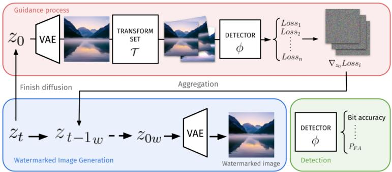  
Figure 1: System-level diagram of the proposed guidance-based watermarking method.

1. Our method is the first to embed the watermark during the diffusion process itself with the use of guidance

2. It does not necessitate any retraining of the diffusion model.

3. It inherits from the robustness of the watermark detector, but can also improve it against new targeted attacks without retraining the detector.

4. It strikes a balance between complete modification of the semantic content (seed-based schemes) and the addition of an invisible signal (VAE-based and post-hoc schemes).

## 2 RELATED WORK

## 2.1 DIFFUSION MODELS

Diffusion has emerged as a powerful framework leveraging iterative denoising to generate high-quality images. Starting from a forward process gradually corrupting data with Gaussian noise:

$$
q (z _ {T} \mid z _ {0}) = \prod_ {t = 1} ^ {T} q (z _ {t} \mid z _ {t - 1}), \quad \text { with } \quad q (z _ {t} \mid z _ {t - 1}) = \mathcal {N} (z _ {t}; \sqrt {1 - \beta_ {t}} z _ {t - 1}, \beta_ {t} I),\tag{1}
$$

where $\beta _ { t }$ controls the noise schedule, the Denoising Diffusion Probabilistic Model (DDPM (Ho et al., 2020)) learns a reverse process to iteratively denoise through parameterized transitions:

$$
p _ {\theta} (z _ {t - 1} \mid z _ {t}) = \mathcal {N} (z _ {t - 1}; \mu_ {\theta} (z _ {t}, t), \Sigma_ {\theta} (z _ {t}, t)).\tag{2}
$$

Denoising Diffusion Implicit Models (DDIM (Song et al., 2021)) extends this framework by introducing non-Markovian sampling, enabling deterministic generation through an ODE-like process:

$$
z _ {t - 1} = \sqrt {\bar {\alpha} _ {t - 1}} \left(\frac {z _ {t} - \sqrt {1 - \bar {\alpha} _ {t}} \epsilon_ {\theta} (z _ {t} , t)}{\sqrt {\bar {\alpha} _ {t}}}\right) + \sqrt {1 - \bar {\alpha} _ {t - 1}} \epsilon_ {\theta} (z _ {t}, t),\tag{3}
$$

where $\begin{array} { r } { \bar { \alpha } _ { t } = \prod _ { s = 1 } ^ { t } ( 1 - \beta _ { s } ) } \end{array}$ . For the sake of simplicity, we omit the user prompt conditioning $\epsilon _ { \theta } .$ . Subsequent advancements improve efficiency through latent space optimization balancing computational cost with perceptual quality (Dhariwal & Nichol, 2021; Nichol & Dhariwal, 2021). Modern image generators are Latent Diffusion Model (LDM) working in a latent space . From the initial vector $z _ { T } \in { \mathcal { Z } }$ drawn as a white Gaussian vector, the variational auto-encoder (VAE) transforms the final latent $z _ { 0 } \in \mathcal { Z }$ into an image $x _ { 0 } = \mathrm { V A E } ( z _ { 0 } )$ in the image space $\mathcal { X } .$

## 2.2 GRADIENT-BASED GUIDANCE

Gradient-based guidance mechanisms in diffusion models enable precise control over generation by incorporating external signals through backpropagated gradients during the denoising. Introduced by Dhariwal & Nichol (2021), this approach modifies the sampling trajectory using auxiliary objectives, such as classifier scores or perceptual losses. For instance, Jeanneret et al. (2022) implement gradient-based guidance to steer the diffusion process toward generating counterfactual examples to explain the prediction of a given classifier. Given a query image, the goal is to make the diffusion model generate an image as close as possible to the query but classified differently.

Our work is inspired by this trend, considering that a watermark decoder is indeed a classifier. Yet, we do not have a query image to start with, but a user prompt. We include an augmentation layer to gain robustness, a concept irrelevant for counterfactual examples.

## 2.3 WATERMARKING IMAGES GENERATED BY DIFFUSION MODELS

Post-hoc Traditional image watermarking embeds a watermark signal into an original image (Cox, 2008). In zero-bit watermarking, the detector decides whether the watermark is present or absent, while in multi-bit watermarking, the decoder retrieves the hidden binary message from the image under scrutiny. Recent advancements leverage the capabilities of a pair of deep neural networks to embed and detect/decode the watermark: The foundational HiDDeN framework of Zhu et al. (2018) established such an end-to-end pipeline inspiring subsequent adaptations such as TrustMark (Bui et al., 2023), VideoSeal (Fernandez et al., 2024a), or InvisiMark (Xu et al., 2025). The training minimizes a loss combining a perceptual distance between the original and watermarked images with a multi- or zero-bit classification loss. An augmentation layer distorts the watermarked image before passing it to the detector/decoder in order to improve the robustness.

Traditional watermarking is a communication channel through a host content, whose theoretical pillar is based on the work of Costa (1983) establishing the capacity of a side-informed communication scheme. Its main message is that the original image should not be seen as a source of noise limiting the capacity of the hidden communication channel, but as a side-information known while emitting the watermark signal. Yet, it is difficult in practice to be sure that the host image is not interfering with the watermark; especially in zero-bit watermarking (Comesana et al., 2010; Furon, 2017).

Post-hoc means that the generated image is the original image forwarded to a traditional watermarking scheme before being returned to the user. The main weakness is that it is not specific to generative AI. Although these methods demonstrate progress in robustness, they operate as external add-ons rather than integral components of the generative process.

In-generation Stable-Signature pioneered the in-generation approach by merging the final step of the Stable Diffusion model, i.e. the VAE, with a post-hoc watermark embedding (Fernandez et al., 2023). To do so, it fine-tunes the VAE using a loss combining a perceptual distance between the images generated by the new and the original VAE together with a loss on the decoded message when the generated image goes through a given pre-trained watermark decoder.

In stark contrast, Wen et al. (2023) claim that there is no such thing as an original image in GenAI watermarking. The user will never see the image generated without a watermark. The model is sampling images not related to any reference image; therefore, controlling the distortion introduced by the watermark, like in post-hoc watermarking or Stable Signature, is a meaningless constraint.

A second difference is that Wen et al. (2023) embed the watermark signal before the diffusion process: Tree-Rings crafts a seed zT in the latent space with a secret pattern. A third difference is that Tree-Rings first defines the way to sample watermarked images, and then designs a possible detector. From an image under scrutiny, the detector first estimates the seed by inverting the diffusion process and computes the distance to the secret pattern. The image is deemed watermarked if this distance is below a given threshold. It offers fair robustness against geometric attacks by enforcing some structure in the secret pattern. Yet, our appendix C shows that the false alarm rate is not under control.

Yang et al. (2024b) improve this idea in several aspects: First, Gaussian Shading takes care of crafting seeds following a Gaussian distribution as required by many diffusion models. It is a multibit watermarking with excellent robustness against valuemetric attacks thanks to a repetition error correcting code. However, it is not robust to geometric attacks.

Huang et al. (2025) notice that the semantic content of the generated image changes with the strength of the Tree-Ring watermark. Their proposal, RoBIN, postponed the watermark embedding to an intermediate step within the diffusion process. This makes a compromise between maintaining the semantic of the image (unlike Tree-Ring) while not caring about the norm of the additive watermark signal (unlike post-hoc and Stable Signature). The main problem is that, similarly to Tree-Ring, the false positive rate is high and does not come with a theoretical guarantee.

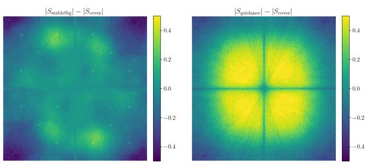  
Figure 2: Differences of (log)-spectrum of generated images with and without watermarking. Left: Embedding by the VAE (Stable Signature Fernandez et al. (2023)). Right: Embedding during the diffusion (Ours). Appendix A details the computation of these spectrums. Stable-Signature embeds a signal in a specific frequency band, whereas our method distributes the signal over the full spectrum.

## 3 MOTIVATIONS

We borrow from Stable Signature the idea that the decoders of traditional watermarking schemes are quite robust thanks to the augmentation layer considered during their training. Moreover, some designs take great care of controlling the false alarm rate (see, for instance, (Fernandez et al., 2023, Fig. 12)). Therefore, these are good and sound starting points.

However, Stable Signature requires fine-tuning the VAE, which acts like an advanced upscaling: It upscales the latent representation to a large image and adds high-frequency details. Therefore, this in-generation watermarking technique focuses the watermark power on the high-frequency details. Figure 2 illustrates this fact on the left. The spectrum difference with and without Stable Signature watermarking shows the watermark energy spread in high frequencies. This explains the relatively low robustness of Stable Signature against low-pass filtering processes like JPEG compression. In contrast, our technique spreads the energy of the watermark all over the spectrum.

We also borrow from in-generation schemes the idea that watermarking should not be seen as the addition of a low-amplitude signal over an original image (Wen et al., 2023; Yang et al., 2024b). As such, PSNR is not an appropriate metric for GenAI watermarking. Yet, we agree with Huang et al. (2025) that the semantics of the generated image should not fluctuate due to the watermark.

In a nutshell, our goal is to sample images deemed as watermarked by a pre-trained detector. This conditioning of the sampling is made without any reference to an original image and as early as possible to plant the watermark in the semantic of the generated image.

## 4 OUR METHOD GUIDES THE DIFFUSION TO EMBED A WATERMARK

## 4.1 ASSUMPTIONS

The image generator is a Latent Diffusion Model defined by a latent space ${ \mathcal { Z } } ,$ , a number of diffusion steps $T$ with an associated scheduling $( \alpha _ { t } ) _ { t \in [ [ T ] ] }$ with $[ [ T ] ] = \{ 1 , \dotsc , T \}$ , a noise estimate model $\epsilon _ { \theta } : \mathcal { Z } \times [ [ T ] ]  \mathcal { Z }$ , and the function $\mathrm { V A E } : \bar { \mathcal { Z } }  \mathcal { X }$ converting latent vectors to images. The diffusion generates an image $x _ { 0 }$ from a seed z through the following abstract update process:

$$
\forall t \in [   [ T ]   ], z _ {t - 1} = \text { Diffusion } (z _ {t}, \epsilon_ {\theta}, t), \quad x _ {0} = \text { VAE } (z _ {0}).\tag{4}
$$

We keep the diffusion update mechanism Difusion abstract since our method does not depend on the specific choice of solver for the diffusion process: It estimates the noise of a latent $z _ { t }$ using $\epsilon _ { \theta }$ at timestep t, outputting a denoised latent $z _ { t - 1 }$ from this estimated noise.

The pre-trained watermark decoder/detector uses the extraction function $\phi : \mathcal { X } \to \mathbb { R } ^ { M }$ to compute M raw logits. This function is a deep neural network easily differentiable thanks to backpropagation. For decoding, the decoded bits are the sign of the logits: $\dot { \hat { m } } = \mathrm { s i g n } { \left( \phi ( x ) \right) }$ ), element-wise (Bui et al.,

2023; Fernandez et al., 2024a; Xu et al., 2025). M is thus the watermark length. From a binary message $m \in \{ 0 , 1 \} ^ { M }$ , the antipodal modulation outputs the vector $u _ { m } = - ( - 1 ) ^ { \overline { { m } } }$ component-wise, in $\mathbb { R } ^ { M }$ . For detection, the image x is deemed watermarked if the cosine similarity cos $( \phi ( x ) , u _ { m } )$ is above a threshold, with $u _ { m } \in \mathbb { R } ^ { M }$ a reference secret vector as in Fernandez et al. (2022).

A crucial assumption is that the extraction function provides a random feature $\phi ( X )$ with an isotropic distribution in $\mathbb { R } ^ { M }$ when applied on a random non-watermarked image $X ,$ , be it synthetic or real. This is approximately the case in Stable Signature as Fernandez et al. (2023) whiten $\phi ( X )$ with a PCA.

## 4.2 GUIDED-DIFFUSION FOR WATERMARKING

Our method resorts to conditional sampling as introduced by Dhariwal & Nichol (2021) for DDIM and extended to other solvers by Lu et al. (2022). The differentiable detector ϕ along with a differentiable loss function $L : \mathcal { Z } \to \mathbb { R _ { + } }$ guides the diffusion process. At each iteration, the estimated noise is modified by incorporating information from the gradient of the loss:

$$
\hat {\epsilon} (z _ {t}, t) := \epsilon_ {\theta} (z _ {t}, t) - \omega \sqrt {1 - \bar {\alpha} _ {t}} \nabla_ {z _ {t}} \log L (z _ {t})\tag{5}
$$

where ω is a scalar denoting the strength of the watermark guidance. This parameter must be carefully calibrated to ensure sufficient watermark detectability while maintaining image quality. The diffusion update is effectively replaced by $z _ { t - 1 } = \mathrm { D i f f u s i o n } \left( z _ { t } , \hat { \epsilon } , t \right)$

## 4.3 CHOICE OF THE LOSS FUNCTION

The loss function defined above is symbolic. In practice, it should depend on the message to be hidden (multi-bit) or the secret vector $u _ { m }$ (zero-bit) and on the vector extracted from the image generated from the latent $z _ { t }$ . In other words, from a latent $z _ { t } .$ , to gain access to the loss and its gradient, we complete the diffusion process from t to 0 and use the VAE, before applying the decoder/detector to the resulting image $x _ { 0 }$ , which we loosely denote as $x _ { 0 } ( z _ { t } )$ . To unify decoding (multi-bit) and detection (zero-bit), we propose the loss function $L : \mathcal { Z } \times \dot { \mathbb { R } ^ { M } } \to \mathbb { R } .$ +

$$
L (z _ {t}, u _ {m}) := 1 - \frac {u _ {m} ^ {\top} \phi (x _ {o} (z _ {t}))}{\sqrt {N} \| \phi (x _ {o} (z _ {t})) \| _ {2}} = 1 - \cos (\phi (x _ {o} (z _ {t})), u _ {m}).\tag{6}
$$

Our goal is to minimize the angle $\theta$ between $u _ { m }$ and $\phi \left( x _ { o } ( z _ { t } ) \right)$ . In multi-bit watermarking, the decoding is exact if this loss is lower than $1 - { \sqrt { 1 - M ^ { - 1 } } }$

In zero-bit watermarking, this loss can be related to the following quantity, known as the $p \mathrm { - }$ value in statistics under some assumptions detailed in App. C:

$$
p = \frac {1}{2} \left(1 \pm I _ {\cos^ {2} \theta} \left(\frac {1}{2}, \frac {(M - 1)}{2}\right)\right),\tag{7}
$$

with $\cos ( \theta ) : = 1 - L ( z _ { t } , u _ { m } )$ and $I _ { x } ( a , b )$ is the regularized incomplete beta function. The sign is positive if $\cos ( \theta ) > 0$ , negative otherwise. If a probability of false alarm $\mathrm { P _ { F A } }$ is required, the watermark is detected if the computed p-value is lower: $p < \mathrm { P _ { F A } }$ . Hence, minimizing the loss amounts to minimizing the p-value for a watermarked image, which in turn increases the probability to be correctly detected.

## 4.4 ROBUSTNESS AGAINST IMAGE TRANSFORMATIONS

Until now, we controlled the diffusion to minimize the decoding loss for the untouched generated image $x _ { 0 } .$ . A first enhancement minimizes the loss for an image modified with a chosen set $\tau$ of image transformations $T : \mathcal X \to \mathcal X$ , a.k.a. augmentations, ensuring a robust watermark. At each diffusion step, we compute the loss for an individual transformation $\bar { T }$ redefined as $L ( z _ { t } , u _ { m } ; T ) : =$ $1 - \cos ( \phi \left( T ( x _ { o } ( z _ { t } ) \right) ) , u _ { m } )$ . We compute the gradient for each new loss and aggregate them:

$$
\hat {\epsilon} _ {\mathcal {T}} (z _ {t}) := \epsilon_ {\theta} (z _ {t}) - \sqrt {1 - \bar {\alpha} _ {t}} \mathrm{Agg} \left(\{\nabla_ {z _ {t}} \log L (z _ {t}, u _ {m}; T) \mid T \in \mathcal {T} \}\right).\tag{8}
$$

The choice of aggregator $\mathrm { A g g }$ is crucial. The gradient directions might not agree for different transformations, leading to subpar performance if using a simple averaging. There exists an extensive literature addressing this problem in multi-task learning (Liu et al., 2021) and byzantine federated learning (Guerraoui et al., 2024). We settled on the well-known PCGrad algorithm (Yu et al., 2020).

One advantage of this approach is that can contain transformations for which the original feature extractor ϕ is not inherently robust. Section 5 shows this enhances the robustness of our method against these transformations without the need to retrain the watermark detector.

## 4.5 FAST AND CONTROLLED GUIDANCE FOR WATERMARKING

Our method is too computationally expensive, requiring $T ( T + 1 ) / 2$ diffusion and gradient propaga tion steps. This section suggests two simplifications. First, we turn on the watermarking guidance at a step $\dot { T } _ { w } , 0 < T _ { w } < T$ . Second, we simplify the gradient propagation along the backward diffusion by an identity transform. In other words, $\nabla _ { z _ { 0 } }$ replaces $\nabla _ { z }$ in equation 8.

Finding a suitable guidance strength is cumbersome as it depends on the watermark decoder ϕ and the image generator. We propose to clip the gradient norm in order to control the amount of watermark signal added at each diffusion step:

$$
\hat {\epsilon} (z _ {t}, t) := \epsilon_ {\theta} (z _ {t}, t) - \omega \sqrt {1 - \bar {\alpha} _ {t}} \frac {g}{\max (\eta , \| g \|)}, \quad \text { with } g = \operatorname{clip} _ {\tau} (\nabla_ {z _ {0}} \log L (z _ {t}))\tag{9}
$$

with η and τ to be chosen by the user – see Appendix B.

## 5 EXPERIMENTAL RESULTS

## 5.1 EVALUATION SETTING AND METRICS

Diffusion models We evaluate our method on three open-source diffusion models: Stable Diffusion 2 (Rombach et al., 2022a), Flux-1.0 dev (Black Forest Labs, 2024), and Sana (Xie et al., 2024). We use their implementation available on HuggingFace. Of note, SD2 uses the EulerDiscreteScheduler solver, whereas Sana and Flux use the FlowMatchEulerDiscreteScheduler. This outlines that our method is agnostic to the diffusion mechanism. The images are generated from 1,000 prompts from the Gustavosta/Stable-Diffusion-Prompts1 a series of prompts extracted from generated images which are meant to reflect more closely prompts used in a real environment. In Appendix D.2, we also report our experiments for 200 captions from the COCO dataset (Lin et al., 2014). Image size is set to 512 512, except for Flux, for which we chose 256 256 due to computation constraints.

Watermarking detectors We use the detectors from two state-of-the-art methods: Stable Signature (SSig, Fernandez et al. (2023)), and VideoSeal (VS, Fernandez et al. (2024a)). Their watermark lengths M equal 48 (SSig) and and 256 (VS). We chose these schemes because they can be used as multi-bit decoders or zero-bit detectors (See Sect. 4.1). Appendix C experimentally verifies that the returned p-value is valid.

Baselines We consider the in-generation schemes Tree-Ring (Wen et al., 2023) for zero-bit detection, and Gaussian Shading (Yang et al., 2024b) for multi-bit decoding (256 bits). We set the maximum ring diameter of Tree-Rings to 18 and 10 for SD2 and Sana respectively and use 3 and 10 latent channels for the embedding. Appendix C shows that the p-value computed by the original implementation of Tree-Rings is incorrect, and describes some corrections to get reliable p-values. Unfortunately, we did not succeed to fix RoBIN Huang et al. (2025) detector so we exclude it from our benchmark. We also compare with state-of-the-art post-hoc watermarking schemes VS as well as the in-generation strategy of SSig fine-tuning the VAE.

Our embedding We denote by G-VS and G-SSig our watermark embedding guiding the diffusion with the decoders above. The augmentations used in the gradient computation are: Identity, JPEG compression with QF 50 and 80, brightness +0.2, contrast 2, and central crop 50%. These are augmentations used at the training of the decoders, our guidance is thus aligned with their robustness. The watermark guidance parameters are found by a grid search to provide the best trade-off between watermark detectability and image quality. Appendix B details their values.

<table><tr><td>LDM</td><td>WM</td><td>FID (↓)</td><td>CLIP (↑)</td><td>PSNR (↑)</td><td>LPIPS (↓)</td><td>Capacity(↑)</td><td> $P_D @ 10^{-10} P_{FA}$ </td><td> $-\log_{10}(P_{FA}) @ P_D = 0.9$ </td></tr><tr><td>SD2</td><td></td><td>5.0</td><td>0.330</td><td></td><td></td><td></td><td></td><td></td></tr><tr><td>SD2</td><td>G-SSig</td><td>2.3</td><td>0.332</td><td>19.6</td><td>0.22</td><td>27.7 (+19.3)</td><td>0.99 (+0.5)</td><td>16.3 (+12.2)</td></tr><tr><td>SD2</td><td>G-VS</td><td>2.2</td><td>0.332</td><td>18.5</td><td>0.28</td><td>212.2 (+37.7)</td><td>1.0 (+0.0)</td><td>105.6 (+61.8)</td></tr><tr><td>Flux</td><td></td><td>9.5</td><td>0.271</td><td></td><td></td><td></td><td></td><td></td></tr><tr><td>Flux</td><td>G-SSig</td><td>9.3</td><td>0.271</td><td>25.4</td><td>0.07</td><td>26.6 (+16.6)</td><td>0.99 (+0.46)</td><td>16.6 (+12.8)</td></tr><tr><td>Flux</td><td>G-VS</td><td>9.3</td><td>0.269</td><td>26.0</td><td>0.07</td><td>192.5 (+16.0)</td><td>1.0 (+0.0)</td><td>72.8 (+24.3)</td></tr><tr><td>Sana</td><td></td><td>4.3</td><td>0.346</td><td></td><td></td><td></td><td></td><td></td></tr><tr><td>Sana</td><td>G-SSig</td><td>4.2</td><td>0.347</td><td>28.6</td><td>0.02</td><td>26.5 (+17.0)</td><td>0.98 (+0.41)</td><td>15.5 (+10.6)</td></tr><tr><td>Sana</td><td>G-VS</td><td>4.1</td><td>0.346</td><td>23.5</td><td>0.07</td><td>207.5 (+28.8)</td><td>1.0 (+0.0)</td><td>96.4 (+49.2)</td></tr></table>

Table 1: Comparison of image quality for several diffusion models and robustness metrics for our G-SSig and G-VS. In parenthesis, difference with their siblings SSig and VS. The robustness metrics are average over a set of attacks: Identity, JPEG compression with QF 50 and 80, brightness +0.2, contrast 2, and central crop 50%.

Quality The quality of the generation is gauged by the CLIP score between prompts and images (Hessel et al., 2021), and the Fréchet Inception Distance (FID) (Heusel et al., 2017) between generated images and 5, 000 images from the COCO dataset. The watermark should not spoil these metrics. We also provide the PSNR and LPIPS score (Zhang et al., 2018) between the images generated with and without watermark, although these metrics are not suitable for generative AI (Sec. 2.3).

Robustness or multi-bit decoding, the robustness is measured via the Random Coding Union (RCU) bound (see Eq.(162) in (Polyanskiy et al., 2010)). We embed random binary messages and measure the Bit Error Rate $\rho$ at the decoding side. Assuming a Binary Symmetric Channel with crossover probability $\rho ,$ the RCU is a lower bound on the maximum number of bits that can be reliably transmitted for a given watermark length M and a word decoding error probability ϵ set to $1 0 ^ { - 3 }$ . This allows for a fair comparison of decoders with different watermark lengths. For zero-bit detection, the robustness is measured by the detectability $\mathrm { P _ { D } }$ of the watermark at extremely low $\mathrm { P _ { F A } }$ We expose our method to reach this regime without many samples in Appendix C. For completeness we also report (log)-ROC for each method and model. The following figures and tables are extracted from the full body of experimental results given in App. D.1.

## 5.2 IMPACT ON THE QUALITY OF THE IMAGE GENERATION

The semantic and image composition with or without a watermark are very close for a suitable guidance strength. The visual differences are slightly different tone, colors, or shape (see Fig. 3). This is different from the noise-like watermark signal of post-hoc or SSig and also from the drastic change of composition of Tree-Ring (Wen et al., 2023, Fig. 2). Yet, too much guidance strength leads to artefacts as depicted in App. B.

The left part of Table 1 provides the quantitative assessment of the quality of generated images. As expected, the PSNR is relatively low whereas no differences are observed with respect to the FID and CLIP score. This confirms that the watermarked images are qualitatively similar to the non-watermarked images despite local differences for the same prompt and seed.

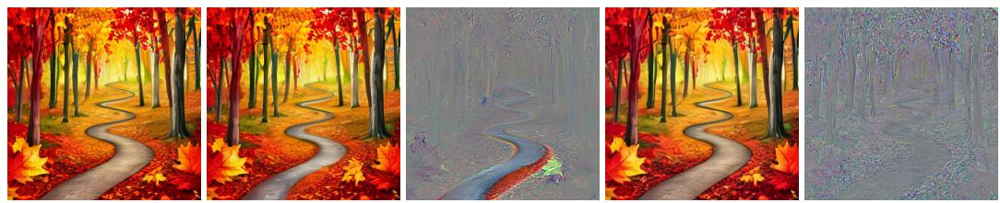  
Figure 3: From left to right: ‘A vibrant autumn forest with red, orange, and yellow leaves and a winding path’ generated by Sana (1) without watermarking, (2) watermarked with our G-SSig, (3) difference (2)-(1) , (4) watermarked with Stable Signature SSig, (5) difference (4)-(1)

## 5.3 COMPARISON WITH IN-GENERATION SCHEMES

Table 2 compares our performances with two in-generation schemes: Gaussian Shading for multi-bit decoding and Tree-Rings for zero-bit detection. By design, Gaussian Shading is quite robust to valuemetric attacks (an image processing which perturbs the pixel values) but absolutely not robust to geometric attacks (like shift, crop, rotation, . . . ). As for our method, we inherit from the robustness of the pre-trained decoder. For instance, both G-VS and G-SSig are robust to such a strong crop because the decoder saw it during its training. This allows our method to substantially surpass the performance of other in-generation schemes. The same holds for zero-bit detection. By design Tree-Rings is robust against rotation but not crop.

<table><tr><td>WM scheme</td><td>Identity</td><td>Contrast (x2)</td><td>JPEG (Q=50)</td><td>Gaussian Blur 3</td><td>Rotation 90</td><td>Crop 50%</td></tr><tr><td colspan="7">multi-bit decoding (capacity in bits)</td></tr><tr><td>Gaussian Shading</td><td>221</td><td>211</td><td>181</td><td>216</td><td>0</td><td>0</td></tr><tr><td>G-SSig</td><td>32</td><td>29</td><td>24</td><td>25</td><td>27</td><td>21</td></tr><tr><td>G-VS</td><td>222</td><td>219</td><td>197</td><td>220</td><td>194</td><td>206</td></tr><tr><td colspan="7">zero-bit detection (-log10(PFA) @ PD = 0.9)</td></tr><tr><td>Tree-Rings</td><td>11.7</td><td>6.5</td><td>4.3</td><td>9.1</td><td>0.8</td><td>0.4</td></tr><tr><td>G-SSig</td><td>21.9</td><td>19.8</td><td>14.7</td><td>16.6</td><td>17.4</td><td>11.4</td></tr><tr><td>G-VS</td><td>154.6</td><td>130.6</td><td>89.2</td><td>150.3</td><td>100.7</td><td>101.9</td></tr></table>

Table 2: Comparison with two in-generation schemes for Stable Diffusion v2.

Adversarial Attacks Adversarial attacks have demonstrated strong effectiveness against traditional in-generation, seed-based watermarking schemes. Figure 4 shows the results of three representative attacks, VAE purification (Liu et al., 2020; Abdelnabi & Fritz, 2021), regeneration (Nie et al., 2022), and the average attack (Yang et al., 2024a), applied to respectively 500, 500 and 50 images generated with G-VS, Tree-Rings, and Gaussian-Shading.

We perform VAE purification by applying in succession the encoding and decoding function of the original VAE of the diffusion model used to generate the image. The regeneration attack is performed by encoding the watermarking image, adding noise to the latent corresponding to a given step and finishing the diffusion process. For each image, we use 2,4,6,8 and 10 steps. The average attack is performed under a gray-box setting: for each watermarking scheme and a fixed key, we compute the average residual between a set of watermarked and non-watermarked images. Our guidance-based method is content-dependent as shown in Appendix D.3, unlike Gaussian-Shading and Tree-Rings. Consequently, the average residual for the guidance-based approach has lower amplitude than for the other two methods. To ensure a fair comparison, we enforce a constant PSNR across methods by normalizing the attacking signal. All other attacks are performed over images with variable keys.

Figure 4 shows that G-VS is always more robust than Tree-Rings, and particularly for the average attack. It also demonstrate empirically that Gaussian-Shading is a little more robust against regeneration and VAE purification due to the redundancy of the signal, but not at all against the average attack whereas G-VS is robust against the three studied attacks.

## 5.4 COMPARISON WITH POST-HOC WATERMARK EMBEDDING AND SSI G

Multi-bit performance The right part of Table 1 shows the robustness metric averaged over the following benchmark attacks: Identity, JPEG compression with QF 50 and 80, brightness +0.2, contrast 2, and central crop 50%.

Zero-bit performance we report the detectability at a low $\mathrm { P _ { F A } } = 1 0 ^ { - 1 0 }$ . In this regime, we double the performance of SSig . Since VS is already perfectly detectable in this regime, we provide a more fine-grained analysis in Figure 5. The (log)-ROC curves demonstrate a large gap in performance in favor of the guidance methods whatever the model and the method: for any arbitrary $\mathrm { P _ { F A } }$ , the detectability is always significantly higher. For instance, an absolute gain between 20% and 10% is always observed for G-VS compared to VS in the low $\mathrm { P _ { F A } }$ regimes. The case for SSig is even more clear cut: G-VS stays perfectly detectable even at $\mathrm { { P _ { F A } } }$ where SSig has zero detectability.

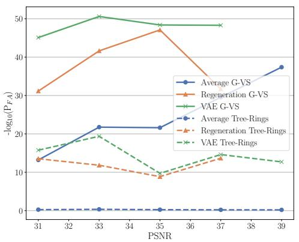

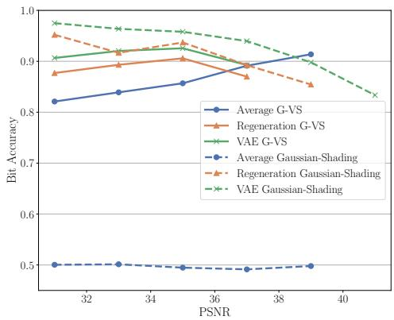  
Figure 4: Adversarial attacks applied to Sana images watermarked with Tree-Rings, Gaussian-Shading or $G { - } \nabla S$ . Regeneration attacks and VAE purification are computed over 500 images while the average attack is computed over 50 images. The mean $- l o g _ { 1 0 } ( P _ { F A } )$ @ $P _ { D } = 0 . 9$ and the mean bit accuracy are reported respectively for Tree-Rings and Gaussian-Shading.

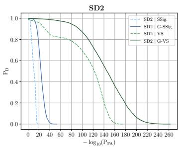

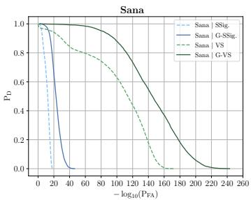

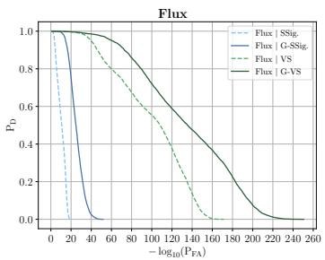  
Figure 5: Probability of detection $\mathrm { P _ { D } }$ of post-hoc and corresponding guided methods as a function of the $\mathrm { P _ { F A } }$ for different models. The curve is shown over all studied augmentations, with 1000 images generated form the Gustavosta/Stable-Diffusion-Prompts prompts for each augmentation.

Unknown augmentations So far, the watermarking schemes were benchmarked against known attacks, i.e. attacks used as augmentations during the training of the decoder. We investigates whether our method can improve the robustness against unknown attacks by encompassing them in the gradient computations. This avoids retraining a decoder with a new set of augmentations. It happens that SSig is not robust against a 90-degree rotation or a median filtering. Figure 6 shows that we drastically improve the performance by encompassing these attacks. In the original work, Stable-Signature was shown to be easily removable by passing the image through the original $\mathrm { V A E - a }$ simple purification attack. We show in Figure 7 that our method is robust to such attacks $" f o r f r e e "$ Indeed, since the gradient has to be back-propagated through the (unwatermarked) VAE, such attacks are implicitly within the transform set.

## 5.5 COMPUTATION COST

As hinted in Section 4.5, it is possible to apply guidance only during the last diffusion steps while remaining effective. The table 3 reports the performance of guided diffusion when applied for different numbers of steps. We report results with VS , as it is the best baseline detector, but we focus on comparing the computation cost with other in-gen watermarking methods. Overall, comparable performance to post-hoc methods can be achieved with 15 guidance steps, whereas 10 and 5 guidance steps are sufficient to outperform Gaussian-Shading and Tree-Rings respectively. It should be noted that seed-based methods require an inversion of the diffusion process for detection, increasing its cost compared to post-hoc methods. For both Gaussian-Shading and Tree-Rings, only 4 inverse diffusion steps are required for good detection on Sana and Flux. However SD2 requires 50 steps. Unlike these methods, ours does not require extra steps for decoding making it up to 50 times faster at detection time.

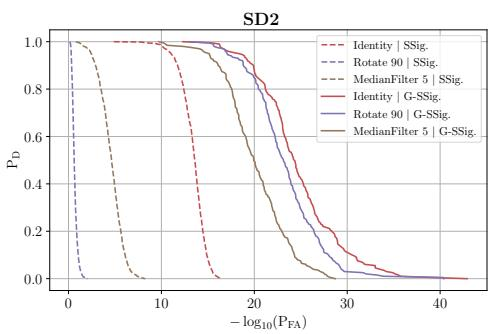

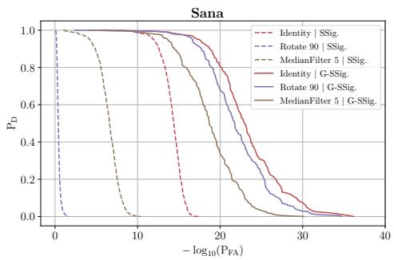  
Figure 6: Zero-bit detection on Stable-Signature with SD2 and Sana. The guidance patches a weakness of the decoder by encompassing an unknown attack in the gradient computation. The curves were computed over 200 images from Gustavosta/Stable-Diffusion-Prompts for each attack.

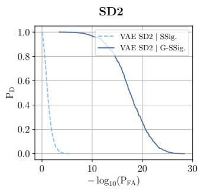

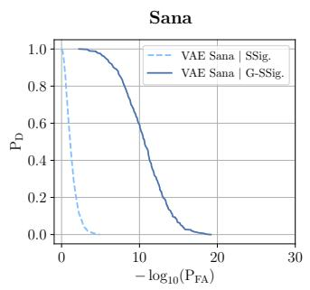

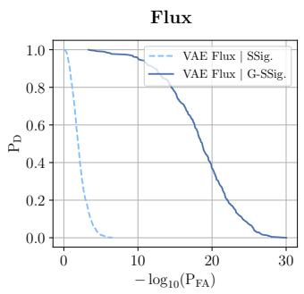

Figure 7: Probability of detection $\mathrm { P _ { D } }$ of post-hoc and corresponding guided methods as a function of the $\mathrm { P _ { F A } }$ for different models, under the attack using the original VAE to remove the watermark.The curves were computed over 200 images from Gustavosta/Stable-Diffusion-Prompts for each attack.

<table><tr><td colspan="2">WM scheme</td><td>Capacity(↑)</td><td> $-log_{10}(P_{FA}) @ P_D = 0.9(\uparrow)$ </td><td>Steps(↓)</td></tr><tr><td>G-VS</td><td></td><td>207.5</td><td>96.4</td><td>325</td></tr><tr><td>G-VS last 15</td><td></td><td>178.0</td><td>70.0</td><td>130</td></tr><tr><td>G-VS last 10</td><td></td><td>117.7</td><td>36.9</td><td>70</td></tr><tr><td>G-VS last 5</td><td></td><td>15.3</td><td>6.2</td><td>35</td></tr><tr><td>VS (post-hoc)</td><td></td><td>178.7</td><td>47.2</td><td>25</td></tr><tr><td>Tree-Rings (in-gen)</td><td></td><td>-</td><td>0.70*/11.0</td><td>25 +det</td></tr><tr><td>Gaussian Shading (in-gen)</td><td></td><td>119.0</td><td>0.37*/28.5</td><td>25 +det</td></tr></table>

Table 3: Comparison of the performances for several robustness metrics depending on the number of guidance step with Sana. The number of diffusion steps assume standard generation for VS. The parameters are the same used in Table 1 referenced in Table 4. Steps refers to the number of diffusion steps. +det indicates the additional diffusion steps required for detection. Since Gaussian-Shading and Tree-Rings are not robust to crop, we provide the $\mathrm { P _ { F A } }$ @ $\mathrm { P _ { D } }$ with (left) and without (right) the cropping augmentation.

## 6 CONCLUSION AND LIMITATIONS

This work introduces a new watermark embedding for latent diffusion models converting any post-hoc watermarking to in-generation without retraining of the model. Our method inherits the robustness from the baseline and can also improve it against attacks never seen by the decoder.

Limitations include a robustness that depends on the visual content of the image to be generated, and a generation time that needs 2 to 13 more steps ; however the decoding time is 50 times faster compared to other in-generation schemes such as Tree-Ring (Wen et al., 2023) and Gaussian Shading (Yang et al., 2024b).