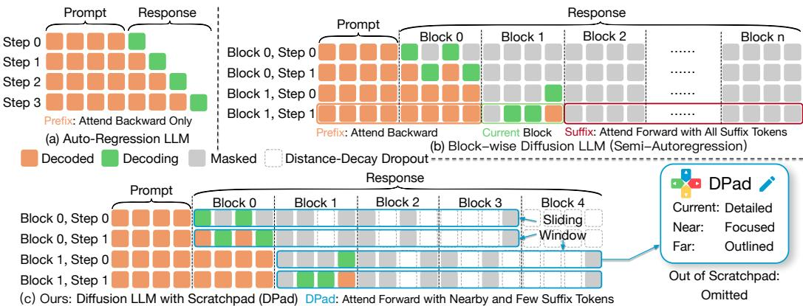
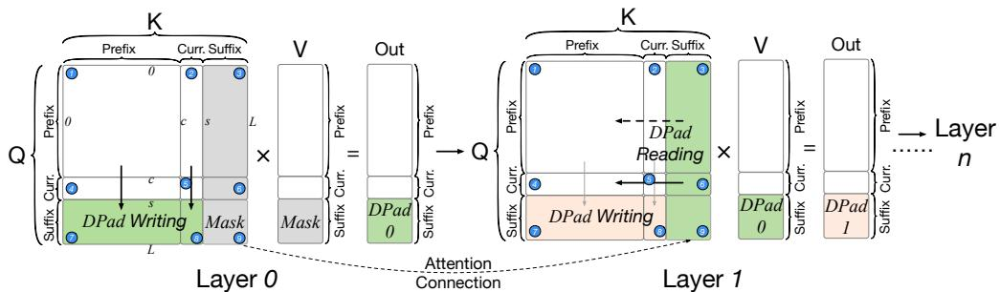
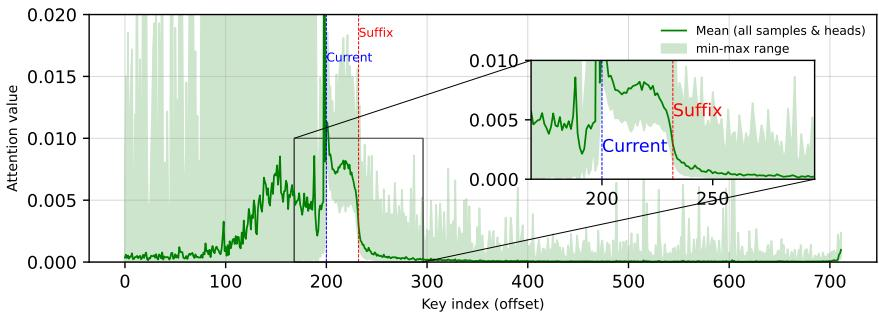
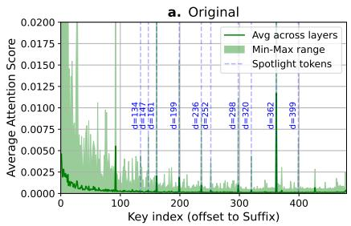
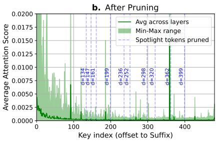
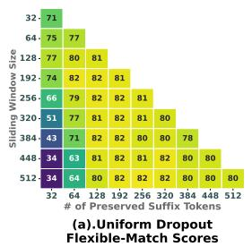
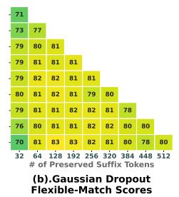
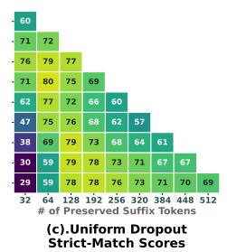
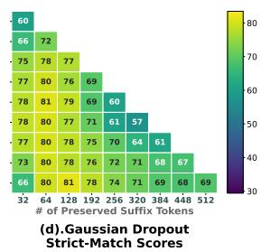

## ABSTRACT

Diffusion-based Large Language Models (dLLMs) parallelize text generation by framing decoding as a denoising process, but suffer from high computational overhead since they predict all future suffix tokens at each step while retaining only a small fraction. We propose Diffusion Scratchpad (DPad), a training-free method that restricts attention to a structured subset of suffix tokens, preserving fidelity while eliminating redundancy. DPad integrates two strategies: (i) a sliding window, which maintains a fixed-length suffix window, and (ii) distance-decay dropout, which deterministically removes distant suffix tokens before attention computation. This concise design is compatible with existing optimizations such as parallel decoding and prefix caching, and lends itself to a lightweight implementation. Comprehensive evaluations across multiple benchmarks on LLaDA and Dream models demonstrate that DPad delivers up to 61.4× speedup over vanilla dLLMs while maintaining comparable accuracy, highlighting its potential for efficient and scalable long-sequence inference. Our open-source implementation is available at https://github.com/Crys-Chen/DPad.git.

## 1 INTRODUCTION

Large Language Models (LLMs) have become foundational in numerous applications (Vaswani et al., 2017; Devlin et al., 2019; Brown et al., 2020; Ouyang et al., 2022), yet their deployment is often hindered by inference latency. As shown in Fig. 1 (a), the predominant autoregressive framework generates text one token at a time (Radford, 2018; Radford et al., 2019), imposing a sequential constraint that limits speed and scalability (Gu et al., 2018). This has driven interest toward parallel decoding strategies.

Diffusion-based Large Language Models (Li et al., 2022; Austin et al., 2021a; Lou et al., 2024; Shi et al., 2025; Israel et al., 2025) (dLLMs) offer a promising alternative by eliminating sequential dependencies. Formulating text generation as a parallel denoising process, they can predict entire sequences or generate text block-wise (i.e., semi-autoregressively) (Nie et al.; Ye et al., 2025), as in Fig. 1 (b). However, this parallelism often incurs high computational cost (Nie et al., 2025): at each step, predictions for all future (suffix) tokens are computed, though only a small fraction are retained. Consequently, although dLLMs can generate multiple tokens in parallel, the resulting throughput gains are undermined by a disproportionate increase in computation, posing a key bottleneck to their widespread adoption (Song et al., 2025b).

To further understand this inefficiency, we analyze the role of suffix tokens under the block-wise masking mechanism in dLLMs and reveal that suffix tokens act as a non-semantic information reservoir, or scratchpad. While this scratchpad collects contextual signals across Transformer layers to guide the generation of the current block, it is highly inefficient. We find that most suffix tokens are redundant and low-entropy (see Appx. A), a problem that worsens with distance as their attention scores decay sharply. This redundancy not only creates significant computational overhead but can also degrade generation fidelity.

  
Figure 1: Comparison of (a) autoregressive LLMs, (b) block-wise diffusion LLMs, and (c) our DPad. DPad restricts suffix attention via: (i) Sliding Window: fixed-length suffix window; (ii) Distance-decay Dropout: removes distant suffix tokens without computing attention scores.

Based on the above insights, we propose the Diffusion Scratchpad (DPad), which in the forward direction attends only to a small number of near-suffix tokens, as in Fig. 1 (c). It uses two suffix drop strategies: sliding window and distance-decay dropout. For the sliding window, inspired by prefix KV-cache optimizations (Beltagy et al., 2020; Xiao et al., 2023), we extend the idea to the suffix. Here, the suffix window has a fixed length and moves forward along with the current block, retaining only a limited number of nearby suffix tokens. In contrast to vanilla dLLMs, where suffix computation increases with the generation sequence length, our design keeps the cost bounded and significantly reduces suffix-related computation.

For the distance-decay dropout, suffix tokens are removed according to their distance from the current block: the farther they are, the higher the dropout ratio, until all tokens beyond the window are omitted. Unlike conventional attention-score pruning (Wang et al., 2021; Kim et al., 2022; Song et al., 2025a), which first computes attention scores and then prunes based on their magnitude, DPad predetermines a distance-decay sparse pattern for suffix tokens prior to model execution and eliminates them at the very beginning of each step. This further suggests that sparsity is an inherent property of suffix attention. Additionally, the method is extremely simple to deploy, requiring only a few lines of code to implement.

To illustrate the intuition behind DPad, we liken it to a real scratchpad used when writing a book, as shown in Fig. 1 (c, right). For the current chapter (i.e., block), the writer (dLLM) devotes the most attention, revising it multiple times, akin to denoising within a diffusion block. The upcoming chapter receives focused drafts for consistency, while much later chapters contain only brief outlines. Naturally, the “writer” should not, and indeed must not, fill all future chapters (all suffix tokens) with low-entropy, repetitive content merely to satisfy the fixed sequence length constraints of current dLLMs. Such uncontrolled filling distracts the “writer’s” attention and wastes storage and computation, making it neither sustainable nor scalable.

Finally, we emphasize that DPad is a training-free inference strategy that enables efficient, compact generation, overcoming the quality degradation from fixed sequence lengths in conventional dLLMs (Ye et al., 2025; Nie et al.). It delivers robust acceleration across all settings, achieving up to a 10.32× speedup on short sequences. As DPad is compatible with existing optimizations (Wu et al.; Liu et al.; Wei et al.), including prefix caching (Wu et al.) and dLLM-Cache (Liu et al.), its benefits compound for long-sequence generation. When combined with these methods, DPad achieves up to a 61.39× speedup on LLaDA-1.5/GSM8K (1024, 1-shot) while maintaining accuracy, highlighting its potential to unlock new frontiers in dLLM efficiency.

## In summary, our contributions are:

• We identify and formalize the Scratchpad mechanism in dLLMs, demonstrating that suffix tokens act as a dynamic, cross-layer reservoir (which we term an Attention Connection) that guides the denoising process.

• Through systematic empirical analysis, we are the first to reveal three key properties of suffix tokens: inherent sparsity, a distance-decay pattern, and position insensitivity, which expose a major yet overlooked inefficiency in dLLMs.

• We introduce the Diffusion Lottery Tickets (DLT) hypothesis for dLLM inference, positing that a sparse set of “winning” suffix tokens suffices for high-quality generation, and we frame DPad as a training-free method to discover such tickets on the fly.

• We propose DPad, a training-free method that applies distance-decay dropout to suffix tokens. This orthogonal design eliminates substantial redundancy and compounds with existing optimizations, achieving up to 61.39× speedup while preserving accuracy.

## 2 PRELIMINARY

## 2.1 FOUNDATIONAL PRINCIPLES OF DIFFUSION LARGE LANGUAGE MODELS (DLLMS)

For a generated sequence $\mathbf { x } = ( x _ { 1 } , \dots , x _ { L } )$ , dLLMs leverage a non-autoregressive process (Austin et al., 2021a; Shi et al., 2025; Lou et al., 2024). During training, the model learns to denoise a sample where tokens are masked. This involves two processes: (i) Forward Masking Process: This process systematically replaces a proportion of tokens in a clean text sequence $\mathbf { x } _ { \mathrm { 0 } }$ with a special [MASK] token (Nie et al., 2025; Nie et al.), similar to applying noise in a conventional diffusion model (Ho et al., 2020). The replacement is governed by a masking schedule where $t \in [ 0 , 1 ]$ represents the masked level, and individual tokens in the clean sequence, $x _ { 0 } ^ { i }$ are masked independently with a probability of t. (ii) Reverse Unmasking Process: The model pθ is trained to predict the original tokens given the partially masked sequence xt, thereby learning to approximate the true unmasking probability $q ( \mathbf { x } _ { 0 } | \mathbf { x } _ { t } )$ (Austin et al., 2021a; Lou et al., 2024). This is achieved by minimizing the negative log-likelihood over the masked tokens (Shi et al., 2025; Ouyang et al., 2022):

$$
\mathcal {L} (\theta) = - \mathbb {E} _ {t, \mathbf {x} _ {0}, \mathbf {x} _ {t}} \left[ \frac {1}{t} \sum_ {i: x _ {t} ^ {i} = [ \mathrm{MASK} ]} \log p _ {\theta} (x _ {0} ^ {i} | \mathbf {x} _ {t}) \right]\tag{1}
$$

## 2.2 INFERENCE AND SAMPLING IN DLLM

The inference process begins by initializing a sequence y through the concatenation of a prompt sequence r and L mask tokens, denoted as $\mathbf { y } _ { 0 } = \overline { { r } } \circ ( \mathsf { \Gamma } [ \mathrm { M A S K } ] ) _ { i = 1 } ^ { \bar { L } }$ . Let $M _ { s }$ be the set of indices corresponding to masked tokens at step $s ;$ initially, $\boldsymbol { M _ { 0 } } = \{ | \boldsymbol { r } | + 1 , \ldots , | \boldsymbol { r } | + L \}$ . The model then iteratively refines this sequence over steps $s = 1 , 2 , \ldots , S$ until $M _ { S } = \emptyset$ . At each intermediate step s, the model $p _ { \theta }$ computes a probability distribution $p _ { \theta } ( y _ { i } | y _ { s - 1 } )$ for every masked position $i \in M _ { s - 1 }$ . From these distributions, the most likely token predictions $\hat { y } _ { i }$ from vocabulary $V$ and their corresponding confidence scores $c _ { i }$ are determined:

$$
\hat {y} _ {i} = \underset {v \in V} {\operatorname{argmax}} p _ {\theta} (y _ {i} = v | \mathbf {y} _ {\mathbf {s} - \mathbf {1}}) \quad \text { and } \quad c _ {i} = p _ {\theta} (y _ {i} = \hat {y} _ {i} | \mathbf {y} _ {\mathbf {s} - \mathbf {1}}).\tag{2}
$$

A scheduling function $\mathcal { G } ( s , S )$ determines the number of tokens, $k _ { s }$ , to unmask. The set of indices to update, $U _ { s } ,$ , is chosen by selecting the $k _ { s }$ positions from $M _ { s - 1 }$ with the highest confidence scores. The new sequence $\mathbf { y } _ { s }$ is then formed by updating these selected masked position.

## 2.3 RELATED WORK ON DLLM ACCELERATION

Research in dLLMs has moved from fixed Top-k decoding to dynamic, confidence-aware unmasking, that greedily unmask all tokens above a confidence threshold, to reduce generation bottlenecks (Wu et al.; Wei et al.). A parallel focus is cache management to overcome the inapplicability of conventional KV caching for bi-directional attention. Optimizations include reusing the cache for tokens (e.g., prefixes) by observing their key and values ( (Wu et al.; Liu et al.) are stable across inference step, and dynamically evicting entries based on low attention score to further improve efficiency (Song et al., 2025a).

  
Figure 2: Attention score maps illustrating the Scratchpad mechanism in dLLMs. The attention matrix is divided into $3 \times 3$ blocks over $p r e f i x ,$ current, and $s u f f u x$ . Blocks 7 and 8 collect information from the prefix and current into the suffix at layer n, while Block 6 feeds this stored information back to the current block at layer (n+1).

## 3 METHOD

In this section, we begin by formalizing the Scratchpad mechanism in dLLMs, which underpins the role of suffix tokens as an information reservoir. We then introduce Suffix Dropout, which combines a fixed-length sliding window that moves with the current block to bound the number of attended suffix tokens, with a distance-decay scheme that progressively prunes more distant ones. Finally, we propose the Diffusion Lottery Tickets (DLT) hypothesis, which provides a principled lens for interpreting dropout in dLLMs.

## 3.1 SCRATCHPAD MECHANISM

We first revisit the role of suffix tokens in dLLMs. Due to the masking structure, suffix tokens carry no direct semantic information but instead serve as an information reservoir, aggregating signals propagated from prefix tokens across multiple Transformer layers. This latent memory, which we refer to as DPad (Diffusion Scratchpad), stabilizes the denoising process by providing contextual support for the current block.

As illustrated in Fig. 2 and the attention score maps, the token sequence can be partitioned into three contiguous segments: Prefix indices $[ 0 , c - 1 ]$ , current indices $[ c , s - 1 ]$ , and suffix indices $[ s , L - 1 ]$ The corresponding attention matrix is thus divided into $3 \times 3$ blocks. Among them, Blocks 6, 7, and 8 together define the scratchpad mechanism.

Considering only one head, at layer $n ,$ queries from prefix and current tokens attend to keys from the suffix region. Formally, the global attention scores are defined as

$$
A ^ {(n)} = \operatorname{Softmax} \left(\frac {Q ^ {(n)} (K ^ {(n)}) ^ {\top}}{\sqrt {d _ {k}}}\right) \in \mathbb {R} ^ {L \times L}.\tag{3}
$$

We can partition $A ^ { ( n ) }$ into submatrices corresponding to prefix $( P = [ 0 , c - 1 ] )$ , current $( C =$ $[ c , s - 1 ] )$ , and suffix $( S = [ s , L - 1 ] )$ . In particular,

$$
A _ {S, P} ^ {(n)} = A ^ {(n)} [ s: L, 0: c ], \qquad A _ {S, C} ^ {(n)} = A ^ {(n)} [ s: L, c: s ],\tag{4}
$$

represent the attention scores from suffix queries to prefix and current keys, respectively (Blocks 7 and 8 in Fig. 2). Multiplying these attention scores with the value matrix yields the actual outputs at suffix positions:

$$
H _ {S} ^ {(n)} = A _ {S, P} ^ {(n)} V _ {P} ^ {(n)} + A _ {S, C} ^ {(n)} V _ {C} ^ {(n)} + A _ {S, S} ^ {(n)} V _ {S} ^ {(n)}.\tag{5}
$$

Here, $H _ { S } ^ { ( n ) }$ denotes the hidden representations of suffix tokens after attention. This equation shows that suffix tokens integrate information from prefix and current regions, effectively serving as a $D P a d { - } n$ that records contextual information. After this aggregation, the outputs $H ^ { ( n ) }$ are processed by the subsequent linear transformations (e.g., feed-forward layers and residual connections), which operate independently on each token. At layer $( n + 1 )$ , this stored information can be retrieved by the current block through

$$
A _ {C, S} ^ {(n + 1)} = A ^ {(n + 1)} [ c: s, s: L ],\tag{6}
$$

  
Figure 3: Analysis of the suffix dropout strategy at the final layer 31 using LLaDA-1.5 on GSM8K with max length 512. We gather attention scores from 100 samples across all heads, focusing on current block queries (A[c:s, c-200:]). The plot shows the mean attention over key indices (green) with min–max range (shaded).

which corresponds to current-to-suffix attention (Block 6 in Fig. 2). This path enables the current block to reuse the information collected in the suffix at the previous layer. In practice, the influence of the suffix on the prefix (Block 3) is negligible (Wu et al.). Therefore, the essential interaction of the scratchpad mechanism lies in the current-to-suffix direction (Block 6), where the suffix serves as temporary memory to assist the ongoing denoising process.

Therefore, we conjecture that the role of suffix tokens resembles a residual connection (He et al., 2015), but specialized for attention, which we term an Attention Connection. Rather than directly propagating representations, the model compresses high-dimensional signals from both the prefix and the current tokens into the suffix, which is then re-injected into the current block at the subsequent layer. In this way, the suffix serves as a scratchpad that compacts contextual information and forwards it for cross-layer reuse in dLLMs. We provide more analysis about this mechanism in Appx. A.1

## 3.2 SUFFIX DROPOUT STRATEGIES

As discussed in Sec. 1, the scratchpad intuition does not require populating all suffix tokens, which is neither sustainable nor efficient. Empirically, we observe substantial redundancy among suffix tokens (Appx. A), motivating a structured dropout design. As an example, at the final layer 31, Fig. 3 shows a clear distance-dependent decay in attention: nearby tokens dominate, consistent with general attention patterns and prior work on prefix sliding windows (Xiao et al., 2023). We provide additional layer-wise attention visualizations in Appx. A.4.

Based on these findings, we propose two complementary suffix drop strategies, as illustrated in Fig. 1(c):

• (i) Sliding window with fixed-length to retain only a bounded number of near-suffix tokens;

• (ii) Distance-decay dropout that progressively prunes distant suffix tokens.

Both mechanisms are efficiently realized through a Gaussian sampling process, which simultaneously enforces a bounded window and distance-dependent decay.

Formally, for a suffix token at distance d from the suffix boundary, its retention probability $P ( d )$ is defined by the right half of a standard normal distribution with effective window size W:

$$
P (d) = a \cdot \frac {1}{\sigma \sqrt {2 \pi}} \exp \left[ - \frac {1}{2} \left(\frac {\frac {k \sigma}{W} \cdot d - \mu}{\sigma}\right) ^ {2} \right], 0 <   d \leq W,\tag{7}
$$

where $\mu = 0 , \sigma = 1$ , and the suffix boundary is the center of the Gaussian distribution. Two kσ hyperparameters, k and a, are introduced to control the distribution along the x- and y-axes: (1) W maps the window size W to kσ (e.g., for $W = 2 5 6$ , setting $k = 3$ ensures $d = 2 5 6$ corresponds to 3σ); (2) a scales the overall sampling magnitude vertically. This formulation ensures that tokens farther from the boundary are retained with exponentially decreasing probability, implemented via rejection sampling. More implementation details and a hyperparameter analysis are provided in Appx. B and Appx. D, respectively.

  
Figure 4: (a) Attention scores of suffix tokens paid by current block tokens $( A [ c ; s , s ; ] )$ across layers in LLaDA-1.5, showing overall decay with occasional spikes $( \mathrm { e . g . , d } = 1 9 9 , 2 9 8 , 3 6 2 )$ . (b) After forcibly pruning these spike positions, attention shifts to nearby tokens, indicating that adjacent positions can absorb suffix information (e.g., pruning token 362 shifts the spike to token 359).

As a result, suffix attention only needs to focus on nearby tokens, making the suffix dropout window decoupled from the overall sequence length. Unlike the vanilla setting, where the suffix grows with the generation sequence, our approach keeps it constant. This yields a clear computational benefit: suffix dropout effectively reduces suffix-related complexity by one dimension.

## 3.3 DIFFUSION LOTTERY TICKETS HYPOTHESIS

The analysis in Fig. 3 not only reveals the overall decay of current-to-suffix attention, but also occasional sharp spikes in the maximum values. These spikes cannot be predicted in advance and, in principle, pruning them could affect model accuracy. To investigate this, we conduct an additional experiment shown in Fig. 4. We first run dLLM inference for one step, then forcibly prune the top 10 highest-attention suffix tokens (“spotlight” tokens) occurring beyond the first 128 positions (e.g., at distances 199, 298, and 362). Surprisingly, pruning such distant suffix tokens, even those corresponding to large spikes, has little effect on model accuracy.

When these spikes are removed, the model shifts its attention to nearby suffix tokens, for example, the spotlight token at 362 in Fig. 4 (a) is replaced by increased attention at its neighbor token 359 in Fig. 4 (b), which effectively absorbs the lost information. This behavior is consistent with the strong generalization ability of diffusion models and the fact that suffix tokens are initialized without semantic content: through DPad mechanism, suffix tokens can dynamically learn and store information during inference. Consequently, information carried by distant suffix tokens appears largely local position-adaptive, and pruning spike positions has almost no impact on final accuracy, as further confirmed in our evaluation experiments, as shown in Table 1.

These observations resonate with the Lottery Ticket Hypothesis (LTH) (Frankle & Carbin, 2019), which posits that properly pruned sub-networks with their original initialization can match the performance of dense networks after training. We extend this intuition to dLLMs and propose the Diffusion Lottery Tickets (DLT) hypothesis: During inference, the suffix region contains redundant tokens, yet a sparse subset is sufficient to preserve semantic consistency and generation quality. Through DPad mech-

Table 1: Accuracy Score of LLaDA-1.5 (Length = 512).

<table><tr><td rowspan="2">Method</td><td colspan="2">GSM8K</td><td>HumanEval</td></tr><tr><td>Strict</td><td>Flex.</td><td>Score</td></tr><tr><td>Baseline</td><td>40.5</td><td>78.7</td><td>37.8</td></tr><tr><td>Top-10 Pruning</td><td>41.7</td><td>78.6</td><td>39.0</td></tr></table>

anism, this subset can be adaptively reorganized into “winning tickets” within the forward pass. In this view, suffix dropout becomes a training-free lottery ticket search, where Gaussian sampling selects a compact set of suffix tokens that carry the essential information for denoising in dLLMs.

This explains why suffix dropout can be applied a priori, without computing exact attention scores, and why it fundamentally differs from prefix cache pruning (Song et al., 2025a; Wang et al., 2021): Prefix tokens carry dense, position-bound semantic information and thus cannot be arbitrarily discarded, whereas suffix tokens act as a flexible, low-rank memory buffer.

Table 2: Consolidated performance of LLaDA-Instruct and Dream-Base on four benchmarks.

<table><tr><td rowspan="2">Benchmark</td><td rowspan="2">Method</td><td colspan="5">LLaDA-InstructEfficiency</td><td colspan="2">Accuracy (%)</td><td colspan="4">Dream-BaseEfficiency</td><td colspan="2">Accuracy (%)</td><td></td></tr><tr><td colspan="2">Latency(s)↓</td><td colspan="2">TPS↑</td><td> $\bar{\ell}/\ell_{\max}$ </td><td>Flexible↑</td><td>Strict↑</td><td colspan="2">Latency(s)↓</td><td>TPS↑</td><td> $\bar{\ell}/\ell_{\max}$ </td><td>Flexible↑</td><td>Strict↑</td><td></td></tr><tr><td rowspan="4">GSM8K4-shot</td><td>Vanilla</td><td>27.48</td><td>1.00×</td><td>8.44</td><td>1.00×</td><td>232 / 256</td><td>78.39</td><td>37.38</td><td>22.30</td><td>1.00×</td><td>11.43</td><td>1.00×</td><td>255 / 256</td><td>75.06</td><td>74.37</td></tr><tr><td>+DPad</td><td>18.35</td><td>1.50×</td><td>8.76</td><td>1.04×</td><td>161 / 256</td><td>78.54</td><td>63.84</td><td>10.27</td><td>2.17×</td><td>12.75</td><td>1.11×</td><td>131 / 256</td><td>75.28</td><td>75.06</td></tr><tr><td>+Par.</td><td>8.55</td><td>3.21×</td><td>27.14</td><td>3.22×</td><td>232 / 256</td><td>78.54</td><td>38.67</td><td>13.84</td><td>1.61×</td><td>18.43</td><td>1.61×</td><td>255 / 256</td><td>75.51</td><td>74.83</td></tr><tr><td>+Par.+DPad</td><td>6.64</td><td>4.14×</td><td>24.25</td><td>2.87×</td><td>161 / 256</td><td>79.76</td><td>64.97</td><td>5.24</td><td>4.25×</td><td>24.17</td><td>2.11×</td><td>127 / 256</td><td>74.83</td><td>74.75</td></tr><tr><td rowspan="4">MATH4-shot</td><td>Vanilla</td><td>25.40</td><td>1.00×</td><td>9.79</td><td>1.00×</td><td>249 / 256</td><td>33.58</td><td>8.42</td><td>21.01</td><td>1.00×</td><td>12.19</td><td>1.00×</td><td>256 / 256</td><td>34.06</td><td>37.76</td></tr><tr><td>+DPad</td><td>21.61</td><td>1.18×</td><td>9.75</td><td>1.00×</td><td>211 / 256</td><td>33.42</td><td>28.04</td><td>16.64</td><td>1.26×</td><td>15.33</td><td>1.26×</td><td>255 / 256</td><td>34.14</td><td>37.64</td></tr><tr><td>+Par.</td><td>9.91</td><td>2.56×</td><td>25.09</td><td>2.56×</td><td>249 / 256</td><td>33.40</td><td>8.76</td><td>8.82</td><td>2.38×</td><td>29.03</td><td>2.38×</td><td>256 / 256</td><td>35.12</td><td>38.62</td></tr><tr><td>+Par.+DPad</td><td>9.20</td><td>2.76×</td><td>22.93</td><td>2.34×</td><td>211 / 256</td><td>33.30</td><td>27.98</td><td>7.72</td><td>2.72×</td><td>33.04</td><td>2.71×</td><td>255 / 256</td><td>34.44</td><td>38.32</td></tr><tr><td rowspan="4">HumanEval0-shot</td><td>Vanilla</td><td>34.67</td><td>1.00×</td><td>13.64</td><td>1.00×</td><td>473 / 512</td><td>43.90</td><td>-</td><td>28.49</td><td>1.00×</td><td>17.93</td><td>1.00×</td><td>511 / 512</td><td>51.22</td><td>-</td></tr><tr><td>+DPad</td><td>27.41</td><td>1.26×</td><td>15.96</td><td>1.17×</td><td>438 / 512</td><td>47.56</td><td>-</td><td>8.20</td><td>3.47×</td><td>26.83</td><td>1.50×</td><td>220 / 512</td><td>51.22</td><td>-</td></tr><tr><td>+Par.</td><td>11.48</td><td>3.02×</td><td>41.40</td><td>3.04×</td><td>475 / 512</td><td>43.29</td><td>-</td><td>14.15</td><td>2.01×</td><td>36.11</td><td>2.01×</td><td>511 / 512</td><td>53.05</td><td>-</td></tr><tr><td>+Par.+DPad</td><td>9.14</td><td>3.79×</td><td>47.86</td><td>3.51×</td><td>438 / 512</td><td>46.34</td><td>-</td><td>4.06</td><td>7.01×</td><td>52.62</td><td>2.93×</td><td>214 / 512</td><td>52.44</td><td>-</td></tr><tr><td rowspan="4">MBPP3-shot</td><td>Vanilla</td><td>62.11</td><td>1.00×</td><td>4.82</td><td>1.00×</td><td>299 / 512</td><td>15.00</td><td>-</td><td>49.15</td><td>1.00×</td><td>10.42</td><td>1.00×</td><td>512 / 512</td><td>52.40</td><td>-</td></tr><tr><td>+DPad</td><td>15.89</td><td>3.91×</td><td>6.85</td><td>1.42×</td><td>109 / 512</td><td>40.40</td><td>-</td><td>41.36</td><td>1.19×</td><td>12.38</td><td>1.19×</td><td>512 / 512</td><td>52.60</td><td>-</td></tr><tr><td>+Par.</td><td>14.26</td><td>4.36×</td><td>20.99</td><td>4.36×</td><td>299 / 512</td><td>15.00</td><td>-</td><td>12.38</td><td>3.97×</td><td>41.36</td><td>3.97×</td><td>512 / 512</td><td>55.40</td><td>-</td></tr><tr><td>+Par.+DPad</td><td>6.02</td><td>10.32×</td><td>18.28</td><td>3.79×</td><td>110 / 512</td><td>39.40</td><td>-</td><td>9.86</td><td>4.98×</td><td>51.92</td><td>4.98×</td><td>512 / 512</td><td>54.80</td><td>-</td></tr></table>

## 4 EXPERIMENTS

## 4.1 EXPERIMENTAL SETUP

Models and Baselines. All experiments are conducted on an NVIDIA A100 80GB GPU. We evaluate DPad on a suite of representative open-source dLLMs: two variants of LLaDA (8B-Instruct and 1.5) (Nie et al.; Zhu et al., 2025) and Dream-v0-Base-7B (Ye et al., 2025). We compare our method against three baselines: the unmodified LLaDA (Nie et al.; Zhu et al., 2025) and Dream (Ye et al., 2025) backbones, denoted as Vanilla; the vanilla backbone augmented with parallel decoding (Wu et al.), denoted as +Par.; and a version implementing prefix caching (Wu et al.), denoted as PC.. Since our dropout already minimizes the computational cost of the suffix, we do not adopt the Dual Cache mechanism proposed in (Wu et al.).

The DPad strategy introduces three hyperparameters: a decay rate factor k, a magnitude scalar a, and a sliding window size. We tuned these on small subsets of each benchmark (see Sec. 4.3.2).

Unless otherwise specified, all experiments use a block size of 32, a batch size of 1, and a confidence threshold of 0.9 for parallel decoding.

Benchmarks and metrics. We evaluate on reasoning benchmarks (GSM8K (Cobbe et al., 2021), MATH (Hendrycks et al., 2021)) and code generation benchmarks (HumanEval (Chen et al., 2021), MBPP (Austin et al., 2021b)). Accuracy is reported with task-specific metrics (e.g., pass@1, flexible/strict-match). Efficiency is reported as (a) mean end-to-end latency per sample and (b) tokens-per-second (TPS). We also report the average generated length ¯ℓ relative to the maximum allowed sequence length $\ell _ { \mathrm { m a x } }$ as $\bar { \ell } / \ell _ { \mathrm { m a x } }$ to make length effects explicit.

## 4.2 MAIN RESULTS

Across all four benchmarks, DPad improves latency and achieves comparable or higher TPS relative to Vanilla, while preserving or improving accuracy, as shown in Tbl. 2. When combined with parallel decoding (+Par.), DPad achieves additional improvement beyond +Par. alone; results for LLaDA-1.5 are in Appx. C.1.

Efficiency. DPad contributes to latency gains through two mechanisms: (1) reduced suffix complexity, which shifts suffix computation from quadratic toward linear scaling; (2) more concise generations, as evidenced by the $\bar { \ell } / \ell _ { \mathrm { m a x } }$ metric. This conciseness is beneficial, as case studies in Appx. E demonstrate that suffix dropout suppresses the generation of tokens that play an auxiliary role and do not contribute significantly to reasoning.

Overall, focusing on latency as the primary efficiency metric, DPad yields 1.18×–3.91× speedups over Vanilla. With parallel decoding, total speedups reach 2.72×–10.32× relative to Vanilla. This complementarity arises because the two methods target orthogonal bottlenecks: DPad eliminates redundant KV-token computation, while parallel decoding mitigates dependency constraints. By combining these approaches, we exploit both finer-grained token pruning and safe multi-token prediction, yielding substantial efficiency gains.

In our analysis, we observe a subtle distinction between latency- and TPS-based efficiency metrics. While DPad consistently reduces per-sample latency, its TPS gains may appear less pronounced because it often encourages the model to generate more concise and complete responses, reaching the end-of-sequence token earlier. As discussed in Appx. E, this behavior reflects not a limitation but an improvement: the model terminates naturally rather than exhausting its context with low-quality continuations. However, when the generation length is substantially reduced, lower GPU utilization can mechanically decrease TPS. Since the extra tokens produced by baselines often carry low semantic value, we report raw throughput without post-processing. This also highlights a broader point: the community may need to reconsider throughput metrics and develop alternatives that better balance sequence length and accuracy, rewarding models that achieve comparable accuracy with meaningful generations.

It is also important to note that, to align with previous work, the benchmarks in this section focus on multi-shot, short-sequence generation. In these settings, the prompt constitutes the majority of the sequence, meaning suffix attention accounts for only a small fraction of the total computation. Per Amdahl’s law (Amdahl, 1967), the maximum achievable speedup is therefore inherently bounded. Despite this limitation, DPad consistently delivers stable latency improvements even without system-level optimizations. Its true potential emerges in low-shot, long-sequence settings (discussed in Sec. 4.3.1), where the suffix becomes a more significant computational component, allowing DPad to achieve substantial additional latency reductions.

Accuracy. In addition to improving inference efficiency, DPad also enhances accuracy across nearly all tasks for the LLaDA models (Tbl. 2 and Tbl. 6), thereby defying the typical trade-off between speed and accuracy. For instance, DPad yields substantial gains in strict-match accuracy on GSM8K (+26.46%) and MATH (+19.62%) for LLaDA-Instruct. This improvement in strict-match score is particularly noteworthy, as it highlights DPad’s ability to enhance in-context learning. The vanilla backbone typically exhibits low strict-match performance (e.g., only 37.38% on GSM8K for LLaDA-Instruct), since this metric requires the model not only to produce the correct final answer (Flexible-Match) but also to adhere to the specific reasoning format demonstrated in few-shot exemplars, as illustrated in the Appx. E (Fig. 16). We posit that failures in strict matching often stem from interference by distant suffix tokens, which introduce low-value or off-format patterns that distract the model and encourage verbose or poorly structured outputs. By reducing the influence of such suffix tokens and directing attention toward high-value, information-rich prefix exemplars, DPad enables the model to replicate the structured reasoning formats required by strict matching more faithfully. In addition, by suppressing redundant generations, DPad facilitates earlier convergence to concise, well-formatted outputs, further improving strict-match performance without altering model parameters.

By contrast, the Dream model shows less advantage, with accuracy broadly comparable to the baseline and fluctuating only within a narrow margin. We attribute this discrepancy to the models’ distinct training protocols. Since LLaDA is trained as a diffusion model from scratch, it learns to rely on the full suffix context during pre-training. Conversely, Dream is initialized from Qwen2.5 (Qwen et al., 2025), a pre-trained autoregressive model that has no exposure to suffix tokens. We therefore hypothesize that LLaDA’s native dLLM architecture is inherently more sensitive to the suffix context, allowing it to benefit more significantly from the regularization that DPad provides.

## 4.3 ABLATIONS AND ANALYSIS

## 4.3.1 MAXIMUM GENERATION LENGTH

To quantify efficiency gains in long-sequence generation, we analyze the speedups of various acceleration strategies on LLaDA-1.5/GSM8K (Tbl. 3). Our setup evaluates combinations of DPad, parallel decoding (+Par.), and prefix caching (+PC.) to disentangle the contribution of each technique. These findings are confirmed by a complementary analysis on the Dream-Base model (Appx. C.2.2).

  
Figure 5: Ablation Study on Sliding Window Size and Dropout Function for DPad on LLaDA-1.5/GSM8K (512, 4-shot). Heatmaps showing Flexible-Match Accuracy scores with (a) uniform and (b) Gaussian dropout, and Strict-Match Accuracy scores with (c) uniform and (d) Gaussian dropout, across varying sliding window sizes and number of preserved suffix tokens. The (tokens, window size) = (512, 512) configuration corresponds to the baseline, as it involves no token dropout.

Efficiency. We find that the acceleration benefits of DPad grow substantially with generation sequence length. As shown in Appx. C.1, for LLaDA-1.5 on GSM8K, improvements are modest at shorter sequence lengths (up to 1.51× under a 256-token limit). However, when the maximum length is extended to 1024 tokens (single-shot setting), standalone DPad achieves a dramatic 20.3× speedup. Finally, when combined with parallel decoding and prefix caching (Fast-dLLM), the efficiency gains compound, yielding an overall 61.39× speedup compared to vanilla LLaDA and a 5.21× improvement over Fast-dLLM alone. These results demonstrate that suffix dropout and parallel decoding

Table 3: Performance on LLaDA-1.5 with GSM8K (1024 tokens, 1-shot).

<table><tr><td>Method</td><td>Acc. (Flex. / Str.)</td><td>Lat.(s) / TPS</td><td>Speedup</td></tr><tr><td>Vanilla</td><td>78.17 / 48.98</td><td>127 / 1.55</td><td>1.00 $\times$ </td></tr><tr><td>+ DPad</td><td>78.77 / 74.07</td><td>6.28 / 18.4</td><td>20.3 $\times$ </td></tr><tr><td>+Par.</td><td>78.77 / 49.43</td><td>11.7 / 16.9</td><td>1.00 $\times$ </td></tr><tr><td>+ DPad</td><td>79.38 / 74.22</td><td>2.26 / 51.4</td><td>5.17 $\times$ </td></tr><tr><td>+Par. + PC.</td><td>78.77 / 51.63</td><td>10.8 / 18.2</td><td>1.00 $\times$ </td></tr><tr><td>+ DPad</td><td>77.10 / 70.66</td><td>2.07 / 55.5</td><td>5.21 $\times$ </td></tr><tr><td colspan="3">Overall (+Par.+PC.+DPad vs. Vanilla)</td><td>61.39 $\times$ </td></tr></table>

address orthogonal bottlenecks, and their combination enables significant improvements in longsequence generation. A deeper analysis of these effects is provided in Appx. C.2.1.

Accuracy. Low-shot settings further highlight DPad’s ability to preserve and even enhance model accuracy. Compared with Tbl. 6, the strict-match score of the baseline drops significantly when the shots reduces from 4 to 1 (from ∼60% to ∼50%), whereas DPad’s performance remains remarkably stable (dropping only from ∼78% to ∼74%). This resilience demonstrates that DPad substantially strengthens the model’s in-context learning capability, a significant achievement for a training-free method.

## 4.3.2 SLIDING WINDOW SIZE AND DROPOUT FUNCTION

We conducted an ablation study on LLaDA-1.5/GSM8K to determine the optimal sliding window size and dropout function for DPad, with results shown in Fig. 5.

Our analysis identifies a critical context window of 64-128 tokens immediately following the current block. The key principle for maximizing performance is to maintain a high density of preserved tokens within this critical window. Spreading a limited token budget (e.g., fewer than 128) thinly across a larger window was found to be counterproductive, significantly degrading accuracy.

The study also validates our choice of a Gaussian dropout function over a uniform baseline. While the two perform comparably with large token budgets, Gaussian dropout is consistently superior under low-budget conditions, especially when the sliding window is large. This is because it more efficiently allocates the limited token budget by prioritizing nearby tokens, a strategy that aligns with the consistent decaying patterns observed in Rotary Positional Embeddings (RoPE) (Su et al., 2021), attention scores (Fig. 4), and token confidence maps (Gong et al.).

Of course, Gaussian sampling may not be the optimal decay function, and other decay-based schemes (e.g., exponential, linear, or step-wise cutoff) remain to be explored. Nevertheless, in the training-free setting, we find that results are largely insensitive to the exact decay form, as long as the scheme emphasizes nearer tokens.

## 5 CONCLUSION

We addressed the high cost of full suffix attention in dLLMs—a key bottleneck caused by redundant computation—by introducing the Diffusion Scratchpad (DPad), a simple, training-free inference strategy. DPad leverages the inherent sparsity of suffix attention, combining a fixed-length sliding window with a distance-decay dropout that prunes low-value tokens a priori. This “winning ticket” approach yields up to a 61.4× speedup when combined with existing optimizations, without sacrificing accuracy. Our results establish DPad as a practical and scalable solution that helps advance dLLMs from a promising alternative to a viable foundation for future language technologies.

## ETHICS STATEMENT

This research focuses on improving the efficiency of diffusion-based large language models (dLLMs) through a training-free inference strategy (DPad). Our study does not involve human subjects, user data, or personally identifiable information. All datasets used in evaluation (GSM8K, MATH, HumanEval, MBPP) are publicly available and widely adopted benchmarks, cited appropriately in the paper.

Bias and fairness. As our method is applied to pre-existing models and datasets, any biases or limitations originate from the underlying training corpora of the base models and benchmarks. We do not introduce new datasets, but we acknowledge that accelerated inference could facilitate broader deployment of LLMs, which inherit and may propagate these biases.

Privacy and safety. Our work does not involve private data. The proposed method is model-agnostic and does not alter the underlying training distribution.

Dual use considerations. Improvements in inference efficiency may enable faster and more widespread use of LLMs. We encourage responsible application, with attention to fairness, transparency, and safety in downstream use.

## REPRODUCIBILITY

We provide all resources needed to reproduce our results. Implementation details, hyperparameters, and ablation setups are described in Section 3 and 4 and Appendices B and C. Specifically: (i) code and scripts for suffix dropout (DPad) and evaluation will be released with instructions for running on each benchmark; (ii) exact hyperparameter settings (sliding window size, decay rate, scaling factor) are reported in Section 4.1 and Appendix B; (iii) dataset usage (GSM8K, MATH, HumanEval, MBPP) follows standard publicly available versions with citations; (iv) experiments were run on NVIDIA A100 80GB GPUs, as noted in Section 4.1; (v) random seeds and evaluation commands are documented in the code release. An environment will also be provided as “requirements.txt” . All tables and figures can be regenerated directly from the released code and instructions, available as supplementary material.

## ACKNOWLEDGMENTS

This work was supported in part by NSF-2112562, NSF-2328805, and ARO W911NF-23-2-0224. The authors sincerely thank the anonymous reviewers for their constructive feedback and valuable suggestions that greatly improved the quality of this work.

## REFERENCES

Gene M Amdahl. Validity of the single processor approach to achieving large scale computing capabilities. In Proceedings ofthe April 18-20, 1967, spring joint computer conference, pp. 483– 485, 1967.

Marianne Arriola, Aaron Gokaslan, Justin T. Chiu, Zhihan Yang, Zhixuan Qi, Jiaqi Han, Subham Sekhar Sahoo, and Volodymyr Kuleshov. Block diffusion: Interpolating between autoregressive and diffusion language models, 2025. URL https://arxiv.org/abs/2503.09573.