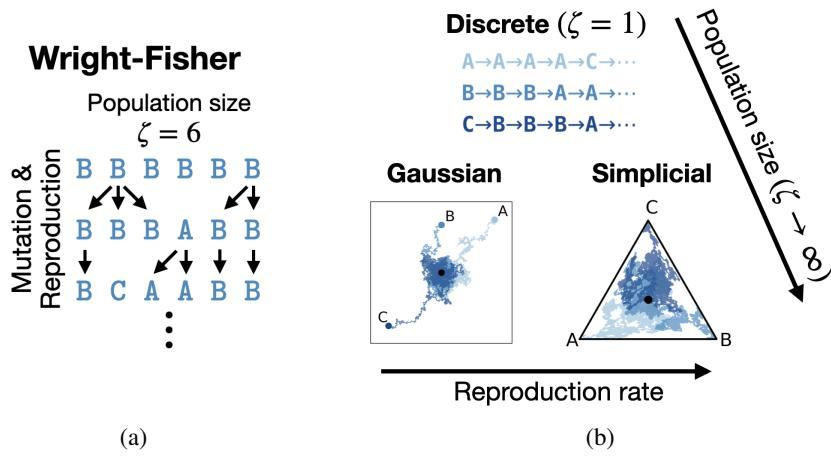
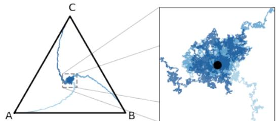
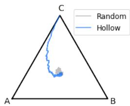
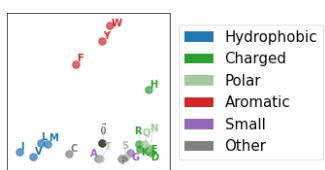
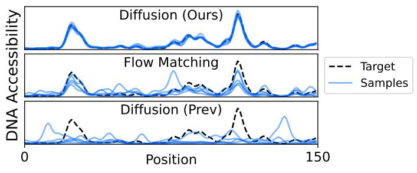
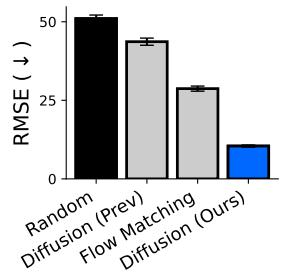
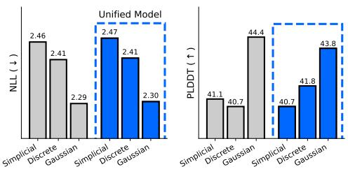
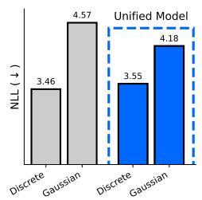
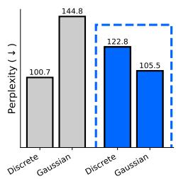

## ABSTRACT

To model discrete sequences such as DNA, proteins, and language using diffusion, practitioners must choose between three major methods: diffusion in discrete space, Gaussian diffusion in Euclidean space, or diffusion on the simplex. Despite their shared goal, these models have disparate algorithms, theoretical structures, and tradeoffs: discrete diffusion has the most natural domain, Gaussian diffusion has more mature algorithms, and diffusion on the simplex in principle combines the strengths of the other two but in practice suffers from a numerically unstable stochastic processes. Ideally we could see each of these models as instances of the same underlying framework, and enable practitioners to switch between models for downstream applications. However previous theories have only considered connections in special cases. Here we build a theory unifying all three methods of discrete diffusion as different parameterizations of the same underlying process: the Wright-Fisher population genetics model. In particular, we find simplicial and Gaussian diffusion as two large-population limits. Our theory formally connects the likelihoods and hyperparameters of these models and leverages decades of mathematical genetics literature to unlock stable simplicial diffusion. Finally, we relieve the practitioner of balancing model trade-offs by demonstrating it is possible to train a single model that can perform diffusion in any of these three domains at test time. Our experiments show that Wright-Fisher simplicial diffusion is more stable and outperforms previous simplicial diffusion models on conditional DNA generation. We also show that we can train models on multiple domains at once that are competitive with models trained on any individual domain.

## 1 INTRODUCTION

To generate high quality sequences conditioned on desired properties, practitioners build diffusion models of language, DNA, and proteins (Sahoo et al., 2024; Sarkar et al., 2024; Alamdari et al., 2023; Li et al., 2024). These models corrupt each letter in a sequence – the “forward" process – and train a model to reverse that corruption – the “backward” process. A model which has been trained to de-noise can be used for high-quality conditional generation (Wang et al., 2024b), for optimization (Gruver et al., 2023), and myriad other downstream tasks (Luo et al., 2022; Baron et al., 2025).

A practitioner has three main choices of forward process (Fig. 1b), each with their own strengths:

1. Discrete: occurs in the most natural domain (Campbell et al., 2022).

2. Gaussian: has more mature sampling and training procedures (Dieleman et al., 2022).

3. Simplicial: in theory inherits the continuous algorithms of Gaussian diffusion while in a natural space, but in practice suffers from numerical instability (Avdeyev et al., 2023).

Unfortunately, there is little theoretical infrastructure to compare these models, and thus practitioners have little tacit knowledge to rely on when selecting or designing a model. This gap in understanding is particularly evident in two basic comparison problems which have yet to be solved. First, despite models from the three frameworks achieving similar likelihood values, there is a belief that the “continuous-space likelihood is not directly comparable with discrete-space likelihood" (Avdeyev et al., 2023). Second, forward processes in each of these models are specified by hyperparameters with vastly different interpretations. It is unclear how to qualitatively compare the assumptions embedded into each set of hyperparameters across models.

  
Figure 1: Discrete, Gaussian, and Simplicial diffusion for discrete data are unified by Wright-Fisher diffusion. (a) Wright-Fisher diffusion with population size ζ “ 6, showing mutation and reproduction processes across generations. (b) The three diffusion methods emerge as different limits of Wright-Fisher: discrete diffusion corresponds to ζ “ 1, while Gaussian and simplicial diffusion arise as ζ Ñ 8 with zero and non-zero reproduction rates.

Here we address these theoretical and practical challenges by unifying these streams with a process from human population genetics – the Wright-Fisher (WF) model. Our contributions are as follows:

• We formally prove all three methods are instances of WF (Fig. 1). In particular discrete diffusion corresponds to the WF model with a population size of 1, and simplicial and Gaussian diffusion correspond to large population limits with and without reproduction.

• We use this connection to answer the two comparison questions above. Surprisingly, we show that likelihoods can only be compared in some cases, depending on a seemingly inconsequential parameterization choice introduced for only discrete diffusion models in Austin et al. (2021) which we call the hollow parameterization.

• We apply our theory to explain and solve the instability of simplicial diffusion by leveraging decades of mathematical genetics literature. We show that this stable simplicial diffusion is superior in conditional generation of DNA.

• We leverage our theory to show that a particular parameterization choice – the sufficientstatistic parameterization – allows one to train a single model that can perform diffusion on all three domains at test time1. We show in experiment that models trained this way are competitive with models trained on single domains. This removes the necessity for the practitioner to choose a particular model before training.

Our code is available at https://github.com/yucenli/unify-diffusion.

## 2 RELATED WORK

We discuss past unification theories and attempts at stable simplicial diffusion. In App. A we discuss related works in classical diffusion theory, and parameterizations of diffusion models.

Theories unifying discrete and continuous diffusion Winkler et al. (2024) indirectly used a result from (Stone, 1963) to connect the special case of one-dimensional, unbiased discrete diffusion to one-dimensional Gaussian diffusion. They use this observation to heuristically argue, or conjecture, the convergence of the backwards processes as well. Sahoo et al. (2025) suggested that by taking Gaussian diffusion and applying argmax, one recovers discrete diffusion. 2 They used this insight to answer the loss comparison problem by proving that the ELBO of discrete diffusion is always superior to that of continuous diffusion. Unfortunately, this is based on a mathematical error (details in App. B): by applying argmax to Gaussian diffusion one does not get a Markov process, a property which was crucial to their proof of the loss comparison question. In our approach, we build a mathematically rigorous foundation to compare these models.

Stable simplicial diffusion models Richemond et al. (2022) and Avdeyev et al. (2023) suggest diffusion on a simplex using two processes used in finance – the “Cox-Ingersoll-Ross process”, and its normalization onto the simplex, the “Jacobi process” – and Benton et al. (2024) suggest “Wright–Fisher diffusion” in a toy experiment. However these models struggle from numerical instability. One solution to this instability is to essentially perform Gaussian diffusion (see App. A). Another is to build flow-matching models on the simplex (Stark et al., 2024; Tang et al., 2025; Davis et al., 2024; Eijkelboom et al., 2024). However these sacrifice the ability to straightforwardly calculate a likelihood and access to many diffusion algorithms, such as classifier guidance.

## 3 BACKGROUND AND MOTIVATION

First we describe diffusion models for discrete data and the challenges unifying the frameworks.

## 3.1 DIFFUSION MODELS FOR DISCRETE DATA

We consider modelling a distribution $p ( x _ { 0 } )$ over a discrete space of size $B ,$ and will extend to sequences of discrete objects below. Our model will begin with a distribution that is easy to sample from, $q ( x _ { 1 } )$ , and then applies a stochastic process parametrized by θ from time 1 to 0. This produces a trajectory $q _ { \theta } ( \ r ( x _ { t } ) _ { t = 0 } ^ { 1 } )$ and we hope to pick θ so that $q _ { \theta } ( x _ { 0 } ) \sim p ( x _ { 0 } )$

Markov processes To generate training data to fit $q _ { \theta } ( ( x _ { t } ) _ { t = 0 } ^ { 1 } )$ , we take samples $x _ { 0 } \sim p ( x _ { 0 } )$ and evolve it according to a Markov process to get a trajectory $p ( \ r ( x _ { t } ) _ { t = 0 } ^ { 1 } )$ . We can train $q _ { \theta }$ on these trajectories by optimizing a negative ELBO

$$
\begin{array}{c} - \log q _ {\theta} (x _ {0}) \leqslant - \mathbb {E} _ {p ((x _ {t}) _ {t = 0} ^ {1} | x _ {0})} \log \frac {q _ {\theta} ((x _ {t}) _ {t = 0} ^ {1})}{p ((x _ {t}) _ {t = 0} ^ {1} | x _ {0})} \\ = - \mathbb {E} _ {p ((x _ {t}) _ {t = 0} ^ {1} | x _ {0})} \log \frac {q _ {\theta} ((x _ {t}) _ {t = 0} ^ {1} | x _ {1})}{p ((x _ {t}) _ {t = 0} ^ {1} | x _ {0} , x _ {1})} + \mathrm{KL} (p (x _ {1} | x _ {0}) | q (x _ {1})). \end{array}\tag{1}
$$

The time dilation function To make the second term of Eqn. 1 small we need $p ( x _ { 1 } | x _ { 0 } ) \approx q ( x _ { 1 } )$ Conveniently, applying a Markov process to $x _ { 0 }$ usually leads to $p ( x _ { t } | x _ { 0 } )$ converging to a stationary distribution $p ( x _ { \infty } )$ as $t \to \infty$ , a good choice for $q ( x _ { 1 } )$ . However our t is on the interval r0, 1s, so we compress $[ 0 , \infty )$ into r0, 1s: we pick an increasing “time dialation” function $\tau : [ 0 , 1 ] \stackrel { - } {  } [ \bar { 0 , } \infty )$ and simulate $x _ { t }$ so that it has had the Markov process applied to it for time time $\tau _ { t } .$ . In particular, if $\tau _ { 1 }$ is very large, $p ( x _ { 1 } | x _ { 0 } ) \approx p ( x _ { \infty } ) = q ( x _ { 1 } )$ $\tau _ { t }$ is a more convenient parametrization for our presentation than equivalent functions $\beta _ { t } = \dot { \tau } _ { t } , \alpha _ { t } = \exp ( - \tau _ { t } )$ in other works (Shi et al., 2024). Picking $\tau _ { 1 }$ very large, the second term of the ELBO can be made arbitrarily small, so we leave it out of the presentation below.

Matching forward and backward flow $q _ { \theta }$ is usually parameterized to take $x _ { t }$ , t and predict the $x _ { 0 }$ that generated $x _ { t }$ , that is, approximate $p ( x _ { 0 } \mid x _ { t } , t )$ ; we represent this prediction $\tilde { x } _ { 0 } = q _ { \theta } ( x _ { 0 } | x _ { t } , t )$ as a vector of probabilities over the B tokens $\begin{array} { r } { \sum _ { b } \tilde { x } _ { 0 , b } = 1 } \end{array}$ . Some rearrangement then allows one to rewrite the first term of Eqn. 1 as an expectation of a term $L$ that can be interpreted as the divergence between the “infinitesimal flow” forward $p$ and backward $q _ { \theta }$ at xt:

$$
E _ {t \sim \mathrm{Unif} (0, 1)} E _ {p (x _ {t} | x _ {0})} L (x _ {t}, t, x _ {0}, \tilde {x} _ {0}).
$$

Thus getting a stochastic estimate of the ELBO has $^ 3$ steps: (1) Sample noisy $x _ { t }$ by simulating the Markov process for time $\tau _ { t } , ( 2 )$ Predict de-noised $x _ { 0 }$ with $q _ { \theta } ( x _ { 0 } \mid x _ { t } , t )$ , and $( 3 )$ Estimate the ELBO by computing the particular form of $L$ .

Moving to multiple dimensions To model sequences of discrete objects $x _ { 0 } = x _ { 0 } ^ { 1 } \cdot \cdot \cdot x _ { 0 } ^ { D }$ , we simply apply the forward process to each position $x _ { 0 } ^ { d }$ independently. “Sample noisy $\boldsymbol { x _ { t } } "$ remains the same, repeated for every d. The “infinitesimal flow” for each position is also independent: the “Estimate ELBO” step also remains the same, repeated for every d and then summed across all d. Therefore, in the “Predict de-noised $\boldsymbol { x } _ { 0 } ^ { \ , , , }$ step we will predict $\tilde { x } _ { 0 } ^ { d } = q _ { \theta } ( x _ { 0 } ^ { d } | x _ { t } , t )$ for each d.

## 3.2 CHALLENGES COMPARING DOMAINS FOR DISCRETE DIFFUSION

Comparing diffusion models A practitioner much choose a forward process which will determine how they train their diffusion model. For discrete diffusion, the forward process is mutation defined with a rate matrix $\mathcal { L } ;$ the form for $L$ was derived in Campbell et al. (2022). This gives Alg. 1, where $\scriptstyle { { \vec { x } } _ { 0 } }$ is the indicator vector for the token $x _ { 0 } , \mathbb { D } ( \lambda _ { 1 } | | \lambda _ { 2 } ) = \lambda _ { 1 }$ log $\begin{array} { r } { \frac { \lambda _ { 1 } } { \lambda _ { 2 } } - \lambda _ { 1 } + \lambda _ { 2 } } \end{array}$ is the KL divergence between two Poisson distributions, $\begin{array} { r } { \hat { w } ( \tilde { x } _ { 0 } ) : = \sum _ { b } \tilde { x } _ { 0 b } \hat { w } ( b ) } \end{array}$ , and $\dot { \tau } _ { t }$ is the derivative of $\tau _ { t }$ . For Gaussian diffusion, the forward process is Brownian motion on embeddings em ${ \bf \Phi } _ { } > \left( x _ { 0 } \right) \in \mathbb { R } ^ { r }$ ; the form for L was derived in Ho et al. (2020). This gives Alg. 2. Now, how can a practitioner compare how well each model fits its data, and how can they leverage their expert knowledge when designing their forward process? Unfortunately there is little infrastructure for answering these questions.

Algorithm 1 ELBO for discrete diffusion

1: Sample  $t \sim \text{Unif}(0,1)$ 

2: Sample noisy  $x_{t}$ :

3: Sample  $x_{t} \sim \text{Categorical}(\vec{x}_{0}^{T} e^{\tau_{t} \mathcal{L}})$ 

4: Predict de-noised  $x_{0}$ :

5: Predict  $\tilde{x}_{0} = q_{\theta}(x_{0}|x_{t}, t)$ 

6: Estimate ELBO:

7:  $\hat{w}(b) = (\vec{b}^{T} e^{\tau_{t} \mathcal{L}})(1/\vec{b}^{T} e^{\tau_{t} \mathcal{L}})^{T}$ 

8:  $L = \sum_{b \neq x_{t}} \mathcal{L}_{b \to x_{t}} \dot{\tau}_{t} \mathbb{D}(\hat{w}(x_{0})_{bx_{t}} || \hat{w}(\tilde{x}_{0})_{bx_{t}})$ 

Algorithm 2 ELBO for Gaussian diffusion

1: Sample  $t \sim \text{Unif}(0,1)$ 

2: Sample noisy  $x_{t}$ :

3: Set  $x_{t} = e^{-\tau_{t}} \text{emb}(x_{0}) + \sqrt{1 - e^{-2\tau_{t}}} N(0, I)$ 

4: Predict de-noised  $x_{0}$ :

5: Predict  $\tilde{x}_{0} = q_{\theta}(x_{0}|x_{t}, t)$ 

6: Estimate ELBO:

7:  $L = \frac{\dot{\tau}_{t} e^{-2\tau_{t}}}{(1 - e^{-2\tau_{t}})^{2}} \| \text{emb}(x_{0}) - \text{emb}(\tilde{x}_{0}) \|^{2}$ 

8:

Likelihood comparison We would like to compare the ELBOs $\mathbb { E } [ L ]$ of discrete and Gaussian diffusion, but the later are infinity due to a singularity as t becomes small3. Practitioners must therefore choose a minimum ${ t _ { \operatorname* { m i n } } } ^ { 4 }$ . Formally this is equivalent to estimating an ELBO for log $p ( x _ { t _ { \operatorname* { m i n } } } )$ instead of $\log p ( x _ { 0 } )$ . However, $p ( x _ { t _ { \operatorname* { m i n } } } )$ is a continuous density, fundamentally a different object than the probability of a discrete object $p ( x _ { 0 } )$ . Paradoxically, the values of the ELBOs of the two models are often close suggesting they may nevertheless be formally comparable.

Hyperparameter comparison Discrete and Gaussian diffusion models are specified by hyperparameters $\mathcal { L }$ and emb with vastly different interpretations: a matrix whose entry $\displaystyle \mathcal { L } _ { b _ { 1 } \to b _ { 2 } }$ describes the rate at which $b _ { 1 }$ mutates to $b _ { 2 } ,$ , versus an embedding function emb that takes the alphabet into Euclidean space $\mathbb { R } ^ { r }$ for some $r$ (we write emb $( \tilde { x } _ { 0 } )$ as shorthand for $\begin{array} { r } { \sum _ { b } \tilde { x } _ { 0 , b } \mathrm { e m b } ( b ) ; } \end{array}$ ).

Stability of simplex diffusion Below we’ll also discuss simplicial diffusion which in principle combines the combines the strengths of discrete and Gaussian diffusion. In practice, it is numerically unstable and slow as Sample noisy $x _ { t }$ involves “sampling from Jacobi diffusion processes [which] is more expensive than commonly used SDEs”, and Estimate ELBO involves a calculation which $\mathbf { \tilde { \Sigma } } ^ { 6 6 } \mathrm { { a t } }$ very small t tends to become very large and cause numerical issues” (Avdeyev et al., 2023).

Practical unification Currently, practitioners must commit to a $q _ { \theta } ( x _ { 0 } \mid x _ { t } , t )$ trained on one these three modalities before training, restricting their access to downstream algorithms. Ideally they could avoid making this choice.

## 4 UNIFYING DISCRETE AND GAUSSIAN DIFFUSION

To build the infrastructure for comparing domains for discrete diffusion, we unify discrete and Gaussian diffusion in a broader framework. Our results lead to better understanding of loss and hyperparameter comparisons. In the following section we extend our framework to simplicial diffusion.

## 4.1 UNIFICATION RESULT

Our idea is to represent each dimension of a sequence with ζ copies to get a sequence of sequences.

ex. for $\zeta = 4 , x _ { 0 } = \tt { A } | \tt { C } | \tt { C } | \tt { T }$ is represented as AAAA|CCCC|CCCC|TTTT.

Then each letter in each sequence is evolved by the mutation matrix ${ \mathcal { L } } .$ When $\zeta = 1$ we get discrete diffusion and we show that as $\zeta \to \infty$ we get Gaussian diffusion. Below we discuss the case where $x _ { 0 }$ is a single letter / token, which can naturally be extended to a multi-dimensional diffusion model.

${ \vec { x } } _ { t }$ on the simplex We will ultimately arrive at a Gaussian limit in Euclidean space, but we first represent $x _ { t }$ on the simplex. Above, $x _ { t }$ was one of $B$ tokens; now it’s one of $B ^ { \zeta }$ sequences of $B$ tokens $x _ { t } ~ = ~ x _ { t } ^ { ( 1 ) } \cdot \cdot \cdot x _ { t } ^ { ( \zeta ) } .$ . It can be generated by sampling each $x _ { t } ^ { ( z ) } \sim$ Categorical $( \vec { x } _ { 0 } ^ { T } e ^ { \tau _ { t } \vec { \mathcal { L } } } )$ . In $\mathbf { A p p . }$ . E.1 we note that the loss and target $p ( x _ { 0 } ~ \mid ~ x _ { t } , t )$ do not depend on the order of $x _ { t }$ . Therefore we can represent $x _ { t }$ as a normalized vector of counts $\vec { x } _ { t , b } = \# \{ b$ in $x _ { t } \} / \zeta$ . In App. E.1 we derive the ELBO, giving Alg. 3 – differences to discrete diffusion in Alg. 1 are in blue.

Algorithm 3 ELBO for $\zeta$ discrete diffusion  
1: Sample $t \sim \mathrm{Unif}(0,1)$  
2: Sample noisy $x_t$:  
3: Sample $\vec{x}_t \sim \mathrm{Multinomial}(\zeta, \vec{x}_0^T e^{\tau_t \mathcal{L}})/\zeta$  
4: Predict de-noised $x_0$:  
5: Predict $\tilde{x}_0 = q_\theta(x_0 \mid \vec{x}_t, t)$  
6: Estimate ELBO:  
7: $\hat{w}(b) = (\vec{b}^T e^{\tau_t \mathcal{L}})(1/\vec{b}^T e^{\tau_t \mathcal{L}})^T$  
8: $L = \sum_{b \neq b'} \mathcal{L}_{b \to b'} \dot{\tau}_t \zeta \vec{x}_{tb'} \mathbb{D}(\hat{w}(x_0)_{bb'} || \hat{w}(\tilde{x}_0)_{bb'})$

## Gaussian limit as $\zeta \to \infty$ The main idea of

our proof below is that as $\zeta \to \infty ,$ , trajectories converge quickly to ${ \vec { \pi } } ,$ the stationary distribution of ${ \mathcal { L } } ,$ and behave like Gaussians near $\vec { \pi }$ because of the central limit theorem (Fig. 2). $\mathbf { A s } \zeta \to \infty$ we will zoom further and further into the neighbourhood of $\pi$ where the diffusion occurs – we move from diffusion on the simplex to diffusion in Euclidean space. Our proof extends previous results in one-dimension (Stone, 1963), but uses more modern machinery; interestingly, we see that in the multi-dimensional case, the relevant Gaussian diffusion occurs in a subspace determined by the first eigenspace of $\mathcal { L } . ^ { 5 }$

Theorem 4.1. (Formal statement and proofin App. E.2) Call $0 > - \lambda _ { 1 } > - \lambda _ { 2 } > . .$ . the eigenvalues ofL and $P _ { 1 }$ the projection onto the left eigenspace corresponding to $\lambda _ { 1 }$ . Without loss ofgenerality, assume $\lambda _ { 1 } = 1 ^ { 6 } .$ For each ζ pick time dilation $\begin{array} { r } { \tau _ { t } ^ { \zeta } = \frac { \bar { 1 } } { 2 } \log \left( \zeta e ^ { - 2 \tau _ { t } } - \zeta + 1 \right) } \end{array}$ and rescale $\vec { x } _ { t } ^ { \zeta } ~ =$ $\sqrt { \zeta - ( \zeta - 1 ) e ^ { 2 \tau _ { t } } } ( \vec { x _ { t } } - \vec { \pi } ) / \sqrt { \vec { \pi } } .$ . Define the embedding into RrankpP1q, $Q _ { 1 } \ = \ \mathrm { j } _ { 1 } ( \tilde { Q } _ { 1 } \tilde { Q } _ { 1 } ^ { T } ) ^ { - 1 / 2 } \tilde { Q } $ 1 where $\tilde { Q } _ { 1 } = \mathrm { d i a g } ( \vec { \pi } ) ^ { - 1 / 2 } P _ { 1 } \mathrm { d i a g } ( \vec { \pi } ) ^ { 1 / 2 }$ and $\mathrm { j _ { 1 } }$ is any isometry from Im $( \tilde { Q } _ { 1 } )  \mathbb { R } ^ { \operatorname { r a n k } ( P _ { 1 } ) }$

When ζ “ 1 we get discrete diffusion: $\tau _ { t } ^ { \zeta } = \tau _ { t }$ and $\vec { x } _ { t } ^ { \zeta }$ is only linearly transformed $( \vec { x } _ { t } - \vec { \pi } ) / \sqrt { \vec { \pi } }$

When $\zeta \to \infty ,$ we get Gaussian diffusion in thefirst eigenspace:

• Only the first eigenspace has signal: the component of $\cdot _ { x _ { t } ^ { \zeta } }$ in $\mathrm { K e r } Q _ { 1 }$ becomes independent of x0.

• The paths $( Q _ { 1 } \vec { x } _ { t } ^ { \zeta } ) _ { t \in ( 0 , 1 ) }$ converge in distribution to paths from Gaussian diffusion with time dilation $\tau _ { t }$ and embedding emb $\boldsymbol { \cdot } ( \boldsymbol { x } _ { 0 } ) = Q _ { 1 } ( \vec { x } _ { 0 } / \sqrt { \vec { \pi } } )$

• The ELBO in $A l g .$ . 3 converges to the ELBO in Alg. 2.

Proofidea: $\operatorname { A s } \zeta  \infty ,$ , by the law of large numbers, ${ \vec { x } } _ { t }$ approaches $\vec { x } _ { 0 } ^ { T } e ^ { \tau _ { t } \mathcal { L } }$ which itself goes to the stationary distribution of $\mathcal { L }$ . We can therefore decompose

$$
\vec {x} _ {t} - \vec {\pi} = \underbrace {\vec {x} _ {0} ^ {T} e ^ {\tau_ {t} ^ {\zeta} \mathcal {L}} - \vec {\pi}} _ {\text {signal}} + \underbrace {\vec {x} _ {t} - \vec {x} _ {0} ^ {T} e ^ {\tau_ {t} ^ {\zeta} \mathcal {L}}} _ {\text {noise}}.
$$

Figure 2: Discrete diffusion with a large population converges to Gaussian diffusion. With $\zeta = 1 0 0 0$ , we show example trajectories $( \vec { x } _ { t } ) _ { t }$ that converge to approximate Gaussians near ⃗π. therefore is what allows us to predict $x _ { 0 }$

The “noise” term is $\vec { x } _ { t } - \mathbb { E } \vec { x } _ { t }$ . Since $x _ { t }$ is an average of $\zeta$ samples, by the central limit theorem, it is approximately Gaussian with scale $\zeta ^ { - 1 / 2 }$ and independent of $x _ { 0 }$ . The “signal” term

The only relevant behaviour is that of the slowest-decaying eigenspaces of $\mathcal { L } \colon$ the top eigen-space represents the convergence to ⃗π and cancels with ´⃗π, the next one is $P _ { 1 }$ with eigenvalue ´1, and all others vanish quickly. Therefore the signal is approximately $e ^ { - \tau _ { t } ^ { \zeta } } P _ { 1 } \vec { x } _ { 0 }$ . This means

$$
\vec {x} _ {t} - \vec {\pi} \approx e ^ {- \tau_ {t} ^ {\zeta}} P _ {1} \vec {x} _ {0} + \frac {1}{\sqrt {\zeta}} \mathcal {N} (0, \Sigma) \text {   for   some   } \Sigma .
$$

Finally, choosing the right scaling and $\tau _ { t } ^ { \zeta }$ gives us Gaussian diffusion. Most of the formal proof involves checking regularity conditions. □

## 4.2 APPLICATION: UNDERSTANDING COMPARISONS OF LOSSES AND HYPERPARAMETERS

Loss comparison Thm. 4.1 suggests that there is virtually no difference to training a discrete diffusion model with $\zeta = 1 0 ^ { 1 0 0 }$ and training Gaussian diffusion with Alg. 2 on a computer, suggesting their ELBOs are comparable. Yet the limiting Gaussian ELBO is infinite! Fig. 2 suggests why: paths from ${ \vec { x } } _ { t }$ have two phases, a nearly deterministic phase at low t (Fig 2 left), and then a random phase (Fig 2 right). Diffusion models reversing these paths should therefore go through a random phase, until $p ( x _ { 0 } \mid \vec { x } _ { t } , t )$ becomes obvious, and then trace a deterministic path back to $x _ { 0 }$ . However, at initialization, $x _ { 0 }$ is “never obvious” to the neural network $q _ { \theta } ( x _ { 0 } \mid \vec { x } _ { t } , t )$ , leading to mismatches to the deterministic paths in samples (Fig. 3 “Random"). ${ \bf A } { \bf s } \ \zeta$ gets larger, the paths get more deterministic, causing the singularity in the limit.

  
Figure 3: The hollow parameterization leads to realistic reverse path samples. $\zeta = 3 0 0$

The practical solution is simple – weight the output of the neural network C

by the evidence for each $x _ { 0 } , q _ { \theta } ( x _ { 0 } \mid x _ { t } , t ) \propto p ( x _ { t } \mid x _ { 0 } , t ) q _ { \theta } ( x _ { 0 } )$ where $p ( x _ { t } \mid x _ { 0 } , t )$ “automatically handles” deciding when $x _ { 0 }$ is obvious $( \mathrm { F i g . ~ 3 ~ ^ { \circ } H o l l o w ^ { \circ } } )$ This was suggested in the appendix of Austin et al. (2021) as way to improve discrete diffusion models, but becomes important here as a way to build new Gaussian diffusion models with formally comparable likelihoods7. Amin et al. (2025) showed that in higher dimensions this becomes equivalent to using the “hollow” predictor8 $q _ { \theta } ( x _ { 0 } ^ { d } \mid x _ { t } , t ) \propto p ( x _ { t } ^ { d } \mid \bar { x _ { 0 } ^ { d } } , t ) q _ { \theta } ( x _ { 0 } ^ { d } | x _ { t } ^ { - d } , t )$ where $x _ { t } ^ { - d }$ is all positions except $d .$ In App. E.3 we formally prove that the hollow parametrization removes the singularity of the ELBO.

Figure 4: emb of amino acids from BLOSUM $\mathcal { L } .$ emb $( x _ { 0 } )$ from Thm. 4.1 for $\mathcal { L }$ from Amin et al. (2025).

Hyperparameter comparison Thm. 4.1 gives us a formula for emb determined by the slowest-decaying directions in L. App. E.4 also shows that every emb can be induced from some ${ \mathcal { L } } .$ Remarkably, this connection accommodates embeddings in different dimensions $\mathbb { R } ^ { r }$ : r is determined by the dimension of the dominant eigenspace of L. In Fig. 4 we show emb for the BLOSUM stochastic processes for amino acids, and see it clusters similar amino acids together. The practical implications are (1) one can sanity-check their designed $\mathcal { L }$ by plotting its induced embeddings, and (2) discrete diffusion offers a richer design space, as one can specify all the interacting eigenspaces of $\mathcal { L }$ rather than just the dominant one, emb.

## 5 UNIFYING SIMPLICIAL DIFFUSION

Now we add simplicial diffusion to our unification of discrete and Gaussian diffusion. Proving the equivalence of the forward process: we add reproduction to our population of ζ letters and simply refer to the well known result of Kimura (1955) from mathematical genetics. We also derive new results on the limit of the ELBO and explore our connection with theory of mathematical genetics; this will allow us to address the instabilities that plague simplicial diffusion models.

## 5.1 UNIFICATION RESULTS

The Wright-Fisher model We now allow our population of ζ to reproduce. The population is swapped with a new generation at rate $\zeta$ (that is, a new generation occurs at $\Delta \tau \sim \mathrm { E x p } ( 1 ) / \zeta )$ and at each generation we create ζ “children” which pick a parent uniformly at random. Between generations, individuals also mutate according L (Fig. 1a). We now ask what happens when $\zeta \to \infty$

The limit of $p ( \left( x _ { t } \right) _ { t } )$ Kimura (1955) was the first to derive the $\zeta  \infty$ limit of the stochastic process. Unlike the mutation-only case which zooms in to ${ \vec { \pi } } ,$ this limiting distribution has paths that travel throughout the simplex (Fig. 1b). This limit, often itself called “Wright-Fisher diffusion” is exactly the forward process in simplicial diffusion (Avdeyev et al., 2023). Details are in App. E.5.1. One biologically reasonable assumption past works make is a parent-independent mutation rate matrix, that is, $\dot { \mathcal { L } } = \psi \times \left( \mathbb { 1 } \vec { \pi } ^ { T } - I \right)$ for stationary distribution ⃗π and mutation rate $\psi > 0$ . This does not restrict the design space of simplicial diffusion, which is specified by an intensity parameter $\psi$ and stationary distribution ⃗π, so we make the same assumption.

The limit of the ELBO We derive the limit of the discrete diffusion ELBO. Remarkably, we get an objective that matches “score functions” ⃗s like that heuristically derived in Avdeyev et al. (2023). It is also mathematically equivalent to the expression in Eqn $2 \dot { 7 }$ of Benton et al. (2024) with two differences: (1) we avoid taking the derivative of the neural network, and (2) their expression differs by an unknown constant from the ELBO, while ours is directly comparable with ELBOs from other models.

Theorem 5.1. (Proof in App. E.5.2) $A s \zeta \to \infty ,$ , the discrete diffusion objective in Alg. 1 converges to the quantity in line 9 ofAlg. 4.

The main idea of the proof is an application of a Taylor expansion and Stirling’s approximation; the main challenge is handling of behaviour at the boundaries of the simplex and regularity conditions.

## 5.2 APPLICATION: FAST AND STABLE SIMPLICIAL DIFFUSION

We have unified simplicial diffusion with discrete and Gaussian diffusion, in particular allowing likelihood comparison, which will be crucial in the following section. Our unification also immediately suggests a connection to the mathematical genetics literature. We now apply the solutions from that literature to improve simplicial diffusion models. Many of the formulas are standard but long – we save their statement and experimental validation to App. C.

Algorithm 4 ELBO for simplicial diffusion. Our changes to Avdeyev et al. (2023) are coloured.
1: Sample  $t \sim \text{Unif}(0,1)$ 
2: Sample noisy  $x_{t}$ 
3: Sample  $m \sim A(\psi, \tau_{t})$  with Alg. 5; if  $\tau_{t} &lt; 0.05$ , use Alg. 6
4: Sample  $\vec{x}_{t} \sim \text{Dirichlet}(\psi\vec{\pi} + m\vec{x}_{0})$ .
5: Predict de-noised  $x_{0}$ :
6: Predict  $\tilde{x}_{0} = q_{\theta}(x_{0} \mid x_{t}, t)$ 
7: Estimate ELBO:
8: Compute  $\vec{s}(\vec{x}_{t} \mid x_{0}, t) = \nabla_{x_{t}} \log p(x_{t} | x_{0}, t)$  with Eqn. 2
9:  $L = \frac{\dot{\tau}_{t}}{2} \| \vec{s}(\vec{x}_{t} \mid x_{0}, t) - \vec{s}(\tilde{x}_{t} \mid x_{0}, t) \|_{\text{diag}(\vec{x}_{t}) - \vec{x}_{t}\vec{x}_{t}^{T}}^{2}$  (this is an ELBO); if  $\tau_{t} &lt; 0.05$ , use Eqn. 3

Sampling noisy $x _ { t }$ Avdeyev et al. (2023) samples $x _ { t }$ by costly and approximate simulation from a stochastic differential equation (SDE). Instead, the suggestively titled paper “Exact simulation of the Wright-Fisher diffusion” (Jenkins and Spanò, 2017) gives a fast exact formula for the marginals $x _ { t } .$ . The algorithm samples ${ \vec { x } } _ { t }$ from a Dirichlet that is centred at the stationary mutation distribution $\vec { \pi }$ when m “ 0 and becomes more concentrated around the signal $x _ { 0 }$ when m is larger. m itself is an integer sampled from a distribution $A ( \psi , \tau _ { t } )$ that represents, going back in time $\tau _ { t } ,$ how many ancestors the population descend from – it is small when $\tau _ { t }$ is large, when everyone descended from a handful of individuals from far back in time. Benton et al. (2024) proposed the same procedure, but applied it in a toy setting.

  
(a) Example samples

  
(b) Average error  
Figure 5: Improved simplicial diffusion performs accurate conditional DNA generation. We generate DNA samples of length 500 conditioned on accessibility with a classifier. (a) For an example target, we plot predicted accessibility profiles at the centre 150 positions of 5 example samples from each model. We smooth profiles with a bandwidth of 2. (b) For 1000 targets and 10 samples from each model, we plot the error between the predicted and target profiles and its standard error.

Computing the loss For the loss, Avdeyev et al. (2023) derived a likelihood that involved calculating the derivative the predictor $q _ { \theta } ( x _ { 0 } \mid x _ { t } , t )$ making it too expensive to train on. They instead suggest training a heuristically motivated loss matching the vector ⃗s to a ground truth. In Thm. 5.1 we recognize this loss as an ELBO and derive the appropriate scaling $\frac { { \dot { \tau } } _ { t } } { 2 }$ and metric diag $( \vec { x } _ { t } ) - \vec { x } _ { t } \vec { x } _ { t } ^ { T }$

Low t behaviour Both the simulation of $A ( \psi , \tau _ { t } )$ and the calculation of the gradients $\nabla _ { x _ { t } }$ log $p ( x _ { t } \mid$ $x _ { 0 } )$ involves an infinite series (Tavaré, 1984). Luckily the terms converge extremely fast. This is not true however at low $t ,$ which is the primary cause of the instability of simplicial diffusion. This instability is also well known in the genetics literature, with Griffiths (1984) emphatically stating that using the infinite series at low t “produces nonsense from a computer.”

The solution at low t is to replace the series approximation, which gets worse with lower t, with a central limit approximation for $A ( \psi , \tau _ { t } )$ (Griffiths, 1984; Jenkins and Spanò, 2017) that improves with lower $t ;$ this is analogous to how reflected diffusion models were made stable despite their own infinite series expansion with the same problem Luo et al. (2022). We picked the $\tau _ { t } < 0 . 0 5$ threshold as recommended by Jenkins and Spanò (2017). In App. C.3 we describe how to use this approximation to also stabilize the loss computation.

State of the art DNA generation conditioned on a classifier Simplicial diffusion models are state of the art tools for generating DNA conditioned on high-dimensional epigenetic properties (Avdeyev et al., 2023); however they have recently been surpassed by flow-matching models (Stark et al., 2024), which are more stable but sacrifice a closed-form ELBO and access to diffusion sampling algorithms. Given our stability improvements above, we expect to be able to generate higher quality sequences than previous methods. We fit the state of the art diffusion model (Avdeyev et al., 2023) and flow-matching model (Stark et al., 2024) to DNA data (B “ 4) of length $D = 5 0 0$ and generate samples conditioned on achieving target “DNA accessibility profiles.”

First we see our model leads to a much better fit of the data. The diffusion model from Avdeyev et al. (2023), was only able to achieve an average ELBO of 8 nats / position (12.7 before training), while a trivial model which predict uniform letters in each position achieves 1.39. In contrast, our model achieves an ELBO of 1.30. In Fig. 5 we also see our new model generates conditional samples with profiles that much better match the target. Experimental details are in App. F.

## 6 PRACTICAL UNIFIED DIFFUSION MODELS

Our results show that discrete, Gaussian and simplicial diffusion are three views of the same process. But which view should a practitioner choose for their particular downstream task? Unfortunately, there is limited theoretical infrastructure we can use to answer such a question.

  
(a) Protein likelihood and sample quality

  
(b) Language likelihood and sample quality  
Figure 7: The sufficient statistic parametrization enables a single model to perform competitive discrete, Gaussian, and simplicial diffusion. We compare individual models for each modality with a single unified model using the SSP. (a) We train on proteins and measure sample quality by predicted protein fold-ability (pLDDT). Each model was trained for the same amount of time. (b) We train on language and measure sample quality using the perplexity of a much larger language model. Each model was trained for 33 epochs.

Instead our theory provides a practical solution: leveraging our finding that these methods have comparable likelihoods, we show through a particular parameter choice (Fig. 6), one can train a single neural network that can perform diffusion on any domain at test time. In App. D we also show this parameterization will also allow us to make any diffusion model time-invariant, explaining and generalizing a celebrated property of masking diffusion.

## 6.1 THE SUFFICIENT STATISTIC PARAMETERIZATION (SSP)

The goal of a diffusion model is to predict $x _ { 0 } ^ { d } .$ To do so, one must integrate over the unseen $x _ { 0 } ^ { - d }$ weighted by their likelihood of producing the data $x _ { t } ^ { - d } \colon$

$$
p (x _ {0} ^ {d} \mid x _ {t} ^ {- d}) = \int p (x _ {0} ^ {d} \mid x _ {0} ^ {- d}) d p (x _ {0} ^ {- d} \mid x _ {t} ^ {- d}).
$$

$$
\begin{array}{c c} \text { Domain   param. } & \text { Unified   param. } \\ \hline \text { Discrete } \\ x _ {t} = B \\ \hline \vec {x} _ {t} = [ 0. 5, 0. 6, - 0. 4 ] & \overrightarrow {\phi} (\vec {x} _ {t}, t) \\ \hline \text { Gaussian } \\ \vec {x} _ {t} = [ 0. 3, 0. 6, 0. 1 ] & A \\ \hline \text { Simplicial } & B \\ \hline \end{array}
$$

We can summarize this “evidence” in the normalized vector $\vec { \phi } ( x _ { t } ^ { d ^ { \prime } } , t ) _ { b } \propto p ( x _ { t } ^ { d ^ { \prime } } \mid t , x _ { 0 } ^ { d ^ { \prime } } = b )$ (Fig. 6).

Some algebra shows that $\vec { \phi ^ { \mathrm { { * } } } } \mathrm { \mathbf { s } }$ are sufficient statistics, that is, they contain all relevant information about the diffusion process and t, leaving a regression task that invariant to both.

Figure 6: The sufficient statistic parameterization represents ${ \vec { x } } _ { t }$ from all diffusion models in the same space.

Proposition 6.1. (Proofin App. E.7) There is afunction $F ^ { d }$ , depending on $p ( x _ { 0 } )$ and not on the diffusion process or $t ,$ such that

$$
p (x _ {0} ^ {d} \mid x _ {t} ^ {- d}, t) = F ^ {d} (\vec {\phi} (\vec {x} _ {t} ^ {1}, t), \dots , \vec {\phi} (\vec {x} _ {t} ^ {D}, t)).
$$

Therefore we can parametrize our neural network $q _ { \theta } ( x _ { 0 } ^ { d } \mid x _ { t } ^ { - d } , t ) = F _ { \theta } ^ { d } ( \vec { \phi } ( \vec { x } _ { t } ^ { 1 } , t ) , \dots , \vec { \phi } ( \vec { x } _ { t } ^ { D } , t ) )$ q for a neural network $F _ { \theta } ^ { d }$ that tries to learn the “universal” $F ^ { d }$

## 6.2 APPLICATION: UNIFIED DIFFUSION MODELS

Practitioners must commit upfront to the domain their diffusion occurs. The SSP instead enables training a single neural network that can perform diffusion on any domain at test time: as long the target distribution $p ( x _ { 0 } )$ remains constant the optimum $F ^ { d }$ remains the same. Furthermore, we’ve shown above that the ELBOs of each modality are comparable, so we can train $F _ { \theta }$ by alternating minimizing the ELBO of a different modality in each batch.

We train discrete, Gaussian, and simplicial diffusion models on proteins and compare to a single model trained using the SSP which alternates between discrete, Gaussian, and simplicial training steps. We trained our models to approach the performance of state-of-the-art protein diffusion model DPLM (Wang et al., 2024a) in likelihoods (2.36) and a “foldability” metric for samples (45.2) (Amin et al., 2025). In Fig. 7 we see that a single SSP model trained on proteins for 48 hours is competitive in perplexity and sample quality with three single-domain models each trained for the same amount of time. We perform a similar experiment for discrete and Gaussian language models (simplicial diffusion models are challenging to scale to a large vocabulary size of $B \approx 3 \times 1 0 ^ { 4 } )$ and see similar results. We trained our language models with the same amount of training data as a state-of-the-art diffusion language model (Lou et al., 2023), matching its likelihood (SEDD uniform has an NLL of 3.70). Experimental details are in App. F, another downstream task is tested in App. G.1, and we also repeat these results on MNIST images in App. G.2.

## 7 CONCLUSION

Our theoretical and practical unification developed foundations that we used to improve simplicial diffusion and avoid the need to choose a specific model at train time. However, the theory suggests a number of other directions we have not yet explored.

Notable omissions from our presentation are reflected diffusion (Lou and Ermon, 2023), flow matching (Campbell et al., 2024), masking diffusion (Shi et al., 2024), and diffusion with insertions and deletions (Johnson et al., 2021). The later two can likely be easily accommodated with previous theories unifying masking and uniform diffusion on one hand (Amin et al., 2025), and substitution and insertion - deletion diffusion on the other (Johnson et al., 2021).

As well, our framework suggests new types of diffusion models “between” the three existing streams of diffusion which we only use as a lens for understanding existing models. Implementing these intermediate models may be of independent practical interest.

Finally, the SSP can be used to unify models beyond the three modalities. For instance it can be used to train models across hyperparameter settings, or optimize hyperparameters without retraining. In principle, the SSP can even be used to transfer a model to a modality it was not trained on.

## ACKNOWLEDGEMENTS

This work was supported in part by NSF CAREER IIS-2145492, NSF CDS&E- MSS 2134216, NSF HDR-2118310, BigHat Biosciences, and Capital One.

## REFERENCES

S. Alamdari, N. Thakkar, R. van den Berg, A. X. Lu, N. Fusi, A. P. Amini, and K. K. Yang. Protein generation with evolutionary diffusion: sequence is all you need. bioRxiv, Sept. 2023.

A. N. Amin, N. Gruver, and A. G. Wilson. Why masking diffusion works: Condition on the jump schedule for improved discrete diffusion. In Frontiers in Probabilistic Inference: Learning meets Sampling, Apr. 2025.

B. D. O. Anderson. Reverse-time diffusion equation models. Stoch. Process. Their Appl., 12(3): 313–326, May 1982.

J. Austin, D. D. Johnson, J. Ho, D. Tarlow, and R. Van Den Berg. Structured denoising diffusion models in discrete state-spaces. Adv. Neural Inf. Process. Syst., 34:17981–17993, 2021.

P. Avdeyev, C. Shi, Y. Tan, K. Dudnyk, and J. Zhou. Dirichlet diffusion score model for biological sequence generation. arXiv [cs.LG], May 2023.

E. Baron, A. N. Amin, R. Weitzman, D. S. Marks, and A. G. Wilson. A diffusion model to shrink proteins while maintaining their function. In The Exploration in AI Today Workshop at ICML 2025, June 2025.

R. F. Bass. Stochastic Processes. Cambridge University Press, Oct. 2011.

J. Benton, Y. Shi, V. De Bortoli, G. Deligiannidis, and A. Doucet. From denoising diffusions to denoising markov models. J. R. Stat. Soc. Series B Stat. Methodol., 86(2):286–301, Apr. 2024.

D. Calderon, R. Blecher-Gonen, X. Huang, S. Secchia, J. Kentro, R. M. Daza, B. Martin, A. Dulja, C. Schaub, C. Trapnell, E. Larschan, K. M. O’Connor-Giles, E. E. M. Furlong, and J. Shendure. The continuum of <i>drosophila</i> embryonic development at single-cell resolution. Science, 377(6606):eabn5800, 2022. doi: 10.1126/science.abn5800. URL https://www.science. org/doi/abs/10.1126/science.abn5800.