## ABSTRACT

Text-guided image editing requires more than prompt following—it demands a principled understanding of what to modify versus what to preserve. We investigate the internal guidance mechanism of diffusion models and reveal that the guidance signal follows a structured semantic hierarchy. We formalize this insight as the Semantic Scale Hypothesis: the magnitude of the guidance difference vector (∆ϵ) directly encodes the semantic scale of edits. Crucially, this phenomenon is theoretically grounded in Tweedie’s formula, which links score prediction to the variance of the underlying data distribution. Low-variance regions, such as objects, yield large-magnitude differences corresponding to structural edits, whereas high-variance regions, such as backgrounds, yield small-magnitude differences corresponding to stylistic adjustments. Building on this principle, we introduce Prism-Edit, a training-free, plug-and-play module that decomposes the guidance signal into semantic layers, enabling selective and interpretable control. Extensive experiments—spanning direct visualization of the semantic hierarchy, generalization across foundation models, and integration with state-of-the-art editors—demonstrate that Prism-Edit achieves precise, robust, and controllable editing. Our findings establish semantic scale as a foundational axis for understanding and advancing diffusion-based image editing.

“A man jumping on the skateboard” → “... wears a white shirt”  
Reflex  

Ours  

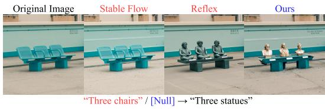  
(b) Object Replacement (Global)

(a) Attribute Editing  
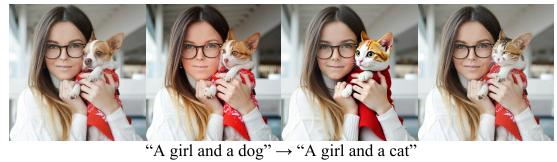  
(c) Object Replacement (Partial)

  
(d) Background Change  
Figure 1: Prism-Edit achieves competitive precision across diverse editing tasks. By decomposing the guidance signal, our method prevents common failure modes like semantic leakage (a) and content degradation (b, c), while excelling at the challenging task of background modification (d).

## 1 INTRODUCTION

The ability to sculpt our visual world through natural language is a central ambition of artificial intelligence. Recent advancements in text-to-image diffusion models (Rombach et al., 2022; Esser et al., 2024; Labs, 2024) have brought this vision closer to reality, largely powered by Classifier-Free Guidance (CFG) (Ho & Salimans, 2021). Yet despite their remarkable success, current editing methods suffer from a persistent weakness: background regions are notoriously difficult to modify, while object-centric edits succeed more reliably (Figure 1). For instance, a command to move an owl from “the wild” to “a school” often fails to convincingly alter the scene or inadvertently degrades the subject.

Prior approaches have mainly attacked this problem through heuristic spatial controls, asking where an edit should occur. These techniques often involve manipulating cross-attention maps (Hertz et al., 2023; Cao et al., 2023; Kim et al., 2025) or using the guidance difference vector to generate a spatial mask that separates the image into edit and preserve zones (Couairon et al., 2023).

In contrast, we argue the true bottleneck lies in how the guidance signal itself is structured. We show that the guidance difference vector ∆ϵ, central to CFG, is not random noise but the gradient of a log-likelihood ratio, whose expected magnitude is governed by local Fisher information density. This framing reveals a fundamental statistical law: objects, being information-dense, naturally yield strong guidance, whereas backgrounds, being information-sparse, yield weak guidance. We call this principle the Semantic Scale Hypothesis, which reinterprets background editing failure as an information-theoretic inevitability rather than an incidental flaw of prior methods.

Building on this insight, we propose Prism-Edit, a training-free, model-agnostic technique that decomposes the guidance signal into semantic layers and selectively amplifies the weak, low-information components corresponding to backgrounds. As previewed in Figure 1, this enables precise object edits while, for the first time, delivering robust and controllable background modifications. Our contributions are threefold:

1. Semantic Scale Hypothesis: We formalize a new principle that connects guidance magnitude to Fisher information, providing the first theoretical explanation for the persistent difficulty of background editing.

2. Prism-Edit: A simple, training-free, and model-agnostic method that operationalizes this principle by amplifying low-information signals.

3. Extensive Validation: We validate our hypothesis and method across multiple foundation models, showing consistent gains over state-of-the-art editors, especially for challenging background edits.

## 2 RELATED WORK

Text-guided image editing with diffusion models (Ho et al., 2020; Song et al., 2021; Ramesh et al., 2022; Esser et al., 2024; Labs, 2024), initiated by methods like SDEdit (Meng et al., 2022), has predominantly focused on spatial control—determining “WHERE” to apply edits. This paradigm includes techniques like manipulating attention maps (Tumanyan et al., 2023; Hertz et al., 2023; Cao et al., 2023) or refining sampling trajectories (Brack et al., 2024) to localize changes. Notably, DiffEdit (Couairon et al., 2023) pioneered using the guidance difference vector, ∆ϵ, to automatically generate a spatial mask. However, this still interprets the signal spatially, partitioning the image into a binary “edit” versus “preserve” zone. We provide a detailed comparison highlighting the fundamental difference between DiffEdit’s masking strategy and our gradient modulation approach in Appendix C.7.

Our work poses a complementary question: “HOW” should an edit be applied? We shift the focus from the signal’s location to its intrinsic semantic nature. We posit that the magnitude of ∆ϵ is not merely a spatial indicator, but a rich signal encoding a semantic hierarchy. Instead of creating a binary mask, our method decomposes this signal into distinct semantic layers (e.g., object structure, style/background). This enables a more expressive, disentangled form of control by modulating the guidance signal’s intrinsic semantic structure rather than just its spatial application.

And our work builds upon the standard framework of text-to-image diffusion models (Ho et al., 2020) and Classifier-Free Guidance (CFG) (Ho & Salimans, 2021). During sampling, CFG steers the generation process by extrapolating from an unconditional noise prediction $\epsilon _ { \theta } ( \mathbf { x } _ { t } , \emptyset )$ towards a conditional prediction $\epsilon _ { \theta } ( \mathbf { x } _ { t } , c )$ . Our analysis focuses on the core of this mechanism: the Guidance Difference Vector, $\Delta \epsilon = \epsilon _ { \theta } ( \mathbf { x } _ { t } , c _ { \mathrm { t a r g e t } } ) - \epsilon _ { \theta } ( \mathbf { x } _ { t } , c _ { \mathrm { s o u r c e } } )$ , which represents the model’s perceived direction to transform a source concept into a target. We hypothesize that the magnitude of this vector, $\| \Delta \epsilon \| .$ , is a structured semantic signal.

## 3 THEORETICAL FOUNDATION: GUIDANCE AS A GRADIENT FIELD

Our central claim, the Semantic Scale Hypothesis, is not merely an empirical observation but appears to be a direct consequence of the statistical principles governing diffusion models. This section provides a first-principles derivation, showing that the guidance difference vector ∆ϵ acts as a gradient field of a log-likelihood ratio, whose magnitude is intrinsically linked to the local information density of the image. The temporal evolution in Figure 2 provides strong empirical support for this derived theory.

925  
700  
600  
300  
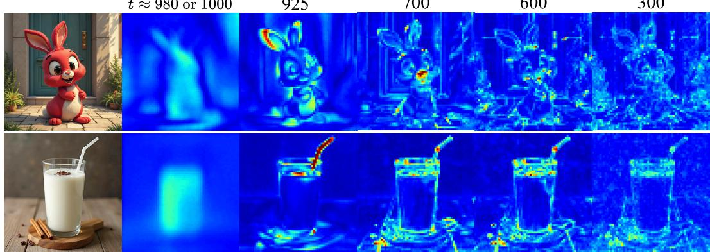  
Figure 2: Temporal evolution of the guidance difference vector, $\| \Delta \epsilon \|$ , during a standard generation trajectory. High-magnitude signals, encoding object structure, dominate in the early-to-mid timesteps before diminishing, while background regions remain consistently low-magnitude throughout. This provides strong empirical support for the Semantic Scale Hypothesis.

## 3.1 THE GUIDANCE DIFFERENCE AS A LOG-LIKELIHOOD RATIO GRADIENT

The foundation of a diffusion model is its score function, $\nabla _ { \mathbf x _ { t } }$ log $p ( \mathbf { x } _ { t } \mid c )$ , which points in the direction of maximal increase in data likelihood. With the standard ϵ-parameterization, the predicted noise $\epsilon _ { \theta } ( \mathbf { x } _ { t } , c )$ is proportional to this score. Classifier-Free Guidance steers the generation by taking the difference between a conditional and an unconditional prediction. The core of any edit, however, is the difference between two conditional predictions (source $c _ { 1 }$ and target $c _ { 2 } )$ . This guidance difference vector, $\Delta \epsilon ,$ , is therefore proportional to the difference between two scores:

$$
\Delta \epsilon (\mathbf {x} _ {t}; c _ {1}, c _ {2}) \propto \nabla_ {\mathbf {x} _ {t}} \log p (\mathbf {x} _ {t} | c _ {2}) - \nabla_ {\mathbf {x} _ {t}} \log p (\mathbf {x} _ {t} | c _ {1}).\tag{1}
$$

By the properties of logarithms, this simplifies to the gradient of a single scalar field: the log-likelihood ratio between the target and source conditions.

$$
\Delta \epsilon (\mathbf {x} _ {t}; c _ {1}, c _ {2}) \propto \nabla_ {\mathbf {x} _ {t}} \log \frac {p (\mathbf {x} _ {t} | c _ {2})}{p (\mathbf {x} _ {t} | c _ {1})}.\tag{2}
$$

This reframes the guidance vector: it is not just a directional hint, but a vector field that points “uphill” on the surface of how much more likely the noisy image $\mathbf { x } _ { t }$ is under the target condition versus the source condition. The magnitude $\| \Delta \epsilon \|$ thus reflects the steepness of this likelihood ratio landscape.

## 3.2 INFORMATION DENSITY AND POSTERIOR CERTAINTY

The steepness of the landscape in Eq. 2 is determined by the model’s “certainty” about the underlying clean image $\mathbf { x } _ { \mathrm { 0 } }$ . This certainty is directly related to the local information density of the image content, a principle linked to the model’s posterior via Tweedie’s formula (Efron, 2011).

• Structured Regions (e.g., objects): These areas are characterized by high information density (edges, textures, recognizable forms). Given a noisy patch from an object, the model has strong priors, leading to a sharp posterior distribution $p ( \mathbf { x } _ { 0 } \mid \mathbf { x } _ { t } , c )$ with low variance. The model is “certain” about what should be there.

• Smooth Regions (e.g., backgrounds): These areas have low information density (smooth gradients, skies, walls). The model’s posterior is flat, with high variance, as many clean signals could have resulted in the same noisy patch. The model is “uncertain.”

A sharp, low-variance posterior means that a small change in the condition (from $c _ { 1 }$ to $c _ { 2 } )$ can cause a dramatic shift in the posterior mean $\mathbb { E } [ \mathbf { x } _ { 0 } \mid \mathbf { x } _ { t } , c ]$ . Conversely, for a flat, high-variance posterior, the same conditional change results in a much smaller shift.

## 3.3 SEMANTIC SCALE AS A CONSEQUENCE OF INFORMATION DENSITY

We can now connect these principles. The magnitude $\| \Delta \epsilon \|$ is proportional to the posterior mean shift $\| \Delta \mu _ { t } \|$

$$
\| \Delta \epsilon (\mathbf {x} _ {t}; c _ {1}, c _ {2}) \| \propto \frac {\| \Delta \mu_ {t} \|}{\sigma_ {t}}, \quad \Delta \mu_ {t} := \mathbb {E} [ \mathbf {x} _ {0} | \mathbf {x} _ {t}, c _ {2} ] - \mathbb {E} [ \mathbf {x} _ {0} | \mathbf {x} _ {t}, c _ {1} ].\tag{3}
$$

This proportionality follows from the relationship between the ϵ-parameterization and the posterior mean derived from Tweedie’s formula (a brief proof sketch is provided in Appendix A for clarity). As established in Section 4.2, edits concerning high-information, low-variance regions (objects) induce large posterior shifts $( \left. \Delta \mu _ { t } \right. )$ , resulting in a large-magnitude $\| \Delta \epsilon \|$ . Edits concerning low-information, high-variance regions (backgrounds, styles) induce small shifts, resulting in a small magnitude $\| \Delta \epsilon \|$ . Therefore, we interpret the Semantic Scale Hypothesis as a natural consequence of applying information-theoretic principles to the score-matching objective. Large-magnitude guidance is not just correlated with objects; it appears to be the mathematical result of the model being more “certain” and “opinionated” about these information-dense regions. Prism-Edit is the first method to leverage this insight, reframing editing not as a masking problem, but as a principled signal processing challenge: separating and amplifying semantically crucial components based on their information-theoretic signature.

## 3.4 CLOSED-FORM BOUNDS UNDER GAUSSIAN POSTERIOR APPROXIMATION

The proportionality in $\operatorname { E q } .$ 3 can be made quantitatively precise by adopting a local Gaussian approximation of the posterior:

$$
p (\mathbf {x} _ {0} \mid \mathbf {x} _ {t}, c _ {i}) \approx \mathcal {N} (\boldsymbol {\mu} _ {c _ {i}}, \boldsymbol {\Sigma} _ {c _ {i}}) \quad (i \in \{1, 2 \}).
$$

Under this approximation, the mean shift is $\Delta \mu _ { t } : = \mu _ { c _ { 2 } } - \mu _ { c _ { 1 } }$ and Eq. 3 suggests $\| \Delta \epsilon \| \propto \| \Delta \mu _ { t } \| / \sigma _ { t }$ We now upper/lower bound $\| \Delta \epsilon \| ^ { 2 }$ in terms of closed-form divergences between Gaussians, which separates mean-shift and covariance-mismatch effects.

Theorem 1 (KL-based bound for guidance magnitude). Let d be the dimensionality and define the Gaussian KL divergence

$$
D _ {\mathrm{KL}} (\mathcal {N} (\boldsymbol {\mu} _ {c _ {1}}, \boldsymbol {\Sigma} _ {c _ {1}}) \| \mathcal {N} (\boldsymbol {\mu} _ {c _ {2}}, \boldsymbol {\Sigma} _ {c _ {2}})) = \frac {1}{2} \left[ \operatorname{tr} \left(\boldsymbol {\Sigma} _ {c _ {2}} ^ {- 1} \boldsymbol {\Sigma} _ {c _ {1}}\right) + \left(\Delta \boldsymbol {\mu} _ {t}\right) ^ {\top} \boldsymbol {\Sigma} _ {c _ {2}} ^ {- 1} \Delta \boldsymbol {\mu} _ {t} - d + \log \frac {\det \boldsymbol {\Sigma} _ {c _ {2}}}{\det \boldsymbol {\Sigma} _ {c _ {1}}} \right].
$$

Let $\lambda _ { \operatorname* { m a x } } ( \pmb { \Sigma } )$ and $\lambda _ { \operatorname* { m i n } } ( \pmb { \Sigma } )$ ) denote the largest and smallest eigenvalues of a symmetric positive definite matrix $\Sigma ,$ respectively. Then,for any t,

$$
\begin{array}{r l} & {\| \Delta \epsilon \| ^ {2} \leq \frac {\lambda_ {\max} (\pmb {\Sigma} _ {c _ {2}})}{\sigma_ {t} ^ {2}} \Big \{2 D _ {\mathrm{KL}} (\mathcal {N} (\pmb {\mu} _ {c _ {1}}, \pmb {\Sigma} _ {c _ {1}}) \| \mathcal {N} (\pmb {\mu} _ {c _ {2}}, \pmb {\Sigma} _ {c _ {2}}))} \\ & {\qquad - \underbrace {\Big [ \operatorname{tr} (\pmb {\Sigma} _ {c _ {2}} ^ {- 1} \pmb {\Sigma} _ {c _ {1}}) - d - \log \det (\pmb {\Sigma} _ {c _ {2}} ^ {- 1} \pmb {\Sigma} _ {c _ {1}}) \Big ]} _ {:= \Psi (\pmb {\Sigma} _ {c _ {1}}, \pmb {\Sigma} _ {c _ {2}})} \Big \}.} \end{array}\tag{4}
$$

and symmetrically with $( c _ { 1 } , c _ { 2 } )$ swapped:

$$
\| \Delta \epsilon \| ^ {2} \leq \frac {\lambda_ {\max} (\boldsymbol {\Sigma} _ {c _ {1}})}{\sigma_ {t} ^ {2}} \Bigl \{2 D _ {\mathrm{KL}} (\mathcal {N} (\boldsymbol {\mu} _ {c _ {2}}, \boldsymbol {\Sigma} _ {c _ {2}}) \| \mathcal {N} (\boldsymbol {\mu} _ {c _ {1}}, \boldsymbol {\Sigma} _ {c _ {1}})) - \Psi (\boldsymbol {\Sigma} _ {c _ {2}}, \boldsymbol {\Sigma} _ {c _ {1}}) \Bigr \}.\tag{5}
$$

Moreover, the following lower bounds hold:

$$
\| \Delta \pmb {\epsilon} \| ^ {2} \geq \frac {\lambda_ {\min} (\pmb {\Sigma} _ {c _ {2}})}{\sigma_ {t} ^ {2}} \Bigl \{2 D _ {\mathrm{KL}} (\mathcal {N} (\pmb {\mu} _ {c _ {1}}, \pmb {\Sigma} _ {c _ {1}}) \| \mathcal {N} (\pmb {\mu} _ {c _ {2}}, \pmb {\Sigma} _ {c _ {2}})) - \Psi (\pmb {\Sigma} _ {c _ {1}}, \pmb {\Sigma} _ {c _ {2}}) \Bigr \},\tag{6}
$$

and analogously with $( c _ { 1 } , c _ { 2 } )$ swapped.

Interpretation. The term $\Psi \big ( \Sigma _ { c _ { 1 } } , \Sigma _ { c _ { 2 } } \big ) : = \mathrm { t r } \big ( \Sigma _ { c _ { 2 } } ^ { - 1 } \Sigma _ { c _ { 1 } } \big ) - d - \log \operatorname* { d e t } \big ( \Sigma _ { c _ { 2 } } ^ { - 1 } \Sigma _ { c _ { 1 } } \big ) \geq 0$ quantifies the covariance mismatch (it vanishes iff $\Sigma _ { c _ { 1 } } \doteq \tilde { \Sigma } _ { c _ { 2 } } )$ . Hence the bound cleanly separates (i) the mean-shift captured by the KL divergence and (ii) the uncertainty gap captured by Ψ.

Corollary 1 (Equal-covariance simplification). $\begin{array} { r } { I f \Sigma _ { c _ { 1 } } = \Sigma _ { c _ { 2 } } = \Sigma , } \end{array}$ , then $\Psi = 0$ and

$$
\frac {2 \lambda_ {\min} (\boldsymbol {\Sigma})}{\sigma_ {t} ^ {2}} D _ {\mathrm{KL}} (\mathcal {N} (\boldsymbol {\mu} _ {c _ {1}}, \boldsymbol {\Sigma}) \| \mathcal {N} (\boldsymbol {\mu} _ {c _ {2}}, \boldsymbol {\Sigma})) \leq \| \Delta \epsilon \| ^ {2} \leq \frac {2 \lambda_ {\max} (\boldsymbol {\Sigma})}{\sigma_ {t} ^ {2}} D _ {\mathrm{KL}} (\mathcal {N} (\boldsymbol {\mu} _ {c _ {1}}, \boldsymbol {\Sigma}) \| \mathcal {N} (\boldsymbol {\mu} _ {c _ {2}}, \boldsymbol {\Sigma})).
$$

Thus larger guidance magnitude is driven either by a larger mean shift (object-level changes) or by smaller posterior variance (higher certainty), making the object/background gap visible in both mean and covariance channels.

Connection to Fisher divergence. From Eq. A.2, taking an expectation w.r.t. any reference density $q ( \mathbf { x } _ { t } )$ gives

$$
\mathbb {E} _ {q} \big [ \| \Delta \epsilon \| ^ {2} \big ] = \sigma_ {t} ^ {2} \mathbb {E} _ {q} \Big [ \big \| \nabla_ {\mathbf {x} _ {t}} \log p (\mathbf {x} _ {t} | c _ {2}) - \nabla_ {\mathbf {x} _ {t}} \log p (\mathbf {x} _ {t} | c _ {1}) \big \| ^ {2} \Big ] = \sigma_ {t} ^ {2} \mathcal {F} _ {q} \big (p (\cdot | c _ {2}), p (\cdot | c _ {1}) \big),
$$

the (generalized) Fisher divergence between the two conditionals under $q .$ When $q = p ( \cdot | c _ { 2 } )$ (or $c _ { 1 } )$ $\mathcal { F } _ { q }$ reduces to the standard Fisher divergence; for Gaussian pairs, $\mathcal { F } _ { q }$ admits a closed form, revealing the same mean/covariance decomposition as in Theorem 1.

## 3.5 SEMANTIC SCALE AS INFORMATION-THEORETIC NECESSITY

In summary,

$$
\left\| \Delta \epsilon \right\| ^ {2} \propto \text {   local   Fisher   information   density.   }
$$

Objects, being information-dense, inevitably yield large guidance, while backgrounds, being information-sparse, yield vanishing signals. Thus the Semantic Scale Hypothesis is not an empirical artifact but a direct corollary of score matching and Fisher information theory, explaining background editing failure as a statistical necessity.

## 4 METHOD: A PRINCIPLED FRAMEWORK FOR DISENTANGLED EDITING

Building on our theoretical foundation, we introduce Prism-Edit, a framework designed to operationalize the Semantic Scale Hypothesis for precise, disentangled image editing. Unlike methods that rely on external parsers or attention manipulation, Prism-Edit derives its control signals directly from the model’s internal generation dynamics. As illustrated in Figure 3, our approach is a two-stage process: (1) principled extraction of a multi-layered Semantic Map, and (2) disentangled application of edits via one of two complementary modalities.

## 4.1 STAGE 1: SEMANTIC MAP EXTRACTION

Section 3 established that the guidance magnitude $\| \Delta \epsilon \|$ scales with the posterior mean shift normalized by the posterior variance, i.e., with the local Fisher information density. This implies that absolute magnitudes are not directly comparable across timesteps or samples: regions with high variance (backgrounds) systematically appear weak, even when the underlying semantic change is substantial.

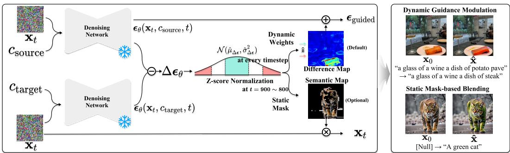  
Figure 3: Overall Prism-Edit framework. The Semantic Map is extracted from early denoising (left), and applied during sampling via dynamic guidance modulation (default) or static mask blending (optional). Region-specific scaling enables strong background edits without destabilizing objects.

To compensate for this Fisher information imbalance, we adopt a σ-normalized thresholding scheme. Specifically, we probe a narrow, high-noise window $( \mathbf { e } . \mathbf { g } . , t \in [ 9 0 0 , 8 0 0 ]$ for a 1000-step schedule). As detailed in Appendix C.6, this specific interval was selected based on empirical analysis showing it maximizes semantic coverage while retaining structural plasticity, unlike later timesteps, which become overly rigid. We then compute an averaged guidance difference:

$$
\overline {{\Delta \epsilon}} = \frac {1}{N _ {\mathrm{probe}}} \sum_ {i = 1} ^ {N _ {\mathrm{probe}}} \Delta \epsilon_ {t _ {i}}, \qquad M _ {\mathrm{sem}} = \frac {| \overline {{\Delta \epsilon}} | - \mu_ {| \overline {{\Delta \epsilon}} |}}{\sigma_ {| \overline {{\Delta \epsilon}} |}},\tag{7}
$$

where $N _ { \mathrm { p r o b e } }$ denote the number of probed timesteps in the chosen window. As predicted in Corollary 1, the raw magnitude $\| \Delta \epsilon \|$ varies significantly across different editing tasks and architectures due to posterior variance shifts (Information Imbalance). Therefore, absolute thresholding is infeasible. We employ this z-score normalization to transform the raw gradients into a scale-invariant semantic signal. This allows us to use fixed relative thresholds (σ-levels) that generalize across prompts, seeds, and individual edits within a given baseline model. As a result, weak background signals are restored to a comparable scale, while strong object signals are prevented from overwhelming the map.

Based on empirical analysis (see Figure C.2), the extreme tails of this semantic map correspond to the cleanest semantic signals. Intermediate values often represent mixtures of object and background, making them unsuitable for disentangled edits. We therefore define two primary semantic layers using fixed thresholds that proved stable across models and prompts: a background/style layer $( M _ { \mathrm { { s e m } } } < 0 . 6 )$ and an object-core layer $( M _ { \mathrm { { s e m } } } \geq 3 . 0 )$ .

## 4.2 STAGE 2: DISENTANGLED APPLICATION MODALITIES

The extracted semantic map $M _ { \mathrm { s e m } }$ enables two distinct, training-free editing modalities.

Static Mask Blending for Maximum Fidelity (Optional). This static mask is optional and acts as a loose, permissive spatial constraint determined by the editing intent. Specifically, we define the active editing region using a coarse threshold: targeting high-magnitude areas $( \dot { M } _ { \mathrm { s e m } } \geq 0 . 6 )$ for object edits, and low-magnitude areas $( M _ { \mathrm { { s e m } } } < 0 . 6 )$ for background edits. Unlike methods relying on strict hard boundaries, this mask is designed to be broad, preventing edits from drifting into completely irrelevant regions while leaving the semantic boundaries flexible. Only for tasks requiring strict identity preservation do we impose a tighter constraint by explicitly excluding high-magnitude object cores $( M _ { \mathrm { s e m } } \geq 3 . 0 )$ ). At each step $t ,$ the edited latent ${ \bf x } _ { t - 1 } ^ { \mathrm { p r e d } }$ is blended with the corresponding source latent $\mathbf { x } _ { t - 1 } ^ { \mathrm { s r c } } ,$ , guaranteeing that unmasked regions remain unchanged:

$$
\mathbf {x} _ {t - 1} \leftarrow \mathbf {x} _ {t - 1} ^ {\mathrm{pred}} \odot M _ {\mathrm{final}} + \mathbf {x} _ {t - 1} ^ {\mathrm{src}} \odot (1 - M _ {\mathrm{final}}),\tag{8}
$$

where $M _ { \mathrm { f i n a l } }$ is obtained by thresholding $M _ { \mathrm { s e m } }$ to get a coarse mask and refining it with morphological closing (see Appendix B).

Dynamic Guidance Modulation (Default). Our default modality offers greater flexibility by dynamically modulating guidance at each step. Although theoretically defined as a continuous map, in practice, we binarize $W _ { \mathbf { s e m } , t }$ based on the z-score of the instantaneous $\| \Delta \epsilon _ { t } \|$ (using < 0.6σ for background edits and $\geq 3$ .0σ for object edits) to ensure stability and prevent boundary artifacts. The guidance is then modulated element-wise:

$$
\tilde {\epsilon} _ {\theta} (x _ {t}, c) = \epsilon_ {\theta} (x _ {t}, c _ {\mathrm{src}}) + \gamma \cdot (\Delta \boldsymbol {\epsilon} _ {t} \odot W _ {\mathrm{sem}, t}).\tag{9}
$$

This enables region-specific guidance scaling: background edits (low-information, high-variance) can be amplified with large γ (e.g., 20–40) without destabilizing object regions (already high-information).

Importantly, this dynamic modulation is a direct operationalization of the information-field perspective from Section 3: by locally scaling weak, high-uncertainty regions while leaving strong, low-uncertainty regions untouched, we effectively re-balance the Fisher information disparity inherent in diffusion guidance.

Notes on stability, scale, and hyperparameters. Because the binarized $W _ { \mathrm { s e m } , t }$ strictly isolates the target region, background edits remain stable even under large local scales, as the amplification is explicitly prevented from bleeding into the object core. Static masking serves as an optional secondary safety filter, but dynamic modulation alone suffices for most edits and is our default. Regarding hyperparameters, while specific thresholds vary per baseline architecture (e.g., to account for distinct noise schedules), they remain invariant across diverse datasets and prompts. Once set for a baseline, no per-image tuning is required. The complete procedure is detailed in Algorithm 1 in the Appendix.

## 5 EXPERIMENTS

We conduct a comprehensive evaluation of Prism-Edit to validate our core claims: (1) the Semantic Scale Hypothesis is a general principle, and (2) our method enables state-of-the-art disentangled editing. Our evaluation spans multiple foundational models, including Stable Diffusion v1.5, v3, and FLUX.1, to demonstrate model-agnosticism.

Implementation Details. Unless otherwise specified, all experiments are performed using the default schedulers and step counts for each model. Per our theoretical motivation in Section 4, we apply a large region-specific guidance scale $( \gamma \in [ 2 0 , 4 0 ] )$ on low-magnitude regions for background edits, while conventional scales are used for object edits. Our ablation studies (see Appendix, Figures C.3 and C.4) confirm that this targeted amplification effectively modifies low-energy regions without introducing artifacts or destabilizing high-energy object structures. Hyperparameters for our static masking modalities are detailed in Table B.1. To ensure the reliability of our approach, we further verified that our Semantic Scale Hypothesis remains robust across different sampling conditions, including varying inversion techniques (e.g., DDIM vs. DPM-Solver Lu et al. (2022); Hong et al. (2024)) and target prompts, as detailed in Appendix C.9.

## 5.1 QUANTITATIVE EVALUATION

We evaluate on the standard Wild-TI2I and ImageNet-R-TI2I benchmarks. To specifically probe disentanglement, we partition Wild-TI2I into object-centric and background-centric subsets. We report standard metrics: DINOv2 (Oquab et al., 2024) for semantic alignment, SSIM (Wang et al., 2004) for structural preservation, and CLIP score (Radford et al., 2021) for text alignment.

On the Trade-off between Disentanglement and Global Alignment. While the CLIP score is a valuable metric for overall text-alignment, we observed that it does not always capture the nuances of disentangled editing. Since CLIP is known to bias towards global image modifications, baseline methods that alter the entire scene often achieve higher scores even when they fail to preserve identity. In contrast, Prism-Edit strictly preserves the unedited regions, which naturally limits this global drift. Consequently, while this may result in a slight CLIP decrease, it yields significantly higher semantic fidelity (DINO/SSIM), as intended. To provide a more complete picture, we introduce a supplementary metric:

$$
\mathrm{DINO/SSIM} = \frac {\mathrm{DINOv2(objectsimilarity)}}{\mathrm{SSIM(backgroundpreservation)}},
$$

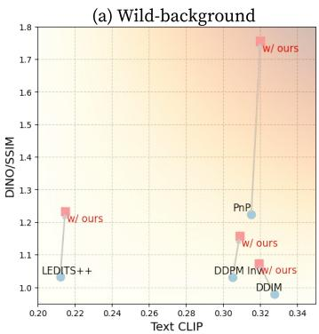

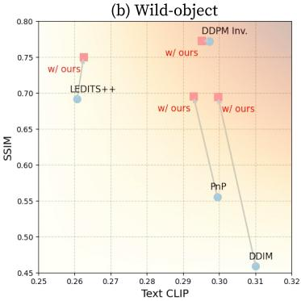

(c) ImageNetR-TI2I  
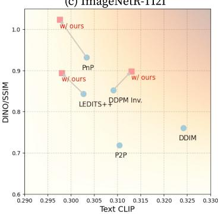  
Figure 4: Quantitative evaluation of Prism-Edit. We report DINOv2, SSIM, and CLIP on Wild-TI2I (split into background/object subsets) and ImageNet-R-TI2I. Our method consistently improves DINOv2 similarity and maintains SSIM, validating disentangled editing performance.

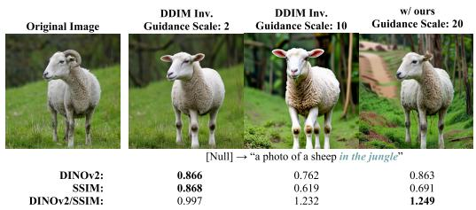  
(a) Background-sensitive metric (DINOv2/SSIM).

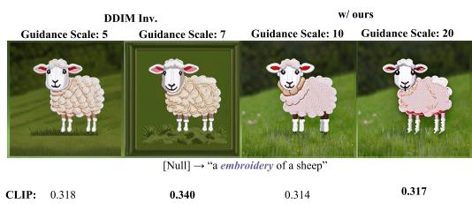  
(b) CLIP score w/ Prism-Edit  
Figure 5: Analysis of the Disentanglement Trade-off. (a) Our method improves background-aware editing fidelity (DINOv2/SSIM). (b) This demonstrates that our edits prioritize disentanglement, which is not always captured by global text-alignment metrics like CLIP.

This ratio is designed to explicitly measure the success of preserving the primary object while altering the background. As shown in Figure 4, our method consistently outperforms baselines on this metric. This trade-off is further illustrated in Figure 5: while CLIP scores may plateau (Fig. 5b), our method maintains a high DINO/SSIM ratio (Fig. 5a), highlighting its effectiveness in disentangled editing.

## 5.2 QUALITATIVE EVALUATION

To validate the universality of our approach, we evaluate Prism-Edit’s performance as a plug-and-play enhancement for established editing methods on Stable Diffusion v1.5. Detailed descriptions of these baselines and the integration methodology are provided in Appendix B.3. As shown in Figure 6, Prism-Edit consistently corrects common failure modes of baselines like DDIM/DDPM Inversion, PnP, and LEDITS++. For instance, when editing ”an origami of a hummingbird” to ”a sketch of a parrot,” Prism-Edit successfully disentangles the object’s identity (‘parrot‘) from its style (‘sketch‘), a task where baselines often fail. This demonstrates the broad utility of our principled guidance decomposition. Further results in Figure 7 confirm our method’s model-agnostic performance. Furthermore, we demonstrate that our Semantic Scale Hypothesis generalizes beyond object-centric images. Our analysis on object-scarce scenes (e.g., landscapes, textures) confirms that the guidance magnitude effectively disentangles implicit local structures from global atmosphere, as detailed in Appendix C.8. We demonstrate robust background and object edits on modern architectures like Stable Diffusion v3, and showcase Prism-Edit’s utility on FLUX.1 by integrating it as a plug-and-play enhancement for existing editors like RF-Inversion (Rout et al., 2025) and Stable-flow (Avrahami et al., 2025).

## 5.3 CAUSAL VALIDATION OF SEMANTIC DISENTANGLEMENT

A key prediction of our hypothesis is that distinct semantic layers can be edited independently. To provide causal evidence, we design prompts that require simultaneous object and background changes.

“A of a ” → “An of a ” toy embroidery jeep minivan

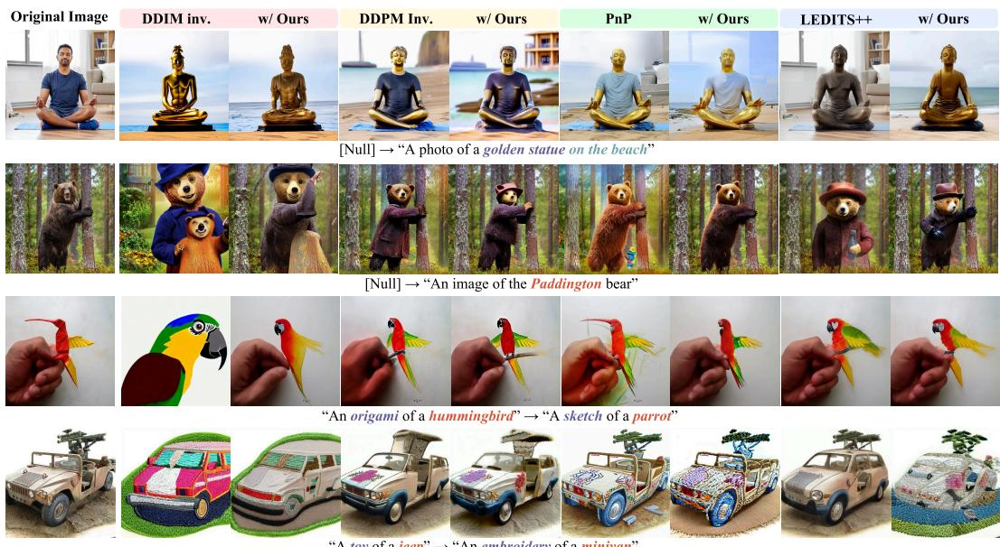  
Figure 6: Prism-Edit as a Universal Enhancement Module. Our method, integrated with various editing techniques on SD v1.5, consistently corrects common failure modes like semantic leakage (rows 3-4) and incomplete edits (rows 1-2).

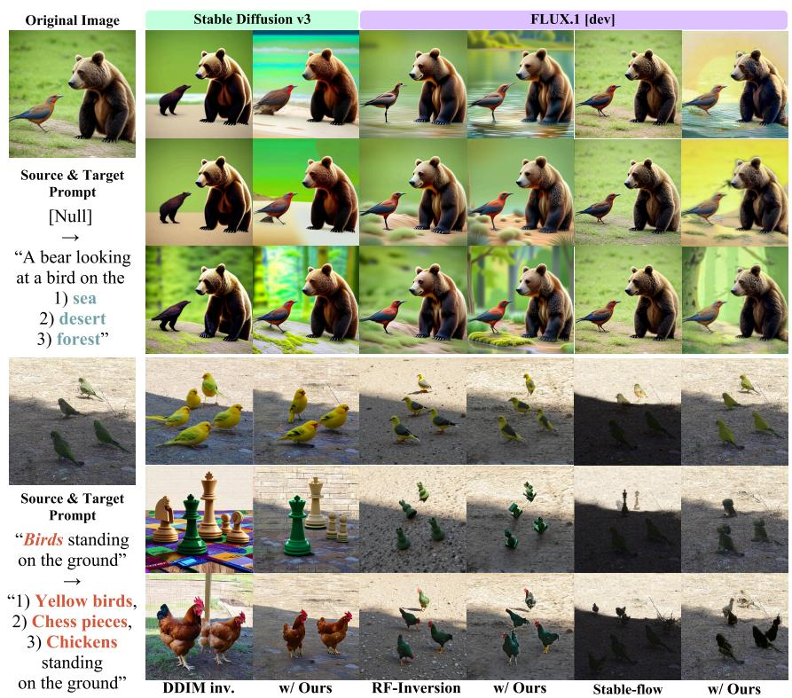  
Figure 7: Model-agnostic editing. Results on SD v3 and FLUX.1. Prism-Edit enables faithful background modifications (rows 1–2) and robust object edits (rows 3–4).

We then apply Prism-Edit in two controlled settings: (i) editing only high-magnitude (object) signals, and (ii) editing only low-magnitude (background) signals. As shown in Figure 8, the results are cleanly disentangled. Modifying high-magnitude signals alters the object’s identity while preserving the background, and vice-versa. This experiment directly validates that guidance magnitude causally corresponds to the semantic scales we identified.

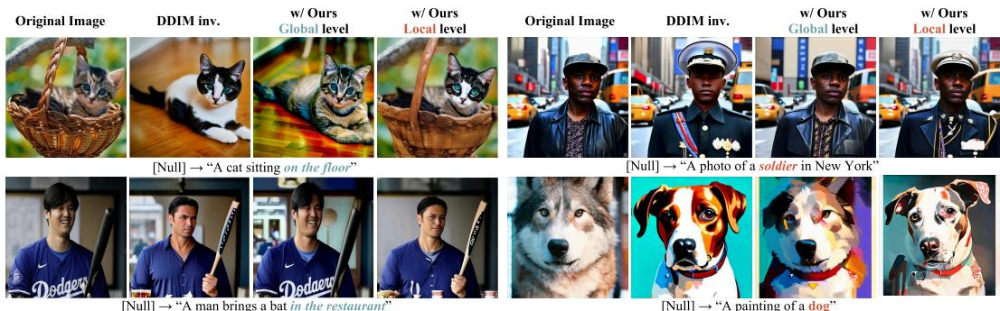  
Figure 8: Semantic layer disentanglement. The results show a clear causal separation between Local level (high-magnitude) edits that alter object identity, and Global level (low-magnitude) edits that alter background and style.

## 6 LIMITATIONS

Prism-Edit has several limitations. Our theoretical analysis assumes a Gaussian posterior, which simplifies derivations but does not perfectly reflect the true diffusion process. The framework also requires manual specification of editing intent and relies on fixed z-score thresholds to separate semantic layers, introducing both user intervention and heuristic design choices. In addition, the effectiveness of our method is influenced by the baseline diffusion model into which it is plugged, meaning that gains may vary depending on the underlying architecture.

## 7 CONCLUSION

We introduced the Semantic Scale Hypothesis, framing guidance magnitude (∥∆ϵ∥) as an information-theoretic signal that reflects a semantic hierarchy. Based on this principle, our trainingfree method Prism-Edit adaptively decomposes the guidance field to enable more disentangled edits, particularly in challenging background regions. Rather than relying solely on spatial masks, this perspective highlights the role of signal-level structure within diffusion guidance. Future work may explore automatic detection of user intent and more adaptive layer selection, moving toward a practical zero-shot editing pipeline.

## ACKNOWLEDGMENTS

This work was supported in part by the Institute of Information & Communications Technology Planning & Evaluation (IITP) grants funded by the Korea government (MSIT), including Artificial Intelligence Graduate School Program (No. RS-2019-II190079, Korea University), (Part 2) Few-Shot Learning of Causal Inference in Vision and Language for Decision Making project (No. RS-2022- II220959), and National AI Research Lab Project (No. RS-2024-00457882).

## ETHICS STATEMENT

The authors adhere to the ICLR Code of Ethics. Our work introduces a method for text-guided image editing. We acknowledge that, like all generative models, this technology could potentially be misused for creating misleading or harmful content. However, the primary focus of our research is to provide a deeper understanding of the internal mechanisms of diffusion models and to offer controllable tools for creative and research purposes. We believe that by making the underlying principles of these models more transparent and controllable, our work contributes to a more responsible development path for generative AI.