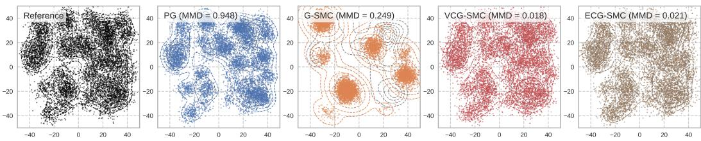
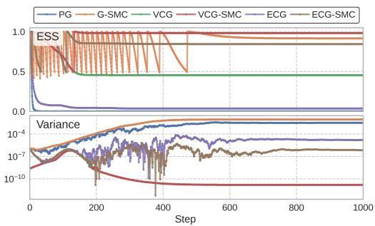
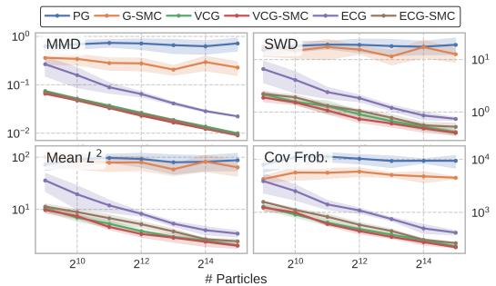
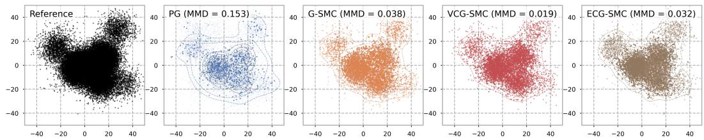
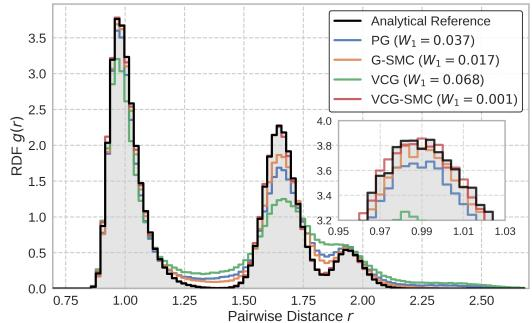
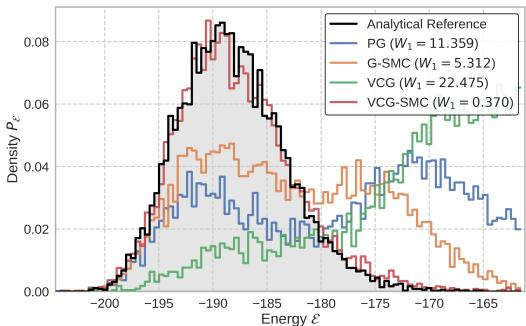
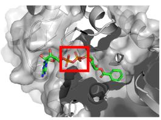
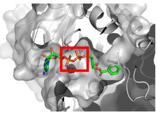
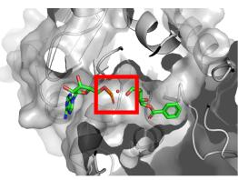
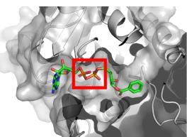

## ABSTRACT

We study inference-time scaling for diffusion models, where the goal is to adapt a pre-trained model to new target distributions without retraining. Existing guidance-based methods are simple but introduce bias, while particle-based corrections suffer from weight degeneracy and high computational cost. We introduce DriftLite, a lightweight, training-free particle-based approach that steers the inference dynamics on the fly with provably optimal stability control. DriftLite exploits a fundamental degree of freedom in the Fokker-Planck equation between the drift and particle potential, and yields two practical instantiations: Variance- and Energy-Controlling Guidance (VCG/ECG) for approximating the optimal drift with modest and scalable overhead. Across Gaussian mixture models, particle systems, and large-scale protein-ligand co-folding problems, DriftLite consistently reduces variance and improves sample quality over pure guidance and sequential Monte Carlo baselines. These results highlight a principled, efficient route toward scalable inference-time adaptation of diffusion models. Our source code is publicly available at https://github.com/yinuoren/DriftLite.

## 1 INTRODUCTION

Diffusion- (Sohl-Dickstein et al., 2015; Ho et al., 2020; Song & Ermon, 2019; Song et al., 2020) and flow-based (Zhang et al., 2018; Lipman et al., 2022; Albergo & Vanden-Eijnden, 2022; Liu et al., 2022; Ren et al., 2025b) models have revolutionized generative modeling, achieving state-ofthe-art performance in domains ranging from creative media synthesis (Rombach et al., 2022; Le et al., 2023; Ho et al., 2022; Austin et al., 2021) to fundamental scientific discovery (Xu et al., 2022; Watson et al., 2023; Duan et al., 2023; Gao et al., 2024; Zhu et al., 2024; Zeni et al., 2025; Duan et al., 2025). They typically rely on a neural network to approximate a time-dependent vector field, which guides a stochastic process from noises to a complex target. However, training is resource-intensive, making it impractical to retrain from scratch for every new setting. This renders a lightweight adaptation of pre-trained models to target distributions that is both compelling and essential.

To this end, a spectrum of adaptation methods has emerged. At one end are guidance-based techniques, the most popular and straightforward inference-time techniques, which inject new information into the drift term, such as classifier (Dhariwal & Nichol, 2021) or classifier-free guidance (Ho & Salimans, 2022) and its many variants (Chung et al., 2022; Trippe et al., 2022; Bansal et al., 2023; Song et al., 2023a;b; He et al., 2023; Guo et al., 2024; Zheng et al., 2024; Rojas et al., 2025). While simple and effective for many tasks, these methods are often heuristic and introduce uncontrolled bias (Chidambaram et al., 2024; Wu et al., 2024a), a significant drawback for scientific applications where sampling accuracy is paramount. On the opposite are methods that resort to extra training, such as fine-tuning (Fan & Lee, 2023; Fan et al., 2023; Black et al., 2023; Clark et al., 2023; Wallace et al., 2024) as in the LLM context (Ouyang et al., 2022; Rafailov et al., 2023), learning within a stochastic control framework (Domingo-Enrich et al., 2024a; Uehara et al., 2024; Thornton et al., 2025), similar to learning-based samplers (Zhang & Chen, 2021; Vargas et al., 2023a;b;

Domingo-Enrich et al., 2024b; Richter & Berner, 2023; Zhu et al., 2025), or adding additional training objectives (Venkatraman et al., 2024; Thornton et al., 2025), but this shifts the computational burden back to retraining, forfeiting the efficiency of inference-time approaches.

Between these ends lies a middle ground of training-free but more sophisticated inference-time approaches. A promising direction formulates the problem in Bayesian and Monte Carlo sampling frameworks (Du et al., 2023; Xu & Chi, 2024; Wu et al., 2024b; Coeurdoux et al., 2024; Bruna & Han, 2024; Zheng et al., 2025). In particular, Sequential Monte Carlo (SMC) methods (Del Moral et al., 2006; Doucet et al., 2000) have been recently introduced to correct for the bias of guidance by simulating the target dynamics with weighted particles (Wu et al., 2023; Cardoso et al., 2023; Skreta et al., 2025; Chen et al., 2025; Singhal et al., 2025; Lee et al., 2025). Despite their strong theoretical grounding and asymptotic guarantees, these particle-based methods face a critical practical bottleneck: weight degeneracy. As the simulation progresses, the weights of a few particles grow exponentially while the rest decay, causing the effective sample size to collapse. To mitigate this, one may increase the number of particles, raising computational cost, or use fewer particles, resulting in instability and degraded sample quality.

Our work introduces DriftLite, a lightweight, training-free inference-time scaling approach that resolves the inherent instability of particle-based methods without sacrificing mathematical rigor. By exploiting a fundamental degree of freedom in the Fokker-Planck equation, we actively control particle drift on the fly. This proactive steering mechanism absorbs sources of weight variation, preventing the weight collapse common in passive reweighting schemes and dramatically improving stability. The method’s modest and scalable computational overhead requiring only the solution of a small linear system per step, makes it fundamentally lightweight, especailly compared with methods that require retraining or extra training of additional control networks. Unlike learning-based control (Vargas et al., 2023b; Richter & Berner, 2023) or heuristic control frameworks (He et al., 2025), DriftLite is a training-free solution derived directly from the principle of variance reduction. Comparing with computationally intensive PDE solvers (Albergo & Vanden-Eijnden, 2024) and trajectory balance-based GFlowNet methods (Bengio et al., 2023; Sendera et al., 2024; Venkatraman et al., 2024), our method is applied on the fly without any parameter updating or backpropagating through the diffusion model. It is designed to scalably match an entire target distribution in highdimensional, continuous systems, more rigorous than targeting sample-focused metrics (Ma et al., 2025) or solving problems in simpler discrete settings (Chertkov et al., 2025).

## Our Contributions. Building on this insight, our work makes the following contributions:

• We formulate and exploit a fundamental degree of freedom in the Feynman-Kac-type Fokker-Planck equation (2.5), establishing a principled trade-off between the particle drift and reweighting potential, and exploit it directly to actively minimize particle weight variance.

• We introduce DriftLite, a lightweight and training-free framework that computes a control drift on-the-fly to stabilize the sampling dynamics. We derive two practical instantiations, Variance-Controlling Guidance (VCG) and Energy-Controlling Guidance (ECG), which are computationally efficient and require solving only a small additional linear system at each time step.

• We conduct extensive experiments on challenging benchmarks, including high-dimensional Gaussian mixture models, molecular particle systems, and large-scale protein-ligand co-folding. Our results demonstrate that DriftLite substantially reduces weight variance, stabilizes the Effective Sample Size (ESS), and improves final sample quality over current baselines.

## 2 PRELIMINARIES

In this section, we establish the problem setting, including the fundamentals of diffusion models and the inference-time scaling tasks central to our study.

## 2.1 DIFFUSION MODELS

We begin with a pre-trained diffusion or flow-matching model, to which we refer as the base model. This model defines both a forward process $( \pmb { x } _ { s } ) _ { s \in [ 0 , T ] }$ governed by the following stochastic differential equation (SDE) and Fokker-Planck (FP) equation:

$$
\mathrm{d} \boldsymbol {x} _ {s} = \boldsymbol {u} _ {s} (\boldsymbol {x} _ {s}) \mathrm{d} s + U _ {s} \mathrm{d} \boldsymbol {w} _ {s} (\text {SDE}), \quad \partial_ {s} p _ {s} (\boldsymbol {x}) = - \nabla \cdot [ p _ {s} (\boldsymbol {x}) \boldsymbol {u} _ {s} (\boldsymbol {x}) ] + \frac {U _ {s} ^ {2}}{2} \Delta p _ {s} (\boldsymbol {x}) (\text {FP}),\tag{2.1}
$$

where $\mathbf { \Delta } \pmb { u } _ { s }$ is the forward drift, $p _ { s }$ is the marginal distribution at time $s ,$ and $( { \pmb w } _ { s } ) _ { s \geq 0 }$ is a Wiener process. $p _ { 0 }$ represents the data distribution, and $p _ { T }$ is a simple prior, typically a standard Gaussian.

Generative modeling is performed using the backward process. Letting $t = T - s$ be the reverse time and denote $\stackrel {  } { * } _ { t } = * _ { T - t }$ , the backward process $( \overleftarrow { \mathbf { x } } _ { t } ) _ { t \in [ 0 , T ] }$ is then described by:

$$
\mathrm{d} \overleftarrow {\boldsymbol {x}} _ {t} = \boldsymbol {v} _ {t} (\overleftarrow {\boldsymbol {x}} _ {t}) \mathrm{d} t + V _ {t} \mathrm{d} \boldsymbol {w} _ {t} (\text { SDE }), \quad \partial_ {t} \overleftarrow {p} _ {t} (\boldsymbol {x}) = - \nabla \cdot [ \overleftarrow {p} _ {t} (\boldsymbol {x}) \boldsymbol {v} _ {t} (\boldsymbol {x}) ] + \frac {V _ {t} ^ {2}}{2} \Delta \overleftarrow {p} _ {t} (\boldsymbol {x}) (\text { FP }),
$$

where ${ \mathbf { } } v _ { t }$ is the backward drift. The process starts from the noise distribution $\stackrel {  } { p _ { 0 } } \approx p _ { T }$ and recovers the data distribution $\overleftarrow { p } _ { T } = p _ { 0 }$ . In traditional diffusion models, the backward drift ${ \mathbf { } } v _ { t }$ is related to the forward drift ${ \pmb u } _ { s } ( { \pmb x } _ { s } ) = - F _ { s } { \pmb x } _ { s }$ s via the score function ∇ log pt:

$$
\pmb {v} _ {t} (\pmb {x}) = - \overleftarrow {\pmb {u}} _ {t} (\pmb {x}) + \frac {\overleftarrow {U} _ {t} ^ {2} + V _ {t} ^ {2}}{2} \nabla \log \overleftarrow {p} _ {t} (\pmb {x}).\tag{2.2}
$$

The word “pre-trained” signifies that we have access to the forward drift $\pmb { u } _ { s }$ and a reliable NN approximation of the score $\scriptstyle { \overleftarrow { \nabla } }$ log $\scriptstyle { \mathrm { \overleftarrow { p } } } _ { t }$ , which in turn defines the backward drift ${ \mathbf { } } v _ { t }$

## 2.2 INFERENCE-TIME SCALING

Our goal is to adapt the generative process of a pre-trained model to new, related tasks at inference time. This approach avoids the significant computational cost and data requirements of retraining from scratch, making it desirable to leverage existing models. We focus on two primary scenarios:

• Annealing: Given a factor $\gamma _ { \mathrm { : } }$ , the goal is to sample from $q _ { T } \propto p _ { 0 } ^ { \gamma }$ . This is common in physics for generating low-temperature samples concentrated around primary modes of a distribution (Karczewski et al., 2024), using a model trained on easier-to-obtain high-temperature data.

• Reward-Tilting: Given a reward function $r ( { \pmb x } )$ , the goal is to sample from $q _ { T } \propto p _ { 0 } \exp ( r )$ . This can be interpreted as posterior sampling with $p _ { 0 }$ being the prior and the reward r being the posterior likelihood. It is widely used in applications, such as inverse design (Chung et al., 2022), where the reward function encodes the desired properties of the generated samples.

In this work, we mainly focus on the settings where the reward $r$ is twice-differentiable. In scientific applications, it is typically a physics-based energy with analytic gradients $( e . g .$ , Passaro et al. (2025)), which guarantees cheap access to derivatives at inference time. For black-box rewards, one could in principle approximate derivatives using stochastic estimators.

Distribution Path Selection. We can unify both scenarios by defining the target compactly as

$$
q _ {T} (\boldsymbol {x}) \propto \overleftarrow {p} _ {T} (\boldsymbol {x}) ^ {\gamma} \exp (r (\boldsymbol {x})) = p _ {0} (\boldsymbol {x}) ^ {\gamma} \exp (r (\boldsymbol {x})).
$$

To sample from $q _ { T }$ , we define a modified backward process that evolves along a path of distributions $( q _ { t } ) _ { t \in [ 0 , T ] }$ that smoothly connects from initial noise to our target $q _ { T }$ . Following recent works (Skreta et al., 2025; Chen et al., 2025), we adopt a both conceptually and computationally simple path:

$$
q _ {t} (\pmb {x}) \propto \overleftarrow {p} _ {t} (\pmb {x}) ^ {\gamma} \exp \left(r _ {t} (\pmb {x})\right),
$$

where the reward $r _ { t }$ interpolates from an initial state $r _ { 0 }$ chosen such that $q _ { 0 }$ is easy to sample from, to the final reward $r _ { T } = r$ . While more complex paths can be learned via optimal control (Liu et al., 2025), we focus on such pre-defined paths to maintain a training-free framework.

Guidance-Based Dynamics. A common and intuitive approach, to which we refer as pure guidance (Nichol et al., 2021; Ho & Salimans, 2022), is to inject the new information directly into the drift term by replacing the original score $\nabla \log \stackrel {  } { p _ { t } }$ with a heuristic score ∇ log $q _ { t }$ corresponding to the marginal $q _ { t }$ , leading to the following Fokker-Planck equation:

$$
\partial_ {t} q _ {t} (\pmb {x}) = - \nabla \cdot [ \widetilde {\pmb {v}} _ {t} (\pmb {x}) q _ {t} (\pmb {x}) ] + \frac {V _ {t} ^ {2}}{2} \Delta q _ {t} (\pmb {x}),\tag{2.3}
$$

where the modified drift $\widetilde { \pmb { v } } _ { t }$ is defined below (cf., Eqn. (2.2)):

$$
\widetilde {\boldsymbol {v}} _ {t} (\boldsymbol {x}) = - \overleftarrow {\boldsymbol {u}} _ {t} (\boldsymbol {x}) + \frac {\overleftarrow {U} _ {t} ^ {2} + V _ {t} ^ {2}}{2} (\gamma \nabla \log \overleftarrow {p} _ {t} (\boldsymbol {x}) + \nabla r _ {t} (\boldsymbol {x})).\tag{2.4}
$$

However, this method is known to be intrinsically biased because it fails to account for the changing normalization constant of $q _ { t }$ over time (Chidambaram et al., 2024). To correct this bias, the true dynamics must include a self-normalizing reweighting term, as formalized below.

Proposition 2.1 (Guidance-Based Dynamics). The exact time evolution of the density $( q _ { t } ) _ { t \in [ 0 , T ] }$ follows the following Feynman-Kac-type Fokker-Planck equation:

$$
\partial_ {t} q _ {t} (\pmb {x}) = - \nabla \cdot [ \widetilde {\pmb {v}} _ {t} (\pmb {x}) q _ {t} (\pmb {x}) ] + \frac {V _ {t} ^ {2}}{2} \Delta q _ {t} (\pmb {x}) + q _ {t} (\pmb {x}) g _ {t} (\pmb {x}),\tag{2.5}
$$

where $\widetilde { \pmb { v } } _ { t }$ is the same drift as in pure guidance (2.4), and the reweighting potential $g _ { t } ( { \pmb x } ) =$ $G _ { t } ( \pmb { x } ) - \mathbb { E } _ { q _ { t } } [ G _ { t } ( \cdot ) ]$ is given by:

$$
G _ {t} = \dot {r} _ {t} - (1 - \gamma) \nabla \cdot \overleftarrow {\boldsymbol {u}} _ {t} + \frac {\stackrel {\leftarrow} {U} _ {t} ^ {2}}{2} \left(\Delta r _ {t} - \gamma (1 - \gamma) \| \nabla \log \stackrel {\leftarrow} {p} _ {t} \| ^ {2}\right) + \nabla r _ {t} ^ {\top} \left(- \overleftarrow {\boldsymbol {u}} _ {t} + \gamma \stackrel {\leftarrow} {U} _ {t} ^ {2} \nabla \log \stackrel {\leftarrow} {p} _ {t} + \frac {\stackrel {\leftarrow} {U} _ {t} ^ {2}}{2} \nabla r _ {t}\right).
$$

We refer readers to App. A.1 for the proof. The PDE describes dynamics that diffuse with the guidance drift $\widetilde { \boldsymbol { v } } _ { t }$ , while densities continuously reweight according to the centered potential $g _ { t }$

Weighted Particle Method. The corrected PDE (2.5) can be simulated using Sequential Monte Carlo (SMC) (Doucet et al., 2000; Del Moral et al., 2006), where the density q is approximated by an empirical distribution formed by an ensemble of N weighted particles $\{ \mathbf { x } _ { t } ^ { ( i ) } , w _ { t } ^ { ( i ) } \} _ { i \in [ N ] } \colon$

$$
\left\{ \begin{array}{l l} \mathrm{d} \boldsymbol {x} _ {t} ^ {(i)} = \widetilde {\boldsymbol {v}} _ {t} (\boldsymbol {x} _ {t} ^ {(i)}) \mathrm{d} t + V _ {t} \mathrm{d} \boldsymbol {w} _ {t} ^ {(i)}, & i \in [ N ], \\ \mathrm{d} \log w _ {t} ^ {(i)} = \widehat {g} _ {t} (\boldsymbol {x} _ {t} ^ {(i)}) := G _ {t} (\boldsymbol {x} _ {t} ^ {(i)}) - \sum_ {j = 1} ^ {N} w _ {t} ^ {(j)} G _ {t} (\boldsymbol {x} _ {t} ^ {(j)}), & i \in [ N ]. \end{array} \right.\tag{2.6}
$$

We refer to this baseline as Guidance-SMC (G-SMC) (Skreta et al., 2025; Chen et al., 2025). This method is provably convergent, with the KL divergence to the target scaling as $\mathcal { O } ( N ^ { - 1 } )$ in the diffusion context (Andrieu et al., 2018; Huggins & Roy, 2019; Domingo-Enrich et al., 2020; Cardoso et al., 2023; Chen et al., 2025). A brief justification of this method is given in App. A.2.

## 3 METHOD: LIGHTWEIGHT DRIFT CONTROL

While the principled dynamics outlined in Prop. 2.1 offer a path to unbiased sampling, their reliance on weighted particles introduces the critical vulnerability of weight degeneracy. As the simulation progresses, the exponential dependency of the weights w on the potential $g _ { t }$ leads to rapid weight degeneracy and collapse of the effective sample size. This instability makes the standard Guidance-SMC approach computationally inefficient, especially with a limited number of particles.

This section introduces our solution: DriftLite, a lightweight, training-free framework that actively controls the drift to stabilize the weights. We develop in three steps: (1) we formulate a fundamental degree of freedom in the governing Fokker-Planck equation (2.5), (2) we exploit this freedom to formulate an objective for minimizing the variance of the reweighting potential $g _ { t } ,$ and (3) we derive two practical, computationally efficient algorithms (VCG and ECG) for achieving this control.

## 3.1 DEGREE OF FREEDOM IN THE FOKKER-PLANCK EQUATION

Our key insight is that we can dynamically modify the particle SDE to counteract the sources of weight variance. Instead of passively reweighting particles, we can proactively steer them by $\mathrm { ^ { 6 6 } o f { - } }$ floading” the problematic parts of the potential gt into a new, corrective drift term. This is enabled by a degree of freedom within the Fokker-Planck equation, which we formalize below.

Proposition 3.1 (Degree of Freedom). For any control drift ${ b } _ { t } ( \pmb { x } )$ , the Feynman-Kac-type Fokker-Planck equation (2.5) is equivalent to:

$$
\partial_ {t} q _ {t} (\boldsymbol {x}) = - \nabla \cdot \left[ \left(\widetilde {\boldsymbol {v}} _ {t} (\boldsymbol {x}) + \boldsymbol {b} _ {t} (\boldsymbol {x})\right) q _ {t} (\boldsymbol {x}) \right] + \frac {V _ {t} ^ {2}}{2} \Delta q _ {t} (\boldsymbol {x}) + q _ {t} (\boldsymbol {x}) \phi_ {t} (\boldsymbol {x}),\tag{3.1}
$$

where the residual potential is $\phi _ { t } ( \pmb { x } ) = g _ { t } ( \pmb { x } ) + h _ { t } ( \pmb { x } ; \pmb { b } _ { t } ( \pmb { x } ) )$ with control potential ht being:

$$
h _ {t} (\boldsymbol {x}; \boldsymbol {b} _ {t}) = (\gamma \nabla \log \stackrel {\leftarrow} {p} _ {t} (\boldsymbol {x}) + \nabla r _ {t} (\boldsymbol {x})) \cdot \boldsymbol {b} _ {t} (\boldsymbol {x}) + \nabla \cdot \boldsymbol {b} _ {t} (\boldsymbol {x}).
$$

Proof Sketch. The core of the proof is detailed in App. A.3. Briefly, we have $- \nabla \cdot ( b _ { t } ( { \pmb x } ) q _ { t } ( { \pmb x } ) ) +$ $q _ { t } ( \pmb { x } ) h _ { t } ( \pmb { x } ; \pmb { b } _ { t } ) = 0$ , since $h _ { t } ( \pmb { x } ; \pmb { b } _ { t } )$ is constructed using ∇ log $q _ { t } = \gamma \nabla$ log $\_ { \overline { { p } } _ { t } + \nabla r _ { t } }$ . An important property is that the correction term has zero expectation under $q _ { t } , i . e . , \mathbb { E } _ { q _ { t } } [ h _ { t } ( \cdot ; b _ { t } ) ] = 0$ □

This proposition provides a powerful tool: we can introduce any control drift $\boldsymbol { b } _ { t }$ to alter the dynamics, as long as it is compensated by an extra control potential $\left( { { h _ { t } } ( \cdot ; { b _ { t } } ) } \right)$ . Since a large variance in the potential $g _ { t }$ is the direct cause of weight degeneracy, our goal is to choose $\boldsymbol { b } _ { t }$ strategically to minimize the variance of the new residual potential $\phi _ { t }$ . An ideal control would make $\phi _ { t }$ constant, completely stabilizing the particle weights. In fact, a perfect, variance-eliminating control always exists for any base potential $g _ { t }$ , as shown in the following proposition:

Proposition 3.2 (Optimal Control, Informal Version). There exists a unique curl-free control $\mathbf { \delta } \mathbf { b } _ { t } ^ { * } ( \bar { \mathbf { x } } ) = \nabla A _ { t } ^ { * } ( \mathbf { \delta } \mathbf { x } )$ such that $\phi _ { t } ^ { * } ( { \pmb x } ) = g _ { t } ( { \pmb x } ) + h _ { t } ( { \pmb x } ; { \pmb b } _ { t } ^ { * } ) = 0$ for all x, where the optimal scalar potential $A _ { t } ^ { * } ( x )$ is the solution to the following Poisson equation:

$$
\nabla \cdot (q _ {t} (\boldsymbol {x}) \nabla A _ {t} ^ {*} (\boldsymbol {x})) = - q _ {t} (\boldsymbol {x}) g _ {t} (\boldsymbol {x}).\tag{3.2}
$$

The proof and further discussion are provided in App. A.4. Intuitively, Eqn. (3.2) follows by noticing that the control potential satisfies ${ q _ { t } } ( \pmb { x } ) h _ { t } ( \pmb { x } ; b _ { t } ) = \nabla \cdot ( q _ { t } ( \pmb { x } ) b _ { t } ( \pmb { x } ) )$ from its definition.

This mechanism is closely related to twisted proposals in SMC (Briers et al., 2010; Whiteley & Lee, 2014; Heng et al., 2020) and its recent applications (Lawson et al., 2022; Zhao et al., 2024; Lu & Wang, 2024) and Prop. 3.1 can be viewed as a diffusion formulation of this degree of freedom.

## 3.2 IN SEARCH OF OPTIMAL CONTROL

While Prop. 3.2 guarantees a perfect solution, solving the high-dimensional PDE in (3.2) at every time step is computationally intractable. In contrast to learning-based methods that uses neural networks to approximate the optimal control via backpropagation (Albergo & Vanden-Eijnden, 2024; Vargas et al., 2023b) , we propose two training-free, practical methods that approximate this optimal control by balancing effectiveness with efficiency. Both methods share a core strategy: restricting the search for the control drift $\mathbf { } _ { b _ { t } }$ to a finite-dimensional subspace. This simplification is key, as it transforms the complex problem of minimizing the residual potential $\phi _ { t }$ into solving a small linear system. This reduction from an intractable PDE to a tractable linear solve makes the control truly lightweight, hence the name DriftLite.

Variance-Controlling Guidance (VCG). The most direct approach is to find a control $\boldsymbol { b } _ { t }$ that explicitly minimizes the variance of the residual potential:

$$
\min _ {\boldsymbol {b} _ {t}} \operatorname{Var} _ {\boldsymbol {x} \sim q _ {t}} \left[ \phi_ {t} (\boldsymbol {x}) \right] = \operatorname{Var} _ {\boldsymbol {x} \sim q _ {t}} \left[ g _ {t} (\boldsymbol {x}) + h _ {t} (\boldsymbol {x}; \boldsymbol {b} _ {t}) \right].\tag{3.3}
$$

Instead of parameterizing $\mathbf { } _ { b _ { t } }$ with a neural network (Albergo & Vanden-Eijnden, 2024), we seek a lightweight solution by approximating it as a linear combination of basis functions.

Ansatz 3.3 (Linear Control Drift). The optimal control drift ${ b } _ { t } ^ { * } ( x )$ is approximated as $\pmb { b } _ { t } ( \pmb { x } ) =$ $\begin{array} { r } { \sum _ { i = 1 } ^ { n } \theta _ { t } ^ { i } { \pmb { s } } _ { i } ( { \pmb { x } } ) } \end{array}$ , where $\{ s _ { i } ( { \pmb x } ) \} _ { i \in [ n ] }$ are pre-defined vector bases and $\mathbf { \bar { \theta } } _ { t } = ( \theta _ { t } ^ { 1 } , \cdots , \theta _ { t } ^ { n } ) ^ { \top }$ are the coefficients to be found.

Under this ansatz, the residual potential becomes $\begin{array} { r } { \phi _ { t } ( \pmb { x } ) = g _ { t } ( \pmb { x } ) + \sum _ { i = 1 } ^ { n } \theta _ { t } ^ { i } h _ { t } ^ { i } ( \pmb { x } ) } \end{array}$ , where $h _ { t } ^ { i } ( { \pmb x } ) =$ $h _ { t } ( \pmb { x } ; \pmb { s } _ { i } )$ . The objective (3.3) corresponds to a standard least-square problem, whose solution is obtained by solving an $n \times n$ linear system $\pmb { A } _ { t } \pmb { \theta } _ { t } = \pmb { c } _ { t }$ , where $A _ { i j } = \mathbb { E } _ { q _ { t } } [ h _ { t } ^ { i } h _ { t } ^ { j } ]$ ] and $\pmb { c } _ { i } = - \mathbb { E } _ { q _ { t } } [ g _ { t } h _ { t } ^ { i } ]$

Energy-Controlling Guidance (ECG). An alternative approach directly targets the curl-free optimal control $b _ { t } ^ { * }$ in Prop. 3.2 by variationally solving the Poisson equation (3.2). As shown by Yu & E (2018), this equation is the Euler-Lagrange equation for the following energy functional:

$$
\min _ {A _ {t}} \mathcal {E} _ {t} [ A _ {t} ] = \int \left(\frac {1}{2} q _ {t} (\boldsymbol {x}) \| \nabla A _ {t} (\boldsymbol {x}) \| ^ {2} - q _ {t} (\boldsymbol {x}) g _ {t} (\boldsymbol {x}) A _ {t} (\boldsymbol {x})\right) \mathrm{d} \boldsymbol {x}.\tag{3.4}
$$

We can efficiently find an approximate minimizer using the Ritz method for the scalar potential $A _ { t }$

Ansatz 3.4 (Linear Control Potential). The optimal scalar potential $A _ { t } ^ { * } ( x )$ is approximated as $\begin{array} { r } { A _ { t } ( \pmb { x } ) = \sum _ { i = 1 } ^ { n } \theta _ { t } ^ { i } s _ { t } ^ { i } ( \pmb { x } ) } \end{array}$ , where $\{ s _ { t } ^ { i } ( \pmb { x } ) \} _ { i \in [ n ] }$ are scalar bases. The control drift is then given by $\begin{array} { r } { \pmb { b } _ { t } ( \pmb { x } ) = \nabla A _ { t } ( \pmb { x } ) = \sum _ { i = 1 } ^ { n } \theta _ { t } ^ { i } \nabla s _ { t } ^ { i } ( \pmb { x } ) } \end{array}$

Substituting into the energy functional (3.4) again yields a linear system of equations $\mathbf { } A _ { t } \pmb { \theta } _ { t } = \pmb { c } _ { t }$ where $\begin{array} { r } { \pmb { A } _ { i j } = \mathbb { E } _ { q _ { t } } [ \nabla s _ { t } ^ { i \top } \nabla s _ { t } ^ { j } ] } \end{array}$ and $\pmb { c } _ { i } = \mathbb { E } _ { q _ { t } } [ g _ { t } s _ { t } ^ { i } ]$

## 3.3 PRACTICAL IMPLEMENTATION

Choice of Bases. The effectiveness of VCG and ECG depends on the choice of suitable basis functions. While the formal solution for the optimal control $\boldsymbol { b } _ { t } ^ { * }$ is intractable (cf., App. A.4), its structure reveals that the ideal control is a function of temporally locally available quantities like the score ∇ log $\overleftarrow { p } _ { t } .$ , the reward gradient $\nabla r _ { t } .$ , and the potential $g _ { t }$ (containing the forward drift $\overleftarrow { \boldsymbol { u } } _ { t }$ and higher-order terms). This suggests that a natural low-rank approximation is obtained by projecting the optimal control onto the span of locally available vector fields, as defined in the following.

• Variance-Controlling Guidance (VCG): We use the following vector basis functions:

$$
\boldsymbol {s} _ {1} (\boldsymbol {x}) = \nabla r _ {t} (\boldsymbol {x}), \quad \boldsymbol {s} _ {2} (\boldsymbol {x}) = \nabla \log \stackrel {\leftarrow} {p} _ {t} (\boldsymbol {x}), \quad \boldsymbol {s} _ {3} (\boldsymbol {x}) = \stackrel {\leftarrow} {\boldsymbol {u}} _ {t} (\boldsymbol {x}).
$$

Note that using $s _ { 2 }$ requires computing the Laplacian $\Delta \log \overleftarrow { p } _ { t } ( { \pmb x } )$ , which can be approximated efficiently with Hutchinson’s trace estimator (Hutchinson, 1989) in high dimensions.

• Energy-Controlling Guidance (ECG): We use the corresponding scalar potentials:

$$
s _ {1} (\pmb {x}) = r _ {t} (\pmb {x}), \quad s _ {2} (\pmb {x}) = \log \overleftarrow {p} _ {t} (\pmb {x}), \quad s _ {3} (\pmb {x}) = \overleftarrow {U} _ {t} (\pmb {x}),
$$

where $\overleftarrow { U } _ { t }$ is a potential such that $\nabla \overleftarrow { U } _ { t } = \overleftarrow { \mathbf { u } } _ { t }$ . This method is especially convenient when the loglikelihood log $\scriptstyle \overleftarrow { p } _ { t }$ is readily available from upstream training tasks (Akhound-Sadegh et al., 2025; Guth et $\mathrm { a l . , } 2 0 2 5 ;$ Thornton et al., 2025). If not, approximations or alternative bases may be used, such as the score norm $\| \nabla \log \overleftarrow { p } _ { t } \| ^ { 2 }$ or random projections of the score $\nabla \log \overleftarrow { p } _ { t } \cdot \boldsymbol { \xi }$ for random $\xi .$

For annealing tasks, reward-based bases $( s _ { 1 }$ and $s _ { 1 } )$ are automatically dismissed.

Weighted Particle Simulation. As discussed in Sec. 2.2, we simulate the Feynman-Kac-type Fokker-Planck equation (3.1) using the SMC/weighted particle method detailed in $\mathrm { A l g . ~ 1 }$ . The key difference from G-SMC Eqn. (2.6) is the use of the controlled drift $\widetilde { \boldsymbol { v } } _ { t } + \boldsymbol { b } _ { t }$ and the residual potential $\phi _ { t } = g _ { t } + h _ { t } ( \cdot ; b _ { t } )$ . To prevent weight collapse, particles are resampled when the Effective Sample Size (ESS) drops below a threshold $\tau .$ These principled versions with resampling are denoted VCG-SMC/ECG-SMC. For high-dimensional problems where resampling introduces additional stochastic instability, we also consider simpler variants, denoted VCG/ECG, which use the low-variance residual potential $\phi _ { t }$ , retain continuous path-level weights, but omit resampling steps.

Our method adds modest computational overhead. The linear solve itself is negligible, while the dominant additional cost comes from evaluating basis functions and building a small $n \times n$ linear system at each time step, where n is the number of bases, typically $n \leq 3$ in our experiments. The components of this system $( A _ { t }$ and $\boldsymbol { c } _ { t } )$ are computed as expectations over the current weighted particles, reusing terms like the score $\nabla \log \stackrel {  } { p _ { t } }$ and the reward gradient $\nabla r _ { t }$ that are already computed for the base guidance drift. While accurate evaluation of the score Laplacian $\Delta \log \stackrel {  } { p _ { t } }$ can improve control quality, efficiency is preserved with stochastic approximations, and thus the per-step overhead remains constant in dimension and fully parallelizable across particles, resulting in moderate runtime increase compared to the pure guidance baseline $( c f .$ , empirical results in Tabs. 5 and 8).

## 4 EXPERIMENTS

In this section, we empirically test the performance of DriftLite by designing a series of challenging annealing and reward-tilting tasks, comparing our DriftLite methods (VCG and ECG with and without SMC) against two key baselines: Pure Guidance (PG) (2.3) (Ho & Salimans, 2022), Guidance-SMC (G-SMC) (2.5) (Skreta et al., 2025; Chen et al., 2025). Our implementation uses JAX (Bradbury et al., 2018) to ensure efficient, parallelized computation on GPUs. Our source code is publicly available at $\scriptstyle \mathtt { h t t p s : / / g i t h u b . c o m / y i n u o r e n / D r i f t L i t e }$

## 4.1 GAUSSIAN MIXTURE MODEL

We begin with a 30-dimensional Gaussian Mixture Model (GMM) (cf., App. B.1 for detailed settings), a controlled environment where the exact score ∇ log $p _ { t }$ and the potential log $p _ { t }$ are known analytically, allowing us to isolate and evaluate the performance of the sampling algorithms themselves, free from any confounding errors of a learned score network. We evaluate the methods with multiple metrics, including the Negative Log-Likelihood difference (∆NLL), Maximum Mean Discrepancy (MMD), and Sliced Wasserstein Distance (SWD) (cf., App. B.5).

Annealing. We first test the ability to sharpen the GMM’s modes by annealing, which tests each method’s ability to maintain the correct relative mode weights. As shown in Fig. 1, the pure guidance (PG) method produces visibly biased samples, while G-SMC suffers from mode collapse, a direct consequence of the weight degeneracy that our work aims to solve. In contrast, our methods (VCG and ECG) accurately sample from the correct modes, also corroborated with quantitative comparisons in Tab. 3. A closer look at the ESS and potential variance evolution during the inference dynamics Fig. 2 reveals why DriftLite succeeds. Our control mechanism reduces the variance of the reweighting potential by several orders of magnitude compared to G-SMC. This directly prevents weight degeneracy, leading to a stable Effective Sample Size (ESS) throughout the simulation and superior final sample quality. Notably, ECG, while not directly minimizing variance, achieves a similar stabilizing effect, validating the energy-based control perspective. Fig. 3 shows the performance of all methods as the number of particles varies. It indicates that our methods not only outperform the baselines but also converge more efficiently, achieving better results with fewer particles.

Algorithm 1: DriftLite-VCG/ECG-SMC Implementation

Input: Guidance drift path $\widetilde{\boldsymbol{v}}_t$ from (2.4), uncentered potential path $G_t$ from Prop. 2.1, time steps $\{t_k\}_{k=0}^M$, reward $r(\boldsymbol{x})$, schedule $\beta_t$, basis functions, number of particles $N$, ESS threshold $\tau$.

1 Initialize particles $\boldsymbol{x}_0^{(i)} \sim \overleftarrow{p}_0$, log-weights $\ell_0^{(i)} \leftarrow 0$, and weights $w_0^{(i)} \leftarrow \frac{1}{N}$ for $i = 1, \ldots, N$;

2 for $k \leftarrow 0$ to $M - 1$ do

3 Set $\Delta t_k \leftarrow t_{k+1} - t_k$ and form estimates of $\boldsymbol{A}_{t_k}$ and $\boldsymbol{c}_{t_k}$ using $\{(\boldsymbol{x}_{t_k}^{(i)}, w_{t_k}^{(i)})\}_{i \in [N]}$;

4 Solve $\boldsymbol{A}_{t_k} \boldsymbol{\theta}_{t_k} = \boldsymbol{c}_{t_k}$ to obtain the control drift $\boldsymbol{b}_{t_k}(\cdot)$;

5 $\boldsymbol{v}_{t_k}^{\text{eff}}(\cdot) \leftarrow \widetilde{\boldsymbol{v}}_{t_k}(\cdot) + \boldsymbol{b}_{t_k}(\cdot)$, $H_{t_k}^{\text{eff}}(\cdot) \leftarrow G_{t_k}(\cdot) + h_{t_k}(\cdot; \boldsymbol{b}_{t_k})$;

6 $\widehat{g}_{t_k}^{\text{eff}}(\boldsymbol{x}_{t_k}^{(i)}) \leftarrow H_{t_k}^{\text{eff}}(\boldsymbol{x}_{t_k}^{(i)}) - \sum_{j=1}^N w_{t_k}^{(j)} H_{t_k}^{\text{eff}}(\boldsymbol{x}_{t_k}^{(j)})$;

7 $\ell_{t_{k+1}}^{(i)} \leftarrow \ell_{t_k}^{(i)} + \widehat{g}_{t_k}^{\text{eff}}(\boldsymbol{x}_{t_k}^{(i)}) \Delta t_k$, $\boldsymbol{w}_{t_{k+1}} \leftarrow \text{softmax}(\ell_{t_{k+1}})$;

8 $\boldsymbol{x}_{t_{k+1}}^{(i)} \leftarrow \boldsymbol{x}_{t_k}^{(i)} + \boldsymbol{v}_{t_k}^{\text{eff}}(\boldsymbol{x}_{t_k}^{(i)}) \Delta t_k + V_{t_k} \sqrt{\Delta t_k} z^{(i)}$, where $z^{(i)} \sim \mathcal{N}(0, I)$;

9 if $ESS(w_{t_{k+1}}) &lt; \tau$ or periodically then

10 Resample $\{\boldsymbol{x}_{t_{k+1}}^{(i)}\}_{i \in [N]}$ according to $\{w_{t_{k+1}}^{(i)}\}_{i \in [N]}$ and reset $\ell_{t_{k+1}}^{(i)} \leftarrow 0$,

$w_{t_{k+1}}^{(i)} \leftarrow \frac{1}{N}$ for all $i$;

Output: Final samples $\{\boldsymbol{x}_T^{(i)}, w_T^{(i)}\}_{i \in [N]}$ from the last completed pass.

  
Figure 1: Qualitative comparison of sampling methods on the GMM annealing task (γ = 2.5).

Reward-Tilting. The results of the reward-tilting task where the distribution is shifted towards a region defined by a quadratic reward (Figs. 4, 9 and 10 and Tab. 4) confirm our findings from the annealing task. We refer to App. C.1 for further experimental results.

Learning-Based Baseline. To contrast DriftLite’s training-free inference-time control with amortized drift-learning, we additionally implement a training-based baseline, Neural Controlling Guidance (NCG), which parameterizes the control drift by a neural network and optimizes the variance objective (3.3) via backpropagation. See App. C.1 for full setup details and quantitative results.

Iterative Refinement. Furthermore, we introduce an iterative refinement procedure, where the learned control drift $\widetilde { \pmb { v } } _ { t } + \pmb { b } _ { t }$ and potential $\phi _ { t } = g _ { t } + h _ { t } ( \cdot ; b _ { t } )$ from one full pass are used as the base dynamics for the next. As further discussed in App. C.4, this process progressively reduces variance and stabilizes ESS over multiple rounds $( c f .$ , Figs. 17 and 18), further enhancing sample quality $( c f .$

  
Figure 2: Evolution of ESS and potential variance during inference on the GMM annealing task $( \gamma = 2 . 2 )$ . Our methods (VCG/ECG) sub stantially reduce variance and stabilize ESS.

  
Figure 3: Performance metrics versus number of particles for the GMM annealing task $( \gamma = 2 . 0 )$ Our methods consistently outperform baselines and show strong scaling.

  
Figure 4: Qualitative comparison of sampling methods on the GMM reward-tilting task (σ = 200.0).

Tabs. 15 and 16). The monotonic decrease in variance across rounds also acts as a proxy for the reduction of approximation error in the linear control ansatz (Thms. 3.3 and 3.4).

## 4.2 PARTICLE SYSTEMS

Next, we move to more realistic scientific benchmarks where the score is approximated by an NN trained on finite data. We evaluate on two standard systems with complex, multimodal energy landscapes: a 2D 4-particle Double-Well (DW-4) and a 3D 13-particle Leonard-Jones system (LJ-13), both widely used as benchmarks (Klein et al., 2023; Akhound-Sadegh et al., 2024; 2025; Liu et al., 2025; Skreta et al., 2025; Zhang et al., 2025).

The score is obtained by training an $E ( n )$ -Equivariant Graph Neural Network (EGNN) (Satorras et al., 2021b) (cf., App. B.2). For all particle systems, ground-truth reference is obtained from underdamped Langevin dynamics simulations with BAOAB splitting scheme (Leimkuhler & Matthews, 2013) (cf., App. B.3). The EDM framework (Karras et al., 2022) is adopted for both training and inference (cf., App. B.4). We measure performance using additional metrics that capture physical correctness, including the Radial Distribution Function (RDF) for structure and the energy distribution for thermodynamics (cf., App. B.5). Based on the GMM results showing VCG’s superior performance over ECG and the lack of pre-trained log-likelihood, we proceed with only the VCG variants of DriftLite in the following experiments.

Double-Well-4 (DW-4). We first consider the DW-4 system (cf., App. B.1). This system features two energy minima separated by a barrier. Annealing requires the sampler to correctly populate both modes, even when sharpened at low temperatures. As shown in Fig. 13, VCG-SMC achieves a nearly perfect match with the ground-truth RDF and energy distribution. This demonstrates that by reducing variance to maintain an ensemble of high-quality particles, DriftLite effectively leverages global information to navigate challenging energy landscapes where baselines fail to do so.

Motivated by Schebek et al. (2024), we consider applying an additional harmonic potential as a reward, and the reward-tilted distribution corresponds to another DW-4 system with a different configuration. The quantitative results in Tab. 1 confirm that our methods consistently outperform baselines by a large margin across all metrics. The ESS/potential variance plot in Fig. 11 confirms the stabilizing effect of our method on ESS. An ablation study in Fig. 12 demonstrates that our method converges as the number of particles increases across metrics.

Table 1: Performance comparison on Particle Systems (DW-4 and LJ-13). Results are $\mathrm { m e a n } _ { \pm \mathrm { s t d } }$ over 5 runs. Best results per column are in bold.

<table><tr><td rowspan="2">Method</td><td colspan="5">DW-4, Annealing ( $T = 2.0$ ,  $\gamma = 2.0$ )</td><td colspan="5">DW-4, Reward-Tilting ( $T = 2.0$ ,  $\lambda' = 0.5$ )</td></tr><tr><td> $\Delta NLL$ </td><td>MMD</td><td>SWD</td><td> $W_1^{RDF}$ </td><td> $W_1^{\mathcal{E}}$ </td><td> $\Delta NLL$ </td><td>MMD</td><td>SWD</td><td> $W_1^{RDF}$ </td><td> $W_1^{\mathcal{E}}$ </td></tr><tr><td>PG</td><td> $0.159_{\pm 1.232}$ </td><td> $0.400_{\pm 0.168}$ </td><td> $1.088_{\pm 0.384}$ </td><td> $0.208_{\pm 0.008}$ </td><td> $0.551_{\pm 0.009}$ </td><td> $0.867_{\pm 1.437}$ </td><td> $0.771_{\pm 0.085}$ </td><td> $1.714_{\pm 0.232}$ </td><td> $0.627_{\pm 0.003}$ </td><td> $1.837_{\pm 0.013}$ </td></tr><tr><td>G-SMC</td><td> $0.038_{\pm 0.338}$ </td><td> $0.365_{\pm 0.058}$ </td><td> $1.012_{\pm 0.253}$ </td><td> $0.208_{\pm 0.146}$ </td><td> $0.190_{\pm 0.080}$ </td><td> $0.329_{\pm 0.016}$ </td><td> $0.087_{\pm 0.039}$ </td><td> $0.194_{\pm 0.082}$ </td><td> $0.118_{\pm 0.004}$ </td><td> $0.330_{\pm 0.016}$ </td></tr><tr><td>VCG</td><td> $-0.043_{\pm 0.022}$ </td><td> $0.014_{\pm 0.001}$ </td><td> $0.037_{\pm 0.008}$ </td><td> $\textbf{0.043}_{\pm 0.002}$ </td><td> $0.663_{\pm 0.015}$ </td><td> $0.699_{\pm 1.905}$ </td><td> $0.614_{\pm 0.139}$ </td><td> $1.692_{\pm 0.438}$ </td><td> $0.161_{\pm 0.033}$ </td><td> $0.461_{\pm 0.094}$ </td></tr><tr><td>VCG-SMC</td><td> $-0.032_{\pm 0.009}$ </td><td> $\textbf{0.014}_{\pm 0.001}$ </td><td> $\textbf{0.035}_{\pm 0.002}$ </td><td> $0.060_{\pm 0.006}$ </td><td> $\textbf{0.031}_{\pm 0.007}$ </td><td> $\textbf{0.296}_{\pm 0.016}$ </td><td> $\textbf{0.021}_{\pm 0.001}$ </td><td> $\textbf{0.048}_{\pm 0.002}$ </td><td> $\textbf{0.107}_{\pm 0.005}$ </td><td> $\textbf{0.296}_{\pm 0.016}$ </td></tr></table>

<table><tr><td rowspan="2">Method</td><td colspan="5">LJ-13, Annealing ( $T = 2.0$ ,  $\gamma = 2.5$ )</td><td colspan="5">LJ-13, Reward-Tilting ( $T = 2.0$ ,  $\lambda' = 0.8$ )</td></tr><tr><td> $\Delta NLL$ </td><td>MMD</td><td>SWD</td><td> $W_1^{RDF}$ </td><td> $W_1^{\mathcal{E}}$ </td><td> $\Delta NLL$ </td><td>MMD</td><td>SWD</td><td> $W_1^{RDF}$ </td><td> $W_1^{\mathcal{E}}$ </td></tr><tr><td>PG</td><td> $13.58_{\pm 16.73}$ </td><td> $0.603_{\pm 0.095}$ </td><td> $0.598_{\pm 0.087}$ </td><td> $0.037_{\pm 0.000}$ </td><td> $11.40_{\pm 0.129}$ </td><td> $4.975_{\pm 5.159}$ </td><td> $0.719_{\pm 0.021}$ </td><td> $0.797_{\pm 0.058}$ </td><td> $0.070_{\pm 0.001}$ </td><td> $5.430_{\pm 0.074}$ </td></tr><tr><td>G-SMC</td><td> $13.64_{\pm 9.949}$ </td><td> $0.616_{\pm 0.012}$ </td><td> $0.523_{\pm 0.060}$ </td><td> $0.040_{\pm 0.030}$ </td><td> $13.48_{\pm 9.626}$ </td><td> $1.783_{\pm 0.202}$ </td><td> $0.081_{\pm 0.019}$ </td><td> $0.084_{\pm 0.032}$ </td><td> $0.023_{\pm 0.002}$ </td><td> $1.784_{\pm 0.202}$ </td></tr><tr><td>VCG</td><td> $-1.084_{\pm 0.931}$ </td><td> $0.136_{\pm 0.032}$ </td><td> $0.144_{\pm 0.044}$ </td><td> $0.069_{\pm 0.001}$ </td><td> $22.86_{\pm 0.177}$ </td><td> $7.629_{\pm 12.37}$ </td><td> $0.695_{\pm 0.127}$ </td><td> $0.702_{\pm 0.174}$ </td><td> $0.036_{\pm 0.020}$ </td><td> $2.790_{\pm 1.531}$ </td></tr><tr><td>VCG-SMC</td><td> $-0.699_{\pm 0.189}$ </td><td> $0.102_{\pm 0.050}$ </td><td> $0.098_{\pm 0.044}$ </td><td> $0.002_{\pm 0.000}$ </td><td> $0.286_{\pm 0.100}$ </td><td> $1.734_{\pm 0.106}$ </td><td> $0.015_{\pm 0.001}$ </td><td> $0.015_{\pm 0.001}$ </td><td> $0.022_{\pm 0.001}$ </td><td> $1.735_{\pm 0.106}$ </td></tr></table>

  
(a) Radial Distribution Function.

  
(b) Energy Distribution.  
Figure 5: Comparison of generated distributions for the LJ-13 annealing task $( \gamma = 2 . 5 )$ . VCG-SMC is the only method that successfully recovers all three peaks in the (a) RDF and closely matches the (b) Energy Distribution. Insets provide a zoomed-in view.

Lennard-Jones-13 (LJ-13). We conclude with a highly challenging annealing task on the LJ-13 system (cf., App. B.1), a complex benchmark known for its rugged energy landscape and singular behaviors at short distances. Fig. 5 presents the result of a demanding inference-time annealing task from $T = 1 . 0$ to 0.4 with $\gamma = 2 . 5$ . The target distribution exhibits a third peak in its RDF corresponding to a structural feature almost absent at the initial temperature (Fig. 8). In a powerful demonstration of its capabilities, VCG-SMC is the only method that successfully discovers and samples from all modes, matching both the RDF and energy distribution with high precision. Metrics in Tab. 1 further confirm a significant performance gap over the baselines in this complex setting.

We refer readers to App. C.2 for additional results and visualization on DW-4 and LJ-13, with varying base temperatures T, annealing factor γ, constraint strength λ′, and number of particles N.

## 4.3 PROTEIN-LIGAND CO-FOLDING

Lastly, we apply DriftLite to the protein-ligand co-folding problem (Abramson et al., 2024; Bryant et al., 2024), a central task of structural biology and drug discovery. The goal is to generate 3D protein structures and their binding partners (ligands, particularly small molecules) simultaneously and in a mutually dependent manner, given the protein sequence and the ligand identity. This problem extends the classical protein folding problem (Jumper et al., 2021; Baek et al., 2021) and is crucial for elucidating protein-ligand interactions. Despite the recent progress achieved by diffusion models, notably AlphaFold3 (Abramson et al., 2024), Protenix (Team et al., 2025), and Boltz-2 (Passaro et al., 2025), a persistent challenge is that purely data-driven generative approaches tend to overemphasize global structural similarity while often producing conformations that violate basic physical constraints (Buttenschoen et al., 2024; Masters et al., 2024). Recent studies demonstrated that incorporating physics-based steering potentials can help mitigate this limitation (Passaro et al., 2025).

We adopt the experimental setup of Boltz-2 (Passaro et al., 2025), an open-weight diffusion model, as base, and apply VCG-SMC to steer the generation of protein-ligand structures toward physically valid conformations using a physics-based potential as reward. We compare our method with two additional baselines: the unsteered model (Base) and Feynman-Kac Steering (FKS) (Singhal et al., 2025). We assess physical validity using the widely adopted PoseBuster V2 benchmark (Buttenschoen et al., 2024). Results are summarized in Tab. 2. In this task, evaluating the reward and its gradient adds relatively little overhead. VCG-SMC exhibits the strongest performance with fewer or without rule violations, improving the quality of partially valid structures, and increasing the proportion of fully valid ones. This underscores its effectiveness in a complex real-world setting. An example highlighting these improvements is shown in Fig. 6. Details are provided in App. B. Additional experimental results on the ESS evolution and runtime comparisons are provided in App. C.3.

Table 2: Performance comparison on steering the physical validity of protein-ligand co-folding. Results are $\mathrm { \ m e a n _ { \pm s t d } }$ over 3 runs. Best results per column are in bold.

<table><tr><td>Method</td><td>Valid Fraction ↑</td><td>Clash Free Fraction ↑</td><td>Bond Length ↓</td><td>Bond Angle ↓</td><td>Internal Clash ↓</td><td>Chiral Atom ↓</td><td>Chain Clashes ↓</td></tr><tr><td>Base</td><td> $0.374 \pm 0.003$ </td><td> $0.490 \pm 0.007$ </td><td> $55.00 \pm 3.61$ </td><td> $133.00 \pm 7.00$ </td><td> $138.67 \pm 4.04$ </td><td> $118.33 \pm 12.74$ </td><td> $398.67 \pm 4.16$ </td></tr><tr><td>FKS</td><td> $0.379 \pm 0.014$ </td><td> $0.490 \pm 0.007$ </td><td> $52.67 \pm 2.89$ </td><td> $127.33 \pm 5.69$ </td><td> $140.33 \pm 2.08$ </td><td> $126.33 \pm 5.51$ </td><td> $377.00 \pm 20.30$ </td></tr><tr><td>G-SMC</td><td> $0.838 \pm 0.008$ </td><td> $0.945 \pm 0.005$ </td><td> $42.33 \pm 13.05$ </td><td> $98.00 \pm 23.07$ </td><td> $31.33 \pm 4.93$ </td><td> $2.33 \pm 0.58$ </td><td> $31.67 \pm 1.53$ </td></tr><tr><td>VCG-SMC</td><td> $0.856 \pm 0.008$ </td><td> $0.950 \pm 0.003$ </td><td> $24.33 \pm 9.29$ </td><td> $61.00 \pm 19.08$ </td><td> $32.33 \pm 4.16$ </td><td> $1.00 \pm 1.00$ </td><td> $30.00 \pm 1.00$ </td></tr></table>

  
Reference

  
Base

  
G-SMC

  
VCG-SMC  
Figure 6: The reference and predicted complex structure of Hst2 bound to 2’-O-benzoyl ADP ribose. The reference corresponds to the experimentally determined crystal structure (PDB ID: 7F51). The unsteered base prediction inverted a chiral center in the ligand (highlighted with a red box). G-SMC failed to correct this issue and even broke the bonding, whereas VCG-SMC successfully guided the generation toward the correct chirality and preserved a chemically meaningful structure.

## 5 CONCLUSION

We introduce DriftLite, a lightweight, training-free framework that resolves a critical trade-off in the inference-time scaling of pre-trained diffusion models. By identifying and exploiting a fundamental degree of freedom in the Fokker-Planck equation, DriftLite actively controls the sampling drift, thereby mitigating the weight degeneracy that plagues previous particle-based methods. Our practical instantiations, VCG and ECG, impose modest and scalable overhead while dramatically improving the stability and accuracy of inference-time scaling. Experiments further confirm their effectiveness and strong scaling with the number of particles, and we observe that the VCG variant is generally more robust, while the ECG holds promise in several specific scenarios. Across particle and protein systems, our approach consistently produces higher-quality samples and handles complex distributions more robustly compared to existing inference-time scaling baselines.

While DriftLite proves effective, its reliance on a fixed set of linear basis functions presents a potential limitation. Future work could explore more expressive yet still efficient representations for the control drift, such as compact neural networks or adaptive basis sets, including those involving the posterior mean (Chung et al., 2022). Our current instantiations also assume twice-differentiability of the reward r and extending DriftLite to less smooth rewards is an open direction. We anticipate that future work will extend DriftLite to more complex physical systems, including LJ-55, ALDP, by pairing our inference-time scaling framework with continued advances in generative modeling. Furthermore, we have focused on annealing and reward-tilting tasks with non-heuristic targets and accuracy demands, but the DriftLite framework is broadly applicable beyond these tasks. Extending it to other generative problems, such as product-of-experts models or conditional generation, is a promising direction for future research. It is also interesting to study the inference-time scaling problem in the discrete settings under both the uniform (Campbell et al., 2022; Ren et al., 2024; 2025a) and the absorbing (Lou et al., 2023; Shi et al., 2024) frameworks.