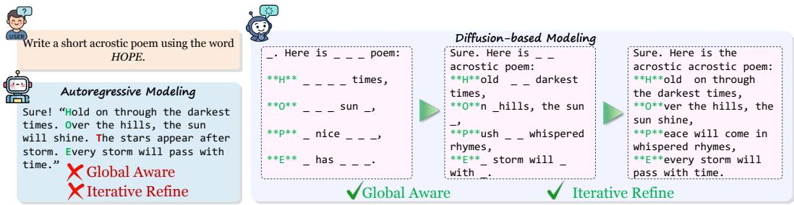
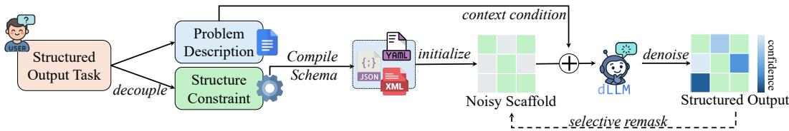
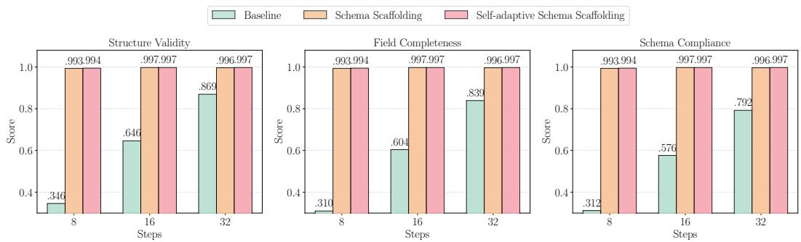
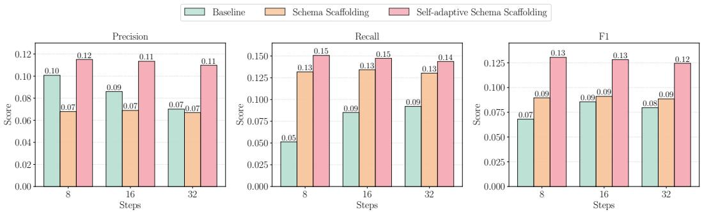

## ABSTRACT

Controllable generation is a fundamental task in NLP with many applications, providing a basis for function calling to agentic communication. However, even state-of-the-art autoregressive Large Language Models (LLMs) today exhibit unreliability when required to generate structured output. Inspired by the current new diffusion-based large language models (dLLM), we realize that the architectural difference, especially the global information-sharing mechanism for language modeling, may be the key to unlock next-level controllable generation. To explore the possibility, we propose Self-adaptive Schema Scaffolding $( S ^ { 3 } )$ , a novel framework that enables dLLM to stably generate reliable structured outputs (e.g., JSON) by utilizing its innate reverse reasoning capability and global context awareness. $S ^ { \mathbf { \check { 3 } } }$ initiates a schematic template directly in the output context as a starting state for dLLM, offering a more robust and general method than intricate prompt optimization. Experiments demonstrate that our method substantially unlocks the dLLM’s potential in controllable generation in terms of structure adherence, content fidelity, and faithfulness. These results establish new perspectives and practical pathways for deploying language models in controllable generation tasks.

## 1 INTRODUCTION

Controllable generation is a fundamental task in the era of LLMs. It provides the foundation for stable tool use, agentic communication, and interaction with existing application programming interfaces (APIs). Existing works demonstrate that structured output still poses significant challenges even for state-of-the-art autoregressive LLMs. Many inspiring explorations have been conducted by previous researchers to address these challenges.

Prior autoregressive-based language model’s methods pair a grammar-driven finite-state automata (FSA) with constrained decoding to enforce structural constraints during generation (Koo et al., 2024). When no token satisfies the grammar, all beams are pruned and generation halts. More broadly, as instruction following has improved, practitioners have turned to prompt-engineering heuristics to elicit structurally compliant outputs. Yet hand-crafted prompts for diverse structural specifications are labor-intensive and yield inconsistent results across domains and complexity levels.

Existing approaches share a fundamental limitation: they rely solely on language models’ intrinsic capabilities without additional mechanisms to guide generation trajectories. This stems from architectural constraints of autoregressive models: (1) left-to-right generation prevents global structural coherence, as early tokens are generated without full sequence knowledge; (2) commitment to previously generated tokens limits backtracking when structural violations occur; (3) sequential dependencies inhibit simultaneous satisfaction of multiple constraints. Effective structured generation thus requires global sequence planning, iterative refinement, and parallel constraint satisfaction—capabilities that autoregressive architectures inherently lack.

  
Figure 1: Illustrative comparison between autoregressive and diffusion-based language modeling on tasks requires specific global structure control and token-space planning in advance.

Under this scenario, we realize that the diffusion-based large language model (dLLM) can serve as a natural alternative to traditional autoregressive (AR) generation by iteratively denoising corrupted inputs, enabling global context modeling potential and parallel token generation (Arriola et al., 2025; Nie et al., 2025; Yu et al., 2025). Recent studies show that dLLMs can match AR models in instruction following, in-context learning, and math reasoning tasks (Gong et al., 2024; You et al., 2025), while also offering enhanced controllability and faster inference (Huang & Tang, 2025; Labs et al., 2025).

However, current open-sourced instruction-tuned dLLMs (Nie et al., 2025; Zhu et al., 2025; Ye et al., 2025b) fail to produce well-structured outputs, often generating hallucinated content or breaking structural constraints. Additionally, their inference speed remains limited. Analysis reveals that existing implementations (e.g., semi-autoregressive approaches Nie et al. (2025)) systematically undermine dLLMs’ advantages in global awareness and parallel generation.

To unveil its full potential, we introduce a novel Self-adaptive Schema Scaffolding (S3) method to fully unlock dLLM’s potential in controllable generation. Specifically, S3 inject a schematic template into the output context instead of instruction, providing a more compelling language prior for dLLM during generation. With our method, dLLM can achieve significantly improved structured output quality. To quantify performance, we introduce a comprehensive framework that evaluates structured outputs along three key dimensions: structural adherence, content fidelity, and faithfulness (with detailed definitions provided in Section 5). Experimental results show that our method marginally improves the performance structured output using dLLM compared with the commonly used prompting strategy.

Our main contributions can be summarized as follows: 1) We analyze the architectural advantages of diffusion-based large language models (dLLMs) compared with autoregressive models for controllable generation, focusing on prior’s global attention mechanism and iterative refinement capabilities. 2) We propose Self-adaptive Schema Scaffolding (S3), a training-free method that enables dLLMs to achieve higher structure output performance with fewer denoising steps. 3) We establish a comprehensive structure output evaluation framework focusing on structural adherence, content fidelity, and faithfulness metrics. Extensive experiments show that our S3 achieves superior performance across all metrics with reduced computational complexity. Together, our work establishes a new perspective and practical solutions for deploying dLLMs for controllable generation tasks.

## 2 RELATED WORKS

Structured Output requires models to generate in predefined formats (e.g., code, JSON, XML, or tables), supporting tasks such as entity extraction (Li et al., 2024), classification Huang et al. (2025), and correlation prediction Xiong et al. (2025). Grammar-constrained decoding enforces compliance with context-free grammars (Geng et al., 2023) or type systems (Mundler et al., 2025)¨ by adjusting next-token probabilities, without task-specific fine-tuning. Alternatively, planningbased or two-stage strategies first predict intermediate structures, such as abstract syntax trees, and then realize the final output (Wang et al., 2025). Most prior work relies on autoregressive LLMs for their strong language modeling and instruction-following ability (Wei et al., 2022). Diffusion-based models remain underexplored, motivating us to analyze their potential for structured generation and propose an evaluation framework covering structure compliance, content fidelity, and hallucination.

Autoregressive Large Language Models Autoregressive LLMs have become a general solution across NLP tasks, strengthened by advances such as longer context windows (Liu et al., 2025), multimodal integration (Han et al., 2025), and test-time scaling (Jaech et al., 2024; Guo et al., 2025; Gemini Team, Google, 2025). They achieve state-of-the-art results on benchmarks including MMLU (Hendrycks et al., 2020), WebArena (Zhou et al., 2023), and AIME (Zhang, 2025), but still face persistent challenges in hallucination and controllability.

Diffusion-based Language Models Diffusion models have recently been extended to discrete text, offering an alternative to autoregressive generation (Li et al., 2023). Research has introduced discrete score-based processes, refined noise schedules, and faster sampling methods, all aimed at improving efficiency and output quality. Building on these advances, large diffusion language models such as LLaDA (Nie et al., 2025; Zhu et al., 2025) and Dream (Ye et al., 2025b) demonstrate strong instruction-following ability. Yet their reliance on multi-step denoising weakens the advantage of parallel generation and slows inference (Israel et al., 2025). Motivated by these limitations, we focus on structured output as a setting where diffusion models can better exploit their architecture, and propose an inference pipeline that accelerates generation for practical applications.

## 3 PRELIMINARY AND NOTATIONS

## 3.1 AUTOREGRESSIVE LANGUAGE MODELING

Autoregressive large language models (LLMs) generate text by predicting the next token. During inference, instruction-tuned models (Ouyang et al., 2022; Wei et al., 2022) produce a response A to a query $Q$ by sampling from the conditional distribution

$$
\log P _ {\theta} (A | Q) = \sum_ {t = 1} ^ {| A |} \log P _ {\theta} (a _ {t} | a _ {<   t}, Q),\tag{1}
$$

where $A = ( a _ { 1 } , \ldots , a _ { \left| A \right| } ) , a _ { t }$ is the token at position $t , \ a _ { < t }$ are the preceding tokens, $| A |$ is the sequence length, and θ are model parameters.

Due to the sequential nature of autoregressive generation, there are two systematic limitations: models cannot directly access future token information during generation, and previously generated tokens cannot be revised. These constraints may limit the model’s performance on tasks that would benefit from lookahead planning or iterative refinement.

## 3.2 DIFFUSION LANGUAGE MODELING

Diffusion models (Ho et al., 2020; Nichol & Dhariwal, 2021), originally developed for continuous image generation tasks, have been adapted to discrete language modeling (Austin et al., 2021a; Nie et al., 2025; Ye et al., 2025b).

Diffusion-based language models consist of two key processes: a forward noising process and a reverse denoising process. Given a tokenized sequence $\mathbf { x } _ { \mathrm { 0 } }$ , the forward process progressively corrupts the sequence by masking tokens, producing increasingly noisy sequences $\mathbf { x } _ { t }$ for $t \in [ 0 , 1 ]$ . As t approaches 1, more tokens are masked until $x _ { 1 }$ becomes a fully masked sequence. The reverse process trains a neural network to predict the original tokens at masked position within $x _ { t }$ for $t \in ( 0 , 1 ]$ . The pre-training objective can be formulated as:

$$
\min _ {\phi} - \mathbb {E} _ {t, x _ {0}, x _ {t}} \left[ \frac {1}{t} \sum_ {i = 1} ^ {L} \mathbf {1} [ x _ {t} ^ {i} = \mathbf {M} ] \log P _ {\phi} (x _ {0} ^ {i} | x _ {t}) \right]\tag{2}
$$

where M denotes the mask token, L is the sequence length, and ϕ represents the model parameters.

Recent research showed that diffusion large language model (dLLM) can be instruction-finetuned by concatenating (⊕) user instruction $Q$ as fixed prefix to the masked target sequence ${ \bf A } _ { t } \left( t = 1 \right.$ , all masked initially), enabling conditioned generation. During inference, a single denoising step that the dLLM take can be factorized as:

$$
\log P _ {\phi} (Q \oplus A) = \sum_ {i = 1} ^ {| A |} \mathbf {1} [ a _ {i} = \mathbf {M} ] \log P _ {\phi} (a _ {i} | Q \oplus A _ {t})\tag{3}
$$

  
Figure 2: The overview of our method’s pipeline. We begin by decomposing the original task instruction into two components: a problem description and a set of structural constraints. These constraints are compiled into a schema, which is then used to initialize a noisy scaffold where mask tokens serve as placeholders for missing content. The dLLM completes this scaffold by predicting the masked tokens, using the problem description as context to generate structured outputs. Additionally, we apply a selective remasking strategy that allows the model to iteratively refine its predictions and further improve generation quality.

Compared with AR models, the multi-step generation process can potentially be extended for iterative token edition and refinement (Havasi et al., 2025). More interestingly, the global attention mechanism of dLLM can largely improve its global context awareness and even including future planning capabilities (Ye et al., 2025b; 2024; 2025a) (See Appendix G). Therefore, in this paper, we exploit dLLM’s superior global awareness and explore its potential for structured output.

## 4 METHODS

In this section, we first establish a rigorous theoretical framework for structured output generation (Section 4.1). Subsequently, we introduce our training-free pipeline, Schema Scaffolding $\mathsf { \bar { \rho } } _ { ( S ^ { 2 } ) }$ (Section 4.2) and its improved version Self-adaptive Schema Scaffolding (S3)(Section 4.3).

## 4.1 TASK FORMALIZATION

Formally, we define structured output generation task as follows: given a user query $Q ,$ and a structural specification S, the objective is to generate a response A that satisfies both the semantic requirements of Q and the structural constraints defined by S. The structural specification S can take various forms, including but not limited to: schema-based structures, format constraints, compositional structures, and domain-specific formats. The task can be mathematically formulated as a constrained optimization problem:

$$
A ^ {*} = \arg \max _ {A \in \mathcal {A} (S)} P _ {\mathrm{LM}} (A | Q, S)\tag{4}
$$

where $\boldsymbol { \mathcal { A } } ( \boldsymbol { S } )$ represents the space of all valid outputs conforming to structure $S$ and $P _ { \mathrm { L M } }$ is a conditional langugage model. In practice, searching entire A(S) is intractable due to the complexity of the token space.

## 4.2 SCHEMA SCAFFOLDING

Building on the theoretical insight we formulated in Section 3.2, we propose schema scaffolding, a training-free approach that explicitly incorporates structural constraints by pre-populating the generation context with structural templates.

The core idea of this approach is to transform unconstrained generation into a structured fill-inthe-blank task: In detail, our method operates by parsing the structural specification S to identify invariant structural elements (e.g., brackets, delimiters, field names) and replacing variable content positions with mask tokens M. This creates a structural scaffold As that constrains the model’s generation space while preserving semantic flexibility (See Appendix B for more details). To formalize why this approach is effective for diffusion models, we establish the following result:

Theorem 4.1 (Scaffold-Guided Denoising Convergence). Let $\mathbf { x } _ { \mathrm { 0 } }$ be a target structured sequence and $\mathbf { x } _ { t }$ be a partially masked sequence at timestep t with scaffold S defining fixed structural positions. For a diffusion language model trained with objective (Eq. 2), initializing the denoising process with structural scaffold S reduces the expected denoising error by:

$$
\mathbb {E} [ \| \hat {\mathbf {x}} _ {0} - \mathbf {x} _ {0} \| _ {\mathcal {M}} ] \leq \mathbb {E} [ \| \tilde {\mathbf {x}} _ {0} - \mathbf {x} _ {0} \| _ {\mathcal {M}} ] \cdot \left(1 - \frac {| \mathcal {S} |}{L}\right)\tag{5}
$$

where $\hat { \mathbf { x } } _ { 0 }$ is generated with scaffolding, $\tilde { \mathbf { x } } _ { 0 }$ is generated without scaffolding, $\| \cdot \| _ { \mathcal { M } }$ denotes error over masked positions only, and $| S | / L$ represents the scaffold coverage ratio.

The proof is deferred to Appendix F.1. This result confirms that scaffolding provides a principled way to guide the denoising process, with error reduction proportional to the scaffold coverage. It also confirms our later empirical findings where even minimal scaffolding achieves near-perfect structural adherence.

Formally, the structured generation objective of our proposed method here is:

$$
\begin{array}{r l} & A ^ {*} = \arg \max _ {A \in \mathcal {A} (S)} P _ {\mathrm{LM}} (A | Q, S) \\ & \approx \arg \max _ {A _ {s} \in \mathcal {S C}} P _ {\phi} (A _ {s} | Q) \\ & = \arg \max _ {A _ {s} \in \mathcal {S C}} \sum_ {a _ {i} \in A _ {s}} \mathbf {1} [ a _ {i} = \mathbf {M} ] \log P _ {\phi} (a _ {i} | Q, A _ {s}) \end{array}\tag{6}
$$

Where ${ \cal S C } \subset { \cal A } ( { \cal S } )$ represents the constrained subspace of outputs sharing the structural template derived from $S _ { \ i }$ and $A _ { s }$ denotes the scaffold with all non-masked tokens fixed except position i.

## 4.3 SELF-ADAPTIVE SCHEMA SCAFFOLDING

While our previous strategy constrains dLLM generation for improved structural compliance, it also introduces another challenge: how to determine the appropriate number of mask tokens $f o r$ each variable content position? Although we can build structured fill-in-the-blank templates in advance, predicting the required length for each variable field remains problematic without prior knowledge of the target content.

A straightforward solution is to allocate ample mask tokens for each variable position, expecting the model to use only what is needed. Yet our analysis (Sec. 6.1) shows that dLLMs are sensitive to sequence length: longer scaffolds often distort generation quality instead of enabling selective usage, leading to under-utilization or hallucinated content. Another option is to introduce specialized padding tokens through fine-tuning. While appealing in principle, this violates our training-free objective and risks embedding dataset-specific biases that harm generalization to unseen domains.

Motivated by these intuitions, we propose an improved method that leverages the semantic token null as an placeholder. This approach preserves the training-free property while guiding dLLMs to naturally represent absent or variable-length content with null tokens.

Formally, we extend our scaffolding framework to incorporate adaptive length management:

$$
A ^ {*} \approx \arg \max _ {A _ {s} \in \mathcal {S C}} \sum_ {a _ {i} \in A _ {s}} \mathbf {1} [ a _ {i} = \mathbf {M} ] \log P _ {\phi} (a _ {i} | Q ^ {+}, A _ {s})\tag{7}
$$

where $Q ^ { + }$ represents our augmented prompt which guide the model to adopt null tokens to indicate absent values.

Our approach here empirically transforms the fixed-length scaffolding problem into an adaptive generation task where dLLMs can naturally handle variable-length fields and missing values. Further experimental results demonstrate that Self-Adaptive Schema Scaffolding significantly improves overall structured output quality, particularly in scenarios involving optional fields or variable-length content.

## 5 EXPERIMENTS

## 5.1 IMPLEMENTATION DETAILS

We use the LLaDA (Nie et al., 2025) model as our primary dLLM for experiments and the WikiBio dataset (Lebret et al., 2016) as our dataset. For reproducibility, we set the decoding temperature to zero during inference. See Appendix A for more details.

## 5.2 EVALUATION FRAMEWORK

Given the unique characteristics of structured output generation, we argue that traditional accuracybased metrics alone are inadequate for capturing the full spectrum of model performance. Thus, we propose a comprehensive evaluation framework that assesses outputs across three key dimensions: Structural Adherence, Content Fidelity, and Faithfulness. This multi-dimensional benchmark enables a more nuanced and reliable assessment of a model’s ability to generate coherent, informative, and trustworthy structured texts.

Structural Adherence measures how well-generated outputs conform to the target schema. Specifically, we define:

• Structure Validity (SV): the proportion of outputs that are syntactically valid and parse without errors, capturing basic structural correctness.

• Field Completeness (FC): the percentage of required fields that are correctly populated, indicating whether the model includes all mandatory schema components.

• Schema Compliance (SC): the strictest structural metric, measuring the proportion of outputs that fully adhere to the predefined schema, including correct data types, value constraints, and nested structures.

Content Fidelity evaluates the semantic accuracy of information within structurally valid outputs. We consider:

• Precision/Recall (PR/RE): precision and recall scores computed over individual field types, providing a detailed view of model behavior across content categories.

• F1 Score (F1): the harmonic mean of field-level precision and recall, computed using both exact match and fuzzy match strategies to accommodate minor textual variations that preserve semantic meaning.

Faithfulness assesses the degree to which generated content remains grounded in the source input, which is especially critical in extraction settings.

• Hallucination Rate (HR): the proportion of output fields that include information not present in or not reasonably inferable from the source text, directly reflecting the model’s factual consistency.

Together, these metrics support systematic comparisons across models and highlight specific areas for targeted improvement in structured output generation.

## 5.3 MAIN RESULTS

This section presents a comprehensive evaluation of our approaches against baseline methods across three critical dimensions: structural adherence, content fidelity, and faithfulness.

## 5.3.1 STRUCTURAL ADHERENCE

Direct prompting dLLM is inadequate for structural constraint. Our baseline evaluation reveals performance consistently below 65% across all structural metrics—Schema Validity, Field Completeness, and Schema Compliance. Even with 32 denoising steps, the maximal score among these three critical metrics is above 87%, far lower than the expectation for realistic utility.(Fig. 3).

Our schema scaffolding methods marginally outperform the baseline method in terms of structural adherence. Both vanilla and self-adaptive variants enable near-perfect structural adherence with as few as 8 denoising steps, achieving performance saturation at 16 steps. This dramatic improvement carries practical significance beyond accuracy: since diffusion model inference scales linearly with denoising steps, our approach simultaneously reduces generation latency while enhancing structural quality. These findings establish that schema scaffolding addresses the fundamental barrier to deploying diffusion-based language models for structured output generation, elevating them from impractical to highly effective for real-world applications.

  
Figure 3: Structural adherence comparison across denoising steps and methods. Results show consistent improvements across all metrics using our schema scaffolding approaches, with nearperfect performance achieved in fewer steps.

## 5.3.2 CONTENT FIDELITY

For content fidelity, additional denoising steps counterintuitively do not guarantee improved content accuracy and we observe that performance sometimes degrades with extended iteration (Fig. 4). This pattern reflects the diffusion model may deviation from optimal solutions during extended iterative reverse process, what we term the ”overthinking” phenomenon.

Vanilla Schema Scaffolding demonstrates clear improvements in recall and F1 score relative to baseline, indicating enhanced coverage of relevant content. However, precision suffers notably across all denoising configurations. This trade-off emerges from the model’s compensatory behavior: when constrained by rigid schema requirements, it over-generates tokens to fill all reserved slots, particularly problematic when content length varies significantly across examples.

Our Self-adaptive Schema Scaffolding $( S ^ { 3 } )$ resolves this tricky situation. By incorporating adaptive null token for surplus slots, the method prevents over-generation while main-

<table><tr><td rowspan="2">Method</td><td colspan="3">Computation Budget</td></tr><tr><td>8 Steps</td><td>16 Steps</td><td>32 Steps</td></tr><tr><td>Baseline</td><td>0.404</td><td>0.403</td><td>0.409</td></tr><tr><td> $S^{2}$ </td><td>0.465</td><td>0.463</td><td>0.463</td></tr><tr><td> $S^{3}$ </td><td>0.340</td><td>0.331</td><td>0.331</td></tr></table>

Table 1: Hallucination rate (lower is better) comparison across various denoising steps. Our self-adaptive schema scaffolding $\bar { ( S ^ { 3 } ) }$ method consistently achieves the lowest hallucination rates, indicating superior faithfulness. Boldface indicates the best results.

taining comprehensive coverage. This simple yet effective recipe yields substantial improvements across all three metrics, establishing robust content fidelity without sacrificing structural compliance.

## 5.3.3 FAITHFULNESS

Our self-adaptive schema scaffolding $( S ^ { 3 } )$ method demonstrates superior faithfulness performance, consistently achieving the lowest hallucination rates across all denoising steps (Tab. 1). This clear advantage over baseline approaches establishes the superiority of our method in maintaining factual grounding while generating structured outputs.

Interestingly, vanilla schema scaffolding reveals elevated hallucination rates compared to baseline methods. The worse performance in faithfulness represents a critical weakness that challenges our original design of the Schema Scaffolding approach. Our analysis reveals that this hallucination issue stems from the distributional shifts introduced by the imposed structural constraints, which create a token distribution that diverges from the model’s pre-training reverse process. Specifically, the rigid schema acts as a structural prior that misaligned with the diffusion language model’s learned denoising process. This distributional mismatch forces the model into suboptimal denoising trajectories. When the structural prior demands content generation beyond what can be grounded in the source text, the model defaults to fabricating plausible tokens to satisfy schema requirements—a behavior that contradicts its training objective of faithful reconstruction.

  
Figure 4: Content fidelity comparison across denoising steps and methods. Our self-adaptive schema scaffolding consistently achieves the highest precision, recall, and F1 score across all settings.

Our self-adaptive approach mitigates this fundamental conflict by allowing the model to acknowledge missing information through null tokens, thus maintaining alignment with its pre-trained denoising capabilities while respecting structural constraints.

## 5.3.4 ABLATION STUDY

To demonstrate the effectiveness of our approach, we conduct ablation studies comparing our method against baseline models that are incrementally enhanced with different techniques (Tab.2). While few-shot learning and template-as-guidance approaches improve dLLM’s structural adherence and faithfulness, their performance on fidelity remains inconsistent and shows limited improvement. In contrast, our zero-shot method achieves superior data efficiency and computational efficiency. We also observe strong diminishing returns beyond 8 denoising steps, indicating that the structural constraints provided by the scaffold are realized rapidly during inference. Despite requiring fewer denoising steps, S3 delivers remarkably stable structural adherence, along with marginal improvements in both fidelity and faithfulness. We also tested additional datasets to validate the generalizability of our approach (See Appendix D more results).

## 6 DISCUSSION

## 6.1 ROBUSTNESS AGAINST HALLUCINATION

Similar to autoregressive language models, diffusion-based language models (dLLMs) also suffer from hallucination—generating nonfactual content, faulty reasoning, or unsupported conclusions. Unlike open-ended dialogue or creative text generation, hallucination in structured output is particularly detrimental, as it directly undermines the reliability and trustworthiness of the output—qualities that are central to these tasks.

Our vanilla schema scaffolding method enforces a strong structural constraint, which inevitably interferes with the natural generation trajectory of dLLMs. To mitigate the resulting hallucination, we observe that it is possible to transform unfamiliar test-time scenarios into familiar training-time cases by providing sufficient in-context guidance. Thus, we introduce the notion of a special token, null, as a flexible placeholder. Once the model adapts this convention, it can fill otherwise empty slots without resorting to fabricated content, despite not being explicitly trained to use padding tokens. This simple yet effective prior guidance enables dLLMs to substantially reduce hallucination, and it inspired the formulation of our improved $S ^ { 3 }$ method.

<table><tr><td rowspan="2">Experiment</td><td colspan="3">Structural Adherence</td><td colspan="3">Content Fidelity</td><td>Faithfulness</td></tr><tr><td>SV↑</td><td>FC↑</td><td>SC↑</td><td>PR↑</td><td>RE↑</td><td>F1↑</td><td>HR↓</td></tr><tr><td colspan="8">8 Steps</td></tr><tr><td>baseline</td><td>0.346</td><td>0.310</td><td>0.312</td><td>0.101</td><td>0.051</td><td>0.068</td><td>0.404</td></tr><tr><td>w/ few-shots</td><td>0.471</td><td>0.447</td><td>0.443</td><td>0.086</td><td>0.056</td><td>0.068</td><td>0.366</td></tr><tr><td>w/ template</td><td>0.475</td><td>0.432</td><td>0.431</td><td>0.088</td><td>0.081</td><td>0.084</td><td>0.388</td></tr><tr><td> $S^3$  (ours)</td><td>0.994</td><td>0.994</td><td>0.994</td><td>0.115</td><td>0.151</td><td>0.130</td><td>0.340</td></tr><tr><td colspan="8">16 Steps</td></tr><tr><td>baseline</td><td>0.646</td><td>0.604</td><td>0.576</td><td>0.086</td><td>0.085</td><td>0.086</td><td>0.403</td></tr><tr><td>w/ few-shots</td><td>0.735</td><td>0.713</td><td>0.674</td><td>0.084</td><td>0.087</td><td>0.085</td><td>0.371</td></tr><tr><td>w/ template</td><td>0.794</td><td>0.734</td><td>0.738</td><td>0.091</td><td>0.139</td><td>0.110</td><td>0.390</td></tr><tr><td> $S^3$  (ours)</td><td>0.997</td><td>0.997</td><td>0.997</td><td>0.113</td><td>0.147</td><td>0.128</td><td>0.331</td></tr><tr><td colspan="8">32 Steps</td></tr><tr><td>baseline</td><td>0.869</td><td>0.839</td><td>0.792</td><td>0.070</td><td>0.092</td><td>0.080</td><td>0.409</td></tr><tr><td>w/ few-shots</td><td>0.890</td><td>0.870</td><td>0.824</td><td>0.092</td><td>0.114</td><td>0.101</td><td>0.358</td></tr><tr><td>w/ template</td><td>0.909</td><td>0.886</td><td>0.882</td><td>0.091</td><td>0.160</td><td>0.116</td><td>0.384</td></tr><tr><td> $S^3$  (ours)</td><td>0.997</td><td>0.997</td><td>0.997</td><td>0.110</td><td>0.144</td><td>0.125</td><td>0.331</td></tr></table>

Table 2: Ablation study results comparing different experimental configurations. Boldface indicates the best results. We use 3 examples for few-shot learning (Wei et al. (2022)). To follow previous practice, we also extend the instruction with a complete schema (Wang et al. (2025)) as guidance. Our method consistently outperforms these alternative techniques, indicating a nontrivial and superior improvement.

## 6.2 COMPLEXITY ANALYSIS

An existing bottleneck of dLLMs lies in their inference speed. Empirically, the multi-step denoising process introduces a latency that grows positively with the number of diffusion steps. Within each step, the global attention computation incurs a quadratic cost with respect to the total context length L. As a result, the overall computational complexity of the reverse process scales as $\mathcal { O } ( L ^ { 3 } )$ . To mitigate this cost, some implementations adopt a semi-autoregressive decoding scheme with blockwise KV-caching, which partially reduces the computational burden. However, this design still compromises the core parallelism advantages of diffusion-based decoding.

For structured generation tasks, where the output structure is known or can be approximated, our proposed method $S ^ { 3 }$ introduces an alternative perspective and initialize the reverse process from a partially denoised state rather than a fully random one. This warm-start initialization serves as a structural prior, effectively providing a language scaffold that accelerates generation and enhances controllability. Asymptotically, $S ^ { 3 }$ reduces the decoding complexity to $\check { \mathcal { O } ( } n L ^ { 2 } )$ , where n is a tunable hyperparameter that remains significantly smaller than L in practice.

## 7 CONCLUSION

In this paper, we explore the potential of diffusion large language models’ global awareness for controllable generation of structured output. We propose the novel Self-adaptive Schema Scaffolding method $( \bar { S } ^ { 3 } )$ that guides dLLMs to adaptively generate fully controllable structured output by manipulating the reverse process and leveraging the innate global attention mechanism. Our comprehensive evaluation framework demonstrates that $S ^ { 3 }$ achieves superior structural adherence, content fidelity, and reduced hallucination rates. Through complexity analysis, we show that our approach maintains computational efficiency while enabling higher levels of controllability and hallucination control. We believe these findings establish dLLMs as a promising alternative for controllable generation tasks.

## ACKNOWLEDGMENTS

The work is partially supported by the U.S. National Science Foundation (NSF) Grant CRII 2451683, an NVIDIA Academic Grants Program, a U.S. Bank Academic Research Award, the University of California, Merced, and a UC Merced Faculty Research Award. The views and conclusions are those of the authors and do not necessarily reflect the official policy or position of the U.S. Government.

## REFERENCES

Marianne Arriola, Aaron Gokaslan, Justin T Chiu, Zhihan Yang, Zhixuan Qi, Jiaqi Han, Subham Sekhar Sahoo, and Volodymyr Kuleshov. Block diffusion: Interpolating between autoregressive and diffusion language models. arXiv preprint arXiv:2503.09573, 2025.

Jacob Austin, Daniel D Johnson, Jonathan Ho, Daniel Tarlow, and Rianne Van Den Berg. Structured denoising diffusion models in discrete state-spaces. Advances in neural information processing systems, 34:17981–17993, 2021a.

Jacob Austin, Augustus Odena, Maxwell Nye, Maarten Bosma, Henryk Michalewski, David Dohan, Ellen Jiang, Carrie Cai, Michael Terry, Quoc Le, et al. Program synthesis with large language models. arXiv preprint arXiv:2108.07732, 2021b.

Paweł Budzianowski, Tsung-Hsien Wen, Bo-Hsiang Tseng, Inigo Casanueva, Stefan Ultes, Osman˜ Ramadan, and Milica Gasiˇ c. Multiwoz–a large-scale multi-domain wizard-of-oz dataset for task-´ oriented dialogue modelling. arXiv preprint arXiv:1810.00278, 2018.

Gemini Team, Google. Gemini 2.5: Pushing the frontier with advanced reasoning, multimodality, long context, and next generation agentic capabilities. Technical report, Google DeepMind, June 2025. URL https://storage.googleapis.com/deepmind-media/gemini/ gemini\_v2\_5\_report.pdf. Technical Report.

Saibo Geng, Martin Josifoski, Maxime Peyrard, and Robert West. Grammar-constrained decoding for structured nlp tasks without finetuning. arXiv preprint arXiv:2305.13971, 2023.

Shansan Gong, Shivam Agarwal, Yizhe Zhang, Jiacheng Ye, Lin Zheng, Mukai Li, Chenxin An, Peilin Zhao, Wei Bi, Jiawei Han, et al. Scaling diffusion language models via adaptation from autoregressive models. arXiv preprint arXiv:2410.17891, 2024.

Daya Guo, Dejian Yang, Haowei Zhang, Junxiao Song, Ruoyu Zhang, Runxin Xu, Qihao Zhu, Shirong Ma, Peiyi Wang, Xiao Bi, et al. Deepseek-r1: Incentivizing reasoning capability in llms via reinforcement learning. arXiv preprint arXiv:2501.12948, 2025.

Longzhen Han, Awes Mubarak, Almas Baimagambetov, Nikolaos Polatidis, and Thar Baker. Multimodal large language models: A survey. arXiv preprint arXiv:2506.10016, 2025.

Marton Havasi, Brian Karrer, Itai Gat, and Ricky TQ Chen. Edit flows: Flow matching with edit operations. arXiv preprint arXiv:2506.09018, 2025.

Dan Hendrycks, Collin Burns, Steven Basart, Andy Zou, Mantas Mazeika, Dawn Song, and Jacob Steinhardt. Measuring massive multitask language understanding. arXiv preprint arXiv:2009.03300, 2020.

Jonathan Ho, Ajay Jain, and Pieter Abbeel. Denoising diffusion probabilistic models. Advances in Neural Information Processing Systems, 33:6840–6851, 2020.

Chihan Huang and Hao Tang. Ctrldiff: Boosting large diffusion language models with dynamic block prediction and controllable generation. arXiv preprint arXiv:2505.14455, 2025.

Yuting Huang, Meitong Guo, Yiquan Wu, Ang Li, Xiaozhong Liu, Keting Yin, Changlong Sun, Fei Wu, and Kun Kuang. Appealcase: A dataset and benchmark for civil case appeal scenarios. arXiv preprint arXiv:2505.16514, 2025.