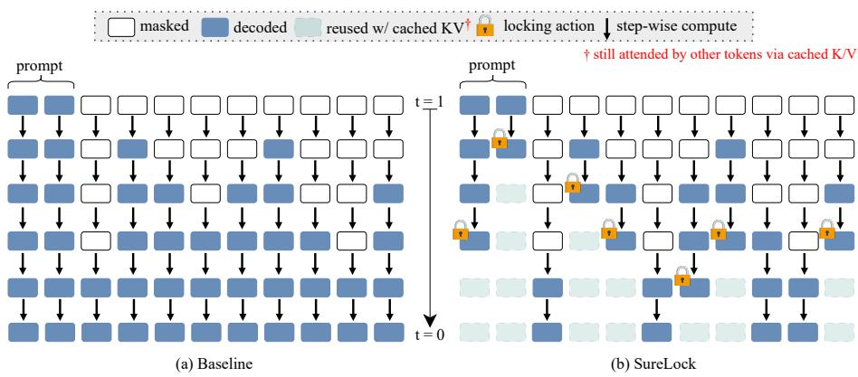
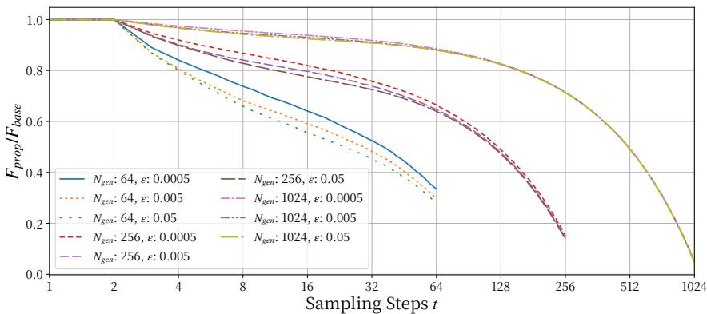
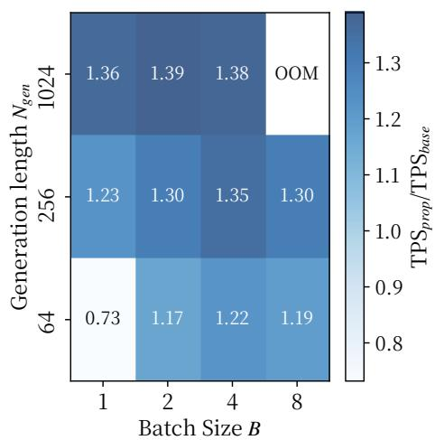
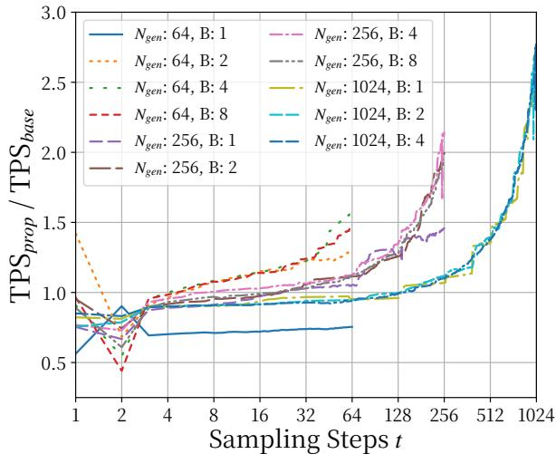

## ABSTRACT

Masked Diffusion Language Models generate sequences via iterative sampling that progressively unmasks tokens. However, they still recompute the attention and feed-forward blocks for every token position at every step—even when many unmasked tokens are essentially fixed, resulting in substantial waste in compute. We propose SURELOCK: when the posterior at an unmasked position has stabilized across steps (our sure condition), we lock that position—thereafter skipping its query projection and feed-forward sublayers—while caching its attention keys and values so other positions can continue to attend to it. This reduces the dominant per-iteration computational cost from $O ( N ^ { 2 } d )$ to $O ( M N d )$ where N is the sequence length, M is the number of unlocked token positions, and d is the model dimension. In practice, M decreases as the iteration progresses, yielding substantial savings. On LLaDA-8B, SureLock reduces algorithmic FLOPs by 30– 50% relative to the same sampler without locking, while maintaining comparable generation quality. We also provide a theoretical analysis to justify the design rationale of SureLock: monitoring only the local KL at the lock step suffices to bound the deviation in final token probabilities. Our project page is available at https://daioba.github.io/surelock.

## 1 INTRODUCTION

Discrete diffusion language models (DLMs) generate text by iteratively denoising a discrete sequence over T steps (Li et al., 2022; Schiff et al., 2024); While its formulation varies (e.g., token swap, insertion, or masking), a widely used family operates through masking and unmasking— Masked Diffusion Language Models (MDLMs) (Sahoo et al., 2024; Shi et al., 2024; Nie et al., 2025; Arriola et al., 2025). Unlike autoregressive (AR) decoding (Vaswani et al., 2017)—whose per-step compute naturally grows by one query token via a KV–cache—standard diffusion-style sampling repeatedly recomputes self-attention and per-token feed-forward sublayers for all N token positions<sup>1</sup> at every step—even for tokens that have already been unmasked and considered to be stable. Hence, the per-block cost is dominated by computing the attention scores $Q K ^ { \top }$ and applying them to $V , \operatorname { i . e . , } \bar { O } ( N ^ { 2 } d )$ where d is the model dimension. It leads to substantial waste in compute.

To address the computational challenges of DLM sampling, prior work has mainly progressed along two axes: Temporal approaches shrink the step count—e.g., parallel/dilated unmasking and staged or learned samplers—thereby requiring fewer refinement (Luxembourg et al., 2025; Israel et al., 2025; Wei et al., 2025); Reuse approaches reduce per-step compute by reusing or approximating $K / V$ vectors and partially updating hidden features across steps (Ma et al., 2025; Liu et al., 2025b; Wu et al., 2025a). These choices chiefly either reduce the step count $T$ or amortize work across steps by reusing intermediate states; they do not alter the within-step spatial granularity: each step still issues N query rows, so the attention-dominated cost remains $\bar { O ( N ^ { 2 } d ) }$ even in late iterations.

Beyond reducing the step count T or reusing $K / V$ across steps, we pursue a largely orthogonal axis: permanently and monotonically deactivating token positions as the sampling unfolds. We propose SURELOCK: once a token’s posterior has stabilized, we lock that position—we cache $K / V$ vectors and therefore skip its Q-projection and per-token feed-forward sublayers. Active token positions can still attend to the locked ones via the cached $K / V \ ( \mathrm { S e c . } \ 2 )$ . The per-block cost becomes $O ( M _ { t } N d )$ for attention and $O ( M _ { t } d ^ { 2 } )$ for FFN, instead of $O ( N ^ { 2 } d )$ and $\bar { O } ( N d ^ { 2 } )$ ), yielding a monotonically decreasing per-step compute profile as $M _ { t }$ shrinks. We lock token positions based on their local stability; a criterion whether the per-step KL divergence of the generative probability distribution falls below a threshold ε. In order to justify using KL as the locking signal, we derive a closed-form bound, which links a per-step KL at locking time to the terminal log-prob deviation<sup>2</sup>. This axis is complementary to the Temporal and Reuse approaches; existing methods continue to operate on the remaining active token positions.

  
Figure 1: Iterative sampling by a normal sampler and SureLock. (a) Baseline consistently recomputes attention scores and FFN sublayers for every token position at every step even after the marginal tokens have become unmasked. (b) SureLock permanently stops recomputing for locked positions once these positions are locked. Via cached ${ \bf { \bar { \Delta } } } K / V$ , other tokens still attend to locked tokens.

Our work is most closely related to selection-based methods (e.g., DLLM-CACHE (Liu et al., 2025b)) lower per-step compute by updating only a subset of positions. SURELOCK, by contrast, answers a different question—what to removefrom compute permanently, instead of what to compute now—so the active position set contracts over time; their selection target of step-wise compute can be tapered down monotonically.

We evaluate SURELOCK on representative MDLMs—LLaDA-8B-Base/-Instruct (Nie et al., 2025)—in Sec. 3. Across diverse decoding settings (e.g., sequence length, locking threshold), perstep algorithmic FLOPs are monotonically decreasing. On continuation generation with WikiText-103 (Merity et al., 2016) and instruction following with MT-Bench (Zheng et al., 2023), SURELOCK reduces algorithmic FLOPs up to 50% in our runs without an expense of generation quality.

## 2 SURELOCK

We consider MDLMs that iteratively denoise a length-N sequence, producing intermediate sequences over steps $t = 1 , \dots , T$ . At step $t ,$ an L-block Transformer yields token-wise logits $ { \boldsymbol { z } } _ { t } ^ { ( i ) }$ and posteriors $p _ { t } ^ { ( i ) } = \mathrm { s o f t m a x } ( z _ { t } ^ { ( i ) } )$ at token position i, together with hidden states $h _ { t } ^ { ( i ) } \in \mathbb { R } ^ { d }$ . Let $\mathcal { M } _ { t } \subseteq [ N ]$ denote the masked positions (prediction targets) and $\bar { \mathcal { M } } _ { t } = [ N ] \setminus \mathcal { M } _ { t }$ the unmasked ones. In the standard dLLM sampler, each step recomputes self-attention and FFN for all tokens.

In the following, we explain the proposed method SURELOCK (Algorithm 1). Once a token’s posterior has stabilized at a step, it locks that token position to stop step-wise computations at all subsequent steps by bypassing sublayers and caching K/V values (Sec. 2.1). Our locking criterion is based on the step-wise KL divergence of the posterior (Sec. 2.2). We explain the rationale of using the KL as locking criterion from a theoretical perspective (Sec. 2.3).

```txt
Algorithm 1 SureLock

Require: sequence length N, total steps T, confidence threshold percentile m, KL threshold ε
Require: vocabulary set V, number of layers L, an unmasking policy UpdateMASK(·)
1: State: boolean lock ∈ {0, 1}^N (init: all 0), caches C for (k, v) (init: None)
2: State: previous posteriors p_{t-1} (init: None), masked indices M_t (init: [N])
3: State: frozen block-input x ∈ R^{N×d} (init: prompt embeddings)
4: Notation: X_t ∈ R^{N×d} denotes the model input at t (from embeddings or previous step output)
5: for t = 1 to T do ▷ one diffusion step
6:    A_t ← {i | lock_i = 0},    L_t ← {i | lock_i = 1} ▷ active and locked position at t
7: Initialize block input x^{(1)}[A_t] ← X_t[A_t], x^{(1)}[L_t] ← x[L_t]
8: Compute on active positions i ∈ A_t:
9:    for l = 1 to L
10:    Q[A_t], K[A_t], V[A_t] ← Proj_Q,K,V(LN(x^{(l)}[A_t])) ▷ main projections
11:    K^all[A_t] ← K[A_t], K^all[L_t] ← C.k[L_t]; same for V^all ▷ assemble
12:    h^{(l)}[A_t] ← FFN(Attn(Q[A_t], K^all, V^all)) ▷ attention with FFN
13:    x^{(l+1)}[A_t] ← h^{(l)}[A_t],    x^{(l+1)}[L_t] ← x^{(l)}[L_t] ▷ locked rows pass through
14: end for
15: Obtain posteriors p_t[A_t] ← softmax(Proj_out(x^{(L+1)}[A_t]))
16: Unmasking: M_t ← UpdateMASK(p_t, M_t),   M̄_t ← [N] \ M_t ▷ unmask with posterior
17: Score on active positions i ∈ A_t:
18:    u_t^{(i)} ← 1 - max_{v∈V} p_t^{(i)}(v) for i ∈ A_t ▷ confidence value
19:    D_t^{(i)} ← KL(p_t^{(i)}||p_{t-1}^{(i)}) if t > 1 else ∞ ▷ step-wise KL
20: Locking candidates: Z_t ← A_t ∩ M̄_t ▷ must be active & unmasked
21:    θ_m ← Percentile({u_t^{(j)}}_{j∈Z_t}, m) ▷ threshold over candidate positions
22: Lock:
23:    F_t ← {i ∈ Z_t | u_t^{(i)} ≤ θ_m ∧ D_t^{(i)} ≤ ε} ▷ locking evaluation
24:    lock[F_t] ← 1;   C_ℓ.{K,V}[F_t] ← {K_ℓ, V_ℓ}[F_t] ∀ℓ ▷ update locked indices and cache
25:    x[F_t] ← x^{(1)}[F_t] ▷ freeze block-input for future steps
26: end for
```

## 2.1 PERMANENTLY STOPPING STEP-WISE COMPUTE AND CACHING K/V

Once a token i is deemed converged at step $t ^ { \star }$ , we permanently eliminate its position from perstep compute: we cache its $K / \dot { V }$ vectors, and bypass its query projection and per-token FFN at all subsequent steps. Let $\mathcal { L } _ { t }$ be the set of indices locked by step t, and define the active set $A _ { t } : =$ $\bar { \mathcal { M } } _ { t } \backslash \mathcal { L } _ { t }$ (unmasked and not yet locked). At step t we assemble the queries $Q [ \boldsymbol { A } _ { t } ]$ and run a variablelength attention kernel against the full key/value tables $K ^ { \mathrm { a l l } }$ and $\dot { V } ^ { \mathrm { a l l } }$ where $\breve { K } ^ { \mathrm { a l l } } [ \mathcal { L } _ { t } ] , V ^ { \mathrm { a l l } } [ \mathcal { L } _ { t } ]$ are read from cache. This yields attention outputs only for active positions $\in \mathcal { A } _ { t }$ , and we apply the FFN sublayers only to them. Moreover, for locked indices $i \in \mathcal { L } _ { t } ^ { - }$ we keep their predictions fixed, i.e., $p _ { t } ^ { ( i ) }  p _ { t ^ { \star } } ^ { ( i ) }$ , and skip their FFN computation. Note that locked positions continue to be attended by other tokens via cached $K / V$

## 2.2 CRITERION FOR LOCKING: STEP-WISE KL DIVERGENCE

Our locking rule is driven primarily by local KL; we will justify the validity of this design in Theorem 1 in Sec. 2.3. We also apply a confidence gating as a secondary safeguard to prefer more confident tokens with peaked posteriors. Disabling the confidence gate leaves the theorem unchanged.

Primary: Local KL divergence. For position i at step t, we define the one-step divergence as

$$
D _ {t} ^ {(i)} \triangleq \mathrm{KL} \left(p _ {t} ^ {(i)} \| p _ {t - 1} ^ {(i)}\right).
$$

Optional: Confidence gate. Let uncertainty $u _ { t } ^ { ( i ) } { = } 1 - \operatorname* { m a x } _ { v \in \mathcal { V } } p _ { t } ^ { ( i ) } ( v )$ and $q _ { m } ( u _ { t } )$ the empirical m-th percentile of $\{ u _ { t } ^ { ( j ) } : j \in \mathcal { A } _ { t } \}$ . When enabled, the gate accepts token position i as a locking candidate, if $u _ { t } ^ { ( i ) } \leq q _ { m } ( u _ { t } )$ , i.e., top-m% confidence among active tokens.

Locking rule. We lock token position i at step $t ^ { \star }$ , if

$D _ { t ^ { \star } } ^ { ( i ) } \leq \varepsilon$ and, if the confidence gate is enabled, $u _ { t ^ { \star } } ^ { ( i ) } \leq q _ { m } ( u _ { t ^ { \star } } )$

The primary criterion alone suffices Theorem 1. Upon locking we cache $( k _ { t ^ { \star } } ^ { ( i ) } , v _ { t ^ { \star } } ^ { ( i ) } )$ and remove position i from $\mathcal { A } _ { > i }$ <sub>t</sub> thereafter. Unless otherwise noted, the criterion is based on the raw posterior before any temperature scaling. Therefore, SureLock is independent of sampling temperature in the categorical sampling (See appendix F for discussion on this choice).

## 2.3 DESIGN JUSTIFICATION

The purpose of this section is design-theoretic: we justify the use of a local KL threshold as a locking (freezing) criterion by proving that it upper-bounds the terminal error of the log-probability in closed form. The controller based on SURELOCK locks position i at step $t ^ { \star }$ , bypassing Q-projection and FNN sublayers, and reusing its cached $K / V$ thereafter (Alg. 1). We establish that the resulting error of the terminal log-probabilities, relative to an alternative identical sampler without locking, is bounded by $\begin{array} { r l r } { \delta } & { { } = } & { \overline { { C } } _ { \mathrm { t a i l } } \sqrt { \varepsilon } } \end{array}$ under some assumptions, where $C _ { \mathrm { t a i l } }$ depends on operator-norm constants of the model and ε is the threshold for determining lock $( \mathrm { i . e . , } D _ { t ^ { \star } } ^ { ( i ) } \leq \varepsilon )$ . Therefore, the local KL criterion immediately converts to an explicit design for the terminal error $( \varepsilon ( \delta ) = \delta ^ { 2 } / C _ { \mathrm { t a i l } } ^ { 2 } )$ . In the following, $p _ { t } ^ { ( i ) }$ and $ { \boldsymbol { z } } _ { t } ^ { ( i ) }$ denote the posterior and logits at position i after step t in the no-lock run, while $\hat { p } _ { t } ^ { ( i ) }$ denotes the corresponding posterior when i is locked at $t ^ { \star }$ .

Note. We emphasize that we here justify the use of a local KL threshold as a locking criterion by proving that it upper-bounds the terminal error in closed form, rather than to predict an empirical error value for a given specific setting.

Standing assumptions for Theorem 1. Theorem 1 relies on four main assumptions. We emphasize that these are simplifying regularity conditions introduced for analytical tractability, and that Theorem 1 should be interpreted as an idealized model of the behavior we observe empirically. For Assumption A2, which may appear rather strong, Appendix C shows that its implications do not deviate substantially from the practical situations. Let z the logit and $f ( z ) = \log \operatorname { s o f t m a x } ( z )$ ). Fix constants $L > 0 , L _ { \mathrm { s m } } > 0 .$ , and $\rho \in ( 0 , 1 )$ ). For any position i and step s, the following hold:

(A1) Locking semantics. Once i is locked at $t ^ { \star } { } _ { ; }$ it is excluded from subsequent re-masking.

(A2) Geometric tail contraction. $D _ { s } ^ { ( i ) } \leq \rho D _ { s - 1 } ^ { ( i ) }$ for $s > t ^ { \star }$

(A3) One-step logit smoothness. $\| z _ { s } ^ { ( i ) } - z _ { s - 1 } ^ { ( i ) } \| _ { 2 } \leq L \sqrt { D _ { s - 1 } ^ { ( i ) } }$ (derivation in Appendix D).

(A4) Log-softmax Lipschitzness. $\| f ( z ) - f ( z ^ { \prime } ) \| _ { \infty } \leq L _ { \mathrm { s m } } \| z - z ^ { \prime } \| _ { 2 } .$

Theorem 1 (Locking error bound and closed-form threshold). Fix a position i that is unlocked up to $t ^ { \star }$ and then locked $( A l g , \mathit { l } )$ . Under $( A I ) { - } ( A 4 ) ,$ , for any terminal time $T > t ^ { \star }$

$$
\left\| \log p _ {T} ^ {(i)} - \log \hat {p} _ {T} ^ {(i)} \right\| _ {\infty} \leq C _ {\text {tail}} \sqrt {D _ {t ^ {\star}} ^ {(i)}}, \quad C _ {\text {tail}} := L _ {\text {sm}} L / (1 - \sqrt {\rho}).
$$

In particular, if the locking test enforces $D _ { t ^ { \star } } ^ { ( i ) } \leq \varepsilon ,$ , then the terminal log-probability error is at most $\delta = C _ { \mathrm { t a i l } } \sqrt { \varepsilon } ,$ , so the closed-form threshold is

$$
\varepsilon (\delta) = \delta^ {2} / C _ {\mathrm{tail}} ^ {2}.
$$

Proof. By (A1), locking token position i at $t ^ { \star }$ permanently stops the i’s step-wise compute, so for all $t \geq t ^ { \star }$ we have $\hat { p } _ { t } ^ { ( i ) } = p _ { t ^ { \star } } ^ { ( i ) }$ and log $\hat { p } _ { T } ^ { ( i ) } = \log p _ { t ^ { \star } } ^ { ( i ) }$ . Therefore

$$
\left\| \log p _ {T} ^ {(i)} - \log \hat {p} _ {T} ^ {(i)} \right\| _ {\infty} = \left\| \log p _ {T} ^ {(i)} - \log p _ {t ^ {\star}} ^ {(i)} \right\| _ {\infty} = \left\| f (z _ {T} ^ {(i)}) - f (z _ {t ^ {\star}} ^ {(i)}) \right\| _ {\infty},
$$

By the triangle inequality and telescoping over $s = t ^ { \star } { + } 1 , \ldots , T ,$

$$
\| z _ {T} ^ {(i)} - z _ {t ^ {\star}} ^ {(i)} \| _ {2} \leq \sum_ {s > t ^ {\star}} ^ {T} \| z _ {s} ^ {(i)} - z _ {s - 1} ^ {(i)} \| _ {2}.
$$

Applying (A3) term-wise yields

$$
\| z _ {T} ^ {(i)} - z _ {t ^ {\star}} ^ {(i)} \| _ {2} \leq L \sum_ {s = t ^ {\star} + 1} ^ {T} \sqrt {D _ {s - 1} ^ {(i)}}.
$$

Under (A2), $D _ { s - 1 } ^ { ( i ) } \leq \rho ^ { s - 1 - t ^ { \star } } D _ { t ^ { \star } } ^ { ( i ) }$ , therefore $\sqrt { D _ { s - 1 } ^ { ( i ) } } \leq \rho ^ { \frac { s - 1 - t ^ { \star } } { 2 } } \sqrt { D _ { t ^ { \star } } ^ { ( i ) } }$ and

$$
\sum_ {s > t ^ {\star}} \sqrt {D _ {s - 1} ^ {(i)}} \leq \frac {1}{1 - \sqrt {\rho}} \sqrt {D _ {t ^ {\star}} ^ {(i)}}.
$$

Finally, by (A4):

$$
\left\| \log p _ {T} ^ {(i)} - \log p _ {t ^ {\star}} ^ {(i)} \right\| _ {\infty} \leq L _ {\mathrm{sm}} \| z _ {T} ^ {(i)} - z _ {t ^ {\star}} ^ {(i)} \| _ {2} \leq C _ {\mathrm{tail}} \sqrt {D _ {t ^ {\star}} ^ {(i)}}
$$

which proves the claim and the stated $\varepsilon ( \delta )$

## 2.4 COMPUTATIONAL COMPLEXITY: ALGORITHMIC FLOPS

This paper reports algorithmic FLOPs, counting only GEMMs (Q/K/V/Out projections, $Q K ^ { \top }$ and $A V$ , and FFN sublayers).<sup>3</sup> Let $N _ { \mathrm { g e n } }$ the number of positions reserved for generation at initial step, $N _ { \mathrm { p r o m p t } }$ the number of tokens for the prompt, $N _ { b } : = \mathrm { m a x } _ { b \in B } ( N _ { \mathrm { p r o m p t } } ) + N _ { \mathrm { g e n } }$ be the sequence length of batch $b ;$ S the number of sampling steps; B the batch size; d the model dimension; $L$ the number of layers; H the number of attention heads; $d _ { h } : = d / H$ the head size; $H _ { \mathrm { k v } }$ the number of $K / V$ heads; $d _ { \mathrm { f } }$ the FFN dimension; $T _ { b } : = B N _ { b }$ the number of token positions; $\boldsymbol { \mathcal { A } } _ { t , b }$ the active index set at $t ;$ and $M _ { t , b } : = | \mathcal { A } _ { t , b } |$ . We count algorithmic FLOPs as follows:

Baseline. For a step t, algorithmic FLOPs per batch are constant across t:

$$
\mathcal {F} _ {\text {base,b}} ^ {t} = L \left(\underbrace {4 B H N _ {b} {} ^ {2} d _ {h}} _ {\text {QK} ^ {\top} + A V} + \underbrace {2 B N _ {b} d ^ {2}} _ {Q} + \underbrace {2 B N _ {b} d ^ {2}} _ {\text {Out}} + \underbrace {4 B N _ {b} d   H _ {k v} d _ {h}} _ {K, V} + \underbrace {6 B N _ {b} d   d _ {\text {ff}}} _ {\text {FFN}}\right).
$$

SureLock. Algorithmic FLOPs exhibit temporal dynamics since step-wise computation is only for active positions $\in \mathcal { A } _ { t , b } .$ , which changes across t:

$$
\mathcal {F} _ {\text { prop,b }} ^ {t} = \frac {| \mathcal {A} _ {t , b} |}{B N _ {b}} \mathcal {F} _ {\text { base,b }} ^ {t} = \frac {M _ {t , b}}{T _ {b}} \mathcal {F} _ {\text { base,b }} ^ {t}
$$

## 3 EXPERIMENTS

This section reports our empirical evaluation. We consider two kinds of basic tasks—language modeling and instruction following. In each run with different settings, profiling the per-batch sequence length $N _ { b }$ and the number of active positions $M _ { t , b } = | \mathcal { A } _ { t , b } |$ at each step, we report computational complexity (algorithmic FLOPs). We also assess any quality degradation in these tasks induced by locking behavior of SURELOCK. Unless otherwise noted, we set the number of sampling steps to $S = \bar { N } _ { \mathrm { g e n } }$ , and fix the percentile for the optional confidence gate (Sec. 2.2) to $m { = } \bar { 2 } 0 \%$ . The block length for the semi-aggressive generation option is set to $N _ { g } = N _ { \mathrm { g e n } } ,$ yielding a fully parallel configuration. Temperature and classifier-free guidance scale are set to 0 by default.

## 3.1 MASKED DIFFUSION LANGUAGE MODELS AND DATASETS.

We evaluate leading open-weight and representative MDLMs with 8 billion parameters: LLaDA-8B-Base and LLaDA-8B-Instruct (Nie et al., 2025).

We utilize the following datasets: WikiText-103 (Merity et al., 2016) for language modeling and MT-Bench (Zheng et al., 2023) for instruction-following benchmarking. These benchmarks evaluate complementary aspects: WIKITEXT-103 stresses core token-level modeling on broad, categoryagnostic text, whereas MT-BENCH evaluates instruction-following ability and response helpfulness across eight categories (e.g., “writing”, “coding”); Together, they cover both core modeling capacity and practical instruction-following behavior. Data usage settings vary by experimental set, so we explain them in the following as needed. Detailed settings are in Appendices G– I.

<table><tr><td> $N_{\text{gen}}$ </td><td> $\varepsilon$ </td><td> $\downarrow \bar{r}$ </td><td> $\downarrow \mathcal{F}_{\text{base}}$ </td><td> $\downarrow \mathcal{F}_{\text{prop}}$ </td><td> $\downarrow \mathcal{F}_{\text{prop}}/\mathcal{F}_{\text{base}}$ </td></tr><tr><td>64</td><td>5e-4</td><td>.548</td><td>9.017e+11</td><td>4.936e+11</td><td>0.547×</td></tr><tr><td>64</td><td>5e-3</td><td>.506</td><td>9.017e+11</td><td>4.565e+11</td><td>0.506×</td></tr><tr><td>64</td><td>5e-2</td><td>.482</td><td>9.017e+11</td><td>4.342e+11</td><td>0.482×</td></tr><tr><td>256</td><td>5e-4</td><td>.496</td><td>3.629e+12</td><td>1.801e+12</td><td>0.496×</td></tr><tr><td>256</td><td>5e-3</td><td>.482</td><td>3.629e+12</td><td>1.750e+12</td><td>0.482×</td></tr><tr><td>256</td><td>5e-2</td><td>.475</td><td>3.629e+12</td><td>1.725e+12</td><td>0.475×</td></tr><tr><td>1024</td><td>5e-4</td><td>.494</td><td>1.492e+13</td><td>7.366e+12</td><td>0.494×</td></tr><tr><td>1024</td><td>5e-3</td><td>.492</td><td>1.492e+13</td><td>7.333e+12</td><td>0.492×</td></tr><tr><td>1024</td><td>5e-2</td><td>.490</td><td>1.492e+13</td><td>7.315e+12</td><td>0.490×</td></tr></table>

Table 1: Algorithmic FLOPs. r¯ is the micro-averaged ratio of the number of active token positions.

## 3.2 RESULTS

Experiment-1: Computational Complexity. We first evaluate the impact of SURELOCK on the reduction of algorithmic FLOPs, using LLaDA-8B-Instruct on a fixed set of 32 single-turn prompts from MT-Bench, which we sampled uniformly from each category (Appendix. G). We use a subset of MT-BENCH to efficiently sweep diverse inference settings. We set batch size $B = 4 , N _ { \mathrm { g e n } } =$ {64, 256, $1 0 2 4 \} , \varepsilon = \{ 5 e - 4 , 5 e - 3 , 5 e - 2 \}$ , and run to record the actual number of active token positions $M _ { t , b } = | \mathcal { A } _ { t , b }$ | sequence length $N _ { b }$ per-batch per-step. Table 1 shows that the computational complexity steadily decreased compared to the same sampler without applying SURELOCK. The smaller the locking criterion threshold ε, the lower the reduction rate; it aligns with our design intent where ε is set for tightening the locking test (Sec. 2.2). Moreover, on the scale from 5e-2 to 5e-4, ε is less influential to the reduction of computational complexity. We also report the microaveraged ratio of the number of active positions; $\begin{array} { r } { \dot { \bar { r } } = \sum _ { b } \sum _ { t } M _ { t , b } / \sum _ { b } \dot { \sum } _ { t } B N _ { b } } \end{array}$ just as a reference to intuitively grasp how many active rows have been reduced. We can see that r¯ is roughly aligned with the reduction ratio of algorithm FLOPs, suggesting that reducing the number of computable token positions leads to reducing computational load.

Experiment-2: Temporal Dynamics of Computational Complexity. Figure 2 shows the dynamics in computational complexity associated with the progression of sampling steps; logging data points was obtained from the same runs as the experiment-1. We can see that, as sampling progresses, the ratio of algorithmic FLOPs decreases at an accelerating rate. This is probably because surrounding most tokens are unmasked in the later steps $( M _ { t } < < N )$ leading to the stability of local-KL. We put the results on the runs with different settings for $m = \{ 1 0 , 4 0 \} \%$ in the Appendix H.

Experiment-3: Trade-off between Efficiency and Generation Quality. We evaluate LLaDA-8B-Base on Wikitext-103, where we prompt a fixed set of text fragments, requiring the model to generate the continuation, and report Gen.-PPL measured by an external AR model—LLaMA-3- 8B (Grattafiori et al., 2024). More details are in Appendix I. We also evaluate LLaDA-8B-Instruct on MT-Bench with single-turn settings; we report the averaged LLM-as-a-judge score from gpt-4o for the generated responses. Other details are described in Appendix I. We set batch size $B = 4$ $N _ { \mathrm { g e n } } = \{ 6 4 , 1 2 8 , 2 5 6 , 5 1 2 \} , \varepsilon = \{ 5 e - 4 , 5 e - 3 \}$ thoughout datasets, and $N _ { \mathsf { p } } = 6 4$ in WikiText-103. Table 2 and Table 3 show that while computational complexity is indeed decreasing, performance is being maintained at competitive levels. For the instruct model, the MT-Bench score is essentially unchanged across all settings (at most −0.1pt), despite the reduced compute. The base model follows the same trend in most configurations, but exhibits relatively larger degradation $( \mathrm { u p t o } \geq 1 . 2 1 \times$ Gen.-PPL) for short generation lengths $( N _ { \mathrm { g e n } } \in \{ 6 4 , 1 2 8 \} )$ ). It suggests that, in language modeling where prompts are likely to be open-ended, choosing very short $\bar { N _ { \mathrm { g e n } } }$ can lead to less desirable behavior under SURELOCK. While this can affect creative tasks like novel generation, such tasks are rarely run with very short outputs. As an additional check for a more demanding downstream task, we also conduct a small-scale evaluation of LLaDA-8B-Instruct on the HumanEval code-generation benchmark (Chen et al., 2021). Here, correctness is assessed by executing the generated code against unit tests, where even small local errors can cause failure. Under a representative decoding configuration, SURELOCK shows no deterioration in Pass@1 while providing substantial compute reduction, i.e., ∼ 0.5x (Appendix J), indicating that the observed changes in Gen.-PPL largely correspond to benign surface-level variations that do not break sentence structure or semantics. We also provide different analyses in Experiment-6 on how to interpret Gen.-PPL.

  
Figure 2: Step-wise FLOPs ratio. Ratio of step-wise algorithmic FLOPs, i.e., $\mathcal { F } _ { \mathrm { p r o p } } ^ { t } / \mathcal { F } _ { \mathrm { b a s e } } ^ { t }$ , consistently decreases as steps proceed, explaining later-step savings of computational cost.

<table><tr><td> $N_{\text{gen}}$ </td><td>steps</td><td> $\varepsilon$ </td><td> $\downarrow$  Gen.-PPLbase</td><td> $\downarrow \mathcal{F}_{\text{base}}$ </td><td> $\downarrow$  Gen.-PPLprop</td><td> $\downarrow \mathcal{F}_{\text{prop}}$ </td></tr><tr><td>64</td><td>32</td><td>5e-4</td><td>5.7537</td><td>4.488e+11</td><td>6.0782 (1.06×)</td><td>3.138e+11 (0.70×)</td></tr><tr><td>64</td><td>32</td><td>5e-3</td><td>5.7537</td><td>4.488e+11</td><td>6.2177 (1.08×)</td><td>2.788e+11 (0.62×)</td></tr><tr><td>64</td><td>64</td><td>5e-4</td><td>3.4813</td><td>8.976e+11</td><td>4.5722 (1.31×)</td><td>5.203e+11 (0.58×)</td></tr><tr><td>64</td><td>64</td><td>5e-3</td><td>3.4813</td><td>8.976e+11</td><td>4.7596 (1.37×)</td><td>4.664e+11 (0.52×)</td></tr><tr><td>128</td><td>128</td><td>5e-4</td><td>2.6006</td><td>1.799e+12</td><td>2.9202 (1.12×)</td><td>9.585e+11 (0.53×)</td></tr><tr><td>128</td><td>128</td><td>5e-3</td><td>2.6006</td><td>1.799e+12</td><td>3.1042 (1.19×)</td><td>8.964e+11 (0.50×)</td></tr><tr><td>128</td><td>64</td><td>5e-4</td><td>3.1604</td><td>8.997e+11</td><td>3.8371 (1.21×)</td><td>5.620e+11 (0.63×)</td></tr><tr><td>128</td><td>64</td><td>5e-3</td><td>3.1604</td><td>8.997e+11</td><td>3.7353 (1.18×)</td><td>5.083e+11 (0.57×)</td></tr><tr><td>256</td><td>128</td><td>5e-4</td><td>2.3428</td><td>1.808e+12</td><td>2.6092 (1.11×)</td><td>1.012e+12 (0.56×)</td></tr><tr><td>256</td><td>128</td><td>5e-3</td><td>2.3428</td><td>1.808e+12</td><td>2.6687 (1.14×)</td><td>9.497e+11 (0.53×)</td></tr><tr><td>256</td><td>256</td><td>5e-4</td><td>2.0127</td><td>3.616e+12</td><td>2.0486 (1.02×)</td><td>1.845e+12 (0.51×)</td></tr><tr><td>256</td><td>256</td><td>5e-3</td><td>2.0127</td><td>3.616e+12</td><td>2.2103 (1.10×)</td><td>1.779e+12 (0.49×)</td></tr><tr><td>512</td><td>256</td><td>5e-4</td><td>1.6293</td><td>3.650e+12</td><td>1.7134 (1.05×)</td><td>1.919e+12 (0.53×)</td></tr><tr><td>512</td><td>256</td><td>5e-3</td><td>1.6293</td><td>3.650e+12</td><td>1.7526 (1.08×)</td><td>1.851e+12 (0.51×)</td></tr><tr><td>512</td><td>512</td><td>5e-4</td><td>1.4658</td><td>7.301e+12</td><td>1.5248 (1.04×)</td><td>3.643e+12 (0.50×)</td></tr><tr><td>512</td><td>512</td><td>5e-3</td><td>1.4658</td><td>7.301e+12</td><td>1.5444 (1.05×)</td><td>3.588e+12 (0.49×)</td></tr></table>

Table 2: Generation quality of continuation sequences with and without SURELOCK on LLaDA-8B-Base using WikiText-103. Gen.-PPL is the micro averaged PPL evaluated with LLaMA-3-8B.

Experiment-4: Runtime Performance. We evaluate End-to-end Token/Sec (E2E-TPS), which is the sustained decoding throughput of the model across multiple batches, and temporal dynamics for step-wise TPS. See Appendix K for more details on the metrics. We follow the settings in Experiment-1 for the dataset and the model. We set batch size $B ~ = ~ \{ 1 , 2 , 4 , 8 \}$ $N _ { \mathrm { g e n } } \overset { - } { = } \{ 6 4 , 2 \bar { 5 } 6 , 1 0 2 4 \} , \varepsilon = 5 e - 3 .$ . Figure 3a shows that SURELOCK can achieve greater runtime gains in compute-bound areas e.g., $N { \ge } 2 5 6$ , B>1. However, no runtime gain was observed under relatively light computational load settings $( N _ { g } { = } 6 4 , B { = } 1 )$ ; this differs from the trend in computational complexity. By design, SureLock replaces dense, uniform computation with more irregular token-sparse computation, so some implementation-level overheads (e.g., irregular cache accesses) can offset part of the FLOP savings, especially for smaller or moderately sized models. As a result, the TPS gains we report from our vanilla PyTorch implementation are conservative; Appendix L analyzes the cause of overheads in detail and discusses the possibility of hardware-specific optimizations (e.g., fused kernels) that could further align FLOP reductions with wall-clock speedups. See Figure 3b for temporal dynamics of step-wise TPS. We can see that the gain in local runtime increases as the step progresses, which is consistent with the computational trends (Figure 2).

<table><tr><td> $N_{\text{gen}}$ </td><td>steps</td><td> $\varepsilon$ </td><td> $\uparrow$  Scorebase</td><td> $\downarrow \mathcal{F}_{base}$ </td><td> $\uparrow$  Scoreprop</td><td> $\downarrow \mathcal{F}_{prop}$ </td></tr><tr><td>64</td><td>32</td><td>5e-4</td><td>3.9</td><td>4.515e+11</td><td>3.8 (0.97×)</td><td>3.153e+11 (0.698×)</td></tr><tr><td>64</td><td>32</td><td>5e-3</td><td>3.8</td><td>4.515e+11</td><td>3.7 (0.97×)</td><td>2.947e+11 (0.653×)</td></tr><tr><td>64</td><td>64</td><td>5e-4</td><td>4.2</td><td>9.030e+11</td><td>4.2 (1.00×)</td><td>5.658e+11 (0.627×)</td></tr><tr><td>64</td><td>64</td><td>5e-3</td><td>4.2</td><td>9.030e+11</td><td>4.3 (1.02×)</td><td>5.304e+11 (0.587×)</td></tr><tr><td>128</td><td>64</td><td>5e-4</td><td>4.4</td><td>9.047e+11</td><td>4.2 (0.96×)</td><td>5.700e+11 (0.630×)</td></tr><tr><td>128</td><td>64</td><td>5e-3</td><td>4.3</td><td>9.047e+11</td><td>4.2 (0.98×)</td><td>5.406e+11 (0.598×)</td></tr><tr><td>128</td><td>128</td><td>5e-4</td><td>4.8</td><td>1.809e+12</td><td>4.9 (1.02×)</td><td>1.044e+12 (0.577×)</td></tr><tr><td>128</td><td>128</td><td>5e-3</td><td>4.8</td><td>1.809e+12</td><td>5.1 (1.06×)</td><td>1.000e+12 (0.553×)</td></tr><tr><td>256</td><td>128</td><td>5e-4</td><td>4.2</td><td>1.817e+12</td><td>4.4 (1.05×)</td><td>1.042e+12 (0.573×)</td></tr><tr><td>256</td><td>128</td><td>5e-3</td><td>4.3</td><td>1.817e+12</td><td>4.2 (0.98×)</td><td>1.007e+12 (0.554×)</td></tr><tr><td>256</td><td>256</td><td>5e-4</td><td>4.4</td><td>3.634e+12</td><td>4.5 (1.02×)</td><td>1.969e+12 (0.542×)</td></tr><tr><td>256</td><td>256</td><td>5e-3</td><td>4.4</td><td>3.634e+12</td><td>4.7 (1.07×)</td><td>1.920e+12 (0.528×)</td></tr><tr><td>512</td><td>256</td><td>5e-4</td><td>4.0</td><td>3.667e+12</td><td>4.3 (1.08×)</td><td>1.971e+12 (0.537×)</td></tr><tr><td>512</td><td>256</td><td>5e-3</td><td>4.0</td><td>3.667e+12</td><td>4.2 (1.05×)</td><td>1.934e+12 (0.528×)</td></tr><tr><td>512</td><td>512</td><td>5e-4</td><td>4.5</td><td>7.334e+12</td><td>4.7 (1.04×)</td><td>3.819e+12 (0.521×)</td></tr><tr><td>512</td><td>512</td><td>5e-3</td><td>4.4</td><td>7.334e+12</td><td>4.8 (1.09×)</td><td>3.777e+12 (0.515×)</td></tr></table>

Table 3: Quality changes in generated responses by LLaDA-Instruct. $\mathrm { S c o r e } _ { b a s e }$ and ${ \mathrm { S c o r e } } _ { p r o p }$ indicate the overall score for the MT-Bench with single-turn settings evaluated with gpt-4o.

  
(a) Ratio of End-to-end TPS

  
(b) Ratio of step-wise E2E-TPS  
Figure 3: Throughput behavior with SURELOCK: (a) end-to-end TPS ratio across different $N _ { \mathrm { g e n } }$ and batch size B.; (b) per-step TPS ratio increasing as sampling progresses.

Experiment-5: Orthogonality to Existing Approaches for FLOPs/Runtime Improvement. As already discussed in Section 1, Temporal-, Reuse-, and Selection-based approaches have optimization axes orthogonal to SureLock. While the number of queried positions remains proportional to N at every step, SureLock reduces the set of active positions that these operate on. Therefore, while we do not treat these acceleration methods as primary baselines, demonstrating that SureLock complements them in terms of FLOPs/Runtime improvements is still beneficial. For this purpose, we implement a surrogate version of selection-based method (Liu et al., 2025b) that computes only on a fixed fraction k of active tokens at each step, and report algorithmic FLOPs/Runtime under three settings: i) selection-based $( k = 0 . 8 )$ , ii) SureLock, and iii) their combination (i,e., selecting the fixed fraction $k = 0 . 8$ of positions among positions not yet locked). Note that, for a focused comparison, we did not search over k for optimal acceleration, so the results of the selection baseline should be interpreted as conservative; our goal here is to illustrate the relative behavior. Table 4 shows that the combination yields additional acceleration over either component alone, supporting our claim that SureLock and selection-based sparsification cooperate rather than compete.

<table><tr><td>SureLock</td><td>Selection (k=0.8)</td><td> $\uparrow \text{TPS}_{prop}/\text{TPS}_{base}$ </td><td> $\downarrow \mathcal{F}_{prop}/\mathcal{F}_{base}$ </td></tr><tr><td>√</td><td>-</td><td>1.30×</td><td>0.54×</td></tr><tr><td>-</td><td>√</td><td>1.18×</td><td>0,64×</td></tr><tr><td>√</td><td>√</td><td>1.73×</td><td>0.28×</td></tr></table>

Table 4: Algorithmic FLOPs/Runtime for different acceleration methods, evaluated using LLaDA-8B-Instruct on MT-Bench with $N _ { \mathrm { g e n } } = S = 2 5 6$

<table><tr><td> $N_{\text{gen}}$ </td><td>steps</td><td> $\varepsilon$ </td><td> $\downarrow$  Gen.-PPL $_{base}$ </td><td> $\downarrow$   $\mathcal{F}_{base}$ </td><td> $\downarrow$  Gen.-PPL $_{prop}$ </td><td> $\downarrow$   $\mathcal{F}_{prop}$ </td></tr><tr><td>64</td><td>64</td><td>5e-8</td><td>3.4813</td><td>8.976e+11</td><td>4.0033 (1.14×)</td><td>5.930e+11 (0.66×)</td></tr><tr><td>64</td><td>64</td><td>5e-7</td><td>3.4813</td><td>8.976e+11</td><td>4.3489 (1.25×)</td><td>5.430e+11 (0.60×)</td></tr><tr><td>64</td><td>64</td><td>5e-4</td><td>3.4813</td><td>8.976e+11</td><td>4.5722 (1.31×)</td><td>5.203e+11 (0.58×)</td></tr><tr><td>64</td><td>64</td><td>5e-3</td><td>3.4813</td><td>8.976e+11</td><td>4.7596 (1.37×)</td><td>4.664e+11 (0.52×)</td></tr></table>

Table 5: Generation quality of continuation sequences with and without SURELOCK on LLaDA-8B-Base on WikiText-103 for different values of ε.

Experiment-6: Room for Optimization of Locking Threshold. In our main experiments (Table 2 and Table 3), we deliberately used a fixed set of global locking thresholds across all configurations, rather than tuning it per setting, aiming to reveal the intrinsic behavior of SureLock under a wide range of generation length. This choice makes it clear that the method is more effective in compute-heavy settings (longer outputs and more reverse steps), while the configuration is relatively aggressive for short generations. However, as in Theorem 1, by tightening ε, we can reduce the final distributional error. Here, we demonstrate the potential for ε-optimization by sweeping ε. We adopt the settings of short sequence language modeling using LLaDA-8B-Base here, which exhibited relatively lower quality in the main experiments. Table 5 shows that, even for short generations, an optimal ε exists that minimizes quality degradation while still providing nontrivial acceleration.

Example Analysis. Feeding the same question sampled from MT-Bench to the LLaDA-8B-Instruct, Figure 4 shows the responses from the same sampler with and without SURELOCK. With settings achieving approximately 0.6× of computational complexity on average (See Table 3), we can confirm that not only the quantitative score but also the qualitative quality is comparable to the baseline, with minor, localized variations. While locking might seem to introduce disrupted generation, the impact is limited. Furthermore, we confirmed in code generation that these minor differences do not disrupt the sentence syntax (Appendix J). More examples are in Appendix N.

## 4 RELATED WORK

Computational savings for DLMs. Prior efforts to decrease the sampling cost of discrete diffusion LMs (DLMs) largely follow two axes—Temporal and Reuse. Temporal methods shrink the number of sampling steps T via parallel/dilated unmasking and edit-based updates (Ghazvininejad et al., 2019; Gu et al., 2019; Luxembourg et al., 2025; Israel et al., 2025; Huang & Tang, 2025; Wei et al., 2025), or by adopting higher-order / distilled samplers from diffusion literature, e.g., DPM-Solver (Lu et al., 2022). Reuse methods amortize work across steps by reusing or approximating intermediate states—e.g., K/V caching or approximation and selective feature refresh (Ma et al., 2025; Liu et al., 2025b; Wu et al., 2025a), Selection-based partial compute reduces per-step complexity by updating only a fixed number of subset positions, sometimes with periodic full recomputation for stability (Liu et al., 2025b; Wu et al., 2025a). These two axes primarily reduce how many steps we take or how much previous computation we can reuse between steps; they typically leave

Question: Benjamin went to a bookstore and purchased a variety of books. He bought 5 copies of a sci-fi novel, each priced at \$20, 3 copies of a history book priced at \$30 each, and 2 copies of a philosophy book for \$45 each. What was the total cost of his purchases?.

## Baseline (score: 10)

Benjamin bought 5 copies of a sci-fi novel, each priced at \$20, so he spent $5 * \ S 2 0 = \ S 1 0 0$ He bought 3 copies of a history book, each priced at \$30, so he spent $3 * \ S 3 0 = \ S 9 0$ . He bought 2 copies of a philosophy book, each priced at \$45, so he spent $2 * \$ 45=590$ . The total cost of his purchases is \$100 + \$90 + \$90 = \$280. Summing up,

## SureLock (score: 10)

Benjamin bought 5 copies of a sci-fi novel for \$20 each, so the total cost is $5 * \ S 2 0 = \ S 1 0 0$ He also bought 3 copies of a history book for \$30 each, so the total cost is $3 * \ S 3 0 = \ S 9 0$ . Lastly, he bought 2 copies of a philosophy book for \$45 each, so the total cost is $2 * \$ 45=890$ . The total cost of his purchases is $\$ 100+590+590=8280$ . Con

Figure 4: Comparison of responses between Baseline vs. SURELOCK on LLaDA-8B-Instrut with $\varepsilon = 5 e - 4 , \bar { N _ { \mathrm { g e n } } } = 1 2 8 , S = \bar { 1 } 2 8$ . The question is sampled from MT-bench with question id= 119.

the within-step active-query count constant up to the end of the sampling step, so per-step compute remains bounded by N even late in sampling. Crucially, these are complementary to SURELOCK; by focusing only on the gradually contracting active positions, they could yield even greater savings.

DLMs on longer sequences. Scaling DLMs to longer contexts has been actively explored such as span/block-wise masking (Arriola et al., 2025), adaptive masked token insertion (Arriola et al., 2025), DLMs’ suite Rotary Position Embedding (RoPE) Liu et al. (2025a). This line of research directions yields diverse applications such as reasoning on massive code bases. By contrast, decoding longer sequences by DLMs generally requires more sampling steps, making the stationary per-step computational cost more severe. Advancing techniques such as SURELOCK, which monotonically reduces this stationary compute as sampling proceeds, could facilitate DLMs’ research on longer contexts, which lags behind compared to AR models (Wu et al., 2025b), i.e., thousands vs. millions.

## 5 CONCLUSION

We introduced SURELOCK, a method for iterative decoding in masked-diffusion LMs (MDLMs) that locks converged token positions and thereafter bypasses their query projection and per-token FFN, yielding a monotonic reduction in per-step compute. Locked positions remain fully attendable via cached K/V vectors. The core design is a local KL locking test; we justified this approach by deriving a closed-form link between the lock-time local KL and an error bound on the terminal log-probability. On language modeling and instruction-following tasks, SURELOCK achieves large reductions in algorithmic FLOPs while maintaining task quality.

Future work. Our approach is orthogonal to step-count reduction and inter-step reuse techniques, as well as selection approaches (Sec. 1); such methods can operate on the progressively shrinking active positions induced by SURELOCK. Experiment 5 shows that combining with an orthogonal approach improves acceleration; full co-optimization is left for future work. Our “converge-then-lock” idea is modality-agnostic, but our KL-based formulation assumes discrete posteriors; a continuous version would require explicit local uncertainty models and a new theoretical treatment.

Limitations. We report efficiency in terms of algorithmic FLOPs, a kernel- and hardware-agnostic proxy for theoretical savings that decouples the sampling algorithm from wall-clock implementations. Theorem 1 is used only to justify the KL-based locking rule rather than to produce numeric thresholds; such model- and data-specific tuning is left for future work. Our locking rule is based on step-wise distributional stability in the posterior (Sec. 2.2), which does not formally guarantee that semantics are fully determined, while we observe no serious degradation in our benchmarks probably because SURELOCK only locks confidently unmasked positions (Appendix E).