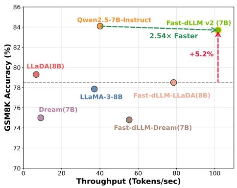
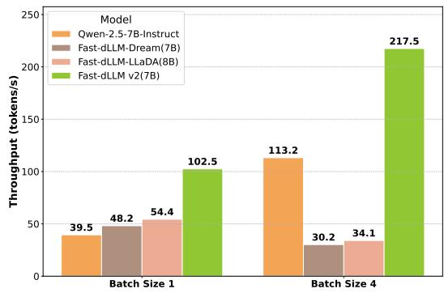
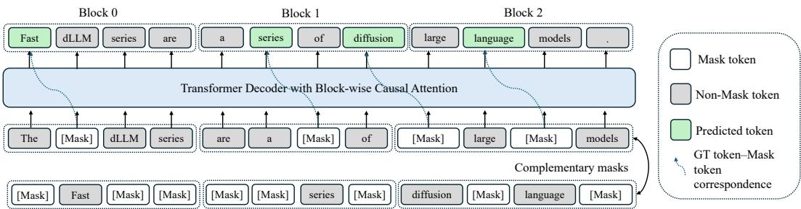
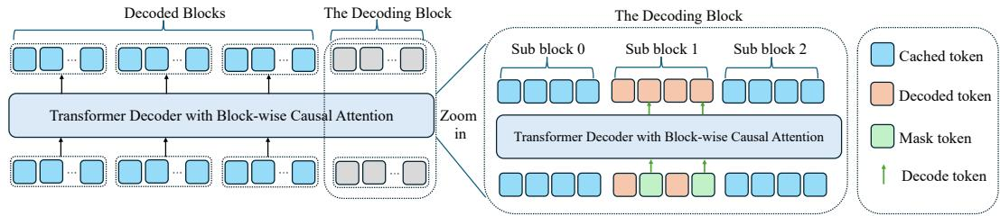
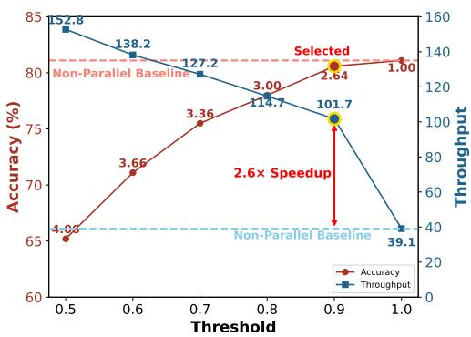
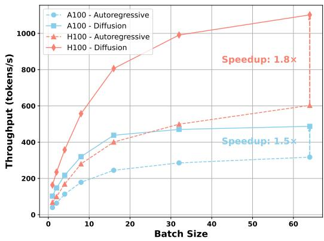
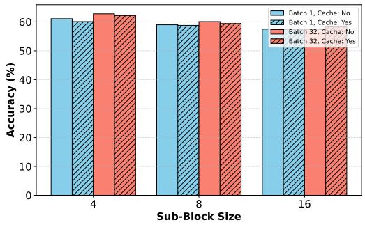
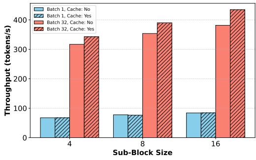

## ABSTRACT

Autoregressive (AR) large language models (LLMs) have achieved remarkable performance across a wide range of natural language tasks, yet their inherent sequential decoding limits inference efficiency. In this work, we propose Fast-dLLM $\mathbf { v } 2 ,$ , a carefully designed block diffusion language model (dLLM) that efficiently adapts pretrained AR models into dLLMs for parallel text generation—requiring only ∼1B tokens of fine-tuning. This represents a 500× reduction in training data compared to full-attention diffusion LLMs such as Dream (580B tokens), while preserving the original model’s performance. Our approach introduces a novel training recipe that combines a block diffusion mechanism with a complementary attention mask, enabling blockwise bidirectional context modeling without sacrificing AR training objectives. To further accelerate decoding, we design a hierarchical caching mechanism: a block-level cache that stores historical context representations across blocks, and a sub-block cache that enables efficient parallel generation within partially decoded blocks. Coupled with our parallel decoding pipeline, Fast-dLLM v2 achieves up to 2.5× speedup over standard AR decoding without compromising generation quality. Extensive experiments across diverse benchmarks demonstrate that Fast-dLLM v2 matches or surpasses AR baselines in accuracy, while delivering state-of-the-art efficiency among dLLMs—marking a significant step toward the practical deployment of fast and accurate LLMs.

## 1 INTRODUCTION

  
(a)

  
(b)  
Figure 1: Performance comparison of Fast-dLLM v2. (a) Comparison of throughput and GSM8K accuracy among baseline models and the Fast-dLLM variants in A100. Fast-dLLM v2 (7B) achieves 2.54× higher throughput than Qwen2.5-7B-Instruct while offering comparable accuracy. Additionally, it improves accuracy by +5.2% over Fast-dLLM-LLaDA, which is based on optimized LLaDA. (b) Throughput comparison under different batch sizes. Fast-dLLM v2 significantly outperforms all baselines at both batch size 1 and $^ { 4 , }$ demonstrating superior scalability and efficiency.

Recent years have witnessed autoregressive (AR) large language models (LLMs) (Radford & Narasimhan, 2018; Radford et al., 2019; Brown et al., 2020; OpenAI, 2022) achieving remarkable performance across a wide range of natural language tasks. Their capacity to generate fluent, coherent text by modeling next-token prediction has made them the prevailing paradigm in most deployed systems. However, AR models suffer from inherent inefficiencies: Since tokens are generated oneby-one in a strict left-to-right order, they cannot exploit full parallelism during decoding.

On the other hand, diffusion-based language models (dLLMs) (Google DeepMind, 2025; Inception Labs, 2025; Zhu et al., 2025; Ye et al., 2025a) offer a promising alternative. By allowing multiple tokens (or even entire blocks of tokens) to be predicted or refined jointly, dLLMs can in principle achieve much higher decoding parallelism. Nevertheless, in practice, they come with their own significant drawbacks: they often cannot use KV cache effectively due to bidirectional attention, their inference latency often exceeds that of AR models, and many require fixed sequence lengths or have restricted flexibility in generation length. These limitations have prevented diffusion-based models from outperforming AR models in speed while maintaining comparable quality. Some works employ approximate KV cache mechanisms to reuse computation, such as the DualCache in FastdLLM (Wu et al., 2025). However, this does not fundamentally resolve incompatibility of dLLMs with KV cache, since such approximate caches are not equivalent to the original computation.

To bridge these paradigms, block diffusion language model (as in BD3-LMs (Arriola et al., 2025)) has been proposed: it interpolates between purely autoregressive and diffusion regimes by generating tokens in blocks, performing diffusion within each block, while conditioning on previous blocks autoregressively. BD-LMs achieve two desirable properties: flexible sequence length (arbitrary or variable length generation), and KV caching between blocks, enabling improved inference efficiency. However, BD3-LMs have so far only been validated on relatively small-scale models and conventional LM metrics, rather than modern large-scale LLM settings. As such, their practical applicability to state-of-the-art LLMs remains unclear, especially in terms of maintaining high-quality text generation and robust scaling behavior.

In this work, we propose Fast-dLLM v2, a carefully designed block diffusion language model (dLLM) that transforms pretrained autoregressive (AR) models into diffusion-style decoders for parallel text generation. Unlike prior block diffusion approaches that remain limited to small-scale validation, Fast-dLLM v2 is explicitly built to scale to large LLMs and real-world tasks. A key feature of Fast-dLLM v2 is its data efficiency: while full-attention diffusion models such as Dream (Ye et al., 2025a) require on the order of 500B tokens for fine-tuning, our method adapts AR models into block diffusion models with only about 1B tokens of fine-tuning—achieving lossless adaptation without retraining from scratch. Unlike the full-attention dLLM in Dream, our design uses a block-wise attention mask structure closer to the original AR models, making the adaptation process inherently more compatible and data-efficient. Our method further introduces a novel training recipe that combines a block diffusion mechanism with a complementary attention mask, enabling block-wise bidirectional context modeling while simultaneously preserving the original AR training objectives and predictive performance. To enhance inference speed, we design a hierarchical caching mechanism: a block-level cache that stores historical context representations across blocks, and a sub-block cache that supports efficient parallel decoding within partially generated blocks which adopts the DualCache in Fast-dLLM (Wu et al., 2025).

In consequence, Fast-dLLM v2 achieves up to 2.5× speedup over standard AR decoding without compromising generation quality. Extensive experiments across diverse tasks confirm that FastdLLM v2 not only matches the accuracy of AR baselines but also achieves state-of-the-art efficiency among diffusion-based LLMs, marking a significant step toward the practical deployment of fast and accurate language models. In summary, our contributions are threefold:

1. We identify the AR-friendly nature of our block-wise attention design and leverage it to present a post-training strategy for adapting pretrained AR models into block-diffusion frameworks, requiring only affordable fine-tuning rather than full retraining. Specifically, Fast-dLLM v2 achieves lossless adaptation with just ∼1B tokens, compared to ∼500B tokens required by Dream (Ye et al., 2025a).

2. We introduce an inference strategy that combines a hierarchical caching mechanism with block-wise parallel decoding. This design enables effective reuse of context across blocks and accelerates token generation within each block, yielding substantially faster inference than prior diffusion-based methods.

3. We conduct comprehensive large-scale experiments on models up to 7B parameters and diverse tasks, showing that Fast-dLLM v2 achieves up to $2 . 5 \times$ speedup over standard AR decoding while maintaining comparable generation quality.

## 2 RELATED WORK

## 2.1 MASKED DIFFUSION LLM

Initial work by (Sohl-Dickstein et al., 2015; Hoogeboom et al., 2021) first pioneered the use of diffusion models for discrete data. This concept was later generalized by D3PM (Austin et al., 2021) using a forward process defined as a discrete-state Markov chain with general transition matrices $Q _ { t }$ CTMC (Campbell et al., 2022) extended this to continuous time, while SEDD (Lou et al., 2023) instead modeled the likelihood ratio $\frac { p _ { t } ( \pmb { y } ) } { p _ { t } ( \pmb { x } ) }$ using Denoising Score Entropy. Masked Diffusion Models (MDMs)—also called absorbing state discrete diffusion—are prominent in discrete diffusion models. During training, MDMs randomly replace tokens with a special [MASK] token according to mask ratio t, where $t \in [ 0 , 1 ]$ interpolates between ${ \pmb x } _ { 0 } \ ( t = 0 )$ and a fully masked sequence $( t = 1 )$ . The MDMs have been scaled up to 7B level, with LLaDA (Nie et al., 2025) being trained from scratch on the MDM loss, and Dream (Ye et al., 2025b;a) being adapted from the existing Qwen-2.5 7B (Qwen et al., 2025).

## 2.2 INTERPOLATION BETWEEN AUTOREGRESSIVE AND MASKED DIFFUSION

Several recent works have explored block-wise diffusion for non-autoregressive text generation. SSD-LM (Han et al., 2022) introduced a block formulation of Gaussian text diffusion. Building on this, AR-Diffusion (Wu et al., 2023) extended SSD-LM by incorporating a left-to-right noise schedule. For masked diffusion models, BD3-LM (Arriola et al., 2025) interpolates between discrete denoising diffusion and autoregressive models by using inner-block diffusion within a global left-to-right structure. Concurrent to our work, SDAR (Cheng et al., 2025) successfully finetuned a block diffusion model from a pretrained autoregressive model. While sharing the conceptual direction of AR-to-diffusion adaptation, our work diverges by establishing a systematic framework designed for high data efficiency and decoding robustness. Specifically, we introduce sub-block decoding to resolve the performance degradation caused by training-inference block size mismatches, and employ complementary masking to maximize the denoising signal within blocks. D2F (Wang et al., 2025b), inspired by Diffusion Forcing (Chen et al., 2024) and CausVid (Yin et al., 2025), distilled a large diffusion language model (dLLM) into a more efficient block diffusion model. Set Block Decoding (Gat et al., 2025) integrates standard next-token prediction (NTP) and masked token prediction (MATP) within a single architecture to enable the generation of multiple tokens simultaneously. Compared to these concurrent works, Fast-dLLM v2 is distinguished by its data-efficient fine-tuning process, requiring only 1B tokens.

## 2.3 ACCELERATION FOR DIFFUSION LLM

Recent research has focused on accelerating the inference of diffusion language models, primarily through two avenues: caching mechanisms and advanced decoding strategies. A significant bottleneck in dLLM inference is the computational cost associated with the bidirectional attention mechanism. To address this, several caching techniques have been proposed. FAST-DLLM (Wu et al., 2025) proposed DualCache. This method caches the KV activations for both the preceding text (prefix) and the subsequent masked tokens (suffix). dKV-Cache (Ma et al., 2025) proposed a delayed caching strategy. dLLM-Cache (Liu et al., 2025) accelerates inference by combining prompt caching with an adaptive partial response cache that decides whether to reuse or recompute the generated prefix at each step to balance efficiency and accuracy. Sparse-dLLM (Song et al., 2025) accelerates inference by using the model’s attention scores to dynamically drop unimportant tokens from the Key-Value cache. DPad (Chen et al., 2025) proposed to restrict the attention mechanism to a small, fixed-size window of recent suffix tokens.

As for advanced decoding strategies, FAST-DLLM (Wu et al., 2025) proposed an adaptive confidence-based parallel decoding algorithm. EB-Sampler (Ben-Hamu et al., 2025) introduces a simple drop-in replacement for existing samplers, utilizing an Entropy Bounded unmasking procedure that dynamically unmasks multiple tokens in one function evaluation with predefined approximate error tolerance. Dimple (Yu et al., 2025) proposed confident decoding, which dynamically adjusts the number of tokens generated at each step. WINO (Hong et al., 2025) employs a parallel draft-and-verify mechanism, aggressively drafting multiple tokens while simultaneously using the model’s bidirectional context to verify and re-mask suspicious ones for refinement. SlowFast Sampling (Wei et al., 2025) proposed a dynamic sampling strategy that adaptively alternates between exploratory and accelerated decoding stages. LaViDa (Li et al., 2025c) tests timestep shift for efficient sampling. Wang et al. (2025a) proposed Temporal Self-Consistency Voting that aggregates predictions across denoising steps to select the most consistent output. Prophet (Li et al., 2025b) dynamically decides whether to continue refinement or decode all remaining tokens in one step.

  
Figure 2: Training process of Fast-dLLM-v2. The input sequence is decoded block by block. Within each block, the model performs next-token prediction with partial masking. To ensure every token is trained, complementary masks are introduced so that masked tokens in one view can be predicted from the other. We only apply loss to predicted tokens that are highlighted in green, and dashed curves connect Mask tokens to their corresponding predictions.

Beyond accelerating diffusion models themselves, block diffusion is also compatible with Auto-Regressive (AR) acceleration techniques, such as speculative decoding. DiffuSpec (Li et al., 2025a) demonstrates that a small diffusion model (e.g., Dream-7B) can serve as an effective draft model for speculative decoding, achieving a 3.1× speedup with AR models like Qwen2.5-32B. Given that FAST-DLLM V2-7B is nearly 10× faster than Dream-7B (as shown in Figure 1a), employing it as a draft model within similar frameworks offers a promising avenue to further enhance decoding efficiency in future work.

## 3 METHODOLOGY

## 3.1 PRELIMINARY

Let $\boldsymbol { x } = \{ x ^ { 1 } , x ^ { 2 } , \ldots , x ^ { L } \}$ denote a token sequence of length L. Traditional autoregressive models generate x sequentially by modeling the conditional distribution $P _ { \theta } ( x ^ { i } | x ^ { < i } )$ ), and are trained to minimize the cross-entropy loss.

In contrast, diffusion language models define a generative distribution via a forward noising process and a learned reverse denoising model. At time $t \in ( 0 , 1 )$ , each token in $x _ { 0 }$ is masked independently with probability $t ,$ producing a corrupted sequence $x _ { t }$ . The reverse model $p _ { \theta } ( x _ { 0 } | x _ { t } )$ predicts the original tokens given the noised input.

The model is trained to minimize the expected masked token prediction loss:

$$
\mathcal {L} (\theta) = - \mathbb {E} _ {t, x _ {0}, x _ {t}} \left[ \frac {1}{t} \sum_ {i = 1} ^ {L} \mathbf {1} [ x _ {t} ^ {i} = [ \text {MASK} ] ] \log p _ {\theta} (x _ {0} ^ {i} \mid x _ {t}) \right],
$$

where $t \sim \mathrm { U n i f o r m } ( 0 , 1 )$ and $x _ { t }$ is sampled from the forward process. The loss is computed only over the masked tokens.

## 3.2 ADAPTATION TO BLOCK DIFFUSION LLM

We build our block-wise diffusion training pipeline on top of pretrained Qwen2.5-Instruct models (Qwen et al., 2025), including both 1.5B and 7B variants. Fine-tuning is conducted as supervised fine-tuning (SFT) on instruction-tuning data, where each training batch is constructed using our blockwise diffusion setup. Specifically, we introduce partial token masking within each block together with a complementary masking strategy (Li et al., 2025c) to ensure that every token is trained in both visible and masked contexts. The overall architecture and training workflow are illustrated in Figure 2.

  
Figure 3: Illustration of the inference process. The sequence is decoded block-by-block. The decoded blocks are cached to speed up inference. Within each block, we adopt the parallel decoding and DualCache in Fast-dLLM to further accelerate inference.

Block-wise organization. Given a set of tokenized samples, we first pad each sequence to a length that is an integer multiple of the block size D by appending [MASK] tokens as needed. These padding tokens are ignored in the loss computation and do not contribute to gradient updates. After this alignment step, we pack the padded sequences by concatenating them into a long token stream and splitting it into training sequences of a fixed context length L. Each packed sequence is therefore naturally divided into $B \stackrel { \sim } { = } L / \stackrel { \cdot } { D }$ non-overlapping blocks of size $D ,$ , already aligned by construction. This block-aligned packing ensures efficient batching while avoiding block boundaries crossing sample boundaries.

Masked token prediction with complementary views. For each block, we randomly sample a binary mask $\overline { { m \in \{ 0 , 1 \} ^ { D } } }$ , where $m _ { j } = 1$ means position j is replaced with a learned [MASK] embedding. To ensure all tokens receive both masked and unmasked supervision across training, we use a complementary masking strategy: each training sample is duplicated into two views with masks m and $\bar { m } = 1 - m$ . These two views are placed together in the same batch, so the model can jointly see masked and unmasked contexts across the views.

Token shift for prediction. To preserve the pretrained AR model’s representation quality (Ye et al., 2025b;a), we adopt a shifted-label strategy: prediction of a token at masked position i uses the logit from its preceding position (i − 1). Concretely, if $x _ { i }$ is masked, the model uses the hidden state at i − 1 to predict $x _ { i } ,$ consistent with the next-token prediction mechanism in causal language models. This allows dLLM to maintain AR-like temporal representations while supporting intrablock diffusion.

Training objective. We minimize the masked-token-only cross-entropy loss:

$$
\mathcal {L} _ {\mathrm{block}} (\theta) = - \mathbb {E} _ {x, m} \left[ \sum_ {i = 1} ^ {L} \mathbf {1} [ x _ {t} ^ {i} = [ \mathrm{MASK} ] ] \log p _ {\theta} (x _ {0} ^ {i} \mid x _ {<   i}, x _ {\mathrm{block} (i)}) \right],
$$

where $x _ { \mathrm { b l o c k } ( i ) }$ denotes all tokens in the block containing position i (including masked/unmasked), and $x _ { < i }$ are clean tokens from earlier blocks.

Block-wise attention masking. We use a hybrid attention scheme similar to that in (Arriola et al., 2025). For each training sample, we concatenate the noised sequence $x _ { t }$ and its corresponding clean sequence $x _ { 0 }$ along the sequence dimension, resulting in a total length of 2L. The attention mask $A \doteq \{ 0 , 1 \} ^ { 2 L \times 2 L }$ is then applied to control both causal and bidirectional connections.

This design allows simultaneous processing of corrupted and clean contexts, facilitating complementary mask supervision. The attention mask naturally supports both block-parallelism and causal autoregressive dependencies between blocks. We further employ the flex-attention implementation to efficiently realize this structured masking and accelerate training.

## 3.3 INFERENCE PIPELINE

At inference time, Fast-dLLM v2 employs a block-wise decoding strategy that balances the autoregressive nature of LLMs with the parallelism afforded by diffusion-based decoding. As shown in Figure 3, generation proceeds one block at a time: previously decoded blocks are cached and reused as clean prefix context, while the current block undergoes parallel masked token refinement.

By combining block-level caching, intra-block parallel decoding, and DualCache reuse, Fast-dLLM v2 maximizes decoding efficiency without requiring auxiliary models or extra inference overhead. Empirically, we observe up to 2.5× speedup compared to standard AR decoding, while maintaining generation quality on par with strong autoregressive baselines. This makes Fast-dLLM v2 a compelling candidate for practical LLM deployment in latency-sensitive applications.

Block-wise autoregressive decoding with caching. Since each block in Fast-dLLM v2 is decoded in a causal order, we naturally preserve left-to-right semantics across blocks. After decoding each block, its unmasked tokens are cached as read-only context for future blocks. This design enables block-level Key-Value (KV) cache reuse and significantly reduces redundant computation. The attention mask at inference time allows each block to attend bidirectionally within itself, while attending causally to preceding blocks, mirroring the configuration used during training.

Parallel refinement within each block. To accelerate generation within a block, we adopt the confidence-aware parallel decoding strategy proposed in Fast-dLLM (Wu et al., 2025). Specifically, we iteratively refine masked tokens in the current block based on their model confidence of predicted tokens. Tokens exceeding a confidence threshold are decoded and unmasked in parallel, while uncertain positions remain masked for future refinement. This avoids ambiguous predictions and reduces generation latency.

DualCache for sub-block reuse. To further reduce redundant computation during intra-block decoding, we integrate the DualCache mechanism from Fast-dLLM. DualCache maintains both prefix and suffix KV caches for partially decoded blocks, enabling efficient recomputation as additional tokens are revealed. This hierarchical caching not only rules out expensive recomputation, but also supports the iterative, selective decoding pattern used in confidence-aware refinement.

Batch decoding with padding. To support batch generation of sequences with varying target lengths, we right-pad each sequence with [MASK] tokens to make their total lengths divisible by the block size D. The sequences are then grouped and decoded block-by-block. At each step, all sequences in the batch decode the next block in parallel, regardless of how many real tokens remain, ensuring consistent and efficient scheduling on modern hardware.

## 4 EXPERIMENTS

## 4.1 EXPERIMENTAL SETUP

We conduct adaptation experiments on the Qwen-2.5 1.5B and 7B Instruct models, tuning them into the Block Diffusion LLM configuration. For training, we use the LLaMA-Nemotron post-training dataset (Bercovich et al., 2025) with a batch size of 256. The learning rate and training steps are set specifically for each model: the 1.5B model is trained with a learning rate of $2 \times 1 0 ^ { - 5 }$ for 6,000 steps, while the 7B model uses a learning rate of $1 \times 1 0 ^ { - 5 }$ for 2,500 steps. We employ 64 NVIDIA A100 GPUs for training, with the 1.5B model training for approximately 8 hours and the 7B model for 12 hours. Unless otherwise stated, the sub-block size is fixed at 8, block size at 32, and parallel decoding is disabled (i.e., threshold is set to 1).

For benchmarking, we evaluate the tuned models on a comprehensive suite of tasks, covering diverse aspects of language modeling and reasoning abilities. The evaluation suite includes code generation tasks like HumanEval and MBPP, mathematical reasoning tasks such as GSM8K and MATH, as well as knowledge-intensive benchmarks like MMLU and GPQA, instruction-following tasks such as IFEval. Code-related benchmarks, including HumanEval and MBPP, are assessed using the EvalPlus framework, which provides a robust evaluation for code synthesis. All other benchmarks are evaluated using the LM-Eval framework, ensuring consistency and reliability of performance measurements across different tasks.

Table 1: Benchmark results of various language models across a range of evaluation tasks. Models are grouped by parameter scale into 1B and 7B+ categories. Evaluation metrics include code generation (HumanEval, MBPP), mathematical reasoning (GSM8K, MATH), instruction following (IFEval), knowledge-intensive QA (MMLU, GPQA), and general average score (Avg.). ”Base” and ”Plus” refer to different evaluation settings for code benchmarks using EvalPlus. The best results per column are in bold, and the second-best are underlined.

<table><tr><td rowspan="2">Model</td><td rowspan="2">#Params</td><td colspan="2">HumanEval</td><td colspan="2">MBPP</td><td rowspan="2">GSM8K</td><td rowspan="2">Math</td><td rowspan="2">IFEval</td><td rowspan="2">MMLU</td><td rowspan="2">GPQA</td><td rowspan="2">Avg.</td></tr><tr><td>Base</td><td>Plus</td><td>Base</td><td>Plus</td></tr><tr><td colspan="12">1B Models</td></tr><tr><td>LlaMA-3.2</td><td>1.2B</td><td>34.1</td><td>31.1</td><td>34.1</td><td>29.4</td><td>43.0</td><td>23.8</td><td>58.9</td><td>44.4</td><td>24.1</td><td>35.9</td></tr><tr><td>SmolLM 2</td><td>1.7B</td><td>34.1</td><td>28.7</td><td>50.6</td><td>46.0</td><td>47.7</td><td>21.1</td><td>55.1</td><td>49.1</td><td>29.2</td><td>40.7</td></tr><tr><td>Qwen2.5-1.5B</td><td>1.5B</td><td>42.1</td><td>37.2</td><td>48.1</td><td>41.3</td><td>57.0</td><td>46.8</td><td>41.2</td><td>54.6</td><td>30.6</td><td> $\underline{44.3}$ </td></tr><tr><td>Qwen2.5-1.5B-Nemo-FT</td><td>1.5B</td><td>37.2</td><td>33.5</td><td>53.4</td><td>44.4</td><td>58.5</td><td>43.5</td><td>39.4</td><td>58.1</td><td>31.0</td><td> $\underline{44.3}$ </td></tr><tr><td>Fast-dLLM v2</td><td>1.5B</td><td>43.9</td><td>40.2</td><td>50.0</td><td>41.3</td><td>62.0</td><td>38.1</td><td>47.0</td><td>55.1</td><td>27.7</td><td> $\underline{45.0}$ </td></tr><tr><td colspan="12">7B+ Models</td></tr><tr><td>LLaDA</td><td>8B</td><td>35.4</td><td>31.7</td><td>31.5</td><td>28.6</td><td>78.6</td><td>26.6</td><td>59.9</td><td>65.5</td><td>31.8</td><td>43.3</td></tr><tr><td>LLaDA-1.5</td><td>8B</td><td>52.4</td><td>-</td><td>42.8</td><td>-</td><td>83.3</td><td>42.6</td><td>58.2</td><td>66.0</td><td>36.9</td><td>-</td></tr><tr><td>LLaDA-MoE</td><td>7B</td><td>61.6</td><td>-</td><td>70.0</td><td>-</td><td>82.4</td><td>58.7</td><td>59.3</td><td>67.2</td><td>-</td><td>-</td></tr><tr><td>Dream</td><td>7B</td><td>57.9</td><td>53.7</td><td>68.3</td><td>56.1</td><td>81.0</td><td>39.2</td><td>62.5</td><td>67.0</td><td>33.0</td><td>57.6</td></tr><tr><td>Qwen2.5-7B</td><td>7B</td><td>51.2</td><td>47.6</td><td>57.7</td><td>49.5</td><td>71.4</td><td>73.3</td><td>70.8</td><td>68.7</td><td>33.5</td><td>58.2</td></tr><tr><td>Qwen2.5-7B-Nemo-FT</td><td>7B</td><td>52.4</td><td>48.2</td><td>57.1</td><td>50.0</td><td>84.1</td><td>72.0</td><td>69.5</td><td>68.6</td><td>34.2</td><td> $\underline{59.6}$ </td></tr><tr><td>Fast-dLLM v2</td><td>7B</td><td>63.4</td><td>58.5</td><td>63.0</td><td>52.3</td><td>83.7</td><td>61.6</td><td>61.4</td><td>66.6</td><td>31.9</td><td> $\underline{60.3}$ </td></tr></table>

To provide meaningful comparisons, we include several baseline models in our evaluation. These baselines include widely recognized models with comparable parameter sizes, such as LLaMA-3.2, SmolLM-2, Dream, and LLaDA series. Additionally, results from the original Qwen-2.5 1.5B and 7B models, tuned with next token prediction under the same dataset and training steps, are incorporated to highlight the impact of our Block Diffusion methodology.

## 4.2 MAIN RESULTS: PERFORMANCE AND SPEED

The 1.5B Fast-dLLM v2 achieves an average score of 45.0, outperforming the Qwen2.5-1.5B and Qwen2.5-1.5B-Nemo-FT baselines, and establishing new state-of-the-art performance among 1Bscale diffusion-based and NTP-trained autoregressive models. At the 7B scale, Fast-dLLM v2 reaches an average score of 60.3, surpassing all baselines including Qwen2.5-7B-Nemo-FT (59.6) and Dream (57.6), while matching or exceeding the best-performing models across most individual benchmarks. These results highlight Fast-dLLM v2’s consistent and strong performance across diverse tasks, while maintaining the efficiency advantages of diffusion-based generation.

As shown in Table 1, our Fast-dLLM v2 models achieve competitive performance across a wide range of benchmarks. Notably, both the 1.5B and 7B variants perform on par with or better than their counterparts trained with standard nexttoken prediction loss on the same data and for the same number of steps.

To balance generation quality and efficiency, we adopt a confidence-based parallel decoding strategy, where each token is individually finalized once its predicted confidence exceeds a predefined threshold. As shown in Figure 4, a lower threshold allows more tokens to be finalized earlier in the denoising process, effectively reducing the number of required decoding steps and improving throughput. Specifically, with a threshold of 0.9, we observe only a marginal drop in GSM8K accuracy, while throughput increases

  
Figure 4: Accuracy and throughput under different thresholds on GSM8K. Threshold 0.9 is selected, offering a 2.6× speedup with minimal accuracy drop.

significantly from 39.1 to 101.7 tokens/s—yielding a 2.6× speedup. This setting provides a favorable trade-off between performance and efficiency. Importantly, setting the threshold to 1.0 recovers the standard non-parallel decoding process, where all tokens are updated through the full sequence of denoising steps and finalized only at the end.

Figure 5 compares the throughput of Fast-dLLM v2 (7B) and Qwen2.5-7B-Instruct across a range of batch sizes on both NVIDIA A100 and H100 GPUs for GSM8K, where we set the threshold to 0.9 and use sub-block cache. Across all settings, diffusion generation consistently outperforms the autoregressive baseline, demonstrating superior scalability with increasing batch size. On the A100, diffusion achieves up to 1.5× higher throughput at batch size 64, while the advantage is even more pronounced on the H100, reaching up to 1.8× speedup. This improvement highlights the efficiency benefits of diffusion decoding, especially on newer hardware architectures where parallelism can be better exploited. These results reinforce the practicality of diffusion-based generation in real-world deployment scenarios where low-latency, high-throughput inference is critical.

## 4.3 ABLATION STUDY

We conduct all ablation experiments using the Fast-dLLM v2 1.5B model to systematically investigate the impact of architectural and decoding choices. As shown in Table 2, the baseline (”naive token shift”) applies a strategy where, for each training block, a subset of tokens is randomly masked, and each masked token is predicted using the model’s output at the preceding position. To improve training fidelity, we introduce a padding strategy (”+ pad”) that appends non-loss-bearing <MASK> tokens to each training sample such that its length becomes a multiple of block size. This modification is crucial to preserve data integrity during sequence packing: without padding, an <EOS> token from one sample might be immediately followed by a <BOS> token from the next, and since our block-wise diffusion model uses bidirectional attention, this can lead to unintended attention across samples. Padding ensures clean sample boundaries, preventing cross-sample leakage during training.

We further incorporate a complementary masking (CM) strategy, where the complement of each sampled mask is also used in training. This ensures that all tokens in the input receive supervision, increasing the coverage of the learning signal. The full recipe (”+ pad + CM”) achieves the best overall performance across benchmarks, improving the average accuracy by +3.7 points over the naive strategy. These results highlight the importance of aligning training-time input construction with the model’s attention mechanism and masking objectives.

As shown in Table 3 and Table 4, we explore how sub-block size and block size affect final performance. In Table 3, we observe that adjusting the sub-block size during inference leads to notable gains, with a size of 8 achieving the highest accuracy on average across tasks. While GSM8K performs best with smaller sizes (e.g., 2), HumanEval and HumanEval+ show improved results up to size 8, indicating that the optimal sub-block size is task-dependent.

In contrast, Table 4 illustrates that directly modifying the block size at inference time—without aligning it to the training-time configuration—results in substantial performance degradation. For instance, GSM8K performance drops from 62.0 in the sub-block setting to 58.5 under mismatched block size, and HumanEval shows similar trends. This disparity underscores the importance of maintaining consistency between training and inference block

  
Figure 5: Throughput comparison between autoregressive and diffusion generation methods on NVIDIA A100 and H100 GPUs across varying batch sizes. Diffusion generation consistently outperforms autoregressive on both GPUs.

structures. By introducing a sub-block decoding strategy, we are able to flexibly control inference granularity without violating this consistency, thereby achieving better performance across diverse benchmarks.

Table 2: Benchmark results for different token shift strategies. ”+ CM” stands for ”+ complementary mask”. The best performance for each benchmark is shown in bold, while the second-best is underlined.

<table><tr><td rowspan="2">Method</td><td colspan="2">HumanEval</td><td colspan="2">MBPP</td><td rowspan="2">GSM8K</td><td rowspan="2">Math</td><td rowspan="2">IFEval</td><td rowspan="2">MMLU</td><td rowspan="2">GPQA</td><td rowspan="2">Avg.</td></tr><tr><td>Base</td><td>Plus</td><td>Base</td><td>Plus</td></tr><tr><td>Naive token shift</td><td>38.4</td><td>32.9</td><td>44.4</td><td>38.6</td><td>59.0</td><td>37.3</td><td>39.9</td><td>52.9</td><td>27.9</td><td>41.3</td></tr><tr><td>+ pad</td><td>38.4</td><td>34.1</td><td>45.2</td><td>38.4</td><td>60.1</td><td>37.0</td><td>45.8</td><td>53.5</td><td>27.7</td><td>42.2</td></tr><tr><td>+ pad + CM</td><td>43.9</td><td>40.2</td><td>50.0</td><td>41.3</td><td>62.0</td><td>38.1</td><td>47.0</td><td>55.1</td><td>27.7</td><td>45.0</td></tr></table>

  
(a)

  
(b)  
Figure 6: Effect of small block size and sub-block cache on model performance. (a) Accuracy remains largely unaffected by the use of sub-block cache across different block sizes and batch sizes. (b) Throughput increases as small block size grows due to higher decoding parallelism. While sub-block cache has negligible effect when batch size is small, it significantly improves throughput under compute-bound settings (e.g., batch size = 32).

We further study the effects of sub-block size and sub-block cache on both accuracy and throughput, as illustrated in Figure 6. In Figure 6a, we observe that increasing the sub-block size leads to a slight drop in accuracy, consistent with previous findings in Table 3. As shown in Figure 6b, using larger sub-block sizes increases decoding throughput by decreasing the number of required sequential forward passes and exploiting greater intra-step parallelism.

In addition, we evaluate the impact of introducing a sub-block cache. While the cache introduces negligible gains when the batch size is small (and memory bandwidth is underutilized), it provides substantial speedup in the compute-bound regime, such as when the batch size is 32 as shown in Figure 5. Importantly, caching has no observable effect on model accuracy (Figure 6a), confirming that it is a purely efficiency-enhancing feature without compromising output quality. These results highlight that under practical batch sizes, combining larger sub-block sizes with caching yields strong performance-efficiency benefits.

Table 3: Sub-Block size decoding improves performance, with size 8 being optimal.

<table><tr><td>Sub-Block Size</td><td>2</td><td>4</td><td>8</td><td>16</td><td>32</td></tr><tr><td>GSM8K</td><td>62.8</td><td>61.8</td><td>62.0</td><td>61.3</td><td>60.2</td></tr><tr><td>HumanEval</td><td>42.7</td><td>43.3</td><td>43.9</td><td>39.6</td><td>38.4</td></tr><tr><td>HumanEval+</td><td>39.6</td><td>40.2</td><td>40.2</td><td>36.0</td><td>34.8</td></tr></table>

Table 4: Inference with mismatched sizes reduces performance.

<table><tr><td>Block Size</td><td>2</td><td>4</td><td>8</td><td>16</td><td>32</td></tr><tr><td>GSM8K</td><td>53.2</td><td>56.8</td><td>58.5</td><td>59.7</td><td>60.2</td></tr><tr><td>HumanEval</td><td>37.8</td><td>43.3</td><td>43.3</td><td>38.4</td><td>38.4</td></tr><tr><td>HumanEval+</td><td>34.1</td><td>39.0</td><td>39.6</td><td>34.1</td><td>34.8</td></tr></table>

## 5 CONCLUSION

In this work, we presented Fast-dLLM v2, a scalable block diffusion language model framework that adapts pretrained autoregressive LLMs into efficient diffusion-style decoders for parallel text generation. By integrating a blockwise diffusion mechanism with complementary masking, Fast-dLLM v2 enables intra-block bidirectional context modeling while retaining the predictive capabilities of the original AR models. To address the latency of existing diffusion-based models, we further proposed a hierarchical caching strategy, consisting of a block-level cache for inter-block context reuse and a DualCache-based sub-block cache for efficient refinement within blocks, together with a parallel decoding pipeline. Extensive experiments on large-scale Qwen2.5-Instruct models (1.5B and 7B) demonstrate that Fast-dLLM v2 achieves up to 2.5× speedup over standard AR decoding without loss of generation quality, consistently matching strong AR baselines while surpassing prior diffusion-based approaches in efficiency. These results highlight the potential of block diffusion frameworks as a practical path toward deploying high-quality, low-latency LLMs in real-world applications.

## REFERENCES

Marianne Arriola, Aaron Gokaslan, Justin T. Chiu, Zhihan Yang, Zhixuan Qi, Jiaqi Han, Subham Sekhar Sahoo, and Volodymyr Kuleshov. Block diffusion: Interpolating between autoregressive and diffusion language models, 2025. URL https://arxiv.org/abs/2503.09573.

Jacob Austin, Daniel D Johnson, Jonathan Ho, Daniel Tarlow, and Rianne Van Den Berg. Structured denoising diffusion models in discrete state-spaces. Advances in Neural Information Processing Systems, 34:17981–17993, 2021.

Heli Ben-Hamu, Itai Gat, Daniel Severo, Niklas Nolte, and Brian Karrer. Accelerated sampling from masked diffusion models via entropy bounded unmasking. arXiv preprint arXiv:2505.24857, 2025.

Akhiad Bercovich, Itay Levy, Izik Golan, Mohammad Dabbah, Ran El-Yaniv, Omri Puny, Ido Galil, Zach Moshe, Tomer Ronen, Najeeb Nabwani, Ido Shahaf, Oren Tropp, Ehud Karpas, Ran Zilberstein, Jiaqi Zeng, Soumye Singhal, Alexander Bukharin, Yian Zhang, Tugrul Konuk, Gerald Shen, Ameya Sunil Mahabaleshwarkar, Bilal Kartal, Yoshi Suhara, Olivier Delalleau, Zijia Chen, Zhilin Wang, David Mosallanezhad, Adi Renduchintala, Haifeng Qian, Dima Rekesh, Fei Jia, Somshubra Majumdar, Vahid Noroozi, Wasi Uddin Ahmad, Sean Narenthiran, Aleksander Ficek, Mehrzad Samadi, Jocelyn Huang, Siddhartha Jain, Igor Gitman, Ivan Moshkov, Wei Du, Shubham Toshniwal, George Armstrong, Branislav Kisacanin, Matvei Novikov, Daria Gitman, Evelina Bakhturina, Jane Polak Scowcroft, John Kamalu, Dan Su, Kezhi Kong, Markus Kliegl, Rabeeh Karimi, Ying Lin, Sanjeev Satheesh, Jupinder Parmar, Pritam Gundecha, Brandon Norick, Joseph Jennings, Shrimai Prabhumoye, Syeda Nahida Akter, Mostofa Patwary, Abhinav Khattar, Deepak Narayanan, Roger Waleffe, Jimmy Zhang, Bor-Yiing Su, Guyue Huang, Terry Kong, Parth Chadha, Sahil Jain, Christine Harvey, Elad Segal, Jining Huang, Sergey Kashirsky, Robert McQueen, Izzy Putterman, George Lam, Arun Venkatesan, Sherry Wu, Vinh Nguyen, Manoj Kilaru, Andrew Wang, Anna Warno, Abhilash Somasamudramath, Sandip Bhaskar, Maka Dong, Nave Assaf, Shahar Mor, Omer Ullman Argov, Scot Junkin, Oleksandr Romanenko, Pedro Larroy, Monika Katariya, Marco Rovinelli, Viji Balas, Nicholas Edelman, Anahita Bhiwandiwalla, Muthu Subramaniam, Smita Ithape, Karthik Ramamoorthy, Yuting Wu, Suguna Varshini Velury, Omri Almog, Joyjit Daw, Denys Fridman, Erick Galinkin, Michael Evans, Katherine Luna, Leon Derczynski, Nikki Pope, Eileen Long, Seth Schneider, Guillermo Siman, Tomasz Grzegorzek, Pablo Ribalta, Monika Katariya, Joey Conway, Trisha Saar, Ann Guan, Krzysztof Pawelec, Shyamala Prayaga, Oleksii Kuchaiev, Boris Ginsburg, Oluwatobi Olabiyi, Kari Briski, Jonathan Cohen, Bryan Catanzaro, Jonah Alben, Yonatan Geif man, Eric Chung, and Chris Alexiuk. Llama-nemotron: Efficient reasoning models, 2025. URL https://arxiv.org/abs/2505.00949.

Tom B. Brown, Benjamin Mann, Nick Ryder, Melanie Subbiah, Jared Kaplan, Prafulla Dhariwal, Arvind Neelakantan, Pranav Shyam, Girish Sastry, Amanda Askell, Sandhini Agarwal, Ariel Herbert-Voss, Gretchen Krueger, Tom Henighan, Rewon Child, Aditya Ramesh, Daniel M. Ziegler, Jeffrey Wu, Clemens Winter, Christopher Hesse, Mark Chen, Eric Sigler, Mateusz Litwin, Scott Gray, Benjamin Chess, Jack Clark, Christopher Berner, Sam McCandlish, Alec Radford, Ilya Sutskever, and Dario Amodei. Language models are few-shot learners, 2020. URL https://arxiv.org/abs/2005.14165.