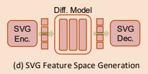
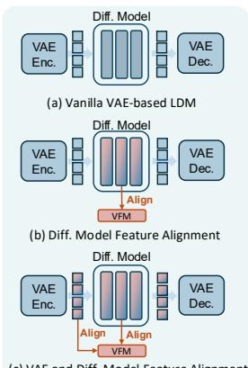
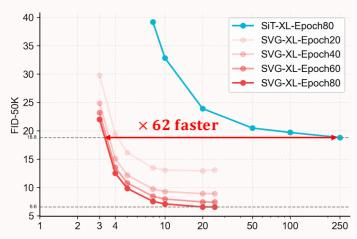
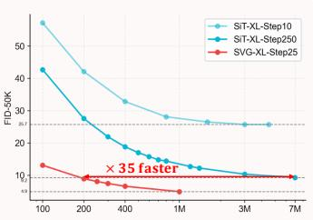
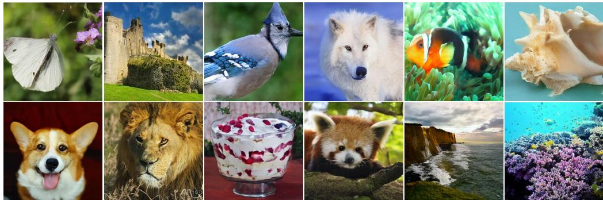
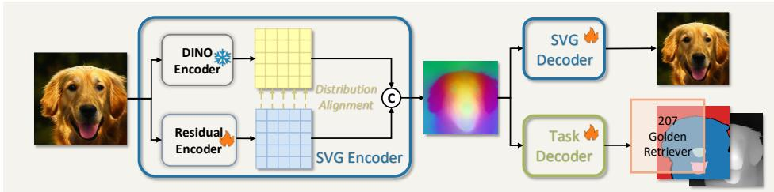
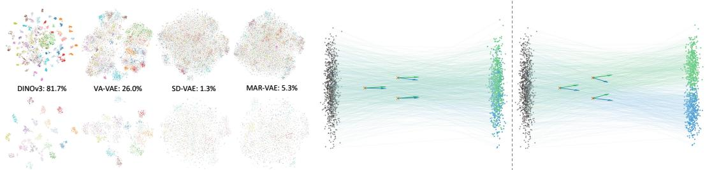
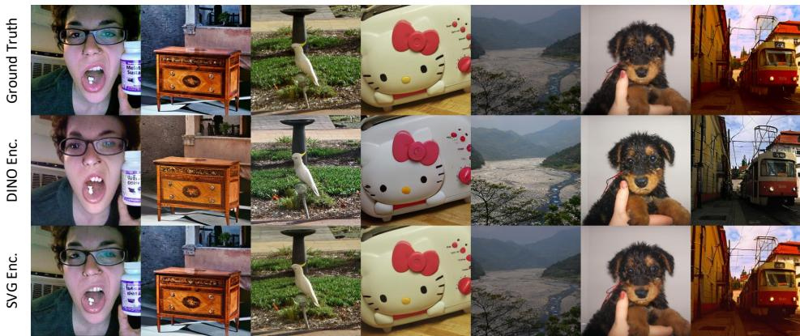
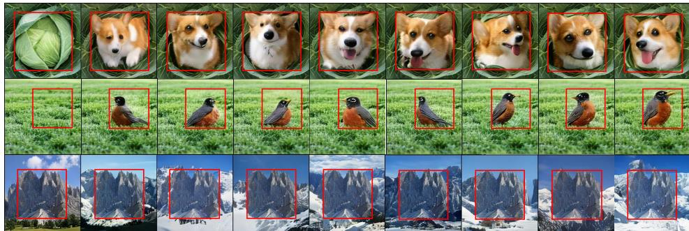
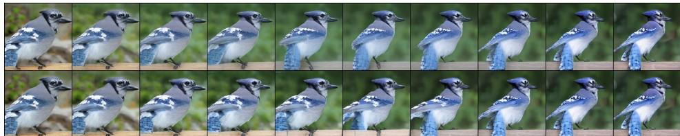

(f) Training Epochs vs. FID-50K  

## ABSTRACT

Recent progress in diffusion-based visual generation has largely relied on latent diffusion models with Variational Autoencoders (VAEs). While effective for highfidelity synthesis, this VAE+Diffusion paradigm still suffers from limited training and inference efficiency, along with poor transferability to broader vision tasks. These issues stem from a key limitation of VAE latent spaces: the lack of clear semantic separation and strong discriminative structure. Our analysis confirms that these properties are not only crucial for perception and understanding tasks, but also equally essential for the stable and efficient training of latent diffusion models. Motivated by this insight, we introduce SVG—a novel latent diffusion model without variational autoencoders, which unleashes Self-supervised representations for Visual Generation. SVG constructs a feature space with clear semantic discriminability by leveraging frozen DINO features, while a lightweight residual branch captures fine-grained details for high-fidelity reconstruction. Diffusion models are trained directly on this semantically structured latent space to facilitate more efficient learning. As a result, SVG enables accelerated diffusion training, supports few-step sampling, and improves generative quality. Experimental results further show that SVG preserves the semantic and discriminative capabilities of the underlying self-supervised representations, providing a principled pathway toward task-general, high-quality visual representations.

  
(e) Inference Steps vs. FID-50K

  
Figure 1: Core contribution of SVG. (a) Vanilla VAE-based LDM: the diffusion model is trained on the pretrained VAE latent space. (b) Diff. Model Feature Alignment: intermediate features of the diffusion model are aligned to Visual Foundation Model (VFM) features. (c) VAE and Diff. Model Feature Alignment: both VAE latent features and diffusion model intermediate features are aligned to VFM features. (d) Our method: the diffusion model is trained directly in the SVG space derived from self-supervised representations (DINOv3). (e-f) Comparisons of inference and training efficiency.

## 1 INTRODUCTION

Generative models have made remarkable progress in recent years, with diffusion models (Rombach et al., 2021; Ho et al., 2020; Song et al., 2021b; Liu et al., 2022; Lipman et al., 2023) emerging as a dominant paradigm. They have attracted substantial attention and demonstrated broad applicability across diverse scenarios, including text-to-image generation (Rombach et al., 2021; Chen et al., 2024; Esser et al., 2024; Labs, 2024), text-to-video generation (Yang et al., 2024; Wan et al., 2025; HaCohen et al., 2024), and beyond. Due to the inherently high-dimensional nature of visual data, training diffusion models directly at the pixel level remains challenging. To address this, mainstream approaches rely on pretrained variational autoencoders to compress raw visual data into a compact latent space, on which diffusion models are subsequently trained (Rombach et al., 2021).

Despite their success, the VAE+Diffusion paradigm exhibits several critical limitations. First, both training and inference are computationally expensive: for instance, training an ImageNet 256 × 256 generation model with the standard DiT implementation (Peebles & Xie, 2022) requires 7M steps, and inference typically demands more than 25 sampling steps to achieve satisfactory results. As depicted in parts (a)-(c) of Figure 1, although some recent methods (Yu et al., 2025; Leng et al., 2025; Yao et al., 2025) attempt to accelerate diffusion training by aligning with external feature spaces of vision foundation models (VFM) (Oquab et al., 2023; He et al., 2021; Chen et al., 2020d; Radford et al., 2021; Zhai et al., 2023) or imposing regularization constraints on the VAE latent space (Wang & He, 2025; Stoica et al., 2025), these approaches provide only ad hoc fixes, as they do not fundamentally alter the semantic structure of the latent space, which remain weakly discriminable as clearly shown in Figure 4a. Importantly, VAE latent representations are generally not employed in modern multi-modal large models, and their restricted perceptual capabilities (Yin et al., 2024; Jin et al., 2024) highlight a fundamental limitation. This discrepancy implies that VAE latents are unlikely to serve effectively as unified visual representations.

In this paper, we argue that a discriminative semantic structure in the latent space can substantially facilitate the training of diffusion models. By leveraging the powerful self-supervised features from DINOv3 (Simeoni et al.´ , 2025), we demonstrate that it is possible to construct a feature space that enables efficient diffusion training in a simple yet effective way, while fully retaining DINOv3’s strengths beyond generation.

We start by analyzing the semantic distributions of various VAE latent spaces to examine the limitations of the conventional VAE+Diffusion paradigm. Our study indicates that semantic entanglement in the vanilla VAE latents is a major obstacle to efficient diffusion. This observation leads to two key insights: first, VAE latents may not be optimal for latent diffusion models; second, since visual perception and understanding tasks also benefit from semantically structured representations, it is feasible to design a single unified feature space that simultaneously supports all core vision tasks.

Specifically, we examine several state-of-the-art visual representations in terms of image reconstruction, perception, and semantic understanding. We find that DINOv3 features offer the greatest potential as a unified feature space, as they preserve substantial coarse-grained image information and inherently exhibit strong semantic discriminability. To further enhance generation quality, we augment the frozen DINOv3 encoder with a lightweight Residual Encoder that captures the missing fine-grained perceptual details. The residual outputs are concatenated with the DINOv3 features along the channel dimension to enrich the representation, and subsequently aligned with the original DINOv3 feature distribution to preserve semantic structure. The resulting SVG feature space combines strong semantic discriminability with rich perceptual detail, leading to more efficient training of diffusion models, improved generative quality, and enhanced inference efficiency.

We highlight the following significant contributions of this paper:

• We systematically analyze the limitations of mainstream VAE latent spaces in latent diffusion models, highlighting how semantic dispersion may affect the efficiency of generative modeling.

• We propose SVG, a latent diffusion model without variational autoencoders, built upon a unified feature space that retains the potential to support multiple core vision tasks beyond generation.

• SVG Diffusion achieves impressive generative quality while ensuring rapid training and highly efficient inference.

  
Figure 2: Selected 256×256 samples from SVG-XL. We use a cfg of 4.0 and 25 Euler steps.

## 2 RELATED WORKS

Visual generation. Generative models aim to learn the underlying probability distribution of data and to generate novel samples that are both realistic and diverse. Generative adversarial networks (GANs) (Goodfellow et al., 2014; Radford et al., 2016; Arjovsky et al., 2017; Gulrajani et al., 2017; Karras et al., 2019; Zhu et al., 2017; Karras et al., 2018; Sauer et al., 2022) generate realistic images via adversarial training but often suffer from mode collapse, instability, and poor interpretability. Another family of approaches follows an autoregressive paradigm, where an image is represented as a sequence of pixels, patches, or latent tokens. The joint distribution is factorized into conditional probabilities and modeled sequentially, as in (Salimans et al., 2017; Vaswani et al., 2018; Chen et al., 2020a). Extensions based on masked autoregression (He et al., 2021; Chang et al., 2022; Li et al., 2024) predict missing tokens given visible context, analogous to masked language models in NLP. This formulation enables direct transfer of transformer-based sequence modeling techniques to large-scale image generation. More recently, diffusion models (Ho et al., 2020; Nichol & Dhariwal, 2021; Song et al., 2021a;b) have emerged as a powerful alternative, generating images by iteratively denoising Gaussian noise. They achieve state-of-the-art fidelity and diversity, with improved training stability and mode coverage. An improved version, the latent diffusion model (LDM) (Rombach et al., 2021; Peebles & Xie, 2022; Ma et al., 2024; Liu et al., 2022), integrates a VAE (Kingma & Welling, 2022) with the diffusion process to operate in a lower-dimensional latent space, reducing computational cost while maintaining generation quality. Nevertheless, these models still require multiple inference steps, limiting generation speed. A line of research aims to improve the structural properties of the VAE latent space (Burgess et al., 2018; Xu & Durrett, 2018; Kouzelis et al., 2025a; Skorokhodov et al., 2025) or to incorporate diffusion processes into VAE reconstruction (Preechakul et al., 2022; Pandey et al., 2021; Vahdat et al., 2021). More recently, efforts have focused on aligning the latent features of diffusion models with external semantic representations (Yu et al., 2025; Leng et al., 2025; Yao et al., 2025; Li et al., 2023b), while other works explore joint generation approaches that integrate discriminative components into the generative process (Wu et al., 2025; Kouzelis et al., 2025b). Despite these advances, we observe that even with structural improvements to the VAE latent space or alignment with external semantic features, the semantic discriminability of VAE representations remains inherently limited. Consequently, the VAE+Diffusion paradigm is constrained in both training and inference efficiency, and it fails to establish a unified feature space capable of supporting visual generation, perception, and understanding.

Visual representation learning. Recent advances in visual representation learning can be broadly categorized into discriminative, generative, and multimodal paradigms. Disciminative methods, such as self-supervised learning (SSL) approaches including DINO (Zhang et al., 2022; Oquab et al., 2023; Simeoni et al.´ , 2025), SimCLR (Chen et al., 2020b;c), MoCo (He et al., 2019; Chen et al., 2020d), and BYOL (Grill et al., 2020), learn informative features without explicitly modeling the data distribution, producing highly separable representations that excel in classification, retrieval, and dense prediction, but often discard fine grained generative information, limiting their utility for synthesis or reconstruction. Generative approaches, including VAE (Kingma & Welling, 2022), masked autoencoders (MAE) (He et al., 2021), masked image modeling (MIM) (Xie et al., 2022b), and diffusion models (Ho et al., 2020; Song et al., 2021b), capture rich contextual and perceptual information by reconstructing inputs or modeling the underlying data distribution, providing embeddings beneficial for downstream tasks; however, they are computationally intensive and may produce representations that are less discriminative than contrastive methods. Multimodal methods, exemplified by CLIP (Radford et al., 2021), SigLIP (Zhai et al., 2023; Tschannen et al., 2025), Florence (Xiao et al., 2023), and BLIP (Li et al., 2022; 2023a), align images and text in a shared latent space, enabling zero-shot learning, cross-modal retrieval, and enhanced semantic understanding, but rely on large-scale paired data and can underperform when one modality dominates or data quality is uneven. Despite these advances, existing visual representations often struggle to provide a unified solution for various visual tasks. Here, we for the first time demonstrate that features learned via self-supervised methods can be directly repurposed for generative modeling, enabling the construction of a unified feature space that effectively supports diverse core vision tasks.

  
Figure 3: Architecture of the proposed SVG Autoencoder. The model augments the DINO encoder with a Residual Encoder to achieve high-quality reconstruction and preserve transferability.

## 3 METHODOLOGY

## 3.1 PRELIMINARIES

Diffusion models. Diffusion Models (Ho et al., 2020; Rombach et al., 2021; Song et al., 2021b) have been the dominant generative modeling for continuous feature space, which can transform the Gaussian distribution to the data distribution through iterative inference. The diffusion process can be represented as follows:

$$
\mathbf {x} _ {t} = \alpha_ {t} \mathbf {x} _ {0} + \sigma_ {t} \epsilon , \quad t \in [ 0, 1 ], \quad \epsilon \sim \mathcal {N} (0, \mathbf {I}).\tag{1}
$$

where $\alpha _ { t }$ and $\sigma _ { t }$ are monotonically decreasing and increasing function of t, respectively. And the marginal distribution $p _ { 1 } ( \mathbf { x } )$ converges to $\mathcal { N } ( \bar { 0 } , \mathbf { I } )$ , when $\alpha _ { 1 } = 0 , \sigma _ { 1 } = 1 , p _ { 0 } ( \mathbf { x } )$ converges to data distribution, when $\alpha _ { 0 } = 1 , \sigma _ { 0 } = 0$ . We train the model using a denoising loss as follows:

$$
\mathcal {L} _ {\mathrm{DDPM}} = \mathbb {E} _ {\mathbf {x} _ {0} \sim p _ {0} (\mathbf {x}), \epsilon \sim p _ {1} (\mathbf {x})} [ \lambda (t) \| \epsilon_ {\theta} (\mathbf {x} _ {t}, t) - \epsilon_ {t} \| ].\tag{2}
$$

where $\lambda _ { t }$ is a time-dependent coefficient and $\epsilon _ { t }$ is the Gaussian noise added to $\mathbf { x } _ { t }$ . And sampling from a diffusion model can be achieved by solving the reverse-time SDE or the corresponding diffusion ODE (Song et al., 2021b).

Recently, flow-based generative models (Liu et al., 2022; Lipman et al., 2023; Esser et al., 2024) have emerged as a leading approach for generative modeling using flow matching. These methods construct a velocity field that interpolates between a Gaussian distribution and the data distribution:

$$
\mathbf {x} _ {t} = (1 - t) \mathbf {x} _ {0} + t \epsilon , \quad t \in [ 0, 1 ], \quad \epsilon \sim \mathcal {N} (0, \mathbf {I}),\tag{3}
$$

$$
\mathbf {v} _ {t} \triangleq \frac {\mathrm{d} \mathbf {x} _ {t}}{\mathrm{d} t} = \epsilon - \mathbf {x} _ {0}.\tag{4}
$$

The flow matching objective is then formulated as

$$
\mathcal {L} _ {\mathrm{FM}} = \mathbb {E} _ {\mathbf {x} _ {0} \sim p _ {0} (\mathbf {x}), \epsilon \sim p _ {1} (\mathbf {x})} [ \lambda (t) \| \mathbf {v} _ {\theta} (\mathbf {x} _ {t}, t) - \mathbf {v} _ {t} \| ].\tag{5}
$$

Sampling from a flow-based model can be achieved by solving the probability flow ODE.

## 3.2 RETHINKING LATENT DIFFUSION MODELS

Latent diffusion models (Rombach et al., 2021) trained on VAE latent space have emerged as the leading paradigm for visual generation and have been widely adopted in advanced diffusion frameworks. By compressing images into a lower-dimensional latent space, these models focus on learning essential semantic structures while ignoring imperceptible high-frequency details, effectively separating perceptual compression from semantic generation (Rombach et al., 2021). However, training in VAE latent spaces remains time- and resource-intensive, and controlling the degree of perceptual compression is challenging, leading to the common dilemma that better reconstruction often results in worse generation (Esser et al., 2024; Gupta et al., 2025; Kilian et al., 2024; Yao et al., 2025). Recent studies show that aligning either diffusion model hidden states or VAE latents with VFM features can substantially accelerate training (Yu et al., 2025; Leng et al., 2025; Yao et al., 2025), prompting the question of which VFM properties are critical for this improvement.

  
(a) The t-SNE visualization of different visual (b) Toy example illustrating the impact of semantic dispersion feature spaces. in the feature space on diffusion model training.  
Figure 4: Visualization of feature space. (a) Feature visualization with t-SNE for 100 ImageNet classes (100 random samples per class, top row) and 20 classes (100 random samples per class, bottom row). Features are extracted using DINOv3 (Simeoni et al.´ , 2025), VA-VAE (Yao et al., 2025), SD-VAE (Rombach et al., 2021), and MAR-VAE (Li et al., 2024), with each class shown in a distinct color, and model names annotated with their linear-probe Top-1 accuracy on ImageNet-1K (Deng et al., 2009). (b) Each subfigure shows the source distribution (black dots) and the target distribution, where the samples are divided into two semantic categories (green and blue dots). The arrows indicate the directions of the mean velocity field at each point.

To investigate this, we perform t-SNE visualizations of commonly used VAE latent spaces, as depicted in Figure 4a. Specifically, VA-VAE (Yao et al., 2025) aligns VAE latents with DINO (Oquab et al., 2023) features. We observe that vanilla VAE latents exhibit strong semantic entanglement: representations from different classes are heavily mixed. After alignment with a VFM, inter-class separation increases, while intra-class representations become more compact.

We further illustrate this effect with a toy example in Figure 4b. When the latent space exhibits clear separation between semantic classes (right), the mean velocity directions are consistent within each class—latents from the same class move in similar directions—and distinct across classes, with different classes showing clearly divergent directions at the same point. Such structured dynamics simplify optimization, allowing high-quality results to be achieved with fewer sampling steps. In contrast, when the latent space is highly entangled (left), velocity directions from different classes overlap and become ambiguous, complicating training and requiring more sampling steps.

These findings underscore the importance of semantic dispersion for latent diffusion model training. The conventional reliance on VAE latents arises from the fact that semantic features alone are inadequate for high-fidelity reconstruction. Nevertheless, our results demonstrate that with modern VFMs, one can construct a general-purpose latent space that simultaneously provides discriminative semantic structure and robust reconstruction capability.

## 3.3 VISUAL FEATURE GENERATION

Based on the analysis in Section 3.2, we propose SVG, a novel generative paradigm that constructs a task-general feature space combining the semantic discriminability of vision foundation models with the fine-grained perceptual details required for high-quality generation. The overall architecture of SVG is shown in Figure 3.

SVG autoencoder. The SVG autoencoder is designed to preserve the semantic structure of frozen DINO features while supplementing them with residual perceptual information that is crucial for faithful image reconstruction. Concretely, it consists of two components: a frozen DINOv3 encoder and a lightweight Residual Encoder built on a Vision Transformer (Dosovitskiy et al., 2021). The Residual Encoder captures fine-grained details that are missing in DINO features, and its outputs are concatenated along the channel dimension with the DINO features to form the complete SVG feature. The SVG Decoder, following the VAE decoder design from (Rombach et al., 2021), maps the SVG fea ture back to pixel space. This architecture is intentionally simple and lightweight, avoiding complex modifications while achieving the dual goals of retaining DINOv3’s strong semantic discriminability and enhancing it with detailed perceptual information. The importance of the Residual Encoder is further illustrated in Figure 5, which shows that omitting it noticeably reduces reconstruction quality, particularly for color and fine-grained details.

  
Figure 5: Visualization of SVG reconstruction. Incorporating the Residual Encoder enables SVG to better preserve visual information, such as color and high-frequency details.

SVG diffusion. Unlike prior approaches that construct diffusion models on low-dimensional VAE latent spaces (Rombach et al., 2021), SVG Diffusion treats the high-dimensional SVG feature space as the target distribution, trained using the flow matching objective defined in Equation (5). Specifically, for 256 × 256 images, the DINOv3-ViT-S/16+ encoder produces a 16 × 16 × 384 feature map, compared with the 16 × 16 × 4 VAE latent in DiT (Peebles & Xie, 2022). While training diffusion models in such high-dimensional spaces is generally challenging and prone to unstable convergence (Xie et al., 2024), the well-dispersed semantic structure of SVG features makes training stable and efficient. Consequently, SVG Diffusion converges faster and achieves superior generative quality compared with VAE-based diffusion. Moreover, since hidden states in diffusion models typically have channel sizes larger than 384 (Peebles & Xie, 2022), SVG Diffusion does not incur inference inefficiency. As shown in Section 4.3, its strong semantic continuity also enables few-step sampling, yielding superior inference efficiency.

SVG training pipeline. The training is conducted in two stages. In the first stage, we optimize only the Residual Encoder and the SVG Decoder with the reconstruction loss defined in (Rombach et al., 2021). However, naively training in this way causes the decoder to over-rely on the Residual Encoder, and the mismatch in numerical ranges between the DINO and residual outputs can compromise the semantic discriminability inherited from DINO. To address this, we align the Residual Encoder outputs with the DINO feature distribution, ensuring that the added residual dimensions do not distort the original semantic space. In specific, for each training batch, let $F _ { D }$ denote the DINOv3 features and $F _ { R }$ the residual features. The alignment is performed by normalizing $F _ { R }$ to match the batch statistics of $F _ { D } { \mathrm { : } }$

$$
\hat {F} _ {R} = \frac {F _ {R} - \mu (F _ {R})}{\sigma (F _ {R})} \cdot \sigma (F _ {D}) + \mu (F _ {D})\tag{6}
$$

where $\mu ( \cdot )$ and $\sigma ( \cdot )$ compute the mean and standard deviation along the feature dimension.

In the second stage, SVG Diffusion is trained under the settings of SiT (Ma et al., 2024), with QK-Norm (Henry et al., 2020) applied and the per-channel SVG feature space normalized to stabilize training.

## 4 EXPERIMENTS

In this section, we validate the feasibility and effectiveness of the proposed SVG through extensive experiments. Specifically, we investigate the following key questions:

• Can SVG, as a latent diffusion model without VAE, achieve competitive generative quality, high training efficiency (Table 1), fast inference (Table 2), and favorable scaling properties (Table 2)?

Table 1: System-level performance on ImageNet 256 × 256 for SVG. Operating in a unifiedfeature space, SVG achieves high-quality few-step generation (25 steps), surpassing baseline models and converging faster. † indicates reproduction results; for flow-matching, only the ODE solver is used.

<table><tr><td rowspan="2">Method (SVG)</td><td colspan="2">Reconstruction / Tokenizer</td><td rowspan="2">Training Epochs</td><td rowspan="2">Steps</td><td rowspan="2">#params</td><td colspan="2">Generation w/o CFG</td><td colspan="2">Generation w/ CFG</td></tr><tr><td>Tokenizer</td><td>rFID</td><td>gFID</td><td>IS</td><td>gFID</td><td>IS</td></tr><tr><td colspan="10">Generation-Specific Feature Space</td></tr><tr><td>LlamaGen (Sun et al., 2024)</td><td>VQGAN</td><td>0.59</td><td>300</td><td>256</td><td>3.1B</td><td>9.38</td><td>112.9</td><td>2.18</td><td>263.3</td></tr><tr><td>MaskDiT-XL (Zheng et al., 2024)</td><td>SD-VAE</td><td>0.61</td><td>1600</td><td>250</td><td>675M</td><td>5.69</td><td>177.9</td><td>2.28</td><td>276.6</td></tr><tr><td>DiT-XL (Peebles &amp; Xie, 2022)</td><td>SD-VAE</td><td>0.61</td><td>1400</td><td>250</td><td>675M</td><td>9.62</td><td>121.5</td><td>2.27</td><td>278.2</td></tr><tr><td>SiT-XL (Ma et al., 2024)</td><td>SD-VAE</td><td>0.61</td><td>1400</td><td>250</td><td>675M</td><td>9.35</td><td>126.6</td><td>2.15</td><td>258.1</td></tr><tr><td>REPA-XL (Yu et al., 2025)</td><td>SD-VAE</td><td>0.61</td><td>800</td><td>250</td><td>675M</td><td>5.90</td><td>-</td><td>1.42</td><td>305.7</td></tr><tr><td>REPA-XL (Yu et al., 2025)</td><td>SD-VAE</td><td>0.61</td><td>80</td><td>250</td><td>675M</td><td>7.90</td><td>118.6</td><td>2.65</td><td>268.62</td></tr><tr><td> $SiT-XL^†$ </td><td>VA-VAE</td><td>0.26</td><td>80</td><td>250</td><td>675M</td><td>5.96</td><td>128.0</td><td>3.63</td><td>290.6</td></tr><tr><td colspan="10">Few-Step Generation</td></tr><tr><td> $SiT-XL^†$ </td><td>SD-VAE</td><td>0.61</td><td>80</td><td>25</td><td>675M</td><td>22.58</td><td>67.3</td><td>6.06</td><td>169.5</td></tr><tr><td> $SiT-XL^†$ </td><td>VA-VAE</td><td>0.26</td><td>80</td><td>25</td><td>675M</td><td>7.29</td><td>121.0</td><td>4.13</td><td>279.7</td></tr><tr><td colspan="10">Task-General Feature Space</td></tr><tr><td>SVG-XL</td><td>SVGTok</td><td>0.65</td><td>80</td><td>25</td><td>675M</td><td>6.57</td><td>137.9</td><td>3.54</td><td>207.6</td></tr><tr><td>SVG-XL</td><td>SVGTok</td><td>0.65</td><td>500</td><td>25</td><td>675M</td><td>3.94</td><td>169.3</td><td>2.10</td><td>258.7</td></tr><tr><td>SVG-XL</td><td>SVGTok</td><td>0.65</td><td>1400</td><td>25</td><td>675M</td><td>3.36</td><td>181.2</td><td>1.92</td><td>264.9</td></tr></table>

• Does the SVG feature space provide task-general representations applicable across diverse vision tasks (Table 4, Figure 6)?

• Are the choices of VFMs (Table 3) and the components of the SVG Encoder (Table 4) reasonable?

## 4.1 EXPERIMENT SETUPS

Training details. All the models were trained on ImageNet1K (Russakovsky et al., 2015) dataset. For the reconstruction task, we follow the settings of VA-VAE (Yao et al., 2025) and employ the same decoder architecture. The additional encoder is implemented as a Vision Transformer using the timm library (Wightman, 2019). We jointly train the residual encoder and SVG decoder. For visual generation, we strictly follow the training setups in SiT (Ma et al., 2024). To ensure a fair comparison, we keep the main architecture unchanged and only replace the patch embedding layer with a simple linear projection that maps the feature dimension to the model dimension.

Metrics. We adopt reconstruction FID (rFID)(Heusel et al., 2017), PSNR, LPIPS(Zhang et al., 2018), and SSIM (Wang et al., 2004) to evaluate reconstruction quality. For image generation, we report FID (gFID)(Heusel et al., 2017) and Inception Score (IS)(Salimans et al., 2016), providing results both with and without classifier-free guidance (CFG).

## 4.2 MAIN RESULTS

We evaluate the system-level performance of SVG on ImageNet 256 × 256, comparing against representative baselines. In generation-specific feature spaces, baselines typically require 64–256 steps to produce high-quality samples, but their performance drops sharply under few-step generation (25 steps); for example, SiT-XL† attains a gFID of 22.58 without classifier-free guidance. In contrast, SVG-XL, operating in a task-general feature space with the proposed SVG Autoencoder, delivers consistently superior results. The reconstruction metric (rFID=0.65) confirms strong fidelity. Under 25-step generation with 80 training epochs, SVG-XL achieves gFID=6.57 (w/o CFG), and gFID=3.54 (w/ CFG), substantially outperforming all baseline models. With extended training for 500 epochs, performance further improves to gFID=3.94 (w/o CFG) and gFID=2.10 (w/ CFG), competitive with generation-specialized SOTA methods while simultaneously supporting multiple tasks. These results highlight that the unified SVG feature space enables faster diffusion model training, efficient few-step inference, and high-quality image generation.

## 4.3 ANALYSIS

Preserving the original capabilities of DINO features. The previous experiments have verified the superiority of the SVG space in visual generation. To test whether it also preserves visual perception and understanding capability, we evaluate the SVG encoder against the DINO encoder on downstream tasks where DINO is known to excel. For each task, we adopt a simple strategy: a lightweight MLPor linear-layer decoder is appended to the encoder to map features into predictions, and only the decoder is trained (details in Appendix B). As reported in Table 4, the SVG feature maintains the strong generalization ability of DINO, achieving comparable or even slightly superior results on ImageNet-1K (Deng et al., 2009; Russakovsky et al., 2015) classification, ADE20K (Zhou et al., 2019) semantic segmentation, and NYUv2 (Nathan Silberman & Fergus, 2012) depth estimation. Combined with its previously demonstrated strength in generative tasks, this dual advantage establishes the feature space produced by SVG Encoder as a unified representation space for diverse vision tasks.

Table 2: Comparison of few-Step generation and model scaling. Both (a) and (b) report FID-50K results after 80 training epochs. (a) SVG achieves substantially better performance than SiT under few-step sampling. (b) SVG consistently outperforms SiT across different capacities with fewer sampling steps. SD and VA denote SD-VAE and VA-VAE, respectively.  
(a) Few-step generation

<table><tr><td rowspan="2">Method</td><td rowspan="2">Steps</td><td colspan="2">FID-50K</td></tr><tr><td>w/o CFG</td><td>w/ CFG</td></tr><tr><td colspan="4">Few-step generation</td></tr><tr><td>SiT-XL (SD)</td><td>5</td><td>69.38</td><td>29.48</td></tr><tr><td>SiT-XL (VA)</td><td>5</td><td>74.46</td><td>35.94</td></tr><tr><td>SVG-XL</td><td>5</td><td>12.26</td><td>9.03</td></tr><tr><td>SiT-XL (SD)</td><td>10</td><td>32.81</td><td>10.26</td></tr><tr><td>SiT-XL (VA)</td><td>10</td><td>17.41</td><td>6.79</td></tr><tr><td>SVG-XL</td><td>10</td><td>9.39</td><td>6.49</td></tr></table>

(b) Model size scaling

<table><tr><td rowspan="2">Method</td><td rowspan="2">#Params</td><td rowspan="2">Steps</td><td colspan="2">FID-50K</td></tr><tr><td>w/o CFG</td><td>w/ CFG</td></tr><tr><td colspan="5">Model scaling</td></tr><tr><td>SiT-B (SD)</td><td>130M</td><td>250</td><td>33.00</td><td>13.40</td></tr><tr><td>SVG-B</td><td>130M</td><td>25</td><td>21.90</td><td>11.49</td></tr><tr><td>SiT-L (SD)</td><td>458M</td><td>250</td><td>18.80</td><td>6.03</td></tr><tr><td>SVG-L</td><td>458M</td><td>25</td><td>10.56</td><td>5.96</td></tr><tr><td>SiT-XL (SD)</td><td>675M</td><td>250</td><td>17.20</td><td>5.10</td></tr><tr><td>SiT-XL (VA)</td><td>675M</td><td>250</td><td>5.63</td><td>3.63</td></tr><tr><td>SiT-XL (VA)</td><td>675M</td><td>25</td><td>7.29</td><td>4.13</td></tr><tr><td>SVG-XL</td><td>675M</td><td>25</td><td>6.57</td><td>3.54</td></tr></table>

Table 3: Comparison of different encoders and feature spaces.. Reconstruction performance is reported after 5 epochs of training. (✔: advantage, ✔✗: partial, ✗: weak)

<table><tr><td colspan="6">Encoder Comparison</td><td colspan="3">Feature Space Comparison</td></tr><tr><td rowspan="2">Encoder</td><td rowspan="2">#params</td><td colspan="4">Reconstruction Performance</td><td rowspan="2">Semantic</td><td rowspan="2">Reconstruction</td><td rowspan="2">Perception</td></tr><tr><td>rFID↓</td><td>PSNR↑</td><td>LPIPS↓</td><td>SSIM↑</td></tr><tr><td>SigLIP2</td><td>86M</td><td>4.05</td><td>20.09</td><td>0.30</td><td>0.46</td><td>✓</td><td>✘</td><td>✘</td></tr><tr><td>MAE</td><td>86M</td><td>1.69</td><td>25.04</td><td>0.18</td><td>0.69</td><td>✓</td><td>✓</td><td>✓</td></tr><tr><td>DINOv2</td><td>22M</td><td>2.18</td><td>18.10</td><td>0.30</td><td>0.40</td><td>✓</td><td>✘</td><td>✓</td></tr><tr><td>DINOv3</td><td>29M</td><td>1.87</td><td>18.44</td><td>0.31</td><td>0.41</td><td>✓</td><td>✘</td><td>✓</td></tr><tr><td>SVG</td><td>29M+11M</td><td>1.60</td><td>21.77</td><td>0.25</td><td>0.55</td><td>✓</td><td>✓</td><td>✓</td></tr></table>

Effectiveness of SVG encoder. We first compare the image reconstruction performance of several vision encoders. As shown in Table 3, SigLIP2 (Tschannen et al., 2025) exhibits poor reconstruction quality with high rFID scores. MAE (He et al., 2021), owing to its generative pretraining, achieves the best reconstruction results among the tested methods. The DINO series provides only limited reconstruction capabilities, while SVG enhances DINO with a Residual Encoder that captures finegrained perceptual details, leading to substantially improved reconstruction quality. Considering both these results and prior studies, we observe that SigLIP2, which emphasizes global semantics while neglecting local details, performs poorly on reconstruction and perceptual tasks. MAE, despite its strong reconstruction ability, falls significantly behind DINO on semantic understanding and dense prediction tasks (Oquab et al., 2023). These findings indicate that neither SigLIP2 nor MAE is well suited for constructing a unified feature space. In contrast, the SVG encoder retains DINO’s strong semantic representation ability while achieving satisfactory reconstruction performance, making it an ideal basis for building a unified feature space.

To further assess the design of the SVG encoder, we conduct a detailed analysis of the Residual Encoder. As shown in Table 4, relying solely on DINOv3 features provides only limited reconstruction capability. Introducing a Residual Encoder markedly improves reconstruction. However, when residual features are naively concatenated with DINO features, the resulting feature distribution becomes imbalanced, disrupting the latent space’s semantic dispersion. This degradation directly impacts generative performance, with gFID increasing from 6.12 to 9.03. Aligning the distribution of residual features with the frozen DINO features effectively addresses this issue, maintaining faithful reconstruction while facilitating the latent diffusion training. The above experimental results substantiate the effectiveness of the SVG design, demonstrating that its concise architecture is sufficient to ensure both faithful reconstruction and high-quality generation.

Inference efficiency. In Section 3.2, we noted that in latent spaces with high semantic dispersion and strong discriminability, the mean velocity directions of different semantic classes are more clearly separated. Furthermore, within each component, the velocity directions across spatial locations are more consistent. As a direct consequence, the discretization error during sampling is reduced, which in turn improves the quality of few-step sampling. The results in Table 2 clearly demonstrate this point. Under the same few-step sampling conditions (e.g., 5 or 10 steps), our method achieves significantly better performance than the baseline, both with and without CFG.

Table 4: Ablation study on the effectiveness of SVG encoder components. Reconstruction performance is reported after 40 epochs of training, while generative metrics are evaluated after 500K training iterations using classifier-free guidance. For visual downstream tasks, we report fine-tuning results on ImageNet-1K, ADE20K, and NYUv2.

<table><tr><td rowspan="2">Tokenizer</td><td colspan="4">Reconstruction</td><td>Generation</td><td colspan="2">ImageNet-1K</td><td colspan="2">ADE20K</td><td colspan="2">NYUv2</td></tr><tr><td>rFID↓</td><td>PSNR↑</td><td>LPIPS↓</td><td>SSIM↑</td><td>gFID↓ (w/ CFG)</td><td>Top-1↑</td><td>Top-5↑</td><td>mIoU↑</td><td>mAcc↑</td><td>RMSE↓</td><td>A.Rel↓</td></tr><tr><td>DINOv3</td><td>1.17</td><td>18.82</td><td>0.27</td><td>0.43</td><td>6.12</td><td>81.71</td><td>95.79</td><td>46.37</td><td>57.55</td><td>0.362</td><td>0.101</td></tr><tr><td>+Residual Encoder</td><td>0.78</td><td>24.25</td><td>0.19</td><td>0.67</td><td>9.03</td><td>-</td><td>-</td><td>-</td><td>-</td><td>-</td><td>-</td></tr><tr><td>+Distribution Align.</td><td>0.65</td><td>23.89</td><td>0.19</td><td>0.65</td><td>6.11</td><td>81.80</td><td>95.87</td><td>46.51</td><td>58.00</td><td>0.361</td><td>0.101</td></tr></table>

  
Figure 6: Zero-shot class-conditioned editing using SVG. The first column shows the original image. The first two rows edit the region inside the red box, whereas the third row edits the outside.

Effect of model scaling We next analyze how SVG behaves under different model capacities. As reported in Table 2, scaling up consistently improves the generative quality for both SiT and SVG, but SVG maintains a clear advantage at every scale. Notably, while SiT requires 250 steps to reach reasonable FIDs, SVG achieves substantially lower FIDs with only 10 steps. The relative improvements over SiT(SD) remain stable, indicating that the benefits of SVG do not diminish as model size increases. This confirms that the proposed feature space enables diffusion models to scale efficiently with model capacity.

Zero-shot image editing. To further assess SVG’s generalization, we perform zero-shot classconditioned editing. Following an SDEdit-style (Meng et al., 2021) procedure, input images are first inverted along the diffusion trajectory and selected regions replaced with noise. Sampling under the same class condition then generates the edits. As shown in Figure 6, SVG generates coherent edits that accurately follow the target class semantics while preserving consistency in non-edited regions. These results demonstrate that the SVG feature space exhibits strong semantic structure and inherent editability, enabling effective transfer to downstream generative tasks without the need for task-specific finetuning. Further experimental details are provided in Appendix C.

Interpolation test. To evaluate the continuity of SVG feature space, we perform latent space interpolation between two randomly sampled noise vectors conditioned on the same class embedding in Figure 7. We compare direct linear interpolation with spherical linear interpolation, which better preserves vector norms. In our experiments, SVG generates smooth, high-quality images under both interpolations, whereas VAE-based methods usually degrade under direct linear interpolation Figure 8. These results demonstrate that SVG feature space is continuous and robust, supporting smooth semantic transitions and tolerating moderate deviations from the training distribution. Please refer to Appendix D for more details.

## 5 CONCLUSION

In this work, we revisit the latent diffusion paradigm and identify the absence of a semantically discriminable latent structure as a key factor limiting training and inference efficiency. To address this, we propose SVG, a latent diffusion model without variational autoencoders, which enriches frozen DINO features with residual features capturing fine-grained perceptual details. This unified feature space supports diverse core vision tasks, enabling faster diffusion training, efficient few-step sampling, and improved generative quality. These results position SVG as a promising approach toward a single representation that unifies generation with other diverse visual tasks.

  
Figure 7: Visualization of interpolation using SVG. The first row shows direct linear interpolation, while the second row presents spherical linear interpolation.

Limitations and future work. In this work, we explore the potential of using VFM features to construct a latent space for diffusion training. Experiments confirm its feasibility, though further improvements remain, such as reducing the dimensionality of SVG features or refining the residual encoder to enhance efficiency and generative quality. We also find that classifier-free guidance is less effective in our framework, indicating the need for better alternatives. Beyond current experiments, the potential of SVG on larger datasets, higher resolutions, and more challenging T2I/T2V tasks remains underexplored. We are investigating its application to text-to-image generation, and given the strong grounding ability of SVG features, we believe it also holds great promise for visual editing.

## ACKNOWLEDGMENTS

This work was supported in part by the National Natural Science Foundation of China under Grant 62321005, Grant 62336004, Grant 62125603, and in part by the Beijing Natural Science Foundation under Grant No. L247009.

## REFERENCES

Martin Arjovsky, Soumith Chintala, and Leon Bottou. Wasserstein gan, 2017.´

Christopher P. Burgess, I. Higgins, Arka Pal, L. Matthey, Nicholas Watters, Guillaume Desjardins, and Alexander Lerchner. Understanding disentangling in beta-vae. ArXiv, abs/1804.03599, 2018.

Huiwen Chang, Han Zhang, Lu Jiang, Ce Liu, and William T. Freeman. Maskgit: Masked generative image transformer. In CVPR, June 2022.

Junsong Chen, Yue Wu, Simian Luo, Enze Xie, Sayak Paul, Ping Luo, Hang Zhao, and Zhenguo Li. Pixart-{\delta}: Fast and controllable image generation with latent consistency models. arXiv preprint arXiv:2401.05252, 2024.

Mark Chen, Alec Radford, Rewon Child, Jeff Wu, Heewoo Jun, Prafulla Dhariwal, David Luan, and Ilya Sutskever. Generative pretraining from pixels. 2020a.

Ting Chen, Simon Kornblith, Mohammad Norouzi, and Geoffrey Hinton. A simple framework for contrastive learning of visual representations. arXiv preprint arXiv:2002.05709, 2020b.

Ting Chen, Simon Kornblith, Kevin Swersky, Mohammad Norouzi, and Geoffrey Hinton. Big self-supervised models are strong semi-supervised learners. arXiv preprint arXiv:2006.10029, 2020c.

Xinlei Chen, Haoqi Fan, Ross Girshick, and Kaiming He. Improved baselines with momentum contrastive learning. arXiv preprint arXiv:2003.04297, 2020d.

Jia Deng, Wei Dong, Richard Socher, Li-Jia Li, Kai Li, and Li Fei-Fei. Imagenet: A large-scale hierarchical image database. In CVPR, pp. 248–255, 2009. doi: 10.1109/CVPR.2009.5206848.