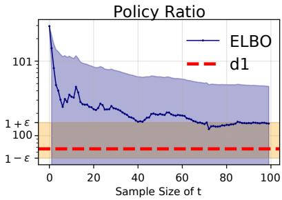
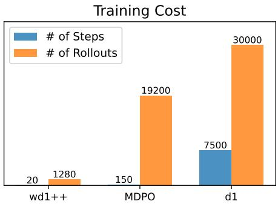
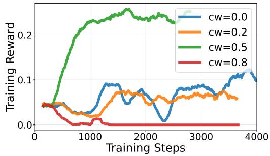

## ABSTRACT

Improving the reasoning capabilities of diffusion-based large language models (dLLMs) through reinforcement learning (RL) remains an open problem. The intractability of dLLMs likelihood function necessitates approximating the current, old, and reference policy likelihoods at each policy optimization step. This reliance introduces additional computational overhead, and can lead to large variance and estimation error in RL objective – particularly in computing the policy ratio for importance sampling. To mitigate these issues, we introduce wd1, a novel ratio-free policy optimization approach that reformulates the RL objective as a weighted log-likelihood, requiring only a single approximation for the current parametrized policy likelihood. We formally show that our proposed method can be interpreted as energy-guided discrete diffusion training combined with negative sample unlearning, thereby confirming its theoretical soundness. In experiments on LLaDA-8B model, wd1 outperforms diffusion-based GRPO (d1) while requiring lower computational cost, achieving up to a +59% improvement in accuracy. Furthermore, we extend wd1 to denoising-stepwise weighted policy optimization (wd1++), achieving state-of-the-art math performance of 44.2% on MATH500 and 84.5% on GSM8K with only 20 RL training steps.

## 1 INTRODUCTION

Diffusion-based large language models (dLLMs) have recently gained attention as promising alternatives to autoregressive (AR) models for language modelling tasks (Nie et al., 2025b; Ou et al., 2025b; Yang et al., 2025). Unlike AR models, which generate tokens sequentially, dLLMs iteratively refine entire response sequences through a denoising process. A primary advantage of this approach is the significantly improved inference efficiency. Notably, recent closed models such as Mercury (Labs et al., 2025) and Gemini Diffusion achieve over an order of magnitude speed-up in generation compared to AR models, while maintaining comparable generation quality. Furthermore, open-weight dLLMs demonstrate competitive performance on standard language benchmarks, with smaller models (Lou et al., 2024; Ou et al., 2025b; Nie et al., 2024) achieving parity with equivalently sized AR baselines, and larger-scale models such as LLaDA-8B (Zhu et al., 2025a) and Dream-7B (Ye et al., 2025) extending this trend at scale. While dLLMs demonstrate strong performance in text generation, it remains an open and important question how best to fine-tune dLLMs using RL – a paradigm that has proven highly effective in alignment and improving reasoning capabilities of AR models (Ouyang et al., 2022; Shao et al., 2024).

A key challenge in applying reinforcement learning (RL) to dLLMs is the intractability of their likelihood functions (Zhao et al., 2025; Yang et al., 2025), which necessitates approximation for policy optimization. Applying approximated log-likelihood for diffusion-based GRPO (Shao et al., 2024; Zhao et al., 2025) can exponentially amplify the approximation error and lead to large variance when computing the policy ratio for importance sampling. Moreover, GRPO requires the estimated likelihoods of the current, old, and reference policies at every training step, leading to significant computational overhead. These issues can be further exacerbated as the completion length and the number of diffusion steps increase.

To address these challenges, we propose wd1, a policy optimization approach with weighted loglikelihood objective for dLLMs. Crucially, this objective dispenses with explicit policy ratios and relies on a single likelihood approximation, thereby avoiding the potentially large bias and variance in policy ratio, and reducing the computational overhead. Our principal contributions are:

• We propose a novel reinforcement learning method for dLLMs, termed wd1, which formulates the objective as a weighted log-likelihood of outcome sequence, derived from reverse-KL regularized policy optimization. The weight, defined as $( - w ^ { + } + w ^ { - } )$ and dependent on the advantage A, balances two terms: $w ^ { + } \propto \exp ( A )$ increases the probability of higher-advantage completions, while $w ^ { - } \propto \exp ( - A )$ decreases the probability of lower-advantage ones. Together, this mechanism amplifies beneficial outcomes meanwhile actively reducing detrimental ones.

• We prove that our proposed RL method for dLLMs can be interpreted as jointly training an energyguided discrete diffusion model—guided by the advantage function—and unlearning low-advantage data, thereby steering generation toward higher-advantage completions.

• We conduct experiment with LLaDA-8B-Instruct model (Nie et al., 2025a). Compared to the baseline method d1 (Zhao et al., 2025), our method wd1 achieves 76.4% on Sudoku (Arel, 2025) (+58.8% over d1) and 51.2% on Countdown (Pan et al., 2025) (+16% over d1), without requiring supervised fine-tuning (SFT), and with significantly less computational burden in RL training.

• We further extend our method to leverage intermediate completions generated in the decoding process, which we call wd1++. The extended method surpasses several concurrent RL for dLLMs methods, achieving state-of-the-art performance 44.2% on MATH500 and 84.5% on GSM8K with only 20 training steps, and 10× fewer rollouts compared to the baseline methods.

## 2 PRELIMINARIES

We denote the generation policy of diffusion-based Large Language Models (dLLMs) by $\pi _ { \theta }$ . Denote prompt $q \in \mathcal { D }$ , and completions $o \in \mathcal { O }$ . Notably, the reward function denoted by $R ( q , o )$ in this work is not limited to verifiers. We use superscript k to indicate the k-th token of completion: $o ^ { k } \operatorname { o r } x _ { 0 } ^ { k } .$

## 2.1 DIFFUSION LARGE LANGUAGE MODELS

The prevailing class of discrete diffusion models for language modeling is masked diffusion models (MDMs), which gradually corrupt text sequences by replacing tokens with a special mask token (Lou et al., 2024; Shi et al., 2024; Sahoo et al., 2024; Ou et al., 2025b). Let $t \in [ 0 , \bar { 1 } ]$ denote the diffusion timestep, and $x _ { t }$ as the masked sequence at step t. The fully denoised sequence $( \mathrm { i . e . }$ , the completion o) is represented by $x _ { 0 }$ , and the forward process $( p _ { t \mid 0 } ( x _ { t } \mid x _ { 0 } ) )$ is formulated as a continuous-time Markov chain. The transition kernel $\mathbf { Q } _ { t }$ is absorbing (Campbell et al., 2022; Austin et al., 2023), meaning that at time $t , \mathbf { Q } _ { t } = \sigma ( t ) \mathbf { Q } ^ { \mathrm { a b s o r b } }$ , where σ is a decreasing scalar noise schedule and Qabsorb is a constant matrix (See Definition 2).

This work aims to apply reinforcement learning to fine-tune masked discrete diffusion models such as LLaDA (Ou et al., 2025b; Zhu et al., 2025a), which models the clean data distribution conditional on masked sequence as $\pi _ { \theta } ( x _ { 0 } ^ { k } \mid x _ { t } )$ . A standard training objective for MDMs is the negative evidence lower bound (ELBO), as proposed in Denoising Cross Entropy (DCE) (Ou et al., 2025b) and MD4 (Shi et al., 2024): let K denote the length of the sequence, $x _ { 0 } ^ { k }$ denote the k-th token of $x _ { 0 } , \forall x _ { 0 } \sim p _ { \mathrm { d a t a } } .$

$$
\mathcal {L} (x _ {0}) = - \mathbb {E} _ {t \sim \mathcal {U} [ 0, 1 ], x _ {t} \sim p _ {t | 0} (x _ {t} | x _ {0})} \left[ \frac {1}{t} \sum_ {k = 1} ^ {K} \mathbf {1} (x _ {t} ^ {k} = [ \text {mask} ]) \log \pi_ {\theta} (x _ {0} ^ {k} \mid x _ {t}) \right],\tag{1}
$$

Specifically, the intermediate timestep t is sampled uniformly, and the masked sequence $x _ { t }$ is generated according to the predefined forward process $p _ { t \mid 0 } ( x _ { t } \mid x _ { 0 } )$ . The resulting ELBO objective L is then commonly used as a tractable surrogate for the log-likelihood $\log \pi _ { \theta } ( x _ { 0 } )$ , enabling both supervised fine-tuning and reinforcement learning for MDMs (Nie et al., 2025a; Zhu et al., 2025a; Yang et al., 2025; Ou et al., 2025a).

## 2.2 EXISTING POLICY OPTIMIZATION METHODS

The base method of current prevailing RL fine-tuning algorithms is Trust Region Policy Optimization (TRPO) (Schulman et al., 2015), in which forward KL divergence is applied to restrict the update:

$$
\max _ {\theta} \mathbb {E} _ {q \sim \mathcal {D}, o \sim \pi_ {\theta} (\cdot | q)} \Big [ A ^ {\pi_ {\mathrm{old}}} (q, o) - \lambda D _ {\mathrm{KL}} (\pi_ {\mathrm{old}} (\cdot | q) \| \pi_ {\theta} (\cdot | q)) \Big ],\tag{2}
$$

where $A ^ { \pi _ { \mathrm { o l d } } }$ is the advantage function, $q$ and o are denoted as the prompt and (clean) response, respectively. Proposition 1 (Appendix A) demonstrates the monotonic policy improvement of TRPO.

PPO then extends the soft constraint (KL penalty) to clipping policy ratio $\pi _ { \theta } ( \cdot | q ) / \pi _ { \mathrm { o l d } } ( \cdot | q )$ and employing pessimism for policy update, further employed in fine-tuning (Ouyang et al., 2022) with additional reverse-KL regularization w.r.t. the reference policy $\pi _ { \mathrm { r e f } }$ . Group Relative Policy Optimization (GRPO) (Shao et al., 2024) simplifies PPO by sampling a group of completions $\{ o _ { i } \} _ { i = 1 } ^ { G }$ and approximating their advantage with their normalized rewards. This advantage is corrected by subtracting the mean reward across the group (Liu et al., 2025): $\hat { A } _ { i } = R ( q , o _ { i } ) - \mathsf { m e a n } \big ( R ( q , o _ { 1 : G } ) \big )$ which we refer to as the group-relative advantage.

## 2.3 POLICY OPTIMIZATION FOR DLLMS

Adapting GRPO to diffusion-based large language models (dLLMs) presents notable challenges, since dLLMs generate outputs via a non-autoregressive, iterative denoising process, making the computation of log $\pi _ { \boldsymbol { \theta } } ( o | q )$ intractable and necessitating approximation for policy optimization.

Existing works by Nie et al. (2025a); Yang et al. (2025) employ ELBO for per-token log-likelihood approximation following DCE: $\phi ^ { \pi } ( x _ { 0 } ^ { k } ) \stackrel { - } { = } \mathbb { E } _ { t \in \mathcal { U } [ 0 , 1 ] } [ w \cdot \mathbf { 1 } [ \bar { x } _ { t } ^ { k } = \mathtt { m a s k } ]$ log $\pi ( x _ { 0 } ^ { k } | x _ { t } , q ) ]$ , where $w =$ $1 / t$ in DCE and $w = 1$ in UniGRPO (Yang et al., 2025). However, an accurate estimation requires a large sample size of $t ,$ resulting in inefficiency for online RL. A biased but efficient method is introduced in d1 (Zhao et al., 2025), requiring only sample at $t = 1 \colon \phi ^ { \pi } ( x _ { 0 } ^ { k } ) = \log \pi ( x _ { 0 } ^ { k } | x _ { 1 } , q ^ { \prime } )$ where prompt $q ^ { \prime }$ is randomly masked, $x _ { 1 }$ is fully masked response.

In diffusion-based GRPO (Zhao et al., 2025; Yang et al., 2025), policy ratio is then computed using the approximated log-likelihoods: $r _ { i } ^ { k } ( \theta ) = \pi _ { \theta } \overline { { \big ( } o _ { i } ^ { k } ) / \pi } _ { \mathrm { o l d } } ( o _ { i } ^ { k } )$ ≈ exp $\left( \phi ^ { \pi _ { \theta } } \left( o _ { i } ^ { k } \right) - \phi ^ { \pi _ { \mathrm { o l d } } } \left( o _ { i } ^ { k } \right) \right)$ for importance sampling in estimating the objective of GRPO:

$$
\mathbb{E}_{\substack{q\sim \mathcal{D},\\ o_{1:G}\sim \pi_{\text{old}}(\cdot |q)}}\bigg[\frac{1}{GK}\sum_{i = 1}^{G}\sum_{k = 1}^{K}\min \big(r_{i}^{k}(\theta)\hat{A}_{i},\text{clip}(r_{i}^{k}(\theta),1\pm \epsilon)\hat{A}_{i}\big) - \beta D_{\text{KL}}\big(\pi_{\theta}(\cdot)\parallel \pi_{\text{ref}}(\cdot)\big)\bigg].\tag{3}
$$

However, existing approaches are hampered by their reliance on extensive likelihood approximation to compute the policy ratio. In current diffusion-based GRPO methods, the ratio is computed as $r _ { i } ^ { k } \approx \exp \left( \phi ^ { \pi _ { \theta } } ( o _ { i } ^ { k } ) - \phi ^ { \pi _ { \mathrm { o l d } } } ( o _ { i } ^ { k } ) \right)$ so approximation errors in likelihood can be exponentially amplified. As formally shown in Appendix ${ \mathrm { A . 1 } }$ , the resulting error in the estimated RL objective becomes more severe when less accurate log-likelihood approximations are used, such as in $d l .$ , or ELBO used in DCE and Uni-GRPO when the Monte Carlo sample size t is small.

Although increasing t in the ELBO estimator can reduce approximation error, the induced ratio estimates can still exhibit high variance, as illustrated in Figure 1. Although alternative approximator such as that in d1 can improve efficiency, but yields a biased ratio that can differ substantially from the ELBO-based ratio, thereby introducing a systematic bias into the RL training objective. Finally, GRPO requires applying the approximation function ϕ separately to three policies—πθ, πold, and $\pi _ { \mathrm { r e f } ^ { - } }$ —which further increases computational overhead.

  
Figure 1: Example policy ratio value $r _ { i } ^ { k }$ computed using ELBO and approximated likelihood in d1 on GSM8K after a policy update. Ratio’s unclipped interval is $[ 1 - \epsilon , 1 + \epsilon ]$ , where $\epsilon = 0 . 5$ ELBO-based likelihood approximation yields high-variance ratio estimates; d1 induces a biased ratio that can deviate substantially from ELBO. Both methods suffer from efficiently and accurately compute ratios.

## 3 wd1: WEIGHTED POLICY OPTIMIZATION FOR DLLMS

In this section, we introduce wd1, a novel RL algorithm that eliminates the need for approximating the likelihood (policy) ratios for importance sampling, aiming to reduce the computational burden, and the variance and approximation error in computing the RL objective. We further extend our method to wd1++ by applying denoising-stepwise policy optimization.

## 3.1 REINFORCEMENT LEARNING AS WEIGHTED LOG-LIKELIHOOD MAXIMIZATION

Prevailing RL methods are based on constrained policy optimization (Belousov & Peters, 2017), penalizing the deviation of current policy $\pi _ { \theta } ( \cdot | q )$ from the old policy $\pi _ { \mathrm { o l d } } ( \cdot | q )$ . TRPO objective (Equation (2)) applies a forward-KL penalty. We instead adopt reverse-KL penalty augmented with the reference policy regularization $D _ { \mathrm { K L } } ( \pi _ { \theta } ( \cdot | q ) \| \pi _ { \mathrm { r e f } } ( \cdot | q ) )$

$$
\max _ {\theta} \mathbb {E} _ {q \in \mathcal {D}, o \sim \pi_ {\theta} (\cdot | q)} \Big [ A ^ {\pi_ {\mathrm{old}}} (q, o) - \lambda D _ {\mathrm{KL}} \Big (\pi_ {\theta} (\cdot | q) \| \pi_ {\mathrm{old}} (\cdot | q) \Big) - \beta D _ {\mathrm{KL}} \Big (\pi_ {\theta} (\cdot | q) \| \pi_ {\mathrm{ref}} (\cdot | q) \Big) \Big ].\tag{4}
$$

Note that the monotonic improvement guarantee still holds when using reverse-KL penalty, as we show in Theorem 2. From the method of Lagrange multipliers, the solution to Equation (4) has the following form (Peng et al., 2019; Rafailov et al., 2023):

$$
\pi^ {*} (\cdot | q) \propto \pi_ {\text {old}} (\cdot | q) ^ {\lambda / (\lambda + \beta)} \cdot \pi_ {\text {ref}} (\cdot | q) ^ {\beta / (\lambda + \beta)} \cdot \exp \left(\frac {A ^ {\pi_ {\text {old}}} (q , \cdot)}{\lambda + \beta}\right).\tag{5}
$$

As the analytic form of the optimal policy $\pi ^ { * }$ is known, we can train our policy by directly minimizing $D _ { \mathrm { K L } } ( \pi ^ { * } ( \cdot | q ) \| \pi _ { \theta } ( \cdot | q ) )$ . This minimization can be expressed as the following weighted log-likelihood (WLL) loss, where the weights $\begin{array} { r } { \propto \exp \left( \psi A ^ { \pi _ { \mathrm { o l d } } } \right) , \psi = \frac { 1 } { \lambda + \eta } } \end{array}$ and the samples are obtained from the geometric mixture policy $\pi _ { \mathrm { o l d } } ^ { \mathrm { r e f } } ( \cdot | q ) \propto \pi _ { \mathrm { o l d } } ( \cdot | q ) ^ { \lambda / ( \lambda + \beta ) } \cdot \pi _ { \mathrm { r e f } } ( \cdot | q ) ^ { \beta / ( \lambda + \beta ) }$ (See Proposition 2): $\forall q \sim \mathcal { D }$

$$
\mathcal {L} _ {\mathrm{WLL}} (\theta) = \mathbb {E} _ {o \sim \pi_ {\mathrm{old}} ^ {\mathrm{ref}} (\cdot | q)} \Big [ - \exp \big (\psi A ^ {\pi_ {\mathrm{old}}} (q, o) \big) \cdot \log \pi_ {\theta} (o | q) \Big ]\tag{6}
$$

$$
\approx \mathbb {E} _ {\{o _ {i} \} _ {i = 1} ^ {G} \sim \pi_ {\mathrm{old}} ^ {\mathrm{ref}} (\cdot | q)} \left[ \frac {1}{G} \sum_ {i = 1} ^ {G} - \frac {\exp (\psi \hat {A} _ {i})}{\sum_ {j = 1} ^ {G} \exp (\psi \hat {A} _ {j})} \log \pi_ {\theta} (o _ {i} | q) \right].\tag{7}
$$

As shown in Equation (7), we approximate the advantage function using the group-relative advantage Aˆ and normalize the weights, thereby limiting their magnitude and reducing variance in loss computation. Notably, dividing by the normalization constant does not affect the solution, since it is independent of the completions. The resulting objective does not involve ratio $\pi _ { \theta } ( \cdot | q ) / \pi _ { \mathrm { o l d } } ( \cdot | q )$ for importance sampling or $\pi _ { \theta } ( \cdot | q ) / \pi _ { \mathrm { r e f } } ( \cdot | q )$ for regularization, successfully avoiding the potential amplification of log-likelihood approximation error and large variance in diffusion GRPO.

Although the objective ${ \mathcal { L } } _ { \mathrm { W L L } } ( \theta )$ in Equation (7) avoids the likelihood ratio estimation, it has two limitations. First, the algorithm is not fully utilizing all the completions. Due to the exponential form of the weighting, completions with relatively low advantage – referred to as negative samples – may receive vanishingly small weights, and do not contribute to learning. Second, due to the likelihoodmaximization property of ${ \mathrm { W L L } }$ , the likelihoods of all sampled completions are increased, even for negative samples. This issue is exacerbated in scenarios where all completions attain identical but low rewards (e.g. 0), thus all weights become equal and the likelihoods of these suboptimal samples are nonetheless reinforced.

## 3.2 wd1: FULLY UTILIZING COMPLETIONS

We propose wd1, an improved weighted log-likelihood objective that explicitly reinforces positive samples and penalizes negative samples:

$$
\mathcal {L} _ {w d I} (\theta) = \mathbb {E} _ {q \sim \mathcal {D}, \{o _ {i} \} _ {i = 1} ^ {G} \sim \pi_ {\mathrm{old}} ^ {\mathrm{ref}} (\cdot | q)} \Big [ \frac {1}{G} \sum_ {i = 1} ^ {G} \big (- w ^ {+} (q, o _ {i}) + w ^ {-} (q, o _ {i}) \big) \cdot \log \pi_ {\theta} (o _ {i} | q) \Big ],\tag{8}
$$

where the weights are based on group-relative (GRPO) advantage and are further normalized to avoid overly imbalanced weight $\hat { A } _ { i } = R ( q , o _ { i } ) - \mathsf { m e a n } ( R ( q , o _ { 1 : G } ) )$ :

$$
w ^ {+} (q, o _ {i}) = \frac {\exp (\psi \hat {A} _ {i})}{\sum_ {j = 1} ^ {G} \exp (\psi \hat {A} _ {j})}, \quad w ^ {-} (q, o _ {i}) = \frac {\exp (- \psi \hat {A} _ {i})}{\sum_ {j = 1} ^ {G} \exp (- \psi \hat {A} _ {j})}.\tag{9}
$$

wd1 objective balances positive and negative samples through a complementary penalty term, $w ^ { - } ( q , o _ { i } )$ log $\pi _ { \boldsymbol { \theta } } ( o _ { i } | q )$ , which minimizes the likelihood of low-advantage completions. This penalty induces negative gradients, thereby accelerating divergence from undesirable completions. Moreover, in the extreme case where all completions exhibit identical advantages, the optimization naturally halts since $w ^ { + } = w ^ { - }$ , thereby addressing the concern on increasing likelihood of negative samples proposed in Sec 3.1. We demonstrate the effectiveness of this combination via ablations in C.2.

Our method wd1, a simple ratio-free policy optimization based on weighted log-likelihood objective for dLLMs, is formally presented in Algorithm 1. We first obtain G completions $\{ o \} _ { i = 1 } ^ { G }$ sampled from geometric mixture $\pi _ { \mathrm { o l d } } ^ { \mathrm { r e f } } ( \cdot | q ) \propto \pi _ { \mathrm { o l d } } ^ { - } ( \cdot | q ) ^ { \lambda / ( \lambda + \beta ) } \cdot \pi _ { \mathrm { r e f } } ( \cdot | q ) ^ { \beta / ( \lambda + \beta ) }$ (line 5). Since the base model LLaDA parametrizes the clean token prediction $\pi _ { \mathrm { o l d } } ^ { \mathrm { r e f } } ( x _ { 0 } ^ { k } | x _ { t } , q )$ for denoising, we approximate log $\pi _ { \mathrm { o l d } } ^ { \mathrm { r e f } } ( x _ { 0 } ^ { k } | x _ { t } , q ) \approx \lambda \log \pi _ { \mathrm { o l d } } ( x _ { 0 } ^ { k } | x _ { t } , q ) + \beta \log \pi _ { \mathrm { r e f } } ( x _ { 0 } ^ { k } | x _ { t } , q )$ as the logits of the denoising distribution at each step t. We then use the samples to compute weights in Equation (9) (line 6). In weights computing, we leverage completions from all groups to estimate the normalization constant, in order to restrict the the gradient norm and stabilize the training. Finally in line 8, we approximate the log-likelihood of completions, and compute objectives for policy update. Likelihood approximation in d1 (Zhao et al., 2025) is directly applicable to wd1: log $\begin{array} { r } { \dot { \pi } _ { \boldsymbol { \theta } } ( x _ { 0 } \vert \boldsymbol { q } ) \approx \sum _ { k } \log \pi _ { \boldsymbol { \theta } } ( x _ { 0 } ^ { k } \vert \dot { x _ { 1 } } , \boldsymbol { q } ^ { \prime } ) } \end{array}$ , where $q ^ { \prime }$ is randomly masked from prompt q at every gradient step.

## 3.3 wd1++: STEPWISE WEIGHTED POLICY OPTIMIZATION

The decoding process in dLLMs relies on confidence-based remasking (Wang et al., 2025b). At each denoising step $l \in \{ 1 , \cdots , L \}$ in decoding, clean data is predicted conditional on the masked sequence x and then tokens with low-confidence are re-masked for further denoising, which construct a refine ment process. Since current diffusion RL methods only use the final predicted clean completion for training, there are bunch of clean completions in the intermediate denoising steps remaining unused.

To leverage intermediate clean completions, we extend our weighted log-likelihood objective to a step-wise formulation based on DCE, which we term wd1++. In wd1 (as well as in $\mathrm { G R P O } ) ,$ , a group of completions $\{ o _ { i } \} _ { i = 1 } ^ { G }$ is sampled for policy optimization. In wd1++, we expand this group to $\{ O _ { i } \} _ { i = 1 } ^ { G }$ , where ${ \cal O } _ { i } = \{ x _ { 0 | l } \ | \ x _ { 0 | l } \sim \pi _ { \mathrm { o l d } } ^ { \mathrm { r e f } } ( \cdot \ | \ x _ { t } , q ) , \ x _ { 0 | L } = o _ { i } , \ l = 1 , \dots , L \}$ , which contains all generated completions during the decoding process, including intermediate ones. The expanded group of completions is then used to estimate both the advantage function and the corresponding weights. The resulting loss objective is defined as:

$$
\mathcal{L}_{wdl + +}(\theta) = \mathbb{E}_{\substack{q\sim \mathcal{D},\\ \{O_{i}\}_{i = 1}^{G}\sim \pi_{\text{old}}^{\text{ref}}(\cdot |q)\\ l\in \text{Unif}\{1,\dots ,L\}}} \left[ \frac{L}{Gl}\sum_{i = 1}^{G}\sum_{x_{0|l}\in O_{i}}\big(-w^{+}(q,x_{0|l}) + w^{-}(q,x_{0|l})\big)\cdot \log \pi_{\theta}(x_{0|l}|x_{l},q)\right].\tag{10}
$$

## 4 THEORETICAL INSIGHTS: ENERGY-GUIDED DIFFUSION SAMPLING

In this section, we present a novel theoretical interpretation of policy optimization for dLLMs. We prove that the advantage-weighted log-likelihood objective (wd1) for dLLMs can be viewed as energy-guided discrete diffusion training combined with negative sample unlearning.

Sampling from the solution policy of the reverse-KL policy optimization, as described in Equation (5), can be interpreted as energy-guided sampling, where the energy function ${ \mathcal E } ( q , \cdot ) = - \dot { A } ^ { \pi _ { \mathrm { o l d } } } ( q , \cdot )$ Equation (5) defines the marginal distribution of the clean data $( x _ { 0 } = o )$ which we denote as $p _ { 0 } ^ { * } ( x _ { 0 } ) ^ { 1 }$ To obtain the guidance at intermediate time steps $t > 0$ , we define the forward diffusion process for the target diffusion policy $\pi ^ { * }$ as following.

Definition 1. The forward diffusion process of the target policy $( \pi ^ { * } )$ satisfies $p _ { t | 0 } ^ { * } ( x _ { t } | x _ { 0 } ) \ =$ $p _ { t \vert 0 } ( x _ { t } \vert x _ { 0 } )$ , where $p _ { t | 0 }$ is theforward process ofold diffusion policy $\pi _ { o l d }$

Algorithm 1 wd1: Weighted Policy Optimization for dLLMs
Require: Reference model  $\pi_{ref}$ , prompt distribution D, group size G, reward function R, dLLM  $\pi_{\theta}$ , regularization hyperparameters  $\lambda$  and  $\beta$ 
1: Initialize  $\pi_{\theta} \leftarrow \pi_{ref}$ 
2: while not converged do
3:  $\pi_{old} \leftarrow \pi_{\theta}$ 
4: Sample prompt  $q \sim D$  and G completions  $o_i \sim \pi_{old}(\cdot | q), \forall i \in [G]$ 
5: Compute advantage  $\hat{A}_i = R(q, o_i) - \text{mean}(R(q, o_{1:G})), \forall i \in [G]$ 
6: Compute weights  $w^+$  and  $w^-$  in Equation (9),  $\forall i \in [G]$ 
7: for gradient update iterations  $n = 1, 2, \ldots, \mu$  do
8: Compute approximated log-likelihood  $\log \pi_{\theta}(o_i | q)$ 
9: Compute objective  $\mathcal{L}_{wd1}(\theta)$  in Equation (8) or Equation (10) and update  $\theta$ 
10: end for
11: end while
12: return  $\pi_{\theta}$

Since the reference diffusion policy is the initial policy, three policies have identicalforward diffusion process, being $p _ { t | 0 } ^ { * } ( x _ { t } | x _ { 0 } ) { \stackrel { } { = } } p _ { t | 0 } \bar { ( } x _ { t } | x _ { 0 } ) = p _ { t | 0 } ^ { \mathrm { r e f } } ( x _ { t } | \bar { x } _ { 0 } )$ , and thus, $p _ { t | 0 } ^ { * } ( x _ { t } | x _ { 0 } ) = p _ { t | 0 } ^ { \prime } ( x _ { t } | x _ { 0 } )$ , where $p ^ { \prime }$ is the geometric mixture diffusion $p _ { t | 0 } ^ { \prime } ( x _ { t } | x _ { 0 } ) \propto p _ { t | 0 } ( x _ { t } | x _ { 0 } ) ^ { \lambda } p _ { t | 0 } ^ { \mathrm { r e f } } ( x _ { t } | x _ { 0 } ) ^ { \beta }$ . We can then obtain the energy guidance at all time step t.

Lemma 1 (Intermediate Energy Guidance on Discrete Diffusion). The marginal probability distribu tion ofthe masked responses $( x _ { t } )$ in the diffusion process satisfies $p _ { t } ^ { * } ( x _ { t } ) = \bar { p } _ { t } ^ { \prime } ( x _ { t } ) \cdot \exp \big ( A _ { t } ( x _ { t } ) \big ) / Z _ { t }$ which induces an energy-guided discrete diffusion:

$$
p _ {0 | t} ^ {*} (x _ {0} | x _ {t}) \propto p _ {0 | t} ^ {\prime} (x _ {0} | x _ {t}) \cdot \exp (A (x _ {0}) - A _ {t} (x _ {t})),\tag{11}
$$

where $- A _ { t } ( x _ { t } ) = - \log \mathbb { E } _ { x _ { 0 } \sim p _ { 0 \mid t } ^ { \prime } ( \cdot \mid x _ { t } ) } [ \exp \left( A ( x _ { 0 } ) \right) ]$ is intermediate energy function for $t > 0 ,$ , and $A ( \cdot )$ is advantagefunction (Proofin Appendix A.3).

The guidance provided in Lemma 1 demonstrates that it directs the sampling process toward generating completions that exhibit higher advantage values. However, conducting training-free guided sampling following Equation (11) requires estimating the posterior mean of the exponential of advantage (Lu et al., 2023). Rather than relying on such estimation, we instead aim to find the training objective to directly approximate the target guided diffusion model.

Since existing masked dLLMs parametrize the concrete score (Meng et al., 2022), to apply the energy guidance, we aim to directly approximate target guided concrete score. Denote $\boldsymbol { x } _ { t } = \bar { ( x _ { t } ^ { 1 } , \cdot \cdot \cdot , x _ { t } ^ { d } ) }$ and $\hat { x } _ { t }$ is identical to $x _ { t }$ except the i-th token is unmasked $( \mathrm { i . e . ~ } x _ { t } ^ { i } = [ M ]$ and $\hat { x } _ { t } ^ { i } \neq [ M ] )$ ). Concrete score is defined as the marginal probability ratio between $\hat { x } _ { t }$ and $x _ { t } \colon$

$$
s (x _ {t}, t) \stackrel {\mathrm{def}} {=} \frac {p (x _ {t} ^ {1} , \cdots , \hat {x} _ {t} ^ {i} , \cdots , x _ {t} ^ {d})}{p (x _ {t} ^ {1} , \cdots , x _ {t} ^ {i} , \cdots , x _ {t} ^ {d})}.\tag{12}
$$

We prove that the training objective to approximate the guided concrete score can be simplified as a weighted Denoising Concrete Score Matching (D-CSM) (Meng et al., 2022):

Theorem 1. The model s approximates the concrete score ofthe energy-guided discrete diffusion $p ^ { * }$ when thefollowing loss objective is minimized. This objective is in aform ofadvantage-weighted Denoising Concrete Score Matching, which we call AW-D-CSM:

$$
\mathcal {L} _ {A W - D - C S M} = \mathbb {E} _ {x _ {0} \sim p _ {0} ^ {\prime} (\cdot)} \left[ \underbrace {\exp (A (x _ {0}))} _ {\text {Advantage Weight}} \cdot \underbrace {\mathbb {E} _ {t \sim [ 0 , T ] , p _ {t | 0} ^ {\prime} (x _ {t} | x _ {0})} [ \| s _ {\theta} (x _ {t} , t) - \frac {p _ {0} ^ {\prime} (\hat {x} _ {t} | x _ {0})}{p _ {0} ^ {\prime} (x _ {t} | x _ {0})} \| _ {2} ^ {2} ]} _ {\mathcal {L} _ {D - C S M} (x _ {0})} \right].\tag{13}
$$

We provide the proof in Appendix A.3. Additionally, D-CSM is an approximation of CSM (Meng et al., 2022), which is equivalent to Denoising score entropy (DSE) (Lou et al., 2024). For all $x _ { 0 }$ it is satisfied up to multiplying a constant that $\mathcal { L } _ { \mathrm { D - C S M } } ( x _ { 0 } ) \Leftrightarrow \mathcal { L } _ { \mathrm { C S M } } ( x _ { 0 } ) \Leftrightarrow \mathcal { L } _ { \mathrm { D S E } } ( x _ { 0 } ) \Leftrightarrow \mathcal { L } _ { \mathrm { D C E } } ( x _ { 0 } )$

(Ou et al., 2025b). Therefore, AW-D-CSM can then be applied for both SEDD (Lou et al., 2024) and RADD (Ou et al., 2025b) model such as LLaDA. Denote $p _ { \theta }$ as the concrete score reparametrized model, AW-D-CSM can be converted to a weighted denoising cross-entropy loss (AW-DCE):

$$
\mathcal {L} _ {\mathrm{AW-DCE}} = \mathbb {E} _ {x _ {0} \sim p _ {0} ^ {\prime} (\cdot)} \bigg [ \exp \left(A (x _ {0})\right) \cdot \mathbb {E} _ {t \sim [ 0, T ], p _ {t | 0} ^ {\prime} (x _ {t} | x _ {0})} \big [ \sum_ {x _ {t} ^ {i} = [ \text {mask} ]} - \frac {1}{t} \log p _ {\theta} (x _ {0} ^ {i} | x _ {t} ^ {\mathrm{UM}}) \big ] \bigg ].\tag{14}
$$

DSE and DCE objectives both can be used for likelihood approximation in fine-tuning (Ou et al., 2025b; Nie et al., 2025a; Yang et al., 2025) since they can serve as negative ELBO (Lou et al., 2024; Shi et al., 2024). Thus, the advantage-weighted objective AW-DCE (or AW-DSE) used to learn energy-guided score is in a weighted log-likelihood form as in wd1 with only $w ^ { + } \mathrm { ( i . e }$ . WLL loss in Equation (6)), which contributes to our main theoretical findings:

Remark 1. In the context of applying RL to masked discrete diffusion, the advantage-weighted loglikelihood (WLL) objective (Equation (6)) induced by reverse-KL policy optimization, is equivalent to the objective oftraining energy-guided diffusion models, where the energyfunction is the negative advantage. Formally, L $\Leftrightarrow \mathcal { L } _ { A W - D C E }$ when DCE is used for likelihood approximation.

Remark 2. Additionally, based on DCE likelihood, the additional penalty term on negative samples used to extend WLL to wd1 loss can be viewed as applying data unlearning by minimizing the ELBO (Alberti et al., 2025), where the data $\{ x _ { 0 } ^ { - } \}$ (negative samples) has probability distribution $p _ { d a t a } ( x _ { 0 } ^ { - } ) \propto p _ { 0 } ^ { \prime } ( x _ { 0 } ^ { - } ) \exp ( - A ( q , x _ { 0 } ^ { - } ) )$ , which corresponds to a Boltzmann distribution that places higher probability mass on regions with lower advantage values (more details in Appendix D.1).

## 5 EXPERIMENTS

In this section, we empirically validate the following key advantages of our approach:

i) Improved reasoning capabilities than existing methods on popular reasoning benchmarks; ii) reduced computational burden, as reflected by decreased runtime, lower FLOPs and numbers of function evaluations (NFEs) per training step, number of training steps and rollouts; and

iii) marked performance gains attributable to the incorporation of samples with low-advantage.

To evaluate our approach, we next detail the experimental setup and implementation.

Experimental Setup. We perform reinforcement learning (RL) fine-tuning on the LLaDA-8B-Instruct model (Nie et al., 2025a) with Low-Rank Adaptation (LoRA) on: GSM8k (Cobbe et al., 2021), MATH (Lightman et al., 2023), Sudoku (Arel, 2025), and Countdown (Pan et al., 2025). As for decoding, we follow the default strategy Mounier & Idehpour (2025); Arriola et al. (2025); Wang et al. (2025b). Our main baseline is d1 (Zhao et al., 2025), thefirst RL method developed for masked diffusion LLMs (dLLMs). We reproduce the baseline methods Diffu-GRPO, which applies diffusion-based GRPO training directly to the LLaDA base model, and d1, which performs SFT before applying Diffu-GRPO. We use s1K (Muennighoff et al., 2025) data for SFT in d1. We also compare with SDPO (Han et al., 2025), TCR (Wang et al., 2025d), and MDPO (He et al., 2025) on benchmarks GSM8K and MATH500. MDPO is reproduced based on the official implementation and the training dataset (He et al., 2025).

Implementation. As for wd1, we conduct training on the same dataset as in d1 (Zhao et al., 2025): training splits on GSM8k and MATH, and the dataset splits provided by Zhao et al. (2025) on Sudoku and Countdown. In our implementation of wd1, we apply the same likelihood approximation method as d1. The hyperparameters used in our method and our reproduction of d1 are listed in Table 6 and Table 5. As for wd1++, we train on dataset provided by (He et al., 2025), which is sampled from OpenR1 dataset (Face, 2025). Since previous works (Yu et al., 2025) have demonstrated that the reference policy is empirically unnecessary, we set $\beta = 0$ and $\lambda = 1$ to eliminate $\pi _ { \mathrm { r e f } }$ in practice. We report results using zero-shot and pass@1 evaluation on sequence lengths of 256 and 512 tokens.

## 5.1 MAIN RESULTS

Superior Reasoning Ability. In Table 1, we observe that wd1, even without supervised fine-tuning or using any supervised data, consistently outperforms our reproduced implementation of d1. Notably, wd1 surpasses d1 by 43% in test accuracy on the Sudoku task, and achieves up to a 25% improvement on Countdown with maximum length 256. Relative to the base LLaDA model, the performance gain reaches as high as 54% on Sudoku and 42% on Countdown. On math problem-solving benchmarks GSM8K and MATH500, wd1 attains slightly higher accuracy. Nevertheless, the extended method wd1++ obtains significantly better accuracy. In Table 3 (left), we further compare with concurrent baselines released in recent months. wd1++ outperforms the baselines including strong one MDPO.

Table 1: Test Accuracy (%) of wd1 and $d l .$ . We reproduce d1 and vary completion length. Our approach without SFT, demonstrates particularly higher accuracy on Sudoku2and Countdown.

<table><tr><td rowspan="2">Model / Gen Len</td><td colspan="2">Sudoku</td><td colspan="2">Countdown</td><td colspan="2">GSM8K</td><td colspan="2">MATH500</td></tr><tr><td>256</td><td>512</td><td>256</td><td>512</td><td>256</td><td>512</td><td>256</td><td>512</td></tr><tr><td>LLaDA-8B-Instruct</td><td>6.7</td><td>5.5</td><td>19.5</td><td>16.0</td><td>76.7</td><td>78.2</td><td>32.4</td><td>36.2</td></tr><tr><td>+ diffu-GRPO</td><td>16.1</td><td>11.7</td><td>27.0</td><td>34.0</td><td>80.7</td><td>79.1</td><td>34.4</td><td>39.0</td></tr><tr><td>+ SFT + diffu-GRPO (d1)</td><td>17.6</td><td>16.2</td><td>25.8</td><td>35.2</td><td>78.2</td><td>82.0</td><td>34.4</td><td>38.0</td></tr><tr><td>+ wd1</td><td>76.4</td><td>62.8</td><td>51.2</td><td>46.1</td><td>80.8</td><td>82.3</td><td>34.4</td><td>39.0</td></tr></table>

Table 2: Comparison of Training Cost on 4×A100. We show SFT cost, average training time, FLOPs evaluated by DeepSpeed Flops Profiler, and theoretical NFEs per training step which includes $\mu = 8$ gradient steps. wd1 removes SFT and has less cost per-step in RL than d1.

<table><tr><td rowspan="2">Method</td><td>SFT</td><td colspan="3">RL Training</td></tr><tr><td>Time Cost</td><td>Time Cost</td><td>FLOPs</td><td>NFEs for Likelihood</td></tr><tr><td>d1</td><td>2.01 hrs</td><td>103.5 sec/step</td><td> $9.922 \times 10^{15}$ /step</td><td> $(\mu + 2)$ /step</td></tr><tr><td>wd1</td><td>0 hrs</td><td>81.16 sec/step</td><td> $8.887 \times 10^{15}$ /step</td><td> $\mu$ /step</td></tr></table>

Reduced Training Cost. Table 2 demonstrates that the training cost required by wd1 is substantially lower than that of d1. Unlike d1, wd1 does not require a SFT stage, which alone accounts for approximately two hours of training in d1. wd1 achieves additional speedup during the RL phase, where runtime is measured by averaging over $\mu = 8$ inner gradient steps per global step. Notably, the time efficiency gap is expected to widen further under settings with larger maximum sequence lengths and more diffusion steps. This efficiency gain is further supported by a reduced FLOPs and number of function evaluations (NFEs) per step, as wd1 bypasses the need to approximate the likelihood of the old policy. We exclude NFEs associated with sampling, since both methods share identical sampling costs as wd1 removes the reference policy regularization.

In Table 3 (right), we report the training cost required to obtain the best post-trained models on GSM8K and MATH500, measured in terms of the number of training steps and rollouts. wd1++ requires 10× fewer rollouts to achieve superior performance, clearly demonstrating the efficiency of our method. This rapid convergence arises primarily from the exponential advantage weights applied to the log-likelihood in wd1. In contrast, standard RL methods such as GRPO and PPO weight the log-likelihood (or policy ratio) terms directly by the advantage function.

## 5.2 ABLATION STUDY

We present an ablation study in Figure 4. Notably, we observe that supervised fine-tuning (SFT) yields only marginal improvements within our approach, with a slight gain in the Sudoku task. This contrasts with d1, where SFT plays a significant role in improving performance. These findings indicate that wd1 can eliminate the need for an SFT phase, thereby simplifying the training pipeline and substantially reducing computational cost. Additionally, we evaluate the impact of removing the negative-weighted term by setting $w ^ { - } = 0$ , thus relying solely on the positive advantage weights $w ^ { + }$ We provide further ablation on the combined method between $w ^ { + }$ and $w ^ { - }$ in Table 9. The results highlight the importance of explicitly penalizing the likelihood of low-advantage completions, thereby reinforcing the role of negative samples, and emphasize the critical balance between the two weights.

Table 3: Left: Extended method wd1++ compared to concurrent RL methods to fine-tune LLaDA-8B-Instruct. Methods denoted by “(full)” perform full fine-tuning. Right: Training cost to obtain the best model on GSM8K and MATH500. We count the total number of steps of policy iteration (model weights update), and the number of rollouts used for training (see Table 8 for details on counting).

<table><tr><td>Model</td><td>GSM8K</td><td>MATH500</td></tr><tr><td>LLaDA-8B-Instruct</td><td>78.2</td><td>36.2</td></tr><tr><td>+ diffu-GRPO (Zhao et al., 2025)</td><td>80.7</td><td>39.0</td></tr><tr><td>+ d1 (Zhao et al., 2025)</td><td>82.0</td><td>38.0</td></tr><tr><td>+ SDPO (Han et al., 2025) (full)</td><td>81.2</td><td>-</td></tr><tr><td>+ TCR (Wang et al., 2025d)</td><td>83.0</td><td>41.4</td></tr><tr><td>+ MDPO (He et al., 2025) (full)</td><td>83.4</td><td>43.4</td></tr><tr><td>+ wd1</td><td>82.3</td><td>39.0</td></tr><tr><td>+ wd1 (full)</td><td>82.7</td><td>43.6</td></tr><tr><td>+ wd1++ (full)</td><td>84.5</td><td>44.2</td></tr></table>

Table 4: Ablation on SFT and Negative Samples Weight (w−). We conduct wd1 training after SFT (wd1-SFT) and with only $w ^ { + }$ (namely wd1-P or WLL defined in Equation $( 6 ) ) ^ { 3 }$ . Results show that wd1 performs better without SFT on planning and math tasks. Removing negative sample reinforcement (w−) significantly hurts performance, highlighting its importance.

<table><tr><td rowspan="2">Model / Gen Len</td><td colspan="2">Sudoku</td><td colspan="2">Countdown</td><td colspan="2">GSM8K</td><td colspan="2">MATH500</td></tr><tr><td>256</td><td>512</td><td>256</td><td>512</td><td>256</td><td>512</td><td>256</td><td>512</td></tr><tr><td>wd1-P (WLL)</td><td>6.69</td><td>6.84</td><td>13.67</td><td>4.69</td><td>65.66</td><td>78.17</td><td>29.40</td><td>22.80</td></tr><tr><td>wd1-SFT</td><td>26.5</td><td>24.2</td><td>43.4</td><td>43.4</td><td>80.7</td><td>82.0</td><td>36.4</td><td>39.0</td></tr><tr><td>wd1</td><td>25.2</td><td>24.2</td><td>51.2</td><td>46.1</td><td>80.8</td><td>82.3</td><td>34.4</td><td>39.0</td></tr></table>

We further assess sensitivity to the relative weighting of positive and negative samples. The combined weight (cw) corresponds to λ in the mixture $- \lambda w ^ { \bar { + } } + ( 1 - \lambda ) w ^ { - }$ , which scales the loglikelihood term in wd1. Training on negative samples alone (cw= 0.0) yields a pronounced deterioration in performance relative to our default setting $( \mathrm { c w } { = } 0 . 5 )$ . The results reinforce our argument that a balanced contribution of positive and negative weights is most effective. In the absence of positive samples, the reinforcement-learning signal collapses and optimisation becomes largely ineffective. A large emphasis on positive samples (cw= 0.8) causes performance to deteriorate more rapidly, highlighting the critical role of negative samples in weighted log-likelihood methods.

  
Figure 2: Training rewards of wd1 under different combined weights on Sudoku.

## 6 RELATED WORK

RL for Diffusion-based LLM. RL for discrete diffusion models has been explored through several approaches. One line of work, exemplified by DRAKES (Wang et al., 2024), leverages reward backpropagation along the denoising trajectory. This approach requires computing a critic and propagating gradients through each denoising step, which is computationally intensive and prone to vanishing gradients. Alternatively, methods such as MMaDA (Yang et al., 2025) and d1 (Zhao et al., 2025) adopt direct RL formulations like GRPO, approximating missing diffusion components—such as per-token likelihoods—for policy optimization. Zhu et al. (2025a) applies Direct Preference Optimization (DPO) to fine-tune the LLaDA base model (Nie et al., 2025a), achieving notable gains in reasoning tasks. However, these approaches all depend on likelihood ratios, which can introduce bias and instability due to likelihood approximation errors. In contrast, our method derives a weighted policy optimization approach that eliminates the need for explicit policy ratios. Importantly, similar to prior works, our method directly optimizes the predictive distribution over clean data. A complementary line of research formulates policy optimization in terms of concrete scores (Lou et al., 2024; Meng et al., 2022). SEPO (Zekri & Boullé, 2025), for instance, introduces a policy optimization objective that only depends on concrete score estimation, thereby circumventing likelihood approximation altogether.

RL for AR Models. The connection between GRPO and weighted regression has recently been explored in the context of RL with verifier reward (Mroueh, 2025), where binary rewards simplify policy optimization into likelihood-based objectives. Other closely related approaches are Rejection Sampling Fine-Tuning (RAFT), which maximizes the likelihood of positive-reward samples (Xiong et al., 2025). Extensions of this idea incorporate negative samples to actively penalize the likelihood of negative-reward completions while enhancing that of high-reward ones (Zhu et al., 2025b; Chen et al., 2025). Other works introduce negative penalization through contrastive methods, such as Noise Contrastive Estimation (NCE) (Gutmann & Hyvärinen, 2012; van den Oord et al., 2019; Chen et al., 2024). Beyond binary rewards, preference-based learning has been widely studied using the Bradley–Terry model (Bradley & Terry, 1952; Ouyang et al., 2022; Rafailov et al., 2024; Azar et al., 2023; Ethayarajh et al., 2024; Wang et al., 2023; Hong et al., 2024). In contrast to these approaches, our method accommodates general reward signals and can be interpreted as a form of soft rejection sampling, enabling efficient and stable policy optimization for dLLMs.

RL via Weighted Regression. RL via weighted regression has been explored in earlier works advantage-weighted regression (AWR) (Peng et al., 2019; Peters et al., 2010), and more recently in the context of continuous control with diffusion policies (Ding et al., 2024; Zhang et al., 2025). Weighted likelihood-based approaches have also been proposed for fine-tuning autoregressive (AR) language models using general reward functions (Du et al., 2025; Baheti et al., 2024; Zhu et al., 2023). However, for AR models, where likelihoods are tractable, the necessity of such approaches remains unclear. In contrast, dLLMs suffer from intractable likelihoods, making weighted likelihood formulations particularly advantageous by reducing the number of required likelihood approximations. As such, RL via weighted likelihood provides a natural and efficient fit for optimizing dLLMs. In addition, we demonstrate in ablation study that merely optimizing policy with AWR (wd1-P) is ineffective.

"Ratio-Free" Policy Optimization. If a policy optimization objective requires neither importance sampling nor regularization with respect to a reference model, then the objective is ratio-free. Consequently, on-policy algorithms such as vanilla policy gradient methods (e.g., REINFORCE (Williams, 1992)) and their variants (e.g., RLOO (Kool et al., 2019)) are inherently ratio-free. This property is particularly valuable for dLLMs, where errors in log-likelihood approximation can accumulate and propagate through ratio-based computations. Concurrent work, such as SPG (Wang et al., 2025a), adopts a policy-gradient formulation and develops an objective tailored specifically for diffusion language models. Another on-policy optimization approach, d2 (Wang et al., 2025c), removes both the ratios and the likelihood terms from the RL objective for dLLMs, offering a more fundamental solution. However, our method wd1, similar to AWR (Peng et al., 2019), is inherently an off-policy loss, which is more general.

## 7 CONCLUSION

We introduce wd1, a weighted policy optimization method for reasoning with dLLMs. wd1 is designed to minimize reliance on likelihood approximation, thereby mitigating the potentially substantial bias that can arise from approximation errors in policy ratios. Our method is grounded in a weighted log likelihood objective, derived to approximate the closed-form solution to the reverse-KL-constrained policy optimization. Empirically, we show that wd1, even without supervised fine-tuning, surpasses the existing method d1 by up to 16% in accuracy on reasoning benchmarks, while also delivering notable improvements in computational efficiency during RL training. These results highlight the effectiveness of wd1 and establish it as a more scalable and efficient approach for fine-tuning dLLMs.

## 8 ETHICS AND REPRODUCIBILITY STATEMENT

This work raises no question or concern regarding the Code of Ethics. As for reproducibility of our results, we provide details of implementations in Section 5, in Experimental Setup and Implementation subsections. Additional details including dataset, reward functions, and hyperparameters are provided in Appendix B. All the theoretical results are proved in Appendix A.