## ABSTRACT

Diffusion models excel at generating high-quality, diverse samples, yet they risk memorizing training data when overfit to the training objective. We analyze the distinctions between memorization and generalization in diffusion models through the lens of representation learning. By investigating a two-layer ReLU denoising autoencoder (DAE), we prove that: (i) memorization corresponds to the model storing raw training dataset in the learned weights for encoding and decoding, yielding localized, spiky representations; whereas (ii) generalization arises when the model captures local data statistics, producing balanced representations. Furthermore, we validate our theoretical findings on real-world unconditional and text-to-image diffusion models, demonstrating that the same rep resentation structures emerge in deep generative models with significant practical implications. Building on these insights, we propose a representation-based method for detecting memorization and a training-free editing technique that allows precise control via representation steering. Together, our results highlight that learning good representations is central to novel and meaningful generative modelling. Code is available at https://github.com/la0ka1/ diffusion-gen-from-rep.

## 1 INTRODUCTION

Diffusion models (Ho et al., 2020; Lou et al., 2024) have rapidly emerged as the dominant class of generative models, powering state-of-the-art systems such as Stable Diffusion (Rombach et al., 2022), Flux (Labs et al., 2025), and Veo (Google, 2025). By iteratively denoising random noise, they achieve unprecedented scalability, controllability, and fidelity. However, their empirical success raises a fundamental question: in principle, the standard training objective (e.g., denoising score matching) admits a closed-form solution that merely memorizes training examples (Yi et al., 2023); in practice, however, real-world models consistently produce novel and diverse outputs (Zhang et al., 2024; Kadkhodaie et al., 2024a). This distinct mismatch between theoretical expectation and observed behavior poses a critical gap in our understanding ofdiffusion model generalization, with direct implications for privacy, interpretability, and trustworthy deployment (Somepalli et al., 2023a).

Addressing this question has drawn increasing attention in the machine learning community (Zhang et al., 2024; Li et al., 2024b; Wang et al., 2024a; Kadkhodaie et al., 2024a; Gu et al., 2025; Bonnaire et al., 2025; Zhang et al., 2025b; Bertrand et al., 2025; Zhang et al., 2025a), yet existing explanations remain far from satisfactory. Early works based on random feature models (Li et al., 2023; George et al., 2025) provide useful insights but necessarily oversimplify model architectures. Analyses of linear models on Gaussian mixtures (Li et al., 2024b; Wang et al., 2024a; Wang, 2025) shed light on generalization but cannot capture memorization. Another line of research explores inductive biases by constructing handcrafted closed-form solutions from empirical data to approximate U-Net performance (Kamb and Ganguli, 2025; Niedoba et al., 2025; Lukoianov et al., 2025; Floros et al., 2025), attributing success to principles such as locality and equivariance. While these advances are valuable, the findings remain fragmented and phenomenological, and a more unified account of how diffusion models both memorize and generalize is still lacking (see Appendix A for a more detailed discussion of related work).

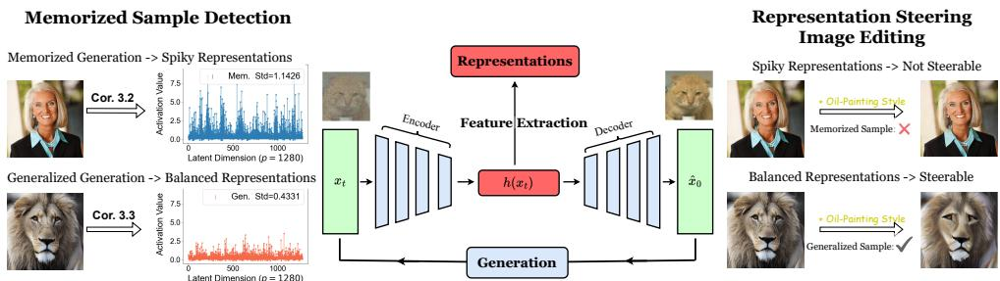  
Figure 1: Diffusion models generalize while learning benign internal representations. Activations from intermediate network layers form a representation space, within which distinct patterns emerge: memorized samples produce spiky representations that make them detectable, whereas novel generations yield balanced, information-rich representations that support controllable generation via representation steering.

To address these challenges, we develop a unified mathematical framework based on a theoretical analysis of a nonlinear two-layer ReLU denoising autoencoder (DAE) (Vincent, 2011). This framework not only unifies the characterization of memorization and generalization, but also bridges distribution learning with representation learning, offering profound practical implications. Specifically: (i) Memorization. We prove that when empirical samples are locally sparse, the network weights memorize and store individual training examples, leading to overfitting and hence memorization. (ii) Generalization. Conversely, when the empirical data are locally abundant, the weights effectively capture local data statistics, enabling the model to generate novel in-distribution samples.

Crucially, our work provides a unique representation-centric perspective on generalization (Tian, 2025), highlighting the pivotal role of bottleneck activations in DAE networks. This view is motivated by recent empirical evidence on the duality between distribution learning and representation learning in diffusion models (Li et al., 2025c; Xiang et al., 2025; Tinaz et al., 2025): they inherently learn informative features for downstream tasks (Kwon et al., 2023; Chen et al., 2025b), and representation alignment regularization has been shown to accelerate training (Yu et al., 2025). Our theory makes this connection explicit: memorized samples are encoded as spiky activations concentrated on a few neurons, whereas generalized samples yield balanced representations that reflect the underlying distribution. These contrasting modes of representation learning manifest in distinct generation behaviors in terms of memorization or generalization, which we comprehensively validated across a range of models, including EDM (Karras et al., 2022), Diffusion Transformers (DiT) (Peebles and Xie, 2023), and Stable Diffusion v1.4 (Rombach et al., 2022) (SD1.4).

Moreover, our findings show that the representation space is not a byproduct but a crucial and controllable factor for generation. Specifically, we demonstrate two practical implications: (i) Memorization detection. Leveraging the spikiness of representations identified by our theory as a signature of memorization, we develop a theory-driven detector that achieves highly accurate and efficient performance in a prompt-free manner. (ii) Model steering. We propose an effective steering method based on additions in the representation space and reveal distinct behaviors between memorization and generalization: memorized samples are difficult to steer, whereas generalized samples are highly steerable owing to their balanced, semantically rich representations. Together, these applications illustrate the far-reaching implications of our representation-centric analysis for the privacy, interpretability, and controllability of diffusion models.

## Summary of contributions. Our main contributions are as follows:

• Unified framework in a nonlinear ReLU setting. We analyze the optimal solutions of a twolayer nonlinear ReLU DAE under different empirical data sizes, providing a unified characterization of memorization and generalization that goes beyond prior random-feature or linear model analyses.

• A representation-centric understanding of generalization. We establish a rigorous connection between representation structures and generalization, identifying distinct patterns that separate memorization from generalization and validating these insights across diverse model settings.

• Theory-inspired tools for memorization detection and model steering. Building on our analysis, we propose simple yet effective methods for memorization detection and representation-space steering, revealing distinct behaviors of generalized versus memorized samples.

## 2 PROBLEM SETUP

In this section, we first introduce the basics of diffusion models, and then describe our problem setup for theoretical studies in Section 3.

## 2.1 A DENOISING PERSPECTIVE OF DIFFUSION MODELS

Basics of diffusion models. Diffusion models comprise two processes: (i) a forward noising process and (ii) a reverse denoising/sampling process. The forward process progressively corrupts a clean sample $\scriptstyle { \pmb x } _ { 0 }$ via ${ \pmb x } _ { t } = { \pmb x } _ { 0 } + \sigma _ { t } { \pmb \epsilon }$ with $\epsilon \sim \mathcal { N } ( 0 , I )$ , while the reverse process (e.g., DDIM (Song et al., 2021a)) removes noise to generate data:

$$
\boldsymbol {x} _ {t - 1} = \boldsymbol {x} _ {t} - (\sigma_ {t} - \sigma_ {t - 1}) \sigma_ {t} \nabla \log p _ {t} (\boldsymbol {x} _ {t}),\tag{1}
$$

where ∇ log $p _ { t } ( \pmb { x } _ { t } )$ is the score function of the marginal distribution of the noisy sample $\mathbf { \Delta } _ { \mathbf { \mathcal { X } } _ { t } }$ at time t. To estimate ∇ log $p _ { t } ( \pmb { x } _ { t } )$ , we use a denoising autoencoder (DAE) ${ f } _ { \pmb { \theta } } ( \pmb { x } _ { t } )$ (Karras et al., 2022; Li and He, 2025) that predicts $\scriptstyle { \pmb x } _ { 0 }$ from $\mathbf { \Delta } _ { \mathbf { \mathcal { X } } _ { t } }$ , so that

$$
\nabla \log p _ {t} (\boldsymbol {x} _ {t}) = (\boldsymbol {x} _ {t} - \boldsymbol {f} _ {\mathrm{gt}} (\boldsymbol {x} _ {t})) / \sigma_ {t} ^ {2} \approx (\boldsymbol {x} _ {t} - \boldsymbol {f} _ {\boldsymbol {\theta}} (\boldsymbol {x} _ {t})) / \sigma_ {t} ^ {2},
$$

where $f _ { \mathrm { g t } } ( \pmb { y } ) : = \mathbb { E } [ \pmb { x } \ | \ \pmb { x } + \sigma _ { t } \pmb { \epsilon } = \pmb { y } ; \pmb { x } \sim p _ { \mathrm { g t } } ]$ is the ground-truth denoiser via Tweedie’s formula (Efron, 2011). Thus, the ideal (population) objective to learn the DAE is

$$
\frac {1}{T} \sum_ {t = 0} ^ {T} \mathbb {E} _ {\boldsymbol {x} \sim p _ {\mathrm{gt}}, \epsilon \sim \mathcal {N} (\boldsymbol {0}, \boldsymbol {I})} \left[ \left\| \boldsymbol {f} _ {\boldsymbol {\theta}} (\boldsymbol {x} + \sigma_ {t} \boldsymbol {\epsilon}, t) - \boldsymbol {x} \right\| ^ {2} \right].\tag{2}
$$

Generalization of diffusion models. In practice, we only have finitely many empirical samples ${ \pmb X } ~ = ~ \{ { \pmb x } _ { i } \} _ { i = 1 } ^ { n }$ with $\mathbf { \boldsymbol { x } } _ { i } ~ \sim ~ p _ { \mathrm { { g t } } }$ Accordingly, we work with the empirical distribution $p _ { \mathrm { e m p } } ~ =$ $\begin{array} { r } { \frac { 1 } { n } \sum _ { i = 1 } ^ { n } \delta ( \pmb { x } - \pmb { x } _ { i } ) } \end{array}$ , and Equation (2) reduces to its empirical counterpart. Minimizing this empirical Ploss leads to the nonparametric empirical denoiser $f _ { \mathrm { e m p } }$ (Gu et al., 2025), which maps a noisy input towards the nearest training samples:

$$
\pmb {f} _ {\mathrm{emp}} (\pmb {y}) = \mathbb {E} [ \pmb {x} | \pmb {x} + \sigma_ {t} \pmb {\epsilon} = \pmb {y}; \pmb {x} \sim p _ {\mathrm{emp}} ] = \frac {\sum_ {i = 1} ^ {n} \mathcal {N} (\pmb {y} ; \pmb {x} _ {i} , \sigma_ {t} ^ {2} \pmb {I}) \pmb {x} _ {i}}{\sum_ {i = 1} ^ {n} \mathcal {N} (\pmb {y} ; \pmb {x} _ {i} , \sigma_ {t} ^ {2} \pmb {I})}.\tag{3}
$$

Sampling with $f _ { \mathrm { e m p } }$ can provably reproduce training samples (Zhang et al., 2024; Baptista et al., 2025). In practice, however, this empirical loss is minimized by taking the gradient descent over a parameterized neural network, which does not always overfit; instead, it can approximate the population denoiser $f _ { \mathrm { g t } }$ (Niedoba et al., 2025). In this paper, we aim to understand when a parameterized network overfits (learns $f _ { \mathrm { e m p } } )$ versus generalizes (learns $f _ { \mathrm { g t } } )$

## 2.2 OUR THEORETICAL FRAMEWORK

Data assumptions. We assume a K-component mixture of Gaussians (MoG) for the data distribution:

$$
\boldsymbol {x} \sim p _ {\mathrm{gt}} := \sum_ {k = 1} ^ {K} \rho_ {k} \mathcal {N} (\boldsymbol {\mu} _ {k}, \boldsymbol {\Sigma} _ {k}), \quad \sum_ {k = 1} ^ {K} \rho_ {k} = 1,\tag{4}
$$

which is a standard approximation to data manifolds used in recent theoretical studies (Wang et al., 2024a; Zhang et al., 2024; Li et al., 2025c; Cui and Zdeborová, 2023; Gatmiry et al., 2025; Biroli et al., 2024; Kamkari et al., 2024; Buchanan et al., 2025; Li et al., 2025c;b).

Model parameterization and training loss. Following Vincent (2011); Chen et al. (2023); Zeno et al. (2023); Cui et al. (2025), we parameterize the DAE by a two-layer ReLU network:

$$
\boldsymbol {f} _ {\boldsymbol {W} _ {2}, \boldsymbol {W} _ {1}} (\boldsymbol {x}) = \boldsymbol {W} _ {2} \boldsymbol {h} (\boldsymbol {x}) = \boldsymbol {W} _ {2} \left[ \boldsymbol {W} _ {1} ^ {\top} \boldsymbol {x} \right] _ {+},\tag{5}
$$

with $W _ { 1 } , W _ { 2 } \in \mathbb { R } ^ { d \times p } , [ \cdot ] _ { + }$ denoting ReLU and $h ( \cdot )$ stands for the representation. Training and sampling can be viewed as operating with a collection of DAEs across multiple noise levels. Following prior work (Li et al., 2024b; Zeno et al., 2025; Zhang and Pilanci, 2024; Han et al., 2025), we begin with a fixed noise level σ. The ℓ -regularized training objective is

$$
\min _ {\boldsymbol {W} _ {2}, \boldsymbol {W} _ {1}} \mathcal {L} _ {\boldsymbol {X}} (\boldsymbol {W} _ {2}, \boldsymbol {W} _ {1}) = \frac {1}{n} \sum_ {i = 1} ^ {n} \mathbb {E} _ {\boldsymbol {\epsilon} \sim \mathcal {N} (\boldsymbol {0}, \boldsymbol {I})} \Big [ \big \| \boldsymbol {f} _ {\boldsymbol {W} _ {2}, \boldsymbol {W} _ {1}} (\boldsymbol {x} _ {i} + \sigma \boldsymbol {\epsilon}) - \boldsymbol {x} _ {i} \big \| _ {2} ^ {2} \Big ] + \lambda \sum_ {l = 1} ^ {2} \| \boldsymbol {W} _ {l} \| _ {F} ^ {2}.\tag{6}
$$

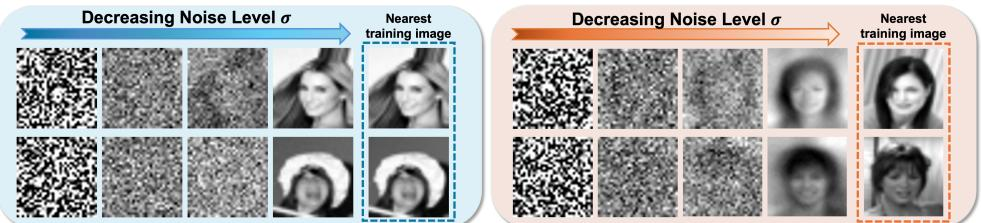  
Figure 2: Sampling with Mem./Gen. ReLU DAEs. Left: sampling with a set of memorized ReLU DAE produces duplications of training images. Right: sampling with generalized DAEs produces novel images. Details for training and sampling are provided in Appendix C.1 and singlestep denoising results are shown in Appendix B.2

Figure 2 illustrates training and sampling across multiple noise levels under this setting; we revisit the effect of different noise levels after Corollary 3.3.

We adopt (5) as a minimal, tractable model to analyze memorization and generalization. Recent works (Lukoianov et al., 2025; Li et al., 2024b; Wang and Vastola, 2024) imply that real diffusion models exhibit approximate piecewise linearity; our ReLU model shares this structure and can be viewed as a local approximation of such networks. We verify this connection via an SVD analysis of denoiser Jacobians (Kadkhodaie et al., 2024a; Achilli et al., 2024) for EDM, SD1.4, and ReLU DAE in Appendix B.3: around generalized samples, the Jacobian reflects local data statistics as in Cor. 3.3, whereas around memorized samples it becomes noticeably low-rank and is dominated by the corresponding data vector, consistent with Cor. 3.2.

## 3 MAIN THEOREMS

Building on the setup in Section 2, this section presents our main theoretical results for a twolayer nonlinear DAE with the ReLU activation, complemented by experiments on state-of-the-art diffusion models. By characterizing the optimal solutions of the training loss, we establish:

## Three Learning Regimes of Training Diffusion Models

• Memorization Regime (Section 3.1): In over-parameterized models trained on locally sparse data, memorization arises when network weights store individual training samples, leading to overfitting and producing distinctively spiky representations.

• Generalization Regime (Section 3.2): In contrast, when the model is underparameterized and the data are locally abundant, the weights capture underlying data statistics, enabling novel sample generation and yielding balanced, semantically rich representations.

• Hybrid Regime (Section 3.3): Imbalanced real-world data leads to a hybrid regime where models generalize on abundant clusters while memorizing scarce ones. Consequently, the representations can help identify an input’s region and detect its memorized samples.

To substantiate the above results, we first establish a general theorem characterizing the local minimizers of the training loss (6) for the DAE networks. This theorem then specializes to individually address the memorization and generalization regimes. To simplify the nonlinear DAE problem and obtain a more interpretable characterization, we adopt the following separability notion. It is designed to match bias-free linear layers (as in our ReLU DAE), where cluster structure is naturally captured by within-cluster concentration and angular separation of cluster means; the definition can be extended to standard hyperplane separability by allowing affine (biased) layers.

Definition 3.1 $( ( \alpha , \beta )$ -Separability of Training Data). Suppose the training dataset X can be partitioned into M clusters $\mathbf { \bar { X } } = [ \dot { \bf X } _ { 1 } , \dots , \pmb { X } _ { M } ]$ , where $X _ { k } \ = \ [ \pmb { x } _ { k , 1 } , \dotsc , \pmb { x } _ { k , n _ { k } } ] \ \subseteq \ \mathbb { R } ^ { d }$ has mean $\begin{array} { r } { \bar { \pmb x } _ { k } : = \frac { 1 } { n _ { k } } \sum _ { j = 1 } ^ { n _ { k } } { \pmb x } _ { k , j } } \end{array}$ . We say the dataset is $( \alpha , \beta )$ -separable if

$$
\text {   for   all   } k, j: \quad \frac {\| \boldsymbol {x} _ {k , j} - \bar {\boldsymbol {x}} _ {k} \| _ {2}}{\| \bar {\boldsymbol {x}} _ {k} \| _ {2}} \leq \alpha , \qquad \text {   and   for   all   } k \neq \ell : \quad \frac {\langle \bar {\boldsymbol {x}} _ {k} , \bar {\boldsymbol {x}} _ {\ell} \rangle}{\| \bar {\boldsymbol {x}} _ {k} \| _ {2} \| \bar {\boldsymbol {x}} _ {\ell} \| _ {2}} \leq \beta .
$$

The parameters α and $\beta$ are not required to be universal constants. Intuitively, tight within-cluster concentration together with well-separated means yields an inter-cluster margin γ that quantifies negative alignment between samples from different clusters; γ depends only on $\alpha , \beta ,$ , and the norms of the training data (the explicit expression is given in Appendix D.2). Under this separability condition, we show that local minimizers of the DAE admit a block-wise structure.

Theorem 3.1 (Block-wise Structure of Local Minimizers in the DAE Loss). Suppose the training data $\pmb { X } = [ X _ { 1 } , \ldots , X _ { M } ] i s ( \alpha , \beta )$ -separable according to Definition 3.1 with $\beta < 0$ . Consider minimizing the training loss (6) for a DAE trained with a fixed noise level $\sigma \geq 0$ and weight decay $\lambda \geq 0 .$ . Then there exists a local minimizer with a block-wise structure, where the weights satisfy $W _ { 2 } ^ { \star } = W _ { 1 } ^ { \star }$ where

$$
\boldsymbol {W} _ {1} ^ {\star} = \left( \begin{array}{c c c c} \boldsymbol {W} _ {\boldsymbol {X} _ {1}} & \boldsymbol {W} _ {\boldsymbol {X} _ {2}} & \dots & \boldsymbol {W} _ {\boldsymbol {X} _ {M}} \end{array} \right) + \boldsymbol {R} (\sigma , \gamma).\tag{7}
$$

Here, $\begin{array} { r } { W _ { X _ { k } } \ \in \ \mathbb { R } ^ { d \times p _ { k } } , \sum _ { k = 1 } ^ { M } p _ { k } \ = \ p } \end{array}$ denotes the block-decomposition of W, $R ( \sigma , \gamma )$ is a small residual term whose Frobenius norm is bounded by $\Vert R ( \sigma , \gamma ) \Vert _ { F } ^ { 2 } ~ \le ~ C \Bigl ( e ^ { - c \gamma ^ { 2 } / \sigma ^ { 2 } } \Bigr )$ for universal constants $C , c > 0$ and a margin $\gamma > 0$ determined by $( \alpha , \beta )$ . Each block $W _ { X _ { k } } \mathrm { ~ } ( \mathrm { i } \leq k \leq M )$ is constructedfrom the Gram matrix $\boldsymbol { X _ { k } } \boldsymbol { X } _ { k } ^ { \top } = \boldsymbol { U _ { k } } \mathbf { \Lambda } \Lambda _ { k } \boldsymbol { U } _ { k } ^ { \top }$ ofthe k-th data cluster asfollows:

$$
\boldsymbol {W} _ {\boldsymbol {X} _ {k}} = \boldsymbol {U} _ {k} ^ {(p _ {k})} \left(\boldsymbol {I} + n _ {k} \sigma^ {2} \left(\boldsymbol {\Lambda} _ {k} ^ {(p _ {k})}\right) ^ {- 1}\right) ^ {- \frac {1}{2}} \left(\boldsymbol {I} - n \lambda \left(\boldsymbol {\Lambda} _ {k} ^ {(p _ {k})}\right) ^ {- 1}\right) ^ {\frac {1}{2}} \boldsymbol {O} _ {k} ^ {\top},\tag{8}
$$

where (i) $U _ { k } ^ { ( p _ { k } ) } \in \mathbb { R } ^ { d \times p _ { k } }$ is the submatrix of $U _ { k }$ containing its top pk eigenvectors, (ii) $\pmb { \Lambda } _ { k } ^ { ( p _ { k } ) } \in$ $\mathbb { R } ^ { p _ { k } \times p _ { k } }$ contains the corresponding pk eigenvalues, and $( i i i ) { \bf \bar { O } } _ { k } \in { \mathbb { \bar { R } } } ^ { \bar { p } _ { k } \times p _ { k } }$ is an orthogonal matrix accountingfor rotational symmetry. This holds under the condition nλ $< \mathrm { m i n } _ { k } \lambda _ { \mathrm { m i n } } ( \Lambda _ { k } ^ { ( p _ { k } ) } )$ , which ensures that the matrix square roots in (8) are well-defined.

Remarks. The proof is deferred to Appendix D.2. The local minimizer (7) consists of a block-wise main term plus a residual $R ( \sigma , \gamma )$ , which vanishes as σ becomes small relative to the separation margin γ. This is consistent with the low-noise regimes that are crucial for diffusion-model sampling and representation learning (Niedoba et al., 2025; Pavlova and Wei, 2025). Empirically, we observe this block-wise structure even for relatively large σ (Figure 3). The $( \alpha , \beta )$ -separability assumption serves mainly to simplify the proof; similar conclusions hold more generally (see Appendix B.1). Finally, the optimal solution is not tied to a specific block order, since $f _ { W _ { 2 } , W _ { 1 } }$ is invariant to arbitrary column permutations of the weight matrices $( W _ { 1 } , W _ { 2 } )$

For the remainder of this section, we specialize the result to the memorization (Section 3.1) and generalization (Section 3.2) regimes by varying the training-set size. For clarity, we omit the residual term $R ( \sigma , \gamma )$ and focus on the block-wise leading component of the optimal solution.

## 3.1 CASE 1: MEMORIZATION WITH OVERPARAMETERIZATION

First, we consider the overparameterized setting where the model parameters are larger than the number of training samples $p \geq n$ . In this “sample sparse” regime, each training sample can be treated as an individual cluster that is sufficiently separated from each other, where $\alpha _ { 1 } = 0$ and $\beta _ { 1 }$ can be set to max ${ \bf \Phi } _ { : i , j } \langle { \bf x } _ { i } , { \bf x } _ { j } \rangle$ . Based on this setup, Theorem 3.1 can be reduced to the following.

Corollary 3.2 (Memorization in Overparameterized DAEs). Under the problem setup of Theorem 3.1, consider training data $X = [ \mathbf { \bar { x } } _ { 1 } , \dots , \mathbf { x } _ { n } ] \subseteq \mathbb { R } ^ { d }$ that is $( 0 , \beta _ { 1 , }$ )-separable (with $\beta _ { 1 } < 0 )$ Furthermore, let the two-layer nonlinear DAE ${ f } _ { W _ { 2 } , W _ { 1 } } ( { \pmb x } )$ be overparameterized with $p \geq n$ hidden units. Ifwefurther assume the weight decay λ in (6) satisfies $n \lambda < \mathrm { m i n } _ { i \in [ n ] } \| { \pmb x } _ { i } \| _ { 2 } ^ { 2 }$ , then there exists a local minimizer ofthe DAE loss (6) with thefollowing memorizing block-wise structure:

$$
\pmb {W} _ {2} ^ {\star} = \pmb {W} _ {1} ^ {\star} = (r _ {1} \pmb {x} _ {1} \quad \dots \quad r _ {n} \pmb {x} _ {n} \quad \mathbf {0} \quad \dots \quad \mathbf {0}) =: \pmb {W} _ {\mathrm{mem}}, \quad r _ {i} = \sqrt {\frac {\| \pmb {x} _ {i} \| _ {2} ^ {2} - n \lambda}{\| \pmb {x} _ {i} \| _ {2} ^ {4} + \sigma^ {2} \| \pmb {x} _ {i} \| _ {2} ^ {2}}}.\tag{9}
$$

Moreover, when $\lambda  0 ,$ , this solution attains an empirical loss that is independent of the ambient dimension d:

$$
\mathcal {L} _ {\boldsymbol {X}} \left(\boldsymbol {W} _ {2} ^ {\star}, \boldsymbol {W} _ {1} ^ {\star}\right) = \frac {1}{n} \sum_ {i = 1} ^ {n} \frac {\sigma^ {2} \| \boldsymbol {x} _ {i} \| _ {2} ^ {2}}{\sigma^ {2} + \| \boldsymbol {x} _ {i} \| _ {2} ^ {2}} <   \sigma^ {2}.
$$

Remarks. The proof is deferred to Corollary D.3, and our result implies the following:

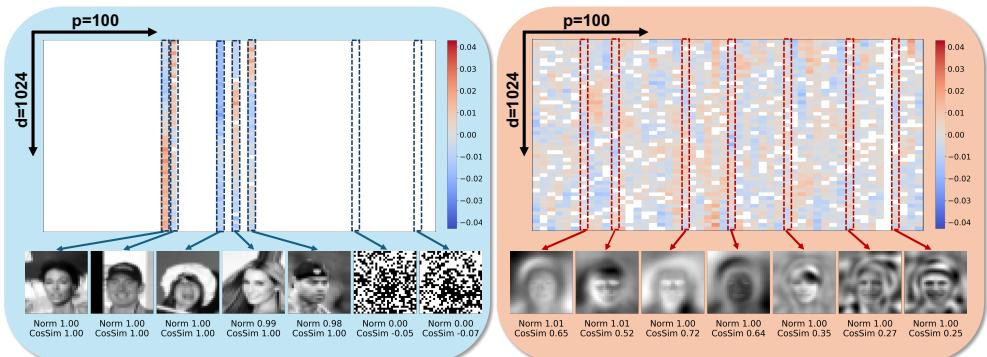  
Figure 3: Verification of Corollary 3.2 and Corollary 3.3. We visualize the learned encoder matrix $W _ { 1 }$ of a ReLU DAE trained with noise level $\sigma = 0 . 2$ When trained on 5 CelebA face images, the model stores training samples in its columns, matching Corollary 3.2. When trained on 10,000 images, the model generalizes and captures data statistics, consistent with Corollary 3.3. Empirically, the same behavior holds for larger noise, up to $\sigma = 5 ;$ additional results are in Appendix B.1.

• Learning the optimal solution with sparse columns. The structured solution with $( p - n )$ trailing zero columns in (9) is one among many local minimizers, as dense alternatives can arise by splitting sparse columns. However, empirical evidence and theory (Xie et al., 2025) suggest that standard optimizers such as Adam (Kingma and Ba, 2015) bias training toward $\ell _ { \infty } { \tt - s m o o t h }$ solutions of the DAE loss (cf. Corollary D.4). As a result, the solutions observed in practice often align with the sparse structure we construct (Figure 3).

• Sampling reproduce training samples (memorization). In this regime, the learned DAE closely approximates the empirical denoiser $f _ { \mathrm { e m p } }$ in Eq. (3), achieving low empirical loss and consequently reproducing the training samples under sampling (as shown in Figure 2). This occurs because the DAE’s projection and reconstruction over the sparse columns of the weights during the reverse sampling effectively act as a power method, recovering memorized training data (Weitzner et al., 2024). Quantitatively, by plugging Corollary 3.2 into the overall denoising score matching loss, we find that the KL divergence between the sampled and empirical distributions is bounded by $\textstyle { \frac { \pi } { 2 } } \operatorname* { m a x } _ { 1 \leq i \leq n } \left\| { \boldsymbol { \mathbf { x } } } _ { i } \right\|$ , confirming strong memorization.

• Spiky representations as a signature of memorization. As a consequence of Corollary 3.2, for any training sample $\mathbf { \Delta } _ { \mathbf { \mathcal { X } } _ { i } }$ , its learned representation within the DAE exhibits a distinctive sparse form:

$$
\boldsymbol {h} _ {\mathrm{mem}} (\boldsymbol {x} _ {i} + \sigma \boldsymbol {\epsilon}) = [ \boldsymbol {W} _ {\mathrm{mem}} ^ {\top} (\boldsymbol {x} _ {i} + \sigma \boldsymbol {\epsilon}) ] _ {+} \approx (0, \dots , 0, r _ {i} \boldsymbol {x} _ {i} ^ {\top} (\boldsymbol {x} _ {i} + \sigma \boldsymbol {\epsilon}), 0, \dots , 0).
$$

This sparsity arises because $\mathbf { \Delta } _ { \mathbf { \mathcal { X } } _ { i } }$ is negatively correlated with other samples stored in the learned weight matrix $W _ { \mathrm { m e m } }$ , yielding a nearly one-hot feature vector within the representation space (Figure 4). Such spikiness could serve as a robust signature of memorization (Hakemi et al., 2025; Gan et al., 2025), which we empirically demonstrate on both synthetic (Figure 4) and real-world (Figure 5) settings. Building on this insight, we introduce a simple yet effective memorization detection method that achieves strong results, as detailed later in Section 4.1. Additionally, analogous correlations between sharp, localized activations and the recall of concrete stored knowledge have been empirically observed in Large Language Models (LLMs) (Sun et al., 2024), suggesting our findings could also offer a potential explanation for these phenomena in LLMs.

## 3.2 CASE 2: GENERALIZATION WITH UNDERPARAMETERIZATION

On the other hand, suppose we have sufficiently many i.i.d. samples $\{ \pmb { x } _ { k , i } \} _ { i = 1 } ^ { n _ { k } }$ from each Gaussian mode $k \in [ K ]$ of the MoG distribution (4). Then the empirical mean and Gram matrix of each cluster k concentrate around their expectations:

$$
\overline {{\boldsymbol {x}}} _ {k} = \frac {1}{n _ {k}} \sum_ {i = 1} ^ {n _ {k}} \boldsymbol {x} _ {k, i} \approx \boldsymbol {\mu} _ {k}, \quad \frac {1}{n _ {k}} \boldsymbol {X} _ {k} \boldsymbol {X} _ {k} ^ {\top} \approx \boldsymbol {S} _ {k} := \boldsymbol {\mu} _ {k} \boldsymbol {\mu} _ {k} ^ {\top} + \boldsymbol {\Sigma} _ {k}.\tag{10}
$$

If the component means are incoherent $\mathrm { ( i . e . , ~ } \langle \mu _ { k } , \mu _ { \ell } \rangle / ( \| \pmb { \mu } _ { k } \| \| \pmb { \mu } _ { \ell } \| ) < \beta _ { 2 }$ for $k \neq \ell )$ and the within-mode variance is small $( \mathrm { i . e . , ~ } \| \Sigma _ { k } ^ { 1 / 2 } \| _ { F } / \| \pmb { \mu } _ { k } \| _ { 2 } < \alpha _ { 2 } )$ , then with high probability the clusters $\{ X _ { k } \} _ { k = 1 } ^ { K }$ satisfy the separability conditions in Definition 3.1 with $\left( \alpha , \beta \right) = \left( \alpha _ { 2 } , \beta _ { 2 } \right)$ . In this scenario, as we demonstrate below, the optimal weights of the DAE network will learn the local data statistics (specifically, the means and variances of the MoG) from these well-separated, nondegenerate clusters of training data to enable generalization.

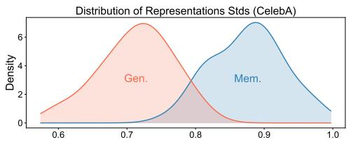

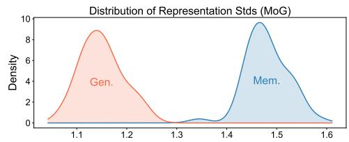

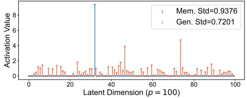

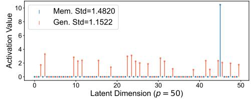  
Figure 4: Mem./Gen. representations in ReLU DAEs. Top: Memorized vs. generalized samples can be separated by the standard deviation (Std) of their representations: memorized models produce spiky, high-Std features, whereas generalized models do not. Bottom: Representation of a single training data. The memorized model exhibits large outlier activations (high Std); the generalized model yields a more balanced representation (lower Std), consistent with our theory. All models use $\sigma = 0 . 2$ . Left: CelebA. Right: MoG. See Appendix C.1 for details.

Corollary 3.3 (Generalization in Underparameterized DAEs). Under the problem setup of Theorem 3.1, we assume the training data satisfy the separability condition in Definition $3 . l . ^ { 1 }$ Ifthe DAE network in (5) is under-parameterized with $\begin{array} { r } { p = \sum _ { k = 1 } ^ { K } p _ { k } \ll n _ { \mathrm { ~ } } } \end{array}$ , then there exists a local minimizer ofthe DAE training loss (6) such that

$$
\boldsymbol {W} _ {2} ^ {\star} = \boldsymbol {W} _ {1} ^ {\star} = (\boldsymbol {W} _ {\boldsymbol {X} _ {1}} \quad \boldsymbol {W} _ {\boldsymbol {X} _ {2}} \quad \dots \quad \boldsymbol {W} _ {\boldsymbol {X} _ {K}}) =: \boldsymbol {W} _ {\text { gen }},
$$

where each block $W _ { X _ { k } } \in \mathbb { R } ^ { d \times p _ { k } }$ captures the principal components of the empirical Gram matrix $\pmb { X } _ { k } \pmb { X } _ { k } ^ { \top } \mathrm { ~ } i n \left( 8 \right)$ , with $W _ { X _ { k } } W _ { X _ { k } } ^ { \top }$ concentrating to the rank-pk optimal denoiserfor $\mathcal { N } ( \mu _ { k } , \Sigma _ { k } )$ :

$$
\boldsymbol {W} _ {\boldsymbol {X} _ {k}} \boldsymbol {W} _ {\boldsymbol {X} _ {k}} ^ {\top} \rightarrow \left[ (\boldsymbol {S} _ {k} - \frac {\lambda}{\rho_ {k}} \boldsymbol {I}) (\boldsymbol {S} _ {k} + \sigma \boldsymbol {I}) ^ {- 1} \right] _ {\text { rank- } p _ {k} \text {   approx }},
$$

where $S _ { k }$ is introduced in (10) and $\rho _ { k }$ is the ratio ofthe k-th mode ofMoG. Moreover, when $\lambda  0 .$ the expectation of the test loss (which captures generalization error) can be bounded by

$$
\mathbb {E} _ {\boldsymbol {X} \sim p _ {g t}} [ \mathcal {L} _ {\boldsymbol {X}} (\boldsymbol {W} _ {2} ^ {\star}, \boldsymbol {W} _ {1} ^ {\star}) ] \lesssim \sum_ {k = 1} ^ {K} \rho_ {k} \left[ \sum_ {j \leq p _ {k}} \frac {\mathrm{eig} _ {j} (\boldsymbol {S} _ {k}) \cdot \sigma^ {4}}{\left(\mathrm{eig} _ {j} (\boldsymbol {S} _ {k}) + \sigma^ {2}\right) ^ {2}} + \sum_ {j > p _ {k}} \mathrm{eig} _ {j} (\boldsymbol {S} _ {k}) + \frac {C _ {k} p _ {k}}{\sigma^ {2} n _ {k}} \right],
$$

where $C _ { k } > 0$ depends only on σ and spectral properties of $S _ { k }$ . Here, $\mathrm { e i g } _ { j } ( { \cal S } _ { k } )$ denotes the j-th eigenvalue of $\boldsymbol { S } _ { k }$ which is independent of d.

Remarks. The proof is deferred to Appendix D.5, and our result implies the following:

• Sampling yields novel in-distribution samples (generalization). When the model is underparameterized, our results show that the local optimal solution learned from the training data achieves bounded population loss on the MoG distribution by effectively acting as an optimal local denoiser for each mode. Consequently, sampling (Li et al., 2024a; 2025a) from the trained DAE produces in-distribution images that are distinct from the training samples, as illustrated in Figure 2.

Moreover, the population loss depends on the spectrum of $S _ { k }$ (equivalently, $\Sigma _ { k } )$ . When $\Sigma _ { k }$ has an approximately low-rank structure (De Bortoli, 2022; Cole and Lu, 2024; Huang et al., 2024), the loss is small and decays rapidly with the number of samples per mode $n _ { k }$ . This provides a principled explanation for the reproducibility of diffusion models across disjoint training subsets (Zhang et al., 2024; Kadkhodaie et al., 2024a).

• Balanced representations as a signature of generalization. Unlike the spiky representations in Corollary 3.2, the underparameterized solution spreads the energy of $\pmb { x } _ { i } + \sigma \pmb { \epsilon }$ , with $\mathbf { \Delta } \mathbf { x } _ { i } \sim $ $\mathcal { N } ( \mu _ { k } , \Sigma _ { k } )$ , across the $p _ { k }$ coordinates of the active block (see Figure 4). The representation behaves like a low-dimensional projection for a Gaussian mode (Tipping and Bishop, 1999):

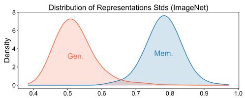

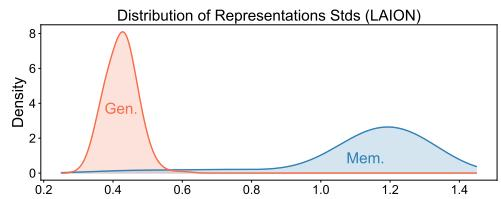

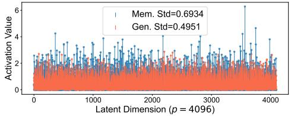

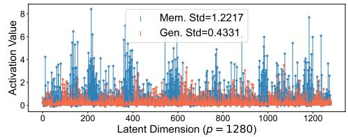  
Figure 5: Mem./Gen. representations in real-world models. memorized samples have spiky representations while generalized samples have more balanced ones. The layout follows Figure 4 and the results are consistent with it. Representations are extracted at timestep $t = 5 0 \left( \sigma _ { t } \approx 0 . 1 7 \right)$ Left: DiT-L/4 pretrained on an ImageNet subset. $R i g h t \colon$ Stable Diffusion v1.4 pretrained on LAION (Schuhmann et al., 2022). Results for EDM pretrained on CIFAR10 and additional details are in Appendix C.2.

$$
\boldsymbol {h} _ {\text {gen}} (\boldsymbol {x} _ {i} + \sigma \boldsymbol {\epsilon}) = [ \boldsymbol {W} _ {\text {gen}} ^ {\top} (\boldsymbol {x} _ {i} + \sigma \boldsymbol {\epsilon}) ] _ {+} \approx (0, \dots , 0, \boldsymbol {W} _ {\boldsymbol {X} _ {k}, 1} ^ {\top} (\boldsymbol {x} _ {i} + \sigma \boldsymbol {\epsilon}), \dots , \boldsymbol {W} _ {\boldsymbol {X} _ {k}, p _ {k}} ^ {\top} (\boldsymbol {x} _ {i} + \sigma \boldsymbol {\epsilon}), 0, \dots , 0).
$$

Intuitively, generalized samples activate multiple neurons rather than a single spiky unit; the resulting projections encode information about the underlying distribution, helping to explain empirical findings on semantic directions (Kwon et al., 2023) that are useful for editing, which we further explore in Section 4.2.

Concluding Corollary 3.2 and Corollary 3.3, we see the learned structure remains stable across timesteps, with σ primarily acting as a regularization parameter. Varying σ only slightly perturbs the solution, which helps explain the empirical success of diffusion models that employ a single neural network for denoising across multiple noise levels (Sun et al., 2025).

## 3.3 CASE 3: HYBRID OF MEMORIZATION AND GENERALIZATION WITH IMBALANCED DATA 3.3 CASE 3: HYBRID OF MEMORIZATION AND GENERALIZATION WITH IMBALANCED DATA

Large-scale diffusion datasets often contain duplicates due to imperfect curation or heterogeneous aggregation (Carlini et al., 2023); such samples are more easily memorized (Somepalli et al., 2023b) (See Appendix B.4 for more discussions). We model this by allowing duplicated (rank-1) clusters alongside well-sampled, nondegenerate clusters, so the DAE can admit local minimizers that mix memorization and generalization blocks:

Corollary 3.4 (DAE memorizes duplicates and generalizes on well-sampled modes). Let $X =$ $[ \pmb { X } _ { 1 } , \dots , \pmb { X } _ { K } ]$ satisfy Definition 3.1, where for $\ell = 1 , \ldots , m , X _ { \ell } = ( \pmb { x } _ { \ell } , \ldots , \pmb { x } _ { \ell } )$ is rank $^ { l , }$ and $\dot { \pmb { X } } _ { m + 1 } , \dots , \dot { \pmb { X } } _ { K }$ contain distinct empirical samples from the remaining Gaussian modes. Suppose a ReLU DAE is trained with weight decay $\lambda \geq 0$ and input noise $\sigma > 0$ . Then there exists a local minimizer of the form

$$
\boldsymbol {W} _ {2} ^ {\star} = \boldsymbol {W} _ {1} ^ {\star} = \left( \begin{array}{c c c c c} r _ {1} \boldsymbol {x} _ {1} & \dots & r _ {m} \boldsymbol {x} _ {m} & \boldsymbol {W} _ {\boldsymbol {X} _ {m + 1}} & \dots & \boldsymbol {W} _ {\boldsymbol {X} _ {K}} \end{array} \right),
$$

where the first m columns memorize the duplicated clusters (as in Cor. 3.2), and the remaining blocks $W _ { X _ { k } }$ implement generalization on the nondegenerate clusters (as in Cor. 3.3).

This corollary interpolates Cases 1 and 2: duplicated training samples are memorized, while the model still generalized for the other modes. We verify this in Figure 6 and defer proof to $\mathsf { A p - }$ pendix D.6.

## 4 IMPLICATIONS FOR MEMORIZATION DETECTION AND CONTENT STEERING

In this section, we demonstrate that our theoretical insights from Section 3 yield profound practical implications for model privacy and interpretability. Leveraging the identified dual relationship between representation structures and generalization ability, we present the following two applications:

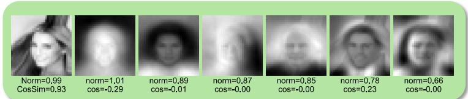  
Figure 6: Verification of Corollary 3.4. The model learns both memorizing and generalizing columns when data duplication is present.

<table><tr><td rowspan="2">Method</td><td rowspan="2">Prompt Free?</td><td colspan="3">LAION</td><td colspan="3">ImageNet</td><td colspan="3">CIFAR10</td></tr><tr><td>AUC ↑</td><td>TPR ↑</td><td>Time ↓</td><td>AUC ↑</td><td>TPR ↑</td><td>Time ↓</td><td>AUC ↑</td><td>TPR ↑</td><td>Time ↓</td></tr><tr><td>(Carlini et al., 2023)</td><td>✕</td><td>0.498</td><td>0.020</td><td>3.724</td><td></td><td>N/A</td><td></td><td></td><td>N/A</td><td></td></tr><tr><td>(Wen et al., 2024)</td><td>✕</td><td>0.986</td><td>0.961</td><td>0.134</td><td></td><td>N/A</td><td></td><td></td><td>N/A</td><td></td></tr><tr><td>(Hintersdorf et al., 2024)</td><td>✕</td><td>0.957</td><td>0.500</td><td>0.009</td><td></td><td>N/A</td><td></td><td></td><td>N/A</td><td></td></tr><tr><td>(Ross et al., 2025)</td><td>√</td><td>0.956</td><td>0.915</td><td>0.545</td><td>0.971</td><td>0.528</td><td>0.031</td><td>0.713</td><td>0.013</td><td>0.071</td></tr><tr><td>Ours</td><td>√</td><td>0.987</td><td>0.961</td><td>0.067</td><td>0.995</td><td>0.912</td><td>0.015</td><td>0.998</td><td>0.984</td><td>0.020</td></tr></table>

Table 1: Memorization detection results. We report AUROC, true positive rate (TPR) at 1% false positive rate, and runtime (s). Evaluated on three dataset-model pairs: LAION-SD1.4, ImageNet-DiT, and CIFAR10-EDM. Sample sizes: 500 memorized and 500 generalized for LAION and ImageNet; 100 each for CIFAR10. (↑ higher is better; ↓ lower is better). See Appendix C.2 for details.

• Representation-based memorization detection (Section 4.1). Leveraging the spikiness of data representations, we introduce a prompt-free classification method that accurately distinguishes between generalized and memorized samples produced by diffusion models. We demonstrate that our approach achieves strong performance with high efficiency and extensibility.

• Representation-space steering for image editing (Section 4.2). We introduce a training-free editing method that steers generated samples within the representation space. Crucially, we find that generalized samples are substantially more steerable, whereas memorized samples exhibit minimal editing effects due to the spikiness of their representations.

## 4.1 REPRESENTATION-BASED MEMORIZATION DETECTION

Building on our theoretical insights, we investigate whether memorization can be detected directly from internal representations. Prior work has largely focused on how certain prompts trigger memorization and often relies on those for detection (Wen et al., 2024; Jeon et al., 2025; Ren et al., 2024). Representative approaches include: (i) Density-based: detecting samples that are generated disproportionately frequently under a prompt (Carlini et al., 2023); and (ii) Norm-based: comparing conditional vs. unconditional scores (Wen et al., 2024) and (iii) Attention-based: locating anomaly in the cross-attention induced by memorized prompts (Hintersdorf et al., 2024; Chen et al., 2025a). A notable exception is (iv) a landscape-based method of (Ross et al., 2025), which evaluates memorization using local score-function geometry around a generated sample. Their method makes detection prompt-free, but is still based on output space.

In contrast, we introduce the first detection method that is both representation-based and promptfree. The core intuition is that spiky representations arise when a sample has been internally stored by the model, whereas generalized samples yield balanced activations. Therefore, our analysis yields a simple yet effective diagnostic: the standard deviation of intermediate features serves as a proxy for spikiness. High variance indicates memorization; low variance corresponds to generalization. We benchmark this detector against existing baselines on pre-trained diffusion models. As reported in Table 1, our method achieves the highest accuracy and efficiency, thereby demonstrating the strong informativeness of representation-space statistics. Pseudocode and further implementation details are provided in Appendix C.2.

## 4.2 REPRESENTATION-SPACE STEERING FOR INTERPRETABLE IMAGE EDITING

As shown in Corollary 3.3, representations of generalized samples are governed by data statistics, capturing local semantics and acting as low-dimensional projections of Gaussian modes. This insight implies an interpretable steering mechanism: we can inject information about a target mode (e.g., a specific concept or style) by adding its average representation, thereby smoothly guiding

Steering Strength ↑

"An image of a lion, high quality, 8k"

Steering Strength ↑  
Steering Strength ↑  
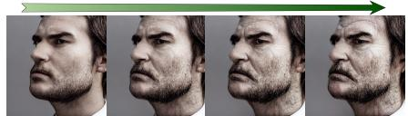  
" A high-resolution front-facing portrait of a man, …, realistic photography"

Steering Strength ↑  
Steering Strength ↑  
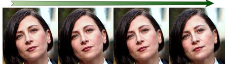  
"Donna Tartt's <i>The Goldfinch</i> Scores Film Adaptation"

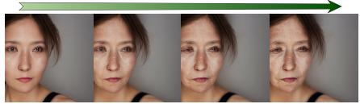  
Steering Strength ↑  
" A high-resolution front-facing portrait of a woman, …, realistic photography"

  
(a) +Old (Gen.)  
"Chris Messina In Talks to Star Alongside Ben Affleck in <i>Live By Night</i>"

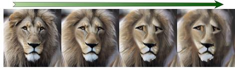  
(b) +Old (Mem.)  
Steering Strength ↑  
Steering Strength ↑

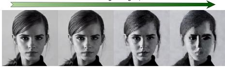

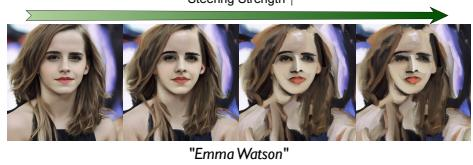  
"Emma Watson to play Belle in Disney's <i>Beauty and the Beast</i>"  
(c) +Oil-painting Style (Gen.)  
(d) +Oil-painting Style (Mem.)  
Figure 7: Image editing via representation steering. We perform image editing on Stable Diffusion v1.4 using (11). Generalized samples exhibit smooth and progressive style transfer as the editing strength increases, whereas memorized samples display brittle and threshold-like transfer effects.

  
"Living in the Light with Ann Graham Lotz"

generation toward it. Specifically, our proposed steering function is defined as:

$$
\boldsymbol {f} _ {\boldsymbol {\theta}} ^ {\text {steered}} (\boldsymbol {x} _ {t}, t, c) = \boldsymbol {g} _ {\boldsymbol {\theta}} (\boldsymbol {h} _ {\boldsymbol {\theta}} (\boldsymbol {x} _ {t}, t, c) + a \boldsymbol {v}), \quad \text {where} \quad \boldsymbol {v} = \frac {1}{| \mathcal {S} |} \sum_ {\tilde {\boldsymbol {x}} \in \mathcal {S}} \boldsymbol {h} _ {\boldsymbol {\theta}} (\tilde {\boldsymbol {x}} _ {\tilde {t}}, \tilde {t}, \bar {c}).\tag{11}
$$

Here, S denotes samples from the target concept/style, $h _ { \theta }$ and $\mathbf { \nabla } _ { \mathbf { \boldsymbol { \beta } } \theta }$ represent the encoder and decoder components of the network, respectively, and $a \in \mathbb { R }$ controls the steering strength, c is the text prompt and c¯ denotes the desired concept/style prompt.

We evaluate this method on Stable Diffusion v1.4 using both memorized and generalized samples (Figure 7). As predicted by our theory, generalized samples exhibit smooth and monotonic edits as a varies, indicative of a well-behaved local geometry in their representation space. In contrast, memorized samples display brittle, threshold-like responses, making fine-grained control difficult because of their spiky representations.

## 5 CONCLUSION

In summary, our study establishes that the representation space of diffusion models is not a secondary artifact of training but a critical factor in how these models operate. Its structure provides a principled separation between memorization and generalization: spiky, sample-specific codes signal memorization, while balanced, low-dimensional representations often imply strong generalization. This perspective allows us not only to detect memorization directly from internal model representations but also to leverage representations for practical tasks, such as controllable editing via steering. While prior works have used intermediate activations for downstream applications, our framework highlights their important role in shaping diffusion behavior itself. By making these structures explicit, we bridge the theoretical findings on simplified models with the empirical properties of real-world deep nonlinear models, offering a unified view that connects perception and generation and opens pathways toward more interpretable and trustworthy generative models.