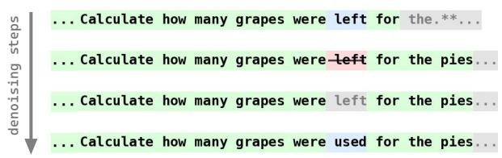
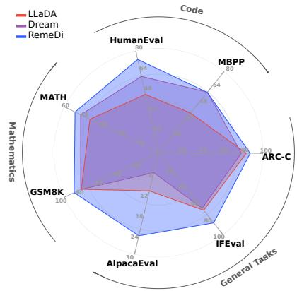
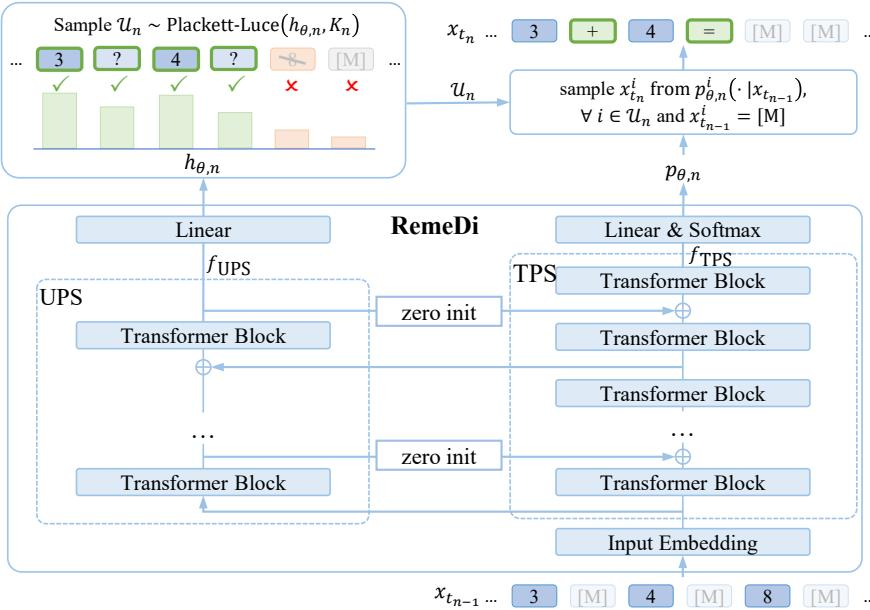
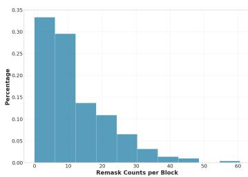
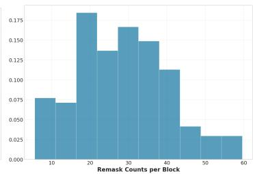
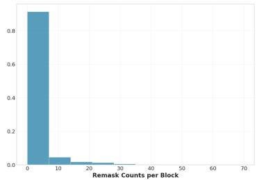

## ABSTRACT

Mask-based Diffusion Language Models (DLMs) struggle to revise incorrect tokens: once a token is generated, it typically remains fixed. The key challenge is to identify potential errors in the inputs. In this paper, we propose Remaskingenabled Diffusion Language Model (RemeDi), a mask-based DLM that introduces remasking as another fundamental mechanism, enabling more flexible text refinement in diffusion-based text generation. To achieve this, RemeDi jointly predicts token distributions and per-token confidence scores at each step. The confidence scores determine which tokens to be unmasked after the current step, allowing the model to identify tokens with low quality and remask them. These remasked tokens can be resampled with richer context in subsequent steps. We design a remask-aware pipeline to train this ability, including supervised fine-tuning which teaches the model to detect and remask incorrect tokens in addition to predict mask tokens, and reinforcement learning which optimizes full generation trajectories toward higher rewards. Experiments show that RemeDi achieves the state-of-the-art results among open-source DLMs on multiple datasets.

## 1 INTRODUCTION

Diffusion Language Models (DLMs) have recently emerged as a promising alternative to autoregressive language models (Nie et al., 2025; Ye et al., 2025; Lou et al., 2024; Arriola et al., 2025). A DLM defines a forward process that gradually corrupts text into a noise prior, and learns a reverse process to recover clean text (Campbell et al., 2022; Lou et al., 2024). Unlike autoregressive models, DLMs do not commit to a fixed left-to-right order, offering greater flexibility in generation and an inherent ability to predict multiple tokens in parallel.

A dominant variant is the mask-based DLM (Nie et al., 2025; Ye et al., 2025), where the noise is represented by a special mask token. Under this formulation, the model learns to recover masked tokens during training, while assuming that once tokens are unmasked, they are supposed to be correct without having to clean them later. This assumption is problematic: the model may generate wrong tokens, which should be revealed and corrected in later steps when more contexts are available. However, most existing DLMs (Nie et al., 2025; Ye et al., 2025) keep already unmasked tokens fixed, preventing them from being revised by self-reflecting on errors.

To address this, several works have explored methods to revise generated tokens. von Rutte et al.¨ (2025) defines a new noise schedule by interpolating between masking and uniform noise, enabling revision of wrong tokens on small-scale models. Wang et al. (2025a) applies predictor-corrector samplers by stochastically remasking a subset of tokens only at inference time, where the remasking is performed randomly without training the model how to find and remask incorrect tokens. For large-scale DLMs, Seed Diffusion (Song et al., 2025) allows all tokens to be resampled at every step.

(a) Green and Red tokens are already unmasked in the input sequence of the current step. Red tokens are remasked. Blue tokens are unmasked in the outputs. Gray tokens keep masked in the outputs, and we display the token with the highest probability at these positions.  
  
(b) Radar plot comparing the performance of RemeDi with other DLMs across various evaluation benchmarks.  
Figure 1: (a) Illustration of remasking for quality improvement: RemeDi initially predicts the token 211, 212, 213, 222“left”, but later identifies a semantic mismatch in the phrase “left for the pies”. The model then remasks this token and corrects it to the more appropriate “used”. (b) RemeDi outperforms existing DLMs in various tasks, including math, code and general benchmark.

However, it lacks a mechanism to ensure that the number of mask tokens decreases monotonically — it is a key feature for diffusion models to ensure decreasing noise levels over steps (Guo et al., 2025), so that the mask tokens will eventually vanish at the final step to complete the generation.

In this paper, we propose a self-reflective remasking approach to train DLMs. As illustrated in Fig. 1a, it aims to train DLMs with the ability of finding wrong tokens and turning them back to mask ones so that they can be resampled with richer context in later steps. Based on this, we introduce Remasking-enabled Diffusion Language Model (RemeDi), a mask-based DLM that incorporates self-reflective remasking to revise already generated but incorrect tokens. RemeDi jointly predicts token distributions and per-token confidence scores. At each diffusion step, high-confidence tokens are unmasked while low-confidence ones are (re-)masked, regardless of whether they have been previously unmasked.

The key challenge is to train the model how to remask incorrect tokens in a self-reflective manner. To this end, we design a remask-aware training pipeline in two stages: 1) Remask SFT, where the model learns to identify and remask incorrect tokens, while predicting masked tokens. We construct an input sequence for Remask SFT by randomly masking its tokens or replacing them with random alternatives to simulate the noise. The noise schedule deciding how many tokens are masked or randomly replaced is designed to follow the criterion that the noise level should monotonically decrease over steps. The model is then trained to remask and revise incorrect tokens over noisy input sequences. 2) Remask RL, where the model is further fine-tuned with outcomebased reinforcement learning. It seeks to optimize the entire generation trajectories toward final outputs with higher rewards by considering how to remask and predict tokens in each step.

As shown in Fig. 1b, RemeDi achieves the state-of-the-art performance among open-source DLMs, achieving competitive results on various benchmark datasets, including math problems (89.1% on GSM8K (Cobbe et al., 2021), 52.9% on MATH (Hendrycks et al., 2021)), code generation ( 73.2% on HumanEval (Chen et al., 2021), 59.4% on MBPP (Austin et al., 2021)), and general tasks (24.5% on AlpacaEval (Dubois et al., 2024), 85.4% on IFEval (Zhou et al., 2023), and 87.7% on ARC-C (Clark et al., 2018)).

## 2 RELATED WORK

## 2.1 MASK-BASED DIFFUSION LANGUAGE MODELS

Diffusion language models (DLMs) have emerged as promising alternatives to auto-regressive (AR) models for text generation. Among them, mask-based DLMs (Nie et al., 2025; Ye et al., 2025; Zheng et al., 2023; Ou et al., 2024) dominate, generating text by progressively denoising mask tokens. Recent studies(Arriola et al., 2025; Fathi et al., 2025; Huang & Tang, 2025; Sahoo et al., 2025; Wang et al., 2025b; Gat et al., 2025) have increasingly explored the fusion of AR and diffusion models, often through an iterative block-wise decoding strategy: inference proceeds by iteratively appending a block of mask tokens to the input sequence and denoising it, repeating until the EOS token is generated. This paradigm inherits the strengths — flexible generation order and parallel decoding from DLMs, and cache efficiency from AR — yielding faster inference without sacrificing quality. In our work, we adapt LLaDA-8B-Instruct (Nie et al., 2025) to variable-length block-byblock generation, serving as the backbone for our remasking mechanism.

## 2.2 REVISING ERRORS IN DIFFUSION LANGUAGE MODELS

A key limitation of mask-based DLMs is their inability to revise tokens once unmasked, even if they are incorrect. Existing efforts to address this fall into two categories. The first category (Campbell et al., 2022; Wang et al., 2025a) applies predictor-corrector samplers without training, for example by stochastically remasking a subset of tokens during inference. These methods lack a mechanism to identify which tokens are actually wrong. As a result, they have to rely on many extra sampling steps to take effect, which are inefficient and hard to optimize. The second category modifies the diffusion process to enable revision during the reverse diffusion process, $\mathrm { e . g . }$ , combining mask diffusion process with either the uniform diffusion process (von Rutte et al., 2025) or edit-based diffusion¨ process (Havasi et al., 2025; Song et al., 2025).

In short, none of these approaches provides a principled way to detect and selectively correct errors during generation. In contrast, RemeDi fulfills self-reflection by identifying and remasking errorprone tokens through a two-stage learning pipline, and jointly training the model to resample the remasked tokens in later steps.

## 3 METHODS

## 3.1 PRELIMINARIES: MASK-BASED DIFFUSION LANGUAGE MODELS

Diffusion Language Models (DLMs) aim to model text generation by approximating the probability distribution $p _ { \mathrm { d a t a } }$ over a finite vocabulary $\mathcal { V } = \{ 1 , 2 , \dotsc , V \}$ . They define a discrete diffusion process in which the unknown data distribution $p _ { \mathrm { d a t a } }$ at $t = 0$ gradually evolves into a simple prior distribution $p _ { \mathrm { p r i o r } }$ at $t = T$ (Lou et al., 2024). At intermediate times t, we denote the distribution as $p _ { t }$ . Formally, this diffusion process can be described by a linear ODE involving a diffusion matrix $Q _ { t } \mathrm { { : } }$

$$
\frac {d p _ {t}}{d t} = Q _ {t} p _ {t}, \quad p _ {0} = p _ {\text { data }}, \quad p _ {T} = p _ {\text { prior }}.\tag{1}
$$

While t can be defined continuously as in Eq. (1), in practice we work with discrete timesteps $t _ { 0 : N }$

In this paper, we focus on mask-based DLMs, where $p _ { \mathrm { p r i o r } }$ is a distribution that puts all its mass on the mask state, denoted as [M]. Given a clean sequence $x _ { 0 } \sim p _ { \mathrm { d a t a } }$ , a corrupted sequence $x _ { t }$ is obtained by randomly replacing part of the tokens with the mask token [M]. The model is trained to recover $x _ { 0 }$ by predicting each mask token $\boldsymbol { x } _ { t } ^ { i }$ with the output probability $p _ { \theta } ^ { i } ( x _ { 0 } ^ { i } | x _ { t } )$ . The objective is:

$$
L _ {\mathrm{diffusion}} (\theta) = \mathbb {E} _ {t, x _ {0}, x _ {t}} \bigg [ - \frac {1}{t} \sum_ {i = 1} ^ {L} \mathbf {1} (x _ {t} ^ {i} = [ \mathbf {M} ]) \log p _ {\theta} ^ {i} (x _ {0} ^ {i} | x _ {t}) \bigg ],\tag{2}
$$

where $x _ { t }$ is a sequence of length $L ,$ , sampled from the forward process, $\mathbf { 1 } ( \cdot )$ is an indicator function ensuring that the loss is computed only on mask tokens, following Nie et al. (2025).

During inference, the reverse diffusion process begins with a sequence of only mask tokens and proceeds for $N$ steps at monotonically decreasing timesteps $t _ { 0 : N }$ . At step $t _ { n - 1 }$ , the model takes the partially masked sequence $x _ { t _ { n - 1 } }$ as input and predicts all mask tokens simultaneously. A subset of tokens is unmasked to obtain $x _ { t _ { n } }$ according to the noise schedule and the unmasking policy (e.g., unmasking tokens with the highest confidence), while the remaining predictions are remasked and deferred to later steps.

  
Figure 2: The structure of RemeDi, including Unmasking Policy Stream (UPS) to predict confidences $h _ { \theta }$ for selecting the set of unmasking tokens $u _ { n } ,$ and Token Prediction Stream (TPS) to predict the token value when unmasking a masked position.

A limitation of this paradigm is that once a token is unmasked, it remains fixed in subsequent steps. In early stages, limited unmasked tokens often lead to unreliable predictions, resulting in errors that persist through the remainder of the generation process. As generation progresses, additional context may reveal these errors, but current paradigm offers no way to correct them. This motivates the ability to remask tokens, allowing the model to remask earlier predictions back to the mask token and predict them again using richer context in later steps.

## 3.2 REMEDI

We propose RemeDi, a DLM that can identify and remask low-confidence tokens during generation to enable iterative self-reflection. We extend the standard transformer into a dual-stream transformer architecture as shwon in Fig. 2, which comprises:

• Token Prediction Stream (TPS): A stack of transformer blocks that predict probabilities $p _ { \theta } ^ { i } ( \cdot | x _ { t } )$ for masked tokens as in a typical DLM (Nie et al., 2025).

• Unmasking Policy Stream (UPS): Another stack of transformer blocks that output tokenwise confidence score $h _ { \theta } ^ { i } .$ . It represents the model’s confidence over the output tokens, indicating if they should be unmasked with high confidence. Otherwise, if the confidence is too low for a token, it should be kept masked or remasked so that it could be sampled or resampled later.

The two streams run in parallel. During inference, UPS is inserted periodically and receives hidden states from TPS as input, producing an auxiliary representation $f _ { \mathrm { U P S } }$ for confidence scoring. The two streams perform bidirectional feature sharing: UPS layers are conditioned on $f _ { \mathrm { T P S } }$ , and their outputs also feed back into TPS to enrich its representations. At the final layer, p and h are produced simultaneously using two independent linear heads applied to $f _ { \mathrm { T P S } }$ and $\bar { f } _ { \mathrm { U P S } }$ , respectively. More details about the model structure for these two streams can be found in Appendix B.1.

The token generation proceeds through iterative denoising steps. Given $\boldsymbol { x } _ { t _ { n } }$ as the input, UPS first predicts a confidence score $h _ { \theta , n } ^ { i }$ at each position i, and select a subset of positions $\mathcal { U } _ { n }$ to unmask at the current step. Then, for the positions selected to be unmasked, if they have already been unmasked in $x _ { t _ { n - 1 } }$ , they remain unchanged; otherwise they are sampled from $p _ { \theta } ^ { i } ( \cdot | x _ { t _ { n - 1 } } )$ predicted by TPS. Unlike existing mask-based DLMs where tokens are fixed once being unmasked, RemeDi re-decides a token to be unmasked or (re-)masked at each step by its trained confidence score. Thus, it is possible that an already generated token is assigned with a low confidence and remasked, allowing it to be resampled in later steps. A noise schedule controls that the total number of unmasked tokens increases linearly from 0 to L (Nie et al., 2025), so that the number of mask tokens approaches zero at the final step.

In the following sections, we elaborate on how to train RemeDi with Remask SFT and Remask RL algorithms.

## 3.2.1 REMASK SFT

Traditional mask-based DLMs conduct SFT with randomly masked input sequences (Nie et al., 2025; Lou et al., 2024), while RemeDi needs to detect and remask possible incorrect tokens that arise during the reverse diffusion process, so they can be resampled in later steps. To achieve this, in SFT we treat such incorrect tokens as a second noise type in addition to the first noise type of mask tokens in mask-based DLMs, and train the model to recover mask tokens as well as identify unmasked tokens that should be remasked.

To simulate inference inputs at a diffusion time $t ,$ we construct training samples $x _ { t }$ from clean text $x _ { 0 }$ by applying two types of noise: given a randomly sampled diffusion time $t \in ( 0 , 1 )$ , we set the corresponding mask ratio $\rho _ { t , \mathrm { { m a s k } } } .$ alongside the incorrect token ratio $\rho _ { t , \mathrm { i n c o r r e c t } } .$ . With both ratios, we randomly mask tokens with $\rho _ { t , \mathrm { { m a s k } } }$ Then, among the remaining unmasked positions, we sample a subset with the ratio $\rho _ { t , \mathrm { i n c o r r e c t } }$ and replace each selected token with a random alternative to simulate the incorrect tokens that may occur in the reverse diffusion process.

As aforementioned, during the reverse diffusion process, the noise level, defined as the number of mask tokens, should decrease monotonically (Guo et al., 2025) . Since all incorrect tokens in an input sequence of length L must be remasked as designed below for the SFT, we require:

$$
\lceil \rho_ {t, \text { incorrect }} \cdot (1 - \rho_ {t, \text { mask }}) \cdot L \rceil <   \lceil \rho_ {t, \text { mask }} \cdot L \rceil\tag{3}
$$

to ensure a monotonically decreasing number of mask tokens as outputs. Otherwise, remasking all incorrect tokens would increase the total number of masks in the next step, violating the principle that the number of mask tokens should decrease at each diffusion step.

Considering the above inequality, we choose $\rho _ { t , \mathrm { m a s k } } = t$ and $\rho _ { t , \mathrm { i n c o r r e c t } } = 4 r \cdot t ( 1 - t )$ (r is a constant) following (Nie et al., 2025; von Rutte et al., 2025). We set¨ $r = 0 . 1$ in our experiments, under which it is not hard to see that the inequality 3 always holds on $t \in [ 0 , 1 ]$

Remask SFT Algorithm. During training, in addition to the typical diffusion loss in Eq. 2, we supervise the unmasking score $h _ { \theta }$ with a binary cross-entropy (BCE) objective across all token positions. We construct the training label y based on different token types:

• A clean token $( i \in S _ { \mathrm { c l e a n } } = \{ i \mid x _ { t } ^ { i } = x _ { 0 } ^ { i } \} )$ receives a positive unmask label $y ^ { i } = 1$ indicating they should remain unmasked.

• An incorrect token $( i \in S _ { \mathrm { i n c o r r e c t } } = \{ i \mid x _ { t } ^ { i } \neq x _ { 0 } ^ { i } , x _ { t } ^ { i } \neq [ \mathbf { M } ] \} )$ receives a negative unmask label $y ^ { i } = 0$ , indicating that they should be remasked.

• A mask token $( i \in S _ { \mathrm { m a s k } } = \{ i \mid x _ { t } ^ { i } = [ \mathbf { M } ] \} )$ is assigned a soft unmask label $y ^ { i } = p _ { \theta } ^ { i } ( x _ { 0 } ^ { i } | x _ { t } )$ equal to the predicted probability of the ground-truth token $x _ { 0 } ^ { i } . \mathrm { ~ A ~ }$ higher probability indicates a higher likelihood that the predicted token is correct and thus should be unmasked.

With unmask labels assigned above, we seek to minimize

$$
\mathcal {L} _ {\mathrm{UPS}} (\theta) = \sum_ {i} \mathrm{BCE} \left(\sigma \left(h _ {\theta} ^ {i}\right), y ^ {i}\right),\tag{4}
$$

where $\sigma ( \cdot )$ is the sigmoid function. Thus, the overall Remask SFT objective is:

$$
\mathcal {L} (\theta) = \mathcal {L} _ {\text { diffusion }} (\theta) + \lambda_ {\text { UPS }} \mathcal {L} _ {\text { UPS }} (\theta),\tag{5}
$$

Algorithm 1 Input sequence construction and loss calculation in Remask SFT

Require: Clean sequence  $x_{0} = [x_{0}^{1}, \ldots, x_{0}^{L}]$  of length L. Model M with learnable parameters  $\theta$ .

1: Sample  $t \in (0, 1)$  according to the noise schedule, obtaining  $\rho_{t,mask}$  and  $\rho_{t,incorrect}$ .

2: Construct noisy input  $x_{t}$ :

3: For each position i, replace  $x_{0}^{i}$  with [M] w.p.  $\rho_{t,mask}$ 

4: Among remaining positions, replace  $x_{0}^{i}$  with a random alternative token w.p.  $\rho_{t,incorrect}$ 

5: Define index sets:

 $S_{mask} = \{i \mid x_{t}^{i} = [M]\}, \quad S_{incorrect} = \{i \mid x_{t}^{i} \neq x_{0}^{i} \land x_{t}^{i} \neq [M]\}, \quad S_{clean} = \{i \mid x_{t}^{i} = x_{0}^{i}\}$ 

6: Get model outputs:  $[p_{\theta}, h_{\theta}] = \mathcal{M}(x_{t}; \theta)$ 

7: Calculate the diffusion loss, on mask tokens only:  $\mathcal{L}_{\text{diffusion}}(\theta) = -\frac{L}{|\mathcal{S}_{\text{mask}}|} \sum_{i \in \mathcal{S}_{\text{mask}}} \log p_{\theta}^{i}(x_{0}^{i}|x_{t})$ 

8: Get labels for UPS:  $y^{i} = \begin{cases} 1 &amp; i \in S_{\text{clean}} \\ 0 &amp; i \in S_{\text{incorrect}} \\ \text{stopgrad}(p_{\theta}^{i}(x_{0}^{i}|x_{t})) &amp; i \in S_{\text{mask}} \end{cases}$ 

9: UPS BCE loss:  $\triangleright \sigma(\cdot)$  represents the sigmoid function

 $\mathcal{L}_{\text{UPS}}(\theta) = -\frac{1}{L} \sum_{i=1}^{L} \left( y^{i} \log \sigma(h_{\theta}^{i}) + (1 - y^{i}) \log (1 - \sigma(h_{\theta}^{i})) \right)$ 

10: Total loss:  $\mathcal{L}(\theta) = \mathcal{L}_{\text{diffusion}}(\theta) + \lambda_{\text{UPS}} \mathcal{L}_{\text{UPS}}(\theta)$

where $\lambda _ { \mathrm { U P S } }$ balances the two losses.

Finally, we summarize the Remask SFT in Algorithm 1, where we elaborate on how to construct the input sequence and calculate the loss function for the Remask SFT.

## 3.2.2 REMASK RL

After training with Remask SFT, we further fine-tune the model with outcome-based reinforcement learning (RL) to optimize the full generation trajectory (Huang et al., 2025). Specifically, we reinforce the generation process with $\breve { N }$ denoising steps, beginning from an all-mask prior $x _ { t _ { 0 } } \sim p _ { \mathrm { p r i o 1 } }$ at $t _ { 0 } = 1$ and proceeding through timesteps $t _ { 0 : N }$

At each step $t _ { n }$ , RemeDi generates $\boldsymbol { x } _ { t _ { n } }$ from $x _ { t _ { n - 1 } } \mathrm { ~ b y ~ }$ invoking two coupled policies: an unmasking policy that chooses a subset of positions $\mathcal { U } _ { n } = [ \bar { u _ { n } } ( 1 ) , \ldots , u _ { n } ( K _ { n } ) ]$ to unmask, and a token prediction policy that samples tokens at the chosen positions. Unlike standard DLMs, which never remask revealed tokens, RemeDi allows previously unmasked tokens to be remasked, enabling revision of earlier predictions.

Unmasking policy. The UPS produces a per-token confidence score $h _ { \theta } ^ { i }$ , indicating how strongly the model believes token at position i is correct (if unmasked) or predictable (if masked). At inference, we rank tokens by their confidence scores and prioritize high-confidence ones to unmask. The number of unmasked tokens $K _ { n }$ at each diffusion step is determined by linearly increasing from 0 to L. During RL training, we construct an unmasking policy to sample $\mathbf { \bar { \mathcal { U } } } _ { n } = [ \dot { u } _ { n } ( 1 ) , \dots , \mathbf { \bar { u } } _ { n } ( K _ { n } ) ]$ using the Plackett–Luce model (Plackett, 1975): based on $h _ { \theta }$ , we use a multinomial distribution and sequentially sample $K _ { n }$ positions from $\{ 1 , \ldots , L \}$ without replacement. Formally, the probability of sampling $\mathcal { U } _ { n }$ is:

$$
\pi_ {\theta , n} ^ {\text {unmask}} (\mathcal {U} _ {n} \mid x _ {t _ {n - 1}}) = \prod_ {k = 1} ^ {K _ {n}} \frac {\exp (h _ {\theta , n} ^ {u _ {n} (k)})}{\sum_ {j \notin \{u _ {n} (1) , \ldots , u _ {n} (k - 1) \}} \exp (h _ {\theta , n} ^ {j})}.\tag{6}
$$

Token prediction policy. For each position $i \in \mathcal { U } _ { n } , \mathrm { i f } x _ { t _ { n - 1 } } ^ { i } = [ \mathbf { M } ] .$ , the model samples token from $p _ { \theta } ^ { i } ( \cdot | x _ { t _ { n - 1 } } ) ;$ ; otherwise, the token remains unchanged as in the input. The probability of generating $\boldsymbol { x } _ { t _ { n } } \mathrm { g i v e n } \boldsymbol { x } _ { t _ { n - 1 } }$ and $\mathcal { U } _ { n }$ is:

$$
\pi_ {\theta , n} ^ {\text {token}} (x _ {t _ {n}} \mid x _ {t _ {n - 1}}, \mathcal {U} _ {n}) = \prod_ {i \in \mathcal {U} _ {n},   x _ {t _ {n - 1}} ^ {i} = [ \mathrm{M} ]} p _ {\theta} ^ {i} (x _ {t _ {n}} ^ {i} \mid x _ {t _ {n - 1}}).\tag{7}
$$

Joint policy. Thus, the probability of transitioning from $x _ { t _ { n - 1 } } \operatorname { t o } x _ { t _ { n } }$ is the product of the unmasking probability and the token prediction probability:

$$
\pi_ {\theta , n} (x _ {t _ {n}} \mid x _ {t _ {n - 1}}) = \pi_ {\theta , n} ^ {\text { unmask }} (\mathcal {U} _ {n} \mid x _ {t _ {n - 1}}) \cdot \pi_ {\theta , n} ^ {\text { token }} (x _ {t _ {n}} \mid x _ {t _ {n - 1}}, \mathcal {U} _ {n}).\tag{8}
$$

With the probability defined in Eq. 8, we apply outcome-based reinforcement learning to encourage generation trajectories $x _ { t _ { 0 : N } }$ that lead to correct final responses $x _ { t _ { N } } .$ Specifically, we adopt GRPO (Shao et al., 2024), a scalable RL paradigm for language models. The reward is defined according to task type: verifiable correctness for math and code, and reward-model evaluation for open-ended questions. Further details on datasets and reward design are provided in Appendix B.2.4.

As shown in Fig. 11 of Appendix A, after Remask SFT and RL training, the learned $h _ { \theta }$ serves as a reliable indicator to assess the quality of input tokens. Tokens already unmasked in the input typically receive high confidence scores. However, when certain tokens are assigned low confidence, they are more likely to be inadequate and are remasked for re-prediction in subsequent steps. It suggests that the UPS-predicted confidence scores provide a reliable estimate of per-token quality for the unmasking policy.

## 4 EXPERIMENTS

RemeDi enables remasking on a DLM capable of variable-length block-wise generation (Arriola et al., 2025) to support variable-length generation, a key feature for enabling the real-world DLM to generate an unfixed number of blocks (see Appendix B.2.2 for details). Since there are no opensource large-scale variable-length block-wise DLMs, we adapt our model from LLaDA, a widely used benchmark DLM. Starting from LLaDA’s model weights as initialization, RemeDi undergoes two stages of supervised fine-tuning and RL. We detail the training configurations in Appendix B.2, and the evaluation metrics in Appendix B.3.2.

Table 1: Model performance on math and code generation benchmarks. We highlight the bestperforming model among compared DLMs in bold. “-” indicates unknown cases not mentioned in original papers.

<table><tr><td rowspan="2">Method</td><td colspan="3">Math</td><td colspan="2">Code</td></tr><tr><td>GSM8K</td><td>MATH</td><td>GPQA</td><td>HumanEval</td><td>MBPP</td></tr><tr><td colspan="6">Diffusion Language Models</td></tr><tr><td>Dream (Ye et al., 2025)</td><td>82.1</td><td>49.6</td><td>30.6</td><td>59.8</td><td>59.6</td></tr><tr><td>LLaDA (Nie et al., 2025)</td><td>78.3</td><td>38.9</td><td>28.1</td><td>45.7</td><td>39.0</td></tr><tr><td>LLaDA + ReMDM (Wang et al., 2025a)</td><td>81.4</td><td>38.5</td><td>-</td><td>44.5</td><td>37.8</td></tr><tr><td>d1-LLaDA (Zhao et al., 2025)</td><td>82.1</td><td>-</td><td>-</td><td>37.8</td><td>44.7</td></tr><tr><td>wd1-LLaDA (Tang et al., 2025)</td><td>82.3</td><td>-</td><td>-</td><td>-</td><td>-</td></tr><tr><td>LLaDA 1.5 (Zhu et al., 2025)</td><td>83.3</td><td>42.6</td><td>36.9</td><td>52.4</td><td>42.8</td></tr><tr><td>LLaDOU (Huang et al., 2025)</td><td>88.1</td><td>44.6</td><td>-</td><td>59.1</td><td>51.6</td></tr><tr><td>RemeDi (+ Remask SFT)</td><td>86.3</td><td>51.4</td><td>32.6</td><td>71.3</td><td>57.8</td></tr><tr><td>RemeDi (++ Remask RL)</td><td>89.1</td><td>52.9</td><td>29.5</td><td>73.2</td><td>59.4</td></tr><tr><td colspan="6">Auto-regressive Models</td></tr><tr><td>LLaMA2 7B (Touvron et al., 2023)</td><td>14.6</td><td>2.5</td><td>28.4</td><td>12.8</td><td>20.8</td></tr><tr><td>MetaMath 7B (Yu et al., 2023)</td><td>66.5</td><td>19.8</td><td>-</td><td>-</td><td>-</td></tr><tr><td>CodeLLaMA 7B (Roziere et al., 2023)</td><td>-</td><td>-</td><td>-</td><td>34.8</td><td>44.4</td></tr><tr><td>Deepseek 7B (Bi et al., 2024)</td><td>63.0</td><td>15.8</td><td>-</td><td>48.2</td><td>35.2</td></tr><tr><td>DeepseekMath 7B (Shao et al., 2024)</td><td>88.2</td><td>51.7</td><td>-</td><td>-</td><td>-</td></tr><tr><td>DeepseekCoder 7B (Guo et al., 2024)</td><td>-</td><td>-</td><td>-</td><td>66.1</td><td>65.4</td></tr><tr><td>LLaMA3 8B (Dubey et al., 2024)</td><td>78.3</td><td>29.6</td><td>31.9</td><td>59.8</td><td>57.6</td></tr><tr><td>Gemma2 9B (Team, 2024)</td><td>76.7</td><td>44.3</td><td>32.8</td><td>68.9</td><td>74.9</td></tr></table>

## 4.1 RESULTS

To evaluate various capabilities of RemeDi in different aspects, we conducted detailed comparisons against existing large language models of comparable scale in Tab. 1 and Tab. 2, including both

Table 2: Model performance on general tasks. We highlight the best-performing model among compared DLMs in bold. “-” indicates unknown cases not mentioned in original papers.

<table><tr><td>Method</td><td>Hellaswag</td><td>ARC-C</td><td>IFEval</td><td>AlpacaEval</td></tr><tr><td colspan="5">Diffusion Language Models</td></tr><tr><td>Dream (Ye et al., 2025)</td><td>70.3</td><td>79.2</td><td>67.5</td><td>5.9</td></tr><tr><td>LLaDA (Nie et al., 2025)</td><td>69.7</td><td>83.9</td><td>70.0</td><td>11.2</td></tr><tr><td>LLaDA 1.5 (Zhu et al., 2025)</td><td>70.5</td><td>83.5</td><td>73.5</td><td>13.9</td></tr><tr><td>RemeDi (+ Remask SFT)</td><td>71.1</td><td>85.2</td><td>81.9</td><td>12.5</td></tr><tr><td>RemeDi (++ Remask RL)</td><td>72.2</td><td>87.7</td><td>85.4</td><td>24.8</td></tr><tr><td colspan="5">Auto-regressive Models</td></tr><tr><td>LLaMA2 7B (Touvron et al., 2023)</td><td>51.5</td><td>57.3</td><td>-</td><td>-</td></tr><tr><td>Deepseek 7B (Bi et al., 2024)</td><td>68.5</td><td>49.4</td><td>-</td><td>-</td></tr><tr><td>LLaMA3 8B (Dubey et al., 2024)</td><td>75.5</td><td>82.4</td><td>-</td><td>-</td></tr></table>

DLMs and auto-regressive models. We select nine popular benchmarks across general tasks, mathematics, coding, and human preference domains.

After Remask SFT, RemeDi demonstrates high performance on almost all these benchmarks. It not only achieves the state of the art performance among existing DLMs, but also outperforms autoregressive models of similar model size. On math benchmarks, RemeDi after Remask SFT achieves 86.3% on GSM8K and 51.4% on MATH, surpassing MetaMath with math-specific instruction tuning. It is even on par with DeepseekMath using math-specific reinforcement learning. On code generation benchmarks, RemeDi achieves 71.3% on HumanEval, outperforming CodeLLaMA and Deepseek Coder. For general natural language tasks, RemeDi also demonstrates strong performance in common knowledge answering (85.2% on ARC-C) and instruction following (81.9% on IFEval) tasks. It also aligns well with human preference (12.5% on AlpacaEval), outperforming other DLMs such as Dream and LLaDA.

After Remask RL, RemeDi achieves further improvements across a wide range of math, coding and general tasks. For example, the accuracies on GSM8K and MATH reach 89.1% and 52.9% respectively, outperforming all compared DLMs and AR models. Among all the benchmarks, RemeDi achieves its most substantial improvement on the AlpacaEval (Dubois et al., 2024) benchmark, with a +12.3% gain over the Remask SFT model. This demonstrates the effectiveness of our approach in post-training the model’s ability for a broad range of tasks.

## 4.2 VISUALIZATION AND ANALYSIS

We visualize how remasking improves text generation in RemeDi in Fig. 3. The model initially generated the token “making.” After generating the object “tests and estimators,” it found that “making” is not the proper verb in this verb-object structure. Thus, the model remasks it and opts for the more appropriate “developing.” This example shows RemeDi’s ability to iteratively refine its output content. We provide more examples in Appendix A, demonstrating that RemeDi is able to perform a variety of operations such as replacing, inserting and deleting with the remask mechanism.

To provide a quantitative analysis, we calculate the frequencies of remasking in a block of length 32 on MATH-500 (Lightman et al., 2023), HumanEval (Chen et al., 2021), and AlpacaEval (Dubois et al., 2024). In Fig. 4, we can see that remasking occurs most frequently in code generation, followed by mathematical reasoning, and general tasks. This pattern may be attributed to differences in structural constraints: code requires strict syntactic correctness, and mathematical solutions demand formally structured derivations, whereas responses to open-ended problems allow more flexibility.

We also analyzed remasking frequencies across different difficulty levels on MATH-500, as shown in Tab. 3. RemeDi tends to remask more frequently as the difficulty increases, rising from about 9 tokens per block at level 1–2 to nearly 14 tokens at level 4–5. This pattern suggests that iterative refinement becomes increasingly necessary for harder problems.

...A statistical model is a mathematical representation that explains how data is generated, often in a simplified and idealized way. It forms the foundation for understanding the data, making

step 420

...A statistical model is a mathematical representation that explains how data is generated, often in a simplified and idealized way. It forms the foundation for understanding the data,-making tests and estimators, and making the inference inference...

step 424

...A statistical model is a mathematical representation that explains how data is generated, often in a simplified and idealized way. It forms the foundation for understanding the data, developing tests and estimators, and making the basis statistical...

step 425

Figure 3: An example of the step-by-step generation process. Green and Red are already unmasked in the inputs. Red tokens are remasked. Blue tokens are unmasked in the outputs. Gray tokens remain masked, and we display the token with the highest probability at these positions. More examples can be found in AppendixA.

  
(a) MATH-500 (11.81 ± 10.23)

  
(b) HumanEval (28.52 ± 12.04)

  
(c) Alpaca-Eval (2.78 ± 5.33)

Figure 4: Distribution of remasking frequencies per block across different evaluation datasets. The numbers in parentheses indicate the mean and standard deviation for each dataset.

## 4.3 ABLATION STUDIES

Remask SFT We compare the improvement brought by the Remask SFT (introduced in Sec. 3.2.1) with that of vanilla SFT, under the same training configuration detailed in Appendix B.2.5. We start from a baseline model that has already completed the warm-up phase tuning for variable-length block-wise generation, and perform training on the full code-category dataset and the open2math-1M-gpt-4.1-mini dataset mentioned in Appendix B.2.1. As shown in Tab. 4, Remask SFT outperforms vanilla SFT on all benchmarks, especially on MATH-500 (+2.6%) and HumanEval (+1.8%), demonstrating that Remask SFT is an effective training method to improve DLM’s performance.

Remask RL We compare Remask RL with LLaDOU RL (Huang et al., 2025), another algorithm that also reinforces the whole generation trajectories in the reverse diffusion process. Since LLaDOU RL is developed on LLaDA, we also implement Remask RL on LLaDA for the sake of fair comparison. All experiments are conducted on GSM8K with a generation length of 256, 64 denoising steps, a block length of 64, and temperature 0.7, while all other hyperparameters follow the LLaDOU setup (see Appendix B.2.5).

Remask RL demonstrates advantages in both convergence speed and performance. As shown in Tab. 5, Remask RL achieves a higher final accuracy of 83.33%, with a particularly noticeable improvement in early training stages (e.g., 80.00% vs. 77.58% at step 50). This indicates that the more flexible remask process contributes to both faster convergence and stronger model performance.

Table 3: Statistics of the remasking frequencies per block (block size is fixed to 32) when generating responses to questions with different difficulty levels in MATH-500.

<table><tr><td>Difficulty Level</td><td>Remasking Frequencies / Block</td><td>Accuracy</td></tr><tr><td>1</td><td>9.13 ± 9.54</td><td>86.04%</td></tr><tr><td>2</td><td>8.91 ± 7.29</td><td>80.21%</td></tr><tr><td>3</td><td>10.13 ± 8.64</td><td>64.48%</td></tr><tr><td>4</td><td>13.91 ± 11.44</td><td>50.00%</td></tr><tr><td>5</td><td>13.95 ± 11.12</td><td>19.25%</td></tr></table>

Table 4: Experiment results after supervised tuning with different algorithms. The baseline model is already tuned to be a variable-length block-wise generation DLM (see Appendix B.2.2).

<table><tr><td>Method</td><td>GSM8K</td><td>MATH-500</td><td>HumanEval</td><td>MBPP</td></tr><tr><td>Baseline</td><td>80.3</td><td>34.7</td><td>41.5</td><td>42.6</td></tr><tr><td>Vanilla SFT</td><td>83.1</td><td>40.1</td><td>48.2</td><td>43.4</td></tr><tr><td>Remask SFT</td><td>83.6</td><td>42.7</td><td>50.0</td><td>44.0</td></tr></table>

Table 5: GSM8K pass@1 accuracy comparison between Remask and LLaDOU RL

<table><tr><td>Training Steps</td><td>Remask RL</td><td>LLaDOU RL</td></tr><tr><td>50</td><td>80.00%</td><td>77.58%</td></tr><tr><td>100</td><td>81.40%</td><td>78.86%</td></tr><tr><td>150</td><td>81.59%</td><td>80.00%</td></tr><tr><td>200</td><td>83.33%</td><td>82.35%</td></tr></table>

## 5 CONCLUSION

In this paper, we introduce the Remasking-enabled Diffusion Language Model (RemeDi), a new self-reflective remasking mechanism to address the limitation of existing mask-based DLMs that they cannot revise generated tokens. In RemeDi, remasking is achieved by predicting a confidence score to identify noisy tokens, allowing them to be remasked and then resampled with richer context in later steps.

Through a two-stage training pipeline of Remask SFT and Remask RL, RemeDi achieves the stateof-the-art performance among open-source DLMs. Our analysis further shows that the learned confidence scores provide a reliable signal of per-token quality during generation. RemeDi opens a promising direction for self-reflective text generation, further releasing the full potentials of DLMs to solve complex tasks with higher quality.

## 6 REPRODUCIBILITY STATEMENT

We provide a link containing the inference code and model weights, details of the datasets and configurations used in both Remask SFT and RL in Appendix B.2, and the evaluation settings in Appendix B.3.

## ACKNOWLEDGEMENTS

This work was supported by the National Natural Science Foundation of China under Grant No. 92467104, and Zhejiang Leading Innovative and Entrepreneur Team Introduction Program (2024R01007).