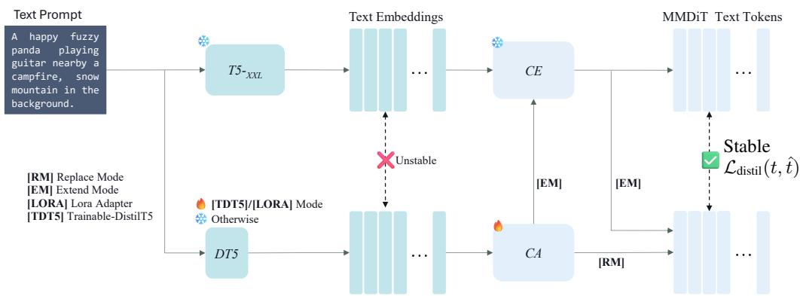
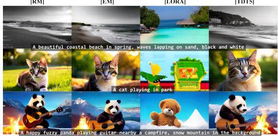
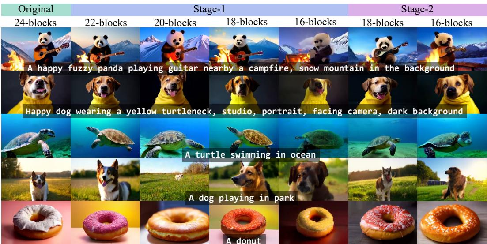
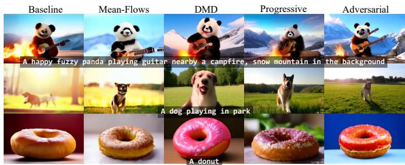
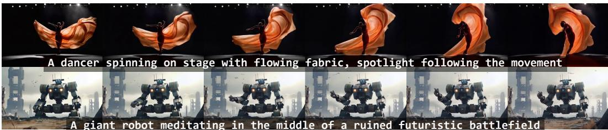

## ABSTRACT

We propose Neodragon, a video DiT (Diffusion Transformer) designed to run on a low-power NPU present in devices such as phones and laptop computers. We demonstrate that, despite video diffusion transformers’ huge memory and compute cost, mobile devices can run these models when carefully optimised for efficiency. To achieve this level of efficiency, i) we replace the original large Text-Encoder with a much smaller one with minimal quality loss through our novel distillation framework which doesn’t require any image or video data. ii) We propose an Asymmetric Decoder distillation approach which allows us to replace the native codec-latent-VAE decoder with a more efficient one, without disturbing the generative latent-space of the video generation pipeline. iii) With our Block Pruning strategy, we remove entire blocks from the MMDiT denoiser based on their relative importance and recover original performance through a two-stage distillation process. iv) We reduce the diffusion sampling cost using our novel extended version of DMD (Distribution Matching Distillation) for the Pyramidal Flow-Matching objective. Neodragon generates 49 frames of [640×1024] resolution within ∼6.7 seconds on the Qualcomm Hexagon NPU with a VBench total score of 81.61, setting a new state-of-the-art for mobile video generation.

## 1 INTRODUCTION

VDMs (Video Diffusion Models) trained on internet-scale video data are poised to become the next transformative leap in artificial intelligence (Brooks et al., 2024), analogous to LLMs (Large Language Models) trained on internet-scale text corpora. However, video generation has been an active research area long before the diffusion era, predominantly driven by GAN-based approaches (Tulyakov et al., 2018; Munoz et al., 2021; Saito et al., 2020; Clark et al., 2019; Kamran et al., 2021). While GANs suffered from training instability and couldn’t be scaled to larger datasets, Diffusion Models introduced a stable training objective that enabled scaling to increasingly large datasets; but at the expense of higher inference complexity (Hyvarinen, 2005; Song &¨ Ermon, 2019; Ho et al., 2020; Song et al., 2021a;b; Karras et al., 2022; Lipman et al., 2023; Heitz et al., 2023; Liu et al., 2023). Unlike GANs, which generate samples in a single forward pass, diffusion models require numerically integrating a learned probability-flow ODE/SDE through multiple iterative steps, resulting in significantly higher computational overhead during sampling. Nonetheless, given their stability and scalability, diffusion based VDMs (Wan et al., 2025; Jin et al., 2025; Lin et al., 2024; Bar-Tal et al., 2024; Yang et al., 2025; Kong et al., 2024; HaCohen et al., 2024) were preferred over their GAN-based counterparts and are today the contemprary state-of-the-art in video generation. With Diffusion Models established as the de facto training paradigm for video generation, the next key question concerns the choice of model architecture. Recent systems have transitioned from spatio-temporal UNet backbones (Bar-Tal et al., 2024; Ruan et al., 2023; Ho et al., 2022a) to Transformer based designs (Zhang et al., 2025c; HaCohen et al., 2024; Cheng et al., 2024), with DiTs (Diffusion Transformers) (Peebles & Xie, 2023) emerging as the state of the art due to their superior scalability, temporal coherence, and visual fidelity (Melnik et al., 2024; Thor, 2024).

Although many frontier open-source VDMs exist today (Kong et al., 2024; Wan et al., 2025; Ha-Cohen et al., 2024; Yang et al., 2025; Lin et al., 2024), their heavy computational demands limit accessibility; forcing reliance on cloud infrastructure with latency, privacy, and cost concerns. This causes barriers for creators in low-connectivity or resource-constrained settings. Enabling on-device generation would democratise access by allowing high-quality video synthesis directly on mobile hardware. Mobile video generation is especially important for privacy-preserving, always-available creative workflows and equitable access in bandwidth or cost-constrained regions; yet it is technically challenging due to tight compute, memory, bandwidth, and thermal/power budgets on handheld devices. To bridge this gap, we propose a set of simple yet effective techniques that systematically reduce model and runtime complexity while maintaining fidelity, enabling practical on-device video synthesis. Motivated by this vision, we introduce Neodragon, a DiT-based text-to-video system (see sec. 4) optimised for smartphones, delivering low-latency generation with competitive quality (see fig. 1). Our E2E (End-to-End) system runs with only a Peak-Memory usage of ∼3.5GB which is well supported by many low-power compute devices today, without affecting the other OS critical processes. We enable this mobile VDM execution through our main contributions as summarized below:

(A) We propose a Text-Encoder Distillation framework that compresses the 4.762B-parameter T5 model by 35× into a lightweight 0.130B-parameter DT5 (DistilT5) (Wang et al., 2025) using a newly trained 0.130B-parameter CA (ContextAdapter) module, without significant quality degradation (see subsec. 3.1).

(B) We introduce an Asymmetric Decoder Distillation approach that replaces the native codeclatent-VAE decoder with a device-friendly architecture, achieving over 20× parameter reduction and enabling on-device execution with negligible quality impact (see subsec. 3.2).

(C) We propose a novel MMDiT Block Pruning strategy for the denoiser backbone, yielding >25% reduction with minimal quality loss (see subsec. 3.3).

(D) We extend DMD to the Pyramidal Flow-Matching objective (Jin et al., 2025) as our Step Distillation approach, reducing the number of NFEs (Neural Functional Evaluations) from 480 to 21 (>95% reduction) without affecting the VBench score (see subsec. 3.4).

## 2 RELATED WORK

We cover the most relevant related work for on-device VDMs here, and defer a more thorough coverage to the Appendix section B. Deploying VDMs on mobile devices is challenging due to limited compute and memory. Most mobile-optimised methods extend UNet architectures with aggressive compression and pruning: AMD-Hummingbird (Isobe et al., 2025) prunes large models via visualfeedback learning, halving parameters with minimal quality loss; MobileVD (Ben Yahia et al., 2024) adapts Stable Video Diffusion through spatial downscaling, multi-scale temporal representations, and structured pruning, achieving 500× efficiency gains; SnapGen-V (Wu et al., 2025b) combines temporal-layer NAS (Neural Architecture Search) and adversarial step distillation. MoViE (Karjauv et al., 2024) targets mobile video editing by introducing architectural optimisations, a lightweight autoencoder, and multi-modal classifier-free guidance distillation, achieving a 3× on-device speedup. Additionally, it employs adversarial distillation to reduce sampling to a single step, enabling realtime editing at 12 fps on smartphones. In contrast, DiT-based VDMs for on-device deployment remain nascent: On-device Sora (Kim et al., 2025) applies training-free step reduction, token merging, and dynamic loading, while Wu et al. (Wu et al., 2025a) introduce an extreme-compression VAE, KD-guided pruning, and adversarial step distillation to enable mobile video generation. While Mobile VDMs share a common goal, our techniques are orthogonal to these concurrent works, and their combination could enable powerful application-specific deployments.

  
Figure 2: Overview of the proposed Text-Encoder Distillation framework. The original large-scale textencoder $T 5 \mathrm { x x }$ is distilled into a light-weight model via a trainable CA (ContextAdapter) module, using a combination of MSE and Cosine Distance loss to align the embeddings. Multiple modes are supported in our framework – Replace Mode [RM]: where the new CA replaces the original CE (ContextEmbedder); Extend Mode [EM]: where the new CA extends the original CE; Lora Mode [LORA]: Where the CA is not a separate MLP, but LoRA Hu et al. (2022) layers on top of the DT5 text-encoder; and, we allow training the smaller text-encoder v/s keeping it frozen via [TDT5] (Trainable-DT5) mode.

## 3 METHOD

## 3.1 TEXT-ENCODER DISTILLATION

Given the efficiency constraints of our mobile VDM (appendix sec. C explains these and why Pyramidal-Flow is our choice for baseline), we sought a baseline latency and initially attempted to port Pyramidal-Flow (Jin et al., 2025) to Qualcomm Hexagon NPU regardless of the time required to generate a video; however, a major blocker arose: the $T 5 _ { \mathrm { X X I } }$ Text-Encoder’s model footprint (4.726 B parameters) exceeds the mobile device’s memory budget, We therefore boiled down our aim to a single guiding question: is the full capacity of $\dot { T } ^ { 5 } \ O _ { X X L }$ actually necessary for high-quality text-to-video generation? A direct operational corollary is whether a much smaller encoder can be substituted without perceptible fidelity loss. Motivated by distillation results in text-to-image and vision–language systems (Wang et al., 2025; Ma et al., 2025; Zhang et al., 2025a; Zhao et al., 2024)—which suggest large encoders are under-utilised for short, descriptive prompts—we hypothesise that text-to-video models impose similarly shallow semantic demands. Building on DT5 (DistilT5) (Wang et al., 2025), we propose a prompt-only Text-Encoder distillation framework tailored to video generation (see fig. 2).

We observe that na¨ıvely matching $T 5 _ { \mathrm { X X L } }$ embeddings with DT5 proves to be unstable, so we focus on distilling only the components of text understanding from $T 5 _ { \mathrm { X X I } }$ that are relevant to video synthesis. To this end, we incorporate the CE (ContextEmbedder) from the MMDiT denoiser, which maps $T 5 _ { \mathrm { X X I } }$ embeddings into multi-modal conditioning tokens for the denoiser, and we introduce a new learnable module, CA (ContextAdapter), into the distillation setup. Our objective combines MSE and Cosine Distance losses between predicted and ground-truth MMDiT tokens, which we find to be stable with an optimal weighted combination found experimentally.

$$
\mathcal {L} _ {\text { distil }} (t, \hat {t}) := w _ {\text { mse }} \left\| t - \hat {t} \right\| _ {2} ^ {2} + w _ {\text { cd }} \left(1 - \frac {t . \hat {t}}{| t | . | \hat {t} |}\right)\tag{1}
$$

$$
\text { where, } t = C E (T 5 _ {\mathrm{XXL}} (\text { prompt })) \text { and, } \hat {t} = C A (D T 5 (\text { prompt }))\tag{2}
$$

  
(a)

<table><tr><td rowspan="2">Method</td><td rowspan="2">#Params (↓) (TE+CA)</td><td colspan="3">VBench Score</td></tr><tr><td>Tot. (↑)</td><td>Qual. (↑)</td><td>Sem. (↑)</td></tr><tr><td> $T5_{XXL}$  Baseline</td><td>4.732 B</td><td>80.31</td><td>83.68</td><td>66.81</td></tr><tr><td> $DT5$  CA [RM] Replace</td><td>0.260 B</td><td>79.64</td><td>83.71</td><td>63.39</td></tr><tr><td> $DT5$  CA [EM] Extend</td><td>0.266 B</td><td>79.16</td><td>83.56</td><td>61.55</td></tr><tr><td> $DT5$  CA [LORA] LoRA</td><td>0.136 B</td><td>64.74</td><td>74.94</td><td>24.08</td></tr><tr><td>[TDT5] Trainable  $DT5$ </td><td>0.136 B</td><td>79.20</td><td>83.44</td><td>62.12</td></tr></table>

(b)  
Figure 3: Text-Encoder Distillation results. (a) We visualise randomly selected frames from the generated $[ 4 9 \times 3 2 0 \times 5 1 2 ]$ videos corresponding to the adjacent text prompts. (b) #Parameters (↓) and VBench (↑) scores with ContextAdapter in [RM], [EM], [LORA], and [TDT5] modes.

The distillation framework supports multiple configurations, each tailored to explore a specific path over the experimental design space. The ground-truth CE is a single linear layer, serving as a fixed reference throughout. In contrast, the newly introduced CA is a more expressive 4-layer MLP with skip connections at every layer, designed to learn the task-specific adaptations. The framework operates in four different modes: [RM] Replace-Mode, where CA substitutes CE entirely; [EM] Extend-Mode, where CA complements CE and both of them are cascaded during inference; [TDT5], which makes the DT5 model trainable; and [LORA], which replaces the MLP-based CA with LoRA (Hu et al., 2022) adapter layers on top of DT5 . Throughout all modes, $T 5 _ { \mathrm { X X I } }$ and CE remain frozen to provide consistent ground-truth signals for the distillation. The CA is always trainable, while DT5 is only updated in [TDT5], and in [LORA] mode, only the LoRA adapter layers are trainable.

The setup was trained using ∼1.4M text-prompts sourced from CommonText (Wang et al., 2025), DiffusionDB (Wang et al., 2023), a high-aesthetic subset of LAION (score > 6.5) (Schuhmann et al., 2022), and T2ICompbench (Huang et al., 2023) for 24,000 iterations with values of $w _ { \mathrm { m s e } } = 1 . 0$ and $w _ { \mathrm { c d } } = 0 . 1$ . Appendix section E provides more experimental details and exhaustive ablations over the loss-weights and [LORA] mode.

Table 3b presents a detailed quantitative evaluation, comparing multiple configurations of the DT5 and its associated CA module. The baseline configuration, which employs the original $T 5 _ { \mathrm { X X I } }$ encoder, achieves a VBench Total score of 80.31, establishing the upper bound for performance within our setup. Remarkably, when $T 5 _ { \mathrm { X X I } }$ is replaced with the significantly smaller DT5 encoder paired with a 4-layer MLP-based CA operating in [RM], the system maintains a high VBench Total score of 79.64 (see fig. 3a). This reflects a minimal performance drop of just 0.67 percent, while delivering substantial reductions in parameter count and computational overhead.

These findings confirm our hypothesis that the full capacity of $T 5 _ { \mathrm { X X I } }$ is not required for highquality video synthesis; and a carefully distilled encoder can serve as a viable drop-in replacement without compromising user experience or output fidelity. The [RM] configuration is integrated into the final end-to-end Neodragon pipeline (see appendix fig. H1). Notably, while the original $T 5 _ { \mathrm { X X I } }$ text encoder was infeasible for on-device execution, the distilled version achieves a latency of just 3ms on Qualcomm Hexagon NPU.

## 3.2 ASYMMETRIC DECODER DISTILLATION

Having addressed the challenge of the large text encoder, we proceeded to port the model to the device, only to encounter a second bottleneck. Although the decoder in Pyramidal-Flow is relatively lightweight in terms of parameters (226M), its forward computation graph requires storing large 4D feature-map buffers. This made it impossible to fit even a single forward pass of the decoder (for our generation resolution) on the Qualcomm Hexagon NPU.

Rather than designing a new mobile-friendly codec-latent-VAE from scratch—which would require prohibitively large amounts of data and compute—we frame this challenge as another distillation problem. Existing open-source VDMs (Yang et al., 2025; Jin et al., 2025; Kong et al., 2024; Ha-Cohen et al., 2024; Wan et al., 2025; Lin et al., 2024) each employ their own codec-latent-VAEs, resulting in diverse video latent spaces for diffusion. We hypothesize that the decoder from one of these models may be sufficiently efficient to serve as a mobile-friendly candidate, which we can distill into our pipeline. This hypothesis raises two key questions: (i) Are the video latent spaces across different models easily transferable (through lightweight finetuning)? and (ii) How can we reconcile disparities in latent compression factors among these models? To address both questions within a unified empirical framework, we propose an Asymmetric Decoder Distillation approach.

Table 1: Quantitative Evaluation of Asymmetric Decoder Distillation. We report the DAVIS (Pont-Tuset et al., 2017) PSNR (↑) using the original Encoder (without modification and finetuning), using our pipeline’s Encoder (after distillation), and VBench scores (↑) for evaluating the reconstruction performance and the generation performance respectively.

<table><tr><td rowspan="2">Method</td><td rowspan="2">#Params (↓) Decoder</td><td rowspan="2">GPU Lat. (↓)</td><td rowspan="2">PSNR (↑) Orig. Enc.</td><td rowspan="2">PSNR (↑) Our Enc.</td><td colspan="3">VBench Score</td></tr><tr><td>Tot(↑)</td><td>Qual(↑)</td><td>Sem(↑)</td></tr><tr><td>PF Native Decoder</td><td>226M</td><td>2.496s</td><td>29.12</td><td>29.12</td><td>80.31</td><td>83.68</td><td>66.81</td></tr><tr><td>WAN modified</td><td>74M</td><td>1.666s</td><td>31.47</td><td>29.18</td><td>80.36</td><td>83.82</td><td>66.55</td></tr><tr><td>Cosmos CV [8x8x8]</td><td>63M</td><td>0.451s</td><td>29.34</td><td>29.45</td><td>79.96</td><td>83.37</td><td>66.35</td></tr><tr><td>LTXVideo modified</td><td>237M</td><td>1.738s</td><td>28.34</td><td>29.46</td><td>80.34</td><td>83.75</td><td>66.68</td></tr><tr><td>(Our) TinyAEHV modified</td><td>10M</td><td>0.851s</td><td>27.71</td><td>28.40</td><td>80.25</td><td>83.51</td><td>67.19</td></tr></table>

Our proposed framework comprises three components (see appendix fig. F1). First, we introduce asymmetry into the base model’s codec-latent-VAE by retaining the original encoder, ${ \mathcal { E } } _ { \mathrm { e n c } } ,$ to produce latents $z = \mathcal { E } _ { \mathrm { e n c } } ( \pmb { x } )$ , while replacing the original decoder ${ \mathcal { E } } _ { \mathrm { d e c } }$ with a new one, ${ \mathcal { F } } _ { \mathrm { d e c } } ,$ to reconstruct videos as $\hat { \pmb x } = \mathcal { F } _ { \mathrm { d e c } } ( \pmb z )$ Since $\mathcal { F } _ { \mathrm { d e c } }$ was originally trained for a different latent space, fine-tuning is essential. However, before fine-tuning, we must resolve the mismatch in compression factors between the native encoder and the asymmetric decoder. Second, we minimally adapt the decoder architecture to match the fixed encoder’s compression factor of $[ 8 \times 8 \times 8 ]$ This adjustment involves either adding or removing blocks, depending on the decoder’s original compression ratio. When new blocks are introduced, we reuse the existing architectural design as much as possible and minimise additional parameters. Finally third, we fine-tune the entire setup end-to-end using a reconstruction objective, $\boldsymbol { \mathcal { L } } ( \boldsymbol { x } , \hat { \boldsymbol { x } } )$ , combining MSE and LPIPS losses (Zhang et al., 2018). The encoder remains frozen to preserve the latent space required by the MMDiT, which also allows us to omit the KL regularizer typically employed in VAE training.

We train this setup using a dataset of ∼350K videos (and corresponding prompts) sourced as: ∼253K videos from the Stock Videos subset (Mixkit, Pexels, Pixabay) of OpenSora (Lin et al., 2024), and ∼87K from Panda-70M (Chen et al., 2024). The training is done for 200,000 iterations on eight 80GB Nvidia-H100 GPUs. Appendix section F provides details about modifications applied to each decoder, and more details about the training setup.

Table 1 summarises our experiments with the proposed Asymmetric Decoder Distillation framework. Remarkably, even with minimal architectural modifications, all decoder variants perform well. The PSNR scores on the DAVIS (Pont-Tuset et al., 2017) test set average above 29 dB, indicating that the asymmetric latent VAE can faithfully reconstruct video signals while operating through the frozen generative latent space of MMDiT. Although these experiments are preliminary, they provide strong empirical evidence for the universal nature of compressive video latent spaces learned by different models, demonstrating that such spaces can be transferred between each other with relatively low fine-tuning cost. For our deployment, the TinyAEHV decoder (Boer Bohan, 2025) proved to be the most parameter-efficient and mobile-friendly option, because of its design and portability; even though other decoders demonstrate better performance. While the native decoder could not run on the Qualcomm Hexagon NPU, the modified version achieves a latency of 143 ms when decoding a $[ 4 9 \times 3 2 0 \times 5 1 2 ]$ video from a latent tensor of shape $[ 7 \times 4 0 \times 6 4 ]$ This distilled decoder is integrated into our final optimised Neodragon pipeline (see appendix fig. H1).

## 3.3 MMDIT BLOCK PRUNING

After addressing the two major challenges of the oversized Text-Encoder and the unoptimised decoder, we successfully obtained our first end-to-end Qualcomm Hexagon NPU latency measurement of ∼184.2s. While this result demonstrates the feasibility of mobile video generation, the total runtime of approximately three minutes to produce a 2-second video at a relatively small resolution of [320×512] is far from our goal. Interestingly, the Text-Encoder and the Decoder, which initially prevented on-device execution, now account for only 0.2s of the total latency. The remaining 184s are required for the spatio-temporally pyramidal and causal latent generation performed by the MMDiT denoiser. This observation motivated our next two optimisation directions: (i) reducing the size of MMDiT in order to accelerate each denoising step; and (ii) reducing the number of denoising steps required to generate the latent video. In this subsection, we focus on the first direction, while the second direction is explored in the next. To this end, we propose a block-pruning strategy inspired by SANA-1.5 (Xie et al., 2025), but adapted to the MMDiT architecture and extended with a Full Teacher fine-tuning stage.

Table 2: Quantitative Evaluation of MMDiT Block Pruning. Performance of MMDiT Block-Pruning across model sizes, reported via VBench scores (↑) after Stage-1/2 fine-tuning, with model size (#Params, ↓) and Qualcomm Hexagon NPU latency (↓). Latency reported only for base and selected 18-block variant used in the final pipeline to minimise profiling costs.

<table><tr><td rowspan="2">Stage</td><td rowspan="2">Method</td><td rowspan="2">#Parameters (↓)</td><td rowspan="2">Mobile Latency (↓)</td><td colspan="3">VBench Score</td></tr><tr><td>Tot.(↑)</td><td>Qual.(↑)</td><td>Sem.(↑)</td></tr><tr><td>Original model</td><td>24 Blocks MMDiT</td><td>2.028 B</td><td>1.15s</td><td>80.31</td><td>83.68</td><td>66.81</td></tr><tr><td rowspan="4">1</td><td>22 Blocks MMDiT</td><td>1.858 B</td><td>-</td><td>79.82</td><td>83.30</td><td>65.92</td></tr><tr><td>20 Blocks MMDiT</td><td>1.688 B</td><td>-</td><td>78.65</td><td>82.36</td><td>63.82</td></tr><tr><td>18 Blocks MMDiT</td><td>1.518 B</td><td>0.74s</td><td>78.39</td><td>81.58</td><td>65.63</td></tr><tr><td>16 Blocks MMDiT</td><td>1.348 B</td><td>-</td><td>74.59</td><td>78.74</td><td>57.99</td></tr><tr><td rowspan="2">2</td><td>18 Blocks MMDiT</td><td>1.518 B</td><td>0.74s</td><td>80.21</td><td>83.54</td><td>66.90</td></tr><tr><td>16 Blocks MMDiT</td><td>1.348 B</td><td>-</td><td>78.62</td><td>82.40</td><td>63.50</td></tr></table>

  
Figure 4: Qualitative Evaluation of MMDiT Block Pruning. We visualise randomly selected frames from the generated $[ 4 9 \times 3 2 0 \times 5 1 2 ]$ videos, across models with different pruned-sizes, after Stage-1 finetuning, and Stage-2 finetuning.

Analysing Block Importance. The MMDiT denoiser, denoted as $\mathcal { D } ,$ can be expressed as a composition of N blocks operating on tokens concatenated from three sources: visual latent tokens z (diffused with noise), textual tokens tˆderived from the prompt (see eq. 2), and the clip embedding token $\hat { c } : = C L I P ( \mathrm { p r o m p t } )$ . Pyramidal-Flow trains the denoiser starting from SD3.5 (Esser et al., 2024) MMDiT checkpoint, hence here $N = 2 4$ . Due to the multi-modal nature of the MMDiT architecture, we obtain separate block importance scores for the visual and the textual tokens, represented by $B I _ { k } ^ { v }$ and $B I _ { k } ^ { t }$ respectively, for the $k ^ { \mathrm { { t h } } }$ block.

$$
\left(\boldsymbol {z} _ {k + 1}, \hat {t} _ {k + 1}\right) = \mathcal {D} _ {k} (\boldsymbol {z} _ {k}, \hat {t} _ {k}, \hat {c})\tag{3}
$$

$$
B I _ {k} ^ {v} := 1 - \mathbb {E} \left[ \frac {z _ {k} . z _ {k + 1}}{\| z _ {k} \| _ {2} \| z _ {k + 1} \| _ {2}} \right] \mathrm{and} B I _ {k} ^ {t} := 1 - \mathbb {E} \left[ \frac {\hat {t} _ {k} . \hat {t} _ {k + 1}}{\| \hat {t} _ {k} \| _ {2} \| \hat {t} _ {k + 1} \| _ {2}} \right]\tag{4}
$$

$$
B I _ {k} := \left(B I _ {k} ^ {v}, B I _ {k} ^ {t}\right)\tag{5}
$$

We compute block-importance scores for each $k ^ { \mathrm { { t h } } }$ block in the MMDiT (see eq. 5), defined as the Cosine Distance between the block $\mathcal { D } _ { k } \mathrm { \tilde { ~ } s }$ input and output tokens. To estimate these scores, we use a small but diverse calibration set of 100 text prompts, generating five sample videos for each. During this process, we probe the internal token representations of the MMDiT D at every denoising step for both CFG (Classifier-Free Guidance (Ho & Salimans, 2021)) passes—one with descriptive prompt and one with the negative. Interestingly, due to the model’s multi-modal nature, the visual and textual importance of a block are not correlated (see appendix sec. G for more details). Therefore, we also assess the impact of removing each block on the final generation quality visually. Based on both the importance scores and visual impact, we select the blocks for pruning.

Table 3: Quantitative Evaluation of Step Distillation. Comparison of step-distillation methods adapted to Pyramidal Flow-Matching for video generation under two inference schedules (4-4-4, 1-1-1). The Pyramidal-Flow default configuration is to generate the first frame with 20 steps and rest with 10 at each of the three resolutions. Metrics: VBench—Total (Tot↑), Quality (Qual↑), Semantic (Sem↑), and Dynamic-Degree (DD↑).

<table><tr><td rowspan="2">Method</td><td rowspan="2">Inference Schedule</td><td rowspan="2">Distillation Schedule</td><td rowspan="2">NFE&#x27;s (↓)</td><td rowspan="2">Mobile Latency (↓)</td><td colspan="4">VBench Score</td></tr><tr><td>Tot(↑)</td><td>Qual(↑)</td><td>Sem(↑)</td><td>DD(↑)</td></tr><tr><td rowspan="3">Pyramidal-Flow Native (CFG present)</td><td>(20)10×3</td><td>N/A</td><td>480</td><td>118.40s</td><td>80.31</td><td>83.68</td><td>66.81</td><td>64.72</td></tr><tr><td>4-4-4</td><td>N/A</td><td>168</td><td>41.44s</td><td>75.82</td><td>79.90</td><td>59.49</td><td>49.17</td></tr><tr><td>1-1-1</td><td>N/A</td><td>21</td><td>10.36s</td><td>59.62</td><td>67.90</td><td>26.50</td><td>6.39</td></tr><tr><td rowspan="2">Pyramidal Mean-Flows (CFG present)</td><td>4-4-4</td><td>N/A</td><td>168</td><td>41.44s</td><td>76.25</td><td>80.60</td><td>58.87</td><td>49.17</td></tr><tr><td>1-1-1</td><td>N/A</td><td>21</td><td>10.36s</td><td>63.44</td><td>70.89</td><td>33.62</td><td>20.00</td></tr><tr><td rowspan="2">Pyramidal DMD</td><td>4-4-4</td><td>1-1-1</td><td>84</td><td>20.72s</td><td>80.37</td><td>85.21</td><td>61.01</td><td>86.11</td></tr><tr><td>1-1-1</td><td>1-1-1</td><td>21</td><td>5.18s</td><td>76.48</td><td>80.79</td><td>59.24</td><td>48.89</td></tr><tr><td rowspan="2">Pyramidal Progressive Distillation</td><td>4-4-4</td><td>4-4-4</td><td>84</td><td>20.72s</td><td>78.22</td><td>82.41</td><td>61.46</td><td>52.50</td></tr><tr><td>1-1-1</td><td>1-1-1</td><td>21</td><td>5.18s</td><td>76.17</td><td>80.46</td><td>59.02</td><td>62.22</td></tr><tr><td rowspan="2">Pyramidal Adversarial Distillation</td><td>4-4-4</td><td>4-4-4</td><td>84</td><td>20.72s</td><td>78.51</td><td>83.19</td><td>59.77</td><td>87.78</td></tr><tr><td>1-1-1</td><td>1-1-1</td><td>21</td><td>5.18s</td><td>77.47</td><td>81.74</td><td>60.39</td><td>64.17</td></tr></table>

Stage-1 Finetuning. After removing the selected blocks from the MMDiT, we finetune the pruned model using ground-truth data. Specifically, we train the pruned model with our curated ∼350K dataset (see subsec. 3.2) with the original Flow-Matching objective (Lipman et al., 2023). We adopt the default setting of Pyramidal-Flow, where only the current frame is denoised while conditioning on past frames sampled from ground truth videos. To improve robustness to test-time generations, these history frames are corrupted with gaussian noise during training. Surprisingly we find that only as little as 300 iterations using four 80GB Nvidia H100 GPUs are sufficient for the model to converge in this stage, and training longer (we tried till 3000 iterations) doesn’t improve the performance further.

Stage-2 Finetuning. After establishing a lower bound on the performance achievable by the pruned models in Stage-1, we proceed with Stage-2 finetuning. In this stage, we incorporate featurematching losses between the Full Teacher model and the pruned Student model. Specifically, we apply an MSE loss on visual tokens, a Cosine Distance loss on textual tokens, and Flow-Matching losses (Lipman et al., 2023) using both the Teacher model’s outputs and ground-truth flow from the data as supervision. Ablations regarding the choice of these losses are detailed in Appendix section G. This stage exhibits slower convergence and requires a training for 60,000 iterations.

Table 2 and Figure 4 summarise our quantitative and qualitative results respectively. Notably, the 25% pruned model with 18 blocks achieves a VBench score of 80.21, only 0.1 lower than the base 24-block model (80.31), enabling near-lossless compression of the MMDiT denoiser. And hence, we deploy this block pruned MMDiT in our final pipeline (see appendix fig. H1). With this reduction in the MMDiT model size, the latency of a single denoising pass (sum over three pyramidal resolutions) was reduced from 1.15s to 0.74s on Qualcomm Hexagon NPU.

We found it remarkably intriguing that Stage-2 finetuning does not work well when applied directly to the pruned model, despite including the data based Flow-Matching loss in Stage-2. We also experimented with various annealed weighting schemes during training, but none matched the performance achieved by the curriculum approach of Stage-1 followed by Stage-2. We attribute this behaviour to the optimisation landscape induced by pruning, though a deeper investigation could provide valuable insights, which we leave as an interesting direction for future work.

## 3.4 STEP DISTILLATION

Having pruned approximately 25% of the MMDiT denoiser’s parameters, the video generation latency on the Qualcomm Hexagon NPU decreased from 184.2s to 118.6s, yielding a saving of 65.8s and significantly improving time-to-video. However this is still a bit away from a practically deployable system. Therefore, we aim to reduce latency further to make the system more practical and user-friendly, with real-time generation remaining the ultimate goal. Now with the block-pruned MMDiT, the iterative latent denoising accounts for 118.4s of the total latency, requiring 480 NFEs (denoising steps). To accelerate generation by distilling the denoising steps, we propose a pyramidal version of DMD (Yin et al., 2024). Given space constraints, we defer the details of the rest of our adaptions to the Section H of the appendix.

Pyramidal-Flow decomposes the probability flow into S stages, where the $i ^ { \mathrm { { t h } } }$ stage operates at $2 ^ { i } \times$ smaller resolution than the original, where $i \in \{ 0 , \ldots , S - 1 \}$ }. Let Down $\displaystyle ( \cdot , s )$ and $\bar { \mathrm { U p } } ( \cdot , s )$ denote spatial downsampling and upsampling by a factor s, respectively. Each stage is parameterised by a pair of noise levels $( \bar { \sigma } _ { \mathrm { s t a r t } } ^ { i } , \bar { \sigma } _ { \mathrm { e n d } } ^ { i } )$ with $1 > \sigma _ { \mathrm { s t a r t } } ^ { i } > \sigma _ { \mathrm { e n d } } ^ { i } > 0$ , and operates on latents at resolution $\mathrm { D o w n } ( z , 2 ^ { i } )$ . The start and end distributions for stage i are defined as

$$
\tilde {z} _ {\sigma_ {\mathrm{start}} ^ {i}} := (1 - \sigma_ {\mathrm{start}} ^ {i}) \mathrm{Up} \big (\mathrm{Down} (z, 2 ^ {i + 1}), 2 \big) + \sigma_ {\mathrm{start}} ^ {i} \epsilon ,\tag{6}
$$

$$
\tilde {z} _ {\sigma_ {\mathrm{end}} ^ {i}} := (1 - \sigma_ {\mathrm{end}} ^ {i}) \operatorname{Down} (z, 2 ^ {i}) + \sigma_ {\mathrm{end}} ^ {i} \epsilon .\tag{7}
$$

A different local noise-level $\sigma _ { \mathrm { { l o c a l } } } ^ { i } \ \sim \ \mathbb { U } ( 0 , 1 )$ is used to learn the Flow-Matching model at the $i ^ { \mathrm { { t h } } }$ stage, and the global noise-level σ relates to the local noise-level $\sigma _ { \mathrm { l o c a l } } ^ { i }$ as $\sigma ~ = ~ ( 1 ~ -$ $\sigma _ { \mathrm { l o c a l } } ^ { i } ) \sigma _ { \mathrm { e n d } } ^ { i } + \sigma _ { \mathrm { l o c a l } } ^ { i } \sigma _ { \mathrm { s t a r t } } ^ { i } .$ . Thus, the overall Pyramidal Flow Matching objective is an aggregate over the stagewise objectives: $\begin{array} { r } { \mathcal { L } _ { \mathrm { p y r - F M } } : = \sum _ { i = 0 } ^ { S - 1 } \mathcal { L } _ { \mathrm { F M } } ^ { i } } \end{array}$ . Appendix section D provides more details.

$$
i ^ {\mathrm{th}}
$$

For the Pyramidal-DMD, at ith stage input $\begin{array} { r c l } { { \tilde { z } _ { \sigma } } } & { { = } } & { { ( 1 \mathrm { ~ - ~ } \sigma _ { \mathrm { l o c a l } } ^ { i } ) \tilde { z } _ { \sigma _ { \mathrm { e n d } } ^ { i } } \ + } } \end{array}$ $\sigma _ { \mathrm { l o c a l } } ^ { i } \tilde { z } _ { \sigma _ { \mathrm { s t a r t } } ^ { i } } .$ the to-be-learned Student model $\mathcal { D } _ { \theta }$ aims to predict the clean latent, parametrized as a singlestep Euler solver $\begin{array} { r l r } { \tilde { z } _ { \theta } } & { { } : = } & { \tilde { z } _ { \sigma } - } \end{array}$ $( \sigma / ( \sigma _ { \mathrm { s t a r t } } ^ { i } - \sigma _ { \mathrm { e n d } } ^ { i } ) ) \mathcal { D } _ { \theta } ( \tilde { z } _ { \sigma } , \sigma )$ , since the teacher Score-Model D had been trained to approximate the flow defined as a derivative w.r.t. $\sigma _ { \mathrm { l o c a l } } ^ { i } .$ The so-called Fake-Score-Model $\mathcal { D } _ { \varphi }$ is trained with pyramidal Flow Matching objective $\mathcal { L } _ { \mathrm { p y r - F M } }$ but on the distribution of student-predicted clean

  
Figure 5: Qualitative evaluation of step distillation. We visualise randomly selected frames from the generated $[ 4 9 \times 3 2 0 \times 5 1 2 ]$ videos, across different step distillation application on the block-pruned model for 4-4-4 configuration.

latents instead of ground-truth video latents. Having the fake model, the student network is updated with DMD loss defined through its gradient $\nabla _ { \boldsymbol { \theta } } L _ { \mathrm { D M D } } ^ { i } \propto \left( \mathcal { D } ( \tilde { z } _ { \tau } , \tau ) - \mathcal { D } _ { \boldsymbol { \varphi } } ( \tilde { z } _ { \tau } , \tau ) \right) \cdot \nabla _ { \boldsymbol { \theta } } \tilde { z } _ { \boldsymbol { \theta } }$ . The input of teacher and fake model $\tilde { z } _ { \tau }$ is defined as a stage-wise noisy version of student-predicted clean latent, similar to eq. 6 and eq. 7,

$$
\tilde {y} _ {\sigma_ {\mathrm{start}} ^ {i}} := (1 - \sigma_ {\mathrm{start}} ^ {i}) \mathrm{Up} \big (\mathrm{Down} (\tilde {z} _ {\theta}, 2), 2 \big) + \sigma_ {\mathrm{start}} ^ {i} \varepsilon ,\tag{8}
$$

$$
\tilde {y} _ {\sigma_ {\mathrm{end}} ^ {i}} := (1 - \sigma_ {\mathrm{end}} ^ {i}) \tilde {z} _ {\theta} + \sigma_ {\mathrm{end}} ^ {i} \varepsilon ,\tag{9}
$$

$$
\tilde {z} _ {\tau} := (1 - \tau_ {\mathrm{local}} ^ {i}) \tilde {y} _ {\sigma_ {\mathrm{end}} ^ {i}} + \tau_ {\mathrm{local}} ^ {i} \tilde {y} _ {\sigma_ {\mathrm{start}} ^ {i}},\tag{10}
$$

where $\varepsilon \sim \mathcal { N } ( 0 , \mathbb { I } )$ and $\tau = ( 1 - \tau _ { \mathrm { l o c a l } } ^ { i } ) \sigma _ { \mathrm { e n d } } ^ { i } + \tau _ { \mathrm { l o c a l } } ^ { i } \sigma _ { \mathrm { s t a r t } } ^ { i }$ . We follow Yin et al. (2024) and define the sample-specific weight of DMD loss as $\left\| \mathcal { D } ( \tilde { z } _ { \tau } , \tau ) - \Big ( \tilde { y } _ { \sigma _ { \mathrm { s t a r t } } ^ { i } } - \tilde { y } _ { \sigma _ { \mathrm { e n d } } ^ { i } } \Big ) \right\| _ { 1 } ^ { - 1 }$ . Therefore, the sample gets higher weight, if teacher model is capable to estimate its conditional flow with a smaller error. In addition we found the supervised Cauchy loss $\mathcal { L } _ { \mathrm { t e a c h e r } } = \log \left( 1 + \left. \tilde { z } _ { \theta } - \mathrm { D o w n } ( z , 2 ^ { i } ) \right. _ { 2 } ^ { 2 } \right)$ useful for visual quality and used it with weight 0.5. During training, we update the student and fake model in alternate manner: one update of θ per two updates of $\varphi .$ For student’s updates we limit the set of local noise levels $\tau _ { \mathrm { l o c a l } } ^ { i }$ to four evenly selected values, and for fake model it is sampled from $\mathbb { U } ( 0 , 1 )$ To obtain teacher’s prediction we employ classifier-free guidance with the same hyperparameters as those recommended for Pyramidal-Flow.

Table 3 and Figure 5 summarise our quantitative and qualitative results respectively. Since the pyramidal setting of the base model operates on 3 different resolutions at the time of generation, we specifically target two different configurations, namely 4-4-4 and 1-1-1, where the denoiser spends 4 steps and 1 step on the three denoising resolutions respectively. Except for Pyramidal Mean-Flows, all the other three adaptations provide significant VBench gains compared to the base non-distilled model’s performance, especially in the lower step regime of 1-1-1. Since Pyramidal DMD yields the best VBench score of 80.37 for the 4-4-4 setting, we choose to use this step-distilled MMDiT denoiser D, with a denoising latency of 20.72s for the Neodragon pipeline (see appendix fig. H1).

Table 4: Comparison with state-of-the-art video generation models. All VBench scores from the compared methods are extracted from their reported numbers, except for ‘Wan2.1\*’, and ‘Pyramidal-Flow† ’ which are our reproduction of the scores using the same evaluation pipelines and parameters for the generated video resolution of [49×320×512] as we have used for our optimisations.

<table><tr><td>Platform</td><td>Model</td><td>Tot.(↑)</td><td>Qua.(↑)</td><td>Sem.(↑)</td><td>Flick.(↑)</td><td>Aes.(↑)</td><td>Ima.(↑)</td><td>Obj.(↑)</td><td>Scene(↑)</td><td>Cons.(↑)</td></tr><tr><td rowspan="10">Server</td><td>Pyramidal-Flow</td><td>81.72</td><td>84.74</td><td>69.62</td><td>99.49</td><td>63.26</td><td>65.01</td><td>86.67</td><td>43.20</td><td>26.23</td></tr><tr><td>Wan2.1 1.3B</td><td>83.31</td><td>85.23</td><td>75.65</td><td>99.55</td><td>65.46</td><td>67.01</td><td>88.81</td><td>41.96</td><td>25.50</td></tr><tr><td>Wan2.1 1.3B*</td><td>82.47</td><td>83.33</td><td>79.01</td><td>99.35</td><td>65.05</td><td>64.81</td><td>89.87</td><td>54.20</td><td>26.95</td></tr><tr><td>Open-Sora V1.2</td><td>79.76</td><td>81.35</td><td>73.39</td><td>99.53</td><td>56.85</td><td>63.34</td><td>82.22</td><td>42.44</td><td>26.85</td></tr><tr><td>CogVideoX1.5 5B</td><td>82.01</td><td>82.72</td><td>79.17</td><td>98.53</td><td>62.07</td><td>65.34</td><td>83.42</td><td>53.28</td><td>27.42</td></tr><tr><td>CogVideoX 5B</td><td>81.91</td><td>83.05</td><td>77.33</td><td>78.97</td><td>61.88</td><td>63.33</td><td>85.07</td><td>51.96</td><td>27.65</td></tr><tr><td>CogVideoX 2B</td><td>81.55</td><td>82.48</td><td>77.81</td><td>98.85</td><td>61.07</td><td>62.37</td><td>86.48</td><td>50.04</td><td>27.33</td></tr><tr><td>Mochi-1</td><td>80.13</td><td>82.64</td><td>70.08</td><td>99.40</td><td>56.94</td><td>60.64</td><td>86.51</td><td>36.99</td><td>25.15</td></tr><tr><td>LTX-Video</td><td>80.00</td><td>82.30</td><td>70.79</td><td>99.34</td><td>59.81</td><td>60.28</td><td>83.45</td><td>51.07</td><td>25.19</td></tr><tr><td>Efficient VDiT</td><td>76.14</td><td>-</td><td>-</td><td>99.49</td><td>57.21</td><td>-</td><td>60.33</td><td>-</td><td>-</td></tr><tr><td rowspan="7">On-device</td><td>Pyramidal-Flow $^{\dagger }$ </td><td>80.31</td><td>83.68</td><td>66.81</td><td>99.46</td><td>60.40</td><td>63.90</td><td>84.79</td><td>45.74</td><td>26.31</td></tr><tr><td>Snap Mobile Video DiT</td><td>81.45</td><td>83.12</td><td>74.76</td><td>98.11</td><td>64.16</td><td>63.41</td><td>92.26</td><td>51.06</td><td>25.51</td></tr><tr><td>Hummingbird 16frame</td><td>81.35</td><td>83.73</td><td>71.84</td><td>95.24</td><td>68.04</td><td>71.04</td><td>96.36</td><td>52.91</td><td>28.09</td></tr><tr><td>Hummingbird 26frame</td><td>80.31</td><td>83.11</td><td>69.10</td><td>97.64</td><td>67.82</td><td>69.94</td><td>94.86</td><td>49.49</td><td>27.65</td></tr><tr><td>SnapGenV</td><td>81.14</td><td>83.47</td><td>71.84</td><td>99.37</td><td>62.19</td><td>-</td><td>92.22</td><td>-</td><td>27.42</td></tr><tr><td>(Ours) Neodragon E2E</td><td>81.61</td><td>83.68</td><td>73.36</td><td>99.27</td><td>60.71</td><td>59.78</td><td>92.37</td><td>56.56</td><td>28.09</td></tr><tr><td>(Ours) T2V Multi-Step</td><td>80.21</td><td>83.54</td><td>66.90</td><td>99.40</td><td>59.86</td><td>63.56</td><td>83.16</td><td>42.54</td><td>26.58</td></tr></table>

  
Figure 6: Qualitative Evaluation of E2E Neodragon pipeline. We visualise uniformly selected frames from the [49×640×1024] videos (2x super-resolved) generated on Qualcomm Hexagon NPU.

## 4 END-TO-END MOBILE VDM

## 4.1 MODEL COMPONENT INTEGRATION

By applying step distillation, we reduced the end-to-end video generation latency to 25.96s, bringing our system close to the threshold of interactive video generation at 2fps. While the model maintains a strong VBench score of 80.37, we observe noticeable visual-semantic degradation. As illustrated in Fig. 5, our proposed Pyramidal-DMD approach introduces colour saturation artifacts and semantic inconsistencies in the first frame. Nevertheless, the generated motion remains smooth and stable, suggesting that this issue is not fully captured by VBench metrics. We hypothesize that these semantic artifacts can be mitigated by initializing the video with a high-quality first frame generated by a separate text-to-image model. This strategy would preserve the integrity of the initial frame while leveraging our pipeline to apply coherent and descriptive motion to subsequent frames. To this end, we use SSD-1B (Gupta et al., 2024) to generate the first frame in four steps requiring 0.82s including CLIP embedding, then apply our 1-1-1 step-distilled pipeline for subsequent frames. With VAE encoding 0.94s (first frame) and QuickSRNet (Berger et al., 2023) upsampling 5ms, the full pipeline achieves 6.7s latency (see fig. 1, and fig. 6). This configuration of ours constitutes our Mobile VDM Neodragon (see appendix fig. H1) and delivers the highest VBench score 81.61 among on-device solutions (see tab. 4). More qualitative videos are included in supplementary. Table 5 provides details of the on-device measurements done for running our Neodragon system on both a Laptop SoC (namely Snapdragon X Elite) and a Mobile SoC (namely Snapdragon 8 Elite Gen4); both powered by the Qualcomm Hexagon NPU.

Table 5: Neodragon On-device Measurements. We report measurements for running Neodragon on the laptop SoC Snapdragon X Elite and mobile SoC Snapdragon 8 Elite Gen4; both powered by Qualcomm Hexagon NPU. Since the VAE Encoder runs only once for the first frame, it is unoptimised. We also report peak RAM usage of each component for the laptop SoC.

<table><tr><td rowspan="2">SoC / Measurement</td><td rowspan="2">CLIP L</td><td rowspan="2">CLIP G</td><td rowspan="2">DistilT5</td><td colspan="2">SSD1B</td><td rowspan="2">VAE Enc.</td><td rowspan="2">VAE Dec.</td><td colspan="3">MMDiT+CA</td><td rowspan="2">QuickSRNet</td></tr><tr><td>UNet</td><td>Dec.</td><td> $[7 \times 10 \times 16]$ </td><td> $[7 \times 20 \times 32]$ </td><td> $[7 \times 40 \times 64]$ </td></tr><tr><td>Snapdragon X Elite /Lat. ms</td><td>5.9</td><td>43.6</td><td>3.0</td><td>151.5</td><td>378.6</td><td>941.7</td><td>143.0</td><td>54.9</td><td>101.4</td><td>590.2</td><td>4.9</td></tr><tr><td>Snapdragon X Elite /Mem. GB</td><td>0.49</td><td>2.64</td><td>0.03</td><td>2.57</td><td>0.17</td><td>0.68</td><td>0.21</td><td>3.13</td><td>3.15</td><td>3.25</td><td>0.01</td></tr><tr><td>Snapdragon 8 Elite Gen4 /Lat. ms</td><td>14.0</td><td>76.5</td><td>3.5</td><td>234.6</td><td>580.0</td><td>1206.5</td><td>248.9</td><td>104.7</td><td>218.3</td><td>938.3</td><td>6.5</td></tr></table>

## 4.2 MODEL COMPILATION

Deploying the model on a fixed-point NPU involves the following model compilation steps:

Porting multi-resolution MMDiTs. To compile static graphs, we need to port three MMDiT graphs—low, mid, and high—corresponding to the latent resolution of each stage. As illustrated in Appendix Figure D1, the PyTorch model takes past history which dynamically grows with more latent frames being included. This dynamic nature is incompatible with static compilation, hence input paddings are needed for each MMDiT graph. Specifically, we expand the last frame graph and pad zeros when running inference for earlier frames. Doing such steps requires changes to the attention mask and positional embedding implementation so that the zero paddings do not contribute to the next frame generation. This step is critical because any leakage from padded tokens can degrade temporal consistency.

Precomputation of MMDiT inputs. The input merge function of MMDiT’s forward pass computes constant information for each stage. These include input shapes and trainable token lengths specific to the current stage. Besides, as we run a fixed amount of timesteps, we also have timestep embeddings precomputed as inputs to the MMDiT graph. Precomputing these values not only reduces runtime overhead but also ensures deterministic behaviour across different hardware backends, which is essential for reproducibility.

Reduction of 6D tensors. The MMDiT graph contains temporal and spatial dimensions, which makes the RoPE layer computation a 6D tensor mul/add operation. Unlike Torch dynamic graphs, high-dimensional inputs mean more complicated tiling, which usually ends up penalising performance. To simplify this, we reduce along the sin/cos and broadcast dimensions, effectively collapsing redundant axes. This enables an extreme performance boost: it reduces MMDiT-[7×40×64] compilation time from nearly a day to less than two hours, while improving inference latency from several seconds to sub-second. Such optimisation is particularly important for real-time applications on edge devices.

Optimising causal mask value. By default, the causal mask value in T5 and MMDiT is set to an extremely large number, which can cause problems during device deployment. To mitigate this, we adjust the mask value to a more suitable number—large enough to prevent the model from attending to masked tokens, but small enough to avoid overflow. This adjustment is subtle yet necessary because fixed-point arithmetic is highly sensitive to extreme constants.

Rescaling activations in T5. T5 includes res add and ff add operations with values exceeding the FP16 numerical range. To ensure numerical stability and maintain functional equivalence, we apply a scaling factor to these residual connections, effectively transforming them without altering the model behaviour. This is a common practice in low-precision deployment pipelines and is crucial for preventing saturation in activation maps, which otherwise leads to degraded generation quality.

## 5 CONCLUSION

We began with the Pyramidal-Flow pipeline and, through four optimisations, namely Text-Encoder Distillation, Asymmetric Decoder Distillation, Block Pruning, and Step Distillation, transformed it into Neodragon, an efficient on-device text-to-video generation system. Every component of the pipeline has been either refined or replaced, yet the essence of the original design persists, echoing the paradox of the “Ship of Theseus” (Encyclopaedia Britannica): when every part changes, does the system remain the same? Neodragon reduces latency from minutes to seconds while preserving state-of-the-art quality, marking a significant step towards practical, interactive video generation on consumer hardware. Looking ahead, achieving high-resolution and long-duration video generation on-device remains an open challenge, and enabling intelligent video-to-video editing applications offers exciting directions for future work.