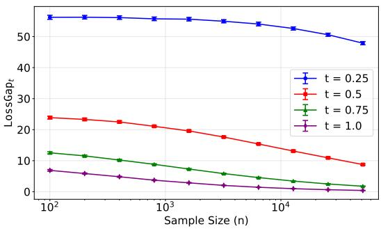
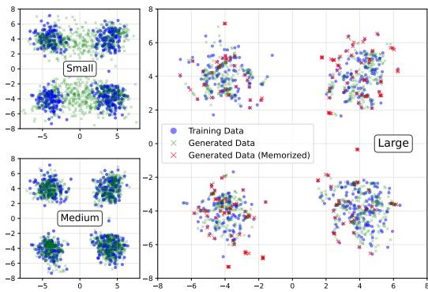
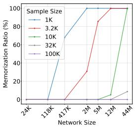
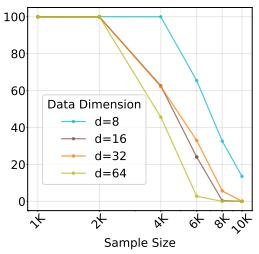
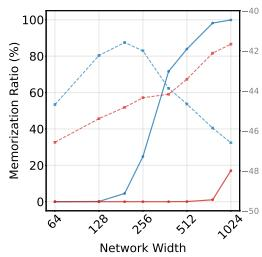
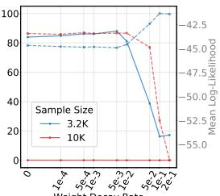

## ABSTRACT

Diffusion models have achieved remarkable success across diverse domains, but they remain vulnerable to memorization—reproducing training data rather than generating novel outputs. This not only limits their creative potential but also raises concerns about privacy and safety. While empirical studies have explored mitigation strategies, theoretical understanding of memorization remains limited. We address this gap through developing a dual-separation result via two complementary perspectives: statistical estimation and network approximation. From the estimation side, we show that the ground-truth score function does not minimize the empirical denoising loss, creating a separation that drives memorization. From the approximation side, we prove that implementing the empirical score function requires network size to scale with sample size, spelling a separation compared to the more compact network representation of the ground-truth score function. Guided by these insights, we develop a pruning-based method that reduces memorization while maintaining generation quality in diffusion transformers.

## 1 INTRODUCTION

Diffusion models have emerged as one of the most powerful families of generative models, achieving state-of-the-art performance across a wide range of tasks (Song & Ermon, 2019; Ho et al., 2020; Song et al., 2020a;b; Kong et al., 2020; Mittal et al., 2021; Jeong et al., 2021; Huang et al., 2022; Avrahami et al., 2022; Ulhaq & Akhtar, 2022). Applications span image synthesis (Nichol et al., 2021; Yang et al., 2024), molecular design (Weiss et al., 2023; Guo et al., 2024), and time-series modeling (Tashiro et al., 2021; Alcaraz & Strodthoff, 2022), where diffusion models consistently generate samples of high fidelity. Their remarkable empirical success has established them as a leading paradigm in modern generative modeling.

Despite these advances, diffusion models have raised critical concerns. A central one is memorization, where trained models reproduce training data instead of generating genuinely novel samples (Gu et al., 2023; Stein et al., 2023; Webster, 2023; Kadkhodaie et al., 2023; Rahman et al., 2025; Chen et al., 2024). Such behavior undermines the creative potential of generative modeling and threatens the promise of generalization (Somepalli et al., 2023; Carlini et al., 2023). Memorization also leads to serious risks for data privacy and intellectual property, as training datasets may include copyrighted works or sensitive information (Ghalebikesabi et al., 2023; Cui et al., 2023; Vyas et al., 2023).

A growing body of research has attempted to characterize and mitigate memorization in diffusion models. Empirical studies have explored its correlation with data duplication, training procedure, and model architecture and capacity (Somepalli et al., 2023; Gu et al., 2023; Stein et al., 2023), and proposed defenses such as dataset de-duplication, modified training objectives, or improved sampling strategies (Wen et al., 2024; Ross et al., 2024; Wang et al., 2024). These methods provide valuable heuristics yet leave principles underneath their success underexplored. In parallel, theoretical investigations have begun to analyze memorization from a statistical perspective. For instance, asymptotic analyses, where both sample size and data dimension grow proportionally, have provided insights into the interplay between data availability, model complexity, and generalization (Raya & Ambrogioni, 2023; Biroli et al., 2024; George et al., 2025). However, these analyses do not fully explain memorization in practical, finite-sample regimes, leaving open a fundamental question:

Can we disentangle memorizationfrom generalization in practical regimes and mitigate $i t ?$

In this work, we take a step toward addressing this question. We develop a non-asymptotic analysis that theoretically explains the emergence of memorization through the dual lenses of statistical estimation and neural function approximation. Our analysis reveals that memorization is fundamentally tied to the statistical properties of the training objective—the denoising score matching loss, and the approximation capacity of score neural networks. More specifically, from the statistical estimation side, we show that the ground-truth score function does not minimize the empirical denoising score matching loss, leading to an inherent gap that drives memorization. From the approximation side, we establish results demonstrating that the empirical score function demands network size scaling with the sample size, whereas the ground-truth score admits a compact representation. Guided by these insights, we explore empirical consequences and mitigation strategies. Our experiments not only validate the theories but also introduce a pruning-based method that reduces memorization while maintaining generation quality for diffusion transformers.

Our contributions are summarized as follows.

• Statistical separation theory: We show that the denoising score matching loss admits an inherent gap between the ground-truth score function and the empirical score function (Proposition $4 . 1 )$ Furthermore, for mixture models, we provide a lower bound on the gap in Theorem $4 . 3 ,$ , which provides a formal characterization of how memorization arises from a statistical perspective.

• Neural architectural separation theory: We establish bounds on neural networks approximating both ground-truth and empirical score functions in Theorem 5.1. Our results reveal that the groundtruth score function admits a compact neural representation, whereas approximating the empirical score function requires the network size to grow with the sample size.

Guided by our theory, we conduct experiments in Section 6 that (a) validate our insights regarding memorization and generalization in diffusion models, and (b) propose mitigation strategies that reduce memorization while preserving generation quality.

Notations: For a vector x, we use $x ,$ $\lVert x \rVert _ { 2 }$ to denote its Euclidean norm, $\lVert x \rVert _ { 1 }$ to denote its $\ell _ { 1 } { \mathrm { - n o r m } }$ and $\| x \| _ { \infty }$ to denote its $\ell _ { \infty } { - } \mathrm { n o r m }$ . For a matrix $A , \| A \| _ { 2 }$ and $\| A \| _ { \mathrm { F } }$ denote its spectral norm and Frobenius norm, respectively, and $\| A \| _ { \infty } = \operatorname* { m a x } _ { i , j } \left| \dot { A } _ { i j } \right|$ . We use $\mathcal { O } ( \cdot )$ to suppress multiplicative constants in upper bounds, while $\widetilde { \mathcal { O } } ( \cdot )$ further suppresses logarithmic factors. Similarly, $\Omega ( \cdot )$ suppresses multiplicative constants in lower bounds, and $\Theta ( \cdot )$ suppresses constants in both upper and lower bounds.

## 2 RELATED WORK

Memorization and generalization in diffusion models have drawn increasing attention in recent years. In this section we provide an overview of progress on both empirical and theoretical sides.

From an empirical perspective, memorization is a significant issue observed across various settings, raising practical concerns about privacy, copyright, and model generalization (Ghalebikesabi et al., 2023; Cui et al., 2023; Vyas et al., 2023). This phenomenon is widely identified in different domains, and researchers have revealed several contributing factors, such as training dataset size and score network size, and have proposed corresponding general mitigation methods like data augmentation and data de-duplication (Somepalli et al., 2023; Gu et al., 2023; Stein et al., 2023; Webster, 2023; Kadkhodaie et al., 2023; Rahman et al., 2025; Chen et al., 2024). More targeted mitigation methods have also been developed recently, including tracing memorized samples to network architectural activations for pruning-based remedies (Chavhan et al., 2024; Hintersdorf et al., 2024), excluding trigger tokens (Wen et al., 2024), and penalizing manifold memorization (Ross et al.,

2024). Interested readers may refer to a recent survey (Wang et al., 2024) for a more comprehensive exposure of contributing factors and mitigation methods for memorization.

From a theoretical perspective, memorization in diffusion models has been analyzed from a statistical physics perspective, with a focus on phase transition phenomena (Biroli et al., 2024; Li et al., 2023; Ambrogioni, 2023; Ventura et al., 2024; Raya & Ambrogioni, 2023; Sakamoto et al., 2024; Pavasovic et al., 2025). For example, Biroli et al. (2024) relate the sample generation process to memorization and generalization of diffusion models by identifying critical transitions in generation trajectories. George et al. (2025) use asymptotic analysis of random-feature denoisers, which are functionally equivalent to score networks, to characterize learning curves and reveal the inherent trade-offs between generalization and memorization. Bonnaire et al. (2025) provide an asymptotic analysis of the training dynamics of random-feature denoisers, identifying a generalization–memorization phase transition and examining how network architectural regularization mitigates memorization, with their theoretical findings supported by extensive numerical experiments. Baptista et al. (2025) also investigate the dynamics of empirical score matching through a dynamicalsystems lens, identifying a training-time generalization–memorization transition and demonstrating how various forms of regularization help prevent memorization. Other lines of work emphasize the role of implicit bias in underparameterized denoisers (Kamb & Ganguli, 2024; Niedoba et al., 2024; Vastola, 2025) and how dataset statistics shape a model’s generalization behavior (Lukoianov et al., 2025).

During the preparation of this manuscript, we are aware of a closely related work (Buchanan et al., 2025), where memorization and generalization properties in well-separated Gaussian mixture distributions are studied. By considering a specific type of denoiser parameterized by Gaussian mixture, they demonstrate a sharp transition from generalization to memorization as the capacity of the network increases. Different from their study, our analysis holds for generic sub-Gaussian distributions and establishes a statistical separation theory. In addition, we analyze the representation power of general score neural networks and show another separation for approximating empirical and groundtruth score functions. Based on our theoretical insights, we further develop mitigation methods to improve generalization.

## 3 DIFFUSION MODEL AND DATA DISTRIBUTION REGULARITY

In this section, we briefly review the continuous-time formulation of diffusion models and introduce the structural assumptions on the data distribution that will be used throughout our analysis.

Score-based diffusion model A score-based diffusion model aims to learn and sample from an unknown data distribution $P _ { \mathrm { d a t a } }$ by estimating the score function (Song & Ermon, 2019; Ho et al., 2020; Song et al., 2020a;b). It consists of coupled forward and backward processes. We adopt a continuous-time description, where the forward process is

$$
\mathrm{d} X _ {t} = - \frac {1}{2} X _ {t} \mathrm{d} t + \mathrm{d} B _ {t} \quad \text { for } \quad X _ {0} \sim P _ {\text { data }} \text {   and   } B _ {t} \text {   is   a   standard   Brownian   motion. }
$$

The forward process gradually corrupts the data distribution by Gaussian noise injection. Here $P _ { \mathrm { d a t a } }$ represents the ground-truth data distribution. We denote $\dot { P _ { t } }$ as the marginal distribution of $X _ { t }$ at time t and $p _ { t }$ the corresponding density function. In practice, the forward process terminates at a sufficiently large time $T$

The backward process reverses the noise corruption in the forward process—often referred to as denoising for new sample generation. Mathematically, the backward process is

$$
\mathrm{d} \widetilde {X} _ {t} = \left[ \frac {1}{2} \widetilde {X} _ {t} + \nabla \log p _ {T - t} (\widetilde {X} _ {t}) \right] \mathrm{d} t + \mathrm{d} \widetilde {B} _ {t} \quad \mathrm{for} \quad \widetilde {X} _ {0} \sim P _ {T},
$$

where $\widetilde { B } _ { t }$ is another Brownian motion and $\nabla$ log $p _ { t }$ is the score function. To simulate the backward process, one needs to estimate the score function using samples from the data distribution.

• Score estimation. We collect i.i.d samples $\mathcal { D } = \{ x _ { 1 } , x _ { 2 } , . . . , x _ { n } \}$ from the data distribution $P _ { \mathrm { d a t a } } .$ we estimate the score function by minimizing the following denoising score matching loss:

$$
\widehat {\mathcal {L}} (s) = \int_ {t _ {0}} ^ {T} \frac {1}{n} \sum_ {i = 1} ^ {n} \ell_ {t} (x _ {i}, s) \mathrm{d} t \quad \text { with } \quad \ell_ {t} (x _ {i}, s) = \mathbb {E} _ {X _ {t} | X _ {0} = x _ {i}} \left[ \left\| - \frac {X _ {t} - \alpha_ {t} x _ {i}}{\sigma_ {t} ^ {2}} - s (X _ {t}, t) \right\| _ {2} ^ {2} \right],\tag{3.1}
$$

where $\alpha _ { t } = e ^ { - t / 2 }$ and $\sigma _ { t } ^ { 2 } = 1 - e ^ { - t }$ . Note that $t _ { 0 }$ is an early-stopping time to prevent score blow-up and secure numerical stability (Song et al., 2020b; Ho et al., 2020). The estimator s is parameterized by a large-scale neural network such as a UNet (Ronneberger et al., 2015) or a transformer (Peebles & Xie, 2023).

• Empirical and ground-truth score function. Although the primary focus of optimizing (3.1) is to estimate the ground-truth score function $\overline { { \nabla } } \log { p _ { t } }$ , the use of finite collected samples introduces a bias towards the so-called “empirical score function”. More specifically, we denote $\widehat { P } _ { \mathrm { d a t a } } =$ $\textstyle { \frac { 1 } { n } } \sum _ { i = 1 } ^ { n } \mathbb { 1 } _ { x _ { i } }$ as the empirical data distribution. Let $\widehat { P } _ { t }$ be the marginal distribution of the forward process if the initial state $X _ { 0 }$ follows $\widehat { P } _ { \mathrm { d a t a } }$ . In fact, $\begin{array} { r } { \frac { 1 } { n } \sum _ { i = 1 } ^ { n } \mathsf { N } ( \alpha _ { t } x _ { i } , \sigma _ { t } ^ { 2 } I ) } \end{array}$ is a Gaussian mixture with mean and variance dependent on time t. Consequently, $\widehat { P } _ { t }$ induces the empirical score function defined as

$$
\nabla \log \widehat {p} _ {t} (x _ {t}) = - \frac {1}{\sigma_ {t} ^ {2}} \sum_ {i = 1} ^ {n} w _ {i} (x _ {t}) (x _ {t} - \alpha_ {t} x _ {i}),
$$

where $w _ { i } ( x _ { t } )$ is a weight function; see detailed derivations in Appendix $_ { \mathrm { A } . 2 } ^ { \mathrm { A } . 2 } .$

An important property of the empirical score function is that it is the global minimizer of (3.1). Moreover, using the empirical score function, diffusion models only reproduce training data points instead of generating novel samples—known as memorization. Our theory in the sequel focuses on distinguishing the statistical behavior and representation requirement of empirical and ground-truth score functions, providing insights on the emergence of memorization.

Data distribution regularity To study different properties of empirical and ground-truth score functions, we consider sub-Gaussian data distributions with Holder smoothness. These are com-¨ monly adopted regularity conditions in statistical literature and recent advances in the theory of diffusion models (Wasserman, 2006; Fu et al., 2024). We introduce Holder regularity first.¨

Definition 3.1 (Holder norm)¨ . Let $\beta = s + \gamma > 0$ be a smoothness parameter, with $s = \lfloor \beta \rfloor$ an integer and $\gamma \in [ 0 , 1 )$ . For a function $f :  { \mathbb { R } ^ { d } } \to  { \mathbb { R } }$ , its Holder norm is defined as¨

$$
\| f \| _ {\mathcal {H} ^ {\beta} (\mathbb {R} ^ {d})} = \max _ {\boldsymbol {s}: \| \boldsymbol {s} \| _ {1} <   s} \sup _ {x} | \partial^ {\boldsymbol {s}} f (x) | + \max _ {\boldsymbol {s}: \| \boldsymbol {s} \| _ {1} = s} \sup _ {x \neq y} \frac {| \partial^ {\boldsymbol {s}} f (x) - \partial^ {\boldsymbol {s}} f (y) |}{\| x - y \| _ {2} ^ {\gamma}},
$$

where s is a multi-index. We say $f$ is β-Holder if¨ $\| f \| _ { \mathcal { H } ^ { \beta } ( \mathbb { R } ^ { d } ) } < \infty .$

The Holder ball of radius¨ $B > 0$ is defined as

$$
\mathcal {H} ^ {\beta} (\mathbb {R} ^ {d}, B) = \left\{f: \mathbb {R} ^ {d} \to \mathbb {R} \mid \| f \| _ {\mathcal {H} ^ {\beta} (\mathbb {R} ^ {d})} <   B \right\}.
$$

We now specify a class of Holder density functions that exhibit sub-Gaussian tail behavior.¨

Definition 3.2 (Sub-Gaussian Holder density)¨ . Let $C > 0$ and $c _ { f } > 0$ be two positive constants. For any Holder index¨ $\beta > 0$ , let $f \in \mathcal { H } ^ { \beta } ( \mathbb { R } ^ { d } , B )$ for a constant radius $B > 0$ with in $\dot { \bar { \boldsymbol { { x } } } } _ { x } f ( { \boldsymbol { x } } ) \geq c _ { f }$ A density function $p$ is sub-Gaussian Holder¨ if

$$
p (x) = \exp (- C \| x \| _ {2} ^ {2} / 2) \cdot f (x).
$$

Since $f$ is uniformly upper bounded, it holds that $p ( x ) \leq B \exp ( - C \| x \| _ { 2 } ^ { 2 } / 2 )$ , which encapsulates sub-Gaussian densities widely studied in classical statistical literature (Wasserman, 2006). The lower bound on $f$ ensures the regularity of the ground-truth score function, as it is well-known that the regularity of the score function can be arbitrarily bad near low-density regions (Vahdat et al., 2021; Song $\&$ Ermon, 2020). Definition 3.1 is adopted in Fu et al. (2024) for establishing minimax optimal rate of conditional diffusion models. Yet our analysis tackles a more fine-grained understanding of the generalization capability of diffusion models.

## 4 STATISTICAL SEPARATION: GROUND-TRUTH SCORE DOES NOTMINIMIZE DENOISING SCORE MATCHING

In this section, we systematically show that the ground-truth score function does not minimize the denoising score matching loss (3.1). In particular, there exists a gap in the loss evaluated at the empirical score function and at the ground-truth score function. The gap, perhaps surprisingly, may not vanish with polynomially many training samples. To begin with, we define

$$
\mathrm{Loss-Gap} _ {t} = \frac {1}{n} \sum_ {i = 1} ^ {n} \left(\ell_ {t} \left(x _ {i}, \nabla \log p _ {t}\right) - \ell_ {t} \left(x _ {i}, \nabla \log \widehat {p} _ {t}\right)\right),
$$

as the gap between the score matching loss at time t.

## 4.1 Loss-Gapt IS FISHER DIVERGENCE

We relate $\mathtt { I o s s } \mathtt { s } - \mathtt { G a p } _ { t }$ to the well-known Fisher divergence (Johnson & Barron, 2004; Holmes & Walker, 2017; Yang et al., 2019; Yamano, 2021). Fisher divergence has a fundamental connection to classical central limit theorems (Johnson & Barron, 2004) and has been widely adopted in machine learning and Bayesian inference (Hyvarinen & Dayan¨ , 2005; Hyvarinen¨ , 2007; Yang et al., 2019), change detection (Moushegian et al., 2025), and hypothesis testing (Wu et al., 2022). We state the formal result in the following proposition.

Proposition 4.1. For any time $t \leq T$ , it holds that

$$
\mathrm{Loss-Gap} _ {t} = \mathbf {F i s h e r} (\widehat {P} _ {t}, P _ {t}),
$$

where the divergence Fisher $\cdot ( \widehat { P } _ { t } , P _ { t } ) = \mathbb { E } _ { X \sim \widehat { P } _ { t } } [ \| \nabla \log \widehat { p } _ { t } ( X ) - \nabla \log p _ { t } ( X ) \| _ { 2 } ^ { 2 } ] .$

The proof is provided in Appendix $\mathrm { A . l . ~ I 0 s s { - G a p } } _ { t }$ is analogous to the generalization bound of the empirical score function ∇ log $\widehat { p } _ { t }$ , but fundamentally different. A generalization bound evaluates the deviation of $\nabla \log \widehat { p } _ { t }$ from $\nabla \log p _ { t }$ under the ground-truth data distribution $P _ { t }$ . Here, $\mathtt { L O S S - G a p } _ { t }$ is evaluated under the empirical distribution $\widehat { P } _ { t }$ . Interestingly, Fisher divergence is not symmetric and $\mathtt { F i s h e r } ( P _ { t } , \widehat { P } _ { t } )$ coincides with the generalization bound of $\nabla$ log $\widehat { p } _ { t }$ . Existing literature presents fruitful studies on the generalization properties of diffusion models (Oko et al., 2023; Chen et al., 2023; Wibisono et al., 2024). Yet, the established analyses cannot be directly applied to our setting. Indeed, bounding $\mathtt { L O S S - G a p } _ { t }$ can be much more involved due to its intricate dependence on the empirical score function and the loss evaluation over the same empirical data points. In the following section, we show a lower bound on $\mathtt { L O S S - G a p } _ { t }$ under mixture models.

## 4.2 QUANTIFYING THE LOSS GAP IN MIXTURE OF DISTRIBUTIONS

We instantiate $P _ { \mathrm { d a t a } }$ to a mixture of K components with an equal prior, namely

$$
P _ {\mathrm{data}} = \frac {1}{K} \sum_ {k = 1} ^ {K} P ^ {(k)},\tag{Mixture Model}
$$

where each component $P ^ { ( k ) }$ admits a density $p ^ { ( k ) }$ , and we denote by $X ^ { ( k ) } \sim P ^ { ( k ) }$ a random variable drawn from the k-th component with mean $\bar { \mathbb { E } } [ X ^ { ( k ) } ] = \mu ^ { ( k ) }$ and covariance $\mathrm { C o v } [ X ^ { ( k ) } ] = \Sigma$ . Mixture Distributions align well with real-world datasets, which often exhibit multi-modality. For example, image datasets may contain distinct categories, such as cats and dogs in CIFAR-10 (Krizhevsky et al., 2009), that correspond to different components. For each component in the mixture model, we impose the following assumption.

Assumption 4.2 . We represent $X ^ { ( k ) }$ as $X ^ { ( k ) } = \mu ^ { ( k ) } + \Sigma ^ { 1 / 2 } \xi$ and assume $\xi$ is a unit variance, entrywise independent sub-Gaussian vector with $\| \xi \| _ { \psi _ { 2 } } = \mathcal { O } ( 1 )$ , where $\| \cdot \| _ { \psi _ { 2 } }$ denotes the sub-Gaussian norm (see Definition 3.4.1 in Vershynin (2018)). We also assume that $\| \Sigma \| _ { 2 } = \mathcal { O } ( 1 ) , \| \Sigma \| _ { \mathrm { F } } =$ $\mathcal { O } ( \sqrt { d } )$ , and $\Sigma ^ { 1 / 2 } \boldsymbol { \xi }$ admits the sub-Gaussian Holder density defined in Definition¨ 3.2. Additionally, we assume $\| \mu ^ { ( k ) } \| _ { 2 } = \mathcal { O } ( \sqrt { d } )$

Assumption $4 . 2$ ensures samples generated from the mixture are well separated with high probability when $\log ( n ) = { \mathcal { O } } ( d )$ . We define the minimum component separation distance as $\Delta _ { \operatorname* { m i n } } =$ mi $\boldsymbol { 1 } _ { j \neq k } \| \boldsymbol { \mu } ^ { ( j ) } - \boldsymbol { \mu } ^ { ( k ) } \| _ { 2 }$ . Equipped with these, we are ready to state a lower bound on $\scriptstyle \operatorname { I o s s } - \operatorname { G a p } _ { t } .$

Theorem 4.3 (Lower bound on $\operatorname { I o s } \mathtt { s } \mathtt { s } - \mathtt { G a p } _ { t } ) .$ . Suppose $P _ { \mathrm { d a t a } }$ takes the form (Mixture Model) with each component satisfying Assumption 4.2. Further assume the separation distance $\Delta _ { \operatorname* { m i n } } = \Theta ( { \sqrt { d } } )$ For $t _ { 0 }$ and $t _ { 1 }$ verifying $\bar { \log ( \sigma _ { t _ { 0 } } ) } \dot { = } \Omega ( - d )$ and $\log ( \sigma _ { t _ { 1 } } ) = \mathcal { O } ( \dot { - } \log d )$ and sample size log $n =$ $\mathcal O ( d )$ , it holds that

$$
\mathbb {E} _ {\mathcal {D}} \left[ \operatorname{Loss-Gap} _ {t} \right] = \Omega \left(d \sigma_ {t} ^ {- 2} + \operatorname{tr} (\Sigma)\right) \quad \text { for   all } t \in [ t _ {0}, t _ {1} ],
$$

where $\mathbb { E } _ { \mathcal { D } }$ denotes expectation with respect to the dataset D. The proof of Theorem 4.3 is provided in $\mathbf { A } _ { \mathbf { l } }$ ppendix A.2. We present several discussions.

Small t and large variance amplify the gap Theorem 4.3 says that for polynomially many training samples, $\mathtt { I o s s \mathrm { - } G a p } _ { i }$ is not negligible in the small-t regime. We visualize $\mathtt { L o s s \mathrm { - } G a p } _ { t }$ in a Gaussian mixture setting in Figure 1. The $d \sigma _ { t } ^ { - 2 }$ term arises from the Gaussian noise injected during data corruption, while the $\mathrm { t i r } ( \Sigma )$ term originates from the within-component variance. The effect of larger variance on increasing the loss gap can be understood through the Fisher divergence between $\widehat { P } _ { t }$ and $P _ { t }$ . For the same number of samples, larger within-component variance makes the samples sparser in space, leading to a larger Fisher divergence between the Gaussian mixture $\widehat { P } _ { t }$ formed by the samples and the true dis-

  
Figure 1: Smaller t leads to larger $\mathtt { L O S S - G a p } _ { t }$ When sample size n is not sufficiently large, the gap is non-negligible.

tribution $P _ { t } .$ Although the divergence vanishes as $n \to \infty$ , the convergence rate $n ^ { - 1 / d }$ is subject to the curse of dimensionality as shown in Weed & Bach (2019).

Gap leads to memorization Using Theorem 4.3 and revisiting (3.1), we can derive

$$
\mathbb {E} _ {\mathcal {D}} [ \widehat {\mathcal {L}} (\nabla \log p _ {t}) - \widehat {\mathcal {L}} (\nabla \log \widehat {p} _ {t}) ] = \int_ {t _ {0}} ^ {T} \mathbb {E} _ {\mathcal {D}} [ \mathrm{Loss-Gap} _ {t} ] \mathrm{d} t \gtrsim \log (1 / t _ {0}) \cdot d + (t _ {1} - t _ {0}) \operatorname{tr} (\Sigma).
$$

This highlights an important mechanism of memorization: the training loss gap between the groundtruth score and the empirical score is non-negligible. Therefore, strong optimizers, e.g., Adam and AdamW, tend to drive a sufficiently expressive score network to learn the empirical score rather than the ground-truth score during training. This effect is more pronounced in higher dimensions.

Extension to bounded support Our analysis also applies to mixtures of well-separated components with bounded support. The key step in establishing Theorem 4.3 is to prove a reduced-form approximation to the empirical and ground-truth score functions, respectively. More specifically, for a given noisy state $X \sim \widehat { P } _ { t }$ generated by injecting Gaussian noise into the empirical data points $x _ { i } ,$ we argue that ∇ log $\widehat { p _ { t } } ( X ) \ : \overset { \smile } { \approx } \ : - \sigma _ { t } ^ { - 2 } ( \bar { X } - \ : \overset { \smile } { \alpha _ { t } } x _ { i } )$ . Similarly, the ground-truth score function is dominated by ∇ log $p _ { t } ( X ) \approx \nabla$ log $p _ { t } ^ { ( k ) } ( X )$ , where $x _ { i }$ is sampled from the k-th component and $p _ { t } ^ { ( k ) }$ is the density of the marginal distribution via applying diffusion process to the $P ^ { ( k ) }$ . These approximations are valid thanks to the separation among the components. Bounded support naturally ensures this separation and hence the result follows.

## 5 ARCHITECTURAL SEPARATION: GROUND-TRUTH SCORE ALLOWS COMPACT REPRESENTATION

Section 4 establishes that $\mathtt { L O S S - G a p } _ { t }$ does not vanish in the small-t regime, implying that training a sufficiently expressive neural network with a strong optimizer can bias the training towards the empirical score function. Yet, it remains unknown whether a network is expressive enough. In this section, we investigate the representation requirements for the ground-truth and empirical score functions using ReLU networks and identify another gap in the complexity of the network architecture.

For simplicity, we focus on feedforward ReLU networks, while extending to other network architectures does not impose substantial challenges. We define a ReLU network architecture as $\mathcal { F } ( W , L , N )$ , where $W , { \bar { L } }$ and $N$ are the width, depth, and non-zero parameters of the network. More specifically, we have

$$
\mathcal {F} (W, L, N) = \left\{f: f (x) = A _ {L} \cdot \operatorname{ReLU} \left(A _ {L - 1} \cdot \operatorname{ReLU} \left(\dots \operatorname{ReLU} \left(A _ {1} x + b _ {1}\right) \dots\right) + b _ {L - 1}\right) + b _ {L}, \right.
$$

$$
\text { where } A _ {l} \in \mathbb {R} ^ {d _ {l - 1} \times d _ {l}} \text { with } d _ {l} \leq W \text { for } l = 0, \dots , L \text { and } \sum_ {l = 1} ^ {L} \| A _ {l} \| _ {0} + \| b _ {l} \| _ {0} \leq N \}.
$$

Here $d _ { 0 }$ represents the data dimension and $d _ { L }$ represents the output dimension. The following theorem establishes approximation guarantees of the ground-truth and empirical score functions.

Theorem 5.1. Suppose that the density function of $P _ { \mathrm { d a t a } }$ satisfies the sub-Gaussian Holder density¨ condition in Definition 3.2 with Holder index¨ β. For any sufficiently small $\epsilon > 0 .$ choose the earlystopping time $t _ { 0 }$ satisfying log $t _ { 0 } = \mathcal { O } ( \log \epsilon )$ and the terminal time $T = \mathcal { O } ( \log \epsilon ^ { - 1 } )$ ). Then there exist network architectures $\mathcal { F } _ { 1 } \big ( \dot { W } _ { 1 } , L _ { 1 } , \dot { N } _ { 1 } \big )$ and $\mathcal { F } _ { 2 } ( W _ { 2 } , L _ { 2 } , N _ { 2 } )$ giving rise to

$$
s _ {1} \in \mathcal {F} _ {1} (W _ {1}, L _ {1}, N _ {1}) \quad \text { and } \quad s _ {2} \in \mathcal {F} _ {2} (W _ {2}, L _ {2}, N _ {2}),
$$

such that for any $t \in [ t _ { 0 } , T ]$ , it holds that

$$
\mathbb {E} _ {\mathcal {D}} \left[ \mathbb {E} _ {X _ {t} \sim \widehat {P} _ {t}} \left[ \left\| s _ {1} (X _ {t}, t) - \nabla \log \widehat {p} _ {t} (X _ {t}) \right\| _ {2} ^ {2} \right] \right] \leq \frac {\epsilon}{\sigma_ {t} ^ {4}} \quad \text { and }\tag{5.1}
$$

$$
\mathbb {E} _ {\mathcal {D}} \left[ \mathbb {E} _ {X _ {t} \sim \widehat {P} _ {t}} \left[ \left\| s _ {2} (X _ {t}, t) - \nabla \log p _ {t} (X _ {t}) \right\| _ {2} ^ {2} \right] \right] \leq \frac {\epsilon}{\sigma_ {t} ^ {2}}.\tag{5.2}
$$

The configurations of $\mathcal { F } _ { 1 }$ and $\mathcal { F } _ { 2 }$ are

$$
W _ {1} = \widetilde {\mathcal {O}} \big (n \log^ {3} \epsilon^ {- 1} \big), \qquad L _ {1} = \widetilde {\mathcal {O}} \big (\log^ {2} \epsilon^ {- 1} \big), \qquad N _ {1} = \widetilde {\mathcal {O}} \big (n \log^ {4} \epsilon^ {- 1} \big) \quad \text { and }\tag{5.3}
$$

$$
W _ {2} = \widetilde {\mathcal {O}} \left(\epsilon^ {- \frac {d}{2 \beta}} \log^ {7} \epsilon^ {- 1}\right), \quad L _ {2} = \widetilde {\mathcal {O}} \bigl (\log^ {4} \epsilon^ {- 1} \bigr), \qquad N _ {2} = \widetilde {\mathcal {O}} \left(\epsilon^ {- \frac {d}{2 \beta}} \log^ {9} \epsilon^ {- 1}\right).\tag{5.4}
$$

The proof is provided in Appendix B. The key idea of the proof is to rewrite the score function as ∇ log $p _ { t } ( x ) \bar { = } \nabla p _ { t } ( x ) / p _ { t } ( \bar { x } )$ and then construct ReLU networks for approximating the numerator and denominator separately. Note that (5.1) is equivalent to the denoising score matching loss (3.1). Thus, minimizing (3.1) over a sufficiently large network identified in (5.3) using a strong optimizer will bias training toward the empirical score function. Probing the network size upper bounds and the corresponding approximation error, we make the following interpretations.

Network size depends on sample size The configuration of the network architecture $\mathcal { F } _ { 1 } ( W _ { 1 } , L _ { 1 } , N _ { 1 } )$ depends on the sample size n and the desired approximation error $\epsilon ,$ whereas the configuration of the ground-truth network $s _ { 2 }$ depends on $\epsilon ^ { - \frac { d } { 2 \beta } }$ . More specifically, as n increases, the required width $\breve { W }$ and the total number of parameters N for $\mathcal { F } _ { 1 }$ will increase. This distinction highlights the potentially greater complexity involved in approximating the empirical score function, as it corresponds to a Gaussian mixture distribution with n components.

Sample Duplication and Memorization Empirical observations, such as those in Somepalli et al. (2023), show that training sample duplication plays a significant role in memorization. From our insights in Theorem 5.1, sample duplication reduces the complexity required for the network to represent the empirical score function, thereby making memorization more likely. As stated in (5.3) and (5.4), when the dataset contains n i.i.d. samples, approximating the empirical score requires both the network width and the number of non-zero parameters to scale with $n ,$ while the corresponding quantities for approximating the true score do not depend on the sample size. However, if m samples are duplicates of the remaining $n - m$ i.i.d. samples, then from a theoretical viewpoint, the dataset effectively has size $n - m < n$ This implies that duplication makes the empirical score easier to represent and requires a less expressive network. Consequently, duplication makes memorization more likely to appear.

Different sensitivity to time t We also observe that the approximation errors in (5.1) and (5.2) exhibit a distinction in the dependence on variance $\sigma _ { t } ^ { 2 }$ . The empirical score function reproduces the empirical training data distribution $\widehat { P } _ { \mathrm { d a t a } } .$ , which does not have a smooth density function. Consequently, the empirical score function becomes highly irregular when t approaches 0, making it substantially more difficult to represent. On the contrary, the ground-truth score function possesses better regularity as the data distribution satisfies the sub-Gaussian Holder condition. We dive deeper¨ into this regularity contrast in the sequel.

Lipschitz continuity of score functions We investigate the Lipschitz continuity of score functions by computing the Hessian matrix of log density. As shown in Lemma C.1 in Appendix C, we have

$$
\nabla^ {2} \log p _ {t} (x _ {t}) = - \frac {1}{\sigma_ {t} ^ {2}} I + \frac {\alpha_ {t} ^ {2}}{\sigma_ {t} ^ {4}} \mathrm{Cov} [ X _ {0} | X _ {t} = x _ {t} ].
$$

The same result applies to the empirical density $\widehat { p } _ { t }$ by replacing $\mathrm { C o v } [ X _ { 0 } | X _ { t } = x _ { t } ]$ with the empirical counterpart induced by training samples. For a small time t, we show that the Lipschitz coefficient—the supremum operator norm of the Hessian of the empirical score is bounded by $\Omega ( { \sigma } _ { t } ^ { - 4 }$ · min $_ { i \neq j } \| \bar { x _ { i } } - x _ { j } \| _ { 2 } ^ { 2 } )$ , which depends on the separation of the training samples and variance $\sigma _ { t } ^ { 2 }$ . In contrast, the Lipschitz continuity of the ground-truth score of a sub-Gaussian Holder¨ distribution in Definition 3.2 behaves much better. As a concrete example, for a Gaussian distribution $P _ { \mathrm { d a t a } } = \mathcal { N } ( \mu , \Sigma )$ , denote $\lambda _ { \operatorname* { m i n } } ( \Sigma )$ as the smallest eigenvalue of $\Sigma ,$ we have

$$
\left\| \nabla^ {2} \log p _ {t} \right\| _ {2} = \frac {1}{\sigma_ {t} ^ {2} + \alpha_ {t} ^ {2} \lambda_ {\min} (\Sigma)} = \mathcal {O} (1) \quad \text { for   any } t.
$$

Weight decay effectively control the Lipschitz continuity Weight decay controls the Lipschitz continuity of neural networks by penalizing the Frobenius norms of the weight matrices (Krogh & Hertz, 1991; Loshchilov $\&$ Hutter, 2017; Zhang et al., 2018). It has been implemented widely for training large-scale complex neural networks. Motivated by the separation in Lipschitz coefficient, we demonstrate the effectiveness of weight decay for mitigating memorization in Section $^ { 6 , }$ as the score network can hardly represent the empirical score function with well-controlled smoothness.

## 6 NUMERICAL RESULTS

We conduct experiments on both a simulated Gaussian mixture dataset and CIFAR-10 (Krizhevsky et al., 2009) to validate our theoretical insights and evaluate the effectiveness of our proposed theorydriven memorization mitigation strategies.

## 6.1 EXPERIMENTS ON GAUSSIAN MIXTURE DATASET

We explore how network size, training sample size and data dimension affect generalization and memorization. Additionally, we demonstrate that weight decay and network pruning are effective remedies for memorization, which validates our theoretical insights. For the purpose of evaluating memorization in numerical experiments, following Buchanan et al. (2025); Yoon et al. (2023), we identify memorization as follows.

Given a training dataset $\{ x _ { i } \} _ { i = 1 } ^ { n }$ and a trained diffusion model $\mathcal { M } ,$ we say that a sample $x _ { \mathrm { n e w } }$ generated by M is memorized if $\bar { \| } \boldsymbol { x } _ { \mathrm { n e w } } -$ $\begin{array} { r } { \overline { { x } } _ { ( 1 ) } \| _ { 2 } ^ { 2 } \leq \frac { 1 } { 9 } \| \overline { { x } } _ { \mathrm { n e w } } - x _ { ( 2 ) } \| _ { 2 } ^ { 2 } } \end{array}$ , where $x _ { ( k ) }$ is the $k \mathrm { - }$ th nearest neighbor in Euclidean norm to xnew in $( x _ { i } ) _ { i = 1 } ^ { n }$ . Further, we call the proportion of memorized samples within a batch of new samples drawn from M the memorization ratio.

We specify $\begin{array} { r c l } { P _ { \mathrm { d a t a } } } & { = } & { \frac { 1 } { K } \sum _ { k = 1 } ^ { K } \mathcal { N } ( \mu ^ { ( k ) } , I _ { d } ) } \end{array}$ where $\mu ^ { ( k ) } , k \in \ [ K ]$ are well-separated. As a teaser, we set $d = 2 , K = 4$ to visualize how network size affects memorization, which is shown in Figure 2.

In the following experiments, we set $K = 8 ,$ and draw $\mu ^ { ( k ) }$ independently from $\mathcal { N } ( 0 , 4 I _ { d } )$ We first examine the relationship between memorization ratio, training sample size n, and data dimension d. The results are shown in Figure 3a. We initially fix the data dimension at $d = 3 2$ while varying the training sample size

  
Figure 2: Learning 2D Gaussian mixture with varying network sizes. Increasing the network size leads to a clear progression: from failing to capture the underlying distribution, to partial generalization, and eventually to memorization. Memorized samples generated by the largest network are highlighted in red.

and network size. The results indicate that larger networks exhibit stronger memorization capacity, while more training samples reduce memorization ratio. We then fix the network size (12M parameters) to analyze the effects of training sample size and data dimension. The results show that higher dimension leads to lower memorization as data is harder to replicate.

We then leverage our theoretical insights to explore potential remedies for memorization. Motivated by the theoretical insights in Theorem 5.1, we conduct further experiments to investigate the effects of network width and weight decay. The results are presented in Figure 3b. With sufficient sample size (n=10K), memorization is less likely and increasing network width promotes generalization (measured by mean log-likelihood, where higher is better), while strong weight decay is harmful. However, with reduced sample size $\scriptstyle ( n = 3 . 2 \mathrm { K } )$ , wide networks and light weight decay both lead to a high memorization ratio and severely impair generalization, while proper network width and weight decay prevent memorization and improve generalization. These findings validate that choosing appropriate network widths and applying weight decay during training are effective strategies to mitigate memorization.

  
(a) (Left): fixed data dimension with varying sample sizes and network sizes. (Right): fixed network size with varying sample sizes and data dimensions.

  
(b) (Left): fixed network depth with varying widths and sample sizes. (Right): fixed network width with varying weight decay rates and sample sizes.  
Figure 3: Comparison of experimental results on Gaussian mixture data. In (b), solid lines show memorization ratio, dashed lines show mean log-likelihood.

## 6.2 EXPERIMENTS ON CIFAR-10

Motivated by our theoretical insights and results on the effect of network width from synthetic experiments above, we propose a pruning method as a plug-and-play approach for trained diffusion models to reduce memorization.

Pruning to mitigate memorization Pruning has been widely adopted for trained diffusion models, either to reduce network size for faster inference while maintaining performance (Fang et al., 2025), or to remove specific memorized samples by identifying the responsible neurons (Hintersdorf et al., 2024). We propose a one-shot pruning method for trained Diffusion Transformers (DiTs) (Peebles & Xie, 2023). In particular, motivated by Theorems 4.3 and 5.1, we identify and prune attention heads that contribute least in the small-t regime, followed by fine-tuning. This forces the remaining heads to represent the data with reduced capacity, which in turn encourages the model to learn the ground-truth score rather than overfit to the empirical score. The full procedure is summarized in Algorithm 1. We adapt importance score computation from Liang et al. (2021), with details provided in Appendix D.1.

Performance of our pruning method We evaluate our pruning method on the CIFAR-10 (Krizhevsky et al., 2009) dataset. First, we randomly select a subset of 5,000 samples and train a DiT on this dataset. We then apply our pruning method with diffusion time step sampling distribution T = Beta(0.8, 2) and set the pruning ratio $\eta = 2 0 \%$ . For comparison, we also evaluate the original model and a random pruning baseline with the same pruning ratio. Besides memorization ratio and FID, we also use the precision and recall metrics of Kynka¨anniemi et al.¨ (2019). Definitions are provided in Appendix D.2, where recall measures diversity and generation coverage. The results in Table 1 show both our method and random pruning reduce memorization, but our method achieves higher recall and maintains a competitive FID, indicating improved diversity without sacrificing much fidelity. See Figure 4 for a comparison between the images generated by the original model and our pruned model.

Algorithm 1 One-Shot Pruning for Diffusion Transformers
1: Input:
2: Dataset D, trained DiT model M with heads  $H = \{h_{1}, \ldots, h_{H}\}$ .
3: Time sampling distribution T, which shall put more density on small t.
4: Pruning percentage  $\eta \in [0, 1]$ , fine-tuning steps M.
5: Compute importance scores  $\{I^{(h)}\}_{h \in H} \leftarrow \text{IMPORTANCESCORE}(M, D, T)$ .
6: Identify the set  $H_{prune}$  of  $\lfloor\eta \cdot H\rfloor$  heads with the lowest importance scores.
7: Prune all heads  $h \in H_{prune}$  from the model M.
8: for  $m = 1, \ldots, M$  do
9: Fine-tune the pruned model M on a batch from D.
10: Output: The pruned model M.

Although pruning slightly reduces precision, this is expected, as a high memorization ratio can artificially inflate precision by replicating training samples. For completeness, we also vary the pruning ratio and report additional results in Appendix D.3.

<table><tr><td>Model</td><td>Precision (↑)</td><td>Recall (↑)</td><td>Memorization Ratio (%) (↓)</td><td>FID (↓)</td></tr><tr><td>Original</td><td> $\mathbf{0.39}_{\pm 0.01}$ </td><td> $0.08_{\pm 0.01}$ </td><td> $73.82_{\pm 1.12}$ </td><td> $15.47_{\pm 0.28}$ </td></tr><tr><td>Our Pruning</td><td> $0.33_{\pm 0.02}$ </td><td> $\mathbf{0.12}_{\pm 0.01}$ </td><td> $68.58_{\pm 0.77}$ </td><td> $\mathbf{15.07}_{\pm 0.33}$ </td></tr><tr><td>Random Pruning</td><td> $0.30_{\pm 0.02}$ </td><td> $0.09_{\pm 0.01}$ </td><td> $\mathbf{66.87}_{\pm 0.94}$ </td><td> $17.14_{\pm 0.25}$ </td></tr></table>

Table 1: Comparison of the original model, our pruning method, and random pruning. Each value is $\mathrm { m e a n } _ { \pm \mathrm { s t d } }$ over 5 runs. Best results are in bold.

## 7 CONCLUSIONS AND LIMITATIONS

In this work, we present a theoretical framework to explain memorization in diffusion models, examining it from the perspectives of both statistical separation and architectural separation. From the statistical separation side, we show that the ground-truth score function does not minimize the denoising score matching loss, and we quantify this discrepancy for generic sub-Gaussian mixture models. From the architectural separation side, we establish theoretical bounds on the approximation capabilities of neural networks for both the true and empirical score functions, demonstrating the separation of network size. Finally, we validate these theoretical insights through a series of experiments and propose a novel pruning method to mitigate memorization based on our findings.

While our work provides valuable insights, it has a few limitations. First, although we quantify the discrepancy for sub-Gaussian mixture models—a very common case—our theoretical framework does not yet extend to heavy-tailed distributions. Second, while our pruning methods are effective in our experiments, we lack the computational resources to fully validate their performance on larger datasets and models. We hope that future work can address these challenges.