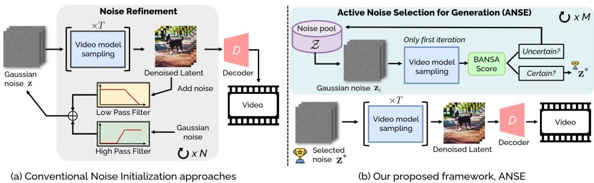
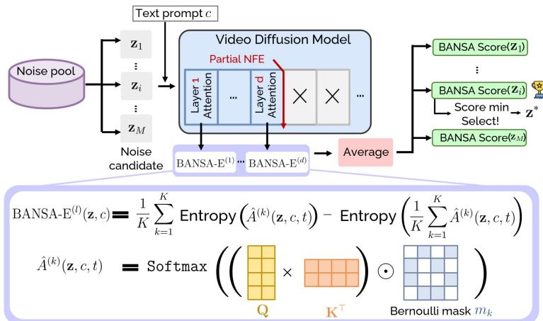
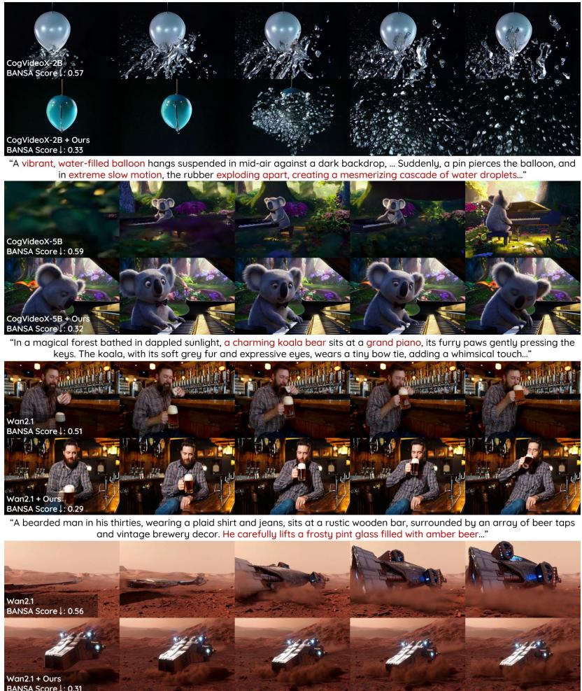
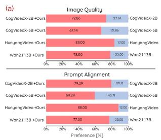
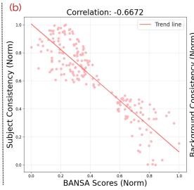
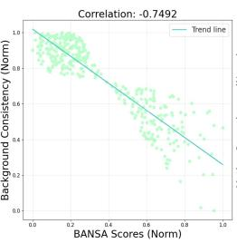
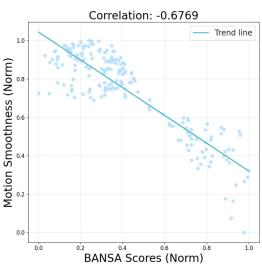
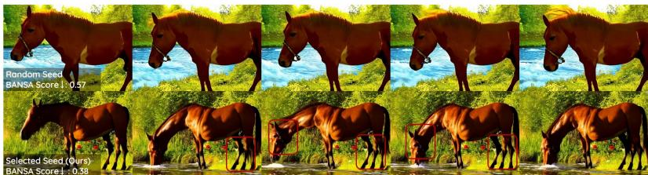

## ABSTRACT

The choice of initial noise strongly affects quality and prompt alignment in video diffusion; different seeds for the same prompt can yield drastically different results. While recent methods use externally designed priors (e.g., frequency filtering or inter-frame smoothing), they often overlook internal model signals that indicate inherently preferable seeds. To address this, we propose ANSE (Active Noise Selection for Generation), a model-aware framework that selects high-quality seeds by quantifying attention-based uncertainty. At its core is BANSA (Bayesian Active Noise Selection via Attention), an acquisition function that measures entropy disagreement across multiple stochastic attention samples to estimate model confidence and consistency. For efficient inference-time deployment, we introduce a Bernoulli-masked approximation of BANSA that estimates scores from a single diffusion step and a subset of informative attention layers. Experiments across diverse text-to-video backbones demonstrate improved video quality and temporal coherence with marginal inference overhead, providing a principled and generalizable approach to noise selection in video diffusion. See our project page: https://anse-project.github.io/anse-project/.

  
Figure 2: Conceptual comparison of noise initialization. (a) Prior methods (Wu et al., 2024; Yuan et al., 2025) refine noise via frequency priors and full diffusion sampling, leading to high cost. (b) Our method instead selects noise seeds by estimating attention-based uncertainty at the first denoising step, enabling efficient, model-aware selection.

## 1 INTRODUCTION

Diffusion models have rapidly established themselves as a powerful class of generative models, demonstrating state-of-the-art performance across images and videos (Rombach et al., 2022; Esser et al., 2024; Xie et al., 2024; Chen et al., 2024b;a; Wang et al., 2025; Yang et al., 2024; Zheng et al., 2024; Team, 2025). In particular, Text-to-Video (T2V) diffusion models have received increasing attention for their ability to generate temporally coherent and visually rich video sequences. To achieve this, most T2V model architectures extend Text-to-Image (T2I) diffusion backbones by incorporating temporal modules or motion-aware attention layers (Blattmann et al., 2023; He et al., 2022; Wang et al., 2023; Chen et al., 2023; 2024a; Guo et al., 2024b; Wang et al., 2025). Furthermore, other works explore video generative structures, such as causal autoencoders or video autoencoderbased models, which aim to generate full video volumes rather than a sequence of independent frames (Hong et al., 2022; Yang et al., 2024; HaCohen et al., 2024; Kong et al., 2024; Zheng et al., 2024; Team, 2025).

Beyond architectural design, another promising direction lies in improving noise initialization at inference time for T2I and T2V generation (Guo et al., 2024a; Eyring et al., 2024; Chen et al., 2024c; Xu et al., 2025). This aligns with the growing trend of inference-time scaling, observed not only in Large Language Models (Brown et al., 2024; Snell et al., 2024) but also in diffusion-based generation systems (Ma et al., 2025). Due to the iterative nature of the diffusion process, the choice of initial noise profoundly influences video quality, temporal consistency, and prompt alignment (Ge et al., 2023; Wu et al., 2024; Qiu et al.; Yuan et al., 2025). As illustrated in Figure 1, the same prompt can lead to drastically different videos depending solely on the noise seed, motivating the need for intelligent noise selection.

Recent approaches tackle this by introducing external noise priors. PYoCo (Ge et al., 2023) enforces inter-frame dependent patterns for coherence but requires heavy fine-tuning. FreeNoise (Qiu et al.) reschedules noise across time with a fusion strategy, FreeInit (Wu et al., 2024) preserves lowfrequency components via frequency filtering, and FreqPrior (Yuan et al., 2025) extends this with Gaussian-shaped priors and partial sampling. While effective, these methods rely on external priors and repeated full diffusion passes, while ignoring internal model signals that identify inherently preferable seeds.

To address this limitation, we propose a model-aware noise selection framework, ANSE (Active Noise Selection for Generation), grounded in Bayesian uncertainty. At the core of ANSE is BANSA (Bayesian Active Noise Selection via Attention), an acquisition function that identifies noise seeds inducing confident and consistent attention behaviors under stochastic perturbations. A conceptual comparison between our method and prior frequency-based approaches is illustrated in Figure 2, highlighting the difference between external priors and model-informed uncertainty estimates.

Unlike BALD (Gal et al., 2017), which estimates uncertainty from classification logits, BANSA measures entropy in attention maps, arguably the most informative signals in diffusion. It compares the mean of per-pass entropies with the entropy of the mean map, capturing both uncertainty and cross-pass disagreement. A lower BANSA score indicates more confident, consistent attention and empirically correlates with more coherent video generation (Fig. 1). To make BANSA inferencefriendly, we approximate it with Bernoulli-masked attention, yielding multiple stochastic attention samples from a single forward pass. We further cut cost by evaluating early denoising steps and only a subset of informative layers selected via correlation analysis. Our contributions are threefold:

• We present ANSE, the first active noise selection framework for video diffusion, grounded in a Bayesian formulation of attention-based uncertainty.

• We introduce BANSA, an acquisition function that measures attention consistency under stochastic perturbations, enabling model-aware noise selection without retraining.

• Our method improves video quality and temporal consistency across diverse text-to-video backbones, with only marginal inference overhead.

## 2 PRELIMINARY

Video Diffusion Models Diffusion models (Ho et al., 2020; Song et al., 2021b) have achieved strong results across generative tasks. In T2V, pixel-space diffusion is costly, so most video diffusion models adopt latent diffusion and operate in a compressed latent space. A video autoencoder with encoder $\mathcal { E }$ and decoder D reconstructs x as $\mathbf { x } = \mathcal { D } ( \mathcal { E } ( \mathbf { x } ) )$ . Let ${ \bf z } _ { 0 } = \mathcal { E } ( { \bf x } )$ ). The forward diffusion then progressively adds noise over time:

$$
\mathbf {z} _ {t} = \sqrt {\bar {\alpha} _ {t}} \mathbf {z} _ {0} + \sqrt {1 - \bar {\alpha} _ {t}} \boldsymbol {\epsilon}, \quad \boldsymbol {\epsilon} \sim \mathcal {N} (0, \mathbf {I}), \quad t = 1, \ldots , T,
$$

where $\bar { \alpha } _ { t }$ is a pre-defined variance schedule. To learn the reverse process, a denoising network $\epsilon _ { \theta }$ is trained using the denoising score matching loss (Vincent, 2011):

$$
\mathcal {L} _ {\theta} = \mathbb {E} _ {\mathbf {z} _ {t}, \epsilon , t} \left[ \left\| \boldsymbol {\epsilon} _ {\theta} (\mathbf {z} _ {t}, \mathbf {c}, t) - \boldsymbol {\epsilon} \right\| ^ {2} \right],
$$

where c is the conditioning text. Sampling starts from Gaussian noise $\mathbf { z } _ { T } \sim \mathcal { N } ( 0 , \mathbf { I } )$ and uses a deterministic DDIM solver (Song et al., 2021a). Each step updates as:

$$
\mathbf {z} _ {t - 1} = \sqrt {\bar {\alpha} _ {t}} \hat {\mathbf {z}} _ {0} (t) + \sqrt {1 - \bar {\alpha} _ {t - 1}} \boldsymbol {\epsilon} _ {\theta} (\mathbf {z} _ {t}, \mathbf {c}, t),
$$

where the denoised latent estimate $\begin{array} { r } { \hat { \mathbf { z } } _ { 0 } ( t ) : = \frac { \mathbf { z } _ { t } - \sqrt { 1 - \bar { \alpha } _ { t } } \epsilon _ { \theta } ( \mathbf { z } _ { t } , \mathbf { c } , t ) } { \sqrt { \bar { \alpha } _ { t } } } } \end{array}$ is obtained using Tweedie’s formula (Efron, 2011; Kim & Ye, 2021). This iterative process continues until $t = 1$ , yielding the final denoised latent $\mathbf { z } _ { 0 } .$ , which is decoded into a video via D.

Bayesian Active Learning by Disagreement (BALD) Active learning selects the most informative samples from an unlabeled pool to improve training. Acquisition functions are commonly uncertaintybased (Houlsby et al., 2011; Gal et al., 2017; Kirsch et al., 2019; Yoo & Kweon, 2019) or distributionbased (Mac Aodha et al., 2014; Yang et al., 2015; Sener & Savarese, 2017; Sinha et al., 2019), and some use external modules such as auxiliary predictors (Yoo & Kweon, 2019; Tran et al., 2019; Kim et al., 2021). While most prior work targets image classification, we adapt uncertainty-based acquisition to text-to-video generation without additional models.

Predictive entropy is widely used, but it reflects data noise and does not isolate parameter uncertainty. BALD instead measures epistemic uncertainty via the mutual information between predictions y and parameters θ:

$$
\mathrm{BALD} (\mathbf {x}) = \mathcal {H} [ p (\mathbf {y} | \mathbf {x}) ] - \mathbb {E} _ {p (\theta | \mathcal {D} _ {U})} \left[ \mathcal {H} [ p (\mathbf {y} | \mathbf {x}, \theta) ] \right],\tag{1}
$$

where $\begin{array} { r } { \mathcal { H } [ p ] = - \sum _ { y } p ( y ) } \end{array}$ log p(y) is Shannon entropy (Shannon, 1948). The first term is the entropy of the mean prediction, and the second is the average entropy across stochastic forward passes. A high BALD score means predictions are confident yet disagree, indicating high epistemic uncertainty. Since the posterior over θ is intractable, BALD is approximated using K stochastic forward passes (e.g., Monte Carlo dropout):

$$
\widehat {\mathrm{BALD}} (\mathbf {x}) = \mathcal {H} \left[ \frac {1}{K} \sum_ {k = 1} ^ {K} p ^ {(k)} (\mathbf {y} | \mathbf {x}) \right] - \frac {1}{K} \sum_ {k = 1} ^ {K} \mathcal {H} \left[ p ^ {(k)} (\mathbf {y} | \mathbf {x}) \right].\tag{2}
$$

We reinterpret BALD for inference-time generative modeling. Rather than selecting samples for labeling, we apply BALD to rank noise seeds by their epistemic uncertainty. Selecting seeds with lower BALD scores results in more stable model behavior and leads to higher-quality generations.

  
Figure 3: Overview of our BANSA-based noise selection process. Given a text prompt $c ,$ we compute BANSA scores for multiple noise seeds $\left\{ \mathbf { z } _ { 1 } , \dots , \mathbf { z } _ { M } \right\}$ using Bernoulli-masked attention maps from selected layers at an early diffusion step. The seed with the lowest score, indicating confident and consistent attention, is selected for generation.

## 3 METHODS

We propose ANSE, a framework for selecting high-quality noise seeds in T2V diffusion based on model uncertainty (Fig. 2). ANSE centers on BANSA, an acquisition function that transfers uncertainty criteria from classification to the attention space of generative diffusion models (Sec. 3.1). For efficient inference, we approximate BANSA via Bernoulli-masked attention sampling (Sec. 3.2). To avoid redundancy, we select a representative attention layer using correlation-based linear probing (Sec. 3.3). The full pipeline appears in Fig. 3.

## 3.1 BANSA: BAYESIAN ACTIVE NOISE SELECTION VIA ATTENTION

We introduce BANSA, an acquisition function for selecting optimal noise seeds in T2V diffusion. Unlike classifiers with explicit predictive distributions, diffusion models do not expose such outputs, so we estimate uncertainty in the attention space where text and visual tokens align during generation. We treat attention maps as stochastic predictions conditioned on the seed z, prompt c, and timestep t. BANSA measures both disagreement and confidence across multiple attention samples, providing a BALD-style uncertainty criterion tailored to the generative setting.

Definition 1 (BANSA Score). Let z be a noise seed, c a text prompt, and t a diffusion timestep. Let $\mathbf { Q } ( \mathbf { z } , c , t ) , \mathbf { K } ( \mathbf { z } , c , t ) \in \mathbb { R } ^ { N \times d }$ denote the query and key matricesfrom a denoising network $\epsilon _ { \theta } .$ . The attention map is computed as:

$$
A (\mathbf {z}, c, t) := S o f t m a x \left(\mathbf {Q} (\mathbf {z}, c, t) \mathbf {K} (\mathbf {z}, c, t) ^ {\top}\right) \in \mathbb {R} ^ {N \times N}.\tag{3}
$$

Let $\mathcal { A } ( \mathbf { z } , c , t ) = \{ A ^ { ( 1 ) } , \ldots , A ^ { ( K ) } \}$ denote a set ofK stochastic attention maps obtained viaforward passes with random perturbations (e.g., Bernoulli masking). The BANSA score is defined as:

$$
B A N S A (\mathbf {z}, c, t) := \mathcal {H} \left(\frac {1}{K} \sum_ {k = 1} ^ {K} A ^ {(k)}\right) - \frac {1}{K} \sum_ {k = 1} ^ {K} \mathcal {H} (A ^ {(k)}),\tag{4}
$$

where $\begin{array} { r } { \mathcal { H } ( A ) : = \frac { 1 } { N } \sum _ { i = 1 } ^ { N } \sum _ { j = 1 } ^ { N } - A _ { i j } } \end{array}$ log $A _ { i j }$ . This formulation captures both the sharpness (confidence) and the consistency (agreement) of attention behavior. BANSA can be applied to various attention types (e.g., cross-, self-, or temporal) and allows layer-wise interpretability.

Given a noise pool $\mathcal { Z } = \{ \mathbf { z } _ { 1 } , \dotsc , \mathbf { z } _ { M } \}$ , we select the optimal noise seed that minimizes score:

$$
\mathbf {z} ^ {*} := \arg \min _ {\mathbf {z} \in \mathcal {Z}} \operatorname{BANSA} (\mathbf {z}, c, t).\tag{5}
$$

A desirable property of BANSA is that its score becomes zero when all attention samples are identical, reflecting complete agreement and certainty. We formalize this as follows:

Algorithm 1: Active Noise Selection with BANSA Score for Video Generation
Input: Text prompt c, noise pool  $Z = \{z_{1}, \ldots, z_{M}\}$ , timestep t, cutoff layer  $d^{*}$ 

1 foreach  $z_{i} \in Z$  do

2 Compute BANSA score:  $\widehat{\text{BANSA-E}_{\leq d^{*}}(z_{i}, c, t)}$  via Eq. (7);

3 Select optimal noise:  $z^{*} = \arg \min_{z_{i}} \widehat{\text{BANSA-E}_{\leq d^{*}}(z_{i}, c, t)}$ ;

4 return Generate video:  $\hat{v} = \text{SampleVideo}(z^{*}, c, t)$ ;

Proposition 1 (BANSA Zero Condition). Let $\mathcal { A } ( { \bf z } , c , t ) = \left\{ A ^ { ( 1 ) } , \ldots , A ^ { ( K ) } \right\}$ be a set of rowstochastic attention maps. Then:

$$
B A N S A (\mathbf {z}, c, t) = 0 \quad \Leftrightarrow \quad A ^ {(1)} = \dots = A ^ {(K)}.
$$

The proof is deferred to the Appendix B. This result implies that minimizing the BANSA score encourages attention that is both confident and consistent under stochastic perturbations. Empirically, low BANSA correlates with better prompt alignment, temporal coherence, and visual fidelity. Thus, BANSA provides a principled, model-aware criterion for noise selection in T2V.

## 3.2 STOCHASTIC APPROXIMATION OF BANSA VIA BERNOULLI-MASKED ATTENTION

While BANSA is principled for noise selection, computing it with K independent passes per seed z is costly. We instead draw K stochastic attention samples from a single pass via Bernoulli-masked attention. Rather than running K passes, we inject stochasticity directly into the attention scores. For each $k = 1 , \ldots , K$ , sample a binary mask $\mathop { m _ { k } } ^ { \prime } \in \{ 0 , 1 \} ^ { N \times N }$ i.i.d. from Bernoulli(p) and compute masked attention map, $\hat { A } ^ { ( k ) } ( { \mathbf { z } } , c , t ) : = A ( { \mathbf { z } } , c , t ) \odot \dot { m _ { k } } ,$ ⊙ denotes element-wise multiplication and rows are re-normalized. Using these K such samples, we define the approximate BANSA:

$$
\mathrm{BANSA-E} (\mathbf {z}, c, t) := \mathcal {H} \left(\frac {1}{K} \sum_ {k = 1} ^ {K} \hat {A} ^ {(k)} (\mathbf {z}, c, t)\right) - \frac {1}{K} \sum_ {k = 1} ^ {K} \mathcal {H} (\hat {A} ^ {(k)} (\mathbf {z}, c, t)).\tag{6}
$$

By concavity of entropy, ${ \tt B A N S A - E } \geq 0$ . Although approximate, it efficiently captures attention-level epistemic uncertainty and serves as a practical surrogate for model-aware noise selection. † As shown in Table 4, experimental validation confirms that this method is sufficient for selecting optimal noisy samples from the model’s perspective.

## 3.3 LAYER SELECTION VIA CUMULATIVE BANSA CORRELATION

BANSA can be computed at any layer, but behavior differs across depth. Using all layers is costly, so we truncate at the smallest depth $d ^ { * }$ where the average BANSA up to d remains highly correlated with the full-layer score. Given a noise seed $\mathbf { z } _ { i } \in \mathcal { Z } = \left\{ \mathbf { z } _ { 1 } , \ldots , \mathbf { z } _ { M } \right\}$ and L attention layers, we compute per-layer scores BANSA- $\mathbf { - E } ^ { ( l ) } ( \mathbf { z } _ { i } , c , t )$ and define the cumulative average up to layer d as:

$$
\widehat {\mathrm{BANSA}} - \mathrm{E} _ {\leq d} (\mathbf {z} _ {i}, c, t) := \frac {1}{d} \sum_ {l = 1} ^ {d} \mathrm{BANSA} - \mathrm{E} ^ {(l)} (\mathbf {z} _ {i}, c, t).\tag{7}
$$

To find $d ^ { * }$ , we compute the Pearson correlation (Pearson, 1895) between the partial average $\widetilde { \mathbf { B A N S A - E } } _ { < d }$ and the full-layer average $\widehat { \mathbf { B } \mathrm { A N S A } } \mathbf { - } \mathbf { E } _ { \leq L }$ , and choose the smallest $d$ such that Corr $\cdot \Bigl ( { \tt B A N S A - E } _ { \leq d } , { \tt B A N S A - E } _ { \leq L } \Bigr ) \geq \tau$ We validate this procedure using 100 prompts and 10 noise seeds across all evaluated models as detailed in Appendix D. As shown in Figure 7, the correlation quickly stabilizes at a moderate depth, allowing us to select $d ^ { * }$ without using all layers. We then define the BANSA score as $\widehat { \mathbf { B A N S A - E } } _ { \leq d ^ { * } }$ to guide noise selection, as summarized in Algorithm 1. With $d ^ { * }$ fixed per model, it adds no runtime cost, and $\widehat { \mathbf { B A N S A - E } } _ { \leq d ^ { * } }$ (truncated layer) consistently matches the full-layer score and robustly preserves generation quality across models, confirming its reliability as a practical surrogate as shown Appendix D and E (see detail).

## 4 ANALYSIS OF BANSA-SELECTED NOISE

In this section, we aim to investigate the property of noise seeds selected by BANSA, and consist of three experiments which declare our framework and interpret the noise seeds. Our framework does not seek a universal “golden” seed, but selects the most suitable one for each prompt by minimizing uncertainty. The effectiveness of a noise seed is therefore prompt-dependent: a seed that improves one prompt may degrade another.

Experiment 1: Cross-Prompt Behavior. To demonstrate this prompt-dependent behavior, We select a high-BANSA (worst-performing) seed from prompt A and applied it to prompts B and C (Table 1) and measures Subject and Background Consistency. The seed degraded quality for prompt C but improved performance for prompt B, con-

Table 1: Cross-prompt evaluation of a high-BANSA seed from A.

<table><tr><td>From</td><td>To</td><td>Subject.</td><td>BackGround</td></tr><tr><td>A</td><td>B</td><td>0.8491→0.8703</td><td>0.9157→0.9538</td></tr><tr><td>A</td><td>C</td><td>0.7683→0.7213</td><td>0.9368→0.9169</td></tr></table>

firming that noise effectiveness depends on prompt context rather than intrinsic seed quality.

While Experiment 1 shows how noise effectiveness varies across prompts, the following two experiments examine whether similar patterns also emerge within afixed prompt.

Table 2: Pairwise distances within attentionExperiment 2: Intra-Prompt Attention Consismaps.tency. To examine whether BANSA uncertainty re-

lates to attention stability, we generate five samples per prompt (total 100 prompts), selected the highest- Type High (intra) Low (intra) Cross and lowest-scoring seeds, and computed pairwise Eu- Euclid. 1.635 1.567 1.735 clidean distances between their attention maps (Ta-

ble 2). Low-BANSA seeds showed smaller intra-group distances, indicating more stable and consistent patterns, while high-BANSA seeds exhibited higher variability.

Table 3: Latent stability and visual dy-Experiment 3: Latent Trajectory and Expressiveness. namics.Beyond attention maps, we further investigate latent-space

<table><tr><td>Group</td><td>Traj. Var. ↓</td><td>Var. ↑</td></tr><tr><td>High BANSA</td><td>52.34</td><td>0.041</td></tr><tr><td>Low BANSA</td><td>51.07</td><td>0.053</td></tr></table>

nents (Wu et al., 2024; Yuan et al., 2025) and computing their temporal variation, where lower values indicate smoother and more stable trajectories; and (2) Intra-frame Variance, the average spatial variance within frames, where higher values indicate richer dynamic expressiveness. Low-BANSA seeds showed both lower trajectory variation and higher intra-frame variance, combining temporal stability with more expressive video generation.

Takeaway and Relation to Prior Work. The three findings indicate that BANSA identifies seeds with lower uncertainty, leading to (1) prompt-specific improvements, (2) more stable attention, and (3) smoother yet more expressive latent dynamics. This is consistent with FreeInit Wu et al. (2024) and FreeQPrior (Yuan et al., 2025), which emphasize stable latent initialization and low-frequency structure. BANSA complements these insights by offering an uncertainty-driven selector that explains why such seeds generalize within a prompt while remaining prompt-dependent across prompts.

## 5 EXPERIMENTS

Experimental Setting. We evaluate ANSE on diverse T2V diffusion backbones—AnimateDiff (Guo et al., 2024b), CogVideoX-2B/5B (Yang et al., 2024), Wan2.1 (Team, 2025), and Hunyuan-Video (Kong et al., 2024). To rigorously evaluate our method, we follow each model’s official sampling protocol; for resolution, Wan2.1 is evaluated at 480p and HunyuanVideo at 360p due to resource limits. Results for noise-prior refinement baselines (FreqPrior (Yuan et al., 2025)) are reported only on AnimateDiff, as they lack official support on the others and incur ∼3× inference time. ANSE is orthogonal and can be combined with these priors. Unless noted, we use a noise pool of M=10 with K=10 stochastic passes per seed, and Bernoulli-masked attention with p=0.2. All experiments run on NVIDIA H100 GPUs. Further details are in the Appendix C.

Table 4: Quantitative results on VBench using AnimateDiff, CogVideoX-2B and -5B.

<table><tr><td>Backbone Model</td><td>Method</td><td>Quality Score</td><td>Semantic Score</td><td>Total Score</td><td>Inference Time</td></tr><tr><td rowspan="4">AnimateDiff (Guo et al., 2024b)</td><td>Vanilla</td><td>80.22</td><td>69.03</td><td>77.98</td><td>28.23s</td></tr><tr><td>+ Ours</td><td>81.66</td><td>71.09</td><td>79.33</td><td> $31.33s_{(+10.98\%)}$ </td></tr><tr><td>Freqprior</td><td>81.22</td><td>70.45</td><td>79.07</td><td> $58.01_{(+105.36\%)}$ </td></tr><tr><td>+ Ours</td><td>82.23</td><td>73.23</td><td>80.43</td><td> $61.12s_{(+5.36\%)}$ </td></tr><tr><td rowspan="2">CogVideoX-2B (Yang et al., 2024)</td><td>Vanilla</td><td>82.08</td><td>76.83</td><td>81.03</td><td>247.8s</td></tr><tr><td>+ Ours</td><td>82.56</td><td>78.06</td><td>81.66</td><td> $269.3s_{(+8.67\%)}$ </td></tr><tr><td rowspan="2">CogVideoX-5B (Yang et al., 2024)</td><td>Vanilla</td><td>82.53</td><td>77.50</td><td>81.52</td><td>667.3s</td></tr><tr><td>+ Ours</td><td>82.70</td><td>78.10</td><td>81.71</td><td> $754.1s_{(+13.1\%)}$ </td></tr></table>

Table 5: Quantitative results on quality score metrics for HunyuanVideo and Wan2.1

<table><tr><td>Backbone Model</td><td>Method</td><td>Subject Consistency ↑</td><td>Background Consistency ↑</td><td>Motion Smoothness ↑</td><td>Aesthetic Quality ↑</td><td>Imaging Quality ↑</td><td>Temporal Flickering ↑</td><td>Inference Time ↓</td></tr><tr><td rowspan="2">Hunyuan Video (Kong et al., 2024)</td><td>Vanilla</td><td>0.9562</td><td>0.9656</td><td>0.9850</td><td>0.6276</td><td>0.6137</td><td>0.9921</td><td>52.3s</td></tr><tr><td>+ Ours</td><td>0.9612</td><td>0.9661</td><td>0.9858</td><td>0.6268</td><td>0.6151</td><td>0.9938</td><td> ${59.8}{\mathrm{\;s}}_{\left( +{14.34}\% \right) }$ </td></tr><tr><td rowspan="2">Wan2.1 (Team, 2025)</td><td>Vanilla</td><td>0.9562</td><td>0.9656</td><td>0.9850</td><td>0.6276</td><td>0.6137</td><td>0.9943</td><td>43.8s</td></tr><tr><td>+ Ours</td><td>0.9612</td><td>0.9661</td><td>0.9858</td><td>0.6268</td><td>0.6151</td><td>0.9956</td><td> ${50.7}{\mathrm{\;s}}_{\left( +{15.75}\% \right) }$ </td></tr></table>

Evaluation Metric. We evaluate with VBench (Huang et al., 2024), which reports a quality score and a semantic score, combined into a total score on a 0–100 scale. For AnimateDiff and CogVideoX 2B/5B, we report both quality and semantic scores. For HunyuanVideo and Wan2.1, we restrict evaluation to the six quality dimensions due to computational constraints, while noting that semantic evaluation can also be applied in principle. All reported results are obtained by repeating each evaluation dimension five times and averaging the scores.

Quantitative Comparison. As shown in Table 4, ANSE consistently improves performance across diverse T2V backbones. On AnimateDiff, ANSE outperforms the vanilla baseline and further demonstrates clear advantages over noise-initialization methods such as FreqPrior (Yuan et al., 2025).

Notably, ANSE is also fully compatible with FreqPrior, achieving even higher scores when combined. Table 4 also reports results on CogVideoX-2B and -5B, which adopt the more advanced MMDiT architecture. ANSE improves quality, semantic, and total VBench scores on both scales, demonstrating robust generalization across architectures and model sizes.

Table 5 presents additional results on recent state-of-the-art models, HunyuanVideo and Wan2.1. ANSE achieves consistent improvements across quality metrics, underscoring its plug-and-play applicability to a wide spectrum of video diffusion models—from U-Net to MMDiT, and from midscale to the latest state-of-the-art systems. The statistical signicanse analysis of these are provied in Appendix J.

Table 6: Comparison with FVMD met rics on MSRVTT dataset.

<table><tr><td>Backbone Model</td><td>Methods</td><td>FVMD ↓</td></tr><tr><td>HunyuanVideo (Kong et al., 2024)</td><td>Vanilla + Ours</td><td>17641.1916491.68</td></tr><tr><td>Wan2.1(1.3B) (Team, 2025)</td><td>Vanilla + Ours</td><td>16495.5914306.19</td></tr></table>

We further evaluate motion quality using the Fréchet Video Motion Distance (FVMD) (Liu et al., 2024) on MSR-VTT (Xu et al., 2016), as shown in Table 6. We sample 200 text prompts from the test split and generate videos with ANSE, using the corresponding real videos as the reference distribution. ANSE consistently obtains lower FVMD scores, indicating improved motion fidelity and reinforcing the motion-related gains observed in VBench.

Qualitative Comparison. Figure 4 presents representative qualitative comparisons on CogVideoX-2B, CogVideoX-5B, and Wan2.1 with and without ANSE. Our approach consistently enhances semantic fidelity, motion realism, and visual clarity across diverse prompts. For example, in separate prompts such as "exploding" and "descends gracefully", ANSE captures critical semantic transitions—generating visible explosions in the former and preserving smooth temporal continuity in the latter. In other prompts like "koala playing the piano" and "tasting beer", it produces anatomically coherent bodies with natural, expressive motion. These examples highlight ANSE’s ability to improve spatial-temporal fidelity while generalizing effectively to large-scale video diffusion models. Additional qualitative results, including other backbones, are provided in Appendix L.

Computational Cost. As shown in Table 4 and Table 5, ANSE introduces only a minimal increase in inference time while delivering consistent quality gains. On AnimateDiff, inference time increases by just +10.98%, compared to more than +105% when combined with FreqPrior and over +200% “A vibrant, water-filled balloon hanas suspended in mid-air ggginst a dark backdrop. ... Suddenlu, a pin pierces the balloon, and in extreme slow motion, the rubber exploding apart, creating a mesmerizing cascade of water droplets..."

  
"In a magical forest bathed in dappled sunlight, a charming koala bear sits at a grand piano, its furry paws gently pressing the keus. The kogla, with its soft areu fur and expressive eues, wears a tinu bow tie, gdding a whimsical touch..."  
"A bearded man in his thirties, wearing a plaid shirt and jeans, sits at a rustic wooden bar, surrounded by an array of beer taps and vintage brewery decor. He carefullu lifts a frostu pint glass filled with amber beer..."  
"A colossal, hyper-realistic spaceship descends gracefully onto the rugged Martian surface, its sleek metallic hull reflecting the crimson hues of the planet. Dust and small rocks scatter as the landing thrusters engage, creating a dramatic cloud..'

Figure 4: Qualitative comparison with and without ANSE. (CogvideoX-2B, 5B and Wan2.1). With ANSE, videos exhibit improved visual quality, better text alignment, and smoother motion transitions compared to the baseline. White numbers show BANSA scores for the same prompt.

for FreeInit. On CogVideoX models, the overhead is similarly small: +8% on the 2B variant and +13% on the 5B variant. For more recent architectures, ANSE adds only +14% on HunyuanVideo and +15% on Wan2.1. The overhead comes only from seed evaluation and leaves the sampling process and memory usage unchanged. In contrast, FreeInit and FreqPrior require multiple full passes, causing large slowdowns. ANSE improves quality across diverse backbones while keeping inference overhead below +15%, making it a practical plug-and-play solution for video diffusion.

## 6 ABLATION STUDY

Comparison of Acquisition Functions. Using CogVideoX-2B, we compare BANSA with random sampling, entropy-based selection, and two variants: BANSA (B) with Bernoulli masking and BANSA (D) with dropout-based stochasticity (Table 7). All methods improve over the baseline, but BANSA (B) consistently achieves the best scores across quality, semantic, and total metrics. This suggests that Bernoulli masking better captures attention-level uncertainty than dropout, underscoring the importance of modeling uncertainty in line with the model’s structure.

Effect of Ensemble Size K. We investigate how the number of stochastic forward passes K influences subject and background consistency (Table 8). Both metrics improve as K increases from 1 to 10, indicating that larger ensembles provide more reliable noise evaluation. Performance saturates at K = 10, which we set as the default in all experiments.

Table 7: Comparison of different acquisition functions for noise selection.

<table><tr><td>Method</td><td>Quality Score</td><td>Semantic Score</td><td>Total Score</td></tr><tr><td>Random</td><td>82.08</td><td>76.83</td><td>81.03</td></tr><tr><td>Entropy</td><td>82.23</td><td>76.73</td><td>81.13</td></tr><tr><td>BANSA (D)</td><td>82.43</td><td>76.91</td><td>81.33</td></tr><tr><td>BANSA (B)</td><td>82.56</td><td>78.06</td><td>81.66</td></tr></table>

Table 8: Effect of varying the number of K.

<table><tr><td>K</td><td>Subject Consistency</td><td>Background Consistency</td></tr><tr><td>1</td><td>0.9618</td><td>0.9788</td></tr><tr><td>3</td><td>0.9623</td><td>0.9793</td></tr><tr><td>5</td><td>0.9632</td><td>0.9798</td></tr><tr><td>7</td><td>0.9638</td><td>0.9802</td></tr><tr><td>10</td><td>0.9641</td><td>0.9811</td></tr></table>

Table 9: Quantitative comparison of reversed BANSA scoring on CogVideoX-2B. This presents results when selecting samples using the highest BANSA scores, compared to the default selection.

<table><tr><td>Method</td><td>Subject Consistency</td><td>Background Consistency</td><td>Temporal Flickering</td><td>Motion Smoothness</td><td>Aesthetic Quality</td><td>Imaging Quality</td><td>Dynamic Degree</td><td>Quality Score</td></tr><tr><td>Vanilla</td><td>0.9616</td><td>0.9788</td><td>0.9715</td><td>0.9743</td><td>0.6195</td><td>0.6267</td><td>0.6380</td><td>82.08</td></tr><tr><td>+ Ours (reverse)</td><td>0.9626</td><td>0.9785</td><td>0.9700</td><td>0.9741</td><td>0.6181</td><td>0.6253</td><td>0.6328</td><td>81.93</td></tr><tr><td>+ Ours</td><td>0.9641</td><td>0.9811</td><td>0.9775</td><td>0.9746</td><td>0.6202</td><td>0.6276</td><td>0.6511</td><td>82.56</td></tr></table>

Table 10: Component analysis of Bernoulli masking parameters on Wan2.1 1.3B.

<table><tr><td>Backbone Model</td><td>Bernoulli p</td><td>Subject Consistency ↑</td><td>Motion Smoothness ↑</td><td>Aesthetic Quality ↑</td><td>Imaging Quality ↑</td><td>Overall Consistency ↑</td></tr><tr><td rowspan="5">Wan2.1 1.3B</td><td>0.0</td><td>0.9254</td><td>0.9751</td><td>0.6464</td><td>0.6459</td><td>0.2731</td></tr><tr><td>0.2</td><td>0.9310</td><td>0.9786</td><td>0.6559</td><td>0.6516</td><td>0.2763</td></tr><tr><td>0.5</td><td>0.9308</td><td>0.9779</td><td>0.6543</td><td>0.6533</td><td>0.2727</td></tr><tr><td>0.7</td><td>0.9302</td><td>0.9778</td><td>0.6557</td><td>0.6529</td><td>0.2726</td></tr><tr><td>1.0</td><td>0.9232</td><td>0.9753</td><td>0.6451</td><td>0.6508</td><td>0.2721</td></tr></table>

Table 11: Quantitative evaluation on the IPOC-2B after post-training and Wan2.1 14B model.

<table><tr><td>Backbone Model</td><td>Method</td><td>Subject Consistency ↑</td><td>Background Consistency ↑</td><td>Temporal Flickering ↑</td><td>Motion Smoothness ↑</td><td>Aesthetic Quality ↑</td><td>Imaging Quality ↑</td><td>Dynamic Degree ↑</td></tr><tr><td rowspan="2">IPOC-2B</td><td>Vanilla</td><td>0.9273</td><td>0.9535</td><td>0.9918</td><td>0.9741</td><td>0.6554</td><td>0.664</td><td>0.7527</td></tr><tr><td>+ Ours</td><td>0.9281</td><td>0.9534</td><td>0.9921</td><td>0.9745</td><td>0.6561</td><td>0.6644</td><td>0.7721</td></tr><tr><td rowspan="2">Wan2.1 14B</td><td>Vanilla</td><td>0.9290</td><td>0.9587</td><td>0.9931</td><td>0.9759</td><td>0.6572</td><td>0.6552</td><td>0.5916</td></tr><tr><td>+ Ours</td><td>0.9302</td><td>0.9596</td><td>0.9938</td><td>0.9772</td><td>0.6601</td><td>0.6529</td><td>0.6277</td></tr></table>

Effect of Noise Pool Size M. We analyze the effect of noise pool size M, which controls the diversity of candidate seeds in BANSA. Larger M improves the chance of finding high-quality seeds but increases inference cost. As shown in Figure 8 (Appendix), performance saturates around M = 10 for CogVideoX-2B and -5B, which we adopt as the default for each model.

Reversing the BANSA Criterion. To further validate BANSA, we conduct a control experiment where the noise seed with the highest BANSA score is selected—i.e., choosing the seed associated with the greatest model uncertainty. As shown in Table 9, this reversal results in degradation of quality-related metrics, confirming that lower BANSA scores are predictive of perceptually stronger generations and supporting the validity of our selection strategy.

Effect of Bernoulli masking probability p. We conduct a sensitivity analysis on the Bernoulli masking probability p using the Wanx 2.1 (1.3B) model. As shown in Table 10, both disabling masking (p = 0) and fully random masking (p = 1) degrade performance, indicating that the masking probability has a meaningful impact on the results. The method remains stable within the intermediate range p ∈ [0.2, 0.7], where overall performance varies only slightly. Among these configurations, p = 0.2 delivers the best performance, which supports our choice of the default setting.

Evaluation on strong video backbones and post-RL models. We further evaluate our method on stronger settings, including the large-capacity Wan2.1 14B backbone and the post-trained IPOC-2B model. IPOC-2B is refined with a DPO-related preference alignment method (Yang et al., 2025), making it a competitive post-RL baseline. As shown in Table 11, our method consistently improves over the vanilla models across most VBench dimensions, demonstrating generalization to larger architectures and robustness under preference-aligned post-RL training.

User Study. We conducted a human preference study in which evaluators compared paired videos generated with and without our method along two criteria: overall quality and text–video alignment. As shown in Fig. 5 (a), our method is consistently preferred on both aspects, indicating improvements in perceptual quality and semantic alignment. The details are provided in Appendix K.

  
Figure 5: (a) User study showing consistent human preference for our method in overall quality and text–video alignment. (b) Correlation analysis where BANSA scores exhibit strong negative trends with key VBench metrics, indicating that lower scores correspond to higher-quality generations.

  
A majestic chestnut horse with a flowing mane stands at the edge of a crystal-clear river, ... The sunlight filters through the trees, casting a golden glow on the scene. The horse gracefully bends its neck, its reflection shimmering in the gentle ripples of the water.

Figure 6: Failure case and limitation of our method. Although the BANSA score indicates low uncertainty, the resulting video still contains unnatural content. This represent a limitation of ours: we select optimal seeds but do not alter the generation process itself.

Analysis on correlation with actual quality. We examined how BANSA scores relate to quality by sampling diverse prompts and noise inputs and visualizing their score–quality trends in Fig. 5(b). Pearson correlations show strong negative relationships with Subject Consistency (–0.6672), Background Consistency (–0.7492), and Motion Smoothness (–0.6769), indicating that lower BANSA scores reliably associate with higher-quality and more stable generations.

## 7 DISCUSSION AND LIMITATIONS

Our method focuses on noise–seed selection based on model uncertainty, which introduces several limitations. As shown in Figure 6, even seeds with low BANSA scores may still produce unnatural results because ANSE does not modify the subsequent sampling process. Moreover, BANSA captures uncertainty at the attention level, which does not fully account for semantic or aesthetic quality. Although evaluating multiple candidates with stronger quality metrics could reduce this gap, such an approach is computationally prohibitive. A promising direction for future work is to integrate ANSE with post-training refinement methods—such as Self-Forcing (SF) (Huang et al., 2025)—that directly enhance sample quality. Notably, ANSE already works effectively with post-RL refinement methods like IPoC, and extending this compatibility to SF represents a natural next step. Such combinations may yield complementary gains in both quality and robustness beyond seed selection alone.

## 8 CONCLUSION

We present ANSE, a framework for active noise selection in video diffusion models. At its core is BANSA, an acquisition function that leverages attention-derived uncertainty to identify noise seeds yielding confident, consistent attention and thus higher-quality generations. BANSA adapts the BALD principle to the generative setting by operating in attention space, with efficient deployment enabled through Bernoulli-masked attention and lightweight layer selection. Experiments across multiple T2V backbones show that ANSE improves video quality and prompt alignment with minimal inference overhead. This introduces an inference-time scaling paradigm, enhancing generation not by altering the model or sampling steps, but through informed seed selection.