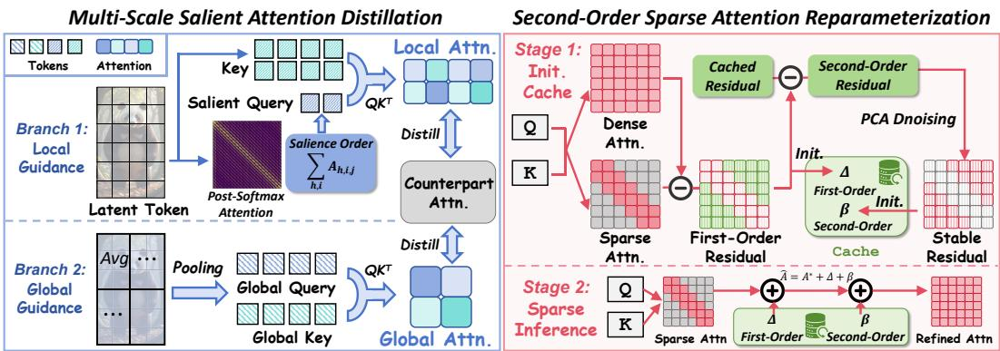
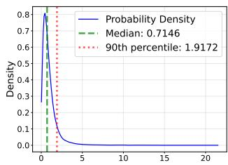
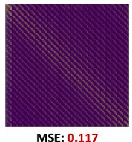
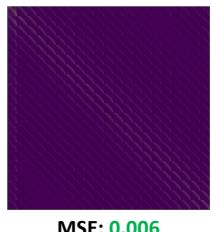
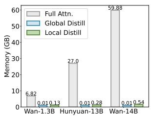
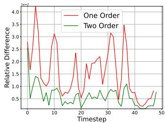
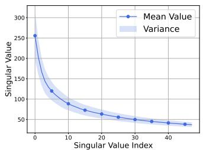
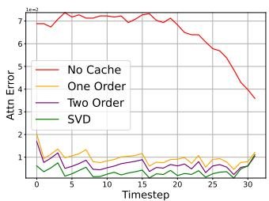
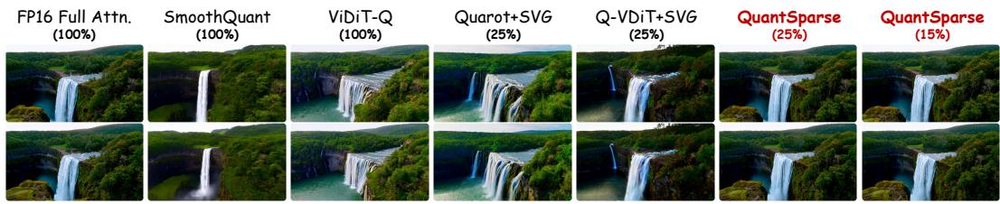

## ABSTRACT

Diffusion transformers exhibit remarkable video generation capability, yet their prohibitive computational and memory costs hinder practical deployment. Model quantization and attention sparsification are two promising directions for compression, but each alone suffers severe performance degradation under aggressive compression. Combining them promises compounded efficiency gains, but naive integration is ineffective. The sparsity-induced information loss exacerbates quantization noise, leading to amplified attention shifts. To address this, we propose QuantSparse, a unified framework that integrates model quantization with attention sparsification. Specifically, we introduce Multi-Scale Salient Attention Distillation, which leverages both global structural guidance and local salient supervision to mitigate quantization-induced bias. In addition, we develop Second-Order Sparse Attention Reparameterization, which exploits the temporal stability of second-order residuals to efficiently recover information lost under sparsity. Experiments on HunyuanVideo-13B demonstrate that QuantSparse achieves 20.88 PSNR, substantially outperforming the state-of-the-art quantization baseline Q-VDiT (16.85 PSNR), while simultaneously delivering a 3.68× reduction in storage and 1.88× acceleration in end-to-end inference. Our code will be released in https://github.com/wlfeng0509/QuantSparse.

## 1 INTRODUCTION

Recently, Diffusion Transformer (DiT) (Peebles & Xie, 2023) has attracted significant attention due to its outstanding capability in visual generation, particularly in video generation (Liu et al., 2024c; Sun et al., 2024a; HPC-AI, 2024; An et al., 2025). Despite the remarkable progress, stateof-the-art models such as Wan2.1-14B (Wan et al., 2025) still demand extraordinary computational resources: generating a single high-resolution video clip can consume more than 20GB of GPU memory and take nearly one hour of inference time. Such prohibitive memory and latency requirements fundamentally limit the deployment of diffusion-based video generation models in real-world applications, especially under resource-constrained scenarios.

Model quantization (Jacob et al., 2018; Gholami et al., 2022; Ma et al., 2023a;b) and attention sparsification (Xi et al., 2025; Yuan et al., 2024) have emerged as two promising directions for compression and acceleration. Quantization reduces memory footprint and computation by representing weights and activations in compact integer formats, while attention sparsification prunes redundant computations by removing negligible attention scores. However, pushing either technique to the extreme inevitably causes severe degradation. For instance, binary quantization (Zheng et al., 2024b;a) collapses representational capacity, while aggressive sparsification (Xi et al., 2025; Zhang et al., 2025d) discards crucial context information.

Since quantization and sparsification are fundamentally orthogonal, a natural idea is to combine them for compounded efficiency gains while maintaining complementary benefits. Ideally, such integration could approach a Pareto frontier between performance and efficiency. Yet, our empirical analysis shows that na¨ıvely combining quantization and sparsification leads to severe performance degradation. We attribute this to an amplified attention shift: while sparsification removes low-magnitude attention weights, quantization introduces systematic perturbations to the remaining attention products. These two effects reinforce each other, producing compounded distortions in attention distributions and severely impairing fine-grained dependency modeling in video generation.

To overcome this challenge, we propose QuantSparse, a unified compression framework that synergistically integrates model quantization and attention sparsification as shown in Fig. 2. QuantSparse introduces two novel techniques. First, Multi-Scale Salient Attention Distillation (MSAD). We design a memory-efficient distillation scheme that balances global and local supervision. Specifically, we employ global guidance by distilling attention patterns on downsampled token sequences to capture coarse structural topology, while local guidance focuses high-resolution supervision on a small set of salient tokens that dominate the attention distribution. Second, Second-Order Sparse Attention Reparameterization (SSAR). We exploit the temporal stability of second-order residuals to recover information lost due to sparsity. Furthermore, we introduce singular value decomposition (SVD) projection onto dominant principal components, enabling a lightweight yet accurate correction mechanism that restores fine-grained attention outputs at negligible computational overhead.

Our contributions can be summarized as follows:

1. We provide formal analysis of the amplified attention shift problem, showing that naive integration of quantization and sparsification severely damages video generation quality.

2. We propose QuantSparse, a unified compression framework that seamlessly combines model quantization and attention sparsification, breaking the traditional trade-off between efficiency and performance.

3. We introduce two key techniques: Multi-Scale Salient Attention Distillation for robust attention alignment and Second-Order Sparse Attention Reparameterization for temporally stable correction for efficient yet accurate approximation of full-attention outputs.

4. Extensive experiments on large-scale video generation models ranging from 1.3B to 14B parameters demonstrate that QuantSparse achieves superior efficiency–quality trade-offs,

  
Figure 2: Overview of proposed QuantSparse. Left: During calibration, we apply two parallel attention distillation branch for efficient and robust attention alignment. Right: During inference, we apply an accurate attention approximation using temporal stable second-order residual.  
outperforming both quantization-only and sparsification-only baselines, while preserving state-of-the-art performance.

## 2 RELATED WORKS

## 2.1 SPARSE ATTENTION IN DIFFUSION MODELS

Sparse attention has been extensively explored in transformer-based models to accelerate attention computation (Lu et al., 2025; Yuan et al., 2025; Lou et al., 2024; Gao et al., 2024; Zhang et al., 2025b). In large language models, common designs include sliding-window (Xiao et al., 2024a;b; Zhang et al., 2023) and sink-based patterns (Fu et al.; Xiao et al., 2023b). For diffusion-based visual generation, spatial window masks (Yuan et al., 2024; Zhang et al., 2025c; Ren et al., 2025) and spatial-temporal masks (Xi et al., 2025) have been proposed. Other approaches dynamically generate masks via sampling (Zhang et al., 2025b) or low-resolution attention (Zhang et al., 2025d), though at higher computational cost. However, these works mainly focus on preserving the original attention pattern, while the adaptation to other acceleration techniques that alter attention distributions, such as quantization, remains underexplored.

## 2.2 QUANTIZATION IN DIFFUSION MODELS

Quantization (Gholami et al., 2022; Chitty-Venkata et al., 2023; Pilipovic et al.´ , 2018; Ma et al., 2024b;c; Feng et al., 2025b; Ding et al., 2024; Feng et al., 2025d) reduces model precision to improve efficiency and has been applied to diffusion-based visual generation (Shang et al., 2023; Li et al., 2024b; He et al., 2024; Huang et al., 2024a; He et al., 2023; Feng et al., 2025a; Wu et al., 2024; Zheng et al., 2024a;b; Li et al., 2024a). For video generation, some works target the attention module (Zhang et al., 2024b;a; 2025a), but often keep linear operations in high precision. Other methods focus on quantizing linear layers: Q-DiT (Chen et al., 2024) uses automatic granularity allocation; ViDiT-Q (Zhao et al., 2024) adopts a static–dynamic strategy; Q-VDiT (Feng et al., 2025c) introduces temporal distillation. These methods primarily pursue acceleration via quantization, without exploring its synergy with sparse attention. In this work, we integrate the two orthogonal compression techniques to enhance the efficiency and practicality of video generation models.

## 3 METHODS

## 3.1 PRELIMINARY

## 3.1.1 POST-TRAINING QUANTIZATION (PTQ)

Model Quantization (Gholami et al., 2022; Chitty-Venkata et al., 2023) reduces weights/activations from floating-point (FP32) to low-bit integers (e.g., INT8). Given an floating-point tensor $\mathbf { X } \in \mathbb { R } ^ { d }$ with dimension d, quantization maps X to a discrete representation $\mathbf { X _ { Q } } \in \{ \breve { 0 } , \breve { 1 } , \dots , 2 ^ { b } - 1 \} ^ { d }$ as:

MSE: 0.117

MSE: 0.006

$$
\mathbf {X} _ {Q} = \operatorname{clip} \left(\left\lfloor \frac {\mathbf {X}}{s} \right\rceil + z, 0, 2 ^ {b} - 1\right), \quad Q (\mathbf {X}) = s \cdot \left(\mathbf {X} _ {Q} - z\right),\tag{1}
$$

with scale $s ,$ zero-point $z ,$ and bit-width $b , Q ( \mathbf { X } )$ denotes the de-quantized value. Post-training Quantization (PTQ) (Wei et al., 2024; Wu et al., 2024) calibrates (s, z) on a small dataset by minimizing reconstruction error:

$$
\mathcal {L} _ {\mathrm{quant}} = \min _ {s, z} \sum_ {\mathbf {X} _ {i} \in \mathcal {D} _ {\mathrm{cal}}} \| \mathbf {X} _ {i} - Q (\mathbf {X} _ {Q _ {i}}; s, z) \| _ {2} ^ {2}.\tag{2}
$$

Notably, PTQ avoids retraining the model weights, thus being computationally efficient.

## 3.1.2 SPARSE ATTENTION

Sparse attention (Zhang et al., 2025b; Xi et al., 2025; Yuan et al., 2024) prunes token pairs via a mask $\mathbf { M } \in \{ 0 , 1 \} ^ { L \times L }$ , reducing complexity from $\mathcal { O } ( L ^ { 2 } )$ to near-linear (L is the sequence length). Given $\mathbf { X } \in \mathbf { \mathbb { R } } ^ { L \times d _ { \mathrm { i n } } }$ and query, key, value projection matrices $\mathbf { W } _ { q } , \mathbf { W } _ { k } , \mathbf { W } _ { v } \ \in \ \bar { \mathbb { R } ^ { d _ { \mathrm { o u t } } \times d _ { \mathrm { i n } } } }$ , sparse attention computes:

$$
\begin{array}{c} \mathbf {Q} = \mathbf {X W} _ {q} ^ {\top}, \quad \mathbf {K} = \mathbf {X W} _ {k} ^ {\top}, \quad \mathbf {V} = \mathbf {X W} _ {v} ^ {\top}, \\ \text {SparseAttention} (\mathbf {Q}, \mathbf {K}, \mathbf {V}; \mathbf {M}) = \text {softmax} \left(\frac {\mathbf {Q K} ^ {\top}}{\sqrt {d _ {k}}} \odot \mathbf {M}\right) \mathbf {V}, \end{array}\tag{3}
$$

where ⊙ denotes element-wise multiplication.

  
(a) Token saliency distribution.

  
(b) w/o distillation.

  
(c) w distillation.

  
(d) Memory consumption.  
Figure 3: The motivation and effect of Multi-Scale Salient Attention Distillation. (a): Token saliency distribution of Wan2.1-1.3B (Wan et al., 2025) block19 head1. Only less than 10% tokens are salient. (b)(c): Visualization of attention difference between quantized model and FP model. (d): Memory consumption of different attention distillation.

## 3.2 MULTI-SCALE SALIENT ATTENTION DISTILLATION

The combination PTQ and sparse attention offers a promising route toward efficient video generation. However, naively integrating these techniques results in severe performance degradation.

Proposition 3.1. Quantization injects noise ϵ into the QK dot product $\mathbf { Q } \mathbf { K } ^ { \top }$ , yielding a systematic bias δ:

$$
\hat {\mathbf {Q}} = Q (\mathbf {X}) Q \left(\mathbf {W} _ {q}\right) ^ {\top}, \hat {\mathbf {K}} = Q (\mathbf {X}) Q \left(\mathbf {W} _ {k}\right) ^ {\top},
$$

$$
\hat {\mathbf {Q}} \hat {\mathbf {K}} ^ {\top} = \mathbf {Q} \mathbf {K} ^ {\top} + \epsilon , \quad w h e r e \quad \| \epsilon \| _ {F} \leq \delta .\tag{4}
$$

The parallel error caused by quantization and sparse attention further leads to a compounded shift:

$$
\Delta_ {\text { total }} = \Delta_ {\text { sparse }} + \Delta_ {\text { quant }} + \mathcal {O} (\| \epsilon \| _ {F} \cdot \| \mathbf {M} \| _ {0}).\tag{5}
$$

Proposition 3.1 indicates that the joint of quantization and sparse attention introduces an amplified attention shift (see Fig. 3b), resulting in notable attention degradation. A straightforward mitigation strategy is to perform attention distillation during PTQ. However, for large-scale video generation models (e.g., with $L > 1 0 ^ { 4 }$ for HunyuanVideo (Kong et al., 2024)), storing the full attention matrices is prohibitively expensive as shown in Fig. 3d, incurring $\mathcal { O } ( L ^ { 2 } )$ memory and compute overhead.

To address this, we propose Multi-Scale Salient Attention Distillation (MSAD), a memory-efficient framework that distills attention across multiple resolutions, preserving both global structure and local saliency without excessive resource consumption. MSAD employs two complementary guidance mechanisms: global guidance for high-level structural supervision, and local guidance for fine-grained detail preservation.

Global Guidance. Our approach exploits the intrinsic locality of video data: patially adjacent tokens exhibit high similarity due to temporal smoothness and spatial continuity (Ren et al., 2025; Xi et al., 2025; Yuan et al., 2024; Feng et al., 2024). To efficiently capture global attention patterns, we downsample Q and K via average pooling with stride s, producing low-resolution features $\tilde { \mathbf { Q } } , \tilde { \mathbf { K } } \in$ $\mathbb { R } ^ { \tilde { L } \times d _ { k } }$ where $\tilde { L } = L / s ^ { 2 } \ll L$ . The global distillation is computed as:

$$
\mathbf {A} _ {\text { global }} = \operatorname{softmax} \left(\frac {\tilde {\mathbf {Q}} \tilde {\mathbf {K}} ^ {\top}}{\sqrt {d _ {k}}}\right), \mathcal {L} _ {\text { global }} = \operatorname{MSE} \left(\mathbf {A} _ {\text { global }} ^ {\mathrm{FP}} \| \mathbf {A} _ {\text { global }} ^ {\text { quant }}\right),\tag{6}
$$

where MSE denotes the Mean Square Error. This approach requires only $\mathcal { O } ( \tilde { L } ^ { 2 } )$ complexity, which is $s ^ { 2 }$ times cheaper than full attention.

Local Guidance. While global guidance ensures structural fidelity, it fails to capture the fine-grained details crucial for high-quality video synthesis. We further observe that the attention saliency in video models is highly skewed: only a small subset of tokens dominates the attention mass (see Fig 3a). Formally, we define the token saliency as:

$$
\mathbf {A} = \operatorname{softmax} (\mathbf {Q K} ^ {\top} / \sqrt {d _ {k}}) \in \mathbb {R} ^ {h, L, L}, s _ {j} = \sum_ {h, i} A _ {h, i, j},\tag{7}
$$

where h denotes the attention head, i denotes the key token index, and $s _ { j }$ measures the aggregate attention received by token $j .$ Empirically, $s _ { j }$ follows a heavy-tailed distribution, with fewer tokens accounting for the majority of attention mass (we provide more analysis in Appendix Sec. F). We exploit this by selecting the top-k queries $\mathcal { T } = \{ j ^ { - } | s _ { j }$ is top-k} from the FP model and computing high-resolution attention only for these salient queries:

$$
\mathbf {A} _ {\text { local }} = \operatorname{softmax} \left(\frac {\mathbf {Q} _ {\mathcal {I} , :} \mathbf {K} ^ {\top}}{\sqrt {d _ {k}}}\right), \mathcal {L} _ {\text { local }} = \operatorname{MSE} \left(\mathbf {A} _ {\text { local }} ^ {\mathrm{FP}} \| \mathbf {A} _ {\text { local }} ^ {\text { quant }}\right),\tag{8}
$$

where $\mathbf { Q } _ { \mathcal { T } , : } \in \mathbb { R } ^ { k \times d _ { k } }$ . Local distillation focuses supervision on high-impact regions at minimal cost. Integration and Optimization. We combine both guidance terms into a unified distillation object:

$$
\mathcal {L} _ {\text { distill }} = \mathcal {L} _ {\text { quant }} + \lambda_ {\text { global }} \mathcal {L} _ {\text { global }} + \lambda_ {\text { local }} \mathcal {L} _ {\text { local }},\tag{9}
$$

where $\lambda _ { \mathrm { g l o b a l } }$ and $\lambda _ { \mathrm { l o c a l } }$ balance the two guidance component. During PTQ calibration, we optimize the quantization parameters over $\mathcal { D } _ { \mathrm { c a l } }$ to minimize ${ \mathcal { L } } _ { \mathrm { d i s t i l l } }$ , aligning the quantized attention with its FP counterpart. As shown in Fig 3b and Fig 3c, MSAD substantially reduces attention shift, enabling robust integration of quantization and sparse attention in video generation.

## 3.3 SECOND-ORDER SPARSE ATTENTION REPARAMETERIZATION

While the proposed MSAD mitigates the quantization-induced attention shift during calibration phase by aligning attention maps, the intrinsic bottleneck of sparse attention (i.e., the unavoidable discard of low-magnitude yet non-trivial attention connections) still exacerbates the amplified attention shift, especially under high sparsity rates (Xi et al., 2025; Zhang et al., 2025b). We formalize this deviation at denoising timestep t in the diffusion process as: $\Delta ^ { ( t ) } = \mathbf { A } _ { \mathrm { f u l l } } ^ { ( t ) } - \mathbf { A } _ { \mathrm { s p a r s e } } ^ { ( t ) }$ , where $\mathbf { A } _ { \mathrm { f u l l } }$ and $\mathbf { A } _ { \mathrm { s p a r s e } }$ denote the full-attention and sparse attention. We define this deviation $\Delta ^ { ( t ) }$ as the first-order residual. This residual is intrinsic to sparsity and cannot be recovered through attention

  
(a) Residual temporal difference. (b) Singular value distribution of all (c) Attention error comparison. timesteps.

Figure 4: The motivation and effect of Second-Order Sparse Attention Reparameterization. The results are from HunyuanVideo-13B (Kong et al., 2024) single transformer block.10 under W4A8. We provide more visualization and analysis in Appendix Sec. G.

distillation alone. Prior work (Yuan et al., 2024) exploits temporal coherence in video generation by assuming that residuals are invariant across timesteps:

$$
\Delta^ {(t ^ {\prime})} \approx \Delta^ {(t)} \quad \forall t, t ^ {\prime},\tag{10}
$$

Under this assumption, one can cache a reference residual $\Delta ^ { ( t _ { \mathrm { r e f } } ) }$ from a chosen timestep and reuse it across the successive timesteps, yielding afirst-order sparse attention reparameterization:

$$
\mathbf {A} _ {\text {full}} ^ {(t)} - \mathbf {A} _ {\text {sparse}} ^ {(t)} \approx \mathbf {A} _ {\text {full}} ^ {(t _ {\text {ref}})} - \mathbf {A} _ {\text {sparse}} ^ {(t _ {\text {ref}})} = \Delta^ {(t _ {\text {ref}})} \Rightarrow \hat {\mathbf {A}} ^ {(t)} = \mathbf {A} _ {\text {sparse}} ^ {(t)} + \underbrace {\Delta^ {(t _ {\text {ref}})}} _ {\text {cached}},\tag{11}
$$

Proposition 3.2. Let $\mathbf { A } _ { \mathrm { s , \ v { q } } } ^ { ( t ) }$ denote the quantized sparse attention output. The quantization-induced perturbation $\boldsymbol { \epsilon } ^ { ( t ) }$ (as defined in Eq. 4) modifies the one-order residual to:

$$
\begin{array}{c} \Delta_ {\text {quant}} ^ {(t)} = \mathbf {A} _ {\text {full}} ^ {(t)} - \mathbf {A} _ {\text {s,q}} ^ {(t)} = \Delta^ {(t)} + \epsilon^ {(t)} + \mathcal {O} (\| \epsilon^ {(t)} \| _ {F} \cdot \| \mathbf {M} \| _ {0}), \\ \Rightarrow \Delta_ {\text {quant}} ^ {(t ^ {\prime})} \neq \Delta_ {\text {quant}} ^ {(t)}, \quad \text {for} \quad t ^ {\prime} \neq t. \end{array}\tag{12}
$$

Proposition 3.2 indicates that, unlike $\Delta ^ { ( t ) } , \Delta _ { \mathrm { q u a n } 1 } ^ { ( t ) }$ varies with $\boldsymbol { \epsilon } ^ { ( t ) }$ due to the quantization noise (Wu et al., 2024; Zhao et al., 2024; He et al., 2023) which violating Eq. 10. We visualize this variance of $\Delta ^ { ( t ) } - \Delta ^ { ( t - 1 ) }$ in Fig. 4a. This temporal variance undermines the accuracy of Eq. 11, causing non-negligible attention errors when first-order reparameterization is applied after quantization.

Proposition 3.3. Although $\Delta _ { \mathrm { q u a n t } } ^ { ( t ) }$ is unstable, we observe that the second-order residual $\hat { \Delta } _ { \mathrm { q u a n t } } ^ { ( t ) } : =$ $\Delta _ { \mathrm { q u a n t } } ^ { ( t ) } - \Delta _ { \mathrm { q u a n t } } ^ { ( t - 1 ) }$ exhibits significantly higher temporal stability:

$$
\mathbb {E} _ {t} \left[ \left\| \hat {\Delta} _ {\text {quant}} ^ {(t)} - \hat {\Delta} _ {\text {quant}} ^ {(t ^ {\prime})} \right\| _ {F} \right] \leq \mathbb {E} _ {t} \left[ \left\| \Delta_ {\text {quant}} ^ {(t)} - \Delta_ {\text {quant}} ^ {(t ^ {\prime})} \right\| _ {F} \right] \quad \text {for} \quad | t - t ^ {\prime} | \leq \tau .\tag{13}
$$

We visualize the empirical analysis results in Fig. 4a. This stability arises because quantization noise $\epsilon ^ { ( t ) }$ follows a slow-varying stochastic process in diffusion process (Ma et al., 2024a; Liu et al., 2024a): adjacent timesteps share similar distributions, rendering $\epsilon ^ { ( t ) } - \epsilon ^ { ( t - 1 ) }$ approximately stationary. Leveraging this property, we propose second-order sparse attention reparameterization:

$$
\begin{array}{c} (\mathbf {A} _ {\text {full}} ^ {(t)} - \mathbf {A} _ {\text {s,q}} ^ {(t)}) - (\mathbf {A} _ {\text {full}} ^ {(t _ {\text {ref}})} - \mathbf {A} _ {\text {s,q}} ^ {(t _ {\text {ref}})}) \approx (\mathbf {A} _ {\text {full}} ^ {(t _ {\text {ref}})} - \mathbf {A} _ {\text {s,q}} ^ {(t _ {\text {ref}})}) - (\mathbf {A} _ {\text {full}} ^ {(t _ {\text {ref}} ^ {\prime})} - \mathbf {A} _ {\text {s,q}} ^ {(t _ {\text {ref}} ^ {\prime})}) = \hat {\Delta} _ {\text {quant}} ^ {(t _ {\text {ref}})}, \\ \Rightarrow \tilde {\mathbf {A}} ^ {(t)} = \mathbf {A} _ {\text {s,q}} ^ {(t)} + (\mathbf {A} _ {\text {full}} ^ {(t _ {\text {ref}})} - \mathbf {A} _ {\text {s,q}} ^ {(t _ {\text {ref}})}) + \hat {\Delta} _ {\text {quant}} ^ {(t _ {\text {ref}})}, \\ = \mathbf {A} _ {\text {s,q}} ^ {(t)} + \underbrace {\Delta_ {\text {quant}} ^ {(t _ {\text {ref}})} + \hat {\Delta} _ {\text {quant}} ^ {(t _ {\text {ref}})}} _ {\text {cached}}. \end{array}\tag{14}
$$

Table 1: Text-to-Video generation results on Wan2.1-1.3B. Density is the attention density. Full Prec. denotes Full Precision model. Bold: the best result.

<table><tr><td rowspan="3">Method</td><td rowspan="3">#Bits (W/A)</td><td rowspan="3">Density↓</td><td colspan="6">Quality</td></tr><tr><td colspan="3">Video Quality Metrics</td><td colspan="3">FP Diff. Metrics</td></tr><tr><td>CLIPSIM↑</td><td>VQA↑</td><td>ΔFSCore↓</td><td>PSNR↑</td><td>SSIM↑</td><td>LPIPS↓</td></tr><tr><td colspan="9">Wan2.1 1.3B (CFG = 6.0, 480 × 832p, frames = 80)</td></tr><tr><td>Full Prec.</td><td>16/16</td><td>100%</td><td>0.191</td><td>73.12</td><td>0.000</td><td>-</td><td>-</td><td>-</td></tr><tr><td>PTQ4DiT</td><td>6/6</td><td>100%</td><td>0.182</td><td>36.79</td><td>2.287</td><td>10.20</td><td>0.343</td><td>0.598</td></tr><tr><td>Q-DiT</td><td>6/6</td><td>100%</td><td>0.183</td><td>39.21</td><td>2.125</td><td>10.36</td><td>0.351</td><td>0.577</td></tr><tr><td>SmoothQuant</td><td>6/6</td><td>100%</td><td>0.184</td><td>40.57</td><td>2.008</td><td>10.44</td><td>0.353</td><td>0.574</td></tr><tr><td>QuaRot</td><td>6/6</td><td>100%</td><td>0.190</td><td>42.81</td><td>1.754</td><td>10.71</td><td>0.379</td><td>0.571</td></tr><tr><td>ViDiT-Q</td><td>6/6</td><td>100%</td><td>0.190</td><td>50.85</td><td>1.253</td><td>11.02</td><td>0.385</td><td>0.526</td></tr><tr><td>Q-VDiT</td><td>6/6</td><td>100%</td><td>0.191</td><td>75.20</td><td>0.982</td><td>12.06</td><td>0.405</td><td>0.474</td></tr><tr><td>QuaRot+DFT</td><td>6/6</td><td>40%</td><td>0.183</td><td>36.79</td><td>2.297</td><td>11.29</td><td>0.321</td><td>0.546</td></tr><tr><td>QuaRot+Jenga</td><td>6/6</td><td>40%</td><td>0.184</td><td>38.78</td><td>2.165</td><td>11.32</td><td>0.329</td><td>0.543</td></tr><tr><td>QuaRot+SVG</td><td>6/6</td><td>40%</td><td>0.183</td><td>41.93</td><td>1.940</td><td>11.43</td><td>0.331</td><td>0.541</td></tr><tr><td>Q-VDiT+DFT</td><td>6/6</td><td>40%</td><td>0.188</td><td>47.33</td><td>1.377</td><td>11.06</td><td>0.345</td><td>0.577</td></tr><tr><td>Q-VDiT+Jenga</td><td>6/6</td><td>40%</td><td>0.189</td><td>53.52</td><td>1.087</td><td>11.21</td><td>0.345</td><td>0.583</td></tr><tr><td>Q-VDiT+SVG</td><td>6/6</td><td>40%</td><td>0.191</td><td>55.92</td><td>0.942</td><td>11.61</td><td>0.384</td><td>0.508</td></tr><tr><td>QuantSparse</td><td>6/6</td><td>40%</td><td>0.193</td><td>78.35</td><td>0.055</td><td>15.51</td><td>0.511</td><td>0.324</td></tr><tr><td>PTQ4DiT</td><td>4/8</td><td>100%</td><td>0.181</td><td>30.26</td><td>2.574</td><td>10.00</td><td>0.318</td><td>0.603</td></tr><tr><td>Q-DiT</td><td>4/8</td><td>100%</td><td>0.182</td><td>32.57</td><td>2.767</td><td>10.11</td><td>0.320</td><td>0.594</td></tr><tr><td>SmoothQuant</td><td>4/8</td><td>100%</td><td>0.182</td><td>34.82</td><td>2.174</td><td>10.20</td><td>0.327</td><td>0.569</td></tr><tr><td>QuaRot</td><td>4/8</td><td>100%</td><td>0.185</td><td>65.15</td><td>1.870</td><td>11.72</td><td>0.349</td><td>0.514</td></tr><tr><td>ViDiT-Q</td><td>4/8</td><td>100%</td><td>0.186</td><td>63.21</td><td>1.698</td><td>11.24</td><td>0.351</td><td>0.526</td></tr><tr><td>Q-VDiT</td><td>4/8</td><td>100%</td><td>0.190</td><td>56.45</td><td>2.240</td><td>11.01</td><td>0.394</td><td>0.565</td></tr><tr><td>QuaRot+DFT</td><td>4/8</td><td>40%</td><td>0.187</td><td>32.23</td><td>2.329</td><td>10.32</td><td>0.360</td><td>0.583</td></tr><tr><td>QuaRot+Jenga</td><td>4/8</td><td>40%</td><td>0.191</td><td>32.83</td><td>2.148</td><td>10.33</td><td>0.346</td><td>0.578</td></tr><tr><td>QuaRot+SVG</td><td>4/8</td><td>40%</td><td>0.190</td><td>32.48</td><td>2.088</td><td>10.58</td><td>0.370</td><td>0.576</td></tr><tr><td>Q-VDiT+DFT</td><td>4/8</td><td>40%</td><td>0.185</td><td>45.60</td><td>2.907</td><td>10.03</td><td>0.331</td><td>0.594</td></tr><tr><td>Q-VDiT+Jenga</td><td>4/8</td><td>40%</td><td>0.185</td><td>47.61</td><td>3.000</td><td>10.04</td><td>0.334</td><td>0.596</td></tr><tr><td>Q-VDiT+SVG</td><td>4/8</td><td>40%</td><td>0.184</td><td>51.84</td><td>3.035</td><td>10.07</td><td>0.342</td><td>0.592</td></tr><tr><td>QuantSparse</td><td>4/8</td><td>40%</td><td>0.193</td><td>81.09</td><td>0.576</td><td>15.22</td><td>0.502</td><td>0.338</td></tr></table>

Theorem 3.4. When Proposition 3.3 holds, the expected approximation error of sparse attention satisfies:

$$
\mathbb {E} _ {t} \underbrace {\left[ \left\| \mathbf {A} _ {\text {full}} ^ {(t)} - \tilde {\mathbf {A}} _ {\text {s,q}} ^ {(t)} \right\| _ {F} \right]} _ {\text {second - order}} \leq \mathbb {E} _ {t} \underbrace {\left[ \left\| \mathbf {A} _ {\text {full}} ^ {(t)} - \hat {\mathbf {A}} _ {\text {s,q}} ^ {(t)} \right\| _ {F} \right]} _ {\text {first - order}} \quad \text {for} \quad | t - t ^ {\prime} | \leq \tau .\tag{15}
$$

Theorem 3.4 indicates two-order guaranteeing tighter full-attention approximation than the firstorder method. Also $\Delta _ { \mathrm { q u a n t } } ^ { ( t _ { \mathrm { r e f } } ) } + \hat { \Delta } _ { \mathrm { q u a n t } } ^ { t _ { \mathrm { r e f } } }$ in Eq. 14 can be jointly cached, without any additional storage burden compared with one-order residual. We further reduce the temporal variance of $\hat { \Delta } _ { \mathrm { q u a n t } }$ by projecting it onto its most stable subspace. Empirically, the top-r principal components from the singular value decomposition (SVD) of $\hat { \Delta } _ { \mathrm { q u a n t } }$ capture the dominant, temporally stable patterns (see Fig. 4b). Critically, the dominant principal component exhibit exceptional temporal stability, which inspired us to project residuals onto the top-r extracted stable components:

$$
\begin{array}{c} \operatorname{SVD} (\hat {\Delta} _ {\text {quant}}) = \mathbf {S U V} ^ {\top},   \tilde {\Delta} _ {\text {quant}} := \mathbf {S} _ {:,: r} \mathbf {U} _ {: r,: r} \mathbf {V} _ {:,: r} ^ {\top}, \\ \tilde {\mathbf {A}} ^ {(t)} = \mathbf {A} _ {\mathrm{s,q}} ^ {(t)} + \underbrace {\Delta_ {\text {quant}} ^ {(t _ {\text {ref}})} + \tilde {\Delta} _ {\text {quant}} ^ {t _ {\text {ref}}}} _ {\text {cached}}. \end{array}\tag{16}
$$

We apply the sparse attention for inference with a fixed cache-refreshing interval (5 in experiments) for full-attention calculation. As visualized in Fig. 4c, SVD-based second-order reparameterization further suppresses temporal variance, yielding accurate full-attention approximation results.

Table 2: Video generation on large video generation models. Bold: the best result. Underline: the second best result.

<table><tr><td rowspan="3">Method</td><td rowspan="3">#Bits (W/A)</td><td rowspan="3">Density↓</td><td colspan="6">Quality</td><td colspan="2">Latency &amp; Speed</td></tr><tr><td colspan="3">Video Quality Metrics</td><td colspan="3">FP Diff. Metrics</td><td rowspan="2">DiT Time↓</td><td rowspan="2">Speedup↑</td></tr><tr><td>CLIPSIM↑</td><td>VQA↑</td><td>ΔFSCore↓</td><td>PSNR↑</td><td>SSIM↑</td><td>LPIPS↓</td></tr><tr><td colspan="11">HunyuanVideo 13B (CFG = 6.0, 720 × 1280p, frames = 60)</td></tr><tr><td>Full Prec.</td><td>16/16</td><td>100%</td><td>0.184</td><td>81.23</td><td>0.000</td><td>-</td><td>-</td><td>-</td><td>1264s</td><td>1.00×</td></tr><tr><td>SmoothQuant</td><td>4/8</td><td>100%</td><td>0.178</td><td>42.21</td><td>1.194</td><td>15.44</td><td>0.479</td><td>0.583</td><td>1149s</td><td>1.10×</td></tr><tr><td>QuaRot</td><td>4/8</td><td>100%</td><td>0.180</td><td>42.89</td><td>0.708</td><td>15.46</td><td>0.502</td><td>0.528</td><td>1149s</td><td>1.10×</td></tr><tr><td>ViDiT-Q</td><td>4/8</td><td>100%</td><td>0.181</td><td>49.82</td><td>1.254</td><td>15.75</td><td>0.534</td><td>0.489</td><td>1149s</td><td>1.10×</td></tr><tr><td>Q-VDiT</td><td>4/8</td><td>100%</td><td>0.182</td><td>67.95</td><td>1.168</td><td>16.85</td><td>0.605</td><td>0.461</td><td>1155s</td><td>1.09×</td></tr><tr><td>QuaRot+SVG</td><td>4/8</td><td>25%</td><td>0.181</td><td>43.34</td><td>0.900</td><td>15.39</td><td>0.497</td><td>0.530</td><td>731s</td><td>1.73×</td></tr><tr><td>Q-VDiT+SVG</td><td>4/8</td><td>25%</td><td>0.182</td><td>70.99</td><td>1.379</td><td>16.71</td><td>0.595</td><td>0.458</td><td>743s</td><td>1.70×</td></tr><tr><td>QuaRot+SVG</td><td>4/8</td><td>15%</td><td>0.181</td><td>41.40</td><td>1.004</td><td>15.34</td><td>0.494</td><td>0.536</td><td>671s</td><td>1.88×</td></tr><tr><td>Q-VDiT+SVG</td><td>4/8</td><td>15%</td><td>0.182</td><td>76.30</td><td>1.393</td><td>16.66</td><td>0.591</td><td>0.460</td><td>687s</td><td>1.84×</td></tr><tr><td>QuantSparse</td><td>4/8</td><td>25%</td><td>0.183</td><td>79.05</td><td>0.014</td><td>20.86</td><td>0.675</td><td>0.272</td><td>731s</td><td>1.73×</td></tr><tr><td>QuantSparse</td><td>4/8</td><td>15%</td><td>0.184</td><td>81.19</td><td>0.016</td><td>20.88</td><td>0.678</td><td>0.273</td><td>671s</td><td>1.88×</td></tr><tr><td colspan="11">Wan2.1 14B (CFG = 5.0, 720 × 1280p, frames = 80)</td></tr><tr><td>Full Prec.</td><td>16/16</td><td>100%</td><td>0.182</td><td>90.79</td><td>0.000</td><td>-</td><td>-</td><td>-</td><td>4031s</td><td>1.00×</td></tr><tr><td>SmoothQuant</td><td>4/8</td><td>100%</td><td>0.180</td><td>73.11</td><td>0.875</td><td>13.70</td><td>0.423</td><td>0.510</td><td>3425s</td><td>1.18×</td></tr><tr><td>QuaRot</td><td>4/8</td><td>100%</td><td>0.182</td><td>85.91</td><td>0.753</td><td>13.79</td><td>0.431</td><td>0.494</td><td>3425s</td><td>1.18×</td></tr><tr><td>ViDiT-Q</td><td>4/8</td><td>100%</td><td>0.182</td><td>83.13</td><td>0.496</td><td>15.12</td><td>0.487</td><td>0.425</td><td>3425s</td><td>1.18×</td></tr><tr><td>Q-VDiT</td><td>4/8</td><td>100%</td><td>0.182</td><td>83.76</td><td>0.343</td><td>15.85</td><td>0.512</td><td>0.398</td><td>3457s</td><td>1.17×</td></tr><tr><td>QuaRot+SVG</td><td>4/8</td><td>25%</td><td>0.182</td><td>85.66</td><td>0.134</td><td>13.70</td><td>0.427</td><td>0.487</td><td>2594s</td><td>1.55×</td></tr><tr><td>Q-VDiT+SVG</td><td>4/8</td><td>25%</td><td>0.182</td><td>87.89</td><td>0.310</td><td>15.48</td><td>0.507</td><td>0.409</td><td>2635s</td><td>1.53×</td></tr><tr><td>QuaRot+SVG</td><td>4/8</td><td>15%</td><td>0.182</td><td>81.93</td><td>0.152</td><td>13.40</td><td>0.415</td><td>0.494</td><td>2315s</td><td>1.74×</td></tr><tr><td>Q-VDiT+SVG</td><td>4/8</td><td>15%</td><td>0.181</td><td>82.31</td><td>0.411</td><td>15.18</td><td>0.493</td><td>0.429</td><td>2372s</td><td>1.70×</td></tr><tr><td>QuantSparse</td><td>4/8</td><td>25%</td><td>0.183</td><td>91.98</td><td>0.056</td><td>18.72</td><td>0.630</td><td>0.240</td><td>2594s</td><td>1.55×</td></tr><tr><td>QuantSparse</td><td>4/8</td><td>15%</td><td>0.182</td><td>90.73</td><td>0.042</td><td>18.22</td><td>0.605</td><td>0.272</td><td>2315s</td><td>1.74×</td></tr></table>

## 3.4 OVERALL PIPELINE

Our proposed QuantSparse framework consists of two component as shown in Fig. 2: MSAD for attention distillation during calibration and SSAR for dynamic attention reparameterization during inference. The detailed overall pipeline is provided in Appendix Algorithm 1.

## 4 EXPERIMENTS

## 4.1 EXPERIMENTAL AND EVALUATION SETTINGS

Evaluation Settings. We apply QuantSparse to HunyuanVideo-13B (Kong et al., 2024), Wan2.1- 1.3B and 14B (Wan et al., 2025) with 50 sampling steps. We employ two types of metrics: (1) Multi-aspects metrics evaluation: including CLIPSIM (Wu et al., 2021), VQA (Wu et al., 2023), FlowScore (Liu et al., 2024b), PSNR, SSIM, and LPIPS (Zhang et al., 2018). All metrics are evaluated on the prompt sets used in (Zhao et al., 2024; Feng et al., 2025c) (2) Benchmark evaluation: We select 8 major dimensions from Vbench (Huang et al., 2024b) following prior works (Zhao et al., 2024; Chen et al., 2024; Feng et al., 2025c). For bit setting, we use W6A6 and W4A8 following prior work (Zhao et al., 2024; Chen et al., 2024; Wu et al., 2024), since they can bring more compression effects and ensure the performance.

Baseline Methods. We select PTQ4DiT (Wu et al., 2024), Q-DiT (Chen et al., 2024), ViDiT-Q (Zhao et al., 2024), and Q-VDiT (Feng et al., 2025c) for diffusion baseline. We also compare with strong LLM baseline SmoothQuant (Xiao et al., 2023a) and QuaRot (Ashkboos et al., 2024). For sparsification, we compare with DiTFastAttn (DFT) (Yuan et al., 2024) (cache-based), Jenga (Zhang et al., 2025d) (dynamic pattern), and SparseVideoGen (SVG) (Xi et al., 2025) (static pattern).

Implementation Detail. Same with prior works (Zhao et al., 2024; Ashkboos et al., 2024; Feng et al., 2025c), we adopt channel-wise weight quantization and dynamic token-wise activation quantization. We follow block-wise post-training strategy used in (Wu et al., 2024; Chen et al., 2024; Sun et al., 2024b) for calibration. More details can be found in Appendix C.

## 4.2 MAIN RESULTS

We present multi-aspects metrics evaluation results on HunyuanVideo (Kong et al., 2024) and Wan2.1-14B (Wan et al., 2025) in Tab. 2. It can be seen that the existing SOTA quantization methods have a significant performance degradation after applying sparse attention. But QuantSparse still maintains high generation performance even at high sparsity. It is worth mentioning that QuantSparse even surpasses the existing quantization-only methods under the low-bit settings of W6A6 and W4A8.

Table 3: Ablation results of each component.

<table><tr><td>Method</td><td>VQA↑</td><td>PSNR↑</td><td>SSIM↑</td><td>LPIPS↓</td></tr><tr><td colspan="5">Distillation Analysis</td></tr><tr><td>None</td><td>81.92</td><td>14.35</td><td>0.486</td><td>0.425</td></tr><tr><td>Global</td><td>85.26</td><td>16.01</td><td>0.547</td><td>0.349</td></tr><tr><td>Local</td><td>86.95</td><td>16.82</td><td>0.561</td><td>0.325</td></tr><tr><td>MSAD</td><td> $91.98^{+10.06}$ </td><td> $18.72^{+4.37}$ </td><td> $0.630^{+0.144}$ </td><td> $0.240^{-0.185}$ </td></tr><tr><td colspan="5">Cache Analysis</td></tr><tr><td>None</td><td>68.00</td><td>14.16</td><td>0.470</td><td>0.445</td></tr><tr><td>First</td><td>70.82</td><td>17.08</td><td>0.572</td><td>0.285</td></tr><tr><td>Second</td><td>89.73</td><td>18.68</td><td>0.616</td><td>0.258</td></tr><tr><td>SSAR</td><td> $91.98^{+23.98}$ </td><td> $18.72^{+4.56}$ </td><td> $0.630^{+0.160}$ </td><td> $0.240^{-0.205}$ </td></tr></table>

Compared with the Full-Precision (FP) model, QuantSparse even maintains almost lossless performance. For example, for HunyuanVideo under W6A6, QuantSparse achieved a VQA score of 82.26 with only 15% attention density, far exceeding current SOTA method Q-VDiT (Feng et al., 2025c) of 73.68, and even surpassing the FP model of 81.23. We present more baseline methods comparison in Appendix Sec. D, and comprehensive VBench evaluation results in Appendix Sec. E. We also observed that QuantSparse slightly outperforms Full Precision model on certain metrics. This slight outperformance of QuantSparse can be attributed to its focus on task-critical tokens and reduced attention to noisy or irrelevant tokens, as shown in our saliency analysis. Additionally, the SSAR module stabilizes sparse attention, reducing quantization noise and improving temporal consistency. These effects, combined with targeted compression, allow QuantSparse to maintain near-lossless quality while offering substantial compression and acceleration. We also visualized the generated videos in Fig. 5. Compared with FP model, QuantSparse achieves almost lossless generation performance while other methods have notable quality degradation. We provide more visual comparison results in Appendix Sec. M.

  
Figure 5: Visual comparison on Wan2.1-14B under W4A8 quantization setting. We uniformly sample two frames for visualization. ‘(xx%)’ denotes the attention density.

## 4.3 ABLATION STUDY

We conduct ablation study on proposed Multi-Scale Salient Attention Distillation (MSAD) and Second-Order Sparse Attention Reparameterization (SSAR) on Wan2.1-14B under W4A8 in Tab. 3.

Effect of attention distillation. Compared with no distillation, both proposed attention guidance can enhance the model performance. The combined MSAD further improves PSNR from 14.35 to 18.72, demonstrating the effect of attention distillation.

Effect of attention reparameterization. Compared with naive sparse attention, first-order residual can reduce the attention error, demonstrating the effectiveness of attention reparameterization. Our proposed SSAR achieves the best approximation performance by reducing both the quantizationinduced error and temporal variance.

Effect of cache-interval. We also supplement the ablation and the results are shown in Tab. 5. While shorter intervals yield higher PSNR and SSIM, indicating better performance, they also result in a reduced speedup (1.65× and 1.69× respectively). For instance, interval=3 achieves the highest PSNR (18.86) but sacrifices a noticeable amount of the potential speedup (9%). Longer intervals increasing the interval to 6 provides a slightly higher speedup (1.76×). However, this comes at the cost of a degradation in performance (PSNR drops to 17.72). We choose interval=5 is based on its optimal balance between model performance and inference speedup. But we highlight that this

Table 4: Detailed efficiency comparison.

<table><tr><td rowspan="2">Method</td><td rowspan="2">#Bits (W/A)</td><td rowspan="2">Density↓</td><td colspan="2">Model Overload</td><td colspan="2">Latency &amp; Speed</td></tr><tr><td>Model Storage↓</td><td>Memory Consumption↓</td><td>DiT Time↓</td><td>Speedup↑</td></tr><tr><td colspan="7">HunyuanVideo 13B (CFG = 6.0, 720 × 1280p, frames = 60)</td></tr><tr><td>Full Prec.</td><td>16/16</td><td>100%</td><td>23.88GB</td><td>35.79GB</td><td>1264s</td><td>1.00×</td></tr><tr><td>QuaRot</td><td>4/8</td><td>100%</td><td>6.49GB</td><td>24.34GB</td><td>1149s</td><td>1.10×</td></tr><tr><td>Q-VDiT</td><td>4/8</td><td>100%</td><td>6.50GB</td><td>24.89GB</td><td>1155s</td><td>1.09×</td></tr><tr><td>DFT</td><td>16/16</td><td>25%</td><td>23.88GB</td><td>40.11GB</td><td>792s</td><td>1.60×</td></tr><tr><td>Jenga</td><td>16/16</td><td>25%</td><td>23.88GB</td><td>36.92GB</td><td>846s</td><td>1.49×</td></tr><tr><td>SVG</td><td>16/16</td><td>25%</td><td>23.88GB</td><td>40.10GB</td><td>786s</td><td>1.61×</td></tr><tr><td>SVG</td><td>16/16</td><td>15%</td><td>23.88GB</td><td>40.10GB</td><td>707s</td><td>1.79×</td></tr><tr><td>QuantSparse</td><td>4/8</td><td>25%</td><td>6.49GB↓3.68×</td><td>27.02GB↓1.32×</td><td>731s</td><td>1.73×</td></tr><tr><td>QuantSparse</td><td>4/8</td><td>15%</td><td>6.49GB↓3.68×</td><td>27.02GB↓1.32×</td><td>671s</td><td>1.88×</td></tr><tr><td colspan="7">Wan2.1 14B (CFG = 5.0, 720 × 1280p, frames = 80)</td></tr><tr><td>Full Prec.</td><td>16/16</td><td>100%</td><td>26.61GB</td><td>42.48GB</td><td>4031s</td><td>1.00×</td></tr><tr><td>QuaRot</td><td>4/8</td><td>100%</td><td>7.00GB</td><td>26.04GB</td><td>3425s</td><td>1.18×</td></tr><tr><td>Q-VDiT</td><td>4/8</td><td>100%</td><td>7.02GB</td><td>26.73GB</td><td>3457s</td><td>1.17×</td></tr><tr><td>DFT</td><td>16/16</td><td>25%</td><td>26.61GB</td><td>44.86GB</td><td>3015s</td><td>1.34×</td></tr><tr><td>Jenga</td><td>16/16</td><td>25%</td><td>26.61GB</td><td>42.62GB</td><td>3087s</td><td>1.31×</td></tr><tr><td>SVG</td><td>16/16</td><td>25%</td><td>26.61GB</td><td>44.07GB</td><td>2987s</td><td>1.35×</td></tr><tr><td>SVG</td><td>16/16</td><td>15%</td><td>26.61GB</td><td>44.07GB</td><td>2661s</td><td>1.51×</td></tr><tr><td>QuantSparse</td><td>4/8</td><td>25%</td><td>7.00GB↓3.80×</td><td>28.14GB↓1.51×</td><td>2594s</td><td>1.55×</td></tr><tr><td>QuantSparse</td><td>4/8</td><td>15%</td><td>7.00GB↓3.80×</td><td>28.14GB↓1.51×</td><td>2315s</td><td>1.74×</td></tr></table>

is a trade-off based on computational resource and all interval settings offer reasonable results and notable acceleration.

More ablation study about pooling stride $s ,$ salient token $k ,$ weight factor $\lambda ,$ and SVD rank r in Eq. 9 and Eq. 16 in Appendix Sec. H.

## 4.4 EFFICIENCY ANALYSIS

We present the deployment efficiency in Tab. 4. All the experiments are conducted on a single NVIDIA A800 80G GPU with CUDA 12.4. We use CUTLASS (Thakkar et al., 2023) on top of PyTorch for performing INT matrix multiplication. Existing quantization methods can bring higher model compression, but the effect of inference acceleration is limited. Sparse attention brings significant acceleration, but has almost no model compression, and even brings more memory consumption. QuantSparse combines the advantages of both quantization and sparse attention, bringing significant model compression and acceleration. For Wan2.1-14B (Wan

Table 5: Ablation study of cache-fresh interval and attention density on W4A8 Wan2.1-14B.

<table><tr><td>-</td><td>PSNR↑</td><td>SSIM↑</td><td>LPIPS↓</td><td>Speedup↑</td></tr><tr><td colspan="5">Interval Analysis</td></tr><tr><td>Interval=3</td><td>18.86</td><td>0.631</td><td>0.243</td><td>1.65×</td></tr><tr><td>Interval=4</td><td>18.48</td><td>0.617</td><td>0.260</td><td>1.69×</td></tr><tr><td>Interval=5</td><td>18.22</td><td>0.605</td><td>0.272</td><td>1.74×</td></tr><tr><td>Interval=6</td><td>17.72</td><td>0.566</td><td>0.321</td><td>1.76×</td></tr><tr><td colspan="5">Density Analysis</td></tr><tr><td>Density=25%</td><td>18.72</td><td>0.630</td><td>0.240</td><td>1.55×</td></tr><tr><td>Density=20%</td><td>18.45</td><td>0.622</td><td>0.252</td><td>1.63×</td></tr><tr><td>Density=15%</td><td>18.22</td><td>0.605</td><td>0.272</td><td>1.74×</td></tr><tr><td>Density=10%</td><td>17.73</td><td>0.589</td><td>0.288</td><td>1.80×</td></tr></table>

et al., 2025), QuantSparse (15% density) brings 3.80× storage compression, 1.51× memory saving, and 1.74× end-to-end acceleration. We further report the calibration resource consumption in Appendix Sec. I and report the performance combined with other acceleration methods in Appendix Sec. J.

## 5 CONCLUSION

In this paper, we propose QuantSparse, a unified compression framework that effectively combines model quantization and sparse attention. To address the amplified attention shift, we propose Multi-Scale Salient Attention Distillation to efficiently align the attention shift. To address the intrinsic sparsity loss, we propose Second-Order Sparse Attention Reparameterization to utilize decomposed second-order residual for attention approximation. Extensive experiments shown that QuantSparse achieves lossless performance while bringing significant model compression and acceleration.