## ABSTRACT

Large Language Models (LLMs) have seen remarkable advancements, achieving state-of-the-art results in diverse applications. Fine-tuning, an important step for adapting LLMs to specific downstream tasks, typically involves further training on corresponding datasets. However, a fundamental discrepancy exists between current fine-tuning datasets and the token-level optimization mechanism of LLMs: most datasets are designed at the sentence-level, which introduces token-level noise, causing negative influence to final performance. In this paper, we propose XTF, an explainable token-level noisefiltering framework. XTF decomposes the complex and subtle contributions of token-level data to the fine-tuning process into three distinct and explicit attributes (reasoning importance, knowledge novelty, and task relevance), which can be assessed using scoring methods, and then masks the gradients of selected noisy tokens accordingly to optimize the performance of fine-tuned LLMs. We conduct extensive experiments on three representative downstream tasks (math, code and medicine) across 7 mainstream LLMs. The results demonstrate that XTF can significantly improve downstream performance by up to 13.7% compared to regular fine-tuning. Our work highlights the importance of token-level dataset optimization, and demonstrates the potential of strategies based on attribute decomposition for explaining complex training mechanisms.

## 1 INTRODUCTION

LLM technology An et al. (2024); Nam et al. (2024); Kambhampati et al. (2024) has developed rapidly in recent years, possessing powerful reasoning capabilities and enabling widespread application across various downstream tasks Thirunavukarasu et al. (2023b); Wen et al. (2024); Guo et al. (2024). Meanwhile, to enhance the performance of LLMs in specific downstream tasks, developers usually train the base models, i.e., general purpose LLM such as Llama Touvron et al. (2023) and Deepseek Guo et al. (2025), using relevant datasets, making adjustments to the model parameters. This technique, known as fine-tuning, is widely used in practical applications Wang et al. (2022); Lin et al. (2024a).

However, existing fine-tuning datasets do not align fully with the token-by-token optimization process of LLMs. While LLM fine-tuning involves computing a loss at each token and updating model parameters accordingly, most fine-tuning datasets are designed at the sentence level, providing label sentences as the target output. Since not all tokens (in the label sentence) are valuable for performance improvement Lin et al. (2024b); Peng et al. (2023), training in the entire label sentence can possibly introduce token-level noise and misguide the direction of convergence, ultimately reducing performance of fine-tuned LLMs in the target downstream task.

Current research lacks the capability to optimize datasets at the token level for LLM fine-tuning tasks. Mainstream data optimization methods fall into two categories: data filtering Li et al. (2019); Goyal et al. (2024) and data augmentation Dai et al. (2025); Ding et al. (2024). All of these approaches operate at the sample level and thus fail to further eliminate token-level noise. Some existing studies have explored the differences between token-level and sentence-level data from various perspectives, such as pretraining Lin et al. (2024b), human preference optimization Zeng et al. (2024); Yoon et al. (2024), and knowledge distillation Wei et al. (2024); Cui et al. (2025). However, these works are often limited to specific scenarios (e.g., pretraining with lower data quality requirements or direct preference optimization (DPO) Rafailov et al. (2023) that relies on prior knowledge of labeled text pairs) or do not sufficiently investigate the value differences between tokens (e.g., as in some knowledge distillation approaches Peng et al. (2023); Cui et al. (2025)), rendering them unsuitable for fine-tuning dataset optimization.

Achieving token-level dataset optimization for fine-tuning necessitates filtering out tokens in output labels that do not contribute to final performance, which is a non-trivial task. Firstly, no existing research clearly elucidates the relationship between individual tokens within these labels and finetuning effectiveness. Although some explainability studies can identify connections between tokens in the input content and the correct generation of label sentences during the reasoning process Chu et al. (2024); Zhao et al. (2024), they cannot explain the value of specific tokens in label sentences for fine-tuning tasks. Secondly, fine-tuning performance depends on both the base model’s pre-existing knowledge and the specifics of the target task. When filtering noisy tokens, it is essential to consider both the base model’s understanding of the data and that data’s relevance to the downstream task Liu et al. (2022b); Han et al. (2024). Therefore, filtering noisy tokens from fine-tuning datasets requires a comprehensive consideration of fine-tuning task requirements, rather than reliance on a single assessment criterion.

Motivated by the preceding discussion, we propose an explainable token-level data filtering method XTF. This method aims to assess the value of token-level data within fine-tuning datasets and filter out noisy tokens by considering the specific characteristics of LLM fine-tuning. XTF consists of three phases. In the first phase, we decompose the contribution of data to the fine-tuning effect into three attributes (reasoning importance, knowledge novelty, and task relevance) to reduce the complexity of token value analysis. Concurrently, we define the criteria for identifying noisy tokens based on these attributes and provide theoretical justification in Appendix A. In the second phase, while considering the two key factors essential to fine-tuning: base model and task dataset, we design scoring mechanisms for the three attributes with controllable computational costs: 1) Reasoning Importance: We concatenate the input and label output, then compute attention scores for each token using the base model. A lower attention score indicates a lower reasoning importance. 2) Knowledge Novelty: We introduce the probability of correct token prediction (PCP) to quantify the novelty of knowledge learned from the fine-tuning dataset. A higher PCP indicates lower knowledge novelty. 3) Task Relevance: We assess task relevance using embedding vectors generated by the base model for context-free inputs. The task domain is approximated by the average embedding of data samples, and token relevance scores are determined by their distance from the domain center. A larger distance implies lower task relevance. We present detailed scoring procedures in Section 3.2. In the third phase, we identify noisy tokens based on the statistical results and mask the gradients associated with these tokens during training to enhance the performance of the fine-tuned LLM. We adopt a conservative strategy to ensure the filtered tokens align with the criteria established in the first phase.

We conduct extensive experiments on datasets across 3 different downstream tasks and 7 representative LLMs. As shown in Figure 1, XTF can achieve up to 13.3% and 13.7% accuracy optimization on math task and medicine task, respectively, demonstrating its effectiveness on noise filtering and fine-tuning enhancement. In code generation, our method achieves performance optimization of up to 5.6%, 5.6%, and 6.3% on pass@1, pass@5, and pass@10, respectively, demonstrating that XTF is also effective in complex tasks involving multi-chance generation.

Our main contributions are three-fold:

• We reveal the research gap of token-level data optimization for LLM fine-tuning.

• We explore solutions for filtering token-level noise in fine-tuning datasets via three decomposed attributes: reasoning importance, knowledge novelty, and task relevance, proposing XTF.

• We conduct extensive experiments of XTF across multiple representative LLMs and downstream tasks, verifying its superior performance on fine-tuning optimization, demonstrates the potential of strategies based on attribute decomposition for explaining complex training mechanisms.

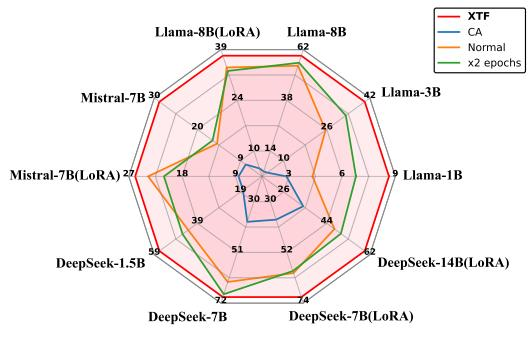  
(a) Math task

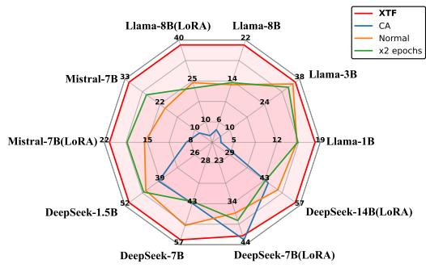  
(b) Medicine task  
Figure 1: The accuracy performance of our method on different LLMs. The results show that our method can significantly improve the final performance of fine-tuned LLMs across almost every case.

## 2 BACKGROUND AND RELATED WORK

## 2.1 LARGE LANGUAGE MODELS FINE-TUNING

Fine-tuning large models is widely recognized as a key technique to enhance their performance on downstream tasks Wang et al. (2022); Han et al. (2024); Lin et al. (2024a). Numerous task-oriented models have been developed by fine-tuning high-performance base models, such as Llama-Math Muñoz et al. (2024) and Llama-Finance Cheng et al. (2024). The quality of the fine-tuning dataset is a critical factor that determines the effectiveness of this process Zhou et al. (2023); Kuramoto & Suzuki (2025). Therefore, optimizing data is essential for enhancing fine-tuning outcomes.

## 2.2 EXPLAINABILITY FOR LLMS

Explainability methods for LLMs aim to explain the decision-making mechanisms and behavioral logic of these models Zhao et al. (2024); Chu et al. (2024). However, current techniques predominantly focus on the reasoning process Huang et al. (2023); Kang et al. (2024); Singh et al. (2024), while research of explaining the relationship between tokens and fine-tuning outcomes remains limited.

## 2.3 TOKEN-LEVEL TRAINING

Several pioneering works have explored token-level data refinement in training, broadly categorized into three domains: data distillation, direct model training, and human preference training. Data distillation approaches Wei et al. (2024); Cui et al. (2025); Liu et al. (2022a) primarily focus on the performance differences observed when a student model learns from token-level outputs (i.e., logits) versus sentence-level outputs, rather than specifically differentiating the value among individual tokens. Direct model training, including studies on training small-scale transformer models Peng et al. (2023) and LLM pretraining Lin et al. (2024b), utilizes changes in loss values to guide the selection of valuable tokens. We observe that these methods operate under an implicit assumption: that high-quality datasets are entirely noise-free and thus capable of correctly guiding token selection. This assumption rarely holds true in fine-tuning tasks, as base models often already exhibit strong performance, making it challenging to optimize dataset quality sufficiently to satisfy this noise-free criterion. Furthermore, existing works Peng et al. (2023); Lin et al. (2024b) do not demonstrate that high-quality datasets are, in fact, approximately devoid of noisy tokens, which is a critical premise for these methods. Human preference training often involves specific optimization frameworks that rely on prior knowledge of labeled text pairs Zeng et al. (2024); Xia et al. (2024); Yoon et al. (2024) and the construction of specialized token-level reward models; however, this approach can be challenging to generalize to broader application scenarios.

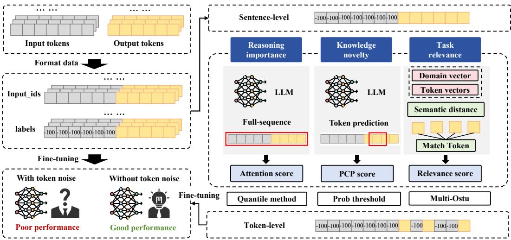  
Figure 2: The pipeline of token-level data filtering comprises three steps. In the first step, we preprocess the dataset based on a regular format function. In the second phase, we get the sentencelevel data item and assess three scores, i.e., attention score, PCP score and relevance score, for the tokens of output label, suggesting the selection of noisy tokens. In the third phase, we mask the noisy tokens and fine-tune the target LLM.

## 3 METHODOLOGY

## 3.1 WHICH DATA ACTS AS NOISE FOR FINE-TUNING?

Due to scale differences, it is inherently difficult to intuitively assess the impact of token-level data on the final fine-tuning outcome. Therefore, we attempt to explain the contribution of token data to fine-tuning from three attributions through theoretical analysis.

A fine-tuning process can be conceptualized as an alignment between a high-performance base model and a task-specific dataset. Consequently, the performance of the fine-tuned model should be influenced by three factors: the cognition of the base model, the knowledge in the task dataset, and the contradiction between the base model and the task dataset. When we aim to mask a token from the label sentence, we can assess its potential impact on the fine-tuning result from these three perspectives. Specifically, we propose three attributes that positively influence the fine-tuning process: for the cognition of the base model, we extract reasoning importance; for the discrepancy between the base model and the task dataset, we extract knowledge novelty; and for the knowledge in the task dataset, we extract task relevance. These attributes represent the following meanings:

Reasoning Importance (RI): whether the presence or absence of this token significantly affects the base model’s inference results;

Knowledge Novelty (KN): whether the presence of this token is novel to the base model;

Task Relevance (TR): whether the presence of this token is related to the objective of the task dataset.

It is not feasible to consider all three properties simultaneously and assign a composite score, as there is no clear basis to determine their interrelationship or any hierarchical order. However, we can still use these three properties to identify which tokens are noise. Specifically, we find that if a token completely lacks any of the three attributes, it can be considered as noise. This is intuitive; for example, if a token is entirely unrelated to the task objective (lacking the TR attribute), then even if it may influence the base model’s subsequent generation results (RI) or represent a prediction that the base model has not yet learned (KN), it does not contribute to the fine-tuning task. We elaborate on the analysis of the three derived attributes and formally prove the correctness of this judgment through logical reasoning in the Appendix A.

Formally, the token-level noise in the fine-tuning tasks can be represented as:

$$
D _ {\text { noise }} = \left(D _ {R I \downarrow}\right) \cup \left(D _ {K N \downarrow}\right) \cup \left(D _ {T R} \downarrow\right)\tag{1}
$$

where $( D _ { R I \downarrow } ) , ( D _ { K N \downarrow } )$ and $( D _ { T R \downarrow } )$ respectively represent data lacking reasoning importance, knowledge novelty, and task relevance.

## 3.2 HOW TO ASSESS TOKENS?

After obtaining the three attributes and defining noise data, we employ a parameterized scoring mechanism to separately assess the three attributes and to identify noise tokens in the dataset. In alignment with real-world requirements, the choice of scoring method is expected to meet two requirements: 1) Controllable computational cost: Since the dataset contains a vast number of tokens, the assessment method should not impose excessive computational overhead. 2) Joint consideration of the base model and the data: The assessment of the three attributes must not be separated from the essential elements of the fine-tuning task itself. Consequently, we adopt three reasoning-level explainability methods to assess the three attributes separately.

Attention Score for RI. We employ the base model’s attention scores to assess reasoning importance. Attention is a mechanism that adaptively learns the contextual importance of tokens during the pretraining of the base model Vaswani et al. (2017). Existing work has demonstrated that masking low-attention tokens during the LLM reasoning process can even enhance generation quality Gupta et al. (2021). Therefore, using attention scores to assess reasoning importance aligns with our needs. We input the entire text (including both the input sentence and the output label sentence) into the model and compute the attention scores. We formulate the reasoning importance score $S _ { \mathrm { R I } }$ for the k-th token in the output label sentence as:

$$
\mathcal {S} _ {\mathrm{RI}} (O _ {k}) = \mathcal {A} (\theta , I + O) [ l _ {I} + k ],\tag{2}
$$

where θ denotes the parameters of base model, A is the function to compute attention value, $I , O$ represents the input tokens and output label respectively, and $l _ { I }$ is the length of input tokens. This approach can be applied to explain the tokens in the output label and considers the base model’s understanding of the data throughout the answer generation logic.

PCP Score for KN. For knowledge novelty, we adopt the base model’s probability of correct token prediction (PCP). Intuitively, a lower probability indicates reduced confidence in predicting the token, suggesting that it is more likely to contain knowledge that the model has not yet acquired. We formulate the knowledge novelty score $S _ { \mathrm { K N } }$ as:

$$
\mathcal {S} _ {\mathrm{KN}} (O _ {k}) = 1 - P \left(O _ {k} \mid I + [ O _ {0}, O _ {1}, \dots , O _ {k - 1} ]\right).\tag{3}
$$

Distance Score for TR. For relevance scoring, we calculate semantic distance based on the base model’s embedding layer. First, we feed each data item from the dataset into the base model in its entirety and obtain the average value of the embedding layer vectors as the domain vector for the fine-tuning task. Then, we collect all tokens appearing in the dataset and compute their context-free embedding vectors. Finally, we measure the distance between these token vectors and the domain vector, using this distance as the relevance score. The specific formulas for the task relevance scores are as follows:

$$
\begin{array}{c} \mathcal {V} (\text {Domain}) = \frac {\sum \left(\mathcal {E} (\theta , e x p _ {w})\right)}{n _ {w}}, \\ \mathcal {S} _ {\mathrm{TR}} (O _ {k}) = 1 - \text {Normalize} \left(\mathcal {D} \left(\mathcal {E} (O _ {k}), \mathcal {V} (\text {Domain}))\right), \right. \end{array}\tag{4}
$$

where $\mathcal { E }$ denotes the function to get the embedding vector of inputs, $e x p _ { w }$ and $n _ { w }$ represents the expert words and its number, respectively. D is the function to compute the distance of two vector.

## 3.3 HOW TO FINE-TUNE BASED ON SCORES?

In this section, we will describe how to correctly filter noisy tokens using a conservative strategy and ignore them during the fine-tuning process through gradient masking.

Token Filtering. After obtaining scores for each dimension, we need to filter the noisy tokens based on the scores. As shown in Figure 3, the distributions of scores across different tasks share the same features, requiring us to design adaptive mechanism for each attributes. Specifically, the reasoning importance scores exhibit an extreme distribution where many scores share identical values and demonstrate significant differences after normalization. We directly apply the quantile method (Interquartile Range) to filter out tokens with extremely low scores. In mathematical expression:

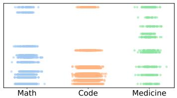  
(a) SRI on Deepseek

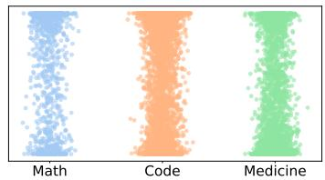  
(b) SKN on Deepseek

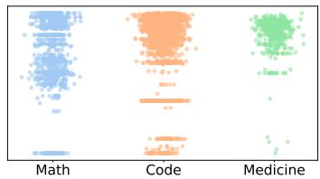  
(c) STR on Deepseek

Figure 3: Distribution of the three scores across different datasets on Deepseek-1.5B. The reasoning importance score is distributed across some fixed values, the knowledge novelty score has a somewhat uniform distribution, and the task relevance score’s distribution exhibits clustering features. More distribution figures of different LLMs are shown Appendix D.1.  
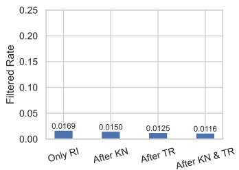  
(a) RI Filtering

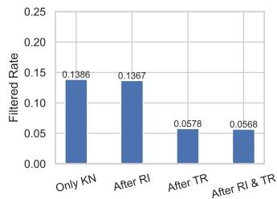  
(b) KN Filtering

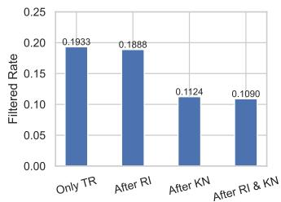  
(c) TR Filtering  
Figure 4: Complementarity among attributes using Deepseek-1.5B and GSM8k. Using RI as an example, Only RI represents the percentage of tokens that can be filtered using only RI. After KN represents the percentage of tokens that RI can filter after KN is applied. The reduction in tokens when comparing After KN with Only RI indicates the tokens on which KN and RI overlap.

$$
\begin{array}{c} Q _ {1}, Q 3 = \text { Quantile } (S _ {R I} (O), [ 2 5, 7 5 ]), \\ I Q R = Q _ {1} - (Q _ {3} - Q _ {1}), \\ O _ {k} \in (D _ {R I \downarrow}) \text {   if   } S _ {R I} (O _ {k}) <   Q _ {1} - I Q R, \end{array}\tag{5}
$$

where $S _ { R I } ( O )$ means all the reasoning importance score of tokens in output label O. The knowledge novelty scores display a uniform distribution, which makes it difficult to distinguish low scores. Therefore, we adopt a heuristic threshold. We consider tokens with a PCP higher than 95% as only containing knowledge without novelty and treat them as noise. In mathematical expression:

$$
O _ {k} \in (D _ {K N \downarrow}) \text {   if   } S _ {K N} (O _ {k}) <   0. 0 5.\tag{6}
$$

Finally, the task relevance scores exhibit cluster characteristics, for which we employ the Multi-Otsu method Liu & Yu (2009) to partition the scores. Since the cluster with the smallest mean value typically consists of space replacement symbols, we filter out the tokens in the cluster with the second smallest mean value. In mathematical expression:

$$
O _ {k} \in (D _ {T R \downarrow}) \mathrm{if} S _ {T R} (O _ {k}) \in \mathcal {M} (S _ {T R}) ^ {2 n d},\tag{7}
$$

whereM is the Multi-Otsu method and $\mathcal { M } ( S _ { T R } ) ^ { 2 n d }$ denotes the cluster with the second smallest mean value. The detail of Multi-Otsu method is shown in Appendix B.

Threshold Analysis. XTF adopts an aggressive filtering strategy, namely, it takes the union of three types of filtered tokens. The premise that supports this strategy is that the filtered tokens are assumed to be “completely” devoid of the corresponding attributes. Therefore, tokens with significantly low scores should be selected for filtering, which is also why a conservative threshold is chosen. Meanwhile, within the XTF framework, filtering attributes across multiple dimensions provide complementary effects, compensating for noise omissions introduced by the loose threshold.

Figure 4 illustrates the complementarity among attributes: the overlap of tokens filtered by different attributes is not higher than 58.3%. This strategy is based on a simple yet useful heuristic: ambiguous noise that is difficult to distinguish from one perspective can be clearly identified from another perspective. When noise is jointly evaluated from multiple perspectives, a complex problem is transformed into several simpler problems. To further explore the results of token filtering, we have provided specific examples of token filtering in Appendix F.

Training the Model. Here we describe how to optimize fine-tuning based on token filtering results. As shown in Figure 2, when processing the data, because the fine-tuning task focuses solely on the correctness of the output, we mask the input tokens by assigning them a default value (often [-100]) and thereby exclude them from gradient computation. After identifying noisy tokens in the output labels, we mark them with the this default value and use the resulting data for fine-tuning. Given the noisy token list N, the loss function $\mathcal { L } _ { F }$ for learning a data item can be expressed as:

$$
\mathcal {L} _ {F} = - \sum_ {O _ {k} \notin N} \log P \big (O _ {k} \mid I + [ O _ {0}, O _ {1}, \dots , O _ {k - 1} ] \big).\tag{8}
$$

## 4 EXPERIMENTS

## 4.1 EXPERIMENT SETTINGS

Dataset. We select three representative downstream tasks to evaluate the fine-tuning performance, including two mainstream tasks: math, and code (widely used to evaluate LLMs Guo et al. (2025); OpenAI et al. (2024); Team et al. (2024)), as well as an important specialized tasks: medicine Thirunavukarasu et al. (2023a); Alberts et al. (2023). For the math task, we employ the GSM8K Cobbe et al. (2021) for fine-tuning and evaluation. For the code task, we fine-tune on the CodeExercise AI (2025) and evaluate using HumanEval Chen et al. (2021). For medicine tasks, we employ the PubMedQA Jin et al. (2019) for fine-tuning and evaluation. We also conduct additional experiments based on the NuminaMath-CoT Li et al. (2024), MATH-500 Hendrycks et al. (2021), and FIQA Maia et al. (2018) datasets, but due to space limitations, these results are presented in the Appendix C.1.

LLMs. We select 7 different base LLMs of varying scales from three outstanding model families: DeepSeek Guo et al. (2025), Llama Touvron et al. (2023); Grattafiori et al. (2024) and Mistral Jiang et al. (2023). Specifically, for the Deepseek family, we choose DeepSeek-R1-distilled-Qwen-1.5B, 7B and 14B Bai et al. (2023). For the Llama family, we select Llama-3.2-1B, 3B and Llama-3.1-8B. For the Mistral family, we select Mistral-v0.1-7B.

Baselines. We consider 3 regular LLM implementations and 4 data enhancement methods to demonstrate the effectiveness of our XTF. Specifically, for regular LLM implementations, we adopt clean accuracy (CA), i.e., using the original base model, normal fine-tuning (Normal) and more epochs (×2 epochs). Data enhancement methods can filter the data noise from different perspectives. Specifically, data filtering (DF) Li et al. (2019) filters noisy data at the sample level, data augmentation (DA) Dai et al. (2025) augments more data to enhance the model’s robustness, thus resist noise, selective language model training Lin et al. (2024b) trains the token-level data selectively based on changes in the loss value, and token cleaning (TC) Pang et al. (2025) performs fine-grained data selection for LLM supervised fine-tuning. More details are shown in Appendix B.2.

Metrics. We primarily use accuracy to evaluate the performance of LLMs on specific tasks. For tasks with a standard answer, we adopt a zero-shot form to pose the questions and use a judge model Anthropic (2025) to determine the correctness of the responses. This evaluation method is less influenced by the format of the prompt and the model’s response style, providing a clear and intuitive reflection of the fine-tuning effect. For the code completion task, we assess performance using pass@1, pass@5, and pass@10 metrics, which are specifically used to evaluate code generation tasks Kulal et al. (2019).

Hyperparameter. We conduct experiments based on existing work and strictly control the fairness of the results through hyperparameters, as detailed in Appendix B.3.

Table 1: Result of main experiment. We show the accuracy of LLMs across different fine-tuning methods. Best results are marked in bold and the second best results are marked with underline.

<table><tr><td colspan="11">MATH: Fine-tuning and evaluate models on GSM8K</td></tr><tr><td>Model</td><td>|θ|</td><td>LoRA</td><td>CA</td><td>Normal</td><td>×2 Ep</td><td>DF</td><td>DA</td><td>SLM</td><td>TC</td><td>XTF</td></tr><tr><td>Llama-3.2</td><td>1B</td><td>×</td><td>2.8</td><td>4.3</td><td>6.8</td><td>7.6</td><td>2.4</td><td>5.9</td><td>6.8</td><td>8.7</td></tr><tr><td>Llama-3.2</td><td>3B</td><td>×</td><td>3.9</td><td>25.8</td><td>33.4</td><td>36.9</td><td>27.1</td><td>38.8</td><td>38.4</td><td>40.5</td></tr><tr><td>Llama-3.1</td><td>8B</td><td>×</td><td>4.6</td><td>54.0</td><td>55.4</td><td>52.7</td><td>55.4</td><td>60.3</td><td>58.9</td><td>58.7</td></tr><tr><td>Llama-3.1</td><td>8B</td><td>√</td><td>4.6</td><td>33.7</td><td>32.7</td><td>37.0</td><td>33.7</td><td>37.9</td><td>38.4</td><td>37.1</td></tr><tr><td>Mistral</td><td>7B</td><td>×</td><td>8.0</td><td>15.0</td><td>16.1</td><td>21.3</td><td>18.4</td><td>22.6</td><td>24.1</td><td>29.1</td></tr><tr><td>Mistral</td><td>7B</td><td>√</td><td>8.0</td><td>23.4</td><td>20.7</td><td>25.6</td><td>21.8</td><td>21.3</td><td>20.7</td><td>25.6</td></tr><tr><td>Deepseek-distilled-qwen</td><td>1.5B</td><td>×</td><td>17.6</td><td>42.9</td><td>45.5</td><td>47.0</td><td>37.4</td><td>37.3</td><td>38.5</td><td>56.2</td></tr><tr><td>Deepseek-distilled-qwen</td><td>7B</td><td>×</td><td>37.9</td><td>63.0</td><td>68.1</td><td>65.5</td><td>56.5</td><td>63.8</td><td>61.9</td><td>69.3</td></tr><tr><td>Deepseek-distilled-qwen</td><td>7B</td><td>√</td><td>37.9</td><td>61.3</td><td>60.4</td><td>67.9</td><td>62.0</td><td>68.2</td><td>70.0</td><td>71.8</td></tr><tr><td>Deepseek-distilled-qwen</td><td>14B</td><td>√</td><td>34.5</td><td>47.6</td><td>50.3</td><td>52.4</td><td>50.5</td><td>49.3</td><td>52.1</td><td>60.3</td></tr><tr><td>Average</td><td>-</td><td>-</td><td>16.0</td><td>37.1</td><td>39.0</td><td>41.4</td><td>36.5</td><td>40.5</td><td>41.0</td><td>45.7</td></tr><tr><td colspan="11">MEDICINE: Fine-tuning and evaluate models on PubMedQA</td></tr><tr><td>Model</td><td>|θ|</td><td>LoRA</td><td>CA</td><td>Normal</td><td>×2 Ep</td><td>DF</td><td>DA</td><td>SLM</td><td>TC</td><td>XTF</td></tr><tr><td>Llama-3.2</td><td>1B</td><td>×</td><td>2.9</td><td>15.5</td><td>15.6</td><td>15.4</td><td>18.3</td><td>13.1</td><td>12.4</td><td>18.5</td></tr><tr><td>Llama-3.2</td><td>3B</td><td>×</td><td>6.6</td><td>35.5</td><td>33.7</td><td>29.8</td><td>37.9</td><td>36.1</td><td>36.4</td><td>36.5</td></tr><tr><td>Llama-3.1</td><td>8B</td><td>×</td><td>4.9</td><td>13.6</td><td>14.0</td><td>18.4</td><td>14.7</td><td>22.9</td><td>22.9</td><td>21.3</td></tr><tr><td>Llama-3.1</td><td>8B</td><td>√</td><td>4.9</td><td>24.2</td><td>22.3</td><td>34.3</td><td>31.4</td><td>26.3</td><td>27.1</td><td>37.9</td></tr><tr><td>Mistral</td><td>7B</td><td>×</td><td>8.6</td><td>20.0</td><td>26.2</td><td>18.7</td><td>23.4</td><td>26.5</td><td>26.2</td><td>32.0</td></tr><tr><td>Mistral</td><td>7B</td><td>√</td><td>8.6</td><td>15.5</td><td>18.4</td><td>15.6</td><td>13.1</td><td>17.5</td><td>16.9</td><td>21.3</td></tr><tr><td>Deepseek-distilled-qwen</td><td>1.5B</td><td>×</td><td>39.8</td><td>44.6</td><td>45.4</td><td>41.2</td><td>49.7</td><td>48.3</td><td>51.2</td><td>50.8</td></tr><tr><td>Deepseek-distilled-qwen</td><td>7B</td><td>×</td><td>42.7</td><td>50.5</td><td>42.1</td><td>55.4</td><td>52.7</td><td>51.3</td><td>51.6</td><td>55.6</td></tr><tr><td>Deepseek-distilled-qwen</td><td>7B</td><td>√</td><td>42.7</td><td>35.9</td><td>37.8</td><td>33.6</td><td>38.4</td><td>39.0</td><td>37.4</td><td>41.7</td></tr><tr><td>Deepseek-distilled-qwen</td><td>14B</td><td>√</td><td>44.6</td><td>48.5</td><td>43.4</td><td>51.3</td><td>47.0</td><td>53.9</td><td>54.6</td><td>55.7</td></tr><tr><td>Average</td><td>-</td><td>-</td><td>20.6</td><td>30.4</td><td>29.9</td><td>31.4</td><td>32.7</td><td>33.5</td><td>33.7</td><td>37.1</td></tr></table>

## 4.2 MAIN EXPERIMENT RESULTS

We employ a significant number of fine-tuning cases and three representative downstream tasks in our main experiment. By conducting fine-tuning experiments on different models using unified hyperparameters and datasets, and comparing the performance of the fine-tuned models, we can assess the effectiveness of the fine-tuning methods. During the training process, we employ a training set, validation set, and test set to prevent issues such as overfitting caused by varying convergence speeds. Specifically, the model parameters that perform best on the validation set are retained as the final model parameters and tested on the test set. The reported results are test set accuracy.

Math. Math is an important downstream task in LLM research. It is widely adopted as the LLM benchmark, and the performance on math task can reflect the logic ability of LLMs. As shown in Table 1, XTF has average 8.6% higher accuracy than normal fine-tuning and 4.3% higher accuracy than the best baseline DF. In all 10 cases, XTF obtains 8 best results and 2 second best results. In particular, when fine-tuning the Deepseek-distilled-qwen-1.5B with all parameters, XTF achieves 13.3% higher accuracy than normal fine-tuning and 9.3% higher accuracy than the best baseline DF. Due to space limitations, additional experiments on math tasks (NuminaMath-CoT and MATH-500) will be presented in the Appendix C.1.

Medicine. Medicine is a promising application area for LLMs, and LLM researches on pharmaceutical downstream tasks Thirunavukarasu et al. (2023a); Alberts et al. (2023) have already achieved widespread influence. As shown in Table 1, XTF has average 6.7% higher accuracy than normal fine-tuning and 3.4% higher accuracy than the best baseline TC. In all the 10 cases, XTF obtains 6 best results and 4 second best results. When fine-tuning the Llama-3.1-8B with LoRA, XTF demonstrates 13.7% higher accuracy than normal fine-tuning and 3.6% higher accuracy than the best baseline.

Code. The code task is a more challenging task, and we provide pass@1, pass@5, and pass@10 results. Due to the generally lower accuracy on code tasks, the gap between XTF and the baseline is not as significant as in other experiments. As shown in Figure 5, XTF generally exhibits better results than normal fine-tuning. This difference increases when the LLMs are given more generation chances (from pass@1 to pass@10). In certain cases, normal fine-tuning decreases accuracy, indicating the harmfulness of noisy tokens, while XTF still shows positive performance. We find that when fine-tuning larger-scale models, the effect of noise filtering is more pronounced than when fine-tuning smaller-scale models. This phenomenon aligns with the claim we propose in Section 3.1: finding noise in data should consider the base model’s knowledge. Since larger-scale models generally possess stronger performance, we believe that stronger base model performance can better leverage the XTF method.

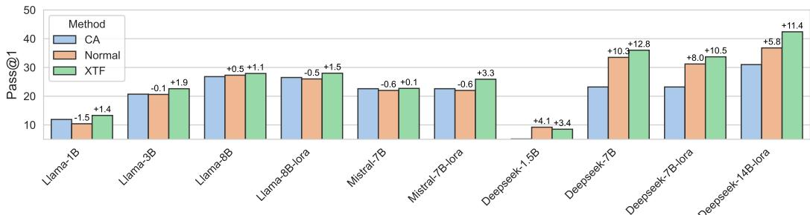

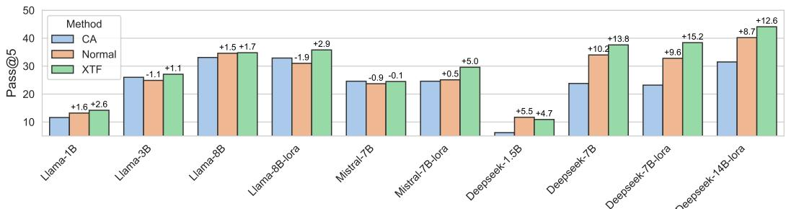

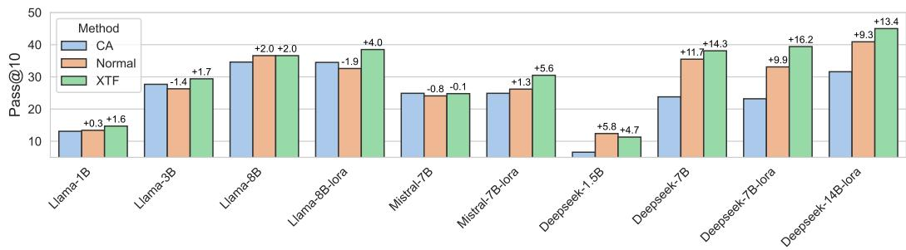  
Figure 5: The results on code task. We show the results of pass@1, pass@5 and pass@10 respectively.

## 4.3 ABLATION STUDY

In this section, we conduct an ablation study on three noise filtering attributes. We selectively use the attributes to filter the noisy tokens and train models from different series.

As shown in Table 2, XTF consistently demonstrates the best performance compared to other settings, suggesting that all the attributes are necessary for better noise filtering. At the same time, we observe that in mathematical tasks, using the combination of RI and KN to filter tokens is consistently superior to other combinations, whereas this is not the case in the Medicine task. Additionally, in the Medicine task, the optimal combination of attributes differs across models. These phenomena suggest that the relative effectiveness of the three attributes can vary depending on the model and task type, which aligns with our understanding of fine-tuning discussed in Section 3.1.

In addition, we also conduct ablation study against the threshold (for token filtering) selection, which are detailed in the Appendix C.2.

Table 2: Ablation study of XTF across different settings. DS, LA and MS denotes Deepseek, Llama and Mistral employed in this experiment. Ma and Me denotes math task and medicine task respectively. × means the corresponding noise has been filtered while − means not. Best results are marked in bold and the second best results are marked with underline.

<table><tr><td>Case</td><td> $D_{RI\downarrow}$ </td><td> $D_{KN\downarrow}$ </td><td> $D_{TR\downarrow}$ </td><td>DS(Ma)</td><td>LA(Ma)</td><td>MS(Ma)</td><td>DS(Me)</td><td>LA(Me)</td><td>MS(Me)</td><td>Avg</td></tr><tr><td>Zero</td><td>-</td><td>-</td><td>-</td><td>42.9</td><td>25.8</td><td>15.1</td><td>44.6</td><td>35.5</td><td>20.0</td><td>30.7</td></tr><tr><td>I</td><td>×</td><td>-</td><td>-</td><td>44.0</td><td>28.3</td><td>16.6</td><td>44.7</td><td>36.1</td><td>22.3</td><td>32.0</td></tr><tr><td>II</td><td>-</td><td>×</td><td>-</td><td>48.1</td><td>28.4</td><td>20.2</td><td>46.8</td><td>36.2</td><td>27.1</td><td>34.5</td></tr><tr><td>III</td><td>-</td><td>-</td><td>×</td><td>45.3</td><td>30.1</td><td>17.7</td><td>45.7</td><td>35.5</td><td>25.4</td><td>33.3</td></tr><tr><td>IV</td><td>×</td><td>×</td><td>-</td><td>48.3</td><td>32.2</td><td>23.9</td><td>47.8</td><td>36.4</td><td>28.1</td><td>36.1</td></tr><tr><td>V</td><td>×</td><td>-</td><td>×</td><td>49.2</td><td>34.1</td><td>27.7</td><td>47.1</td><td>35.9</td><td>27.6</td><td>36.9</td></tr><tr><td>VI</td><td>-</td><td>×</td><td>×</td><td>47.3</td><td>32.9</td><td>22.6</td><td>48.3</td><td>36.1</td><td>30.9</td><td>36.3</td></tr><tr><td>XTF (Ours)</td><td>×</td><td>×</td><td>×</td><td>56.2</td><td>40.5</td><td>29.1</td><td>50.8</td><td>36.5</td><td>32.0</td><td>40.1</td></tr></table>

## 5 DISCUSSION

Our proposed XTF effectively enhances LLM fine-tuning, but it still has some limitations. First, regarding computational cost, XTF incurs inference-level computational overhead (detailed in the Appendix D), which performs better compared to existing methods that train a reference model. However, it still imposes a significant burden when dealing with large models. If a small distilled model could be provided to identify noise for large-scale base models, it would significantly reduce the cost of token scoring. Additionally, we believe that more attributes can be explored for filtering noise, and these attributes can be assessed from multiple perspectives. Such work would provide an effective complement to the application of XTF in real-world scenarios.

## 6 CONCLUSION

In this paper, we investigated the influence of training data on fine-tuning performance at the tokenlevel. We explored solutions for filtering token-level noise to optimize fine-tuning datasets using three decomposed dimensions: reasoning importance, knowledge novelty, and task relevance, subsequently proposing XTF. We conducted extensive experiments on datasets across 3 different downstream tasks and 7 representative LLMs. XTF achieved up to 13.3%, 13.7% and 6.3% accuracy optimization on the math task, medicine task and code task, respectively, and outperformed all the baselines overall, demonstrating its effectiveness in noise filtering and fine-tuning enhancement.

## ACKNOWLEDGEMENTS

This work was supported in part by the National Natural Science Foundation of China (Grant Nos. 62502435, 625B1032, 62441238, U2441240), the Zhejiang Provincial Natural Science Foundation (No. LQN26F020002), the “Pioneer” and “Leading Goose” R&D Program of Zhejiang (No. 2024C01169), and the Kunpeng-Ascend Science and Education Innovation Excellence/Incubation Center.

## REFERENCES

Codefuse AI. Codeexercise-python-27k, 2025. https://huggingface.co/datasets/ codefuse-ai/CodeExercise-Python-27k.

Ian L Alberts, Lorenzo Mercolli, Thomas Pyka, George Prenosil, Kuangyu Shi, Axel Rominger, and Ali Afshar-Oromieh. Large language models (llm) and chatgpt: what will the impact on nuclear medicine be? European journal ofnuclear medicine and molecular imaging, 50:1549–1552, 2023.

Shengnan An, Zexiong Ma, Zeqi Lin, Nanning Zheng, Jian-Guang Lou, and Weizhu Chen. Make your llm fully utilize the context. In NeurIPS, 2024.

Zachary Ankner, Cody Blakeney, Kartik Sreenivasan, Max Marion, Matthew L Leavitt, and Mansheej Paul. Perplexed by perplexity: Perplexity-based pruning with small reference models. In ICLR, 2024.