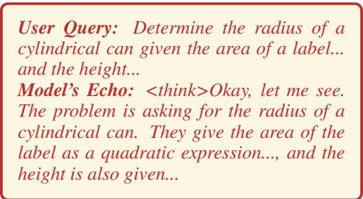
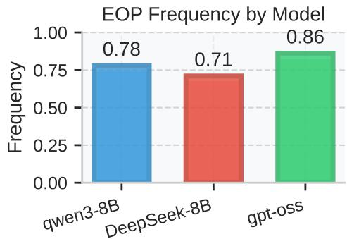
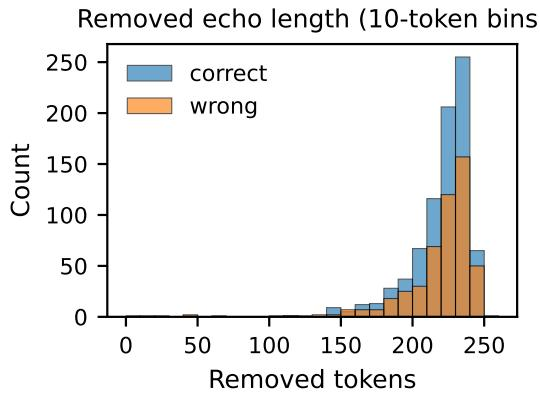
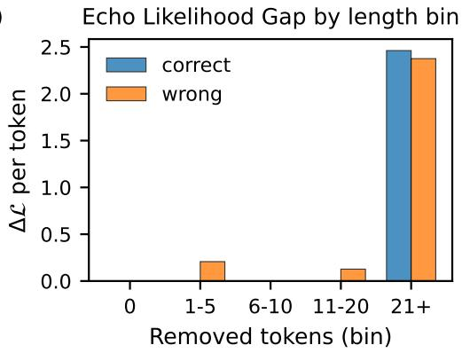
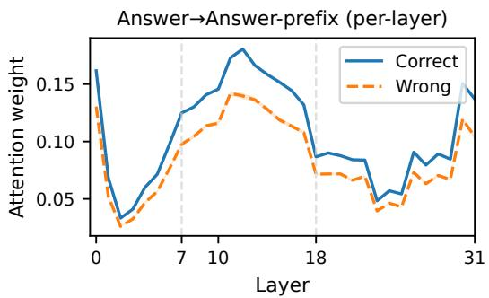
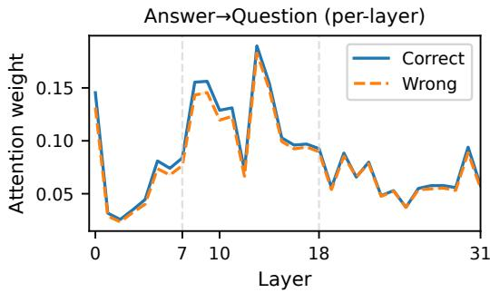
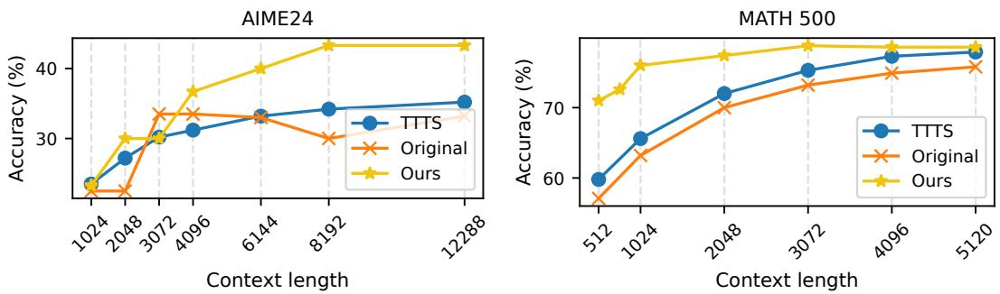

## ABSTRACT

Test-time compute allocation in large reasoning models (LRMs) is widely used and has applications in mathematical problem solving, code synthesis, and planning. Recent work has addressed this problem by scaling self-consistency and parallel thinking, adding generic “thinking tokens” and prompting models to re-read the question before answering. Unfortunately, these approaches either inject taskagnostic tokens or mandate heuristics that do not explain—and often ignore— the spontaneous repetition that many LRMs exhibit at the head of their internal chains. In contrast, we analyze and harness the model’s tendency to restate the question, which we term the Echo of Prompt (EOP), as a front-loaded, computeshaping mechanism. We formalize its probabilistic cost by casting echo removal as rejection-based conditioning and defining the Echo Likelihood Gap ∆L as a computable proxy. This provides the missing theoretical link that links early repetition to likelihood gains and downstream accuracy. However, it does not by itself specify how to exploit EOP. Consequently, we develop Echo-Distilled SFT (ED-SFT) to instill an “echo-then-reason” pattern through supervised finetuning, and Echoic Prompting (EP) to re-ground the model mid-trace without training. While promising, quantifying benefits beyond verbosity is non-trivial. Therefore, we conduct length and suffix-controlled likelihood analyses together with layer-wise attention studies, showing that EOP increases answer to answer-prefix attention in middle layers, consistent with an attention refocusing mechanism. We evaluate on GSM8K, MathQA, Hendrycks-MATH, AIME24, and MATH-500 under identical decoding settings and budgets, and find consistent gains over baselines. Code is available at https://github.com/hhh2210/echoes-as-anchors.

## 1 INTRODUCTION

Recent advancements in Large Language Models (LLMs) have demonstrated remarkable capabilities in complex reasoning tasks, often mediated by a process known as Chain-of-Thought (CoT) prompting (Wei et al., 2022; Kojima et al., 2022; Wang et al., 2023; Yao et al., 2023).

Inspired by the CoT paradigm, modern large reasoning models (LRMs) achieve strong performance on complex tasks by allocating significant test-time compute to think before answering (Wei et al., 2022; OpenAI, 2024; DeepSeek-AI et al., 2025; Qwen Team, 2025). A common yet underexplored phenomenon in their reasoning traces is the tendency to begin by repeating the user’s prompt (see Figure 1 and §A.3), a behavior we term the Echo ofPrompt (EOP).

While uncontrolled repetition is a known failure mode (the “repeat curse” (Yao et al., 2025)), explicit instructions to re-read or “look-twice” are known to improve performance (Xu et al., 2024; Zou et al., 2024). The spontaneous EOP that initiates a complex reasoning trace, however, has remained largely unanalyzed.This initial echo raises a critical question:

Is it a superfluous artifact of the training process, or does it serve a functional role in reasoning?

  
Figure 1: An illustration of the Echo of Prompt (EOP). Left: An example of a model’s thinking process starting with an echo of the user’s query. Right: The frequency of EOP across several open-source models on the GSM8K dataset, as measured by our trained MLP probe (see §A.4).

This paper confronts this question directly, presenting the first systematic study to isolate, analyze, and harness this emergent behavior as a powerful cognitive aid.

We hypothesize that the EOP serves as an intrinsic attention-refocusing mechanism, a learned strategy to ground subsequent reasoning steps in the salient details of the original query. To validate this, we provide a dual theoretical and empirical analysis:

1. A Probabilistic Framework (§3). We introduce a rejection sampling framework to formalize the EOP, defining the Echo Likelihood Gap to quantify its probabilistic cost.

2. An Attention-Based Mechanistic Explanation (§3.3). We uncover the underlying mechanism through attention analysis, showing that EOP serves to refocus the model’s attention, an act that correlates with correctness.

3. Practical Methods and Empirical Validation (§4). We translate this insight into two effective methods. Echo-Distilled SFT (ED-SFT) instills this behavior via fine-tuning, yielding significant performance gains that generalize across data distributions. Concurrently, Echoic Prompting (EP) provides a training-free inference strategy that re-grounds the model on the prompt, outperforming strong baselines.

Taken together, our findings reframe the EOP from a superficial flaw into a functional strategy for cognitive self-alignment. This work not only solves the puzzle of the initial repetition but also offers new insights into how models learn to structure their own thought processes for complex reasoning.

This paper makes three main contributions:

• We propose a novel probabilistic framework based on rejection sampling to quantify the cost of an echo, introducing the Echo Likelihood Gap (∆L) as a core metric to measure the alignment between a model’s natural tendency and echo-free reasoning.

• We present two practical methods to leverage this phenomenon: Echo-Distilled SFT (ED-SFT), a fine-tuning approach to instill echo behavior, and Echoic Prompting (EP), a training-free inference technique that achieves similar gains by re-introducing the prompt.

• We provide a mechanistic explanation for the effectiveness of EOP. Through attention analysis, we demonstrate that echoing acts as an intrinsic refocusing mechanism, guiding the model to concentrate on critical problem details that are often overlooked.

## 2 RELATED WORK

Computation In Reasoning: Efficiency And Effectiveness. The scaling of test-time computation has demonstrably improved reasoning in LRMs, but often at the cost of significant overhead from long and sometimes redundant chains of thought—the “overthinking phenomenon” (Sui et al., 2025). One line of research tackles this by improving computational efficiency, developing methods like early exiting or step compression to reduce wasteful generation. A complementary approach, more aligned with our work, focuses on computational effectiveness. For instance, several studies have found that compelling a model to explicitly restate or re-read the input question can enhance reasoning (Xu et al., 2024; Mekala et al., 2024). These methods treat repetition as an instructed heuristic to re-align the model. Our work bridges these views by analyzing the spontaneous emergence of echoes, not as a heuristic to be added, but as an intrinsic, learned strategy that trades a small initial computational cost for more effective and focused downstream reasoning.

Attention-Refocusing Mechanisms. The challenge of maintaining focus over long contexts is a known issue in language models, often manifesting as a positional bias where information in the middle of a long input is under-utilized (Liu et al., 2024). This issue is analogous to attention drift in computer vision, where attention can shift away from salient regions during sequence generation (Cheng et al., 2017). To counteract these effects, various explicit mechanisms have been proposed. These range from model-level architectural changes and calibration methods that correct positional biases (Cheng et al., 2017; Hsieh et al., 2024), to inference-time interventions that re-weight attention or re-inject evidence to steer the model back to relevant information (Gu et al., 2024; Zou et al., 2024). Our work identifies a different, more intrinsic phenomenon: we show that the initial Echo of Prompt itself can serve a similar refocusing role, where the model spontaneously restates salient parts of the prompt to condition its subsequent generation, without any external guidance or modification.

## 3 THE PRICE OF AN ECHO: A PROBABILISTIC COST FRAMEWORK

This section formalizes the impact of prompt echoes using a probabilistic framework that goes beyond simple text deletion. The core idea is to treat the presence or absence of an echo as a probabilistic event, which enables a formal definition of a hypothetical echo-free model and a measurement of the echo’s likelihood cost. The analysis proceeds in three parts: §3.1 introduces the rejection sampling framework, §3.2 measures the resulting likelihood cost, and §3.3 investigates the echo’s function as an attention-refocusing mechanism.

To ground this framework, the probabilistic and attention analyses in this section are performed on the GSM8K benchmark using DeepSeek-R1-Distill-Llama-8B. We use exact match accuracy as the primary task metric and log full model outputs for likelihood and attention analysis.

## 3.1 PROBLEM FORMULATION

This framework allows us to precisely quantify the effect of echo removal as a probabilistic conditioning event, laying the groundwork for the metric we introduce next.

Let $\mathbf { \boldsymbol { x } } \in \mathcal { X }$ be an input prompt and $\pmb { y } \in \mathcal { V }$ be a generated output sequence (i.e., a reasoning trace). We consider a base large reasoning model parameterized by $\bar { \pmb { \theta } } ,$ , which defines a conditional probability distribution $\pi _ { \pmb { \theta } } ( \pmb { y } | \pmb { x } )$ over possible output sequences.

Our first step is to formally identify which sequences contain a Echo of Prompt. We define a predicate, implemented by a separately trained MLP (see §A.4), that partitions the output space $\mathcal { V }$ into two disjoint sets, $\mathcal { Y } = \mathcal { Y } _ { \mathrm { t r i m } } \cup \mathcal { Y } _ { \mathrm { e c h o } }$ . Here, $y _ { \mathrm { t r i m } } \subset \mathcal { D }$ is the set of all trimmed sequences that are deemed echo-free, and ${ \mathcal { N } } _ { \mathrm { e c h o } }$ is its complement. We can then define an indicator function:

$$
\mathbf {1} _ {\boldsymbol {y} \in \mathcal {Y} _ {\text { trim }}} = \left\{ \begin{array}{l l} 1 & \text { if   } \boldsymbol {y} \text {   is   echo - free }, \\ 0 & \text { otherwise }. \end{array} \right.\tag{1}
$$

Assuming the model has a non-zero probability of producing at least one echo-free trace $( Z _ { x } > 0 )$ we define our target, the trimmed distribution $\tau _ { \theta } ( \pmb { y } | \pmb { x } )$ , as the base distribution $\pi _ { \pmb { \theta } }$ conditioned on the event that the output is echo-free:

$$
\tau_ {\boldsymbol {\theta}} (\boldsymbol {y} | \boldsymbol {x}) = \frac {\pi_ {\boldsymbol {\theta}} (\boldsymbol {y} | \boldsymbol {x}) \mathbf {1} _ {\boldsymbol {y} \in \mathcal {Y} _ {\text { trim }}}}{\sum_ {\boldsymbol {y} \in \mathcal {Y} _ {\text { trim }}} \pi_ {\boldsymbol {\theta}} (\boldsymbol {y} | \boldsymbol {x})}.\tag{2}
$$

Here, the denominator $Z _ { x }$ is the partition function, which normalizes the distribution by summing the probabilities of all echo-free sequences under the base model $\pi _ { \pmb { \theta } } \colon$ :

$$
Z _ {\boldsymbol {x}} = \sum_ {\boldsymbol {y} \in \mathcal {Y} _ {\text { trim }}} \pi_ {\boldsymbol {\theta}} (\boldsymbol {y} | \boldsymbol {x}) = \mathbb {E} _ {\boldsymbol {y} \sim \pi_ {\boldsymbol {\theta}} (\cdot | \boldsymbol {x})} [ \mathbf {1} _ {\boldsymbol {y} \in \mathcal {Y} _ {\text { trim }}} ].\tag{3}
$$

Table 1: Echo metrics on GSM8K. Averages over samples in each group, where N denotes the number of samples. The Suffix-only Likelihood Gap measures the per-token log-likelihood difference on the reasoning suffix when conditioned with versus without the echo prefix.

<table><tr><td rowspan="2">Group</td><td colspan="4">Echo Likelihood Gap (per-token)</td><td colspan="4">Extended Echo Metrics</td></tr><tr><td>N</td><td>Mean ΔL</td><td>Std σ(ΔL)</td><td>Neg. ratio (%)</td><td>ΔL(per token)</td><td>Δ/#removed</td><td>Suffix-only gap</td><td>Avg. removed tokens</td></tr><tr><td>Correct</td><td>819</td><td>2.5231</td><td>0.7786</td><td>0.12</td><td>2.4614</td><td>0.01103</td><td>1.1449</td><td>219.7</td></tr><tr><td>Wrong</td><td>500</td><td>2.4421</td><td>0.7657</td><td>0.00</td><td>2.3666</td><td>0.01085</td><td>1.2938</td><td>218.7</td></tr></table>

This distribution represents our targeted behavior—a hypothetical model constrained to produce only echo-free outputs. However, directly computing $\tau _ { \pmb { \theta } }$ is intractable because the partition function $Z _ { x }$ requires summing over all possible echo-free sequences. This intractability motivates the use of rejection sampling to reason about and sample from $\tau _ { \pmb { \theta } }$ without needing to calculate $Z _ { x }$ explicitly.

The rejection sampling view provides a principled way to think about echo suppression, but to measure its effect, we need a concrete metric. Our goal is to quantify how much preference the model shows for a raw, echo-containing trace versus its trimmed, echo-free counterpart.

Given a raw trace $y _ { \mathrm { r a w } }$ and its echo-trimmed counterpart $y _ { \mathrm { t r i m } }$ , we define the (length-normalized) average log-likelihood

$$
\mathcal {L} (y) = \frac {1}{| y |} \sum_ {t = 1} ^ {| y |} \log \pi_ {\theta} \left(y _ {t} \mid x, y _ {<   t}\right)\tag{4}
$$

(nats/token). The Echo Likelihood Gap is $\Delta \mathcal { L } = \mathcal { L } ( y _ { \mathrm { r a w } } ) - \mathcal { L } ( y _ { \mathrm { t r i m } } )$ . A positive $\Delta \mathcal { L }$ means the model prefers the echo-containing trace. Unless otherwise noted, we report nats/token.

While our framework defines the echo-free distribution $\tau _ { \pmb { \theta } } ,$ , the partition function $Z _ { x }$ required to compute it is intractable. This motivates a practical, sample-based alternative: the Echo Likelihood Gap (∆L). This metric serves as a direct proxy for the probabilistic cost of an echo by comparing the average log-likelihood of a generated trace $( y _ { \mathrm { r a w } } )$ against its trimmed counterpart $( y _ { \mathrm { t r i m } } )$ . A positive $\bar { \Delta } \mathcal { L }$ indicates that the model assigns a higher likelihood to the sequence containing the echo, quantifying the price of this behavior on a per-sample basis.

This leads to our central question: is there a positive relationship between this probabilistic cost and the model’s final reasoning accuracy? In other words, does spending probability on an echo lead to better performance? The following sections are dedicated to empirically validating this trade-off.

## 3.2 THE ECHO LIKELIHOOD GAP IN PRACTICE

Table 1 and Figure 2 highlight our central empirical finding: a larger probabilistic investment in an Echo of Prompt (EOP) strongly correlates with correct final answers. To formalize this, we introduce two metrics: the overall Echo Likelihood Gap (∆L), which measures the total probabilistic cost, and the Suffix-only Likelihood Gap $( \Delta \mathcal { L } _ { \mathrm { s u f f i x } } )$ , which isolates the echo’s influence on subsequent reasoning.

Defining the Likelihood Gaps. Our primary metric, the Echo Likelihood Gap $( \Delta \mathcal { L } ) .$ , is defined in $\ S 3$ as the difference in average per-token log-likelihood between a raw trace $\scriptstyle { \pmb { y } } _ { \mathrm { r a w } }$ and its trimmed counterpart $\scriptstyle { \pmb { y } } _ { \mathrm { t r i m } }$ . To isolate the echo’s influence on the subsequent reasoning steps, we introduce a more granular metric. For a raw trace $\scriptstyle { \pmb { y } } _ { \mathrm { r a w } }$ composed of an echo prefix e and a reasoning suffix s $( \mathrm { i . e . , ~ } y _ { \mathrm { r a w } } = [ e , s ] )$ , we compare the model’s likelihood of generating s with and without the conditioning prefix e. The Suffix-only Likelihood Gap is defined as:

$$
\Delta \mathcal {L} _ {\text { suffix }} = \mathcal {L} (\boldsymbol {s} \mid \boldsymbol {x}, \boldsymbol {e}) - \mathcal {L} (\boldsymbol {s} \mid \boldsymbol {x}),\tag{5}
$$

where $\begin{array} { r } { \mathcal { L } ( \pmb { s } ~ | ~ \cdot ) } \end{array}$ is the average per-token log-likelihood of the suffix s under the given context. $\mathbf { A }$ positive value indicates that the echo prefix makes the subsequent reasoning trace appear more probable to the model.

  
Figure 2: Echo metrics on GSM8K. Left: High-resolution histogram of removed echo-prefix lengths (10-token bins) for correct and wrong traces; most mass lies between roughly 200 and 240 tokens. Right: Echo Likelihood Gap $\Delta \mathcal { L }$ (per-token) stratified by removed-prefix length bin; the gap remains positive across all bins.

Analysis of Results. The overall Echo Likelihood Gap reveals a clear correlation with correctness. As shown in Table 1, the Correct group $( N = 8 1 9 )$ ) has a larger average gap than the Wrong group $( N = 5 0 0 ) \colon \overline { { \Delta \mathcal { L } } } = 2 . 5 2 3 1$ vs. 2.4421. This positive difference (+0.0811 nats/token) indicates that a larger total probabilistic investment in echoing co-occurs with correct final answers. We further validate this relationship with logistic regression in the Appendix, confirming $\Delta \mathcal { L }$ as a significant positive predictor of correctness, even after controlling for trace length.

Interestingly, the Suffix-only Likelihood Gap is slightly larger for the Wrong group (1.2938 vs. 1.1449). While this seems counter-intuitive, it does not contradict our main finding. It suggests that while echoes make subsequent reasoning seem more plausible in general (as both values are positive), they may also act as a form of "confirmation bias," slightly strengthening the model’s confidence in locally coherent but ultimately flawed reasoning paths. The determinative factor for correctness remains the overall likelihood trade-off captured by $\Delta { \mathcal { L } } .$ , as explained by the likelihood decomposition in $\ S \mathrm { A } . 7 .$

Sanity Checks. Before further analysis, we perform several checks to validate $\Delta \mathcal { L }$ as a metric. First, for traces without a detected echo, $\Delta \mathcal { L }$ is definitionally zero, as the raw and trimmed sequences are identical. Second, we confirm that $\Delta \mathcal { L }$ correlates positively with the number of removed tokens in the echo prefix, indicating that longer echoes correspond to a larger likelihood gap. Finally, the data in Table 1 confirms that the suffix-only likelihood gap on the shared reasoning trace remains positive, confirming the echo’s influence extends beyond the prefix itself. These checks establish $\Delta \mathcal { L }$ as a robust measure of the echo’s probabilistic impact.

Length- And Suffix-Controlled Analysis. To ensure this gap is not merely a length artifact, we conduct a length-stratified analysis. As shown in Figure 2, the $\Delta \mathcal { L }$ remains consistently positive across different trace lengths. This indicates that the Echo of Prompt (EOP)’s contribution is robust and also improves the model’s scoring on the subsequent, shared reasoning steps.

Distribution Of Removed Echo Lengths. We further examine the length distribution of the removed echo prefixes (Figure 2, left). The distribution is heavy-tailed, with most prefixes falling between roughly 200 and 240 tokens (mean 219, median 226), confirming that the Echo of Prompt (EOP) constitutes a non-trivial segment of the generation that acts as a probabilistic sink. This distribution reveals that echo prefixes consistently consume substantial portions of the model’s output budget, with most instances removing more than 200 tokens of echoed content.

## 3.3 UNVEILING THE MECHANISM: ECHOES AS ATTENTION REFOCUSING

To understand why prompt echoing is effective, we analyze the model’s attention patterns during generation. We hypothesize that re-introducing the original prompt effectively refocuses the model’s attention on the core problem statement, preventing drift during extended reasoning chains.

Attention Redistribution After Echo Removal. We investigate the mechanism underlying the Echo of Prompt’s effectiveness, hypothesizing that it serves to refocus the model’s attention. To test this, we compute two attention metrics on the original outputs: (i) attention from answer tokens to the question tokens, and (ii) attention from answer tokens to the answer prefix. Formally, let $A ^ { ( l ) } \in \overline { { \mathbb { R } } } ^ { T \times T }$ be the head-averaged attention matrix at layer l for a full sequence of T tokens. We define the average attention weight from a set of query tokens with indices $ { \boldsymbol { S } } _ { Q }$ to a set of key tokens with indices $\boldsymbol { \mathcal { S } } _ { K }$ as:

$$
\mathrm{Attn} ^ {(l)} (\mathcal {S} _ {Q} \to \mathcal {S} _ {K}) = \frac {1}{| \mathcal {S} _ {Q} |} \sum_ {i \in \mathcal {S} _ {Q}} \sum_ {j \in \mathcal {S} _ {K}} A _ {i j} ^ {(l)}.\tag{6}
$$

For our answer→answer- $- p r e f i x$ metric, $ { \boldsymbol { S } } _ { Q }$ comprises the indices of all tokens in the generated reasoning trace, while $\boldsymbol { \mathcal { S } } _ { K }$ contains the indices of the initial K tokens of that same trace. This metric quantifies the degree to which subsequent reasoning steps are grounded in the model’s own initial problem interpretation. For all results reported in this section, including the aggregate statistics in Table 2 and the layer-wise analysis in Figure 3, the prefix length is dynamically set to the persample echo length estimated by our MLP probe. This allows for a precise analysis of the actual echo’s effect. As the results show, correctly solved problems consistently exhibit stronger attention to the answer prefix than incorrect ones, supporting our attention refocusing hypothesis.

Layer-Wise Attention Dynamics. To further understand where the attention refocusing occurs within the model’s architecture, we conducted a fine-grained layer-wise analysis across all 32 layers. Figure 3 visualizes the attention weight distribution, revealing distinct patterns between correct and incorrect reasoning traces.

  
Figure 3: Layer-wise attention weight distribution on GSM8K (DeepSeek-R1-Distill-Llama-8B) for Left: answer→answer-prefix and Right: answer→question. The blue lines represent correct reasoning traces while orange lines represent incorrect ones. The attention refocusing effect is most pronounced in layers 7-18 for answer→answer-prefix, with correct traces maintaining consistently higher attention weights.

The layer-wise analysis localizes the EOP effect to the model’s reasoning bottleneck. We observe a Middle-Layer Dominance where the attention gap peaks in layers 7–18, consistent with findings that intermediate layers govern reasoning aggregation. Furthermore, the Differential Impact—where correct traces attend significantly more to the answer-prefix (peak $\Delta \approx 3 \% )$ than to the original question $( \Delta < 1 \% )$ confirms that the echo acts as a distinct working memory anchor, actively refocusing the model on the problem statement during critical computation steps.

Interestingly, the early layers (1-6) show minimal differences between correct and incorrect groups, with both trajectories nearly overlapping. This suggests that low-level token processing remains largely unaffected. Crucially, as shown in Figure 3 Right, the answer→question attention remains closely matched across all layers, serving as a valuable negative control.

Table 2: Average attention weights (%) on GSM8K (DeepSeek-R1-Distill-Llama-8B) with probeestimated prefix length. Global statistics and layer-specific analysis showing attention from answer tokens to question and answer prefix.

<table><tr><td>Metric</td><td>Correct</td><td>Wrong</td><td>Diff (C-W)</td></tr><tr><td colspan="4">Global Statistics</td></tr><tr><td>Last-layer: answer → question</td><td>5.77%</td><td>5.54%</td><td>+0.23%</td></tr><tr><td>Last-layer: answer → answer-prefix</td><td>13.69%</td><td>10.41%</td><td>+3.28%</td></tr><tr><td>All-layers mean: answer → question</td><td>8.45%</td><td>8.00%</td><td>+0.45%</td></tr><tr><td>All-layers mean: answer → answer-prefix</td><td>10.64%</td><td>8.49%</td><td>+2.15%</td></tr><tr><td colspan="4">Peak Effect Layers (7-18)</td></tr><tr><td>Layers 7-18: answer → question</td><td>12.17%</td><td>11.51%</td><td>+0.66%</td></tr><tr><td>Layers 7-18: answer → answer-prefix</td><td>14.45%</td><td>11.58%</td><td>+2.87%</td></tr></table>

Table 3: Layer-wise discriminability (Correct vs. Wrong) aggregated into layer groups. Metrics are computed on answer→answer-prefix and answer→question attention. The mid-layer group shows the strongest effect size (d) for answer→answer-prefix.

<table><tr><td>Layer Group (layers)</td><td>AUC↑ (Ans→Pref)</td><td>d↑ (Ans→Pref)</td><td>AUC (Ans→Q)</td><td>d (Ans→Q)</td></tr><tr><td>Early (0–6)</td><td>0.716</td><td>0.820</td><td>0.628</td><td>0.482</td></tr><tr><td>Mid (7–18)</td><td>0.719</td><td>0.832</td><td>0.585</td><td>0.303</td></tr><tr><td>Late (19–31)</td><td>0.723</td><td>0.828</td><td>0.563</td><td>0.184</td></tr></table>

This confirms that the performance gain is not attributable to a simple, uniform increase in attention to the original question. Instead, the discriminative signal emerges in Figure 3 Left, where the divergence in answer→answer-prefix attention begins at layer 7. We report mean ± s.e.m. across samples; focusing on layers 7–18 reveals a group difference of $\Delta ( \mathrm { C - W } ) { \approx } 0 . 6 6 \%$ for answer→question and a more substantial ≈ 2.87% for answer→answer-prefix.

This supports our hypothesis that the Echo of Prompt acts as a cognitive scaffold for higher-level reasoning; it is not merely about re-reading the question, but about anchoring the subsequent reasoning process to a stable internal representation, a mechanism that strongly correlates with correctness.

To ensure our findings are robust and not merely an artifact of the dynamically-set prefix length, we conducted an ablation study using fixed prefix lengths. The results, detailed in §A.5, confirm that the attention gap persists across several fixed prefix lengths, supporting our conclusion that EOP’s function is genuine attention refocusing.

Layer-Wise Discriminability. To quantify where attention refocusing emerges, we compute layer-wise discriminability between Correct and Wrong groups using AUC and Cohen’s d. Specifically, for each layer l, we treat the attention scores from the Correct traces $( \mathcal { A } _ { C } ^ { ( l ) } )$ and Wrong traces $( \mathcal { A } _ { W } ^ { ( l ) } )$ as two distributions. The Area Under the ROC Curve (AUC) measures how well attention at a given layer classifies a trace as correct. We also compute Cohen’s d to quantify the effect size:

$$
d ^ {(l)} = \frac {\mu (\mathcal {A} _ {C} ^ {(l)}) - \mu (\mathcal {A} _ {W} ^ {(l)})}{s _ {p} ^ {(l)}},\tag{7}
$$

where $\mu$ denotes the mean and $s _ { p } ^ { ( l ) }$ is the pooled standard deviation for layer l. We also aggregate layers into three groups to analyze broader trends. Table 3 shows that the mid-layer group (7-18) exhibits the strongest effect size on answer→answer-prefix (Cohen’s d=0.832), with its AUC being comparable to the late-layer group. In contrast, the answer→question discriminability remains significantly lower across all groups, serving as a negative control.

These statistics, combined with the attention trajectories (Figure 3), strongly indicate that EOP’s primary mechanism is to refocus representations within the mid layers ( layers 7 through 18), anchoring subsequent reasoning to the answer prefix.

Table 4: Echo reinsertion ablation on the wrong-subset GSM8K traces for several models.

<table><tr><td>Model</td><td>Echo-free EM (%)</td><td>Echo reinsertion EM (%)</td></tr><tr><td>DeepSeek-R1-Distill-Llama-8B</td><td>15.85</td><td>26.22</td></tr><tr><td>Qwen3-8B</td><td>21.34</td><td>29.27</td></tr><tr><td>Qwen3-8B-Base (no CoT)</td><td>10.56</td><td>10.56</td></tr></table>

## 4 EMPIRICAL VALIDATION

## 4.1 ECHO REINSERTION AS A CAUSAL INTERVENTION

We construct an interventional experiment that starts fromfailed GSM8K completions produced by several models (DeepSeek-R1-Distill-Llama-8B, Qwen3-8B, and the non-reasoning Qwen3-8B-Base). For each wrong example we (i) truncate an echo-free trace to 50% of its tokens to obtain a shared prefix, (ii) resume generation either directly (echo-free) or after inserting the template phrase “now I need to look back at the question again:” (echo reinsertion), and (iii) score the new completions with the standard GSM8K exact-match script.Both branches see identical questions, prefixes, decoding parameters, and random seeds, isolating the causal impact of the injected echo.

The intervention confirms that echoes are causally helpful for reasoning-capable models: forcing a short echo before resuming the chain yields sizable EM gains (+10.4 and +7.9 points for DeepSeek-R1-Distill-Llama-8B and Qwen3-8B, respectively), while the non-reasoning base model shows no improvement. This null result for the base model is expected, as it lacks the instruction-following and reasoning priors typically acquired via RL to utilize the re-injected context zero-shot. This interpretation is reinforced by our ED-SFT results (Table 5), where the base model exhibits the largest relative improvement (+3.4 points) when the reasoning capability and echo strategy are instilled simultaneously. Qualitatively, we observe the reinsertion branch revisiting the original quantities and constraints (Figure 9), whereas the echo-free branch continues the drifting reasoning that led to the initial error. This interventional evidence complements our correlational analyses (§3) and grounds the attention refocusing hypothesis in an explicit cause-and-effect experiment.

## 4.2 PERFORMANCE GAINS FROM ECHO-DISTILLED SFT (ED-SFT)

Having established that Echo of Prompt correlates with improved reasoning performance, we investigate whether this behavior can be systematically instilled through targeted training. Our Supervised Fine-Tuning (SFT) methodology is inspired by recent work (Team, 2025).

The core hypothesis is that explicitly training models on echo-prefixed traces enhances their problem-solving approach: the echo phase forces deeper engagement with problem constraints and establishes a stronger foundation for subsequent reasoning steps.

Methodology. We develop Echo-Distilled SFT (ED-SFT), a supervised fine-tuning method that embeds this echo-then-reason pattern as a learned behavior. We first construct a shared pool of high-quality teacher traces on GSM8K by querying a capable teacher model, gpt-oss-120B, with a standard CoT prompt that wraps the reasoning in a single <think> block and requires the final answer to be a plain value. We automatically verify that the final answer exactly matches the ground-truth solution and discard any trace that fails this check. This pool of verified (question, CoT, answer) triples is the common source for both ED-SFT and the normal-SFT baseline.

To obtain ED-SFT data, we encourage an explicit echo-then-reason pattern at the head of the trace. We train a small MLP probe to detect whether an early Echo of Prompt segment is present. For traces flagged as missing EOP, we call gpt-oss-120B once more with an edit instruction that minimally inserts a short echo-style opening that restates the question (e.g., “Okay, let me see. The problem is asking: . . . ”) while preserving the subsequent reasoning and final answer. Traces that already contain an echo are kept unchanged. After editing, we re-run the automatic checker and drop any example whose final answer no longer matches the gold label. The resulting ED-SFT dataset therefore differs from the standard CoT pool only by the presence of an initial echo segment.

Table 5: Supervised fine-tuning with distilled CoT data improves mathematical reasoning. -ED-SFT denotes models fine-tuned on our EOP distilled dataset. -normal-SFT refers to the normal CoT distilled dataset.Base is the pretrained model; the unmarked variant is instruction-tuned. Best scores in each column are in bold.

<table><tr><td>Model</td><td colspan="2">GSM-8K</td><td>MathQA</td><td>Hendrycks-MATH</td></tr><tr><td></td><td>Strict EM</td><td>Flex EM</td><td></td><td></td></tr><tr><td colspan="5">Qwen3-8B-Base</td></tr><tr><td>Base</td><td>79.4</td><td>80.5</td><td>31.0</td><td>0.76</td></tr><tr><td>+ ED-SFT</td><td>94.2 (+3.4)</td><td>94.2 (+3.4)</td><td>58.8 (+11.8)</td><td>10.0 (+8.2)</td></tr><tr><td>+ normal-SFT</td><td>90.8</td><td>90.8</td><td>47.0</td><td>1.8</td></tr><tr><td colspan="5">Qwen3-8B (Instruct Version)</td></tr><tr><td>Base</td><td>87.49</td><td>88.1</td><td>49.2</td><td>0.8</td></tr><tr><td>+ ED-SFT</td><td>93.1 (+2.8)</td><td>93.4 (+3.3)</td><td>53.7 (+1.9)</td><td>6.1 (+1.1)</td></tr><tr><td>+ normal-SFT</td><td>90.3</td><td>90.1</td><td>51.8</td><td>5.0</td></tr><tr><td colspan="5">DeepSeek-Distill-Llama-8B</td></tr><tr><td>Base</td><td>67.6</td><td>66.1</td><td>31.6</td><td>0.38</td></tr><tr><td>+ ED-SFT</td><td>78.2</td><td>79.7 (+0.2)</td><td>34.8 (+3.4)</td><td>3.0 (+2.24)</td></tr><tr><td>+ normal-SFT</td><td>80.5</td><td>79.5</td><td>31.4</td><td>0.76</td></tr></table>

For the normal-SFT baseline we again start from the same verified teacher traces but remove the echo segment, keeping the reasoning untouched. Because the MLP probe is a binary EOP detector rather than a span localizer, we delegate span selection to the teacher: when the probe predicts EOP presence, we prompt gpt-oss-120B to delete the echo prefix under a “do not change the reasoning or final answer” instruction, and we discard any sample whose answer changes. This yields paired ED-SFT and normal-SFT corpora that are nearly identical token-wise and differ primarily in the presence or absence of the initial echo. On GSM8K, the inclusion of the echo prefix results in a longer average sequence length for ED-SFT compared to normal-SFT (175 vs. 136 tokens).

Experimental Setup. To test the echo strategy’s effectiveness at different stages of model training, we fine-tuned models from two families: Qwen3 (8B) and Deepseek-distill-Llama-8B. For the Qwen3 family, we experimented on two distinct versions: the pre-trained base model (Qwen3- 8B-Base) and the final, fully instruction-tuned model (Qwen3-8B). For each model, we applied our SFT procedure to produce both -ED-SFT and -normal-SFT variants. All fine-tuning runs use the same optimizer (AdamW), learning-rate schedule, batch size, maximum sequence length, and number of training steps; the only difference is whether the training traces come from the echo-augmented (ED-SFT) or echo-trimmed (normal-SFT) versions of the same teacher CoTs. We evaluated all models on a suite of mathematical reasoning benchmarks (GSM8K, MathQA, and Hendrycks-MATH) to assess generalization under distribution shift, as fine-tuning was performed only on the GSM8K training set with 7k samples.

Results. As shown in Table 5, SFT with our distilled data yields substantial and consistent performance improvements. Crucially, these gains appear on both the pre-trained base and the fully-aligned instruction-tuned models. Fine-tuning the base model (Qwen3-8B-Base-echo-SFT) achieves a remarkable gain of +3.4 points on GSM-8K, while fine-tuning the already capable instruction-tuned model (Qwen3-8B-echo-SFT) still provides a solid boost of +2.8 points.

Cross-Model Generalization. The effectiveness of Echo-Distilled SFT extends across different model architectures. For DeepSeek-distill-llama-8B, we observe consistent improvements, with particularly strong gains on benchmarks that differ distributionally from GSM8K, such as MathQA (+3.4 points) and Hendrycks-MATH (+2.24 points). The consistent success on both base and instruct models strongly suggests that the Echo of Prompt (EOP) is a fundamental and transferable cognitive alignment strategy, not merely an artifact of existing instruction tuning.

Mechanistic Alignment With Attention Analysis. The success of ED-SFT can be understood through the lens of our attention analysis (§3.3). The layer-wise attention patterns reveal that models trained with echo-prefixed traces naturally develop stronger attention connections in middle layers (7-18), where we observed the most significant differences between correct and incorrect reasoning (1.73% increase in answer→answer-prefix attention). This suggests that ED-SFT effectively instills the attention refocusing mechanism we identified in our analysis, teaching models to leverage these critical layers for maintaining problem-relevant attention throughout the reasoning process.

  
Figure 4: Echoic Prompting (EP) vs. TTTS on AIME24 (left) and MATH-500 (right).

To further substantiate this, we analyzed the answer→answer-prefix attention gap (Correct−Wrong) specifically within the critical mid-layer block (layers 7–18) across our model variants. This targeted metric confirms that ED-SFT most effectively strengthens this mechanism, exhibiting the largest attention gap (+3.20 pp) compared to the base model (+1.90 pp) and the normal SFT variant (+2.40 pp). This finding provides direct evidence that ED-SFT successfully instills the desired refocusing behavior where it is most impactful. Full statistics are provided in §A.2.

## 4.3 ECHOIC PROMPTING (EP): A TRAINING-FREE ENHANCEMENT

The Echoic Prompting (EP) Method. Our proposed Echoic Prompting (EP) strategy is a training-free method designed to enhance reasoning capabilities at inference time. The core idea is to re-engage the model by echoing the original prompt. Specifically, after the model produces an initial reasoning chain, we append a reminder phrase such as look back at the question again followed by the original question itself. This intervention encourages the model to revisit the problem’s context and continue generating a more grounded response. Unlike methods that inject generic, task-agnostic stimuli, EP re-grounds the model with task-specific context from the original query and shows consistent gains over 2 math reasoning datasets following TTTS’s settings.

Experimental Setup. To evaluate the effectiveness of EP, we compare it against a strong baseline, Thinking Token based Test-time Scaling (TTTS) (Qian et al., 2025), which artificially inserts generic thinking tokens (e.g., So, Hmm) to spur reasoning. For a fair comparison, we reproduce TTTS following its official implementation. Both methods are evaluated on the DeepSeek-R1-Distill-Llama-8B model, using the vLLM backend with deterministic decoding (temperature=0.0).

Results. As shown in Figure 4, our EP approach consistently and substantially outperforms TTTS across both AIME24 and MATH-500. The performance gains are robust under identical decoding and budget settings. This indicates that re-grounding the model on the input via a natural echo of the prompt is more effective than injecting generic, artificial thinking tokens.

## 5 CONCLUSION

We systematically investigated the Echo of Prompt (EOP), the tendency of large reasoning models to repeat a user’s query before solving. We introduced a rejection-sampling framework to define the Echo Likelihood Gap and, through attention analysis, demonstrated that EOP refocuses attention on task-critical information in middle layers. To harness this, we proposed Echo-Distilled SFT (ED-SFT) and Echoic Prompting (EP), both yielding consistent gains over baselines on multiple math benchmarks, demonstrating improved robustness under distribution shifts. Our work reframes early repetition as a beneficial cognitive primitive and advocates for cultivating beneficial thought processes, bridging the gap between emergent phenomena and deliberate cognitive design.