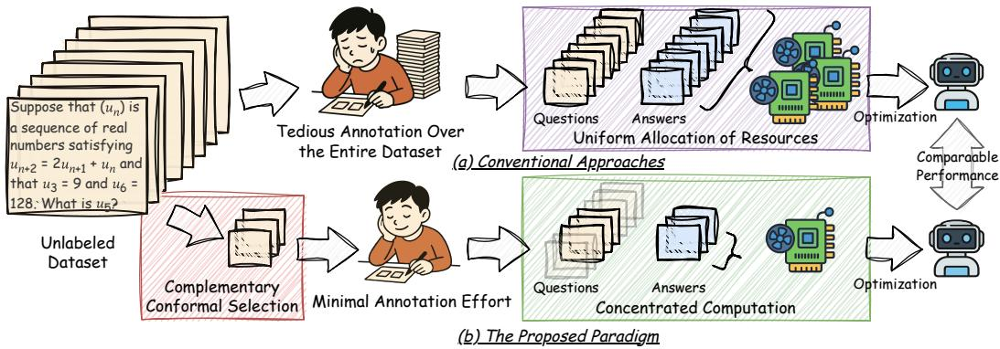
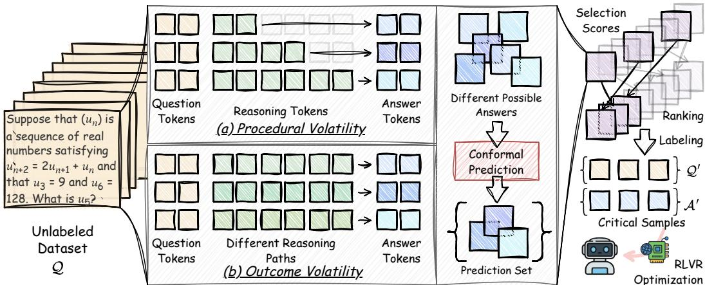
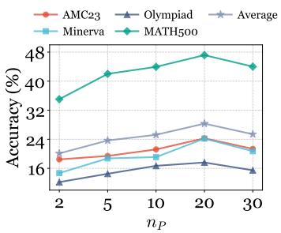
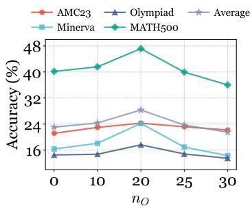
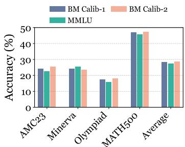

## ABSTRACT

Reinforcement Learning with Verifiable Reward (RLVR) has equipped large language models (LLMs) with the capability of reasoning over complicated logical problems through policy optimization. However, conventional methods require complete annotation of the entire dataset and allocate computation resources uniformly over all samples. We articulate the lottery sample hypothesis in policy optimization of LLMs: a large training set contains a small subset that, when trained alone, yields performance comparable to that of the full dataset. This paper therefore explores the following question: How can we identify these lotterywinning samples from the original dataset without access to answers? Unlike those prior efforts that analyze the effect of different samples in the training set with complete annotation, this paper focuses on the unsupervised discovery of critical instances for LLM reasoning and proposes a novel framework termed Complementary Conformal Selection (CONST). Specifically, CONST evaluates the importance of samples by considering two complementary components: procedural volatility and outcome volatility. Procedural volatility measures the potential variations during the LLM’s reasoning process, while outcome volatility captures inconsistencies in the final answer. Subsequently, conformal prediction is used to obtain a prediction set whose cardinality serves as the criterion for selecting the lottery-winning samples for annotation. We also provide a theoretical analysis, showing that CONST can effectively approximate the optimal policy. Extensive experiments on various LLMs across different datasets demonstrate that CONST is annotation-efficient, high-performing and model-agnostic. The code is available at https://github.com/YushengZhao/SampleLottery.

## 1 INTRODUCTION

Reinforcement learning (RL) has recently become an essential tool for post-training of large language models (LLMs) (Anil et al., 2023; OpenAI, 2024; 2025; Guo et al., 2025; Du et al., 2025). Policy optimization algorithms (Schulman et al., 2017; Shao et al., 2024) have significantly enhanced the logical reasoning capabilities of LLMs (DeepMind, 2024; Wang et al., 2025a; Ren et al., 2025). For logical problems, directly verifiable answers provide straightforward rewards for reinforcement learning, enabling effective outcome supervision of LLMs. This approach, known as reinforcement learning with verifiable reward (RLVR) (Gao et al., 2024; Lambert et al., 2024), is commonly implemented using algorithms such as Group Relative Policy Optimization (GRPO) (Shao et al., 2024) and its variants (Liu et al., 2025d; Chen et al., 2025; Pang & Jin, 2025; Zhang et al., 2025b).

  
Figure 1: Conventional approaches require tedious full annotation over the entire dataset and allocate computation resources uniformly across the training set. By comparison, this work selects lotterywinning samples from the training set in an unsupervised manner, and then optimizes the model using these critical instances only, achieving comparable performance.

Despite the significant improvement, conventional approaches (Hao et al., 2025; Wu et al., 2025; Di et al., 2025) demand full annotation over the entire dataset for verification, and often allocate computation resources uniformly across the full dataset. Nevertheless, some recent studies in RLVR of LLMs (Chen et al., 2025; Wang et al., 2025c; Vanlioglu, 2025) and many prior works on the more general field of data subset selection and valuation (Paul et al., 2021; Das et al., 2021b; Guo et al., 2022; Das et al., 2024) suggest that the instances in the training set are not equally important, and that training on a small subset may also lead to satisfactory results (Wang et al., 2025c). Based on these findings, we articulate the lottery sample hypothesis in RLVR of LLMs:

## A large training set for RLVR on LLMs contains a small subset that, when trained alone, can achieve performance comparable to that ofthefull dataset.

With this hypothesis, it is possible to break conventional approaches from two aspects (as illustrated in Figure 1): (i) full annotation of the dataset is no longer required, and ground truth answers of several lottery-winning samples are sufficient; (ii) computation can be concentrated on several critical instances. Therefore, this paper explores a central question of this new paradigm:

## How can we find the critical instances (the lottery-winning samples) for RLVR on LLMs from the original training set without annotation?

To answer this question, this paper proposes a novel framework named Complementary Conformal Selection (CONST) for the unsupervised discovery of critical instances in the training set. CONST evaluates the value of each instance from two complementary perspectives: procedural volatility and outcome volatility. Procedural volatility assesses potential variations in reasoning chains by examining how different segments of reasoning affect the final answer. Outcome volatility measures inconsistencies in the final answers produced by different reasoning paths. Both yield multisets (i.e., sets that allow duplicating elements) of results, which are then merged and fed into a conformal prediction module. The conformal prediction produces a prediction set, whose cardinality is used as the criterion for selecting lottery-winning samples. A theoretical analysis is also provided demonstrating that CONST can effectively approximate the optimal policy. We conduct extensive experiments across datasets with various LLMs, showing that CONST outperforms various baselines and enables comparable performance with < 0.5% of the samples. Our contribution is summarized as follows:

❶ New Perspective: We present a probabilistic perspective for the unsupervised identification of critical instances in the full dataset for further annotation and RLVR optimization on LLMs, enabling an annotation-minimal, data-efficient and performance-competitive optimization procedure compared with training on the entire fully annotated dataset.

❷ Novel Methodology with Theoretical Analysis: We propose CONST, a probabilistic approach based on conformal prediction that considers both procedural volatility and outcome volatility in

LLM reasoning, to select lottery-winning samples for annotation and optimization. Notably, we provide a rigorous theoretical analysis of CONST demonstrating that it can effectively approximate the optimal policy parameter setup under the lottery sample hypothesis.

❸ Empirical Validation: We conduct extensive experiments across four mathematical datasets on various LLMs against competing baselines, showing that CONST is (1) annotation-efficient, achieving similar performance to the full dataset with $< ~ 0 . 5 \%$ of the annotation, (2) highperforming, outperforming competitive baselines by 10.97% on average, and (3) modelagnostic, showing consistent improvement across three different architectures.

## 2 PRELIMINARIES

Problem Definition. Given a training set of questions $\mathcal { Q } = \{ X _ { 1 } , X _ { 2 } , . . . , X _ { N } \}$ from the input space $x ,$ conventional RLVR approaches first annotate the dataset with ground truth answers ${ \mathcal { A } } =$ $\{ \mathbf { \dot { Y } } _ { 1 } , Y _ { 2 } , \dots , Y _ { N } \}$ in the output space Y, and then optimize the original LLM $( i . e .$ , the policy) $\pi _ { 0 }$ with RL algorithms $( e . g . , \bar { \mathrm { G R P O } } ) , i . e . , \pi ^ { F } = \Phi ( \pi _ { 0 } , \bar { \mathcal { Q } } , A )$ , where $\bar { \pi } ^ { F }$ is the policy optimized with full data annotation and $\Phi ( \cdot , \cdot , \cdot )$ is the optimization process of RLVR. Our goal is to find a subset of Q with budget $b , i . e . , \mathcal { Q } ^ { \prime } \subset \mathcal { Q }$ and $| \mathcal { Q } ^ { \prime } | = b ,$ , and then annotate the selected data with answers $\mathcal { A } ^ { \prime }$ so that the optimized policy $\pi ^ { P } = \Phi ( \dot { \pi } _ { 0 } , \dot { \mathcal { Q } } ^ { \prime } , \mathcal { A } ^ { \prime } )$ achieves comparable performance to $\pi ^ { F }$

Reinforcement Learning with Verifiable Reward. During the training process of reinforcement learning with verifiable reward, the LLM generates a list of n outputs $\mathsf { \bar { \{ O _ { 1 } , O _ { 2 } , \ldots , O _ { n } \} } }$ for a question $X$ , and the outputs are verified against the ground truth answer Y to obtain the rewards $r _ { 1 } , r _ { 2 } , \ldots , r _ { n }$ , where correct answers receive 1 and incorrect ones 0. In the widely-adopted group relative policy optimization (Shao et al., 2024; Liu et al., 2025c; Guo et al., 2025), the advantage function of each output $O _ { i }$ is computed as:

$$
a _ {i} = \frac {r _ {i} - \mathrm{mean} (\{r _ {j} \} _ {j = 1} ^ {n})}{\mathrm{std} (\{r _ {j} \} _ {j = 1} ^ {n})}.\tag{1}
$$

With this, the GRPO optimization objective can be formulated as follows:

$$
\begin{array}{l} \mathcal {L} _ {\mathrm{GRPO}} = \mathbb {E} _ {O _ {i} \sim \pi_ {\theta^ {\prime}}} \left[ - \frac {1}{n} \sum_ {i = 1} ^ {n} \left(\min \left(\frac {\pi_ {\theta} (O _ {i} | X)}{\pi_ {\theta^ {\prime}} (O _ {i} | X)} a _ {i}, \operatorname{clip} \left(\frac {\pi_ {\theta} (O _ {i} | X)}{\pi_ {\theta^ {\prime}} (O _ {i} | X)}, 1 - \varepsilon , 1 + \varepsilon\right) a _ {i}\right)\right) \right] \\ + \beta \mathcal {D} _ {\mathrm{KL}} (\pi_ {\theta} | | \pi_ {0}), \end{array}\tag{2}
$$

where $\pi _ { \theta }$ is the current policy, $\pi _ { \theta ^ { \prime } }$ is the old policy, and $\pi _ { 0 }$ is the reference policy.

Conformal Prediction. Conformal prediction (CP) (Vovk et al., 2005; Papadopoulos et al., 2007; Angelopoulos et al., 2023; Barber et al., 2023; Su et al., 2024) is a model-agnostic solution to obtain prediction sets (or intervals in regression tasks) that are mathematically guaranteed to cover the ground truth answer with high probabilities. Concretely, given an input from X, a prediction from $\mathcal { V }$ and the prediction model ${ \bar { \pi } } ( { \bar { Y } } | X )$ , a scoring function ${ \overline { { f ^ { \pi } } } } : { \mathcal { X } } \times { \bar { \mathcal { y } } } $ R is defined to quantify the disagreement between the input and the predicted answer. The scoring function is applied to a calibration set $\mathcal { D } ^ { \mathrm { c a l } } = \{ ( X _ { i } ^ { \mathrm { c a l } } , Y _ { i } ^ { \mathrm { c a l } } ) \} _ { i = 1 } ^ { m }$ , which is independently and identically distributed as the dataset under consideration, to obtain the calibration scores $f ^ { \pi } ( X _ { i } ^ { \mathrm { c a l } } , Y _ { i } ^ { \mathrm { c a l } } ) , i = 1 , 2 , \ldots , m$ . For a given confidence level $1 - \alpha ,$ a threshold $\rho$ can be determined by taking the $\frac { \lceil ( m + 1 ) ( 1 - \alpha ) \rceil } { m }$ quantile of these scores. For a given input $X \in { \mathcal { X } }$ , and the predefined error rate $\alpha ,$ the conformal prediction set is guaranteed to cover the correct answer with a probability of $1 - \alpha$ , defined as follows:

$$
\mathcal {C} _ {1 - \alpha} (X) = \{Y \mid f ^ {\pi} (X, Y) \leq \rho \}.\tag{3}
$$

## 3 THE PROPOSED CONST

## 3.1 FRAMEWORK OVERVIEW

The overall idea of this work is to first select the critical instances $\mathcal { Q } ^ { \prime }$ from the training set of questions $\mathcal { Q }$ using the proposed Complementary Conformal Prediction (CONST), then annotate these critical instances with answers $\mathcal { A } ^ { \prime }$ , and finally optimize the LLM using off-the-shelf RLVR algorithms such as GRPO. The proposed CONST evaluates the importance of each instance $X \in \mathcal { Q }$ from two perspectives: procedural volatility and outcome volatility. Procedural volatility measures how the final answer to the input question changes when the reasoning paths are truncated at different stages, while outcome volatility captures the inconsistencies in the final answers produced by different reasoning paths. Conformal prediction is then used to obtain a prediction set for each instance, and the cardinality of these sets serves as the criterion for selecting the critical instances. We illustrate the overall framework in Figure 2.

  
Figure 2: The overall framework of the proposed CONST. CONST selects critical samples via conformal prediction based on both procedural volatility and outcome volatility. The selected samples are then annotated with ground truth answers for standard RLVR optimization on LLMs.

## 3.2 PROCEDURAL VOLATILITY

Questions important for policy optimization are expected to induce reasoning trajectories of significant complexity, as straightforward thinking chains are less likely to substantially enhance the model’s logical reasoning abilities. Therefore, we propose measuring the volatility in the reasoning process by truncating the thinking chains at different stages and prompting the LLM to provide the final answers directly. Simple and straightforward reasoning paths are more likely to yield consistent answers, whereas complex, intricate ones are more likely to exhibit volatility.

Specifically, given a question $X \in \mathcal { Q }$ , we first deterministically sample an output, denoted as $O =$ $[ t _ { 1 } , t _ { 2 } , . . . , t _ { L } ; \widehat { Y } ] = \pi _ { 0 } ( O | X )$ , where $t _ { 1 } , t _ { 2 } , \dots , t _ { L }$ are tokens of the reasoning path and $\widehat { Y }$ is the predicted answer typically enclosed in special formats like $\left\backslash \log \mathbf { x } \{ \right\}$ . We truncate the reasoning path at different stages to obtain a set of truncated reasoning trajectories, defined as follows:

$$
\mathcal {T} (X) = \{[ t _ {1}, t _ {2}, \ldots , t _ {\lceil \frac {i L}{n _ {P}} \rceil} ] \mid i = 1, 2, \ldots , n _ {P} \},\tag{4}
$$

where $n _ { P }$ is the number of stages. Subsequently, we query the LLM with these truncated trajectories and ask the model to directly output a single final answer for each truncated trajectory without reasoning. Formally, we obtain a multiset $( \mathsf { b a g } ) ^ { \mathrm { ~ 1 ~ } }$ for each sample $X \in \mathcal { Q }$ through response truncation and LLM re-querying:

$$
\mathcal {B} ^ {P} (X) = \{\{\widehat {Y} = \pi_ {0} (\widehat {Y} | X, \tau) \mid \tau \in \mathcal {T} (X) \} \}.\tag{5}
$$

## 3.3 OUTCOME VOLATILITY

In addition to procedural volatility, we also consider variations in the final answers. During policy optimization, diverse answers to a question induce gradients from multiple directions, helping the model avoid pitfalls from different sources. To quantify this diversity, we introduce outcome volatility, which evaluates the inconsistencies in the final answers (outcomes) produced by different possible reasoning trajectories sampled from the policy.

In particular, given the original policy (the LLM before RLVR training) $\pi _ { 0 }$ and a question $X \in \mathcal { Q }$ under consideration, we directly sample $n _ { O }$ outputs from the policy to obtain a multiset, i.e.,

$$
\mathcal {B} ^ {O} (X) = \{\{\widehat {Y} _ {i} \mid i = 1, 2, \dots , n _ {O}, \widehat {Y} _ {i} \sim \pi_ {0} (\widehat {Y} | X) \} \}.\tag{6}
$$

## 3.4 CONFORMAL PREDICTION

Procedural volatility and outcome volatility generate multisets for each instance, encompassing the possible answers of LLMs. We are now concerned with how many of these answers are $l i k e l y$ to be the correct answer. To address this, we employ conformal prediction (Vovk et al., 2005; Su et al., 2024) as a theoretically grounded solution. The overall procedures of computing conformal prediction sets have been discussed in Section $^ { 2 , }$ and in the following, we will present the design of the scoring function $f$ and how the prediction sets $\mathcal { C } _ { 1 - \alpha } ( X ) , X \in \bar { \mathcal { Q } }$ are obtained.

As discussed in Section 2, the scoring function $f ^ { \pi _ { 0 } } ( X , Y ) ~ \in ~ \mathbb { R }$ is designed to quantify the disagreement between the input question X and the final answer $Y .$ In other words, when the model ${ \bar { \pi _ { 0 } } } ( Y | X )$ is certain that $Y ^ { ' }$ is the correct answer given the input $X , f ^ { \pi _ { 0 } } ( X , Y )$ will be low, and vice versa. Conformal prediction does not require the scoring function to have theoretical guarantees of the measurement of certainty, although a good measurement is preferred. For each input question $X \in \mathcal { Q }$ and a predicted answer ${ \widehat { Y } } \in { \mathcal { B } } ( X ) = { \mathcal { B } } ^ { P } ( X ) \uplus { \mathcal { B } } ^ { O } ( X )$ , we compute the scoring function by comparing $\widehat { Y }$ with other elements in $B ( X )$ . Specifically, as consistent predictions are a natural sign of certainty (Wang et al., 2022), we use the negative frequency of $\widehat { Y }$ in $B ( X )$ , i.e.,

$$
f _ {\mathrm{NF}} (X, \widehat {Y}) = - \operatorname{freq} (\widehat {Y}; \mathcal {B} (X)) = - \frac {\operatorname{count} _ {\mathcal {B} (X)} (\widehat {Y})}{| \mathcal {B} (X) |},\tag{7}
$$

where $\mathrm { c o u n t } _ { B ( X ) } ( \cdot )$ returns the number of elements in the multiset. Nevertheless, using negative frequency alone as the scoring function may cause the scores to be concentrated on certain values, and therefore, entropy is used for fine-grained measurement, defined as follows:

$$
f _ {\text {ent}} (X, \widehat {Y}) = \frac {H (\mathcal {B} (X))}{\log | \mathcal {B} (X) |} = \frac {- \sum_ {Y ^ {\prime} \in \operatorname{set} (\mathcal {B} (X))} \operatorname{freq} (Y ^ {\prime} ; \mathcal {B} (X)) \log \operatorname{freq} (Y ^ {\prime} ; \mathcal {B} (X))}{\log | \mathcal {B} (X) |},\tag{8}
$$

where $\sec ( \cdot )$ returns the non-repeating elements in the multiset. Finally, the negative frequency and entropic scores are combined to obtain the final scoring function:

$$
f ^ {\pi_ {0}} (X, \widehat {Y}) = f _ {\mathrm{NF}} (X, \widehat {Y}) + \lambda \cdot f _ {\text { ent }} (X, \widehat {Y}),\tag{9}
$$

where λ is a hyperparameter balancing the two terms. With the scoring function, we then calibrate it with a calibration set as described in Section 2 to obtain the threshold ${ \widehat { \rho } } .$ Note that when computing the calibration scores, if the correct answer $Y _ { i } ^ { \mathrm { c a l } }$ does not appear in the final multiset $B ( X _ { i } ^ { \mathrm { c a l } } )$ , we set the score $f ( X _ { i } ^ { \mathrm { c a l } } , Y _ { i } ^ { \mathrm { c a l } } )$ to +∞. Thus, we obtain the conformal prediction set for each $X \in \mathcal { Q }$ as:

$$
\widehat {\mathcal {C}} _ {1 - \alpha} (X) = \{\widehat {Y} \in \operatorname{set} (\mathcal {B} (X)) \mid f ^ {\pi_ {0}} (X, \widehat {Y}) \leq \widehat {\rho} \}.\tag{10}
$$

## 3.5 MODEL OPTIMIZATION

The size of the conformal prediction set naturally measures how many of the answers that the model considers likely to be correct. A larger size indicates richer and more effective optimization $\mathrm { s i g \mathrm { - } }$ nals associated with the correct answer during model training. Therefore, we use the size of the conformal prediction set as the criterion for selecting critical samples. Additionally, to encourage sample diversity, we cluster the set of questions $\mathcal { Q }$ into b groups $\mathbf { \bar { \mathcal { Q } } } _ { 1 } , \mathcal { Q } _ { 2 } , \ldots , \mathcal { Q } _ { b }$ before selecting the samples from each group. Formally, the selection process can be written as follows:

$$
\mathcal {Q} ^ {\prime} = \left\{\underset {X \in \mathcal {Q} _ {i}} {\arg \max} | \widehat {\mathcal {C}} _ {1 - \alpha} (X) | \mid i = 1, 2, \ldots , b \right\}.\tag{11}
$$

With the selected set of questions $\mathcal { Q } ^ { \prime } \subset \mathcal { Q }$ , we annotate this small subset to obtain its ground truth answers $\mathcal { A } ^ { \prime }$ . Finally, we use the standard RLVR algorithm $( i . e . , \mathrm { G R P O } )$ , as described in Section $^ { 2 , }$ to optimize the model $\pi _ { 0 }$ with $\mathcal { Q } ^ { \prime }$ and $\mathcal { A } ^ { \prime }$ to obtain $\pi ^ { \mathcal { P } }$ as our final model. A summary of the execution pipeline of the proposed CONST is presented in Algorithm 1.

Algorithm 1: The execution pipeline of CONST

Input: The set of questions Q, the original policy  $\pi_{0}$ , the calibration set  $\mathcal{D}^{\mathrm{cal}} = \{(X_{i}^{\mathrm{cal}}, Y_{i}^{\mathrm{cal}})\}_{i=1}^{m}$ 

1 Initialize CalScoreList and SizeList as empty lists

2 for iteration  $i \leftarrow 1$  to m do // Calibrate the scoring function

3 Calculate the score  $f^{\pi_{0}}(X_{i}^{\mathrm{cal}}, Y_{i}^{\mathrm{cal}})$  with Eq. 9 and append it to CalScoreList

4 end

5 Find the  $\frac{[(m+1)(1-\alpha)]}{m}$  quantile of CalScoreList as  $\widehat{\rho}$ 

6 for iteration  $i \leftarrow 1$  to N do // Obtain the conformal prediction sets

7 Calculate the multiset of possible answers  $\mathcal{B}(X_{i})$  according to Eq. 5 and Eq. 6

8 Calculate the score  $f^{\pi_{0}}(X_{i}, \widehat{Y}_{i})$  for each  $\widehat{Y}_{i} \in \mathcal{B}(X_{i})$  with Eq. 9

9 Obtain the prediction set  $\widehat{\mathcal{C}}_{1-\alpha}(X)$  with  $\widehat{\rho}$  using Eq. 10 and append the size of it to SizeList

10 end

11 Cluster Q into b groups  $Q_{1}, Q_{2}, \ldots, Q_{b}$ 

12 Select the question with the largest size from each group to form  $Q'$  // Select critical samples

13 Annotate  $Q'$  with ground truth answers  $A'$  // Annotate several samples

14 Optimize  $\pi_{0}$  with  $Q'$  and  $A'$  to obtain the optimized model  $\pi^{P}$  // Optimize the policy using RL

15 return  $\pi^{P}$  as the optimized model

## 3.6 THEORETICAL ANALYSIS

Here, we aim to provide a theoretical understanding of our proposed CONST under the lottery sample hypothesis. Before going into the details, we first review the basic notions of ergodic Markov decision processes and mixing time (Puterman, 1990).

Definition 3.1. A Markov decision process $\mathcal { M } \triangleq ( \mathcal { S } , \mathcal { A } , P , r , \gamma )$ is ergodic if the induced Markov chain under any stationary policy admits a unique stationary distribution $\rho _ { \infty } .$ . Moreover, the underlying Markov chain ofan ergodic MDP is said to mix in time $t _ { m i x } ( \epsilon ) \ i f$

$$
t _ {m i x} (\epsilon) \triangleq \min \{t \geq 0: \max _ {s \in \mathcal {S}} \big (\max _ {A \subseteq \mathcal {S}} (| \operatorname * {P r} (Y _ {t} \in A | Y _ {0} = s) - \rho_ {\infty} (A) |) \big) \leq \epsilon \},
$$

where $( Y _ { 0 } , Y _ { 1 } \ldots , Y _ { t } \ldots )$ denotes an induced Markov chain under any stationary policy and $\epsilon > 0$ Remark 3.1. When $\epsilon < 1 / 2 ,$ , choosing a different ϵ only changes the mixing time up to a constant factor (Levin & Peres, 2017) and so one oftenfixes $\epsilon = 1 / 4$ and simply writes $t _ { m i x } \triangleq t _ { m i x } ( 1 / 4 )$

With the concept of ergodic MDP, we next establish a generalization bound for our proposed CONST under the lottery sample hypothesis. Before doing so, we first introduce some frequently used notations. Specifically, since CONST only utilizes a subset of training instances $\mathcal { Q } ^ { \prime } \subset \mathcal { Q }$ to optimize policy πθ where $| \dot { \mathcal { Q } ^ { \prime } } | = b .$ . So, for any subset $S \subset \mathcal { Q } .$ , we define the empirical GRPO loss on $S$ as follows:

$$
\hat {\mathcal {L}} _ {\mathrm{GRPO}} ^ {S} = - \frac {1}{n | S |} \sum_ {X \in S} \sum_ {i = 1} ^ {n} \min \left(\frac {\pi_ {\theta} (O _ {i} | X)}{\pi_ {\theta^ {\prime}} (O _ {i} | X)} a _ {i}, \operatorname{clip} \left(\frac {\pi_ {\theta} (O _ {i} | X)}{\pi_ {\theta^ {\prime}} (O _ {i} | X)}, 1 - \varepsilon , 1 + \varepsilon\right) a _ {i}\right) + \mathcal {D} _ {\mathrm{KL}} (\pi_ {\theta} | | \pi_ {0}),
$$

where $\begin{array} { r } { \boldsymbol { a } _ { i } ~ \triangleq ~ \frac { r _ { i } - \mathrm { m e a n } ( \{ r _ { j } \} _ { j \in S } ) } { \mathrm { s t d } ( \{ r _ { j } \} _ { j \in S } ) } } \end{array}$ is the advantage calculated based on relative rewards. With this symbol, we then present the approximation assumption about the chosen subset $\mathcal { Q } ^ { \prime }$ , that is to say,

Assumption 3.1 (Lottery Sample Hypothesis). Subset $\mathcal { Q } ^ { \prime }$ is said to be an ϵ-approximation ofthefull training set $\begin{array} { r } { Q \triangleq \{ X _ { 1 } , X _ { 2 } , \ldots , X _ { N } \} \ i f \| \nabla \hat { \mathcal { L } } _ { G R P O } ^ { Q ^ { \prime } } ( \theta ) - \nabla \hat { \mathcal { L } } _ { G R P O } ^ { Q } ( \theta ) \| _ { 2 } \leq \epsilon } \end{array}$ holdsfor any parameter vector θ where the symbol $\| \cdot \| _ { 2 }$ denotes $l _ { 2 }$ norm and $\epsilon > 0 .$

Next, we make some standard assumptions in optimization theory (Li et al., 2018; Yue et al., 2023).

Assumption 3.2 (Smoothness). The objective $\hat { \mathcal { L } } _ { G R P O } ^ { Q } ( \theta )$ is L-smooth, that is, $\hat { \mathcal { L } } _ { G R P O } ^ { Q } ( \theta )$ is differentiable and there exists a constant $L > 0$ such that $\| \nabla \hat { \mathcal { L } } _ { G R P O } ^ { Q } ( x ) - \nabla \hat { \mathcal { L } } _ { G R P O } ^ { Q } ( y ) \| _ { 2 } \leq L \| x - y \| _ { 2 }$ Assumption 3.3 (Polyak-Łojasiewicz Condition). There exists a constant $\mu ~ > ~ 0$ such that $\begin{array} { r } { 2 \mu ( \hat { \mathcal { L } } _ { G R P O } ^ { Q ^ { - } } ( \theta ) - \hat { \mathcal { L } } _ { G R P O } ^ { Q } ( \theta _ { G R P O } ^ { * } ) ) \leq \| \nabla \hat { \mathcal { L } } _ { G R P O } ^ { Q } ( \theta ) \| _ { 2 } ^ { 2 } } \end{array}$ where $\theta _ { G R P O } ^ { * } \triangleq$ arg min $\hat { \mathcal { L } } _ { G R P O } ^ { Q } ( \theta )$ .

Furthermore, we suppose, at line 14 of Algorithm 1, the policy parameter vector θ is updated by standard gradient descent, $\begin{array} { r } { i . e . , \theta _ { k + 1 } \triangleq \theta _ { k } - \frac { 1 } { L } \nabla \hat { \mathcal { L } } _ { \mathrm { G R P O } } ^ { \mathcal { Q } ^ { \prime } } ( \theta ) } \end{array}$ , where $L$ denotes the smoothness parameter. With all these preparations, we can have the following generalization theorem:

Theorem 3.1 (Proof is deferred to Appendix $\mathrm { A } )$ . Under Assumption 3.1-3.3, if the underlying MDP ${ \mathcal { M } } \triangleq ( S , { \mathcal { A } } , P , r , \gamma )$ is ergodic with mixed time $t _ { m i x }$ and the gradient $\nabla \hat { \mathcal { L } } _ { G R P O } ^ { \mathcal { Q } } ( \theta )$ is bounded, $i . e .$ $\| \nabla \hat { \mathcal { L } } _ { G R P O } ^ { Q } ( \theta ) \| _ { 2 } \le G$ , then thefollowing inequality holds with probability greater than $1 - \delta ,$ that $i s ,$

$$
\begin{array}{r l} & {\mathcal {L} _ {G R P O} (\theta_ {k}) - \mathcal {L} _ {G R P O} (\theta^ {*}) \leq 4 \mathcal {R} (\mathcal {F} _ {G R}) + \mathcal {O} \Big (\sqrt {\frac {t _ {m i x} \sigma_ {R} ^ {2} (1 - \frac {1}{n}) \ln (\frac {1}{\delta})}{N n}} + \frac {\ln (\frac {1}{\delta})}{N n (1 - \gamma)} \Big)} \\ & {\qquad + (1 - \frac {\mu}{L}) ^ {k + 1} \hat {\mathcal {L}} _ {G R P O} ^ {Q} (\theta_ {0}) + \frac {2 G}{\mu} \epsilon + \frac {\epsilon^ {2}}{2 \mu},} \end{array}
$$

where $\theta ^ { * } \triangleq$ ar $\dim _ { \theta } { \mathcal { L } } _ { G R P O } ( \theta ) , { \mathcal { R } } ( { \mathcal { F } } _ { G R } )$ is the Rademacher complexity of the group-relative loss function space $\mathcal { F } _ { G R } ,$ N denotes the size of full training set $\mathcal { Q } ,$ n is size of outputs for each question and $\sigma _ { R } ^ { 2 }$ is an upper bound of variance of the return $\{ r _ { i } \} _ { i = 1 } ^ { n } ,$ , i.e., $V a r _ { \pi _ { \theta } } ( r _ { i } ) \stackrel { \textstyle \sim } { \le } \sigma _ { R } ^ { 2 }$ , ∀θ.

Remark 3.2. Note that Rademacher complexity serves as a measure of the policy network’s capacity tofit the training data, reflecting the richness ofthefunction class it can represent. As a result, under the Lottery Sample Hypothesis, Theorem 3.1 implies that with sufficiently large question dataset and verified rewards, our proposed CONST can effectively approximate the optimal policy parameter $\theta ^ { * }$

## 4 EXPERIMENTS

## 4.1 EXPERIMENTAL SETUP

Datasets and Evaluation. During model training, we use the BigMath-sub dataset, a randomly selected subset containing 2048 instances of the BigMath dataset (Albalak et al., 2025). During the test phase, we use four mathematical reasoning datasets widely adopted in RLVR evaluation, $i . e . ,$ AMC 23 (problems & solutions, 2023), MinervaMath (Lewkowycz et al., 2022), OlympiadBench (He et al., 2024), and MATH500 (Hendrycks et al., 2021c; Lightman et al., 2023), with details deferred to Appendix B.1. In the experiments, we report the avg@256 accuracy metric for the smaller AMC23 dataset, and avg@32 for other datasets following prior works (Zuo et al., 2025; Wang et al., 2025c). To reduce randomness in instance selection, we repeat the algorithms three times and report the average result. More details can be found in Appendix B.2.

Baselines. We compare the proposed CONST against various baselines, i.e., (1) NoFinetuning, which uses the original model for inference, (2) RandSelect, which annotates randomly selected instances for training, (3) active learning algorithms, including EntSampling (Settles, 1995), BADGE (Ash et al., 2020), and CEC (Safaei & Patel, 2025), and (4) reasoning-specific selection strategies, including SCF (Wang et al., 2022) and EWS (Beygelzimer et al., 2009). More details about the baseline methods can be found in Appendix B.3 and Appendix C.3.

Implementation Details. We adopt LLaMA-3.1-8B-Instruct (Grattafiori et al., 2024), DeepSeek-R1-Distill-Qwen-1.5B (Guo et al., 2025), Qwen2.5-Math-1.5B, and Qwen2.5-Math-7B (Yang et al., 2024) for RLVR training. For the calibration set, we use 1024 instances randomly selected from BigMath (ensuring no overlap with BigMath-sub), and to justify the robustness of CONST to the choice of the calibration set, MMLU (Hendrycks et al., 2021a;b) is used as an alternative. For procedural volatility, we set the number of stages $n _ { P }$ to 20, and for outcome volatility, we set $n _ { O }$ to 20. In conformal prediction, we set the error rate α to 0.1 and λ to 0.02. For the budget of annotation, we report the results of 4 and 8 instances. For the clustering step, we use Sentence-BERT (Reimers & Gurevych, 2019) to obtain the embeddings of the input queries, and use the K-means algorithm to obtain the clusters. The number of clusters is set to $b ,$ which is the budget of annotation. For the RLVR optimization hyperparameter setup, we generally follow the training configuration of Wang et al. (2025c). By default, we set the maximum number of tokens to 8192 in training and 3072 in inference, the learning rate to $1 \times 1 0 ^ { - 6 }$ , the weight decay to 0.01, the hyperparameter of $\beta$ in GRPO (Eq. 2) to $1 \times 1 0 ^ { - 3 }$ , the batch size to 64, and 8 gradient updates for each rollout. We train the model for at most 500 iterations and evaluate the model every 20 iterations. During training, we duplicate the samples to occupy a single batch. We use the VERL framework (Sheng et al., 2024) for RLVR training and inference. For the computation hardware, we use 4 NVIDIA H800 for both training and inference.

Table 1: Performance comparison with various baselines and training on the full dataset under the avg@32 (avg@256 for AMC23) metric. We mark the best in bold and runner-ups with underline.

<table><tr><td>Datasets</td><td colspan="2">AMC23</td><td colspan="2">MinervaMath</td><td colspan="2">OlympiadBench</td><td colspan="2">MATH500</td><td colspan="2">AVG</td></tr><tr><td>Budget</td><td>4</td><td>8</td><td>4</td><td>8</td><td>4</td><td>8</td><td>4</td><td>8</td><td>4</td><td>8</td></tr><tr><td colspan="11">LLaMA-3.1-8B-Instruct</td></tr><tr><td>NoFinetuning</td><td colspan="2">18.03</td><td colspan="2">14.37</td><td colspan="2">12.28</td><td colspan="2">35.79</td><td colspan="2">20.12</td></tr><tr><td>RandSelect</td><td>19.48</td><td>18.34</td><td>16.77</td><td>18.05</td><td>13.54</td><td>13.87</td><td>39.02</td><td>39.03</td><td>22.20</td><td>22.32</td></tr><tr><td>EntSampling</td><td>20.42</td><td>19.70</td><td>16.66</td><td>18.12</td><td>13.43</td><td>13.14</td><td>37.29</td><td>36.33</td><td>21.95</td><td>21.82</td></tr><tr><td>BADGE</td><td>19.34</td><td>20.02</td><td>20.25</td><td>19.28</td><td>13.27</td><td>13.81</td><td>41.72</td><td>42.68</td><td>23.95</td><td>23.65</td></tr><tr><td>CEC</td><td>20.25</td><td>21.24</td><td>16.66</td><td>18.50</td><td>13.05</td><td>15.02</td><td>38.03</td><td>42.97</td><td>21.79</td><td>24.43</td></tr><tr><td>CONST (ours)</td><td>20.62</td><td>24.27</td><td>21.68</td><td>24.19</td><td>16.83</td><td>17.61</td><td>43.46</td><td>47.17</td><td>25.65</td><td>28.31</td></tr><tr><td>FullDataset</td><td colspan="2">24.30</td><td colspan="2">20.99</td><td colspan="2">18.23</td><td colspan="2">48.58</td><td colspan="2">28.03</td></tr><tr><td colspan="11">DeepSeek-R1-Distill-Qwen-1.5B</td></tr><tr><td>NoFinetuning</td><td colspan="2">30.94</td><td colspan="2">14.17</td><td colspan="2">17.68</td><td colspan="2">50.03</td><td colspan="2">28.21</td></tr><tr><td>RandSelect</td><td>40.96</td><td>54.55</td><td>19.28</td><td>23.31</td><td>25.02</td><td>33.68</td><td>64.29</td><td>72.96</td><td>37.39</td><td>46.13</td></tr><tr><td>EntSampling</td><td>54.91</td><td>54.88</td><td>22.23</td><td>22.55</td><td>32.68</td><td>32.98</td><td>71.79</td><td>71.97</td><td>45.40</td><td>45.60</td></tr><tr><td>BADGE</td><td>42.84</td><td>50.13</td><td>21.39</td><td>23.20</td><td>27.62</td><td>30.76</td><td>67.73</td><td>71.04</td><td>39.90</td><td>43.78</td></tr><tr><td>CEC</td><td>49.75</td><td>51.46</td><td>21.88</td><td>22.14</td><td>30.50</td><td>31.50</td><td>69.96</td><td>71.44</td><td>43.02</td><td>44.14</td></tr><tr><td>CONST (ours)</td><td>55.84</td><td>59.16</td><td>23.17</td><td>23.66</td><td>33.66</td><td>34.90</td><td>73.61</td><td>74.84</td><td>46.57</td><td>48.14</td></tr><tr><td>FullDataset</td><td colspan="2">60.27</td><td colspan="2">24.55</td><td colspan="2">36.30</td><td colspan="2">75.49</td><td colspan="2">49.15</td></tr><tr><td colspan="11">Qwen2.5-Math-1.5B</td></tr><tr><td>NoFinetuning</td><td colspan="2">31.74</td><td colspan="2">9.47</td><td colspan="2">21.72</td><td colspan="2">36.23</td><td colspan="2">24.79</td></tr><tr><td>RandSelect</td><td>44.66</td><td>46.88</td><td>15.19</td><td>21.35</td><td>30.94</td><td>30.46</td><td>64.32</td><td>65.74</td><td>38.78</td><td>41.11</td></tr><tr><td>EntSampling</td><td>40.64</td><td>42.43</td><td>17.69</td><td>20.62</td><td>27.24</td><td>27.32</td><td>59.79</td><td>62.26</td><td>36.34</td><td>38.16</td></tr><tr><td>BADGE</td><td>44.61</td><td>46.73</td><td>19.91</td><td>20.97</td><td>28.87</td><td>29.54</td><td>63.69</td><td>64.88</td><td>39.27</td><td>40.53</td></tr><tr><td>CEC</td><td>42.42</td><td>45.32</td><td>13.67</td><td>21.24</td><td>28.00</td><td>30.88</td><td>59.11</td><td>68.87</td><td>35.80</td><td>41.58</td></tr><tr><td>CONST (ours)</td><td>47.19</td><td>48.42</td><td>20.01</td><td>24.54</td><td>32.05</td><td>32.75</td><td>67.68</td><td>69.58</td><td>41.73</td><td>43.82</td></tr><tr><td>FullDataset</td><td colspan="2">49.13</td><td colspan="2">24.30</td><td colspan="2">33.33</td><td colspan="2">70.88</td><td colspan="2">44.41</td></tr><tr><td colspan="11">Qwen2.5-Math-7B</td></tr><tr><td>NoFinetuning</td><td colspan="2">56.04</td><td colspan="2">33.90</td><td colspan="2">37.28</td><td colspan="2">81.03</td><td colspan="2">52.06</td></tr><tr><td>RandSelect</td><td>57.05</td><td>57.48</td><td>35.26</td><td>35.91</td><td>38.29</td><td>38.77</td><td>81.58</td><td>81.90</td><td>53.05</td><td>53.52</td></tr><tr><td>EntSampling</td><td>56.95</td><td>57.87</td><td>35.36</td><td>35.37</td><td>38.46</td><td>38.63</td><td>81.88</td><td>81.89</td><td>53.16</td><td>53.44</td></tr><tr><td>BADGE</td><td>54.36</td><td>56.76</td><td>34.12</td><td>35.08</td><td>37.63</td><td>38.92</td><td>80.81</td><td>82.25</td><td>51.73</td><td>53.25</td></tr><tr><td>CEC</td><td>56.03</td><td>58.28</td><td>34.73</td><td>35.21</td><td>38.41</td><td>39.18</td><td>81.70</td><td>82.16</td><td>52.72</td><td>53.71</td></tr><tr><td>CONST (ours)</td><td>58.21</td><td>59.05</td><td>35.83</td><td>36.97</td><td>39.56</td><td>40.19</td><td>82.94</td><td>83.55</td><td>54.14</td><td>54.94</td></tr><tr><td>FullDataset</td><td colspan="2">58.70</td><td colspan="2">36.66</td><td colspan="2">41.04</td><td colspan="2">83.61</td><td colspan="2">55.00</td></tr></table>

## 4.2 PERFORMANCE COMPARISON

We compare the proposed CONST with various baselines across different LLM architectures on four mathematical reasoning datasets with varying budget sizes, and report the avg@32 (avg@256) metric in Table 1. According to the results, we make several observations (Obs.) listed as follows: Obs.❶ CONST significantly improves vanilla models across various scenarios, outperforming baselines. For example, using only 8 critical instances, CONST significantly improves vanilla LLaMA-3.1-8B-Instruct by 40.71%, DeepSeek-R1-Distill-Qwen-1.5B by 70.65%, and Qwen2.5-Math-1.5B by 76.76%, surpassing competitive active learning baselines not designed for reinforcement learning on LLMs (e.g., BADGE and CEC). Obs.❷ Training on critical instances discovered by CONST achieves comparable results to training on the full dataset. The results in Table 1 demonstrate that with less than 0.5% of the samples selected by CONST in an unsupervised manner, we can achieve very similar performance on average: less than 1.09% difference in terms of avg@k accuracy for budget 8. This confirms the value of these lottery-winning samples and our method that discovers them without access to ground truth answers.

## 4.3 ABLATION STUDIES

We then investigate how the different components or mechanisms in CONST affect the final performance. In particular, we design six variants of CONST, denoted as V1 to V6. V1 removes conformal prediction and randomly selects instances from each cluster. V2 skips clustering and chooses samples with the largest conformal prediction sets. V3 uses entropy in Eq. 8 instead of conformal prediction sets to select instances in each cluster. V4 explores alternative configurations in Eq. 11 by clustering instances into $b / 2$ groups and selecting the top 2 items with the highest conformal prediction sets. V5 removes procedural volatility, and V6 removes outcome volatility. We perform experiments on LLaMA-3.1-8B-Instruct with the budget of 8, and the results in terms of avg@32 (avg@256) are shown in Table 2, from which we have the following observations: Obs.❸ All components or mechanisms in CONST contribute to the final performance. As shown in the table, removing any of the proposed techniques consistently decreases accuracy across datasets, demonstrating the effectiveness of conformal prediction, procedural/outcome volatility, and clustering. Obs.❹ Conformal prediction plays an important role. The results show that replacing conformal prediction with alternatives such as random selection or entropy selection leads to severe performance degradation (i.e., 5% drop in terms of absolute accuracy).

  
Figure 3: Left: performance under different numbers of stages $( n _ { P } )$ . Middle: performance under different numbers of samples (nO). Right: robustness to different choices of the calibration set.

## 4.4 FURTHER ANALYSIS

Performance under Different Hyperparameters. We then show the model’s performance (in terms of $\mathtt { a v g } \ @ 3 2 / \mathtt { a v g } \ @ 2 5 6 )$ under different hyperparameters: the number of stages (i.e., $n _ { P } )$ in procedural volatility (Eq. 4) and the number of samples $( i . e . , n _ { O } )$ in outcome volatility (Eq. 6). The experimental results on $_ { \mathrm { L L a M A } - 3 , 1 - 8 \mathrm { B - I n s t r u c t } }$ are shown in Figure 3 (Left and Middle).

Table 2: Ablation study of CONST with the budget of 8.

<table><tr><td>Variants</td><td>AMC23</td><td>Minerva Math</td><td>Olympiad Bench</td><td>MATH 500</td><td>AVG</td></tr><tr><td>V1</td><td>20.87</td><td>16.89</td><td>13.76</td><td>40.53</td><td>23.01</td></tr><tr><td>V2</td><td>22.03</td><td>21.37</td><td>15.18</td><td>43.60</td><td>25.54</td></tr><tr><td>V3</td><td>19.98</td><td>17.64</td><td>14.79</td><td>40.79</td><td>23.30</td></tr><tr><td>V4</td><td>22.97</td><td>25.02</td><td>17.11</td><td>45.31</td><td>27.60</td></tr><tr><td>V5</td><td>23.96</td><td>20.21</td><td>16.56</td><td>44.80</td><td>26.38</td></tr><tr><td>V6</td><td>21.16</td><td>16.34</td><td>14.50</td><td>40.16</td><td>23.04</td></tr><tr><td>CONST</td><td>24.27</td><td>24.19</td><td>17.61</td><td>47.17</td><td>28.31</td></tr></table>

From the results, we observe that: Obs.❺ Both $n _ { P }$ and $n _ { O }$ achieve best performance at 20. The number of stages $n _ { P }$ controls the granularity of procedural volatility: when the granularity is too coarse (small nPs), it may be difficult to capture the twists and turns in the reasoning trajectories; when the granularity is small (large nPs), it may frequently interrupt the logic fragments. On the other hand, n controls the balance of procedural volatility and outcome volatility in the multiset $B ( X )$ , which affects the scoring function and thus conformal prediction sets.

Robustness to Different Choice of Calibration Sets. CONST requires a calibration set, and therefore, we also investigate the method’s robustness under different choices of the calibration sets. Specifically, we adopt three sets: (1) BM Calib-1, which is the original one; (2) BM Calib-2, which is also sampled from the BigMath dataset with no overlap with the training set; (3) MMLU, which contains mathematical questions from the MMLU dataset. The results on LLaMA are presented in Figure 3 (Right), and we observe that: Obs.❻ The proposed method is robust to the choice of calibration sets. Using a calibration set with identical distributions to the training set (i.e., BM Calib-1 and BM Calib-2) yields similar high accuracy on average. When using a calibration set with a different distribution (i.e., MMLU), there is a slight decrease, but the difference is marginal on average, showing that CONST is robust to the different choices of the calibration set. The results also indicate that it is possible to use existing datasets that are already annotated (e.g., MMLU) as the calibration set to avoid the need to annotate the calibration set.

## 5 RELATED WORKS

Reinforcement Learning for LLM Reasoning. LLMs and their transformer architecture have become a promising solution in many fields, including multimodal understanding (He et al., 2021;

Zhao et al., 2022; 2025b; Huang et al., 2025), formal languages (Zhao et al., 2025e), time-series understanding (Zhao et al., 2025d), and graph data (Zhao et al., 2025h). Reinforcement learning (Sutton et al., 1999; Havrilla et al., 2024a; Wen et al., 2024; Liu et al., 2025a) has significantly enhanced the reasoning capabilities of LLMs via rewards from verifiable answers (Shao et al., 2024; Mroueh, 2025; Wen et al., 2025) or reward models (Dong et al., 2024; Setlur et al., 2024; Qu et al., 2025). Early efforts (Sprueill et al., 2023; Deng et al., 2024; Wang et al., 2024) mainly focus on supervising the LLMs’ reasoning process, often involving the value functions (Havrilla et al., 2024b; Zhai et al., 2025; Yuan et al., 2025; Zhang et al., 2025a). More recently, outcome supervision, with the reward obtained from verifiable ground truth answers, has received increasing attention (Shao et al., 2024; Liu et al., 2025b; Su et al., 2025; Liu et al., 2025c), due to its simplicity and the immunity from reward hacking (Gao et al., 2024; Fu et al., 2025; Miao et al., 2025).

Conformal Prediction. Conformal prediction (Vovk et al., 2005; Tibshirani et al., 2019; Angelopoulos et al., 2023; Straitouri et al., 2023; Kiyani et al., 2024a; Gibbs et al., 2025) is a modelagnostic and distribution-free solution of uncertainty quantification (Stracuzzi et al., 2017; Wang et al., 2019; Psaros et al., 2023), with solid mathematical foundations (Fontana et al., 2023; Angelopoulos et al., 2024). It generates prediction sets that contain the ground truth answer under a predefined error rate. While most prior efforts focus on conformal prediction with smaller classification or regression models (Correia et al., 2024; Jeary et al., 2024; Cresswell et al., 2024; Zhou et al., 2025), its adoption in natural language processing (Campos et al., 2024), and particularly LLMs (Cherian et al., 2024; Kiyani et al., 2024b; Su et al., 2024; Mohri & Hashimoto, 2024; Wang et al., 2025b; Chankaev & Ilyushin, 2025), has received increasing attention. Compared to these prior works, this paper uses conformal prediction to guide the selection of critical samples.

Active Learning. Active learning (Cohn et al., 1994; 1996; Baram et al., 2004; Castro et al., 2008; Ren et al., 2021) aims to optimize deep learning models with limited annotation efforts. It is particularly useful when the ground truth answers can only be obtained with relatively high costs (Konyushkova et al., 2017; Yuan et al., 2023; Xiao et al., 2023; Chen et al., 2024), and facilitates other tasks like test-time learning (Zhao et al., 2025a;g; Zuo et al., 2025). With the success of LLMs, efforts have been made in both LLM for active learning, which uses LLMs for active annotation (Margatina et al., 2023; Melo et al., 2024; Li et al., 2024; Kholodna et al., 2024; Ceravolo et al., 2024; Astorga et al., 2024; Xia et al., 2025), and active learning for LLMs, which adopts active learning for optimizing LLMs (Muldrew et al., 2024; Sun et al., 2024; Zhang et al., 2024a; Hubotter¨ et al., 2024; Zhang et al., 2024b). In this paper, we explore active learning to optimize the reasoning capability of LLMs with a data-efficient and performance-competitive reasoning framework.

Data Selection and Valuation. Data selection and valuation (Das et al., 2020; Paul et al., 2021; Wang & Jia, 2023; Das et al., 2024; Ebiele et al., 2025) aim to find the most valuable data in the training set to save computational resources, which is also an important part of data-centric methods (Zhao et al., 2025f;c). For example, Paul et al. (Paul et al., 2021) use the loss function and its gradients to select important examples very early in training. Guo et al. (Guo et al., 2022) provide a comprehensive code library in addition to extensive evaluation for data subset selection and valuation. Das et al. (Das et al., 2024) propose CheckSelect, a flexible, accurate, robust, and efficient method for extracting the high-value subsets. Nevertheless, many works on data subset selection and valuation assume complete annotation of the training set by computing the loss function or its gradients (Paul et al., 2021; Wang & Jia, 2023; Das et al., 2024), and conducted primarily in the domain of vision (Das et al., 2020; 2021a; Paul et al., 2021). By comparison, this work proposes CONST that aims to find important training data (the critical instances) without the annotation, and only annotate the important instances to achieve annotation-efficient RLVR optimization of LLMs.

## 6 CONCLUSION

This paper investigates an important question: how can we identify the lottery-winning samples from the original dataset without access to answers, thereby enabling an annotation-minimal, dataefficient and performance-competitive alternative for optimizing the reasoning capability of LLMs. Through the design of our novel CONST framework, a probabilistic method grounded in the mathematical foundation of conformal prediction and incorporating complementary considerations of procedural and outcome volatility, we demonstrate that the unsupervised discovery of critical instances in full datasets can achieve comparable performance with significantly less annotation efforts.