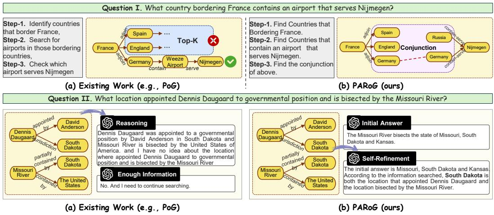
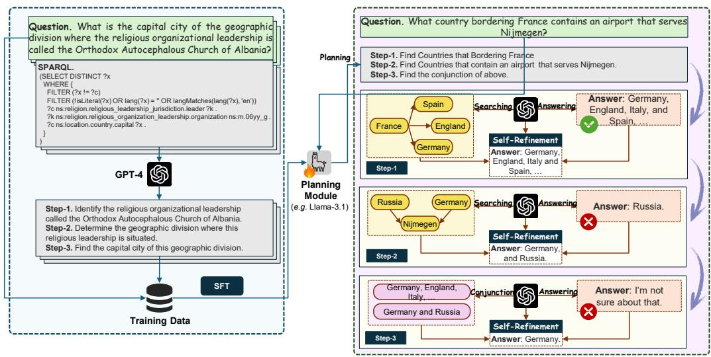
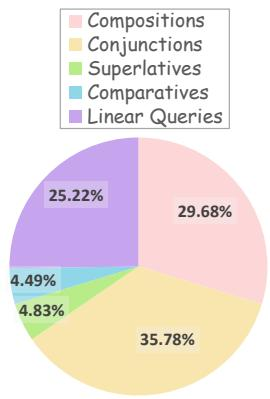
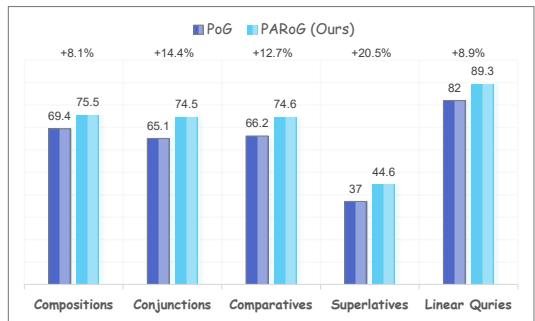

## ABSTRACT

Incorporating knowledge graphs (KGs) into large language model (LLM) reasoning has shown promise in alleviating hallucinations and factual errors. Although existing paradigms of KG-augmented LLMs have achieved encouraging results, they still exhibit notable limitations when handling multi-hop reasoning and complex logical queries: (1) search space truncation bias: current methods generate linear entity-relation reasoning paths, which can prune correct candidates prematurely during iterative exploration; and (2) entity error amplification: existing methods typically follow the retrieve-and-answer paradigm which causes LLMs to over-rely on retrieved evidence, exacerbating the impact of incorrect entities during reasoning. To alleviate the existing challenges, we propose Plan-Answer-Refine-on-Graph (PARoG), a novel framework for LLM reasoning on knowledge graphs. First, PARoG leverages SPARQL queries from KG data as references, decomposing them into structured step-by-step plans. We further train LLMs to construct such structured plans, which improves the logical consistency of reasoning, ensures uniform step granularity, and facilitates effective execution on the graph. Second, during reasoning over KGs, PARoG adopts a plan-answer-refine paradigm: the model first attempts to answer each sub-query independently, and then refines its prediction by integrating evidence retrieved from the KG. This process mitigates knowledge conflicts between LLM and KG, substantially reducing hallucinations. Experimental results on multiple KG reasoning benchmarks demonstrate that PARoG significantly outperforms state-of-the-art approaches, achieving especially superior accuracy on multi-hop and logically complex queries. Our code is available at https://github.com/shiyuxin2000/PARoG

## 1 INTRODUCTION

Large Language Models (LLMs) (Brown et al., 2020; Ouyang et al., 2022; OpenAI et al., 2023; Dubey et al., 2024; Guo et al., 2025) have demonstrated remarkable reasoning capabilities in a wide range of complex natural language processing tasks (Bang et al., 2023; Zhao et al., 2023; Huang & Chang, 2023; Qiao et al., 2023). However, LLMs remain prone to hallucinations and factual errors in real-world applications due to their reliance on implicit parametric knowledge (Hu et al., 2023; Wang et al., 2023a; Huang et al., 2024). Knowledge graphs (KGs), as large-scale structured external source of factual knowledge, offer explicit, interpertable relational structures which can ground LLM reasoning, providing a natural complement to limitations of LLMs (Pan et al., 2024).

Recent LLM⊗KG approaches can be categorized into two paradigms. The first leverages step-wise graph exploration, where LLMs iteratively perform entity–relation walks to progressively construct reasoning paths (Sun et al., 2024; Ma et al., 2025). The second generates global reasoning plans where questions are decomposed into sub-objectives and the KG is queried along the planned path to obtain external information (Luo et al., 2024; Chen et al., 2024b). Though demonstrating notable improvements, these methods often struggle with complex logical queries that involve conjunctions or multiple constraints. Our systematic analysis of existing approaches (as described in Appendix B) identifies the following two fundamental limitations.

  
Figure 1: Illustration of the challenges in the existing methods and how our proposed PARoG addresses these issues: I. Search Space Truncation Bias and II. Error Amplification.

Search Space Truncation Bias due to Linear Reasoning Paths. Current methods construct reasoning paths primarily along linear entity–relation steps, iteratively expanding from one entity to its neighbors. To control the combinatorial explosion of graph exploration, they prune candidate entities at each step (e.g., using top-k selection). While efficiency, this strategy often eliminates correct entities prematurely. For instance in Figure 1 (I-a), the correct answer Germany is eliminated early due to pruning, leading to an incorrect prediction. A more reasonable planning strategy would first decompose the question into two sub-problems: (i) identify countries bordering France, and (ii) identify countries with airports serving Nijmegen, and then compute the conjunction of these results. The limited planning capability of existing methods fundamentally biases the search space and limits reasoning performance.

Error Amplification from Faulty Entities and Relations. LLM-generated reasoning paths may introduce spurious or weakly related entities and relations during KG exploration. Existing methods typically follow a retrieve-and-answer paradigm, where the LLM heavily relies on the retrieved evidence to produce the final answer. This reliance amplifies errors. For example in Figure 1 (II-a), during graph-based reasoning, the system retrieves facts such as ”Dennis Daugaard was appointed by David Anderson in South Dakota” and ”Missouri River is partially constrained by South Dakota, USA”. Though individually correct, the knowledge are not sufficiently directly connected to answer the question. Existing methods typically make the LLM to over-rely on the retrieved information, attempt further reasoning steps, and ultimately fail to produce the correct answer.

To alleviate theses challenges, we propose a Plan–Answer–Refine framework (PARoG), a hybrid reasoning paradigm that tightly integrates structured explicit guidance with parametric LLM reasoning. As shown in Figure 2, our method introduces two key technical contributions. First, we leverage SPARQL queries as the structured references to supervise planning and train the planning module using a relatively smaller model (e.g. Llama-3.1-8B) to generate flexible, compositional reasoning paths that allow complex logical operations over sub-queries (e.g. conjunctions, compositions, superlatives and comparatives). For example in Figure 1 (I-b), instead of searching sequentially from “France” to its neighboring countries and then their airports, the model can generate conjunctive sub-objectives such as “find countries bordering France” and “find countries with airports serving Nijmegen,” then reason over the combination of the sub-objectives, which mitigates search space truncation bias by moving beyond linear expansions. Second, rather than committing to retrieved entities in a one-shot retrieve-and-answer paradigm, PARoG first produces a tentative answer using its parametric knowledge and then explicitly refines it by referring to the retrieved KG entities as shown in Figure 1 (II-b). This refinement step overrides earlier faulty evidences, preventing error amplification due to spurious entities or weakly related relations. Our main contributions are as follows:

  
(a) SPARQL-Guided Structured Planning  
(b) Plan-Answer-Refine Paradigm  
Figure 2: Overall framework of the proposed PARoG. Unlike prior methods that sequentially expand entity–relation paths with pruning, and follow the one-shot retrieve-and-answer paradigm, PARoG combines (a) structured planning with (b) iterative self-refinement, enabling robust handling of complex logical queries with conjunctions, compositions, comparisons, superlatives.

• We propose leveraging SPARQL as structured references to supervise planning to train the model to generate compositional reasoning paths, which enables the model to handle complex logical reasoning including conjunction, composition, superlative and comparative queries.

• We propose a plan-answer-refine framework, where the agent first attempts to answer then explicitly refines the results using retrieved evidence. This step reduces error propagation caused by faulty entities or relations involved in the reasoning paths.

• We introduce a novel framework PARoG by combining the proposed techniques and evaluate the performance on multiple real-world KGQA datasets. The experimental results demonstrate significant improvements over state-of-the-art baselines.

• We provide further analysis demonstrating that PARoG uses a relatively small model (e.g. Llama-3.1-8B (Dubey et al., 2024)) to generate reasoning paths, yet its performance can surpass larger planning LLMs (e.g. ChatGPT OpenAI et al. (2023) or Deepseek-R1 (Guo et al., 2025)). We also discuss the broader impact of using structured symbolic guidance with LLM reasoning beyond KGQA.

## 2 PRELIMINARIES

Knowledge Graph. A knowledge graph (KG) is composed of a large set of fact triples, represented as a graph $\mathcal { G } = \left\{ \left. e , r , e ^ { \prime } \right. | e , e ^ { \prime } \in \mathcal { E } , r \in \mathcal { R } \right\}$ , where E and R denote the sets of entities and relations respectively. For KGQA tasks in this paper, we assume the availability of a KG that contains the entities relevant to answering the given natural language question.

SPARQL Query Language. SPARQL (SPARQL Protocol and RDF Query Language) is a formal query language which allows users to query structured knowledge bases. Given a question q, the SPARQL query S specifies a pattern of triples to match against the knowledge graph G. A general

SPARQL query consists of a SELECT clause that specifies the variables to retrieve, and a WHERE clause that defines the graph pattern to match. In our method, SPARQL queries are used to supervise the generation of reasoning paths by decomposing complex queries into smaller sub-queries. Figure 2 provides an example of SPARQL query.

## 3 METHODOLOGY

In this section, we present PARoG, a novel hybrid reasoning framework which integrates structured guidance planning with parametric reasoning and refinement over knowledge graphs. As shown in Figure 2, PARoG comprises 2 major stages:SPARQL-Guided Structured Planning-training LLMs to generate compositional planning of sub-objective paths based on SPARQL-guided supervision for knowledge graph exploration, and Plan-Answer-Refine Paradigm-iteratively completing a subobjective with parametric knowledge and then correcting the answer using external KG evidence to mitigate errors and inconsistencies.

## 3.1 SPARQL-GUIDED STRUCTURED PLANNING

The current LLM⊗KG paradigm typically generates linear entity-relation reasoning paths. In this process, the model starts from an entity and iteratively explores its neighbors by following predefined ⟨entity-relationship-entity⟩ paths . While effective for simple queries, this linear path generation often fails to capture complex multi-step reasoning required for more sophisticated queries. Specifically, when reasoning over complex questions involving compositionality, conjunctions, comparatives, or superlatives, LLMs inherent behavior of linear exploration can lead to Search Space Truncation Bias, where pruning intermediate candidates prematurely eliminates correct answers.

SPARQL-Guided Supervision. To address this issue, we propose to use SPARQL queries as a structured guide for reasoning. SPARQL inherently supports complex queries that involve logical operations. In this paper, we consider the following operation types:

• Conjunctions: finding entities that satisfy multiple constraints simultaneously. e.g. Find countries that border France and have airports serving Nijmegen.

• Compositions: expressing queries where the output of one relation serves as the input to another. e.g. Find the capital city of the country that has airports serving Nijmegen.

• Comparatives: retrieving entities based on relative attributes. e.g. Find countries larger than France in area and have airports serving Nijmegen.

• Superlatives: selecting the best entity according to a ranking predicate. e.g. Find the largest city bordering France.

When the intermediate candidate set is large, these query types cannot be properly handled using linear entity-relation paths but are essential for real-world KGQA tasks.

SPARQL-to-Planning. To transfer this expressiveness into model training, we leverage SPARQL queries as guidance signals and use state-of-the-art LLMs to automatically generate planning data from complex questions. For each input question, GPT-4o produces a set of decomposed subquestions that reflect the logical structure of the underlying SPARQL query. Specifically, we design a systematic pipeline to automatically construct a large-scale dataset tailored for KGQA tasks. The graph-matching process in SPARQL naturally decomposes a complex query into a sequence of consecutive search operations and constraints, thereby providing a precise planning path for identifying intermediate sub-objectives. Building upon this observation, the SPARQL-to-Planning pipeline consists of the following two steps.

• Source Data Collection. We first select diverse ⟨Question, SPARQL⟩ pairs of multi-hop queries from public KGQA training datasets including WebQSP(Yih et al., 2016), CWQ (Talmor & Berant, 2018), and GrailQA (Gu et al., 2021). These pairs serve as the foundation for aligning natural language with structured reasoning.

• Semantic Consistency Mapping. With the collected data, we decompose the SPARQL queries into sub-operations and then translate each atomic operation into a fluent natural language question as single sub-objective of the reasoning plan. Following that, we also rephrase the decomposed sub-objective sequence back to natural language queries to maintain the semantic consistency. Instead of the original questions, we use the rephrased natural language queries and the generated sub-objectives as the training data

During dataset construction, the SPARQL queries are decomposed into atomic operations to maintain the consistency across plan steps. In this paper, we use GPT-4o Hurst et al. (2024) to automate the overall process. Finally, the pipeline produces 74,802 high-quality decomposition examples covering a wide range of query types and reasoning depths. The statistics of different query types are summarized in Figure 3.

Model Training. We employ a relatively small but powerful open-source model Llama-3.1-8B Dubey et al. (2024) as the foundation backbone. The training objective follows the standard autoregressive language modeling loss. We provide the full input template in Appendix C. Given the input tokens x, the model parameters θ are optimized by minimizing the negative log-likelihood:

$$
\underset {\theta} {\arg \min} \mathcal {L} (\theta) = - \sum_ {i} ^ {H} \sum_ {j} ^ {T _ {h}} \log P _ {\theta} (o _ {i, j} | \mathbf {o} _ {i, <   j} ^ {h}, \mathbf {x})\tag{1}
$$

where H and $T _ { h }$ deba the total number of sub-objectives and the token number of a single sub-objective respectively, and $\mathbf { o } _ { i } = \{ o _ { i , 1 } , \cdots , o _ { i , T _ { h } } \}$ is the h-th sub-objective. With supervised training, the model learns to map complex natural language questions into sequences of structured sub-questions which mirror SPARQL compositional logic. This training equips the planning module with the ability to produce complex logical reasoning paths (e.g. conjunctions or comparatives), ensuring correct entities are preserved during exploration and mitigating the Search Space Truncation Bias of existing approaches.

## 3.2 PLAN-ANSWER-REFINE PARADIGM

Another fundamental challenge for LLM⊗KG reasoning is Error Ampli fication from Faulty Entities and Relations. Existing methods typically adopt the one-shot retrieve-and-answer paradigm, where LLM generates a reasoning path, retrieves corresponding entities and relations from the KG, and then directly uses these retrieved facts to finalize an answer. Though intuitive, this paradigm suffers from two issues:

Figure 3: Statistics of different query types of the generated planning data.

• Error Propagation. When a spurious or weakly related entity is introduced by the reasoning path, the subsequent steps will propagate and accumulate this error.

• Over-Reliance on Retrieval. LLMs often assumes the retrieved evidences from KG to be correct and sufficient, even when the external information only partially address the query. This overreliance prevents the model from self-correcting, leading to faulty answers.

To mitigate this challenge, we introduce the plan-answer-refine mechanism. We employ the LLMs to generate a tentative answer using the parametric reasoning ability and then leverage the KG reasoning agent to iteratively explore the knowledge graph to obtain external information and refine the answer by adjusting entities or relations. The algorithmic procedure of this mechanism is summarized in Appendix D.

Answering. Let O denotes the reasoning plan generated by the planning module. For each subobjective $o _ { i } ~ \in ~ \mathcal { O }$ generated by the planning module, the initial step is leveraging a LLM M to generate a tentative answer as:

$$
\hat {a} _ {i} = \mathcal {M} (Q, o _ {i}, I _ {A})\tag{2}
$$

where $I _ { A }$ denotes a predefined instruction template and Q is the input question.

Exploration. The KG exploration process of PARoG is similar to existing work (Sun et al., 2024; Chen et al., 2024b). To be specific for each sub-objective, PARoG starts from an initial entity and iteratively exploring the knowledge graph. Following previous work (Sun et al., 2024; Jiang et al., 2023a), the iterations begins with a set of $n _ { 0 }$ topic entities ${ \mathcal { E } } _ { 0 } \ =$ $\{ e _ { 1 } ^ { 0 } , e _ { 2 } ^ { 0 } , \ldots , e _ { n _ { 0 } } ^ { 0 } \}$ . For the i-th iteration $( i ~ > ~ 1 )$ , we first obtain the current set of $K$ reasoning paths $\mathcal { P } _ { i - 1 } \ : = \ : p _ { 1 } ^ { i - 1 } , \cdot \cdot \cdot , p _ { K } ^ { i - 1 }$ after previous $i \mathrm { ~ - ~ } 1$ iterations. Here, each reasoning path $p _ { k } ^ { i - 1 } = [ ( e _ { s , k } ^ { i - 1 , 1 } , r _ { k } ^ { i - 1 , 1 } , e _ { o , k } ^ { i - 1 , 1 } ) , \cdots , ( e _ { s , k } ^ { t } , r _ { k } ^ { i - 1 , t } , e _ { o , k } ^ { i - 1 , t } ) , \cdots , ( e _ { s , k } ^ { T _ { k } } , r _ { k } ^ { i - 1 , T _ { k } } , e _ { o , k } ^ { T _ { k } } ) ]$ is a sequence of $T _ { k }$ triples $( T _ { k } ~ < ~ i )$ where t indexes the elements, $e _ { s , k } ^ { i - 1 , t }$ and $e _ { o , k } ^ { i - 1 , t }$ denote the subject and object entities respectively, and $r _ { k } ^ { i - 1 , t }$ is a relation linking them. Then, we continue to extend the reasoning paths forward based on the current triples. Concretely, the set of tail nodes in the current reasoning paths is denoted by $\mathcal { E } _ { i - 1 } = \{ e _ { 1 } ^ { i - \hat { 1 } } , e _ { 2 } ^ { i - 1 } , \cdot \cdot \cdot \ e _ { n _ { k } } ^ { i - \hat { 1 } } \}$ and the relation set is represented as $\mathcal { R } _ { i - 1 } = \{ r _ { 1 } ^ { i - 1 } , r _ { 2 } ^ { i - 1 } , \cdot \cdot \cdot r _ { n _ { k } } ^ { i - 1 } \}$ . We then expand the reasoning path through searching over relations entities. With the original question $\bar { Q }$ and sub-objectives O, we leverage the LLMs to select the most relevant relations and entities. Specifically, during the relation searching stage, we begin with all relations connected to the tail entities in $E ^ { i - 1 }$ , which are denoted by $\mathcal { R } _ { i n i t } ^ { \mathbf { \breve { K } } } = \{ r _ { i n i t , 1 } ^ { i } , r _ { i n i t , 2 } ^ { i } , . . . , r _ { i n i t , n } ^ { i } \}$ . and employ the LLM to filter out irrelevant relations. In this step, the entire reasoning plan O is also provided to the LLM so that the model maintains awareness of the global reasoning objective, thereby preventing it from over-focusing on local. Given the tail entities and filtered relations, the missing entities are obtained using predefined SPARQL query templates such as $( e , r , ? )$ or $( ? , r , e )$ . When all the entities are obtained, we leverage the model to further calculate the relevance between the retrieved entities and the current sub-objective $o _ { i }$ and the question $Q .$ . The most relevant entities from a large set of candidates are reserved to update the reasoning path set, which is denoted by $\mathcal { P } _ { i }$

Self-Refinement. After each KG exploration iteration, PARoG explicitly re-evaluate the tentative answer against the retrieved evidences. If inconsistencies or supplementary are detected, PARoG refines the result by adjusting entities or relations, effectively correcting errors from earlier steps. Specifically we use the LLM M to correct answer $a _ { i }$ as:

$$
a _ {i} = \mathcal {M} (\mathcal {P} _ {i}, o _ {i}, \hat {a} _ {i}, I _ {R})\tag{3}
$$

where $\mathcal { P } _ { i }$ denotes the set of retrieved triples in the current iteration, and $I _ { R }$ is the instruction prompt. It is also worth noting that we also explicitly ask the LLM to judge whether the retrieved knowledge aligns with the question; if it does not, the generated tentative answer is directly used instead. After each round of self-refinement, PARoG is leveraged to determine whether the current result $a _ { i }$ is sufficient to answer the overall question Q. If the answer is ”yes”, we stop searching and use $a _ { i }$ as the final answer to avoid over-exploration. Otherwise, PARoG continues iterative searches until PARoG finds enough knowledge or reach the maximum number of iterations. Unlike existing methods, PARoG introduces a mechanism that explicitly integrates the parametric knowledge of LLMs with external knowledge, reducing reliance on any single retrieval and providing resilience against misleading entities or relations.

## 4 EXPERIMENTS

Datasets. We conduct comprehensive experiments on multiple Knowledge Graph Question Answering (KGQA) benchmark datasets to evaluate the effectiveness of our proposed approach. Specifically, we utilize three widely-adopted datasets: WebQSP (Web Questions Semantic Parses) (Yih et al., 2016), GrailQA (Strongly Generalizable Question Answering) (Gu et al., 2021), and CWQ (ComplexWebQuestions) (Talmor & Berant, 2018). All three datasets are grounded on the Freebase knowledge graph, which contains 88 million entities, 20K relations and 126 million triplets, making it one of the most comprehensive knowledge bases for KGQA evaluation.

Metrics. For evaluation, we adopt the Exact Match accuracy (Hits@1) as our primary metric, which measures the percentage for which the predicted answer exactly matches the ground truth. This ensures that our evaluation strictly reflects the capability to provide precise answers rather than partially correct responses. The results are averaged over three seeds and reported as mean ± 95% confidence interval.

Compared Methods. We compare PARoG with 17 LLM-based approaches from 3 categories: (1) LLM prompting methods, (2) LLM reasoning over KGs $( \mathrm { L L M } \otimes \mathrm { K G } )$ , (3) end-to-end fine-tuned KG-augmented LLMs, and (4) graph-retrieval methods. The details of the compared approaches are described in Appendix F.

Table 1: Performance comparison of different methods on two KGQA benchmarks.

<table><tr><td>Methods</td><td>WebQSP</td><td>CWQ</td></tr><tr><td colspan="3">LLM Prompting</td></tr><tr><td>IO (Brown et al., 2020)</td><td>63.3</td><td>37.6</td></tr><tr><td>CoT (Wei et al., 2022)</td><td>62.2</td><td>38.8</td></tr><tr><td>SC (Wang et al., 2023c)</td><td>61.1</td><td>45.4</td></tr><tr><td colspan="3">Graph-Retrieval Methods</td></tr><tr><td>GNN-Rag (Mavromatis &amp; Karypis, 2025)</td><td>82.8</td><td>62.8</td></tr><tr><td>SubgraphRag + GPT4o (Li et al., 2025)</td><td>87.1</td><td>54.9</td></tr><tr><td colspan="3"> $LLM \otimes KG$  with GPT-3.5</td></tr><tr><td>ToG (Sun et al., 2024)</td><td>76.2</td><td>57.1</td></tr><tr><td>RoG (Luo et al., 2024)</td><td>81.5</td><td>52.6</td></tr><tr><td>KG-Agent (Jiang et al., 2025)</td><td>79.2</td><td>56.1</td></tr><tr><td>StructGPT (Jiang et al., 2023a)</td><td>75.2</td><td>55.2</td></tr><tr><td>PoG (Chen et al., 2024b)</td><td>82.0</td><td>63.2</td></tr><tr><td>ReKnowS (Wang et al., 2025)</td><td>81.1</td><td>58.5</td></tr><tr><td>PARoG</td><td>89.0 ( $\pm$  1.3)</td><td>73.1 ( $\pm$  0.9)</td></tr><tr><td colspan="3"> $LLM \otimes KG$  with GPT-4</td></tr><tr><td>ToG (Sun et al., 2024)</td><td>80.7</td><td>65.4</td></tr><tr><td>KG-Agent (Jiang et al., 2025)</td><td>81.2</td><td>67.0</td></tr><tr><td>StructGPT (Jiang et al., 2023a)</td><td>79.5</td><td>64.7</td></tr><tr><td>PoG (Chen et al., 2024b)</td><td>87.3</td><td>75.0</td></tr><tr><td>ReKnowS (Wang et al., 2025)</td><td>83.8</td><td>66.8</td></tr><tr><td>PARoG</td><td>91.2 ( $\pm$  0.9)</td><td>79.3 ( $\pm$  1.1)</td></tr></table>

Implementations. For SPARQL-Guided Supervision, we use the training split of WebQSP, GrailQA, and CWQ as the source and employ GPT-4 to generate the training data, and the statistics is summarized in Appendix E. We use Llama-3.1-8B as the backbone to train the planning module with learning rate 2e-5 on 4 Nvidia A800 GPUs. We use GPT-3.5 or GPT-4 to serve as the underlying LLMs and report the results on both, thereby analyzing our method across diverse settings.

## 4.1 PERFORMANCE COMPARISON

Main Results. The comparison results on WebQSP and CWQ in Table 2. Across both benchmarks, our propose method PARoG consistently outperforms existing approaches. Compared with the state-of-the-art baseline Planning-on-Graph (PoG), PARoG gains substantial improvements of 3.9 and 4.3 points on WebQSP and CWQ respectively with GPT-4. Under the more challenging setting with GPT-3.5, more significant improvements can be observed: PARoG surpasses the baseline by 7.3 on WebQSP and 10.1 on CWQ. It is worth noting that the improvements are particularly pronounced on CWQ, which contains more complex multi-hop and compositional queries, underscoring the advantage of our structured plan-

  
Figure 4: Performance comparison over different query types.

ning and self-refinement mechanism. On the GrailQA benchmark (Table 2), PARoG also achieves consistent state-of-the-art performance across all evaluation settings. Using GPT-3.5, PARoG reaches an overall accuracy of 82.7, surpassing the state-of-the-art Debate-on-Graph (DoG) by a large margin of 4.9 points. Under the stronger GPT-4 setting, our method further improves to an overall 87.2 points, exceeding the compared methods by 2.5 points. It can be observed that the improvements of PARoG are particularly significant on compositional and zero-shot queries, demonstrating robustness in both complex reasoning and out-of-distribution scenarios. These results highlight that PARoG not only advances the overall accuracy but also generalizes better to complex and zero-shot queries, demonstrating the effectiveness of the proposed methodology.

Table 2: Performance comparison of different methods on GrailQA.

<table><tr><td>Method</td><td>Overall</td><td>I.I.D.</td><td>Compositional</td><td>Zero-shot</td></tr><tr><td colspan="5">LLM Prompting</td></tr><tr><td>IO Prompt (Brown et al., 2020)</td><td>29.4</td><td>-</td><td>-</td><td>-</td></tr><tr><td>CoT (Wei et al., 2022)</td><td>28.1</td><td>-</td><td>-</td><td>-</td></tr><tr><td>Self-Consistency (Wang et al., 2023c)</td><td>29.6</td><td>-</td><td>-</td><td>-</td></tr><tr><td colspan="5">End-to-End Fine-Tuned KG-Augmented LLMs</td></tr><tr><td>RnG-KBQA (Ye et al., 2022)</td><td>68.8</td><td>86.2</td><td>63.8</td><td>63.0</td></tr><tr><td>TIARA (Shu et al., 2022)</td><td>73.0</td><td>87.8</td><td>69.2</td><td>68.0</td></tr><tr><td>FC-KBQA (Zhang et al., 2023)</td><td>73.2</td><td>88.5</td><td>70.0</td><td>67.6</td></tr><tr><td>Pangu (Gu et al., 2023)</td><td>75.4</td><td>84.4</td><td>74.6</td><td>71.6</td></tr><tr><td>FlexKBQA (Li et al., 2024b)</td><td>62.8</td><td>71.3</td><td>59.1</td><td>60.6</td></tr><tr><td>GAIN (Shu &amp; Yu, 2024)</td><td>76.3</td><td>88.5</td><td>73.7</td><td>71.8</td></tr><tr><td>KG-Agent (Jiang et al., 2025)</td><td>86.1</td><td>92.0</td><td>80.0</td><td>86.3</td></tr><tr><td colspan="5"> $LLM \otimes KG \text{ with GPT-3.5}$ </td></tr><tr><td>KB-BINDER (Li et al., 2023a)</td><td>53.2</td><td>72.5</td><td>51.8</td><td>45.0</td></tr><tr><td>ToG (Sun et al., 2024)</td><td>68.7</td><td>70.1</td><td>56.1</td><td>72.7</td></tr><tr><td>PoG (Chen et al., 2024b)</td><td>76.5</td><td>76.3</td><td>62.1</td><td>81.7</td></tr><tr><td>DoG (Ma et al., 2025)</td><td>77.8</td><td>-</td><td>-</td><td>-</td></tr><tr><td>PARoG</td><td>82.7 ( $\pm$  1.5)</td><td>85.4 ( $\pm$  0.9)</td><td>66.7 ( $\pm$  2.0)</td><td>87.1 ( $\pm$  2.2)</td></tr><tr><td colspan="5"> $LLM \otimes KG \text{ with GPT-4}$ </td></tr><tr><td>ToG (Sun et al., 2024)</td><td>81.4</td><td>79.4</td><td>67.3</td><td>86.5</td></tr><tr><td>PoG (Chen et al., 2024b)</td><td>84.7</td><td>87.9</td><td>69.7</td><td>88.6</td></tr><tr><td>DoG (Ma et al., 2025)</td><td>80.0</td><td>-</td><td>-</td><td>-</td></tr><tr><td>PARoG</td><td>87.1 ( $\pm$  1.3)</td><td>89.5 ( $\pm$  2.1)</td><td>73.2 ( $\pm$  1.9)</td><td>91.1 ( $\pm$  2.3)</td></tr></table>

Analysis on Different Query Types. We summarize the comparison between our method PARoG and PoG on different query types in Figure 4. Overall, our method PARoG consistently outperforms PoG across all types. Compared with simple categories such as Linear Queries and Compositions, the gains become substantially larger on structurally more complex queries. In particular, PARoG achieves significant improvements of 12.7% on Comparatives, 14.4% on Conjunctions, and 20.5 % on Superlatives. These results highlight that PARoG is especially effective in handling queries with multi-step reasoning and complex logical structures.

## 4.2 GENERALIZATION STUDY

To analyze the robustness across different schema organizations, we evaluate PARoG on CWQ and WebQSP with different source KGs (Freebase and WikiData), as shown in Table 3. Notably, the absolute performance on Wikidata is lower than that on Freebase because the datasets are originally annotated for Freebase. Moreover, Wikidata is substantially larger and more heterogeneous, which increases the difficulty for KG exploration and relation filtering. PARoG consistently produces substantial improvements over compared approaches under the WikiData setting. The results demonstrate that the proposed SPARQL-Guided Structured Planning and Plan-Answer-Refine are not tied to specific relations but generalize well under different schema organizations, relation granularities, and naming conventions. The improvements are especially pronounced on CWQ, where the queries are relatively more complicated.

Table 3: Generalization Study: performance of PARoG using different source KGs on WebQSP and CWQ.

<table><tr><td>Method</td><td>WebQSP</td><td>CWQ</td></tr><tr><td colspan="3">with Freebase</td></tr><tr><td>ToG</td><td>76.2</td><td>57.1</td></tr><tr><td>PoG</td><td>82.0</td><td>63.2</td></tr><tr><td>PARoG</td><td>89.3</td><td>73.3</td></tr><tr><td colspan="3">with WikiData</td></tr><tr><td>ToG</td><td>68.6</td><td>54.9</td></tr><tr><td>PoG</td><td>73.8</td><td>60.7</td></tr><tr><td>PARoG</td><td>79.1</td><td>69.5</td></tr></table>

## 4.3 ABLATION STUDY

We conduct ablation studies to examine the contributions of the two core components in our framework SPARQL-Guided Structured Planning and the Plan-Answer-Refine paradigm. The results are shown in Table 5 and 4. First, remove self-refinement consistently reduces performance across all datasets and settings. It can be observed the decline in performance when using GPT-3.5. This result demonstrates the Answer–Refine paradigm effectively mitigates error amplification, especially particularly in scenarios where the underlying LLM is relatively weak. Second, compare our SPARQLsupervised planning module (trained with Llama-3.1-8B) using much larger LLMs directly as planners. Despite having few parameters (8B), our model consistently outperforms GPT-3.5 (∼20B) and DeepSeek-R1 (671B) by large margins (up to 8.1 points on complex CWQ). This result demonstrates that SPARQL-guided supervision provides strong compositional reasoning signals, enabling smaller models to surpass much larger LLMs on reasoning path planning. These ablations prove that both self-refinement and SPARQL-supervised planning are essential to the effectiveness and efficiency of our framework.

To better understand the behavioral contribution of the Plan-Answer-Refine component, we further examine its ability to correct initially incorrect predictions. Specifically, for each dataset, we isolate all examples where the tentative answer produced by the vanilla LLM is incorrect, and compute the proportion of these errors that are successfully fixed after refinement. As shown in Table 6, PARoG corrects around 70% of the initial wrong answers and the correction rate is particularly high on GrailQA, which is consistent with its greater logical compositionality and schema diversity. This result highlights the effective-

Table 4: Ablation Study: w/ or w/o Self-Refinement (SR).

<table><tr><td>Method</td><td>WebQSP</td><td>GrailQA</td><td>CWQ</td></tr><tr><td colspan="4">GPT-3.5</td></tr><tr><td>w/o SR</td><td>88.0</td><td>78.9</td><td>69.2</td></tr><tr><td>w/ SR</td><td>89.3</td><td>82.7</td><td>73.3</td></tr><tr><td colspan="4">GPT-4</td></tr><tr><td>w/o SR</td><td>89.7</td><td>85.5</td><td>77.2</td></tr><tr><td>w/ SR</td><td>91.2</td><td>87.2</td><td>79.3</td></tr></table>

ness of the answer-refinement paradigm. The correctness rate of the initial answers is listed in Appendix G.

## 4.4 EFFICIENCY ANALYSIS

We further analyze the efficiency of different methods in terms of LLM calls and token usage, as shown in Table 7. Our method consistently achieves not only higher accuracy but also greater efficiency across all datasets. These results demonstrate that PARoG not only advances the SOTA performance but also

Table 5: Ablation Study: Comparison our SPARQLsupervised planing module to LLMs.

<table><tr><td>Method</td><td># Para</td><td>WebQSP</td><td>GrailQA</td><td>CWQ</td></tr><tr><td>Ours</td><td>8B</td><td>89.3</td><td>82.7</td><td>73.3</td></tr><tr><td>GPT-3.5</td><td>~ 20B</td><td>83.2</td><td>76.9</td><td>65.2</td></tr><tr><td>Deepseek-R1</td><td>671B</td><td>88.5</td><td>80.2</td><td>68.7</td></tr></table>

significantly reduces computational overhead, making it more efficient and cost-effective for realworld application.

## 4.5 CASE STUDY

We also provide case studies to discuss the effectiveness and limitations of PARoG in Appendix J.

## 5 RELATED WORK

LLMs with Knowledge Graphs. Large Language Models (LLMs) have shown remarkable reasoning capabilities (Brown et al., 2020; Wei et al., 2022; Zhou et al., 2023) but often prone to hallucinate when answering knowledge-intensive queries (Ji et al., 2023). To address this, combining LLMs reasoning with external knowledge graphs (KGs) have been introduced (Logan et al., 2019; Luo et al., 2023; Jiang et al., 2023b; Pan et al., 2024). Approaches such as KG-based representation learning (Guu et al., 2020; Li et al., 2023b; Dehghan et al., 2024), knowledge-based instructiontuning (Zhang et al., 2023; Chen et al., 2024a; Luo et al., 2024), retrieval-augmented generation with KG facts (Wang et al., 2024; Wen et al., 2024; Zhang et al., 2024; Wang et al., 2023b), graphconstrained generation (Guan et al., 2024; Luo et al., 2025), and semantic parsing on KGs (Ye et al., 2022; Yu et al., 2022) demonstrate the benefit of grounding LLM outputs in structured knowledge.

Table 6: Error correction rate (CR Rate) of the Plan-Answer-Refine paradigm.

<table><tr><td>Dataset</td><td>WebQSP</td><td>CWQ</td><td>GrailQA</td></tr><tr><td>CR Rate</td><td>73.4</td><td>62.4</td><td>77.1</td></tr></table>

Table 7: Efficiency Analysis: Performance vs. token cost across different methods and datasets.

<table><tr><td>Dataset</td><td>Method</td><td>LLM Call</td><td>Input Token</td><td>Output Token</td><td>Total Token</td><td>Hits@1</td></tr><tr><td rowspan="3">WebQSP</td><td>ToG</td><td>15.9</td><td>6,031.2</td><td>987.7</td><td>7,018.9</td><td>76.2</td></tr><tr><td>PoG</td><td>9.0</td><td>5,234.8</td><td>282.9</td><td>5,517.7</td><td>82.0</td></tr><tr><td>PARoG</td><td>8.3</td><td>5,012.3</td><td>241.4</td><td>5,253.8</td><td>89.3</td></tr><tr><td rowspan="3">CWQ</td><td>ToG</td><td>22.6</td><td>8,182.9</td><td>1,486.4</td><td>9,669.4</td><td>57.1</td></tr><tr><td>PoG</td><td>13.3</td><td>7,803.0</td><td>353.2</td><td>8,156.2</td><td>63.2</td></tr><tr><td>PARoG</td><td>10.2</td><td>7,110.7</td><td>288.5</td><td>7,398.8</td><td>73.3</td></tr><tr><td rowspan="3">GrailQA</td><td>ToG</td><td>11.1</td><td>4,066.0</td><td>774.6</td><td>4,840.6</td><td>68.7</td></tr><tr><td>PoG</td><td>6.5</td><td>3,372.8</td><td>202.8</td><td>3,575.6</td><td>76.5</td></tr><tr><td>PARoG</td><td>6.0</td><td>3,180.9</td><td>178.1</td><td>3,358.2</td><td>82.7</td></tr></table>

Interactive LLM Reasoning over Knowledge Graphs. Inspired by strong capability of deep reasoning on structured data (Jiang et al., 2023a; Edge et al., 2024; Jin et al., 2024), recent methods introduce explicit reasoning paths to guide LLM interactively inference over KGs and have achieved significant improvements (Yao et al., 2023; Li et al., 2024a; Mavromatis & Karypis, 2024; Sun et al., 2024; Tan et al., 2025; Chen et al., 2024b). Think-on-Graph (Sun et al., 2024) treats reasoning as agent-based exploration where LLMs iteratively search paths with traceability and correction. Generate-on-Graph (Xu et al., 2024) extends to incomplete KGs by enabling LLMs to generate missing triples. Plan-on-graph (Chen et al., 2024b) applies adaptive planning by decomposing questions into sub-goals and refining paths via guidance and reflection. KG-Agent (Jiang et al., 2025) formalizes multi-hop reasoning as program execution with tool use, KG execution, and memory updates. Debate-on-Graph (Ma et al., 2025) models reasoning as a multi-agent debate, where agents generate, and critique reasoning paths to enhance reliability. ReKnoS (Wang et al., 2025) introduces super-relations to connect relational paths, enabling bidirectional reasoning and improving retrieval efficiency. There are also more recent efforts such as (Shen et al., 2025) and (Zhu et al., 2025) introducing alignment and reflection-based strategies to regulate LLM reasoning over KGs.

Our work also belongs to this line of work but differs from prior methods by introducing SPARQLguided structured planning and answer-refine mechanism. Compared with existing work, the proposed method enables reasoning over complex logical operations beyond linear paths, and explicitly mitigate the inconsistency between the parametric knowledge of LLM and external KG evidence.

## 6 DISCUSSION AND CONCLUSION

In this paper, we present Plan-Answer-Refine-on-Graph (PARoG) a novel framework for LLM reasoning over knowledge graphs. PARoG introduces two innovations SPARQL-guided structured planning and the Answer-Refinement paradigm, effectively mitigating search space truncation bias and error amplification issues. Extensive experiments on WebQSP, CWQ, and GrailQA demonstrate that PARoG achieves new state-of-the-art results while also being more efficient and cost-effective.

Limitation. Despite the improvements, PARoG still relies on the coverage and correctness of available KGs. Besides, while SPARQL-guided training reduces dependence on large models, generating high-quality planning data still requires strong teacher models (e.g., GPT-4o), which may limit accessibility. Moreover, our refinement process is static and offline without dynamic feedback loops during reasoning, we leave the exploration of online refinement for future work due to its complexity.

Broader Impact and Future Work. PARoG that structured symbolic guidance can enhance LLM reasoning, which can be applied wherever external structured signals are available beyond KGQA. In the future the study direct include dynamic refinement, multi-modal knowledge graphs, and bootstrapped self-improvement, which could make PARoG more scalable, general and accessible.