## ABSTRACT

Exploration remains the key bottleneck for large language model agents trained with reinforcement learning. While prior methods exploit pretrained knowledge, they fail in environments requiring the discovery of novel states. We propose Exploratory Memory-Augmented On- and Off-Policy Optimization $( \mathrm { E M P O ^ { 2 } } ) .$ , a hybrid RL framework that leverages memory for exploration and combines onand off-policy updates to make LLMs perform well with memory while also ensuring robustness without it. On ScienceWorld and WebShop, $\mathrm { E M P O ^ { 2 } }$ achieves 128.6% and 11.3% improvements over GRPO, respectively. Moreover, in outof-distribution tests, $\mathrm { E M P O ^ { 2 } }$ demonstrates superior adaptability to new tasks, requiring only a few trials with memory and no parameter updates. These results highlight $\mathrm { E M P O ^ { 2 } }$ as a promising framework for building more exploratory and generalizable LLM-based agents.

## 1 INTRODUCTION

Large Language Models (LLMs) have recently emerged as powerful agents capable of reasoning, planning, and interacting with external environments (Achiam et al., 2023; Park et al., 2023; Yao et al., 2023; Kim et al., 2025). When combined with reinforcement learning (RL), such agents can adapt their behavior based on experience and feedback, enabling them to go beyond static prompting or supervised fine-tuning (Guo et al., 2025; Tan et al., 2024). This paradigm has driven recent progress in areas such as interactive decision-making, tool use, and embodied AI (Feng et al., 2025b; Lu et al., 2025b; Feng et al., 2025a; Dong et al., 2025; Luo et al., 2025).

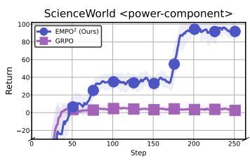  
(a)

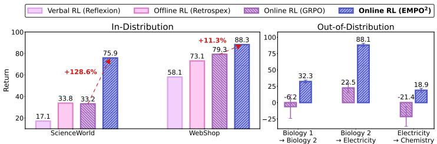  
(b)  
Figure 1: (a) Comparison of the learning curves of GRPO and EMPO<sup>2</sup> (ours) on the Science-World power-component task. While GRPO converges to suboptimal performance, EMPO<sup>2</sup> continues to improve and accomplish the task. (b) Comparison of $\mathbf { E M P O ^ { 2 } }$ and other baselines in in-distribution (ID) and out-of-distribution (OOD) settings on and WebShop. In ID experiments, it adapts well to familiar environments, achieving 128.6% on ScienceWorld and 11.3% on Webshop improvements over GRPO. In OOD experiments, it also shows strong performance with few trials and no weight updates, indicating effective use of memory to explore unfamiliar environments. Full results are in Tables 1, 2, and Figure 8.

However, a key limitation of current LLM-based agents lies in their reliance on exploiting prior knowledge rather than engaging in systematic exploration. While RL frameworks emphasize balancing exploration and exploitation, many LLM-agent systems primarily leverage pretrained knowledge and conduct only limited search within familiar distributions. As a result, these agents often struggle in environments where progress depends on discovering novel states or actively acquiring new information, rather than reusing what is already known.

To address this challenge, recent research has incorporated external memory modules into LLMs as a form of long-term memory. This enables models to leverage past experiences to correct failed attempts, thereby improving decision-making in subsequent trials without requiring parameter updates (Shinn et al., 2023; Zhang et al., 2023). However, as noted in Zhang et al. (2023), the performance of such methods tends to saturate quickly, since collecting experiences with static parameters cannot fully capture the diversity needed for continuous improvement.

In this work, we present a unified framework that enables LLM agents to learn more effectively through broader exploration by jointly updating their parametric policy parameters with RL and their non-parametric memory module through interaction. Crucially, the non-parametric updates not only complement but also enhance the efficiency of parametric learning, thereby enabling more effective exploration and adaptation. This dual-update paradigm serves as a bridge between parameter-level optimization and memory-augmented reasoning. While memory is utilized during learning, moving toward more generalizable intelligence requires reducing dependence on external memory and instead embedding its benefits directly into the model’s parameters. To this end, we propose Exploratory Memory-Augmented On- and Off-Policy Optimization $( \mathrm { E M P O ^ { 2 } } )$ , a new hybrid RL algorithm that incorporates two modes in the rollout phase—depending on whether memory is used—and two modes in the update phase—on-policy and off-policy learning—thereby enabling agents to leverage memory when available while remaining robust in its absence.

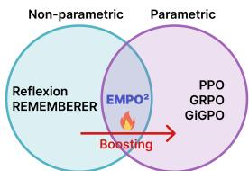  
Figure 2: Non-parametric updates can encourage exploration, bootstrapping parametric updates.

In our experiments, we evaluate $\mathrm { E M P O ^ { 2 } }$ on two widely used multi-step embodied reasoning environments that require exploration to solve complex tasks: ScienceWorld (Wang et al., 2022) and WebShop (Yao et al., 2022). We compare its performance against a range of non-parametric and parametric (offline and online) RL approaches. As summarized in Figure 1, $\mathrm { E M P O ^ { 2 } }$ substantially outperforms prior algorithms, achieving a 128.6% improvement on ScienceWorld and an 11.3% improvement on WebShop over the strong online RL baseline GRPO. The training curve in Figure 1 (a) further shows that, unlike GRPO, which converges prematurely to a suboptimal solution, EMPO² leverages continuous exploration and successfully solves the task. Moreover, for the OOD experiments (Figure 1, rightmost), the model also achieves good scores with only a few trials and no weight updates, indicating that the updated model has acquired the ability to use memory to explore unseen or unfamiliar environments. These results highlight $\mathrm { E M P O ^ { 2 } }$ as a promising direction for building more adaptive and generalizable embodied agents.

## 2 PRELIMINARIES

Online RL consists of alternating between a rollout phase, in which trajectories are generated using the current policy π parameterized by θ, and an update phase, in which the policy is optimized based on those rollouts.

Policy Rollout. We consider a setting where, given a sampled task $u \sim p ( \mathcal { U } )$ , an LLM agent solves the task through multi-step interactions with the environment. Starting from task u, the LLM π<sub>θ</sub> generates the first natural-language action $a _ { 1 } \sim \pi _ { \theta } ( \cdot \ | \ u ) \in \mathcal { A }$ . Executing this action, the environment returns a reward $r _ { 1 }$ and the next state $s _ { 1 }$ . At a general timestep t, conditioned on the current state $s _ { t }$ and the task $u ,$ the policy produces the next action $a _ { t + 1 } \sim \pi _ { \theta } ( \cdot \mid s _ { t } , u )$ . This interaction loop continues until the task is completed or a maximum number of steps is reached. A rollout trajectory is thus defined as the sequence of states, actions, and rewards, $\tau = \left( u , a _ { 1 } , r _ { 1 } , s _ { 1 } , a _ { 2 } , r _ { 2 } , \ldots , s _ { T } \right)$

Group Relative Policy Optimization. Group Relative Policy Optimization (GRPO) (Shao et al., 2024) updates the policy by comparing multiple rollouts of the same task $u ,$ removing the need for the value function in PPO (Schulman et al., 2017). Given a task u, the policy π generates N rollout trajectories $\{ \tau ^ { ( 1 ) } , \dots , \tau ^ { ( N ) } \}$ . Each trajectory receives a return $\{ R ^ { ( \hat { 1 } ) } , \ldots , R ^ { ( \tilde { N } ) } \}$ , defined as the sum of rewards along the trajectory: $\begin{array} { r } { R ^ { ( i ) } = \dot { \sum } _ { t = 1 } ^ { T } r _ { t } ^ { ( i ) } } \end{array}$ .. For each action $a _ { t } ^ { ( i ) }$ taken in trajectory $\tau ^ { ( i ) }$ we define its relative advantage as: $\begin{array} { r } { A ( a _ { t } ^ { ( i ) } ) = \frac { \bar { R } ^ { ( i ) } - \frac { 1 } { N } \sum _ { j = 1 } ^ { N } { R ^ { ( j ) } } } { \sigma ( R ) } } \end{array}$ , where actions from trajectories with higher-than-average reward obtain positive advantage, while those from lower-performing ones obtain negative advantage. The GRPO loss is then:

$$
\begin{array}{l}\mathbb{E}_\substack{u\sim p(\mathcal{U})\\ \{\tau^{(i)}\}_{i = 1}^{N}\sim \pi_{\theta_{\mathrm{old}}}}\left[\frac{1}{NT}\sum_{i = 1}^{N}\sum_{t = 1}^{T}\min \Big(\rho_{\theta}(a_{t}^{(i)})A(a_{t}^{(i)}),\mathsf{clip}\big(\rho_{\theta}(a_{t}^{(i)}),1 - \epsilon ,1 + \epsilon \big)A(a_{t}^{(i)})\Big)\right]\\ -\beta D_{\mathrm{KL}}\big(\pi_{\theta}(\cdot |u)\parallel \pi_{\mathrm{ref}}(\cdot |u)\big), \end{array}\tag{1}
$$

where $\begin{array} { r } { \rho _ { \theta } ( a _ { t } ^ { ( i ) } ) = \frac { \pi _ { \theta } ( a _ { t } ^ { ( i ) } | s _ { t } ^ { ( i ) } , u ) } { \pi _ { \theta _ { \mathrm { o l d } } } ( a _ { t } ^ { ( i ) } | s _ { t } ^ { ( i ) } , u ) } } \end{array}$ , with $\beta \geq 0$ controlling the regularization strength toward a reference policy $\pi _ { \mathrm { r e f } } .$

## 3 THE EXPLORATION PROBLEM OF LLM AGENTS

LLMs encode rich prior knowledge, but such priors often fail to reflect the actual rules or dynamics of a given environment. Blind reliance on these priors can lead to erroneous behaviors, making it necessary for agents to adapt through direct interaction and trial-and-error. A key requirement for such adaptation is exploration, which involves seeking information beyond pre-training, sometimes by taking atypical or counterintuitive actions. However, current LLM-based agents struggle with this (Qiao et al., 2024; Zhou et al., 2024), as it demands stepping outside the distribution of behaviors where the model feels most confident.

Consequently, many prior studies have sought to align agents with new environments through warmstart supervised fine-tuning (SFT) using numerous golden trajectories (Song et al., 2024; Qiao et al., 2024; Xiang et al., 2024), leveraging large-scale models such as GPT-4 (Tang et al., 2024; Lin et al., 2023), or employing human engineering or well-established simulation information (Choudhury & Sodhi, 2025). While these methods achieve strong results in constrained settings, their effectiveness is limited to cases where such external support is available, and they generalize poorly to unseen scenarios without it.

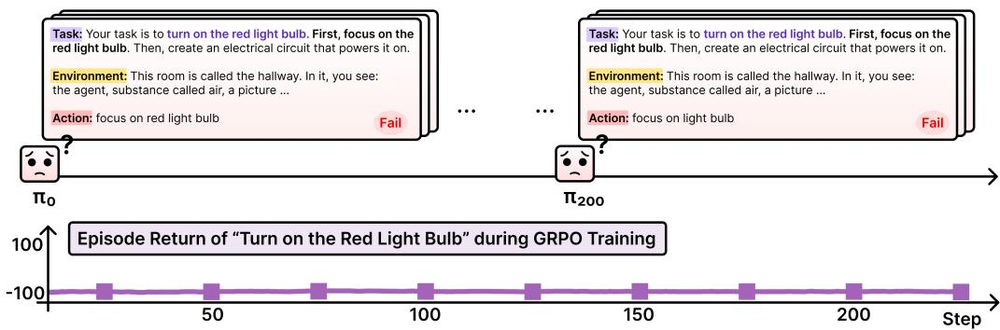  
Figure 3: When training LLM with GRPO in ScienceWorld, the agent struggles because of insufficient exploration. For instance, in the task “turn on the red light bulb,” the agent must first find the red light bulb before activating it. However, the agent fails to locate it and, as a result, cannot complete the task. Rather than analyzing the cause of failure and exploring alternative actions, the agent proceeds unchanged, so its score stagnates even as additional training steps are taken.

Therefore, we focus on how to efficiently train agents in online RL through trial and error, without any prior embedding of the environment’s rules. The key challenge is that, without intrinsic exploration capability, online RL struggles to optimize effectively. As illustrated in Figure $^ { 3 , }$ in ScienceWorld (Wang et al., 2022) environment the agent is given the mission “turn on the red light bulb.” The instructions specify that the agent should first focus on the light bulb and then build a circuit to activate it, based on the current room observation. However, since no red light bulb is present in the observation, the agent must search the environment to locate it. Instead, the agent follows the instruction literally, attempts to focus on the red light bulb, and fails because it does not exist in the room. Ideally, when an agent fails to reach its goal, it should analyze the reasons for failure and broaden its action space to discover successful strategies. Yet in representative online RL algorithms GRPO (Shao et al., 2024), prior trajectory rollouts provide no continuity beyond a scalar reward signal, thereby restricting exploration and ultimately limiting learning.

## 4 METHOD

In this section, we present Exploratory Memory-augmented On- and Off-Policy Optimization (EMPO<sup>2</sup>), a novel algorithm aimed at tackling the exploration challenges in online RL. EMPO<sup>2</sup> operates in two modes for both rollout phase and update phase. During rollout, actions can be generated either through (1) prompting without memory, where no retrieved information is used, or (2) memory-augmented prompting, conditioned on tips retrieved from memory. In the update phase, rollouts with memory-augmented prompting are used in two ways: (a) on-policy, where tips are retained and the update is performed with the original prompt, and (b) off-policy, where tips are removed during update. Notably, tips are generated not by a separate model but by the policy π itself, which is continually updated during training. The full algorithm is provided in Appendix A.

## 4.1 ADVANCING EXPLORATION WITH SELF-GENERATED MEMORY

A key component of $\mathrm { E M P O ^ { 2 } }$ is its use of memory to maintain continuity across rollouts. Information obtained from an agent’s interactions can be encoded into parameters through policy optimization, but it can also be recorded in an external memory that the agent continuously consults. Since our policy is initialized from a pretrained LLM with inherent summarization and reflection abilities, these abilities can be leveraged as auxiliary signals in addition to scalar rewards, thereby guiding exploration more effectively. To realize this, EMPO<sup>2</sup> integrates bothparametric (parameter updates within the LLM) and non-parametric (external memory) updates, strengthening the linkage between rollouts and promoting exploration, with all data and guidance generated autonomously by the agent.

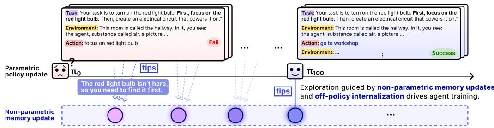  
Figure 4: In EMPO<sup>2</sup>, the current policy parameters π<sub>θ</sub> are used to review past rollouts, with the resulting insights added to memory. This updated memory conditions subsequent rollouts and promotes exploration.

In the non-parametric updates, similar to Reflexion (Shinn et al., 2023), the agent reviews past rollouts, generates self-guidance tips , and stores them in memory. These tips help the agent avoid repeated mistakes and explore new strategies. Unlike Reflexion, focuses on iterative verbal guidance to achieve higher rewards in the next trial, our approach aims for these tips to lead to enhanced exploration that is ultimately consolidated through parametric updates.

Self-Generated Memory and Tips. We define a memory buffer ${ \mathcal { M } } = \{ \mathrm { t i p } _ { 1 } , \mathrm { t i p } _ { 2 } , . . . \}$ , which stores reflective tips generated by the policy π<sub>θ</sub> during trajectory reflection. Formally, when an episode i of task u terminates at timestep t, the policy takes the final state s together with a tipgeneration prompt as input and produces a tip, where tip<sub>i</sub> $\sim \pi _ { \boldsymbol { \theta } } ( s _ { t } , \boldsymbol { u }$ , tip-generation prompt). A set of illustrative examples is provided below, while the tip-generation prompt is presented in Appendix B, and additional examples are included in Appendix E.1.

```txt
Examples of Generated Tips – ScienceWorld <power-component> task
- You moved between the kitchen and bathroom but did not find a green wire or a green light bulb to connect.
- You focused on the red light bulb but did not complete the task of turning on the red light bulb. You are in the hallway and need to find a way.
- The trajectory involves connecting the battery to the green wire terminals to power the green light bulb, but the connections to air and other objects are irrelevant.
- The circuit for the green light bulb was partially connected but still missing the battery connection; the task is not fully completed.
```

## 4.2 PARAMETERIZE NON-PARAMETRIC UPDATES VIA HYBRID POLICY OPTIMIZATION

Agents can use memory to improve exploration and learning efficiency, but the acquired knowledge needs be internalized into model parameters to enhance inherent capabilities. To this end, we propose two modes for the rollout and update phases, whose combinations yield three hybrid learning modes (Figure 5).

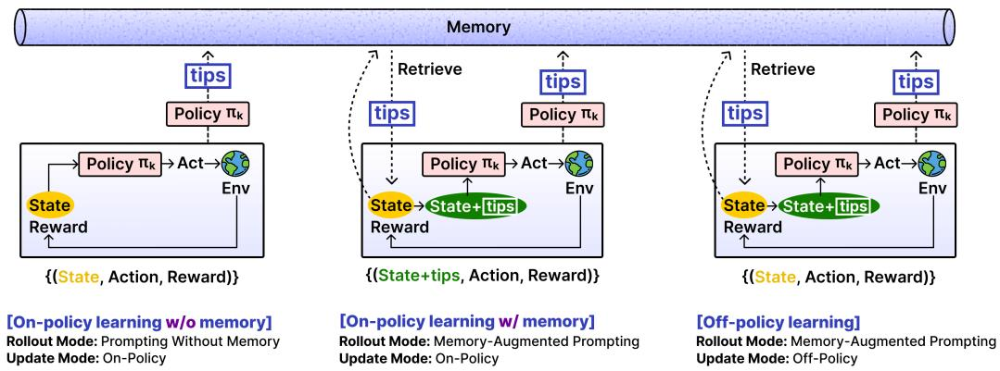  
Figure 5: $\mathbf { E M P Q ^ { 2 } }$ mode combinations. By combining the two rollout modes and update modes, three EMPO mode configurations are possible: on-policy learning without memory, on-policy learning with memory and off-policy learning.

Rollout Modes. During rollouts, the agent samples between the two modes, selecting one mode at each step: mode (2) with memory rollout probability $p$ and mode (1) with probability $1 - p .$ . The ablation study of p can be found in Appendix F.1.

(1) Prompting Without Memory. For each task $u ,$ at each timestep t, the policy π<sub>θ</sub> generates actions conditioned only on the current state $s _ { t }$ and the task u: $a _ { t + 1 } \sim \pi _ { \theta } ( \cdot \mid s _ { t } , u )$

(2) Memory-Augmented Prompting. For each task $u ,$ at each timestep t, a retrieval operator ${ \mathrm { R e t r } } ( o _ { t } ; { \mathcal { M } } ) \subseteq { \mathcal { M } }$ selects tips most relevant to the current state $s _ { t } , \mathbf { e } . \mathbf { g } ,$ ., via similarity search in the embedding space. We denote the retrieved set as tips . In memory-augmented prompting, the policy conditions its action on both $s _ { t }$ and $\begin{array} { r } { \boxed { \mathrm { t i p s } } _ { t } \colon a _ { t + 1 } \sim \pi _ { \theta } \bigl ( \cdot \big | s _ { t } , u , \boxed { \mathrm { t p s } } _ { t } \bigr ) } \end{array}$ . We limit the number of retrieved tips at 10.

Update Modes. Trajectories generated under rollout mode (1) are directly used for updates, whereas those generated under rollout mode (2)—memory-augmented prompting—follow one of two update modes chosen at random during the update phase. Mode (b) is selected with off-policy update probability $q ,$ and mode (a) with probability $1 - q$ . The ablation study of $q$ can be found in Appendix F.1.

(a) On-Policy Updates. On-policy update uses the same prompt as in the rollout, and $\rho _ { \theta } ( a _ { t } ^ { ( i ) } )$ in eq.1 becomes $\begin{array} { r } { \rho _ { \theta } \big ( a _ { t } ^ { ( i ) } \big ) = \frac { \pi _ { \theta } \big ( a _ { t } ^ { ( i ) } | s _ { t } ^ { ( i ) } , u , \sqrt { \mathrm { t i p s } } \big | _ { t } \big ) } { \pi _ { \theta _ { \mathrm { o l d } } } \big ( a _ { t } ^ { ( i ) } | s _ { t } ^ { ( i ) } , u , \sqrt { \mathrm { t i p s } } \big | _ { t } \big ) } } \end{array}$

(b) Off-Policy Updates. In this mode, the stored log-probabilities $\ell _ { t } ^ { \mathrm { t i p s } } = \log \pi _ { \theta } ( a _ { t }  { | } \ s _ { t } , u ,  { | } \mathrm { t i p s }  { | } _ { t } )$ are replaced with the log-probabilities assigned by the same policy $\pi _ { \theta }$ when conditioned only on $( s _ { t } , u )$ , namely $\ell _ { t } ^ { \mathrm { n o - t i p s } } = \log \pi _ { \theta } ( a _ { t } \ | \ s _ { t } , u )$ . In this formulation, the advantage update is performed based on how natural the action appears under the distribution without tips.

This construction can be interpreted as a form of reward-guided knowledge distillation. Trajectories sampled under the tips-conditioned policy act as teacher demonstrations, while the student policy $\pi _ { \theta } ( \cdot \mid s , u )$ is updated to reproduce those trajectories in proportion to their advantage. High-reward trajectories $( \hat { A } _ { t } > 0 )$ are reinforced, while low-reward trajectories $( \hat { A } _ { t } \ < \ 0 )$ are suppressed, resulting in selective distillation that emphasizes beneficial behaviors. In this way, tips serve as an intermediate scaffolding mechanism that improves exploration and trajectory quality, while the reward signal ensures that only advantageous behaviors are ultimately retained. Consequently, the final policy learns to internalize the benefits of tip conditioning without requiring tips at inference time. Appendix C provides an illustrative breakdown and a summary table for the calculation of the importance sampling ratio.

Stabilizing Off-Policy Training. Off-policy training is prone to instability and may collapse (see Figure 6). In such cases, gradient normalization, entropy loss, KL loss, and policy gradient loss can all diverge to NaN. Prior work, Yang et al. (2025) shows that low-probability tokens destabilize training by amplifying gradient magnitudes through unbounded likelihood ratios. Motivated by this, we introduce a masking mechanism that suppresses the advantage term for tokens whose probability under $\pi _ { \theta }$ falls below a threshold δ. Finally, the loss in Eq. 1 is modified as

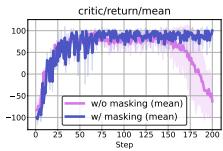  
Figure 6: Masking tokens stabilizes training.

$$
\begin{array}{l} \mathbb {E} _ {\substack {u \sim p (\mathcal {U}) \\ \{\tau^ {(i)} \} \sim \pi_ {\theta_ {\text {old}}}}} \left[ \frac {1}{N T} \sum_ {i = 1} ^ {N} \sum_ {t = 1} ^ {T} \min \left(\rho_ {\theta} ^ {(i, t)} A (a _ {t} ^ {(i)}), \operatorname{clip} \bigl (\rho_ {\theta} ^ {(i, t)}, 1 - \epsilon , 1 + \epsilon \bigr) A (a _ {t} ^ {(i)})\right) \cdot \mathbf {1} _ {\pi_ {\theta} (a _ {t} ^ {(i)} | s _ {t} ^ {(i)}, u) \geq \delta} \right] \\ - \beta D _ {\mathrm{KL}} \bigl (\pi_ {\theta} (\cdot | u) \| \pi_ {\text {ref}} (\cdot | u) \bigr). \end{array} \tag{2}
$$

Intrinsic Rewards for Exploration. To further encourage exploration, and inspired by prior work on exploration-targeted online RL (Burda et al., 2018b; Bellemare et al., 2016; Ecoffet et al., 2019), we introduce an intrinsic reward based on the novelty of the current state. A memory list stores distinct states, and for each new state we compute its cosine similarity with existing entries. If the similarity falls below a threshold, the state is added to memory and assigned a reward. The intrinsic reward is defined as $\textstyle r _ { \mathrm { i n t r i n s i c } } = { \frac { 1 } { n } }$ , where n denotes the number of similar past states. This mechanism encourages the agent to explore novel states even when no extrinsic reward is provided by the environment and maintains policy entropy, as shown in Figure 7.

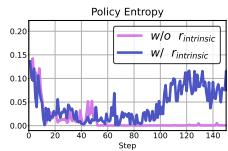  
Figure 7: Policy entropy comparison with vs. without intrinsic rewards.

## 5 RELATED WORK

LLM Agents in Multi-Step Embodied Tasks. LLM agents for multi-step embodied tasks have been studied under different paradigms. Data-driven approaches (Song et al., 2024; Xiong et al., 2024; Qiao et al., 2025; 2024; Tajwar et al., 2025) enhance decision-making through effective data collection methods and imitation learning. Model-based agents (Tang et al., 2024; Zhou et al., 2024) build world models, often by generating code with large closed-source systems such as GPT-4. Other methods (Lin et al., 2023; Choudhury & Sodhi, 2025) strengthen reasoning through model transitions or by leveraging privileged information provided by the simulation environment. In contrast, our approach reduces reliance on such external resources and emphasizes autonomous growth through the agent’s own exploration and self-improvement.

Memory for LLM Agents. To enable progressive improvement from past experiences, Reflexion (Shinn et al., 2023) and REMEMBERER (Zhang et al., 2023) leverage external memory. Reflexion stores verbal reflections for later prompting, while REMEMBERER records observations, actions, rewards, and Q-values, retrieving similar cases as few-shot exemplars. These methods show that LLMs can improve without parameter updates. However, with fixed parameters, they cannot expand intrinsic knowledge, so adaptation remains short-term (Zhang et al., 2023), relying on external memory rather than achieving long-term evolution and generalization.

Learning by Knowledge Distillation Our hybrid off-policy update functions as reward-guided knowledge distillation during online training. Snell et al. (2022) introduced context distillation, where the model first solves tasks using a Teacher prompt (with instructions, examples, explanations, and scratch-pad reasoning) and then learns to produce the final answer from a minimal Student prompt via offline, SFT-based distillation. In contrast, we integrate knowledge distillation into online RL, leveraging online adaptability while enhancing exploration for more efficient training.

RL for LLM Agents. RL provides a robust framework for optimizing LLM parameters through observations and reward signals from environment interactions. Prior work, Retrospex (Xiang et al., 2024), showed that offline RL, which learns optimal policies from large logged datasets, can improve LLM agent performance. Recent studies focus on online RL (Shao et al., 2024; Feng et al., 2025b; Wang et al., 2025), where agents learn in real time. GiGPO (Feng et al., 2025b) advanced GRPO by grouping rollouts with similar observations, enabling finer credit assignment and stronger performance. Our work advances this online RL direction by integrating non-parametric memory updates into both on- and off-policy learning, yielding substantially higher sample efficiency.

Enhancing Exploration for Online RL. A central challenge in online RL is effective exploration. Classical methods such as count-based exploration (Bellemare et al., 2016) and Random Network Distillation (Burda et al., 2018b) use intrinsic rewards to encourage novelty. Go-Explore (Ecoffet et al., 2019) stores key states and re-explores from them, solving hard-exploration tasks like Atari games. Its LLM extension, Intelligent Go-Explore (Lu et al., 2025a), achieves strong results in environments such as TextWorld (Cotˆ e et al., 2018), but relies on large closed-source models and´ does not perform parameter updates. In our concurrent work, RLVMR (Zhang et al., 2025) employs warm-start SFT to elicit diverse reasoning types (planning, exploration, and reflection) and provides dense, process-level rewards for each reasoning type during online RL, enhancing exploration and credit assignment. Together, these studies underscore the importance of structured exploration for scaling RL to complex environments.

## 6 EXPERIMENTS

To examine the effectiveness of EMPO<sup>2</sup>, we conduct extensive experiments on two widely used LLM agent benchmarks: ScienceWorld (Wang et al., 2022) and WebShop (Yao et al., 2022) using Qwen2.5-7B-Instruct (Qwen et al., 2025) as the base model. The EMPO<sup>2</sup> performance we evaluate is the performance of the trained model without memory at test time.

## 6.1 SCIENCEWORLD

ScienceWorld (Wang et al., 2022) is an interactive text-based benchmark in which an agent performs science experiments at the elementary school level. Successfully completing these experiments requires long-term multi-step planning, hypothesis testing, and interpretation of outcomes, as well as sufficient exploration to determine where the necessary tools are and what appropriate actions should be taken. ScienceWorld includes tasks from diverse topics and in our experiments, we cover 19 tasks spanning chemistry, classification, biology, electricity, and measurement.

Baselines. We compare EMPO<sup>2</sup> with several RL approaches. For non-parametric RL, Reflexion (Shinn et al., 2023) updates memory in a non-parametric manner by incorporating LLM reflections from previous trajectories and using them in the prompt for the subsequent trial. For offline RL, Retrospex (Xiang et al., 2024) leverages an SFT-trained model and uses a Q-function learned via Implicit Q-learning (Kostrikov et al., 2022) to dynamically rescore actions. The official Retrospex paper used the smaller Flan-T5-Large (Chung et al., 2024) (770M) and incorporated human-designed heuristics to assist the agent during evaluation. In contrast, to ensure consistency in our experimental setup, we standardize the base model of Retrospex to Qwen2.5-7B-Instruct and exclude these heuristics. Finally, for online RL, we include GRPO (Shao et al., 2024) as a representative baseline. Further details are provided in Appendix D.

Training Details. Our EMPO<sup>2</sup> implementation is based on verl (Sheng et al., 2024), one of the representative RL-for-LLM libraries. We extended GRPO in verl from a single-step setup to a multistep setup and incorporated both a memory module and an off-policy loss calculation component. We use the same hyperparameter configuration for GRPO and EMPO<sup>2</sup>. The prompt used is provided in Appendix B, and implementation details are given in Appendix D.2.

Table 1: Comparison results of ScienceWorld. Each task in ScienceWorld contains multiple variants. We use the first five variants for training and evaluate on the 20 unseen test variants. Bold shows the best performance per task, while red shading marks cases where parametric updates score lower than non-parametric updates. The EMPO<sup>2</sup> performance we evaluate is the performance of the trained model without memory at test time.

<table><tr><td colspan="2">Qwen2.5-7B-Instruct</td><td rowspan="2">Naive</td><td>Non-Parametric</td><td>Offline RL</td><td colspan="2">Online RL</td></tr><tr><td>Topic</td><td>Task</td><td>Reflexion</td><td>Retrospex</td><td>GRPO</td><td> $EMPO^2$ </td></tr><tr><td rowspan="3">Chemistry</td><td>chemistry-mix</td><td>-42.0±38.0</td><td>1.2±0.7</td><td>20.8±10.0</td><td>12.4±3.5</td><td>42.7±12.4</td></tr><tr><td>chemistry-mix-paint-secondary-color</td><td>-33.0±47.1</td><td>0.0±0.0</td><td>27.8±6.3</td><td>7.1±2.8</td><td>33.3±0.6</td></tr><tr><td>chemistry-mix-paint-tertiary-color</td><td>-33.9±44.3</td><td>36.9±5.7</td><td>7.6±4.2</td><td>42.6±6.2</td><td>39.2±8.7</td></tr><tr><td rowspan="4">Classification</td><td>find-animal</td><td>-58.2±50.2</td><td>39.5±5.8</td><td>25.9±13.5</td><td>72.4±6.8</td><td>100.0±0.0</td></tr><tr><td>find-living-thing</td><td>-65.1±48.1</td><td>36.6±6.1</td><td>20.6±4.8</td><td>68.7±7.1</td><td>100.0 ±0.0</td></tr><tr><td>find-non-living-thing</td><td>-35.9±68.6</td><td>4.8±2.0</td><td>89.1±11.5</td><td>24.7±6.4</td><td>100.0±0.0</td></tr><tr><td>find-plant</td><td>-47.1±66.2</td><td>15.1±3.8</td><td>23.0±3.5</td><td>46.2±7.9</td><td>100.0±0.0</td></tr><tr><td rowspan="2">Biology1</td><td>identify-life-stages-1</td><td>-48.9±65.4</td><td>9.2±2.4</td><td>19.0±25.7</td><td>17.9±4.7</td><td>36.2±11.2</td></tr><tr><td>identify-life-stages-2</td><td>-50.7±65.0</td><td>33.8±5.5</td><td>11.0±1.7</td><td>39.5±6.0</td><td>56.3±8.1</td></tr><tr><td rowspan="3">Biology2</td><td>lifespan-longest-lived</td><td>-51.8±64.8</td><td>44.6±6.5</td><td>55.0±15.0</td><td>78.2±7.3</td><td>100.0±0.0</td></tr><tr><td>lifespan-longest/shortest-lived</td><td>-56.2±63.5</td><td>34.1±5.1</td><td>38.0±15.0</td><td>62.3±6.9</td><td>100.0±0.0</td></tr><tr><td>life-span-shortest-lived</td><td>-56.8±63.0</td><td>6.1±1.9</td><td>67.0±23.8</td><td>20.6±4.4</td><td>100.0±0.0</td></tr><tr><td rowspan="4">Electricity</td><td>power-component</td><td>-90.0±39.4</td><td>6.3±1.8</td><td>8.2±2.4</td><td>15.1±3.9</td><td>94.3±3.6</td></tr><tr><td>power-component-renewable-vs-nonrenewable-energy</td><td>-85.0±49.8</td><td>11.7±2.9</td><td>10.0±3.2</td><td>24.6±5.5</td><td>92.6±0.9</td></tr><tr><td>test-conductivity</td><td>-86.9±42.4</td><td>13.2±3.1</td><td>60.0±0.0</td><td>27.8±6.1</td><td>89.5±3.2</td></tr><tr><td>test-conductivity-of-unknown-sub</td><td>-81.7±48.6</td><td>2.6±1.0</td><td>65.5±23.7</td><td>9.5±3.4</td><td>71.4±6.3</td></tr><tr><td rowspan="2">Measurement</td><td>measure-melting-point-known-sub</td><td>-97.5±7.5</td><td>11.4±3.0</td><td>26.5±16.1</td><td>19.8±5.0</td><td>27.6±4.2</td></tr><tr><td>use-thermometer</td><td>-83.7±43.6</td><td>0.9±0.4</td><td>32.5±32.1</td><td>7.6±2.5</td><td>82.7±13.3</td></tr><tr><td></td><td>Average</td><td>-61.3</td><td>17.1</td><td>33.8</td><td>33.2</td><td>75.9</td></tr></table>

Main Results. Table 1 presents the comparison results among baselines. In ScienceWorld, failed tasks lead to negative rewards, producing returns between -100 and 100. The baseline Qwen2.5- 7B-Instruct obtains an average return of -61.3, which improves to 17.1 when non-parametric RL (Reflexion) is applied. Offline RL (Retrospex) produces substantial performance gains compared to them, but in some tasks underperforms compared to non-parametric RL (highlighted in red). Online RL with GRPO also achieves considerable improvements, and its average performance is comparable to that of offline RL. However, unlike offline RL, it never underperforms non-parametric RL, indicating that online RL generalizes better to unseen variants. Our EMPO<sup>2</sup> demonstrates substantially higher learning performance compared to all baselines. Among the tasks that initially started with negative rewards, seven reached the maximum score of 100. On average, EMPO<sup>2</sup> achieved more than twice the performance improvement over GRPO, demonstrating its effectiveness in greatly enhancing learning efficiency in online RL.

Adaptation in New Tasks with Memory Updates. An agent post-trained on a single task may exhibit limited ability to generalize to new scenarios. However, EMPO<sup>2</sup>, which acquires the ability to explore by leveraging memory, demonstrates significantly stronger adaptability to novel situations compared to GRPO, which is trained without learning to utilize memory. Figure 8 illustrates how a model trained on one task adapts when memory is introduced in a new task. In particular, we demonstrate cases with varying levels of topic difference. For a relatively similar transition, we examine Biology 1 (identify-life-stages-2) → Biology 2 (life-span-shortest-lived). For a more distinct transition, we examine Biology 2 (lifespan-longest-lived) → Electricity (test-conductivity), and Electricity (power-component) → Chemistry (chemistry-mix-paint-secondary-color).

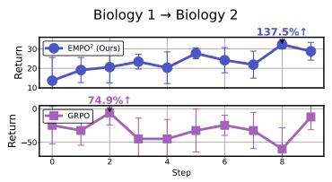

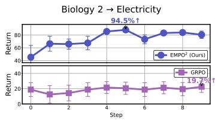

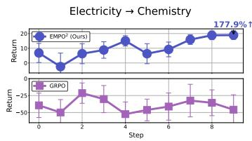  
Figure 8: Comparison of GRPO and $\mathrm { E M P O ^ { 2 } }$ adapting to new tasks. Step 0 has no memory, while later steps use accumulated memory as in EMPO<sup>2</sup> training.

As shown in Figure 8, without memory (step 0), $\mathrm { E M P O ^ { 2 } }$ achieves stronger baseline performance on novel tasks than GRPO. When memory is enabled, $\mathrm { E M P O ^ { 2 } }$ adapts rapidly, yielding an average improvement of 136% across three scenarios within 10 steps. GRPO, by contrast, demonstrates notable gains in some cases but exhibits greater variability and, in other instances, fails to adapt to unfamiliar tasks. In certain situations, its performance even falls below that of the Qwen2.5-7B-Instruct base model. Though these findings are preliminary, they indicate that $\mathrm { E M P O ^ { 2 } }$ has strong potential as an RL framework for developing agents that are both more general and adaptable.

## 6.2 WEBSHOP

WebShop (Yao et al., 2022) is an HTML-based online shopping environment where agents search, navigate, and purchase items according to user instructions. When the “buy” action is selected, a final reward is given based on how well the product’s attributes and price match the criteria.

Baselines. For the WebShop experiments, we use the same baselines as in the ScienceWorld experiments, with the addition of one more online RL baseline, GiGPO (Feng et al., 2025b), as GiGPO does not cover ScienceWorld but provides benchmarking results on WebShop. The scores of Naive, Reflexion, GRPO, and GiGPO are taken from Feng et al. (2025b), while Retrospex results are re-run using the official Retrospex code with the Qwen2.5-7B-Instruct model.

Training Details. The WebShop $\mathrm { E M P O ^ { 2 } }$ implementation builds on the official GiGPO (Feng et al., 2025b) code with the same hyperparameters. Further details are provided in Appendix D.3.

Main Results. Table 2 presents the baseline comparison results on WebShop. Consistent with the findings in ScienceWorld, $\mathrm { E M P O ^ { 2 } }$ once again delivers the strongest performance. Although offline RL, online GRPO, and GiGPO each outperform non-parametric RL, GiGPO further enhances GRPO by leveraging additional advantage estimation through grouping similar observations within rollout groups. Despite these gains, $\mathrm { E M P O ^ { 2 } }$ surpasses all baselines, achieving both higher scores and success rates than GiGPO. Taken together, these results indicate that $\mathrm { E M P O ^ { 2 } }$ consistently demonstrates superior performance in web-based environments due to its improved exploration.

Table 2: Comparison results of WebShop. Following Feng et al. (2025b), we average results over three random seeds and report both the mean score and the mean success rate (%). $\mathrm { G i G P O } _ { \mathrm { w } / }$ std denotes the use of the normalization factor $F _ { \mathrm { n o r m } } = \mathrm { s t d }$ , whereas $\mathrm { G i G P O _ { w / o \ s t d } }$ uses $F _ { \mathrm { n o r m } } = 1$ , as specified in Feng et al. (2025b). The $\mathrm { E M P O ^ { 2 } }$ performance we evaluate is the performance of the trained model without memory at test time.

<table><tr><td rowspan="2">Qwen2.5-7B-Instruct</td><td rowspan="2">Naive</td><td rowspan="2">Non-Parametric Reflexion</td><td colspan="2">Offline RL</td><td colspan="3">Online RL</td></tr><tr><td>Retrospex</td><td>GRPO</td><td>GiGPO w/ std</td><td>GiGPO w/o std</td><td> $EMPO^2$ </td></tr><tr><td>Score</td><td>26.4</td><td>58.1</td><td>73.1±4.1</td><td>79.3±2.8</td><td>84.4±2.9</td><td>86.2±2.6</td><td>88.3±2.6</td></tr><tr><td>Succ.</td><td>7.8</td><td>28.8</td><td>60.4±3.9</td><td>66.1±3.7</td><td>72.8±3.2</td><td>75.2±3.8</td><td>76.9±4.1</td></tr></table>

## 6.3 ABLATION STUDY ON MODE COMBINATIONS

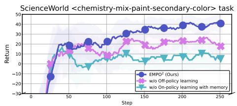

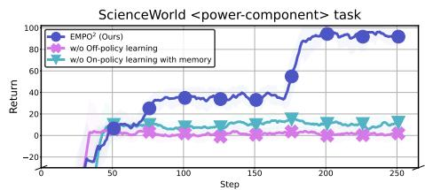  
Figure 9: Comparison of training curves between $\mathrm { E M P O ^ { 2 } }$ and variants that exclude either off-policy learning or on-policy learning with memory.

As shown in Figure 5, $\mathrm { E M P O ^ { 2 } }$ incorporates three mode combinations: on-policy learning without memory, on-policy learning with memory, and off-policy learning, and we further analyze how leveraging each affects performance on two ScienceWorld tasks, where $\mathrm { E M P O ^ { 2 } }$ shows significant improvements over GRPO. Figure 9 presents training curves comparing $\mathrm { E M P O ^ { 2 } }$ with variants that exclude either off-policy or on-policy learning with memory. As shown in the graphs, removing either component results in suboptimal learning, indicating that a balanced integration of on-policy and off-policy updates is most effective for performance improvement. This highlights their complementary roles: on-policy updates contribute to stable learning, while off-policy updates enable reasoning as if guided by additional tips, and their combination yields both faster convergence and stronger final performance.

## 7 CONCLUSION

In this work, we propose $\mathrm { E M P O ^ { 2 } }$ , a novel RL method that enhances exploration in parametric RL by leveraging non-parametric memory updates. $\mathrm { E M P O ^ { 2 } }$ integrates both on-policy and off-policy learning, thereby improving training efficiency and stability. Our experiments demonstrate that $\mathrm { E M P O ^ { \frac { \cdot } { 2 } } }$ achieves remarkable gains in training efficiency on ScienceWorld and WebShop, and further shows the ability to adapt rapidly to new domains in a few-shot manner by incorporating additional memory. An ablation study confirms the importance of the three distinct modes of EMPO<sup>2</sup>.

While our study demonstrates the potential of $\mathrm { E M P O ^ { 2 } }$ as a RL framework for general agents, our current implementation for memory employs a simple similarity-based search for memory retrieval. More advanced retrieval mechanisms may further enhance performance. Moreover, although our experiments primarily utilize Qwen2.5-7B-Instruct, extending $\mathrm { E M P O ^ { 2 } }$ to a broader range of model families and sizes could yield deeper insights into its generality and robustness. In particular, scaling to larger models may further amplify the benefits of our approach. Beyond model scaling, applying EMPO<sup>2</sup> to new domains such as mathematics, coding, multi-hop question answering, and multimodal RL represents an exciting and challenging direction for future research. In addition, exploring other off-policy techniques beyond importance sampling could be of interest to achieve more stable and efficient hybrid optimization.

## ETHICS STATEMENT

This work evaluates $\mathrm { E M P O ^ { 2 } }$ on ScienceWorld and WebShop, which are publicly available research benchmarks that do not include private data or sensitive information. We complied with dataset licenses and community standards for responsible use and citation, and no additional data collection or modification of the environments was performed.

Although our method exhibits strong adaptability in exploration and reasoning tasks, online RL systems may be misapplied in safety-critical real-world contexts. To reduce such risks, we confine our study to benchmark environments, and for real-world applications, responses generated by LLMs will require more careful scrutiny. We hope that future research will further address safety and broader societal impacts when extending embodied reasoning agents beyond simulation.

## REPRODUCIBILITY STATEMENT

We release an Agent Lightning (Luo et al., 2025) version of $\mathrm { E M P O ^ { 2 } }$ at agent-lightning/empo2. Additionally, we provide detailed training information, including pseudocode in Appendix A, the hyperparameters used in our experiments, the hyperparameters for the baseline experiments, the GPU resources utilized, and code snippets for the additional components implemented in Appendix D.

## REFERENCES

Josh Achiam, Steven Adler, Sandhini Agarwal, Lama Ahmad, Ilge Akkaya, Florencia Leoni Aleman, Diogo Almeida, Janko Altenschmidt, Sam Altman, Shyamal Anadkat, et al. Gpt-4 technical report. arXiv preprint arXiv:2303.08774, 2023.

Marc Bellemare, Sriram Srinivasan, Georg Ostrovski, Tom Schaul, David Saxton, and Remi Munos. Unifying count-based exploration and intrinsic motivation. Advances in neural information processing systems, 29, 2016.

Yuri Burda, Harrison Edwards, Amos Storkey, and Oleg Klimov. Exploration by random network distillation. arXiv preprint arXiv:1810.12894, 2018a.