## ABSTRACT

Recent work shows that, beyond discrete reasoning through explicit chain-ofthought steps, which are limited by the boundaries of natural languages, large language models (LLMs) can also reason continuously in latent space, allowing richer information per step and thereby improving token efficiency. Despite this promise, latent reasoning still faces two challenges, especially in training-free settings: 1) purely latent reasoning broadens the search distribution by maintaining multiple implicit paths, which diffuses probability mass, introduces noise, and impedes convergence to a single high-confidence solution, thereby hurting accuracy; and 2) overthinking persists even without explicit text, wasting tokens and degrading efficiency. To address these issues, we introduce SWIREASONING, a training-free framework for LLM reasoning which features two key innovations: 1) SWIREASONING dynamically switches between explicit and latent reasoning, guided by block-wise confidence estimated from entropy trends in next-token distributions, to balance exploration and exploitation and promote timely convergence. 2) By limiting the maximum number of thinking-block switches, SWIREA-SONING curbs overthinking and improves token efficiency across varying problem difficulties. On widely used mathematics, STEM, coding, and general benchmarks, SWIREASONING consistently improves average accuracy by 1.8%–3.1% across reasoning LLMs of different model families and scales. Furthermore, under constrained budgets, SWIREASONING improves average token efficiency by 57%-79%, with larger gains as budgets tighten.

## 1 INTRODUCTION

Reasoning is one of the central capabilities of large language models (LLMs) (Yang et al., 2025; Qwen Team, 2024; Meta, 2025a;b). It allows models to tackle complex tasks such as mathematics, science, and programming (Guo et al., 2025; OpenAI, 2025b; Jaech et al., 2024; Agarwal et al., 2025; Qwen Team, 2025; Abdin et al., 2025; Abouelenin et al., 2025; Anthropic, 2025; DeepMind, 2024a;b), far beyond simple question answering.

A key limitation of the dominant reasoning approach, explicit chain-of-thought (CoT) (Wolf et al., 2020; Wei et al., 2022; Yao et al., 2023a; Goyal et al., 2024; Pfau et al., 2024), lies in the reliance on discrete tokens during inference. In standard CoT decoding, the model commits to a single token at each step, sampled from the predicted distribution. While effective and ensures readability by verbalizing intermediate steps, this discrete process collapses the full probability distribution into a single trajectory, discarding uncertainty and eliminating many potentially useful reasoning paths.

To overcome this bottleneck, recent work has explored an alternative reasoning technique, latent reasoning (Hao et al., 2024; Zhang et al., 2025; Cheng & Van Durme, 2024; Xu et al., 2025a;b; Tan et al., 2025), where the model operates directly in a continuous hidden space instead of a discrete text space. Latent reasoning offers two key advantages over CoT: 1) higher representational bandwidth per step, since hidden vectors can encode richer information than single tokens (Zhu et al., 2025b); and 2) the ability to preserve multiple reasoning hypotheses implicitly, rather than collapsing them prematurely into one tokenized path (Li et al., 2025b; Chen et al., 2025).

Latent reasoning can be broadly categorized into training-required and training-free approaches. Training-required ones (Hao et al., 2024; Su et al., 2025; Liu et al., 2024; Shen et al., 2025; Tack et al., 2025) demand substantial retraining or fine-tuning (Yue et al., 2025; Li et al., 2025a; Wang et al., 2025a; Zhu et al., 2025a), making it excessively expensive to apply to large reasoning language models. In contrast, training-free approaches like Soft-Thinking (Zhang et al., 2025), which form a probability-weighted mixture of token embeddings as inputs, operate directly at inference time without incurring additional training costs. Our work focuses on the latter category, which is costeffective and resource-friendly for deployment in large-scale reasoning models.

Although training-free latent reasoning eliminates the need for costly retraining, operating purely in the latent space also presents significant challenges. First, the model is not explicitly trained to perform long-horizon reasoning with latent inputs. As a result of distributional mismatches, when inference relies solely on latent trajectories, the process is less controlled and can easily drift off course (Chen et al., 2025). Instead of collapsing into a single path, the model tends to spread probability mass across many implicit reasoning paths. While this preserves multiple hypotheses, it also introduces persistent noise, slows convergence, and ultimately harms reasoning accuracy (Li et al., 2025b). Second, the absence of explicit tokens does not necessarily ensure efficiency. In latent space, models may still suffer from repetitive or unnecessarily extended internal deliberations and continuation (Zhang et al., 2025), essentially overthinking. This prolongs inference and overconsumes tokens, undermining the very efficiency that latent reasoning is meant to improve.

To address these issues, this paper introduces SWIREASONING (abbreviated as SWIR) as a trainingfree framework for LLM reasoning that alternates between explicit and latent thinking, based on block-wise confidence inferred from entropy trends of next-token distributions, and suppresses overthinking by bounding the number of switches. More specifically, the framework first tracks a reference entropy within each thinking block to reflect block-wise confidence. Rising confidence triggers an explicit switch to consolidate progress along a single path, while sustained uncertainty triggers a latent switch to re-explore in continuous space. Second, a switch count controller caps the number of thinking block transitions and provides early-answer checkpoints, curbing unnecessary latent loops and improving token efficiency across difficulties.

The proposed framework also benefits from reintroducing diversity by sampling in an explicit thinking block when compared to pure latent thinking. Even though motivated differently, SWIREASON-ING resonates with the concurrent observation of Wu et al. (2025b) that introducing stochasticity benefits latent reasoning, but we achieve this via a distinct mode switch mechanism rather than injecting distributions with randomness.

Our contributions are summarized as follows:

• We propose SWIREASONING, a training-free reasoning framework that dynamically alternates between explicit and latent thinking based on confidence signals, thereby exploiting the expressivity of latent thinking without sacrificing the stability of explicit thinking.

• We introduce a switch count control mechanism that caps the number of transitions, enabling early answering based on partial reasoning trajectories at switch boundaries. This effectively suppresses overthinking and improves token efficiency under limited budgets.

• We extensively validate the effectiveness of SWIREASONING on mathematics, STEM, coding, and general reasoning domains across multiple benchmarks, model families, and sizes, demonstrating consistent gains in both accuracy and token efficiency over training-free baselines.

## 2 RELATED WORK

Explicit LLM Reasoning. Reasoning via explicit intermediate text has been extensively studied. Chain-of-thought (CoT) prompting elicits stepwise rationales that improve reasoning accuracy by decomposing problems into natural-language sub-steps (Kojima et al., 2022; Wei et al., 2022). Subsequent work increases robustness by aggregating multiple CoT trajectories through self-consistency (Wang et al., 2022). Search- and tool-augmented variants further expand the exploration space, such as Tree-of-thought that branches over partial rationales (Yao et al., 2023a) and interleaving reasoning and actions with external tools and environments (Yao et al., 2023b). Least-to-most prompting progressively solves subproblems to reduce reasoning load and mitigate error accumulation (Zhou et al., 2022). These approaches operate purely in the discrete token space and therefore commit to a single token at each step. While readable, the discretizations in explicit reasoning discard alternative hypotheses early, and restrict the information bandwidth per step (Zhu et al., 2025b).

Latent LLM Reasoning. Latent reasoning operates in the continuous representation space rather than discrete natural language space used by explicit reasoning. Prior work can be broadly grouped into two categories. 1) Training-required approaches modify pretraining (Tack et al., 2025; Zeng et al., 2025) or fine-tuning objectives (Tan et al., 2025; Wang et al., 2025a;b; Jiang et al., 2025; Wu et al., 2025a; Yue et al., 2025; Li et al., 2025a; Shen et al., 2025; Xu et al., 2025a) to supervise hidden-state trajectories or to endow models with latent-planning skills. 2) Training-free approaches (Zhang et al., 2025; Wu et al., 2025b) intervene only at inference time by manipulating hidden representations or probability distributions without updating model weights. Our work belongs to the training-free category but differs from prior single-mode methods. Instead of remaining purely latent, SWIREASONING dynamically switches between latent and explicit reasoning based on entropy-trend confidence, and further regulates the number of switches through a count controller to suppress overthinking and improve efficiency.

## 3 METHODOLOGY

## 3.1 SWIREASONING OVERVIEW

As shown in Fig. 3, SWIREASONING is a training-free framework that dynamically alternates between explicit and latent reasoning. The number of switches is regulated to suppress overthinking and improve token efficiency. Sec. 3.2 presents the preliminaries of explicit and latent reasoning, Sec. 3.3 details the design of the dynamic switch, and Sec. 3.4 discusses the switch count control mechanism. Implementation details are provided in Appendix B.1.

## 3.2 PRELIMINARY: EXPLICIT AND TRAINING-FREE LATENT THINKING

Explicit Thinking. Let $V$ be a vocabulary and $p _ { \theta } ( x _ { t } \mid x _ { < t } )$ an LLM over V with parameters θ. Given a question q, the model produces a reasoning trace $r _ { 1 : T } \in V ^ { T }$ followed by a final answer $a _ { 1 : U } \in V ^ { \hat { U } }$ . We write the concatenated sequence as

$$
x _ {1: (| q | + T + U)} = \left[ q, r _ {1: T}, a _ {1: U} \right],
$$

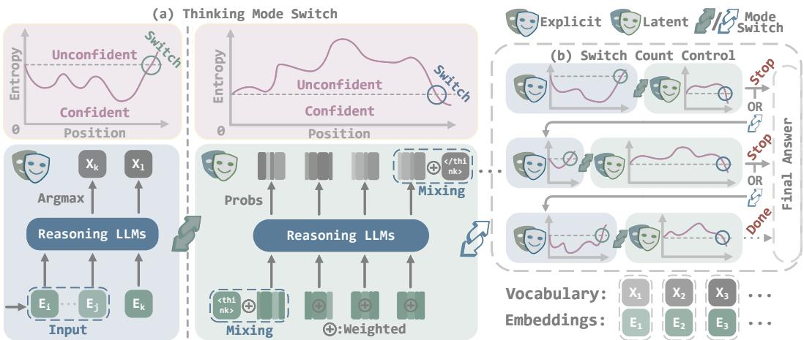  
Figure 3: SWIREASONING framework. (a) Dynamic mode switching alternates between explicit and latent thinking based on block-wise confidence estimated from entropy trends. (b) A switch count control mechanism limits the maximum number of thinking-block transitions, suppressing overthinking before the final answer.

At inference, decoding proceeds by repeatedly choosing a token $x _ { t }$ from the predictive distribution $p _ { \theta } ( \cdot \mid x _ { < t } )$ according to a policy $\pi _ { t } ( \cdot ) , e . g .$ .,

$$
x _ {t} \sim \pi_ {t} (\cdot) \text {with} \pi_ {t} = \left\{ \begin{array}{l} \text {Greedy:} \arg \max _ {v \in V} p _ {\theta} (v \mid x _ {<   t}), \\ \text {Sampling: Top-} k / \text {Top-} p \text {with temperature} \tau . \end{array} \right.
$$

The reasoning phase stops when a termination condition is met, $e . g .$ , generating $\left. I ( \mathrm { { t h i n k } } ) \right.$ , after which the answer tokens $a _ { 1 : U }$ are decoded in the same manner. While explicit reasoning improves reliability by externalizing intermediate steps, its hard policy $\pi _ { t } ( \cdot )$ collapses the full distribution to a single discrete decision at each step, i.e., discards information in $p _ { \theta } ( \cdot \mid x _ { < t } )$ beyond the chosen token.

Training-Free Latent Thinking. It replaces the hard policy $\pi _ { t } ( \cdot )$ by a continuous surrogate that preserves distributional information. Let $E \in \mathbb { R } ^ { | V | \times d }$ denote the token embedding matrix with rows $e ^ { ( v ) } \in \mathbb { R } ^ { d }$ . At step t, the model yields logits $\boldsymbol { \ell } _ { t } \in \mathbb { R } ^ { | V | }$ and $p _ { t } = \operatorname { s o f t m a x } ( \ell _ { t } )$ . Given the next-token distribution $p _ { t } : = p _ { \theta } ( \cdot \mid x _ { < t } ) \in \Delta ^ { | V | - 1 }$ , it forms a soft embedding

$$
\tilde {e} _ {t} = \sum_ {v \in V} p _ {t} [ v ] e ^ {(v)} \in \mathbb {R} ^ {d},\tag{1}
$$

and feeds $\tilde { e } _ { t }$ back to the model as the next input representation, rather than committing to an explicit token by $\pi _ { t } ( \cdot )$ . Upon the thinking phase being complete, the policy reverts to $\pi _ { t } \bar { ( \cdot ) }$ for answer generation. The convexity of Eq. 1 ensures $\tilde { e } _ { t }$ lies in the embedding hull of $E ,$ retaining all firstorder uncertainty in $p _ { t } ,$ , which reduces information discards and increases robustness to local noise.

## 3.3 DYNAMIC SWITCH BETWEEN EXPLICIT AND LATENT THINKING

Remaining in a single mode throughout reasoning is inherently suboptimal: explicit thinking provides readability but may discard useful information beyond chosen tokens, while latent thinking preserves richer signals but can drift into noise and reduce accuracy. Our key insight is that reasoning should switch modes based on confidence. Latent reasoning enables exploration across multiple potential continuations when confidence is low, and explicit reasoning encourages convergence when confidence is high, striking a balance that supports broad exploration while maintaining accuracy.

Mode Switch Criterion. We refer to the reasoning content between two consecutive switches as a thinking block and estimate its confidence by entropy $\begin{array} { r } { H _ { t } = - \sum _ { v } p _ { t } [ v ] \log p _ { t } [ v ] } \end{array}$ . Let $\bar { H }$ denote the reference entropy of the current block, which is initialized at the first step of the block and refreshed when a mode switch happens. We use a criterion that converts local entropy trends into decisions:

$$
\text { Latent } \to \text { Explicit }: \quad \left(H _ {t} <   \bar {H}\right) \text {(confidence rises)},\tag{2}
$$

$$
\text { Explicit } \to \text { Latent }: \quad (H _ {t} > \bar {H}) \quad (\text { confidence   drops }),\tag{3}
$$

Switch Window Size. To avoid oscillations, we impose dwell windows upon the mode switch criterion. Formally, with mode variable $m _ { t } \ \in \ \{ \mathrm { E x p l i c i t } , \mathrm { L a t e n t } \}$ and dwell step counter $\Delta t ,$ , we have

$$
m _ {t + 1} = \left\{ \begin{array}{l l} \text { Explicit }, & m _ {t} = \text { Latent } \land (H _ {t} <   \bar {H}) \land (\Delta t \geq W _ {\text { L } \to \text { E }}), \\ \text { Latent }, & m _ {t} = \text { Explicit } \land (H _ {t} > \bar {H}) \land (\Delta t \geq W _ {\text { E } \to \text { L }}), \\ m _ {t}, & \text { otherwise }. \end{array} \right.
$$

We reset $\bar { H }  H _ { t } , \Delta t  0$ upon any switch, $i . e . , m _ { t + 1 } \neq m _ { t }$ . Otherwise, we update $\Delta t \gets \Delta t { + } 1$ . In practice, $W _ { \mathrm { L \to E } } = 0$ while $W _ { \mathrm { E  I } }$ is positive, i.e., a Latent→Explicit switch may occur immediately when $H _ { t }$ dips, whereas an Explicit→Latent switch requires staying for at least $W _ { \mathrm { E  I } }$ L steps.

The key intuition behind the asymmetric design is that two modes play different roles in reasoning. Latent reasoning is inherently divergent, allowing for rich exploration. However, prolonging the latent phase after confidence has recovered is counterproductive. It increases the risks of introducing spurious signals that may mislead the model. Therefore, once confidence rises, an immediate switch back to explicit reasoning is necessary to consolidate progress onto a single coherent trajectory.

In contrast, explicit reasoning is convergent, gradually unfolding a chain-of-thought where each token incrementally extends the current logical path. If the model were allowed to switch back to latent reasoning at the first sign of an entropy fluctuation, spurious short-term uncertainty could trigger oscillations. The dwell window $W _ { E  L }$ ensures that explicit reasoning is given sufficient opportunity to stabilize and accumulate meaningful structure.

Thinking-Related Signal Mixing. To better align mode switches with the LLMs’ learned reasoning patterns, we blend the embeddings of thinking-related signal tokens, $e . g . , < \mathrm { t h i n k } >$ and $< / \mathrm { t h i n k } >$ , when a switch occurs. Let $e _ { \langle \mathrm { t h i n k } \rangle }$ and $e _ { \langle / \mathrm { t h i n k } \rangle }$ denote their embeddings. At the entrance to a latent thinking block, we bias the first latent step $\dot { t } ^ { \star }$ toward “begin thinking” by

$$
\tilde {e} _ {t ^ {\star}} \leftarrow \alpha_ {t ^ {\star}} \cdot \tilde {e} _ {t ^ {\star}} + (1 - \alpha_ {t ^ {\star}}) \cdot e _ {\langle \text { think } \rangle}, \quad \alpha_ {t ^ {\star}} \in [ 0, 1 ],\tag{4}
$$

and at the exit to an explicit thinking block, we bias the first explicit step t† toward “end thinking”

$$
\tilde {e} _ {t ^ {\dagger}} \leftarrow \beta_ {t ^ {\dagger}} \cdot \tilde {e} _ {t ^ {\dagger}} + (1 - \beta_ {t ^ {\dagger}}) \cdot e _ {\langle \text { think } \rangle}, \quad \beta_ {t ^ {\dagger}} \in [ 0, 1 ],\tag{5}
$$

which encourages the model to close the latent phase and move on to answer production. In practice, we schedule $\begin{array} { r } { \alpha _ { t } = \alpha _ { 0 } + ( 1 - \alpha _ { 0 } ) \frac { t } { T _ { \mathrm { m a x } } } } \end{array}$ and $\begin{array} { r } { \beta _ { t } = \beta _ { 0 } + ( 1 - \beta _ { 0 } ) \frac { t } { T _ { \mathrm { m a x } } } } \end{array}$ , where $T _ { \mathrm { m a x } }$ is a predefined maximum generation length, and apply Eq. 4 or Eq. 5 only at the steps when switches occur.

## 3.4 OVERTHINKING SUPPRESSION BY SWITCH COUNT CONTROL

Even with confidence-aware switching, reasoning LLMs may still overthink. Therefore, we place a bound on the total number of Latent→Explicit switches. Our key insight is that each switch naturally marks the end ofa thinking block where partial reasoning trajectories have been consolidated, which may already contain sufficient evidence for arriving at a reasonable solution. Under limited budgets, generating answers at these natural checkpoints can make use of partial reasoning trajectories, offering a chance to obtain correct predictions earlier without consuming additional tokens.

Counter and Triggers. Let $C _ { t }$ count completed Latent → Explicit switches up to step t. Given a user-specified budget $C _ { \mathrm { m a x } } ,$ we define two triggers:

• Convergence trigger (at $\textstyle { \frac { 1 } { 2 } } C _ { \operatorname* { m a x } } \leq C _ { t } \leq C _ { \operatorname* { m a x } }$ on Latent → Explicit transitions): force the next token to be ⟨/think⟩. The convergence trigger is to encourage rather than enforce the end of the thinking process and the start of converging to an answer based on partial reasoning trajectories.

• Termination trigger (at $C _ { t } > C _ { \operatorname* { m a x } }$ on a subsequent Latent → Explicit transition): inject a concise answer prefix $s _ { \mathrm { f i n a l } } , \cdots \langle / \mathrm { t h i n k } \rangle \backslash \mathrm { n } \backslash \mathrm { n }$ The final answer $\mathrm { i } \mathrm { s } ^ { \prime \prime }$ , then allow at most B additional tokens for the final answer. The termination trigger is to enforce an immediate answer generation.

Triggers are implemented as short injection queues that overwrite future-generated tokens. Formally, let $\mathcal { Q } _ { t }$ be the per-sample injection queue. When a convergence or termination trigger fires, we set $\mathcal { Q } _ { t } \gets [ \mathrm { I D } ( \langle / \mathrm { t h i n k } \rangle ) ]$ or $\big [ \mathrm { I D } \big ( s _ { \mathrm { f i n a l } } \big ) \big ]$ ]. At the next step, if $\mathcal { Q } _ { t } ~ \neq ~ \emptyset .$ , we deterministically set $x _ { t } \gets$ $\mathcal { Q } _ { t } . \mathrm { p o p ( ) }$ . For the termination trigger, we also start a budget counter $b _ { t } = B$ and decrement it each step after the termination trigger fires. Decoding will be terminated once $b _ { t } = 0$

## 4 EXPERIMENTS

## 4.1 EXPERIMENTAL SETTINGS

Models. We evaluate SWIREASONING on four recent reasoning LLMs: DeepSeek-R1-Distill-Llama-8B (Guo et al., 2025), Qwen3-1.7B (Yang et al., 2025), Qwen3-8B (Yang et al., 2025), and Qwen3-32B (Yang et al., 2025). This selection helps us validate the effectiveness of SWIREASON-ING across different model families, model scales, and training paradigms.

Domains and Benchmarks. We evaluate SWIREASONING on 11 benchmarks spanning four domains: mathematical reasoning (GSM8K (Cobbe et al., 2021), Math500 (Hendrycks et al., 2021), AIME 2024 (HuggingFaceH4, 2024), AIME 2025 (Yentinglin, 2025)); STEM reasoning (GPQA Diamond (Rein et al., 2024)); coding reasoning (HumanEval (Chen et al., 2021), LeetCode-Contest (Guo et al., 2024), MBPP (Austin et al., 2021), LiveCodeBench (Jain et al., 2024)); and general reasoning (2WikiMultihopQA (Ho et al., 2020), CommonsenseQA (Talmor et al., 2019)).

Baselines. We compare SWIREASONING that dynamically switches between thinking modes against three baselines with a single thinking mode, including 1) explicit thinking alone: standard CoT reasoning with sampling, standard CoT reasoning with greedy decoding, and 2) training-free latent thinking alone: Soft Thinking (Zhang et al., 2025).

Metrics. We use the Pass@1 metric to evaluate reasoning accuracy, and token efficiency E to assess the level of reasoning efficiency. Let $\mathrm { A c c } _ { m } ( \ell ) \in [ \bar { 0 , } 1 ]$ denote the accuracy of method m when using ℓ generated tokens. Its plain token efficiency is the accuracy gained per token,

$$
P E _ {m} (\ell) = \frac {\mathrm{Acc} _ {m} (\ell)}{\ell}.
$$

To express efficiency in units relative to the standard CoT, we normalize it by the CoT’s plain token efficiency when the highest accuracy is achieved. Specifically, if CoT achieves its highest accuracy $\operatorname { A c c } _ { \mathrm { { C o T } } } ^ { \star }$ using $\ell _ { \mathrm { C o T } } ^ { \star }$ tokens, denote $\begin{array} { r } { P E _ { \mathrm { C o T } } ^ { \star } = \frac { \operatorname { A c c } _ { \mathrm { C o T } } ^ { \star } } { \ell _ { \mathrm { C o T } } ^ { \star } } } \end{array}$ . The token efficiency of m is defined as

$$
\mathrm{E} _ {m} (\ell) = \frac {P E _ {m} (\ell)}{P E _ {\mathrm{CoT}} ^ {\star}} = \frac {\mathrm{Acc} _ {m} (\ell) / \ell}{\mathrm{Acc} _ {\mathrm{CoT}} ^ {\star} / \ell_ {\mathrm{CoT}} ^ {\star}}.
$$

And the average efficiency gain of method m over CoT is

$$
\mathbb {E} [ \Delta \mathrm{E} _ {\mathrm{m}} ] = \frac {\int (\mathrm{E} _ {\mathrm{m}} (\ell) - \mathrm{E} _ {\mathrm{CoT}} (\ell)) d \ell}{\int \mathrm{E} _ {\mathrm{CoT}} (\ell) d \ell}.
$$

## 4.2 REASONING ACCURACY UNDER UNLIMITED TOKEN BUDGETS

We first evaluate SWIREASONING in the setting where token budgets are set large enough to ensure that each method is allowed to conduct sufficient thinking (refer to Appendix B.2 for detailed settings). Fig. 1 and Tab. 1 report the highest attainable accuracies across mathematics (GSM8K, MATH500, AIME24, AIME25) and STEM (GPQA Diamond) benchmarks under this setting. Across different model families of varying sizes, SWIREASONING consistently achieves higher Pass@1 accuracy than CoT with sampling, CoT with greedy decoding, and Soft Thinking.

Our observation is that improvements are most pronounced on the more challenging benchmarks. For instance, on AIME24/AIME25, which require deep deductive reasoning and are widely regarded as more difficult, our method yields absolute gains of 3.34%/2.50% on Qwen3-8B, and 5.00%/5.00% on Qwen3-1.7B. These margins substantially exceed those observed on GSM8K or MATH500 with lower difficulty, suggesting that the proposed switching mechanism is particularly beneficial when problems involve long reasoning chains or higher uncertainty from the LLM’s perspective. Overall, the accuracy results under unlimited token budgets highlight the strength of SWIREASONING in better addressing reasoning tasks compared to single-mode approaches.

Table 1: Comparison of SWIREASONING and CoT with sampling, CoT with greedy decoding, and Soft Thinking on mathematics and STEM benchmarks. SWIREASONING improves accuracy by +2.17% on average.

<table><tr><td rowspan="2">Method</td><td>GSM8K</td><td>MATH500</td><td>GPQADiamond</td><td>AIME2024</td><td>AIME2025</td><td colspan="2">Average</td></tr><tr><td colspan="7">Qwen3-8B (Yang et al., 2025)</td></tr><tr><td>CoT</td><td>95.60</td><td>96.00</td><td>59.60</td><td>75.83</td><td>67.50</td><td>78.91</td><td>+0.00</td></tr><tr><td>CoT (Greedy)</td><td>95.68</td><td>96.40</td><td>56.57</td><td>70.00</td><td>60.00</td><td>75.73</td><td>-3.18</td></tr><tr><td>Soft Thinking</td><td>95.38</td><td>96.00</td><td>59.60</td><td>67.92</td><td>68.33</td><td>77.45</td><td>-1.46</td></tr><tr><td>SwiR (Ours)</td><td>96.06</td><td>+0.46</td><td>+2.40</td><td>61.11</td><td>+1.51</td><td>79.17</td><td>+3.34</td></tr><tr><td colspan="8">Qwen3-1.7B (Yang et al., 2025)</td></tr><tr><td>CoT</td><td>90.44</td><td>92.00</td><td>39.39</td><td>45.83</td><td>33.33</td><td>60.20</td><td>+0.00</td></tr><tr><td>CoT (Greedy)</td><td>89.61</td><td>91.00</td><td>31.82</td><td>40.00</td><td>33.33</td><td>57.15</td><td>-3.05</td></tr><tr><td>Soft Thinking</td><td>90.30</td><td>90.60</td><td>34.34</td><td>38.75</td><td>36.67</td><td>58.13</td><td>-2.07</td></tr><tr><td>SwiR (Ours)</td><td>90.83</td><td>+0.39</td><td>+1.00</td><td>41.41</td><td>+2.02</td><td>50.83</td><td>+5.00</td></tr><tr><td colspan="8">DeepSeek-R1-Distill-Llama-8B (Guo et al., 2025)</td></tr><tr><td>CoT</td><td>89.46</td><td>91.40</td><td>46.46</td><td>43.75</td><td>26.25</td><td>59.46</td><td>+0.00</td></tr><tr><td>CoT (Greedy)</td><td>85.82</td><td>84.80</td><td>31.81</td><td>30.00</td><td>30.00</td><td>52.49</td><td>-6.97</td></tr><tr><td>Soft Thinking</td><td>85.90</td><td>83.80</td><td>33.33</td><td>34.17</td><td>20.42</td><td>51.52</td><td>-7.94</td></tr><tr><td>SwiR (Ours)</td><td>90.07</td><td>+0.61</td><td>+0.60</td><td>47.98</td><td>+1.52</td><td>45.00</td><td>+1.25</td></tr></table>

## 4.3 TOKEN EFFICIENCY UNDER LIMITED TOKEN BUDGETS

Across models and benchmarks, SWIREASONING consistently attains improved Pareto frontiers. As shown in Fig. 2, the peak efficiency gains range between 4.6× and 6.8× over CoT depending on the model size. These improvements are not confined to a single budget: the area-under-curve (AUC) advantage persists across a broad range of small to moderate budgets.

One observation from Fig. 4 is that the relatively large average efficiency gains occur on GSM8K, MATH500, and GPQA Diamond across three models (up to 213% AUC improvements in the perbenchmark panels). These tasks contain many instances with lower difficulty, which benefit most from our overthinking suppression design to obtain the correct answer with partial reasoning trajectories. In contrast, on AIME24/25, the efficiency gaps are smaller, while the accuracy gains with unlimited budgets are larger. This asymmetry is expected: the harder the problem is, the more difficult it is to predict a correct answer with unfinished reasoning trajectories. Overall, token efficiency results under limited budgets substantiate the advantage of SWIREASONING in gaining accuracy more efficiently as budgets tighten compared to baseline methods.

## 4.4 EVALUATION WITH PASS@K ACCURACY

In addition to Pass@1 accuracy, we also measure Pass@k accuracy, where $k \in [ 1 , 6 4 ]$ on Qwen3- 8B. Fig. 5 shows that SWIREASONING reaches its maximal accuracy with significantly smaller k than baselines. Define k⋆ as the smallest k achieving the method’s peak. On AIME24, we observe k⋆ = 13 for SWIREASONING versus 46 for CoT (about 72% fewer samples), and on AIME25, k⋆ = 16 versus 22 (about 27% fewer samples). In addition to the faster growth of the curve than CoT, SWIREASONING also exhibits 1) a steeper initial slope at small k (higher ”per-sample yield”), and 2) a higher eventual ceiling than Soft Thinking and greedy CoT, indicating better correctness and diversity simultaneously. Overall, Pass@k accuracy results indicate that SWIREASONING is particularly attractive for budgeted evaluation settings where k cannot be large.

## 4.5 ABLATION STUDIES

Switch Window Size. SWIREASONING uses dwell windows (Sec. 3.3) to enforce the model stays in a thinking block for at least W steps before switching to the other thinking mode. We conduct ablation studies on Qwen3-1.7B with a representative setting consisting of $W _ { \mathrm { E  L } } ~ \in$ {64, 128, 256, 512, 1024} and report Pass@1 accuracy on five benchmarks. Results in Tab. 3 demonstrate that an intermediate window size of 512 consistently produces the best results.

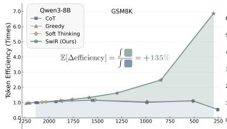

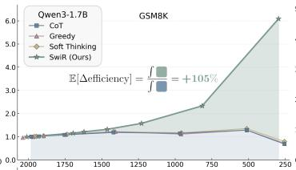

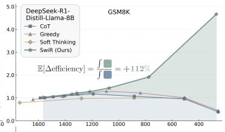

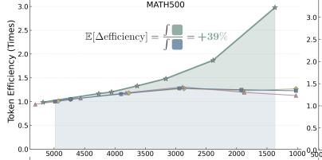

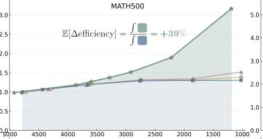

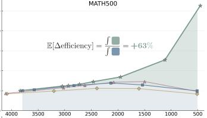

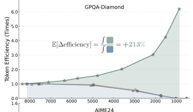

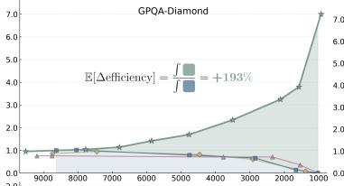

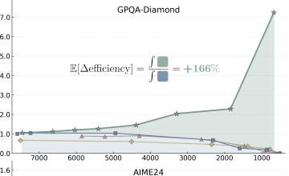

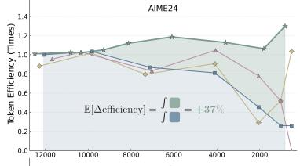

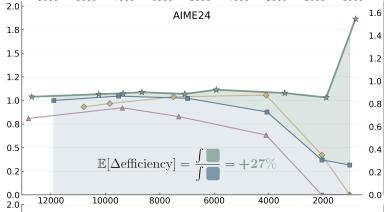

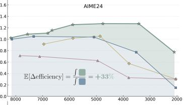

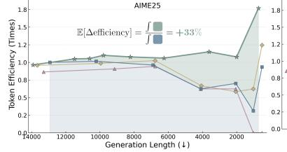

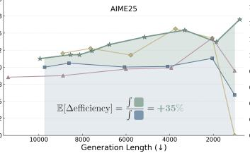

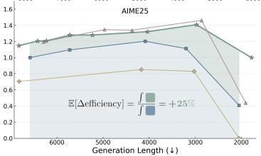

Figure 4: Token efficiency comparisons. SWIREASONING achieves the highest token efficiency throughout all token budgets in 13 out of 15 evaluations, with an efficiency improvement of +84% over CoT on average.  
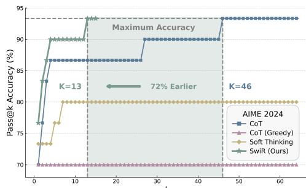

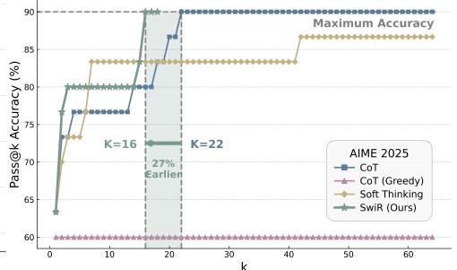  
Figure 5: Pass@k accuracy $( k ^ { \mathord { \sim } } \in [ 1 , 6 4 ] )$ evaluation with Qwen3-8B on AIME 2024 and 2025 benchmarks. SWIREASONING achieves maximum reasoning accuracies +50% earlier compared to CoT on average.

When window sizes are too small, LLMs may jump back to latent mode prematurely, before explicit reasoning has consolidated a coherent trajectory. This increases exposure to noisy signals and harms final accuracy, especially on difficult tasks such as AIME24 and AIME25. When window sizes are too large, LLMs become sluggish to reenter latent exploration as confidence declines. A promising improvement direction is to make W adaptive to the model’s real-time density of effective reasoning.

Thinking-Related Signal Mixing. SWIREASONING uses $\alpha _ { 0 } , \beta _ { 0 } \in [ 0 , 1 ]$ as the initial ratios for mixing thinking-related signals at switching instants (Sec. 3.3). We sweep α and $\beta _ { 0 }$ independently and report Pass@1 accuracies in Tab. 2.

Table 2: Ablations on $\alpha _ { 0 }$ and $\beta _ { 0 }$ for signal mixing. Greener indicates better performance within each column.

<table><tr><td> $\alpha_0$ </td><td>GSM8K</td><td>MATH 500</td><td>GPQA Diamond</td><td>AIME 2024</td><td>AIME 2025</td><td>Average</td><td> $\beta_0$ </td><td>GSM8K</td><td>MATH 500</td><td>GPQA Diamond</td><td>AIME 2024</td><td>AIME 2025</td><td>Average</td></tr><tr><td>0.0</td><td>89.23%</td><td>89.80%</td><td>35.86%</td><td>46.67%</td><td>35.00%</td><td>59.31%</td><td>0.0</td><td>81.50%</td><td>67.20%</td><td>28.79%</td><td>8.33%</td><td>9.17%</td><td>39.00%</td></tr><tr><td>0.1</td><td>89.84%</td><td>91.00%</td><td>36.36%</td><td>46.25%</td><td>36.25%</td><td>59.94%</td><td>0.1</td><td>81.88%</td><td>70.20%</td><td>31.82%</td><td>11.67%</td><td>8.75%</td><td>40.86%</td></tr><tr><td>0.2</td><td>90.37%</td><td>91.60%</td><td>34.85%</td><td>46.25%</td><td>37.50%</td><td>60.11%</td><td>0.2</td><td>82.11%</td><td>70.60%</td><td>28.28%</td><td>14.17%</td><td>9.17%</td><td>40.87%</td></tr><tr><td>0.3</td><td>90.45%</td><td>91.60%</td><td>38.38%</td><td>47.08%</td><td>38.33%</td><td>61.17%</td><td>0.3</td><td>90.67%</td><td>92.00%</td><td>37.37%</td><td>45.42%</td><td>37.92%</td><td>60.68%</td></tr><tr><td>0.4</td><td>89.61%</td><td>92.80%</td><td>40.91%</td><td>48.33%</td><td>32.50%</td><td>60.83%</td><td>0.4</td><td>90.98%</td><td>91.40%</td><td>37.88%</td><td>47.92%</td><td>36.67%</td><td>60.97%</td></tr><tr><td>0.5</td><td>90.45%</td><td>93.00%</td><td>34.34%</td><td>50.83%</td><td>36.25%</td><td>60.97%</td><td>0.5</td><td>90.37%</td><td>91.20%</td><td>42.42%</td><td>47.92%</td><td>35.83%</td><td>61.55%</td></tr><tr><td>0.6</td><td>90.83%</td><td>92.00%</td><td>39.39%</td><td>44.58%</td><td>37.92%</td><td>60.94%</td><td>0.6</td><td>90.59%</td><td>90.40%</td><td>42.42%</td><td>42.50%</td><td>36.67%</td><td>60.52%</td></tr><tr><td>0.7</td><td>90.06%</td><td>91.60%</td><td>37.37%</td><td>45.00%</td><td>37.08%</td><td>60.22%</td><td>0.7 √</td><td>90.83%</td><td>93.00%</td><td>41.41%</td><td>50.83%</td><td>38.33%</td><td>62.88%</td></tr><tr><td>0.8</td><td>90.60%</td><td>92.00%</td><td>37.37%</td><td>48.33%</td><td>35.42%</td><td>60.74%</td><td>0.8</td><td>89.99%</td><td>92.20%</td><td>39.39%</td><td>49.17%</td><td>35.83%</td><td>61.32%</td></tr><tr><td>0.9</td><td>90.37%</td><td>90.80%</td><td>39.39%</td><td>50.42%</td><td>35.83%</td><td>61.36%</td><td>0.9</td><td>90.22%</td><td>92.20%</td><td>40.91%</td><td>48.75%</td><td>32.50%</td><td>60.52%</td></tr><tr><td>1.0 √</td><td>90.14%</td><td>90.60%</td><td>41.41%</td><td>49.17%</td><td>37.92%</td><td>61.85%</td><td>1.0</td><td>90.44%</td><td>91.00%</td><td>33.33%</td><td>46.67%</td><td>38.75%</td><td>60.04%</td></tr></table>

For the exit bias $\beta _ { 0 }$ , a very small $\beta _ { 0 }$ implies excessive interference with when to conclude the thinking process and severely degrades accuracy $( e . g .$ , AIME24 drops to 8.33% at $\beta _ { 0 } { = } 0 . 0 )$ . Performance rises sharply and peaks near $\beta _ { 0 } { = } 0 . 7 $ , which achieves the best average 62.88% and is either the best or the second-best on most datasets. A promising improvement direction is to make $\beta _ { 0 }$ difficultyaware, so that it will be automatically adjusted based on problem difficulty.

The situation for the entrance bias $\alpha _ { 0 }$ is different. We observe a broad performance plateau for $\alpha _ { 0 } \in [ 0 . 4 , 0 . 9 ]$ ], with the highest average at $\alpha _ { 0 } { = } 1 . 0 \left( 6 1 . 8 5 \% \right)$ , however, only marginally higher than other values like $\alpha _ { 0 } { = } 0 . 9 \ ( 6 1 . 3 6 \% )$ . Task-wise, problems with different levels of difficulty tend to have various preferences over $\alpha _ { 0 }$ . We expose $\alpha _ { 0 }$ to users for adjustment based on task difficulty. The more detailed hyperparameters we adopted for the experiments are provided in Appendix B.3.

Maximum Switch Count. We suppress overthinking by bounding the number of mode switches with a budget $C _ { \mathrm { m a x } }$ (Sec. 3.4), and reducing $C _ { \mathrm { m a x } }$ leads to earlier convergence. In Fig. 2 and Fig. 4, moving rightward on the x–axis corresponds to smaller token budgets, $i . e .$ , smaller $C _ { \mathrm { m a x } } .$ We collect data points in these figures by incrementing the value of $C _ { \mathrm { m a x } }$ from 1 until further increases in $C _ { \mathrm { m a x } }$ no longer alter generation results in most cases, i.e., maximum accuracy is reached at saturation. Detailed data is provided in Appendix C.8.

Table 3: Ablation on switch window size. Greener indicates better performance within each column.

<table><tr><td>Window Size</td><td>GSM8K</td><td>MATH 500</td><td>GPQA Diamond</td><td>AIME 2024</td><td>AIME 2025</td><td>Average</td></tr><tr><td>64</td><td>89.69%</td><td>92.60%</td><td>40.91%</td><td>47.92%</td><td>34.17%</td><td>61.06%</td></tr><tr><td>128</td><td>90.45%</td><td>91.00%</td><td>38.89%</td><td>48.33%</td><td>36.25%</td><td>60.98%</td></tr><tr><td>256</td><td>89.76%</td><td>90.80%</td><td>39.90%</td><td>49.58%</td><td>36.25%</td><td>61.26%</td></tr><tr><td>512 √</td><td>90.83%</td><td>93.00%</td><td>41.41%</td><td>50.83%</td><td>38.33%</td><td>62.88%</td></tr><tr><td>1024</td><td>90.83%</td><td>91.20%</td><td>40.40%</td><td>49.58%</td><td>36.67%</td><td>61.74%</td></tr></table>

As analyzed in Sec. 4.3, decreasing $C _ { \mathrm { m a x } }$ yields a significant improvement in token efficiency, which confirms the intended behavior of the switch count control design: it curbs prolonged latent exploration and commits to an answer path early, thereby mitigating overthinking. With switch count control, a small number of confidence-aware blocks usually suffices for easy-to-moderate problems, while difficult instances benefit more from allowing a few more switches before the final answer.

More ablation studies are provided in Appendix $\mathrm { C } . 5 \mathrm { - } \mathrm { C } . 7$

## 4.6 EXPERIMENTAL RESULTS ON LARGER MODELS

Table 4: Comparison of SWIREASONING and CoT with sampling, CoT with greedy decoding, and Soft Thinking on Qwen3-32B. SWIREASONING improves accuracy by +1.92% on average.

<table><tr><td>Method</td><td>GSM8K</td><td>MATH500</td><td>GPQADiamond</td><td>AIME2024</td><td>AIME2025</td><td colspan="2">Average</td></tr><tr><td>CoT</td><td>95.83</td><td>97.40</td><td>66.16</td><td>80.42</td><td>72.08</td><td>82.38</td><td>+0.00</td></tr><tr><td>CoT (Greedy)</td><td>95.91</td><td>97.20</td><td>69.70</td><td>80.00</td><td>73.33</td><td>83.23</td><td>+0.85</td></tr><tr><td>Soft Thinking</td><td>95.75</td><td>97.40</td><td>67.17</td><td>74.58</td><td>66.25</td><td>80.23</td><td>-2.15</td></tr><tr><td>SwiR (Ours)</td><td>96.21</td><td>+0.38</td><td>98.40</td><td>+1.00</td><td>70.20</td><td>+4.04</td><td>82.92</td></tr></table>

In addition to the 1.7B and 8B settings, we evaluate SWIREASONING on the 32B scale using Qwen3- 32B. We report pass@1 accuracy on GSM8K, MATH500, GPQA Diamond, AIME 2024, and AIME 2025. Baseline hyperparameters follow the recommendations from their original papers, and all methods use the same configuration as in the main paper. Table 4 shows that under no token budget constraint, SWIREASONING improves accuracy by +1.92% on average over standard CoT. The gains are most notable on more difficult benchmarks such as GPQA Diamond (+4.04%). These results indicate that SWIREASONING scales to larger models and achieves consistent accuracy gains.

## 4.7 EXPERIMENTAL RESULTS ON BROADER DOMAINS

Table 5: Comparison of SWIREASONING and baselines on coding, multi-hop QA, and commonsense reasoning tasks. SWIREASONING improves accuracy by +2.70% on average.

<table><tr><td rowspan="2">Method</td><td rowspan="2">HumanEval</td><td colspan="3">LeetCode-Contest</td><td rowspan="2">MBPP</td></tr><tr><td>Easy-level</td><td>Medium-level</td><td>Hard-level</td></tr><tr><td>CoT</td><td>92.68</td><td>57.78</td><td>68.13</td><td>43.18</td><td>94.16</td></tr><tr><td>CoT (Greedy)</td><td>93.90</td><td>64.44</td><td>58.24</td><td>47.73</td><td>91.44</td></tr><tr><td>Soft Thinking</td><td>92.07</td><td>55.56</td><td>61.54</td><td>38.64</td><td>94.16</td></tr><tr><td>SwiR (Ours)</td><td>95.73</td><td>+3.05</td><td>64.44</td><td>+6.66</td><td>69.23 +1.10 61.36 +18.18 95.33 +1.17</td></tr></table>

<table><tr><td>Method</td><td>LiveCode-Bench</td><td>2WikiMul-tihopQA</td><td>Common-senseQA</td><td colspan="2">Average</td></tr><tr><td>CoT</td><td>62.01</td><td>79.00</td><td>83.95</td><td>78.54</td><td>+0.00</td></tr><tr><td>CoT (Greedy)</td><td>50.18</td><td>79.50</td><td>83.95</td><td>76.03</td><td>-2.51</td></tr><tr><td>Soft Thinking</td><td>56.99</td><td>79.00</td><td>83.70</td><td>76.73</td><td>-1.81</td></tr><tr><td>SwiR (Ours)</td><td>63.44</td><td>+1.43</td><td>81.50</td><td>+2.50</td><td>85.34</td></tr></table>

In addition to math and STEM domains, we further evaluate SWIREASONING on coding, multihop QA, and commonsense reasoning. We use Qwen3-8B and report pass@1 accuracy on HumanEval (Chen et al., 2021), LeetCode-Contest (Guo et al., 2024), MBPP (Austin et al., 2021), and LiveCodeBench (Jain et al., 2024) for coding, 2WikiMultihopQA (Ho et al., 2020) set from LongBench (Bai et al., 2024) for multi-hop QA, and CommonsenseQA (Talmor et al., 2019) for commonsense reasoning. As shown in Tab. 5, under no token budget constraint, SWIREASONING improves accuracy by +2.70% on average over standard CoT (the reported average is the simple mean of accuracy over the full LeetCode-Contest and accuracies over five other benchmarks).

On coding tasks, the largest gains (+18.18%) are observed on the hard-level subset, indicating that SWIREASONING is most helpful for problems that require stronger reasoning capabilities. On multihop QA tasks, which require retrieving and connecting multiple disparate facts, SWIREASONING outperforms CoT by +2.50%. This suggests that the exploration capability of latent reasoning is effective in navigating complex reasoning paths. On commonsense reasoning tasks, SWIREASON-ING surpasses CoT by +1.39%. This demonstrates the robustness of SWIREASONING in general knowledge scenarios. Overall, these results confirm that SWIREASONING generalizes to broader domains with consistent accuracy gains.

## 5 CONCLUSION

This paper presents SWIREASONING, a training-free inference framework that integrates explicit chain-of-thought thinking with latent thinking through an entropy trends–based controller. The framework is conceptually straightforward but empirically effective: when block-wise uncertainty decreases, we collapse to a single explicit path to consolidate progress. When uncertainty rises and has persisted for a minimal dwell window, we expand into latent space to explore more alternatives. Complementing this mode switch, a switch count controller caps the number of transitions, thereby curbing overthinking while preserving prediction quality. Together, these two mechanisms yield consistently improved Pareto frontiers for reasoning LLMs, effectively enhancing both maximum accuracy under unlimited budgets and token efficiency under limited budgets. Looking ahead, integrating SWIREASONING with reinforcement learning–based training may unlock even stronger reasoning capabilities.