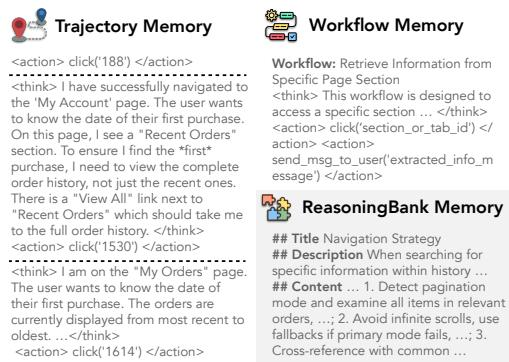
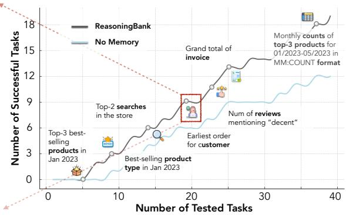
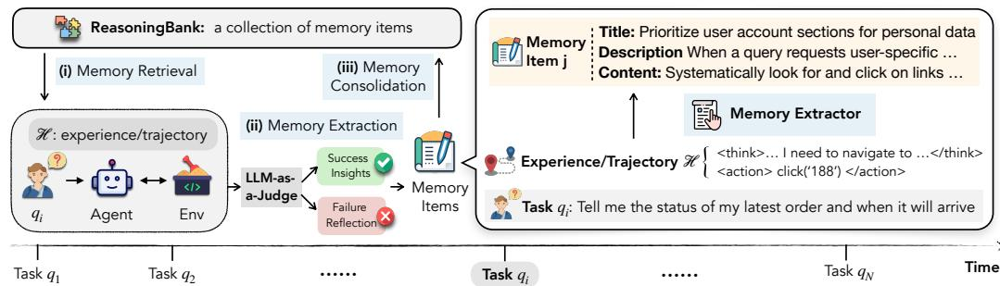
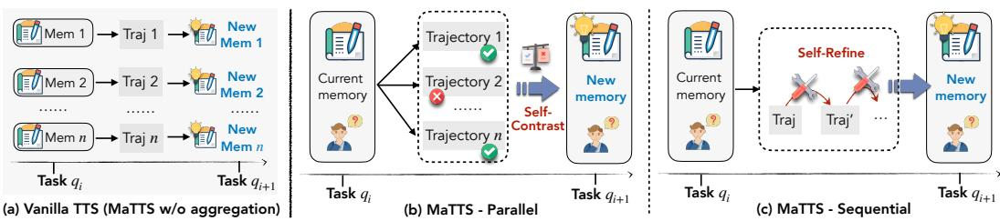
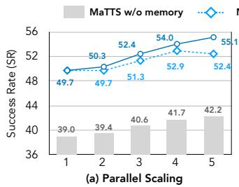
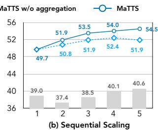
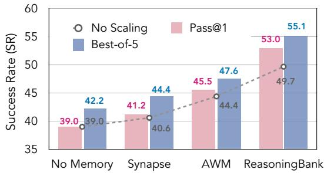
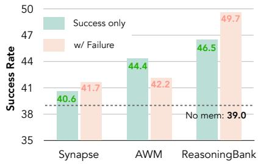
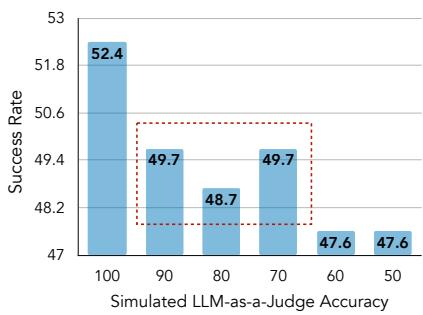
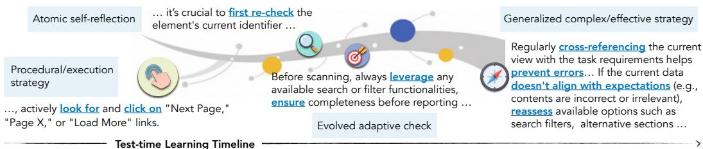

## ABSTRACT

With the growing adoption of large language model agents in persistent realworld roles, they naturally encounter continuous streams of tasks. A key limitation, however, is their failure to learn from the accumulated interaction history, forcing them to discard valuable insights and repeat past errors. We propose REASONINGBANK, a novel memory framework that distills generalizable reasoning strategies from an agent’s self-judged successful and failed experiences. At test time, an agent retrieves relevant memories from REASONINGBANK to inform its interaction and then integrates new learnings back, enabling it to become more capable over time. Building on this powerful experience learner, we further introduce memory-aware test-time scaling (MATTS), which accelerates and diversifies this learning process by scaling up the agent’s interaction experience. By allocating more compute to each task, the agent generates abundant, diverse experiences that provide rich contrastive signals for synthesizing higher-quality memory. The better memory in turn guides more effective scaling, establishing a powerful synergy between memory and test-time scaling. Across web browsing and software engineering benchmarks, REASONINGBANK consistently outperforms existing memory mechanisms that store raw trajectories or only successful task routines, improving both effectiveness and efficiency; MATTS further amplifies these gains. These findings establish memory-driven experience scaling as a new scaling dimension, enabling agents to self-evolve with emergent behaviors naturally arise. Our code can be found at https://github.com/google-research/reasoning-bank.

## 1 INTRODUCTION

The rapid advancement of large language models (LLMs) has significantly accelerated the development of interactive LLM agents (Wang et al., 2024; Liu et al., 2025a), which are crucial in tackling complex real-world tasks that require multi-turn interactions with environments. These agents have demonstrated great potential across diverse scenarios, including web browsing (Gur et al., 2024), computer use (Yang et al., 2024; Xie et al., 2024), and scientific discovery (Ghafarollahi & Buehler, 2025). As these agents are increasingly deployed in persistent, long-running roles, they naturally encounter a continuous stream of tasks and interactions. However, a critical limitation persists: they largely fail to learn from this accumulated experience. By approaching each new task in isolation, they are doomed to (i) repeat similar errors observed in the past (Yin et al., 2025), (ii) discard valuable insights gained from related problems, and, most importantly, (iii) lack selfevolving capabilities that make the agent system more capable over time (Gao et al., 2026). This phenomenon highlights the necessity of building memory-aware agent systems that could learn from their past experiences (Zhang et al., 2025b).

  
Figure 1: REASONINGBANK induces reusable reasoning strategies, making memory items more transferrable for future use. This enables agents to continuously evolve and achieve higher accumulative success rates than the “No Memory” baseline on the WebArena-Admin subset.

Recent efforts on agent memory (Huang et al., 2026) have primarily focused on storing past interactions for reuse (Zhao et al., 2024; Tang et al., 2025b; Chen et al., 2025; Sun et al., 2025). However, these approaches are often limited to leveraging raw trajectories (Zheng et al., 2024; Kagaya et al., 2024; Kong et al., 2025) or successful routines (i.e., workflows, procedures) (Wang et al., 2025d; Fang et al., 2025). They suffer from two fundamental drawbacks. First, they lack the ability to distill higher-level, transferable reasoning patterns. Second, by over-emphasizing successful experiences, they leave the valuable lessons from an agent’s own failures largely underexplored (Zhang et al., 2024). Consequently, existing memory designs often remain limited to passive record-keeping rather than providing actionable, generalizable guidance for future decisions.

To bridge this gap, we propose REASONINGBANK, a novel memory framework for agent systems. REASONINGBANK distills and organizes memory items from both successful andfailed experiences judged by the agent itself without ground-truth labels. As shown in Figure 1, it captures not only effective strategies from successes but also crucial preventative lessons from failures, abstracting them into a collection of actionable principles. This process operates in a closed loop: when facing a new task, the agent retrieves relevant memories from REASONINGBANK to guide its actions. Afterward, the new experience is analyzed, distilled, and consolidated back into the REASONINGBANK, allowing the agent to continuously evolve and improve its strategic capabilities.

With REASONINGBANK as a strong experience learner, we study experience scaling to establish a powerful synergy between memory and test-time scaling. Instead of scaling experience through flbreadth by adding more tasks, we focus on scaling experience through depth by tackling each single task with more exploration. We introduce memory-aware test-time scaling (MATTS) in both parallel and sequential settings, which generates diverse exploration to provide contrastive signals, enabling REASONINGBANK to synthesize better memories. It creates a synergy between memory and test-time scaling: high-quality memory steers the scaled exploration toward more promising paths, while the rich experiences generated forge even stronger memories. This positive feedback loop positions memory-driven experience scaling as a new scaling dimension for agents.

We conduct extensive experiments on challenging benchmarks for web browsing (WebArena, Mind2Web) and software engineering (SWE-Bench-Verified). We demonstrate that REASONING-BANK outperforms baselines in both effectiveness (up to 20% relative improvement, Table 1) and efficiency (up to 16% fewer interaction steps, Table 1). Additionally, REASONINGBANK synergizes best with MATTS, making it an essential component for memory-driven experience scaling.

Our contributions are threefold: (1) We propose REASONINGBANK, a novel memory framework that distills generalizable reasoning strategies from both successful and failed experiences, beyond prior work that primarily stores raw trajectories or success-only routines. (2) We introduce MATTS that establishes a powerful, bidirectional synergy between memory and test-time scaling, with memory-driven experience as a new scaling dimension. (3) We conduct extensive experiments on web browsing (WebArena, Mind2Web) and software engineering (SWE-Bench-Verified) tasks. We demonstrate that our approaches not only outperform baselines in effectiveness (up to 20% relative improvement) and efficiency (up to 16% fewer interactions), but also uniquely learn from failures and enable agents to develop increasingly complex, emergent reasoning strategies over time.

## 2 RELATED WORK

Memory for LLM Agents. Memory has emerged as an essential module in modern agent systems (Zhang et al., 2025b; Hu et al., 2025c; He et al., 2026) to enhance their performance by utilizing past information. Existing memory systems organize and store information in various forms, including plain text (Packer et al., 2023), latent embeddings (Wang et al., 2025b), and structured graphs (Xu et al., 2025; Chhikara et al., 2025; Li et al., 2025b). Beyond memory content, those methods usually involve retrieval mechanisms (e.g., semantic search) with memory management strategies (e.g., updating) (Tan et al., 2025; Hu et al., 2025a). More recently, with the growing development of reinforcement learning (RL) in LLM agents, RL has also been leveraged for memory management in agent systems (Yu et al., 2025a; Zhou et al., 2025). While most efforts primarily emphasize personalization (Zhang et al., 2025a; Zhong et al., 2024) and long-context management (Maharana et al., 2024; Wu et al., 2025; Hu et al., 2025b), this paper falls in the research line of learning from past experiences as memory (Zhao et al., 2024; Su et al., 2025), which is a critical aspect for developing self-evolving agent systems (Gao et al., 2026; Liang et al., 2024). Different from previous works that emphasize reusing successful trajectories (Zheng et al., 2024; Tang et al., 2025a), procedural workflows (Wang et al., 2025d; Qian et al., 2024; Fang et al., 2025; Liu et al., 2025b; Nottingham et al., 2024), or instance-level concepts (Liu et al., 2025c; Suzgun et al., 2025; Zhao et al., 2024), REASONINGBANK stores high-level strategies and reasoning hints. By abstracting experiences into reusable reasoning units, REASONINGBANK enables agents to generalize not only from successful cases (Zhao et al., 2024; Alazraki et al., 2025; Fu et al., 2024) but also by learning from failures, providing richer guidance for test-time learning.

Agent Test-Time Scaling. Test-time scaling (TTS) (Snell et al., 2025) has demonstrated strong effectiveness and has become a widely adopted practice in end-to-end problem-solving such as coding (Li et al., 2025a; Yu et al., 2025c) and math reasoning (Muennighoff et al., 2025), where methods including best-of-N (Chow et al., 2025), beam search (Wu et al., 2024b), and leveraging verifiers (Setlur et al., 2025) are commonly employed. However, its application to multi-turn interactive scenarios, particularly agentic tasks, remains underexplored. Existing works mainly adapt the lesson learned from reasoning tasks (Zhu et al., 2025) and scale different dimensions of agentic systems, including the search space for each action (Yu et al., 2025b), the number of agents in multi-agent systems (Jin et al., 2025), and the number of interactions with the environment (Shen et al., 2025). We found that none of these efforts considers the role of agent memory in scaling, where an agent can learn from past experiences to guide future decisions. Our work extends this line of research by introducing memory-aware test-time scaling (MATTS). As we will show in our empirical results (§4.3 and §4.4), memory offers benefits beyond mere computational scaling, where memory and scaling synergistically work towards better performance.

## 3 METHODOLOGY

In this section, we introduce the problem setup (§3.1), and present our proposed REASONINGBANK (§3.2), based on which we further develop memory-aware test-time scaling (MATTS) (§3.3).

## 3.1 PROBLEM FORMULATION

Agent Configuration. The scope of this work focuses on language model (LM)-based agents. The agent policy $\pi _ { \mathcal { L } } ( \cdot | \mathcal { M } , \mathcal { A } )$ is parameterized by the backbone LLM ${ \mathcal { L } } ,$ conditioned on a memory module $\mathcal { M } ,$ , and the action space ${ \mathcal { A } } ,$ denoted as $\pi _ { \mathcal { L } }$ for short. The agent needs to perform a task via interacting with the environment, which can be viewed as a sequential decision-making process. Formally, the transition function of the environment is defined as $\bar { \mathcal { T } } ( s _ { t + 1 } | s _ { t } , a _ { t } )$ where $s _ { t }$ is the state and $a _ { t }$ is the action selected by $\pi _ { \mathcal { L } }$ at time t. We focus on web browsing and software engineering (SWE) tasks. $\mathcal { A }$ is a set of web navigation operations for web browsing and bash commands for SWE, M is REASONINGBANK and initialized as empty. For each given task, the agent generates a trajectory of $\left( o _ { 0 : t } , a _ { 0 : t } \right)$ for t steps, where observation $o _ { t }$ is from the current state $s _ { t } .$ . Observations are text-based accessibility tree of web pages1 for web browsing tasks and code snippets for SWE. The agent needs to generate an action $a _ { t + 1 } \in { \mathcal { A } }$ via $\pi _ { \mathcal { L } } \left( o _ { 0 : t } , a _ { 0 : t } ; \mathcal { M } , \mathcal { A } \right) \to a _ { t + 1 }$ . For implementation, the memory module M contributes relevant memories as additional system instruction for $\pi _ { \mathcal { L } }$

  
Figure 2: Overview of REASONINGBANK. Experiences are distilled into structured memory items with a title, description, and content. For each new task, the agent retrieves relevant items to interact with the environment, and constructs new ones from both successful and failed trajectories. These items are then consolidated into REASONINGBANK, forming a closed-loop memory process.

Test-Time Learning. We focus on the test-time learning paradigm (Wu et al., 2024a; Wang et al., 2025c) where a sequence of task queries $\mathcal { Q } = \{ q _ { 1 } , q _ { 2 } , . . . , q _ { N } \}$ arrives in a streaming fashion, i.e., each query is revealed and must be completed sequentially without access to future ones. In this setting, no ground truth is available during test-time, so the agent must continually evolve by only leveraging its own past trajectories and any self-verification without relying on external labels. This streaming setting highlights two key challenges: (i) how to extract and preserve useful memory from past trajectories, and (ii) how to effectively leverage such memory for future queries to avoid redundantly re-discovering already successful strategies or repeating past mistakes.

## 3.2 REASONINGBANK

Past raw trajectories (or experiences), while being comprehensive and original, are often too lengthy and noisy to be directly applied to the current user query. As illustrated in Figure 2, REASONINGBANK distills useful strategies and reasoning hints from past experiences into structured memory items, which are then stored in the agent’s memory for future reuse.

Memory Schema. Memory items in REASONINGBANK are designed and induced from past experiences as structured knowledge units that abstract away low-level execution details while preserving transferrable reasoning patterns and strategies. Each memory item specifies three components: (i) a title, which serves as a concise identifier summarizing the core strategy or reasoning pattern; (ii) a description, which provides a brief one-sentence summary of the memory item; and (iii) the content, which records the distilled reasoning steps, decision rationales, or operational insights extracted from past experiences. Together, memory items extracted are both human-interpretable and machine-usable, facilitating efficient usage and integration with agents.

Integrating REASONINGBANK with Agents. An agent $\pi _ { \mathcal { L } }$ equipped with REASONINGBANK can draw upon a curated pool of transferable strategies to guide decision-making. This enables the agent to recall effective insights, avoid previously observed pitfalls, and adapt more robustly to unseen queries. The integration proceeds in three steps: (i) memory retrieval, (ii) memory extraction, and (iii) memory consolidation, as shown in Figure 2. During memory retrieval, the agent queries REASONINGBANK with the current query context to identify the top-k relevant experiences and their corresponding memory items using embedding-based similarity search. Retrieved items are injected into the agent’s system instruction, ensuring that action prediction from A is grounded with useful past experiences. When the current query task is completed, we will perform memory extraction to extract new memory items. The first step is to obtain proxy correctness signals for trajectories: we adopt an LLM-as-a-judge (Gu et al., 2024) to label outcomes as success or failure given the query and trajectory without any ground-truth reference. Based on these signals, we apply different extraction strategies: successful experiences contribute validated strategies, while failed ones supply counterfactual signals and pitfalls that help sharpen guardrails. In practice, we extract multiple memory items for each trajectory/experience as detailed in Appendix A.1. Finally, memory consolidation incorporates these items into REASONINGBANK with a simple addition operation, maintaining an evolving repository of memory items. Details are in Appendix A.2. Together, these steps form a closed-loop process: the agent leverages past experiences, constructs new memory from current tasks, and continually updates its memory, enabling sustained evolvement in test-time learning scenarios.2

  
Figure 3: Comparison of (a) vanilla TTS that independently run REASONINGBANK for multiple times without aggregating on trajectories, MATTS with (b) parallel scaling, where self-contrast across multiple trajectories curates reliable memory, and (c) sequential scaling, where selfrefinement enriches memory with intermediate reasoning signals.

## 3.3 MATTS: MEMORY-AWARE TEST-TIME SCALING

REASONINGBANK enables learning from experiences to translate more experiences into greater improvements. As test-time scaling (TTS) (Snell et al., 2025) recently emerged as a powerful strategy for boosting the performance of LLM agents (Zhu et al., 2025), it shows strong potential by allocating additional inference-time computation to generate abundant exploration histories. A vanilla combination is depicted in Figure 3(a), where more trajectories are independently converted to more memory items. However, this is suboptimal because it does not leverage inherent contrastive signal that arises from abundant explorations on the same problem, which limits the resulting performance advantage brought by TTS. To address this, we propose Memory-aware Test-Time Scaling (MATTS), a novel integration of test-time scaling with our memory framework, REASONINGBANK. Unlike the vanilla approach, MATTS learns by deliberately aggregating from the abundant successful and failure trajectories generated during scaling for more effective memory curation. We design two complementary instantiations for MATTS, parallel scaling and sequential scaling, as illustrated in Figure 3(b) and 3(c) with detailed implementation in Appendix A.3.

Parallel Scaling. In the parallel setting, we generate multiple trajectories for the same query under the guidance of retrieved memory items. By comparing and contrasting (self-contrast (Chen et al., 2020)) across different trajectories, the agent can identify consistent reasoning patterns while filtering out spurious solutions. This process enables more reliable memory curation from multiple trials of a single query and promotes diverse yet grounded exploration.

Sequential Scaling. We iteratively refine its reasoning within a single trajectory after the initial completion, following the principle of self-refinement (Madaan et al., 2023). In this process, the intermediate notes generated in self-refinement are also used as valuable signals for memory, since they capture reasoning attempts, corrections, and insights that may not appear in the final solution.

We define the scaling factor k, denoting the number of trajectories for parallel scaling and refinement steps for sequential scaling. Equipped with REASONINGBANK, both parallel and sequential strategies become memory-aware, ensuring that the additional computation allocated at test time translates into more transferable and higher-quality memory for future tasks.

## 4 EXPERIMENTS

## 4.1 SETUP

Following existing work (Wang et al., 2025d), we conduct experiments on WebArena (Zhou et al., 2024) which features general web navigation across diverse domains3, and Mind2Web (Deng et al., 2023) that tests generalization of agents on versatile operations and environments. We also conduct experiment on SWE-Bench-Verified for repository-level issue-resolving. For comparison, we consider baselines ranging from memory-free agents (No Memory) to trajectory-based memory (Synapse) (Zheng et al., 2024) and workflow-based memory (AWM) (Wang et al., 2025d). Our agents are built on Gemini-2.5 (Comanici et al., 2025) and Claude-3.7 (Anthropic, 2025) models using BrowserGym (de Chezelles et al., 2025) for web browsing and bash-only for SWE, following ReAct (Yao et al., 2023) style with default decoding configurations. We evaluate effectiveness (success rate, SR) and efficiency (average steps, AS), with specific metrics varying for each dataset. Full descriptions for datasets, baselines, implementations, and evaluation are in Appendix B.

Table 1: Experiment results of REASONINGBANK and MATTS (parallel scaling, k = 5, pass@1) on WebArena benchmark. Success rate (SR ↑) and the number of steps (Step ↓) are reported on 5 subsets for 3 different backbone LLMs.

<table><tr><td rowspan="2">Models</td><td colspan="2">Shopping (187)</td><td colspan="2">Admin (182)</td><td colspan="2">Gitlab (180)</td><td colspan="2">Reddit (106)</td><td colspan="2">Multi (29)</td><td colspan="2">Overall (684)</td></tr><tr><td>SR</td><td>Step</td><td>SR</td><td>Step</td><td>SR</td><td>Step</td><td>SR</td><td>Step</td><td>SR</td><td>Step</td><td>SR</td><td>Step</td></tr><tr><td colspan="13">Gemini-2.5-flash</td></tr><tr><td>No Memory</td><td>39.0</td><td>8.2</td><td>44.5</td><td>9.5</td><td>33.9</td><td>13.3</td><td>55.7</td><td>6.7</td><td>10.3</td><td>10.0</td><td>40.5</td><td>9.7</td></tr><tr><td>Synapse</td><td>40.6</td><td>7.0</td><td>45.1</td><td>9.1</td><td>35.6</td><td>13.0</td><td>59.4</td><td>6.5</td><td>10.3</td><td>10.5</td><td>42.1</td><td>9.2</td></tr><tr><td>AWM</td><td>44.4</td><td>7.0</td><td>46.7</td><td>8.8</td><td>37.2</td><td>13.2</td><td>62.3</td><td>6.1</td><td>3.4</td><td>7.7</td><td>44.1</td><td>9.0</td></tr><tr><td>REASONINGBANK</td><td>49.7</td><td>6.1</td><td>51.1</td><td>8.2</td><td>40.6</td><td>12.3</td><td>67.0</td><td>5.6</td><td>13.8</td><td>8.8</td><td>48.8</td><td>8.3</td></tr><tr><td>+MATTs</td><td>53.0</td><td>6.3</td><td>53.8</td><td>7.6</td><td>42.8</td><td>11.9</td><td>70.8</td><td>5.4</td><td>17.2</td><td>8.0</td><td>51.8</td><td>7.9</td></tr><tr><td colspan="13">Gemini-2.5-pro</td></tr><tr><td>No Memory</td><td>45.5</td><td>7.6</td><td>51.1</td><td>8.7</td><td>35.0</td><td>11.6</td><td>71.7</td><td>6.0</td><td>6.9</td><td>8.8</td><td>46.7</td><td>8.8</td></tr><tr><td>Synapse</td><td>46.5</td><td>6.6</td><td>52.2</td><td>8.9</td><td>38.3</td><td>11.3</td><td>68.9</td><td>5.9</td><td>6.9</td><td>9.0</td><td>47.7</td><td>8.5</td></tr><tr><td>AWM</td><td>48.1</td><td>6.4</td><td>49.3</td><td>9.8</td><td>40.0</td><td>11.2</td><td>68.9</td><td>6.4</td><td>3.4</td><td>9.3</td><td>47.6</td><td>8.7</td></tr><tr><td>REASONINGBANK</td><td>51.9</td><td>6.0</td><td>56.6</td><td>7.7</td><td>44.4</td><td>9.8</td><td>80.2</td><td>5.1</td><td>13.8</td><td>8.2</td><td>53.9</td><td>7.4</td></tr><tr><td>+MATTs</td><td>54.0</td><td>5.9</td><td>58.2</td><td>7.4</td><td>46.7</td><td>9.1</td><td>83.0</td><td>5.3</td><td>20.7</td><td>7.2</td><td>56.3</td><td>7.1</td></tr><tr><td colspan="13">Claude-3.7-sonnet</td></tr><tr><td>No Memory</td><td>38.5</td><td>6.1</td><td>49.5</td><td>8.4</td><td>36.7</td><td>10.6</td><td>53.8</td><td>5.5</td><td>0.0</td><td>11.6</td><td>41.7</td><td>8.0</td></tr><tr><td>Synapse</td><td>39.6</td><td>5.8</td><td>50.5</td><td>8.5</td><td>38.0</td><td>10.0</td><td>53.8</td><td>6.1</td><td>0.0</td><td>11.8</td><td>42.6</td><td>7.9</td></tr><tr><td>AWM</td><td>39.6</td><td>7.2</td><td>47.8</td><td>9.3</td><td>34.6</td><td>10.9</td><td>52.8</td><td>7.0</td><td>0.0</td><td>12.4</td><td>40.8</td><td>8.9</td></tr><tr><td>REASONINGBANK</td><td>44.9</td><td>5.6</td><td>53.3</td><td>7.6</td><td>41.1</td><td>9.5</td><td>57.5</td><td>5.2</td><td>3.4</td><td>10.5</td><td>46.3</td><td>7.3</td></tr><tr><td>+MATTs</td><td>47.1</td><td>5.8</td><td>55.5</td><td>7.4</td><td>43.3</td><td>9.4</td><td>60.4</td><td>5.0</td><td>10.3</td><td>9.1</td><td>48.8</td><td>7.2</td></tr></table>

## 4.2 RESULTS OF REASONINGBANK

Tables 1, 2, 3 summarize the main evaluation results of REASONINGBANK on WebArena, Mind2Web, and SWE-Bench-Verified accordingly. We have the following observations.

REASONINGBANK consistently outperforms baselines across LLM backbones on all datasets. Specifically, REASONINGBANK improves the overall success rate on WebArena (Table 1) by +8.3, +7.2, and +4.6 with three different backbone LLMs compared to memory-free agents. A similar pattern holds on Mind2Web (Table 2), where REASONINGBANK delivers clear gains across crosstask, cross-website, and cross-domain settings, underscoring both the consistency and scalability of its benefits across datasets and model sizes. Results on SWE-Bench-Verified (Table 3) further confirm its robustness. Crucially, unlike baselines such as Synapse and AWM that rely on a narrow, homogeneous memory source derived exclusively from successful trajectories, REASONINGBANK employs a superior extraction strategy that is key to its consistent out-performance.

REASONINGBANK enhances generalization with better transferrable memory across tasks. We also evaluate in challenging generalization settings. On WebArena (Table 1), the Multi subset requires transferring memory across multiple websites, where REASONINGBANK achieves a notable gain of +4.6 averaged SR over the strongest baseline. In contrast, strong baselines such as AWM fail to provide gains and even degrade in this setting. On Mind2Web (Table 2), which includes cross-task, cross-website, and cross-domain evaluations that impose progressively higher demands, REASONINGBANK consistently improves success rates. The gains are especially pronounced in the cross-domain setting, which requires the highest level of generalization. These results demonstrate

Table 2: Results on Mind2Web benchmark for cross-task, cross-website, and cross-domain generalization test. EA (↑) is short for element accuracy, $\mathrm { A F _ { 1 } }$ (↑) is short for action $\mathrm { F _ { 1 } } .$ , and SSR (↑) is short for step success rate. SR (↑) is the task-level success rate measuring if all steps are correct.

<table><tr><td rowspan="2">Models</td><td colspan="4">Cross-Task</td><td colspan="4">Cross-Website</td><td colspan="4">Cross-Domain</td></tr><tr><td>EA</td><td> $AF_1$ </td><td>SSR</td><td>SR</td><td>EA</td><td> $AF_1$ </td><td>SSR</td><td>SR</td><td>EA</td><td> $AF_1$ </td><td>SSR</td><td>SR</td></tr><tr><td colspan="13">Gemini-2.5-flash</td></tr><tr><td>No Memory</td><td>46.0</td><td>59.1</td><td>40.3</td><td>3.3</td><td>39.8</td><td>45.1</td><td>31.7</td><td>1.7</td><td>35.8</td><td>37.9</td><td>31.9</td><td>1.0</td></tr><tr><td>Synapse</td><td>47.0</td><td>59.5</td><td>41.2</td><td>3.5</td><td>40.3</td><td>46.0</td><td>32.1</td><td>1.9</td><td>36.3</td><td>38.5</td><td>32.4</td><td>1.1</td></tr><tr><td>AWM</td><td>46.3</td><td>56.1</td><td>41.0</td><td>3.5</td><td>39.1</td><td>42.2</td><td>31.7</td><td>2.1</td><td>33.3</td><td>36.5</td><td>30.1</td><td>0.7</td></tr><tr><td>REASONINGBANK</td><td>52.1</td><td>60.4</td><td>44.9</td><td>4.8</td><td>44.3</td><td>52.6</td><td>33.9</td><td>2.3</td><td>40.6</td><td>41.3</td><td>36.6</td><td>1.6</td></tr><tr><td colspan="13">Gemini-2.5-pro</td></tr><tr><td>No Memory</td><td>49.3</td><td>60.2</td><td>44.4</td><td>3.5</td><td>41.2</td><td>49.8</td><td>34.8</td><td>3.4</td><td>37.9</td><td>37.7</td><td>35.0</td><td>1.4</td></tr><tr><td>Synapse</td><td>50.1</td><td>61.0</td><td>44.7</td><td>3.6</td><td>41.8</td><td>51.2</td><td>35.0</td><td>3.2</td><td>38.5</td><td>39.8</td><td>35.6</td><td>1.5</td></tr><tr><td>AWM</td><td>48.6</td><td>61.2</td><td>44.4</td><td>3.7</td><td>41.9</td><td>47.9</td><td>34.8</td><td>2.3</td><td>37.3</td><td>38.1</td><td>34.4</td><td>1.2</td></tr><tr><td>REASONINGBANK</td><td>53.6</td><td>62.7</td><td>45.6</td><td>5.1</td><td>46.1</td><td>54.8</td><td>36.9</td><td>3.8</td><td>42.8</td><td>45.2</td><td>38.1</td><td>1.7</td></tr></table>

that memory curated by REASONINGBANK is more robust and transferable, enabling agents to generalize effectively across diverse scenarios.

REASONINGBANK achieves superior efficiency by leveraging past experiences as memory. In addition to higher success rates, REASONINGBANK also reduces the number of interaction steps needed to complete tasks, as shown in the Step metric of Table 1 and 3. On WebArena, across almost all subsets and backbones, REASONINGBANK lowers the average step count by up to 1.4 compared with “No Memory”, and 1.6 compared with other memory baselines. The average step on SWE-Bench-Verified is also smaller by saving 2.8 and 1.3 steps respectively. This indicates that REASONINGBANK enables agents to solve tasks more efficiently by reusing and refining reasoning knowledge, thus avoiding unnecessary or redundant exploration.

Table 3: Experiment results of REA-SONINGBANK on SWE-Bench-Verified dataset for issue-resolving in a given repository.

<table><tr><td>Methods</td><td>Resolve Rate</td><td>AS</td></tr><tr><td colspan="3">Gemini-2.5-flash</td></tr><tr><td>No Memory</td><td>34.2</td><td>30.3</td></tr><tr><td>Synapse</td><td>35.4</td><td>30.7</td></tr><tr><td>REASONINGBANK</td><td>38.8</td><td>27.5</td></tr><tr><td colspan="3">Gemini-2.5-pro</td></tr><tr><td>No Memory</td><td>54.0</td><td>21.1</td></tr><tr><td>Synapse</td><td>53.4</td><td>21.0</td></tr><tr><td>REASONINGBANK</td><td>57.4</td><td>19.8</td></tr></table>

## 4.3 RESULTS OF MATTS

We first present the overall results of MATTS on WebArena in Table 1, which demonstrate additional strong performance improvement and efficiency gains with REASONINGBANK.4 To study the scaling effect in-depth with both parallel and sequential variants, we experimented MATTS with Gemini-2.5-flash on Webarena-Shopping subset. To investigate the overall scaling effect, we benchmark with (i) MATTS w/o memory, which represents the scaling setting without memory mechanism, (ii) MATTS w/o aggregation, which is equal to Vanilla TTS in Figure 3(a) and (iii) MATTS to demonstrate the effect with respect to scaling factor k. Notably, $k = 1$ is the setting without scaling. For parallel scaling, we compute Best-of-N (BoN) as the final metric detailed in Appendix A.3. Results are shown in Figure 4.

Both parallel scaling and sequential scaling boost performance. Increasing k generally improves success rate, confirming the benefit of allocating more inference-time computation. With MATTS, parallel scaling grows from 49.7 (k = 1) to 55.1 (k = 5), while sequential scaling rises from 49.7 to 54.5. For the baseline of MATTS w/o memory, the gains are smaller and less consistent (e.g., parallel scaling fluctuates between 39.0 and 42.2 and sequential scaling fluctuates between 37.4 and 40.6). In contrast, MATTS enables stronger and more stable improvements across both scaling strategies, highlighting its role in making scaling more effective.

MATTS is consistently better than vanilla TTS. With REASONINGBANK, MATTS consistently surpasses MATTS w/o aggregation (vanilla TTS), showing that memory-aware coordination and aggregation is important. Specifically, at $k = 5 .$ , MATTS achieves 55.1 in parallel scaling compared with 52.4 for vanilla TTS, and 54.5 versus 51.9 in sequential scaling. These improvements highlight that memory-aware scaling effectively directs the agent toward more promising solutions by synthesizing insights from multiple trajectories or interaction steps to leverage contrastive signals.

Sequential scaling shows shortterm advantage, but parallel dominates at larger scales for REASON-INGBANK. With stronger memory mechanisms such as REASONING-BANK, sequential refinement brings higher gains at small k, but its benefit quickly saturates—once the model either succeeds or fails decisively, further refinements add little new insight. In contrast, parallel scaling continues to provide diverse rollouts that allow the model to critique and improve upon its own generations,

  
Figure 4: Effect of scaling factor k for MATTS under with REASONINGBANK on WebArena-Shopping subset. We compare (a) parallel and (b) sequential test-time scaling.

leading it to surpass sequential at larger k (e.g., 55.1 vs. 54.5 at $k = 5 )$ . In contrast, for vanilla TTS which is not equipped with memory module, sequential scaling yields little or even no benefit as scaling goes on, and parallel scaling consistently dominates.

## 4.4 SYNERGY OF MEMORY AND TEST-TIME SCALING

While the previous section establishes the overall effectiveness of MATTS, we highlight the synergy between memory and TTS in this section. Figure 5 presents a snapshot of MATTS on the WebArena-Synergy of Memory and TTS Shopping subset with parallel scaling factor $k = 5 .$ , where we report both Pass@1 (randomly selected trajectory) and Best-of-5 (BoN). This setting allows us to examine the bidirectional interaction between memory quality and scaling effectiveness.

Better memory enables stronger test-time scaling performance. To see how memory improves the effectiveness of scaling, we focus on the BoN results, which directly measure an agent’s ability to surface the best outcome among multiple rollouts. As shown by blue bars in Figure 5, the benefit of scaling depends critically on the underlying memory. Without memory, scaling yields slight improvement, with BoN rising only from 39.0 to 42.2. Weaker memory mechanisms such as Synapse and AWM provide moderate gains, reaching 44.4 and 47.6, respectively. In contrast, MATTS with REASONINGBANK delivers the strongest benefit, with BoN climbing from 49.7 to 55.1. These results show that high-quality

  
Figure 5: Snapshot of MATTS on WebArenaory mechanism enables stronger test-time scalinShopping subset with different memory mechanisms with $k ~ = ~ 5$ We compute BoN for all s better memory curation.5 trajectories and Pass@1 with one randomly selected trajectory.

memory directs scaling toward more promising rollouts, ensuring that the additional trajectories are not wasted but converted into higher success rates.

Scaling yields better memory curation. To fairly evaluate how scaling feeds back into memory, we report Pass@1, which measures the average quality of trajectories after memory curation and allows direct comparison with the no-scaling case. The trend is depicted in pick bars and is striking: scaling actually reduces performance for weaker memories, where Synapse slightly increases from 40.6 to 41.2, and AWM from 44.4 to 45.5. These phenomenon suggest that without strong guidance, the extra rollouts generated by scaling offer diminishing returns. In contrast, REASONINGBANK provides far more benefits: Pass@1 rises from 49.7 to 53.0, showing that high-quality memory can harness the diversity of scaling to extract constructive contrastive signals. This asymmetry highlights that scaling alone is insufficient; only when paired with good memory mechanism does it contribute to curation of more effective memory, closing the virtuous cycle.

## 5 ANALYSIS

We analyze REASONINGBANK through several aspects: incorporating failure trajectories, examining emergent strategies, and evaluating efficiency across both successful and failed cases. Additional analyses are presented in Appendix C, including but not limited to number of retrieved experiences, additional results on smaller open-source model, and inference cost study.

Emergent behaviors with REASONINGBANK. We find that the strategies in REASONINGBANK are not flat or monolithic, but instead evolve over time, exhibiting emergent behaviors that resemble the learning dynamics of RL (Wang et al., 2025a). As illustrated in a human case study in Figure 8, memory items describing a specific strategy “User-Specific Information Navigation” in REASONINGBANK could gradually evolve during test-time learning process. It starts from execution-oriented or procedural strategies (e.g., find navigation links), where the agent follows straightforward action rules. It then progresses to adaptive self-reflections such as re-verifying identifiers to reduce simple mistakes. With more experiences, the same memory item evolves into adaptive checks, where the agent systematically leverages available search or filters to ensure completeness before results. Finally, it eventually matures into compositional strategies suchAblation Study as cross-referencing task requirements and reassessing options. This evolution highlights how REASONINGBANK enables agents to refine strategies from low-level actions to high-level reasoning during test-time learning.

REASONINGBANK makes good use of failure trajectories. Figure 6 compares different memory designs on WebArena-Shopping with Gemini-2.5-flash under two settings: using only successful trajectories versus leveraging both successes and failures. Baseline methods such as Synapse and AWM build memory solely from successful trajectories, and thus are not equipped to benefit from failures. As a result, when failures are added, their performance is limited or even degraded: Synapse increases only from 40.6 (success only) to 41.7 (with failures), while AWM drops from 44.4 to 42.2. In contrast, the design of REASONINGBANK enables distillation of reasoning patterns from both successes and failures, achieving 46.5 on success-only traces and further improving to 49.7 when failures are included. This highlights that, unlike baselines, REASONINGBANK can transform failures into constructive signals rather than noise, enabling more robust generalization.

  
Figure 6: Ablation results of incorporating failure trajectories for memory induction.

REASONINGBANK exhibits robustness to LLM-as-a-Judge calibration. A critical step in our method is sourcing proxy correctness signals for agent trajectories via an LLM-as-a-Judge. Here we quantitatively calibrate this judge and analyze its robustness to verification noise. We conduct our analysis on the WebArena-Shopping subset, using Gemini-2.5-flash as the judge. We first establish the baseline accuracy by comparing the judge’s predictions against ground-truth labels, which we find to be 72.7%. To systematically study the robustness of REASONINGBANK to the judge quality, we simulate different levels of verification accuracy. This is achieved by probabilistically correlating the judge’s labels with the ground-truth. For example, a 100% accurate verifier uses the ground-truth

  
Figure 7: Results for SR w.r.t. simulated LLM-as-a-judge accuracy.

labels directly. A 90% accurate verifier is simulated by using the correct (ground-truth) label 90% of the time and the incorrect (flipped) label 10% of the time. We extend this simulation down to 50% accuracy, which represents a random-guess baseline for this binary (success/failure) classification task. The results are presented in Figure 7. We observe that the judge’s accuracy does not significantly impact the performance of REASONINGBANK, as all variants achieve similar success rates within reasonable accuracy range (70%-90%). Intuitively, the 100% (ground-truth)

  
Figure 8: A case study illustrating emergent behaviors in REASONINGBANK through memory items.

Table 4: Average number of steps on successful and failed test instances across four WebArena domains. REASONINGBANK consistently reduces the number of steps compared to the vanilla baseline, with notably larger reductions on successful instances.

<table><tr><td rowspan="2">Models</td><td colspan="2">Shopping</td><td colspan="2">Admin</td><td colspan="2">Gitlab</td><td colspan="2">Reddit</td></tr><tr><td>Successful</td><td>Failed</td><td>Successful</td><td>Failed</td><td>Successful</td><td>Failed</td><td>Successful</td><td>Failed</td></tr><tr><td>No Memory</td><td>6.8</td><td>8.7</td><td>8.4</td><td>10.4</td><td>8.6</td><td>15.7</td><td>6.1</td><td>7.6</td></tr><tr><td>REASONINGBANK</td><td> $4.7 \downarrow 2.1$ </td><td> $7.3 \downarrow 1.4$ </td><td> $7.0 \downarrow 1.4$ </td><td> $9.5 \downarrow 0.9$ </td><td> $7.6 \downarrow 1.0$ </td><td> $15.5 \downarrow 0.2$ </td><td> $5.0 \downarrow 1.1$ </td><td> $6.8 \downarrow 0.8$ </td></tr></table>

accuracy setting yields the best performance. These findings confirm that REASONINGBANK is robust to noise in the verification step.

REASONINGBANK delivers targeted efficient gains. While the overall number of steps in Table 1 provides a general view of model efficiency, it does not distinguish whether reductions come from successful or failed trajectories. To gain deeper insight, we further separate the analysis into successful and failed test cases, which allows us to understand the source of step reduction: a desirable system should reduce unnecessary exploration when it is on the right track, rather than merely cutting short failed attempts. The results are shown in Table 4. We find that REASONINGBANK consistently reduces the number of steps across all domains compared to the baseline. More importantly, the reduction is particularly pronounced on successful cases, reaching up to 2.1 fewer steps (a 26.9% relative reduction) than on failed ones. This indicates that REASONINGBANK primarily helps the agent reach solutions with fewer interactions by fistrengthening its ability to follow effective reasoning paths rather than simply truncating failed trajectories, which highlight the role of memory in guiding purposeful decision-making and improving efficiency in practice.

## 6 CONCLUSION

We introduce REASONINGBANK, a memory framework that distills strategy-level reasoning signals from both successes and failures and integrates them into test-time scaling (MATTS). Extensive experiments show that REASONINGBANK consistently improves performance while reducing redundant exploration. Further results reveal a strong synergy between memory and scaling: REASONINGBANK guides scaling toward more promising rollouts, while diverse rollouts enrich memory with valuable contrastive signals. We also provide analyses of individual components and emergent behaviors. Our findings suggest a practical pathway toward building adaptive and lifelonglearning agents, with additional future directions and limitations in Appendix D and E.

## ACKNOWLEDGEMENT

We thank Jiao Sun, Jing Nathan Yan, Chi Wang, and members from Google Cloud AI Research for their valuable feedback during the preparation of the paper. Siru was supported by the Molecule Maker Lab Institute: An AI Research Institutes program supported by NSF under Award No. 2019897.