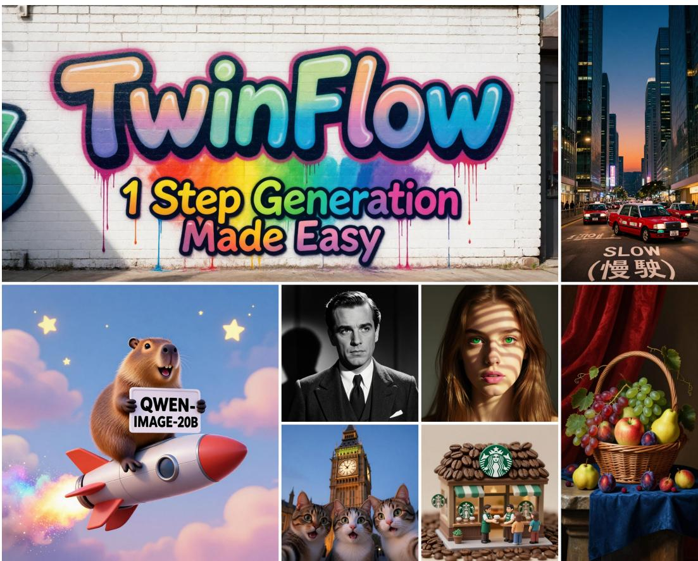
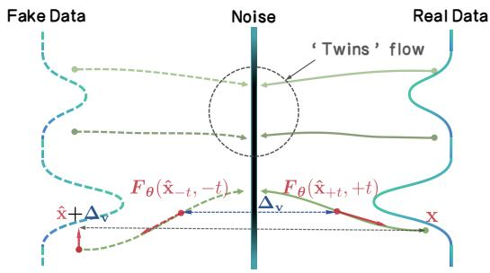
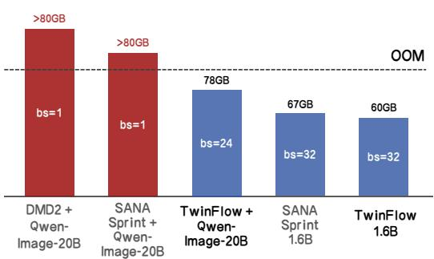
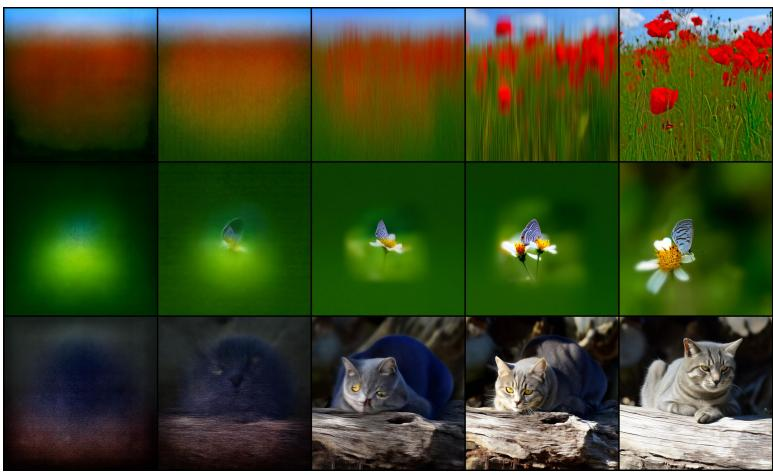
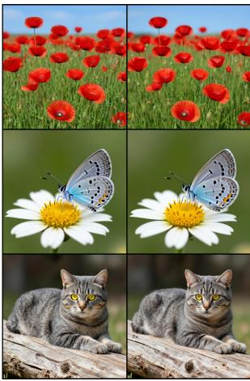
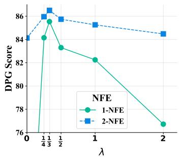
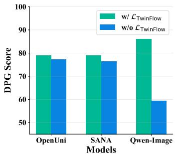
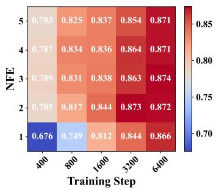

## ABSTRACT

Recent advances in large multi-modal generative models have demonstrated impressive capabilities in multi-modal generation, including image and video generation. These models are typically built upon multi-step frameworks like diffusion and flow matching, which inherently limits their inference efficiency (requiring 40-100 Number of Function Evaluations (NFEs)). While various few-step methods aim to accelerate the inference, existing solutions have clear limitations. Prominent distillation-based methods, such as progressive and consistency distillation, either require an iterative distillation procedure or show significant degradation at very few steps (< 4-NFE). Meanwhile, integrating adversarial training into distillation (e.g., DMD/DMD2 and SANA-Sprint) to enhance performance introduces training instability, added complexity, and high GPU memory overhead due to the auxiliary trained models. To this end, we propose TWINFLOW, a simple yet effective framework for training 1-step generative models that bypasses the need of fixed pretrained teacher models and avoids standard adversarial networks during training, making it ideal for building large-scale, efficient models. On text-to-image tasks, our method achieves a GenEval score of 0.83 in 1-NFE, outperforming strong baselines like SANA-Sprint (a GAN loss-based framework) and RCGM (a consistency-based framework). Notably, we demonstrate the scalability of TWINFLOW by full-parameter training on Qwen-Image-20B and transform it into an efficient few-step generator. With just 1-NFE, our approach matches the performance of the original 100-NFE model on both the GenEval and DPG-Bench benchmarks, reducing computational cost by 100× with minor quality degradation. Project page is available here.

‡ Code: https://github.com/inclusionAI/TwinFlow

Models: https://huggingface.co/collections/inclusionAI/twinflow

## 1 INTRODUCTION

Modern generative paradigms—including diffusion (Ho et al., 2020; Song et al., 2020a), flow matching (Lipman et al., 2022; Ma et al., 2024), and consistency models (Song et al., 2023; Lu & Song, 2024)—have achieved state-of-the-art performance, forming the backbone of leading image and video generation systems (Peebles & Xie, 2023; Ho et al., 2022; Chen et al., 2024c; Xie et al., 2024a). Despite their success, these methods share a critical drawback: both training and sampling demand substantial computational resources. This challenge is magnified in the era of large-scale models (ModelTC, 2025). For these systems, efficient sampling is paramount, as the continuous, longterm cost of inference often surpasses the one-time training cost, directly impacting their economic viability and practical deployment (ModelTC, 2025; Xie et al., 2025a).

Numerous research efforts aim to accelerate generative inference by reducing the number of sampling steps. Early single-step methods, like Generative Adversarial Networks (GANs) (Goodfellow et al., 2014), often suffered from unstable training dynamics. To accelerate the multi-step diffusion models, various distillation techniques have been introduced. These range from student-teacher methods, where a compact model learns to emulate a larger one in fewer steps (Salimans & Ho, 2022; Meng et al., 2022), to distribution matching distillation (e.g., DMD variants (Yin et al., 2024b;a)), which uses adversarial training to directly align the model’s output distribution with the real data. In parallel, a powerful new paradigm of consistency models (Song et al., 2023) and their variants, such as LCM (Luo et al., 2023) and PCM (Wang et al., 2024a), has emerged, explicitly designed for high-quality generation in very few steps.

  
Figure 1: Results of Qwen-Image-20B-TWINFLOW (NFE=2). See prompts in App. E.3.

Despite their progress, existing few-step methods face a difficult trade-off between simplicity, efficiency, and quality. (a) Complexity and instability: As summarized in Tab. 1, adversarial methods such as GANs and DMD require auxiliary networks (e.g., discriminators) or frozen teacher models. This not only introduces training instability and sensitivity to hyperparameters but also increases architectural complexity and memory overhead (c.f. Fig. 2b), hindering their scalability to large mod els. (b) Performance degradation: Conversely, methods that train from scratch without adversarial guidance (Luo et al., 2023; Yin et al., 2024a), such as consistency models, often exhibit a sharp decline in quality at very low NFEs (< 4) (Chen et al., 2025c). In summary, we posit that existing methods either suffer from training instability, or require additional/frozen models (see our Tab. 1), which limits their simplicity and scalability in training large models.

To address these challenges, we propose TWINFLOW, a simple yet effective one-step generative training framework built on a novel twin-trajectory concept. By extending the standard time interval from t ∈ [0, 1] to t ∈ [−1, 1], we conceptualize two trajectories originating from the noise distribution. The positive branch (t > 0) maps noise to real data while the negative branch (t < 0) maps the same noise to “fake” data, enabling simultaneous learning of both transformations. Our learning objective is to minimize the discrepancy between the velocity fields of these two trajectories (see Fig. 2a). This forces the model to learn a more robust and direct mapping from noise to data, thereby enhancing 1-step generation performance in a self-supervised manner. As highlighted in Tab. 1, a key advantage of TWINFLOW is its simplicity, as it requires no auxiliary trained networks or frozen teacher models. Extensive experiments at different scales demonstrate the effectiveness of TWINFLOW, including text-to-image generation (cf. Sec. 4.2 & Sec. 4.3) on large models like Qwen-Image-20B (Wu et al., 2025a). 2-NFE visualizations on Qwen-Image-20B are given in Fig. 1. Our key contributions are:

Table 1: Comparison of different few-step generative modeling methods on their minimal dependence of auxiliary trained model and frozen teacher model. Prior 1-step/few-step methods such as GAN requires a trained discriminator, diffusion/consistency distillation⋆ requires a frozen teacher model, DMD requires training an auxiliary score function for fake data and a frozen teacher model, DMD2† trains a GAN discriminator and a fake score function at the same time. Our TWINFLOW achieves 1-step generation without depending on auxiliary trained or frozen models, offering high simplicity.

<table><tr><td>Method</td><td>Generation type</td><td>#Auxiliary trained model</td><td>#Frozen teacher model</td></tr><tr><td>GAN (Goodfellow et al., 2014)</td><td>1-step</td><td>1</td><td>0</td></tr><tr><td>Diffusion models (Ho et al., 2020)</td><td>multi-step</td><td>0</td><td>0</td></tr><tr><td>Flow matching models (Lipman et al., 2022)</td><td>multi-step</td><td>0</td><td>0</td></tr><tr><td>Diffusion distillation (Salimans &amp; Ho, 2022)</td><td>few-step</td><td>0</td><td>1</td></tr><tr><td>Consistency training &amp; distillation (Song et al., 2023)</td><td>1-step, few-step</td><td>0</td><td>0,1*</td></tr><tr><td>Distribution matching distillation (Yin et al., 2024b;a)</td><td>1-step, few-step</td><td> $1,2^†$ </td><td>1</td></tr><tr><td>TWINFLOW (Ours)</td><td>1-step, few-step</td><td>0</td><td>0</td></tr></table>

  
(a) TWINFLOW overview. The standard flow is on the right side (solid lines), its twin (dashed lines) is on the left side. The core of our method is to minimize of the difference between the velocity fields $( \Delta _ { \mathbf { v } } )$ of the standard flow and its twin flow.

  
(b) GPU memory comparison. Directly adopting DMD2 and SANA-Sprint suffers from OOM when applying to ultra-large models. Our method can be easily applied to train Qwen-Image-20B.  
Figure 2: Overview of our TWINFLOW and training GPU memory comparison. The GPU memory usage is measured on 1024×1024 resolution on Qwen-Image-20B (LoRA tuning) and SANA-1.6B.

(a) Simple yet effective 1-step generation framework. We propose a one-step generation framework that does not need auxiliary trained models (GAN discriminators) or frozen teacher models (different/consistency distillation), thereby eliminating GPU memory cost, allowing for more flexible and scalable training on large models.

(b) Strong 1-NFE performance on text-to-image task. Built on the any-step framework, TWIN-FLOW achieves strong text-to-image performance with only 1-NFE, achieving 0.83 GenEval score, surpassing SANA-Sprint (0.72) and RCGM (0.80).

(c) Effective application on large models. By applying TWINFLOW, we successfully bring 1/2-NFE generation capabilities to Qwen-Image-20B. We achieve GenEval score of 0.86 and DPG score of 86.52 (1-NFE); GenEval 0.87 and DPG Score 87.64 (2-NFE), which are highly competitive with the original 100-NFE scores of 0.87 and 88.32.

## 2 PRELIMINARIES

Given a dataset D, let $p ( \mathbf { x } )$ represent its data distribution and $p ( \mathbf { x } | \mathbf { c } )$ the conditional distribution given a condition c. Generative models aim to learn a transformation from a simple source distribution, $p ( \mathbf { z } )$ , such as the standard Gaussian distribution $\mathcal { N } ( \mathbf { 0 } , \mathbf { I } )$ , to the complex target distribution, p(x).

Any-step generative model framework. A recent framework, RCGM (Sun & Lin, 2025), introduces a unified formulation for the any-step generation framework, covering paradigms like multi-step generative models (Ho et al., 2020; Song et al., 2020b; Lipman et al., 2022) and few-step generative models (Song et al., 2023; Lu & Song, 2024; Frans et al., 2024; Geng et al., 2025; Sun et al., 2025).

In this framework, a prediction function can be generally defined as $f ( \mathbf { x } _ { t } , r ) : = \mathbf { x } _ { r } - \mathbf { x } _ { t }$ , which predicts the target point $\mathbf { x } _ { r }$ from the current point $\mathbf { x } _ { t }$ along a specific PF-ODE trajectory. The unified training objective for any-step models is given by:

$$
\mathcal {L} (\boldsymbol {\theta}) _ {\text {base}} = \mathbb {E} _ {\mathbf {x}, \mathbf {z}, \{t _ {i} \} _ {i = 0} ^ {N + 1}} \left[ d \left(\frac {\mathrm{d} \mathbf {x} _ {t}}{\mathrm{d} t}, \frac {1}{\Delta t} \left[ \boldsymbol {f} _ {\boldsymbol {\theta}} (\mathbf {x} _ {t}, t _ {N + 1}) - \sum_ {i = 1} ^ {N} \boldsymbol {f} _ {\boldsymbol {\theta} ^ {-}} (\mathbf {x} _ {t _ {i}}, t _ {i + 1}) \right]\right) \right],\tag{1}
$$

where $\mathbf { x } _ { t } = \alpha ( t ) \mathbf { z } + \gamma ( t ) \mathbf { x } , \mathbf { z } \sim \mathcal { N } ( \mathbf { 0 } , \mathbf { I } ) , t \sim \mathrm { U } ( 0 , T ) , t _ { i } \sim \mathrm { U } ( t _ { i - 1 } , 0 )$ , and $d ( \cdot , \cdot )$ is a metric function. Under flow matching objective and linear transport, we have $f _ { \theta } ( \mathbf { x } _ { t } , r ) = F _ { \theta } ( \mathbf { x } _ { t } , r ) \cdot ( t - r )$ where $F _ { \theta }$ is a neural network, ${ \pmb F } _ { { \pmb \theta } ^ { - } }$ is the no grad version. In practice, we use Network(x\_t, $\qquad \pm , \quad \pm )$ as the implementation of $F _ { \pmb { \theta } } ( \mathbf { x } _ { t } , r )$ . Equation (1) demonstrates how both multi-step and few-step frameworks can be seen as specific instances of the broader any-step framework, which we will detail below.

Multi-step generative models. Diffusion (Ho et al., 2020; Song et al., 2020b) and flow matching models (Lipman et al., 2022) can be derived from the RCGM framework. By setting $N = 0 ;$ , the objective in (1) reduces to their respective training objectives, where the predict function becomes $f ( \mathbf { x } _ { t } , t - \Delta t )$ in the limit $\Delta t  0 \bar { . }$ During sampling, these models iteratively solve the PF-ODE by integrating the velocity field dxt , starting from a noise sample $\mathbf { x } _ { 1 } \sim p ( \mathbf { z } )$ at $t = 1$ and ending at dt $t = 0$ to obtain samples from $p ( \mathbf { x } )$

Few-step generative models. Few-step models are also instances of the RCGM framework, typically corresponding to $N = 1$ case: (1) setting $t _ { 1 } = t - \Delta t , \Delta t \to 0$ and $t _ { 2 } = 0$ recovers the objective for consistency models (Song et al., 2023; Lu & Song, 2024); (2) setting $t _ { 1 } ~ \in ~ ( t _ { 2 } , t )$ corresponds to shortcut models (Frans et al., 2024), where the predict function is defined as $f ( \mathbf { x } _ { t } , r ) \gets f ( \mathbf { x } _ { t } , s ) + f ( \mathbf { x } _ { r } , s )$ and $r = t _ { 2 } \in [ 0 , t ] ; ( 3 )$ setting $t _ { 1 } = t - \Delta t$ (with $\Delta t  0 )$ yields the MeanFlow objective (Geng et al., 2025).

In summary, the RCGM framework offers a unified perspective that integrates both multi-step and fewstep paradigms, facilitating their analysis and application. See more related work discussion in Sec. B.

## 3 METHODOLOGY

Current few-step methods within the any-step framework (Sec. 2) struggle to achieve high-quality one-step generation without resorting to a GAN loss, which adds significant complexity. To solve this, we propose TWINFLOW, a simple and self-contained approach that enhances one-step performance directly within the any-step flow matching framework. Our key idea is the introduction of twin trajectories, which create an internal self-adversarial signal and thus eliminate the need for an external GAN loss (Sec. 3.1). The method works by minimizing a difference between a “fake” and a “real” velocity field, which should ideally be zero (Sec. 3.2). We conclude by demonstrating how to integrate TWINFLOW into the broader any-step framework and provide practical designs in Sec. 3.3.

## 3.1 TWIN TRAJECTORY FOR SELF-ADVERSARIAL TRAINING

A key innovation of our method is the introduction of twin trajectories, which feature time-steps symmetric around $t = 0$ (see Fig. 2a). This structure creates a self-contained, discriminator-free adversarial objective designed to directly enhance one-step generation performance.

Creating self-adversarial objective. The standard learning process operates on a time interval $t \in [ 0 , 1 ]$ : real data x is perturbed by ${ \bf x } _ { t } ^ { \mathrm { r e a l } } = \alpha ( t ) { \bf z } + \gamma ( t ) { \bf x }$ , where $\mathbf { z } \sim \mathcal { N } ( \mathbf { 0 } , \mathbf { I } ) , t \sim \mathrm { U } ( 0 , 1 )$ . To create our self-adversarial objective (as well as the twin trajectories), we extend this time interval from $t \in [ 0 , 1 ] \mathrm { t o } t \in [ - 1 , 1 ]$ . The negative half of this interval, $t \in [ - 1 , 0 ]$ , is designated for learning a generative path from noise to $" \mathrm { f a k e } ^ { , \mathrm { , } }$ data produced by the model itself.

Specifically, we task the network to learn the generative path to its own outputs. We take a fake sample $\mathbf { x } ^ { \mathrm { f a k e } }$ generated by the model, $\begin{array} { r } { \mathrm { i . e . } \ \mathbf { x } ^ { \mathrm { f a k \overline { { e } } } } = \hat { \mathbf { x } _ { t } } = \hat { \mathbf { x } _ { t } ^ { \mathrm { r e a l } } } - F _ { \theta } \big ( \mathbf { x } _ { t } ^ { \mathrm { r e a l } } , r \big ) \cdot t \ : ( t = 1 , r = 0 } \end{array}$ are used in implementation, $\mathrm { i . e . } \ \mathbf { x } ^ { \mathrm { f a k e } } = \mathbf { z } - F _ { \theta } ( \mathbf { z } , 0 ) )$ , and construct a corresponding “fake trajectory”, in which its perturbed version is defined as $\mathbf { x } _ { t ^ { \prime } } ^ { \mathrm { f a k e } } = \alpha ( t ^ { \prime } ) \mathbf { z } ^ { \mathrm { f a k e } } + \gamma ( t ^ { \prime } ) \mathbf { x } ^ { \mathrm { f a k e } } , \mathbf { z } ^ { \mathrm { f a k e } } \sim \mathcal { N } ( \tilde { \mathbf { 0 } , } \mathbf { I } )$ , and $t ^ { \prime } \sim \mathrm { U } ( 0 , 1 )$ . Here ${ \bf z } ^ { \mathrm { f a k e } }$ is a different noise, which does not need to be the same as $\mathbf { z } .$ . The network is then trained with the following flow matching objective on this trajectory, using negative time inputs $- t ^ { \prime } \in [ - 1 , 0 ] $

$$
\mathcal {L} (\pmb {\theta}) _ {\mathrm{adv}} = \mathbb {E} _ {\mathbf {x} ^ {\mathrm{fake}}, \mathbf {z} ^ {\mathrm{fake}}, t ^ {\prime}} \left[ d \left(\pmb {F} _ {\theta} (\mathbf {x} _ {t ^ {\prime}} ^ {\mathrm{fake}}, - t ^ {\prime}), \mathbf {z} ^ {\mathrm{fake}} - \mathbf {x} ^ {\mathrm{fake}}\right) \right],\tag{2}
$$

where $d ( \cdot , \cdot )$ is a metric function. Minimizing this loss teaches the network to learn the negative time condition and the transformation from noise to fake data distribution, setting the stage for the rectification loss described in the next section.

## 3.2 RECTIFYING REAL TRAJECTORY VIA VELOCITY MATCHING

Ideally, we want the twin trajectories to match with each other. As established in Sec. 3.1, the distributions $p _ { \mathrm { f a k e } }$ and $p _ { \mathrm { r e a l } }$ correspond to trajectories parameterized by the negative and positive time intervals, respectively. Inspired by DMD (Yin et al., 2024b), we can treat this as a distribution matching problem. For any perturbed sample $\mathbf { x } _ { t }$ , we aim to minimize the KL divergence between these two distributions:

$$
D _ {\mathrm{KL}} (p _ {\mathrm{fake}} \| p _ {\mathrm{real}}) = \mathbb {E} _ {\mathbf {x} _ {t}, \mathbf {z}, t} \left[ \log \left(\frac {p _ {\mathrm{fake}} (\mathbf {x} _ {t})}{p _ {\mathrm{real}} (\mathbf {x} _ {t})}\right) \right] = \mathbb {E} _ {\mathbf {x} _ {t}, \mathbf {z}, t} \left[ - \left(\log p _ {\mathrm{real}} (\mathbf {x} _ {t}) - \log p _ {\mathrm{fake}} (\mathbf {x} _ {t})\right) \right]\tag{3}
$$

Velocity matching as distribution matching. Taking the gradient of (3), we derive:

$$
\begin{array}{r l} & {\nabla_ {\pmb {\theta}} D _ {\mathrm{KL}} (p _ {\mathrm{fake}} \| p _ {\mathrm{real}}) = \nabla_ {\pmb {\theta}} \mathbb {E} _ {\mathbf {x} _ {t}, \mathbf {z}, t} [ \log p _ {\mathrm{fake}} (\mathbf {x} _ {t}) - \log p _ {\mathrm{real}} (\mathbf {x} _ {t}) ]} \\ & {\qquad = \mathbb {E} _ {\mathbf {x} _ {t}, \mathbf {z}, t} \left[ \frac {\partial \log p _ {\mathrm{fake}} (\mathbf {x} _ {t})}{\partial \mathbf {x} _ {t}} \frac {\partial \mathbf {x} _ {t}}{\partial \pmb {\theta}} - \frac {\partial \log p _ {\mathrm{real}} (\mathbf {x} _ {t})}{\partial \mathbf {x} _ {t}} \frac {\partial \mathbf {x} _ {t}}{\partial \pmb {\theta}} \right]} \\ & {\qquad = \mathbb {E} _ {\mathbf {x} _ {t}, \mathbf {z}, t} \left[ \left(\underbrace {\nabla_ {\mathbf {x} _ {t}} \log p _ {\mathrm{fake}} (\mathbf {x} _ {t}) - \nabla_ {\mathbf {x} _ {t}} \log p _ {\mathrm{real}} (\mathbf {x} _ {t})} _ {\mathbf {s} _ {\mathrm{fake}} (\mathbf {x} _ {t}) - \mathbf {s} _ {\mathrm{real}} (\mathbf {x} _ {t})}\right) \frac {\partial \mathbf {x} _ {t}}{\partial \pmb {\theta}} \right],} \end{array}\tag{4}
$$

where $\mathbf { s } ( \cdot )$ is the score of the respective distribution. The relationship between the score and the velocity field $F _ { \theta }$ under linear transport $( \alpha ( t ) = t , \gamma ( t ) = 1 - t )$ is given by (see proof in App. D.1):

$$
\mathbf {s} (\mathbf {x} _ {t}) = - \frac {\mathbf {x} _ {t} + \gamma (t) \cdot \boldsymbol {F} _ {\boldsymbol {\theta}} (\mathbf {x} _ {t} , t)}{\alpha (t)} = - \frac {\mathbf {x} _ {t} + (1 - t) \cdot \boldsymbol {F} _ {\boldsymbol {\theta}} (\mathbf {x} _ {t} , t)}{t}.\tag{5}
$$

Substituting this relationship from (5) into the KL gradient (4) yields:

$$
\begin{array}{l} \nabla_ {\boldsymbol {\theta}} D _ {\mathrm{KL}} = \mathbb {E} _ {\mathbf {x} _ {t}, \mathbf {z}, t} \left[ \left(- \frac {\mathbf {x} _ {t} + (1 - t) \cdot \boldsymbol {F} _ {\boldsymbol {\theta}} (\mathbf {x} _ {t} , - t)}{t} - (- \frac {\mathbf {x} _ {t} + (1 - t) \cdot \boldsymbol {F} _ {\boldsymbol {\theta}} (\mathbf {x} _ {t} , t)}{t})\right) \frac {\partial \mathbf {x} _ {t}}{\partial \boldsymbol {\theta}} \right] \\ = \mathbb {E} _ {\mathbf {x} _ {t}, \mathbf {z}, t} \left[ - \frac {(1 - t)}{t} \cdot \Big (\underbrace {\boldsymbol {F} _ {\boldsymbol {\theta}} (\mathbf {x} _ {t} , - t)} _ {\mathbf {v} _ {\mathrm{fake}} (\mathbf {x} _ {t}, - t)} - \underbrace {\boldsymbol {F} _ {\boldsymbol {\theta}} (\mathbf {x} _ {t} , t)} _ {\mathbf {v} _ {\mathrm{real}} (\mathbf {x} _ {t}, t)} \Big) \frac {\partial \mathbf {x} _ {t}}{\partial \boldsymbol {\theta}} \right], \end{array}\tag{6}
$$

where the model is conditioned on −t for the fake trajectory and on t for the real one. For simplicity, we denote this velocity difference (see Fig. 2a) as:

$$
\Delta_ {\mathbf {v}} (\mathbf {x} _ {t}) := \mathbf {v} _ {\mathrm{real}} (\mathbf {x} _ {t}, t) - \mathbf {v} _ {\mathrm{fake}} (\mathbf {x} _ {t}, - t).\tag{7}
$$

This derivation recasts the original distribution matching problem into a more practical velocity matching problem. We now show how to formulate this into a tractable rectification loss below.

Rectification loss derivation. To derive the rectification loss, we first instantiate the gradient (6) using the setup in Sec. 3.1. In this setting, the network’s prediction $\hat { \mathbf { x } } _ { t }$ serves as the clean example, and consequently, the perturbed variable $\mathbf { x } _ { t }$ in (6) corresponds to the fake sample $\mathbf { x } _ { t ^ { \prime } } ^ { \mathrm { f a k e } }$ The velocity difference $\bar { \Delta } _ { \mathbf { v } } ( \mathbf { x } _ { t } )$ defined in $( 7 )$ is therefore instantiated as $\Delta _ { \mathbf { v } } ( \mathbf { x } _ { t ^ { \prime } } ^ { \mathrm { f a k e } } ) = \mathbf { \bar { v } } _ { \mathrm { r e a l } } ( \mathbf { x } _ { t ^ { \prime } } ^ { \mathrm { f a k e } } , t ^ { \prime } ) - \mathbf { v } _ { \mathrm { f a k e } } ( \mathbf { x } _ { t ^ { \prime } } ^ { \mathrm { f a k e } } , - t ^ { \prime } )$

Under this setup, the Jacobian term in (6) is instantiated as $\frac { \partial \mathbf { x } _ { t ^ { \prime } } ^ { \mathrm { f a k e } } } { \partial \pmb { \theta } }$ and simplified to:

$$
\frac {\partial \mathbf {x} _ {t ^ {\prime}} ^ {\mathrm{fake}}}{\partial \boldsymbol {\theta}} = \frac {\partial (\alpha (t ^ {\prime}) \mathbf {z} ^ {\mathrm{fake}} + \gamma (t ^ {\prime}) \mathbf {x} ^ {\mathrm{fake}})}{\partial \boldsymbol {\theta}} = \frac {\partial (\alpha (t ^ {\prime}) \mathbf {z} ^ {\mathrm{fake}} + \gamma (t ^ {\prime}) \hat {\mathbf {x}} _ {t})}{\partial \boldsymbol {\theta}} \propto - \frac {\partial \boldsymbol {F} _ {\boldsymbol {\theta}} (\mathbf {x} _ {t} ^ {\mathrm{real}} , r)}{\partial \boldsymbol {\theta}} \overset {t = 1, r = 0} {=} - \frac {\partial \boldsymbol {F} _ {\boldsymbol {\theta}} (\mathbf {z} , 0)}{\partial \boldsymbol {\theta}}\tag{8}
$$

The KL gradient in (6) thus takes the form of an expectation over the inner product $\begin{array} { r l } { - \langle \Delta _ { \mathbf { v } } ( \mathbf { x } _ { t ^ { \prime } } ^ { \mathrm { f a k e } } ) , \frac { \partial F _ { \theta } } { \partial \theta } \rangle } \end{array}$ . To construct a tractable loss that produces this gradient structure, we employ the stop-gradient operator, sg(·). This motivates the following rectification loss:

$$
\mathcal {L} (\pmb {\theta}) _ {\mathrm{rectify}} = \mathbb {E} _ {\mathbf {x} _ {t}, \mathbf {x} ^ {\mathrm{fake}}, \mathbf {z} ^ {\mathrm{fake}}, t ^ {\prime}} \left[ d \left(\pmb {F} _ {\pmb {\theta}} (\mathbf {z}, 0), \mathrm{sg} \left[ \Delta_ {\mathbf {v}} (\mathbf {x} _ {t ^ {\prime}} ^ {\mathrm{fake}}) + \pmb {F} _ {\pmb {\theta}} (\mathbf {z}, 0) \right]\right) \right],\tag{9}
$$

where $d ( \cdot , \cdot )$ is a metric function. Minimizing $\mathcal { L } _ { \mathrm { r e c t i f y } }$ encourages the model to straighten the generative trajectories from noise to the data distribution. This rectification allows the entire integration process to be accurately approximated with large step sizes, enabling few-step or 1-step generation.

## 3.3 THE TWINFLOW OBJECTIVE WITH PRACTICAL DESIGNS

Integration with the any-step framework. Our method TWINFLOW trains a single model to excel at both multi-step and few-step generation. This is achieved by combining two complementary objectives with conflicting demands:

• The self-adversarial loss $( \mathcal { L } ( \pmb { \theta } ) _ { \mathrm { a d v } }$ in (2)) promotes high-fidelity, multi-step generation by extend ing the training dynamics to the interval $t \in [ - 1 , 0 ]$

• The rectification loss $( \mathcal { L } ( \pmb { \theta } ) _ { \mathrm { r e c t i f y } }$ in (9)) optimizes for few-step efficiency by directly straightening the noise-to-data trajectory, enabling rapid, high-quality synthesis.

This creates a dual objective: the model must be both a precise multi-step sampler and an efficient few-step generator. This leads to application of the any-step framework introduced in Sec. 2, which unifies the demands of (2) and (9). We adopt $N = 2$ formulation of (1) to enhance the training stability.

Our final loss combines the base objective with our proposed terms, which we collectively name it $\mathcal { L } ( \pmb { \theta } ) _ { \mathrm { T w i n F l o w } } .$ . The overall loss function in our methodology can be expressed as:

$$
\mathcal {L} (\boldsymbol {\theta}) = \mathcal {L} (\boldsymbol {\theta}) _ {\text { base }} + \left(\mathcal {L} (\boldsymbol {\theta}) _ {\text { adv }} + \mathcal {L} (\boldsymbol {\theta}) _ {\text { rectify }}\right) = \mathcal {L} (\boldsymbol {\theta}) _ {\text { base }} + \mathcal {L} (\boldsymbol {\theta}) _ {\text { TwinFlow }}.\tag{10}
$$

Practical implementation of mixed loss. The $\mathcal { L } ( \pmb { \theta } ) _ { \mathrm { b a s e } }$ and $\mathcal { L } ( \pmb { \theta } ) _ { \mathrm { T w i n F l o w } }$ objectives in ${ \mathcal { L } } ( \theta )$ impose different requirements on the target time r under the any-step formulation. Specifically, $\mathcal { L } ( \theta ) _ { \mathrm { b a s e } }$ requires r to be sampled from [0, 1], whereas $\mathcal { L } ( \pmb { \theta } ) _ { \mathrm { T w i n F l o w } }$ necessitates a fixed target time of $r = 0$ To accommodate both within a single training step, we partition each mini-batch into two subsets.

A balancing hyperparameter λ controls the relative size of these subsets. One portion of the batch is used to compute $\mathcal { L } ( \pmb { \theta } ) _ { \mathrm { T w i n F l o w } }$ with $r = 0 ,$ , while the remainder is used for $\mathcal { L } ( \bar { \pmb { \theta } } ) _ { \mathrm { b a s e } }$ with a randomly sampled $r \in [ 0 , 1 ]$ . The value of λ thus balances the influence of the two losses on the gradient updates. Setting $\lambda = 0$ disables the $\mathcal { L } ( \pmb { \theta } ) _ { \mathrm { T w i n F l o w } }$ term, while larger values increase its contribution. An ablation study on the impact of λ is available in Fig. 4a.

## 4 EXPERIMENTS

We demonstrate the effectiveness of our method, TWINFLOW, on two fronts. First, we highlight its versatility and scalability, we apply TWINFLOW to unified multi-modal models, e.g. Qwen-Image-20B (Wu et al., 2025a), as shown in Tab. 2. Second, we benchmark it against state-of-the-art (SOTA) dedicated text-to-image models, with results presented in Tab. 4.

## 4.1 EXPERIMENTAL SETUP

This section details the experimental setup and evaluation protocol of our proposed methodology.

• Image generation on multimodal generative models. We conduct evaluations on unified multimodal models (i.e. takes both texts and images as conditions and capable of generating texts and images). (1) Network architectures: We conducted LoRA (Hu et al., 2022) (Tab. 2) and full-parameter training (Tab. 3) of TWINFLOW on Qwen-Image. We also do full-parameter training experiments on OpenUni-512 (Wu et al., 2025c). (2) Benchmarks: Following recent works (Pan et al., 2025; Chen et al., 2025b; Deng et al., 2025; Wu et al., 2025a), we use benchmarks in text-to-image generation tasks. For text-to-image generation, we use GenEval, DPG-Bench (Hu et al., 2024), and WISE (Niu et al., 2025). Other training settings are detailed in App. C.1.

• Text-to-image generation. For text-to-image generation, we evaluate on dedicated text-to-image models (i.e. primarily takes texts as condition and only generating images). (1) Network architec tures: We use SANA-0.6B/1.6B (Xie et al., 2024a) in our experiments. (2) Benchmarks: Following SANA-series (Xie et al., 2024a; 2025a), we use GenEval (Ghosh et al., 2023) and DPG-Bench (Hu et al., 2024) as evaluation metrics. Other training settings are detailed in App. C.2.

## 4.2 IMAGE GENERATION ON MULTIMODAL GENERATIVE MODELS

We demonstrate TWINFLOW’s scalability by achieving competitive 1-NFE text-to-image generation on the 20B-parameter Qwen-Image series (Wu et al., 2025a). This breakthrough addresses a critical gap in the field, as prior few-step approaches are rarely applied on models exceeding 3B parameters due to instability in GAN-based loss at scale.

Our approach offers two key advantages over state-of-the-art unified multimodal generative models:

(a) TWINFLOW maintains >0.86 GenEval score at 1-NFE on Qwen-Image-20B: surpassing most multi-step models (40-100 NFEs), e.g. Bagel (Deng et al., 2025), MetaQuery (Pan et al., 2025).

Table 2: System-level comparison of TWINFLOW with unified multimodal models in efficiency and performance on text-to-image tasks. The best and second best results of 1-NFE and 2-NFE are highlighted. means using LLM rewritten prompts for GenEval. Qwen-Image-TWINFLOW in this table is under LoRA training. Qwen-Image-Lightning⋆ generates almost identical images for the same prompt when evaluating on GenEval and DPG-Bench.

<table><tr><td rowspan="2">Method</td><td rowspan="2">NFE ↓</td><td colspan="3">Image Generation</td></tr><tr><td>GenEval ↑</td><td>DPG-Bench ↑</td><td>WISE ↑</td></tr><tr><td>Chameleon (Team, 2024)</td><td>-</td><td>0.39</td><td>-</td><td>-</td></tr><tr><td>SEED-X (Ge et al., 2024)</td><td>50×2</td><td>0.49</td><td>-</td><td>-</td></tr><tr><td>Show-o (Xie et al., 2024b)</td><td>50×2</td><td>0.68</td><td>67.27</td><td>0.35</td></tr><tr><td>Janus-Pro (Chen et al., 2025e)</td><td>-</td><td>0.80</td><td>84.19</td><td>0.35</td></tr><tr><td>MetaQuery-XL (Pan et al., 2025)</td><td>30×2</td><td> $0.78 / 0.80^†$ </td><td>81.10</td><td>0.55</td></tr><tr><td>BLIP3-o-8B (Chen et al., 2025b)</td><td>30×2 + 50×2</td><td>0.84</td><td>81.60</td><td>0.62</td></tr><tr><td>UniWorld-V1 (Lin et al., 2025)</td><td>28×2</td><td> $0.80 / 0.84^†$ </td><td>-</td><td>0.55</td></tr><tr><td>OpenUni-L-512 (Wu et al., 2025c)</td><td>20×2</td><td>0.85</td><td>81.54</td><td>0.52</td></tr><tr><td>Bagel (Deng et al., 2025)</td><td>50×2</td><td> $0.82 / 0.88^†$ </td><td>-</td><td>0.52</td></tr><tr><td>Show-o2-7B (Xie et al., 2025b)</td><td>50×2</td><td>0.76</td><td>86.14</td><td>0.39</td></tr><tr><td>OmniGen (Xiao et al., 2024)</td><td>50×2</td><td>0.70</td><td>81.16</td><td>-</td></tr><tr><td>OmniGen2 (Wu et al., 2025b)</td><td>50×2</td><td> $0.80 / 0.86^†$ </td><td>83.57</td><td>-</td></tr><tr><td>Qwen-Image (Wu et al., 2025a)</td><td>50×2</td><td> $0.87 / 0.91^{RL}$ </td><td>88.32</td><td>0.62</td></tr><tr><td>Qwen-Image-Lightning* (ModelTC, 2025)</td><td>1</td><td>0.85</td><td>87.79</td><td>0.51</td></tr><tr><td>OpenUni-RCGM-512 (Sun &amp; Lin, 2025)</td><td>2</td><td>0.85</td><td>80.15</td><td>0.50</td></tr><tr><td>OpenUni-RCGM-512 (Sun &amp; Lin, 2025)</td><td>1</td><td>0.80</td><td>76.40</td><td>0.45</td></tr><tr><td rowspan="2">OpenUni-TWINFLOW-512 (Ours)</td><td>2</td><td>0.85</td><td>79.82</td><td>0.50</td></tr><tr><td>1</td><td>0.83</td><td>79.07</td><td>0.48</td></tr><tr><td>Qwen-Image-RCGM (Sun &amp; Lin, 2025)</td><td>2</td><td>0.82</td><td>84.09</td><td>0.50</td></tr><tr><td>Qwen-Image-RCGM (Sun &amp; Lin, 2025)</td><td>1</td><td>0.52</td><td>59.50</td><td>0.30</td></tr><tr><td rowspan="2">Qwen-Image-TWINFLOW (Ours)</td><td>2</td><td> $0.87 / 0.91^†$ </td><td>87.64</td><td>0.57</td></tr><tr><td>1</td><td> $0.86 / 0.90^†$ </td><td>86.52</td><td>0.54</td></tr></table>

(b) TWINFLOW achieves this without auxiliary networks, unlike competing few-step methods that require distillation or specialized training pipelines (Yin et al., 2024b;a).

We evaluate the text-to-image generation capabilities of Qwen-Image-TWINFLOW on several standard benchmarks: GenEval (Ghosh et al., 2023), DPG-Bench (Hu et al., 2024), and WISE (Niu et al., 2025). Our model demonstrates strong performance across all benchmarks with only 1-NFE, achieving results that are both competitive and efficient. Detailed results are provided in App. C.1.

Evaluation on text-to-image benchmarks. As shown in Tab. 2, Qwen-Image-TWINFLOW achieves a score of 0.86 on GenEval and 86.52% on DPG-Bench with just 1-NFE, closely matching the original model’s performance at 100-NFE. Compared to Qwen-Image-Lightning (ModelTC, 2025), a 4-step distilled model, our model surpasses it on GenEval and WISE with only 1-NFE. Furthermore, our model outperforms Qwen-Image-RCGM (Sun & Lin, 2025) on both GenEval and DPG-Bench under 1-NFE and 2-NFE settings, with notable improvements of 0.34↑ on GenEval, 27.0%↑ on DPG-Bench, and 0.25↑ on WISE under the 1-NFE setting.

We also benchmark Qwen-Image-TWINFLOW against other prominent multi-step unified multimodal generative models, such as MetaQuery-XL (Pan et al., 2025), BLIP3-o-8B (Chen et al., 2025b), and Bagel (Deng et al., 2025). Our model consistently surpasses these baselines with 1 or 2-NFE across all evaluation metrics. Beyond Qwen-Image, we also apply TWINFLOW to OpenUni (Wu et al., 2025c), achieving GenEval of 0.80 and DPG-Bench of 76.40 under the 1-NFE setting, which is also close to its original performance. These findings underscore the versatility and effectiveness of TWINFLOW across different architectures and scales.

Further exploration on 20B full-parameter training on Qwen-Image. Tab. 3 demonstrates the scalability and performance advantages of TWINFLOW on the large-scale Qwen-Image-20B. Existing distribution matching methods, such as VSD (Wang et al., 2023), DMD (Yin et al., 2024b), and SiD (Zhou et al., 2024), typically require maintaining three separate model copies (generator, real score, and fake score), leading to significant memory overhead. In contrast, TWINFLOW distinguishes itself through a unified design:

Table 3: Comparison of full-parameter training efficiency and performance between TWINFLOW and baselines on text-to-image tasks using Qwen-Image 20B. The raw setting denotes that the generator, real score, and fake score are instantiated as separate models. Though using FSDP-v2, this configuration still leads to OOM. Therefore, for VSD, SiD, and DMD, the fake score is implemented using LoRA (r = 64) to ensure memory feasibility. ⋆ indicates severe diversity degradation (mode collapse), characterized by nearly identical outputs on GenEval and DPG-Bench. For sCM and MeanFlow, the JVP is approximated via finite difference.

<table><tr><td rowspan="2">Method</td><td rowspan="2">NFE ↓</td><td colspan="3">Image Generation</td></tr><tr><td>GenEval ↑</td><td>DPG-Bench ↑</td><td>WISE ↑</td></tr><tr><td>Qwen-Image (Wu et al., 2025a)</td><td> $50 \times 2$ </td><td> $0.87 / 0.91^{RL}$ </td><td>88.32</td><td>0.62</td></tr><tr><td>VSD (Wang et al., 2023) (raw)</td><td>-</td><td>OOM</td><td>OOM</td><td>OOM</td></tr><tr><td>DMD (Yin et al., 2024b) (raw)</td><td>-</td><td>OOM</td><td>OOM</td><td>OOM</td></tr><tr><td>SiD (Zhou et al., 2024) (raw)</td><td>-</td><td>OOM</td><td>OOM</td><td>OOM</td></tr><tr><td rowspan="2">VSD (Wang et al., 2023)</td><td>1</td><td>0.67</td><td>84.44</td><td>0.22</td></tr><tr><td>2</td><td>0.73</td><td>86.16</td><td>0.34</td></tr><tr><td rowspan="2">DMD* (Yin et al., 2024b)</td><td>1</td><td>0.81</td><td>84.31</td><td>0.47</td></tr><tr><td>2</td><td>0.80</td><td>84.08</td><td>0.46</td></tr><tr><td rowspan="2">SiD* (Zhou et al., 2024)</td><td>1</td><td>0.77</td><td>87.05</td><td>0.42</td></tr><tr><td>2</td><td>0.78</td><td>86.94</td><td>0.41</td></tr><tr><td rowspan="2">sCM (Lu &amp; Song, 2024) (JVP-free)</td><td>1</td><td>0.55</td><td>79.12</td><td>0.21</td></tr><tr><td>2</td><td>0.64</td><td>83.91</td><td>0.46</td></tr><tr><td rowspan="2">MeanFlow (Geng et al., 2025) (JVP-free)</td><td>1</td><td>0.49</td><td>82.39</td><td>0.33</td></tr><tr><td>2</td><td>0.57</td><td>85.09</td><td>0.40</td></tr><tr><td rowspan="2">RCGM (Sun &amp; Lin, 2025)</td><td>1</td><td>0.56</td><td>76.15</td><td>0.31</td></tr><tr><td>2</td><td>0.78</td><td>85.01</td><td>0.50</td></tr><tr><td rowspan="2">Ours</td><td>1</td><td>0.85</td><td>85.44</td><td>0.51</td></tr><tr><td>2</td><td>0.86</td><td>86.35</td><td>0.55</td></tr><tr><td rowspan="2">Ours (longer training)</td><td>1</td><td>0.89</td><td>87.54</td><td>0.57</td></tr><tr><td>2</td><td>0.90</td><td>87.80</td><td>0.59</td></tr></table>

NFE=1  
NFE=4  
NFE=8  
  
NFE=16  
NFE=32

NFE=1  
NFE=2  
  
Qwen-Image-20B (cfg=4.0)  
Ours (No cfg)  
Figure 3: Visualization of images generated by Qwen-Image and Qwem-Image-TWINFLOW w.r.t. NFEs. Qwen-Image-TWINFLOW is capable of generating high-quality images with just 1 NFE, which is better than the original Qwen-Image’s performance at 16 NFEs. Furthermore, when comparing 2-NFE results to the 32-NFE outputs of Qwen-Image, our method demonstrates better visual details. See prompts in App. E.3.

(a) Simplicity and efficiency: By integrating the generator, real/fake score estimation into a single model, TWINFLOW eliminates the need for redundant parameters. This allows for full-parameter training at the 20B scale.

(b) Performance superiority: With this unified design, TWINFLOW outperforms all baselines on Qwen-Image-20B. Notably, it achieves superior generation quality with just 1-2 NFE compared to sCM (Lu & Song, 2024) and MeanFlow (Geng et al., 2025).

Table 4: System-level comparison of TWINFLOW with text-to-image models in efficiency and performance. Throughput (batch=10) and latency (batch=1) are benchmarked on a single A100 with BF16 precision. The best and second best results across 1-NFE are highlighted. † means results tested by ourselves.

<table><tr><td>Method</td><td>NFE ↓</td><td>Throughput ↑ (samples/s)</td><td>Latency (s) ↓</td><td>#Params</td><td>GenEval ↑</td><td>DPG-Bench ↑</td></tr><tr><td colspan="7">Pretrained multi-step models</td></tr><tr><td>SDXL (Podell et al., 2023)</td><td>50×2</td><td>0.15</td><td>6.5</td><td>2.6B</td><td>0.55</td><td>74.7</td></tr><tr><td>PixArt-Σ (Chen et al., 2024a)</td><td>20×2</td><td>0.40</td><td>2.7</td><td>0.6B</td><td>0.54</td><td>80.5</td></tr><tr><td>SD3-Medium (Esser et al., 2024b)</td><td>28×2</td><td>0.28</td><td>4.4</td><td>2.0B</td><td>0.62</td><td>84.1</td></tr><tr><td>FLUX-Dev (Labs, 2024)</td><td>50×2</td><td>0.04</td><td>23.0</td><td>12.0B</td><td>0.67</td><td>84.0</td></tr><tr><td>Playground v3 (Liu et al., 2024)</td><td>-</td><td>0.06</td><td>15.0</td><td>24B</td><td>0.76</td><td>87.0</td></tr><tr><td>SANA-0.6B (Xie et al., 2024a)</td><td>20×2</td><td>1.7</td><td>0.9</td><td>0.6B</td><td>0.64</td><td>83.6</td></tr><tr><td>SANA-1.6B (Xie et al., 2024a)</td><td>20×2</td><td>1.0</td><td>1.2</td><td>1.6B</td><td>0.66</td><td>84.8</td></tr><tr><td>SANA-1.5 (Xie et al., 2025a)</td><td>20×2</td><td>0.26</td><td>4.2</td><td>4.8B</td><td>0.81</td><td>84.7</td></tr><tr><td>Lumina-Image-2.0 (Qin et al., 2025)</td><td>18×2</td><td>-</td><td>-</td><td>2.6B</td><td>0.73</td><td>87.2</td></tr><tr><td colspan="7">Few-step models (training w/ auxiliary models)</td></tr><tr><td>SDXL-DMD2 (Yin et al., 2024a)</td><td>2</td><td>2.89</td><td>0.40</td><td>0.9B</td><td>0.58</td><td>-</td></tr><tr><td>FLUX-Schnell (Labs, 2024)</td><td>2</td><td>0.92</td><td>1.15</td><td>12.0B</td><td>0.71</td><td>-</td></tr><tr><td>SANA-Sprint-0.6B (Chen et al., 2025c)</td><td>2</td><td>6.46</td><td>0.25</td><td>0.6B</td><td>0.76</td><td> $81.5^†$ </td></tr><tr><td>SANA-Sprint-1.6B (Chen et al., 2025c)</td><td>2</td><td>5.68</td><td>0.24</td><td>1.6B</td><td>0.77</td><td> $82.1^†$ </td></tr><tr><td>PixArt-DMD (Chen et al., 2024a)</td><td>1</td><td>4.26</td><td>0.25</td><td>0.6B</td><td>0.45</td><td>-</td></tr><tr><td>SDXL-DMD2 (Yin et al., 2024a)</td><td>1</td><td>3.36</td><td>0.32</td><td>0.9B</td><td>0.59</td><td>-</td></tr><tr><td>FLUX-Schnell (Labs, 2024)</td><td>1</td><td>1.58</td><td>0.68</td><td>12.0B</td><td>0.69</td><td>-</td></tr><tr><td>SANA-Sprint-0.6B (Chen et al., 2025c)</td><td>1</td><td>7.22</td><td>0.21</td><td>0.6B</td><td>0.72</td><td> $78.6^†$ </td></tr><tr><td>SANA-Sprint-1.6B (Chen et al., 2025c)</td><td>1</td><td>6.71</td><td>0.21</td><td>1.6B</td><td>0.76</td><td> $80.1^†$ </td></tr><tr><td colspan="7">Few-step models (training w/o auxiliary models)</td></tr><tr><td>SDXL-LCM (Luo et al., 2023)</td><td>2</td><td>2.89</td><td>0.40</td><td>0.9B</td><td>0.44</td><td>-</td></tr><tr><td>PixArt-LCM (Chen et al., 2024b)</td><td>2</td><td>3.52</td><td>0.31</td><td>0.6B</td><td>0.42</td><td>-</td></tr><tr><td>PCM (Wang et al., 2024a)</td><td>2</td><td>2.62</td><td>0.56</td><td>0.9B</td><td>0.55</td><td>-</td></tr><tr><td>SD3.5-Turbo (Esser et al., 2024a)</td><td>2</td><td>1.61</td><td>0.68</td><td>8.0B</td><td>0.53</td><td>-</td></tr><tr><td>RCGM-0.6B (Sun &amp; Lin, 2025)</td><td>2</td><td>6.50</td><td>0.26</td><td>0.6B</td><td>0.85</td><td>80.3</td></tr><tr><td>RCGM-1.6B (Sun &amp; Lin, 2025)</td><td>2</td><td>5.71</td><td>0.25</td><td>1.6B</td><td>0.84</td><td>79.1</td></tr><tr><td>TWINFLOW-0.6B (Ours)</td><td>2</td><td>6.50</td><td>0.26</td><td>0.6B</td><td>0.84</td><td>79.7</td></tr><tr><td>TWINFLOW-1.6B (Ours)</td><td>2</td><td>5.71</td><td>0.25</td><td>1.6B</td><td>0.83</td><td>79.6</td></tr><tr><td>SDXL-LCM (Luo et al., 2023)</td><td>1</td><td>3.36</td><td>0.32</td><td>0.9B</td><td>0.28</td><td>-</td></tr><tr><td>PixArt-LCM (Chen et al., 2024b)</td><td>1</td><td>4.26</td><td>0.25</td><td>0.6B</td><td>0.41</td><td>-</td></tr><tr><td>PCM (Wang et al., 2024a)</td><td>1</td><td>3.16</td><td>0.40</td><td>0.9B</td><td>0.42</td><td>-</td></tr><tr><td>SD3.5-Turbo (Esser et al., 2024a)</td><td>1</td><td>2.48</td><td>0.45</td><td>8.0B</td><td>0.51</td><td>-</td></tr><tr><td>RCGM-0.6B (Sun &amp; Lin, 2025)</td><td>1</td><td>7.30</td><td>0.23</td><td>0.6B</td><td>0.80</td><td>77.2</td></tr><tr><td>RCGM-1.6B (Sun &amp; Lin, 2025)</td><td>1</td><td>6.75</td><td>0.22</td><td>1.6B</td><td>0.78</td><td>76.5</td></tr><tr><td>TiM (Wang et al., 2025)</td><td>1</td><td>-</td><td>-</td><td>0.8B</td><td>0.67</td><td>75.0</td></tr><tr><td>TWINFLOW-0.6B (Ours)</td><td>1</td><td>7.30</td><td>0.23</td><td>0.6B</td><td>0.83</td><td>78.9</td></tr><tr><td>TWINFLOW-1.6B (Ours)</td><td>1</td><td>6.75</td><td>0.22</td><td>1.6B</td><td>0.81</td><td>79.1</td></tr></table>

Discussion on open-source community efforts. To the best of our knowledge, Qwen-Image-Lightning (ModelTC, 2025) is the only open-source few-step model on large models. It is developed using DMD2 (Yin et al., 2024a) but removing GAN loss. This also indirectly reflects the high cost associated with using GAN loss. However, we observe that Qwen-Image-Lightning suffers from severe mode collapse: when given the same prompt but different noise inputs, the generated images remain nearly identical across runs. This lack of diversity is empirically demonstrated in the visual comparisons provided in App. E.1.

Exploration on image editing. We also conducted a preliminary exploration of our TWINFLOW’s capabilities in image editing using a small tuning dataset of approximately 15K editing pairs. Despite the limited scale, our results (see Tab. 8) demonstrate that TWINFLOW can convert Qwen-Image-Edit (Wu et al., 2025a) into a 4-NFE editing model. This suggests that with access to more diverse editing datasets, we anticipate further improvements in both fidelity and versatility of edited outputs

## 4.3 IMAGE GENERATION ON DEDICATED TEXT-TO-IMAGE MODELS

To validate our method’s versatility, we also benchmark it on traditional text-to-image generation. As shown in Tab. 4, we first benchmark against pretrained multi-step models (typically requiring >40- NFE). Following the categorization in Tab. 1, we compare against SOTA few-step models, grouped by their reliance on auxiliary components: those trained with versus without auxiliary models. Critically, full-parameter tuning on SANA-0.6B/1.6B backbones enables high-fidelity image generation in just 1-2 NFE.

  
(a) Influence of λ.

  
(b) Impact of $\mathcal { L } _ { \mathrm { T w i n F l o w } } .$

  
(c) Training steps vs. NFE.  
Figure 4: Ablation studies of TWINFLOW. Ablation presented in (a) and (c) are conducted on Qwen-Image-TWINFLOW. Results shown in (b) are trained on the same dataset but with different models.

(a) 1-NFE setting: The efficacy of our method is particularly pronounced in the more demanding 1-NFE inference setting. Here, our models (0.6B: 0.83, 1.6B: 0.81 on GenEval) significantly outperform other leading 1-NFE methods, such as SANA-RCGM (0.78) (Sun & Lin, 2025), SANA-Sprint (0.76) (Chen et al., 2025c), FLUX-Schnell (0.69) (Labs, 2024), and SDXL-DMD2 (0.59) (Yin et al., 2024a). Notably, our 1-NFE TWINFLOW-0.6B (GenEval: 0.83) exceeds the generation quality of the 40-NFE SANA-1.5-4.8B (Xie et al., 2025a) model while offering substantially greater computational efficiency.

(b) 2-NFE setting: TWINFLOW-0.6B achieves a throughput of 6.50 samples/s and a latency of 0.26s, performance metrics comparable to the originally reported SANA values. On the GenEval benchmark, our model attains a score of 0.84, surpassing not only the SANA-Sprint series (0.76 and 0.77) but also powerful multi-step models like SANA-1.5 (0.81) and Playground v3 (0.76). Our models also demonstrate competitive performance on DPG-Bench, with scores of 79.7 for the 0.6B variant and 79.6 for the 1.6B variant.

TWINFLOW-0.6B/1.6B achieves SoTA text-to-image generation performance on the GenEval benchmark using just 1-NFE, surpassing both SANA-Sprint and RCGM. While we slightly underperform on DPG-Bench relative to SANA-Sprint, due to SANA-Sprint’s reliance on extensive, proprietary training data. We believe this gap is primarily data-driven and can be effectively closed by training on larger, higher-quality datasets.

## 4.4 ABLATION STUDY AND ANALYSIS

Influence of λ. As described in Sec. 3.3, λ is designed to control the sample distribution of $\mathcal { L } _ { \mathrm { b a s e } }$ and $\mathcal { L } _ { \mathrm { T w i n F l o w } } .$ . In Fig. 4a, we visualize the DPG-Bench performance w.r.t. λ at 1-NFE and 2-NFE. We observed that as λ increases from 0, the performance on DPG-Bench initially increases and then decreases, reaching its peak at approximately $\lambda = { } ^ { 1 / 3 }$ . These results indicate that appropriately balancing samples in the local batch helps improve the model performance.

Impact of $\mathcal { L } _ { \mathrm { T w i n F l o w } }$ on different models. We conduct an ablation study to analyze the impact on text-to-image performance of using $\mathcal { L } _ { \mathrm { T w i n F l o w } }$ on different models. As illustrated in Fig. 4b, incorporating $\mathcal { L } _ { \mathrm { T w i n F l o w } }$ significantly enhances performance: it improves 1-NFE performance for the text-to-image task across OpenUni, SANA, and especially Qwen-Image (from 59.50 to 86.52).

Effect of training steps vs. NFE. As illustrated in Fig. 4c, the experimental results demonstrate that as training progresses, the “comfort regime” for optimal sampling steps shifts accordingly. Notably, GenEval performance improvements are observed across both 1-step and few-step scenarios, with significant gains achieved as training progresses, which shows the effectiveness of $\mathcal { L } _ { \mathrm { T w i n F l o w } }$

## 5 CONCLUSION AND LIMITATIONS

We introduce TWINFLOW, a streamlined framework for training large-scale, few-step continuous generative models. Unlike complex DMD-series approaches, our method eliminates auxiliary components like GAN discriminators or frozen teacher models, enabling straightforward and efficient 1-step training. While extensive experiments confirm its high-quality text-to-image synthesis, two primary limitations remain: its scalability to tasks like image editing is unexplored, and its performance across diverse modalities like video and audio requires further validation. Addressing these gaps will be key to developing more versatile generative models.