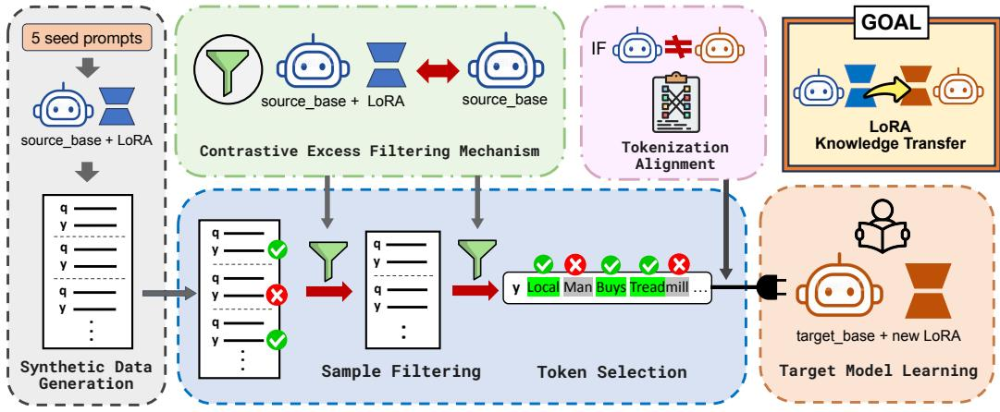
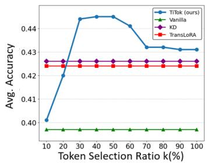
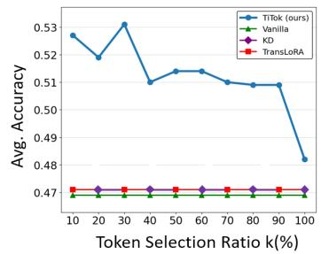
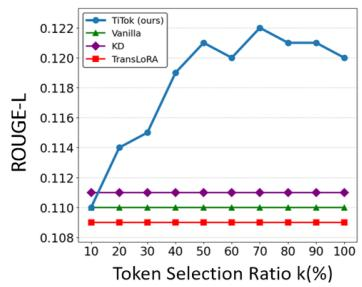
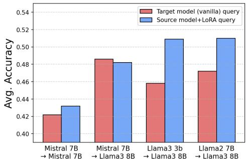

## ABSTRACT

Large Language Models (LLMs) are widely applied in real world scenarios, yet fine-tuning them comes with significant computational and storage costs. Parameter-Efficient Fine-Tuning (PEFT) methods such as LoRA mitigate these costs; however, the adapted parameters are dependent on the base model and cannot be transferred across different backbones. One way to address this issue is through knowledge distillation, but its effectiveness inherently depends on training data. Recent work such as TransLoRA avoids this by generating synthetic data; nevertheless, this adds complexity since it requires training an additional discriminator model. In this paper, we propose TITOK, a new framework that enables effective LoRA Transplantation through Token-level knowledge transfer. Specifically, TITOK captures task-relevant information through a token-wise contrastive excess between a source model with and without LoRA. This excess highlights informative tokens and enables selective filtering of synthetic data, all without additional models or overhead. Through experiments on three benchmarks across multiple transfer settings, we demonstrate that TITOK is consistently effective, achieving average performance gains of + 4–10% compared to baselines overall.1

## 1 INTRODUCTION

Large Language Models (LLMs) (Brown et al., 2020; Vaswani et al., 2023) have made significant progress in many real-world applications, including chatbots (OpenAI et al., 2024), search engines (Xiong et al., 2024), and coding assistants (Roziere et al.\` , 2024). While fine-tuning LLMs has been demonstrated to be a promising way to improve performance on downstream tasks, it incurs substantial computational and storage costs. To alleviate this, Parameter-Efficient Fine-Tuning (PEFT) (Houlsby et al., 2019) methods such as LoRA (Hu et al., 2021) update only a small subset of parameters while keeping the base model frozen. However, PEFT’s adapted parameters are dependent to the base model and thus cannot be transferred across different models. This limitation is increasingly critical given the rapid release of new LLMs and the growing diversity of available models.

One potential approach to mitigate this limitation is Knowledge distillation (KD) (Hinton et al., 2015; Azimi et al., 2024), which transfers the knowledge embedded in a source model’s PEFT adapters to a target model with new PEFT adapters by aligning the target’s output distributions with those of the source. However, KD is inherently data-dependent, typically requiring access to training data from target downstream tasks (Nayak et al., 2019; Liu et al., 2024), which is often unavailable or costly to obtain. To address this limitation, TransLoRA (Wang et al., 2024) has recently proposed to use synthetic data, leveraging the data synthesis capabilities of recent LLMs (Wang et al., 2023; Kim et al., 2025). This approach enables the target model to acquire domain knowledge without direct access to the original dataset. Nevertheless, TransLoRA requires training an additional discriminator model to filter low-quality synthetic data, which inevitably introduces extra complexity and computational overhead. Furthermore, it primarily emphasizes the role of synthetic data, paying less attention to how the knowledge transfer process itselfshould be designed.

Contribution. In this paper, we propose a new framework that enables effective LoRA Transplantation through Token-level knowledge transfer (TITOK). Our high-level idea is to selectively convey task-relevant information from the source model’s LoRA by using token-level signals to guide the transfer process, rather than relying on the entire token sequence. We specifically capture this information through a concept we introduce as token-wise contrastive excess, which is obtained by comparing predictions from a source model with LoRA and the same model without LoRA. Intuitively, this token-wise contrastive excess highlights tokens that contain important task knowledge. This excess signal is further utilized to filter the generated synthetic data for training, thereby enabling selective learning on samples that contain richer information. Unlike TransLoRA, which requires training an additional discriminator model for filtering, TITOK requires neither extra models nor additional training overhead. Moreover, we design an effective mechanism to resolve tokenizer mismatches between source and target models, enhancing robustness and applicability.

  
Figure 1: Overview of TITOK: Transplantation through Token-level knowledge transfer. Starting from a small set of seed prompts, the source expert model (source base model + LoRA) generates synthetic data. A token-wise contrastive excess filtering mechanism then compares the expert against its base backbone to compute token-level excess scores. Using these scores, TITOK first performs sample filtering and subsequently token selection, retaining only the most informative samples and tokens. When tokenizers differ, masks are aligned prior to training. The resulting filtered data is finally used to train a new LoRA on the target backbone, enabling efficient knowledge transfer.

We demonstrate the effectiveness of TITOK by conducting extensive experiments on three widely used benchmarks, which cover both reasoning (Big Bench Hard (Suzgun et al., 2022) and MMLU (Hendrycks et al., 2021)) and personalization tasks (LaMP (Salemi et al., 2024)). In particular, TITOK improves the performance by +9.94% over the vanilla target model, +8.5% over KD, and +4.4% over TransLoRA, when averaged across all tasks and transfer settings. We also explored a variety of transfer settings, including transfers within the same model, across different model families and sizes, and even across different model versions. In every case, our approach achieves consistent improvements. Interestingly, TITOK remains effective even when applied to external data originating from tasks different from the target task, highlighting both robustness and general applicability. Overall, these empirical results highlight TITOK as a methodologically simple yet powerful paradigm for efficiently transferring LoRA knowledge across models in diverse scenarios.

## 2 RELATED WORKS

Transferring PEFT adapters. Parameter-Efficient Fine-Tuning (PEFT) (Houlsby et al., 2019; Li & Liang, 2021) has emerged as both a practical and popular alternative to full model fine-tuning. By requiring updates to only a small portion of parameters, it enables efficient adaptation, with LoRA (Low-Rank Adaptation) (Hu et al., 2021; Dettmers et al., 2023) standing out as one of the most widely adopted methods. However, a fundamental limitation is that LoRA adapters are tied to the frozen backbone they were trained on, making them difficult to transfer to other base models. To address this issue, recent studies such as TransLoRA (Wang et al., 2024) have attempted to transplant the knowledge of LoRA adapters across models by generating synthetic data (Wang et al., 2023). While effective to some extent, this approach requires an additional discriminator model to filter high-quality synthetic data, resulting in a relatively heavy pipeline. In parallel, Knowledge Distillation (KD) (Hinton et al., 2015; Azimi et al., 2024) has been widely explored as another means of knowledge transfer; however, traditional KD typically operates within a teacher–student framework at the logit or sequence level and requires access to training data close to the original, in order to use the teacher’s distribution for supervising the student. In contrast, our approach focuses on token-level selective transfer, offering a more fine-grained yet lightweight alternative that enables efficient transplantation of LoRA adapters across diverse models for deployment.

Data synthesis with LLMs. Synthetic data generation with LLMs has attracted increasing attention as a means to reduce reliance on costly or inaccessible datasets (Wang et al., 2023; Kim et al., 2025). Prior lines of research have leveraged synthetic data for purposes such as privacy preservation (Bu et al., 2025), data augmentation (Kumar et al., 2021), and domain adaptation (Li et al., 2023). In our framework, synthetic data serves as a core component, enabling the transfer of LoRA adapters without access to the original training corpus, while simultaneously mitigating privacy concerns and reducing the degree of dependency on external datasets. Moreover, since both queries and labels are generated directly by the source expert model itself, synthetic data ultimately provides a self-sufficient mechanism that fits to our objective of lightweight and effective knowledge transfer.

Selective token training. Recent studies (Lin et al., 2025; Gu et al., 2020) demonstrate that not all tokens contribute equally to model training, motivating research on selective training strategies. While such approaches have primarily been applied to accelerate optimization or reduce redundancy (Yeongbin et al., 2024; Bal et al., 2025), our work innovatively extends this concept to the setting of knowledge transfer. Specifically, our concept of excess scores (Eq. 2) is derived from this idea, where the contrast between the source backbone and its LoRA adapter yields token-level judgments. This enables TITOK to transplant LoRA knowledge in a more focused and fine-grained manner, highlighting the broader applicability of selective training beyond its original scope.

## 3 TITOK: TRANSPLANTING LORA THROUGH TOKEN-LEVEL KNOWLEDGE

In this section, we introduce TITOK, a framework for LoRA Transplantation through Token-level knowledge transfer (Fig. 1). The core idea of TITOK is to transfer the knowledge from a source model’s LoRA adapter into a target model’s LoRA adapter by training selectively on the informative tokens within synthetic data. Specifically, the framework consists of three components: (1) Synthetic data generation (Sec. 3.1), where the source expert model produces query–label pairs for target task; (2) Excess score computation (Sec. 3.2), which calculates token-level importance using the source model; and (3) Target model training with filtering (Sec. 3.3), which trains the target model with newly initialized LoRA adapter on top-ranked samples and tokens. In addition, we propose Excess score alignment (Sec. 3.4), an algorithm designed to apply TITOK even when tokenizers of the source and target models differ. The overall algorithm of TITOK is presented in Alg. 1.

## 3.1 SYNTHETIC DATA GENERATION VIA LLM PROMPTING WITH FEW-SHOT DATA

Let $\mathcal { M } _ { s }$ denote the source backbone LLM and $\mathcal { A } _ { s }$ its LoRA adapter on target downstream task, which forms the source expert model $\mathcal { M } _ { s } + \mathcal { A } _ { s }$ . The target model, whose LoRA adapter $\boldsymbol { A } _ { t }$ will be trained, is denoted by M . Then, TITOK first constructs a synthetic dataset $\mathcal { D } _ { \mathrm { s } } ,$ , similar to the idea of TransLoRA (Wang et al., 2024). This usage of synthetic data allows us to avoid keeping the whole original dataset for the downstream task, and simultaneously let $\boldsymbol { A } _ { t }$ learn the knowledge encoded in the source adapter $\mathcal { A } _ { s }$ . Unlike TransLoRA’s approach of using the untuned target model $\mathcal { M } _ { t }$ to generate synthetic data, we use the source expert model $\mathcal { M } _ { s } + \mathcal { A } _ { s }$ to synthesize data (see empirical comparison in Fig. 3). Concretely, $\mathcal { M } _ { s } + \mathcal { A } _ { s }$ synthesizes both the query and the label within a prompting-based data synthesis framework (Wang et al., 2023) (see details in Appendix P); given a few-shot data of downstream task, it first generates a query q, and then produces the corresponding label y conditioned on q. To encourage diversity, we apply ROUGE-L filtering together with deduplication to all tasks, except for exceptional cases where such filtering is infeasible (more details are in Appendix I). Consequently, the resulting synthetic dataset consists of query–label pairs:

$$
\mathcal {D} _ {\mathrm{s}} = \{(\mathbf {q} _ {j}, \mathbf {y} _ {j}) \} _ {j = 1} ^ {N}.\tag{1}
$$

In this way, $\mathcal { M } _ { t }$ would be trained on the synthetic data $\mathcal { D } _ { \mathrm { s } }$ generated by the source expert model $\mathcal { M } _ { s } + \mathcal { A } _ { s }$ , thereby enabling knowledge transfer without relying on the entire original dataset.

## 3.2 TOKEN-WISE CONTRASTIVE EXCESS SCORE FROM SOURCE MODEL WITH LORA

As described in Sec. 3.1, TITOK relies on synthetic data, but synthetic data is often prone to imperfections (Chen et al., 2024b); thus, sophisticated filtering is essential to retain high-quality informative samples. TransLoRA (Wang et al., 2024) tackles this challenge with a separate discriminator to filter useful queries, but this introduces the extra burden of training and maintaining an extra model. In contrast, we propose a lightweight alternative that only utilizes the already trained source model. Specifically, we use source model and its LoRA adapter to perform two complementary roles: (1) the amateur role $( \mathcal { M } _ { s } )$ and (2) the expert role $( \mathcal { M } _ { s } + \mathcal { A } _ { s } )$ . Then, the difference between the two roles provides an implicit supervision signal where the task information is encoded.

Formally, let $\mathbf { y } = [ y _ { 1 } , . . . , y _ { L } ]$ denote the synthesized response, where $y _ { i }$ is a token of y corresponding to the synthesized query q. Then, we define the excess score as:

$$
S (y _ {i}) = L _ {e} (y _ {i}) - L _ {a} (y _ {i}),\tag{2}
$$

where the amateur and expert losses on token $y _ { i }$ are defined as:

$$
L _ {a} (y _ {i}) = \log P _ {\mathcal {M} s} (y _ {i} \mid \mathbf {q}, \mathbf {y} <   i), \quad L _ {e} (y _ {i}) = \log P _ {\mathcal {M} _ {s} + \mathcal {A} s} (y _ {i} \mid \mathbf {q}, \mathbf {y} <   i).\tag{3}
$$

The excess score $S ( y _ { i } )$ quantifies the knowledge discrepancy introduced by the LoRA adapter, thereby identifying the tokens where the adapter provides a decisive contribution. Intuitively, if the backbone model is uncertain about predicting a token but the LoRA-enhanced model assigns it with high confidence, that token will thus obtain a large excess score. This implies that tokens with higher $S ( y _ { i } )$ correspond to positions where the LoRA adapter injects task-specific knowledge that the backbone could not capture on its own. In this way, the excess score functions as a fine-grained attribution signal, derived entirely from the internal behavior of the model itself, and guides training toward the specific regions of data that are most enriched with the adapter’s knowledge.

While the excess score is motivated from an intuitive contrast between the backbone and its LoRA-enhanced counterpart, it is also grounded in principled statistical theory. Theoretically, the proposed token-wise contrastive excess score is connected to a token-level log-likelihood ratio (LLR) between the source expert (backbone + LoRA) and the backbone. LLR is a robust metric widely established in statistical testing (Li & Babu, 2019). For example, by the Neyman–Pearson lemma (Neyman & Pearson, 1933), the likelihood ratio is known to be the optimal statistic for identifying differences between two models. Therefore, high-LLR tokens are exactly the regions where the adapter changes the predictive distribution, $i . e .$ , where task knowledge is injected. In addition, from the perspective of standard knowledge distillation, tokens with nearly zero LLR provide no additional teacher knowledge and offer no benefit for transfer. In contrast, high-LLR tokens correspond to maximal teacher–student divergence, larger gradients, and higher information contribution to the student. Therefore, emphasizing tokens with high LLR in particular naturally focuses training on the precise positions where transferable knowledge is concentrated.

## 3.3 TARGET MODEL TRAINING WITH SAMPLE FILTERING AND TOKEN SELECTION

After the computation of excess scores $S ( y _ { i } )$ , the newly initialized LoRA adapter $\boldsymbol { A } _ { t }$ for target model $\mathcal { M } _ { t }$ is trained using the synthetic samples $( \mathbf { q } _ { j } , \mathbf { y } _ { j } ) \in \mathcal { D } _ { \mathrm { f } }$ with two-level filtering schemes.

First stage: Sample filtering. We begin by filtering the synthetic dataset $\mathcal { D } _ { s } \left( \mathrm { E q . ~ } 1 \right)$ at the sample level to remove less informative examples. For each synthetic sample, we compute the mean of the excess scores $S ( y _ { i } )$ across the tokens in y and retain only M samples with the highest values.

$$
\bar {S} _ {j} = \frac {1}{| \mathbf {y} _ {j} |} \sum_ {y _ {i} \in \mathbf {y} _ {j}} S (y _ {i}).\tag{4}
$$

Let $\mathcal { D } _ { \mathrm { f } }$ be the set of the M samples in $\mathcal { D } _ { \mathrm { s } }$ with the largest $\bar { S } _ { j }$ :

$$
\mathcal {D} _ {\mathrm{f}} = \operatorname{Top} M \left\{\left(\mathbf {q} _ {j}, \mathbf {y} _ {j}\right) \in \mathcal {D} _ {\mathrm{s}}: \bar {S} _ {j} \right\}.\tag{5}
$$

Through this step, the synthetic data undergoes a filtering process, ensuring that subsequent training is concentrated specifically on the remaining examples in $\mathcal { D } _ { \mathrm { f } }$ with richer knowledge signals.

Algorithm 1: TiTok: Transplanting LoRA through Token-Level Knowledge

Input: source expert  $M_{s} + A_{s}$ , target  $M_{t}$ , parameters N, M, k%

Output: trained target LoRA  $A_{t}$ 

1. Construct synthetic dataset  $\mathcal{D}_{s} = \{(\mathbf{q}_{j}, \mathbf{y}_{j})\}_{j=1}^{N}$  with  $M_{s} + A_{s}$ 

2. for  $(\mathbf{q}_{j}, \mathbf{y}_{j}) \in \mathcal{D}_{s}$  do

    Compute token excess scores  $S(y_{i}) = L_{e}(y_{i}) - L_{a}(y_{i})$ 

    Calculate mean score  $\bar{S}_{j} = \frac{1}{|\mathbf{y}_{j}|} \sum_{y_{i} \in \mathbf{y}_{j}} S(y_{i})$ 

3. Select top-M samples by  $\bar{S}_{j}$  to form  $D_{f}$ 

4. for  $(\mathbf{q}_{j}, \mathbf{y}_{j}) \in \mathcal{D}_{f}$  do

    Rank tokens by  $S(y_{i})$  and keep top-k%, represented by mask  $I_{k\%}(y_{i})$ 

5. if tokenizer( $M_{s}$ ) ≠ tokenizer( $M_{t}$ ) then

    Align masks  $I_{k\%}^{(s)}(y_{i}) \to I_{k\%}^{(t)}(y_{i})$ 

6. Train  $A_{t}$  on  $M_{t}$  with masked loss  $L_{TiTok} = \sum_{(\mathbf{q}_{j}, \mathbf{y}_{j}) \in \mathcal{D}_{f}} \sum_{y_{i} \in \mathbf{y}_{j}} I_{k\%}(y_{i}) \cdot L_{t}(y_{i})$ 

return  $A_{t}$

Second stage: Token selection. Next, we consider token selection; that is, $\boldsymbol { A } _ { t }$ does not learn from all tokens within the retained samples. Instead, it focuses only on those prioritized by the excess scores $S ( y _ { i } )$ , which are identified as most important for knowledge transfer. To achieve this, we select the top k% of tokens ranked by their excess scores using the indicator $I _ { k \% } ( y _ { i } )$

$$
I _ {k \%} (y _ {i}) = \left\{ \begin{array}{ll}1, & \text {if}\operatorname{rank}_{\mathbf{y}_{j}}\bigl (S(y_{i})\bigr)\leq \lfloor k\% \cdot |\mathbf{y}_{j}|\rfloor ,\\ 0, & \text{otherwise}, \end{array} \right.\tag{6}
$$

where $| \mathbf { y } _ { j } |$ denotes the number of tokens in $\mathbf { y } _ { j }$ , and rank $_ { \cdot { \bf y } _ { j } } ( S ( y _ { i } ) )$ indicates the rank of $S ( y _ { i } )$ among the tokens of that response. Based on this selection, the training objective for $\boldsymbol { A } _ { t }$ is defined as

$$
\mathcal{L}_{\text{TiTok}} = \sum_{(\mathbf{q}_{j},\mathbf{y}_{j})\in \mathcal{D}_{\text{f}}}\sum_{y_{i}\in \mathbf{y}_{j}}I_{k\%}(y_{i})\cdot L_{t}(y_{i}),\tag{7}
$$

where $L _ { t } ( y _ { i } )$ is the negative log-likelihood loss assigned by $\mathcal { M } _ { t } + \mathcal { A } _ { t }$ on token $y _ { i }$ (only $\boldsymbol { A } _ { t }$ is learnable). By training only on these filtered tokens (Eq. 7), TITOK enables $\boldsymbol { A } _ { t }$ to efficiently acquire the source LoRA’s knowledge without access to the original training data or any external models.

## 3.4 EXCESS SCORE ALIGNMENT ACROSS DIFFERENT TOKENIZERS

In cases of transfer between models with different tokenizers, a direct mapping of token-level signals is not possible, given that the source and target models may segment texts differently. To address this, we introduce a simple yet robust tokenizer alignment algorithm that propagates token masks (Eq. 6) from the source token sequence $\mathbf { y } ^ { ( s ) }$ to the target token sequence $\mathbf { y } ^ { ( t ) }$ . The algorithm first aligns token sequences using dual pointers that incrementally decode and match text spans. Masks are then propagated using the following four rules: (1) direct copy for one-to-one mappings, (2) replication for one-to-many, (3) averaging for many-to-one, and (4) averaging with replication for many-to-many. Finally, a top-k% selection step retains the most confident target tokens. This process ensures consistent supervision across tokenizers, enabling reliable transfer even when models tokenize text differently. The conceptual illustration of this procedure is presented in Fig.4.

## 4 EXPERIMENT

In this section, we present our experimental results to answer the following research questions:

• RQ1: Can TITOK efficiently transfer knowledge of LoRA in various scenarios? (Table 1)

• RQ2: What is the contribution of each component in TITOK? (Table 2)

• RQ3: How sensitive is token-level selective transfer to the selection ratio? (Figure 2)

• RQ4: How does the choice of model to synthesize query affect the performance? (Figure 3)

• RQ5: Can TITOK transfer knowledge using data from a different or unrelated domain? (Table 4)

## 4.1 EXPERIMENTAL SETUPS

Models. We mainly present our knowledge transfer experiments using models from the Mistral and Llama families. Specifically, we designed the following LoRA transfer (source → target) setups. (1) Mistral-7B-Inst-v0.32 → Mistral-7B-Inst-v0.3: the basic transfer setup, (2) Mistral-7B-Inst-v0.3 → Llama-3.1-8B-Inst3: the different-family model transfer setup, (3) Llama-3.2-3B-Inst4 → Llama-3.1-8B-Inst: the different-size model transfer setup, and (4) Llama-2-7b-chat- $\cdot \mathrm { h f ^ { 5 } } $ Llama-3.1-8B-Inst: the different-version model transfer setup. These setups are intended to test whether a smaller model can effectively transfer knowledge to a larger one, and to explore whether a relatively weaker model can still influence a newer, stronger model. These various setups realistically reflect how LLMs develop today, where various models are released and newer, improved versions keep emerging. Model names are abbreviated for clarity and are used consistently in all tables and figures: 1) “Mistral $\mathrm { 7 B ^ { \prime \prime } = M i s t r a l { - } 7 B }$ -Instruct-v0.3, 2) “Llama3 8B” = Llama-3.1-8B-Instruct, 3) “Llama3 $3 \mathrm { B } ^ { \prime \prime } = \mathrm { L l a m a } - 3 . 2 \mathrm { - } 3 \mathrm { B } \mathrm { - } \mathrm { I n s t r u c t } ,$ 4) “Llama2 $7 \mathrm { B } ^ { \prime \prime } = \mathrm { L l a m a } - 2 \mathrm { - } 7 \mathrm { b } \mathrm { - } \mathrm { c h a t } \mathrm { - } \mathrm { h f } .$

Baselines. To demonstrate the effectiveness of TITOK, we compare it against three baselines: (i) Vanilla, the target base model without any fine-tuning; (ii) KD(+MinED), knowledge distillation (KD) from source expert model (Hinton et al., 2015). When the source and target models use different tokenizers, the original KD is not applicable. In this case, we use Minimum-Edit-Distance (MinED) tokenizer alignment (Wan et al., 2024), which aligns both token sequences and vocabulary distributions via dynamic-programming sequence alignment for near matches (e.g., “gets” ↔ “get”) and by mapping probability mass to nearest edit-distance neighbors (e.g., “immediately” ↔ “immediate”). We use the synthesized data by TransLoRA as the training data for KD (+MinED) ; and (iii) TransLoRA (Wang et al., 2024), a prior method in which the vanilla target model synthesizes the queries, while the source model with its LoRA adapter generates the corresponding synthetic labels. A discriminator is then employed to filter the synthetic data for training the target LoRA adapter.

Datasets. Following prior work in TransLoRA, we first conduct experiments on two representative benchmarks: (1) Big-Bench Hard (BBH) (Suzgun et al., 2022) and (2) Massive Multitask Language Understanding (MMLU) (Hendrycks et al., 2021). BBH consists of 27 challenging reasoning tasks structured as multiple choice or short answer questions, designed to test compositional generalization and advanced problem solving abilities of a Language Model. Meanwhile, MMLU covers 57 tasks across diverse academic subjects, presented in multiple choice format to evaluate broad knowledge and reasoning skills of a model. As both benchmarks provide only test sets, we construct 90%/10% train-evaluation splits. For BBH, we use the full dataset, whereas for MMLU, we randomly sample 100 instances of the dataset for each task before applying the 90%/10% split.

To extend our approach to personalization and text generation, we additionally conduct experiments on LaMP benchmark (Salemi et al., 2024), focusing exclusively on its generation tasks. In particular, we experiment with (3) News Headline Generation (LaMP 4) and (4) Scholarly Title Generation $( L a M \bar { P } \bar { { \cal { S } } } )$ , as they are the only text generation tasks that are both accessible and reliably evaluable. The remaining LaMP tasks are excluded, given that LaMP 1,2,3 are discriminative, and LaMP 6,7 lack gold labels. For LaMP tasks, the source expert model $\mathcal { M } _ { s } + \mathcal { A } _ { s }$ is trained on data from the 30 users with the longest activity histories. From each user, we use 200 data points for training and 50 data points for validation, a design choice intended to conduct a more rigorous and robust evaluation. In total, each LaMP task contains 6,000 training examples and 1,500 evaluation examples.

To assess performance on the BBH and MMLU, we measure the average accuracy using the LM-Eval Harness (Gao et al., 2024). Following the setup used in TransLoRA (Wang et al., 2024), all tasks are conducted in a zero-shot setting. Meanwhile, for the LaMP tasks, we adopt ROUGE-1 and ROUGE-L scores as evaluation metrics, following the benchmark’s primary evaluation metrics.

Implementation details. When training both the source and target models, we use a learning rate of ${ \bar { 5 } } \times 1 0 ^ { - 5 }$ , train for 2 epochs with a batch size of 4, and apply LoRA with rank $r = 8 ,$ scaling factor $\alpha \ = \ 8 .$ , and dropout 0.05. Optimization is performed using AdamW with weight decay

Table 1: Main results. Experiments on BBH, MMLU, News Headline and Scholarly Title Generation tasks under four transfer settings. Reasoning tasks (BBH, MMLU) are evaluated via LM-Eval Harness, and personalization tasks (News Headline, Scholarly Title Generation) via ROUGE-1/L. Zero-shot evaluations are reported as the mean across 3 random seeds. Best scores are in bold.

<table><tr><td rowspan="2">Transfer</td><td rowspan="2">Method</td><td>BBH</td><td>MMLU</td><td colspan="2">News Headline</td><td colspan="2">Scholarly Title</td></tr><tr><td>Acc.</td><td>Acc.</td><td>ROUGE-1</td><td>ROUGE-L</td><td>ROUGE-1</td><td>ROUGE-L</td></tr><tr><td rowspan="4">Mistral 7B → Mistral 7B</td><td>Vanilla</td><td>0.397</td><td>0.557</td><td>0.117</td><td>0.101</td><td>0.381</td><td>0.311</td></tr><tr><td>KD (+MinED)</td><td>0.417</td><td>0.560</td><td>0.117</td><td>0.104</td><td>0.385</td><td>0.310</td></tr><tr><td>TransLoRA</td><td>0.416</td><td>0.534</td><td>0.156</td><td>0.137</td><td>0.447</td><td>0.382</td></tr><tr><td>TITOK (ours)</td><td>0.424</td><td>0.561</td><td>0.161</td><td>0.143</td><td>0.473</td><td>0.413</td></tr><tr><td rowspan="4">Mistral 7B → Llama3 8B</td><td>Vanilla</td><td>0.469</td><td>0.469</td><td>0.125</td><td>0.110</td><td>0.444</td><td>0.378</td></tr><tr><td>KD (+MinED)</td><td>0.475</td><td>0.482</td><td>0.127</td><td>0.112</td><td>0.454</td><td>0.387</td></tr><tr><td>TransLoRA</td><td>0.473</td><td>0.473</td><td>0.126</td><td>0.110</td><td>0.461</td><td>0.397</td></tr><tr><td>TITOK (ours)</td><td>0.484</td><td>0.485</td><td>0.139</td><td>0.123</td><td>0.464</td><td>0.403</td></tr><tr><td rowspan="4">Llama3 3B → Llama3 8B</td><td>Vanilla</td><td>0.469</td><td>0.469</td><td>0.125</td><td>0.110</td><td>0.444</td><td>0.378</td></tr><tr><td>KD (+MinED)</td><td>0.474</td><td>0.477</td><td>0.125</td><td>0.110</td><td>0.449</td><td>0.383</td></tr><tr><td>TransLoRA</td><td>0.471</td><td>0.467</td><td>0.122</td><td>0.108</td><td>0.454</td><td>0.387</td></tr><tr><td>TITOK (ours)</td><td>0.496</td><td>0.478</td><td>0.127</td><td>0.113</td><td>0.456</td><td>0.392</td></tr><tr><td rowspan="4">Llama2 7B → Llama3 8B</td><td>Vanilla</td><td>0.469</td><td>0.469</td><td>0.125</td><td>0.110</td><td>0.444</td><td>0.378</td></tr><tr><td>KD (+MinED)</td><td>0.473</td><td>0.476</td><td>0.125</td><td>0.110</td><td>0.449</td><td>0.382</td></tr><tr><td>TransLoRA</td><td>0.472</td><td>0.468</td><td>0.123</td><td>0.109</td><td>0.457</td><td>0.394</td></tr><tr><td>TITOK (ours)</td><td>0.488</td><td>0.477</td><td>0.138</td><td>0.120</td><td>0.461</td><td>0.403</td></tr></table>

$1 \times 1 0 ^ { - 2 }$ , together with a linear learning rate schedule and a warmup ratio of 0.1. For synthetic data generation, we provide five samples from the original training data as few-shot exemplars, and apply top-p sampling (Holtzman et al., 2020) to generate both queries and labels, with sampling hyperparameters tuned individually for each task. To further encourage diversity, we apply ROUGE-L filtering with a threshold of 0.7 and deduplication to remove redundant queries, following Wang et al. (2023). For tasks where ROUGE-based filtering is infeasible, we apply only deduplication (see Appendix I). For the initial synthetic pool, we generate 2M synthetic samples and, after filtering with token-wise contrastive excess scores, retain the top M, where M equals the source training set size (see Appendix H). For token selection, the selection ratio k% is fixed at 70% across all tasks and transfer settings, except for the Llama3 3B → Llama3 8B transfer setting, where we find that k% = 30% consistently yields the best performance. During inference in the evaluation stage, we adopt greedy decoding to ensure fully deterministic and reproducible inference results.

## 4.2 MAIN RESULTS

Table 1 summarizes the experimental results on BBH, MMLU, and LaMP (News Headline and Scholarly Title generation) tasks across four transfer settings. First, we observe that transfer within the same model family is highly effective; when transplanting the LoRA adapter trained on the Mistral 7B into a fresh instance of the same model, TITOK consistently surpasses all baselines. In particular, TITOK improves the vanilla model by 23.94% on average across all tasks, and further outperforms the KD and TransLoRA baselines by 21.95% and 4.75%, respectively. Taken together, the findings show that, as a first step, transfer within the same family is reliably successful.

Beyond same family transfer, we also find that TITOK is highly effective in cross-model transfer settings. For example, when transferring from Mistral 7B to Llama 8B, TITOK delivers an average improvement across all tasks of 6.79% over the vanilla model, while outperforming KD by 4.69% and TransLoRA by 4.86%. This highlights that TITOK is not confined to intra-family knowledge transfer, but can successfully bridge across architectures. In the case of Llama3 3B to Llama3 8B, TITOK yields average gains of 3.07% against vanilla, 2.18% against KD, and 3.02% against TransLoRA. These results suggest that TITOK scales effectively with model size, making it useful when moving from lightweight to larger models without losing efficiency. Finally, when transferring from Llama2 7B to Llama3 8B, TITOK performs average advantages of 5.95% over vanilla, 5.17% over KD, and 5.13% over TransLoRA. This indicates that TITOK adapts robustly even across different model versions, implying practical relevance when models are upgraded in real-world pipelines.

Table 2: Ablation study. ”Sample filtering” uses the mean token-wise contrastive excess score to remove uninformative examples, while “Token selection” further refines the retained data by selectively keeping only the most informative tokens within each sample. Without sample filtering, data are randomly sampled. Results are reported as accuracy (Acc.) for BBH and MMLU, averaged across tasks. Meanwhile, we report ROUGE-1 (R-1) and ROUGE-L (R-L) for LaMP tasks.

<table><tr><td colspan="2">Settings</td><td>BBH</td><td>MMLU</td><td colspan="2">News Headline</td><td colspan="2">Scholarly Title</td></tr><tr><td>Sample filtering</td><td>Token selection</td><td>Acc.</td><td>Acc.</td><td>R-1</td><td>R-L</td><td>R-1</td><td>R-L</td></tr><tr><td>X</td><td>X</td><td>0.458</td><td>0.485</td><td>0.133</td><td>0.117</td><td>0.456</td><td>0.393</td></tr><tr><td>X</td><td>√</td><td>0.463</td><td>0.496</td><td>0.137</td><td>0.121</td><td>0.460</td><td>0.397</td></tr><tr><td>√</td><td>X</td><td>0.470</td><td>0.500</td><td>0.139</td><td>0.122</td><td>0.460</td><td>0.397</td></tr><tr><td>√</td><td>√</td><td>0.483</td><td>0.501</td><td>0.142</td><td>0.125</td><td>0.464</td><td>0.403</td></tr></table>

Table 3: Excess-score token subgroup analysis. Effect of token subgroup selection in Mistral 7B → Llama3 8B transfer. The top 20% excess-score tokens yield the best performance on BBH.

<table><tr><td>Transfer</td><td>Method</td><td>Subgroup</td><td>Acc.</td></tr><tr><td rowspan="4">Mistral 7B → Llama3 8B</td><td>Vanilla</td><td>-</td><td>0.469</td></tr><tr><td rowspan="3">TiTok</td><td>top 20%</td><td>0.482</td></tr><tr><td>bottom 20%</td><td>0.468</td></tr><tr><td>random 20%</td><td>0.476</td></tr></table>

Collectively, these results provide strong evidence that TITOK not only excels in transfers within the same model family, but also demonstrates broad effectiveness in cross-model transfers, thereby highlighting its robustness across a wide spectrum of model scales, versions, and families.

## 4.3 ADDITIONAL ANALYSES

In the following sections, we present additional analyses to showcase the effectiveness of TITOK. Unlike the main table which reports the average of three random seeds to ensure statistical stability, the empirical results discussed in the subsequent sections are reported using a single, fixed seed.

Ablation study. To validate the contribution of each component in our framework, we conduct additional experiments by selectively excluding the sample filtering and token selection mechanisms in Sec. 3.3. We report the average performance scores across all four transfer settings, and the results are presented in Table 2. When sample filtering is not applied (1st and 2nd rows), the training data for the target model is randomly sampled from the full synthetic dataset. Under this setting, applying only token selection (2nd row) performs noticeably better than the purely random baseline. This demonstrates the effectiveness of our token selection approach and empirically confirms that tokenwise contrastive excess reliably identifies and selects the most informative tokens. Similarly, when only sample filtering is applied (1st and 3rd rows), the results improve over pure random sampling, indicating that selecting high-quality data is essential. This finding further implies that incorporating an effective filtering mechanism for synthetic data is essential. In our framework, token-wise contrastive excess serves this role by reliably selecting samples with richer and more informative signals, as demonstrated clearly by the empirical results. Finally, the results show that combining both stages (4th row) achieves the best performance, confirming their complementary roles in filtering high-quality examples and selecting informative tokens for effective knowledge transfer.

Next, we also evaluate whether high excess-score tokens indeed carry concentrated transferable knowledge. We verify this empirically by contrasting token subgroups of the top 20%, bottom 20%, and random 20% on BBH in the Mistral 7B → Llama3 8B transfer setting. To prevent unintentional overlap across groups and to extract the most informative region, we employ a comparatively low 20% threshold for this analysis. The results are presented in Table 3. Analytically, the empirical results show that the top 20% produces the best transfer performance, validating tat tokens with high token-wise contrastive excess scores indeed contain concentrated task knowledge.

  
(a) BBH (accuracy)  
Mistral 7B → Mistral 7B

  
(b) BBH (accuracy)  
Llama2 7B → Llama3 8B

  
(c) News Headline (ROUGE-L) Llama2 7B → LJama3 8B  
Figure 2: Representative performance trends across k%. Among the three graphs, two come from the same task (BBH), while two share the same transfer setting (Llama2 7B → Llama3 8B).

Interestingly, we observe that truly important tokens are consistently selected regardless of the expert’s model. For example, for BBH datasets, Mistral 7B and Llama2 7B experts agree on 59.76% of the chosen tokens even when we limit the selection to a small top 20% subset to prevent trivial overlap. This implies that a token will continue to be recognized across models if it is truly significant for the task, and it can be effectively identified by our token-wise contrastive excess score.

Effect of token selection ratio. We now proceed to explore the impact of token selection ratios (k%) in our framework. Fig. 2 presents three representative curves: one task (BBH) under two transfer settings, and another task (News Headline Generation) under the same transfer setting for comparison. For BBH with the same backbone on source and target (Mistral 7B→Mistral 7B), a moderate token selection ratio of 30-70% yields the best results. Very low ratios (10-20%) lead to underfitting, while a 100% ratio is ineffective as it applies no filtering at all. Interestingly, in a weak-to-strong transfer (Llama2 7B → Llama3 8B) for the same BBH task, performance improves as k% decreases. This suggests that selecting only the tokens with the highest excess loss effectively filters out the majority of noisy regions where the weaker model is uncertain. By discarding the majority of tokens where the weaker model lacks confidence, TITOK can significantly reduce negative transfer. This trend, however, reverses for the News Headline Generation task under the same weakto-strong transfer setting. For this task, a larger k% is generally better, potentially because even a weaker model can provide valuable lexical and stylistic cues that are useful for personalization. Consequently, unlike reasoning-focused tasks such as BBH, which are sensitive to noisy supervision, personalization tasks like News Headline Generation benefit more broadly from the source model’s outputs, even when the source model is relatively weaker than the target model.

Impact of query generation model. We now examine how the choice of query generation model influences performance. Practically, synthetic queries can be generated either by the source model or by the target model, with the latter being the approach originally adopted in TransLoRA’s pipeline (Wang et al., 2024). Figure 3 compares these two options across different transfer settings, with the reported scores averaged over all BBH tasks. Notably, we observe that using the source expert model (source backbone + LoRA) for query generation generally yields stronger performance than using the target model. One possible explanation is that when synthetic data is generated by the same model, they remain closer to its training distribution. This alignment between queries and labels likely provides more coherent supervision, thereby facilitating more effective transfer. Ultimately, these findings empirically justify our design choice to use the source model as both the query and label generator, instead of using the target model.

  
Figure 3: Impact of query source. Across transfer settings, using the source expert model to synthesize query generally yields better performance. The accuracy averaged over all BBH tasks are reported.

Effectiveness of transfer through external data source. We further examine whether TITOK can transfer knowledge effectively in cases where synthetic data is not preferred, and thus external data is used as an alternative. To this end, we evaluate three alternative settings on LaMP tasks for Mistral 7B→Mistral 7B transfer setup: (1) using data from a randomly chosen different user, (2) mixing data from multiple users, and (3) transferring across tasks, where data of Scholarly Title Generation is used to train on News Headline Generation and vice versa (i.e., out-of-distribution scenario). The results are presented in Table 4. Remarkably, TITOK consistently outperforms all baselines across these

Table 4: Transfer using external data. ROUGE-1 (R-1) and ROUGE-L (R-L) on News Headline and Scholarly Title Generation under three data settings for Mistral 7B→Mistral 7B: (1) other-user, (2) mixed-user, (3) cross-task. Best scores are highlighted in bold.

<table><tr><td rowspan="2">Data Setting</td><td rowspan="2">Method</td><td colspan="2">News Headline</td><td colspan="2">Scholarly Title</td></tr><tr><td>R-1</td><td>R-L</td><td>R-1</td><td>R-L</td></tr><tr><td rowspan="3">Other-user</td><td>Vanilla</td><td>0.117</td><td>0.101</td><td>0.381</td><td>0.311</td></tr><tr><td>KD</td><td>0.127</td><td>0.113</td><td>0.405</td><td>0.333</td></tr><tr><td>TiTok (ours)</td><td>0.151</td><td>0.136</td><td>0.481</td><td>0.425</td></tr><tr><td rowspan="3">Mixed-user</td><td>Vanilla</td><td>0.117</td><td>0.101</td><td>0.381</td><td>0.311</td></tr><tr><td>MinED</td><td>0.124</td><td>0.110</td><td>0.409</td><td>0.337</td></tr><tr><td>TiTok (ours)</td><td>0.151</td><td>0.137</td><td>0.480</td><td>0.422</td></tr><tr><td rowspan="3">Cross-task</td><td>Vanilla</td><td>0.117</td><td>0.101</td><td>0.381</td><td>0.311</td></tr><tr><td>MinED</td><td>0.118</td><td>0.106</td><td>0.403</td><td>0.331</td></tr><tr><td>TiTok (ours)</td><td>0.133</td><td>0.120</td><td>0.450</td><td>0.383</td></tr></table>

heterogeneous external settings. These findings demonstrate that TITOK is not restricted to synthetic data scenarios, but can also adapt effectively under external or user-provided data conditions. This highlights the flexibility of TITOK for practical deployment in diverse real-world application scenarios and further underscores its adaptability across different data conditions, as it is effective even when external data is used as an alternative to synthetic data.

Transfer under cross-architecture and largescale. We additionally conduct experiments on larger-scale models and architectures to reinforce TITOK’s effectiveness. Due to the large model size, all experiments in this section are evaluated on BBH using 4-bit quantization. As shown in Table 5, TITOK successfully transfers token-level knowledge in both settings. Specifically, crossarchitecture transfer from a dense model (Mistral

Table 5: Larger scale transfer settings. BBH evaluation results for cross-architecture and large-scale model transfers.

<table><tr><td>Transfer Setting</td><td>Method</td><td>Acc.</td></tr><tr><td rowspan="2">Mistral 7B $\rightarrow$  Mixtral-8×7B $^{6}$ </td><td>Vanilla</td><td>0.454</td></tr><tr><td>TiTok (k=70%)</td><td>0.463</td></tr><tr><td rowspan="2">Llama-3.3-70B $\rightarrow$  Llama-3.3-70B $^{7}$ </td><td>Vanilla</td><td>0.593</td></tr><tr><td>TiTok (k=70%)</td><td>0.621</td></tr></table>

7B) to a mixture-of-experts (MoE) model yields a 1.98% improvement over the target baseline, while scaling up to the 70B transfer setting, achieves a 4.72% gain. These results confirm that TITOK generalizes robustly across both complex MoE architectures and massive model scales.

## 5 CONCLUSION

In this paper, we propose TITOK, a novel and efficient framework that transfers LoRA knowledge from a source model to a target model by training only on a selectively chosen set of highly informative tokens. At its core, TITOK strategically leverages token-level signals to distill task-relevant information from the source adapter, rather than indiscriminately relying on the entire token sequence. With this simple yet effective design, TITOK consistently surpasses baselines in various transfer settings, providing a practical solution for efficient knowledge transfer.

Limitations and Future Work While TITOK has shown clear advantages, opportunities remain to refine the framework. First, generating synthetic data still requires a few seed examples. Nevertheless, this reliance is modest, as we avoid using full datasets. In addition, our experiments show external data serves as an effective alternative, reinforcing the flexibility of TITOK. Regarding token selection, while TITOK currently relies on a simple yet highly effective fixed threshold for token selection, future work could explore adaptive thresholding strategies to further enhance efficiency.