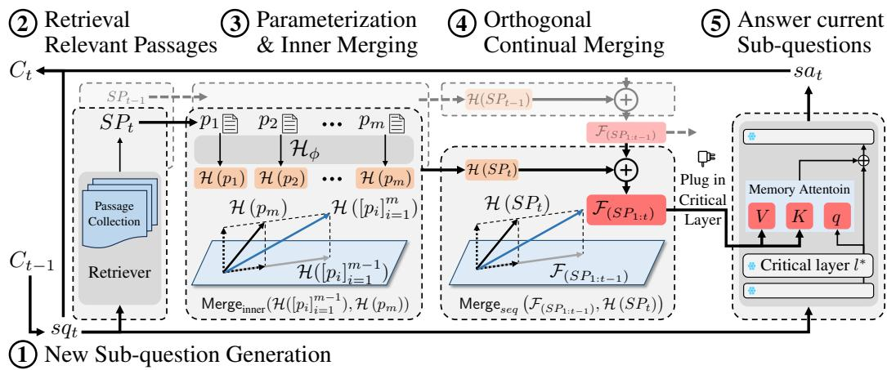

## ABSTRACT

Large language models (LLMs) can be enhanced with external knowledge through two dominant approaches: (1) retrieval-augmented generation (RAG), which supplements LLMs with in-context retrieved passages, and (2) parametric knowledge adaptation (PKA), which directly updates model parameters with new domain knowledge. Recently, parametric RAG (PRAG) has emerged as a promising framework, extending RAG by translating retrieved passages into parameter updates, thereby mitigating inefficiency and noise sensitivity inherent to RAG. However, existing PRAG methods remain limited to single-pass retrieval, falling short of the multi-hop RAG setting that requires iterative retrieval and reasoning. We propose MergePRAG (Orthogonal Merging of Passageexperts for Multi-hop PRAG), a novel framework that sequentially integrates retrieved passages into LLM parameters through a continual merging mechanism, which is advanced by two key proposals: (1) orthogonal merging using the Gram–Schmidt process to minimize conflicts between ”passage experts”, and (2) critical-layer parameterization to efficiently encode in-context passages. Experiments on multi-hop open-domain QA and reasoning-aware knowledge editing show that MergePRAG consistently outperforms both standard and state-ofthe-art RAGs as well as existing parametric adaptation methods, achieving superior effectiveness and efficiency. All datasets and code will be released at https://github.com/Liu-Xuebing/MhQA\_hypernetwork.

## 1 INTRODUCTION

Large language models (LLMs)(Dubey et al., 2024; Mesnard et al., 2024; Team, 2024; DeepSeek-AI, 2024) have achieved strong performance on a wide range of knowledge-intensive tasks, driven by billions of parameters and large-scale pretraining corpora. However, their parametric knowledge remains static, making them ill-suited for evolving world knowledge or emerging domains. Retrieval-augmented generation (RAG) has become a popular remedy, injecting retrieved passages into the input context at inference time. While effective, RAG faces challenging issues: (1) knowledge conflict between parametric and retrieved information (Xie et al., 2023; Kortukov et al., 2024; Zhang et al., 2025; Bi et al., 2025), (2) inference inefficiency from processing long retrieval-heavy contexts (Leng et al., 2024; Jin et al., 2024; Chen et al., 2025), and (3) noise sensitivity, where irrelevant or erroneous passages degrade performance (Cuconasu et al., 2024; Wu et al., 2024; Fang et al., 2024).

Alternatively, Parametric RAG (PRAG), along with its dynamic variant (Su et al., 2025; Tan et al., 2025a), has recently emerged as a promising direction. PRAG translates retrieved passages into LoRA parameter updates via a “hypernetwork”, enabling LLMs to internalize external knowledge beyond mere in-context conditioning.1 Notably, PRAG has been shown to consistently outperform standard RAG, both when applied independently and when combined with retrieval-based methods.

Despite its promise, PRAG has thus far been investigated only in simplified RAG settings, typically limited to a single retrieval step rather than the more challenging multi-hop RAG scenario (Yu et al., 2024b; Li et al., 2025b). In multi-hop RAG, a complex query is decomposed into subquestions, each requiring iterative retrieval and sub-answer generation, such that retrieved passages are incrementally provided during the question answering (QA) process. A central research question, therefore, is how to effectively extend PRAG to multi-hop settings—where the internalization of retrieved passages must continuously progress across hops—without necessitating the retraining or rebuilding of a hypernetwork originally designed for single-hop RAG. This extension of PRAG to multi-hop RAG represents an important milestone, as it provides a natural bridge toward recent reasoning-enhanced RAG frameworks (e.g., IRCoT, Self-RAG, DeepRAG, and RAG-R1 (Trivedi et al., 2023; Asai et al., 2024; Guan et al., 2025; Tan et al., 2025b)).

We propose MergePRAG (Orthogonal Merging Passage-experts for Multi-hop PRAG), a generalized framework that scales PRAG to multi-hop RAG. At each stage, retrieved passages are translated into expert parameters by a hypernetwork and merged with the previously accumulated experts through a continual merging mechanism, thus enabling effective accumulation of knowledge across iterative retrievals (Figure 1). For effective continual merging, we propose two advances: (1) orthogonal merging using the Gram–Schmidt process to minimize conflicts between newly introduced and existing experts by eliminating redundant information and promoting complementary, non-overlapping representations, and (2) a critical-layer parameterization module that updates only the preselected critical layer to efficiently encode in-context passages, while keeping the remaining layers frozen to reduce computation and stabilize reasoning. Together, these techniques allow MergePRAG to reuse a single passage-level hypernetwork across hops, avoiding the redesign or retraining of additional hypernetworks to support multi-hop RAG.

Our contributions are threefold: (1) We introduce MergePRAG, the first generalized PRAG framework for multi-hop RAG. (2) We propose a continual merging mechanism that sequentially integrates retrieved passages into LLM parameters, enabled by two advances: orthogonal merging and critical-layer parameterization. (3) We conduct extensive experiments across multiple LLM backbones and benchmark datasets, showing that MergePRAG consistently outperforms existing RAG and PRAG baselines in both effectiveness and efficiency.

## 2 RELATED WORKS

## 2.1 PARAMETRIC KNOWLEDGE ENHANCEMENT

Parametric knowledge enhancement methods aim to increase the knowledge capacity of language models by adjusting their parameters to better encode new information. The most direct approach is full fine-tuning, but this quickly becomes impractical as model sizes grow. To address scalability, parameter-efficient fine-tuning (PEFT) techniques, such as LoRA (Hu et al., 2021) and its variants (Valipour et al., 2022; Yu et al., 2024a; Liu et al., 2024), update only a small set of lowrank matrices, achieving performance comparable to full fine-tuning at a fraction of the cost. PEFT methods can be attached or removed with minimal disruption, enabling efficient adaptation across domains and tasks. Moreover, they reduce training-time memory and compute requirements.

With the rise of model editing, more targeted approaches have been developed that directly locate and modify knowledge representations within the model. Methods such as ROME (Meng et al., 2022a), MEMIT (Tan et al., 2023), and PMET (Li et al., 2024) update critical layers to encode new facts, while MEND (Mitchell et al., 2021) and MALMEN (Tan et al., 2023) employ hypernetworks to inject knowledge into specific layers, effectively fusing edits with existing parameters. To mitigate catastrophic forgetting and preserve general-purpose capabilities, approaches like T-Patcher (Huang et al., 2023) and MEMoE (Wang & Li, 2024) introduce external memory modules that store edits separately from the core model. These designs are particularly valuable in dynamic settings where facts evolve over time and updates must be applied repeatedly. They also support more controllable interventions by localizing changes to a small subset of parameters or auxiliary components.

  
Figure 1: Overview of MergePRAG for multi-hop QA. A complex query is decomposed into subquestions, and retrieved passages are sequentially incorporated through parameterization and continual merging. At each timestep t: (1) a sub-question $s q _ { t }$ is generated from the reasoning chain $C _ { t - 1 }$ (Eq. 1, Section 3.1); (2) the retriever returns top-ranked passages $S P _ { t } \subseteq \mathcal { R } ; ( 3 )$ given $\bar { S P _ { t } } = [ p _ { i } ] _ { i = 1 } ^ { m } ,$ each passage is parameterized by the hypernetwork to produce $\{ \mathcal { H } _ { \phi } ( p _ { i } ) \} _ { i = 1 } ^ { m } ,$ , which are combined into $\bar { \mathcal { H } } _ { \phi } ( S \bar { P } _ { t } )$ via the inner-merging mechanism (Eq. 6, Section $3 . 2 ) ; ( 4 )$ orthogonal continual merging updates the accumulated parameters $\mathcal { F } ( S P _ { 1 : t - 1 } )$ with $\mathcal { H } _ { \phi } ( S P _ { t } )$ to obtain $\mathcal { F } ( S P _ { 1 : t } )$ (Eq. 11, Section 3.2.2); and (5) the merged expert $\mathcal { F } ( S P _ { 1 : t } )$ is injected into the base LLM $\mathcal { M } _ { \theta _ { 0 } }$ at the critical layer l∗ to generate the sub-answer (Eqs. 4–5). This process repeats until no further sub-questions are produced, after which the final answer is generated.

Overall, parametric enhancement methods differ in where and how they modify parameters— ranging from full updates to low-rank adapters, targeted edits, or external memory—yet they share the goal of augmenting LLMs with new knowledge while retaining general abilities.

## 2.2 RETRIEVAL AUGMENTED GENERATION

Early RAG methods (Lewis et al., 2020; Guu et al., 2020; Izacard & Grave, 2021; Borgeaud et al., 2022) train language models jointly with top-retrieved documents, enabling the model to incorporate external knowledge sources when generating answers. To further improve performance, subsequent approaches expanded the knowledge sources, incorporated query rewriting, or jointly trained the retriever and the generator to achieve tighter integration. To mitigate the computational overhead of fully parameterized RAG training, methods such as PRAG (Su et al., 2025) and DyRAG (Tan et al., 2025a) have been proposed, which enhance the model’s internal knowledge by learning mappings from retrieved documents to model parameters.

Recent advances increasingly emphasize the importance of reasoning over retrieved facts. For instance, FLARE (Jiang et al., 2023), MeLLo (Zhong et al., 2023), IRCoT (Trivedi et al., 2023) and SELF-REASONING (Xia et al., 2025) employ iterative cycles of reasoning, retrieval, and error correction to refine responses. DeepRAG (Guan et al., 2025) formulates reasoning as a Markov Decision Process (MDP) to enable adaptive retrieval, while R3-RAG (Li et al., 2025b) leverages large models to construct trajectories and applies reinforcement learning to teach LLMs stepwise reasoning and retrieval strategies. Collectively, these works highlight the effectiveness of constructing chain-of-thought reasoning processes for complex tasks.

Building on these insights, we present MergePRAG, which extends PRAG to the multi-hop RAG setting and serves as a critical stepping stone toward reasoning-enhanced RAG systems. In contrast to prior PRAG methods (Su et al., 2025) that rely on simple arithmetic merging, MergePRAG introduces a merging module with orthogonal merging, enabling more effective integration of passage experts across hops.

## 3 METHODOLOGY

In this section, we present MergePRAG, illustrated in Figure 1. We first provide a brief background on multi-hop RAG, and then describe MergePRAG and its two main components: orthogonal merging with the Gram–Schmidt process and critical-layer parameterization.

We define two language models and a retrieval module. $\mathcal { M } _ { \theta _ { 0 } }$ denotes a general-purpose LLM for sub-answer generation, also referred to as the base $L M , \mathcal { M } _ { s q }$ a sub-question generator, based a smaller LLM, and  the retriever, which returns a set of top-ranked passages for each query $q ,$ denoted as $\mathcal { R } ( q )$

## 3.1 MULTI-HOP RAG

Let $q$ be the original complex query. In the multi-hop RAG setting, each step involves sub-question generation, retrieval, and response generation. At step t, given $C _ { t - 1 }$ , the accumulated context so far, the next sub-question $s q _ { t }$ and its sub-answer $s a _ { t }$ are obtained as

$$
s q _ {t} = \mathcal {M} _ {s q} (C _ {t - 1}), s a _ {t} = \mathcal {M} _ {\theta_ {0}} (s q _ {t}, S P _ {t}), \quad S P _ {t} \subseteq \mathcal {R} (s q _ {t}),\tag{1}
$$

where $S P _ { t }$ denotes the retrieved passages at step t. Task-specific instruction prompts for $\mathcal { M } _ { s q }$ and $\mathcal { M } _ { \theta _ { 0 } }$ are described in Appendix H.

The newly obtained tuple $\left( s q _ { t } , s a _ { t } \right)$ is appended to the context: $\boldsymbol { C } _ { t } = [ C _ { t - 1 } , s q _ { t } , s a _ { t } ]$ . The final answer to the original query q is then generated as $\boldsymbol { a } = \mathcal { M } ( \boldsymbol { C } _ { T - 1 } , \boldsymbol { q } )$ , where $s q _ { T } = \mathcal { M } _ { s q } ( C _ { T - 1 } ) =$ EOS .

In the single-hop setting, RAG produces the answer in one step: $a = \mathcal { M } _ { \theta _ { 0 } } ( q , S P _ { 1 } )$ ), $S P _ { 1 } \subseteq { \mathcal { R } } ( q )$ and the process terminates immediately.

## 3.2 MERGEPRAG

To present MergePRAG, we first review PRAG in the single-hop RAG setting.

PRAG. As in DyPRAG (Tan et al., 2025a), PRAG employs a hypernetwork-based passage parameterization module. Let $\mathcal { H } _ { \phi }$ denote the hypernetwork, which maps a retrieved passage p to a set of passage-specific LoRA parameters: ${ \displaystyle \mathbf { \cdot } \theta _ { p } = \mathcal { H } _ { \phi } ( p ) }$ . The hypernetwork is trained to efficiently translate an in-context passage into its corresponding parameters.

Let $\mathcal { M } _ { \theta _ { 0 } }$ denote the base LLM with parameters $\theta _ { 0 }$ . PRAG augments the model by injectingpassagespecific parameters $\mathcal { H } _ { \phi } ( p )$ generated from the hypernetwork $\mathcal { H } _ { \phi }$ , such that for a passage p,

$$
\theta^ {\prime} = \theta_ {0} \oplus \mathcal {H} _ {\phi} (p),
$$

where  denotes the parameter-injection operation. Unlike RAG, which conditions on the passage p explicitly in the input prompt, PRAG generates the answer under the passage-injected model as

$$
a = \mathcal {M} _ {\theta_ {0} \oplus \mathcal {H} _ {\phi} (p)} (q).\tag{2}
$$

MergePRAG. MergePRAG extends PRAG to the multi-hop RAG setting, where passages arrive sequentially through iterative retrieval. By timestep t, the accumulated passages are $S P _ { 1 : t } ~ =$ $[ { \bar { S P } } _ { 1 } , \dots , { \bar { S } } P _ { t } ]$ . To inject all context passages into the LLM parameters, let $\mathcal { F }$ denote a mapping from the sequence $S P _ { 1 : t } ^ { \bar { } }$ to the parameter space. Instead of directly “training” $\ B , \ / F$ over datasets with varying numbers of passages $t ,$ MergePRAG introduces a continual merging mechanism that induces $\mathcal { F }$ by reusing the passage-level hypernetwork $\mathcal { H } _ { \phi }$ , which maps a single passage to its parameter representation.

Sequence-merging. The sequence merging, denoted as $\mathsf { M e r g e } _ { s e q }$ , is a recursive operation that combines the previously accumulated parameters $\mathcal { F } _ { ( S P _ { 1 : t - 1 } ) }$ with the new passage-specific parameters $\mathcal { H } _ { \phi } ( S P _ { t } )$

$$
\mathcal {F} _ {(S P _ {1: t})} = \operatorname{Merge} _ {s e q} \left(\mathcal {F} _ {(S P _ {1: t - 1})}, \mathcal {H} _ {\phi} (S P _ {t})\right).\tag{3}
$$

Using the “merged” parameter representation, MergePRAG generates a candidate answer at timestep t without relying on in-context passages:

$$
{s a _ {t}} = {\mathcal {M} _ {\theta_ {0} \oplus \mathcal {F} _ {(S P _ {1: t})}} (s q _ {t}),}\tag{4}
$$

At the final timestep T, MergePRAG generates the final answer as $a = \mathcal { M } _ { \theta _ { 0 } \oplus \mathcal { F } _ { ( S P _ { 1 : T } ) } } ( q )$

MergePRAG+. Similar to PRAG-Combine (Su et al., 2025), MergePRAG+ integrates RAG and PRAG in a complementary manner, yielding:

$$
\begin{array}{r c l} {s a _ {t}} & = & {\mathcal {M} _ {\theta_ {0} \oplus \mathcal {F} _ {(S P _ {1: t})}} (S P _ {t}, s q _ {t}), \quad t <   T,} \\ & & \\ {a} & = & {\mathcal {M} _ {\theta_ {0} \oplus \mathcal {F} _ {(S P _ {1: T})}} (C _ {T}, q), \quad t = T.} \end{array}\tag{5}
$$

Inner-merging. We introduce an inner-merging mechanism to induce $\mathcal { H } ( S P )$ from individual passage parameters, for $| S P | > 1$ . Formally, given a list of passages $S P = [ p _ { 1 } , \dotsc \dotsc , p _ { m } ]$ $\mathcal { H } ( S \bar { P } )$ is obtained by applying an inner merging operation ${ \mathsf { M e r g e } } _ { \mathrm { i n n e r } } .$

$$
\begin{array}{r c l} \mathcal {H} ([ p _ {i} ] _ {i = 1} ^ {m}) & = & \text {Merge} _ {\text {inner}} (\mathcal {H} _ {\phi} (p _ {1}), \ldots , \mathcal {H} _ {\phi} (p _ {m})) \\ & = & \text {Merge} _ {\text {inner}} \left(\mathcal {H} ([ p _ {i} ] _ {i = 1} ^ {m - 1}), \mathcal {H} (p _ {m})\right) \end{array}\tag{6}
$$

## 3.2.1 HYPERNETWORK-BASED KEY–VALUE MEMORY PARAMETERIZATION FOR $\mathcal { H } _ { \phi }$

For passage parameterization, MergePRAG adopts a key–value memory parameterization scheme, where the hypernetwork generates k key and value vectors for each passage, which serve as a “compressed” passage-specific memory. The passage-specific memory is inserted into the feed-forward network (FFN) at the critical layer l∗ via an additional attention mechanism, referred to as the memory attention mechanism.

Formally, the hypernetwork $\mathcal { H } _ { \phi } ( p )$ first produces the passage-specific memory for passage p as:

$$
\mathcal {H} _ {\phi} (p) = \{\mathbf {K} _ {p}, \mathbf {V} _ {p} \},\tag{7}
$$

where $\mathbf { K } _ { p } , \mathbf { V } _ { p } \in \mathbb { R } ^ { k \times d _ { \mathrm { o u t } } }$ are the key and value matrices, respectively.

Suppose that the original FFN module at layer l∗ is denoted as a function $\mathrm { M L P } _ { \theta _ { 0 } } : \mathbb { R } ^ { d _ { \mathrm { i n } } }  \mathbb { R } ^ { d _ { \mathrm { o u t } } }$ parameterized by $\theta _ { 0 } .$ . The passage-specific FFN expert $E _ { \mathcal { H } _ { \phi } ( p ) }$ is then obtained for an input x $\in \mathbb { R } ^ { d _ { \mathrm { i r } } }$ using a memory attention mechanism, i.e., standard attention applied to the passage-specific memory $( \mathbf { K } _ { p } , \mathbf { V } _ { p } )$ with the base FFN output $\mathrm { M L P } _ { \theta _ { 0 } } ( \mathbf { x } )$ used as the query. Formally,

$$
{E _ {\mathcal {H} _ {\phi} (p)} (\mathbf {x})} = {\mathrm{Attention} (\mathrm{MLP} _ {\theta_ {0}} (\mathbf {x}), \mathbf {K} _ {p}, \mathbf {V} _ {p}),}
$$

$$
\mathrm{Attention} (\mathbf {q}, \mathbf {K} _ {p}, \mathbf {V} _ {p}) = \mathrm{softmax} \left(\frac {\mathbf {q} \mathbf {K} _ {p} ^ {\top}}{\sqrt {d _ {\mathrm{out}}}}\right) \mathbf {V} _ {p},\tag{8}
$$

The passage-specific FFN expert is injected into the original FFN layer at $l ^ { * } .$ , yielding:

$$
\operatorname{MLP} _ {\theta_ {0} \oplus \mathcal {H} _ {\phi} (p)} (\mathbf {x}) = \operatorname{MLP} _ {\theta_ {0}} (\mathbf {x}) + E _ {\mathcal {H} _ {\phi} (p)} (\mathbf {x}).\tag{9}
$$

## 3.2.2 ORTHOGONAL CONTINUAL MERGING MECHANISM (Merge) FOR $\mathcal { F }$

Once the parameterization module $\mathcal { H } _ { \phi } ( S P _ { i } )$ produces passage vectors $( \mathbf { K } _ { p } , \mathbf { V } _ { p } )$ as in Eq. 7, the continual merging mechanism operates on each parameter independently. To form a merged expert without overwriting previously acquired knowledge, we propose an orthogonal merging method based on Gram–Schmidt projection, inspired by recent studies (Xu et al., 2025). Formally, let $\{ \mathbf { W } _ { i } \} _ { i = 1 } ^ { t }$ denote the set of key or value memory matrices (i.e., $\mathbf { K } _ { p }$ or $\mathbf { V } _ { p } )$ obtained from $\{ \mathcal { H } _ { \phi } ( S P _ { i } ) \} _ { i = 1 } ^ { t }$ , where $\mathbf { W } _ { i } \in \mathbb { R } ^ { k \times d _ { o u t } }$

Let $\mathbf { W } _ { \mathcal { F } } ^ { t - 1 }$ be the merged parameter obtained from $\{ \mathbf { W } _ { i } \} _ { i = 1 } ^ { t - 1 }$ up to step t 1. The Gram–Schmidt orthogonalization procedure first computes the projection matrix onto the subspace spanned by $\mathbf { W } _ { \mathcal { F } } ^ { t - 1 }$

$$
\mathbf {P} ^ {t - 1} = \mathbf {W} _ {\mathcal {F}} ^ {t - 1} \big ((\mathbf {W} _ {\mathcal {F}} ^ {t - 1}) ^ {\top} \mathbf {W} _ {\mathcal {F}} ^ {t - 1} \big) ^ {- 1} (\mathbf {W} _ {\mathcal {F}} ^ {t - 1}) ^ {\top}.\tag{10}
$$

The new parameter W is then merged by adding only its orthogonal component with respect to the subspace spanned by $\bar { \mathbf { W } } _ { \mathcal { F } } ^ { t - 1 }$ :

$$
\mathbf {W} _ {\mathcal {F}} ^ {t} = \mathbf {W} _ {\mathcal {F}} ^ {t - 1} + (\mathbf {I} - \mathbf {P} ^ {t - 1}) \mathbf {W} _ {t},\tag{11}
$$

where $\mathbf { P } ^ { t - 1 }$ is the projection matrix defined in Eq. 10. A detailed discussion of orthogonal merging using the Gram–Schmidt procedure is provided in Appendix B.

## 3.2.3 HYPERNETWORK ARCHITECTURE: SEQUENCE-TO-MEMORY

The hypernetwork is designed to take a token sequence of a passage and produce its key–value memory. Given a passage as an input sequence of tokens, the hypernetwork $\mathcal { H } _ { \phi }$ first computes a passage embedding via attentive pooling over the token-level embeddings. The resulting passage embedding is then passed through a two-layer MLP, whose output is transformed by linear projections to generate the passage-specific memory, i.e., the key and value matrices.

Formally, given a passage $p ,$ we denote its sentence embedding by $\mathsf { E m d } ( p )$ , obtained as the attentively pooled representation from an auxiliary Transformer encoder (Appendix C). The hypernetwork then transforms Emd(p) into a latent representation using ML $\mathrm { . \Delta P _ { h y p } , }$ , as follows:

$$
\mathbf {h} _ {b} = \operatorname{MLP} _ {\text { hyp }} (\operatorname{Emd} (p)) = \operatorname{ReLU} \left(\mathbf {V} ^ {\prime} \operatorname{LN} \left(\operatorname{ReLU} \left(\mathbf {W} ^ {\prime} \operatorname{Emd} (p)\right)\right)\right).\tag{12}
$$

where LN refers to the layer normalization layer.

Finally, we apply two distinct linear transformations to map the latent representation $\mathbf { h } _ { b }$ into flattened key and value matrices, i.e., the “passage-specific memor $\mathbf { \hat { y } } ^ { , , }$ for $p \mathrm { : }$

$$
\mathbf {K} _ {p} = \mathbf {W} _ {K} \mathbf {h} _ {b} + \mathbf {b} _ {K}, \quad \mathbf {V} _ {p} = \mathbf {W} _ {V} \mathbf {h} _ {b} + \mathbf {b} _ {V},\tag{13}
$$

where $\mathbf { W } _ { K } , \mathbf { W } _ { V } \in \mathbb { R } ^ { K \times d \times d _ { \mathrm { h i d } } }$ are linear projection tensors and $\mathbf { b } _ { K } , \mathbf { b } _ { V } \in \mathbb { R } ^ { K \times d }$ are bias terms. With a slight abuse of notation, we treat a matrix in $\mathbb { R } ^ { K \times d \times 1 }$ as a matrix in $\mathbb { R } ^ { K \times d }$ by removing the singleton dimension. More details of the hypernetwork architecture are provided in Appendix C.

## 3.2.4 CRITICAL-LAYER PARAMETERIZATION FOR $\mathcal { H } _ { \phi }$

The critical-layer parameterization applies only to a single critical layer l∗, rather than across all layers, motivated by the locate-and-edit methods of (Meng et al., 2022a;b; Li et al., 2024; Fang et al., 2025).

To identify the critical layer $l ^ { * }$ , we conduct layer-wise scanning experiments on both models across all datasets. For each layer, we measure the change in perplexity after injecting the corresponding passage vectors, thereby evaluating the effectiveness of the layer-specific hypernetwork (see $\mathsf { A p } \cdot$ pendix: A). As shown in Figure $2$ and 3, the early-to-middle layers contribute most substantially when used as parameterization modules. Based on this analysis, the insertion positions for the single-layer passage-vector parameterization are summarized in Table 8.

## 3.2.5 TRAINING OBJECTIVE

Hypernetwork ${ \mathcal { H } } _ { \phi } .$ . To train $\mathcal { H _ { \phi } } , ^ { 2 }$ we construct a dataset $\mathcal { D } _ { \mathcal { H } } = \{ ( q _ { i } , p _ { i } , a _ { i } ) \} _ { i = 1 } ^ { N }$ , where each triple consists of a question $q _ { i }$ , its relevant passage $p _ { i }$ , and the ground-truth answer $a _ { i }$ . The hypernetwork is trained by minimizing the cross-entropy loss:

$$
\mathcal {L} _ {\mathrm{CE}} (\phi) = - \sum_ {(q, p, a) \in \mathcal {D} _ {\mathcal {H}}} \log P _ {\mathcal {M} _ {\theta_ {0} \oplus \mathcal {H} _ {\phi} (p)}} (a \mid q),\tag{14}
$$

where $P _ { \mathcal { M } _ { \theta _ { 0 } \oplus \mathcal { H } _ { \phi } ( p ) } } ( a \mid q )$ denotes the probability of generating answer a conditioned on question q under the parameters of the passage-injected model $\mathcal { M } _ { \theta _ { 0 } \oplus \mathcal { H } _ { \phi } ( p ) }$

Subquestion generator $\mathcal { M } _ { s q } .$ Following Li et al. (2025b), we adopt a cold-start stage to train the sub-question generator $\mathcal { M } _ { s q }$ by constructing a dataset $\mathcal { D } _ { s q } = \{ ( q ^ { ( j ) } , y ^ { ( j ) } ) \} _ { j = 1 } ^ { M }$ , where each target sequence is

$$
y ^ {(j)} = \left[ s q _ {1} ^ {(j)}, s a _ {1} ^ {(j)}, s q _ {2} ^ {(j)}, s a _ {2} ^ {(j)}, \dots , s q _ {n _ {i}} ^ {(j)}, s a _ {n _ {i}} ^ {(j)}, \langle \mathrm{EOS} \rangle \right].
$$

The autoregressive objective on $\mathcal { D } _ { s q }$ is used to train $\mathcal { M } _ { s q }$ , as detailed in Appendix D.

## 4 EXPERIMENTS

## 4.1 EXPERIMENTS SETTING

Models and Datasets. We employ LLaMA3.1-8B (Dubey et al., 2024) and Qwen2.5-7B (Team, 2024) as research base models. For the multi-hop question answering task, we follow works (Guan et al., 2025; Li et al., 2025b) and utilize the E5 (Wang et al., 2022) and BM25 (Lu, 2024) retriev- \` ers. For the multi-hop editing task, we follow work (Zhong et al., 2023) and adopt the Contriever model (Lei et al., 2023) as the retriever.

We conduct experiments on multi-hop question answering benchmarks, including HotpotQA (Yang et al., 2018), 2WikiMultihopQA (2WikiMhQA) (Ho et al., 2020), and MuSiQue (Trivedi et al., 2022). In addition, we evaluate multi-hop editing on the MQuAKE (Zhong et al., 2023) dataset, with detailed experimental settings and results reported in Appendix E.1.

Metrics. We evaluate model performance using Exact Match (EM) and F1 score (F1) (Kwiatkowski et al., 2019). EM measures the strict string-level agreement between predictions and gold answers, while F1 quantifies partial correctness by computing the token-level overlap between predictions and references. For all experiments, we take the model’s final response as its predicted answer and compare it against the gold standard.

Baselines. We evaluate our approach against a range of baselines: (i) RAG and RAG-CoT, which retrieve relevant documents to answer queries, (ii) iterative retrieval methods such as IRCoT, FLARE and MeLLo, (iii) parameterized RAG methods including PRAG and DyPRAG and (iv) reasoningenhanced RAG methods including Auto-RAG, Adaptive-RAG, Deep-RAG, R3-RAG, Search-R1 and Search-o1. The detailed descriptions of these baseline methods can be found in the Appendix F.

Implementation Details. All experiments were conducted on a workstation with 8 NVIDIA RTX A6000 GPUs. The detailed training settings and inference are provided in Appendix D.

## 4.2 MAIN RESULTS AND ANALYSIS

We evaluated MergePRAG on multi-hop QA datasets using LLaMA3.1-8B and Qwen2.5-7B, with results summarized in Table 1. MergePRAG consistently outperforms state-of-the-art baselines across all three datasets, showing the best performances in most cases, except for the run using LLaMA3.1-8B on MuSiQue. Compared with early passage-injection methods such as PRAG and DyPRAG, MergePRAG+ achieves higher performance, demonstrating that the hypernetwork-based parameterization framework extends effectively to multi-hop QA. Additional gains are obtained when combined with explicit in-context passages, without sacrificing generalization. The results further indicate that increasing the number of retrieved passages $| S P |$ with ${ \mathsf { M e r g e } } _ { \mathrm { i n n e r } }$ provides additional improvements over using a single passage $( | S P | = 1 )$

To examine the effect of hypernetwork-based parameterization, we include an additional baseline, MultihopRAG (Section 3.1), which directly uses the original LLM $\theta _ { 0 }$ without hypernetworkbased parameterization or injection (Algorithm 2). Comparisons with MultihopRAG show that hypernetwork-based passage knowledge injection contributes substantially to performance gains.

## 4.3 ABLATION STUDY

We conducted a series of ablation studies to examine the effectiveness of the proposed framework and to identify the contribution of its key components. In addition, we performed efficiency analysis experiments to evaluate the computational performance of our approach; the detailed results are presented in Appendix E.2.

## 4.3.1 MERGEPRAG+ VS. MULTIHOPRAG W/ FINETUNING

To compare standard fine-tuning with the proposed hypernetwork-based parameterization in MergePRAG, we apply fine-tuning to MultihopRAG, directly adjusting $\theta _ { 0 }$ on the same training data used in our framework. We consider two settings: (1) fine-tuning without passages, i.e., $[ s q \to s a ]$ where the model is trained to predict sa from sq alone; and (2) fine-tuning with passages, i.e., $[ ( P _ { \mathrm { g o l d } } , s q ) \to s a ]$ , where the model is trained to predict sa given sq and the gold passages, resembling the standard RAG training paradigm.

<table><tr><td rowspan="2">Model</td><td rowspan="2">Retriever</td><td rowspan="2">Method</td><td colspan="2">HotpotQA</td><td colspan="2">2WikiMhQA</td><td colspan="2">MuSiQue</td></tr><tr><td>EM</td><td>F1</td><td>EM</td><td>F1</td><td>EM</td><td>F1</td></tr><tr><td rowspan="17">LLaMA3.1-8B</td><td>E5</td><td> $RAG_{|SP|=1}$ </td><td>21.60</td><td>36.67</td><td>4.90</td><td>17.36</td><td>2.00</td><td>11.49</td></tr><tr><td>E5</td><td> $RAG_{|SP|=4}$ </td><td>27.80</td><td>40.51</td><td>5.10</td><td>15.80</td><td>2.70</td><td>11.27</td></tr><tr><td>E5</td><td> $RAG-CoT_{|SP|=1}$ </td><td>37.60</td><td>45.15</td><td>30.90</td><td>35.00</td><td>5.60</td><td>13.38</td></tr><tr><td>E5</td><td> $RAG-CoT_{|SP|=4}$ </td><td>43.70</td><td>50.41</td><td>36.20</td><td>40.00</td><td>5.90</td><td>12.49</td></tr><tr><td>E5</td><td> $IRCoT^†$ </td><td>39.30</td><td>46.00</td><td>35.10</td><td>37.50</td><td>12.00</td><td>13.60</td></tr><tr><td>E5</td><td> $FLARE^†$ </td><td>17.80</td><td>20.90</td><td>10.90</td><td>11.40</td><td>2.30</td><td>2.80</td></tr><tr><td>E5</td><td> $R3-RAG^†$ </td><td>45.60</td><td>58.80</td><td>52.90</td><td>60.90</td><td>21.20</td><td>32.80</td></tr><tr><td>BM25</td><td> $R3-RAG^†$ </td><td>44.40</td><td>57.60</td><td>50.60</td><td>58.60</td><td>17.20</td><td>27.70</td></tr><tr><td>BM25</td><td> $Search-o1^†$ </td><td>14.80</td><td>24.08</td><td>22.20</td><td>27.10</td><td>5.40</td><td>11.98</td></tr><tr><td>BM25</td><td> $Auto-RAG^†$ </td><td>25.80</td><td>36.09</td><td>23.00</td><td>30.09</td><td>-</td><td>-</td></tr><tr><td>BM25</td><td> $DeepRAG^†$ </td><td>40.70</td><td>51.54</td><td>48.10</td><td>53.25</td><td>-</td><td>-</td></tr><tr><td>BM25</td><td> $PRAG^†$ </td><td>-</td><td>44.84</td><td>-</td><td>40.55</td><td>-</td><td>-</td></tr><tr><td>BM25</td><td> $DyPRAG^†$ </td><td>-</td><td>38.35</td><td>-</td><td>50.24</td><td>-</td><td>-</td></tr><tr><td>E5</td><td> $MergePRAG +_{|SP|=1}$ </td><td>48.80</td><td>55.53</td><td>66.30</td><td>71.05</td><td>14.40</td><td>25.04</td></tr><tr><td>E5</td><td> $MergePRAG +_{|SP|=4}$ </td><td>52.40</td><td>60.67</td><td>73.20</td><td>79.34</td><td>16.70</td><td>27.69</td></tr><tr><td>BM25</td><td> $MergePRAG +_{|SP|=1}$ </td><td>46.80</td><td>53.40</td><td>61.10</td><td>67.31</td><td>17.80</td><td>29.39</td></tr><tr><td>BM25</td><td> $MergePRAG +_{|SP|=4}$ </td><td>52.40</td><td>60.58</td><td>70.20</td><td>76.65</td><td>20.30</td><td>31.20</td></tr><tr><td rowspan="14">Qwen2.5-7B</td><td>E5</td><td> $RAG_{|SP|=1}$ </td><td>36.60</td><td>43.37</td><td>34.90</td><td>37.36</td><td>3.20</td><td>8.71</td></tr><tr><td>E5</td><td> $RAG_{|SP|=4}$ </td><td>45.30</td><td>52.08</td><td>42.00</td><td>44.49</td><td>5.80</td><td>12.73</td></tr><tr><td>E5</td><td> $RAG-CoT_{|SP|=1}$ </td><td>30.20</td><td>36.20</td><td>19.10</td><td>23.05</td><td>4.30</td><td>8.30</td></tr><tr><td>E5</td><td> $RAG-CoT_{|SP|=4}$ </td><td>44.60</td><td>51.28</td><td>35.40</td><td>37.79</td><td>5.20</td><td>9.55</td></tr><tr><td>E5</td><td> $IRCoT^†$ </td><td>35.70</td><td>41.10</td><td>31.10</td><td>33.50</td><td>9.40</td><td>11.20</td></tr><tr><td>E5</td><td> $FLARE^†$ </td><td>23.40</td><td>32.06</td><td>21.80</td><td>26.51</td><td>3.60</td><td>4.80</td></tr><tr><td>E5</td><td> $R3-RAG^†$ </td><td>46.40</td><td>59.70</td><td>54.20</td><td>62.70</td><td>21.40</td><td>34.00</td></tr><tr><td>BM25</td><td> $R3-RAG^†$ </td><td>44.90</td><td>58.20</td><td>52.80</td><td>61.10</td><td>17.60</td><td>30.00</td></tr><tr><td>BM25</td><td> $Search-o1^†$ </td><td>11.60</td><td>16.95</td><td>22.00</td><td>25.02</td><td>2.10</td><td>7.48</td></tr><tr><td>BM25</td><td> $DeepRAG^†$ </td><td>32.10</td><td>41.14</td><td>40.40</td><td>44.87</td><td>-</td><td>-</td></tr><tr><td>E5</td><td> $MergePRAG +_{|SP|=1}$ </td><td>43.40</td><td>50.64</td><td>65.80</td><td>69.72</td><td>9.70</td><td>19.61</td></tr><tr><td>E5</td><td> $MergePRAG +_{|SP|=4}$ </td><td>50.80</td><td>58.37</td><td>77.40</td><td>81.49</td><td>12.30</td><td>21.57</td></tr><tr><td>BM25</td><td> $MergePRAG +_{|SP|=1}$ </td><td>42.00</td><td>49.09</td><td>59.70</td><td>63.05</td><td>13.00</td><td>23.35</td></tr><tr><td>BM25</td><td> $MergePRAG +_{|SP|=4}$ </td><td>51.40</td><td>59.33</td><td>71.80</td><td>76.06</td><td>16.70</td><td>27.33</td></tr></table>

Table 1: Overall results on three multi-hop QA tasks. Bold numbers indicate the best performance. † denotes results reported from the original papers or R3-RAG paper. PRAG and $\mathrm { D y } \mathrm { P R A G }$ results correspond to the combined setting with in-context passages (i.e., PRAG-Combine and DyPRAG-Combine). In MergePRAG runs, SP refers to the number of retrieved passages per hop. MergePRAG applies orthogonal continual merging (Section 3.2.2) for both inner-merging and sequence-merging, i.e., ${ \mathsf { M e r g e } } _ { \mathrm { i n n e r } }$ and $\mathsf { M e r g e } _ { \mathrm { s e q } } .$ . Additional results obtained using alternative models and methods are provided in Table 12.

<table><tr><td rowspan="2">Traing type</td><td colspan="2">HotpotQA</td><td colspan="2">2WikiMhQA</td></tr><tr><td>EM</td><td>F1</td><td>EM</td><td>F1</td></tr><tr><td>MultihopRAG|SP|=1 (w/o finetuning)</td><td>37.80</td><td>47.56</td><td>23.30</td><td>35.59</td></tr><tr><td>MultihopRAG|SP|=1 (finetuning: [sq → sa])</td><td>43.70</td><td>50.15</td><td>58.10</td><td>62.57</td></tr><tr><td>MultihopRAG|SP|=1 (finetuning: [(Pgold, sq) → sa])</td><td>40.10</td><td>46.79</td><td>60.30</td><td>62.04</td></tr><tr><td>MergePRAG + |SP|=1</td><td>47.40</td><td>55.29</td><td>65.60</td><td>70.54</td></tr></table>

Table 2: Comparison of MergePRAG+ and MultihopRAG with fine-tuning (without hypernetwork) under LLaMA3.1-8B.

Under the LLaMA3.1-8B model with $\left| S P _ { i } \right| = 1$ , Table 2 compares these MultihopRAG variants with MergePRAG. Interestingly, naive fine-tuning with passages $( [ ( P _ { \mathrm { g o l d } } , s q ) \to s a ] )$ performs even worse than fine-tuning without passages $( [ s q  s a ] )$ . These results are consistent with prior findings (Yang et al., 2024; Lampinen et al., 2025), which show that directly fine-tuning LLMs on domain-adaptive data may degrade their generalization ability.

<table><tr><td rowspan="2">Inference type</td><td colspan="2">HotpotQA</td><td colspan="2">2WikiMhQA</td></tr><tr><td>EM</td><td>F1</td><td>EM</td><td>F1</td></tr><tr><td> $RAG_{|SP|=1}$ </td><td>21.60</td><td>36.67</td><td>4.90</td><td>17.36</td></tr><tr><td> $MergePRAG_{|SP|=0}$ </td><td>28.40</td><td>35.52</td><td>45.60</td><td>50.06</td></tr><tr><td> $MergePRAG + _{|SP|=1}$ </td><td>48.80</td><td>55.53</td><td>66.30</td><td>71.05</td></tr></table>

Table 3: Comparison of MergePRAG and MergePRAG+ under LLaMA3.1-8B. $| S P | = 0$ denotes MergePRAG, which does not use in-context passages as prompts during inference.

## 4.3.2 MERGEPRAG VS. MERGEPRAG+

Table 3 compares MergePRAG with MergePRAG+. MergePRAG+ exhibits strong generalization and is not negatively affected even when in-context passages are provided. In contrast, applying fine-tuning methods to MultihopRAG leads to performance degradation, implying that direct finetuning is unstable for preserving generalization (Section 4.3.1). Overall, these results highlight that MergePRAG preserves the model’s ability to perform RAG while benefiting from parameterized knowledge injection, compared with standard fine-tuning methods.

## 4.3.3 EFFECT OF THE MERGING METHODS

To evaluate the effectiveness of the proposed orthogonal merging method in Section 3.2.2, we conduct ablation experiments on HotpotQA using the LLaMA3.1–8B model. Table 5 reports the results of different merging methods for sequence-level merging under the setting $| S P | = 1$ , where each sub-question sq retrieves only a single passage. Details of the merging methods are provided in Appendix G.

The results show that the proposed orthogonal merging achieves the best performance, improving by 2.4% over TIES-merging, while arithmetic mean merging also performs comparably. Furthermore, Table 4 presents comparisons using different merging methods for both inner merging ${ \sf M e r g e } _ { \mathrm { i n n e r } }$ and inter-merging $\mathsf { M e r g e } _ { \mathrm { s e q } }$ across varying values of SP . Although arithmetic merging is competitive in most settings, orthogonal merging consistently achieves the best results, often showing an improvement of approximately 1% EM over arithmetic merging. We expect that orthogonal merging will exhibit greater robustness in scenarios with more severe knowledge conflict.

## 4.3.4 EFFECT OF THE NUMBER OF PASSAGES PER RETRIEVAL $( | S P | > 1 )$

Table 6 reports the results of MergePRAG+ under different numbers of retrieved passages $| S P |$ . As SP increases, MergePRAG+ consistently improves performance without degradation, even when longer in-context passages are provided.

## 4.3.5 EFFECT OF THE NUMBER OF KEY–VALUE VECTORS

To examine the impact of the number of key–value vectors used for passage-knowledge parameterization, we conduct an ablation study on HotpotQA and 2WikiMhQA using LLaMA3.1-8B. For each dataset, we train models with different values of k $( \mathrm { i } . \mathrm { e } . , n u m _ { k v } )$ under two retrieval settings: $| S P | = 1$ and $| S P | = 4 .$ . The results are summarized in Table 7.

Overall, increasing the number of KV vectors (k) consistently improves performance across both datasets and retrieval settings, as a larger k expands memory capacity and preserves more passagespecific information. By capturing richer passage-level representations and mitigating information loss, larger k boosts both EM and F1.

<table><tr><td rowspan="2"> $Merge_{inner}$ </td><td rowspan="2"> $Merge_{seq}$ </td><td colspan="2"> $|SP| = 2$ </td><td colspan="2"> $|SP| = 4$ </td><td colspan="2"> $|SP| = 6$ </td><td colspan="2"> $|SP| = 8$ </td><td colspan="2"> $|SP| = 10$ </td><td colspan="2"> $|SP| = 12$ </td></tr><tr><td>EM</td><td>F1</td><td>EM</td><td>F1</td><td>EM</td><td>F1</td><td>EM</td><td>F1</td><td>EM</td><td>F1</td><td>EM</td><td>F1</td></tr><tr><td>●</td><td>●</td><td>50.20</td><td>58.07</td><td>51.40</td><td>60.35</td><td>51.40</td><td>59.82</td><td>52.00</td><td>60.86</td><td>55.00</td><td>62.84</td><td>54.40</td><td>62.76</td></tr><tr><td>●</td><td>■</td><td>50.60</td><td>58.06</td><td>52.00</td><td>60.64</td><td>52.00</td><td>60.21</td><td>53.00</td><td>61.32</td><td>55.40</td><td>63.40</td><td>54.60</td><td>62.64</td></tr><tr><td>■</td><td>●</td><td>50.40</td><td>58.14</td><td>51.60</td><td>60.13</td><td>51.40</td><td>59.63</td><td>52.60</td><td>61.46</td><td>54.80</td><td>62.80</td><td>54.60</td><td>62.76</td></tr><tr><td>■</td><td>■</td><td>50.80</td><td>58.23</td><td>52.40</td><td>60.67</td><td>52.40</td><td>60.67</td><td>53.40</td><td>61.77</td><td>55.60</td><td>63.45</td><td>55.00</td><td>62.93</td></tr></table>

Table 4: Performance comparison between different merging methods for $\mathsf { M e r g e } _ { i n n e r }$ and $\mathsf { M e r g e } _ { s e q }$ varying SP : : Arithmetic mean merging, ■: Gram–Schmidt orthogonalization merging.

<table><tr><td colspan="3">MergePRAG+ / HotpotQA</td></tr><tr><td> $Merge_{seq}$ </td><td>EM</td><td>F1</td></tr><tr><td>▲</td><td>36.20</td><td>43.47</td></tr><tr><td>●</td><td>48.20</td><td>55.04</td></tr><tr><td>◆</td><td>46.40</td><td>54.07</td></tr><tr><td>▼</td><td>48.20</td><td>54.95</td></tr><tr><td>■</td><td>48.80</td><td>55.53</td></tr></table>

<table><tr><td rowspan="2">#|SP|</td><td colspan="2">HotpotQA</td><td colspan="2">2WikiMhQA</td></tr><tr><td>EM</td><td>F1</td><td>EM</td><td>F1</td></tr><tr><td>1</td><td>48.80</td><td>55.53</td><td>66.30</td><td>71.05</td></tr><tr><td>2</td><td>50.80</td><td>58.23</td><td>71.40</td><td>76.94</td></tr><tr><td>3</td><td>52.00</td><td>59.50</td><td>73.10</td><td>79.06</td></tr><tr><td>4</td><td>52.40</td><td>60.67</td><td>73.20</td><td>79.34</td></tr></table>

Table 6: Performance of MergePRAG+ on HotpotQA and 2WikiMHQA with varying numbers of retrieved passages $( | S P | )$ per sub-question. Increasing $| S P |$ provides broader evidence for answering each sub-question, which can improve overall QA accuracy.

Table 5: Performance comparison between different merging methods for $\mathsf { M e r g e } _ { s e q }$ under the setting of $| S P | = 1 \mathrm { : }$ ▲: Additive merging, : Arithmetic mean merging, ♦: TIES merging, ▼: Concat merging, ■: Gram–Schmidt orthogonalization merging.

<table><tr><td rowspan="3">k (i.e., #numkv)</td><td colspan="4">HotpotQA</td><td colspan="4">2WikiMhQA</td></tr><tr><td colspan="2">|SP|=1</td><td colspan="2">|SP|=4</td><td colspan="2">|SP|=1</td><td colspan="2">|SP|=4</td></tr><tr><td>EM</td><td>F1</td><td>EM</td><td>F1</td><td>EM</td><td>F1</td><td>EM</td><td>F1</td></tr><tr><td>1</td><td>45.60</td><td>52.67</td><td>49.00</td><td>58.24</td><td>62.40</td><td>67.89</td><td>69.00</td><td>75.21</td></tr><tr><td>2</td><td>45.60</td><td>52.67</td><td>51.20</td><td>59.20</td><td>63.80</td><td>69.01</td><td>69.00</td><td>76.32</td></tr><tr><td>4</td><td>45.60</td><td>52.86</td><td>50.80</td><td>58.88</td><td>64.00</td><td>69.37</td><td>71.20</td><td>77.09</td></tr><tr><td>8</td><td>46.40</td><td>54.25</td><td>49.40</td><td>58.39</td><td>65.90</td><td>70.93</td><td>72.00</td><td>78.09</td></tr><tr><td>16</td><td>48.80</td><td>55.53</td><td>52.40</td><td>60.67</td><td>66.30</td><td>71.05</td><td>73.20</td><td>79.34</td></tr></table>

Table 7: Ablation study on the number of passage vectors k $( \mathrm { i } . \mathrm { e } . , n u m _ { k v } )$ for LLaMA3.1-8B.

## 5 CONCLUSION

In this work, we introduced MERGEPRAG, which generalizes the PRAG framework to the multihop QA setting—an important milestone toward reasoning-enhanced RAG. We proposed two key technical components: (1) orthogonal continual merging, which incrementally updates passage experts with newly retrieved knowledge during multi-hop inference while avoiding interference; and (2) critical-layer parameterization, which applies passage knowledge injection only to a selected critical layer, greatly reducing injection cost. Experimental results on multi-hop QA and reasoningaware knowledge editing showed that MERGEPRAG consistently outperforms standard and stateof-the-art RAG systems, existing PRAG methods, and fine-tuning–based parametric adaptation.

For future work, we plan to extend the framework to a more general reasoning-enhanced RAG setting to examine whether passage injection also contributes to further performance improvements. We also aim to explore the “pretraining” of hypernetworks, enabling them to be applied and adapted efficiently to new domains without requiring substantial additional training. Finally, we will investigate in depth why standard fine-tuning suffers from stronger performance degradation, whereas hypernetwork-based parameterization is helpful in boosting the performance. It is also worth exploring alternative hypernetwork architectures, such as memory-augmented designs, which can parameterize longer contexts more effectively beyond the single-passage setting used in this work.

## ACKNOWLEDGMENTS

This work was supported by Institute of Information & communications Technology Planning & Evaluation(IITP) grant funded by the Korea government(MSIT)(No.RS-2020-II201336, Artificial Intelligence graduate school support(UNIST)) and IITP grant funded by the Korea government(MSIT) (No.RS-2023-00216011, Development of artificial complex intelligence for conceptu-