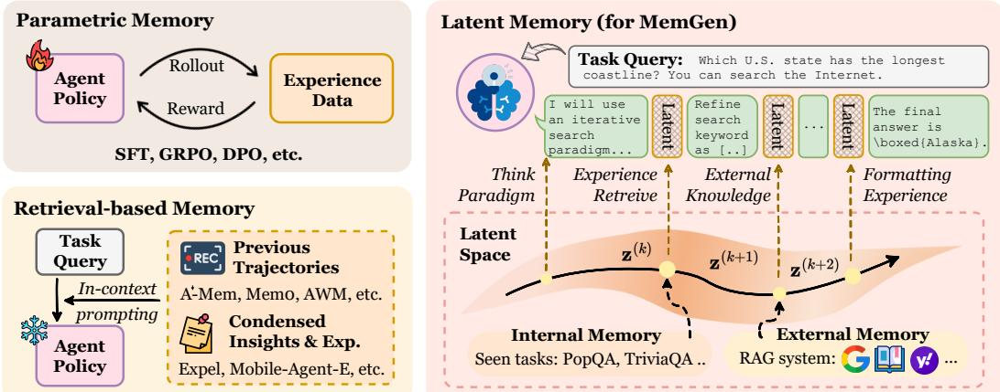
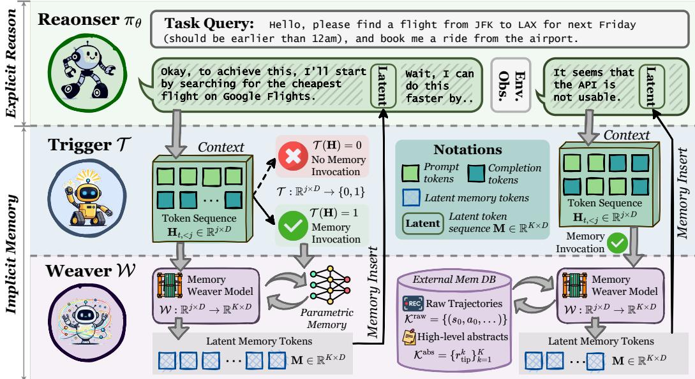
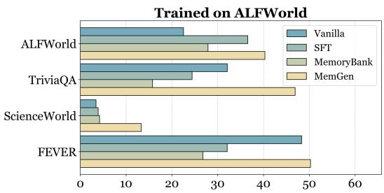
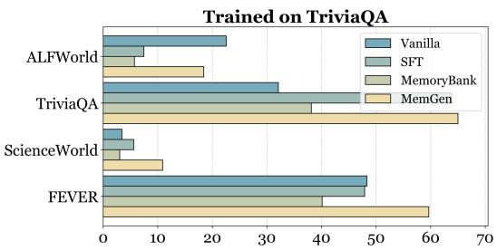
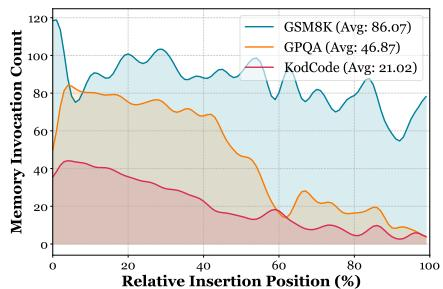
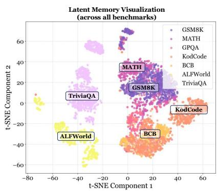
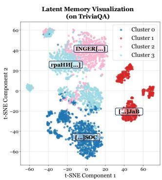
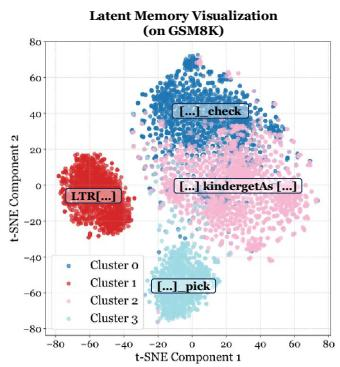
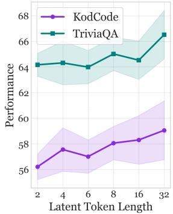
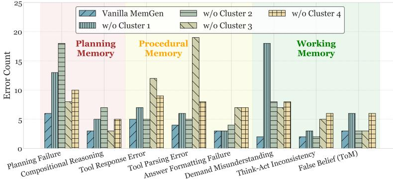

## ABSTRACT

Agent memory shapes how Large Language Model (LLM)-powered agents, akin to the human brain, progressively refine themselves through environment interactions. Existing paradigms remain constrained: parametric memory forcibly adjusts model parameters, and retrieval-based memory externalizes experience into structured databases, yet neither captures the fluid interweaving of reasoning and memory that underlies human cognition. To address this gap, we propose MemGen, a dynamic generative memory framework that equips agents with a human-esque cognitive faculty. It consists of a memory trigger, which monitors the agent’s reasoning state to decide explicit memory invocation, and a memory weaver, which takes the agent’s current state as stimulus to construct a latent token sequence as machine-native memory to enrich its reasoning. In this way, MemGen enables agents to recall and augment latent memory throughout reasoning, producing a tightly interwoven cycle of memory and cognition. Extensive experiments across eight benchmarks show that MemGen surpasses leading external memory systems such as ExpeL and AWM by up to 38.22%, exceeds GRPO by up to 13.44%, and exhibits strong cross-domain generalization ability. More importantly, we find that without explicit supervision, MemGen spontaneously evolves distinct human-like memory faculties, including planning memory, procedural memory, and working memory, suggesting an emergent trajectory toward more naturalistic forms of machine cognition. Codes are available at https://github.com/bingreeky/MemGen.

## 1 INTRODUCTION

The ascent of Large Language Model (LLM)-powered agents marks a paradigm shift across diverse domains (Luo et al., 2025b; Yang et al., 2024b; Qian et al., 2025; Singh et al., 2025; Pantiukhin et al., 2025; Ren et al., 2025). Pivotal to this success is the concept of agent memory (Zhang et al., 2024b; Wu et al., 2025b), which enables LLM agents to learn progressively from environmental interactions (Zhang et al., 2025a; Qiu et al., 2025b). Crucially, this conception of agent memory extends beyond that of conversational agents (i.e., personalized memory (Wu et al., 2025b)), whose primary role is to sustain coherence across long-horizon, multi-turn dialogues (Chhikara et al., 2025; Xu et al., 2025a; Packer et al., 2024; Zhong et al., 2023). Rather, the scope of this paper is primarily on enabling agents to internalize experience, simulate human-like cognitive iteration, and progressively enhance problem-solving competence (Gao et al., 2025).

The memory serving as this self-evolving engine typically manifests in two dominant paradigms. The first is (I) parametric memory, which internalizes experiences by directly updating agents’ parameters (Yao et al., 2024; Yang et al., 2023; Zeng et al., 2023; Chen et al., 2024b; 2025). While this approach can yield substantial performance gains, its reliance on parameter modification inevitably entails catastrophicforgetting, i.e., the erosion of general knowledge (Dou et al., 2024). Conversely, the second paradigm is (II) retrieval-based memory, which externalizes past experiences into a structured database, such as (i) raw trajectories (Luo et al., 2025a; Zhang et al., 2025a; Zhao et al., 2024), (ii) high-level experiences (Zhao et al., 2024; Tang et al., 2025; Fang et al., 2025; Wang et al., 2024c), and (iii) condensed skills like reusable APIs (Zheng et al., 2025) or MCP boxes (Qiu et al., 2025b;a). Although this non-invasive approach circumvents catastrophic forgetting, its efficacy is fundamentally tethered to context engineering. It adheres to a rigid execution pipeline, providing retrieved context to the agent without achieving the fluid, seamless integration characteristic of truly internalized memory (Su et al., 2025).

  
Figure 1: The comparison among parametric memory, retrieval-based memory and MemGen. We drew inspiration from the layout presented in Figure 1 of Li et al. (2025a).

Given these deficiencies, latent memory offers a compelling alternative, leveraging latent states as a machine-native, high-density medium for memory. Existing approaches either use the (i) key-value (KV) cache to maintain dynamic memory set (Gim et al., 2024; Jin et al., 2024; Hongkang Yang et al., 2024), yet which is primarily confined to addressing long-context issues, or (ii) latent token embeddings to store agent experiences (Wang et al., 2024b; 2025b), which still rely on invasive LLM parameter updates. More fundamentally, these methods diverge from human cognition in two critical dimensions: they lack the seamless interleaving of reasoning and memory, a process where thought and memory dynamically reshape one another, and remain largely retrieval-based, fetching memories by embedding similarity (Wang et al., 2024b) rather than generatively reconstructing them into novel, coherent insights. This leads to the pivotal research question that motivates our work:

How can we architect agent memory as a dynamic cognitive faculty, capable of fluid, reconstructive processes that interweave seamlessly with reasoning?

To address this challenge, we introduce MemGen, a dynamic and generative memory framework designed to endow any LLM agent with a more human-esque cognitive faculty. At its core, MemGen continuously monitors an agent’s cognitive state, enabling it to dynamically invoke a generative process that synthesizes a bespoke latent memory at any critical juncture during its reasoning process. Practically, MemGen comprises two synergistic components: a reinforcement learning (RL)-trained ♣ memory trigger, which acts as a metacognitive monitor to discern the opportune moments for explicit memory invocation; and a ♠ memory weaver, which takes the agent’s current state as a stimulus to draw upon relevant implicit parametric memory (potentially augmented with externally retrieved information) and then reconstructs this synthesis into a succinct, machine-native latent memory. With the reasoning core fixed, MemGen inherently mitigates catastrophic forgetting when exposed to new data, and equips agents with a generative memory deeply integrated with reasoning.

Experimental Observation. Extensive experiments across nine benchmarks and four baseline categories demonstrate that MemGen delivers ❶ substantial performance gains, with improvements of up to 31.7% on ALFWorld (Shridhar et al., 2021) and 27.1% on KodCode (Xu et al., 2025d) with Qwen3-8B, surpassing parametric memory (REINFORCE++, +5.8%) and the GRPO method (+5.32%);❷ strong cross-domain generalization, where training in the math domain not only avoids degradation elsewhere but also boosts performance in science reasoning (+6.06%) and code generation (+5.1%); and ❸ continual learning ability, maintaining stable performance in previously trained domains even after fine-tuning on three additional ones.

Analysis & Interpretation. Beyond quantitative evaluation, we also analyze the functional behavior of the latent memories learned by MemGen. Through post-hoc interventions examining the impact of removing specific latent memory on different agent failure modes, we found that different latent memory tokens play distinct computational roles within the agent’s reasoning process, including ❶ planning memory, where certain latent tokens specifically support high-level task planning, ❷ procedural memory, where some latent memory tokens facilitate the agent’s recall of task-specific procedural skills, such as tool usage and answer formatting, and ❸ working memory, where certain tokens help the agent maintain coherence and understanding over long contexts within a single task session. These specializations strongly reveal that MemGen endows the agent with precise, functionally distinct memory.

## 2 RELATED WORK

LLM & Agent Memory. As outlined in §1, existing memory mechanisms designed to evolve the problem-solving capacity of LLM agents can be broadly categorized into three classes: (I) parametric memory, which either integrates past experiences directly into agent parameters through finetuning, as in FireAct (Chen et al., 2023), AgentLumos (Yin et al., 2024), and others (Zhang et al., 2024a; Fu et al., 2025), or maintains them in external parameter modules (Tack et al., 2024; Wang et al., 2024a); (II) retrieval-based memory, which abstracts prior experiences into transferable knowledge (Zhang et al., 2025a; Zhao et al., 2024), or distills them into reusable tools and skills (Zheng et al., 2025; Wang et al., 2025c; Qiu et al., 2025b;a); and (III) latent memory, which leverages implicit representations to encode and retrieve experience (Wang et al., 2024b; 2025b; Hu et al., 2025b; Liu et al., 2024; Sun et al., 2025). Our MemGen falls within the latent memory paradigm, yet distinguishes itself from prior approaches through its interweaving of reasoning and memory, as well as generative reconstruction mechanism.

Latent Computation. Our method is also closely related to latent computation, wherein latent states are employed to intervene in or reshape the LLM’s reasoning process (Zhu et al., 2025). Prominent paradigms include: (I) architecturally enabling native latent reasoning, exemplified by Coconut (Hao et al., 2024), CODI (Shen et al., 2025b), LatentR3 (Zhang et al., 2025b) and CoLaR (Tan et al., 2025), which render the LLM’s inference process inherently latent and machinenative; and (II) employing latent computation to steer LLM generation, as in LaRS (Xu et al., 2023), LatentSeek (Li et al., 2025a), SoftCoT (Xu et al., 2025c;b), and Coprocessor (Liu et al., 2024), which leverage latent representations to modulate the quality of generated outputs.

## 3 PRELIMINARY

Notation. We formalize the agent’s interaction within an environment $\mathcal { E } .$ . An agent, powered by an LLM parameterized by θ, is denoted as $\pi _ { \theta }$ . For a given task x, the agent’s interaction unfolds as a high-level trajectory, denoted as follows $\tau = ( s _ { 0 } , a _ { 0 } , s _ { 1 } , a _ { 1 } , \dots , s _ { T } )$ , where $s _ { t }$ represents the state of the environment and $a _ { t }$ is the high-level action taken by the agent. More internally, each action $a _ { t }$ is essentially a sequence of tokens, $a _ { t } = ( \mathbf { z } _ { t , 1 } , \mathbf { z } _ { t , 2 } , \ldots , \mathbf { z } _ { t , L _ { t } } )$ , generated autoregressively by the LLM. The generation of the j-th token is conditioned on the current state $s _ { t }$ and all previously generated tokens within that action:

$$
\mathbf {z} _ {t, j} \sim \pi_ {\theta} (\cdot | s _ {t}, \mathbf {z} _ {t, <   j}).\tag{1}
$$

After an entire action sequence $\mathbf { a } _ { t }$ is generated, it is executed in the environment, which transitions the state from $s _ { t } \ \mathrm { t o } \ s _ { t + 1 }$ . The success of the trajectory τ is evaluated by a reward function $R ( \tau )$

Problem Formalization Given a history of past experiences $\mathcal { H } = \{ ( x _ { i } , \tau _ { i } ) \} _ { i = 1 } ^ { N }$ , the objective is to leverage this history to maximize the agent’s performance on new tasks. The policy $\pi _ { \theta }$ and a memory system M are thus jointly optimized to maximize the expected reward over a task distribution D:

$$
\max _ {\theta , \mathcal {M}} \mathbb {E} _ {x \sim \mathcal {D}, \tau \sim \pi_ {\theta , \mathcal {M}}} [ R (\tau) ],\tag{2}
$$

during which $\mathcal { M }$ is to produce a memory representation, $m ,$ , which conditions the agent’s policy. The action at any timestep t is thus sampled as $a _ { t } \sim \pi _ { \theta } ( \cdot \mid s _ { t } , m _ { t } )$ , where $m _ { t }$ is the inserted memory at that step. Crucially, the nature and timing of memory generation, which we denote as the function $f _ { \mathcal { M } }$ , vary across different paradigms. We express the generation of the memory $m _ { t }$ as:

$$
m _ {t} = f _ {\mathcal {M}} (s _ {t}, \mathcal {H}, m _ {<   t}),\tag{3}
$$

which accommodates diverse memory invocation granularities. For task-level memory $( e . g .$ ., Expel (Zhao et al., 2024) and G-Memory (Zhang et al., 2025a)), $f _ { \mathcal { M } }$ is invoked only at $t = 0$ , and $m _ { t } ~ = ~ m _ { 0 }$ for all subsequent steps. For step-level memory (e.g., AgentKB (Tang et al., 2025)), $f _ { \mathcal { M } }$ is invoked at every step t to update the memory. In parametric memory, the influence of H is compiled into $\theta ,$ rendering memory generation implicit in the model parameters. Our work, which introduces dynamic latent memory, focuses on designing a more fine-grained $f _ { \mathcal { M } }$ that decides for itself the optimal moments to regenerate $m _ { t }$ at the token level during the agent’s reasoning process.

  
Figure 2: The overview of our proposed MemGen.

## 4 METHODOLOGY

## 4.1 MemGen: INTERLEAVING MEMORY AND REASONING

Just as a person is the sum oftheir past experiences (McAdams, 2001), memory profoundly shapes an agent’s behavior (Xiong et al., 2025). Yet existing agent memory systems lack the adaptive fluidity characteristic of human cognition. Human reasoning and recollection operate in a continuous interplay, whereas most agent memory frameworks retrieve information only once at task initiation and append it to the query in a coarse and static manner. MemGen is designed to close this gap by enabling memory to participate dynamically in the reasoning process.

As shown in Figure 2, the reasoning process in an agent equipped with MemGen unfolds autoregressively, driven by a frozen core LLM, the reasoner $\pi _ { \theta }$ . For a given state st, πθ generates the action $a _ { t } = ( \mathbf { z } _ { t , 1 } , \ldots , \mathbf { z } _ { t , L _ { t } } )$ . MemGen continuously monitors the token-by-token generation process and performs on-demand memory insertion. At each token-generation step j, a memory trigger $\tau _ { \mathrm { t r i g g e r } }$ monitors the reasoner’s internal cognitive state to determine if a moment of reflection, i.e., a memory invocation, is necessary. Specifically, as the reasoner generates the token sequence $\mathbf { z } _ { t , < j }$ , it produces a corresponding sequence of hidden state vectors, $\bar { \mathbf { H } _ { t , < j } } = ( \mathbf { h } _ { t , 1 } , \dots , \mathbf { h } _ { t , j - 1 } )$ , where each $\mathbf { h } _ { t , k } \in \mathbb { R } ^ { d _ { \mathrm { m o d e l } } }$ . The trigger takes the current hidden states $\mathbf { H } _ { t , < j }$ as a representation of the reasoner’s current metacognitive state and computes an invocation probability:

$$
p _ {j} = \sigma \left(\mathcal {T} _ {\text { trigger }} (\mathbf {h} _ {t, 1}, \dots , \mathbf {h} _ {t, j - 1})\right),\tag{4}
$$

from which a binary decision, $d _ { j } \sim \mathrm { B e r n o u l l i } ( p _ { j } ) \in \{ \mathrm { I N V O K E } , \mathrm { S K I P } \}$ , is sampled. If the decision is to [SKIP], πθ proceeds with its standard autoregressive generation, i.e., $\mathbf { z } _ { t , j } \sim \pi _ { \boldsymbol \theta } \big ( \cdot \mid s _ { t } , \mathbf { z } _ { t , < j } \big )$ However, if the decision is to INVOKE, the reasoning process is momentarily paused. This summons the second core component of our framework: the memory weaver $\mathcal { W } _ { \mathrm { w e a v e r } } .$ , which takes the same cognitive state $\mathbf { H } _ { t , < j }$ as a stimulus to perform a generative act of recollection. It synthesizes a bespoke, machine-native latent memory, formalized as $\mathbf { M } _ { t } \in \mathbb { R } ^ { K \times d _ { \mathrm { m o d e l } } }$ with fixed length K:

$$
\mathbf {M} _ {t} := \left[ \mathbf {m} _ {t, 1}, \mathbf {m} _ {t, 2}, \dots , \mathbf {m} _ {t, K} \right] = \mathcal {W} _ {\text { weaver }} (\mathbf {H} _ {t, <   j}),\tag{5}
$$

where the memory is generated not merely from the parametric knowledge encoded within $\mathcal { W } _ { \mathrm { w e a v e r } }$ but may also incorporate cues retrieved from external memory databases (detailed implementation is elaborated in §4.3). Crucially, Mt is not a verbatim restatement of prior content but a selective reconstruction, filtered and integrated through $\mathcal { W } _ { \mathrm { w e a v e r } } ,$ akin to the memory consolidation process in human brain (Spens & Burgess, 2024). Once formed, the latent memory is woven seamlessly into the reasoner’s ongoing dynamics: its hidden states are prepended to $\mathbf { H } _ { t , < j }$ , upon which the reasoner resumes generation conditioned on this enriched context,

$$
\mathbf {z} _ {t, j} \sim \pi_ {\theta} (\cdot | s _ {t}, \mathbf {z} _ {t, <   j}, \mathbf {M} _ {t}).\tag{6}
$$

This iterative cycle of generation, monitoring, invocation, weaving, and reintegration elevates reasoning from a linear unfolding to a recursive dialogue with memory, all without altering the frozen reasoner $\pi _ { \theta } .$ , and thereby preserving its general capabilities. In the following sections, we detail the implementations of the memory trigger (▷ §4.2) and the memory weaver (▷ §4.3).

## 4.2 MEMORY TRIGGER: LEARNING TO INVOCATE MEMORY

In this section, we describe the concrete instantiation and training recipe of the memory trigger $\tau _ { \mathrm { t r i g g e r } }$ . Recall from §4.1 that $\tau _ { \mathrm { t r i g g e r } }$ serves as a metacognitive monitor, observing the evolving reasoning state of the frozen reasoner $\pi _ { \theta }$ and producing a binary decision $d _ { j } \in \{ \mathrm { I N V O K E } , \mathrm { S K I P } \} ( 0$ ↔ SKIP, 1 ↔ INVOKE) that determines whether the memory weaver should be invoked at token $j .$

Instantiation. We instantiate $\tau _ { \mathrm { t r i g g e r } }$ as a lightweight LoRA adapter attached to the reasoner $\pi _ { \theta } .$ At the decoding step $j$ of the timestep t, it receives the sequence of all hidden states, $\mathbf { H } _ { t , < j } \in$ $\mathbb { R } ^ { ( j - 1 ) \times d _ { \mathrm { m o d e l } } } ;$ conditioned on this context, $\tau _ { \mathrm { t r i g g e r } }$ outputs the action probability $P ( d _ { j } = \mathrm { I N V O K E } ) \in$ $[ 0 , 1 ]$ We use hidden states rather than textual context as input because, following prior work in latent reasoning (Hao et al., 2024; Shen et al., 2025a), latent embeddings retain richer contextsensitive information that would otherwise be lost after softmax decoding. To avoid excessive computational overhead, we adopt a sentence-granularity activation strategy, inspired by recent studies on LLM interpretability (Anthropic, 2025; Chen et al., 2024a), which find that interventions between sentences can more effectively guide $_ \mathrm { L L M s } ,$ reasoning path. Specifically, we define a delimiter token set $\mathcal { D } \left( e . g . \right.$ , commas, periods) and let the trigger act only when the current token falls in $\mathcal { D } .$ The invocation decision is computed as:

$$
d _ {j} = \text { Bernoulli } (p _ {j}), p _ {j} = \left\{ \begin{array}{l l} 0 & \text { if   } z _ {j} \notin \mathcal {D}, \\ \mathcal {T} _ {\text { trigger }} (\mathbf {H} _ {t, <   j}) & \text { if   } z _ {j} \in \mathcal {D}, \end{array} \right.\tag{7}
$$

which ensures that $\tau _ { \mathrm { t r i g g e r } }$ is invoked only at semantically significant boundaries, preserving decoding efficiency. We validate that MemGen does not incur excessive inference delay in Appendix E.3.3.

Training Recipe. The memory trigger is trained via reinforcement learning, motivated by the need to balance two competing desiderata: ensuring that critical latent memories are invoked to improve task performance, while avoiding unnecessary or spurious invocations that could disrupt reasoning or incur computational overhead. Given a batch of seen tasks $\mathcal { H } = \{ ( x _ { i } , \tau _ { i } ) \} _ { i = 1 } ^ { N } ,$ the frozen reasoner $\pi _ { \theta }$ generates candidate trajectories while the memory weaver ${ \mathcal { W } } _ { \mathrm { w e a v e r } }$ remains fixed. At each activated step, the trigger selects an action $\tilde { d } _ { j } \in \{ \tt I N V O K E , S K I P \}$ and receives a reward $r ( \tau _ { i } )$ reflecting the quality of the resulting trajectory with respect to the task objective. To encourage sparse yet strategically critical memory invocation, we introduce a reward-adaptive penalty, which discourages unnecessary activations while preserving essential ones, into the objective:

$$
\max _ {\phi} \mathbb {E} _ {\tau_ {i} \sim \pi_ {\theta}, \tilde {\mathbf {d}} \sim \mathcal {T} _ {\mathrm{trigger}} ^ {\phi}} \Big [ R (\tau_ {i}) - \lambda \sum_ {i, j} \max (0, \tilde {d} _ {i, j} - \bar {p}) \Big ],\tag{8}
$$

where $\bar { p }$ is computed as the mean activation probability across high-reward trajectories, $i . e .$ , those with reward exceeding the batch median:

$$
\bar {p} = \frac {1}{| \mathcal {H} _ {\text { high }} |} \sum_ {i \in \mathcal {H} _ {\text { high }}} \frac {1}{| \tau_ {i} |} \sum_ {j} \tilde {d} _ {i, j}, \mathcal {H} _ {\text { high }} = \{i: R (\tau_ {i}) \geq \operatorname{median} _ {k} (R (\tau_ {k})) \},\tag{9}
$$

where ensures that $\tau _ { \mathrm { t r i g g e r } }$ learns to invoke memory selectively at key decision points, maximizing task reward while maintaining computational efficiency.

## 4.3 MEMORY WEAVER: SYNTHESIZING AND INSERTING LATENT MEMORY

In this section, we elaborate on the weaver $\mathcal { W } _ { \mathrm { w e a v e r } } ,$ the memory carrier within the MemGen framework. When the agent assimilates new experiences, this information is exclusively internalized into the parameters of $\mathcal { W } _ { \mathrm { w e a v e r } } .$ , leaving the core reasoner $\pi _ { \theta }$ entirely unmodified. At junctures where the reasoner requires experiential support, a context-dependent hook activates the weaver to synthesize and externalize pertinent knowledge as a usable memory. To be more specific, recall from Equation (5) that after the $\mathcal { T } _ { \mathrm { t r i g g e r } }$ signals the need for memory at step j, ${ \mathcal { W } } _ { \mathrm { w e a v e r } }$ accepts $\mathbf { H } _ { t , < j }$ (as the hook) and generates a latent token sequence $\mathbf { M } _ { t }$ (as the memory) for $\pi _ { \theta }$

Instantiation. We instantiate $\mathcal { W } _ { \mathrm { w e a v e r } }$ using anthoer LoRA adapter attached to $\pi _ { \theta }$ . Formally, given the incoming hook $\mathbf { H } _ { t , < j } ~ \in ~ \mathbb { R } ^ { ( j - 1 ) \times d _ { \mathrm { m o d e l } } }$ , the weaver outputs a latent memory matrix: $\mathbf { M } _ { t } \ =$ $\mathcal { W } _ { \mathrm { w e a v e r } } ^ { \theta ^ { \prime } } ( \mathbf { H } _ { t , < j } ) \in \mathbb { R } ^ { K \times d _ { \mathrm { m o d e l } } ^ { \bar { \mathbf { \alpha } } } }$ , where K denotes the fixed length of the latent memory sequence and $\theta ^ { \prime }$ are the trainable LoRA parameters. The synthesized ${ { \bf { M } } _ { t } }$ is first projected through a linear layer to align it with the reasoner’s token-embedding space, and is then prepended to the current hidden states of $\pi _ { \theta }$ to guide subsequent token generation, as described in Equation (6).

Training Recipe. The training of $\mathcal { W } _ { \mathrm { w e a v e r } }$ proceeds over a batch of past trajectories $\mathcal { H } =$ $\{ ( x _ { i } , \tau _ { i } ) \} _ { i = 1 } ^ { N }$ . Distinct from conventional agent tuning, which directly integrates experiential data into the parameters of $\pi _ { \theta }$ (Chen et al., 2025; Yin et al., 2024), MemGen internalizes experiential knowledge solely into $\mathcal { W } _ { \mathrm { w e a v e r } } .$ which ensures that $\pi _ { \boldsymbol { \theta } } \mathbf { \ ' } _ { \mathbf { S } }$ general capabilities remain intact.

Crucially, this separation makes MemGen agnostic to optimization strategies and compatible with diverse LLM backbones. Whether employing supervised fine-tuning (SFT) or RL-based objectives such as GRPO or DAPO, the weaver can be updated under a unified goal: optimizing the generation process of latent memory so as to maximize downstream reward. Formally, let $\Pi _ { \theta } ^ { \mathcal { W } _ { \theta ^ { \prime } } , \mathcal { T } } ( \cdot | \overline { { x } } )$ denote the process of rolling out a trajectory for a task x by $\pi _ { \theta }$ in conjunction with weaver $\mathcal { W } _ { \theta ^ { \prime } }$ ′ and trigger T. Given a reward functional R, the objective updates only $\theta ^ { \prime }$ by maximizing the expected reward:

$$
\max _ {\theta_ {\mathrm{lora}}} \mathbb {E} _ {(x _ {i}, \tau_ {i}) \sim \mathcal {H}} \mathbb {E} _ {\tau \sim \Pi_ {\theta} ^ {\mathcal {W} _ {\theta^ {\prime}}, \tau} (\cdot | x _ {i})} [ R (x _ {i}, \tau) ],\tag{10}
$$

where the gradients from R are propagated solely to $\theta ^ { \prime } { } .$ thereby equipping the weaver to supply precisely the memories that improve end-to-end performance without altering $\pi _ { \theta }$ . Equation (10) enables $\mathcal { W } _ { \mathrm { w e a v e r } }$ to absorb diverse experiential signals and externalize them as dynamic, contextsensitive latent memories, independent of the architectural or training paradigm of the base reasoner.

In practice, we first train the memory weaver using a random inserter as a lightweight surrogate for the trigger, and then freeze the trained weaver and proceed to train the trigger. For a complete description of the training procedure, please refer to Appendix D.1.

Integration with Retrieval-based Memory. Although the memory generation above primarily draws on the weaver’s parametric knowledge, it can be combined with external memory sources. When triggered, any retrieval-based system $( e . g .$ , MemoryBank, ExpeL) can provide textual memory, which is merged with the hook $\mathbf { H } _ { t , < j }$ and fed into W to produce latent memory. This allows W to integrate internal knowledge and external information, supplying the reasoner with richer memory support. Implementation details and results are placed in Appendix F.

## 5 EXPERIMENTS

In this section, we conduct extensive experiments to answer the following research questions:

• (RQ1) Can MemGen surpass both parametric and retrieval-based memory?

• (RQ2) Is the memory learnt by MemGen generalizable across task domains? And why?

• (RQ3) Can MemGen facilitate continual learning and mitigate catastrophic forgetting?

• (RQ4) Does MemGen implicitly evolve human-like memory hierachy?

## 5.1 EXPERIMENTAL SETUP

Evaluation and Benchmarks. Our evaluation covers nine datasets from five domains, including ❶ web search: TriviaQA (Joshi et al., 2017) and PopQA (Mallen et al., 2023); ❷ embodied action: ALFWorld (Shridhar et al., 2021); ❸ math reasoning: AQuA (Ling et al., 2017), GSM8K (Cobbe et al., 2021), and MATH (Hendrycks et al., 2021); ❹ scientific reasoning: GPQA (Rein et al., 2023); and ❺ coding: KodCode (Xu et al., 2025d) and BigCodeBench (Jain et al., 2024).

Baselines. We compare MemGen against twelve baselines, categorized into four groups: (I) Prompt-based methods: Vanilla model, CoT (Wei et al., 2023); (II) Parametric memory, where experiential knowledge directly modifies model parameters via: SFT, GRPO (DeepSeek-AI et al., 2025), REINFORCE (Williams, 1992), REINFORCE++ (Hu et al., 2025a), Agent-FLAN (Chen et al., 2024b); (III) Retrieval-based memory, where processing tasks sequentially and storing the experiences in an external database, represented by MemoryBank (Zhong et al., 2023), ExpeL (Zhao et al., 2024), Agent Workflow Memory (AWM) (Wang et al., 2024c); and (IV) Latent computation, where leveraging latent tokens as carriers of experiential knowledge, including SoftCoT (Xu et al., 2025c) and Co-processor (Liu et al., 2024).

Table 1: Results on SmolLM3-3B and Qwen3-8B. All values represent the performance metric for each task (e.g., accuracy %). We highlight the best and second best results.

<table><tr><td>Backbone</td><td>Method</td><td>ALFWorld</td><td>TrivialQA</td><td>PopQA</td><td>KodCode</td><td>BigCodeBench</td><td>GPQA</td><td>GSM8K</td><td>MATH</td></tr><tr><td rowspan="14">SmolLM3-3B</td><td>Vanilla</td><td>18.96</td><td>10.47</td><td>8.23</td><td>37.05</td><td>35.96</td><td>9.35</td><td>47.63</td><td>16.22</td></tr><tr><td>CoT</td><td>17.60</td><td>12.88</td><td>9.95</td><td>38.45</td><td>39.42</td><td>20.70</td><td>58.91</td><td>56.33</td></tr><tr><td>SFT</td><td>32.36</td><td>55.25</td><td>37.22</td><td>59.25</td><td>40.79</td><td>19.70</td><td>63.48</td><td>45.65</td></tr><tr><td>GRPO</td><td>55.35</td><td>65.88</td><td>45.16</td><td>68.48</td><td>72.44</td><td>22.73</td><td>80.03</td><td>61.23</td></tr><tr><td>REINFORCE</td><td>53.13</td><td>63.20</td><td>46.81</td><td>65.53</td><td>67.14</td><td>23.44</td><td>82.03</td><td>58.75</td></tr><tr><td>REINFORCE++</td><td>53.95</td><td>63.20</td><td>44.10</td><td>65.90</td><td>68.80</td><td>22.73</td><td>81.50</td><td>59.89</td></tr><tr><td>Agent-FLAN</td><td>34.00</td><td>56.70</td><td>39.50</td><td>56.80</td><td>37.20</td><td>17.80</td><td>59.60</td><td>36.84</td></tr><tr><td>ExpeL</td><td>36.18</td><td>46.20</td><td>28.16</td><td>51.14</td><td>40.22</td><td>15.15</td><td>56.23</td><td>38.11</td></tr><tr><td>MemoryBank</td><td>32.80</td><td>43.30</td><td>25.81</td><td>44.50</td><td>31.80</td><td>10.20</td><td>58.30</td><td>43.53</td></tr><tr><td>AWM</td><td>40.50</td><td>49.80</td><td>29.60</td><td>-</td><td>-</td><td>-</td><td>-</td><td>-</td></tr><tr><td>SoftCoT</td><td>35.03</td><td>50.38</td><td>34.90</td><td>59.20</td><td>39.10</td><td>17.22</td><td>56.34</td><td>44.62</td></tr><tr><td>Co-processor</td><td>38.36</td><td>53.28</td><td>38.96</td><td>56.25</td><td>45.40</td><td>20.10</td><td>57.60</td><td>38.81</td></tr><tr><td>MemGen SFT</td><td>50.60</td><td>68.13</td><td>42.34</td><td>62.65</td><td>42.99</td><td>26.75</td><td>70.42</td><td>57.44</td></tr><tr><td>MemGen GRPO</td><td>63.60</td><td>79.30</td><td>58.60</td><td>72.85</td><td>74.24</td><td>25.20</td><td>83.47</td><td>63.65</td></tr><tr><td rowspan="14">Qwen3-8B</td><td>Vanilla</td><td>58.93</td><td>52.18</td><td>34.13</td><td>49.10</td><td>33.33</td><td>38.18</td><td>89.48</td><td>79.82</td></tr><tr><td>CoT</td><td>57.10</td><td>53.80</td><td>33.20</td><td>51.25</td><td>35.59</td><td>35.15</td><td>87.67</td><td>78.24</td></tr><tr><td>SFT</td><td>83.59</td><td>74.55</td><td>51.12</td><td>64.75</td><td>41.33</td><td>40.33</td><td>90.76</td><td>81.35</td></tr><tr><td>GRPO</td><td>85.60</td><td>76.15</td><td>58.90</td><td>73.35</td><td>70.24</td><td>39.54</td><td>92.30</td><td>83.54</td></tr><tr><td>REINFORCE</td><td>82.10</td><td>75.22</td><td>57.96</td><td>72.11</td><td>70.20</td><td>37.12</td><td>91.25</td><td>83.27</td></tr><tr><td>REINFORCE++</td><td>84.80</td><td>75.90</td><td>58.30</td><td>72.90</td><td>71.88</td><td>37.68</td><td>91.90</td><td>85.24</td></tr><tr><td>Agent-FLAN</td><td>80.32</td><td>70.32</td><td>50.08</td><td>62.99</td><td>43.40</td><td>39.50</td><td>87.60</td><td>80.05</td></tr><tr><td>ExpeL</td><td>78.97</td><td>65.54</td><td>40.33</td><td>57.20</td><td>34.23</td><td>35.15</td><td>86.20</td><td>77.40</td></tr><tr><td>MemoryBank</td><td>70.41</td><td>60.56</td><td>41.60</td><td>56.39</td><td>40.61</td><td>35.66</td><td>90.35</td><td>80.35</td></tr><tr><td>AWM</td><td>80.33</td><td>69.30</td><td>43.69</td><td>-</td><td>-</td><td>-</td><td>-</td><td>-</td></tr><tr><td>SoftCoT</td><td>75.60</td><td>59.42</td><td>39.42</td><td>63.28</td><td>38.27</td><td>39.60</td><td>86.30</td><td>76.23</td></tr><tr><td>Co-processor</td><td>73.28</td><td>61.42</td><td>45.55</td><td>64.90</td><td>42.19</td><td>39.15</td><td>76.23</td><td>79.20</td></tr><tr><td>MemGen SFT</td><td>85.82</td><td>77.22</td><td>54.65</td><td>66.15</td><td>40.35</td><td>43.23</td><td>91.25</td><td>83.30</td></tr><tr><td>MemGen GRPO</td><td>90.60</td><td>80.65</td><td>62.30</td><td>76.16</td><td>75.56</td><td>40.24</td><td>93.20</td><td>88.24</td></tr></table>

Implementation Details. We select LLM backbones of varying sizes and sources, including Qwen-2.5-1.5B (Yang et al., 2024a), HuggingFace’s SmolLM3-3B (HuggingFace, 2025), and Qwen3-8B (Yang et al., 2025). The length of each latent memory sequence K is set among {2, 4, 8}. As described in Equation (10), MemGen does not rely on a specific optimization algorithm, so we implement two variants: MemGen and MemGen , in which the weaver is updated using SFT and GRPO signals. Details on these variants are provided in Appendix C. More training setup and parameter configurations are listed in Appendix D.

## 5.2 MAIN RESTULS

[For RQ1] MemGen provides high-performing memory across domains. As shown in Tables 1 and 4, existing baselines exhibit clear limitations in cross-domain adaptivity. Retrieval-based memories (e.g., ExpeL, MemoryBank, AWM) occasionally surpass parazmetric tuning in embodied action; for instance, AWM reaches 36.18% on ALFWorld with SmolLM3-3B, exceeding SFT by 3.15%. Yet their effectiveness deteriorates on reasoning-intensive tasks: ExpeL achieves only 8.12% on GPQA+Qwen2.5-1.5B, and even underperforms the vanilla model by 6.9% on TriviaQA, underscoring its heavy reliance on backbone capacity. Parametric finetuning methods display the opposite tendency: they excel in structured domains such as code generation, where REINFORCE++ reaches 63.33% on KodCode with Qwen2.5-1.5B, but remain weak in knowledge-intensive reasoning, with GPQA below 14%. In contrast, MemGen consistently advances performance across all domains. For example, on ALFWorld+SmolLM3-3B, MemGen S and MemGen O attain 50.60% and 63.60%, improving over vanilla by 31.64% and 44.64%, respectively. Similar gains appear with the larger Qwen3-8B, where MemGen GRPO achieves +27.06% on KodCode and +28.17% on PopQA, surpassing GRPO by up to 3.4%. Overall, the dynamic memory insertion of MemGen delivers substantial improvements across diverse task domains.

[For RQ2] MemGen Exhibits Strong Cross-Domain Generalization. To evaluate whether the memory learned by MemGen can transfer across tasks, we train MemGen on one dataset and test it on several others. We include two out-of-domain datasets, ScienceWorld (Wang et al., 2022) and FEVER (Thorne et al., 2018), to further probe this. As shown in Figures 3, 9 and 10, baselines such as SFT and MemoryBank achieve gains within their training domains (e.g., on ALFWorld, SFT +14.1% and MemoryBank +5.4% compared with vanilla), yet fail to generalize, with performance [For RQ2] The Memory Trigger Intelligently Determines When to Activate Memory Insertion, Mitigating Domain Conflict. After training MemGen on GSM8K, we evaluate 150 samples each from GSM8K, KodCode, and GPQA, visualizing the frequency with which the memory trigger invoked the memory weaver at each relative position in the model output. We observe that the invocation frequency varies across domains and correlates directly with performance in Figure 9: GSM8K exhibits the largest improvement (+19.64%) and maximal invocations, GPQA achieves moderate gains (+6.06%) with medium invocations, and KodCode shows the smallest improvement (+3.1%) with the fewest invocations. This indicates that MemGen autonomously assesses, based on task-specific context, when memory insertion will be beneficial, invoking the weaver less frequently in unfamiliar domains.

  
Figure 3: The generalization study of MemGen. We train MemGen SFT on one dataset (ALFWorld or TriviaQA) and evaluate it on four datasets (TriviaQA, ALFWorld, ScienceWorld, and FEVER). dropping sharply on FEVER by 16.2%. In contrast, MemGen not only attains substantial in-domain improvements (24.55% → 58.16% on KodCode, Figure 10), but also exhibits effective transfer: when trained on KodCode, performance on MATH rises from 36.6% → 54.2%. Having empirically validated MemGen’s generalizability, a question naturally arises: what underlies this capability?

  
Figure 4: Memory invocation frequency across benchmarks at inference (trained on MemGen +Qwen3-8B +GSM8K).

[For RQ3] MemGen Effectively Mitigates Catastrophic Forgetting. In Table 5, we sequentially train on four datasets and evaluate on all benchmarks after each stage, where MemGen exhibits stronger knowledge retention ability compared to baseline methods. For example, unlike SFT which primarily improves performance on the most recent task (54.10% on KodCode but only 2.53% on GPQA), MemGen demonstrates more balanced cross-task generalization, attaining 38.43% on AQuA and 21.72% on GPQA after GSM8K training. Finally, it mitigates forgetting on earlier tasks, preserving 40.34% on AQuA following KodCode training compared to 27.14% for ExpeL and 28.61% for SFT, indicating a more stable continual learning ability. More analysis is in Appendix E.1.

## 5.3 FRAMEWORK ANALYSIS

Having established the expressive capabilities of MemGen, we further investigate its underlying mechanisms: what do the learned latent memories look like? Do they have specialized functions?

[For RQ4] The Latent Memory Is Machine-Native and Human-Unreadable. We first visualized the latent memory sequences learned by MemGen across different datasets using t-SNE in Figures 5 and 11. As shown in Figure 5 (Left), sequences from distinct domains form separate distributions, with related domains clustering closely (e.g., KodCode and BigCodeBench, GSM8K and MATH). Examining latent memories within the same dataset, we observed pronounced clustering patterns (as shown in Figure 5 (Middle and Right)). To explore potential commonalities within these clusters, we forcibly decoded the latent tokens. Although the decoded sequences are not human-readable, they exhibit intriguing regularities: many tokens within a cluster share structural conventions. For example, Cluster 0 in TriviaQA frequently follows the pattern “[...]SOC”, whereas Cluster 3 in GSM8K often adopts the format $\mathsf { \Pi } ^ { \mathsf { \tiny {  } } } [ \mathsf { \Pi } , \mathsf { \tiny { \cdot } } \cdot \mathsf { \Pi } \cdot \mathsf { j } \mathsf { \Pi } _ { - \mathsf { P } } \mathrm { i } \mathsf { c k } ^ { \mathsf { \tiny { \cdot } } \mathsf { \Psi } }$ . A large corpus of latent memory tokens is provided in Appendix G. Despite these sequences being machine-native and human-unreadable, we further investigate whether their underlying semantics can be interpreted.

[For RQ4] MemGen Implicitly Learns a Human-like Memory Hierarchy. To uncover the functional roles of different latent memory clusters, we conducted a post-hoc intervention study. Following the taxonomy from (Song et al., 2025), we study eight distinct types of agent failure, including planning errors, tool response/parsing failures, answer formatting mistakes, etc, providing a structured framework to assess how memory influences performance. During evaluation, we selectively removed latent tokens close to a specific cluster while keeping others intact, measuring the resulting changes in these failure modes. Details on (1) the visualization process, (2) failure mode annotation, and (3) token filtration are in Appendix H. As shown in Figure 6 (Right), distinct memory clusters exhibit varying influence on failure modes and can be mapped to different memory functions:

  
Figure 5: (Left) t-SNE visualization of latent memories generated by MemGen +Qwen3-8B across datasets; (Middle and Right) Latent memory visualization within the TriviaQA and GSM8K datasets, clustered using K-means. The text at each cluster center represents the common pattern shared by many memory sequences in the cluster, such as Cluster 0 in GSM8K, where many sequences end with “ check”.

  
Figure 6: (Left) Parameter sensitivity analysis on the latent memory length K; (Right) Effects of selectively removing latent memory clusters on different agent failure modes on the TriviaQA dataset.

• Planning Memory supports high-level task planning and strategic reasoning. Removal of Cluster 2 substantially increases planning and compositional reasoning failures, indicating that this cluster is crucial for guiding the LLM agent’s decision-making and sequencing of reasoning steps.

• Procedural Memory captures task-specific operational knowledge, such as tool usage and formatting ability. Cluster 3 corresponds to this role, as its removal leads to a marked increase in tool response errors, parsing failures, and answer formatting mistakes.

• Working Memory manages the retention and effective use of prior context to maintain reasoning consistency. Clusters 1 and 4 contribute to this function: for instance, removing Cluster 1’s memory tokens results in more frequent task misunderstandings and think-act inconsistency.

Nevertheless, these memory clusters are not entirely independent: for example, removing Cluster 1 also negatively affects planning ability, indicating that these memory faculties interact and jointly enable the LLM to leverage past experience effectively. This analysis reveals that MemGen spontaneously organizes latent memory into a structured, human-like hierarchy.

Ablation Study & Sensitivity Analysis. We conduct a sensitivity analysis on the length of the latent memory sequence K, as shown in Figure 6 (Left). It can be observed that as the latent token length increases from 2 → 32, MemGen ’s performance correspondingly improves, likely reflecting the expanded memory capacity. We then perform an ablation study on the memory trigger module in Table 6, demonstrating the necessity of a dedicatedly trained trigger for effective memory invocation. Furthermore, we analyze different training paradigms of the memory weaver in Table 7. For additional results and discussions, please refer to Appendix E.3.

Efficiency Analysis. To confirm that the memory insertion process of MemGen does not introduce significant inference overhead, we show in Appendix E.3.3 that, while achieving up to 57.66% performance improvement over vanilla LLMs, the per-query inference delay remains consistently below the baseline, ranging from 24% to 94% of the vanilla LLM latency. This clearly demonstrates that MemGen delivers substantial performance gains without compromising efficiency.

## 6 CONCLUSION

In this work, we introduced MemGen, a dynamic and generative memory framework designed for LLM Agents. By interleaving reasoning with memory synthesis through a reinforcement-learned memory trigger and a generative memory weaver, MemGen transcends the limitations of parametric and retrieval-based paradigms. Extensive experiments showcase substantial performance gains, robust cross-domain generalization, strong continual learning ability, and MemGen’s explicitly modeled memory hierarchy (i.e., planning, procedural, and working memory). These results suggest a promising path toward self-evolving LLM agents capable of fluid and reconstructive intelligence.

## ETHICS STATEMENT

This work presents a latent memory architecture designed for LLM agents. All experiments are conducted on publicly available academic benchmarks across reasoning, scientific problem-solving, and embodied tasks, without deployment in real-world decision-making or safety-critical applications. Therefore, we believe this research does not pose direct ethical risks.

## REPRODUCIBILITY STATEMENT

We aim to ensure the reproducibility of our work by releasing an anonymous repository linked in the abstract, as well as detailing experimental settings (hyperparameters, LLM backbones, etc.) in §5.1 and appendix D.

## CONTRIBUTIONS

G. Zhang and M. Fu contributed equally to this work. G. Zhang led the initial framework implementation, manuscript preparation, and experimental analysis. M. Fu made key contributions to improving the efficiency of MemGen and conducted large-scale experiments and visualization. S. Yan is the corresponding author.

## ACKNOWLEDGEMENTS

This research was supported in part by the NUS Start-up Grant (A-0010106-00-00) and by the National Natural Science Foundation of China under Grant No. 62320106007.

## REFERENCES

Anthropic. On the Biology of a Large Language Model. https://transformer-circuits. pub/2025/attribution-graphs/biology.html, 2025. [Accessed 24-08-2025].

Tianle Cai, Yuhong Li, Zhengyang Geng, Hongwu Peng, Jason D. Lee, Deming Chen, and Tri Dao. Medusa: Simple llm inference acceleration framework with multiple decoding heads, 2024. URL https://arxiv.org/abs/2401.10774.

Baian Chen, Chang Shu, Ehsan Shareghi, Nigel Collier, Karthik Narasimhan, and Shunyu Yao. Fireact: Toward language agent fine-tuning, 2023. URL https://arxiv.org/abs/2310. 05915.

Guoxuan Chen, Han Shi, Jiawei Li, Yihang Gao, Xiaozhe Ren, Yimeng Chen, Xin Jiang, Zhenguo Li, Weiyang Liu, and Chao Huang. Sepllm: Accelerate large language models by compressing one segment into one separator. arXiv preprint arXiv:2412.12094, 2024a.