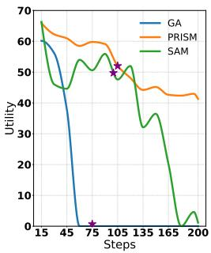
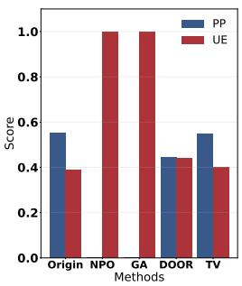
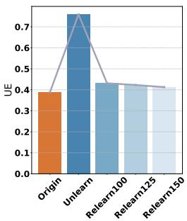
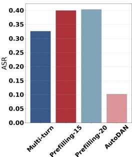
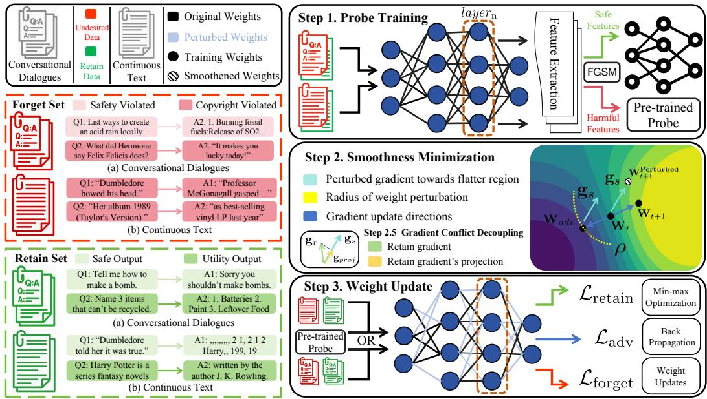
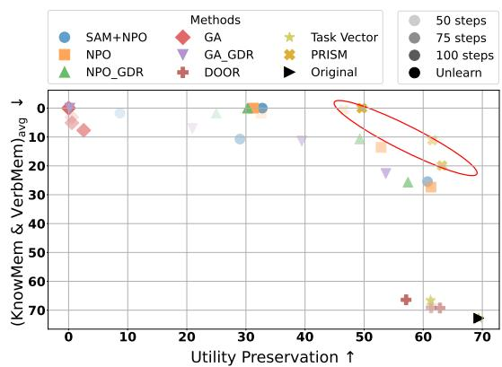

## ABSTRACT

As large language models evolve, Machine Unlearning has emerged to address growing concerns around user privacy, copyright infringement, and overall safety. Yet state-of-the-art (SOTA) unlearning methods often suffer from catastrophic forgetting and metric imbalance, for example, by over-optimizing one objective (e.g., unlearning effectiveness, utility preservation, or privacy protection) at the expense of others. In addition, small perturbations in the representation or parameter space can be exploited by relearn and jailbreak attacks. To address these challenges, we propose PRISM, a unified framework that enforces dual-space smoothness in representation and parameter spaces to improve robustness and balance unlearning metrics. PRISM consists of two smoothness optimization stages: (i) a representation space stage that employs a robustly trained probe to defend against jailbreak attacks, and (ii) a parameter-space stage that decouples retain–forget gradient conflicts, reduces imbalance, and smooths the parameter space to mitigate relearning attacks. Extensive experiments on WMDP and MUSE, across conversationaldialogue and continuous-text settings, show that PRISM outperforms SOTA baselines under multiple attacks while achieving a better balance among key metrics1.

## 1 INTRODUCTION

Large Language Models (LLMs) have demonstrated their exceptional ability across various applications (Kaur et al., 2024; Zhao et al., 2023; Song et al., 2025), yet their growing capabilities lead to increasing concerns about user privacy, copyright violations, and overall safety (Meeus et al., 2024; Yao et al., 2024a). However, given limited time and computational resources, retraining LLMs to mitigate the influence of undesired data is impractical. Thus, Machine Unlearning (MU) emerges as an alternative solution to weaken a model’s performance on undesired knowledge (Liu et al., 2024b; Eldan & Russinovich, 2023) while preserving the model’s original utility (Liu et al., 2025). Plenty of studies have sought to remove undesired data to improve the effectiveness of MU and these approaches have demonstrated substantial unlearning performance (Liu et al., 2022a; Thudi et al., 2022; Zou et al., 2024; Pawelczyk et al., 2023; Liu et al., 2024a).

Though much research shed light on MU, several recent studies indicate that MU still lacks robustness (Zhang et al., 2024c; Yuan et al., 2025; Lee et al., 2025). In particular, they are susceptible to both jailbreak attacks (Zou et al., 2023; Andriushchenko et al., 2024) and relearning attacks (Hu et al., 2024). Such limitations can be exploited through reusing unlearned knowledge (Hu et al., 2024) or prompt manipulations, including prefix injection (Andriushchenko et al., 2024) and adaptive jailbreaks (Liu et al., 2023). These attacks can disturb models’ parameters or inner representations, leading to undesired content that should have been forgotten (Fan et al., 2025; Lin et al., 2024b). Thus, when exposed to these attacks, existing methods suffer from robustness issues and trade-off between model utility and unlearning effectiveness. For example, despite the exceptional unlearning ability of negative preference optimization (NPO) (Zhang et al., 2024a), it’s still prone to relearning attacks and jailbreak attacks (Fan et al., 2025). Moreover, methods like gradient ascent (GA) (Jang et al., 2022), Dual-Objective Optimization for Refusal (DOOR) (Zhao et al., 2025) and Sharpness-Aware Minimization with NPO (Fan et al., 2025) face challenges such as catastrophic forgetting, as well as the compromises in either utility or unlearning effectiveness.

To address these limitations, we propose Probe-guided Iterative Smoothness Minimization (PRISM), a min–max optimization based unlearning framework that strengthens robustness to diverse attacks while balancing effective forgetting, utility, and stability. Inspired by sharpness-aware minimization (SAM) (Foret et al., 2020; Fan et al., 2025) and model geometry analyses under attacks (Hu et al., 2024; Lin et al., 2024b), we cast unlearning as a game where the inner maximization searches for worst-case perturbations in both the representation and parameter spaces that maximize the ‘margin’ that an attacker must breach to succeed. The outer minimization updates parameters to enforce dual-space smoothness in both the representation and parameter spaces, as illustrated in Figure 6. This process also decouples retain-forget gradient conflicts, thereby balancing key unlearning metrics while enhancing robustness to attacks. Our main contributions are as follows:

• We highlight the limitations of previous methods on unlearning metrics, including robustness issues, catastrophic forgetting and compromises in balancing among different metrics.

• We propose PRISM, which introduces dual-space smoothness into representation and parameter spaces to enhance robustness. We additionally introduce conflicts decoupling through the lens of min-max formulation, thus promoting the balance in unlearning metrics.

• Extensive experiments and ablation studies on unlearning effectiveness, utility preservation and multiple types of attacks demonstrate the robustness and balance of PRISM.

## 2 RELATED WORKS

We provide an overview of current research on machine unlearning, probe classifiers, adversarial training and smoothness optimization. A more detailed related work is deferred to Appendix: B.

Machine Unlearning for LLMs. The concept of machine unlearning (MU) originated for the purpose of data removal motivated by privacy legislation such as right to be forgotten (Rosen, 2011). Then, the idea was applied to reduce privacy threats in large amounts of data (Ginart et al., 2019; Cao & Yang, 2015). As LLMs prevail, these ideas were then extended to address LLM-specific risks, including copyright infringements, privacy and harmful content (Karamolegkou et al., 2023; Neel & Chang, 2023; Weidinger et al., 2021).

Probe and auxiliary classifiers. A probe (or auxiliary classifier) is usually a simple linear or MLP model attached to a frozen intermediate representation of a neural network. By measuring how well probe can predict linguistic or structural properties from that representation, it offers a quantitative window into what information the base model encodes internally (Liu et al., 2019; Adi et al., 2016).

Adversarial and Smoothness optimization. Adversarial training (Goodfellow et al., 2014) improves robustness as a min–max optimization over input perturbations, which has been used to solve LLMs’ vulnerabilities against various attacks (e.g. prefill attacks and adversarial prompts) Sheshadri et al. (2024). Inspired by the idea of adversarial training and penalizing sharpness (Hochreiter & Schmidhuber, 1994; 1997), SAM adapts the min–max idea to the weight space by minimizing the loss value while maximizing its smoothness (Foret et al., 2020; Liu et al., 2022b). SAM has been integrated into adversarial attacks to enhance robustness against perturbations (Wei et al., 2023) and into machine unlearning (Fan et al., 2025). Unlike existing work, we propose a unified min–max unlearning framework built on SAM while enforcing forgetting through smoothness in representation and parameter spaces, focusing on robustness and unlearning trade-off issues.

## 3 ATTACKS AND COLLAPSE IN LLM UNLEARNING

## 3.1 PRELIMINARIES ON UNLEARNING

Consider a pretrained language model $p _ { \theta _ { 0 } } ( y \mid x )$ with parameters $\theta _ { 0 }$ , trained on a dataset $D =$ $\{ ( x _ { i } , y _ { i } ) \} _ { i = 1 } ^ { n }$ , where $x _ { i }$ is an input and $y _ { i }$ is the corresponding target. The unlearning problem is cast as an optimization task that updates the model parameters from $\theta _ { 0 }$ (Eldan & Russinovich, 2023; Yao et al., 2024b; Li et al., 2024a). During unlearning, D is split into a forget set $D _ { f }$ and a retain set $D _ { r }$ r with no overlap. The set $D _ { f }$ specifies the examples whose influence should be removed from the model, while $D _ { r }$ is used to guarantee utility after unlearning. Built upon $D _ { f }$ and $D _ { r } .$ a forget loss ${ \mathcal { L } } _ { \mathrm { f } }$ and a retain loss ${ \mathcal { L } } _ { \mathrm { r } }$ are introduced to balance unlearning effectiveness and utility preservation. Then, the unlearning problem can be formulated as (Liu et al., 2025; Fan et al., 2025):

$$
\theta_ {u} = \arg \min _ {\theta} \left[ \mathcal {L} _ {\mathrm{f}} (\theta ; D _ {f}) + \gamma \mathcal {L} _ {\mathrm{r}} (\theta ; D _ {r}) \right],\tag{1}
$$

  
(a) Utility Collapse

  
(b) Utility & Effectiveness

  
(a) Relearning Attacks UE (b) Jailbreak Attack ASR

  
Figure 1: Unlearning baselines on the MUSE-Books and News Dataset: (a) Utility collapse of GA and SAM+NPO as training steps increase. (b) The trade-off of UE (unlearning effectiveness) and PP (Post-unlearning Performance) among different methods. ★ represents the steps that the method achieves their best UE.  
Figure 2: (a) Unlearning example of NPO on the MUSE-News dataset before and after multiple relearning attacks, which includes UE (unlearning effectiveness) on MUSE-News forget set and the relearned model from the unlearned one with N steps (‘RelearnN’). (b) Jailbreak Attack ASR of NPO-unlearned Llama2-7b with multiple methods on $\mathrm { W M D P _ { b i o } }$

where $\theta$ are the model parameters, $\mathcal { L } _ { ( } \theta ; \cdot )$ is the forget or retain loss under parameter θ, and $\gamma \geq 0$ is a coefficient balancing the ${ \mathcal { L } } _ { \mathrm { f } }$ and ${ \mathcal { L } } _ { \mathrm { r } }$ . The ideal target is a model that retrains on $D _ { r }$ , which is timeconsuming and computationally expensive to obtain. Thus, practical unlearning methods instead start from $p _ { \theta _ { 0 } }$ and seek a parameter update that approximates the retrained model.

## 3.2 MOTIVATION

Catastrophic Collapse and Balance between Unlearning. During the unlearning process, we observed that methods like GA (Jang et al., 2022) and NPO with SAM (NPO+SAM) (Fan et al., 2025) often exhibit a significant drop in model utility. In Figure 1a, the y-axis (utility) represents knowledge memorization measured on the MUSE-Books retain set (Shi et al., 2024). The x-axis denotes the steps of optimization updates during unlearning. As shown, GA and SAM+NPO’s utilities tend to drop to near zero after specific training steps, resulting in a rapid loss of generalization. This behavior is referred to as catastrophic collapse in Zhang et al. (2024a). In Figure 1b, we define UE as 1-Accuracy on MUSE-News evaluation set and PP as performance on retain set. The x-axis represents different methods applied to MUSE-News dataset, while the y-axis shows the corresponding performance of UE and PP. This figure indicates that some unlearning methods lack balance between forgetting strength and downstream utility. For example, DOOR (Zhao et al., 2025) and Task Vector (Ilharco et al., 2022; Liu et al., 2024c) excel at preserving PP while sacrificing UE. Conversely, methods like GA and NPO overly optimize the forget objective at the expense of PP.

Relearning Attacks and Jailbreaking Attacks. Recent work (Lin et al., 2024b) shows that, wellaligned LLMs’ inner representations of harmful and harmless prompts are geometrically separable. Successful jailbreaks can move its representations toward the harmless anchor, thereby increasing the chance of jailbreaking. Following Lin et al. (2024b), we formalize the geometric analysis by letting n be the prompt length, m the vocabulary size, and d the hidden dimension. The victim model maps a prompt $\mathbf { \bar { \boldsymbol { x } } } \in \mathbf { \bar { \mathbb { R } } } ^ { n \times \bar { m } }$ to a d-dimensional representation $f : \mathbb { R } ^ { n \times m }  \mathbb { R } ^ { d }$ , and $g : \mathbb { R } ^ { d }  \mathbb { R } ^ { 2 }$ represents the PCA transformation. Let $\mathcal { D } _ { a }$ and $\mathcal { D } _ { b }$ denote the harmless and harmful anchor prompt sets, respectively. We define the acceptance center $\begin{array} { r } { \pmb { c } _ { a } = \frac { 1 } { | \mathcal { D } _ { a } | } \sum _ { \pmb { x } \in \mathcal { D } _ { a } } g ( f ( \pmb { x } ) ) } \end{array}$ , the refusal center $\begin{array} { r } { \pmb { c } _ { b } = \frac { 1 } { | \mathcal { D } _ { b } | } \sum _ { \pmb { x } \in \mathcal { D } _ { b } } g ( f ( \pmb { x } ) ) } \end{array}$ , and the acceptance direction $\begin{array} { r } { \pmb { e } _ { a } = \frac { \pmb { c } _ { a } - \pmb { c } _ { b } } { \| \pmb { c } _ { a } - \pmb { c } _ { b } \| _ { 2 } } \in \mathbb { R } ^ { d } } \end{array}$ . Given an initial jailbreak prompt x0, the attacker maximizes the projection of the representation shift onto $\textstyle e _ { a } .$

$$
\max _ {\boldsymbol {x}} \mathcal {L} (\boldsymbol {x}) := \left\langle g (f (\boldsymbol {x})) - g (f (\boldsymbol {x} _ {0})), \boldsymbol {e} _ {a} \right\rangle ,\tag{2}
$$

Jailbreak methods can be seen as moving harmful representations toward the acceptance direction by optimizing (2). These movements increase the likelihood of producing undesired responses.

In the meantime, recent studies have also exposed critical vulnerabilities in LLM unlearning methods. In particular, relearning attacks (Hu et al., 2024) demonstrate that an adversary can recover deleted knowledge by fine-tuning the unlearned model on a tiny subset of the original forget set, effectively undoing the unlearning process. This leads to the relearning attack formulation:

$$
\min _ {\theta , \delta} \ell_ {\mathrm{relearn}} \bigl (\theta \mid \mathcal {D} _ {f} ^ {\prime} \bigr) \quad \text {s.t.} \quad \theta = \theta_ {u} + \delta , \quad \theta^ {(0)} = \theta_ {u}.\tag{3}
$$

where $\theta ^ { ( 0 ) } = \theta _ { u }$ specifies the unlearned initialization, and $\delta : = \theta - \theta _ { u }$ is the parameter-update variable introduced by relearning; $\ell _ { \mathrm { r e l e a r n } } ( \theta \mid \mathcal { D } _ { f } ^ { \prime } )$ is computed on a small subset $\mathop { \mathcal { D } _ { f } ^ { \prime } } \subset \mathop { \mathcal { D } _ { f } }$ of the original forget set and is minimized to restore the removed information.

These attacks can be further formalized as threat models in the black-box and white-box access regimes. More details on threat models are presented in Appendix H.1.

## 3.3 PILOT STUDY

Figure 2 illustrates the robustness deficiency of NPO-based methods on the $\mathbf { W M D P _ { \mathrm { b i o } } }$ dataset and the MUSE-News dataset. In Figure 2a, we define UE (Utility Effectiveness), the y-axis, as 1- Accuracy on the average of knowledge memorization and verbatim memorization on $\mathcal { D } _ { f }$ , and the x-axis as NPO Unlearned and Relearned models. In Figure 2b, the x-axis lists different jailbreak methods. The y-axis shows ASR (Attack Success Rate), defined as the percentage of model outputs labeled harmful by the LLM judge (see Appendix: I for detailed prompts). Specifically, it demonstrates that after unlearning, the method remains vulnerable to relearning and jailbreak attacks.

As shown in Figure 2a, the NPO-unlearned model, referred to as ‘Unlearn,’ demonstrates a significant improvement in UE over the original model. However, when the unlearned model is subjected to a relearning attack with a randomly sampled subset of $\mathcal { D } _ { f }$ , the unlearning effect can be reverted after more than 100 steps. Interestingly, we also observed the issue of catastrophic collapse when the method SAM+NPO is subjected to relearning attack. More details are shown in Appendix: H.3. Similarly, in WMDP scenario (Figure 2b), even after unlearning the model still generates undesired content under jailbreak attacks, consistent with prior findings (Zhao et al., 2025; Fan et al., 2025).

## 4 ENLARGING ATTACK MARGINS THROUGH SMOOTHNESS

Figure 2 highlights deficiencies in robustness and metrics balance of current unlearning methods. This inspires us to design a framework that balances unlearning features and further enhances robustness, which is illustrated in Figure 3. The implementation of PRISM is presented in Appendix: C.

## 4.1 SMOOTHNESS IN REPRESENTATION SPACE

As shown in (2), successful jailbreaks tend to move harmful prompts’ representations toward the harmless representational direction, which can be denoted as jailbreak margin. Hence, built on this geometric regularity, we seek to enlarge the margin between any harmful representation and its safe counterpart. This increases the difficulty for attacks to cross these margins, thereby enhancing robustness. To achieve this, we train a probe to discriminate between harmful and benign representations at a specific layer. We add adversarial perturbations to widen decision boundary for recognizing ‘harmful traces’ in hidden states. At a high level, integrating the robust probe into unlearning can be seen as adversarial training in representation space to enlarge the margin, where we optimize against worst-case feature perturbations. Interestingly, the idea aligns closely with SAM (Foret et al., 2020), which minimizes loss under worst-case perturbations to promote flatter minima and better generalization. However, instead of promoting generalization through smoothness for generation, our probe-guided adversarial training brings local smoothness into hidden representations, enlarges jailbreak margin and improves robustness.

Robust probe as a smoothness driver. Let $f _ { \theta }$ denote the LLM with parameters $\theta$ and $f _ { \theta _ { 0 } }$ as the frozen base model. We select a certain layer $L$ and a pooling operator π to obtain the layer-L representation z(x) with inputs x and outputs fθ (x) ∈ {0 =harmless, 1 =undesired}:

$$
z (x) := h _ {\theta_ {0}, L} (x) \in \mathbb {R} ^ {d} := \pi (\text { hidden\_states } ^ {(L)} (x)).\tag{4}
$$

We first use $z ( x )$ to train a probe $p _ { \phi }$ with parameters $\phi ,$ which classifies and outputs class probabilities. To endow the probe with local robustness to jailbreak drifts and reduce loss sensitivity around $z ,$ , we further train it on a mixture of clean and adversarially perturbed features in the representation space. For each forget/retain pair $( x _ { i } , y _ { i } )$ , we compute the feature-space gradient of the per-example loss at the clean feature $z ( x _ { i } )$ , denoted as $g ( x _ { i } ; \phi )$ . We then construct an adversarially perturbed representation $z _ { i } ^ { \mathrm { a d v } }$ for each example by solving a linearized inner maximization over an $\ell _ { \infty }$ ball of radius $\varepsilon > 0$ , inspired by Goodfellow et al. (2014):

  
Figure 3: Workflow of PRISM. After constructing the Forget and Retain datasets, Step 1 adversarially trains a probe on the hidden states of a given base model. In Step 2, guided by the robust probe and loss gradient, we perturb gradients toward flatter regions while decoupling conflicts between retain and forget gradients. Step 3 updates the model parameters accordingly.

$$
\delta_ {i} ^ {\star} \in \arg \max _ {\| \delta \| _ {\infty} \leq \varepsilon} g (x _ {i}; \phi) ^ {\top} \delta , \quad z _ {i} ^ {\mathrm{adv}} = z (x _ {i}) + \delta_ {i} ^ {\star}.\tag{5}
$$

Here $\| \delta \| _ { \infty } = \operatorname* { m a x } _ { 1 \leq j \leq d } | \delta _ { j } |$ is the $\ell _ { \infty }$ norm, defined as the maximum absolute coordinate. This formulation aligns with the perturbation strategy introduced in (Goodfellow et al., 2014). A closedform solution to $( 5 )$ is attained at vertices of the feasible set $( \ell _ { \infty }$ ball), which maximizes linearized loss within budget ε and thus serves as the first-order worst-case perturbation. See Appendix: D.1 for details. Consequently, the adversarially perturbed representation can be expressed as:

$$
z _ {i} ^ {\mathrm{adv}} = z (x _ {i}) + \underbrace {\varepsilon \operatorname{sign} \bigl (g (x _ {i} ; \phi) \bigr)} _ {\delta_ {i} ^ {\star}}.\tag{6}
$$

Using this linearized adversary avoids costly inner maximization and enlarges the decision boundary with low overhead, mirroring SAM’s first-order local worst-case optimization (Foret et al., 2020). After convergence, we denote the adversarially trained probe by $p _ { \phi ^ { \star } }$ . Training the probe on both $z ( x _ { i } )$ and $z _ { i } ^ { \mathrm { a d v } }$ encourages prediction consistency in this neighborhood and enhances the probe’s robustness against jailbreaks around $z ( x _ { i } )$ , making small drifts less able to evade detection.

Probe-guided forgetting. During unlearning, model parameters θ are updated while keeping the adversarially trained probe $p _ { \phi ^ { \star } }$ ⋆ frozen. Recall that, after worst-case feature perturbation training, $p _ { \phi ^ { \star } }$ has a wider local decision boundary around z and its loss acts as a first-order robust surrogate in the representation space. Based on $\operatorname { E q . } ( 4 )$ , we extract the representation for each forget example $x \in \mathcal { D } _ { f }$ . Instead of adversarially attacking the probe, we optimize the model parameters θ to satisfy the robust probe $p _ { \phi ^ { \star } }$ . Specifically, we enforce the label of each forget representation $h _ { \theta , L } ( x )$ to be the harmless class $y = 0$ . This process pushes $h _ { \theta , L } ( x )$ away from the decision boundary and deep into the probe’s harmless region. The probe is adversarially trained to maintain a smooth and wide boundary. Consequently, aligning representations with this robust safe region increases the distance attacks must cross, effectively enlarging the jailbreak margin. Concretely, we use the negative loglikelihood of the harmless class:

$$
\mathcal {L} _ {\text { probe }} (\theta ; x) = - \log p _ {\phi^ {*}} \big (y = 0 \mid h _ {\theta , L} (x) \big).\tag{7}
$$

While minimizing Eq.(7), its gradient turns into:

$$
\nabla_ {\theta} \mathcal {L} _ {\mathrm{probe}} (\theta ; x) = \Big (\frac {\partial h _ {\theta , L} (x)}{\partial \theta} \Big) ^ {\top} \nabla_ {h} \Big [ - \log p _ {\phi^ {*}} (0 \mid h) \Big ] \Big | _ {h = h _ {\theta , L} (x)} = J _ {\theta} (x) ^ {\top}   g _ {h} (x; \theta),\tag{8}
$$

where $g _ { h } ( x ; \theta )$ is the steepest-ascent direction w.r.t. the representation and $\begin{array} { r } { J _ { \theta } ( x ) : = \frac { \partial h _ { \theta , L } ( x ) } { \partial \theta } } \end{array}$ maps representation-space signals into parameter updates. With $p _ { \phi } ,$ ⋆ locally robust to worst-case feature perturbations, minimizing Eq.(7) moves $h _ { \theta , L } ( x )$ toward the harmless region, so the forget representation increasingly aligns with the harmless class. Under softmax cross-entropy, the gradient magnitude shrinks as this confidence grows; in particular, $g _ { h } ( x ; \theta )$ decreases toward 0. A small $\| g _ { h } ( x ; \theta ) \|$ indicates the probe loss changes little under small perturbations of the representation around $h _ { \theta , L } ( x )$ , which promotes local smoothness in the representation space. In the geometry of $\operatorname { E q . } ( 2 )$ , the minimal perturbation required to enter the acceptance region increases, thereby enlarging the model’s jailbreak margin and improving robustness to jailbreak attacks.

## 4.2 SMOOTHNESS IN PARAMETER SPACE

As formulated in (3), a relearning attack starts at unlearned model $\theta _ { u }$ and applies small-step updates on a subset $\mathcal { D } _ { f } ^ { \prime }$ . An attack is successful when updated model outputs the undesired behavior. We define the relearn margin as the minimal parameter change from $\theta _ { u }$ needed for a successful attack. Motivated by Foret et al. (2020); Fan et al. (2025), we enlarge the relearn margin by flattening the forget objective around the current iterate to introduce smoothness into parameter space and enhance robustness against relearning attacks. Built on (7), we optimize the forget-side objective:

$$
\min _ {\theta} \Big [ \max _ {\| \delta \| _ {2} \leq \rho} \ell_ {\mathrm{f}} (\theta + \delta) \Big ], \qquad \ell_ {\mathrm{f}} (\theta) = \lambda   \mathcal {L} _ {\text { probe }} (\theta ; \mathcal {D} _ {\mathrm{f}}) + \mathcal {L} _ {\text { gen }} (\theta ; \mathcal {D} _ {\mathrm{f}}, \theta_ {\text { ref }}).\tag{9}
$$

where $\mathcal { L } _ { \mathrm { g e n } }$ downweights preferences on $D _ { f }$ with the reference model $\theta _ { \mathrm { r e f } }$ (Zhang et al., 2024a). $\lVert \delta \rVert _ { 2 }$ denotes the $\ell _ { 2 }$ norm, and λ balances two losses. We constrain the inner adversary to an $\ell _ { 2 }$ ball of radius $\rho > 0$ , so that perturbations are bounded, limiting their impact on θ (Madry et al., 2017).

Given (9), define $\mathcal { L } _ { \mathrm { f } } ^ { \mathrm { S M } } ( \theta ) : = \ell _ { \mathrm { f } } \left( \theta + \delta ( \theta ) \right)$ and $g ( \theta ) : = \nabla _ { \theta } \ell _ { \mathrm { f } } ( \theta )$ . Using a first-order linear approximation for the inner maximization (Fan et al., 2025; Dauphin et al., 2024), whose maximizer has a closed-form solution, we obtain:

$$
\begin{array}{r l} & {\mathcal {L} _ {\mathrm{f}} ^ {\mathrm{SM}} (\theta) \approx \ell_ {\mathrm{f}} \Big (\theta + \arg \max _ {\| \delta \| _ {2} \leq \rho} \big [ \ell_ {\mathrm{f}} (\theta) + \delta^ {\top} g (\theta) \big ] \Big)} \\ & {\qquad = \ell_ {\mathrm{f}} \Big (\theta + \arg \max _ {\| \delta \| _ {2} \leq \rho} \delta^ {\top} g (\theta) \Big) = \ell_ {\mathrm{f}} \Big (\theta + \rho \frac {g (\theta)}{\| g (\theta) \| _ {2}} \Big)} \\ & {\qquad \approx \ell_ {\mathrm{f}} (\theta) + \rho \left\langle \frac {g (\theta)}{\| g (\theta) \| _ {2}}, g (\theta) \right\rangle = \ell_ {\mathrm{f}} (\theta) + \rho \| g (\theta) \| _ {2}.} \end{array}\tag{10}
$$

A line-by-line derivation is provided in Appendix: D.2. This extra term $\rho \| g ( \theta ) \| _ { 2 }$ penalizes large parameter-space gradients, which smooths the loss surface and lowers local curvature around θ. In this regime, small steps from an attacker only slightly change the objective, so it must move much farther in parameter space to succeed. This increases the relearn margin by promoting smoothness in parameter space and thus improves robustness to relearning attacks.

While PRISM promotes smoothness in both representation and parameter spaces, the loss surface can be excessively flattened or the forgetting objective over-weighted. Specifically, an over-weighted objective risks removing features shared with the retain set, thereby inducing catastrophic forgetting. Motivated by Lin et al. (2024a), we impose first-order safety by orthogonalizing the forget gradient $g _ { \mathrm { f } } : = \nabla _ { \boldsymbol { \theta } } \mathcal { L } _ { \mathrm { f } } ^ { \mathrm { \tilde { S } M } } ( { \boldsymbol { \theta } } )$ against the retain gradient $g _ { \mathrm { r } } : = \nabla _ { \theta } \mathcal { L } _ { \mathrm { r e t } } ( \theta )$ within standard gradient descent, building on (10). Then we define the forget projection operators $\begin{array} { r } { \mathbf { P } _ { \mathrm { r } } = \frac { g _ { \mathrm { r } } g _ { \mathrm { r } } ^ { \top } } { \Vert g _ { \mathrm { r } } \Vert _ { 2 } ^ { 2 } } } \end{array}$ and retain projection operators ${ \bf P } _ { \mathrm { r } } ^ { \perp } = { \bf I } - { \bf P } _ { \mathrm { r } }$ , and restrict the forget-side direction to the orthogonal complement of $g _ { \mathrm { r } }$ :

$$
g _ {\mathrm{f}} ^ {\perp} = g _ {\mathrm{f}} - \frac {\left\langle g _ {\mathrm{f}} , g _ {\mathrm{r}} \right\rangle}{\left\| g _ {\mathrm{r}} \right\| _ {2} ^ {2}} g _ {\mathrm{r}} = \mathbf {P} _ {\mathrm{r}} ^ {\perp} g _ {\mathrm{f}}.\tag{11}
$$

We seek a direction that is orthogonal to $g _ { \mathrm { r } }$ while staying as close as possible to the original $g _ { \mathrm { f } }$ removing only the component of $g _ { \mathrm { f } }$ that conflicts with the retain gradient. In a linearized sense, as noted in Appendix: $\mathbf { D } . { \bar { 3 } } ,$ the retain loss does not increase locally, which provides first-order safety and helps mitigate catastrophic collapse. As Zhang et al. (2024a) noted, the pattern of catastrophic collapse can be unavoidable as unlearning aims to undo earlier optimization; the orthogonalized update reduces such adverse effects in the neighborhood of the current iterate.

## 5 EXPERIMENTS

To evaluate the efficacy and robustness of our proposed PRISM framework, we aim to answer several key research questions throughout the experiments: (1) How does PRISM perform on standard unlearning and utility metrics compared to established baselines? (2) How robust is PRISM against various attacks including relearning attacks and jailbreak attacks? (3) What is the impact of parameters and each component on robustness and on the model’s performance in unlearning and utility? (4) Can PRISM effectively balance the trade-off between unlearning and utility?

## 5.1 EXPERIMENT SETUPS

Training Data. Our training dataset is used to train the adversarial probe and the unlearned model. The dataset includes Forget set and Retain set. To simulate two unlearning scenarios, one with fully accessible data and one with non-exhaustive data, we organize the datasets in two formats: conversational dialogues and continuous text. For conversational dialogues, the forget set is composed of questions randomly sample from the paraphrased WMDP benchmarks (Li et al., 2024a), SORRY-Bench (Xie et al., 2024) and HEx-PHI (Qi et al., 2023). The retain data is generated by unlearned model with WMDP queries, with subsequent manual verification. Then we randomly sampled conversations from the cleaned Alpaca dataset (Taori et al., 2023) as a supplement. For continuous text, we follow the setup from MUSE, using the text from the Harry Potter book series (labeled ‘Books’) and news articles from BBC News (labeled ‘News’) as the forget set and domain-specific knowledge that held out as the retain set. More training data details are provided in Appendix: G.2 and G.3.

Evaluation Data. We first use a held-out subset of answer pairs from MUSE and WMDP to test the performance of our probe’s ability to detect forget and retain content. For unlearned models, we evaluate model performances through two indicators - Unlearning Effectiveness (UE) and Post-unlearning Performances (PP). For conversational dialogues, UE and PP are evaluated via lmevaluation (Gao et al., 2024), incorporating $\mathbf { W M D P _ { \mathrm { b i o } } }$ (Li et al., 2024a), MMLU (Hendrycks et al., 2020) and HellaSwag (Zellers et al., 2019). For continuous text, following the literature, UE is tested through knowledge memorization (KnowMem) and verbatim memorization (VerbMem) on the forget set, where better UE is indicated by lower values. PP is calculated using KnowMem on the retain set and PrivLeak, which detects whether model is leaking membership information.

Next, the robustness of the unlearned model is assessed through: (1) Jailbreak attacks include prefillbased attacks (Andriushchenko et al., 2024), AutoDAN (Liu et al., 2023) and Multi-turn adversarial dialogue (Russinovich et al., 2024). We use Attack Success Rate (ASR) to measure the percentage of undesired instructions that model produces. (2) Relearning attack uses data randomly sampled from the forget set, under different step counts and sample sizes of 100, 200, and 400. Additional evaluation data and metrics’ information can be found in Appendix: G.2.1, G.3.1 and H.2.

Baselines and Models. We benchmark our method PRISM against established unlearning approaches, including Gradient Ascent (GA) (Jang et al., 2022), Task Vector (Ilharco et al., 2022), Negative Preference Optimization (NPO) (Zhang et al., 2024a), Representation Misdirection for Unlearning (RMU) (Li et al., 2024a), RMU with Latent Adversarial Training (RMU-LAT) Sheshadri et al. (2024), Dual-Objective Optimization for Refusal (DOOR) (Zhao et al., 2025) and Sharpnessaware minimization (SAM) based on NPO (Fan et al., 2025). Furthermore, we integrate a Gradient Descent on the Retain Set (GDR) regularizer (Maini et al., 2024; Zhang et al., 2024a) into NPO and GA. Based on the setting in the literature, we use Llama-2-7B (Touvron et al., 2023) and Ministral-8B-Instruct-2410 (Jiang et al., 2023) as our base models for WMDP, and LLaMA-2 7B finetuned on BBC news as well as ICLM 7B finetuned on Harry Potter books on MUSE. More details on baselines and probe training setups are presented in Appendix: E.

## 5.2 MAIN RESULTS

Q1 How does PRISM perform on various unlearning metrics compared with baselines?

Unlearning Effectiveness. To comprehensively evaluate unlearning performance from multiple perspectives, including post-unlearning utility, unlearning effectiveness and privacy protection, we normalized each metric and then combined them via the geometric mean to compute an Unlearn Score (US) on two datasets. The detailed raw results and normalization procedure are provided in the Appendix: F. As shown in the Table 1, despite higher per-step overhead, PRISM delivers the highest Unlearn Score on MUSE-News, MUSE-Books and WMDP datasets, indicating a superior balance across various dimensions. Compared to the primary baseline, SAM+NPO’s performance on the MUSE-News (0.000), PRISM significantly outperforms with the Unlearn Score of 0.522. The underlying reason is SAM+NPO’s poor performance on privacy protection across all baselines, which highlights its susceptibility to membership information leakage. Several methods also report zero US: this largely stems from the imbalance in one of the evaluation metrics. For example, vanilla NPO in the MUSE-News setup and GA in all setups suffer from catastrophic forgetting. Their parameters are severely disrupted even with few epochs of unlearning, which leads to collapse in utility. In the meantime, Task Vector shows negligible unlearning effectiveness in all setups, which drives its overall score to zero despite low computational cost. To assess the runtime impact of each component in PRISM, we also conduct a runtime ablation study in Appendix F.9.

Table 1: Unlearn Scores on MUSE-Books, MUSE-News, WMDP and Wall-clock time required for each step, measured in seconds per step on MUSE-Books dataset. ↓ indicates lower is better, ↑ indicates higher is better. Note that the Unlearn Score on the WMDP benchmark includes results from two base models: Llama-2 7B and Mistral-8B-Instruct-2410, respectively. Red text indicates the best and blue text indicates the runner-up, respectively.

<table><tr><td>Method</td><td>Unlearn Score on MUSE-Books ↑</td><td>Unlearn Score on MUSE-News ↑</td><td>Unlearn Score on WMDP ↑</td><td>Time per step (second) ↓</td></tr><tr><td>SAM+NPO</td><td>0.748</td><td>0.000</td><td>0.443/0.721</td><td>11.055</td></tr><tr><td>NPO</td><td>0.717</td><td>0.000</td><td>0.322/0.055</td><td>6.475</td></tr><tr><td> $NPO_{GDR}$ </td><td>0.708</td><td>0.076</td><td>0.519/0.556</td><td>7.733</td></tr><tr><td>GA</td><td>0.000</td><td>0.000</td><td>0.000/0.000</td><td>4.348</td></tr><tr><td> $GA_{GDR}$ </td><td>0.144</td><td>0.051</td><td>0.469/0.528</td><td>6.625</td></tr><tr><td>DOOR</td><td>0.169</td><td>0.180</td><td>0.479/0.289</td><td>3.751</td></tr><tr><td>Task Vector</td><td>0.000</td><td>0.000</td><td>0.000/0.000</td><td>3.885</td></tr><tr><td>PRISM</td><td>0.860</td><td>0.522</td><td>0.521/0.761</td><td>11.223</td></tr></table>

Table 2: Unlearning robustness of different methods on MUSE-Books under relearning attacks with varying attack steps. Red text indicates the best and blue text indicates the runner-up, respectively. ↓ indicates lower is better, ↑ indicates higher is better.

<table><tr><td rowspan="2">Method</td><td rowspan="2">Unlearn Score ↑</td><td colspan="3">50 steps</td><td colspan="3">75 steps</td><td colspan="3">100 steps</td></tr><tr><td>VerbMem ↓</td><td>KnowMem ↓</td><td>Utility ↑</td><td>VerbMem ↓</td><td>KnowMem ↓</td><td>Utility ↑</td><td>VerbMem ↓</td><td>KnowMem ↓</td><td>Utility ↑</td></tr><tr><td>SAM+NPO</td><td>0.748</td><td>3.458</td><td>0.000</td><td>8.685</td><td>8.167</td><td>13.264</td><td>29</td><td>15.552</td><td>35.384</td><td>60.738</td></tr><tr><td>NPO</td><td>0.717</td><td>3.231</td><td>0.333</td><td>32.568</td><td>10.695</td><td>16.525</td><td>52.873</td><td>20.595</td><td>34.126</td><td>61.300</td></tr><tr><td> $NPO_{GDR}$ </td><td>0.708</td><td>3.499</td><td>0.000</td><td>24.973</td><td>7.030</td><td>14.305</td><td>49.285</td><td>17.556</td><td>33.750</td><td>57.421</td></tr><tr><td>GA</td><td>0.000</td><td>5.361</td><td>0.915</td><td>0.542</td><td>10.143</td><td>0.051</td><td>0.571</td><td>13.266</td><td>2.109</td><td>2.555</td></tr><tr><td> $GAGDR$ </td><td>0.144</td><td>11.497</td><td>2.673</td><td>20.940</td><td>12.396</td><td>10.393</td><td>39.460</td><td>17.264</td><td>28.019</td><td>53.673</td></tr><tr><td>DOOR</td><td>0.169</td><td>99.701</td><td>36.908</td><td>61.398</td><td>99.702</td><td>38.734</td><td>61.331</td><td>99.702</td><td>38.798</td><td>62.830</td></tr><tr><td>Task Vector</td><td>0.000</td><td>99.236</td><td>33.507</td><td>61.247</td><td>99.169</td><td>33.580</td><td>61.247</td><td>99.168</td><td>34.343</td><td>61.247</td></tr><tr><td>PRISM</td><td>0.860</td><td>0.746</td><td>0.292</td><td>46.588</td><td>5.405</td><td>16.823</td><td>61.560</td><td>6.804</td><td>33.045</td><td>63.181</td></tr></table>

## Q2 In the presence ofrelearning andjailbreak attacks, how robust is PRISM?

Robustness against relearning attacks. In Table 2, we compare PRISM against other unlearning baselines in terms of unlearning effectiveness and robustness to relearning attacks. Unlearning effectiveness is measured by VerbMem and KnowMem on $D _ { f }$ , while utility preservation is assessed via KnowMem on $D _ { r } .$ As shown in the table, PRISM achieves the highest Unlearn Score, and under relearning attacks of 50, 75, and 100 steps, its VerbMem and Utility metrics consistently outperform all other methods, demonstrating its robustness against relearning attacks and ability to preserve unrelated knowledge. Notably, at 75 and 100 steps, PRISM achieves lower KnowMem scores than GA and $\operatorname { G A } _ { \mathrm { G D R } }$ . This discrepancy can be attributed to both methods’ catastrophic forgetting. Their parameters are too perturbed during unlearning to produce any coherent outputs after relearning attacks, so this leads to lower knowledge memorization. As shown in Table $\mathbf { 1 6 , }$ we further enhance the comparison by including RMU and RMU-LAT. RMU suffers utility collapse after unlearning, while RMU-LAT, with similar runtime per step, still underperforms PRISM. Further results on the relearning attack on MUSE-News are provided in Appendix: F.5.

Robustness against jailbreak attacks. Next, we evaluate a representative set of jailbreak methods, including Prefill Attacks, AutoDAN and Multi-turn Attacks, as summarized in Table 3. These attack strategies target the model at the representation level, parameter level, and input level. Our approach achieves the highest unlearning score (0.521) while simultaneously exhibiting the lowest attack success rates across all evaluated attacks, demonstrating resistance to jailbreak exploits. In detail, $\mathrm { N P O } _ { \mathrm { G D R } }$ is competitive with PRISM on the Unlearn Score, but this comes at the expense of robustness across multiple attack types. GA likewise attains strong robustness, but it achieves this by sacrificing model utility. We further validate PRISM’s robustness on the Ministral-8B-Instruct-2410 model with consistent results reported in Appendix: F.6. We notice that PRISM, like SAM + NPO, achieves a comparatively high X-Stest Refusal Rate. We attribute this in part to both methods drawing on standard NPO, which penalizes the model when its probability on forget examples exceeds a harmless target. When applied too strongly, it can suppress nearby benign content. In contrast, compared to PRISM, gradient-based retention-set optimization methods (e.g. $\operatorname { G A } _ { \mathrm { G D R } }$ and $\mathrm { N P O } _ { \mathrm { G D R } } )$ achieve lower X-Stest refusal rates at the expense of increased attack success rates, indicating a trade-off between refusal performance and jailbreak robustness.

Table 3: Overall Jailbreak Attack Success Rate (ASR) on different jailbreak attack methods and the Unlearn Score indicating unlearning performance on $\mathrm { W M D P _ { b i o } }$ datasets. Red text indicates the best and blue text indicates the runner-up, respectively. ↓ indicates lower is better, ↑ indicates higher is better. Prefill Attacks include prefilling that is 15/20 tokens long.

<table><tr><td>Method</td><td>Unlearn Score ↑</td><td>Multi-turn ASR ↓</td><td>Prefilling ASR ↓</td><td>AutoDAN ASR ↓</td><td>XStest Refusal Rate ↓</td></tr><tr><td>Original</td><td>-</td><td>0.242</td><td>0.382/0.386</td><td>0.178</td><td>0.878</td></tr><tr><td>SAM + NPO</td><td>0.443</td><td>0.241</td><td>0.325/0.307</td><td>0.006</td><td>1.000</td></tr><tr><td>GA</td><td>0.000</td><td>0.205</td><td>0.300/0.289</td><td>0.008</td><td>0.973</td></tr><tr><td> $\text{GA}_{\text{GDR}}$ </td><td>0.469</td><td>0.210</td><td>0.364/0.346</td><td>0.102</td><td>0.880</td></tr><tr><td>NPO</td><td>0.322</td><td>0.219</td><td>0.319/0.295</td><td>0.000</td><td>1.000</td></tr><tr><td> $\text{NPO}_{\text{GDR}}$ </td><td>0.519</td><td>0.326</td><td>0.400/0.404</td><td>0.102</td><td>0.956</td></tr><tr><td>DOOR</td><td>0.479</td><td>0.188</td><td>0.357/0.350</td><td>0.236</td><td>0.936</td></tr><tr><td>Task Vector</td><td>0.000</td><td>0.397</td><td>0.386/0.407</td><td>0.076</td><td>0.996</td></tr><tr><td>PRISM</td><td>0.521</td><td>0.196</td><td>0.293/0.279</td><td>0.000</td><td>1.000</td></tr></table>

## 6 DISCUSSIONS

## 6.1 ADDITIONAL STUDIES ON ATTACKS AND MARGINS

To further answer $\mathbf { Q } 2 .$ we conduct relearning attacks with sample sizes of 100 and 200 drawn from $D _ { f } ,$ which we refer to as RELEARN-25% and RELEARN-50%, respectively. As shown in Table 4, RMU suffers from a severe utility collapse on $D _ { r }$ after unlearning, which we attribute to adding random perturbations to chosen hidden states. When we apply RELEARN-25% attacks, the vulnerability of the RMU family becomes evident. With only 50 steps and 100 samples, RMU families’ unlearning effectiveness is almost completely reversed, indicating that the random hidden-state perturbations are easily exploited by the relearning margin and quickly overwritten. By contrast, PRISM keeps both VERBMEM and KNOWMEM close to zero under RELEARN-25% at 50 steps, while retaining strong utility on $D _ { r }$ compared to the baselines. PRISM also outperforms all baselines under RELEARN-50%, with the results reported in Appendix: F.12. These results demonstrate that PRISM maintains strong robustness and favorable balance across different relearning attack setups.

Table 4: Relearn 25% performance. ↓ indicates lower is better, ↑ indicates higher is better.

<table><tr><td rowspan="2">Method</td><td colspan="3">Unlearn</td><td colspan="3">50 steps</td><td colspan="3">100 steps</td></tr><tr><td>No VerbMem ↓</td><td>No KnowMem ↓</td><td>Utility Preserv ↑</td><td>No VerbMem ↓</td><td>No KnowMem ↓</td><td>Utility Preserv ↑</td><td>No VerbMem ↓</td><td>No KnowMem ↓</td><td>Utility Preserv ↑</td></tr><tr><td> $NPO_{GDR}$ </td><td>0.000</td><td>0.000</td><td>30.291</td><td>2.98</td><td>0.000</td><td>6.036</td><td>17.506</td><td>32.258</td><td>59.559</td></tr><tr><td>SAM+NPO</td><td>0.000</td><td>0.000</td><td>32.766</td><td>2.948</td><td>0.000</td><td>18.392</td><td>17.424</td><td>33.611</td><td>61.666</td></tr><tr><td>RMU</td><td>0.41</td><td>10.866</td><td>14.914</td><td>91.875</td><td>47.769</td><td>66.435</td><td>97.029</td><td>53.228</td><td>65.927</td></tr><tr><td>RMU-LAT</td><td>0.979</td><td>5.983</td><td>46.412</td><td>93.87</td><td>49.307</td><td>72.124</td><td>98.425</td><td>47.526</td><td>71.166</td></tr><tr><td>PRISM</td><td>0.000</td><td>0.000</td><td>49.616</td><td>0.082</td><td>0.000</td><td>38.854</td><td>13.313</td><td>37.507</td><td>61.754</td></tr></table>

To quantify how PRISM widens representation margins after unlearning, we adopt a margin experiment on subsets of $D _ { f }$ in MUSE-Books. For unlearned model, we extract layer-L representations of the forget examples and feed them into the probe trained to separate harmless from harmful behaviors. We then compute the signed distance of each representation to the probe’s decision hyperplane. From Table 17, PRISM yields wider margins than the original model, with a median margin increase of 24.9% and a 10%-quantile margin about 4.1× larger, and it also outperforms SAM+NPO on both metrics. This shows that PRISM enlarges the representation-space margin and lifts the low-margin tail, which clarifies how our representation-space smoothness contributes to overall robustness. More details of this experiments are discussed in Appendix: F.11.

## 6.2 ABLATION AND PARAMETER STUDIES

## Q3 How do PRISM’s components and parameters affect robustness, effectiveness and utility? Q3 How do PRISM's components and parameters affect robustness, effectiveness and utility?

To answer Q3, we conducted a parameter study on the smoothness-optimization hyperparameters, a probe layer study on selecting layers to apply representation-space smoothness, and an ablation study on different components of PRISM. We show that PRISM maintains a balanced trade-off between unlearning and robustness to attacks through smoothness in RS and PS. To quantify each space’s contribution, we perform an ablation study that removes each module in turn and, separately, disables the GCD techniques. We adhere to the experimental setup and hyperparameters used for the MUSE-Books dataset; see the Appendix: E.2 for details. The results are shown in Table 5. Removing PS significantly increases VERBMEM on $D _ { f }$ under relearning attacks, with the largest rise at 100 steps. Removing RS likewise reduces robustness under relearning attacks, further indicating that both smoothness components are crucial for robustness. Removing GCD triggers a clear utility collapse on $D _ { r }$ , already severe at 50 steps and rendering the model unusable. Building on this, removing RS further reduces Utility on $D _ { r }$ even without attacks, and under attacks this variant exhibits the worst VERBMEM among all ablations. Thus, all components are necessary to balance forgetting effectiveness, utility preservation and robustness. Parameter Study and Probe Layer Study are presented in Appendix: F.7, Appendix: F.8.

Table 5: Ablation Study on PRISM’s components on MUSE-Books: removal of representation space (RS) smoothing, parameter space (PS) smoothing, and gradient-conflict decoupling (GCD).

<table><tr><td rowspan="2"></td><td colspan="3">W/o Relearning Attacks</td><td colspan="3">50 steps</td><td colspan="3">100 steps</td></tr><tr><td>VerbMem on  $D_f$  ↓</td><td>KnowMem on  $D_f$  ↓</td><td>Utility on  $D_r$  ↑</td><td>VerbMem on  $D_f$  ↓</td><td>KnowMem on  $D_f$  ↓</td><td>Utility on  $D_r$  ↑</td><td>VerbMem on  $D_f$  ↓</td><td>KnowMem on  $D_f$  ↓</td><td>Utility on  $D_r$  ↑</td></tr><tr><td>PRISM</td><td>0.000</td><td>0.000</td><td>49.616</td><td>0.746</td><td>0.292</td><td>46.588</td><td>6.804</td><td>33.045</td><td>63.181</td></tr><tr><td>PRISM w/o RS</td><td>0.000</td><td>0.000</td><td>36.467</td><td>1.216</td><td>0.000</td><td>24.412</td><td>11.112</td><td>41.012</td><td>62.501</td></tr><tr><td>PRISM w/o PS</td><td>0.000</td><td>0.000</td><td>45.615</td><td>4.356</td><td>0.000</td><td>13.506</td><td>16.664</td><td>32.291</td><td>60.518</td></tr><tr><td>PRISM w/o GCD</td><td>0.000</td><td>0.000</td><td>32.571</td><td>4.721</td><td>0.786</td><td>1.333</td><td>15.695</td><td>29.100</td><td>58.362</td></tr><tr><td>PRISM w/o RS &amp; GCD</td><td>0.000</td><td>0.000</td><td>30.458</td><td>6.017</td><td>0.000</td><td>21.518</td><td>17.698</td><td>32.585</td><td>60.309</td></tr></table>

## 6.3 UNLEARNING V.S. UTILITY

## Q4 Is PRISM capable of striking a favorable trade-off between unlearning and utility?

Lastly, balancing trade-off among effective unlearning, model utility and robustness has long been a fundamental challenge in unlearning research. To answer Q4 on unlearning balance of metrics, we visualize the unlearned model’s utility and its forgetting performance on $D _ { f }$ in Figure 4. Following a similar evaluation setup on the MUSE-Books and relearning attacks, we treat model’s memory on $D _ { f }$ as Utility Preservation, and define Unlearning Effectiveness as the average of KNOWMEM and VERBMEM. A method that achieves better balance between these two dimensions will be positioned closer to the top-right region of the plot.

From the figure, we observe that PRISM maintains a robust balance between unlearning effectiveness and model utility with and without relearning attacks. For example, after being unlearned by PRISM, the model attains a comparable reduction on $D _ { f }$ while preserving the highest utility on $D _ { r }$ . Similarly, under a 50-

Figure 4: The overall trade-off between unlearning effectiveness (the average of KnowMem and VerbMem) and model utility across all baselines and different relearning attack steps on MUSE-Books. ↓ indicates lower is better, ↑ indicates higher is better.

step relearning attack, both $\mathrm { N P O } _ { \mathrm { G D R } }$ and SAM+NPO suffer catastrophic collapse, with the latter experiencing the most severe drop of 24.081%. The utility of GA remains unsatisfactory, and the unlearning effectiveness of DOOR and Task Vector is also suboptimal. In contrast, only PRISM demonstrates a well-rounded performance across both forgetting and retention objectives.

## 7 CONCLUSION

In this work, we propose PRISM, a unified smoothness-driven minimax framework that performs unlearning in both the representation and parameter spaces, reducing susceptibility to relearning and jailbreak attacks and improving balance among key metrics. Our normalized unlearning analysis reveals that mainstream approaches inevitably exhibit trade-offs across unlearning metrics, shortcomings in stability, or weaknesses in robustness. Extensive experiments confirm that PRISM significantly improves the balance among unlearning effectiveness, privacy protection, and utility, while also strengthening robustness to relearning and multiple jailbreak attacks.