## ABSTRACT

Transformer decoders have achieved strong results across tasks, but the memory required for the KV cache becomes prohibitive at long sequence lengths. Although Cross-layer KV Cache sharing (e.g., YOCO, CLA) offers a path to mitigate KV Cache bottleneck, it typically underperforms within-layer methods like GQA. To understand the root cause, we investigate the information flow of keys and values of the top-layers. Our preliminary reveals a clear distribution: values are predominantly derived from the bottom layer, while keys draw more information from both bottom and middle layers. Building upon this, we propose FusedKV, whose top-layer KV caches are a learnable fusion of the most informative ones from the bottom and middle layers. This fusion operates directly on post-RoPE keys, preserving relative positional information without the computational cost of re-applying rotary embeddings. To further improve efficiency, we propose FusedKV-Lite, an cross-layer sharing approach, where top-layer KV caches are directly derived from the bottom-layer values and the middle-layer keys. Compared to FusedKV, FusedKV-Lite reduces I/O overhead at the cost of a slight increase in perplexity. In experiments on LLMs ranging from 332M to 4B parameters, our proposed method reduce 50% cache memory while achieving lower validation perplexity than the standard Transformer decoder, establishing it as a memory-efficient, high-performance architectural alternative. We have made our code available $^{1}$ .

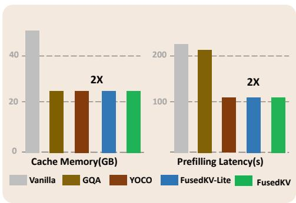

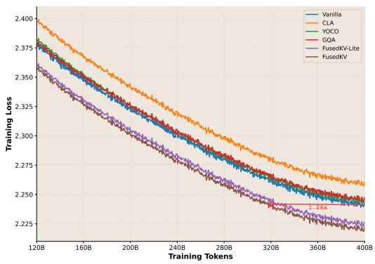  
Figure 1: FusedKV and FusedKV-Lite reduce KV cache and prefilling latency by 2x (left) while also achieving superior pretraining loss on a 1.5B model compared to other methods (right). FusedKV converge around 1.26x faster than Vanilla.

## 1 INTRODUCTION

Large language models (LLMs) based on the Transformer (Vaswani et al., 2017) decoder have achieved unprecedented success across a wide range of tasks and applications. However, practical deployment for real-world applications requires LLM inference to achieve low latency and high throughput (Hu et al., 2024; Ge et al., 2024; Dao et al., 2022). This becomes particularly challenging with increasingly long contexts, primarily due to the linear memory overhead of the key-value (KV) caches in autoregressive generation (Liu et al., 2024b; Adnan et al., 2024; Li et al., 2024).

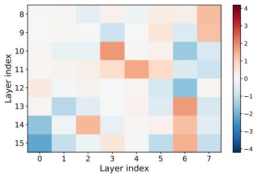

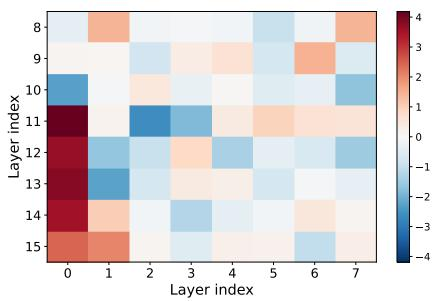  
Figure 2: Fusion weight for reconstructing key (left) and value (right) caches in the top 8 layers of a 16-layer model. The figure reveals a clear asymmetry in key-value caches.

To mitigate this, various methods have been proposed to reduce KV caches. Within the layer, Group-Query Attention (GQA $^{2}$ ) (Ainslie et al., 2023) and Multi-Query Attention (MQA) (Shazeer, 2019) reduce redundancy by sharing one head's key and value across multiple query heads. MLA (Liu et al., 2024a) uses low-rank joint compression for key-value caches. Across the layer, CLA (Brandon et al., 2024) shares the KV cache between adjacent layers, while YOCO $^{3}$ (Sun et al., 2024) reuses the intermediate layer cache for the top-half layers. While cross-layer sharing techniques also reduce memory overhead, they consistently underperform within-layer methods, which motivates the need for a more effective cross-layer sharing strategy.

In this paper, we reveal a previously overlooked asymmetric key-value sharing principle: for top-half layers where values are most effectively reconstructed by the bottom layer, whereas keys draw their more critical information from the bottom and middle layer. Motivated by this, we propose FusedKV, which reconstructs the top-half layer caches by performing a dimension-wise, weighted fusion of caches from two highly informative source layers: the bottom and middle layer. This fusion can be applied directly to post-RoPE keys, a design that preserves relative positional information without the computational overhead of RoPE recomputation. FusedKV halves the cache size while achieving significantly lower perplexity compared to the full-cached model, as shown in Figure 1. We further provide a more efficient version, FusedKV-Lite, where top-half layers' keys are directly reused from the middle layer and values from the bottom layer. Compared to FusedKV, FusedKV-Lite decreases I/O overhead by one-third with only a slight degradation in performance.

Our contributions are threefold: (1) We identify a key-value asymmetry in cache reconstruction. (2) Based on this insight, we propose FusedKV, a memory-efficient architecture, and its more efficient version FusedKV-Lite. Extensive experiments demonstrate that our methods can reduce KV cache memory by 50% while achieving lower perplexity than a standard Transformer decoder. (3) We provide an efficient Triton implementation of FusedKV and a systematic evaluation of KV cache reduction methods, including performance efficiency comparisons and integration of our approach with existing architectures.

## 2 METHOD

In this section, we first define the overall framework for cross-layer KV cache sharing. We then introduce two specific methods, FusedKV-Lite and FusedKV, and demonstrate FusedKV's compatibility with RoPE. Finally, we provide a complexity analysis of different KV sharing methods.

## 2.1 OVERALL FRAMEWORK DEFINITION

We partition the set of L decoder layers, $L = \{1, \ldots, L\}$ , into two disjoint subsets: Storage Layers ( $L_{S}$ ), for which the KV caches are explicitly stored in memory during generation and Reconstruction Layers ( $L_{R}$ ), whose KV caches are not stored but are recomputed on-demand via a reconstruction function. For any reconstruction layer $i \in L_{R}$ , its Key, $K^{i} \in R^{s \times d}$ , and Value, $V^{i} \in R^{s \times d}$ , are generated by a parameterized reconstruction function $F_{i}$ using the KV caches from a subset of the storage layers. The formula is as follows:

$$
\left(\boldsymbol {K} ^ {i}, \boldsymbol {V} ^ {i}\right) = \mathcal {F} _ {i} \left(\left\{\left(\boldsymbol {K} ^ {j}, \boldsymbol {V} ^ {j}\right) | j \in \Phi (i) \right\}; \theta_ {i}\right)\tag{1}
$$

where $\Phi(i)$ is a Source Layer Mapping Function that specifies a set of source storage layer indices for reconstruction layer i. The trainable parameters $\theta_{i}$ associated with the i-th reconstruction layer could be data-dependent or data-independent.

## 2.2 RECONSTRUCTION FUNCTION $\mathcal{F}$

The architecture of the reconstruction function F determines the complexity and effectiveness of the fusion process. We explore two primary categories for the reconstruction function F, differing in their complexity and parameterization.

Direct Cache Reuse. The most straightforward approach for reconstruction is to directly reuse the KV cache from the source layers without any transformation. In this case, The reconstruction can be formulated as:

$$
\left(\boldsymbol {K} ^ {i}, \boldsymbol {V} ^ {i}\right) = \left(\boldsymbol {K} ^ {\phi (i)}, \boldsymbol {V} ^ {\phi (i)}\right), \quad \text { where } \phi (i) \in \mathcal {L} _ {S}.\tag{2}
$$

the reconstruction function $F_{i}$ acts as a selector, the source layer mapping $\Phi(i)$ typically contains a single index, i.e., $|\Phi(i)| = 1$ . Recent methods such as YOCO (Sun et al., 2024) and CLA (Brandon et al., 2024) adopt this approach.

\- YOCO partitions layers into two contiguous blocks: a storage block $(\mathcal{L}_S = \{1, \dots, L/2\})$ and a reconstruction block $(\mathcal{L}_R = \{L/2 + 1, \dots, L\})$ . All reconstruction layers access the KV cache from the final storage layer, defined by the constant mapping $\phi(i) = L/2$ .

\- CLA employs an interleaved partitioning scheme, designating odd-numbered layers for storage $(\mathcal{L}_S = \{1,3,\dots,L - 1\})$ and even-numbered layers for reconstruction $(\mathcal{L}_R = \{2,4,\dots,L\})$ . Each reconstruction layer $i$ accesses the KV cache from its immediately preceding storage layer, with the mapping $\phi (i) = i - 1$ .

Weighted Fusion of Caches. Direct cache reuse may lead to representation collapse in shared layers, potentially limiting their layer-specific contributions in forward flowing. A more expressive method involves computing the reconstructed KV cache as a weighted linear combination of the caches from multiple source layers. The general form is:

$$
\boldsymbol {K} ^ {i} = \sum_ {j \in \Phi (i)} \boldsymbol {a} _ {i j} \odot \boldsymbol {K} ^ {j}, \quad \boldsymbol {V} ^ {i} = \sum_ {j \in \Phi (i)} \boldsymbol {b} _ {i j} \odot \boldsymbol {V} ^ {j}.\tag{3}
$$

Where the learnable weight $a_{ij}$ and $b_{ij}$ can be scalars (R), vectors ( $R^{d}$ ), or matrices ( $R^{s\times d}$ ), and are broadcast to match the shape of the Key and Value caches for the Hadamard product $\odot$ . In this way, we reconstruct the target cache by applying a feature-wise gating mechanism, selectively re-weighting features from each source layer before their aggregation.

## 2.3 FUSEDKV AND FUSEDKV-LITE

Preliminary experiments. We conduct a dense fusion experiment on a 1B-parameter, 16-layer LLM. The top 8 layers reconstructs its cache from a learnable scalar fusion of all the bottom caches. As shown in Figure 10 of the Appendix, dense fusion attains a lower training loss than the vanilla, indicating that top-layer KV caches can be effectively reconstructed from earlier layers. As depicted in Figure 2, we also find a clear asymmetry between keys and values: value-cache fusion is dominated by layers 0–1 for reconstruction layers 10–15, while key-cache weights are more diffuse but concentrate on source layers 6–7. These results indicate that the bottom and middle layers are more informative for reconstructing top-layer caches.

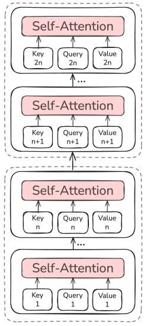  
(a) Vanilla

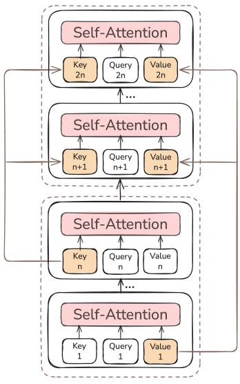  
(b) FusedKV-Lite

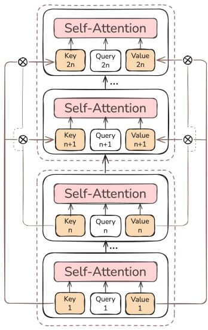  
(c) FusedKV  
Figure 3: Illustration of KV cache strategies. (a) Vanilla: The standard method with a unique KV cache for each layer. (b) FusedKV-Lite: For layers i > n, the Key cache is reused from layer n, and the Value cache from layer 1. (c) FusedKV: For layers i > n, the caches are a learnable weighted fusion (denoted by $\otimes$ ) of the caches from layer 1 and layer n.

FusedKV. Motivated by the observation in dense fusion experiment, we propose a simplified yet effective strategy named FusedKV. As illustrated in Figure 3(c), FusedKV reconstructs the cache by computing a learnable weighted fusion of caches from two highly informative source layers: the bottom (layer 1) and the middle (layer n). The process is formulated as:

$$
\boldsymbol {K} ^ {i} = \boldsymbol {a} _ {i, 1} \odot \boldsymbol {K} ^ {1} + \boldsymbol {a} _ {i, n} \odot \boldsymbol {K} ^ {n}, \quad i > n.\tag{4}
$$

$$
\boldsymbol {V} ^ {i} = \boldsymbol {b} _ {i, 1} \odot \boldsymbol {V} ^ {1} + \boldsymbol {b} _ {i, n} \odot \boldsymbol {V} ^ {n}, \quad i > n.\tag{5}
$$

FusedKV allows each reconstruction layer to synthesize its cache from both the low-level, foundational features of the initial layer and the more abstract, contextual representations from the final source layer. This approach strikes an effective balance between representational power and the memory traffic costs associated with cache fusion.

FusedKV-Lite. To further improve efficiency, we reconstruct the keys by directly reusing the cache from the last source layer n, and the values from the bottom layer, as illustrated in Figure 3(b). The reconstruction is formulated as:

$$
\pmb {K} ^ {i} = \pmb {K} ^ {n}, \quad \pmb {V} ^ {i} = \pmb {V} ^ {1}, \quad i > n.\tag{6}
$$

By reusing only a single source key and value cache, FusedKV-Lite avoids the additional I/O overhead from fusion, thereby maintaining efficiency on par with the vanilla model, making it highly efficient for I/O-bound inference scenarios.

## 2.4 RoPE COMPATIBILITY

In this section, we establish that RoPE is compatible with learnable weights when the weights are symmetric, and we further show that fusing post-RoPE key caches preserves relative positional encoding.

Weight vectors must be 2D-diagonal. To ensure that learnable weights do not disrupt the relative positional encoding property of RoPE (Su et al., 2024), we analyze the attention score. For a query at position m and a key at position n, the attention score $A_{n,j}$ in the j-th 2D subspace, after incorporating a learnable weight vector $w_{j} = [w_{2j}, w_{2j+1}]^{T}$ , can be decomposed as follows (see

Appendix A.4 for the full derivation):

$$
\begin{array}{r l} A _ {j} = & \frac {w _ {2 j} + w _ {2 j + 1}}{2} \bigg [ (q _ {m, 2 j} k _ {n, 2 j} + q _ {m, 2 j + 1} k _ {n, 2 j + 1}) \cos ((m - n) \theta_ {j}) \\ & \quad + (q _ {m, 2 j} k _ {n, 2 j + 1} - q _ {m, 2 j + 1} k _ {n, 2 j}) \sin ((m - n) \theta_ {j}) \bigg ] \\ & + \frac {w _ {2 j} - w _ {2 j + 1}}{2} \bigg [ (q _ {m, 2 j} k _ {n, 2 j} - q _ {m, 2 j + 1} k _ {n, 2 j + 1}) \cos ((m + n) \theta_ {j}) \\ & \quad - (q _ {m, 2 j} k _ {n, 2 j + 1} + q _ {m, 2 j + 1} k _ {n, 2 j}) \sin ((m + n) \theta_ {j}) \bigg ] \end{array}\tag{7}
$$

Equation 7 reveals that when $w_{2j} \neq w_{2j+1}$ , the attention score becomes a mixture of a relative position term (dependent on $m - n$ ) and an absolute position term (dependent on $m + n$ ). To preserve RoPE's pure relative position dependency, we must enforce identity within each 2D weight pair, i.e., $w_{2j} = w_{2j+1}$ .

Weighted Fusion Preserves RoPE. With the symmetry constraint established, we show that a weighted fusion of multiple RoPE-transformed key vectors maintains relative positional encoding. Let $\tilde{\boldsymbol{k}}_{s} = \sum_{i=1}^{N} (\boldsymbol{w}_{n}^{i} \odot \tilde{\boldsymbol{k}}_{n}^{i})$ be a fused key vector from N different storage layers, where each weight vector $w_{n}^{i}$ is symmetric ( $w_{n,2j}^{i} = w_{n,2j+1}^{i}$ ). The attention score with this fused key is:

$$
\tilde {\boldsymbol {q}} _ {m} ^ {T} \tilde {\boldsymbol {k}} _ {s} = \tilde {\boldsymbol {q}} _ {m} ^ {T} \left(\sum_ {i = 1} ^ {N} (\boldsymbol {w} _ {n} ^ {i} \odot \tilde {\boldsymbol {k}} _ {n} ^ {i})\right) = \sum_ {i = 1} ^ {N} \tilde {\boldsymbol {q}} _ {m} ^ {T} (\boldsymbol {w} _ {n} ^ {i} \odot \tilde {\boldsymbol {k}} _ {n} ^ {i})\tag{8}
$$

As established by Equation 7 with the symmetry constraint, each term $\tilde{\pmb{q}}_m^T (\pmb{w}_n^i\odot \tilde{\pmb{k}}_n^i)$ in the sum is a function of only the content vectors and the relative position $m - n$ . Consequently, their linear combination, $\tilde{\pmb{q}}_m^T\tilde{\pmb{k}}_s$ , also upholds this property. This compatibility is practically significant. It allows storage layers to retain their original post-RoPE KV caches, avoiding re-computing RoPE at inference time.

Table 1: Complexity analysis. L denotes the number of model layers, S denotes the sequence length, D denotes the head dimension, and $H_{q}$ and $H_{kv}$ represents the number of query heads and key-value heads, respectively.

<table><tr><td>Method</td><td>Prefilling FLOPs</td><td>Decoding FLOPs</td><td>Cache Mem.</td><td>Cache I/O.</td></tr><tr><td>MHA/GQA</td><td> $LSH_{q}D(4S+4H_{q}D+4H_{kv}D)$ </td><td> $LH_{q}D(4S+4H_{q}D+4H_{kv}D)$ </td><td> $2LSH_{kv}D$ </td><td> $2LSH_{kv}D$ </td></tr><tr><td>YOCO</td><td> $LSH_{q}D(2S+2H_{q}D+2H_{kv}D+2)+2L(HqD)^{2}$ </td><td> $LH_{q}D(4S+4H_{q}D+2H_{kv}D)$ </td><td> $LSH_{kv}D$ </td><td> $2LSH_{kv}D$ </td></tr><tr><td>FusedKV-Lite</td><td> $LSH_{q}D(2S+2H_{q}D+2H_{kv}D+2)+2L(HqD)^{2}$ </td><td> $LH_{q}D(4S+4H_{q}D+2H_{kv}D)$ </td><td> $LSH_{kv}D$ </td><td> $2LSH_{kv}D$ </td></tr><tr><td>FusedKV</td><td> $LSH_{q}D(2S+2H_{q}D+2H_{kv}D+2+3\frac{H_{kv}}{H_{q}})+2L(H_{q}D)^{2}$ </td><td> $LH_{q}D(4S+4H_{q}D+2H_{kv}D+3S\frac{H_{kv}}{H_{q}})$ </td><td> $LSH_{kv}D$ </td><td> $3LSH_{kv}D$ </td></tr></table>

## 2.5 INFERENCE

We conduct a complexity analysis of different attention mechanisms in Table 1. The comparison focuses on the computational cost in prefilling and decoding phase, KV cache memory footprint, and KV cache I/O volume. These calculations are confined to the attention component, excluding the feed-forward networks. We find that both FusedKV-Lite and FusedKV reduce prefilling FLOPs and cache memory compared to the vanilla model. Due to its fusion computation, FusedKV incurs a slightly higher cache I/O volume compared to the other methods.

We implement a Triton-based attention kernel for proposed FusedKV operator, and benchmark the performance of FusedKV and FusedKV-Lite from three aspects: (i) attention throughput, which captures the speed of token generation by the attention kernel, (ii) end-to-end prefill performance, which is quantified by Time to First Token (TTFT), and (iii) end-to-end decoding throughput, which is expressed by Time Per Output Token (TPOT).

Attention Throughput. As shown in Figure 4 (left), the throughput of FusedKV kernel is 28.4% lower on average than MHA due to an extra cache I/O. In contrast, FusedKV-Lite, which maintains a comparable cache I/O, achieves identical throughput to MHA.

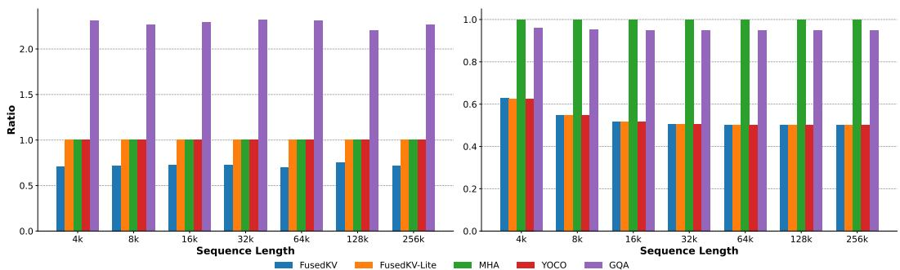  
Figure 4: Left: The attention throughput of different kernels (The higher is better). Right: Time to First Token (TTFT) of different models, showing the end-to-end prefilling performance (The lower is better). All methods are normalized by the vanilla (MHA) baseline.

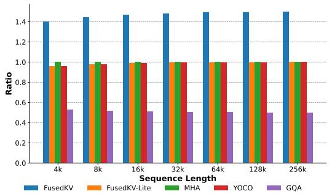

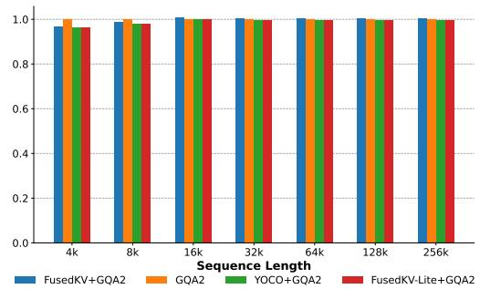  
Figure 5: Time Per Output Token (TPOT) performance ratios. The left panel displays the memory-bound scenario, and the right panel displays the compute-bound scenario.

Time to First Token (TTFT). As shown in Figure 4 (right), both FusedKV and FusedKV-Lite exhibit a clear advantage over vanilla implementation on prefilling latency. Specifically, for input sequence length of 8k and beyond, the TTFT is reduced by approximately 50% relative to vanilla. This improvement originates from FusedKV and FusedKV-Lite layers, which reuse the KV cache from preceding layers and skip the cache prefilling in current layers, thus halving the overall prefilling latency for the end-to-end model.

Time Per Output Token (TPOT). We further examine the decoding speed under both memory-bound and compute-bound scenarios. As illustrated in Figure 5 (left), in the memory-bound setting, the additional cache I/O overhead in the FusedKV layers leads to an approximately $1.5 \times$ increase in TPOT compared to the vanilla implementation. In compute-bound settings, where the baseline uses GQA with $H_{q} \gg H_{kv}$ , this cache I/O overhead is effectively hidden by the computational workloads. For evaluation, we adopt GQA with 128 query heads and 2 key-value heads as the baseline. The computational overhead introduced by cache fusion accounts for only $\frac{3 \times H_{kv}}{4 \times H_{q}} = \frac{3}{256}$ of that required by attention operation, which is practically negligible. Consequently, TPOT of FusedKV remains comparable to that of the baseline. In contrast, FusedKV-Lite maintains a cache I/O nearly identical to that of the vanilla implementation. Therefore, its TPOT is similar to the baseline under both memory-bound and compute-bound scenarios.

## 3 EXPERIMENTS

## 3.1 GENERAL SETUP

Architecture and Training Details We introduce three dense language models with 332M, 650M and 1.5B parameters, both following the Qwen3 architecture (Team, 2025). More configuration are detailed in Table 6. All three models share the same configuration: a vocabulary of 128,000 tokens, a context length of 8,192, and 16 attention heads. They were trained on the FineWeb-Edu dataset (Lozhkov et al., 2024). We use the AdamW optimizer (Loshchilov & Hutter, 2017) with $\beta_{1} = 0.9$ , $\beta_{2} = 0.95$ . The learning rate followed a cosine schedule, warming up for 2,000 steps to

Table 2: Evaluation of various KV cache reduction methods on downstream tasks, highlighting the competitive performance of FusedKV and FusedKV-Lite across 332M, 650M, and 1.5B model sizes.

<table><tr><td></td><td>Model</td><td>Cache Mem. ↓</td><td>Valid Loss ↓</td><td>Wiki Text ↓</td><td>MNLI</td><td>SCIQ</td><td>LAMB-Acc</td><td>Hella Swag</td><td>ARC-E</td><td>ARC-C</td><td>MMLU</td><td>Avg Acc↑</td></tr><tr><td rowspan="6">332M params.</td><td>Vanilla</td><td>1</td><td>2.651</td><td>22.85</td><td>34.64</td><td>84.20</td><td>24.49</td><td>42.12</td><td>59.26</td><td>29.69</td><td>28.93</td><td>43.33</td></tr><tr><td>CLA</td><td>1/2</td><td>2.676</td><td>24.62</td><td>34.80</td><td>76.70</td><td>13.51</td><td>40.75</td><td>54.67</td><td>27.65</td><td>28.56</td><td>39.52</td></tr><tr><td>YOCO</td><td></td><td>2.663</td><td>23.31</td><td>33.64</td><td>80.60</td><td>26.61</td><td>41.74</td><td>59.93</td><td>30.29</td><td>28.77</td><td>43.08</td></tr><tr><td>GQA</td><td></td><td>2.662</td><td>23.29</td><td>34.99</td><td>80.50</td><td>25.52</td><td>41.72</td><td>60.23</td><td>31.40</td><td>29.45</td><td>43.40</td></tr><tr><td>FusedKV-Lite</td><td></td><td>2.639</td><td>22.78</td><td>34.22</td><td>79.60</td><td>26.39</td><td>42.07</td><td>58.67</td><td>32.00</td><td>29.38</td><td>43.19</td></tr><tr><td>FusedKV</td><td></td><td>2.642</td><td>22.35</td><td>33.62</td><td>80.30</td><td>28.10</td><td>42.74</td><td>60.98</td><td>30.12</td><td>29.26</td><td>43.59</td></tr><tr><td rowspan="6">650M params.</td><td>Vanilla</td><td>1</td><td>2.483</td><td>18.47</td><td>34.39</td><td>88.10</td><td>31.67</td><td>49.13</td><td>65.36</td><td>36.26</td><td>31.62</td><td>48.08</td></tr><tr><td>CLA</td><td>1/2</td><td>2.511</td><td>19.60</td><td>34.25</td><td>86.10</td><td>27.94</td><td>47.48</td><td>65.91</td><td>32.94</td><td>30.81</td><td>46.49</td></tr><tr><td>YOCO</td><td></td><td>2.498</td><td>19.21</td><td>34.96</td><td>86.70</td><td>30.74</td><td>48.65</td><td>64.14</td><td>34.39</td><td>30.66</td><td>47.18</td></tr><tr><td>GQA</td><td></td><td>2.497</td><td>19.05</td><td>33.11</td><td>86.30</td><td>30.56</td><td>48.62</td><td>65.36</td><td>34.04</td><td>31.56</td><td>47.08</td></tr><tr><td>FusedKV-Lite</td><td></td><td>2.473</td><td>18.55</td><td>34.24</td><td>86.90</td><td>32.95</td><td>49.53</td><td>66.58</td><td>37.46</td><td>31.88</td><td>48.51</td></tr><tr><td>FusedKV</td><td></td><td>2.474</td><td>18.09</td><td>33.33</td><td>86.60</td><td>31.03</td><td>49.68</td><td>65.61</td><td>34.39</td><td>31.54</td><td>47.45</td></tr><tr><td rowspan="6">1.5B params.</td><td>Vanilla</td><td>1</td><td>2.241</td><td>13.67</td><td>35.69</td><td>94.70</td><td>40.54</td><td>60.67</td><td>72.55</td><td>42.58</td><td>35.12</td><td>54.55</td></tr><tr><td>CLA</td><td>1/2</td><td>2.258</td><td>14.19</td><td>35.00</td><td>92.60</td><td>39.61</td><td>59.04</td><td>73.99</td><td>42.32</td><td>34.83</td><td>53.91</td></tr><tr><td>YOCO</td><td></td><td>2.244</td><td>13.65</td><td>35.30</td><td>91.70</td><td>40.81</td><td>60.09</td><td>73.19</td><td>42.92</td><td>35.35</td><td>54.19</td></tr><tr><td>GQA</td><td></td><td>2.245</td><td>13.74</td><td>34.63</td><td>92.40</td><td>41.20</td><td>60.16</td><td>73.91</td><td>44.28</td><td>35.49</td><td>54.58</td></tr><tr><td>FusedKV-Lite</td><td></td><td>2.225</td><td>13.45</td><td>36.43</td><td>93.70</td><td>41.61</td><td>60.77</td><td>74.79</td><td>43.52</td><td>36.29</td><td>55.30</td></tr><tr><td>FusedKV</td><td></td><td>2.221</td><td>13.33</td><td>37.43</td><td>93.50</td><td>43.33</td><td>61.88</td><td>74.20</td><td>44.20</td><td>36.18</td><td>55.82</td></tr></table>

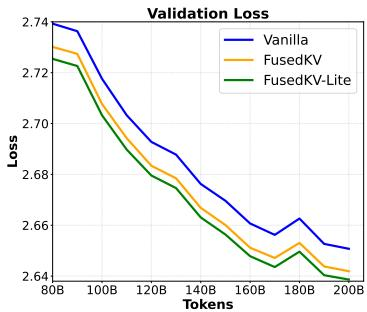

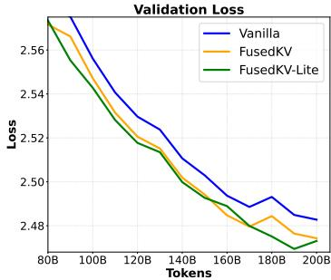

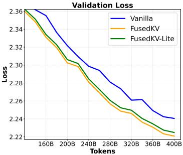  
Figure 6: Validation loss curves of 332M (left), 650M (center), and 1.5B (right) dense models, where FusedKV and FusedKV-Lite consistently achieves lower validation loss than the Vanilla.  
a peak of $3 \times 10^{-4}$ and decaying to a minimum of $3 \times 10^{-5}$ . A more detailed configuration can be found in Table 4.

Evaluation For model evaluation and comparison, we assess perplexity on a 500M-token validation split randomly sampled from FineWeb-Edu. We also evaluate perplexity on WikiText (Merity et al., 2016). We also conduct five-shot evaluation across diverse language tasks, including MNLI (Williams et al., 2018), SCIQ (Welbl et al., 2017), LAMBADA (LAMB-Acc) (Paperno et al., 2016), Hellaswag (Zellers et al., 2019), ARC-Easy (Clark et al., 2018), ARC-Challenge (Clark et al., 2018) and MMLU (Hendrycks et al., 2021). All evaluations are based on the LM Evaluation Harness (Gao et al.).

## 3.2 MAIN RESULTS

As presented in Table 2, our proposed methods, FusedKV-Lite and FusedKV, demonstrate strong performance across three model scales. Compared to the full-cache Vanilla baseline and other cache-saving methods, our approaches consistently achieve competitive or superior results on both language modeling perplexity and downstream task accuracy.

The effectiveness of our methods is particularly pronounced at the 1.5B scale. FusedKV not only achieves the lowest validation loss (2.221) and WikiText perplexity (13.33) but also, alongside FusedKV-Lite, secures the highest average downstream accuracies (55.82 and 55.30, respectively). Notably, these results substantially outperform the full-cache vanilla baseline (54.55) and include top performance on challenging tasks such as ARC-E, MMLU, and HellaSwag.

This trend of strong performance remains consistent across smaller model sizes. At the 332M and 650M scales, FusedKV-Lite and FusedKV respectively lead all methods in average downstream ac-

Table 3: FusedKV outperforms the vanilla on 4B-parameter LLMs in perplexity and downstream tasks.

<table><tr><td>Model</td><td>Valid Loss ↓</td><td>Wiki Text ↓</td><td>MNLI</td><td>SCIQ</td><td>LAMB-Acc</td><td>Hella Swag</td><td>ARC-E</td><td>ARC-C</td><td>MMLU</td><td>Avg Acc↑</td></tr><tr><td>Vanilla</td><td>2.002</td><td>9.18</td><td>37.27</td><td>96.00</td><td>49.60</td><td>68.92</td><td>76.43</td><td>46.59</td><td>38.71</td><td>59.07</td></tr><tr><td>FusedKV</td><td>1.978</td><td>8.94</td><td>38.52</td><td>95.20</td><td>50.18</td><td>69.94</td><td>77.78</td><td>48.63</td><td>39.83</td><td>60.01</td></tr></table>

curacy, though we note their performance on challenging tasks like MMLU and ARC-C remains close to the chance level. Crucially, when compared to methods with equivalent 50% cache savings like YOCO and GQA, our approaches consistently yield superior accuracy. These comprehensive results, further illustrated by the validation loss curves in Figure 6, highlight the ability of our methods to enhance model performance and in-context learning capabilities. Furthermore, we present results for long-context scenarios in Appendix A.7.

## 3.3 SCALING LAW EXPERIMENTS

We compare the loss scaling behavior of the vanilla and FusedKV across increasing model parameters ranging from 332M to 4B. The training configurations used in scaling experiments are detailed in Table 4 of the Appendix, with model sizes and token counts detailed in Table 6. Specifically, the 332M, 650M, 1.5B and 4B models are trained on 200B, 200B, 400B, and 800B tokens, respectively. As illustrated in Figure 7, FusedKV achieves better scaling efficiency, with its loss decreasing more notably as the model capacity grows. For 4B-parameter LLMs, FusedKV exhibits better downstream performance than vanilla, as depicted in Table 3. This demonstrates its ability to retain performance at larger scales, making it particularly promising for large-parameter models.

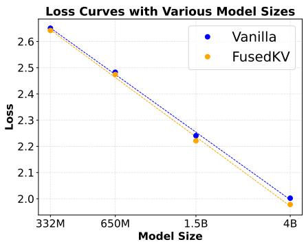  
Figure 7: Scaling law curves of FusedKV and the vanilla.

## 3.4 EXTENSIBILITY AND COMPATIBILITY

We extensively validate the compatibility of FusedKV and FusedKV-Lite across a diverse spectrum of efficiency-oriented designs, including Multi-Head Latent Attention (MLA) (Liu et al., 2024a), Grouped-Query Attention (GQA) (Ainslie et al., 2023), Mixture-of-Experts (MoE) (Shazeer et al., 2017), and hybrid structures like Sliding Window Attention (SWA) (Jiang et al., 2023). Empirical results demonstrate that our cross-layer fusion mechanism is largely orthogonal to these architectural optimizations, often yielding synergistic benefits in both inference and memory footprint with negligible performance degradation. Full experimental details, configurations, and results are provided in Appendix A.6.

## 3.5 ABLATION STUDY

In this section, we investigate two key aspects of our method: the directionality of the asymmetric KV assignment and the impact of parameterizing the reconstruction with learnable weights. We conduct a more detailed ablation study in Appendix A.8.

Directionality of KV asymmetry. We first investigate the impact of the asymmetric assignment strategy. As shown in Figure 8, reversed assignment (FusedKV-Lite-Rev, where $K^{i} = K^{1}, V^{i} = V^{8}, i > 8$ ) degrades performance substantially compared with our proposed FusedKV-Lite ( $K^{i} = K^{8}, V^{i} = V^{1}, i > 8$ ). Compared with FusedKV-Lite, FusedKV-Lite-Rev exhibits markedly higher validation loss and commensurately lower downstream accuracy. This gap demonstrates that when directly reusing a single-source KV cache, later-layer Keys and early-layer Values are more informative for reproducing the original behavior.

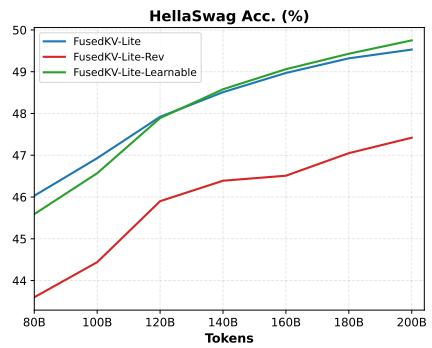

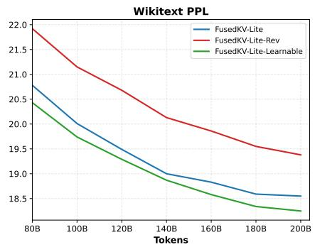  
Figure 8: Ablation study of KV asymmetry and learnable weights on 650M dense models with 200B tokens. We report the perplexity on Wikitext and the five-shot accuracy on Hellaswag for three key variants: FusedKV-Lite, FusedKV-Lite-Rev, and FusedKV-Lite-Learnable.

Impact of learnable weights. We also study the impact of parameterizing the reconstruction with learnable weights. The variant, FusedKV-Lite-Learnable, uses learnable vectors to perform channel-wise re-weighting: $K^{i} = a_{i8} \odot K^{8}$ and $V^{i} = b_{i1} \odot V^{1}$ for layer indices i > 8. The results in Figure 8 show that FusedKV-Lite-Learnable (green line) improves upon the fixed-weight FusedKV-Lite baseline (blue line). It achieves lower perplexity on both Wikitext and LAMBADA. FusedKV-Lite-Learnable also outperforms FusedKV-Lite on Hellaswag in the later stages of training. This demonstrates that allowing the model to adaptively re-weight source Key and Value channels increases expressiveness and yields downstream gains.

## 4 GRADIENT VISUALIZATION

We visualize the L2 norm of gradients for the query, key, and value projection matrices at different network depths. As depicted in Figure 9, we track these gradient norms throughout the training of a 650M-parameter model. The results reveal a distinct pattern: FusedKV and FusedKV-Lite consistently exhibit a markedly larger gradient L2 norm compared to baselines, particularly within the shallower layers of the network (e.g., Layer 1 and Layer 5). A larger gradient magnitude implies more substantial parameter updates during backpropagation. Therefore, the pronounced gradients in the shallow layers for FusedKV and FusedKV-Lite suggest that these layers are learning more effectively and rapidly. By facilitating stronger gradient signals to the initial layers, our learnable fusion mechanism enables the model to more quickly refine its foundational representations. This suggests that the primary benefit of our fusion mechanism on gradient flow is to accelerate learning in the crucial early layers, which form the bedrock for the hierarchical features learned by the deeper parts of the network.

## 5 RELATED WORK

## 5.1 CROSS-LAYER KV CACHE

KV caching is a major memory bottleneck in LLM inference (Wu et al.; Liao & Vargas, 2024). Memory footprint can be reduced by limiting KV state retention to a subset of layers. YOCO (Sun et al., 2024) reuses a global KV cache from an intermediate layer for the model's latter half, roughly halving memory; CLA (Brandon et al., 2024) shares caches across adjacent layers. More aggressive cross-layer reuse includes Mixture of Recurrent (Bae et al., 2025), which stacks recurrent blocks (each comprising multiple transformer layers) so later blocks reuse the first block's KV. SVFormer (Zhou et al., 2025), which does not share the key but reuses the bottom layer's values; and LCKV (Wu & Tu, 2024), which caches only the last layer's KV for all earlier layers, with safeguards against cyclic dependencies. However, most approaches often overlook the distinct roles of keys and values: keys drive relevance scoring, while values supply contextual content. Treating KV as a single unit for caching neglects this functional disparity. Moreover, sharing KV states indiscriminately across layers risks undermining each layer's specific role in hierarchical processing, potentially introducing irrelevant context and hindering its unique function. These critical aspects remain underexplored.

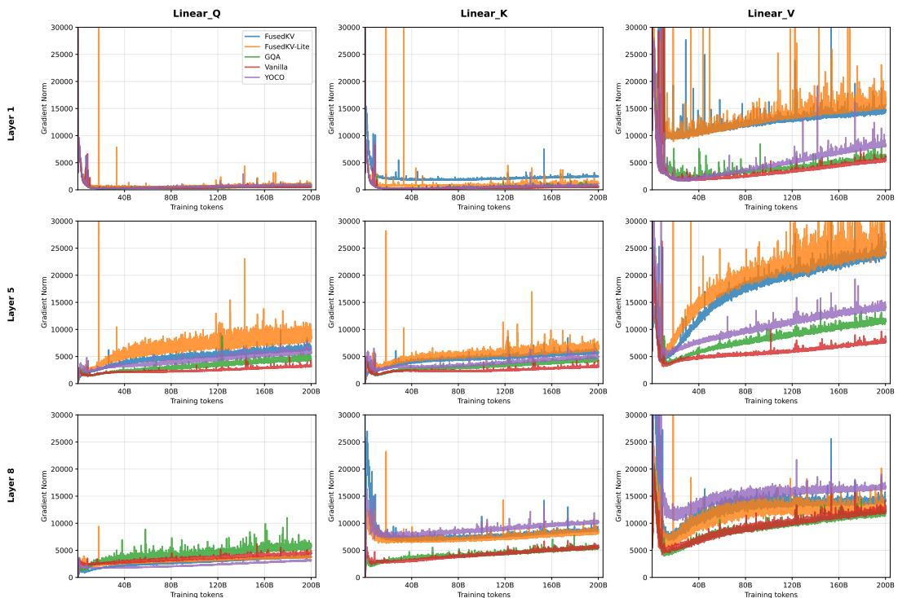  
Figure 9: Comparison of gradient L2 norms shows that FusedKV and FusedKV-Lite maintain significantly stronger gradient flow in shallow layers compared to baselines. This suggests a healthier gradient flow that accelerates the convergence of early layers.

## 5.2 EARLY-FEATURE FUSION

Another line of research leverages early-layer feature fusion to stabilize gradients and enrich global features( (He et al., 2016; Huang et al., 2017; Pagliardini et al., 2024; Abdullaev & Nguyen, 2025)). ResNet (He et al., 2016) introduces residual connections that add outputs from previous layers to the current layer to stabilize training. Subsequent approaches further enhance the information flow within this framework. DenseNet (Huang et al., 2017) concatenates the outputs of all previous layers, while Denseformer (Pagliardini et al., 2024) and MambaMixer (Behrouz et al., 2024) incorporate learnable weighted coefficients into the residual paths, making the residual representations more expressive. Furthermore, reusing features from earlier layers can help alleviate the over-smoothing problem (Wang et al., 2022; Shi et al., 2022), where representations converge and lose diversity as the depth of the network increases, leading to degraded performance. To mitigate this issue, Neu-TRENO (Nguyen et al., 2023) introduces a skip connection that injects a fraction of the bottom-layer output into every subsequent self-attention layer to mitigate over-smoothing. Similarly, (Abdullaev & Nguyen, 2025) enriches the transformer's representational capacity by reusing value-residual information through a twice-attention mechanism.

## 6 CONCLUSION

In this work, we identified a key-value asymmetry principle, revealing that keys and values in upper layers are best reconstructed from different source layers. Based on this insight, we proposed FusedKV, an efficient architecture that reconstructs the top-half layer caches via a weighted fusion of caches from the bottom and middle layers. We also introduced FusedKV-Lite, a more I/O-efficient variant that uses direct asymmetric sharing. Our extensive experiments demonstrate that FusedKV reduces the KV cache by 50% while remarkably achieving lower perplexity than the full-cached baseline. By offering substantial memory savings without a trade-off in performance, FusedKV and FusedKV-Lite establish a effective, integrable paradigm for cross-layer cache sharing, paving the way for more efficient deployment of powerful long-context language models.