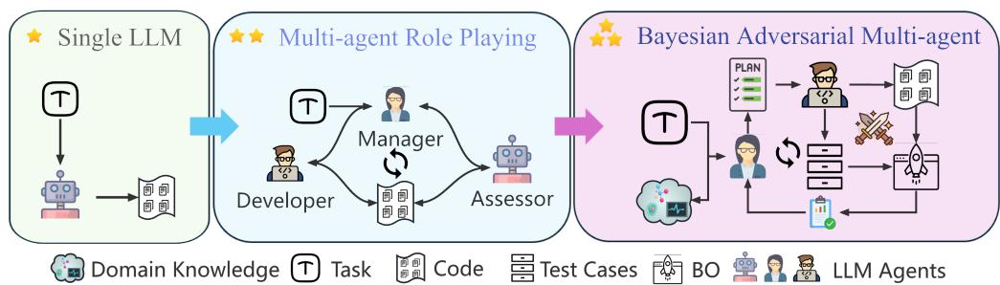
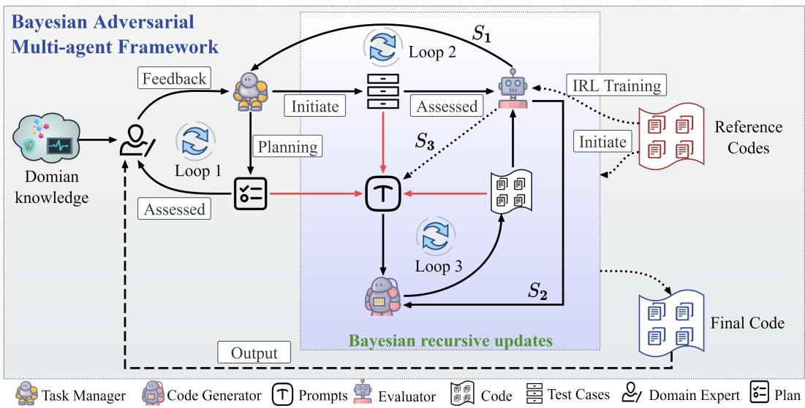
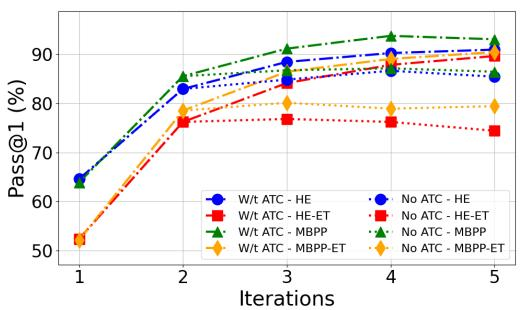
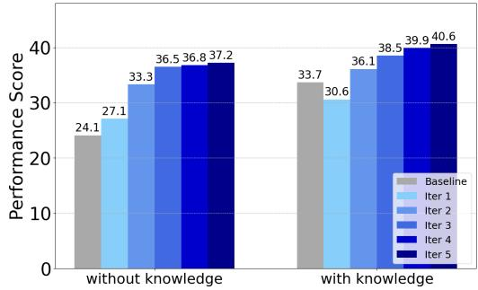
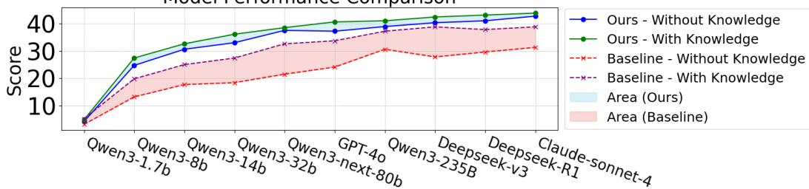

## ABSTRACT

Multi-agent systems leveraging Large Language Models (LLMs) show immense potential for solving complex scientific problems. However, their reliability is undermined by the probabilistic nature of LLMs, which can produce hallucinations in both generated code and its corresponding test cases. In a multi-agent architecture, these errors can propagate and compound, leading to flawed final outputs. To overcome these core limitations, we introduce a novel Bayesian Adversarial Multi-agent Framework for AI for Science (AI4S). Delivered as a Low-code Platform (LCP), our framework enhances the coding capability for scientific tasks across a wide range of base models, from 1.7B open-source LLMs to up-to-date commercial ones. Our framework employs three agents in a recursive loop that adversarially co-optimizes the generated solutions, the test cases used for evaluation, and the prompts driving generation. This process is governed by a non-LLM-based Bayesian updating rule, which systematically reduces evaluation uncertainty and mitigates the system’s dependence on any single LLM’s reliability. Furthermore, the LCP empowers domain experts by translating high-level natural language prompts into executable, domain-specific requirements, eliminating the need for intricate prompt engineering. Extensive experiments confirm that our framework generates robust solutions while effectively minimizing error propagation. On a complex, cross-disciplinary Earth Science benchmark, our platform demonstrates superior reliability and outperforms state-of-the-art models, where a 32B opensource model can beat the performance of a 235B model in the ScienceCode benchmark with our framework.

## 1 INTRODUCTION

Large Language Models (LLMs) are transforming AI for Science (AI4S) research paradigm by automating complex scientific code generation for simulations, data analysis, and related science tasks (Chowdhery et al., 2023; Nijkamp et al., 2022). While models such as Codex, AlphaCode, and CodeLlama effectively lower technical barriers for researchers (Chen et al., 2021; Li et al., 2022; Roziere et al., 2023), several challenges hinder their reliable application in AI4S research. These include: (1) potentially unclear prompt descriptions from domain scientists without computer science backgrounds, (2) complex execution pipelines for scientific tasks, and (3) the need to maintain adherence to physical laws and domain-specific constraints. Standard prompting and self-refinement techniques (Wei et al., 2022; Chen et al., 2023; Olausson et al., 2023) are often inadequate for handling the subtle error patterns in complex scientific workflows.

Crucially, we lack strong empirical evidence to fully trust LLMs’ capabilities in deep understanding and complex reasoning, particularly for professional scientific research tasks (Ridnik et al., 2024). Their decision-making processes remain opaque, and while their outputs often appear plausible, they may contain subtle inaccuracies or conceptual misunderstandings. These limitations fundamentally constrain the performance ceiling of LLM-based coding platforms, as their capabilities are inherently bounded by the underlying LLM’s intelligence level. Such inherent uncertainty demands the development of frameworks that operate without requiring absolute confidence in the LLM’s intelligence level.

  
Figure 1: Comparison between three code generation paradigms: Single LLM generator, multi-agent role playing and the proposed Bayesian adversarial multi-agent framework.

As illustrated in Figure 1, recent advances in LLM-based multi-agent systems attempt to address these limitations through distributed reasoning and specialized agent roles, where different LLM agents focus on specific sub-tasks while coordinating through structured communication protocols and/or a master agent (the green ellipse). However, while such multi-agent architectures (Hong et al., 2023; Wu et al., 2023) can effectively distribute computational complexity and domain expertise across components of the underlying domain task, they introduce new challenges in error propagation and validation. The system’s overall reliability becomes constrained by its weakest agent, as flawed intermediate outputs from one of the agents can be uncritically accepted by downstream agents (Huang et al., 2024), potentially amplifying rather than mitigating the above limitations of individual LLMs. Furthermore, evaluating the code of domain-specific tasks is often difficult. Standard unit tests may miss critical scientific constraints, theoretical foundations, or domain-specific limitations. This evaluation gap stems from three key issues: (1) scientific correctness often requires deeper domain knowledge than standard unit tests can verify; (2) comprehensive evaluation metrics may be prohibitively expensive or fundamentally intractable to define; and (3) LLM-generated tests may inherit the same reliability issue as the code they aim to validate (Zhou et al., 2023). Given these, one must pay equal attention to both LLM-generated code and the test cases used to assess it.

This fundamental insight motivates our core design philosophy: an adversarial co-evolution framework where test case generation and code improvement mutually refine each other through competitive optimization, replacing traditional static verification approaches. The proposed framework structures agent interactions and evolves prompt distributions using Bayes’ Theorem, reducing dependence on the base LLM’s inherent capabilities. The framework comprises three specialized agents: a Task Manager (TM) serving as Challenger, a Solution Generator (SG) as Solver, and an Evaluator for comprehensive assessment. Unlike conventional multi-agent code generation systems that depend entirely on LLM-based evaluation and decision-making(Qian et al., 2023; Hong et al., 2023), our approach introduces an adversarial dynamic between TM and SG. The TM actively constructs and refines test cases to probe the SG’s current limitations, while the SG iteratively improves its code generation based on Evaluator feedback to meet these evolving challenges. As shown in Figure1 orange ellipse, by continuously probing and validating solutions against dynamically refined test cases, our framework not only overcomes these evaluation barriers but also progressively converges on solutions that satisfy both explicit requirements from domain experts and implicit domain constraints from the specific domain or application scenarios.

The proposed framework also enhances Human-AI collaboration in AI4S community(Yamada et al., 2025; Zheng et al., 2025; Babaei Giglou et al., 2024). Outside the Machine Learning community, we cannot expect an average scientist to be aware of, let alone skilled in, the extensive list of prompt engineering techniques. A typical domain researcher’s prompt might be vague, assume implicit domain knowledge, or use specialized terminology and abbreviations that an LLM, especially a smaller one, may not fully grasp. These domain gaps may lead to misinterpretations, suboptimal outputs, or complete system failures. To bridge this gap, our framework incorporates a specialized scheme within TM agent that actively structures raw user requests, resolves ambiguities through interactive clarification, and transforms potentially vague prompts into precise task plans and scientifically valid initial test cases. It maintains accessibility for non-technical domain experts while fully leveraging their domain expertise without requiring any computer science or professional prompt engineering skills. The main contributions of this work are threefold:

• A Novel AI4S Low-Code Platform with Bayesian Adversarial Framework: We introduce a multi-agent framework that employs a Bayesian recursive co-updating strategy to iteratively refine generated code and test cases using a non-LLM-based adversarial score. This method significantly enhances scientific coding performance across a spectrum of base models (from open-source to commercial) and allows smaller LLMs to achieve results competitive with larger counterparts.

• Bayesian Optimization for code performance estimation: We proposed a Bayesian Optimization method to estimate the performance of a given code based on its structure similarity with the tested codes, which enables the framework to handle and evaluate complicated code.

• Domain Knowledge Refinement for scientific tasks: The LCP facilitates scientific exploration for non-coding professionals by enabling the generated code to better reflect domain knowledge and constraints through iteratively refining, adding and updating domain knowledge in the specially structured prompt. Our Earth Science case study exemplifies this, where the generated machine learning model not only produced superior predictions but also demonstrated minimal deviation from established ocean dynamics, ensuring scientific consistency.

In the rest of this paper, we introduce the main methodology and models in Section 2, followed by experimental setup and numerical results in Section 3. We conclude the work and discuss its future work and limitations in Section 4.

## 2 METHOD

## 2.1 OVERVIEW

We propose a Bayesian adversarial multi-agent framework designed for AI4S tasks, incorporating subjective prior knowledge and addressing complex task abilities. The framework comprises three core component agents: a Task Manager (TM), a Solution Generator (SG), and an Evaluator(Eval). Within this structure, code generation becomes a dynamic interaction, primarily between the Task Manager (acting as a Challenger) and the SG agent (acting as a Solver), with the Evaluator providing the performance metrics that guide learning and adaptation. The game concludes when the SG agent produces code that successfully passes all defined validation tests.

The process initiates prior knowledge $\mathcal { P }$ with a task description (provided by a scientist user) and relevant subject materials (e.g., prior domain knowledge, including reference code samples). $\mathcal { P }$ is the initial input to the TM agent, which develops a structured plan of the scientific task, decomposing the main task into an ordered set of Sub-tasks. This plan is iteratively refined based on users’ feedback $\mathcal { F }$ and refinements until user’s approval and denoted as Plans, as indicated by Loop 1 of Figure 2. Subsequently, the TM agent generates an initial set of test cases (Test Case0) corresponding to these sub-tasks and other criteria derived from prior knowledge. These initial test cases, along with user-provided reference code base are serving as initial sample codes (Sample $C o d e _ { 0 } )$ . Sample $C o d e _ { 0 }$ is followed by the user approved plan (Plans) to form the initial prompt:

$$
\text { Prompt } _ {0} := \text { Plans } \oplus \text { Test   Case } _ {0} \oplus \text { Sample   Code } _ {0},\tag{1}
$$

where $\oplus$ is the direct concatenation operator. Both the test cases and the sample codes can be independently updated in subsequent iterations. This update mechanism, guided by Bayesian principles, leverages the performance of candidate codes generated previously and the effectiveness of past test cases. The objective is to iteratively refine the prompt to guide the SG agent towards producing a solution that meets all test criteria and user requirements. The core Bayesian update rule for selecting a specific test case i and sample code $j$ for the prompt at iteration $t + 1$ is: $p ( P r o m p t _ { i j } ^ { t + 1 } | S _ { 3 } ^ { t } \bar { ) } \propto \bar { p ( S _ { 3 } ^ { t } | } P r o m p t _ { i j } ^ { t } ) p ( P r o m p t _ { i j } ^ { t } )$ . This iterative refinement continues until the SG agent achieves satisfactory success on the test cases. The pseudo-code of the proposed method is described in Algorithm 1.

  
Figure 2: Overview of the Bayesian adversarial multi-agent framework. The three red arrows indicate fusion of the user-approved plan, test cases, and codes into prompts, the distribution of which is recursively updated under the Bayesian framework. $S _ { 1 } , \ S _ { 2 } ^ { \bar { \mathbf { \alpha } } }$ and $S _ { 3 }$ are the scores computed in equation 2, equation 3, and equation 4. Loop 1-3 indicate three iterative updating processes for plan, test cases, and codes, respectively. The dashed arrows indicate latent relationships (e.g., $S _ { 3 }$ likelihood score) or steps conducted before or after the main algorithm execution.

Algorithm 1 Bayesian Adversarial Multi-Agent Framework
1: Input: Task description and domain knowledge P, reference code base, max iterations  $T_{max}$ 
2: // Planning till User's approval
3: Generate Plans = TM(P)
4: while NOT User Approval do
5: Plans ← TM(P, F) iteratively updates the plan given user feedback.
6: // Make initial prompts
7: Generate Test Case₀ := ( {Sanity Checks}, {Sub-tasks}) ← TM(Plans)
8: Form Sample Code₀ ← {Test Case₀, Reference Code}
9: Generate Prompt₀ according to equation 1
10: // Code generation and evaluation
11: t ← 0
12: Initialize test case scores ∀i ∈ {1, ..., M}, S₁(i)⁰ ← 1
13: while Not ∃ Code : pass all checks ∧ t &lt; Tₘₐₓ do:
14: t ← t + 1
15: Generate code batch {Cⱼ}ₖ₌₁ᴺ ← SG(Promptₜ₋₁)
// Score Calculation &amp; Updates
16: Compute Code Scores S₂(j)ᵗ using S₁ᵗ⁻¹ according to Eq. equation 3
17: Update Test Case Scores S₁(i)ᵗ using S₂(j)ᵗ according to Eq. equation 2
18: Compute Prompt Score S₃ᵗ using S₁ᵗ, S₂ᵗ according to Eq. equation 4
19: C_best = arg maxⱼ S₂(j)ᵗ
// Bayesian updates for next iteration
20: Test Caseₜ ← TM(Test Caseₜ₋₁, S₁ᵗ)
21: Promptₜ ~ p(Promptₜ|S₃ᵗ)
return C_best

▷ Refine test cases based on S₁ᵗ
▷ Update prompt based on S₃ᵗ

## 2.2 PLANNING AND INITIAL CODE GENERATION

As briefly described in the above overview, the TM agent engages in a comprehensive planning phase. In particular, this involves: 1. Decomposing the primary task into sub-tasks. 2. Posing Sanity Checks for data structure and range. 3. Reasoning about the logical workflow and dependencies between sub-tasks. 4. Formulating strategic advice for the generation of effective test cases. This detailed plan is presented to the user in natural language for review and potential refinement. This interactive feedback loop continues until the user approves the plan. Once the plan is finalized, the TM agent generates an initial set of test cases. These test cases are designed to cover the specified sub-tasks and incorporate domain-specific prior knowledge, such as sanity checks (e.g., for expected data ranges) and out-of-range detection.

Following the planning phase, the system constructs the initial prompt $P r o m p t _ { 0 }$ as defined in equation 1. The code generation agent then uses this prompt to produce N candidate solutions (codes). For each candidate, the system automatically generates comprehensive documentation containing: algorithm explanations, execution instructions, and detailed specifications for all functions, variables, and parameters.

## 2.3 A PRIORI ESTIMATION WITH BAYESIAN OPTIMIZATION

We noticed that executing all the generated codes for testing can be computationally expensive. To address this issue, as well as to leverage both the accuracy of evaluation and the range of exploration in the solution space, a Bayesian Optimization method is employed to estimate the performance score relates to the structural difference from all the tested codes (as in Loop 3 of Figure 2).

As an initiation, all the generated code in the first iteration $\{ C o d e _ { i } \} _ { 1 \leq i \leq N }$ get tested against the initial test cases, where all test cases start from the same initial difficulty score $( \bar { S } _ { 1 } ( i ) ^ { 0 } = 1 )$ . We store the test results as a score vector $S _ { 2 }$ (will be explained in details in equation 3). We then embed each $C o d e _ { i }$ to a vector $\mathbf { x } _ { i }$ through a structural embedding that captures features from its Abstract Syntax Tree $( \mathsf { A S T } )$ and code embedding vectors. We then use a Bayesian optimization process to predict the code’s performance based on its structural similarity with the tested code, which is detailed explained in the appendix. This Bayesian Optimization approach allows the system to intelligently explore the vast solution space, prioritizing the most promising candidates for expensive testing and efficiently converging towards a high-quality solution. It supports the evolution of the distribution of prompt, thus the co-evolution of codes and test cases.

## 2.4 EVALUATION AND FEEDBACK

The Evaluator agent is responsible for assessing the candidate codes, the effectiveness of the test cases, and the overall quality of the prompts used in each iteration.

Test Case Score $( S _ { 1 } )$ : This score quantifies the "True Hardness" of the jth test case Test $C a s e _ { j } ,$ representing its capacity to be challenging yet ultimately solvable. An effective test case should successfully discriminate between code solutions of varying quality (as in loop 3 of Figure 2).

$$
S _ {1} (i) ^ {t + 1} = (1 - \alpha) \cdot S _ {1} (i) ^ {t} + \alpha \cdot \left(\frac {\sum_ {j ^ {\prime} \text { s.t. pass}} S _ {2} (j ^ {\prime})}{| \{\mathbf {C o d e} _ {j ^ {\prime}} \} |} - \frac {\sum_ {j ^ {\dagger} \text { s.t. fail }} S _ {2} (j ^ {\dagger})}{| \{\mathbf {C o d e} _ {j ^ {\dagger}} \} |}\right)\tag{2}
$$

where $S _ { 1 } ( i ) ^ { t }$ is set as 1 by default for $t = 0 ,$ , and α is a hyperparameter to control the momentum of updating, which in experiments we set $\alpha = 0 . 8$

Code Score $( S _ { 2 } ) { \mathrm { : } }$ Each generated code $C _ { j } : 1 \le j \le N$ receives a composite score based on several factors:

$$
S _ {2} (j) ^ {t} = \frac {\sum_ {i} \mathbb {I} (\mathbf {C _ {j}} \text {   passes   } T _ {i}) \cdot S _ {1} (i) ^ {t - 1}}{\sum_ {i} S _ {1} (i) ^ {t - 1}}\tag{3}
$$

Prompt Score $( S _ { 3 } ) \colon$ The overall score for a prompt used in an iteration is a function of the performance of the codes and test cases generated by this prompt:

$$
S _ {3} ^ {t} = \frac {1}{M} \sum_ {j = 1} ^ {M} S _ {1} (i) ^ {t} + \frac {1}{N} \sum_ {i = 1} ^ {N} S _ {2} (j) ^ {t}\tag{4}
$$

If multiple prompt configurations are tested within a single logical iteration, the iteration’s representative prompt score might be the highest achieved. For the Bayesian update, we are interested in the score of a specific prompt configuration $\{ P r o m p t _ { i j } ^ { t } \} _ { i j }$ is then denoted $\{ ( S _ { 3 } ) _ { i j } ^ { t } \} _ { i j }$

## 2.5 ITERATIVE REFINEMENT: ADVERSARIAL DYNAMICS AND BAYESIAN PROMPT UPDATES

The core of the framework’s learning capability lies in its iterative refinement loop, characterized by an adversarial dynamic between the TM agent (Challenger) and the SG agent (Solver), and guided by Bayesian updates for prompt composition.

Adversarial interaction: The TM agent’s role evolves to that of a Challenger. Based on the ’True hardness’, which is measured by $S _ { 1 }$ , the TM adapts its weights for future evaluation and selects test cases for subsequent prompts. It aims to create test suites that are optimally challenging for the SG’s current learned capabilities—difficult enough to drive further learning and expose weaknesses, yet generally solvable to provide a positive learning signal. The SG agent, as the Solver, implicitly adapts by producing code in response to these evolving challenges. Its success or failure provides the feedback signal that shapes the TM’s subsequent challenging strategy.

Bayesian prompt updates: The selection of which specific test cases (indexed by i) and sample codes (indexed by $j )$ to include in the prompt for the next iteration $( P r o m p t _ { t + 1 } ^ { i j } )$ is governed by a Bayesian update rule(as indicated by the combination of Loop 2 and 3 in 2):

$$
p (P r o m p t _ {i j} ^ {t + 1} | S _ {3} ^ {t}) \propto p (S _ {3} ^ {t} | P r o m p t _ {i j} ^ {t}) p (P r o m p t _ {i j} ^ {t})\tag{5}
$$

Here:

• p $( P r o m p t _ { i j } ^ { t } )$ is the prior probability of selecting the pair (Test Case , Sample $C o d e _ { j } )$ for the prompt. This prior can be uniform initially and can adapt over time based on the historical effectiveness of these components.

$p ( S _ { 3 } ^ { t } | P r o m p t _ { i j } ^ { t } )$ is the likelihood of observing the score $S _ { 3 } ^ { t }$ given that the prompt was formed using Test Casei and Sample $C o d e _ { j }$ This term captures how well this specific combination performed. A potential formulation to ensure non-negativity and reflect that better-than-expected performance is more likely could be:

$$
p (S _ {3} ^ {t} | P r o m p t _ {i j} ^ {t}) \propto \exp \left(\mathbb {E} [ S _ {3} ^ {t - 1} \mathbf {1} (i, j) ]\right)\tag{6}
$$

where $\mathbb { E } [ S _ { 3 } \mathbf { 1 } ( i , j ) ]$ is the expected score for the generated code with $T e s t _ { i } , C o d e _ { j }$ in the prompt based on past performance or a baseline. This implies that a prompt configuration performing significantly better than its historical average for that pair (Test Case , Sample $C o d e _ { j } )$ will have a higher likelihood.

The underlying intuition is to identify and prioritize "teacher-subject" pairs-specific combinations of sample code and test cases that consistently yield high-scoring prompts. This approach effectively learns which forms of guidance produce optimal results for different types of coding challenge.

Sample code pool management: The pool of available sample codes (Sample Code) is not static, but recursively updated as illustrated in Loop 3 of Figure 2. Initially, it contains user-provided reference codes. As the SG agent generates new codes $C _ { g } ^ { ( t ) }$ , those that achieve high $S _ { 2 }$ can be added to the Sample Code pool. The selection of a Sample Code for a prompt can then be influenced not only by its initial status (as a reference) but also by an evolving measure of its "guidance quality," learned from its impact on past prompt scores when it was included.

Final results: Within each round, if there exists a code that can pass all the test cases, the System will output it as the final result to the user. Otherwise, the System will keep using the Bayesian Adversarial method recursively till generation of a satisfying code or reaching the maximum round of iterations, which is chosen by the user in the beginning and by default set to 3 by experience(See Section 3).

## 3 EXPERIMENTS

## 3.1 EXPERIMENTAL SETUP

Benchmarks To ensure a thorough evaluation, we utilize a diverse set of benchmarks. For general code generation, we use HumanEval, HumanEval-ET, MBPP, MBPP-ET(Austin et al., 2021; Dong et al., 2025; Hendrycks et al., 2021), and the more challenging APPS(Hendrycks et al., 2021) benchmark. For AI for Science tasks, we use the domain-specific SciCode(Tian et al., 2024) and ScienceAgentBench(Chen et al., 2024) benchmarks.

Base Models Our framework is designed to be model-agnostic. To demonstrate this, we integrate several backbone large language models (LLMs), including the Qwen3 series (ranging from 1.7B to 235B)(Yang et al., 2025), which has versatile sizes, strong reasoning, it can demonstrate if our framework is also effective on the latest models. Beside, we also choose Deepseek-v3(Liu et al., 2024), Deepseek-R1(Guo et al., 2025), Claude-sonnet-4(Anthropic, 2025), GPT-3.5-turbo(Brown et al., 2020), and GPT-4o(Hurst et al., 2024). This allows us to assess the performance gains attributable to our framework across a spectrum of model capabilities.

Compared Methods We compare our framework against several state-of-the-art baselines. These include foundational strategies like Few-Shot prompting and Chain-of-Thought (CoT), as well as other prominent agent-based systems. From the table, the competing agentic frameworks and prompting strategies include ReAct, Reflexion, Self-Debugging, Self-Collaboration, MetaGPT, MapCoder, AgentCoder, and CodeCoR(Brown et al., 2020; Huang et al., 2023b; Pan et al., 2025; Yao et al., 2023b; Shinn et al., 2023; Yao et al., 2023a; Hao et al., 2023; Zhang et al., 2023; Jiang et al., 2024; Chen et al., 2023; Dong et al., 2024; Wang et al., 2023; Li et al., 2025; Huang et al., 2023a; Islam et al., 2024).

Evaluation Metrics Following standard practice, we use the pass@k metric to evaluate code generation performance, where a solution is considered correct if it passes a set of unit tests. We primarily report pass@1 scores(Chen et al., 2021; Austin et al., 2021; Dong et al., 2025).

Parameter Setting For all experiments, we consistently applied an identical parameter set unless otherwise noted. The number of initial test cases was set to 15, and the number of distinct code snippets generated in each round was 20. We maintained a minimum pool of 20 test cases; if filtering processes reduced the number of test cases below this threshold (e.g., due to low scores), additional test cases were generated to meet this minimum. For iterative refinement, the number of codes chosen by acquisition function for further evaluation was set to 5.

## 3.2 EFFECTIVENESS IN AI FOR SCIENCE TASKS

We established our framework’s general proficiency, which can be found in detail in the appendix, and can assert its up-to-SOTA level performance in general coding tasks. We can now investigate the framework’s ability in scientific tasks by evaluating our framework’s performance in the specialized and demanding domain of scientific code generation. We use two scientific code generation benchmarks to demonstrate its capabilities.

First, we assess our framework on the SciCode benchmark across a wide spectrum of base models, from the 1.7B parameter Qwen3 to powerful proprietary models like Claude-sonnet-4. The results, presented in Table 1, show that our framework provides a substantial and consistent performance uplift in all configurations. The gains are particularly striking for open-source models, with relative improvements of up to 87.1% (for Qwen3-8b). Our framework enables smaller models to match the performance of significantly larger ones. For instance, in the ’Without Knowledge’ case, Qwen3-14b with our framework achieves a 30.6 Resolve Rate on Subproblems, equaling the baseline of the Qwen3-235B-A22b-Instruct-2507, a model over 16 times its size.

Second, to evaluate our framework on more complex, agentic workflows, we test it on the ScienceAgentBench, which involves more complex, multi-step scientific workflows, and we using GPT-4o as the base model. As shown in Table 2, our LCP framework achieves new state-ofthe-art (SOTA) performance, particularly in the Valid Execution Rate (VER), where it scores 90.2% (without knowledge) and 87.3% (with knowledge), far surpassing all other methods. This exceptional execution success rate is critical for scientific applications, as it directly validates our framework’s core strength in producing robust, executable scientific code across diverse and complex application domains. This result, combined with leading scores in Success Rate (SR) and Code-Based Score (CBS), confirms our system’s effectiveness in orchestrating the complex reasoning and execution steps essential for impactful AI4S applications.

Table 1: Model Performance Comparison on SciCode with various backbone models

<table><tr><td rowspan="2">Model</td><td rowspan="2">Method</td><td colspan="2">Without Knowledge</td><td colspan="2">With Knowledge</td><td rowspan="2">Model</td><td rowspan="2">Method</td><td colspan="2">Without Knowledge</td><td colspan="2">With Knowledge</td></tr><tr><td>Sub (%)</td><td>Main (%)</td><td>Sub (%)</td><td>Main (%)</td><td>Sub (%)</td><td>Main (%)</td><td>Sub (%)</td><td>Main (%)</td></tr><tr><td rowspan="2">Qwen3-8b</td><td>Baseline</td><td>13.2</td><td>0</td><td>19.8</td><td>1.5</td><td rowspan="2">GPT-4o</td><td>Baseline</td><td>24.1</td><td>1.5</td><td>33.7</td><td>7.7</td></tr><tr><td>Ours</td><td>24.7(87.1%)</td><td>4.6</td><td>27.4(38.4%)</td><td>4.6</td><td>Ours</td><td>37.2(54.3%)</td><td>7.7</td><td>40.6(20.4%)</td><td>10.8</td></tr><tr><td rowspan="2">Qwen3-14b</td><td>Baseline</td><td>17.7</td><td>1.5</td><td>25.0</td><td>6.2</td><td rowspan="2">Deepseek-v3</td><td>Baseline</td><td>27.8</td><td>3.1</td><td>38.8</td><td>10.8</td></tr><tr><td>Ours</td><td>30.6(72.9%)</td><td>6.2</td><td>32.6(30.4%)</td><td>6.2</td><td>Ours</td><td>40.3(45.0%)</td><td>10.8</td><td>42.4(9.28%)</td><td>12.3</td></tr><tr><td rowspan="2">Qwen3-32b</td><td>Baseline</td><td>18.4</td><td>0</td><td>27.4</td><td>7.7</td><td rowspan="2">Deepseek-R1</td><td>Baseline</td><td>29.6</td><td>4.6</td><td>37.8</td><td>10.8</td></tr><tr><td>Ours</td><td>33.0(79.3%)</td><td>6.2</td><td>36.1(31.8%)</td><td>7.7</td><td>Ours</td><td>41.0(38.5%)</td><td>10.8</td><td>43.1(14.0%)</td><td>13.8</td></tr><tr><td rowspan="2">Qwen3-next-80b-a3b-instruct</td><td>Baseline</td><td>21.5</td><td>3.1</td><td>32.6</td><td>12.3</td><td rowspan="2">Claude-sonnet-4</td><td>Baseline</td><td>31.3</td><td>7.7</td><td>38.8</td><td>10.8</td></tr><tr><td>Ours</td><td>37.5(74.4%)</td><td>9.2</td><td>38.5(18.1%)</td><td>10.8</td><td>Ours</td><td>42.7(36.4%)</td><td>13.8</td><td>43.8(12.9%)</td><td>13.8</td></tr><tr><td rowspan="2">Qwen3-235B-A22b-Instruct</td><td>Baseline</td><td>30.6</td><td>4.6</td><td>37.2</td><td>10.8</td><td></td><td></td><td></td><td></td><td></td><td></td></tr><tr><td>Ours</td><td>38.9(27.1%)</td><td>9.2</td><td>41.0(10.2%)</td><td>10.8</td><td></td><td></td><td></td><td></td><td></td><td></td></tr></table>

Table 2: Results on ScienceAgentBench using GPT-4o as base model with/without prior knowledge, compare with two different agent frameworks and baseline.

<table><tr><td>Method</td><td>SR(w/o)</td><td>CBS(w/o)</td><td>VER(w/o)</td><td>SR(w/)</td><td>CBS(w/)</td><td>VER(w/)</td></tr><tr><td>Direct</td><td>11.8</td><td>82.6</td><td>52.9</td><td>10.8</td><td>83.8</td><td>41.2</td></tr><tr><td>OpenHands CodeAct</td><td>19.6</td><td>83.1</td><td>78.4</td><td>27.5</td><td>86.3</td><td>73.5</td></tr><tr><td>Self-Debug</td><td>22.6</td><td>84.4</td><td>83.3</td><td>23.5</td><td>85.6</td><td>71.6</td></tr><tr><td>LCP(Ours)</td><td>26.5</td><td>85.1</td><td>90.2</td><td>27.5</td><td>86.4</td><td>87.3</td></tr></table>

## 3.3 ANALYSIS OF BAYESIAN RECURSIVE CO-UPDATING

In this section, we test our framework’s core Bayesian iterative co-updating mechanism, validating that the Bayesian recursive co-updating strategy is effective at iteratively refining solutions. As illustrated across both general and scientific benchmarks in Figure 3, performance consistently and monotonically improves with an increasing number of iterations. On the general benchmarks (Figure 3a), the Pass@1 scores on HumanEval and MBPP show substantial gains in the first three iterations, with performance beginning to converge around the fourth or fifth iteration. This suggests an optimal balance between performance and computational cost. This same powerful trend is mirrored on the specialized SciCode benchmark (Figure 3b), where the performance score climbs steadily from a 27.1 to 37.2 after five iterations, demonstrating the broad applicability and success of our iterative refinement process.

We further analyze the components of this process by conducting an ablation study on the role of Adversarial Test Cases (ATC) within our LCP framework, as shown in Figure 3a. While the performance with and without ATC is comparable in the initial iterations, a clear divergence emerges from the third iteration onwards. The LCP framework augmented with ATC (dash-dot lines) consistently achieves higher Pass@1 accuracy across all metrics, underscoring the critical role of ATC. By dynamically challenging the generated code with difficult edge cases, the ATC mechanism compels the system to produce more robust and reliable solutions, validating it as a key driver of the performance gains observed in our co-updating loop.

## 3.4 ROBUSTNESS FOR NON-PROFESSIONAL USERS

Finally, we address robustness and accessibility to non-AI-professional science researcher by evaluating our framework’s accessibility and effectiveness for users who may be domain experts but are not specialists in prompt engineering. To simulate this scenario, we compare the performance of both the baseline models and our framework under two conditions: one with a basic, un-optimized prompt (’Without Knowledge’) and one with an expert-crafted prompt containing detailed domain knowledge (’With Knowledge’). The goal is to measure how sensitive each approach is to the quality of the initial prompt.

  
(a) Pass@1 of LCP with different iterations (GPT-3.5-turbo). Dash-dot and solid lines are LCP with and without ATC, respectively.

Performance on subproblems of SciCode  
  
(b) Performance on SciCode Benchmark (GPT-4o) with different iteration numbers.  
Figure 3: Illustration of LCP performance over: (a) different iteration number with and without ATC component on general code benchmark; (b) difficulty iteration number on the SciCode benchmark

The results, presented in Figure 4, clearly demonstrate our framework’s superior robustness. The baseline models exhibit a large performance gap between the two conditions (represented by the shaded red area, ’Area (Baseline)’), indicating a strong dependency on expert prompting. In contrast, our framework significantly narrows this performance gap across the entire spectrum of models (represented by the much smaller shaded blue area, ’Area (Ours)’). This shows that our multi-agent system can internally elaborate on and refine basic instructions, compensating for the lack of initial detail. Most strikingly, a non-professional user with our framework (’Ours - Without Knowledge’) consistently and substantially outperforms an expert user with the baseline model alone (’Baseline - With Knowledge’).

Model Performance Comparison  
  
Figure 4: Model performance with basic vs. expert-crafted prompts. Our framework (blue/green lines) is significantly more robust to prompt quality than the baseline (red lines), showing a much smaller performance gap (shaded area) and achieving superior results even without expert knowledge.

## 4 CONCLUSIONS AND DISCUSSIONS

We propose a Bayesian adversarial multi-agent framework for AI-for-Science (AI4S) code generation that achieves state-of-the-art performance by iteratively refining prompt components through Bayesian updates. This approach mitigates cumulative error by treating tests and code with equivalent confidence, while an adversarial process guides a Task Manager (TM) agent to challenge a Solution Generator (SG) agent with progressively evolving tests. The framework’s interactive planning scheme enables non-experts to translate vague prompts into validated workflows, effectively bridging the gap between AI-generated code and domain-specific needs. As demonstrated in Earth Science applications, our method helps democratize LLM tools for researchers without a technical background.

However, the framework has several limitations. First, its performance is dependent on the quality of the initial reference code, and it struggles to enforce implicit physical laws, which may require future integration with symbolic verifiers. Second, the iterative adversarial-and-Bayesian refinement process consumes more tokens than one-shot/zero-shot prompting because it repeatedly generates and evaluates test cases, code candidates, and updated prompts. While this increased token budget can be a practical constraint for long pipelines, in reliability-critical scientific applications, we prioritize executable correctness and robustness over marginal token savings. Furthermore, evaluating the generated machine learning or deep learning models can be highly resource-intensive, and performance variability due to training dynamics and data poses an additional challenge to the update mechanism.

Future work will focus on extending the Bayesian updates to handle multi-modal inputs, such as equations and diagrams, and optimizing the iteration protocols for large-scale scientific simulations.

## ACKNOWLEDGMENTS

The computations in this research were performed using the CFFF platform of Fudan University.

## REFERENCES

Anthropic. Claude sonnet 4, 2025. URL https://www.anthropic.com/news/claude-4. https://www.anthropic.com/news/claude-4.

Jacob Austin, Augustus Odena, Maxwell Nye, Maarten Bosma, Henryk Michalewski, David Dohan, Ellen Jiang, Carrie Cai, Michael Terry, Quoc Le, et al. Program synthesis with large language models. arXiv preprint arXiv:2108.07732, 2021.

Hamed Babaei Giglou, Jennifer D’Souza, and Sören Auer. Llms4synthesis: Leveraging large language models for scientific synthesis. In Proceedings of the 24th ACM/IEEE Joint Conference on Digital Libraries, pp. 1–12, 2024.

Tom Brown, Benjamin Mann, Nick Ryder, Melanie Subbiah, Jared D Kaplan, Prafulla Dhariwal, Arvind Neelakantan, Pranav Shyam, Girish Sastry, Amanda Askell, et al. Language models are few-shot learners. Advances in Neural Information Processing Systems(NeurIPS), 33:1877–1901, 2020.

Mark Chen, Jerry Tworek, Heewoo Jun, Qiming Yuan, Henrique Ponde De Oliveira Pinto, Jared Kaplan, Harri Edwards, Yuri Burda, Nicholas Joseph, Greg Brockman, et al. Evaluating large language models trained on code. arXiv preprint arXiv:2107.03374, 2021.

Xinyun Chen, Maxwell Lin, Nathanael Schärli, and Denny Zhou. Teaching large language models to self-debug. arXiv preprint arXiv:2304.05128, 2023.

Ziru Chen, Shijie Chen, Yuting Ning, Qianheng Zhang, Boshi Wang, Botao Yu, Yifei Li, Zeyi Liao, Chen Wei, Zitong Lu, et al. Scienceagentbench: Toward rigorous assessment of language agents for data-driven scientific discovery. arXiv preprint arXiv:2410.05080, 2024.

Aakanksha Chowdhery, Sharan Narang, Jacob Devlin, Maarten Bosma, Gaurav Mishra, Adam Roberts, Paul Barham, Hyung Won Chung, Charles Sutton, Sebastian Gehrmann, et al. Palm: Scaling language modeling with pathways. Journal ofMachine Learning Research, 24(240):1–113, 2023.

Yihong Dong, Xue Jiang, Zhi Jin, and Ge Li. Self-collaboration code generation via chatgpt. ACM Transactions on Software Engineering and Methodology, 33(7):1–38, 2024.

Yihong Dong, Jiazheng Ding, Xue Jiang, Ge Li, Zhuo Li, and Zhi Jin. Codescore: Evaluating code generation by learning code execution. ACM Transactions on Software Engineering and Methodology, 34(3):1–22, 2025.

Daya Guo, Dejian Yang, Haowei Zhang, Junxiao Song, Ruoyu Zhang, Runxin Xu, Qihao Zhu, Shirong Ma, Peiyi Wang, Xiao Bi, et al. Deepseek-r1: Incentivizing reasoning capability in llms via reinforcement learning. arXiv preprint arXiv:2501.12948, 2025.