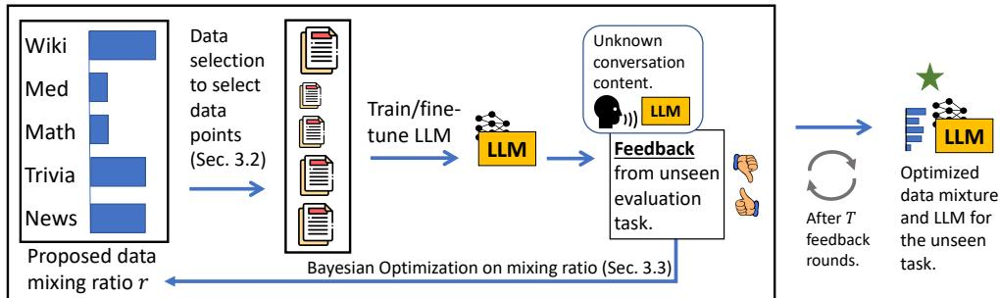
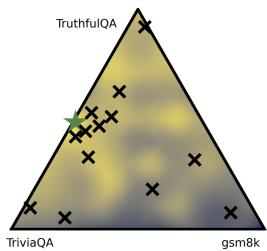
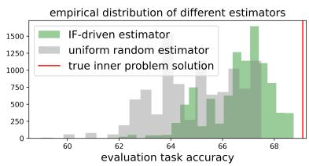
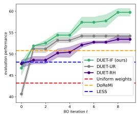
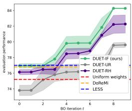
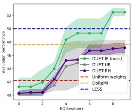
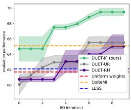
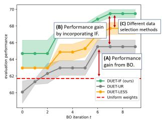
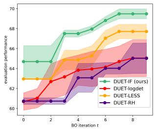
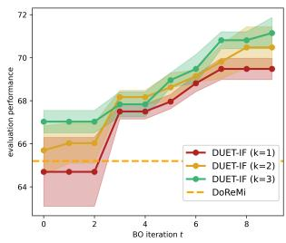

## ABSTRACT

The performance of an LLM depends heavily on how well the training data matches the downstream evaluation task. However, in many practical settings, we typically do not know the data in the evaluation task (e.g., conversations between a chatbot and users are end-to-end encrypted). We refer to such tasks as unseen evaluation tasks. We can only deploy the LLM on these unseen evaluation tasks to gather multiple rounds of feedback on how well the model performs (e.g., gathering user ratings from a chatbot). In addition, this feedback can be noisy. How can we exploit such noisy feedback efficiently to optimize the LLM training data-mixture? Our paper presents DUET, a novel global-to-local algorithm that optimizes training data mixtures by interleaving data selection with Bayesian optimization to exploit coarse and noisy feedback from a downstream evaluation task. DUET is flexible enough to incorporate different data selection methods, each with different performancecompute tradeoffs. By analyzing DUET’s cumulative regret, we theoretically show that DUET converges to the optimal training data mixture even without any finegrained data information from an unseen task. Finally, our experiments across a variety of language tasks demonstrate that DUET attains substantial performance improvements over existing data selection and mixing methods in the unseen-task setting. Our library, which is flexible enough to optimize different LLM training ingredients, can be found at https://github.com/chenzhiliang94/ BO-for-LLMs.

## 1 INTRODUCTION

The performance of an LLM depends heavily on how well the training data domain (Chen et al., 2024a; Xie et al., 2023a) matches the downstream evaluation task (Hoffmann et al., 2022; Long et al., 2017). For instance, if we knew that LLM users are interested in asking layman science questions, then training or fine-tuning the LLM with more Wikipedia data allows it to converse better with these users. Hence, knowing the evaluation task is important for curating a more relevant training data mixture, producing an LLM with better performance over the specific task of interest.

Unfortunately, in practice, the data (e.g., its domain, distribution, or labels) involved in an unseen evaluation task are often unknown. Thus, it is not obvious what data is relevant for training or fine-tuning the model. Consider the following problem setting: An LLM owner is interested in fine-tuning their LLM to converse better with users but due to privacy concerns (Li et al., 2024), conversations between the deployed LLM and users are end-to-end encrypted (openai.com/ enterprise-privacy). Hence, the LLM owner does not know the actual evaluation data seen during test-time. Rather, they only receive coarse, noisy feedback on how well the LLM has performed in the conversation (e.g., user ratings or duration spent on the application). Of course, a naive idea is to simply iterate through all possible data mixtures and observe the resulting LLM performance, which is too computationally expensive. A better question is to perhaps ask: How can we exploit the noisy feedback loop efficiently to improve and optimize the training data mixture?

  
Figure 1: DUET exploits a feedback loop to optimize the data mixture for an unseen evaluation task. In contrast, conventional data mixing and selection works require fine-grained data information of the task, which is not available here.

This paper presents DUET (Fig. 1), an efficient algorithm that exploits a noisy feedback loop to optimize the training Data mixture for an Unseen Evaluation Task. DUET is a global-to-local algorithm that interleaves data selection (Albalak et al., 2024; Ting & Brochu, 2017; Koh & Liang, 2017) with Bayesian optimization (BO) (Snoek et al., 2012; Srinivas et al., 2010) to optimize the training data mixture. Globally, BO in DUET uses coarse, noisy feedback from the unseen evaluation task to automatically refine the mixing ratio of data domains in the training data mixture iteratively. Locally, DUET uses data selection to retrieve high-quality data points from each data domain until the proposed mixing ratio is reached. This results in an algorithm that can optimize training data iteratively even without having access to fine-grained data information from the evaluation task.

Related works. In our problem setting, (a) there is no direct access to the data (e.g., its domain, distribution, or labels) involved in the unseen evaluation task but (b) we can gather multiple rounds of feedback (details covered in Sec. 2.2) from the task using an LLM. App. A.1 provides a few more practical examples of this setting. This setting is different from those considered in conventional domain adaptation (DA) and domain generalization (DG) works. Prior DA works assume fine-grained knowledge of data (e.g., labeled/unlabeled data (Zhang et al., 2022) or data distribution (Ganin & Lempitsky, 2015; Zhang et al., 2021)) from the evaluation task for selecting relevant training data that match the evaluation data. On the other hand, DG considers a rigid setting with no knowledge (not even feedback) of the evaluation task (Muandet et al., 2013; Shin et al., 2024; Wang et al., 2022).

Similarly, data mixing works such as DoReMi (Xie et al., 2023a), BiMix (Ge et al., 2025) and more (Chen et al., 2024a; Fan et al., 2024; Xie et al., 2025; 2023b) introduced methods to optimize data mixtures, and data selection works (Albalak et al., 2024; Xia et al., 2024; Pruthi et al., 2020; Xie et al., 2023b) explored ways to find high-quality data to improve an LLM’s performance. However, these methods assume some availability of fine-grained evaluation data information, such as evaluation gradients, labels, distribution or naively assuming the training data shares the same distribution as the task. In practice (like in our setting), these are not always available. In fact, when we applied existing data mixing and selection methods directly to our setting, they perform worse than DUET (Sec. 6). We provide more discussion of the shortfalls of these prior works in App. A.2.

To the best of our knowledge, DUET is the first work that interleaves data selection with BO to iteratively optimize training data mixture based on feedback from an unseen evaluation task. At first glance, eliciting multiple rounds of feedback with BO seems expensive. However, BO is sampleefficient and is the only way we can exploit such coarse and noisy feedback iteratively, unlike prior methods that require much more fine-grained data information (see above). In fact, subjecting models to multiple rounds of training or fine-tuning in a feedback loop is a natural part of the deployment life-cycle to improve LLMs. Specifically, our contributions are:

• We introduce a novel and realistic problem setting where the data involved in an unseen evaluation task is unknown but we can deploy our LLM to gather multiple rounds of coarse and noisy feedback. Then, we introduce DUET, a novel algorithm that exploits the feedback loop to optimize training Data mixture for the Unseen Evaluation Task. To achieve this, DUET interleaves data selection (Sec. 3.2) with Bayesian optimization (Sec. 3.3) to iteratively optimize the training data mixture. DUET is flexible enough to incorporate any data selection choice in its inner loop, and we qualitatively and quantitatively analyzed different choices in our paper.

• We provide a theoretical analysis of DUET’s convergence to the optimal training data mixture by analyzing DUET’s attained cumulative regret (Chen et al., 2024b; Chowdhury $\bar { \& }$ Gopalan, 2017) under the BO framework (Sec. 4).

• We demonstrate the effectiveness of DUET on LLM fine-tuning for language tasks comprising both in-domain and out-of-domain unseen tasks spanning different domains. Compared to conventional data selection and mixing methods (e.g., DoReMi, LESS, Aioli (Chen et al., 2024a) and more), DUET produces more optimal training data mixtures (Sec. 6.2).

## 2 PRELIMINARIES

## 2.1 BAYESIAN OPTIMIZATION

We first provide an outline of how BO can be used to optimize a generic black-box objective function before explaining how BO is used in DUET (Sec. 3.3). We consider a black-box objective function $f : \mathbb { R } ^ { n } \mapsto { \bar { \mapsto } }$ R over the space of inputs $r \in \mathbb { R } ^ { n }$ . As we show later (Sec. 2.2), we will use the data mixing ratio as r in our setting. The goal is to find $r ^ { * } \triangleq \arg \operatorname* { m i n } _ { r } f ( r )$ which minimizes the objective function. BO is a query-efficient active algorithm that strategically selects input points to query the black-box objective function, conditioned on previous function observations. At each iteration $t = 1 , 2 , \dots , T$ of BO, we query the black-box function with a selected input $r _ { t }$ to obtain a noisy observation $\tilde { y } _ { t } \triangleq f ( \boldsymbol { r } _ { t } ) + \epsilon _ { t }$ with a sub-Gaussian noise $\epsilon _ { t }$ (e.g., Gaussian or bounded noise) to form sample $( r _ { t } , \tilde { y } _ { t } )$ . Consistent with Chowdhury & Gopalan (2017), we model the unknown function $f$ as a realization of a Gaussian process (GP) (Williams & Rasmussen, 2006) that is fully specified by its prior mean $\mu ( r )$ and covariance $\kappa ( \boldsymbol { r } , \boldsymbol { r } ^ { \prime } )$ for all $r , r ^ { \prime } \in \mathbb { R } ^ { n }$ where κ is a kernel function chosen to characterize the correlation of the observations between any two inputs r and $r ^ { \prime } { \mathrm { ; } }$ a common choice is the squared exponential (SE) kernel $\kappa ( r , r ^ { \prime } ) \triangleq \exp ( - \| r - r ^ { \prime } \| _ { 2 } ^ { 2 } / ( 2 m ^ { 2 } ) )$ with a length-scale hyperparameter m that can be learned via maximum likelihood estimation. Given a column vector $\pmb { y } _ { t } \triangleq [ \tilde { y } _ { \tau } ] _ { \tau = 1 , \dots , t } ^ { \top }$ of noisy observations at previous inputs $r _ { 1 } , \ldots , r _ { t }$ , the posterior belief of $f$ at any new input $r ^ { \prime }$ is a Gaussian distribution with the following posterior mean and variance:

$$
\begin{array}{l} \mu_ {t} (r ^ {\prime}) \triangleq \kappa_ {t} ^ {\top} (r ^ {\prime}) (K _ {t} + \zeta I) ^ {- 1} \boldsymbol {y} _ {t} \\ \sigma_ {t} (r ^ {\prime}) \triangleq \kappa (r ^ {\prime}, r ^ {\prime}) - \kappa_ {t} ^ {\top} (r ^ {\prime}) (K _ {t} + \zeta I) ^ {- 1} \kappa_ {t} (r ^ {\prime}) \end{array}\tag{1}
$$

where $\kappa _ { t } ( r ^ { \prime } ) \triangleq [ \kappa ( r ^ { \prime } , r _ { \tau } ) ] _ { \tau = 1 , \dots , t } ^ { \top }$ is a column vector, $K _ { t } \triangleq [ \kappa ( r _ { \tau } , r _ { \tau ^ { \prime } } ) ] _ { \tau , \tau ^ { \prime } \in 1 , \dots , t }$ is a $\mathbf { \nabla } _ { \textrm { i } t \times t }$ covariance matrix, and $\zeta > 0$ is viewed as a free hyperparameter that depends on the problem setting (Chowdhury & Gopalan, 2017). Using equation 1, the BO algorithm selects the next input query $r _ { t + 1 }$ by optimizing an acquisition function, such as minimizing the lower confidence bound (LCB) acquisition function (Srinivas et al., 2010): $r _ { t + 1 } = \mathrm { a r g }$ min $\mu _ { t } ( r ) - \beta _ { t + 1 } \sigma _ { t } ( r )$ with an exploration parameter $\beta _ { t + 1 }$ . In addition, BO can also handle constraints on inputs r (Gardner et al., 2014). The cumulative regret (for T BO iterations w.r.t. a minimization problem) $\textstyle R _ { T } \triangleq \sum _ { t = 1 } ^ { T } [ f ( r _ { t } ) - f ( r ^ { * } ) ]$ is used to assess the performance of a BO algorithm (Tay et al., 2023) given that $f ( r ^ { * } )$ is the true function minimum. A lower cumulative regret indicates a faster convergence rate. We provide a theoretical analysis of DUET’s cumulative regret in Sec. 4.

## 2.2 PROBLEM SETTING: OPTIMIZING DATA MIXTURES FOR AN UNSEEN TASK

Now, we formally describe our problem setting. Suppose that we have n training datasets $\mathcal { D } \triangleq$ $\{ D _ { 1 } , D _ { 2 } , \dots , D _ { n } \}$ from n different domains (e.g., Wikipedia, ArXiv), where D is the union of these training datasets. Let ${ \mathcal { L } } _ { \mathrm { e v a l } } ( \theta )$ be the unseen evaluation task loss w.r.t. an LLM parameterized by θ. This $" 1 0 \mathrm { { s } } \mathrm { { s } } "$ represents feedback from the unseen evaluation task and does not have a closed, mathematical form. Our goal is to find an optimal data mixture $\mathcal { X } ^ { \ast } \in \mathcal { D }$ (a set of training data points) and learn model parameters $\theta _ { \mathcal { X } } :$ ∗ such that the unseen evaluation task loss ${ \mathcal { L } } _ { \mathrm { e v a l } }$ is minimized:

$$
\begin{array}{l l} \min _ {\mathcal {X} \in \mathcal {D}} & \mathcal {L} _ {\text {eval}} (\theta_ {\mathcal {X}}) \\ \text {s.t.} & | \mathcal {X} | = M, \end{array}\tag{2}
$$

where $\theta _ { \mathcal { X } } \triangleq \arg \operatorname* { m i n } _ { \theta } \mathcal { L } _ { \mathrm { t r a i n } } ( \mathcal { X } , \theta )$ is the model parameters learned in a standard supervised learning manner (e.g., gradient descent) from a chosen data mixture $\mathcal { X }$ and $\mathcal { L } _ { \mathrm { t r a i n } }$ is a standard model training loss (e.g., cross-entropy loss for LLM prediction). To make our theoretical formulation and expository simpler, we consider the feedback $\mathcal { L } _ { \mathrm { e v a l } }$ deterministic. However, DUET works equally well for in noisy feedback setting, which we demonstrate empirically (Sec. 6) and elaborate in App. A.3. M is a practical, pre-decided constraint (Mirzasoleiman et al., 2020) to ensure the selected data mixture is not too large. In practice, evaluation task loss $\mathcal { L } _ { \mathrm { e v a l } }$ is just a feedback that indicates how well the LLM is performing and does not contain any evaluation data information. It can also be interchanged with other measures to be maximized (e.g., accuracy, user ratings) with slight mathematical adjustment to later statements.

## 3 OPTIMIZING TRAINING DATA MIXTURES USING DUET

Unfortunately, solving problem 2 is challenging because the unseen evaluation task loss $\mathcal { L } _ { \mathrm { e v a l } }$ does not have a closed, mathematical form and finding the optimal data mixture $\mathcal { X } ^ { \ast }$ directly is a high-dimensional discrete optimization problem. To address this, DUET adopts a global-to-local approach to optimize the training data mixture. Globally, DUET uses BO to adjust the mixing ratio in the data mixture adaptively based on the task feedback. Locally, we interleave a data selection method of choice (depending on the practitioner’s compute budget) to refine the data mixture every iteration. Fig. 2 illustrates, in a simple setting, how DUET progressively finds better data mixtures close to the optimal (green star). We also discuss several extensions of DUET in App. A.3.

  
Figure 2: DUET finds the optimal data mixture iteratively and strategically.

## 3.1 REPARAMETERIZATION OF THE OPTIMIZATION PROBLEM

We first reparameterize the objective function of problem 2 into a bilevel optimization problem that, at the outer level, depends on the mixing ratio $r \in { \bar { \mathbb { R } } } ^ { n }$ of training data domains (such reparameterization has been considered in AutoML works (Chen et al., 2024b)). This reparameterized problem has a unique structure that aligns with DUET’s global-to-local nature (Sec. 3.2 & 3.3).

Theorem 3.1. X∗, the optimal set ofdata pointsfrom D, is the solution ofthe original problem $2 i f f$ $r ^ { * } = r a t i o ( \mathcal { X } ^ { * } )$ is the optimal mixing ratio solution of the reparameterized problem:

$$
\min _ {r \in \mathbb {R} ^ {n}} \min _ {\mathcal {X} \in S _ {r}} \quad \mathcal {L} _ {e v a l} (\theta_ {\mathcal {X}}),\tag{3}
$$

where $S _ { r } \triangleq \{ \mathcal { X } : \mathcal { X } \in \mathcal { D }$ , ratio $( \mathcal { X } ) = r , | \mathcal { X } | = M \}$ and ratio(X ) = r means that the data points in X satisfies the mixing ratio $\boldsymbol r \in \mathbb { R } ^ { N }$ from n data domains and $\| r \| _ { 1 } = 1$

The proof can be found in App. B.1, where we show that $\mathcal { X } ^ { \ast }$ , the optimal data mixture of original problem 2, satisfies a mixing ratio $r ^ { * }$ that is also the solution of reparameterized problem 3. DUET aims to solve problem 3 in an iterative manner. At the outer optimization level (global), DUET uses BO to exploit feedback from the evaluation task to propose a promising mixing ratio $r _ { t }$ at each iteration t. At the inner optimization level (local), we introduce a sampling strategy that uses local domain data selection to retrieve a high-quality data subset that satisfies mixing ratio $r _ { t }$

## 3.2 USING DATA SELECTION METHODS FOR INNER PROBLEM

In this section, we show how data selection methods can be used to solve the inner problem in DUET. For ease of expository and illustration, we use Influence Function (IF) as the choice of data selection method to explain our method. DUET is flexible enough to incorporate different data selection choice and we analyzed different data selection methods in our experiments (Sec. 6). Our inner optimization problem aims to find the best-performing data mixture that satisfies:

$$
\mathcal {X} _ {r} ^ {*} \triangleq \underset {\mathcal {X} \in S _ {r}} {\arg \min} \quad \mathcal {L} _ {\text { eval }} (\theta_ {\mathcal {X}}),\tag{4}
$$

where $S _ { r } \triangleq \{ \mathcal { X } : \mathrm { r a t i o } ( \mathcal { X } ) = r , | \mathcal { X } | = M \}$ . In other words, we need to find a subset of data $\mathcal { X } _ { r } ^ { * }$ that yields the lowest evaluation task loss $y _ { r } ^ { * } \doteq \dot { \mathcal { L } } _ { \mathrm { e v a l } } ( \theta _ { \mathcal { X } _ { r } ^ { * } } )$ while constrained to mixing ratio $r .$

First, let’s consider a simple approach, based on prior works on estimating distribution extrema (de Haan, 1981; Lee & Miller, 2022). We randomly sample k different data mixtures from $S _ { r }$ This yields k data mixture samples $\{ \mathcal { X } _ { 1 } , \ldots , \mathcal { X } _ { k } \}$ (each satisfying the mixing ratio r). A uniform random estimator for $y _ { r } ^ { * }$ is obtained by evaluating the unseen task performance of an LLM trained on each data mixture sample and taking the minimum: $\widetilde { y _ { r } ^ { * } } =$ minX $\{ { \mathcal { L } } _ { \mathrm { e v a l } } ( \theta _ { { \mathcal { X } } _ { 1 } } ) , \dots , { \mathcal { L } } _ { \mathrm { e v a l } } ( \theta _ { { \mathcal { X } } _ { k } } ) \}$ with $\widetilde { \mathcal { X } } _ { r } ^ { * } = \arg \operatorname* { m i n } _ { \mathcal { X } _ { i } } \{ \mathcal { L } _ { \mathrm { e v a l } } ( \theta _ { \mathcal { X } _ { 1 } } ) , \dots , \mathcal { L } _ { \mathrm { e v a l } } ( \theta _ { \mathcal { X } _ { k } } ) \}$ as the solution estimate of inner problem 4. The estimator $\smash { \tilde { y } _ { r } ^ { * } }$ is the 1st-order statistic (Arnold et al., 2008) and a random variable. While consistent $( \mathrm { i . e . , }$ as we increase the sampling size k, we can estimate the solution of Eq. 4 more accurately), uniform random estimator $\tilde { y } _ { r } ^ { * }$ has high variance (we provide empirical evidence in Fig. 8) because from k uniformly random data mixture samples, it is unlikely we select the optimal data mixture.

How can data selection help? We aim to improve the quality of estimator $\widetilde { y _ { r } ^ { * } }$ by incorporating data selection methods (Sim et al., 2022; Wang et al., 2024a) into our sampling process. Specifically, we want to increase the chance of sampling high-quality data points (conversely, reduce the chance of sampling low-quality data points) from each data domain, before using it to train an LLM. To do so, let us consider the use of influence function (Koh & Liang, 2017; Saunshi et al., 2023) (IF) as a data selection method into our estimator $\smash { \widetilde { y _ { r } ^ { * } } }$ to estimate the inner problem solution more accurately. In App. A.5, we discuss the tradeoffs between different data selection methods, such as coresets (Mirzasoleiman et al., 2020), diversity-driven measures (Wang et al., 2024b) and LESS (Xia et al., 2024) when used in DUET. Our experimental results (Fig. 6) also analyzed the performance of DUET paired with different data selection methods.

IF-driven estimator. We construct an IF-driven estimator in the following manner: first, for each dataset $D _ { i } \in \mathcal { D }$ from the training domains, we fine-tune a separate, potentially smaller, LLM on that dataset. Second, we derive the IF score of each training data point w.r.t. the trained LLM for its respective domain (this can be computed and stored beforehand; more details in App. A.4). Lastly, given a mixing ratio r proposed at each iteration, we perform weighted sampling from each domain based on each data point’s IF score within the domain dataset (instead of uniform sampling as mentioned previously) until we satisfy the mixing ratio r. From hereon, we refer to this sampling process as IF-weighted sampling. For each data domain, there is a higher chance to sample a data point with a higher IF score. This yields a data mixture sample $\chi I F$ . By performing IF-weighted sampling k times, we obtain k samples of IF-weighted data mixtures $\{ \mathcal { X } _ { 1 } ^ { I { \bf F } } , \ldots , \mathcal { X } _ { k } ^ { I F } \}$ , producing a new IF-driven estimator:

$$
\widetilde {y _ {r} ^ {*}} = \min _ {\mathcal {X} _ {i}} \{\mathcal {L} _ {\mathrm{eval}} (\theta_ {\mathcal {X} _ {1} ^ {I F}}), \ldots , \mathcal {L} _ {\mathrm{eval}} (\theta_ {\mathcal {X} _ {k} ^ {I F}}) \},\tag{5}
$$

which estimates the solution of inner optimization problem 4. Unlike the uniform random estimator mentioned earlier, IF-driven estimator emphasizes selecting data with high IF scores, and prior works (Saunshi et al., 2023) have regarded data points with higher IF scores as of higher quality. Next, we will discuss the empirical distribution of the IF-driven estimator.

Empirical distribution. In Fig. 3, we mixed data from two training domains to train an LLM to maximize an unseen task accuracy (while Eq. 4 & 5 consider the minimization case, we can use max instead of min for the maximization case). We used a fixed mixing ratio $r = [ 0 . 5 , 0 . 5 ]$ . The optimal data mixture satisfying this ratio attains a task accuracy indicated by the red line (obtained by iterating through all possible data mixtures in a brute-force manner). Ideally, we want our estimator to be as close to the red line as possible. Next, we plot the empirical distribution of the uniform random estimator and IF-driven estimator. Empirically, the IF-driven estimator (green histogram) has a lower variance and bias than the uni-

  
Figure 3: Empirical distribution of the uniform random and IF-driven estimator $\smash { \widetilde { y _ { r } ^ { * } } }$ . Red line is the true inner problem solution.

form random estimator (gray histogram), producing a closer estimate to the true solution (red line). This suggests that the IF-driven estimator $\widetilde { y _ { r } ^ { * } }$ estimates the solution of problem 4 more accurately.

Theoretical distribution. Exactly how well does the IF-driven estimator $\smash { \widetilde { y _ { r } ^ { * } } }$ estimate the optimal unseen evaluation task loss $y _ { r } ^ { * }$ w.r.t. a given data ratio r? To answer this, we theoretically analyze this estimator’s empirical distribution. Empirically (App. A.7), the negative of the sampling distribution of the unseen task accuracy (we consider the negative because we are looking to maximize the accuracy, instead of minimizing the loss) of each sample $\mathcal { L } _ { \mathrm { e v a l } } ( \theta _ { \mathcal { X } ^ { I F } } )$ resembles a truncated exponential distribution. Based on this, we characterize how well the IF-driven estimator $\widetilde { y _ { r } ^ { * } }$ estimates $y _ { r } ^ { * } \mathrm { ; }$ :

Theorem 3.2. Let $\{ \mathcal { X } _ { 1 } ^ { I F } , \ldots , \mathcal { X } _ { k } ^ { I F } \}$ be k data mixture samples drawnfrom $S _ { r }$ using IF-weighted sampling. Furthermore, assume each independent sample $\dot { \mathcal { L } _ { e v a l } } ( \theta _ { \mathcal { X } _ { i } ^ { I F } } )$ follows the shifted truncated exponential distribution $y _ { r } ^ { * } + \exp _ { t } ( \lambda , c ) , f o r i = 1 , 2 , . . . ,$ k where $\exp _ { t } ( \lambda , c )$ is a truncated exponen tial distribution governed by rate parameter λ and truncated at $c > 0 .$ . Then, the IF-driven estimator $\widetilde { y _ { r } ^ { * } }$ defined in Eq. 5 is a random variable: $y _ { r } ^ { * } + \epsilon ,$ where $y _ { r } ^ { * }$ is the true inner problem solution ofEq. 4 and ϵ is a random noise variable with probability densityfunction (PDF):

$$
P D F _ {\epsilon} (u) = \frac {\lambda k e ^ {- \lambda u}}{1 - e ^ {- \lambda c}} \left(\frac {e ^ {- \lambda u} - e ^ {- \lambda c}}{1 - e ^ {- \lambda c}}\right) ^ {k - 1} o n u \in [ 0, c ].
$$

The proof is shown in App. B.2 and computes the probability distribution of the 1st order statistic (in which our estimator uses) of a truncated exponential distribution. Theorem 3.2 is used in DUET’s convergence analysis in Sec. 4. In App. B.4, we also provide details to help readers extend our analysis to other empirical sampling distributions. This also indicates that estimation error ϵ of the IF-driven estimator reduces to 0 as the sampling size k increases asymptotically. Surprisingly, our experiments (Sec. 6) show that using $k = 1$ is enough to select good data mixtures, underscoring the effectiveness of using data selection as opposed to random sampling. We also found that given sufficient budget, using varying k gives us granular control of DUET’s performance (Sec. 6.3).

## 3.3 USING BAYESIAN OPTIMIZATION FOR OUTER PROBLEM

With the IF-driven estimator introduced to estimate the inner optimization problem solution (or any estimator using a desired data selection method of choice), we shift our focus to solving the outer optimization problem of problem 3, which aims to find the optimal data mixing ratio $r ^ { * }$ for the unseen evaluation task. Since the solution of the inner problem $\begin{array} { r } { y _ { r } ^ { \bar { * } } = \operatorname* { m i n } _ { \mathcal { X } \in S _ { r } } \mathcal { L } _ { \mathrm { e v a l } } ( \theta _ { \mathcal { X } } ) } \end{array}$ depends only on the mixing ratio $r ,$ we can define a function $\begin{array} { r } { f ( r ) \triangleq y _ { r } ^ { * } = \operatorname* { m i n } _ { \chi \in S _ { r } } \mathcal { L } _ { \mathrm { e v a l } } ( \theta _ { \mathcal { X } } ) } \end{array}$ , where for a given mixing ratio $r ,$ we use the IF-driven estimator to estimate a solution for the inner problem, producing $f ( r )$ . As such, the outer optimization problem of problem 3 can be rewritten into min ${ } _ { r } f ( r )$ where $r \in \mathbb { R } ^ { n }$ is a probability simplex representing the mixing ratio over the n training domains. DUET uses BO constrained to $\| r \| _ { 1 } ^ { \cdot } = 1 ( \mathring { \mathrm { S e c . } } 2 . 1 )$ to find the optimal mixing ratio $r ^ { * }$ for the outer problem.

BO is suitable for solving this problem for a few reasons. First, evaluating $f$ requires us to use the IF-driven estimator to estimate the inner optimization problem solution and thus $f$ is a blackbox function with no closed, mathematical form; BO is a principled and popular framework to optimize such black-box functions (Garnett, 2023; Pyzer-Knapp, 2018). Second, we are estimating the inner problem solution (Theorem. 3.2) using data selection. This implies we can only obtain noisy observations $f ( r ) + \epsilon .$ , where ϵ is a random noise variable with the same distribution as that in Theorem 3.2; fortunately, BO handles noisy function observations gracefully (Srinivas et al., 2010; Chowdhury & Gopalan, 2017) during the optimization process, allowing us to find the optimal mixing ratio eventually (theoretical results shown in Sec. 4).

## 3.4 INTERLEAVING THE IF-DRIVEN ESTIMATOR AND BO

DUET uses BO at the outer level and IF-driven estimator at the inner level to iteratively optimize the data mixture, solving problem 3. We formally describe DUET in Algorithm 1.

At iteration t, DUET uses the LCB acquisition function (Srinivas et al., 2010) on the GP posterior to propose a candidate mixing ratio $r _ { t }$ for our data domains (Line 3). Using the proposed mixing ratio $r _ { t } ,$ we use IF scores of each data point to compute the IF-driven estimator $\widetilde { y _ { r _ { t } } ^ { * } }$ and fine-tune an LLM with the selected data points and observe the feedback from the downstream unseen task based on the fine-tuned LLM. We keep track of the best performing data mixture sample $\mathcal { X } _ { t } ^ { \ast }$ at every iteration t (Line 4, 5 and 6). Next, we include $( r _ { t + 1 } , \widetilde { y _ { r _ { t } } ^ { * } } )$ into our historical observations $\mathcal { D } _ { t + 1 }$ (Line 7) and update our GP posterior (Line 8). After which, we repeat the entire feedback process to select the next LLM fine-tuning data mixture, until the budget of $T$ BO iterations is exhausted. In the end, we recover the best performing data mixture $\mathcal { X } ^ { \ast }$ for the unseen evaluation task (Line 10).

Algorithm 1 DUET: Optimizing training Data Mixtures for an Unseen Evaluation Task

1: Input: n training datasets from n domains  $\{D_{1},\ldots,D_{n}\}$ . Computed IF scores of each data point (App. A.4) w.r.t. its domain dataset and locally trained model. Initial observation of data mixing ratio and evaluation task performance:  $\mathcal{D}_{0}\triangleq\{(r_{0},\tilde{y}_{0})\}$ , SE kernel  $\kappa$ , sampling size k, parameter  $\beta_{t}$  for acquisition step and total number of BO iterations T.

2: for  $t=1,\ldots,T$  do

3:  $r_{t}=\arg\min_{r}\mu_{t}(r)-\beta_{t}\sigma_{t}(r)$  (BO acquisition step)

4: IF-weighted sampling to obtain k samples of data mixtures  $\{\mathcal{X}_{1}^{IF},\ldots,\mathcal{X}_{k}^{IF}\}$  (Sec. 3.2).

5: IF-driven estimator at iteration t:

 $\widetilde{y_{r_{t}}^{*}}=\min_{\mathcal{X}_{i}}\{\mathcal{L}_{\mathrm{eval}}(\theta_{\mathcal{X}_{1}^{IF}}),\ldots,\mathcal{L}_{\mathrm{eval}}(\theta_{\mathcal{X}_{k}^{IF}})\}$ .

6: Keep track of best performing data mixture  $X_{t}^{*}=\arg\min_{\mathcal{X}_{i}}\{\mathcal{L}_{\mathrm{eval}}(\theta_{\mathcal{X}_{1}^{IF}}),\ldots,\mathcal{L}_{\mathrm{eval}}(\theta_{\mathcal{X}_{k}^{IF}})\}$ .

7:  $D_{t}=D_{t-1}\cup\left\{\left(r_{t},\widetilde{y_{r_{t}}^{*}}\right)\right\}$ 

8: Update the GP posterior and  $\kappa$  with updated observations  $D_{t+1}$  (Sec. 2.1).

9: end for

10:  $X^{*}=\arg\min_{X_{i}^{*}\in\{X_{1}^{*},\ldots,X_{T}^{*}\}}\mathcal{L}_{\mathrm{eval}}(\theta_{X_{i}^{*}})$ 

4 THEORETICAL ANALYSIS

## 4.1 CONVERGENCE ANALYSIS OF DUET USING CUMULATIVE REGRET

We analyze the convergence rate of DUET using the growth of attained cumulative regret (Chen et al., 2024b) $\begin{array} { r } { \tilde { R } _ { T } = \sum _ { t = 1 } ^ { T } | \widetilde { y _ { r _ { t } } ^ { * } } - f ( r _ { t } ) | = \sum _ { t = 1 } ^ { T } | f ( r ^ { * } ) + \epsilon _ { t } - f ( r _ { t } ) \rrangle } \end{array}$ | for T BO iterations. The attained cumulative regret consists of two terms, where $\dot { \left| f ( r ^ { * } ) - f ( r _ { t } ) \right| }$ | indicates the quality of mixing ratio $r _ { t }$ proposed at each iteration while $\epsilon _ { t }$ indicates how well we can estimate the inner problem solution at every iteration. By analyzing the attained average regret $\tilde { R } _ { T } / T$ with $T \to \infty$ , the following Theorem helps us understand how close our algorithm converges (Berkenkamp et al., 2019).

Theorem 4.1. Let f be the outer problem objective defined in Sec. 3.3 with bounded RKHS norm: $\| f \| _ { \kappa } = { \sqrt { \langle f , f \rangle _ { \kappa } } } .$ . Also, let our IF-driven estimatorfor the innerproblem solution be governed by the error distribution introduced in Theorem 3.2 with constant c and $\lambda = 1$ . Let $\begin{array} { r } { A _ { c , k } = \frac { c ^ { 2 } ( 1 - e ^ { - c } - \frac { c } { 2 } ) ^ { k - 1 } } { ( 1 - e ^ { - c } ) ^ { k } } } \end{array}$ where k is a fixed predecided sampling size. Then, running DUET over $f$ using the LCB acquisition function found in (Chowdhury $\bar { \mathcal { k } }$ Gopalan, 2017) at each BO iteration $t \stackrel { - } { = } 1 , \ldots , T$ yields the following attained average regret (Chen et al., 2024b) upper bound with probability at least $1 - \delta \cdot$

$$
\lim _ {T \to \infty} \frac {\tilde {R} _ {T}}{T} \leq \frac {6 (\sqrt [ 4 ]{\delta} + \sqrt {k})}{\sqrt [ 4 ]{\delta} k} + 2 A _ {c, k} + \frac {\sqrt {2 A _ {c , k}}}{\sqrt [ 4 ]{\delta}}.
$$

The proof is provided in App. B.3 and bounds $\left| f ( r ^ { * } ) - f ( r _ { t } ) \right|$ and $\epsilon _ { t }$ independently using BO regret analysis (Chen et al., 2024b; Chowdhury & Gopalan, 2017) and the error distribution defined in Theorem 3.2. Our Theorem’s average regret indicates how close our algorithm converges to the optimal evaluation task loss with increasing BO iteration $T$ and different choices of sampling size $k .$ Notice that because c characterizes the error of our estimator in Theorem 3.2, a larger c would decrease $A _ { c , k }$ and our average regret. In addition, a larger sampling size k reduces the estimation error of the inner problem (Theorem. 3.2), decreasing $A _ { c , k }$ and reducing our regret bound, although our experiments (Sec. 6.2) show that setting $k = 1$ is sufficient to achieve good performance.

## 5 PRACTICAL CONSIDERATIONS

We are free to use any data selection methods in DUET’s inner loop. We specifically highlighted IF as a data selection method because in our experiments, IF worked slightly better when paired with BO (see Fig. 6 for detailed ablation) as compared to other selection methods. It also has some interpretable advantages (Sec. A.6). Even though computing IF scores could be budget-intensive, practical tricks, such as parallel computation, Hessian approximation (Agarwal et al., 2017), pre-computation, or a smaller surrogate model can speed up computation.

If scaling to large-scale datasets is too compute-intensive, one could also use cheaper data selection methods in DUET, such as LESS (Xia et al., 2024) or TracIn (Pruthi et al., 2020) with some performance-tradeoff. In the extreme case, one can even resort to the uniform random estimator introduced in Sec. 3.2, which does not perform any data selection. We experimented with DUET paired with different data selection methods in Sec. 6.3 and discussed their actual compute-time in App. C.1. In addition, DUET’s iterative optimization process is a feature: subjecting LLMs to multiple rounds of training in a feedback loop is a natural part of its deployment life-cycle.

## 6 EXPERIMENTS AND DISCUSSION

We conduct extensive experiments to showcase the effectiveness of DUET compared to other baselines. We optimize data mixtures with different methods based on multiple rounds of evaluation task performance feedback. Then, we fine-tune an LLM with the optimized data mixture. Lastly, we deploy the LLM on the evaluation task to evaluate how well the model has performed. We provide more details of our experimental setup and our algorithm computational cost in App. C.1.

## 6.1 EXPERIMENTAL SETUP

Our experiments are carried out by performing PEFT (Hu et al., 2021) of Llama-3-8b-Instruct (Touvron et al., 2023) across different LLM knowledge domains. We also ran our experiments with Qwen2.5-7B-Instruct (Qwen et al., 2025) and present the results in App. C.3. Our findings were similar even for different LLMs. The training data domains for LLM evaluation consists of 9 topics: Wikitext (Merity et al., 2016), gsm8k (Cobbe et al., 2021), PubmedQA (Jin et al., 2019), HeadQA (Vilares & Gómez-Rodríguez, 2019) , SciQ (Welbl et al., 2017), TriviaQA (Joshi et al., 2017), TruthfulQA (Lin et al., 2022), Hellaswag (Zellers et al., 2019), and CommonsenseQA (Talmor et al., 2019). We also varied the difficulty of the unseen task by making them out-of-domain (see captions of Fig. 4). Our LLM performance might have slight differences from existing papers, most likely due to evaluation setup differences, which we elaborate in App. C.1. For DUET, we "warm-started" the BO processes by evaluating 50 different random data mixtures and updated the GP with the performance observations .

We ran several baselines: DoReMi (Xie et al., 2023a) is a data-mixing approach that optimizes the data mixture in a distributionally robust manner. LESS (Xia et al., 2024) is a data-selection method based on data gradient similarities. The Uniform weights baseline uses a data mixture of uniform ratio across different domains. We ran our baselines for the same number of iterations as DUET and take the best performing result to ensure similar compute comparison. We also used DUET with a few different data selection methods: DUET-IF uses our IF-driven estimator (Eq. 5) to select data mixtures at each BO iteration; DUET-UR, introduced in Sec. 3.2, uses the uniform random estimator and randomly selects data mixtures that satisfy the proposed mixing ratio; DUET-RH (Remove Harmful) removes 20% of data points with the lowest IF scores from each data domain, before performing sampling. DUET-LESS (Xia et al., 2024) and DUET-logdet (Wang et al., 2024b), which incorporate different data selection methods into DUET, were also used in our ablation studies (Fig. 6). We used a sampling size of k = 1 and BO iterations T = 10. We also constrained the total number of selected data points to M = 10000 with a temperature of 0.75 in our LLMs. This makes the "feedback" (performance) of all valuation tasks noisy, similar to real-world tasks.

We also compared DUET with other baselines, such as Aioli (Chen et al., 2024a), Multi-fidelity BO (Yen et al., 2025), online data-mixing (Albalak et al., 2023a), alongside naive approaches: e.g., using more training tokens, random search or only data selection. Due to space constraints, we show these results in Table. 2. In general, DUET still finds better data mixtures than these baselines.

## 6.2 MAIN RESULT

DUET finds more optimal data mixtures. Our result (Fig. 4) shows that DUET finds better data mixtures within a few iterations of feedback loops. The first column in Fig. 4 consists of a relatively easier task where the evaluation domain is part of the training task domains. In this case, DUET (green plot) uses feedback from the evaluation task to find the optimal data mixture with more weights on the relevant training data domain, TruthfulQA. On the other hand, we observe the weakness of conventional methods which cannot exploit coarse feedback: DoReMi (orange dotted line) and LESS (orange dotted line) both cannot specifically adapt to the evaluation task and hence do not perform as well. In the 2nd, 3rd and 4th columns, we increased the difficulty of our evaluation task by removing the evaluation task domain from our training domains (the evaluation task is now out-of-domain). Surprisingly, DUET still can use feedback from the unseen task to automatically optimize the data mixture, achieving better LLM performance than other baselines. This suggests data from another training domain is still useful for the out-of-domain evaluation task (e.g., Wikitext data can still be helpful for mathematical questions in gsm8k). Hence, DUET is effective in both in-domain and out-of-domain tasks. In App. C.4, we qualitatively discuss the optimal mixing ratios found by DUET.

  
(a) TruthfulQA

  
(b) gsm8k

  
(c) PubMedQA, HeadQA (d) Commonsense, Trivia

  
Figure 4: Results on unseen LLM evaluation task domains over 10 iterations (higher is better) for Llama-3-8b-Instruct. Experiments were repeated with Qwen2.5-7b-Instruct in App. C.3. The caption shows the evaluation task. Underlined evaluation tasks are harder because the evaluation task domains are removed from the training data (i.e., out-of-domain). Results for more baselines are presented in Table. 1.

## 6.3 ABLATION EXPERIMENTS

While we have shown that DUET outperforms existing baselines, we also ran several ablations (using Fig. 4d) setting) to tease apart several components in DUET.

Ablation of different components in DUET. Fig. 5 shows the importance of both BO and data selection techniques in DUET. If we used a uniform data mixture to train an LLM, we can only achieve a baseline performance given by the red dotted line. With just BO, DUET automatically reconfigures the mixing ratio and attains performance gain (A). Next, by incorporating data selection methods, such as using IF in DUET-IF, we attain further performance gains (B) indicated by the green plot. Different data selection methods used in DUET also improves the LLM’s performance to a different extent (C). Therefore, this affirms the importance of interleaving data selection and BO.

  
Figure 5: Ablation of different components of DUET.

Ablation of using different data selection methods in DUET. How do different data selection methods fare when used in DUET’s inner loop? In Fig. 6, we found that IF outperforms other data selection methods (LESS, RH, log-det (Wang et al., 2024b)) when used in DUET’s inner loop. This suggests that IF retrieves higher-quality (or remove lower-quality) data points at each iteration better than other methods. This aligns with our discussion in App. A.5 where we explained how IF, being able to remove low-quality data, yields better training data mixture in our unseen task setting. All in all, we are free to use different data selection techniques (each with different computational cost, performance) in DUET’s inner loop.

Ablation of varying sampling size k. Lastly, we also found that increasing sampling size k in DUET’s inner loop (Fig. 7) helps DUET find more optimal training data mixtures. This aligns with our theoretical findings from Theorem 4.1, which shows that larger k improves DUET’s convergence. In practical settings, if budget permits, LLM owners can fine-tune multiple copies of LLMs (i.e., increase k) to improve DUET’s performance. However, our results in Fig. 4 showed that even with k = 1, DUET outperforms other baselines.

Figure 6: Ablation of using different data selection meth ods in DUET.  
  
Figure 7: Ablation of sampling size k in DUET.

## 7 CONCLUSION AND LIMITATIONS

Our paper proposes DUET, a novel algorithm that exploits multiple rounds of coarse, noisy feedback from a downstream unseen evaluation task to automatically optimize training data mixture for LLMs. Our approach offers an effective solution to address the unseen task setting, where fine-grained data information is unavailable (and conventional approaches fail). It is also quite flexible, allowing us to choose amongst different data selection methods in its inner loop. We provide theoretical guarantees of DUET and empirically show that it optimizes data mixtures in a variety of LLM evaluation tasks better than other baselines. One limitation is that our paper focused on LLM fine-tuning, but broadly speaking, we believe that DUET can be adapted to and would work equally well for pre-training. This leaves room for fruitful future research.

## ACKNOWLEDGMENTS

This research is supported by the National Research Foundation, Singapore under its National Large Language Models Funding Initiative (AISG Award No: AISG-NMLP-2024-001). In addition, this research is supported by the National Research Foundation, Singapore under its AI Singapore Programme (AISG Award No: AISG2-PhD/2023-01-039J). This research is part of the programme DesCartes and is supported by the National Research Foundation, Prime Minister’s Office, Singapore under its Campus for Research Excellence and Technological Enterprise (CREATE) programme. Zhiliang Chen is supported by the Agency for Science, Technology and Research (A⋆STAR), Singa pore.

## 8 ETHICS STATEMENT

Our work strives to improve the performance of LLMs for the greater good. We do not foresee any ethical concerns related to our work. From our theoretical findings and experiments, our work can also handle noisy real-world feedbacks robustly.

## REFERENCES

Naman Agarwal, Brian Bullins, and Elad Hazan. Second-order stochastic optimization for machine learning in linear time. arXiv:1602.03943, 2017.

Alon Albalak, Liangming Pan, Colin Raffel, and William Yang Wang. Efficient online data mixing for language model pre-training. arXiv:2312.02406, 2023a.

Alon Albalak, Liangming Pan, Colin Raffel, and William Yang Wang. Efficient online data mixing for language model pre-training. arXiv:2312.02406, 2023b.

Alon Albalak, Yanai Elazar, Sang Michael Xie, Shayne Longpre, Nathan Lambert, Xinyi Wang, Niklas Muennighoff, Bairu Hou, Liangming Pan, Haewon Jeong, Colin Raffel, Shiyu Chang, Tatsunori Hashimoto, and William Yang Wang. A survey on data selection for language models. arXiv:2402.16827, 2024.

Julyan Arbel, Olivier Marchal, and Hien D. Nguyen. On strict sub-gaussianity, optimal proxy variance and symmetry for bounded random variables, 2019.

Barry C Arnold, Narayanaswamy Balakrishnan, and Haikady Navada Nagaraja. A first course in order statistics. SIAM, 2008.

Felix Berkenkamp, Angela P. Schoellig, and Andreas Krause. No-regret bayesian optimization with unknown hyperparameters. In Proc. ICML, 2019.

Mayee F. Chen, Michael Y. Hu, Nicholas Lourie, Kyunghyun Cho, and Christopher Ré. Aioli: A unified optimization framework for language model data mixing. arXiv:2411.05735, 2024a.