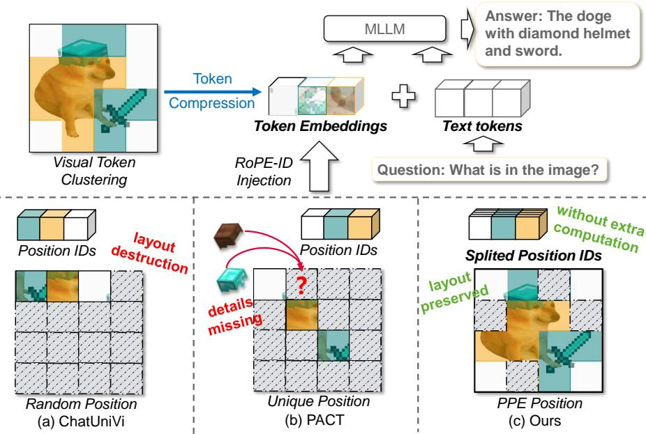
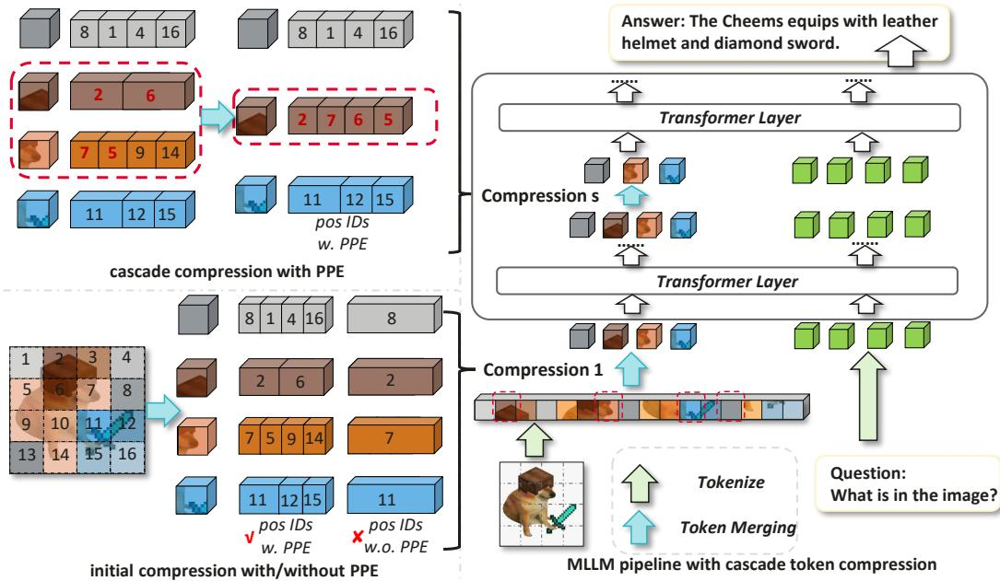
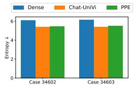
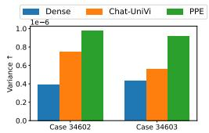
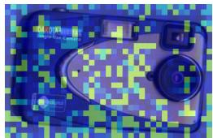
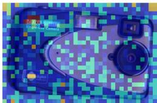

## ABSTRACT

Multimodal large language models (MLLMs) have achieved strong performance on vision-language tasks, yet often suffer from inefficiencies due to redundant visual tokens. Existing token merging methods reduce sequence length but frequently disrupt spatial layouts and temporal continuity by disregarding positional relationships. In this work, we propose a novel encoding operator dubbed as Positional Preservation Embedding (PPE), which has the main hallmark of preservation of spatiotemporal structure during visual token compression. PPE explicitly introduces the disentangled encoding of 3D positions in the token dimension, enabling each compressed token to encapsulate different positions from multiple original tokens. Furthermore, we show that PPE can effectively support cascade clustering — a progressive token compression strategy that leads to better performance retention. PPE is a parameter-free and generic operator that can be seamlessly integrated into existing token merging methods without any adjustments. Applied to state-of-the-art token merging framework, PPE achieves consistent improvements of 2% ∼ 5% across multiple vision-language benchmarks, including MMBench (general vision understanding), TextVQA (layout understanding) and VideoMME (temporal understanding). These results demonstrate that preserving positional cues is critical for efficient and effective MLLM reasoning. Our code is available at https://github.com/MouxiaoHuang/PPE.

## 1 INTRODUCTION

Multimodal Large Language Models (MLLMs) have recently achieved remarkable success across a range of vision-language understanding tasks Bai et al. (2025); Lei et al. (2025); Li et al. (2024a); Yuan et al. (2025); Zhang et al. (2025). A common paradigm involves encoding images or video frames into dense visual tokens, which are then fed into the language model for joint understanding. However, this dense representation is often highly redundant, leading to inefficiencies in computation and inference Song et al. (2024). To address this, recent works Dhouib et al. (2025); Jin et al. (2024); Ma et al. (2023); Zeng et al. (2022); Zhang et al. (2024a) have explored visual token compression, which merges similar tokens to reduce visual sequence length while preserving semantic information, thereby accelerating inference and lowering memory usage.

Despite the efficiency, existing compression methods often disrupt the spatial and temporal structure of visual inputs, limiting their applicability in layout-sensitive tasks such as counting, temporal grounding and sequential understanding. As shown in Figure 1 (a), clustering-based Chat-UniVi Jin et al. (2024) token compression may discard fine-grained spatial or temporal cues. Figure 1 (b) illustrates the recent methods like PACT Dhouib et al. (2025) which have attempted to preserve layouts during compression, but still remain constrained by the insufficient and imprecise positions.

In this work, we introduce Positional Preservation Embedding (PPE), a novel positional encoding strategy which explicitly retains the different spatiotemporal layout into one compressed token. Our design is motivated by two key principles. First, we aim to preserve spatial and temporal positions during similar token merging. To this end, PPE firstly assigns each visual token a positional ID (e.g.,

  
Figure 1: Comparison between PPE and other token merging methods of processing positional IDs. To simplify, the components such as the visual encoder are omitted. (a) ChatUniVi Jin et al. (2024) mainly assigns randomize ID value to the clustered visual tokens. (b) PACT Dhouib et al. (2025) retains the ID of the cluster center for the clustered visual tokens. (c) Proposed PPE splits the IDs of compressed token on different dimensions, so that each compressed token could contain several original position IDs.

2D spatial for images and 3D spatiotemporal for videos). During compression, each merged token retains several positional IDs of their constituents. This ensures that most of the visual scene layouts are still accessible to MLLM at high compression rates, as shown in Figure 1 (c).

Secondly, we support the widely adopted cascaded compression strategy, which performs token merging progressively across the Transformer Vaswani et al. (2017) layers. This design is inspired by the observation that different layers capture increasingly abstract representations with higher similarity Bolya et al. (2023a); Dhouib et al. (2025); Song et al. (2024); Zhang et al. (2024a). Thus, merging tokens in a multi-stage manner enables higher compression ratios without collapsing the shallow semantics prematurely. Since PPE is decoupled from the merging algorithm and operates solely on position IDs, it naturally extends to multi-stage compression. This allows our method to preserve fine-grained spatiotemporal layouts across multiple compression stages, resulting in higher compression ratio, IDs retention (Section 4.4.5) and improved performance (Section 4.3).

To our best knowledge, PPE is the first work that explores an effective and lightweight positional preservation solution during visual token compression of MLLM. In contrast to existing positional embedding methods that only preserves one position for single token and lead to the loss of detailed layouts, PPE enables each single token to represent multiple positions, thus preserving the vision layout more completely. Moreover, PPE is parameter-free and can be used in a plug-and-play fashion for easily implanting into existing visual token compression methods without any additional computational costs.

In the experiments, we apply PPE for tackling a variety of vision-language tasks, including general vision-language understanding on MMBench Liu et al. (2024a), text-based visual reasoning on TextVQA Singh et al. (2019), temporal understanding on VideoMME Fu et al. (2024), etc. The reported performances consistently outstrip previous compression methods Dhouib et al. (2025); Jin et al. (2024) by significant margins after fine-tuning. We strongly believe that PPE can make inroads into domains of sparse token representing in MLLM where dense visual representation had previously reigned supreme.

The main contributions of this work are as follows:

• We identify a critical limitation in existing visual token merging methods—namely, the neglect of spatial structure preservation and temporal coherence—which leads to distortion of intra-frame layouts and disruption of inter-frame temporal relations.

• We propose Positional Preservation Embedding (PPE), a novel, plug-and-play approach that explicitly preserves spatiotemporal integrity during token merging, effectively addressing both spatial and temporal challenges.

• We further show that PPE can be applied in cascade compression manner within multiple transformer layers of the MLLM, enabling substantial compression with minimal performance degradation.

• We conduct extensive experiments across serveal image and video benchmarks, demonstrating that PPE maintains accuracy while reducing the visual token count by 90% and outperforms other visual token compression methods at comparable reduction ratios.

## 2 RELATED WORK

## 2.1 MULTIMODAL LARGE LANGUAGE MODELS

MLLMs extend traditional LLMs by incorporating visual inputs, enabling unified vision-language understanding and generation. Recent models such as Flamingo Alayrac et al. (2022), the LLaVA series Li et al. (2024a); Liu et al. (2023); Zhang et al. (2024b), and the Qwen-VL series Bai et al. (2023; 2025); Wang et al. (2024) achieve strong performance across captioning, VQA, and instruction following. These models typically align vision and language via cross-attention, projection modules, or lightweight multimodal transformers. However, most rely on dense visual tokens, posing efficiency and scalability challenges for high-resolution or long-form visual inputs. Extensions such as Video-LLaVA Lin et al. (2024), VideoChat Li et al. (2023b), and Video-LLaMA Zhang et al. (2023) mitigate this via frame sampling or sparse memory. In contrast, our method introduces a Positional Preservation Embedding that enables substantial token reduction while maintaining spatiotemporal coherence, offering a scalable alternative for multimodal reasoning.

## 2.2 VISUAL TOKEN MERGING

To improve the efficiency of MLLMs, recent works have explored visual token reduction strategies Kong et al. (2025) such as clustering and merging Bolya et al. (2023a); Xu et al. (2022); Ma et al. (2023); Zeng et al. (2022); Dhouib et al. (2025); Song et al. (2024); Jin et al. (2024); Yang et al. (2025). These methods significantly reduce the sequence length of image or video inputs, enabling faster inference and reduced memory consumption. Techniques include token matching Bolya et al. (2023a), hierarchical clustering Ma et al. (2023); Zeng et al. (2022), group-based representation Xu et al. (2022), and pruning-clustering hybrids Dhouib et al. (2025), with extensions to long-video understanding via sparse memory representations Song et al. (2024) and unified token compression across modalities Jin et al. (2024). Despite their effectiveness, these methods typically discard original positional information, which can disrupt spatial layouts and temporal continuity—limiting performance on fine-grained visual reasoning tasks. In contrast, our approach explicitly preserves spatiotemporal position cues throughout compression, maintaining structural fidelity while achieving substantial token reduction.

## 2.3 POSITIONAL ENCODING IN MLLMS

Positional encoding Vaswani et al. (2017) is essential in MLLMs to maintain spatial and temporal relationships across vision and language tasks. The Rotary Position Embedding (RoPE) Su et al. (2024) is a widely adopted method, which captures relative token positions in sequences using a rotational mechanism. This has been extended to 2D RoPE Heo et al. (2024), which is well-suited for image tasks, enabling models to understand spatial locality in vision transformers (ViTs). For video and temporal tasks, the Qwen series introduced 3D MRoPE Bai et al. (2023); Wang et al. (2024), which integrates rotary encoding across both spatial and temporal dimensions, preserving continuity across frames. However, these methods often face challenges in visual token compression, as reducing token counts can lead to the loss of crucial positional information. In contrast, we propose PPE: Positional Preservation Embedding, a novel approach that maintains spatiotemporal positional cues during token reduction, preserving structural integrity while enabling aggressive compression. This method, to the best of our knowledge, is a new exploration in the field.

  
Figure 2: The overview pipeline of the proposed PPE with cascade compression. Left: Main idea of Positional Preservation Embedding (PPE) integrated in token compression. For each RoPE ID in compressed token embedding, PPE splits the dimension into chunks to prefill multiple position IDs. The IDs of tokens with high importance scores are reserved preferentially. Right: The MLLM pipeline integrating PPE and cascade compression. Token compression is applied in multiple layers, each with PPE. See main text for more explanation.

## 3 METHODOLOGY

In this section, we first recap the preliminaries of PPE, and then analyze why previous methods fail to hold the positional information. Afterward, we introduce our proposed PPE and cascade compression, as illustrated in Figure 2.

## 3.1 PRELIMINARY

Rotary Position Embeddings in MLLM. RoPE Su et al. (2024) is a positional encoding technique designed to enhance the Transformer Vaswani et al. (2017) architecture by integrating relative positional information directly into the self-attention mechanism. Unlike traditional absolute positional encodings, RoPE applies a rotation to the query and key vectors in multi-head attention, enabling the model to capture relative positions effectively. Assumed that token vector $\mathbf { z } \in \mathbb { N } ^ { D }$ in multi-head attention, the rotation operation can be represented as:

$$
\mathrm{RoPE} (z _ {d}, m) = e ^ {i m \theta_ {d}} z _ {d}, d = 1 \dots D,\tag{1}
$$

where m indicates the position ID of z. For capturing spatiotemporal layouts, Qwen2.5-VL Bai et al. (2025) introduces M-RoPE, a structured embedding scheme that partitions the embedding dimension, each encoding positional information along different visual axis—such as temporal order, image height, and width. Formally, the original RoPE rotation operation is modified to:

$$
\mathbf {M} \mathrm{-RoPE} (z _ {d}, m _ {d}) = e ^ {i m _ {d} \theta_ {d}} z _ {d}, d = 1 \dots D,\tag{2}
$$

where $\mathbf { m } \in \mathbb { Z } ^ { D }$ is pre-filled 2D or 3D visual position IDs. Assumed that the 3D visual token is at position (t, h, w), the $\{ m _ { d } \}$ could be indicated as:

$$
m _ {d} = \left\{ \begin{array}{l l} t, & d = 1 \ldots D _ {1}, \\ h, & d = D _ {1} + 1 \ldots D _ {1} + D _ {2}, \\ w, & d = D _ {1} + D _ {2} + 1 \ldots D _ {1} + D _ {2} + D _ {3}, \end{array} \right.\tag{3}
$$

where $D _ { 1 } , D _ { 2 } , D _ { 3 }$ are human-crafted integer to control the size of mrope sections Bai et al. (2025) satisfying that $D _ { 1 } + D _ { 2 } + D _ { 3 } = D$

Visual Token Compression. ChatUniVi Jin et al. (2024) adopts a lightweight, parameter-free clustering algorithm for token compression to mitigate the computational overhead of long visual token sequences. The key idea is to merge tokens with DPC-KNN Du et al. (2016) based on token similarity. Assumed that N visual token embeddings $\{ \mathbf { z } _ { i } \in \mathbb { R } ^ { D } \} _ { i = 1 } ^ { N }$ are clustered to M groups, $\{ \mathbf { z } _ { i } \} _ { i \in C _ { j } }$ indicates the token embeddings in group j. The compressed token embeddings $\mathbf { z } _ { j } ^ { \prime }$ is defined as:

$$
\mathbf {z} _ {j} ^ {\prime} = \frac {1}{| C _ {j} |} \sum_ {i \in C _ {j}} \mathbf {z} _ {i}, j = 1... M.\tag{4}
$$

## 3.2 POSITIONAL PRESERVATION EMBEDDING

While similarity-based compression effectively reduces sequence length, it disrupts fine-grained spatiotemporal layouts. To mitigate this, we propose Positional Preservation Embedding (PPE), which retains multiple positional cues per merged token to preserve structural information.

PPE builds on the principle behind RoPE Su et al. (2024), in which the rotation of position embeddings is independent at the dimension. As a result, the m in Equation 1 can be totally different on the dimension D to represent different positions at the same time. For instance, M-RoPE Wang et al. (2024) partitions embedding dimensions into several groups to store spatiotemporal positions, formally in Equation 2. Inspired by this, PPE merges different positions to one merged token by splitting into more groups. Formally, the merged PPE ID mˆ could be indicated as:

$$
\hat {m} _ {d} = m _ {k, d}, d = (k - 1) \frac {D}{K} + 1 \dots k \frac {D}{K},\tag{5}
$$

where $K$ is a fixed hyper-parameter to represent the maximum capacity of PPE, and $\left\{ \mathbf { m } _ { k } \right\} ^ { K }$ is the set of different position IDs in 1D RoPE manner before merging. Note that K is always divisible by dimension $D .$ . In M-RoPE manner, $K$ is set to the greatest common divisor of the mrope sections, guaranteed that each dimension is evenly cut into K groups:

$$
\hat {m} _ {d} ^ {3 D} = m _ {k, d} ^ {3 D}, d = \left\{ \begin{array}{l l} (k - 1) \frac {D _ {1}}{K} + 1 & \dots k \frac {D _ {1}}{K}, \\ (k - 1) \frac {D _ {2}}{K} + D _ {1} + 1 & \dots k \frac {D _ {2}}{K} + D _ {1}, \\ (k - 1) \frac {D _ {3}}{K} + D _ {1} + D _ {2} + 1 & \dots k \frac {D _ {3}}{K} + D _ {1} + D _ {2}. \end{array} \right.\tag{6}
$$

The key insight shared of PPE is that similar token embeddings can share their feature embeddings during token merging. Rather than assigning a single position ID to a merged token, we extend this idea to a multi-position formulation that better reflects the internal diversity of a token cluster - containing more positional information of original input visual tokens. Specifically, consider a cluster group $C _ { j }$ containing token embeddings $\{ \mathbf { z } _ { i } \} _ { i \in C _ { j } }$ with corresponding position IDs $\{ \mathbf { m } _ { i }$ . Rather than choosing one representative ID, we select the top-K IDs per cluster which are scored by the distance from the cluster center. Note that the score is higher if the token is closer to the cluster center Jin et al. (2024). If $| C _ { j } | < K$ , high-weight tokens are repeated to fill the slots. Denote the merged IDs of PPE as mˆ , the PPE rotation of vector z is simply follow the RoPE which could be formulated as:

$$
\mathrm{PPE} (z _ {d}, \hat {m} _ {d}) = e ^ {i \hat {m} _ {d} \theta_ {d}} z _ {d}, d = 1 \dots D,\tag{7}
$$

## 3.3 CASCADE COMPRESSION WITH PPE

In this section, we further investigate the effectiveness of cascade compression in conjunction with our proposed Positional Preservation Embedding (PPE) strategy. Cascade compression is a widely adopted technique in token compression Bolya et al. (2023a); Dhouib et al. (2025); Song et al. (2024); Zhang et al. (2024a), motivated by the observation that deeper Transformer layers exhibit greater representational redundancy Dong et al. (2021), whereas earlier layers encode critical lowlevel semantics that are less amenable to aggressive compression.

To this end, we implement a cascaded PPE-based compression pipeline built upon ChatUniVi Jin et al. (2024), as illustrated in Figure 2. In this design, visual token clustering is applied not only prior to feeding tokens into the LLM, but also within selected LLM layers. Leveraging PPE, we preserve original positional information, enabling efficient computation of new cluster center positions after each merge.

For PPE ID assignment, we follow the standard top-K selection strategy described in Section 3.2, choosing token IDs with minimal distance to the cluster center. As shown in Figure 2, during repeated merges, the number of preserved position IDs reduces gradually (e.g., retaining only four IDs when two previously merged tokens are merged again).

Experimental results demonstrate that this cascaded PPE design maintains fine-grained spatial structure across compression stages and achieves higher compression ratio without performance loss. Moreover, this design significantly improves both ID retention (Section 4.4.5) and downstream task performance (Section 4.3). These findings confirm the strong compatibility of PPE with standard cascaded compression frameworks.

## 4 EXPERIMENT

## 4.1 EXPERIMENTAL SETUP

Datasets. To demonstrate the effectiveness of PPE, we construct our training datasets for supervised fine-tuning (SFT) referring to the public projects: LLaVA-Video-178k Zhang et al. (2024b) and LLaVA-OneVision Li et al. (2024a). Limited by the computational costs, we adopted even down-sampling on these datasets. To highlight the improvements of the model on image and video benchmarks, we further set up two different settings: one for images and another for videos. Specifically, we utilized about 120K video samples to fine-tune the models for multimodal video benchmarks, while 300K image samples to the models for the multimodal image benchmarks.

Evaluation Benchmarks. We use VideoMME Fu et al. (2024) as our primary benchmark for multimodal video analysis. To assess generalization, we also report results on NeXT-QA (multi-choice and open-ended) Xiao et al. (2021), SEED-Bench-Video Li et al. (2023a), and MVBench Li et al. (2024b). For image understanding, we evaluate on MMBench (CN/EN) Liu et al. (2024a) and SQA Iyyer et al. (2017) to assess general visual comprehension. To further examine text-rich layout and document understanding, we include TextVQA Singh et al. (2019), DocVQA Mathew et al. (2021), OCRBench Liu et al. (2024b), and ChartQA Masry et al. (2022). All reported metrics follow the evaluation criteria of their respective benchmarks, and unless otherwise noted, higher values indicate better performance.

Implementation Details. We conduct our default experimental settings by using the Qwen2.5-VL-3B-Instruct model Bai et al. (2025). All models are fine-tuned in a fully supervised manner on the down-sampled datasets with all parameters unfrozen. The training setting is mainly referring to the public project Lee (2024), in which the gradient accumulation step is 4, the learning rate is $1 \mathrm { e } { - } 5$ along with the warm-up ratio of 0.03, while the learning rate of visual encoder and patch merger is $2 \mathrm { e } { - } 6$ and 1e−5, respectively. We train for only 1 epoch. To maintain the optimal performance and computational costs for both training and evaluation, we mainly follow the official input size configurations. Specifically, we set image min pixel $\mathrm { \Delta s = 5 1 2 \times 2 8 ~ \times }$ 28 and image max pixels = 1280×28×28 for image inputs, and video min pixel $s = 1 2 8 \times 2 8 \times 2 8$ and video max pixel $\mathrm { s } = 7 6 8 \times 2 8 \times$ 28 for video inputs. Additionally, the maximum number of video frames is set to 64 due to the limited memory usage. The 3D M-RoPE section is set to [16, 24, 24], while [32, 32] for the 2D manner. The number of preserved token IDs is set to $K = 8$ for 3D and $K = 3 2$ for 2D, which corresponds to the greatest common divisor (GCD) of M-RoPE sections.

Token compression settings. The proposed PPE can be integrated into most existing compression methods. For our experiments, we adopt the SOTA clustering-based framework Chat-UniVi Jin et al. (2024) and follow its default training strategy, with slight modifications to adapt to the Qwen2.5-VL model. In Chat-UniVi, the number of clustered tokens is controlled by a predefined clustering ratio due to the native resolution technique. Specifically, the spatial clustering ratio is set to 0.45, while the temporal clustering ratio is 0.0625, consistent with the original paper. For fair comparison, token clustering is applied at the interface between the vision encoder and the LLM by default.

Table 1: The overall performance comparison across different benchmarks. The Dense model is a simply Qwen2.5-VL-3B-Instruct model fine-tuned on our SFT datasets. The subscript S/ST indicates spatial-only and spatiotemporal compression, respectively. Bold denotes the best performance among compressed variants, and underline denotes the best overall including the Dense baseline. The image average score is calculated without OCRBench.

<table><tr><td>Benchmarks</td><td>Dense</td><td>+Chat-UniVis</td><td>+PPEs (Ours)</td><td>+Chat-UniVist</td><td>+PPEst (Ours)</td></tr><tr><td>MMBench (EN)</td><td>85.89</td><td>84.92</td><td>84.73 (-0.19)</td><td>-</td><td>-</td></tr><tr><td>MMBench (CN)</td><td>86.07</td><td>83.71</td><td>84.87 (+1.16)</td><td>-</td><td>-</td></tr><tr><td>SQA</td><td>76.90</td><td>77.30</td><td>77.88 (+0.58)</td><td>-</td><td>-</td></tr><tr><td>TextVQA</td><td>79.50</td><td>57.66</td><td>77.14 (+19.48)</td><td>-</td><td>-</td></tr><tr><td>DocVQA</td><td>89.44</td><td>52.48</td><td>76.79 (+24.31)</td><td>-</td><td>-</td></tr><tr><td>OCRBench</td><td>761</td><td>535</td><td>691 (+156)</td><td>-</td><td>-</td></tr><tr><td>ChartQA</td><td>79.96</td><td>49.60</td><td>74.52 (+24.92)</td><td>-</td><td>-</td></tr><tr><td>Image Average</td><td>82.96</td><td>67.61</td><td>79.32 (+11.71)</td><td>-</td><td>-</td></tr><tr><td>VideoMME (w/o subs)</td><td>57.81</td><td>57.22</td><td>58.70 (+1.48)</td><td>56.07</td><td>57.41 (+1.34)</td></tr><tr><td>VideoMME (w subs)</td><td>57.96</td><td>57.22</td><td>59.07 (+1.85)</td><td>56.15</td><td>57.78 (+1.63)</td></tr><tr><td>NeXT-QA (MC)</td><td>78.20</td><td>77.63</td><td>78.42 (+0.42)</td><td>77.59</td><td>77.99 (+0.4)</td></tr><tr><td>NeXT-QA (OE)</td><td>31.65</td><td>25.37</td><td>32.61 (+7.24)</td><td>26.55</td><td>31.95 (+5.4)</td></tr><tr><td>SEED-Bench-Video</td><td>57.60</td><td>56.08</td><td>55.98 (-0.10)</td><td>53.47</td><td>54.19 (+0.72)</td></tr><tr><td>MVBench</td><td>67.90</td><td>66.90</td><td>67.38 (+0.48)</td><td>64.38</td><td>66.42 (+2.04)</td></tr><tr><td>Video Average</td><td>58.52</td><td>56.74</td><td>58.69 (+1.95)</td><td>55.70</td><td>57.62 (+1.92)</td></tr><tr><td>Reduction Ratio</td><td>0%</td><td>55%</td><td>55%</td><td>94%</td><td>94%</td></tr></table>

## 4.2 MAIN RESULTS

We evaluate the performance of our proposed method on a range of image and video benchmarks. The results show that PPE consistently outperforms previous approaches, demonstrating its effectiveness in both image and video understanding.

Image Tasks. Table 1 illustrates the strong performance of PPE on image understanding benchmarks. Despite reducing visual tokens by 55%, PPE achieves competitive or superior performance across all tasks. It significantly outperforms Chat-UniVi in overall accuracy (79.32% vs. 67.61%) and on TextVQA (77.14% vs. 57.66%), while maintaining comparable results on other tasks. Compared to the full-token Dense baseline model, PPE shows only a minor acceptable performance drop in overall accuracy (82.96% vs. 79.32%), despite using less than half the visual tokens.

Video Tasks. As shown in Table 1, under a 55% token reduction with spatial-only compression, PPE consistently outperforms Chat-UniVi across most tasks and in overall accuracy (58.69% vs. 56.74%), even exceeding the Dense baseline. With a more aggressive 94% reduction using spatiotemporal compression, PPE again leads in overall score (57.32% vs. 55.7%), demonstrating strong robustness under heavy compression. Notably, on challenging benchmarks like VideoMME and NeXT-QA (OE), PPE shows clear improvements over Chat-UniVi.

Summary. In summary, PPE achieves substantial token reduction—55% for spatial-only compression and 94% for spatiotemporal compression—while preserving, or in some cases even enhancing, downstream task performance. This demonstrates that preserving visual token IDs enables more accurate reconstruction of the spatial layout and temporal order, even under aggressive compression, thereby improving reasoning capabilities, as illustrated in Fig. 1.

Comparison with M-RoPE. As reported in Table 1, Dense model adopts M-RoPE by default, and thus Chat-UniVi directly inherits this design. In contrast, our PPE strategy compresses visual tokens while still retaining the positional information of merged tokens within a single representation. This design leads to consistently stronger results under identical reduction ratios, highlighting that PPE is more effective than M-RoPE in preserving positional cues during token compression.

Comparison of MLLMs with Intact and Compressed Tokens. We compare our PPE with representative dense MLLMs, including LLaVA-OneVision Li et al. (2024a), InternVL2.5 Chen et al. (2024), and Qwen2.5-VL Bai et al. (2025), as well as token compression approaches such as PACT Dhouib et al. (2025) and SparseVLM Zhang et al. (2024a), as shown in Table 2. All baseline results are reported by their respective original papers. Note that Chat-UniVi Jin et al. (2024) is excluded due to missing benchmark results. Despite using only 3B parameters, PPE achieves competitive performance compared to both dense and compressed models, with a 55% token reduction ratio. PPE\* refers to a cascade compression variant applied within the LLM (details in Section 4.3), which further improves the reduction ratio to 90% while maintaining comparable performance.

Table 2: Comparison of MLLMs with intact tokens and compressed tokens.

<table><tr><td>Model</td><td>VideoMME (w/o subs)</td><td>VideoMME (w subs)</td><td>MVBench</td><td>MMBench (EN)</td><td>MMBench (CN)</td><td>TextVQA</td><td>Reduction Ratio</td></tr><tr><td>LLVA-OneVision-0.5B</td><td>44.00</td><td>43.50</td><td>45.50</td><td>52.10</td><td>-</td><td>-</td><td>0%</td></tr><tr><td>InternVL2.5-4B</td><td>62.30</td><td>63.60</td><td>71.60</td><td>81.10</td><td>79.30</td><td>76.80</td><td>0%</td></tr><tr><td>Qwen2.5-VL-3B</td><td>61.50</td><td>67.60</td><td>67.00</td><td>79.10</td><td>78.10</td><td>79.30</td><td>0%</td></tr><tr><td>PACT-7B</td><td>57.60</td><td>-</td><td>-</td><td>80.30</td><td>-</td><td>75.00</td><td>67%</td></tr><tr><td>SparseVLM-7B</td><td>-</td><td>-</td><td>-</td><td>64.10</td><td>-</td><td>57.80</td><td>66%</td></tr><tr><td>PPE-3B (Ours)</td><td>58.70</td><td>59.07</td><td>67.38</td><td>84.78</td><td>84.85</td><td>77.08</td><td>55%</td></tr><tr><td>PPE*-3B (Ours)</td><td>58.48</td><td>58.52</td><td>67.35</td><td>-</td><td>-</td><td>-</td><td>90%</td></tr></table>

Table 3: Performance of cascade compression, PPE integrated Before and/or Within-LLM.

<table><tr><td>Before</td><td>Within</td><td>VideoMME (w/o subs)</td><td>VideoMME (w subs)</td><td>NeXT-QA (MC)</td><td>NeXT-QA (OE)</td><td>SEED-Bench -Video</td><td>MVBench</td><td>Average</td><td>Reduction Ratio</td></tr><tr><td>✘</td><td>✘</td><td>56.41</td><td>56.49</td><td>78.07</td><td>32.99</td><td>55.12</td><td>68.25</td><td>57.91</td><td>0%</td></tr><tr><td>✓</td><td>✘</td><td>58.70</td><td>59.07</td><td>78.42</td><td>32.61</td><td>55.98</td><td>67.38</td><td>58.69</td><td>55%</td></tr><tr><td>✓</td><td>✘</td><td>57.41</td><td>57.70</td><td>77.98</td><td>31.06</td><td>55.36</td><td>66.65</td><td>57.69</td><td>90%</td></tr><tr><td>✘</td><td>✓</td><td>58.48</td><td>58.52</td><td>78.20</td><td>32.20</td><td>56.11</td><td>67.35</td><td>58.48</td><td>90%</td></tr></table>

## 4.3 CASCADE COMPRESSION

In addition to applying our PPE compression before the LLM, we further investigate its integration within the LLM to enable multi-layer cascade token compression. Specifically, we conduct a layer-wise insertion study using the Qwen2.5-VL-3B-Instruct model, which contains 36 transformer layers. Specifically, we insert PPE-based clustering modules at layers 11, 23, and 35, while keeping all other configurations unchanged.

As shown in Table 3, applying PPE within the LLM using a per-layer clustering ratio of 0.45 achieves a 90% token reduction while maintaining performance comparable to the 55%-reduction case. Under the same 90% reduction budget, the within-LLM configuration outperforms applying PPE only before the LLM, demonstrating that cascade compression across multiple stages enables higher compression ratios without prematurely collapsing shallow semantics.

## 4.4 ABLATION STUDY

In this section, we study the insight of PPE, its compatibility with other clustering-based compression methods, inference efficiency, and the effect of retaining different numbers of token ID positions to verify its ability to preserve positional information. Further studies on different reduction ratios A.1, aggregation stages A.2, model size generalization A.4, backbone generalization A.3, task generalization A.5, etc, are provided in the Appendix A.

## 4.4.1 INSIGHT INTO WHY PPE BETTER PRESERVES TOKEN SEMANTICS

The key insight of PPE lies in its ability to simultaneously encode multiple positions within a single token. Specifically, unlike traditional RoPE where multiple frequencies are rigidly bound to a single positional index, PPE introduces flexibility by allowing different frequencies to bind to different positional indices—as long as the corresponding tokens are considered similar in the clustering. As a result, during attention computation, each token can attend to multiple combinations of frequencies and positional indices. This enables each token pair to perceive a richer set of relative positional relationships, thereby preserving the global positional layout despite compression.

We randomly selected two samples and evaluated text–visual attention at the final LLM layer under a 55% token compression ratio. As shown in Figure 3(a–b), both Chat-UniVi and PPE reduce entropy compared to the dense baseline, while PPE achieves similar entropy but consistently higher variance, indicating sharper and more confident grounding under compression. This is further illustrated in Figure 3(c–d): for case 34602 (question: ”What is the brand of this camera?”), both models attend to the correct region, but Chat-UniVi’s focus is narrowly confined due to positional information loss and answers incorrectly, whereas PPE preserves coverage across the text, recovering the full brand name. More samples and analyses are provided in Appendix A.7.

Table 4: Ablation of PPE integration with clustering-based compression and inference efficiency.

<table><tr><td>Method</td><td>MMBench (EN)</td><td>MMBench (CN)</td><td>TextVQA</td><td>LLM Generation (s) Time (s) ↓</td><td>Peak Memory Usage (GB) blue↓</td><td>Reduction Ratio</td></tr><tr><td>PACT</td><td>74.14</td><td>74.17</td><td>73.73</td><td>0.08</td><td>15.82</td><td>89%</td></tr><tr><td>PACT + PPE</td><td>74.48</td><td>75.00</td><td>73.87</td><td>0.09</td><td>15.82</td><td>89%</td></tr><tr><td>ToMe</td><td>74.31</td><td>73.63</td><td>74.94</td><td>0.90</td><td>15.81</td><td>57%</td></tr><tr><td>ToMe + PPE</td><td>74.57</td><td>74.74</td><td>76.16</td><td>0.91</td><td>15.81</td><td>57%</td></tr></table>

  
(a) Entropy comparison ↓

  
(b) Variance comparison ↑

  
(c) Chat-UniVi: ”d” ✗

  
(d) PPE:”dakota digital” ✓  
Figure 3: Attention statistics and visualizations of samples from TextVQA. (a–b) Quantitative comparison of entropy and variance. (c–d) Qualitative attention score visualizations of case 34602.

## 4.4.2 INTEGRATION WITH OTHER CLUSTERING-BASED METHODS

PPE is compatible with other clustering-based methods. When integrated into the training-free PACT Dhouib et al. (2025) and ToMe Bolya et al. (2023b), experiments on Qwen2-VL-7B-Instruct Wang et al. (2024) show consistent improvements over the baselines (Table 4). This compatibility arises because PPE preserves the correspondence between tokens and their RoPE components: cluster averaging keeps embeddings close, and associating merged tokens with all original RoPE indices maintains positional information. When training is allowed, PPE further improves RoPE allocation, yielding more robust joint token-position representations and enhancing performance (e.g., Chat-UniVi + PPE, Table 1).

To further demonstrate PPE’s generality across different compression frameworks, we conduct extensive experiments on VisionZip Yang et al. (2025), which combines pruning and merging and supports both training-free and SFT settings. We simply integrate PPE into VisionZip on Qwen2.5- VL-3B-Instruct following the official instructions (dominant ratio and contextual ratio are set 0.40 and 0.05 respectively to achieve 55% reduction ratio), randomly sampling 1/10 of our curated dataset for the SFT setting and only fine-tuning the projector for one epoch. The results are shown in Table 5. In both settings, PPE delivers improvements in most cases, especially on layoutand OCR-sensitive benchmarks, demonstrating that PPE retains more spatial information under the same reduction ratio. Moreover, when training is allowed, PPE achieves larger gains. Our method is decoupled from model size., extensive experiments are provided in Appendix A.4.

## 4.4.3 SFT OR TRAINING-FREE

PPE is a plug-and-play, parameter-free method. Whether SFT is required depends on the underlying compression method, not PPE itself: 1) Chat-UniVi is a merging-based method that requires SFT, and performs bad in training-free setting especially on layout-sensitive benchmarks. 2) PACT and ToMe are fully training-free, and PPE is directly applied to the official pre-trained models without any additional training. 3) VisionZip supports both training-free and SFT usage, and PPE improves performance in both settings without modifying their token selection or aggregation mechanisms. This supports our key claim that PPE can enhance existing token compression pipelines in a plugand-play manner and can further improve RoPE allocation when training is allowed.

Table 5: Extensive comparisons under both training-free and SFT using Qwen2.5-VL-3B-Instruct.

<table><tr><td>Setting</td><td>Benchmarks</td><td>Dense</td><td>Chat-UniVi</td><td>Chat-UniVi+PPE</td><td>VisionZip</td><td>VisionZip+PPE</td></tr><tr><td rowspan="6">Training-Free</td><td>MMBench (EN)</td><td>79.10</td><td>81.50</td><td>82.28 (+0.78)</td><td>83.48</td><td>83.18 (-0.30)</td></tr><tr><td>MMBench (CN)</td><td>78.10</td><td>80.06</td><td>81.43 (+1.37)</td><td>81.75</td><td>81.64 (-0.11)</td></tr><tr><td>TextVQA</td><td>79.30</td><td>37.60</td><td>73.78 (+36.18)</td><td>79.00</td><td>79.62 (+0.62)</td></tr><tr><td>DocVQA</td><td>93.90</td><td>19.58</td><td>66.16 (+46.58)</td><td>83.98</td><td>85.63 (+1.65)</td></tr><tr><td>OCRBench</td><td>797</td><td>307</td><td>598 (+291)</td><td>713</td><td>725 (+12)</td></tr><tr><td>ChartQA</td><td>84.00</td><td>18.72</td><td>67.08 (+48.52)</td><td>79.72</td><td>80.72 (+1.00)</td></tr><tr><td rowspan="6">SFT</td><td>MMBench (EN)</td><td>85.89</td><td>84.92</td><td>84.73 (-0.19)</td><td>83.99</td><td>83.78 (-0.21)</td></tr><tr><td>MMBench (CN)</td><td>86.07</td><td>83.71</td><td>84.87 (+1.16)</td><td>82.12</td><td>82.63 (+0.15)</td></tr><tr><td>TextVQA</td><td>79.50</td><td>57.66</td><td>77.14 (+19.48)</td><td>80.02</td><td>82.06 (+2.04)</td></tr><tr><td>DocVQA</td><td>89.44</td><td>52.48</td><td>76.79 (+24.31)</td><td>84.84</td><td>90.52 (+5.68)</td></tr><tr><td>OCRBench</td><td>761</td><td>535</td><td>691 (+156)</td><td>711</td><td>780 (+69)</td></tr><tr><td>ChartQA</td><td>79.96</td><td>49.60</td><td>74.52 (+24.92)</td><td>80.20</td><td>82.36 (+2.16)</td></tr><tr><td></td><td>Reduction Ratio</td><td>0%</td><td>55%</td><td>55%</td><td>55%</td><td>55%</td></tr></table>

Table 6: Ablation study on performance and retained ID ratio with varying K.

<table><tr><td>K</td><td>VideoMME (w/o subs)</td><td>VideoMME (w subs)</td><td>NeXT-QA (MC)</td><td>NeXT-QA (OE)</td><td>SEED-Bench -Video</td><td>MVBench</td><td>Average</td><td>Reduction Ratio</td><td>IDs Retained</td></tr><tr><td>1</td><td>57.74</td><td>58.04</td><td>77.88</td><td>28.77</td><td>55.07</td><td>68.08</td><td>57.97</td><td>55%</td><td>45%</td></tr><tr><td>8</td><td>58.70</td><td>59.07</td><td>78.42</td><td>32.61</td><td>55.98</td><td>67.38</td><td>58.69</td><td>55%</td><td>77%</td></tr><tr><td>24</td><td>58.19</td><td>58.56</td><td>78.02</td><td>31.64</td><td>55.52</td><td>67.73</td><td>58.28</td><td>55%</td><td>84%</td></tr></table>

## 4.4.4 ANALYSIS OF INFERENCE EFFICIENCY

PPE introduces no additional parameters and incurs negligible computational overhead. Since it operates by redistributing existing RoPE dimensions, the computational and memory savings primarily result from token reduction itself. To ensure fairness and reproducibility, we reused the official PACT code to report runtime and memory usage, as presented in Table 4. With same reduction ratios, PPE does not need extra parameter and introduce very few inference time demonstrating its efficiency.

## 4.4.5 EFFECT OF K ON PERFORMANCE AND RETAINED ID RATIO

The hyperparameter K determines how many token ID positions are retained after merging, thus affecting spatiotemporal preservation. As shown in Table 6 and Figure 1(b), K = 1 causes severe degradation due to insufficient positional information, while K = 24 introduces redundancy and slightly underperforms K = 8. The choice of K = 8 achieves the best trade-off, aligning with the GCD of the 3D M-RoPE dimensions [16, 24, 24] to preserve essential signals without over-retention, and is adopted as our default. Moreover, Table 6 shows that larger K values yield higher valid ID retention which refers to the ratio of distinct positional embeddings preserved after compression; for K > 1, the retention rate exceeds the visual token retention ratio (45%), confirming that PPE captures positional information beyond token counts. Further visualization analyses for different choices of K are presented in Appendix A.10.

## 5 CONCLUSION

In this work, we propose Positional Preservation Embedding (PPE), a simple yet effective operator for retaining spatiotemporal positional information during visual token compression in MLLMs. PPE encodes fine-grained spatial and temporal cues into each compressed token and is parameterfree, plug-and-play, and compatible with existing pipelines without architectural changes. Experiments on MMBench, TextVQA, and VideoMME show consistent 2% ∼ 5% gains, validating its effectiveness and generality. PPE also supports cascade clustering for progressive compression, offering a flexible trade-off between efficiency and performance. Our results underscore the impor tance of positional information in improving MLLM efficiency.