## ABSTRACT

Recently, efficient Multimodal Large Language Models (MLLMs) have gained significant attention as a solution to their high computational complexity, making them more practical for real-world applications. In this regard, the knowledge distillation (KD) approach has emerged as a promising alternative, which transfers the rich visual and linguistic knowledge from a larger model (teacher) to a smaller model (student). However, we observe that existing KD methods struggle to effectively distill the teacher MLLM’s rich visual perception abilities to the student, a challenge that has been largely overlooked in previous studies. Through a systematic analysis, we identify visual attention misalignment between student and teacher as the main cause of this issue. Based on this insight, we propose CompoDistill, a novel KD framework that explicitly aligns the student’s visual attention with that of the teacher to enhance the student’s visual perception abilities. Our extensive experiments show that CompoDistill significantly improves performance on compositional reasoning tasks that require visual perception abilities while maintaining strong performance on visual question answering tasks, as done in existing studies. Furthermore, CompoDistill demonstrates effectiveness with a more advanced backbone, highlighting its generalizability.

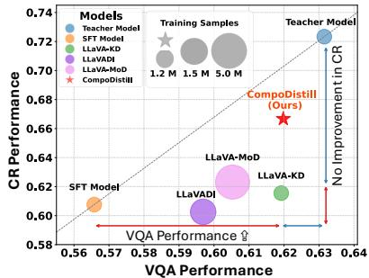  
(a) Comparison of KD methods

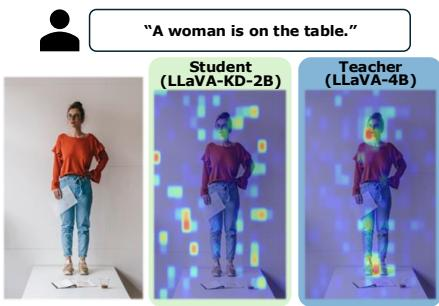  
(b) Visual attention misalignment  
Figure 1: (a) Comparison of the teacher (LLaVA-4B), SFT (LLaVA-2B), and various 2B KD methods distilled from the same teacher. (b) Visual attention misalignment between the student (LLaVA-KD-2B) and teacher (LLaVA-4B), where the student attends to irrelevant image regions for the text query A woman is on the table, in contrast to the teacher. For more examples including our proposed method, CompoDistill, please refer to Appendix A.

## 1 INTRODUCTION

Multimodal Large Language Models (MLLMs) (Liu et al., 2023; Lin et al., 2024b) have demonstrated superior performance on various vision-language tasks over vision-language models (Radford et al., 2021; Zhai et al., 2023), marking a significant step forward in multimodal learning. Yet, their advancement has largely been driven by scaling laws, which has resulted in ever-larger and more computationally demanding architectures (OpenAI, 2023; Qwen et al., 2025). The substantial computational and memory costs associated with such massive models pose considerable challenges for practical deployment. This has, in turn, intensified interest in developing efficient MLLMs that can maintain strong multimodal capabilities while mitigating resource requirements.

To this end, knowledge distillation (KD) (Cai et al., 2024; Shu et al., 2024; Xu et al., 2024) has emerged as a promising approach, transferring rich knowledge from a larger teacher model to a smaller student model. These KD-based methods have demonstrated effectiveness in visual question answering (VQA) tasks (e.g., GQA (Hudson & Manning, 2019)), which require visual recognition ability, outperforming the standard supervised fine-tuning (SFT model1 in Figure 1(a)).

Despite the progress of KD methods in visual recognition ability, a crucial question remains unexplored: Is visual perception ability equally well distilled? Visual recognition refers to tasks like object classification, where the goal is to identify objects in images based on their features. On the other hand, Visual perception involves more complex abilities, such as understanding relationships among objects and accurately capturing their attributes—capabilities essential for real-world multimodal applications2. To answer the question, in Figure 1(a), we compare the state-of-the-art KD methods (Shu et al., 2024; Cai et al., 2024; Xu et al., 2024) on VQA and compositional reasoning (CR) datasets, where VQA serves as a benchmark for evaluating visual recognition ability and CR is designed to assess visual perception ability3. We observe that, although existing KD methods show significant performance improvements on the VQA, their performance on the CR is on par with the SFT model, which is unexpected. Based on this observation, we argue that existing KD methods struggle to effectively distill visual perception abilityfrom the teacher model.

Beyond a simple performance comparison, we investigate the failure of the existing KD methods in distilling visual perception ability and analyze the attention maps of both the student (i.e., LLaVA-KD-2B (Cai et al., 2024)) and the teacher (i.e., LLaVA-4B (Liu et al., 2023)) models. Specifically, by visualizing their focus areas for a given text, we aim to identify differences in attention, which we believe are closely related to perception ability. As shown in Figure 1(b), we observe that the student model struggles to focus on the relevant regions, while the teacher model captures them effectively, revealing a clear mismatch in the attention distributions between the teacher and the student models. The discrepancy in attention distributions, which we term visual attention misalignment, reveals that although KD methods aim to transfer knowledge from the teacher to the student through knowledge distillation, the student fails to inherit the teacher’s powerful visual attention mechanism, thereby limiting the effective distillation of visual perception ability.

In this regard, we hypothesize that the limited performance improvement of KD methods in CR tasks arises from the visual attention misalignment between the teacher and student models. To empirically validate our hypothesis, we conduct controlled experiments examining the relationship between attention behavior and visual task performance in Section 3. Our results demonstrate that this misalignment is directly responsible for the unexpectedly low performance of the existing KD methods in CR tasks, and this study is the first to establish that addressing visual attention misalignment is the key to enhancing the student model’s visual perception ability.

Motivated by these findings, we propose CompoDistill, a novel KD framework aimed at effectively distilling the teacher’s rich visual perception abilities to the student model by addressing visual attention misalignment. We introduce the Visual ATtention alignment (VAT) module to explicit align the visual attention of the student model with that of the teacher model, using a simple yet effective group matching strategy, in which each student layer is matched with a group of teacher layers in a one-to-many manner, to handle the difference in the number of LLM layers between the teacher and student. However, the teacher’s visual attention is optimized for its own vision-language space, making a simple transfer via the VAT module ineffective within the student’s distinct and incompatible space. This mismatch creates a conflict between the student’s feature space and the imposed attention mechanism, ultimately restricting the model’s inherent perceptual abilities. To this end, we propose the Teacher Adapter Fetch (TAF) module to bridge this feature space gap and enable synergy with the VAT module. Building on this, we introduce a meticulously designed threestage training strategy that leverages both modules to comprehensively distill visual perception.

Through extensive experiments on multiple CR datasets, we demonstrate that CompoDistill significantly outperforms existing KD methods, demonstrating the effectiveness of CompoDistill in enhancing the student model’s visual perception ability. Meanwhile, CompoDistill maintains competitive performance on VQA datasets, preserving its visual recognition abilities. Furthermore, we demonstrate the effectiveness of CompoDistill with a more advanced backbone, highlighting its generalizability.

We summarize our contributions as follows: (1) We identify, for the first time, that existing KD methods in MLLMs fail to distill visual perception ability from the teacher and provide a detailed attention-based analysis, offering insights on how to enhance this ability. (2) We propose CompoDistill, a novel KD framework that transfers both visual recognition and perception abilities through the Visual ATtention alignment and the Teacher Adapter Fetch Module. (3) We achieve significant improvements in CR tasks by effectively distilling the visual perception ability, while maintaining competitive performance in VQA tasks by preserving the visual recognition ability.

## 2 PRELIMINARY

Multimodal Large Language Models (MLLMs). Following the LLaVA (Liu et al., 2023) design, MLLMs consist of three main components: a pre-trained LLM $L M _ { \theta } ( \cdot )$ , a vision encoder $V _ { \phi } ( \cdot )$ and an adapter $P _ { \psi } ( \cdot )$ . Given a text query $Q$ and an image $I \in \mathbb { R } ^ { H \times W \times \dot { 3 } }$ , where H and W denote the image height and width, the vision encoder extracts patch-level features $\mathbf { z } _ { p } = V _ { \phi } ( I ) \in \mathbb { R } ^ { N _ { v } \times d _ { p } }$ with $\bar { N _ { v } } ^ { \bar { } }$ being the number of visual patches and $d _ { p }$ the hidden dimension of ${ \dot { V _ { \phi } } } .$ . The adapter projects them into the language space as $\mathbf { x } _ { v } = P _ { \psi } ( \mathbf { z } _ { p } ) \in \mathrm { \bar { \mathbb { R } } } ^ { N _ { v } \times d }$ , where d is the hidden dimension of $L M _ { \theta }$ Hereafter, we refer to $\mathbf { x } _ { v }$ as the visual tokens. Meanwhile, the query $Q$ is tokenized into embeddings $\mathbf { x } _ { t } \in \mathbb { R } ^ { N _ { t } \times d }$ , where $N _ { t }$ is the number of text tokens. The combined sequence $\left[ { \bf x } _ { v } , { \bf x } _ { t } \right] \in \mathbb { R } ^ { \left( N _ { v } + N _ { t } \right) \times a }$ is processed by the $L M _ { \theta }$ to compute the probability of the target answer as:

$$
p (\mathbf {y} _ {1: K}) = \prod_ {i = 1} ^ {K} p (\mathbf {y} _ {i} \mid \mathbf {x} _ {v}, \mathbf {x} _ {t}, \mathbf {y} _ {<   i}),\tag{1}
$$

where $\mathbf { y } _ { < i }$ is the sequence of the answer tokens up to the i-th token and K is the answer length. During training, the cross-entropy loss derived from Equation 1 is minimized, denoted as $\mathcal { L } _ { L M }$

## 3 WHY IS THE VISUAL PERCEPTION ABILITY NOT DISTILLED PROPERLY?

In Section 1, we noted that existing KD methods, despite improvements in terms of VQA, show unexpected results on compositional reasoning (CR) tasks, which we attribute to visual attention misalignment. This section provides an in-depth analysis to elucidate the underlying causes of this issue. Our analysis first identifies the key factor for distilling visual ability through an attention-based analysis (Section 3.1), then demonstrates this factor’s direct impact on performance (Section 3.2). Finally, we validate that alleviating the visual attention misalignment associated with this key factor facilitates a more effective transfer of visual perception (Section 3.3).

## 3.1 IDENTIFYING THE KEY FACTOR: TEACHER-STUDENT ATTENTION SIMILARITY OVER VISUAL TOKENS IN THE VISUAL UNDERSTANDING LAYER

In this section, we aim to identify a critical factor that can serve as a criterion for successfully distilling visual abilities (i.e., visual recognition and perception). To achieve this, we examine the layer-wise functions of the LLM within MLLMs, building on insights from prior works (Chen et al., 2025a; Yoon et al., 2025). This is followed by an attention-based analysis to pinpoint the key factor.

Layer-wise Functionality in MLLMs. Following previous studies (Chen et al., 2025a; Yoon et al., 2025), we adopt a layer-wise view of MLLM processing: Early layers align heterogeneous modalities with the LLM’s text space, Intermediate layers integrate these signals for fine-grained semantic understanding, and Later layers generate the final response. Our focus is on the intermediate layers4, which we term the visual understanding layers, since these layers play a critical role in forming foundational visual reasoning and comprehension (Chen et al., 2025b), which are closely tied to the visual abilities (recognition and perception) central to our study.

Attention Analysis for VQA and CR Tasks. Building on our focus on the visual understanding layers, we design an experiment to investigate if teacher-student attention alignment can explain the difference in the degree of performance improvement between VQA and CR tasks, as observed in Figure 1(a). To this end, we compare the attention distribution of the teacher model (i.e., LLaVA-4B (Liu et al., 2023) with that of two distinct models: a student model distilled directly from the teacher (i.e., LLaVA-KD-2B (Cai et al., 2024)) and an SFT model (i.e., LLaVA-2B) that is architecturally identical to the student model but trained without distillation.

As shown in Figure 2(a), we measure the attention similarity to quantify the alignment between a given model (student or SFT) and the teacher. This is computed as the cosine similarity of their attention distributions, where the answer token $\mathbf { y } _ { i }$ is the query (Q) and the visual tokens $\bf ( x _ { v } )$ or text tokens $\bf ( x _ { t } )$ are the key (K). Our primary analysis centers on the attention distributions over visual tokens during answer generation, as these are critical for the visual abilities being studied. For a more comprehensive comparison, we also investigate attention distribution over text tokens. We analyze the attention similarity of the student and SFT models to the teacher.

Specifically, we investigate how these similarities in attention behavior are related with each model’s performance in VQA and CR task, which brings us closer to identifying the key factor. To guide this investigation, we formulate two key research questions:

Q1) Where do the performance gains of KD on VQA (visual recognition) tasks originate? For VQA, where the student model demonstrates clear performance improvements, Figure 2(b) shows that, within the visual understanding layers, the teacher-student attention similarity over visual tokens is significantly higher than that between the teacher-SFT. However, no such improvement is observed for text tokens

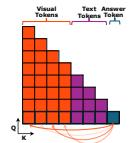

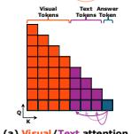

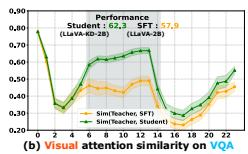

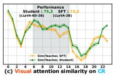

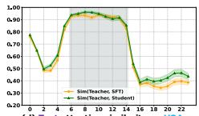

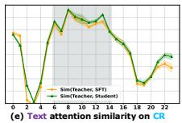  
Figure 2: (a) Attention of the answer token over visual tokens and text tokens during its generation. The transparency indicates the degree of attention the answer token gives to these tokens. (be) Layer-wise Teacher-Student and Teacher-SFT attention similarities over visual tokens ((b), (c)) and text tokens ((d), (e)). GQA is used for VQA ((b), (d)), and SugarCrepe is used for CR ((c), (e)). Results on other datasets are shown in Appendix C.

(Figure 2(d)). This finding brings us to identify the clue of the key factor: if the teacher-student visual attention similarity in the visual understanding layers is high, distillation is effectively achieved, resulting in performance improvement ofthe student .

Q2) Why does KDfail to deliver comparable improvements on CR (visual perception) tasks? We extend our analysis to CR tasks, where the student model performs on par with the SFT model. As shown in Figure 2(c) and (e), we observe that the teacher-student attention similarity is comparable to the teacher-SFT attention similarity in the visual understanding layers, even over the visual tokens, which contrasts with our observation on VQA. That is, in the visual understanding layers, the student model shows no better alignment with the teacher model in terms of the attention over visual tokens than the SFT model, despite such alignment being crucial for success in the downstream performance as shown in the case of VQA. Drawing on the findings from Q1 and Q2, we argue that the inability of existing KD methods to effectively distill visual perception ability stems from the moderate level of teacher–student attention similarity in the visual understanding layers.

## 3.2 RELATIONSHIP BETWEEN TEACHER-STUDENT ATTENTION SIMILARITY AND DOWNSTREAM PERFORMANCE

While the teacher-student attention similarity over visual tokens appears to be a key factor in determining whether visual abilities have been distilled, its direct relationship with downstream performance remains unclear. In other words, it is uncertain whether the higher teacher–student attention similarity (green line), relative to the teacher–SFT attention similarity (yellow line) in the visual understanding layers (Figure 2(b)), explains the superior performance of the student model on the VQA dataset. To this end, we quantify the relationship between the teacher-student visual attention similarity and the answer token probability given in Equation 1 on the VQA dataset (Figure 3), where visual recognition ability has been successfully distilled from the teacher model. More precisely, we randomly sampled 5,000 instances from the GQA test set, grouped them according to the student–teacher similarity over visual tokens during the answer generation step, and then measured the average probability assigned to the ground-truth answers. The results reveal a clear positive trend: higher attention similarity is consistently associated with higher answer probabilities, providing direct evidence that aligning the student’s attention with the teacher’s attention is a key factor driving better performance on $\mathrm { \Delta V Q A }$

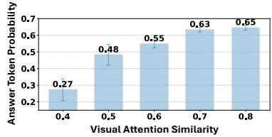  
Figure 3: Relationship between attention similarity and performance on the GQA (VQA) dataset.

## 3.3 A SIMPLE SOLUTION: REPLACING STUDENT’S VISUAL ATTENTION WITH TEACHER’S

Is Teacher Attention Really Beneficial? A natural question arises: Does increasing the teacher-student attention similarity over visual tokens —a key factor for VQA performance—also enhance performance on CR tasks? To test this, we perform a direct intervention during inference on CR. Before generating the answer, we substitute the student’s original attention over visual tokens with the average of the teacher’s and student’s attention, thereby increasing the student’s attention similarity to the teacher5.(Figure 4).This yields modest but consistent performance gains in the SugarCrepe dataset (Swap, Replace and Add are three types of CR sub-tasks in the dataset). Although small, these improvements confirm that the student benefits from incorporating the teacher’s attention, reinforcing our hypothesis that attention alignment plays a crucial role in effective knowledge transfer.

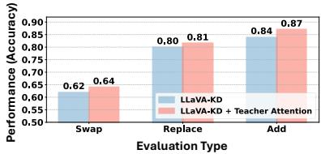  
Figure 4: Change in performance the student attention is substituted with the teacher attention on the SugarCrepe (CR) dataset.

In summary, our analysis identifies visual attention misalignment as the key barrier to effectively distilling the teacher’s perception abilities to the student, highlighting the crucial need to accurately transfer the teacher’s visual attention.

## 4 METHODOLOGY: COMPODISTILL

Motivated by the findings in Section 3, our framework, called CompoDistill, is designed to effectively transfer the teacher’s visual perception abilities by addressing the visual attention misalignment. We first introduce our two core components: the Visual ATtention alignment (VAT) module (Section 4.1), which aligns the student’s visual attention mechanism with that of the teacher, and the Teacher Adapter Fetch (TAF) module (Section 4.2), which ensures the student processes visual space consistently with the teacher. These modules are then integrated into a meticulously designed three-stage training strategy (Section 4.3). The overall framework is shown in Figure 5.

## 4.1 VISUAL ATTENTION ALIGNMENT (VAT) MODULE

Attention Distillation Loss. To transfer the teacher’s attention mechanism to the student, we utilize the attention matrix of the Transformer (Vaswani et al., 2017) within the LLM layer, which represents the importance of each token relative to other tokens. The attention matrix for the input tokens $( \mathrm { i } . \mathrm { e } . , \mathrm { x } _ { v }$ and ${ \bf x } _ { t } )$ is computed as: A = softmax $\left( \mathbf { Q } \mathbf { K } ^ { \top } / \sqrt { d } \right) \in \mathbb { R } ^ { \left( N _ { v } + N _ { t } \right) \times \left( N _ { v } + N _ { t } \right) }$ , where $\mathbf { Q } \in \mathbb { R } ^ { ( N _ { v } + N _ { t } ) \times d }$ and $\mathbf { K } \in \mathbb { R } ^ { ( N _ { v } + N _ { t } ) \times d }$ are the query and key matrices derived from the input tokens, respectively. From the overall attention matrix A, as discussed in Section 3, our goal is to distill the attention over visual tokens from the teacher to the student in the visual understanding layers, leading us to extract a sub-matrix ${ \tilde { A } } \in A$ that focuses on visual attention. Specifically, for each visual understanding layer l, this sub-matrix includes only the columns (keys) of $A _ { l }$ corresponding to the visual tokens, resulting in $\tilde { A } _ { l } = A _ { l } [ : , : N _ { v } ] \in \mathbb { R } ^ { ( \tilde { N _ { v } } + N _ { t } ) \times N _ { v } }$ . Based on the visual attentionrelated sub-matrices of the teacher $( \tilde { A } _ { l } ^ { t } )$ and student $( \tilde { A } _ { l } ^ { s } )$ , we compute the cosine distance between them for the attention distillation loss as $1 - \sin \left( \tilde { A } _ { l _ { t } } ^ { t } , \tilde { A } _ { l _ { s } } ^ { s } \right)$ , where $l _ { t }$ and $l _ { s }$ denote the index of the visual understanding layers of the teacher and student, respectively.

Group Layer Matching. However, since the teacher has more layers than the student, directly matching a student layer index $l _ { s }$ with a teacher layer index $l _ { t }$ is challenging. A naive solution is to map each $l _ { s }$ to one $l _ { t }$ by uniformly sampling teacher layers according to the ratio of their depths. For example, if the student has $\dot { 5 }$ layers and the teacher has 10 layers, then teacher layers {1, 3, 5, 7, 9} are selected and aligned with the 5 student layers. However, this approach is suboptimal, as it overlooks the richer perception abilities distributed across the teacher’s layers and does not ensure accurate alignment6. Instead, we propose a simple yet effective Group Layer Matching strategy, where each $l _ { s }$ is aligned with a group of $\{ l _ { t } \}$ in a one-to-many manner, enabling the student to capture broader teacher knowledge while roughly preserving the layer order.

Formally, let the sequence of student’s visual understanding layer indices be $L _ { S } = \{ l _ { s } ^ { 1 } , \ldots , l _ { s } ^ { j } , \ldots .$ $, l _ { s } ^ { k } \}$ and that of the teacher be $L _ { T } = \{ l _ { t } ^ { 1 } , . . . , l _ { t } ^ { j } , . . . , l _ { t } ^ { m } \}$ , where $j$ is the j-th layer in the visual understanding layers, and k and m denote the total number of visual understanding layers for the student and teacher, respectively, with $k < m$ . For each student layer $l _ { s } ^ { j }$ , we define a corresponding group of teacher layers, $G _ { j }$ , consisting of $n ^ { 7 }$ consecutive teacher layers, formed using a sliding window approach. For example, the group of teachers $G _ { 1 }$ assigned for the first student layer $l _ { s } ^ { 1 }$ could be $\{ l _ { t } ^ { 1 } , l _ { t } ^ { 2 } , \ldots , l _ { t } ^ { n } \}$ }, while the group $G _ { 2 }$ for the second student layer $l _ { s } ^ { 2 }$ would be $\{ i _ { t } ^ { 2 } , i _ { t } ^ { 3 } , . . . , i _ { t } ^ { n + 1 } \}$ , and so on. So, the total number of groups is the same as the number of student’s target layers, k.

To distill the visual attention of a teacher group $G _ { j }$ into student layer $l _ { s } ^ { j } .$ , we formulate the objective by minimizing the cosine distance between the attention matrix of student layer, $\tilde { A } _ { l _ { \mathrm { s } } ^ { j } } ^ { s }$ and the averaged attention matrices of its corresponding teacher group, $\bar { A } _ { j } ^ { t }$ , as follows:

$$
\mathcal {L} _ {A D L} = 1 - \frac {1}{k} \sum_ {j = 1} ^ {k} \mathrm{sim} \Bigl (\bar {A} _ {j} ^ {t}, \tilde {A} _ {l _ {s} ^ {j}} ^ {s} \Bigr), \bar {A} _ {j} ^ {t} = \frac {1}{n} \sum_ {l \in G _ {j}} \tilde {A} _ {l} ^ {t}.\tag{2}
$$

Furthermore, beyond the naive one-to-one matching approach, our proposed group matching strategy is superior to the more advanced adaptive matching method (Lee et al., 2025b) in terms of effectiveness, as demonstrated in Section 5.3.

## 4.2 TEACHER ADAPTER FETCH (TAF) MODULE

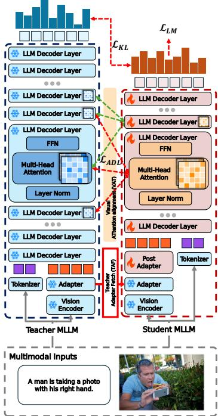

The adapter, responsible for projecting the visual space into the language space of the LLM, is crucial for generating the visual tokens with which the attention mechanism processes. In this regard, given that the teacher’s attention mechanism transferred via VAT is tightly coupled with the output of its own adapter, a vision-language space mismatch occurs when this attention is imposed on a student with a different, incompatible space, hindering effective knowledge transfer. To address this, we introduce the Teacher Adapter Fetch (TAF) module, which directly leverages the teacher’s frozen, pretrained adapter $( P _ { \psi _ { t } } ^ { t } )$ and adds a lightweight trainable MLP $( P _ { \psi _ { s } } ^ { s } )$ only for dimensional alignment. This ensures the student processes the visual input through

Figure 5: Overview of CompoDistill. It consists of the VAT module and the TAF module.

the same lens as the teacher, making the attention transfer effective. Formally, the student’s visual token is expressed as follows:

$$
\mathbf {x} _ {v} = P _ {\psi_ {s}} ^ {s} \left(P _ {\psi_ {t}} ^ {t} (\mathbf {z} _ {p})\right) \in \mathbb {R} ^ {N _ {v} \times d ^ {s}},\tag{3}
$$

where $d _ { s }$ is the hidden dimension of the student LLM. This approach allows for the student to bridge the gap between the teacher-imposed attention mechanism and its own visual feature space.

Discussion. It is important to note that attention distillation itself is not a novel concept, as similar approaches have been explored in various domains (Wang et al., 2020; Sajedi et al., 2023; Zhou et al., 2025), including diffusion models, dataset distillation, and language models. However, its application to MLLMs is particularly challenging due to mismatched visual feature spaces between teacher and student. To this end, we introduce the TAF module as a simple yet effective solution that makes attention distillation practical in this setting. Lastly, our work is not intended to propose a fundamentally new distillation method; rather, its primary contribution lies in identifying a critical factor that can serve as a criterion for successfully distilling visual abilities in MLLMs, i.e., visual attention misalignment, as explained in Section 3.

## 4.3 THREE-STAGE DISTILLATION FRAMEWORK

Our knowledge distillation framework consists of three stages, built upon two foundational training objectives. The first objective is language modeling autoregressive loss $\mathcal { L } _ { L M }$ , as defined in Section 2. Moreover, following previous studies (Shu et al., 2024; Cai et al., 2024), we employ a Kullback-Leibler (KL) divergence loss $( \mathcal { L } _ { K L } )$ to align the student’s predictive distribution $( p _ { s } )$ with the teacher’s (pt), encouraging the student to mimic the teacher’s final output at the logit level:

$$
\mathcal {L} _ {K L} = - \frac {1}{K} \sum_ {k = 1} ^ {K} \sum_ {n = 1} ^ {N} p _ {t} (\mathbf {y} _ {n} | \mathbf {x} _ {v}, \mathbf {x} _ {t}, \mathbf {y} _ {<   k}) \log \frac {p _ {t} (\mathbf {y} _ {n} | \mathbf {x} _ {v} , \mathbf {x} _ {t} , \mathbf {y} _ {<   k})}{p _ {s} (\mathbf {y} _ {n} | \mathbf {x} _ {v} , \mathbf {x} _ {t} , \mathbf {y} _ {<   k})},\tag{4}
$$

where ${ \bf y } _ { n }$ is the n-th vocabulary token and N is the total vocabulary size.

Stage 1: Distilled Pre-Training (DPT). The first stage aims to align the visual feature space with the language space. To this end, instead of initializing an adapter from scratch, we construct it using our Teacher Adapter Fetch module, which reuses the teacher’s pretrained adapter, which is kept frozen during training. While the vision encoder and LLM remain frozen, the student adapter $P _ { \psi _ { s } } ^ { s }$ is optimized with the language modeling loss $( \mathcal { L } _ { L M } )$ and the KL-divergence loss $( \mathcal { L } _ { K L } )$

Stage 2: Distilled Fine-Tuning (DFT). In the second stage, we aim to enhance the student’s visual perception by aligning its visual attention mechanism over visual tokens with that of the teacher via the Visual ATtention Alignment module. During this stage, both the student LLM and the student adapter $P _ { \psi _ { s } } ^ { s }$ are fine-tuned. The overall objective is defined as $\mathcal { L } _ { L M } + \mathcal { L } _ { K L } + \mathcal { L } _ { A D L }$

Stage 3: Supervised Fine-Tuning (SFT). Finally, motivated by prior work (Lee et al., 2025b), we fine-tune only the student using the autoregressive language modeling loss $( \mathcal { L } _ { L M } )$ , with both the student LLM and the student adapter $P _ { \psi _ { s } } ^ { s }$ trained in the same manner as in Stage 2. This final stage consolidates the rich knowledge transferred from the teacher during Stages 1 and 2 into the student’s own parameters and further strengths its instruction-following capability.

## 5 EXPERIMENTS

## 5.1 EXPERIMENTAL SETTINGS.

Evaluation Benchmarks. For evaluation, we use two categories of vision-language tasks. General VQA: We evaluate visual recognition abilities using well-established benchmarks including VQAv2 (Goyal et al., 2017), GQA (Hudson & Manning, 2019), and VizWiz (Bigham et al., 2010) for question answering, TextVQA (Singh et al., 2019) for scene text comprehension, and MME (Fu et al., 2024) for comprehensive multimodal evaluation. Compositional Reasoning: To evaluate visual perception abilities, we use several challenging benchmarks: SugarCrepe (Hsieh et al., 2023), SADE (Ma et al., 2023), BiVLC (Miranda et al., 2024), and Winoground (Thrush et al., 2022). We use accuracy as the evaluation metric. Refer to Appendix D for more details regarding the baselines.

Implementation Details. Both the student and teacher employ SigLIP (Zhai et al., 2023) vision encoder and the Qwen 1.5 (Yang et al., 2024) LLM series, with the student having 1.8B parameters and the teacher having 4B parameters. Regarding the details of the training datasets and hyperparameter settings, please refer to Appendix E.

## 5.2 QUANTITATIVE RESULTS ON VQA AND CR TASKS

In Table 1, we compare CompoDistill with a diverse range of MLLMs of different sizes on VQA and CR tasks, which evaluate visual recognition and perception abilities, respectively. We have the following key observations: 1) Existing KD methods8 outperform the SFT model (LLaVA-2B) on VQA (visual recognition) tasks, but not on CR (visual perception) tasks, where their performance remains comparable to that of standard 2B models. This indicates that KD methods struggle to distill visual perceptual abilities. 2) CompoDistill overcomes this limitation by significantly improving CR performance to a level competitive with 4B models—an achievement not attained by previous KD methods—while simultaneously maintaining strong, state-of-the-art performance on VQA. This demonstrates the ability of CompoDistill to enhance visual perception while maintaining visual recognition. 3) CompoDistill achieves these results with high data efficiency, relying on just

Table 1: Comparison CompoDistill with KD-based methods and other MLLMs on VQA and CR. # Samples : Training data samples. :Reproduced results using the official source code. The best and second-based models are marked in bold and underlined, respectively for models sizes under 2B.

<table><tr><td rowspan="2">Size</td><td rowspan="2">Method</td><td rowspan="2">LLM</td><td rowspan="2"># Samples</td><td colspan="6">Visual Question Answering</td><td colspan="5">Compositional Reasoning</td></tr><tr><td>VQAv2</td><td>VizWiz</td><td>GQA</td><td>TextVQA</td><td>MME</td><td>Avg</td><td>Sugarcrepe</td><td>SADE</td><td>BiVLC</td><td>Winoground</td><td>Avg</td></tr><tr><td rowspan="5"> $\sim 7B$ </td><td>LLaVA-7B $^{\dagger}$ </td><td>Qwen1.5-7B</td><td>1.2 M</td><td>79.8</td><td>53.1</td><td>62.3</td><td>60.1</td><td>68.6</td><td>64.8</td><td>87.3</td><td>78.5</td><td>65.7</td><td>58.4</td><td>72.5</td></tr><tr><td>LLaVA-7B $^{\dagger}$ </td><td>Qwen2.5-7B</td><td>1.2 M</td><td>81.4</td><td>50.6</td><td>63.8</td><td>64.6</td><td>77.5</td><td>67.6</td><td>93.1</td><td>82.9</td><td>68.3</td><td>68.2</td><td>78.1</td></tr><tr><td>CogVLM-7B</td><td>Vicuna-7B</td><td>1500 M</td><td>82.3</td><td>-</td><td>64.9</td><td>78.2</td><td>71.8</td><td>-</td><td>81.8</td><td>63.2</td><td>64.5</td><td>57.2</td><td>66.7</td></tr><tr><td>Qwen2.5-VL-7B</td><td>Qwen2-7B</td><td>1500 M</td><td>82.8</td><td>61.7</td><td>63.9</td><td>73.9</td><td>83.9</td><td>73.2</td><td>88.5</td><td>77.4</td><td>68.4</td><td>75.3</td><td>77.4</td></tr><tr><td>Deepseek-VL-7B</td><td>DLLM-7B</td><td>2000 M</td><td>-</td><td>49.9</td><td>61.3</td><td>64.7</td><td>73.4</td><td>-</td><td>86.2</td><td>78.8</td><td>66.2</td><td>61.7</td><td>73.2</td></tr><tr><td rowspan="7"> $\sim 4B$ </td><td>LLaVA-4B $^{\dagger}$  (Teacher)</td><td>Qwen1.5-4B</td><td>1.2 M</td><td>79.1</td><td>48.0</td><td>62.1</td><td>56.7</td><td>67.2</td><td>62.6</td><td>83.0</td><td>75.5</td><td>64.8</td><td>57.8</td><td>70.3</td></tr><tr><td>Qwen2.5-VL-3B</td><td>Qwen2-3B</td><td>1.2 M</td><td>80.4</td><td>54.1</td><td>60.9</td><td>68.5</td><td>72.8</td><td>67.3</td><td>57.1</td><td>65.9</td><td>67.0</td><td>63.5</td><td>63.4</td></tr><tr><td>Imp-3B</td><td>Phi2-2.7B</td><td>1.5 M</td><td>81.2</td><td>54.1</td><td>63.5</td><td>59.8</td><td>72.3</td><td>66.2</td><td>78.1</td><td>61.1</td><td>59.5</td><td>38.3</td><td>59.3</td></tr><tr><td>Bunny-3B</td><td>Phi2-2.7B</td><td>2.6 M</td><td>79.8</td><td>43.8</td><td>62.5</td><td>56.7</td><td>74.4</td><td>63.4</td><td>75.8</td><td>67.2</td><td>59.7</td><td>53.1</td><td>64.0</td></tr><tr><td>MoE-LLaVA-3B</td><td>Phi2-2.7B</td><td>2.6 M</td><td>79.9</td><td>43.7</td><td>62.6</td><td>57.0</td><td>71.6</td><td>63.0</td><td>80.5</td><td>70.4</td><td>64.4</td><td>54.1</td><td>67.3</td></tr><tr><td>MobileVLM-3B</td><td>MobileLLaMA-2.7B</td><td>1.3 M</td><td>-</td><td>-</td><td>61.1</td><td>57.5</td><td>72.0</td><td>-</td><td>67.9</td><td>72.1</td><td>57.2</td><td>43.9</td><td>60.3</td></tr><tr><td>MiniCPM-V</td><td>MiniCPM-2.4B</td><td>570 M</td><td>-</td><td>60.2</td><td>52.1</td><td>73.2</td><td>70.5</td><td>-</td><td>90.0</td><td>70.6</td><td>65.3</td><td>55.3</td><td>70.3</td></tr><tr><td rowspan="11"> $\sim 2B$ </td><td>MiniGemini-2B</td><td>Gemma-2B</td><td>2.7 M</td><td>-</td><td>41.5</td><td>60.7</td><td>56.2</td><td>67.0</td><td>-</td><td>67.0</td><td>62.0</td><td>58.0</td><td>50.5</td><td>59.4</td></tr><tr><td>Deepseek-VL-1.3B</td><td>DLLM-1.3B</td><td>2000 M</td><td>-</td><td>36.8</td><td>59.3</td><td>58.4</td><td>65.3</td><td>-</td><td>36.6</td><td>38.6</td><td>39.9</td><td>60.8</td><td>44.0</td></tr><tr><td>MobileVLM-1.7B</td><td>MobileLLaMA-1.4B</td><td>1.2 M</td><td>-</td><td>-</td><td>59.3</td><td>52.1</td><td>65.1</td><td>-</td><td>69.8</td><td>64.0</td><td>53.8</td><td>43.4</td><td>57.7</td></tr><tr><td>Imp-2B</td><td>Qwen1.5-1.8B</td><td>1.5 M</td><td>79.2</td><td>39.2</td><td>61.9</td><td>54.5</td><td>65.2</td><td>60.0</td><td>71.0</td><td>59.6</td><td>58.5</td><td>51.1</td><td>60.1</td></tr><tr><td>Bunny-2B</td><td>Qwen1.5-1.8B</td><td>2.6 M</td><td>76.6</td><td>34.2</td><td>59.6</td><td>53.2</td><td>65.0</td><td>57.7</td><td>68.6</td><td>66.5</td><td>57.8</td><td>48.5</td><td>60.3</td></tr><tr><td>MoE-LLaVA-2B</td><td>Qwen1.5-1.8B</td><td>2.2 M</td><td>76.2</td><td>32.6</td><td>61.5</td><td>48.0</td><td>64.6</td><td>56.6</td><td>80.8</td><td>62.5</td><td>62.0</td><td>50.6</td><td>63.9</td></tr><tr><td>LLaVA-2B (SFT model)</td><td>Qwen1.5-1.8B</td><td>1.2 M</td><td>73.6</td><td>31.2</td><td>57.9</td><td>50.6</td><td>61.2</td><td>54.9</td><td>73.3</td><td>63.9</td><td>58.5</td><td>47.2</td><td>60.7</td></tr><tr><td>LLaVA-KD-2B</td><td>Qwen1.5-1.8B</td><td>1.2 M</td><td>78.8</td><td>44.8</td><td>62.3</td><td>53.4</td><td>68.9</td><td>61.6</td><td>75.3</td><td>63.6</td><td>57.9</td><td>49.3</td><td>61.5</td></tr><tr><td>LLaVADI-2B $^{\dagger}$ </td><td>Qwen1.5-1.8B</td><td>1.2 M</td><td>75.8</td><td>35.2</td><td>58.7</td><td>49.4</td><td>63.8</td><td>56.6</td><td>76.9</td><td>61.5</td><td>54.1</td><td>48.4</td><td>60.2</td></tr><tr><td>LLaVA-MoD-2B $^{\dagger}$ </td><td>Qwen1.5-1.8B</td><td>5.0 M</td><td>76.3</td><td>43.0</td><td>58.8</td><td>52.7</td><td>63.4</td><td>58.9</td><td>76.9</td><td>63.8</td><td>60.3</td><td>49.4</td><td>62.6</td></tr><tr><td>CompoDistill-2B</td><td>Qwen1.5-1.8B</td><td>1.2 M</td><td>78.8</td><td>42.5</td><td>62.2</td><td>56.4</td><td>70.1</td><td>61.9</td><td>82.9</td><td>69.4</td><td>63.3</td><td>51.2</td><td>66.7</td></tr></table>

1.2M training samples. This is a sharp contrast to other models requiring much larger datasets (e.g., LLaVA-MoD with 5M, MiniCPM-V with 570M), proving the effectiveness of CompoDistill toward a truly efficient MLLM.  
Table 2: Ablation for VAT and TAF modules.

<table><tr><td rowspan="2">Row</td><td rowspan="2">VAT module</td><td rowspan="2">TAF module</td><td colspan="4">Visual Question Answering</td><td colspan="5">Compositional Reasoning</td></tr><tr><td>GQA</td><td>TextVQA</td><td>MME</td><td>Avg</td><td>Sugarcrepe</td><td>SADE</td><td>BiVLC</td><td>Winoground</td><td>Avg</td></tr><tr><td>(a)</td><td>✘</td><td>✘</td><td>57.8</td><td>50.1</td><td>62.5</td><td>56.8</td><td>76.3</td><td>64.9</td><td>61.7</td><td>48.7</td><td>62.9</td></tr><tr><td>(b)</td><td>✓</td><td>✘</td><td>54.3</td><td>54.6</td><td>64.8</td><td>57.9</td><td>81.0</td><td>66.4</td><td>62.1</td><td>50.5</td><td>65.0</td></tr><tr><td>(c)</td><td>✘</td><td>✓</td><td>60.8</td><td>56.5</td><td>66.5</td><td>61.3</td><td>78.0</td><td>67.0</td><td>62.4</td><td>48.1</td><td>63.8</td></tr><tr><td>(d)</td><td>✓</td><td>✓</td><td>62.2</td><td>56.4</td><td>70.1</td><td>62.9</td><td>82.9</td><td>69.4</td><td>63.3</td><td>51.1</td><td>66.7</td></tr></table>

## 5.3 ABLATION STUDIES

Effect of Core Components. In Table 2, we conduct ablation studies to understand the effect of each component (i.e., VAT and TAF modules). Note that the variant without either component (row (a)) follows the proposed three-stage framework (Section 4.3), using only the language modeling loss (Section 2) and logit-based KD loss (Equation 4). Effect of VAT module: We observe that the VAT module significantly improves the performance especially on CR tasks (row (a) vs. (b) and row (c) vs. (d)), demonstrating the effectiveness of enhancing visual perception abilities. This confirms that explicit visual attention alignment is crucial for distilling visual perception ability, as discussed in Section 3. Effect of TAF module: We observe that equipping the TAF module improves the performance on VQA and CR tasks (row (a) vs. (c) and row (b) vs. (d)), indicating that bridging the student’s feature space with the imposed attention mechanism is crucial for effective knowledge transfer. Finally, the fully-fledged model (row (d)) achieves the best performance on both VQA and CR tasks, demonstrating the benefit of the VAT and TAF modules.

Table 3: Detailed ablation for VAT module. The blue line performs the same as CompoDistill.  
(a) Attention loss type (b) Target layers (c) Layer matching strategy

<table><tr><td>Attention Loss</td><td>VQA Avg</td><td>CR Avg</td><td>Target Layers</td><td>VQA Avg</td><td>CR Avg</td><td>Match strategy</td><td>VQA Avg</td><td>CR Avg</td></tr><tr><td> $\chi$ </td><td>61.3</td><td>63.8</td><td>Early ( $\sim 30\%$ )</td><td>61.2</td><td>63.7</td><td>Simple</td><td>61.5</td><td>65.6</td></tr><tr><td>MSE</td><td>60.3</td><td>65.2</td><td>Later ( $70\% \sim$ )</td><td>61.7</td><td>64.6</td><td>Adaptive</td><td>62.0</td><td>65.7</td></tr><tr><td>KL. Div.</td><td>60.7</td><td>65.5</td><td>All</td><td>62.4</td><td>66.6</td><td>Group</td><td>62.9</td><td>66.7</td></tr><tr><td>Cos. Sim.</td><td>62.9</td><td>66.7</td><td>Intermediate</td><td>62.9</td><td>66.7</td><td colspan="3"></td></tr></table>

Fine-grained Analysis on VAT module. We perform fine-grained ablation studies to study the impact of specific design choices—namely, the attention loss type, the target matching layer, and the layer matching strategy—within the VAT module. 1) We first analyze the impact of the attention loss function (Table 3a). While any form of attention loss improves CR over the baseline, using Cosine Similarity (Cos. Sim.) significantly outperforms both MSE and KL Divergence. This result suggests that it is more crucial for the student to learn the relative importance among visual patches rather than forcing an exact match of their absolute attention scores. 2) Next, we investigate which layers to target for distillation (Table 3b). Performing distillation on the intermediate layers (30- 70%) yields the highest performance. This finding confirms our analysis that visual understanding layers are crucial for visual-semantic integration and highlights the effectiveness of distilling specifically from these layers, a strategy consistent with prior research (Kaduri et al., 2024). 3) Lastly, we evaluate different layer matching strategies (Table 3c). Our proposed Group matching achieves the best performance compared to both Simple matching (which uniformly samples teacher layers) and Adaptive matching (which finds optimal pairs based on layer distance). This suggests that grouping layers provides a more stable and effective signal for transferring the teacher’s complex attention behaviors, especially when student and teacher architectures differ in depth.9

Further Benefit on Other Complex Task. Beyond compositional reasoning, we explore a further benefit of enhancing visual perception for complex tasks. Specifically, we expect that CompoDistill can help mitigate the relational hallucinations, thanks to its ability to accurately understand object relationships, as discussed in Section 1. To test this, we evaluate CompoDistill on the R-Bench (Wu et al., 2024) and Reef-

Table 4: Comparison for relational hallucination using F1 score.

<table><tr><td>Model</td><td>R-Bench ↑</td><td>Reefknot ↑</td></tr><tr><td>Teacher (LLaVA-4B)</td><td>79.1</td><td>67.9</td></tr><tr><td>Student (LLaVA-2B)</td><td>74.3</td><td>61.3</td></tr><tr><td>LLaVA-KD-2B</td><td>76.5</td><td>60.3</td></tr><tr><td>LLaVA-MoD-2B</td><td>76.2</td><td>63.4</td></tr><tr><td>CompoDistill-2B</td><td>78.6</td><td>66.7</td></tr></table>

knot (Zheng et al., 2025) benchmarks, both of which focus on evaluating relational hallucinations. As shown in Table 4, CompoDistill significantly outperforms other KD methods and achieves performance nearly on par with the teacher. The results highlight that enhancing the visual perception ability can be beneficial to not only compositional reasoning tasks but also other complex tasks that require precise understanding of relationships among objects.

## 6 SCALABILITY EXPERIMENTS

Richer Data Improves Distillation Performance. We analyze the effect of data scale in Table 5. Performance improves significantly when moving from SFT to distillation, and increases further when the training dataset size is doubled10. This highlights that both the quality and quantity of training data are crucial for effective knowledge transfer, with CR showing part icular sensitivity to data scaling.

Table 5: Data Scaling Experiment.

<table><tr><td>Student</td><td># Sample</td><td>VQA Avg</td><td>CR Avg</td></tr><tr><td>Qwen1.5-1.8B (SFT)</td><td>1.2 M</td><td>56.6</td><td>60.7</td></tr><tr><td>Qwen1.5-1.8B</td><td>1.2 M</td><td>62.9</td><td>66.7</td></tr><tr><td>Qwen1.5-1.8B</td><td>2.4 M</td><td>63.3</td><td>69.9</td></tr></table>

Larger Teachers Produce Stronger Students. Next, we examine the influence of teacher model size in Table 6. Our experiments show that students consistently benefit from larger teachers, regardless of the student’s own size. For instance, a 1.8B student distilled from a 7B teacher outperforms one distilled from a 4B teacher. This demonstrates that a higher-capacity teacher is crucial for transferring stronger reasoning abilities, providing a more effective source of knowledge for the student.

Our Distillation Method Generalizes Across Backbones. Finally, we test our framework’s generalizability by replacing the Qwen backbone with the MobileLLaMA family (ML-LaMA) in Table 7. Our distillation method remains effective even with this entirely different architecture. This result confirms the robustness and generalizability of our approach, demonstrating that its principles are not tied to a specific model family but are broadly applicable.

Table 6: Experiments with different size of teacher/student.

<table><tr><td>Student</td><td>Teacher</td><td>VQA Avg</td><td>CR Avg</td></tr><tr><td colspan="2">Qwen1.5-1.8B (SFT)</td><td>56.6</td><td>60.7</td></tr><tr><td>Qwen1.5-1.8B</td><td>Qwen1.5-4B</td><td>62.9</td><td>66.7</td></tr><tr><td>Qwen1.5-1.8B</td><td>Qwen2.5-7B</td><td>63.4</td><td>67.8</td></tr><tr><td colspan="2">Qwen1.5-0.5B (SFT)</td><td>52.0</td><td>48.4</td></tr><tr><td>Qwen1.5-0.5B</td><td>Qwen1.5-1.8B</td><td>54.7</td><td>51.1</td></tr><tr><td>Qwen1.5-0.5B</td><td>Qwen1.5-4B</td><td>56.6</td><td>54.5</td></tr></table>

Table 7: Experiments with a different LLM backbone.

<table><tr><td>Student</td><td>Teacher</td><td>VQA Avg</td><td>CR Avg</td></tr><tr><td colspan="2">MLLaMA-1.7B (SFT)</td><td>49.7</td><td>43.7</td></tr><tr><td>MLLaMa-1.7B</td><td>MLLaMa-3B</td><td>53.1</td><td>48.9</td></tr></table>

## 7 RELATED WORKS

Multimodal Large Language Models. Visual instruction tuning (Liu et al., 2023) has propelled MLLMs to strong performance on diverse benchmarks (Chen et al., 2024; Yang et al., 2024; OpenAI, 2023), yet persistent weaknesses remain in fine-grained visual tasks (Tong et al., 2024; Qi et al., 2025). Early efforts to address these limitations focused on scaling up vision encoders (Lu et al., 2024; Kar et al., 2024) or designing more expressive projectors (Cha et al., 2024; Liu et al., 2024). More recently, the focus has shifted to the internal information flow, with research identifying critical failures such as misaligned attention (Jiang et al., 2025; Neo et al., 2025; Darcet et al., 2024) and the dilution of visual features in intermediate layers (Kaduri et al., 2024; Yoon et al., 2025; Chen et al., 2025b). In contrast to these approaches, our analysis focuses on the visual attention dynamics between student and teacher models trained via direct knowledge distillation.

Knowledge Distillation. Knowledge distillation (KD) compresses a large teacher model into a smaller, efficient student (Hinton et al., 2015), a technique widely applied to LLMs via logit matching (Sun et al., 2019; Jiao et al., 2020). In the multimodal domain, methods have adapted this for visual grounding (Cai et al., 2024; Feng et al., 2025) or used modular strategies to overcome architectural limits (Shu et al., 2024). The scope has since expanded to distillation across model families (Lee et al., 2025b;a) and a deeper focus on internal mechanics. For instance, recent alignment-oriented methods like VIRAL (Yoon et al., 2025) regularize intermediate representations to preserve visual semantics, moving beyond simple logit-level supervision. While these studies primarily propose new distillation techniques, our work takes a different approach. We instead provide a detailed analysis to identify the specific bottlenecks that hinder the effectiveness of knowledge distillation in MLLMs.

Compositional Reasoning Benchmarks. Compositional reasoning, the ability to understand the interplay of objects and their relations, remains a significant hurdle for vision–language models. Initial benchmarks like Winoground (Thrush et al., 2022) first exposed these weaknesses in early models. Building on this, a new generation of more robust benchmarks has emerged to address evaluation biases. These include SugarCrepe (Hsieh et al., 2023), which uses LLM-generated hard negatives; SADE (Ma et al., 2023), which specifically diagnoses and mitigates the language bias found in generative models through a debiased test set that neutralizes syntactic shortcuts; and BiVLC (Miranda et al., 2024), which focuses on bidirectional retrieval with synthetic negatives.

## 8 CONCLUSION

In this work, we aim to enhance the visual perception abilities of Knowledge Distillation(KD)-based Multimodal Large Language Models (MLLMs), which has been largely overlooked by the previous KD studies. To this end, we conduct a systematic analysis and identify visual attention misalignment as a key factor hindering the effective distillation of visual perception from teacher to student. Building on this analysis, we propose CompoDistill, a novel KD framework that incorporates a Visual ATtention alignment (VAT) module to explicitly address this misalignment. Furthermore, we introduce the Teacher Adapter Fetch (TAF) module to ensure that teacher-imposed attention mechanism is compatible with the student’s feature space, making synergy with VAT module. Through extensive experiments on VQA and CR benchmarks, we demonstrate that CompoDistill significantly enhances visual perception abilities while preserving strong visual recognition abilities, as achieved in existing KD works. Regarding the limitation and future work, please refer to Appendix P.

We believe that this work provides a novel perspective on the student’s visual attention misalignment and makes a contribution to the pursuit of efficient MLLMs, especially in KD-based research, by establishing the first dedicated direction toward enhancing visual perception abilities.

## ACKNOWLEDGEMENT

This work was supported by the Institute of Information & Communications Technology Planning & Evaluation(IITP) grant funded by the Korea government(MSIT) (RS-2025-02304967, AI Star Fellowship(KAIST)) as well as another (IITP) grant funded by the Korea government(MSIT) (RS-2022-II220077, Reasoning, and Inference from Heterogeneous Data)

## ETHICS STATEMENT

Our research contributes to the development of more efficient and accessible Multimodal Large Language Models (MLLMs). By enabling the creation of smaller, yet highly capable student models, our work helps lower the significant computational barriers to deploying advanced AI, promoting its broader adoption. In compliance with the ICLR Code of Ethics, and to the best of our knowledge, we have not faced any ethical issues during this research. Additionally, all datasets and baselines used in our experiments are freely accessible to the public.

## REPRODUCIBILITY STATEMENT

To ensure reproducibility of experiment results throughout the paper, we describe the details of experimental setting and training details in 5.1 and Appendix E, respectively. Furthermore, we provide a source code in https://github.com/ptkjw1997/CompoDistill.