## ABSTRACT

Reinforcement learning (RL) with group relative policy optimization (GRPO) has become a widely adopted approach for enhancing the reasoning capabilities of multimodal large language models (MLLMs). While GRPO enables longchain reasoning without a traditional critic model, it often suffers from sparse rewards, arising from the scarcity of positive feedback on difficult problems, and from advantage vanishing, which occurs when group-level rewards exhibit high consistency for problems that are too easy or too hard. Existing solutions fall into three categories: sample enhancement and expansion, which may aggravate vanishing advantage due to poor control of difficulty distribution; selective sample utilization, which fails to fully leverage the value of all data; and indirect reward design, which may introduce biased optimization directions due to misalignment between reasoning and the final outcome. However, these approaches overlook a fundamental question: for a given problem, how can we ensure that the withingroup reward distribution of responses exhibits enough variance to yield clear optimization signals for each response? To address these issues, we propose DIVA-GRPO, a difficulty-adaptive variant augmentation advantage method that dynamically adjusts the difficulty distribution of variants for each problem from a global perspective. Our method dynamically assesses problem difficulty, samples variants with appropriate difficulty levels, and calculates advantages within both local and global (a problem and its variants) groups using difficulty-weighted and normalized scaling. This design alleviates reward sparsity and advantage vanishing, minimizes data waste, and improves training stability. Extensive experiments on six reasoning benchmarks demonstrate that DIVA-GRPO outperforms existing approaches in both training efficiency and reasoning performance. Code is available at https://github.com/Siaaaaaa1/DIVA-GRPO.

## 1 INTRODUCTION

Multimodal large language models (MLLMs) (Chen et al., 2024b; Hurst et al., 2024; Laurençon et al., 2024; Liu et al., 2023; Yin et al., 2024; Wu et al., 2024b; Alayrac et al., 2022; Zhu et al., 2023; Li et al., 2023) have demonstrated remarkable ability to integrate textual and visual information (Pang et al., 2024) for complex reasoning tasks, such as visual question answering (Antol et al., 2015; Xiao et al.,

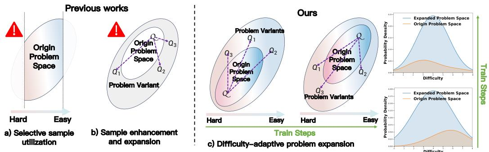  
Figure 1: (a) Selective sample utilization relies on only a subset of data, leading to underuse. (b) Sample enhancement expands data without difficulty awareness, causing even severe advantage sparsity. (c) Our method adaptively expands the sample space by problem difficulty, ensuring a stable difficulty distribution.

2024) and multimodal logical reasoning (Huang & Chang, 2022; Guo et al., 2025). Nevertheless, the heterogeneous nature of text and visual modalities makes long-chain reasoning challenging, requiring both careful observation and stepwise problem-solving (Xu et al., 2024). To address these challenges, recent studies have explored multimodal chain-of-thought approaches (Zhou et al., 2024; Chen et al., 2024a; Wang et al., 2025b), including Video-of-Thought (Fei et al., 2024), Det-CoT (Wu et al., 2024a), CoI (Meng et al., 2023), and Grounded-RL (Sarch et al., 2025), which aim to improve reasoning by decomposing problems or leveraging structured strategies. Complementary to these advances, reinforcement learning (RL) has emerged as a powerful framework for further enhancing MLLMs: proximal policy optimization (PPO) (Schulman et al., 2017) and direct preference optimization (DPO) (Rafailov et al., 2023) are widely used for alignment, while GRPO (Shao et al., 2024) advances long-chain reasoning by combining rewards with group-relative advantage estimation, significantly boosting both alignment and reasoning efficiency.

However, directly applying GRPO to MLLMs faces a critical challenge—advantage vanishing (Huang et al., 2025; Park et al., 2025; Yao et al., 2025; Wang et al., 2025a; Meng et al., 2025; Zhang et al., 2025; Zhang & Zuo, 2025). GRPO computes relative advantages by comparing sampled responses for a given problem and then standardizes the advantages across all samples. When a problem is too easy (or too difficult) for the current model, obtaining too few positive (or negative) rewards can lead to excessively large advantage values, causing high gradient noise and unstable training. Under extreme conditions, all responses may be entirely correct or incorrect, yielding zero relative advantage. This slows learning and weakens the model’s reasoning performance across varying difficulties. Existing approaches attempt to address this issue in several ways. One approach is sample enhancement and expansion, which enlarges the problem space by adding prompts to difficult instances or generating diverse text and image variants, though it may exacerbate advantage vanishing due to poor control over the difficulty distribution (Huang et al., 2025; Park et al., 2025; Yao et al., 2025)and introduce hidden biases (Gao et al., 2025). Another approach is selective sample utilization, which prioritizes highly effective samples or disregards those with low learning contribution to improve efficiency; however, this may limit exposure to complex problems or reduce data diversity (Wang et al., 2025a; Meng et al., 2025). Finally, indirect reward design provides finer-grained feedback signals to mitigate reward sparsity, but these rewards may not perfectly align with ultimate task objectives, potentially guiding the model toward suboptimal directions (Zhang et al., 2025; Zhang & Zuo, 2025).

Although the above methods can mitigate certain instances of advantage vanishing, they all overlook a critical issue: as shown in Figure 1(c), as training progresses, problem difficulty continuously decreases, advantage vanishing intensifies, and model training efficiency steadily declines. To address this, we propose DIVA-GRPO, an adaptive method that dynamically adjusts problem difficulty and variant distribution while preserving semantic consistency, and integrates both local (individual problem) and global (multiple variants derived from the original problem) reward computation. During training, problem difficulty is iteratively assessed based on model responses: simple problems are augmented with complex text and image perturbations, moderately difficult ones with diverse text variants, and hard ones with “think-step” reasoning variants, ensuring effective sample utilization and mitigating advantage vanishing. To balance feedback across different difficulty levels, DIVA-GRPO applies batch z-score normalization and difficulty-weighted scaling, and further introduces reward-range-based rescaling to prevent inflated advantages from minor reward differences. This enables stable policy optimization, encourages exploration, and enhances long-chain reasoning, while remaining broadly applicable to GRPO-based methods for improved optimization efficiency.

Extensive experiments validate the effectiveness and efficiency of DIVA-GRPO. Our model excels across six challenging benchmarks, achieving state-of-the-art performance at the 7B scale, approaching the accuracy of much larger models and proprietary commercial systems. Moreover, DIVA-GRPO substantially accelerates training. Using the same set of original data, it reaches the optimal performance with over a 2.55× reduction in required steps and delivers more than a 1.76× end-to-end speedup in wall-clock time, all while preserving stable and informative advantage signals across difficulty levels. These results highlight the substantial improvements in both performance and training efficiency offered by our model.

Overall, DIVA-GRPO overcomes the limitations of conventional GRPO by combining adaptive difficulty assessment, variant generation, and robust advantage estimation. This framework alleviates reward sparsity and advantage vanishing, while enhancing reasoning stability and performance across a wide range of multimodal tasks, from visual question answering to complex logical reasoning. Our core contributions are as follows:

• Propose DIVA-GRPO, based on dynamic difficulty assessment, using difficulty-adaptive variant generation and advantage sharing to alleviate reward sparsity and advantage vanishing.

• Introduce joint estimation of local and global advantages, combined with batch z-score normalization and difficulty-weighted scaling, to improve training stability.

• Present a reward-range-based advantage rescaling method, effectively preventing unreasonable advantage inflation and accelerating convergence.

• Conduct experiments on six mainstream multimodal reasoning benchmarks, demonstrating the effectiveness and superiority of DIVA-GRPO.

## 2 CHALLENGE: REWARD SPARSITY AND ADVANTAGE VANISHING

We begin by reviewing the key concepts of Group Relative Policy Optimization (GRPO), which form the foundation of our difficulty-adaptive variant strategy.

Group Relative Policy Optimization (GRPO). Let $\mathcal { Q } \ : = \ : \{ q _ { 1 } , q _ { 2 } , . . . , q _ { N } \}$ denote the set of training problems. For a given problem $q ,$ the model πθ generates k candidate responses $\mathcal { V } _ { q } =$ $\left\{ y _ { 1 } , y _ { 2 } , \ldots , y _ { k } \right\}$ through rollouts. Each response $y _ { i }$ receives a scalar reward $r ( y _ { i } ) \in \mathbb { R }$ determined by a reward function, which can be either a rule-based evaluator (e.g., answer correctness) or a learned reward model. GRPO computes the relative advantage of each response within its group by standardizing its reward:

$$
A (y _ {i}) = \frac {r (y _ {i}) - \mu_ {r}}{\sigma_ {r} + \epsilon}, \quad \mu_ {r} = \frac {1}{k} \sum_ {j = 1} ^ {k} r (y _ {j}), \quad \sigma_ {r} = \sqrt {\frac {1}{k} \sum_ {j = 1} ^ {k} (r (y _ {j}) - \mu_ {r}) ^ {2}},
$$

where ϵ is a small constant for numerical stability. The policy gradient is then estimated as

$$
\nabla_ {\theta} \mathcal {L} (\theta) = \mathbb {E} _ {q \sim \mathcal {Q}, y \sim \pi_ {\theta}} \left[ A (y) \nabla_ {\theta} \log \pi_ {\theta} (y | q) \right].
$$

Reward Sparsity and Advantage Vanishing. GRPO and its extensions often face reward sparsity: when the base multimodal model has limited capability or the problem is difficult, only a few reasoning paths obtain positive rewards, especially in early training. They also suffer from advantage vanishing: since relative advantages are computed within response groups, overly hard or easy problems lead to all-correct or all-wrong outputs, yielding zero advantages. As training proceeds, this issue worsens, reducing optimization efficiency and sample utilization.

Motivation. Existing solutions address these problems through (i) sample enhancement and expansion, which enlarges the problem space without adjusting intrinsic difficulty; (ii) sample selection and utilization, which improves efficiency but risks discarding valuable hard cases and reducing diversity; and (iii) indirect reward design, which enriches supervision but may bias optimization. While partially effective, these methods cannot guarantee stable reward variance within each group.

This motivates our central question: how can we preserve stable and informative reward variance regardless ofproblem difficulty? We argue that the key lies in dynamically assessing problem difficulty and adaptively adjusting the sampling of variants, ensuring every problem produces both positive and negative feedback.

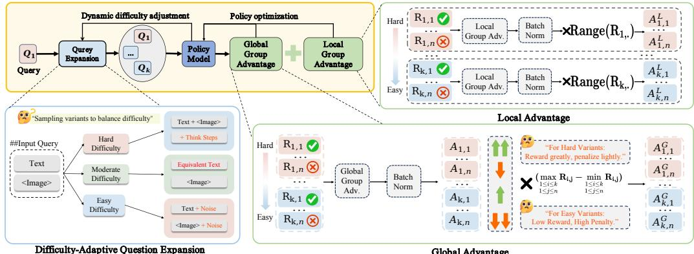  
Figure 2: Overview of the proposed DIVA-GRPO method. For a given question, we dynamically assess its difficulty based on past rollout rewards and adaptively sample variants of different difficulty levels. As shown, when the original question is hard, easier variants are sampled to ensure reward diversity. We then compute local (the question itself) and global (the question with its variants) advantages, and obtain the final advantage through difficulty-aware reweighting and reward-range rescaling to update the policy model.

## 3 DIFFICULTY-ADAPTIVE VARIANT ADVANTAGE WITH GRPO

To address this challenge, we design a difficulty-adaptive method, DIVA-GRPO. Its core idea is to dynamically assess problem difficulty, adaptively sample semantically consistent variants of different difficulties, and enhance the diversity of rewards within the problem and its variant space. By computing difficulty-weighted local (for the original problem) and global (for the problem and its variants) group advantages, the framework mitigates reward sparsity and vanishing advantage issues. Figure 2 illustrates the overall pipeline.

## 3.1 DIFFICULTY ASSESSMENT OF SAMPLES

A prerequisite for implementing adaptive strategies is to assign an appropriate difficulty level to each problem. Notably, problem difficulty is neither inherent nor static; rather, it should be dynamically assessed in line with the evolving capability of the model. To this end, DIVA-GRPO introduces a difficulty assessment mechanism based on historical rollout outcomes: if most rollouts for a problem are correct, it is regarded as relatively easy for the current model; otherwise, it is considered relatively difficult. This assessment is recalibrated at every training epoch, ensuring that perceived difficulty adapts as the model improves. The resulting difficulty estimates are then used to guide variant generation and sampling strategies, enabling the model to balance exploration and exploitation while maintaining meaningful advantage signals continuously.

We define problem difficulty within the range $[ D _ { \mathrm { m i n } } , D _ { \mathrm { m a x } } ]$ , where $D _ { \mathrm { m i n } }$ represents the easiest level and $D _ { \mathrm { m a x } }$ the most difficult. At the beginning of training, all problems are initialized at the midpoint of this range: $\begin{array} { r } { D _ { \mathrm { m i d } } ~ = ~ \frac { D _ { \mathrm { m i n } } + D _ { \mathrm { m a x } } } { 2 } } \end{array}$ . Let each original problem contain m variants, and let each variant be rolled out k times. We denote the empirical accuracy of these rollouts as $\begin{array} { r } { \alpha = \frac { 1 } { m k } \sum _ { i = 1 } ^ { m } \sum _ { j = 1 } ^ { k } \mathbb { I } [ y _ { i , j } } \end{array}$ is correct], where $\mathbb { I } [ \cdot ]$ is the indicator function. The difficulty is then updated according to the following rule:

$$
D ^ {\text { new }} = \operatorname{clip} \left(D ^ {\text { old }} + \eta \cdot (0. 5 - \alpha), D _ {\min}, D _ {\max}\right),
$$

where $\eta > 0$ is a learning rate controlling the adjustment magnitude, and clip(·, $D _ { \mathrm { m i n } } , D _ { \mathrm { m a x } } )$ ensures that the difficulty remains within $[ D _ { \mathrm { m i n } } , D _ { \mathrm { m a x } } ]$ . This update rule guarantees that:

• if most rollouts are correct $( \alpha  1 )$ , the difficulty decreases;

• if most rollouts fail (α → 0), the difficulty increases;

• if the accuracy is around 50%, the difficulty remains stable.

In this way, difficulty levels evolve smoothly with model performance, allowing more nuanced adjustments than the simple “all-correct/all-wrong” rule, and ensuring continuous calibration of sampling strategies throughout training. For the hyperparameter η, ablation experiments and recommendations for its selection can be found in Appendix D.2.

## 3.2 DIFFICULTY-ADAPTIVE VARIANT GENERATION

We aim to provide each problem with an appropriate advantage. To this end, we introduce a method for generating adaptive variants based on the difficulty assessment of each problem derived above. Let each original problem be denoted as $\begin{array} { r } { q = ( I _ { q } , T _ { q } ) } \end{array}$ , where $I _ { q }$ is the associated image and $T _ { q }$ is the textual description and question. After evaluating the difficulty ${ \bf \chi } ^ { \prime } D _ { q } \in [ D _ { \mathrm { m i n } } , D _ { \mathrm { m a x } } ]$ of each problem, we generate a set of difficulty-specific consistent variants $\mathcal { V } _ { q } = \{ { q } ^ { ( 1 ) } , { q } ^ { ( 2 ) } , \dots \}$ for training, ensuring that each variant preserves the original answer $y _ { q } ^ { * }$ while selectively adjusting its difficulty to optimize the model’s learning. By dynamically adjusting the characteristics of each variant according to $D _ { q }$ we aim to ensure that the reward distribution for each problem provides meaningful advantage signals while maintaining a more balanced profile. The sampling method is described in Appendix D.2, and several case studies of the variants are presented in Appendix H.

• Simpler problems $( D _ { q } < D _ { \bf m i d } ) $ : Variants are generated by perturbing both the text and the image: $q ^ { ( i ) } = ( I _ { q } ^ { ( i ) } , T _ { q } ^ { ( i ) } )$ . Textual variants $T _ { q } ^ { ( i ) }$ are created by rephrasing, restructuring, or introducing slight linguistic perturbations to the original question, ensuring the answer remains unchanged. These modifications enhance the model’s sensitivity to subtle differences, thereby improving robustness. Image variants $I _ { q } ^ { ( i ) }$ are generated through perturbation functions such as rotation, Gaussian noise, salt-and-pepper noise, speckle noise, and blurring. Stronger or multiple perturbations increase difficulty while preserving correctness. Alternatively, the textual information $T _ { q }$ can be embedded within the images in the variant set $\mathcal { V } _ { q }$ and provided as images to convey the problem information.

• Moderate problems $( D _ { q } \approx D _ { \mathbf { m i d } } ) ;$ : Variants are generated by creating semantically equivalent textual versions: $\mathcal { V } _ { q } = \{ ( I _ { q } , T _ { q } ^ { ( i ) } ) \ | \ T _ { q } ^ { ( i ) }$ is a paraphrase of $T _ { q } \}$ . These variants maintain the original difficulty while diversifying expression. This allows the model to experience multiple formulations of the same problem, improving generalization to unseen expressions.

• Difficult problems $( D _ { q } > D _ { \bf m i d } )$ : Variants incorporate partial reasoning guidance: $q ^ { ( i ) } =$ $( I _ { q } , T _ { q } \oplus R _ { q } ^ { ( i ) } )$ , where $R _ { q } ^ { ( i ) }$ is a sequence of intermediate reasoning steps generated and verified by a closed-source model. For more difficult problems, additional reasoning steps are provided as hints. This ensures that even challenging problems produce meaningful advantage signals, mitigating gradient vanishing and promoting gradual mastery of complex reasoning.

## 3.3 DIFFICULTY-WEIGHTED AND NORMALIZED ADVANTAGE BALANCING

Before introducing our balancing strategy, we first review the notion of local and global advantages used in GRPO-based training. While GRPO computes advantages within a single problem, recent work Yao et al. (2025) introduces semantically consistent variants to enable broader comparisons. Let an original problem be denoted as $q = ( I _ { q } , \mathbf { \bar { \it T } } _ { q } )$ , with associated image $I _ { q }$ and textual description $T _ { q } .$ . For each q, a set of variants $\mathcal { V } _ { q } = \{ \boldsymbol { q } ^ { ( 1 ) } , \ldots , \boldsymbol { \bar { q } } ^ { ( N ) } \}$ is constructed, modifying only text or image while preserving the ground-truth answer. Two types of advantages are defined:

• Local advantage: $A _ { \mathrm { l o c a l } } ( y _ { i } ^ { ( i ) } )$ , computed for each problem using the standard GRPO formula.

• Global advantage: $A _ { \mathrm { g l o b a l } } ( y _ { i } ^ { ( j ) } )$ , computed across all responses in the variant set: $\begin{array} { r } { A _ { \mathrm { g l o b a l } } ( y _ { i } ^ { ( j ) } ) = \frac { r ( y _ { i } ^ { ( j ) } ) - \mu _ { q } } { \sigma _ { q } + \epsilon } } \end{array}$ , where $\mu _ { q }$ and $\sigma _ { q }$ are the mean and standard deviation of rewards across all responses in $\gamma _ { q } .$

To ensure that both local and global advantages contribute effectively while accounting for varying problem difficulty, we propose a two-step balancing strategy: (1) normalization to make local and global signals comparable, and (2) difficulty-weighted scaling to adaptively rescale advantages according to each problem’s dynamic difficulty coefficient. This design stabilizes optimization by preventing dominance of global advantages and aligning reward signals with problem difficulty.

Formally, after sampling multiple variants for each problem, we compute both local and global advantages. However, two issues arise in this process.

(1) Local–Global imbalance. The magnitudes of local and global advantages are unequal: local advantages are computed from k rollouts, whereas global advantages are based on $m \times k$ samples. Consequently, global advantages tend to be larger and dominate the optimization, while local signals are underweighted. A detailed analysis of the distributions of the original local and global advantages can be found in Appendix D.6. To address this issue, we apply batch-level z-score normalization separately:

$$
\tilde {A} _ {\mathrm{local}} (y) = \frac {A _ {\mathrm{local}} (y) - \mu_ {\mathrm{local}}}{\sigma_ {\mathrm{local}} + \epsilon}, \quad \tilde {A} _ {\mathrm{global}} (y) = \frac {A _ {\mathrm{global}} (y) - \mu_ {\mathrm{global}}}{\sigma_ {\mathrm{global}} + \epsilon},
$$

where $\mu _ { \mathrm { l o c a l } } , \sigma _ { \mathrm { l o c a l } }$ and $\mu _ { \mathrm { g l o b a l } } , \sigma _ { \mathrm { g l o b a l } }$ are the mean and std of local and global advantages within a batch. This ensures that both signals remain comparable and contribute fully to training.

(2) Difficulty-weighted scaling. Existing methods treat easy and difficult problems equally when computing advantages, without accounting for their varying difficulty levels. To encourage the model to tackle harder problems, we introduce difficulty-weighted scaling after normalization.

Let $\{ D _ { q } ^ { ( i ) } \} _ { i = 1 } ^ { N }$ denote the difficulty coefficients of the N variants in a problem group $\gamma _ { q } .$ , and let $\begin{array} { r } { \bar { D } _ { q } = \frac { 1 } { N } \sum _ { i = 1 } ^ { N } D _ { q } ^ { ( i ) } } \end{array}$ be the group-wise mean difficulty. For each response y associated with variant $q ^ { ( i ) }$ , the rescaled advantage is computed as

$$
\hat {A} (y _ {i} \mid q ^ {(i)}) = \exp \Bigl (k \cdot (D _ {q} ^ {(i)} - \bar {D} _ {q}) \cdot \mathrm{sgn} (\tilde {A} (y _ {i})) \Bigr) \cdot \tilde {A} (y _ {i}),
$$

where $\tilde { A } ( y _ { i } )$ is the normalized advantage, $\operatorname { s g n } ( { \mathord { \cdot } } )$ is the sign function, and $k > 0$ is a sensitivity. The reason for using relative difficulty weighting is analyzed and supported by ablation experiments in Appendix D.5, while the analysis of the sensitivity parameter k are presented in Appendix D.1.

Intuitively, when a variant is harder than the group average $( D _ { q } ^ { ( i ) } > \bar { D } _ { q } )$ , correct answers $( \tilde { A } > 0 )$ are amplified while incorrect ones are softened. Conversely, when a variant is easier than average, correct answers are down-weighted and incorrect ones are penalized more heavily.

In this way, the training process achieves difficulty-adaptive optimization, effectively balancing the contributions of both the relative difficulty within a problem group and the magnitudes of advantages. The theoretical validity of this balancing strategy is rigorously established in Appendix B, where Theorem B.1 demonstrates that reducing gradient variance accelerates convergence, and Corollary B.2 shows that our normalization and weighting strategy significantly decreases variance while preserving unbiased gradient estimates. Moreover, Appendix C mathematically confirms that the optimization signal is strongest when the ratio of correct to incorrect samples is approximately 1:1, providing a solid theoretical foundation for our dynamic difficulty adjustment mechanism.

## 3.4 REWARD-RANGE-BASED ADVANTAGE RESCALING (RRB-RESCALING)

In GRPO-based reinforcement learning, we observed that advantage estimation can become unreliable when the reward range within a rollout group is small. If rewards are tightly clustered, standard z-score normalization may exaggerate minor differences, producing misleading optimization signals. As a result, the model may over-reward trivial gains while overlooking substantial ones.

Consider a reward scheme where correctly formatted responses receive 0.1 and fully correct responses receive 0.9. Suppose we have two samples, each rolled out 5 times: Sample A with rewards $[ \bar { 0 } , 0 , 0 , 0 , 0 . 1 ]$ and Sample B with rewards [0, 0, 0, 0, 1]. After applying standard z-score normalization, both groups assign the same advantage (−0.45) to the zero-reward rollouts and the same high advantage (1.79) to the last rollout. This overestimates the gain from minor formatting correctness in Sample A and underestimates the greater achievement in Sample B.

To address this issue, we propose reward-range-based advantage rescaling. Let $\begin{array} { r l } { \mathcal { R } _ { q } } & { { } = } \end{array}$ $\{ r _ { 1 } , r _ { 2 } , \ldots , r _ { k } \}$ denote the rewards of all rollouts for a problem q, with the maximum possible reward range $R _ { \mathrm { m a x } }$ . We define the reward range and the rescaled advantage as

$$
\Delta r _ {q} = (\max (\mathcal {R} _ {q}) - \min (\mathcal {R} _ {q})) / R _ {\max}, \quad \hat {A} _ {\text { range }} (y _ {i}) = \Delta r _ {q} \cdot \tilde {A} (y _ {i})
$$

where $\tilde { A } ( y _ { i } )$ is the normalized advantage obtained via standard z-score. Intuitively, this method ensures that the magnitude of the advantage reflects the actual variability in rewards, preventing minor differences from being exaggerated and providing a more reliable optimization signal. This rescaling method can be applied independently of difficulty-weighted scaling and is compatible with any GRPO-based framework, improving the stability and efficiency of policy optimization.

Table 1: Performance comparison across multimodal mathematical benchmarks. Bold denotes the best performance among 7B models, and underline marks the best overall performance. Evaluation is conducted with VLMEvalKit (Duan et al., 2024), while results for other models are taken from Meng et al. (2025) and Yao et al. (2025). For each entry, the score before “/” is our re-evaluation using the officially released checkpoints, and the score after “/” is reported in the original paper.

<table><tr><td>Model</td><td>MathVista</td><td>MathVerse</td><td>MathVision</td><td>OlympiadBench</td><td>WeMath</td><td>MMK12test</td><td>Avg.</td></tr><tr><td>Claude3.7-Sonnet</td><td>66.8</td><td>52.0</td><td>41.3</td><td>48.9</td><td>72.6</td><td>55.3</td><td>56.15</td></tr><tr><td>GPT-4o</td><td>63.8</td><td>50.2</td><td>30.4</td><td>35.0</td><td>68.8</td><td>49.9</td><td>49.68</td></tr><tr><td>o1</td><td>73.9</td><td>57.0</td><td>60.3</td><td>68.0</td><td>98.7</td><td>73.9</td><td>72.30</td></tr><tr><td>Gemini2-flash</td><td>70.4</td><td>59.3</td><td>41.3</td><td>51.0</td><td>71.4</td><td>65.2</td><td>59.77</td></tr><tr><td>InternVL2.5-VL-8B</td><td>64.4</td><td>39.5</td><td>19.7</td><td>12.3</td><td>53.5</td><td>45.6</td><td>39.17</td></tr><tr><td>Qwen-2.5-VL-7B</td><td>68.2</td><td>47.9</td><td>25.4</td><td>20.2</td><td>62.1</td><td>53.6</td><td>46.23</td></tr><tr><td>InternVL2.5-VL-38B</td><td>71.9</td><td>49.4</td><td>31.8</td><td>32.0</td><td>67.5</td><td>58.0</td><td>51.77</td></tr><tr><td>Qwen-2.5-VL-32B</td><td>71.7/74.7</td><td>49.9</td><td>40.1</td><td>30.0</td><td>69.1</td><td>66.8</td><td>54.6</td></tr><tr><td>InternVL2.5-VL-78B</td><td>72.3</td><td>51.7</td><td>32.2</td><td>31.1</td><td>66.3</td><td>61.6</td><td>52.53</td></tr><tr><td>Qwen-2.5-VL-72B</td><td>74.8</td><td>57.6</td><td>38.1</td><td>40.4</td><td>72.4</td><td>70.5</td><td>59.0</td></tr><tr><td>InternVL2.5-8B-MPO</td><td>68.9</td><td>35.5</td><td>21.5</td><td>7.8</td><td>53.5</td><td>34.5</td><td>36.95</td></tr><tr><td>InternVL2.5-38B-MPO</td><td>73.8</td><td>46.5</td><td>32.3</td><td>25.6</td><td>66.2</td><td>48.3</td><td>48.78</td></tr><tr><td>QVQ-72B-Preview</td><td>71.4</td><td>48.2</td><td>35.9</td><td>33.2</td><td>65.4</td><td>61.5</td><td>52.60</td></tr><tr><td>Adora-7B</td><td>73.5</td><td>50.1</td><td>23.0</td><td>20.1</td><td>64.2</td><td>58.1</td><td>48.17</td></tr><tr><td>R1-Onevision-7B</td><td>64.1</td><td>47.1</td><td>23.5/29.9</td><td>17.3</td><td>61.8</td><td>39.8</td><td>42.27</td></tr><tr><td>OpenVLThinker-7B</td><td>70.2</td><td>47.9</td><td>25.3</td><td>20.1</td><td>64.3</td><td>60.6</td><td>48.07</td></tr><tr><td>MM-Eureka-7B</td><td>71.7/73.0</td><td>50.3</td><td>26.9</td><td>20.1</td><td>66.1</td><td>64.5</td><td>49.93</td></tr><tr><td>R1-ShareVL-7B</td><td>73.5/75.4</td><td>52.8</td><td>29.5</td><td>21.3</td><td>67.9</td><td>68.8</td><td>52.30</td></tr><tr><td>SFT-7B</td><td>66.4</td><td>49.6</td><td>21.3</td><td>16.2</td><td>57.6</td><td>54.3</td><td>44.23</td></tr><tr><td>DIVA-GRPO-7B (Ours)</td><td>74.2</td><td>57.6</td><td>32.1</td><td>23.1</td><td>69.3</td><td>70.2</td><td>54.58</td></tr></table>

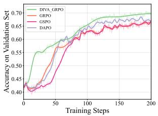  
(a) RQ1: Effectiveness of the DIVA-GRPO

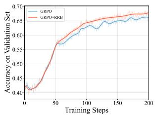  
(b) RQ3: Effectiveness of RRB on General GRPO Methods

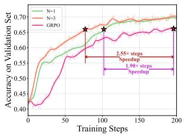  
(c) RQ4: Impact of DIVA-GRPO on Efficiency and Speed  
Figure 3: Effect of Training Steps on Model Performance on the Validation Set.

## 4 EXPERIMENTS

In this section, we conduct extensive experiments to evaluate the effectiveness of DIVA-GRPO, complemented by ablation studies to assess the contributions of its key components. Our evaluation is driven by the following research questions:

• RQ1 (Effectiveness): How does DIVA-GRPO compare to recent advanced systems?

• RQ2 (Completeness): What impact does removing key components have on model performance?

• RQ3 (Generalization): How well does RRB-Rescaling generalize to standard GRPO?

• RQ4 (Efficiency): What impact does DIVA-GRPO have on training efficiency?

## 4.1 EXPERIMENTAL SETUP

Benchmarks. Our evaluation covers six diverse benchmarks: MathVista(Lu et al., 2023), Math-Verse(Zhang et al., 2024), MathVision(Wang et al., 2024), OlympiadBench(He et al., 2024), We-Math(Qiao et al., 2024), and MMK12-test(Meng et al., 2025).

Baselines. Our comparisons cover three categories of models: (i) closed-source proprietary MLLMs; (ii) open-source base MLLMs; (iii) open-sourcefine-tuned MLLMs.

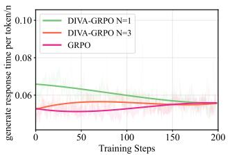  
(a) Time per token generation

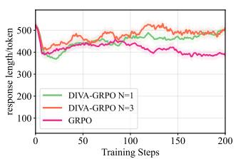  
(b) Average length of response

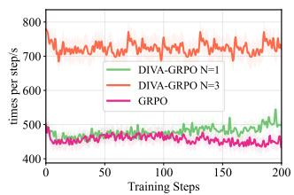  
(c) Time per step  
Figure 4: Statistics of time and training speed during training and testing, showing that our method only leads to a slight increase in training time per step, primarily due to the increased output length.

Implementation. Our method is trained on Qwen2.5-VL-7B-Instruct (Bai et al., 2025) with AdamW at a learning rate of $1 0 ^ { - 6 }$ . We employ the latest EasyR1 framework for training. Specifically, for methods that do not generate variants, we set $k = 1 0 .$ , while for methods that do generate variants, we set $k = 5 ,$ , using both $N = 1$ and $N = 3$ settings to ensure the fairness of the experiment. This setup guarantees a rigorous and fair comparison across all baselines. Difficulty scores $D _ { q }$ are initialized to $\bar { 5 } ( D _ { \operatorname* { m i n } } = 1 , \bar { D } _ { \operatorname* { m a x } } = 9 )$ with $\eta = 4$ . The detailed parameter analysis of can be found in Appendix D. Textual reasoning hints are pre-generated offline, while image perturbations are applied online. All textual variants and reasoning sequences are generated offline using GPT-o3.

## 4.2 MAIN RESULTS (RQ1: EFFECTIVENESS)

We report results on 7B-scale models, with the main experiments conducted on the R1-ShareVL-52K dataset. DIVA-GRPO demonstrates superior performance compared to both the base models and other multimodal training approaches. As shown in Table 1, we provide a comprehensive comparison against state-of-the-art systems across five widely used and challenging benchmarks.

Our method achieves state-of-the-art performance across all datasets at the 7B scale, delivering consistently strong results on both Chinese and English benchmarks with an average score of 54.58. Remarkably, on MathVista, MathVerse, and WeMath, its performance is already on par with the much larger Qwen2.5-VL-72B, while substantially outperforming several open-source base models (e.g., Qwen2.5-VL-32B, InternVL2.5-VL-78B) and proprietary systems (e.g., GPT-4o, Claude 3.7- Sonnet), showcasing notable efficiency and cost-effectiveness. Nevertheless, on more challenging competition-level mathematics tasks, our method still falls short of ultra-large open-source models and cutting-edge proprietary systems, likely due to inherent limitations in model capacity and training data coverage. We further explored applying direct SFT to the backbone model using reasoning traces generated by GPT-o3 and found that such direct training not only failed to improve performance but even underperformed the base model—further underscoring the effectiveness of our approach. Compared with its backbone model, Qwen2.5-VL-7B, our method consistently improves results across all benchmarks, achieving an average accuracy gain of 8.23 points, which highlights its clear advantages over existing multimodal training frameworks. The discussion of different external models can be found in Appendix D.4.

Figure 5 further illustrates the training dynamics: in the early stage, samples have not yet formed a clear difficulty distribution, with most concentrated around medium difficulty and exhibiting only small advantages. As training progresses, the distribution gradually expands toward both easier and harder problems, and advantage signals become more distinct across difficulty levels. In later stages, the model maintains informative and balanced advantage signals even on high-difficulty samples, rather than collapsing into trivial “all-correct” or “all-wrong” states. These dynamics highlight the effectiveness of DIVA-GRPO in sustaining stable and efficient optimization.

## 4.3 ABLATION STUDY

## RQ2 (Completeness): Component Ablation of DIVA-GRPO

We perform ablation studies on the three core components of DIVA-GRPO at the 7B scale using representative benchmarks (MathVista, MathVerse, and MMK12test). Experiments are conducted on 5,000 randomly sampled instances from the MMK12 dataset to ensure timely and fair comparisons. Each 20 steps constitutes one epoch, with a total of 10 epochs of training. We evaluate the impact of removing Adaptive Variant Generation (including Global-Local Advantage and Balance), Difficulty Weighting, Reward-Range-Based Advantage Rescaling (RRB-Rescaling), and Global-Local Balance (G-L Balance), and compare each variant with the full model.

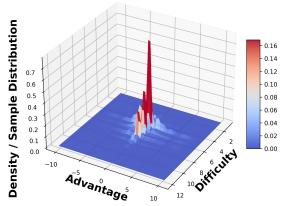  
(a) Train stage 1

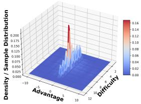  
(b) Train stage 2

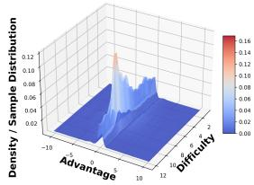  
(c) Train stage 3  
Figure 5: 3D kernel density estimation (KDE) surfaces of the joint distribution between problem difficulty and global advantage across different training stages. The surface height reflects the sample density, illustrating how the model’s learning dynamics evolve with respect to difficulty and advantage.

As reported in Table 2, removing any single component consistently decreases performance, with the full DIVA-GRPO model achieving the highest accuracy across all benchmarks. These results indicate that all components contribute complementary gains and none can be omitted without performance degradation, highlighting the necessity of the complete model design.

Furthermore, as shown in 3a, we compare DIVA-GRPO with GRPO, GSPO Zheng et al. (2025), and DAPO Yu et al. (2025) throughout the entire training process. Experimental results demonstrate that, under strict control of time and total response size, our method outperforms GRPO, GSPO, and DAPO in terms of both training speed and stability. Additionally, we have evalu

Table 2: Ablation study of DIVA-GRPO, showing that each component provides gains and the full model achieves the best performance (accuracy, %).

<table><tr><td>Method</td><td>MathVista</td><td>MathVerse</td><td>MMK12test</td><td>Avg.</td></tr><tr><td>w/o Variant Generation</td><td>70.0</td><td>53.7</td><td>61.1</td><td>61.6</td></tr><tr><td>w/o Difficulty-Weighting</td><td>69.9</td><td>55.7</td><td>66.5</td><td>64.0</td></tr><tr><td>w/o RRB-Rescaling</td><td>71.5</td><td>55.2</td><td>64.7</td><td>63.8</td></tr><tr><td>w/o G-L Balance</td><td>70.8</td><td>55.4</td><td>66.0</td><td>64.1</td></tr><tr><td>Full DIVA-GRPO</td><td>73.2</td><td>56.3</td><td>68.8</td><td>66.1</td></tr></table>

ated the performance of our method on Qwen3-VL-4B and 8B, with the detailed results presented in Appendix D.3.

## RQ3 (Generalization): Generalization of RRB-Rescaling

To verify the broader applicability of Reward-Range-Based Advantage Rescaling (RRB-Rescaling), we incorporate it into standard GRPO without any other modifications. Table 3 shows that adding

Table 3: Evaluation of RRB-Rescaling on standard GRPO.

<table><tr><td>Method</td><td>MathVista</td><td>MathVerse</td><td>MMK12test</td><td>Avg.</td></tr><tr><td>GRPO (base)</td><td>69.3</td><td>52.8</td><td>58.6</td><td>60.23</td></tr><tr><td>+ RRB</td><td>70.0</td><td>53.6</td><td>62.9</td><td>62.17</td></tr></table>

RRB-Rescaling increases the average accuracy from 60.23 to 62.17, with improvements observed across all three benchmarks. This is further illustrated in Figure 3b. This demonstrates that RRB-Rescaling enhances both stability and performance in a general GRPO setting, confirming that this component is not limited to DIVA-GRPO but can benefit other GRPO-style training frameworks.

## RQ4 (Efficiency): Training Efficiency and Stability

We compare the training performance of DIVA-GRPO and GRPO on Qwen2.5-VL-7B. As shown in Figure 3c, we measure the number of steps required by DIVA-GRPO to reach the test-set optimum within 10 epochs of GRPO training. When GRPO uses $n = 1 0$ and DIVA-GRPO uses $n = 5 ,$ , we ensure a constant number of sampled sentences when N = 1 and a consistent amount of input data when $N = 3$ . Figure 4a shows the time consumed per token during generation, Figure 4b illustrates the average response length, and Figure 4c depicts the time per step. Next, we calculate the speedup of DIVA-GRPO in terms of both steps and time.

• For $N = 1$ , we ensure the consistency of the response count, meaning the total number of samples remains equal, while DIVA-GRPO accelerates the steps by a factor of 1.90×. According to the statistics, while the time per token increases by only 13% and the time per step by just 4%, the total time comparison shows that our method consumes an average of 7.98 minutes per step, compared to 7.61 minutes per step for the GRPO method. For generating variants and think steps, approximately 32 minutes are required for every 5000 samples, while the generation of visual variants is almost instantaneous and does not incur additional time costs, as it is already included in the training time. Even when factoring in the time for generating variants, our method achieves a 1.76× speedup in terms of time.

• For N = 3, we ensure that the data requirements remain unchanged, while DIVA-GRPO accelerates the steps by a factor of 2.55×. In this case, the average time per step is 12.03 minutes. Even when accounting for the time required to generate variants, our method achieves a 1.56× speedup in terms of time. This clearly demonstrates the efficiency of our approach.

## 5 RELATED WORK

With the increasing application of GRPO in MLLMs to enhance reasoning, several challenges remain unresolved, particularly sparse rewards and advantage vanishing. Existing solutions can be grouped into three main approaches: sample augmentation and problem-space expansion, sample selection and utilization, and reward design.

Sample augmentation and expansion methods aim to enlarge the problem space using difficultyaware mechanisms or diverse sample generation to improve exploration and generalization. Noisy Rollout (Liu et al., 2025a) uses image noising to facilitate reinforcement learning, introducing visual diversity to prevent overfitting and improve robustness. Hint-GRPO (Huang et al., 2025) adapts hints based on task difficulty, enhancing data efficiency for hard samples. DeepVideo-R1 (Park et al., 2025) adjusts difficulty to help variants regain advantage, though it does not reshape single-sample difficulty distributions, leaving sparse rewards in extreme cases. R1-shareVL (Yao et al., 2025) expands the space with multiple variants and applies global advantage to shift difficulty, but lacks a complete mechanism to mitigate sparsity.

Sample selection and utilization methods focus computation on effective data while ignoring unhelpful samples, improving efficiency but risking premature abandonment of hard cases. VL-Rethinker (Wang et al., 2025a) uses selective replay to alleviate reward sparsity and preserves advantage diversity by replaying strong past samples. MM-Eureka (Meng et al., 2025) selects prompts with partial correctness, filtering zero-advantage cases to stabilize training. While helpful, these methods do not maximize overall sample utilization or provide a global optimization view.

Reward design methods aim to provide denser, continuous signals to reduce sparsity and stabilize reasoning. MM-Eureka introduces a hyperparameter λ to weight format rewards. R1-VL (Zhang et al., 2025) proposes StepGRPO, incorporating reasoning-accuracy and step-wise validity rewards for denser feedback. The introduced indirect rewards may therefore deviate from the primary objective and potentially mislead the model. DeepVideo-R1 introduces Reg-GRPO, transforming GRPO into a regression loss, while GRPO-LEAD (Zhang & Zuo, 2025) weights hard problems in advantage computation via dynamic difficulty awareness. By removing the variance term in advantage estimation, Dr. GRPO (Liu et al., 2025b) seeks to reduce variance and stabilize the learning signal. This shares the motivation with our RRB method, as both aim to provide more stable learning signals. Although these methods mitigate convergence and stability issues, they fail to address the fundamental challenges of sparse rewards and diminishing advantages.

## 6 CONCLUSION

In this work, we identified and addressed a fundamental limitation of GRPO-based reinforcement learning for multimodal large language models: reward sparsity and vanishing advantages, which hinder effective long-chain reasoning. To overcome this, we proposed DIVA-GRPO, a difficultyadaptive variant advantage framework that dynamically assesses problem difficulty, generates tailored variants, and computes both local and global advantages with difficulty-aware normalization and reward-range-based rescaling. This design ensures stable and informative optimization signals across problems of varying difficulty, mitigates reward sparsity, and enhances training stability. Extensive experiments on six multimodal reasoning benchmarks demonstrated that DIVA-GRPO consistently outperforms existing GRPO-based methods in reasoning accuracy, convergence speed, and training efficiency. Overall, our approach provides a generalizable framework for improving reinforcement learning in MLLMs, offering a principled way to balance exploration, sample utilization, and advantage estimation for complex multimodal reasoning tasks.