## ABSTRACT

Multimodal Large Language Models (MLLMs) have recently emerged as general architectures capable of reasoning over diverse modalities. Benchmarks for MLLMs should measure their ability for cross-modal integration. However, current benchmarks are filled with shortcut questions, which can be solved using only single modality, and thereby yielding unreliable rankings. For example, in visionlanguage cases, we can find the correct answer without either the image or the text. These low-quality questions unnecessarily increase the size and computational requirements of benchmarks. We introduce a multi-modal and multidimensional item response theory framework (M3IRT) that extends classical IRT by decomposing both model ability and item difficulty into image-only, text-only, and cross-modal components. M3IRT estimates cross-modal ability of MLLMs and each question’s cross-modal difficulty, enabling compact, high-quality subsets that better reflect multimodal reasoning. Across 24 VLMs on three benchmarks, M3IRT prioritizes genuinely cross-modal questions over shortcuts and preserves ranking fidelity even when 50% of items are artificially generated low-quality questions, thereby reducing evaluation cost while improving reliability. M3IRT thus offers a practical tool for assessing cross-modal reasoning and refining multimodal benchmarks.

## 1 INTRODUCTION

Multimodal Large Language Models (MLLMs) (Yin et al., 2024) have recently emerged as general architectures capable of reasoning over diverse modalities. A prominent subclass, Visual–Language Models (VLMs), jointly process images and text and are expected to support downstream tasks that require cross-modal reasoning (Jiang & Ye, 2023), such as medical image diagnosis and industrial inspection (Zhang et al., 2024). Consequently, rigorous and trustworthy multimodal benchmarks are essential for practitioners to choose appropriate models (Chen et al., 2024; Yue et al., 2025).

Benchmarks for MLLMs should measure their ability for cross-modal integration. However, current benchmarks are often filled with shortcut questions that can be solved using only single modality (e.g., answerable from text alone or image alone). For example, in vision-language cases, we can find the correct answer without either the image or the text. These low-quality questions unnecessarily increase the size and computational requirements of a benchmark and yields unreliable rankings (Yue et al., 2025). As the pool of candidate models grows, evaluating thousands of mixed-quality questions per model becomes increasingly costly, while single-modality shortcuts further obstacle evaluating the cross-modal reasoning ability.

Item Response Theory (IRT) is a principled framework for assessing subject ability and item difficulty (Fan, 1998). Without knowing the questions and answers, IRT estimates the ability and difficulty as parameters to predict the records of success or failure of a subject on an item. These parameters allow us to construct a compact subset of items tailored to each subject using Computerized Adaptive Testing (CAT) (Weiss & Kingsbury, 1984; Han, 2018). Recent work on LLM has leveraged IRT, where they considered LLM as subject and questions as items, to construct compact and essential subsets of text questions from benchmarks (Polo et al., 2024). However, classical IRT is agnostic to the modality of inputs and thus contains only a single latent ability or difficulty parameter. IRT cannot determine whether success on a multimodal item reflects true cross-modal reasoning or others.

To address the limitations, we introduce MultiModal and Multidimensional Item Response Theory (M3IRT), and its variant called M2IRT. Our proposed methods simply extend classical IRT by decomposing both model ability and item difficulty into three latent components: image-only, text-only, and cross-modal integration. This decomposition allows us to (i) estimate each VLM’s cross-modal ability and (ii) quantify each question’s cross-modal difficulty. Using these estimates, our proposed methods identifies genuinely cross-modal items and enables compact, high-quality benchmark subsets that better reflect multimodal reasoning while reducing evaluation cost.

We conduct extensive experiments with 24 VLMs across three benchmarks. We construct semisynthetic benchmarks by generating simple low-quality questions through the swapping of image or text from the original questions to introduce artificial shortcut or unsolvable questions. We obtain the answers of VLMs and make datasets indicating successes and false. We employ M3IRT, M2IRT, and other methods including IRT to refine our semi-synthetic benchmarks. First, we qualitatively observe that M3IRT prioritizes truly cross-modal items over shortcuts and preserves ranking fidelity even when 50% of the items are replaced with artificially generated low-quality questions. Representative highly and lower cross-modal difficulty items identified by M3IRT are shown in Figure 1.

Second, we conducted experiments to extract subsets of questions from the dataset as a high-quality problem-discovery task. We quantitatively evaluate the degree of ranking reconstruction for VLMs obtained from a small number of subsets of varying sizes, as well as the proportion of simple lowquality questions included in these small subsets. The former enables high performance with fewer items. The results show that our proposed framework nearly reconstructs the original ranking using only a 10% subset across all datasets, while also reducing the proportion of low-quality questions to less than half that of existing methods.

Our contributions1 are threefold:

1. We propose M3IRT, which explicitly models modality-specific (image-only, text-only) and cross-modal components of both item difficulty and model ability for multimodal evaluation.

2. We show that M3IRT yields compact, high-quality subsets that emphasize cross-modal reasoning and maintain reliable model rankings at substantially reduced computational cost.

3. Through experiments with 24 VLMs across three benchmarks, we demonstrate that M3IRT is robust to large fractions of low-quality items (up to 50%) and provides interpretable characterizations of both benchmarks and models.

## 2 RELATED WORK

Recent VLM evaluation has relied on large, static benchmarks such as MMMU (Yue et al., 2024), MathVista (Lu et al., 2024), SEED-Bench (Li et al., 2024a), EMMA (Hao et al., 2025) and CCHall (Zhang et al., 2025). These efforts shift the center of evaluation toward integration itself rather than isolated unimodal skills. Static expansions such as MMBench (Liu et al., 2024) broaden ability coverage but still exposed to low-quality question contamination and leakage. Several dynamic or live evaluation approaches have emerged such as VLB/FLEX (Yang et al., 2025) proposes to automatically generate both image and text. MAC (Jiang et al., 2025b) and LiveXiv (Shabtay et al., 2025) automatically constructs VQA from current news and papers. While valuable, these benchmarks still exposed to the risk of contaminating low-quality questions, such as shortcuts.

Existing methods for single-modal benchmarks can be categorized into Non-IRT-based and IRT-based approaches. First, Non-IRT-based approaches include question clustering that selects representative questions from clustering results, such as active testing with multi-stage sampling (Huang et al., 2024), tailored benchmark creation (Yuan et al., 2025), LLM predictability exploration (Ye et al., 2023), and anchor points (Vivek et al., 2024). Adaptive sampling dynamically selects questions based on current assessments of a model’s performance, including SubLIME (Xu et al., 2024), Dele (Saranathan et al., 2024), and methods that model inter-example dependencies (Li et al., 2024b). FlashEval (Zhao et al.,

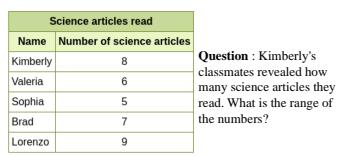

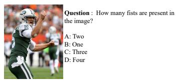  
(c) SEED-Bench (High quality)

(a) MMMU (Highly quality)  
(b) Mathvista (High quality)  
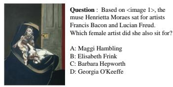

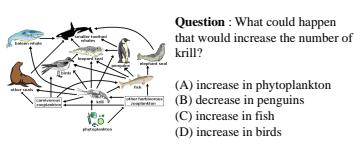  
(d) MMMU (Low quality)

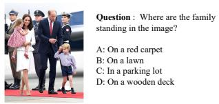  
(e) Mathvista (Low quality)  
(f) SEED-Bench (Low quality)  
Figure 1: Questions with the highest or lowest cross-modal difficulty $b _ { j } ^ { \mathrm { c r o s s } }$ detected by M3IRT. Questions with high cross-modal difficulty require both modalities to find the correct answer. However, those with low difficulty allow us to solve using only the image or text.

2024) was recently proposed, offering a novel evolutionary algorithm for text-to-image generation. However, they have not considered whether a question demand the cross-modal integration or not.

Item Response Theory (IRT) (Lord, 1980), originating in psychometrics, provides simultaneous modeling of subject (model) ability and item (question) parameters (e.g., difficulty, discrimination). The application of IRT has expanded to NLP (Lalor et al., 2016), dialogue (Hirai et al., 2023), and recommendation systems (Liu et al., 2023). In the LLM domain, IRT has been leveraged to reduce benchmark volumes; i. e. , MetaBench (Kipnis et al., 2025) distills a sparse benchmark from several benchmarks, and TinyBenchmarks (Polo et al., 2024) provides an efficient cluster-based sampling method. IRT has also been employed for adaptive sampling/testing of LLMs; for example, dynamic test adjustment based on model performance (Zhuang et al., 2023b), CAT-based cognitive ability measurement (Zhuang et al., 2023a), human chatbot evaluation, training of difficulty-calibrated question generators (Jiang et al., 2025a), and automated model evaluation (Guinet et al., 2024).

## 3 BACKGROUND

Consider a collection of MLLMs, treated as subjects and indexed by $M = \{ 1 , \dots , m \}$ , and a multimodal benchmark with questions treated as items and indexed by $N = \{ 1 , \ldots , n \}$ . For each subject–question pair $( i , j )$ , let $r _ { i , j } \in \{ 0 , 1 \}$ indicate whether subject i answers question j correctly $( r _ { i , j } = 1 )$ or not $( r _ { i , j } = 0 )$ . We denote the resulting response matrix by $R = \{ r _ { i , j } \} _ { ( i , j ) \in M \times N } .$ . Our objective is to assess the cross-modal abilities of the MLLMs and the difficulty of the questions, and to identify a compact subset $\hat { N } \subset N$ consisting of items that demand strong cross-modal reasoning.

Item Response Theory (IRT) is a family of latent variable models that jointly infer subject ability and item characteristics from observed response data (Fan, 1998). Given only the pattern of correct or incorrect responses, IRT estimates ability and difficulty parameters and predicts the probability that a subject will answer a given item correctly. We use the two-parameter logistic (2PL) model, which can be viewed as a logistic regression with item-specific slope and threshold:

$$
\operatorname * {P r} (r _ {i, j} = 1 \mid \theta_ {i}, a _ {j}, b _ {j}) = \sigma \bigl (a _ {j} (\theta_ {i} - b _ {j}) \bigr),\tag{1}
$$

where $\sigma ( x ) = 1 / ( 1 + \exp ( - x ) )$ ) is the sigmoid function. For each subject i, we define an ability parameter $\theta _ { i } \in \mathbb { R } ;$ higher values indicate a greater propensity to answer difficult items correctly. For each item $j ,$ , we define a discrimination parameter $a _ { j } > 0$ and a difficulty parameter $b _ { j } \in \mathbb { R }$ . Larger $a _ { j }$ means the probability of a correct response is more sensitive to changes in ability, whereas smaller $a _ { j }$ implies weaker sensitivity. As the difficulty $b _ { j }$ increases, greater ability is required to achieve a high probability of a correct response. IRT has been applied to CAT (Weiss & Kingsbury, 1984) to select test questions from an item pool to estimate a subject ability. Namely, we randomly initialize a student ability, select a question with the maximum Fisher information for a current ability, get an answer, and update a subject ability. We repeat this procedure.

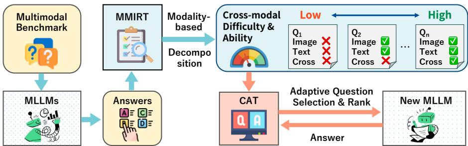  
Figure 2: M2IRT investigates the modality-specific and cross-modal difficulties of questions that enables to contract a tailored, compact, and high-quality subset for evaluating a new MLLM.

Multi-dimensional IRT (MIRT) is a method that extends IRT to consider the relationship between models and questions in a more complex manner (Reckase, 2009). This method supposes a ddimensional latent parameter space. The ability vector for subject i is $\pmb { \theta } _ { i } \in \mathbb { R } ^ { d }$ , and the difficulty and discriminative vectors for question j as $a _ { j } , b _ { j } \ \in \mathbb { R } ^ { d }$ . MIRT parametrizes the probability for providing a correct answer for a pair of $( i , j )$ and finds maximum likelihood estimator:

$$
\hat {P} (r _ {i, j} = 1) = \sigma \big (\boldsymbol {a} _ {j} ^ {\top} \boldsymbol {\theta} _ {i} - \boldsymbol {b} _ {j} \big), \hat {P} (r _ {i, j} = 0) = 1 - \hat {P} (r _ {i, j} = 1).\tag{2}
$$

## 4 PROPOSED METHOD

To assess modality-specific and cross-modal properties of MLLMs and multimodal benchmarks, we introduce the decomposition of the standard IRT parameters into latent components. Building on this decomposition, we introduce MultiModal Item Response Theory (M2IRT) and Multidimensional MultiModal Item Response Theory (M3IRT) as extensions of classical IRT and MIRT. We also develop a procedure for selecting a compact subset of benchmark items tailored to these models. Figure 2 illustrates the overall framework. Although the method is applicable to arbitrary modalities (e.g., action, audio), this paper primarily focuses on vision and language.

## 4.1 MODALITY-BASED DECOMPOSITION OF IRT PARAMETERS

We assume that an MLLM has modality-specific abilities as well as an ability to integrate information across modalities. Likewise, each multimodal question exhibits modality-specific and cross-modal characteristics that can determine whether a subject can provide the correct answer.

In the vision–language setting, we define binary indicators $s ^ { \mathrm { i m a g e } } , s ^ { \mathrm { t e x t } } \in \{ 0 , 1 \}$ to represent the modalities present in a question: $s ^ { \mathrm { i m a g e } } = 1$ if an image is provided and $s ^ { \mathrm { t e x t } } \dot { = } 1$ if text is provided; otherwise, the indicator is 0. Let $s = ( s ^ { \mathrm { i m a g e } } , s ^ { \mathrm { t e x t } } ) ^ { - } \in \dot { S ^ { = } } \{ ( 0 , 0 ) , ( 0 , 1 ) , ( 1 , 0 ) , ( 1 , 1 ) \}$ denote a format of representing a question. When $( s ^ { \mathrm { i m a g e } } , s ^ { \mathrm { t e x t } } ) = ( 0 , \dot { 0 } )$ , the stimulus are withheld and the subject answers using only a guess from introductions or the multiple-choice options.

We assume each subject has a base reasoning ability that, depending on the input format s, combines with image-specific, text-specific, and cross-modal integration abilities. For subject i, denote the base, image, text, and cross-modal abilities by $\theta _ { i } ^ { \mathrm { b a s e } } , \theta _ { i } ^ { \mathrm { i m a g e } } , \theta _ { i } ^ { \mathrm { t e x t } } , \theta _ { i } ^ { \mathrm { c r o s s } } \in [ 0 , q ]$ , respectively, where $q \geq 0$ is a shared upper bound that balances their scales. Given a question j and its modality indicator $s ,$ we define the ability of a subject j as follows:

$$
\theta_ {i} (s) = \theta_ {i} ^ {\mathrm{base}} + s ^ {\mathrm{image}} \theta_ {i} ^ {\mathrm{image}} + s ^ {\mathrm{text}} \theta_ {i} ^ {\mathrm{text}} + s ^ {\mathrm{image}} s ^ {\mathrm{text}} \theta_ {i} ^ {\mathrm{cross}}.\tag{3}
$$

The second and third terms contribute when an image or text is present, respectively; the fourth term contributes only when both are present. This construction naturally extends to additional modalities.

We view answering as exploiting hints provided by the item. For item $j ,$ let $b _ { j } ^ { \mathrm { b a s e } } , b _ { j } ^ { \mathrm { i m a g e } } , b _ { j } ^ { \mathrm { t e x t } }$ $b _ { j } ^ { \mathrm { c r o s s } } \in [ 0 , q ]$ be the base, image, text, and cross-modal difficulties, respectively, using the same upper bound $q \geq 0$ . We define the difficulty $b _ { j } ( s )$ of question $j$ given the indicator s as

$$
b _ {j} (s) = b _ {j} ^ {\mathrm{base}} - s ^ {\mathrm{image}} b _ {j} ^ {\mathrm{image}} - s ^ {\mathrm{text}} b _ {j} ^ {\mathrm{text}} - s ^ {\mathrm{image}} s ^ {\mathrm{text}} b _ {j} ^ {\mathrm{cross}}.\tag{4}
$$

Similarly, let $a _ { j } ^ { \mathrm { b a s e } } \in [ 0 , q ]$ be the base discrimination, let $a _ { j } ^ { \mathrm { i m a g e } } , a _ { j } ^ { \mathrm { t e x t } } , a _ { j } ^ { \mathrm { c r o s s } } \in [ 0 , q ]$ capture the contributions from image, text, and cross-modal integration. The discrimination becomes

$$
a _ {j} (s) = a _ {j} ^ {\mathrm{base}} + s ^ {\mathrm{image}} a _ {j} ^ {\mathrm{image}} + s ^ {\mathrm{text}} a _ {j} ^ {\mathrm{text}} + s ^ {\mathrm{image}} s ^ {\mathrm{text}} a _ {j} ^ {\mathrm{cross}}.\tag{5}
$$

In a general setting, we define indicators to represent the all modalities in a benchmark, and extend parameters applicable to represent combinations of modalities.

## 4.2 MULTIMODAL ITEM RESPONSE THEORY (M2IRT)

To capture cross-modal behavior, we control which modalities are provided, thus each subject answers each item under the four input formats corresponding to all $s \in S$ . For each subject–question-format combination $( i , j , s )$ , let $r _ { i , j , s } \in \{ 0 , 1 \}$ } indicate whether subject i answers question j given the format indicator s correctly $( r _ { i , j , s } = 1 )$ or not $( r _ { i , j , s } = 0 )$ . We denote full response set as the resulting response tensor by $R ^ { \prime } = \{ r _ { i , j , s } \} _ { ( i , j , j ) \in M \times N \times S } .$

M2IRT extends the logistic IRT model in Equation 1. Given discrimination $a _ { j } ( s )$ , difficulty $b _ { j } ( s )$ and ability $\theta _ { i } ( s )$ , we define $z _ { i , j , s } = a _ { j } ( s ) ( \theta _ { i } ( s ) - b _ { j } ( s ) )$ ) and introduce M2IRT as follows:

$$
\hat {P} (r _ {i, j, s} = 1) = \sigma \big (z _ {i, j, s} \big) \quad \text { and } \quad \hat {P} (r _ {i, j, s} = 0) = 1 - \hat {P} (r _ {i, j, s} = 1).\tag{6}
$$

This parameterization captures the modality-aware behavior of subject i on item $j .$ .

## 4.3 MULTIMODAL MULTI-DIMENSIONAL ITEM RESPONSE THEORY (M3IRT)

M3IRT extends the logistic MIRT model in Equation 2 with the modality-based decomposition. We modify the decomposed components into vectors. For subject i, define the ability vector $\pmb \theta _ { i } =$ $[ \theta _ { i } ^ { \mathrm { { b a s e } } } , \theta _ { i } ^ { \mathrm { { i m a g e } } } , \theta _ { i } ^ { \mathrm { { t e x t } } } , \theta _ { i } ^ { \mathrm { { c r o s s } } } ] ^ { \top }$ For item $j ,$ , define the discrimination and difficulty vectors ${ \mathbf { } } a _ { j } { \mathbf { } } =$ [abasej , aj image aj text , btext, bcross]⊤. For convenience, we introduce a j format indicator vector $\boldsymbol { s } = [ 1 , - s ^ { \mathrm { i m a g e } } , - s ^ { \mathrm { t e x t } } , - s ^ { \mathrm { i m a g e } } s ^ { \mathrm { t e x t } } ] ^ { \intercal }$ , where the negative signs align with the subtractive role of the modality terms in Equation 4 and with the decomposition in Equation 5. From these vectors, we define $z _ { i , j , s } ^ { \prime } = \pmb { a } _ { j } ^ { \top } \mathrm { d i a g } ( \overline { { s } } ) \pmb { \theta } _ { i } - s ^ { \top } \pmb { b } _ { j }$ . We propose M3IRT as follows:

$$
\hat {P} (r _ {i, j, s} = 1) = \sigma \big (z _ {i, j, s} ^ {\prime} \big) \quad \text { and } \quad \hat {P} (r _ {i, j, s} = 0) = 1 - \hat {P} (r _ {i, j, s} = 1).\tag{7}
$$

Here, $\operatorname { d i a g } ( s )$ is the diagonal matrix whose diagonal elements are s. The probabilistic model equation 6 is a variant of multi-dimensional IRT with the parametrization $z _ { i , j , s }$ . This parametrization takes in the modality-aware nature of subject i when answering multimodal question j.

## 4.4 LEARNING M3IRT USING STOCHASTIC GRADIENT DESCENT

Instead of the EM algorithm commonly used in IRT, we estimate M3IRT parameters with stochastic gradient descent (SGD). Let a training dataset as $R ^ { \prime \prime } \subset R ^ { \prime }$ . Given $R ^ { \prime \prime }$ and the Bernoulli model in Equation 6, the negative log-likelihood is the negative log likelihood of is

$$
\mathcal {L} (\Theta) = - \sum_ {(i, j, s) \in R ^ {\prime \prime}} \left(r _ {i, j, s} \log \hat {P} (r _ {i, j, s} = 1) + (1 - r _ {i, j, s}) \log \hat {P} (r _ {i, j, s} = 0)\right),\tag{8}
$$

where the parameters set is $\Theta = \{ \{ a _ { j } \} _ { j \in N } , \{ b _ { j } \} _ { j \in N } , \{ \pmb { \theta } _ { i } \} _ { i \in M } \}$ . We minimize $\mathcal { L } ( \Theta )$ busing minibach $\mathrm { S G D } , \hat { \Theta } = \mathrm { a r g m i n } _ { \Theta } \mathcal { L } ( \Theta )$ . We can estimate M2IRT in a similar manner. Note that our approach does not require a dense response matrix: M2IRT and M3IRT can be learned from partially observed data like a tensor completion, reducing the cost of evaluating MLLMs and benchmarks.

## 4.5 COMPUTER ADAPTIVE TEST WITH M2IRT AND M3IRT

We integrate M2IRT and M3IRT with classical Computerized Adaptive Testing (CAT) (Weiss & Kingsbury, 1984) to adaptively select an informative subset of items $\hat { N } \subseteq N$ , guided by Fisher information. For M2IRT model, the Fisher information of item $j$ for subject i under format s is

$$
I _ {i, j} = \hat {P} (r _ {i, j, s} = 1) \hat {P} (r _ {i, j, s} = 0) (a _ {j} (s)) ^ {2},\tag{9}
$$

where $\hat { P } ( r _ { i , j , s } = 1 )$ is given by Equation 6. For the multidimensional M3IRT model, the Fisher information matrix for item j at ability θ is

$$
\pmb {I} _ {i, j} = \hat {P} (r _ {i, j, s} = 1) \hat {P} (r _ {i, j, s} = 0) (\mathrm{diag} (\pmb {s}) \pmb {a} _ {j}) (\mathrm{diag} (\pmb {s}) \pmb {a} _ {j}) ^ {\top}.\tag{10}
$$

We adopt the D-optimality criterion (Mulder & Linden, 2009) to minimize estimation uncertainty by maximizing the determinant of the cumulative information. Let $U _ { i } \subseteq N$ be the set of items not yet answered by subject i. At stage t, given the cumulative information matrix $I _ { i } ^ { ( t - 1 ) }$ , we select the next item and update:

$$
j ^ {*} = \underset {j \in U _ {i}} {\operatorname{argmax}} \det \left(\boldsymbol {I} _ {i} ^ {(t - 1)} + \boldsymbol {I} _ {i j}\right),   \boldsymbol {I} _ {i} ^ {(t)} = \boldsymbol {I} _ {i} ^ {(t - 1)} + \boldsymbol {I} _ {i j ^ {*}}.\tag{11}
$$

Iterating this rule yields a subset that is maximally informative for estimating the subject’s ability.

## 5 EXPERIMENT

## 5.1 DATASETS AND BASELINES

We employed three benchmarks for VLMs in this experiment. MMMU (Yue et al., 2024) is designed to evaluate the reasoning capabilities of VLM through undergraduate-level questions in diverse disciplines such as art and design, business, and science. We used 900 questions in the validation set. MATHVISTA (Lu et al., 2024) evaluates mathematical reasoning capabilities through questions involving visual context including puzzle figures and graphs. We used 1000 questions of the test-min set. SEED-BENCH (Li et al., 2024a) is a large-scale benchmark designed to comprehensively evaluate the multimodal abilities. We used 1000 questions from L1 and L2 sets.

To simulate the presence of questionable samples in real-world datasets, we constructed a synthetically contaminated benchmark. We made semi-synthetic benchmarks by generating simple low-quality questions through the swapping of image or text from the original questions. This process introduces artificial shortcut or unsolvable questions. We compile a benchmark contaminated with 50% lowquality questions. We provide a detailed description of our data generation process in Appendix A. To create more realistic low-quality questions, methods such as modifying text and options using LLM or adding noise to images could be considered. Since such methods make the experiment overly complex, we excluded them. Note that our method learns ability and problem characteristics from whether VLMs answer questions correctly, even if there are different types of low-quality questions, the estimation results are unlikely to change.

We collected responses from 24 VLMs, including the GPT-4.1 series, Gemini-2.0 series, and Claude 3.7 series, as well as open-source models such as Qwen-2.5-vl (Bai et al., 2025), Llama-3.2 (Meta, 2024), and Pixtral (Agrawal et al., 2024). On SEED-BENCH, since Claude-sonnet-3 became unavailable at the start of the experiments on SEED-Bench, the experiments on SEED-Bench were conducted with 23 models other than Claude-sonnet-3.

We use four baseline methods in our experiments. Random selects subset questions at random. IRT uses a Fisher information-based subset selection estimated by IRT (Reckase, 2009). MIRT uses a Fisher information-matrix-based subset selection estimated by MIRT (Reckase, 2009). TinyBenchmarks (Polo et al., 2024) is an IRT-based problem selection method for benchmark refinement in LLM. FlashEval (Zhao et al., 2024) is a SOTA to select prompts for image generation. We extended FlashEval to deal with VLM benchmarks by regarding questions as prompts.

We implemented our proposed method with PyTorch (Paszke, 2019), and used Adam optimizer (Kingma & Ba, 2014) whose learning rate was 0.01. We used a grid search to select hyperparameter q from 2, 4, 8, 16. We selected the optimal hyperparamters based on the highest AUC in predicting the correctness of the VLMs’ responses on the validation dataset. We provide the detailed explanation of the experimental setting in Appendix E.

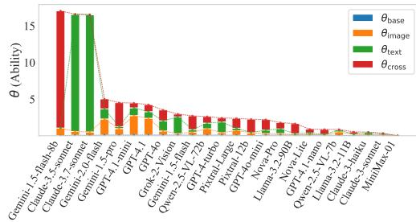  
(a) MMMU

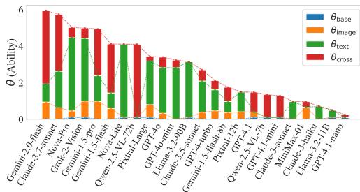  
(b) MATHVISTA

Figure 3: Distributions of θ estimated by M3IRT sorted in descending order.  
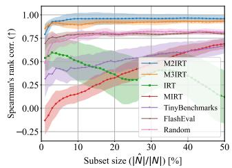  
(a) MMMU

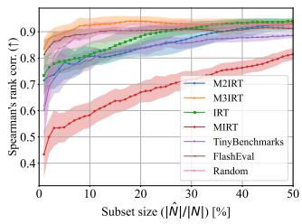  
(b) MATHVISTA

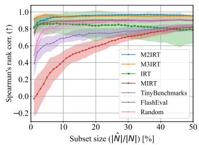  
(c) SEED-BENCH  
Figure 4: The average and standard deviation of Spearman’s rank correlations between model rankings on the original benchmark and those estimated on extracted question subsets with different sizes.

## 5.2 MULTIMODAL DIFFICULTY AND ABILITY DECOMPOSITION

M3IRT estimates the extent to which a question requires cross-modal reasoning, represented by difficulty $b _ { j } ^ { \mathrm { c r o s s } }$ . This facilitates the identification of questions that truly benefit model’s cross-modal capability assessment. Figure 1 shows examples of questions with high and low $b _ { j } ^ { \mathrm { c r o s s } }$ . The questions with low $b _ { i } ^ { \mathrm { c r o s s } }$ are judged that they can be solved only with images or text. For example, the bottom one in MMMU can be answered based on knowledge of artists without looking into the image. On the other hand, the questions with high $b _ { j } ^ { \mathrm { c r o s s } }$ cannot be solved if either the image or the text is missing. For example, the one in MATHVISTA requires reading the numerical values in the table that cannot be confirmed only by the question text. Similarly, if only images are provided, it is not clear what is being asked about in the table. We provide more examples in Appendix C.

M3IRT also estimates the extent to which the reasoning ability for each modality contributes to the VLM performance. Figure 3 shows the decomposed reasoning abilities of VLMs. The topperforming model on MMMU exhibits high $( \theta _ { i } ^ { \mathrm { c r o s s } } )$ ), suggesting strong cross-modal reasoning capabilities. On the other hand, the second and third best-performing models demonstrate high textual reasoning ability $( \theta _ { i } ^ { \mathrm { t e x t } } )$ but limited cross-modal reasoning capability. This analysis suggests that these latter VLMs rely heavily on text understanding when solving the MMMU benchmark, rather than effectively integrating visual information. In MATHVISTA, most VLMs have high $\theta _ { i } ^ { \mathrm { t e x t } }$ This may reflect MATHVISTA’s emphasis on text understanding. Most VLMs also exhibit moderate $\theta _ { i } ^ { \mathrm { i m a g e } }$ , suggesting that they also leverage the visual ability to process diagrams and graphs. The result for SEED-BENCH is shown Appendix C.

## 5.3 BENCHMARK REFINEMENT

We investigate whether a method can extract a compact subset of questions that enables us to evaluate the performance of unseen VLMs. We randomly select a VLM from a collection of VLMs and construct a subset of the responses of remaining VLMs. For a method, we select a subset of questions, estimate the performance of the VLM from its responses to the subset, and obtain an estimated ranking of VLMs. We compare the difference between rankings on the original benchmark for all models. We also investigate how much the artificial low-quality questions are included in the subset.

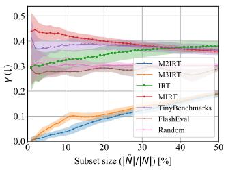  
(a) MMMU

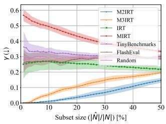  
(b) MATHVISTA

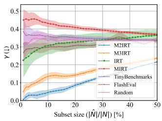  
(c) SEED-BENCH  
Figure 5: The average and standard deviation of the proportions of the low-quality questions in extracted question subsets γ with different sizes.

We use two measures to assess the quality of a subset $\hat { N } \subseteq N$ selected by a method. First, we assess how much a method avoid the low-quality questions in the estimation of model rankings. We compute the Spearman’s rank correlation between model rankings on the original benchmark and the extracted subset. Second, we evaluate how a method can distinguish between the original and low-quality questions. We measure the proportion of low-quality questions in the extracted subset as

$$
\gamma = \frac {| \{q \in \hat {N} \mid q \text {   is   a   low - quality   question } \} |}{| \hat {N} |}.
$$

We varied the subset size from 1% to 50% of the whole benchmark in 1% increments. We employed CAT with M2IRT using the maximum Fisher information in Sec. 4.5 and M3IRT using D-Optimality. We obtained the average and standard deviation from twenty four independent experiments.

Figure 4 shows the Spearman’s rank correlations between the model rankings on the original bench mark and on different sizes of subsets. Figure 5 shows the proportion γ with varying size of subsets.

As shown in Figure 4, our methods accurately estimate model rankings from contaminated benchmarks, even with small subsets. In MMMU, M2IRT achieves a rank correlation of 0.9 using only 3% of the benchmark subset, and M3IRT suprizingly achieves a rank correlation of 0.8 using the only 1% subset. FlashEval, which is SOTA but does not account for the presence of low-quality questions, performs similarly to Random. In MATHVISTA, M3IRT achieves a rank correlation of 0.84 with a subset fraction of only 2%, requiring 30% to achieve a rank correlation of 0.9. In SEED-BENCH, M2IRT achieves a rank correlation of 0.9 using only 3% of the benchmark subset, while M3IRT achieves the same rank correlation using only 1% of the benchmark subset.

From Figure 5, we confirmed that the proportion of artificial low-quality questions included in the subset selected by the proposed method is significantly smaller compared to existing methods. In MMMU, even with an extraction subset size of 50%, all proposed methods keep the proportion of low-quality questions notably low at 24%. In contrast, the baseline methods choose substantially more low-quality questions than ours, which skew the estimated model rankings. When extracting 30% of MATHVISTA, the rank correlation between M3IRT and Random is about the same, but γ is smaller for M3IRT. We observed similar trends in the results of SEED-BENCH.

## 5.4 ROBUSTNESS AGAINST LOW-QUALITY QUESTIONS

We have evaluated the performance of the proposed method using a subset of questions. Here, we assess its performance as a latent variable method for predicting missing responses from observed ones. First, from the set of questions N, we randomly select 100 or 10% questions each for validation and testing, using the remainder as training data. Next, we perform parameter estimation using the training data for both the proposed method and IRT. Finally, we evaluate the prediction performance on the test data using the estimated parameters with ROC-AUC. We measured ROC-AUC by varying the proportion of low-quality problems introduced in Sec. 5.1. We used IRT as a baseline in this experiment. We obtained the average and standard deviation from ten independent experiments.

We show the results in Figure 6. Our proposed methods achieved performance comparable to the standard IRT on ROC-AUC. M2IRT was slightly better than IRT on MMMU, and comparable to IRT on MATHVISTA and SEED-BENCH. M3IRT was slightly lower than IRT on MATHVISTA but the difference is small. Even when low-quality questions are mixed in, the proposed method and IRT achieve ROC-AUC values around 0.8, suggesting that they effectively capture both the abilites of VLMs and the characteristics of the questions.

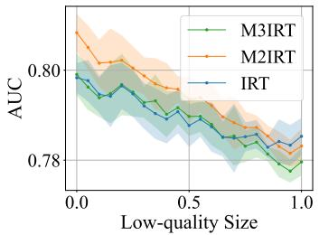  
(a) MMMU

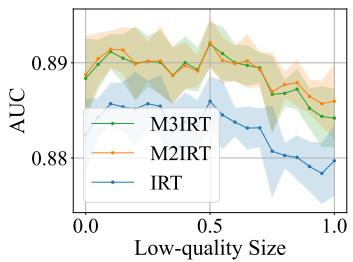  
(b) MATHVISTA

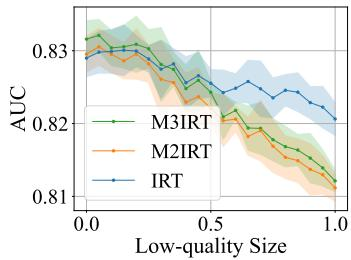  
(c) SEED-BENCH  
Figure 6: ROC-AUC on predicting answers of the noisy benchmarks containing the different size of the low-quality questions inserted into the original benchmark.

## 6 CONCLUSION

We addressed the challenge of assessing cross-modal reasoning characteristics in MLLMs and multimodal benchmarks while reducing evaluation cost. We introduced M3IRT and its variant M2IRT, which decompose both model ability and item difficulty of IRT into image-only, text-only, and cross-modal components. This decomposition enables the identification of highly cross-modal items that require cross-modal reasoning and supports lightweight assessment with far fewer items.

Across three benchmarks and 24 VLMs, we qualitatively evaluated that M3IRT can estimate the degree to which an item requires cross-modal reasoning, and assigns higher cross-modal difficulty to genuinely cross-modal items than to single-modality shortcut. Moreover, analyses with synthetically contaminated benchmarks confirmed that M3IRT and M2IRT yields evaluations aligned with the original benchmarks, demonstrating robustness to low-quality contamination.

Limitations and future work. Our study focuses on multiple-choice, which is a typical form of closed-ended questions. Extending the framework to open-ended settings with open-ended questions is a natural next step, enabling the discovery of items that demand stronger cross-modal reasoning and the evaluation of MLLMs under generative outputs. Beyond vision–language, applying the approach to additional modalities (e.g., audio, actions) and developing question-generation methods that control cross-modal difficulty are promising directions.

## ETHICS STATEMENT

This work adheres to the ICLR Code of Ethics. All datasets used in this paper (MMMU, MathVista, SEED-Bench) are publicly released benchmarks, and we strictly followed their respective licenses.

## ACKNOWLEDGMENTS

This work was supported by JST FOREST Program Grant Number JPMJFR232S, JST CREST Grant Number JPMJCR21D1, JST BOOST Grant Number JPMJBY24E8.

## REFERENCES

Pravesh Agrawal, Szymon Antoniak, Emma Bou Hanna, Baptiste Bout, Devendra Chaplot, Jessica Chudnovsky, Diogo Costa, Baudouin De Monicault, Saurabh Garg, Theophile Gervet, and Robin Lutz. Pixtral 12b. arXiv preprint arXiv:2410.07073, 2024.

Anthropic. Introducing the next generation of claude. https://www.anthropic.com/news/claude-3- family, 2024a.

Anthropic. Claude 3.5 sonnet. https://www.anthropic.com/news/claude-3-5-sonnet, 2024b.

Anthropic. Claude 3.7 sonnet and claude code. https://www.anthropic.com/news/claude-3-7-sonnet, 2025.

Shuai Bai, Keqin Chen, Xuejing Liu, Jialin Wang, Wenbin Ge, Sibo Song, Kai Dang, Peng Wang, Shijie Wang, Jun Tang, Humen Zhong, Yuanzhi Zhu, Mingkun Yang, Zhaohai Li, Jianqiang Wan, Pengfei Wang, Wei Ding, Zheren Fu, Yiheng Xu, Jiabo Ye, Xi Zhang, Tianbao Xie, Zesen Cheng, Hang Zhang, Zhibo Yang, Haiyang Xu, and Junyang Lin. Qwen2.5-vl technical report, 2025.

Chongyan Chen, Samreen Anjum, and Danna Gurari. Vqa therapy: Exploring answer differences by visually grounding answers. In Proceedings of the IEEE International Conference on Computer Vision (ICCV), 2023.

Lin Chen, Jinsong Li, Xiaoyi Dong, Pan Zhang, Yuhang Zang, Zehui Chen, Haodong Duan, Jiaqi Wang, Yu Qiao, Dahua Lin, and Feng Zhao. Are we on the right way for evaluating large vision-language models? In Advances in Neural Information Processing Systems (NeurIPS), 2024.

Xitao Fan. Item response theory and classical test theory: An empirical comparison of their item/person statistics. Educational and Psychological Measurement, 58(3):357–381, 1998. doi: 10.1177/0013164498058003001.

Yash Goyal, Tejas Khot, Douglas Summers-Stay, Dhruv Batra, and Devi Parikh. Making the v in vqa matter: Elevating the role of image understanding in visual question answering. In Proceedings of the IEEE Conference on Computer Vision and Pattern Recognition (CVPR), 2017.

Gauthier Guinet, Behrooz Omidvar-Tehrani, Anoop Deoras, and Laurent Callot. Automated evaluation of retrieval-augmented language models with task-specific exam generation. In Proceedings ofthe 41st International Conference on Machine Learning (ICML), 2024.

Danna Gurari, Qing Li, Abigale J Stangl, Anhong Guo, Chi Lin, Kristen Grauman, Jiebo Luo, and Jeffrey P Bigham. Vizwiz grand challenge: Answering visual questions from blind people. In Proceedings ofthe IEEE Conference on Computer Vision and Pattern Recognition (CVPR), 2018.

Kyung Chris T Han. Components of item selection algorithm in computerized adaptive testing. Journal ofEducational Evaluationfor Health Professions, 15:7, 03 2018.

Yunzhuo Hao, Jiawei Gu, Huichen Will Wang, Linjie Li, Zhengyuan Yang, Lijuan Wang, and Yu Cheng. Can MLLMs reason in multimodality? EMMA: An enhanced multimodal reasoning benchmark. In Forty-second International Conference on Machine Learning (ICML), 2025.

Ryu Hirai, Ao Guo, and Ryuichiro Higashinaka. Applying item response theory to task-oriented dialogue systems for accurately determining user‘s task success ability. In Proceedings of the 24th Annual Meeting of the Special Interest Group on Discourse and Dialogue(SIGDIAL), pp. 421–427, 2023.

Yuheng Huang, Jiayang Song, Qiang Hu, Felix Juefei-Xu, and Lei Ma. Active testing of large language model via multi-stage sampling, 2024.

Amazon Artificial General Intelligence. The amazon nova family of models: Technical report and model card. https://www.amazon.science/publications/the-amazon-nova-family-of-modelstechnical-report-and-model-card, 2024.

Ding Jiang and Mang Ye. Cross-modal implicit relation reasoning and aligning for text-to-image person retrieval. In Proceedings of the IEEE/CVF Conference on Computer Vision and Pattern Recognition(CVPR), 2023.

Han Jiang, Xiaoyuan Yi, Zhihua Wei, Ziang Xiao, Shu Wang, and Xing Xie. Raising the bar: Investigating the values of large language models via generative evolving testing. arXiv preprint arXiv:2406.14230, 2025a.

Mohan Jiang, Jin Gao, Jiahao Zhan, and Dequan Wang. MAC: A live benchmark for multimodal large language models in scientific understanding. In Second Conference on Language Modeling (COLM), 2025b.