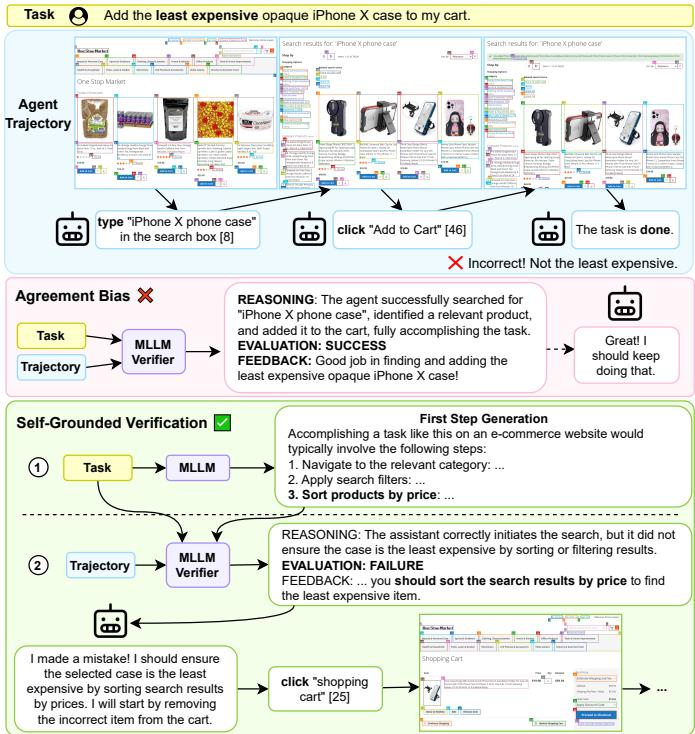
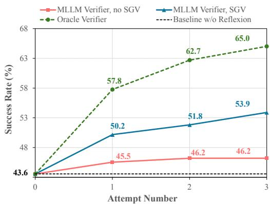

## ABSTRACT

Verifiers—functions assigning rewards to agent behavior—have been key to AI progress in domains such as math, code, and games. However, extending these gains to domains without clear-cut success criteria (e.g., computer use) remains a challenge: while humans can recognize desired outcomes, translating this intuition into scalable rules is nontrivial. Multimodal LLMs (MLLMs) emerge as a promising solution, given vast world knowledge, human-preference alignment, and reasoning capabilities. We evaluate MLLMs as verifiers across web navigation, computer use, and robotics, spanning 13+ model families, 28+ evaluation templates, curated trajectories from diverse agents and of varying lengths, and distinct verifier applications. We identify a critical limitation: a strong tendency for MLLMs to over-validate agent behavior—a phenomenon we term agreement bias. This bias is pervasive across models, resilient to test-time scaling, and can harm methods rely ing on MLLM evaluations, such as filtered behavior cloning and self-improvement. We provide guidance on the design and evaluation of MLLM verifiers, and introduce Self-Grounded Verification (SGV), a lightweight method that harnesses MLLMs own sampling mechanisms by modulating (un)conditional generation to better leverage their knowledge, alignment, and reasoning. SGV operates in two steps: first, the MLLM is elicited to generate broad priors about desired behavior, independent of the data under evaluation. Then, conditioned on self-generated priors, it reasons over and evaluates a candidate trajectory. Our methods yield gains across models and environments, improving failure detection by up to 25 pp and accuracy by 14 pp, with benefits extending to downstream applications. In self-improvement and online supervision, SGV boosts task completion of a GUI specialist in OSWorld, a diffusion policy in robomimic, and a ReAct agent in VisualWebArena—setting a new state of the art, surpassing the previous best by 20pp. Finally, we release an updated version of VisualWebArena featuring strong agent baselines, more humanaligned evaluators, high-fidelity environment parallelism, runtime speedups exceeding 10×, and VisualWebArena-Lite, a 1/3-scale subset with comparable evaluation fidelity. Our code, models, and data are publicly available at our project page.

## 1 INTRODUCTION

Several breakthroughs in artificial intelligence can be viewed through the lens of search guided by verifiers—functions assigning rewards to agent behavior aligned with desired criteria. Notable examples include seminal work in Go (Campbell et al., 2002) and Chess (Silver et al., 2017), where search and learning are guided by 0/1 rewards tied to the game’s final outcome, and recent advancements in large reasoning models (LRMs), leveraging formal verifiers in code and math (Shao et al., 2024b).

However, while domains such as math, code, and games benefit from relatively well-defined criteria to evaluate agent behavior, this clarity diminishes in open-ended settings. Evaluation in such scenarios often requires nuanced criteria and reasoning over possibly long sequences of multimodal inputs. For example, consider evaluating the trajectory in Fig. 1 (top) produced by a digital agent asked to “add the least expensive opaque phone case to a shopping cart”. Should the agent sort products by price?

Perform an advanced search? What is “opaque enough”? Although humans can often recognize satisfactory outcomes, formalizing this intuition into precise and scalable rules remains a challenge.

Multimodal Large Language Models (MLLMs) emerge as a promising solution to bridge this gap. With vast world knowledge, human-preference alignment, and large context windows, MLLMs hold the potential to serve as general-purpose verifiers, capable of handling inputs and producing rewards in multiple modalities. In this work, we probe this potential through a comprehensive study of MLLM-as-verifiers on open-ended tasks, spanning diverse environments, agent architectures, state-of-the-art MLLMs and LRMs, test-time scaling techniques, verifier designs, and evaluation metrics. We consider web, desktop, and robotic environments—VisualWebArena (Koh et al., 2024a), OSWorld (Xie et al., 2024), and robomimic (Mandlekar et al., 2021)—covering roughly 1,300 tasks across varied domains, where verification demands nuanced criteria and multimodal reasoning.

We identify a systematic and critical limitation: a strong tendency for MLLMs to over-validate agent behavior, a phenomenon we call agreement bias. As shown in Fig. 1 (middle), an MLLM verifier validates flawed behavior and even generates chains-of-thought (CoT) to rationalize incorrect judgments. This bias limits MLLMs’ ability to fulfill a core function of a verifier—identifying flawed behavior and providing feedback to improve performance—posing risks to methods that rely on MLLM-based evaluations. In particular, it can limit MLLMs’ effectiveness as data curators for fine-tuning and self-improvement pipelines (Trabucco et al., 2025a; Pan et al., 2024a; Wang et al., 2024; Yu et al., 2025; Shinn et al., 2023); as providers of rewards for training, search, and agent steering (Pan et al., 2024b; Koh et al., 2024b; Sun et al., 2025; Bai et al., 2024); and as judges (Chen et al., 2024; Lee et al., 2024; Zheng et al., 2023) and monitors (Baker et al., 2025) of agent behavior, where failure detection is essential for balanced assessments and to prevent harmful outcomes.

Notably, such failures occur despite MLLMs exhibiting human-aligned priors about desired behavior, suggesting a bottleneck in knowledge extraction—potentially rooted in fundamental limitations in pretraining (Allen-Zhu and Li, 2024b;a) and RLHF (Sharma et al., 2025)—that remains unresolved by major test-time scaling techniques and training for reasoning. To address this, we propose Self-Grounded Verification (SGV), a simple yet effective method that harnesses MLLMs’ own sampling mechanisms by modulating (un)conditional generation to better leverage their knowledge, alignment, and reasoning (Fig. 1, bottom). SGV operates in two steps: first, an MLLM is elicited to produce broad priors about desired behavior, conditioned only on the necessary context to frame the task. Then, conditioned on self-generated priors, the model reasons over and evaluates a candidate trajectory.

To assess the benefits and limitations of MLLM verifiers, as well as the effectiveness of SGV, we evaluate performance across three representative settings: offline evaluation of agent performance and two downstream applications—online supervision and self-improvement via Reflexion(Shinn et al., 2023). Our findings and contributions can be summarized as follows:

• Agreement bias is pervasive across MLLMs and LRMs, and is reflected in multiple quantitative metrics, including failure detection rates as low as 50% and output distributions skewed toward favorable judgments. This bias persists across 28+ prompt/scoring templates, techniques to mitigate biases in LLM judgments, and test-time scaling. It holds for both weak and strong agents built from models distinct from the verifier; increases with the capability gap between agents and verifiers; and is exacerbated when verification is treated as a binary success-or-failure classification.

• We elucidate how several applications rely on MLLMs acting as verifiers, and are sensitive to the quality of their evaluations. We show that agreement bias can impair the use of MLLMs for benchmarking agent performance, behavior cloning, self-improvement, and online supervision.

• Notably, these findings apply to a verifier that shows high aggregate metrics (e.g., over 90% recall) and state-of-the-art results in concurrent reward benchmarks. We discuss key factors for evaluating verifiers, including the importance of fine-grained and downstream metrics, challenges arising from leniency-strictness trade-offs, and confounders such as environment bugs and agent strength.

• We evaluate several design choices for building and evaluating MLLM-based verifiers, including the impact of Likert and score-based scales, trajectory length, agent strength, tools, model calibration, techniques to mitigate biases in LLM judges, and periodic vs. outcome-based verification.

• Our methods yield gains of up to 25 pp in failure identification, 14 pp in accuracy, and more humanaligned evaluations across models and environments, with benefits to downstream applications.

• In self-improvement, our stronger SGV-based verifier yields gains of up to 10 pp (24% relative) on VisualWebArena. In online supervision, it encourages agents to backtrack and avoid greedy strategies, yielding gains of 9 pp (20%) for a ReAct agent on VisualWebArena, 5 pp (22%) for the GUI-Specialist UI-TARS on OSWorld, and 8 pp (33%) for a diffusion policy on robomimic’s tool-hang task. Our agents set a new state-of-the-art on VisualWebArena, outperforming the previous best by 20 pp while incurring lower token overhead and only utilizing native web actions.

• As a byproduct of our work, we release an updated version of VisualWebArena featuring more human-aligned evaluators, high-fidelity environment parallelism, runtime speedups exceeding 10×, and VisualWebArena-Lite—a 1/3-scale subset with comparable evaluation fidelity.

  
Figure 1: Top: example of a web task and corresponding agent trajectory. Middle: an MLLM verifier validates and reinforces flawed behavior, generating reasoning to rationalize its incorrect judgments. Bottom: SGV improves verification and enables the agent to backtrack.

## 2 RELATED WORK

MLLMs as Evaluators. (M)LLMs have been employed as evaluators of model outputs in various scenarios under various names—(M)LLMs as judges, critics, reward models, value functions. This work focuses on multimodal and environment-interaction scenarios. MLLMs have been used to score and filter agent trajectories for subsequent use in finetuning (Trabucco et al., 2025b; Pan et al., 2024a; Ma et al., 2024), and test-time refinements such as to induce prompts, reflections, and tools (Wang et al., 2024; Yu et al., 2025; Shinn et al., 2023; Sarch et al., 2025). They have also served as a source of real-time feedback by producing natural language “critiques” (Pan et al., 2024b), scores to rank action proposals in search (Koh et al., 2024c; Yang et al., 2025), and rewards for training (Sun et al., 2025).

AI Agents. There is growing interest in building AI agents to act in various environments, including the web (Koh et al., 2024a), mobile phones (Li et al., 2024), and computers (Liu et al., 2023). In this field, the work most closely related to ours is Pan et al. (2024a), which uses a GPT-4V-based evaluator, prompted with benchmark-specific rubrics, to evaluate trajectories for Reflexion (Shinn et al., 2023) and behavior cloning. Following works employ a similar evaluator to guide tree search (Yu et al., 2024; Koh et al., 2024b), filter trajectories to generate text-based memories or tools (Wang et al., 2024; Yu et al., 2024; Sarch et al., 2025) to boost agent performance in (Visual)WebArena (Zhou et al., 2023; Koh et al., 2024a), and for RL training in simpler environments (Bai et al., 2024).

Test-time scaling (TTS) is a major paradigm to improve model performance without increasing parameters (Snell et al., 2024; Welleck et al., 2024). Early work (Wei et al., 2022; Kojima et al., 2022) shows that prompting LLMs to generate “chains-of-thought” yields substantial gains in reasoningoriented tasks. This idea has been extended to several settings, including multimodal (Zhang et al., 2023) and environment-interaction (Zawalski et al., 2024; Yao et al., 2023b). Orthogonal approaches scale test-time compute via sampling and search (Yao et al., 2023a; Hao et al., 2023), where multiple generations are selected through heuristics (Wang et al., 2022) or verifiers (Shao et al., 2024a; Lightman et al., 2023). Recent work leverages sampling, RL, and formal verifiers to train (M)LLMs that autonomously generate reasoning traces (DeepSeek-AI, 2025; OpenAI, 2024; Kimi Team, 2025; Gemini Team, 2025). Extending these methods to open-ended problems requires flexible and multimodal verification, for which MLLMs offer an appealing solution.

Compared to this body of work, we (1) Unify applications of MLLM evaluators based on their use of multimodal rewards derived from MLLM verifiers. (2) Evaluate MLLM verifiers on multimodal settings across a range of models, benchmarks, agents, TTS techniques, evaluation templates, and applications. (3) Dissect MLLM verifier performance over several fine-grained metrics, offering guidance on how to measure the quality of their evaluations and artifacts derived from them. (4) Identify agreement bias, show its resilience to TTS techniques, and the risks it poses for downstream applications. (5) Discuss several design choices for building MLLM verifiers and introduce SGV, a simple yet effective method that can be easily integrated into pipelines involving MLLM verifiers. (6) Propose methods to improve MLLM verification with benefits extending to downstream applications such as online supervision and self-improvement, achieving a new state of the art on VisualWebArena.

## 3 PROBLEM SETUP

## 3.1 PRELIMINARIES AND DEFINITIONS

Agents and Multimodal Verifiers. Our goal is to study functions that approximate human judgment of agent behavior in interactive environments. Specifically, an agent is tasked to complete a task $q \in \mathcal { Q }$ through a series of actions $a _ { t }$ . Given a history of environment states $\boldsymbol { s } _ { r : t } \equiv [ s _ { r } , . . . , s _ { t } ] ,$ , the agent executes an action sampled from a policy $\pi \colon a _ { t } = \pi ( s _ { r : t } , q )$ , leading to a new state $s _ { t + 1 }$ . The repetition of this process yields a trajectory $\tau _ { r : t } \equiv ( s _ { r } , a _ { r } , \ldots , s _ { t } , a _ { t } )$ that, along with the task q, serves as the basis for evaluating agent performance. To evaluate trajectory-task pairs $\left( q , \tau _ { r : t } \right)$ , humans process and produce information in multiple modalities, motivating our definition of a verifier and the scope of tasks considered. We define a multimodal verifier as a function r : ${ \mathcal { T } } \times { \mathcal { Q } } \to \mathbb { R } \times ( \mathcal { V } \cup \{ \emptyset \} ) , r \in \mathcal { R }$ that maps trajectory-task pairs to rewards consisting of a real-valued score and optional outputs in other modalities from V. These multimodal aspects are reflected in our settings. A task $q$ can be represented as images, text, or both, states $s _ { t }$ as screenshots or DOM trees, actions $a _ { t }$ as text (e.g. <type opaque phone>) or images from ${ \mathrm { U R L s } } ,$ and verifier outputs as 0/1 scalars or natural language.

Oracle Verifiers. In the benchmarks we study, instantiations of r are obtained via human-written scripts that have privileged access to task and environment states, which we refer to as oracle verifiers. They produce $0 \bar { / } 1$ rewards reflecting task completion, which we treat as aligned with human judgments. These functions, however, are not perfect, and we discuss limitations in Secs. 3.2 and 4.

Applications of Verifiers. To characterize the potential benefits and risks of MLLM verifiers, we unify the view of several applications by how they use r and are therefore affected by its quality, categorizing them into offline and online. The offline setting covers cases where r is applied to trajectories post hoc. A canonical example is agent performance evaluation, where r maps trajectories to scores reflecting task completion. Composite applications include methods that use r to improve the agent’s subsequent performance, such as filtering successful trajectories for finetuning (Pan et al., 2024a; Ma et al., 2024), as well as Reflexion-style refinement pipelines, where r filters trajectories to induce prompts—e.g., memories, reflections (Shinn et al., 2023; Sarch et al., 2025; Yu et al., 2025), and tools (Wang et al., 2024; 2023)—that are included in the agent’s context in subsequent executions. The online setting covers cases where r influences policy distribution during execution. Applications include online supervision, where r maps trajectories to scalars or text rewards to steer agents toward task completion and possibly update policy parameters (Bai et al., 2024; Wu et al., 2025), as well as using r to rank state-action samples to guide (tree) search (Koh et al., 2024b; Zhou et al., 2024).

## 3.2 MLLM VERIFIERS, AGREEMENT BIAS, AND SELF-GROUNDED VERIFICATION

Human and scripted evaluation for open-ended tasks is hard to scale, motivating the use of MLLMs as an alternative. The usual approach to obtain r with an MLLM is to prompt it with the task $q ,$ trajectory $\tau _ { r : t }$ , and context C that can include evaluation rubrics and instructions for reasoning steps:

$$
r _ {M L L M} (q, \tau_ {t}, C) = h \bigl (\prod_ {i = 1} ^ {n} P (y _ {i} \mid y _ {<   i}, q, \tau_ {t}, C) \bigr)
$$

where $y = y _ { 1 } , \dots , y _ { n }$ are MLLM outputs, and h is a function mapping them to rewards—e.g., a regex that maps model completions to 0/1 scores or natural language feedback.

However, this approach is subject to a failure mode we term agreement bias (Figs. 7, 8 and 10): a tendency to over-validate agent behavior, judging flawed trajectories as aligned with the task q despite the use of carefully crafted instructions C, established test-time scaling techniques, and decoding algorithms. This bias degrades the quality of MLLM-based rewards, rMLLM, and can negatively impact several applications that rely directly or indirectly on them (Sec. 3.1).

Notably, this bias occurs despite MLLMs exhibiting strong, human-aligned priors on desired behavior—e.g., first-step generations in Figs. 1 and 7—that are not properly leveraged during verification, an issue that is unresolved by techniques eliciting intermediate reasoning steps. These observations align with results showing that the way a transformer encodes knowledge within its parameters during pretraining can hinder its extraction depending on how information is presented (Allen-Zhu and Li, 2024a;b), and that models may conflate truthfulness with human rater satisfaction due to inherent limitations of RLHF (Sharma et al., 2025). However, addressing these issues by modifying pretraining corpora, training recipes, or retraining large models remains both unclear and costly, highlighting the need for alternative solutions.

Motivated by this, we propose Self-Grounded Verification (SGV) (Fig. 1 (middle)), a simple yet effective method that substantially improves the performance of MLLM verifiers. SGV operates in two steps: first, the MLLM is elicited to extract broad priors $\hat { k } _ { q }$ associated with successful completion of the task q, conditioned only on the data needed to frame the task:

$$
\hat {k} _ {q} = g \big (\prod_ {i = 1} ^ {n} P (y _ {i} \mid y _ {<   i}, s _ {0: t}, C, q) \big)
$$

where $s _ { 0 : t }$ are states needed to define the task (e.g., an initial screenshot) and g is a function to select a completion. In the second step, the MLLM evaluates the trajectory conditioned on the first step priors:

$$
r _ {\mathrm{SGV}} (\tau_ {t}, C, q) = h \bigl (\prod_ {i = 1} ^ {n} P (y _ {i} \mid y _ {<   i}, q, \tau_ {t}, C, \hat {\pmb {k}} _ {q}) \bigr)
$$

Intuitively, by modulating (un)conditional generation, SGV harnesses MLLMs’ own sampling mechanisms to enable more effective use of their knowledge, alignment, and reasoning capabilities. Conditioning only on essential information in the first step encourages the model to explore its probability distribution freely, extracting knowledge pertinent to the task at hand and independent of the data under evaluation. In the second step, the MLLM evaluates a candidate trajectory by sampling from a conditional distribution induced by its own priors, for which we expect more balanced distributions and more accurate verification. We hypothesize that MLLMs, given their extensive world knowledge, can generally produce human-aligned priors on desired behavior that can serve as impartial references for grounding the verification, leading to more truthful and accurate verification.

## 3.3 EVALUATING MLLM VERIFIERS

This section outlines several factors considered for a reliable assessment of MLLM verifiers and for empirically demonstrating agreement bias and validating our hypotheses.

Environment Diversity and Multimodality. We consider benchmarks that require nuanced verification, multimodal reasoning, and collectively span a diverse range of tasks. VisualWebArena (VWA) (Koh et al., 2024a) emulates a web browser and spans 910 tasks, many of which combine text and image instructions (e.g., “Buy this product” + <image>). OSWorld (Xie et al., 2024) emulates a computer and comprises 369 tasks involving widely used desktop applications across both singleand multi-application workflows. Finally, robomimic (Mandlekar et al., 2021) provides long-horizon robot manipulation tasks, and we focus on tool hang, the most challenging among them, which consists of two subtasks: (1) inserting an L-shaped pencil into a base and (2) hanging a wrench on it. Sec. G.1 provides illustrations of representative tasks and trajectories.

Trajectory Annotations. Similar to prior work (Pan et al., 2024a; Xu et al., 2024; Huang et al., 2023), we use benchmark–provided oracle verifiers as proxies for human judgment due to the high cost of large-scale annotation. However, we observed several issues with the oracles in VWA, an issue also noted in concurrent work (Men et al., 2025) comparing rule-based evaluation with human annotations. To establish a reliable reference, we corrected non-ambiguous issues in the VWA oracles—e.g., string parsing bugs, mismatches between task intents and oracle requirements, and incorrect annotations. To validate the effectiveness and impartiality of these changes, we evaluated the revised oracles on external labeled trajectories from (Men et al., 2025), observing near-perfect agreement with human judgments (Tab. 9). For details about these and other refinements to (Visual)WebArena, see Sec. F.

Agents and Trajectory Quality. Weak agents and buggy environments lead to trajectories that are trivial to verify and can artificially inflate verifier performance. For instance, some trajectories in (Men et al., 2025) exhibit long action loops, as well as “page not found” errors due to bugs in the browsergym (de Chezelles et al., 2025) suite. Moreover, incorporating trajectories generated by diverse methods is crucial to ensure the generalization of our findings. Therefore, we fixed several bugs in the (Visual)WebArena environments and considered agents built from different methods. To generate trajectories in VWA, we build a strong ReAct agent (Yao et al., 2023b) that yields a balanced ratio of successes and failures. For OSWorld, we employ the GUI-Specialist UI-TARS-1.5 (Qin et al., 2025), the best-performing agent on the benchmark at the time of this work. For robomimic, we train a diffusion policy on the expert demonstrations collected by (Zawalski et al., 2024).

Choice of Verifier Applications. MLLMs have been used to approximate r in several of the applications discussed in Sec. 3.1. While exploring this whole range is infeasible, we focus on three representative cases that can inform general applicability: offline evaluation of agent trajectories, selfrefinement via Reflexion, and online supervision. These applications: (1) introduce fewer confounding factors; (2) are of direct practical interest and often serve as building blocks in larger pipelines; and (3) yield informative signals for broader applicability. For instance, if rMLLM produces many false positives in trajectory evaluation, finetuning on those trajectories is likely to be affected. Similarly, if $r _ { \mathrm { M L L M } }$ yields weak rewards for online supervision or Reflexion, it is likely to be suboptimal for online training and more complex Reflexion-style self-refinement pipelines.

Baselines and Ablations. To probe limitations of MLLM verifiers and set strong baselines, we build verifiers with several methods, including chain-of-thought (CoT) (Wei et al., 2022) and setof-marks (SoM) prompting (Yang et al., 2023), majority voting (Wang et al., 2022), and reasoning models. For VWA, we also consider the approach from Pan et al. (2024a), where we additionally provide benchmark-specific rubrics for evaluation. MLLMs are given full trajectories represented as sequences of screenshot-action pairs and asked to assign a ternary Likert label: SUCCESS, PARTIAL SUCCESS, or FAILURE, mapped to $\left[ \begin{array} { l l l } { 1 , } & { 0 , } & { 0 } \end{array} \right]$ to align with oracle scores. For reference, Tab. 10 shows that our baseline MLLM verifier is already strong, achieving state-of-theart performance on AgentRewardBench. SGV further improves upon that, surpassing even the original VisualWebArena oracles. Sec. E ablates on all such choices, including model family and size, prompt/scoring templates, and SGV design and prior generation mechanism.

Quantitative Metrics. Verifiers should negatively (positively) evaluate trajectories marked as failures (successes) by humans or proxies to them. Evaluations consistently biased toward either side are likely undesirable. To capture the degree of alignment in MLLM responses, we evaluate (1) bias, (2) distance skewness, and (3) true positive and true negative rates:

$$
\text { bias } = \frac {1}{n} \sum_ {i} \mathbb {E} [ d _ {i} ], \text {   dSkew } = 1 - \frac {\sum_ {i j} \| d _ {i} - d _ {j} \|}{\sum_ {i j} \| d _ {i} + d _ {j} \|}, \text {   T?R } (c) = \frac {\sum_ {i} \mathbf {1} (\hat {r} _ {i} = c \wedge r _ {i} ^ {*} = c)}{\sum_ {i} \mathbf {1} (r _ {i} ^ {*} = c)} \approx \hat {P} (\hat {r} _ {i} = c \mid r _ {i} ^ {*} = c), c \in \{0, 1 \}
$$

where $\hat { r } _ { i }$ is the MLLM verifier reward, $r _ { i } ^ { * }$ is the human or oracle reward, and $d _ { i } = \hat { r } _ { i } - r _ { i } ^ { * }$

Ultimately, a verifier should also be evaluated by its downstream impact: if its feedback is effective, agent performance should improve. Therefore, for downstream applications, we use task completion rates (SR) of base agents with and without verifier interventions as the primary metric.

The following highlights key aspects regarding quantitative analysis of verifiers: (1) bias and dSkew, also adopted by Xu et al. (2024), are summary statistics of the distribution of MLLM responses. Positive values indicate rewards systematically higher than those given by humans, whereas values near zero indicate closer alignment. (2) TNR measures how often MLLMs identify failures among trajectories marked as failures by humans, and is therefore an empirical estimate of the probability of classifying a trajectory as flawed when it truly is. Moreover, we use low TNR and high false-positive rate interchangeably, since $T N R = 1 - F a l s e P ($ ositiveRate (analogous for TPR). (3) While we report multiple metrics for robustness, we emphasize the practical importance of statistics such as TPR and TNR, which directly relate to the core function of verifiers: identifying flawed behavior and providing feedback to improve agent performance. Low values indicate not only misalignment but also risks to downstream applications. (4) Accuracy (ACC) is included as an auxiliary metric for interpretation and comparison, as it provides a summary of TPR-TNR trade-offs: ACC = (1 − SR) · TNR + SR · TPR.

## 4 OFFLINE EVALUATION OF AGENT TRAJECTORIES

In this section we evaluate MLLM verification performance for about 1,300 trajectories generated in VisualWebArena (VWA) and OSWorld. Trajectories are based on Gemini-2.5-Flash in VWA and UI-Tars-1.5 in OSWorld, with success rates of 47% and 22%, respectively. Tabs. 1 and 2 report performance across a range of models and test-time scaling techniques. Secs. A, D.1 and E provide breakdowns by environment and trajectory length, as well as other ablations.

Table 1: Verification of digital agent trajectories. (a) MLLMs tend to over-validate agent behavior, exhibiting positively skewed rewards, a high number of false positives (1-TNR), and a low probability of flagging failures (TNR as low as 50%). (b) SGV improves all metrics across all models and benchmarks.

<table><tr><td rowspan="2">Model</td><td colspan="5">(a) No SGV</td><td colspan="5">(b) SGV</td><td colspan="3">(b) - (a)</td></tr><tr><td>Acc</td><td>TPR</td><td>TNR</td><td>Bias</td><td>dSkew</td><td>Acc</td><td>TPR</td><td>TNR</td><td>Bias</td><td>dSkew</td><td>Acc↑</td><td>Bias↓</td><td>dSkew↓</td></tr><tr><td>Gemini 2.0</td><td>61</td><td>96</td><td>42</td><td>36</td><td>34</td><td>69</td><td>94</td><td>55</td><td>27</td><td>23</td><td>+9</td><td>-9</td><td>-11</td></tr><tr><td>Gemini 2.5 Lite</td><td>55</td><td>96</td><td>34</td><td>41</td><td>39</td><td>65</td><td>90</td><td>51</td><td>29</td><td>25</td><td>+9</td><td>-11</td><td>-13</td></tr><tr><td>Gemini 2.5 Flash</td><td>68</td><td>94</td><td>55</td><td>27</td><td>24</td><td>80</td><td>88</td><td>76</td><td>12</td><td>8</td><td>+12</td><td>-15</td><td>-16</td></tr><tr><td>Gemini-2.5-Flash (T)</td><td>74</td><td>92</td><td>64</td><td>21</td><td>18</td><td>82</td><td>89</td><td>78</td><td>10</td><td>6</td><td>+8</td><td>-11</td><td>-13</td></tr><tr><td>Qwen3-32b</td><td>69</td><td>92</td><td>57</td><td>25</td><td>21</td><td>76</td><td>88</td><td>71</td><td>14</td><td>11</td><td>+7</td><td>-11</td><td>-10</td></tr><tr><td>Qwen3-235b-a22b</td><td>65</td><td>93</td><td>51</td><td>28</td><td>25</td><td>76</td><td>89</td><td>70</td><td>15</td><td>12</td><td>+10</td><td>-14</td><td>-13</td></tr><tr><td>Qwen3-235b-a22b (T)</td><td>66</td><td>92</td><td>53</td><td>27</td><td>24</td><td>77</td><td>91</td><td>71</td><td>15</td><td>12</td><td>+11</td><td>-12</td><td>-12</td></tr><tr><td>GPT-4.1 Mini</td><td>60</td><td>96</td><td>40</td><td>37</td><td>35</td><td>74</td><td>92</td><td>65</td><td>17</td><td>14</td><td>+14</td><td>-20</td><td>-21</td></tr><tr><td>GPT-4.1</td><td>74</td><td>90</td><td>64</td><td>19</td><td>15</td><td>81</td><td>87</td><td>78</td><td>10</td><td>6</td><td>+7</td><td>-9</td><td>-9</td></tr><tr><td>GPT-o1 (T)</td><td>70</td><td>80</td><td>62</td><td>22</td><td>16</td><td>78</td><td>83</td><td>73</td><td>13</td><td>7</td><td>+7</td><td>-9</td><td>-8</td></tr><tr><td>GPT-o4 (T)</td><td>78</td><td>88</td><td>71</td><td>11</td><td>7</td><td>84</td><td>86</td><td>82</td><td>6</td><td>2</td><td>+6</td><td>-6</td><td>-5</td></tr><tr><td>GPT-5-Nano (T)</td><td>72</td><td>84</td><td>65</td><td>16</td><td>11</td><td>76</td><td>82</td><td>73</td><td>10</td><td>6</td><td>+4</td><td>-6</td><td>-5</td></tr><tr><td>GPT-5 (T)</td><td>81</td><td>86</td><td>78</td><td>8</td><td>4</td><td>86</td><td>85</td><td>87</td><td>2</td><td>1</td><td>+5</td><td>-6</td><td>-3</td></tr><tr><td>Llama-4-Maverick-17B-128E</td><td>60</td><td>92</td><td>44</td><td>33</td><td>29</td><td>65</td><td>89</td><td>54</td><td>25</td><td>22</td><td>+5</td><td>-7</td><td>-8</td></tr></table>

\*(T) = Thinking enabled with the maximum thinking budget for the corresponding model.

Agreement Bias. MLLMs display a strong tendency to over-validate agent behavior. This manifests as a high number of false positives (1-TNR), responses tilted toward favorable evaluations (strictly positive bias and skewness), and a low probability of flagging failures (TNR as low as 50%). As shown in Tab. 2, this pattern persists despite techniques such as CoT and SoM (rows 3 and 4), majority voting (row 5), and the inclusion of task-specific evaluation criteria (row 6). Figs. 7, 9 and 10 illustrate a reason behind this pattern: MLLMs generate reasoning that rationalizes flawed trajectories and their wrong judgments. Sampling fails to mitigate this issue and may even exacerbate it, as higher temperatures can increase the likelihood of hallucinations and spurious correlations.

Table 2: Major test-time scaling techniques fail to mitigate agreement bias, whereas SGV improves all metrics.

<table><tr><td rowspan="2">#</td><td rowspan="2">Method</td><td colspan="5">VisualWebArena</td><td colspan="5">OSWorld</td></tr><tr><td>Acc</td><td>TPR</td><td>TNR</td><td>Bias</td><td>dSkew</td><td>Acc</td><td>TPR</td><td>TNR</td><td>Bias</td><td>dSkew</td></tr><tr><td>1</td><td>No CoT</td><td>64</td><td>91</td><td>44</td><td>28</td><td>24</td><td>68</td><td>97</td><td>60</td><td>30</td><td>30</td></tr><tr><td>2</td><td>CoT</td><td>65</td><td>90</td><td>47</td><td>26</td><td>21</td><td>71</td><td>97</td><td>63</td><td>28</td><td>27</td></tr><tr><td>3</td><td>CoT (binary)</td><td>59</td><td>90</td><td>36</td><td>34</td><td>29</td><td>69</td><td>99</td><td>61</td><td>30</td><td>30</td></tr><tr><td>4</td><td>CoT (no SoM)</td><td>64</td><td>91</td><td>44</td><td>28</td><td>24</td><td>71</td><td>99</td><td>64</td><td>28</td><td>28</td></tr><tr><td>5</td><td>CoT (M)</td><td>67</td><td>92</td><td>48</td><td>27</td><td>23</td><td>69</td><td>97</td><td>62</td><td>30</td><td>29</td></tr><tr><td>6</td><td>Pan et al. (2024a)</td><td>66</td><td>83</td><td>53</td><td>21</td><td>14</td><td>-</td><td>-</td><td>-</td><td>-</td><td>-</td></tr><tr><td>7</td><td>Thinking</td><td>70</td><td>90</td><td>55</td><td>23</td><td>18</td><td>78</td><td>95</td><td>73</td><td>20</td><td>18</td></tr><tr><td>8</td><td>Thinking (M)</td><td>70</td><td>91</td><td>55</td><td>24</td><td>20</td><td>76</td><td>95</td><td>71</td><td>22</td><td>20</td></tr><tr><td>9</td><td>SGV</td><td>76</td><td>84</td><td>71</td><td>11</td><td>5</td><td>83</td><td>92</td><td>81</td><td>13</td><td>11</td></tr><tr><td>10</td><td>SGV (T)</td><td>77</td><td>86</td><td>70</td><td>12</td><td>6</td><td>87</td><td>91</td><td>86</td><td>8</td><td>5</td></tr></table>

\*(M) = majority voting; (T) = thinking enabled.  
Oracle success rates are 47% in VisualWebArena and 22% in OSWorld.

Table 3: (A): Distribution of MLLM evaluations averaged over 28 scoring templates. (B): MLLM–oracle agreement rates over multiple samples stratified by trajectory status.

<table><tr><td colspan="2">(A)</td><td>S</td><td>PS</td><td>F/PF</td><td>U</td></tr><tr><td colspan="2">Oracle</td><td>57</td><td>-</td><td>43</td><td>-</td></tr><tr><td colspan="2">No SGV (binary)</td><td>73</td><td>-</td><td>25</td><td>2</td></tr><tr><td colspan="2">No SGV</td><td>70</td><td>6</td><td>23</td><td>1</td></tr><tr><td colspan="2">SGV</td><td>56</td><td>4</td><td>39</td><td>1</td></tr><tr><td rowspan="2">(B)</td><td colspan="3">VisualWebArena</td><td colspan="2">OSWorld</td></tr><tr><td>All</td><td>F</td><td>S</td><td>All</td><td>F</td></tr><tr><td>No SGV</td><td>65</td><td>48</td><td>91</td><td>71</td><td>56</td></tr><tr><td>No SGV (T)</td><td>68</td><td>55</td><td>90</td><td>79</td><td>65</td></tr><tr><td>SGV</td><td>75</td><td>70</td><td>86</td><td>85</td><td>77</td></tr><tr><td># Samples</td><td colspan="3">7,280</td><td colspan="2">2,784</td></tr></table>

\*(P)F/S denotes trajectories labeled as (Partial) Failure/Success, U as Uncertain.

Tab. 3 further contextualizes results through the distribution of MLLM responses. The top panel shows distributions averaged across 28+ evaluation templates that incorporate commonly used bias-mitigation strategies, such as criteria-order randomization and label rephrasing (see Sec. E.2 for details and all histograms). The bottom panel reports oracle–MLLM agreement rates over 10,000+ samples stratified by success and failure subsets, measuring the probability of sampling a correct verification from the MLLM output distribution. Tab. 3 (top) reveals that (i) MLLMs tend to concentrate responses in high score regions; (ii) binary scales (e.g., success/failure as adopted in (Pan et al., 2024a) and subsequent work) tend to amplify this bias (e.g., 72% SR vs. 57% expected); and (iii) increasing label granularity (as in our ternary Likert-scale) can partially mitigate this issue. Tab. 3 (bottom) shows that over-validation is reflected in the model’s output distribution: on failure subsets, the probability of sampling a correct response from the MLLM is at or below chance (e.g., 48% in VWA). This imbalance explains the ineffectiveness of methods like majority voting (that rely on the mode of the distribution), model calibration (Sec. E.3.1), and opens opportunities for test and training-time methods that account for it during sampling (see Sec. E.3.2 for a proof of concept).

Cross-Model Variations and Verification Difficulty. Agreement bias arises even when verifiers and agents are built from different model families, sizes, and methods—in Tab. 1, models such as GPT-4.1, and Qwen3 belong to distinct families and are stronger than the models used to build the agents. Likewise, it occurs for trajectories produced by weak and strong agents, as evidenced by the suboptimal performance in both OSWorld (22% SR) and VWA (47% SR)(Tabs. 2, 6 and 7) and weaker agents in VWA (Tab. 17). It is, however, more severe when models are weaker (e.g., GPT-4.1- mini) and for trajectories generated by stronger agents. This suggests that closing the gap between agent and verifier capabilities can alleviate (though not eliminate) the issue, whereas strategies such as building verifiers with (ensembles of) models that differ from the agents are insufficient.

Adverse Impacts. The bias toward over-validation means that MLLM verifiers fail precisely when most needed—when agent behavior is flawed and requires correction—with consequences extending beyond imprecise evaluation of agent performance. For example, for the task “Buy the cheapest <product>from <category> with <attribute>”, a trajectory as in Fig. 7 where the agent searches for “<product>”, clicks the first result, and adds it to the cart, is deemed successful despite omitting steps such as filtering, sorting, and completing the checkout. Fig. 10 illustrates an even more extreme case: the agent produces an answer unsupported by any trajectory information, yet an MLLM verifier validates it—even though, by construction, no information exists to justify such a judgment.

Relation to Other Biases. Agreement bias has distinct characteristics from other biases identified in LLM literature, such as “self-bias” (Xu et al., 2024; Panickssery et al., 2024; Chen et al., 2025b)— where models favor their own text generations and for which external knowledge injection is a typical remedy—and biases attributable to positional or phrasing dependencies in evaluation templates (Zheng et al., 2023; Chen et al., 2025a; Ye et al., 2024). In our settings, agreement bias arises despite the verifier’s inputs omitting text directly produced by agents, and including multimodal inputs augmented with external information derived from truthful environment data, such as screenshots augmented with Set-of-Marks, and low-level action representations enriched with DOM data. Likewise, it persists when agents and verifiers are built from different methods and models and despite interventions such as label shuffling and rephrasing, as well as access to grounding tools (Tab. 3 and Secs. E.2 and E.8).

Effectiveness of SGV. SGV improves verification across all metrics, models, and benchmarks, increasing TNR by up to 25 percentage points (pp), overall accuracy by up to 14pp, and promoting responses more aligned with human preferences. This is reflected in reduced bias and skewness, and in more balanced response distributions across 28+ evaluation templates (see Tab. 3(top)), as well as in the models’ output distribution (Tab. 3(bottom)). These gains hold even in settings where the verifier is weaker than the generator (e.g., Gemini 2.0 and GPT-4.1-Mini; see also Sec. E.6). Moreover, SGV outperforms instructions with task-specific evaluation criteria (Tab. 2, row 5), indicating it enables models to generate completions to condition themselves that can surpass human-written rubrics, offering a more scalable alternative. Finally, additional results in Sec. E.8 show that SGV outperforms grounding via web-search tools and is robust to moderate noise in priors generated in the first step; that weaker models can produce effective priors for stronger models and models of different families; and that multiple and diverse priors in the first step can further improve performance.

Remarkably, SGV (i) enables non-reasoning models to match the performance of reasoning counterparts, and (ii) boosts the accuracy of reasoning models by up to 11pp—a perhaps surprising result, given that LRMs are explicitly trained to produce intermediate traces, and interventions can degrade performance (OpenAI, 2025). These results align with intuitions about limitations stemming from earlier phases of LLM training, raising questions about the potential benefits of augmenting reasoning-oriented training with an SGV step, pretraining data rewriting (Allen-Zhu and Li, 2024a;b), or methods that account for imbalances in MLLMs’ output distributions.

Fine-Grained Metrics. These results highlight the importance of reporting fine-grained metrics in works proposing MLLMs in evaluative roles and artifacts produced by them. Given the trade-offs inherent to verification, it is crucial to report statistics capturing both the probability of identifying correct behavior and especially, flawed behavior. Reporting only single or aggregate metrics can be mis leading. As shown in Tabs. 1 and 2, verifiers can display about 97% recall and 70% accuracy, yet mis classify \~50% of failed trajectories as successes, which can severely harm downstream applications.

Leniency-Strictness Trade-offs in Verification. For some models, SGV can lead to a lower TPR. This pattern stems from two main causes: disagreements with lenient oracles on simplistic tasks and stricter verification. Specifically, evaluation in these digital benchmarks is based on hard-coded rules applied to a subset of states. This means that trajectories such as in Fig. 9 where an agent “Buy the cheapest <product>,” by searching for “<product>,” and purchasing the first result are deemed successful by oracle scripts. Influenced by agreement bias, MLLMs tend to validate such trajectories, but when SGV is applied, this behavior is rejected for lacking steps that confirm that the item is the cheapest, thereby reducing TPR. On the flip side, Fig. 15 illustrates a case where SGV only validates an otherwise correct trajectory after the agent performs extra steps to double-check item attributes.

These examples highlight the challenges of open-ended verification, as well as the potential and limits of MLLMs as alternatives. For humans, it is readily apparent that behaviors such as in Fig. 9 do not generalize. Yet, translating this intuition into precise rules is far from trivial: stricter criteria can reject valid solutions, whereas permissive ones may encourage brittle behavior. MLLMs, like humans, offer flexibility in interpretation, but this comes at the cost of formal guarantees and vulnerabilities—with agreement bias being a strong one. In the next section, we analyze the impact of these trade-offs on downstream applications and show that SGV interventions are typically non-disruptive (Fig. 15), ultimately improving task completion through more generalizable behavior.

## 5 DOWNSTREAM APPLICATIONS

In this section, we evaluate MLLM verifiers on downstream applications, focusing on their ability to boost agent performance in self-improvement and online supervision. These are applications of direct interest that, so far, have shown limited benefits and occasional performance degradation (Pan et al., 2024b; Huang et al., 2023; Shinn et al., 2023; Stechly et al., 2024; Pan et al., 2024b; Shinn et al., 2023; Huang et al., 2023; Kamoi et al., 2024; Stechly et al., 2024). Importantly, these experiments provide an assessment of verifiers’ net impact, given the trade-offs discussed in Sec. 4. Below we discuss main results; for experimental details and qualitative analysis, see Secs. A.2 and C.2.

Self-Improvement. In this setting, after each episode: (i) a verifier evaluates the trajectory; (ii) the agent reflects on its previous attempt conditioned on the verifier’s evaluation; and (iii) reflections are given to the agent in subsequent attempts to enable self-correction over time. As shown in Fig. 2, under oracle verifier supervision, task success rate (SR) increases by up to 21 pps after three iterations, confirming the feasibility and defining an upper bound for self-refinement. When supervised by the (strong) baseline MLLM verifier, the base agent’s performance quickly plateaus, yielding minimal improvements, whereas SGV enables consistent progress, boosting SR by up to 10.4 pps. This pattern demonstrates how agreement bias limits the effectiveness of MLLM verifiers. Referring back to Sec. 4, a TNR close to 50% implies that the verifier fails to provide a corrective signal in about half of the cases where agent behavior is flawed, hindering its ability to self-improve.

Online Supervision. Similarly, agreement bias impairs the effectiveness of MLLM-derived rewards for online methods. Tab. 4 shows that the (strong) baseline verifier fails to meaningfully improve digital agent performance. In contrast, SGV boosts SR by 9 percentage points (pp) on VisualWebArena (20% relative) and by 5 pp on OSWorld (22% relative). Notably, our agent sets a new state of the art on VisualWebArena, surpassing the previous best by 20 pp (58% relative) while requiring substantially fewer tokens, no access to prior trajectories, and using only native web actions.

A few factors explain these results. First, SGV identifies suboptimal behavior and provides feedback that enables agents to backtrack and complete the task (e.g., Fig. 13). Without SGV, agreement bias prevents verifiers from intervening precisely when agent behavior is flawed, limiting their effectiveness (e.g., Fig. 7). Second, while SGV can lead to stricter verification, interventions are mostly non-disruptive. For example, in Fig. 15 the verifier rejects a greedy strategy that technically satisfies the benchmark, prompting the agent to search for and confirm user-requested attributes, ultimately leading to task completion through a more robust approach. Fig. 3 quantifies this pattern: without SGV, the verifier endorses flawed behavior in 30% of the tasks, offering no signal for improvement. With SGV, 10% of tasks improve due to accurate failure detection, and among the 7.4% of tasks marked as false negatives, 6.6% remain successful, whereas only 0.8% transition to failure. Likewise, robomimic results (Tab. 5) show that the baseline MLLM verifier is able to guide the policy to partial completion (high PSR). However, influenced by agreement bias, it struggles to further guide the policy toward full completion, as evidenced by the low number of replans and SR lower than the baseline. In contrast, SGV triggers replans more often, improving over the baseline by 8 pp. For a categorization of factors influencing success rates and the impact of verifier design choices, see Secs. C.2 and E.4.

Table 4: Task success rate and token usage (in parenthesis) on VisualWebArena and OSWorld.

<table><tr><td rowspan="2">Method</td><td colspan="2">VisualWebArena</td><td>OSW</td></tr><tr><td>All</td><td>S/C/R</td><td>All</td></tr><tr><td>Search Agent Koh et al. (2024b)</td><td>29 (4.9x)</td><td>34/22/30</td><td>-</td></tr><tr><td>R-MCTS Yu et al. (2024)</td><td>34 (9.3x)</td><td>41/29/32</td><td>-</td></tr><tr><td>Human</td><td>89 (-)</td><td>88/91/87</td><td>-</td></tr><tr><td>Base Agent</td><td>45 (1x)</td><td>50/35/48</td><td>22</td></tr><tr><td>+ Verifier, no SGV</td><td>46 (1.5x)</td><td>52/36/49</td><td>24</td></tr><tr><td>+ Verifier, SGV</td><td>54 (2.2x)</td><td>56/43/58</td><td>27</td></tr></table>

\*Averages across 3 runs. S/C/R denote shopping, classifieds, and reddit subsets of VisualWebArena.

Table 5: Diffusion policy steering on robomimic.  
Figure 2: Self-Improvement in VisualWebArena. Agreement bias prevents MLLM verifiers from providing corrective feedback when agent behavior is flawed, hindering its ability to self-improve. SGV reduces agreement bias, yielding consistent gains across refinement iterations.

<table><tr><td>Method</td><td>FR</td><td>PSR</td><td>SR</td><td>#Replans</td></tr><tr><td>Diffusion Policy</td><td>32</td><td>68</td><td>24</td><td>88</td></tr><tr><td>+ Verifier, no SGV</td><td>22</td><td>78</td><td>16</td><td>89</td></tr><tr><td>+ Verifier, SGV</td><td>28</td><td>72</td><td>32</td><td>96</td></tr></table>

\*FR, PSR and SR are the proportions of roll-outs with 0, 1 and 2 subtasks (out of 2) completed.

Discussion. These results illustrate the risks posed by agreement bias: MLLMs’ tendency to over-validate agent behavior leads to unreliable evaluations precisely when most needed—when behavior is flawed and requires correction—limiting their effectiveness for trajectory selection and online feedback. Notably, this holds for an MLLM verifier with strong numbers in judging trajectories post-hoc: over 91% recall (higher than SGV) and state-of-the-art performance (precision) on AgentRewardBench. This highlights the importance of evaluating verifier performance using (i) fine-grained metrics and (ii) downstream applications, as leniency–strictness trade-offs in verification can render post-hoc metrics insufficient to characterize a verifier’s practical utility.

## 6 CONCLUSION, LIMITATIONS, AND FUTURE WORK

We identify agreement bias, a critical limitation that hinders MLLMs from serving as verifiers of agent behavior. We demonstrate its adverse effects on existing applications, discuss methods for evaluating and improving MLLM-based verification, and introduce SGV, a simple yet effective method that improves verification across multiple models and environments. Although SGV mitigates agreement bias, it does not eliminate it. Our qualitative analysis (Sec. C.1) indicates that remaining failures often stem from limitations in base models’ integration of visual perception and language. Future work may explore methods to enhance these capabilities, such as integrating visual experts for fine-grained perception, potentially yielding gains complementary to SGV. In parallel, compelling directions for open-ended verification include combining MLLMs with symbolic methods (Kambhampati et al., 2024) and training- or test-time strategies that account for skewness in MLLM output distributions associated with agreement bias (Sec. E.3). Finally, an important question concerns when to invoke a verifier and the relative value of process and outcome-based verification, particularly in digital environ ments where state spaces are often discrete, and actions can be irreversible or destructive (Sec. E.4).