## ABSTRACT

A dominant assumption in Multimodal Language Model (MLLM) research is that its performance is largely inherited from the LLM backbone, given its immense parameter scale and remarkable capabilities. This has created a void in the understanding of the vision encoder, which determines ‘how MLLMs perceive images’. The recent shift in MLLM training paradigms, from Supervised Finetuning (SFT) to Reinforcement Learning (RL), magnifies this oversight—namely, the significant lack of analysis on how such training reshapes the vision encoder as well as the MLLM. To address this, we first investigate the impact of training strategies on MLLMs, where RL shows a clear advantage over SFT in strongly vision-related VQA benchmarks. Motivated by this, we conduct a critical yet under-explored analysis of the vision encoder of MLLMs through diverse and in-depth experiments, ranging from ImageNet classification and segmentation to gradient visualization. Our results demonstrate that MLLM’s post-training strategy (i.e., SFT or RL) not only leads to distinct outcomes on MLLM downstream tasks, but also fundamentally reshapes MLLM’s underlying visual representations. Specifically, our main finding is that RL produces stronger and more localized visual representations compared to SFT, boosting the ability of the vision encoder for MLLM. We then reframe our findings into a simple recipe for building strong vision encoders for MLLMs, Preference-Instructed Vision OpTimization (PIVOT). When integrated into MLLMs, a PIVOT-trained vision encoder outperforms even larger and more heavily-trained counterparts, despite requiring less than 1% of the computational cost of standard vision pretraining. This result opens an effective and efficient path for advancing the vision backbones of MLLMs.

## 1 INTRODUCTION

Human knowledge is acquired through multiple sensory experiences, with vision playing a dominant role in understanding the environment and accumulating knowledge, beyond finding food and avoiding predators (Piaget et al. 1952; Tong et al. 2024a). Inspired by this principle, recent advances in Large Language Models (LLMs) (Dubey et al. 2024; Yang et al. 2025b; Brown et al. 2020) naturally extend toward Multimodal LLMs (MLLMs) (Achiam et al. 2023; Team et al. 2023; 2024a). Especially, large vision language models1 have been recently and preferentially investigated as a pathway to foster visual intelligence in LLMs (Liu et al. 2023a; Li et al. 2025a; Chen et al. 2024).

The combination of independently pretrained LLMs and vision models enabled MLLMs to reach strong initial capabilities (Mokady et al. 2021; Li et al. 2023a). Further advances have been driven by larger and stronger architectures, along with higher-quality datasets, as shown in LLaVA (Liu et al. 2024a; Li et al. 2025a), QwenVL (Bai et al. 2023b), and DINO-MLLM (Fan et al. 2025). Building on this, current research now seeks improvements via reinforcement learning (RL), moving beyond the standard supervised finetuning (SFT), paralleling the shift that RL brought to LLMs (Christiano et al. 2017; Ouyang et al. 2022). For instance, several studies demonstrate that incorporating human preference data via RL enhances MLLM performance (Sun et al. 2024a; Wang et al. 2024b) and mitigates hallucination (Yang et al. 2025c; Yu et al. 2024; Fu et al. 2025b). Other research has expanded the scope of RL to include contrastive image pairs (Wang et al. 2024a; Fu et al. 2025a).

Despite the efficacy of RL in the MLLM, a comprehensive understanding of its effects compared to SFT—and critically, its influence on the vision encoder—remains largely absent from the literature.

Specifically, the field lacks a systematic comparison within MLLMs between SFT for instructionfollowing and RL for preference alignment, including an analysis of model scaling in common benchmarks. The lack of understanding is especially notable for another under-investigated dimension: the vision encoder. Indeed, research has progressed little beyond the preliminary finding that finetuning the vision encoder (Tong et al. 2024a; Li et al. 2024b) yields better outcomes than keeping it frozen (Liu et al. 2023a; Li et al. 2023a; Driess et al. 2023; Karamcheti et al. 2024). Such oversight can be attributed to an implicit, LLM-centric assumption about the source of MLLM capabilities, leaving a significant void in our understanding of how SFT and RL differ in reshaping visual representations.

We present a timely exploration of both the MLLM and its vision encoder under different training strategies. We focus our RL analysis on Direct Preference Optimization (DPO) for simplicity, which is a common recipe for recent MLLMs (Yu et al. 2024; Yang et al. 2025c; Fu et al. 2025a). We begin with a fundamental analysis in Section 3 , comparing the effects of SFT and RL on MLLMs across broad visionlanguage (VL) benchmarks. Our analysis reveals that RL yields significant gains on vision-

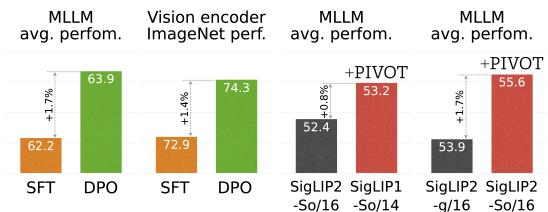  
Figure 1: TD;LR. We study how SFT and RL (e.g., DPO) affect not only MLLMs but also their vision encoders, and formulate a simple recipe, PIVOT, for evolv ing vision models for use in MLLM.

centric tasks, a finding that motivates a deeper investigation into the vision encoder itself. Subsequently, in Section 4 , we conduct a unique and critical analysis of the vision encoder, providing key insights for the visual encoder development. Our results reveal that MLLM post-training rewrites the visual representations, with RL driving stronger representation than SFT. The finding is supported by gradient visualizations that trace how optimization signals propagate to the vision encoder.

The foregoing analysis establishes that RL reshapes visual representations, motivating a critical question we explore in Section 5 : Can RL-trained models surpass SOTA vision modelsfor MLLM?. To this end, we re-formalize RL training as an auxiliary training process for vision encoder, termed Preference-Instructed Vision OpTimization (PIVOT), and evaluate its efficacy on diverse encoders, including CLIP (Radford et al. 2021), DINO (Oquab et al. 2024), and MAE (He et al. 2022). The results reveal a remarkable impact of PIVOT when the enhanced encoders are used within MLLMs; a vision model trained with PIVOT not only outperforms its original counterpart but also surpasses a substantially larger model (e.g., SigLIP2-So/16 + PIVOT > SigLIP2-g/16) and even a subsequentgeneration encoder (e.g., SigLIP1-So/142 + PIVOT > SigLIP2-So/16). Notably, this enhancement is achieved with just 18 hours of training on 8 H100 GPUs using a Qwen2.5-1.5B LLM-head. This amounts to fewer than 1% of GPUs of standard vision pre-training, with SigLIP2 trained on up to 2K TPUv5e chips. Taken together, the evidence indicates that even state-of-the-art encoders have substantial room for MLLM evolution, and PIVOT is a promising direction for future exploration.

## 2 MLLMS ON RL: WHERE DO WE STAND?

The initial paradigm for training LLMs involves auto-regressive pre-training followed by SFT to promote instruction-following capabilities (Radford et al. 2018; Dai et al. 2019; Yang et al. 2019; Brown et al. 2020). A subsequent breakthrough occurs with Reinforcement Learning from Human Feedback (RLHF), which demonstrates that utilizing RL to align LLM outputs with human preferences enables chat-oriented LLMs (Christiano et al. 2017; Ouyang et al. 2022; Touvron et al. 2023b). The use of RL has become a cornerstone of modern LLM development, with advanced methods like DPO (Rafailov et al. 2023) and GRPO (Shao et al. 2024) being widely implemented in recent models such as LLaMA-3 (Dubey et al. 2024) and Qwen-2.5 (Yang et al. 2025a).

MLLMs have adopted the LLM training advances to leverage prior experiences. Early MLLMs such as LLaVA-Next (Li et al. 2024b) and Cambrian (Tong et al. 2024a) combine a pre-trained LLM with a pre-trained vision model, then align the LLM to vision representation through SFT on vision language data like captioning and visual question answering. Recent works, as summarized in Table A, demonstrated that applying RL as an auxiliary process can further boost MLLM’s downstream performance (Yu et al. 2025; Wang et al. 2024b; Sun et al. 2024a). Other studies have proposed advanced DPO variants for multimodal contexts, for instance by incorporating visual preference data (Fu et al. 2025a; Wang et al. 2024a) or modifying the objective to mitigate hallucinations (Yu et al. 2024; Yang et al. 2025c). Further studies highlight RL’s advantages over SFT in adapting an

MLLM’s knowledge to specialized environments, such as map navigation (Chu et al. 2025) and robot action planning (Li et al. 2025b).

These studies reveal a clear trend in the application of RLHF to MLLMs. They rely on RL using either PPO (Sun et al. 2024a) or DPO, with the predominant choice becoming DPO (Yu et al. 2024; 2025; Wang et al. 2024a; Yang et al. 2025c; Fu et al. 2025a), as shown in Table A. In line with this trend, our main paper uses DPO as the primary RL representative for a controlled comparison with SFT. Results for other RL algorithms (PPO, GRPO (Shao et al. 2024)) and DPO variants (Wang et al. 2024b) are also presented in Section B.1.

## 3 HOW DO SFT AND RL AFFECT MLLMS?

Despite the advances of RL described in Section 2, existing studies lack a comprehensive analysis, offering limited insight and intuition into following questions: How do SFT and DPO affect MLLM on diverse VQA tasks?, Is DPO actually superior to SFT?, And does this trend hold with model scaling? To address them, we establish a controlled training setup and conduct a deep investigation.

## 3.1 EXPERIMENTAL SETUP & PREREQUISITE

Model scaling. The standard MLLM architecture, which integrates an LLM with a vision encoder via a multimodal projector, has proven effective, achieving superior performance on VL tasks (Liu et al. 2024a; Lei et al. 2025; Shukor et al. 2025). Our model is implemented using the popular open-source MLLM repository, LLaVA-OneVision (Li et al. 2025a). Following their setup, we conduct a study across various cases by adopting four scales of the Qwen2.5 LLM (0.5B, 1.5B, 3B, 7B) (Yang et al. 2025a) and four SigLIP2 384px sizes (B/16, L/16, So/16, g/16) (Tschannen et al. 2025), with a 2-layer MLP serving as the projector.

Training procedure. Our MLLM development process consists of two stages: Stage 1 pre-training and Stage 2 post-training. In Stage 1, we first align the visual and language embedding spaces by conducting multimodal projector-only training. And then, a base MLLM is established by training all model parameters on diverse VL datasets, including Visual Question Answering (VQA), visiongrounded dialogue, and image captioning (Li et al. 2025a). Stage 2 indicates post-training, which involves a full-parameter update of the base model according to SFT or DPO, detailed below. Further details, including hyperparameters, are included in Section E.1 and the source code3.

Post-training strategies. Our analysis compares two post-training approaches: SFT and DPO. Prior works like MPO (Wang et al. 2024b) typically focus on comparing a pre-trained model (Stage 1) against the same model further trained with DPO, which does not provide a fair evaluation of DPO versus SFT. On the other hand, we conduct a controlled comparison in Stage 2, using the same number of ‘image-query-response’ pairs across the two algorithms. Specifically, we define the post-training dataset as $\bar { X } _ { \mathrm { P T } } = \{ \bar { x } _ { 0 } , x _ { 1 } , \bar { . } . . , x _ { T } \}$ , with each element $x _ { i } = \{ I _ { i } , q _ { i } , y _ { i } ^ { c } , y _ { i } ^ { r } \}$ representing an image $I _ { i } ,$ a query $q _ { i } ,$ and the corresponding chosen and rejected responses yc and $y _ { i } ^ { r }$ . The optimization objectives using this dataset is defined as follows:

$$
L _ {\mathrm{SFT}} = - \mathbb {E} _ {i \sim X _ {\mathrm{PT}}} \log \pi_ {\theta} (y _ {i} ^ {c} \mid I _ {i}, q _ {i}); L _ {\mathrm{DPO}} = - \mathbb {E} _ {i \sim X _ {\mathrm{PT}}} \log \sigma \left(\beta \left(\log \frac {\pi_ {\theta} (y _ {i} ^ {c} | I _ {i} , q _ {i})}{\pi_ {\mathrm{ref}} (y _ {i} ^ {c} | I _ {i} , q _ {i})} - \log \frac {\pi_ {\theta} (y _ {i} ^ {r} | I _ {i} , q _ {i})}{\pi_ {\mathrm{ref}} (y _ {i} ^ {r} | I _ {i} , q _ {i})}\right)\right)\tag{1}
$$

where $\pi _ { \theta }$ represents the MLLM; $\pi _ { \mathrm { r e f } }$ is the reference model; and β is the temperature controlling the strength of preference alignment. In short, we compare SFT (Stage 2) with DPO (Stage 2) with the same number of training samples. A more detailed description is given in Section D.1.

Data & Evaluation. To ensure reproducibility, we utilize publicly available datasets provided in the LLaVA-OneVision and MPO repositories. To be more specific, in Stage 1, we apply projectoronly pre-training on the LAION/CC/SBU-558K dataset (Liu et al. 2024a) and perform end-to-end pre-training on the LLaVA-OneVision-3.2M dataset (Li et al. 2025a). As the post-training dataset $X _ { \mathrm { p t } }$ in Stage 2, we utilize the MPO (Wang et al. 2024b) data and randomly sample 20K instances, a scale comparable to recent DPO studies for MLLMs (Yu et al. 2024; Yang et al. 2025c). It is worth noting that this two-stage strategy and the proportion of training data closely resemble the training paradigm of LLMs such as InstructGPT (Ouyang et al. 2022), where RLHF is applied after instruction-following pre-training. For evaluation, we adapt the benchmark suite introduced in Cambrian, which covers 16 tasks across four categories of VQA: General, Knowledge, OCR & Chart, and Vision-Centric. This provides a broader and more common comparison than prior studies that mainly focus only on vision (Yang et al. 2025c; Fu et al. 2025b) or specialized tasks (Chu et al. 2025).

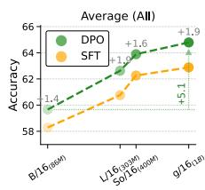

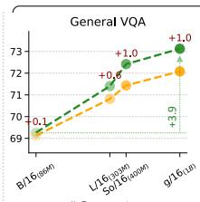

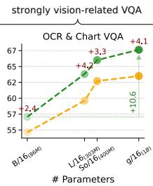

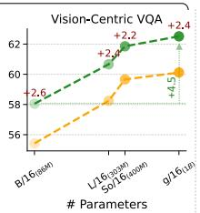

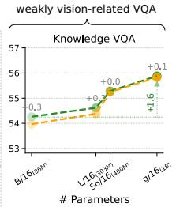  
Figure 2: Scaling the vision encoder in MLLMs. We analyze the impact of the vision encoder sizes, ranging from 86M (B/16) to 1B (g/16) parameters, in Qwen2.5-3B combined with SigLIP2 on vision–language benchmarks. Interestingly, DPO yields particularly stronger gains over SFT in vision-intensive VQA.

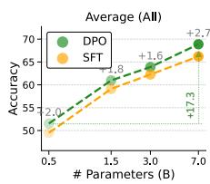

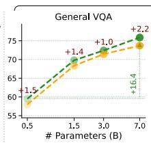

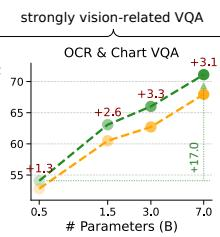

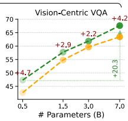

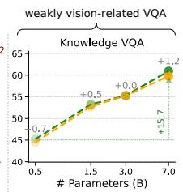  
Figure 3: Scaling the language model in MLLMs. Using SigLIP2-So/16 as the vision encoder, we vary the language model size (Qwen2.5) and evaluate performance. Consistent with Figure 2, DPO substantially outperforms SFT on vision-related tasks, while they show comparable results in the Knowledge VQA.

## 3.2 ANALYSIS AND FINDINGS

We compare the performance of MLLMs trained with two post-training approaches across different model scales. First, Figure 2 reports results as the vision model, SigLIP2, scales from 86M to 1B, with the language model fixed to Qwen2.5-3B. Next, Figure 3 shows performances as the language model size increases from 0.5B to 7B, while keeping the vision encoder fixed to SigLIP2-So/16.

Before comparing SFT and DPO, we analyze the impacts of model scaling on MLLM benchmarks. As shown in Figure 2, the performance improves with the size of the vision encoder, confirming the importance of the visual representation capacity within MLLMs. Replacing SigLIP2-B/16 with SigLIP2-g/16 encoder yields significantly better performance on strongly vision-related tasks. For the DPO-tune MLLM, the gap between the B/16 and g/16 models reaches +4.5%p in Vision-Centric and strikingly +10.6%p in OCR & Chart VQA. In contrast, the improvement is relatively minor at +1.9%p in the weakly vision-related task, Knowledge VQA. These results show that the vision model plays a crucial role in vision-related tasks, even though the language model scaling in Figure 3 exhibits a large performance gap.

Finding 1: Increasing the capacity of the vision encoder in MLLMs is particularly important for tasks requiring fine-grained visual understanding.

A central focus of our analysis is the comparative efficacy of DPO and SFT for MLLM post-training. The results in Figure 2 show that DPO achieves a superior performance compared to SFT, particularly on tasks that require deep visual comprehension rather than those primarily relying on the LLM’s knowledge. For instance, on Knowledge VQA benchmarks such as ScienceQA (Lu et al. 2022) and MathVista (Lu et al. 2023), where models rely on scientific or mathematical backgrounds in LLMs, the improvement is only marginal (e.g., +0.3%p). On the other hand, DPO’s superiority becomes evident in strongly vision-related benchmarks like ChartQA (Masry et al. 2022), DocVQA (Mathew et al. 2021), MMVP (Tong et al. 2024b), and CV-bench (Tong et al. 2024a). Quantitatively, with the SigLIP2-L/16, DPO builds a model with +4.2%p and +2.4%p higher performance on OCR & Chart VQA and Vision-Centric VQA, respectively.

The trend of DPO’s superiority holds firm even when scaling the language model, as shown in Figure 3. Even as the language model’s size increases, the DPO-tuned MLLM consistently surpasses the SFT model, maintaining significant gaps of +3.1%p in OCR & Chart VQA and +4.2%p in Vision-Centric VQA with SigLIP2-g/16. It highlights the superiority of DPO, particularly on tasks requiring detailed visual understanding, and further implies that preference alignment impacts the model’s visual processing capabilities, beyond the language model. This observation motivates an in-depth analysis of visual representation in MLLMs.

Finding 2: Preference alignment (DPO) produces MLLMs with superior performance to SFT, especially on strongly vision-related tasks.

As a final analysis, we investigate the effect of data scaling on the Stage 2 post-training. The training data is scaled from 3K to 40K, whereas the model sizes are fixed to Qwen2.5-1.5B and SigLIP2-So/16. The results are shown in Figure 4. While SFT’s performance improves gradually with more data, DPO achieves high performance rapidly, even with a small number of samples. We also observe that a DPO-trained model outperforms an SFT-trained counterpart even with a data disadvantage. For example, DPO with 3K samples achieves a score of 60.4%p, surpassing the 59.5%p score of an SFT model trained on 40K samples. Additional results, including performance on distinct domains, are in Section C.1.

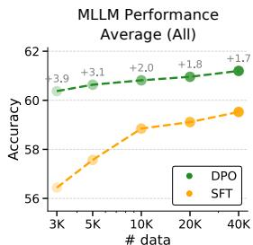  
Figure 4: Impact of data scales on MLLM tasks.

## 4 HOW DOES MLLM TRAINING AFFECT VISUAL REPRESENTATIONS?

The previous section demonstrates DPO’s superiority over SFT on MLLM benchmarks, with impressive gains on vision-related tasks. The finding suggests that DPO impacts not only the language module but the model’s visual processing capabilities. Several studies have investigated the vision encoder in MLLMs, focusing primarily on architectural adjustments such as enabling vision encoder updates (Bai et al. 2025; Li et al. 2024b), applying all image grids (Li et al. 2025a; Marafioti et al. 2025), and utilizing multiple vision encoders (Tong et al. 2024b;a). In this section, we move beyond these approaches to conduct a deeper analysis of the vision encoder within MLLMs. To the best of our knowledge, this is the first work to conduct an in-depth analysis of the vision encoder in MLLMs.

## 4.1 EXPERIMENTAL SETUP

We begin with the MLLMs used in Section 3, which are trained with Stage 1 pre-training and either SFT or DPO Stage 2 post-training. After separating the vision components from the MLLM (i.e., detach the vision encoder and projector), we assess their standalone performance on classic vision tasks, including ImageNet classification and semantic segmentation. Performance is measured using image features generated from the vision encoder, or from the combined encoder-projector. In this analysis, we disentangle the impact on the visual representations by isolating the vision encoder from the LLM. More details are available in Section E and the source code.

## 4.2 EVALUATING VISION ENCODERS BEYOND MLLM BENCHMARKS

ImageNet Classification. We conduct model scaling experiments on ImageNet classification, performing a linear-probe evaluation with the features extracted from the visual components. Note that the features are originally used as the visual token inputs in the MLLM. As shown in Figure 6, our investigation highlights the following key points. (i) The MLLM post-training actually reshapes the visual representations. (ii) DPO consistently outperforms SFT in the vision-only benchmark. DPO outperforms SFT in ImageNet Top-1 accuracy by +1.83%p for SigLIP2- So/16 coupled with a Qwen-3B head, and by +1.96%p for SigLIP2-L/16 with a Qwen-1.5B head. We claim this as a novel finding: DPO—a prevalent RL method in the LLM community (Yang et al. 2025b; Dubey et al. 2024)—is more effective than SFT, not only for aligning LLMs but also for learning visual representations. (iii) MLLM training with larger LLMs yields a high-performing vision encoder. For instance, when trained on DPO, the SigLIP2-So/16 coupled with a 7B LLM exhibits a +4.4%p increase in ImageNet accuracy compared to when coupled with a 0.5B LLM. It supports the hypothesis that larger-capacity LLMs provide more informative optimization signals to the vision encoder.

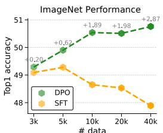  
# data Figure 5: Impact of data scales on ImageNet.

Additionally, we investigate how the data scale of Stage 2 post-training affects visual representations, using the MLLM architecture described in Section 3 (Qwen2.5-1.5B and SigLIP2-So/16). The results in Figure 5 show a notable difference from those observed in Figure 4. While performance on MLLM

Scaling LLM in MLLM (Eval. with SigLIP2-So/16) Scaling LLM in MLLM (Eval. with SigLIP2-So/16)

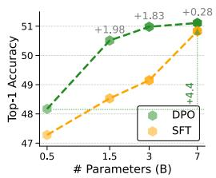

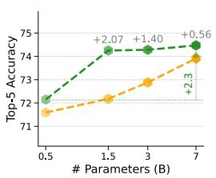

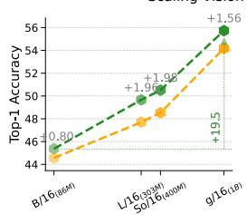

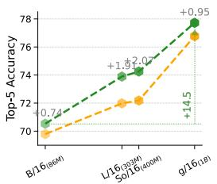  
Figure 6: ImageNet accuracy of vision encoder. MLLM post-training is conducted with either SFT or DPO, then the vision encoder is detached from LLM and its vision-only performance evaluated via linear probing. We scale the LLM with a fixed SigLIP2-So/16 (left), or the vision encoder with a fixed Qwen2.5-1.5B (right).

q What is the woman with the coat holding in her hand?  
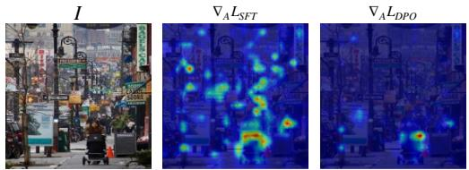  
yc The woman with the coat is holding a baby stroller in her hand. This suggests that she may be caring for an infant or toddler.

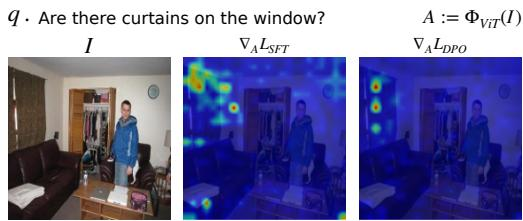  
c Yes, there are curtains on the window. The curtains appea to be patterned with a oral design.  
yr . The woman in the coat is holding a baby stroller in her hand. The stroller appears to be empty, suggesting that she may not have a child with her at the moment .  
yr Yes, there are curtains on the window. The curtains appear to be white and provide a contrasting color to the room's overall decor.

Figure 7: Gradient visualization. Using Grad-CAM (Selvaraju et al. 2017), we visualize the gradient signals received by the vision encoder features $( \bar { A } : = \Phi _ { V E } ( I ) )$ under MLLM post-training strategies. We observe that the gradient signals from DPO align more strongly with question-relevant regions than those from SFT.

benchmarks improves for both SFT and DPO with more data, only DPO benefits from data scaling in the quality of visual representation. This finding suggests that the choice of MLLM training strategy fundamentally alters how the model sees an image.

Finding 3: MLLM training not only adapts the language model but also reshapes the visual representations that determine how the model sees an image.

Gradient Visualization. To understand DPO’s effectiveness on vision, we investigate how DPO differs in the gradient signals to the vision encoder compared to SFT in the post-training stage. We use Grad-CAM (Selvaraju et al. 2017): we compute the loss for a specific sample xi as defined in Equation (1) and perform a backward pass with the sample loss. During the backward pass, we obtain the gradients with respect to the feature activations of the vision encoder, measure the gradient magnitude of each token, and visualize the results. Interestingly, as shown in Figure 7, large gradients primarily occur in question-relevant regions, supporting Finding 3. Moreover, the SFT signal tends to be scattered, while the signal from DPO is precisely focused on semantically relevant regions. We hypothesize that the contrastive nature of the DPO objective enables fine-grained gradient signals for the visual representations when differentiating between chosen and rejected responses. Additional results are available in Section C.4.

Image Segmentation. Assuming that DPO enhances the fine-grained training of visual representations, we expect it to be connected with improved localization ability. To measure the localization ability, we perform segmentation probing evaluation with the ADE20K (Zhou et al. 2017) dataset, following the protocol of Covert et al. (2025). First, we utilize MLLM-tuned vision encoders from Section 3. Then, we freeze the vision encoder and attach a two-layer MLP, training it as a patch-level classifier for segmentation. We utilize various vision encoders, based on CLIP (Radford et al. 2021), SigLIP1 (Zhai et al. 2023), and SigLIP2 (Tschannen et al. 2025), all of which are tuned with either SFT or DPO using a Qwen-1.5B LLM. The results in Figure 8 show that the MLLM-tuned vision encoder with DPO consistently outperforms those with SFT on segmentation task; for example, DPO-tuned yields a 1.08%p increase in patch-level recall when using a CLIP-L/14 336px encoder. The superiority of DPO is also supported by the qualitative results in Figure 9 and Figure G, showing DPO-tuned vision encoders generate segmentation maps with closer alignment with the ground truth.

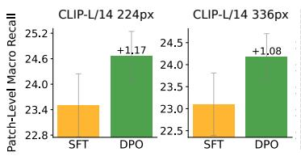

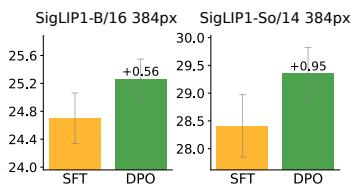

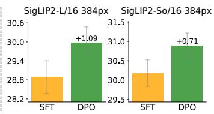

Figure 8: Segmentation probing results. We evaluate segmentation performance via two-layer MLP probing across 6 encoders, each MLLM-trained with a Qwen2.5-1.5B LLM head. The y-axis shows the mean patch-level recall over six random seeds. DPO consistently outperforms over SFT, with the gain shown above the DPO bar.  
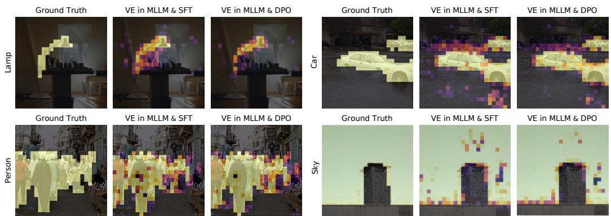  
Figure 9: Qualitative results of segmentation. We visualize results from probing on the CLIP-L/14 336px encoder, post-trained with SFT and DPO in MLLMs. The DPO-trained vision encoder (VE) yields more accurate segmentation maps that closely align with the ground truth. More results are in Figure G.

Finding 4: DPO steers the vision encoder toward a more fine-grained analysis of visual information, improving its object localization capabilities.

Vision & Language alignment. Huh et al. (2024) proposed a representation alignment metric to evaluate representation similarity between models trained on different modalities, such as vision and language; typically, larger and stronger vision models show higher alignment with LLMs. We adopt this metric to evaluate the representations of a vision encoder. As shown in Figure 10, vision encoders trained with DPO show stronger alignment scores. Additionally, pairing with a larger LLM leads to consistently higher alignment scores, which supports our aforementioned hypothesis that larger LLMs transmit more useful signals to the vision encoder during backpropagation.

Finding 5: The vision encoder benefits from a larger LLM, which provides more informative backward signals for visual representation within an MLLM.

## 5 WHAT’S NEXT: UNLOCKING VISION MODEL POTENTIAL VIA RL

Our analysis has shown that training a vision model with an LLM via DPO builds more fine-grained visual representations than SFT. We now reframe this training process into an effective strategy for evolving vision models, which we term Preference-Instructed Vision OpTimization (PIVOT). In this section, we apply PIVOT to existing vision models that are widely adopted as vision encoders in MLLMs. These include encoders pretrained with image-language supervision4 (e.g., CLIP and SigLIP) or with vision-only self-supervision (e.g., MAE (He et al. 2022) and DINOv2 (Oquab et al. 2024)). Our objective is to investigate how much these vision models can be improved by PIVOT for use in MLLM.

## 5.1 EXPERIMENTAL SETUP

The process begins with a vision encoder commonly used in MLLMs, such as CLIP and SigLIP1. The encoder is attached to an LLM and optimized through both pre-training and post-training with DPO or SFT—on 3M instruction-following samples and 20K preference pairs, as described in Section 3.1.

Reference LLM in Kernel Alignment Metrix

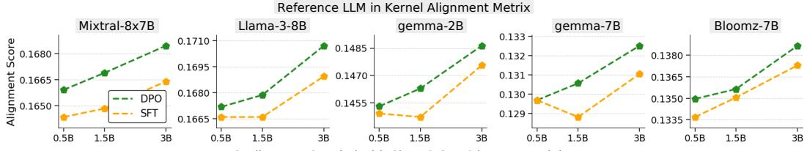  
Scaling LLM Coupled with SigLIP2-So/16 in MLLM Training  
Figure 10: representational alignment. We measure alignment (Huh et al. 2024) between reference LLMs and vision encoders trained within MLLMs. SigLIP2-So/16, paired with three different LLM scales (x-axis), is trained with DPO or SFT and then used to compute alignment scores against five reference LLMs.

We refer to this training procedure as PIVOT. Afterward, the vision encoder is detached from the LLM, its weights are frozen, and the resulting model is termed the PIVOT-enhanced encoder. We evaluate the performance of PIVOT-enhanced encoder by combining it with Qwen2.5-1.5B and build an MLLM. The combined model is optimized with projector-only pretraining on LAION/CC/SBU-558K (Liu et al. 2024a), followed by instruction finetuning of the projector and LLM on Cambrian’s 737K dataset. This design allows us to isolate the encoder’s capability and assess the effectiveness of PIVOT representations within MLLMs. Note that we follow the same evaluation protocol as prior works such as Cambrian (Tong et al. 2024a), DINO-MLLM (Fan et al. 2025), and MLLM-data (Han et al. 2025), which has been demonstrated to allows us to study visual representations efficiently. More details are in Figure E.

The idea of PIVOT is simple yet effective: training vision models with LLM-head using DPO. We highlight the contributions of PIVOT: (i) positioning PIVOT not as a new method, but as an under-explored training regime. (ii) showing that it can develop significantly better MLLMs than those using original vision models, revealing substantial room for improvement in state-of-the-art vision models. (iii) presenting the first evidence that DPO reshapes visual features with more positive effects than SFT on standard vision benchmarks as well as on multimodal tasks.

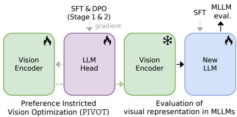  
Figure 11: Evaluation setup for the PIVOTenhanced vision encoder within MLLMs.

## 5.2 RESULTS

The results are presented in Table 1. In the following, we describe the main comparisons in detail. SigLIP1 → SigLIP2. We compare an MLLM using the original SigLIP2 encoder against a PIVOTenhanced SigLIP1. SigLIP2 is a more recent model, developed with substantially larger datasets and an advanced training scheme compared to its predecessor. An MLLM leveraging the SigLIP2-So/16 encoder achieves an average VQA score of 52.4%p. However, by enhancing SigLIP1-So/14 with the PIVOT process, we obtain an MLLM that achieves an average VQA score of 53.2%p, surpassing those with SigLIP2-So/16.

SigLIP2–So/16 → SigLIP2-g/16. SigLIP2-g/16 is considered to have the strongest representations in its family due to its large scale. We compare its MLLM performance against a PIVOT-enhanced SigLIP2-So/16. Despite having 2.5 times fewer parameters, the So/16 model outperforms the g/16 model, achieving a score of 55.6%p versus 53.9%p. This shows the considerable potential for enhancing popular vision backbones for optimal performance within MLLMs.

DPO vs. SFT on PIVOT. In Section 4, we show that DPO during post-training benefits even vision encoders within MLLM. Similarly, a vision encoder enhanced by DPO (i.e., PIVOT) provides a 1.3%p advantage over one enhanced with SFT (56.7%p vs. 55.4%p) in the MLLM application when using SigLIP2-g/16. Here, SFT can be seen as similar to the language alignment of (Bolya et al. 2025). This result indicates that DPO’s advantage over SFT continues in the context of PIVOT. Thus, we adopt DPO as the default choice for PIVOT.

Classic vision encoders + PIVOT. We investigate the effect of PIVOT on diverse vision encoders and find that all five models improve MLLM performance. An interesting observation is that this improvement holds not only for vision-only self-supervised models such as MAE (He et al. 2022)

<table><tr><td colspan="4">Evolving vision encoder for MLLM applications</td><td colspan="5">MLLM combining the vision encoder with Qwen2.5-1.5B</td></tr><tr><td>Model</td><td>Size</td><td># Params</td><td># Samples seen</td><td>Average (All)</td><td>General</td><td>OCR&amp;Chart</td><td>Vision-Cent.</td><td>Knowledge</td></tr><tr><td>SigLIP 1 (2023)</td><td>So400m</td><td>400M</td><td>30B</td><td>50.9</td><td>65.4</td><td>42.3</td><td>49.8</td><td>46.0</td></tr><tr><td>+ SFT</td><td></td><td></td><td>30B + 0.003B</td><td>52.2</td><td>66.5</td><td>45.2</td><td>50.8</td><td>46.3</td></tr><tr><td>+ PIVOT</td><td></td><td></td><td>30B + 0.003B</td><td>53.2</td><td>67.7</td><td>46.8</td><td>51.7</td><td>46.6</td></tr><tr><td>SigLIP 2 (2025)</td><td>So400m</td><td>400M</td><td>40B</td><td>52.4</td><td>66.2</td><td>46.6</td><td>50.6</td><td>46.1</td></tr><tr><td>+ SFT</td><td></td><td></td><td>40B + 0.003B</td><td>54.6</td><td>66.9</td><td>52.2</td><td>51.7</td><td>47.7</td></tr><tr><td>+ PIVOT</td><td></td><td></td><td>40B + 0.003B</td><td>55.6</td><td>68.1</td><td>53.9</td><td>52.4</td><td>48.1</td></tr><tr><td>SigLIP 2 (2025)</td><td>giant</td><td>1000M</td><td>40B</td><td>53.9</td><td>66.5</td><td>50.8</td><td>51.9</td><td>46.4</td></tr><tr><td>+ SFT</td><td></td><td></td><td>40B + 0.003B</td><td>55.4</td><td>67.4</td><td>52.8</td><td>53.1</td><td>48.5</td></tr><tr><td>+ PIVOT</td><td></td><td></td><td>40B + 0.003B</td><td>56.7</td><td>68.5</td><td>54.7</td><td>54.2</td><td>49.3</td></tr><tr><td colspan="9">Classical vision encoders</td></tr><tr><td>Model</td><td>Size</td><td># Params</td><td># Samples seen</td><td>Average (All)</td><td>General</td><td>OCR&amp;Chart</td><td>Vision-Cent.</td><td>Knowledge</td></tr><tr><td>CLIP (2021)</td><td>large</td><td>303M</td><td>32B</td><td>46.3</td><td>62.1</td><td>35.1</td><td>43.0</td><td>45.0</td></tr><tr><td>+ PIVOT</td><td></td><td></td><td>32B + 0.003B</td><td>49.5</td><td>64.6</td><td>37.8</td><td>48.6</td><td>47.1</td></tr><tr><td>DINOv2 (2024)</td><td>giant</td><td>1000M</td><td>2B</td><td>40.9</td><td>58.4</td><td>17.6</td><td>45.1</td><td>42.6</td></tr><tr><td>+ PIVOT</td><td></td><td></td><td>2B + 0.003B</td><td>43.6</td><td>62.1</td><td>18.7</td><td>49.2</td><td>44.3</td></tr><tr><td>MAE (2022)</td><td>huge</td><td>632M</td><td>2B</td><td>36.8</td><td>47.6</td><td>17.3</td><td>40.2</td><td>42.0</td></tr><tr><td>+ PIVOT</td><td></td><td></td><td>2B + 0.003B</td><td>39.7</td><td>52.5</td><td>18.2</td><td>43.3</td><td>44.6</td></tr><tr><td>MOCO (2020)</td><td>base</td><td>86M</td><td>1.4B</td><td>35.3</td><td>42.5</td><td>17.1</td><td>39.6</td><td>42.1</td></tr><tr><td>+ PIVOT</td><td></td><td></td><td>1.4B + 0.003B</td><td>37.5</td><td>47.4</td><td>17.6</td><td>41.0</td><td>44.1</td></tr><tr><td>ImageNet-Sup (2021)</td><td>huge</td><td>632M</td><td>N/A</td><td>35.5</td><td>44.6</td><td>17.2</td><td>38.2</td><td>42.1</td></tr><tr><td>+ PIVOT</td><td></td><td></td><td>N/A</td><td>37.7</td><td>47.3</td><td>18.1</td><td>40.3</td><td>45.1</td></tr><tr><td colspan="9">Model ensemble (Tong et al. 2024b)</td></tr><tr><td>Model</td><td></td><td></td><td># Params</td><td>Average (All)</td><td>General</td><td>OCR&amp;Chart</td><td>Vision-Cent.</td><td>Knowledge</td></tr><tr><td>SigLIP 1-So400m+ DINOv2-L</td><td></td><td></td><td>700M</td><td>49.4</td><td>64.5</td><td>41.5</td><td>46.5</td><td>45.1</td></tr><tr><td>SigLIP 1-So400m+ ConvNeXt-XXL</td><td></td><td></td><td>1.25B</td><td>51.4</td><td>65.9</td><td>44.6</td><td>49.1</td><td>45.9</td></tr><tr><td>SigLIP 1-So400m $_{PIVOT}$ + ConvNeXt-XXL</td><td></td><td></td><td>1.25B</td><td>53.6</td><td>67.3</td><td>48.5</td><td>52.5</td><td>46.0</td></tr></table>

Table 1: Influence of PIVOT on existing vision models. We apply PIVOT to reveal the potential for improving existing vision models for MLLMs. Following the setup in Section 3.1, vision model is trained with a Qwen2.5- 1.5B LLM-head on 3M samples, and then finetuned with either SFT (+ SFT) or DPO (+ PIVOT) on 20K data. ‘# samples seen’ refers number samples used for whole training as in Cherti et al. (2023); Zhai et al. (2023).

and MOCO (He et al. 2020), but also for the supervised encoder (Dosovitskiy et al. 2021) trained solely with an image classification loss on the ImageNet dataset.

Model ensemble. The idea of model ensemble utilizing multiple vision encoders for a single MLLM has been explored in prior works (Tong et al. 2024b;a). The experiments show that combining SigLIP1- So/14 and ConvNeXt-XXL increases the average score from 50.9%p to 51.4%p, although it requires a greater number of parameters. We show that SigLIP1-So/14+ PIVOT alone achieves a superior score of 53.2%p without increasing parameters. Furthermore, combining this SigLIP1+ PIVOT with ConvNeXt-XXL results in an additional performance gain, reaching a score of 53.6%p.

Finding 6: Existing vision models possess substantial potential for improvement within MLLMs, which can be unlocked by PIVOT.

We provide additional experimental results in Section B.7, including the impact of training data scale and different usage strategies for the PIVOT-enhanced projector.

## 6 CONCLUSION

In this work, we investigated the differential impacts of SFT and RL on both MLLMs and their vision encoders. Our experiments first demonstrated that DPO, a form of RL, achieves superior MLLM performance over SFT, particularly on tasks requiring detailed visual comprehension. A subsequent, focused analysis of the vision encoder revealed that DPO induces stronger and more localized visual features. We then consolidated these findings into PIVOT, a practical recipe, and validated its efficacy across a diverse range of vision encoders. We hope this research contributes to the broader goal of enabling MLLMs to better perceive and interpret visual information.

Beyond our main paper, the supplementary material contains additional analyses, including other RL algorithms (PPO, GRPO, and MPO) vs. SFT (Section B.1), more SFT-friendly settings(Section B.4), text-only benchmarks (Section B.6), and PIVOT ablations(Section B.7).

## ACKNOWLEDGMENTS

We thank NAVER AI Lab for its generous support. We are also grateful to Heejin Do, Hyesong Choi, Taekyung Kim, and Jaehui Hwang for their valuable feedback. This work was also supported by Institute of Information & communications Technology Planning & Evaluation (IITP) grant funded by the Korea government(MSIT) (RS-2022-00143911, AI Excellence Global Innovative Leader Education Program).

## REFERENCES

Josh Achiam, Steven Adler, Sandhini Agarwal, Lama Ahmad, Ilge Akkaya, Florencia Leoni Aleman, Diogo Almeida, Janko Altenschmidt, Sam Altman, Shyamal Anadkat, et al. Gpt-4 technical report. arXiv preprint arXiv:2303.08774, 2023. 1, 18

Mohammad Gheshlaghi Azar, Zhaohan Daniel Guo, Bilal Piot, Remi Munos, Mark Rowland, Michal Valko, and Daniele Calandriello. A general theoretical paradigm to understand learning from human preferences. In International Conference on Artificial Intelligence and Statistics. PMLR, 2024. 18

Jinze Bai, Shuai Bai, Yunfei Chu, Zeyu Cui, Kai Dang, Xiaodong Deng, Yang Fan, Wenbin Ge, Yu Han, Fei Huang, et al. Qwen technical report. arXiv preprint arXiv:2309.16609, 2023a. 18, 30

Jinze Bai, Shuai Bai, Shusheng Yang, Shijie Wang, Sinan Tan, Peng Wang, Junyang Lin, Chang Zhou, and Jingren Zhou. Qwen-vl: A versatile vision-language model for understanding, localization, text reading, and beyond. arXiv preprint arXiv:2308.12966, 2023b. 1, 18

Shuai Bai, Keqin Chen, Xuejing Liu, Jialin Wang, Wenbin Ge, Sibo Song, Kai Dang, Peng Wang, Shijie Wang, Jun Tang, et al. Qwen2. 5-vl technical report. arXiv preprint arXiv:2502.13923, 2025. 5, 18

Hangbo Bao, Li Dong, Songhao Piao, and Furu Wei. Beit: Bert pre-training of image transformers. In ICLR, 2022. 18

Daniel Bolya, Po-Yao Huang, Peize Sun, Jang Hyun Cho, Andrea Madotto, Chen Wei, Tengyu Ma, Jiale Zhi, Jathushan Rajasegaran, Hanoona Rasheed, Junke Wang, Marco Monteiro, Hu Xu, Shiyu Dong, Nikhila Ravi, Daniel Li, Piotr Dollár, and Christoph Feichtenhofer. Perception encoder: The best visual embeddings are not at the output of the network, 2025. URL https: //arxiv.org/abs/2504.13181. 8, 19, 29

Tom Brown, Benjamin Mann, Nick Ryder, Melanie Subbiah, Jared D Kaplan, Prafulla Dhariwal, Arvind Neelakantan, Pranav Shyam, Girish Sastry, Amanda Askell, et al. Language models are few-shot learners. NeurIPS, 2020. 1, 2, 18

Mathilde Caron, Ishan Misra, Julien Mairal, Priya Goyal, Piotr Bojanowski, and Armand Joulin. Unsupervised learning of visual features by contrasting cluster assignments. In NeurIPS, 2020. 18

Mathilde Caron, Hugo Touvron, Ishan Misra, Hervé Jégou, Julien Mairal, Piotr Bojanowski, and Armand Joulin. Emerging properties in self-supervised vision transformers. In ICCV, 2021. 18

Liang Chen, Lei Li, Haozhe Zhao, Yifan Song, and Vinci. R1-v: Reinforcing super generalization ability in vision-language models with less than \$3. https://github.com/Deep-Agent/ R1-V, 2025. 20

Ting Chen, Simon Kornblith, Mohammad Norouzi, and Geoffrey Hinton. A simple framework for contrastive learning of visual representations. In ICML, 2020. 18

Xinlei Chen and Kaiming He. Exploring simple siamese representation learning. In CVPR, 2021. 18

Xinlei Chen, Hao Fang, Tsung-Yi Lin, Ramakrishna Vedantam, Saurabh Gupta, Piotr Dollár, and C Lawrence Zitnick. Microsoft coco captions: Data collection and evaluation server. arXiv preprint arXiv:1504.00325, 2015. 23